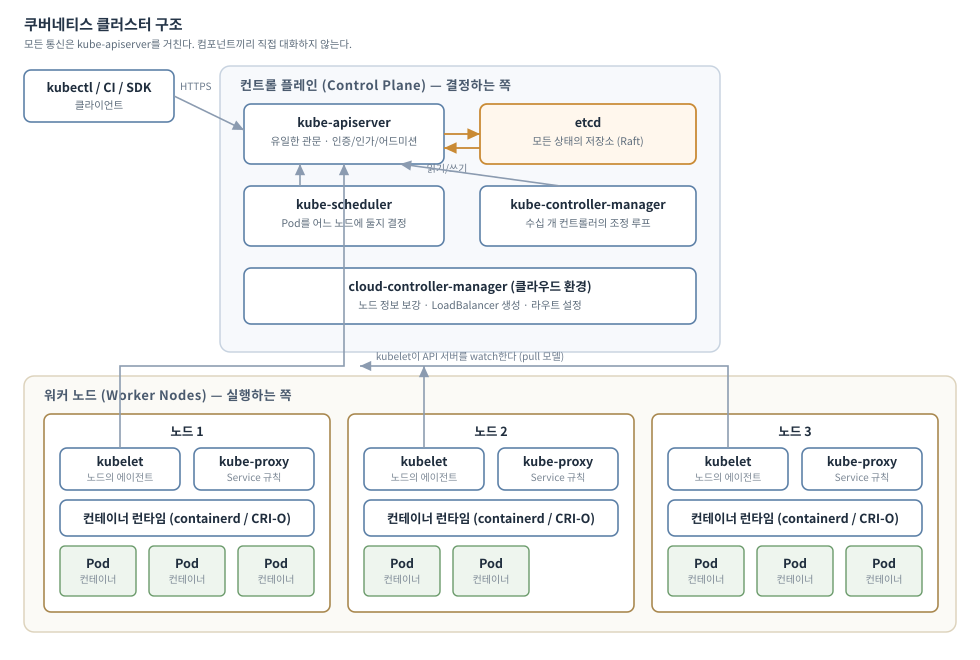
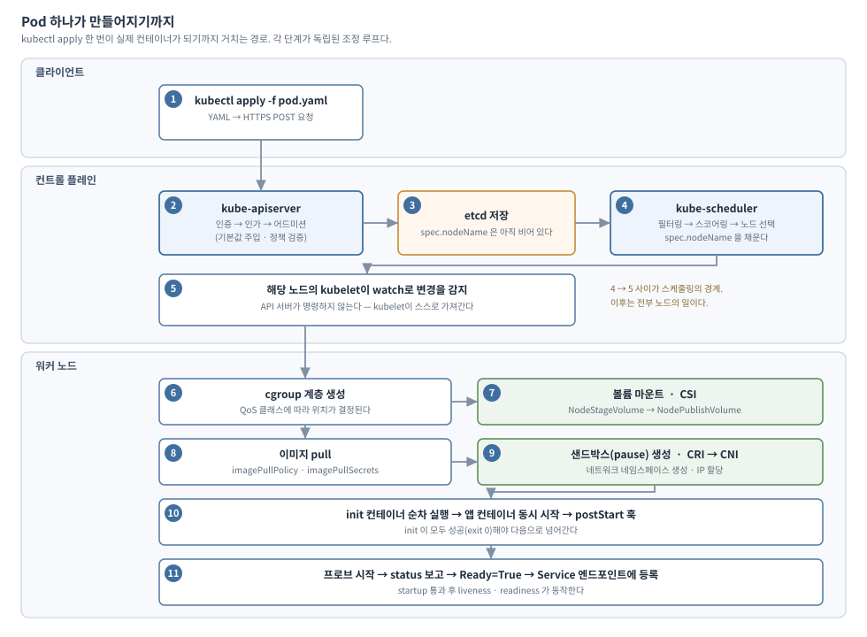
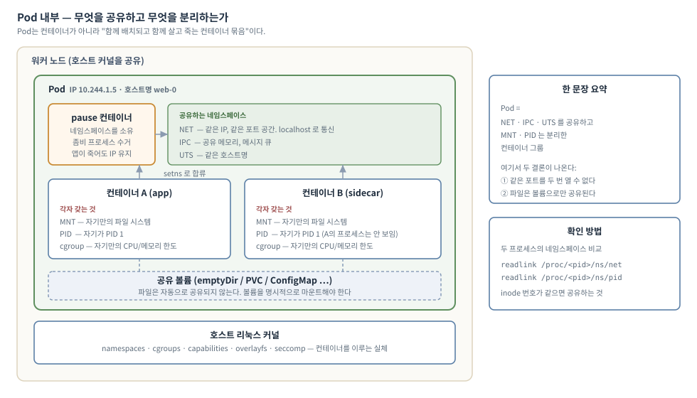
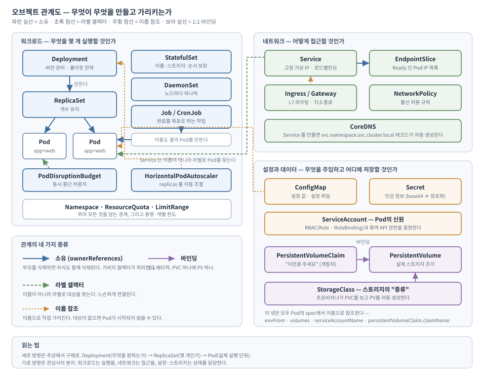
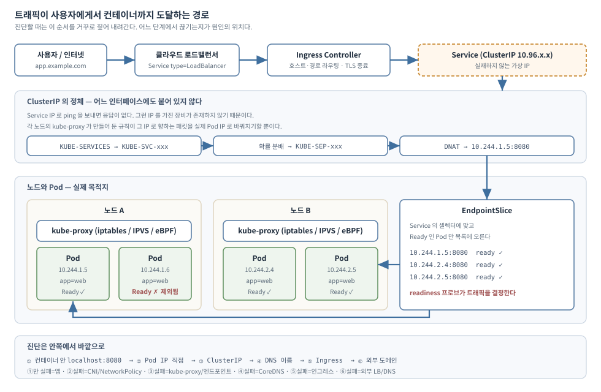
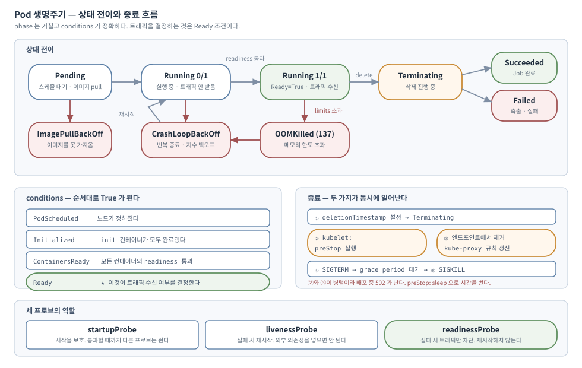

# 부록 B. 쿠버네티스 아키텍처 도해

> 본문 각 장에서 나눠 설명한 구조를 그림 중심으로 다시 모았다.
> 처음 읽는 사람은 이 부록부터 봐도 좋고, 전체를 읽은 뒤 정리용으로 봐도 좋다.

---

## B.1 클러스터는 어떻게 생겼는가



### 두 덩어리로 나뉜다

쿠버네티스 클러스터는 **결정하는 쪽**과 **실행하는 쪽**으로 나뉜다.

| | 컨트롤 플레인 | 워커 노드 |
|---|---|---|
| 역할 | 무엇을 어디에 둘지 **결정** | 실제로 컨테이너를 **실행** |
| 구성 | apiserver, etcd, scheduler, controller-manager | kubelet, kube-proxy, 컨테이너 런타임 |
| 죽으면 | 새 변경이 반영되지 않는다 | 그 노드의 Pod가 다른 노드로 옮겨간다 |

> **중요한 성질**: 컨트롤 플레인이 완전히 죽어도 **이미 실행 중인 Pod는 계속 서비스한다.** kube-proxy가 만들어 둔 규칙이 노드에 남아 있고, kubelet이 로컬 상태로 컨테이너를 관리하기 때문이다. 새 배포나 스케일링만 멈춘다. (→ 22.4절)

### 다섯 컴포넌트를 한 줄로

| 컴포넌트 | 한 줄 설명 | 위치 | 상세 |
|---|---|---|---|
| **kube-apiserver** | 클러스터의 유일한 정문. 모든 요청이 여기를 지난다 | 컨트롤 플레인 | 21.1절 |
| **etcd** | 모든 상태를 저장하는 분산 KV 스토어. 이것을 잃으면 클러스터를 잃는다 | 컨트롤 플레인 | 22장 |
| **kube-scheduler** | 노드가 정해지지 않은 Pod를 보고 배치할 곳을 계산한다 | 컨트롤 플레인 | 15장 |
| **kube-controller-manager** | 수십 개 컨트롤러가 각자 조정 루프를 돈다 | 컨트롤 플레인 | 21.3절 |
| **cloud-controller-manager** | 클라우드 API 연동 (LB 생성, 노드 라벨링) | 컨트롤 플레인 | 21.5절 |
| **kubelet** | 노드의 에이전트. PodSpec을 실제 컨테이너로 만든다 | 워커 노드 | 20장 |
| **kube-proxy** | Service의 가상 IP를 실제 Pod IP로 바꾸는 규칙을 관리 | 워커 노드 | 9.5절 |
| **컨테이너 런타임** | containerd/CRI-O. 실제로 컨테이너를 띄운다 | 워커 노드 | 2.5절 |

### 통신 규칙 두 가지

**① 모든 통신은 API 서버를 경유한다**

스케줄러가 kubelet에게 직접 명령하지 않는다. 컨트롤러끼리도 대화하지 않는다.

```
스케줄러 → (API 서버) → etcd
kubelet  → (API 서버) → 자기 노드의 Pod 목록을 watch
```

이 설계 덕분에 **인증·인가·감사를 한 곳에서** 처리할 수 있고, 컴포넌트를 독립적으로 교체할 수 있다.

**② kubelet은 pull 모델이다**

API 서버가 "이 Pod를 띄워라"라고 명령하지 않는다. **kubelet이 API 서버를 watch하다가 자기 노드에 할당된 Pod를 발견하고 스스로 가져간다.**

그래서 API 서버가 잠시 죽어도 노드는 하던 일을 계속한다.

---

## B.2 요청 하나가 컨테이너가 되기까지



### 세 개의 경계

이 흐름에는 성격이 다른 세 구간이 있다.

```
[1~3] 요청이 저장되기까지        — API 서버의 일
[4]   배치가 결정되기까지         — 스케줄러의 일
[5~11] 실제 컨테이너가 되기까지    — kubelet의 일
```

**각 구간은 서로를 기다리지 않는다.** 스케줄러는 nodeName이 빈 Pod를 찾아 채울 뿐이고, kubelet은 자기 노드 이름이 적힌 Pod를 찾아 실행할 뿐이다. 중앙 오케스트레이터가 전체를 지휘하는 구조가 아니다.

### 각 단계에서 실패하면 어떻게 보이는가

| 단계 | 실패 시 증상 | 진단 |
|---|---|---|
| ② 어드미션 | `Error from server (Forbidden)` | RBAC(17장), 정책(18.6절), 쿼터(13.2절) |
| ④ 스케줄링 | `Pending` + `FailedScheduling` | 15.9절 |
| ⑦ 볼륨 | `ContainerCreating` + `FailedMount` | 12.7절 |
| ⑧ 이미지 | `ImagePullBackOff` | 6.5절 |
| ⑨ CNI | `ContainerCreating` 장기 정체 | 23.6절 |
| ⑩ init | `Init:0/2`에서 멈춤 | 5.5절 |
| ⑪ 프로브 | `Running`이지만 `0/1` | 6.2절 |

**`kubectl describe pod`의 Events 섹션이 이 단계 중 어디서 막혔는지 알려 준다.**

---

## B.3 Pod 안에서는 무슨 일이 일어나는가



### Pod는 컨테이너가 아니다

가장 흔한 오해다. **Pod는 "함께 배치되고 함께 살고 죽는 컨테이너 묶음"** 이다.

컨테이너를 직접 스케줄링하지 않고 한 겹을 더 둔 이유는, 다음 요구를 표현하기 위해서다.

```
· 같은 노드에 있어야 한다        (파일 시스템 공유)
· 함께 시작하고 함께 끝나야 한다   (한쪽만 남으면 무의미)
· localhost로 통신하면 편하다
· 하지만 각자 다른 이미지를 쓴다
```

### 한 문장으로

> **Pod는 NET·IPC·UTS 네임스페이스를 공유하고, MNT·PID는 각자 갖는 컨테이너 그룹이다.**

여기서 실무적 결론 두 개가 곧바로 나온다.

**① 같은 포트를 두 번 열 수 없다.** 하나의 IP를 나눠 쓰므로 포트 공간도 하나다.

**② 파일은 자동으로 공유되지 않는다.** MNT가 분리되어 있으므로 **볼륨을 명시적으로 마운트**해야 한다. 초보자가 가장 자주 걸리는 지점이다.

### pause 컨테이너가 있는 이유

Pod에 컨테이너를 하나만 정의해도 노드에서는 **두 개**가 실행된다.

```
① pause 컨테이너를 먼저 띄운다
   → 이것이 NET·IPC·UTS 네임스페이스를 "소유"한다
   → CNI가 여기에 인터페이스를 꽂고 IP를 할당한다

② 나머지 컨테이너들이 setns로 그 네임스페이스에 합류한다
```

**왜 이런 구조인가?** 메인 컨테이너가 크래시하고 재시작해도 **Pod IP가 유지되어야** 하기 때문이다. 네임스페이스를 소유한 pause가 살아 있으면 IP는 그대로다.

pause는 시그널 핸들러를 등록하고 무한히 잠자는 것이 전부다. PID 1로서 **좀비 프로세스를 수거하는** 역할도 한다. (→ 19.2절)

### 직접 확인하는 법

```bash
# 두 컨테이너의 네임스페이스 inode 비교
docker exec -it <node> bash
readlink /proc/<pid-a>/ns/net     # 같아야 한다
readlink /proc/<pid-b>/ns/net
readlink /proc/<pid-a>/ns/pid     # 달라야 한다
readlink /proc/<pid-b>/ns/pid
```

19장에서는 이것을 `ip netns`와 `unshare`만으로 밑바닥부터 재현한다.

---

## B.4 오브젝트는 어떻게 얽혀 있는가



### 관계의 네 가지 종류

쿠버네티스 오브젝트가 서로 연결되는 방식은 네 가지뿐이다. **이 넷을 구분하면 처음 보는 리소스도 읽을 수 있다.**

| 종류 | 표시 | 의미 | 삭제 시 |
|---|---|---|---|
| **소유** | `ownerReferences` | 부모가 자식을 만들었다 | 부모를 지우면 자식도 삭제 |
| **라벨 셀렉터** | `selector` | 라벨이 맞는 대상을 찾는다 | 무관 (느슨한 결합) |
| **이름 참조** | `name`, `claimName` 등 | 이름으로 직접 가리킨다 | 대상이 없으면 시작 실패 |
| **바인딩** | PVC ↔ PV | 1:1 배타적 연결 | 회수 정책에 따라 |

**가장 중요한 차이**: 소유는 **강한 결합**(생명주기가 묶인다), 라벨 셀렉터는 **느슨한 결합**(언제든 붙였다 뗄 수 있다)이다.

### 소유 관계 확인

```bash
kubectl get pod <name> -o jsonpath='{.metadata.ownerReferences}' | jq
kubectl tree deployment web          # krew 플러그인
```

```
Deployment/web
└─ ReplicaSet/web-6c8b4f9d7c
   ├─ Pod/web-6c8b4f9d7c-2xk4p
   ├─ Pod/web-6c8b4f9d7c-8mnvz
   └─ Pod/web-6c8b4f9d7c-klmno
```

**Deployment 하나를 지우면 이 전체가 사라진다.** 가비지 컬렉터가 `ownerReferences`를 따라가기 때문이다. (→ 4.2절)

### 라벨 셀렉터의 힘과 위험

Service는 Pod의 **이름을 모른다.** 라벨만 안다.

```yaml
# Service
spec:
  selector:
    app: web        # 이 라벨을 가진 Pod로 트래픽
```

**이 느슨함이 유용한 순간**: 장애 중인 Pod의 라벨만 바꾸면 트래픽에서 즉시 빠지고, ReplicaSet은 "하나 부족하다"며 새 Pod를 만든다. **서비스 용량을 유지한 채 문제 Pod를 격리**할 수 있다. (→ 4.3절)

```bash
kubectl label pod web-6c8b4f9d7c-2xk4p app=web-debug --overwrite
```

**이 느슨함이 위험한 순간**: 셀렉터가 겹치는 컨트롤러 두 개를 만들면 서로 상대의 Pod를 자기 것으로 세고 지우려 든다.

---

## B.5 트래픽은 어떤 경로로 흐르는가



### ClusterIP는 존재하지 않는 IP다

이 절에서 가장 중요한 사실이다.

```bash
kubectl get svc web
# CLUSTER-IP: 10.96.142.88

ping 10.96.142.88     # 응답 없음
```

**그런 IP를 가진 장비가 없기 때문이다.** ClusterIP는 어떤 네트워크 인터페이스에도 붙어 있지 않다.

그럼 어떻게 동작하는가? **각 노드의 kube-proxy가 만들어 둔 규칙**이 그 IP로 향하는 패킷을 실제 Pod IP로 바꿔치기(DNAT)할 뿐이다.

```bash
# 규칙 직접 보기 (23.4절)
iptables -t nat -S KUBE-SERVICES | grep 10.96.142.88
```

### 세 개의 IP 대역

```
노드 CIDR    192.168.1.0/24    실제 머신 — 물리 네트워크에 존재
Pod CIDR     10.244.0.0/16     Pod — CNI가 라우팅
Service CIDR 10.96.0.0/12      Service — ★ 가상. 실재하지 않음
```

이 셋을 구분하는 것이 네트워크 이해의 출발점이다. (→ 9.1절)

### readiness가 트래픽을 결정한다

EndpointSlice에는 **셀렉터에 맞고 `Ready`인 Pod만** 오른다.

```
Pod가 Running이지만 0/1  →  엔드포인트에서 제외  →  트래픽 안 감
```

그래서 6장의 readiness 프로브 설계가 곧 트래픽 제어다. 롤링 업데이트가 안전한 이유도, 배포 중 502가 나는 이유도 여기에 있다.

### 진단은 안쪽에서 바깥으로

```
① 컨테이너 안 localhost:8080     실패 → 앱 문제
② Pod IP 직접                   실패 → CNI, NetworkPolicy (23장, 18.4절)
③ ClusterIP                     실패 → kube-proxy, 엔드포인트 (9.7절)
④ DNS 이름                      실패 → CoreDNS (10.6절)
⑤ Ingress                       실패 → 인그레스 컨트롤러 (11.7절)
⑥ 외부 도메인                    실패 → 외부 LB, DNS, 방화벽
```

**어느 단계에서 끊기는지가 원인의 위치를 알려 준다.** 이 순서를 외워 두면 네트워크 문제의 절반은 해결된다.

---

## B.6 Pod는 어떤 상태를 거치는가



### phase는 거칠고 conditions가 정확하다

```bash
kubectl get pod web
# NAME   READY   STATUS    RESTARTS   AGE
# web    0/1     Running   0          2m
#        ↑       ↑
#        │       └─ phase (거친 요약)
#        └───────── conditions 기반 (정확)
```

**`Running`은 "실행 중"일 뿐 "서비스할 준비가 됐다"가 아니다.**

```bash
kubectl get pod web -o jsonpath='{range .status.conditions[*]}{.type}={.status}{"\n"}{end}'
```
```
PodScheduled=True       노드가 정해졌다
Initialized=True        init 컨테이너가 모두 완료됐다
ContainersReady=True    모든 컨테이너의 readiness 통과
Ready=True              ★ 이것이 트래픽 수신 여부를 결정한다
```

### 종료가 왜 까다로운가

삭제 요청이 오면 **두 가지가 동시에** 일어난다.

```
② kubelet이 preStop 실행 → SIGTERM
③ 엔드포인트에서 제거 → kube-proxy가 규칙 갱신 (수백 ms ~ 수 초)
```

**②와 ③에 순서 보장이 없다.** 앱이 SIGTERM을 받고 즉시 종료하면, 아직 규칙을 지우지 못한 노드에서 이미 죽은 Pod로 트래픽이 간다. **배포 중 502의 근본 원인이다.**

해결책은 두 가지를 함께 쓰는 것이다.

```yaml
lifecycle:
  preStop:
    exec:
      command: ["sleep", "10"]    # 규칙 전파를 기다린다
```
그리고 **앱이 SIGTERM을 받아 진행 중인 요청을 완료하고 종료**해야 한다. (→ 6.4절)

### 종료 코드 읽는 법

```bash
kubectl get pod web -o jsonpath='{.status.containerStatuses[0].lastState.terminated}' | jq
```

| exitCode | 의미 |
|---|---|
| `0` | 정상 종료 |
| `1` | 앱 오류 |
| `137` | SIGKILL (128+9). **OOMKilled** 또는 grace period 초과 |
| `139` | SIGSEGV. 세그폴트, 아키텍처 불일치 |
| `143` | SIGTERM에 정상 응답 |

**`lastState`가 "왜 죽었는지"를 담고 있다.** `kubectl logs --previous`와 함께 크래시 진단의 출발점이다.

---

## B.7 조정 루프 — 이 모든 것을 관통하는 원리

지금까지의 그림들이 각각 다른 것을 보여 주는 듯하지만, **하나의 패턴이 반복된다.**

```
        ┌─────────────────────────────────────────┐
        │                                         │
        ▼                                         │
  ① 관찰(observe)                                  │
     현재 상태는? (watch로 받은 캐시에서 읽는다)      │
        │                                         │
        ▼                                         │
  ② 비교(diff)                                     │
     원하는 상태(spec)와 무엇이 다른가?               │
        │                                         │
        ▼                                         │
  ③ 조치(act)                                      │
     차이를 줄이는 최소한의 변경                      │
        │                                         │
        └─────────────────────────────────────────┘
```

**모든 컨트롤러가 이 루프를 돈다.**

| 컨트롤러 | 원하는 상태 | 조치 |
|---|---|---|
| ReplicaSet | Pod가 N개 | 부족하면 생성, 남으면 삭제 |
| Deployment | ReplicaSet이 원하는 버전 | 새 RS를 만들고 옛 RS를 줄인다 |
| 노드 컨트롤러 | 노드가 Ready | 아니면 테인트 부착, Pod 축출 |
| EndpointSlice | Ready인 Pod 목록 | 변화가 있으면 갱신 |
| kubelet | 이 노드의 PodSpec대로 | 컨테이너 생성/삭제 |
| 여러분의 오퍼레이터 | (도메인 로직) | (도메인 로직) |

### 레벨 트리거라는 성질

이 루프의 중요한 특징은 **"무엇이 바뀌었나"가 아니라 "지금 상태가 어떤가"** 로 판단한다는 것이다.

```
엣지 트리거:  "Pod가 삭제됨"이라는 이벤트에 반응
             → 이벤트를 놓치면 영영 처리하지 못한다

레벨 트리거:  "지금 2개인데 3개여야 한다"는 상태를 본다
             → 이벤트를 놓쳐도 다음 조정에서 바로잡힌다
```

**쿠버네티스의 모든 컨트롤러는 레벨 트리거다.** 컨트롤러 매니저를 30초간 정지시켰다가 되살려도 상태가 올바르게 복구되는 이유가 이것이다. 분산 시스템에서 견고성의 원천이다. (→ 21.3절)

### 직접 확인해 보기

```bash
kubectl create deployment demo --image=nginx:alpine --replicas=3
kubectl delete pod -l app=demo --wait=false
kubectl get pods -l app=demo -w
```

**아무도 지시하지 않았는데 새 Pod가 생긴다.** ReplicaSet 컨트롤러가 차이를 관측하고 조치한 것이다.

---

## B.8 전체를 한 장으로

```
                          "원하는 상태를 선언하면
                       조정 루프가 그것을 유지한다"
                                  │
        ┌─────────────────────────┼─────────────────────────┐
        ▼                         ▼                         ▼
   ┌─────────┐             ┌────────────┐            ┌────────────┐
   │  선언    │             │   저장      │            │   실행      │
   │  YAML   │──apiserver─→│   etcd     │←─watch────│  컨트롤러    │
   └─────────┘             └────────────┘            │  kubelet   │
                                                     └─────┬──────┘
                                                           │
        ┌──────────────────────────────────────────────────┘
        ▼
   ┌──────────────────────────────────────────────────────────┐
   │  워크로드          Deployment · StatefulSet · DaemonSet     │
   │                   Job · CronJob → 모두 Pod를 만든다          │
   ├──────────────────────────────────────────────────────────┤
   │  Pod              NET·IPC·UTS 공유 / MNT·PID 분리          │
   │                   = 리눅스 namespace + cgroup + capability │
   ├──────────────────────────────────────────────────────────┤
   │  접근             Service(가상 IP) → EndpointSlice(Ready만) │
   │                   → Ingress(L7) → CoreDNS(이름)            │
   ├──────────────────────────────────────────────────────────┤
   │  상태             ConfigMap · Secret (설정)                 │
   │                   PVC → PV → StorageClass (데이터)          │
   ├──────────────────────────────────────────────────────────┤
   │  통제             Namespace · Quota · RBAC                 │
   │                   NetworkPolicy · PodSecurityAdmission     │
   └──────────────────────────────────────────────────────────┘
```

**어떤 리소스를 처음 보더라도 이 질문들로 읽을 수 있다.**

1. 이것의 `spec`(원하는 상태)은 무엇인가?
2. 누가 이것을 조정하는가? (어떤 컨트롤러)
3. 무엇을 소유하거나 참조하는가?
4. `status`에서 무엇을 보고 정상 여부를 판단하는가?

이 네 질문이 26장에서 CRD를 설계할 때, 27장에서 오퍼레이터를 만들 때 그대로 쓰인다.
