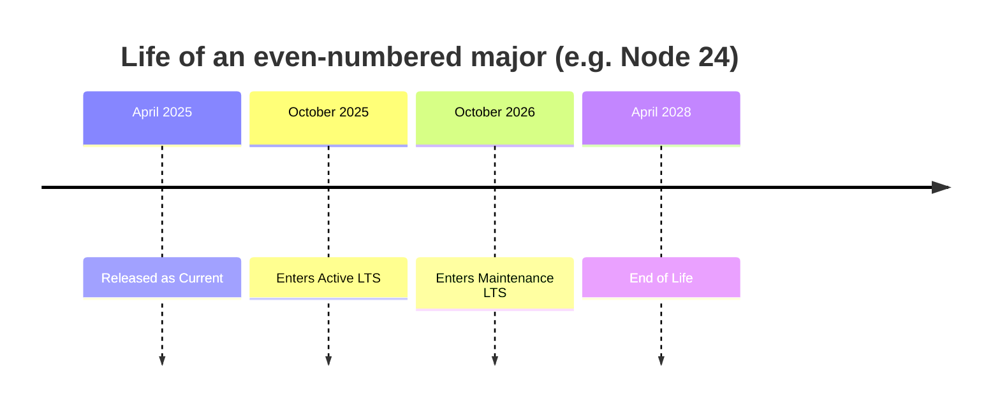

# Appendix E — Stability Index and Release Lines

## How to use this appendix

Two questions come up constantly and have precise, documented answers that almost nobody knows precisely:

1. *"The docs say this API is Stability 1.1 — can I ship it?"*
2. *"Which Node.js version should this project run?"*

[Chapter 2](../part1-foundations/02-install-and-release-lines.md) teaches both from scratch and [Chapter 63](../part9-production/63-upgrading-node.md) teaches the upgrade mechanics. This appendix is the version you keep open during a design review: the exact meaning of every stability level, a decision table that turns a level into an action, the release-line arithmetic, and three different answers to "which version" depending on what you are building.

Everything here is checked against the Node.js `main` documentation at **27.0.0-pre**. Stability levels move. When a level here disagrees with the doc page you are reading, the doc page wins — but the *interpretation* below stays valid.

---

## Part 1 — The stability index

### Where the markers live

A stability marker is a blockquote at the top of a document or a section:

```text
> Stability: 2 - Stable
```

The scope is the thing it sits under, and this is the first place people go wrong. A marker at the top of a document applies to the whole module. A marker under a `###` heading applies to **that one API and nothing else**.

`doc/api/module.md` is the clearest example in the whole reference. The document itself carries no module-level marker, and inside it, at 27.0.0-pre, you will find three different levels within a few hundred lines:

| API in `node:module` | Stability at 27.0.0-pre |
|---|---|
| `module.findPackageJSON()` | 1.1 — Active development |
| `module.register()` | 0 — Deprecated (use `module.registerHooks()`) |
| `module.registerHooks()` | 1.2 — Release candidate |

"Is `node:module` stable?" has no answer. "Is `module.registerHooks()` stable?" does. Always read the marker nearest the API you are about to call, not the one at the top of the page.

### The four levels, precisely

| Level | Label | What the project actually commits to |
|---|---|---|
| **0** | Deprecated | The feature may emit warnings. **Backward compatibility is not guaranteed.** |
| **1** | Experimental | **Not subject to semantic versioning rules.** Non-backward-compatible changes or removal may occur in *any* future release — including a patch release. Not recommended in production environments. |
| **2** | Stable | Compatibility with the npm ecosystem is a high priority. |
| **3** | Legacy | Unlikely to be removed, **still covered by semver guarantees**, but no longer actively maintained; alternatives exist. |

Two sentences from the source documentation deserve to be memorised because they are the whole game:

> Experimental features leave the experimental status typically either by graduating to stable, or are removed without a deprecation cycle.

> Bugs found in legacy features are unlikely to be fixed.

The first tells you an experimental feature carries removal risk with **no warning period**. The second tells you a legacy feature carries *bug* risk rather than *removal* risk.

### The three sub-tiers of Stability 1

This is the part most developers do not know exists. Experimental is not one bucket; it is a pipeline with three stages, and they carry genuinely different risk.

| Stage | Label | The documented meaning | How to read it |
|---|---|---|---|
| **1.0** | Early development | "Unfinished and subject to substantial change." | A preview. The API shape is a proposal. Expect renames, expect the whole surface to be reworked, expect removal. |
| **1.1** | Active development | "Nearing minimum viability." | The idea has survived. The shape is emerging but not settled. Signatures will still move. |
| **1.2** | Release candidate | "Hopefully ready to become stable. No further breaking changes are anticipated but may still occur in response to user feedback or the features' underlying specification development." | The project is asking you to use it and report problems. Breakage is possible but no longer expected. |

Note the specific escape hatch in the 1.2 wording: *the features' underlying specification development*. A 1.2 feature that tracks an external spec — a WHATWG standard, a WASI snapshot, a TC39 proposal — can still change because the spec changed, not because Node.js changed its mind. That is a real risk you cannot mitigate by reading Node.js release notes alone.

A useful mental model: **1.0 is "we are exploring," 1.1 is "we are building," 1.2 is "we are waiting for you to find the last bugs."**

### Legacy (3) vs Deprecated (0) — the confusion, settled

These are constantly swapped, and they mean close to opposite things about your upgrade risk.

| | **0 — Deprecated** | **3 — Legacy** |
|---|---|---|
| Covered by semver? | **No.** Backward compatibility is not guaranteed. | **Yes.** Still under semver guarantees. |
| Will it be removed? | That is the direction of travel. | Unlikely. |
| Runtime warning? | May emit one (see [Appendix D](d-deprecations.md)). | No. |
| Bugs get fixed? | Not the point — you are meant to leave. | **Unlikely.** It is frozen, not maintained. |
| Why this label? | Using it is considered harmful, wrong, or a maintenance burden. | Using it **does no harm** and it is widely relied upon across the npm ecosystem. |
| Correct response | Migrate on a schedule. | Prefer the alternative in new code; existing code is fine. |

The documentation states the deciding criterion outright: features are marked legacy rather than deprecated *if their use does no harm, and they are widely relied upon within the npm ecosystem*. Legacy is what the project does when removing something would break half of npm for no safety benefit.

Concrete pairs at 27.0.0-pre:

- `global` is **Legacy** — use `globalThis`, but `global` is not going anywhere.
- `assert.deepEqual()` is **Legacy** — use `assert.deepStrictEqual()`.
- `Buffer.prototype.toString('base64')` is stable; the old `atob`/`btoa` globals are **Legacy**.
- `url.parse()` (the legacy URL API) is **Legacy** — use the WHATWG `URL` class.
- `process.hrtime()` is **Legacy** — use `process.hrtime.bigint()`.
- `node:domain` is **Deprecated** in full — do not use it, and see [Chapter 15](../part2-async/15-async-context.md) for `AsyncLocalStorage`, which is the replacement.
- `node:punycode` is **Deprecated** as a module — use the userland `punycode` package or `URL`'s built-in IDNA handling.

Notice the asymmetry: a Legacy *API* is a nuisance; a Deprecated *module* is a migration project.

### The decision table

For each level: may I ship it, what is my upgrade risk, and what should I do to hedge.

| Level | Production? | Upgrade risk | How to hedge |
|---|---|---|---|
| **0 — Deprecated** | Only to keep existing code alive | **High and unbounded.** No semver protection; can change or vanish in a minor. | Put the call behind one wrapper module. Add a failing-on-purpose test that documents the expected behaviour so you notice the day it changes. Schedule the migration; do not "monitor" it. |
| **1.0 — Early development** | **No.** | **Very high.** Substantial redesign expected; removal without a deprecation cycle is explicitly allowed. | Use it in a spike or a prototype only. Never in a published library. If you must, gate it behind an env var that is off by default, and pin an exact Node.js patch version. |
| **1.1 — Active development** | **Not for anything you cannot redeploy in an hour.** | **High.** Signatures still move between minors. | Wrap it behind your own interface so the blast radius is one file. Add a runtime capability check (`typeof api.thing === 'function'`) with a documented fallback path. Pin the Node.js minor in CI *and* production, and pin them to the same value. |
| **1.2 — Release candidate** | **Defensible for an application you control.** Not for a library, unless the dependency is opt-in and documented. | **Moderate.** Breakage is possible, mostly from upstream spec churn. | Test the feature explicitly in CI against both your production line and Current. Read the release notes for that feature specifically on every minor bump. Keep the fallback code path alive until the level reaches 2. |
| **2 — Stable** | **Yes.** | **Low.** Changes gated by semver-major. | Normal upgrade discipline: read the semver-major section of the changelog before a major bump ([Chapter 63](../part9-production/63-upgrading-node.md)). |
| **3 — Legacy** | **Yes, in existing code.** Prefer the alternative in new code. | **Low for removal, real for bugs.** It will keep working; it will not be improved. | If you hit a bug in a Legacy API, do not file and wait — migrate to the modern equivalent, because a fix is unlikely. |

### The critical rule for library authors

The source documentation says this plainly and it is worth restating as a hard rule:

> Users may not be aware that experimental features are being used.

If your published package calls a Stability 1 API, your *users* absorb the breakage — on an upgrade they chose, from a package they trust, for a reason they cannot see. That is the worst possible failure ergonomics.

So, for anything you publish to npm:

1. **Do not depend on 1.0 or 1.1 at all.** No exceptions worth the trouble.
2. **A 1.2 dependency must be opt-in** — behind an option, a separate entry point, or a documented `engines` floor — and must be stated in your README.
3. **Feature-detect, do not version-detect.** `typeof x === 'function'` survives backports to older lines; `process.version >= 'v24'` does not.
4. **Have a fallback path and test it.** If the experimental path disappears, your package should degrade, not throw.

Node.js itself hedges the same way: experimental features often require a CLI flag (`--experimental-*`) and may emit a process warning. If a feature you want is behind a flag, that flag is the project telling you where the boundary is.

### Non-stable modules at 27.0.0-pre

A snapshot, useful for orientation. Verify against the docs for your actual version — this list moves every release.

| Module / doc | Level at 27.0.0-pre | Book chapter |
|---|---|---|
| `node:domain` | 0 — Deprecated | [Ch. 14](../part2-async/14-errors.md) |
| `node:punycode` | 0 — Deprecated | [Ch. 32](../part5-networking/32-url-and-querystring.md) |
| `node:async_hooks` | 1 — Experimental (migrate away) | [Ch. 15](../part2-async/15-async-context.md) |
| `node:trace_events` | 1 — Experimental | [Ch. 48](../part7-diagnostics/48-diagnostics-channel-tracing.md) |
| `node:wasi` | 1 — Experimental | [Ch. 57](../part8-advanced/57-wasm-wasi.md) |
| `node:ffi` | 1 — Experimental | [Ch. 58](../part8-advanced/58-ffi-and-embedding.md) |
| `node:vfs` | 1 — Experimental | [Ch. 55](../part8-advanced/55-single-executable.md) |
| `node:stream/iter` | 1 — Experimental (needs `--experimental-stream-iter`) | [Ch. 19](../part3-data/19-streams-advanced.md) |
| `node:dtls` | 1 — Experimental | [Ch. 40](../part5-networking/40-quic-dtls.md) |
| `node:quic` | **1.0** — Early development | [Ch. 40](../part5-networking/40-quic-dtls.md) |
| Single executable applications (`node:sea`) | **1.1** — Active development | [Ch. 55](../part8-advanced/55-single-executable.md) |
| `node:sqlite` | **1.2** — Release candidate | [Ch. 54](../part8-advanced/54-sqlite.md) |

The spread in that table is the point. `node:quic` and `node:sqlite` are both "experimental," and they are not remotely the same bet.

---

## Part 2 — The release model

### Cadence and the even/odd rule

Node.js cuts a **new major every six months, on a calendar**: one in April, one in October.

- **April majors get even numbers** — 22, 24, 26. These become LTS.
- **October majors get odd numbers** — 23, 25, 27. These never become LTS.

That is all the even/odd rule is: a consequence of the calendar and the LTS policy. An odd release is not a beta. It is a fully supported release with a short life, and it is where new work gets exercised by real users before an even release inherits it.

### The phases

| Phase | Applies to | Typical duration | What you get |
|---|---|---|---|
| **Current** | Every major | ~6 months from release | New APIs, new flags, behaviour refinements, the newest V8. Semver-major changes wait for the next major, but the surface moves constantly. |
| **Active LTS** | Even majors only | ~12 months | Feature-frozen apart from carefully backported low-risk additions. Bug fixes, security fixes, docs. **This is where production belongs.** |
| **Maintenance LTS** | Even majors only | ~18 months | Critical bug fixes and security fixes only. Safe, but the clock is visible. |
| **End of Life** | Every major eventually | — | **No security releases.** Running this is a finding in any serious audit. |



The arithmetic that follows:

- An **even** major lives roughly **36 months**: 6 as Current, 12 as Active LTS, 18 as Maintenance.
- An **odd** major lives roughly **8 months**: 6 as Current, then a short overlap after the next even major arrives.

### Reading the support window

The authoritative schedule lives in the `nodejs/Release` repository (`https://github.com/nodejs/Release`), which publishes it as both a chart and machine-readable JSON. Two habits worth forming:

1. **Read the end-of-life date, not the phase name.** "Maintenance LTS" sounds comfortable; "EOL in five months" is an actionable fact.
2. **Consume the schedule programmatically in CI.** The JSON is stable enough to fail a build when your pinned major is within N months of EOL. That converts an upgrade from an emergency into a ticket.

From inside a running process:

```js
console.log(process.version);        // 'v24.9.0'
console.log(process.release.lts);    // an LTS codename string, or undefined
console.log(process.versions.v8);    // the V8 build in this binary
console.log(process.versions.openssl);
console.log(process.versions.modules); // the ABI version — native addons must match this
```

`process.release.lts` is a string only on LTS releases and `undefined` on Current and on odd majors. A one-line startup guard is cheap:

```mjs
if (process.release.lts === undefined) {
  console.warn(`Running Node ${process.version}, which is not an LTS release.`);
}
```

`process.versions.modules` is the one to log in a deployment banner if you ship native addons — see [Chapter 56](../part8-advanced/56-node-api-addons.md) for why Node-API decouples you from it.

---

## Part 3 — Choosing a version: three different answers

The right answer depends on who absorbs the cost of being wrong. That is the whole reasoning, and it produces three genuinely different policies.

### For a new service (you deploy it)

**Run the newest Active LTS. Pin the exact major and minor. Upgrade to the next LTS during its Active phase, not its Maintenance phase.**

You control the runtime and you control the deploy, so the cost of being wrong is a rollback you can perform. What you cannot afford is a support cliff arriving unannounced. Active LTS gives you the longest runway of feature-frozen, patched releases, which is exactly what a service wants: predictable behaviour with a steady flow of security fixes.

Why not Current? Because a service typically outlives six months, and a Current line forces an unplanned major migration at exactly the wrong time. Why not the *oldest* supported LTS? Because you inherit a shorter runway for no benefit.

Pin it in three places that must agree: `.nvmrc` (or `.tool-versions`), the `engines` field in `package.json`, and your container base image tag. If your laptop, CI, and production can disagree, they eventually will, and the difference will surface as a bug you cannot reproduce.

### For a published library (your users deploy it)

**Support every non-EOL LTS line, run CI against Active LTS, Maintenance LTS, and Current, and set `engines` to the oldest line you actually test.**

Your users pick the runtime, not you. If your package requires a Node.js version some fraction of your users do not run, the failure lands on them at install or, worse, at runtime. A library's job is to widen the supported range and to *know* where the range ends, which means testing there.

This changes what you may use, not just what you declare:

- Any API newer than your oldest supported line needs a feature check plus a fallback, or it must live behind an optional entry point.
- Stability 1 APIs are effectively off the table (see the library rule above).
- Set `engines.node` honestly. `>=20` means you test on 20. Declaring a floor you do not test is worse than declaring a higher one.

Running CI against **Current** is not optional for a library. It is how you find out that the next LTS will break you while there is still time to do something about it — which is a service you provide to your users, not a favour they do you.

### For a CLI tool (someone else's machine, unknown version)

**Assume the user's Node.js is old, weird, or both. Either target a low floor with zero experimental surface, or stop depending on the user's Node.js entirely by shipping a single executable.**

This is the case with the least control and therefore the most conservative answer. A developer running your CLI may be on whatever their distro packaged, whatever `nvm` last selected, or whatever their employer's image pins. They will not upgrade Node.js to run your tool; they will uninstall your tool.

Two viable strategies:

1. **Broad compatibility.** Target the oldest LTS still in Maintenance, avoid every non-stable API, and — critically — **fail with a clear message rather than a syntax error** when the runtime is too old. A CLI entry point that immediately checks `process.versions.node` and prints "requires Node 20 or newer, found 18.12.0" is worth more than any amount of graceful degradation, because a `SyntaxError` from a modern language feature produces a bug report that blames you for something you cannot fix at runtime. Keep that check in a tiny file with no modern syntax so it can actually parse on the old runtime.
2. **Ship the runtime.** Build a single executable application ([Chapter 55](../part8-advanced/55-single-executable.md)) and the question disappears — you choose the Node.js version, it is embedded, and the user's installation is irrelevant. This costs you a build matrix and a larger download, and it makes *you* responsible for shipping security updates of the embedded runtime. That is a real obligation, not a footnote: when Node.js patches a vulnerability, your users are exposed until you rebuild and they re-download.

The summary:

| You are building | Target | Because |
|---|---|---|
| A service | Newest Active LTS, pinned | You control the deploy; you want the longest patched runway |
| A library | Every non-EOL LTS, CI on Current too | Your users choose the runtime; you must know where your range ends |
| A CLI | Oldest Maintenance LTS with a hard version check — *or* a single executable | You control nothing; make failure legible or remove the dependency |

---

## Part 4 — Security releases

### How they work

Reports go to the Node.js project through **HackerOne** (`https://hackerone.com/nodejs`). The project no longer runs a bug bounty program. The published process:

1. A report is acknowledged, normally within 5 days, with a more detailed response within 10 days. A reporter who hears nothing within 6 business days may escalate to the OpenJS Foundation CNA.
2. A primary handler validates the issue against **all supported release lines**, audits nearby code for similar problems, and prepares fixes for every supported release — **held privately**, not pushed to the public repository.
3. A CVE is requested and an embargo date is chosen, typically **72 hours after the CVE is issued**, varying with severity and difficulty.
4. On the embargo date: the security mailing list is notified, patched builds go live on `nodejs.org`, and **within 6 hours** an advisory appears on the Node.js blog.

### How to hear about them

Two channels, both documented in `SECURITY.md`:

- The **`nodejs-sec` Google group** — `https://groups.google.com/group/nodejs-sec`
- The **vulnerability blog feed** — `https://nodejs.org/en/blog/vulnerability`

Subscribe a team alias to the group. Do not rely on an individual's inbox, and do not rely on your dependency scanner: scanners key off CVE databases, and CVEs lag.

### Why the CVE text is late — and why you should not wait for it

The documented timeline explains the delay: after the release, the project asks the reporter to disclose on HackerOne; if they do not within one day, the project forces disclosure; then HackerOne's own approval process runs. CVEs typically appear **within a few days of the release**, not with it.

The operational consequence is blunt: **patch on the release, not on the CVE.** If your process is "wait for the advisory to show up in the scanner, then schedule," you have chosen to run a known-vulnerable runtime for several days, during which the fix is public in the repository and trivially diffable by anyone.

### Two things that are *not* treated as vulnerabilities

Knowing the boundary saves you from filing reports that go nowhere:

- **Experimental-tier platforms.** Node.js tiers supported OS/architecture combinations. An issue affecting only an Experimental-tier platform is handled as a normal bug with no CVE.
- **Non-default build and V8 flags.** Behaviour behind special compile-time flags or V8 options is outside the documented API surface.

And one thing that **is**: the documentation states that experimental *features* are eligible for security reports just like stable ones, and may receive the same severity score. Stability 1 means "the API may change," not "the code is unguarded." Do not confuse the two.

### Your side of the contract

The design goal is simple and worth stating as a requirement: **you should be able to ship a patched Node.js version in under an hour, without a code change.** In practice that means the Node.js version is a pinned tag in one place, CI rebuilds on a tag bump, and the deploy is routine. Rehearse it on a non-security release so that the first time you do it under pressure is not the first time you do it.

---

## Part 5 — What actually changes in a semver-major

Deprecations are the *documented* breakage, catalogued in [Appendix D](d-deprecations.md). The rest of a major bump is behaviour that changed without ever being deprecated, because it was never an API promise in the first place. This is the list to check before every major upgrade — see [Chapter 63](../part9-production/63-upgrading-node.md) for the full procedure.

| What changes | Why it bites | What to check |
|---|---|---|
| **V8 major version** | New optimisation heuristics, different GC behaviour and default heap sizing, occasionally changed stack-trace formatting. | Re-run your benchmarks. Re-check `--max-old-space-size` and `--max-semi-space-size` — a value tuned on one line can be actively harmful on the next. Re-test anything parsing stack traces or using `Error.prepareStackTrace`. |
| **OpenSSL major version** | OpenSSL 3 moved legacy algorithms into a separate provider. Old ciphers, small RSA keys and unusual key formats start throwing `ERR_OSSL_*`. | Inventory your cipher suites, key sizes and key formats. `--openssl-legacy-provider` is a transition aid, not a destination. |
| **TLS defaults** | Defaults are `tls.DEFAULT_MIN_VERSION = 'TLSv1.2'` and `tls.DEFAULT_MAX_VERSION = 'TLSv1.3'`. Anything speaking only TLS 1.0/1.1 fails the handshake with no deprecation warning anywhere. | List every non-HTTPS TLS peer you talk to — appliances, legacy databases, internal services with old stacks. Flags exist (`--tls-min-v1.0` and friends) but pre-1.2 may also need the OpenSSL security level lowered. |
| **Bundled npm major** | Lockfile format, workspace resolution, `install` semantics, audit output and exit codes can all move. | Check `npm --version` before and after. If you rely on npm's exit codes in CI, re-test them. Consider pinning npm via Corepack rather than inheriting whatever the Node.js tarball carries. |
| **Bundled `undici` / HTTP client internals** | `fetch` is built on `undici`; its defaults, error shapes and connection behaviour move with it. | Re-test anything asserting on `fetch` error messages or `cause` chains. |
| **Default flags and limits** | Defaults for header sizes, DNS result order, stream `highWaterMark`, timeouts. `dns.lookup()` has defaulted to `verbatim` order since v17, which turns a broken-IPv6 host into mysterious connection timeouts. | Diff the CLI documentation between the two versions ([Appendix A](a-cli-flags.md)) and grep the changelog for "default". |
| **Native addon ABI (`NODE_MODULE_VERSION`)** | Every major bumps it. Addons built against the old ABI will not load — `ERR_DLOPEN_FAILED`. | `process.versions.modules` tells you the ABI. Addons built with **Node-API** are insulated from this; addons built directly against V8 are not ([Chapter 56](../part8-advanced/56-node-api-addons.md)). |
| **Platform support tiers** | A major may drop an OS version, a glibc floor, or an architecture. | Check the supported-platforms list before assuming your base image still works. |

The dependable habit: for each major you cross, read only the **"Semver-Major Commits"** section of that release's announcement. For a one-major jump it is twenty minutes, and it is the single highest-yield twenty minutes in the whole upgrade.

---

## Where to go next

- [Chapter 2 — Installing Node, Release Lines, and Version Management](../part1-foundations/02-install-and-release-lines.md) — the full treatment of installation, version managers, pinning, and download verification.
- [Chapter 63 — Upgrading Node.js: Deprecations and Migration](../part9-production/63-upgrading-node.md) — the step-by-step upgrade procedure and the deprecation flags.
- [Appendix D — Deprecation Index](d-deprecations.md) — every `DEPXXXX` code and what to do about it.
- [Appendix A — CLI Flag Reference](a-cli-flags.md) — including the `--experimental-*` flags that gate Stability 1 features.
- [Appendix G — Module → Chapter Map](g-module-map.md) — every builtin module with its current stability level.
- Official documentation: <https://nodejs.org/docs/latest/api/documentation.html>
- Release schedule: <https://github.com/nodejs/Release>
- Security policy: <https://github.com/nodejs/node/blob/main/SECURITY.md>
