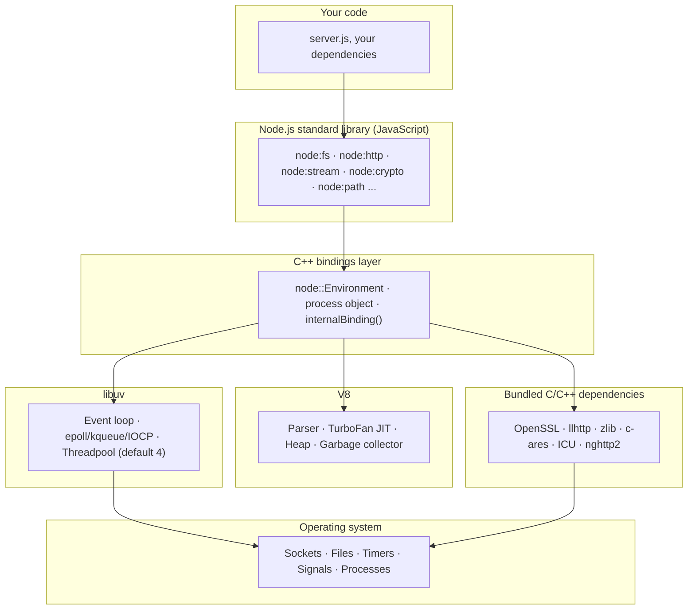

# Chapter 1 — What Node.js Is: Architecture and Execution Model

**What you will learn**

- What a JavaScript *runtime* is, and how it differs from a JavaScript *engine*.
- The four layers that make up Node.js — V8, libuv, the C++ bindings, and the JavaScript standard library — and which layer is responsible for what.
- How one JavaScript thread plus an event loop can serve thousands of concurrent connections, and exactly which APIs escape to libuv's threadpool.
- Which workloads Node.js is excellent at, which ones it is bad at, and how to tell the difference before you write the code.
- How the Node.js environment differs from a browser: no DOM, a different global object, a different module story, a different security model.

**Why this matters**

Almost every hard Node.js bug is a bug in someone's mental model of the runtime. A service that handles 5,000 requests per second in a load test and then falls over in production because one endpoint calls `JSON.parse` on a 40 MB payload. A worker that "should be parallel" but processes files one at a time because someone raised the concurrency limit without raising `UV_THREADPOOL_SIZE`. A health check that times out during a garbage-collection pause on a 6 GB heap. None of those are API problems. They are all consequences of the same architecture, and once you can see the architecture you can predict them.

This chapter builds that mental model. Everything else in this book — streams, the event loop phases, worker threads, cluster, backpressure, graceful shutdown — is an elaboration of what is described here. Read it carefully; the rest of the book assumes it.

## A runtime, not a language

JavaScript the language is defined by ECMAScript. It gives you objects, closures, promises, classes, `Math`, `JSON`, `Array`. What it does *not* give you is any way to talk to the outside world. There is no `openFile` in ECMAScript, no `listenOnPort`, not even a way to print a line of text.

A **JavaScript engine** compiles and executes that language. V8 — the engine Chrome uses and the one Node.js embeds — parses your source, compiles it to machine code, runs it, and manages the heap and garbage collector. On its own an engine is a sealed box: it computes, but it cannot perform I/O.

A **JavaScript runtime** is an engine plus a set of capabilities injected into it from the host. The host decides what the world looks like. A browser injects `document`, `fetch`, `localStorage`, and a rendering pipeline. Node.js injects file system access, TCP and UDP sockets, child processes, cryptography, and an event loop tuned for servers.

So "Node.js is JavaScript on the server" is true but shallow. The precise statement is: **Node.js is a runtime that embeds V8 and exposes operating-system capabilities to JavaScript through an asynchronous, event-driven API.** The design decision that follows from "asynchronous, event-driven" is what makes Node.js feel different from Python or Java, and it is where all the interesting consequences live.

## The layers

Node.js is a C++ program. When you run `node server.js`, that program starts, initializes V8, initializes libuv, builds the global object, loads the internal JavaScript library, and finally hands your file to the module loader. Understanding which layer does what tells you where to look when something is slow or broken.



**V8** runs the JavaScript. It owns the heap, so it owns garbage collection — which matters because GC pauses stop *everything*, including your event loop. V8 also has its own background thread pool for compilation and concurrent GC work, sized with the `--v8-pool-size=num` flag. That pool is separate from libuv's and is not something you normally tune.

**libuv** is the cross-platform asynchronous I/O library that Node.js was built around. It provides the event loop itself, non-blocking socket I/O built on `epoll` (Linux), `kqueue` (macOS/BSD), and IOCP (Windows), timers, signal handling, child process spawning, and — critically — a small pool of worker threads for operations the OS cannot do asynchronously. libuv is the reason the same `net.Server` code works identically on all three platforms.

**The C++ bindings** are the glue. Every time you call `fs.readFile`, JavaScript in `lib/fs.js` eventually calls into a C++ function that hands a request to libuv and registers a callback. When libuv finishes, the bindings convert the result back into JavaScript values and invoke the callback. You never write this layer unless you are building a native addon (Chapter 56).

**The standard library** — `node:fs`, `node:http`, `node:stream`, and the rest — is written in JavaScript and compiled into the binary. This is why `require('node:http')` is instant: nothing is read from disk. The list of everything built in is available at runtime as `module.builtinModules`.

**Bundled dependencies** round it out: OpenSSL for TLS and crypto, llhttp for HTTP/1.1 parsing, nghttp2 for HTTP/2, zlib, c-ares for DNS queries that bypass the OS resolver, and ICU for `Intl` and Unicode.

You can see several of these versions from your own program:

```js
console.log(process.versions);
// { node: '27.0.0-pre', v8: '...', uv: '...', openssl: '...', ... }
```

## One thread, one loop

Your JavaScript runs on exactly one thread. Call it the **main thread**. It runs your module's top-level code, then enters the event loop and stays there until there is nothing left to do.

The loop is easier to grasp as a job than as a diagram. Imagine a single clerk at a counter:

1. Take the next completed request from the queue and run the JavaScript callback attached to it.
2. Run any microtasks that callback queued (promise reactions, `queueMicrotask`).
3. Repeat until the queue is empty.
4. If nothing is pending, ask the OS: "wake me when any of these sockets, files, or timers is ready." Sleep.
5. Wake up, add the newly ready items to the queue, go to step 1.

The clerk is fast, but there is only one of them. **Anything the clerk does personally, everyone else waits for.** That single sentence explains most Node.js performance problems.

The loop actually has several distinct phases — timers, pending callbacks, poll, check, close — and microtasks interleave between them in a specific way. Chapter 9 covers the phases and their ordering rules in detail. For now, hold onto the one-clerk model.

### Blocking versus non-blocking

"Blocking" means the calling thread stops and waits for the operating system. In Node.js that means your one clerk sits idle and no other callback runs.

```js
// Blocking: the whole process stops until the disk responds.
const { readFileSync } = require('node:fs');
const data = readFileSync('/var/log/huge.log');
```

```mjs
// Non-blocking: the request is handed to libuv, the loop keeps serving others.
import { readFile } from 'node:fs/promises';
const data = await readFile('/var/log/huge.log');
```

The difference is invisible at low load and catastrophic at high load. If a synchronous read takes 20 ms and you serve 200 requests per second, you have spent 4 seconds of every second blocking. The queue grows without bound, latency climbs, and health checks start failing — even though CPU usage looks modest, because the thread was *waiting*, not computing.

| Operation | Blocks the loop? | Where the waiting happens |
|---|---|---|
| `fs.readFileSync()` | Yes | Main thread, in the kernel |
| `fs.promises.readFile()` | No | libuv threadpool |
| `net`/`http` socket reads and writes | No | Kernel event notification (epoll/kqueue/IOCP) |
| `dns.lookup()` | No | libuv threadpool |
| `dns.resolve4()` | No | Network, via c-ares — no threadpool |
| `crypto.pbkdf2()` with a callback | No | libuv threadpool |
| `crypto.pbkdf2Sync()` | Yes | Main thread |
| A `for` loop over 50 million items | Yes | Main thread, computing |
| `JSON.parse()` of a 50 MB string | Yes | Main thread, computing |
| `child_process.execSync()` | Yes | Main thread |

Note the last three rows. Non-blocking I/O does not protect you from CPU work. A tight loop, a giant `JSON.parse`, a synchronous `zlib.gunzipSync`, or an accidental `O(n²)` algorithm all hold the clerk hostage just as effectively as a synchronous disk read.

## The libuv threadpool

Here is the part most tutorials get wrong. Node.js is single-threaded *for your JavaScript*, but the process is not single-threaded. libuv maintains a fixed-size pool of worker threads — **4 by default** — because some operating system APIs simply have no asynchronous form.

The APIs that use the threadpool are, precisely:

- **All `fs` APIs**, except the file watcher APIs and the explicitly synchronous `*Sync` variants.
- **Asynchronous crypto APIs** such as `crypto.pbkdf2()`, `crypto.scrypt()`, `crypto.randomBytes()`, `crypto.randomFill()`, and `crypto.generateKeyPair()`.
- **`dns.lookup()`**, which is a threadpool-wrapped call to the system's `getaddrinfo(3)`.
- **All `zlib` APIs**, except the explicitly synchronous ones.

Everything else that is asynchronous — TCP, UDP, HTTP, TLS handshakes at the socket level, timers, signals, `dns.resolve*()` — is handled by the event loop's kernel notification mechanism and never touches the threadpool.

This distinction has teeth. Because the pool has a fixed size, a small number of slow operations can starve unrelated ones. Four concurrent `crypto.pbkdf2()` calls with a high iteration count will occupy the entire default pool; a `dns.lookup()` issued at that moment queues behind them, and since `dns.lookup()` is what `http.request()` and `net.connect()` use to resolve host names by default, an unrelated outbound HTTP call now appears to hang. Nothing is broken. The pool is full.

The size is controlled by the `UV_THREADPOOL_SIZE` environment variable:

```bash
UV_THREADPOOL_SIZE=16 node server.js
```

Set it in the environment, not in your code. Assigning `process.env.UV_THREADPOOL_SIZE` at the top of your program is not guaranteed to work, because the pool is created during runtime initialization — long before your first line of JavaScript runs.

A sensible starting point is to size the pool to your expected concurrent filesystem or crypto operations, not to your CPU count, since threadpool threads spend most of their time waiting on the disk. But measure. More threads mean more memory and more context switching, and raising the pool will do absolutely nothing for a network-bound service, because network I/O never used the pool in the first place.

### Two kinds of "parallel"

Node.js gives you **concurrency** almost for free and **parallelism** only if you ask for it.

*Concurrency* is interleaving: 10,000 sockets can be open at once because each idle socket costs a file descriptor and a small buffer, not a thread. *Parallelism* is simultaneous execution on multiple cores, and for JavaScript you get it only through `worker_threads` (Chapter 29), `child_process` (Chapter 28), or `cluster` (Chapter 30).

Confusing the two produces the most common disappointment in Node.js: someone wraps a CPU-heavy function in `async` and is surprised that it did not get faster. `async` does not create a thread. It only creates a promise.

## Why non-blocking I/O matters

The alternative model — a thread per connection — is easy to reason about, but each thread carries a stack (commonly 512 KB to 8 MB of reserved address space) and every context switch costs the kernel time. Ten thousand concurrent connections means ten thousand mostly-sleeping threads.

Node.js flips it. One thread, one loop, and connections represented as data structures rather than threads. Memory per idle connection is measured in kilobytes. This is exactly the right trade for the shape of most server work: accept a request, make two or three network calls to a database and an upstream API, glue the results together, and write a response. That workload is 95% waiting. Waiting is what an event loop is good at.

The trade you accept in return is strict: **the loop must never be blocked.** In a thread-per-connection server, one slow handler delays one client. In Node.js, one slow handler delays *every* client. This is not a flaw; it is the price of the memory profile. It just means "don't block" moves from a nice-to-have to a hard rule.

## What Node.js is good at, and what it is bad at

| Workload | Fit | Why |
|---|---|---|
| HTTP/JSON APIs, BFF layers, API gateways | Excellent | Dominated by waiting on I/O |
| Real-time: WebSockets, SSE, chat, presence | Excellent | Cheap idle connections, event-driven by nature |
| Streaming and proxying large payloads | Excellent | Streams give constant memory usage regardless of size |
| Build tools and CLIs | Very good | Fast startup, huge ecosystem, easy filesystem work |
| Orchestrating many slow upstreams | Excellent | Thousands of in-flight requests, no thread cost |
| Image/video transcoding, ML inference | Poor in-process | CPU-bound; blocks the loop. Delegate to a worker, a child process, or another service |
| Large synchronous data crunching | Poor in-process | Same reason; also risks heap limits |
| Long-running numeric simulation | Poor | Use worker threads at minimum, or a different runtime |

"Poor" does not mean impossible. It means *don't do it on the main thread*. The standard escape hatches, in increasing order of isolation:

1. **Chunk the work.** Break a big loop into slices and yield to the loop between them with `setImmediate`.
2. **`worker_threads`.** Real OS threads inside the same process, sharing memory via `SharedArrayBuffer` and `MessagePort`. Best for CPU-bound JavaScript.
3. **`child_process`.** A separate process — best when you are shelling out to `ffmpeg`, or when a crash must not take down the parent.
4. **`cluster`.** Many copies of your server sharing one listening port, to use all cores for request handling.
5. **A different service.** If the CPU work is the product, put it behind a queue and write that part in a language built for it.

## The process model

A running Node.js process contains more threads than you might expect:

- **One main thread**, running V8 and your JavaScript.
- **The libuv threadpool** — 4 threads by default, created at startup whether or not you use them.
- **V8 platform threads** for background compilation and concurrent/parallel garbage collection, sized by `--v8-pool-size=num`. Passing `0` lets Node.js pick a size based on available parallelism.
- **An inspector thread**, when you start with `--inspect`.
- **Any `worker_threads` you create**, each with its *own* V8 isolate, its own heap, and its own event loop.

That last point is worth underlining: a `Worker` is not a shared-memory thread in the Java sense. It has a separate JavaScript heap. Objects are copied (via the structured clone algorithm) or explicitly shared through `SharedArrayBuffer`. That isolation is why worker threads are safe, and also why passing huge objects between them is expensive.

The process exits when the event loop has nothing left to keep it alive: no pending timers, no open handles, no scheduled callbacks. This is why a program that only calls `readFile` exits on its own once the callback finishes, and why a program that calls `server.listen()` runs forever. Handles can be "unref'd" to say *keep running only if something else needs to* — the mechanism behind `setTimeout(...).unref()`.

## Node.js compared to the browser

Both host V8. Almost everything else differs.

| | Browser | Node.js |
|---|---|---|
| Global object | `window` (also `globalThis`) | `globalThis`. `global` still works but is **[Legacy]** — use `globalThis` |
| DOM | `document`, `Element`, CSSOM | None. No `document`, no `window` |
| Top-level scope | Script top level *is* global scope | Module scope. `var x` in a module is local to that module |
| Filesystem | Sandboxed, user-gated APIs only | Full access, subject to OS permissions (and optionally Node's permission model — Chapter 31) |
| Modules | ESM, plus classic scripts | ESM *and* CommonJS, both first class |
| Threading | Web Workers | `worker_threads`, `child_process`, `cluster` |
| Networking | `fetch`, `WebSocket`, `XMLHttpRequest` — all origin-restricted | Raw TCP/UDP, HTTP/1.1, HTTP/2, TLS, plus `fetch` and `WebSocket`. No same-origin policy |
| Versioning | You get whatever the user's browser has | You pin the version you deploy |
| Security boundary | Untrusted code in a sandbox | Trusted code with the privileges of the OS user |

Node.js has steadily adopted browser APIs where they made sense, so many globals are now shared: `fetch`, `URL`, `URLSearchParams`, `AbortController`, `AbortSignal`, `Blob`, `File`, `FormData`, `Headers`, `Request`, `Response`, `TextEncoder`, `TextDecoder`, `EventTarget`, `CustomEvent`, `MessageChannel`, `MessagePort`, `BroadcastChannel`, `structuredClone`, `queueMicrotask`, `performance`, `crypto` (Web Crypto), `WebSocket`, `EventSource`, and the WHATWG stream classes. Chapter 8 catalogues them.

The security difference is the one that catches people. Browser JavaScript is assumed hostile and confined. Node.js code runs with your user account's full authority: it can read `~/.ssh`, open outbound sockets, and spawn processes. A malicious transitive dependency is not a sandbox escape — it is already inside. That asymmetry is why supply-chain hygiene (Chapter 44) matters more here than in front-end work.

## Common mistakes

### ❌ Using `*Sync` filesystem calls inside a request handler

Synchronous calls are fine at startup — reading a config file before the server listens costs nothing anyone can observe. Inside a handler they serialize your entire service behind the disk.

```js
// ❌ Every concurrent request now waits for this read.
app.get('/logo', (req, res) => {
  const buf = require('node:fs').readFileSync('./logo.png');
  res.end(buf);
});
```

```mjs
// ✅ Non-blocking, and streaming keeps memory flat.
import { createReadStream } from 'node:fs';

app.get('/logo', (req, res) => {
  createReadStream('./logo.png').pipe(res);
});
```

### ❌ Believing `async` makes CPU work concurrent

`async`/`await` schedules; it does not parallelize. An `async` function with a tight loop inside blocks exactly as long as a synchronous one.

```js
// ❌ Blocks the loop for the full duration. The `async` changes nothing.
async function checksum(rows) {
  let total = 0;
  for (const row of rows) total = (total * 31 + hashRow(row)) >>> 0;
  return total;
}
```

```mjs
// ✅ Move the CPU work off the main thread.
import { Worker } from 'node:worker_threads';

function checksum(rows) {
  return new Promise((resolve, reject) => {
    const worker = new Worker('./checksum-worker.js', { workerData: rows });
    worker.once('message', resolve);
    worker.once('error', reject);
  });
}
```

### ❌ Raising `UV_THREADPOOL_SIZE` to speed up a network-bound service

Sockets never used the threadpool. Raising it adds threads that sleep forever while your real bottleneck — upstream latency, connection pool size, or DNS — goes untouched.

```bash
# ❌ Cargo cult. Does nothing for an HTTP proxy.
UV_THREADPOOL_SIZE=128 node proxy.js
```

```bash
# ✅ Raise it when you actually saturate it with fs/zlib/crypto/dns.lookup work,
#    and set it in the environment, not in code.
UV_THREADPOOL_SIZE=16 node batch-image-importer.js
```

### ❌ Assuming browser globals exist

There is no `window`, no `document`, no `localStorage` by default, and no `alert`. Code copied from a browser tutorial fails with `ReferenceError: window is not defined`.

```js
// ❌
const origin = window.location.origin;
```

```js
// ✅ Use globalThis for cross-environment code; get configuration from env.
const origin = process.env.PUBLIC_ORIGIN ?? 'http://localhost:3000';
console.log(typeof globalThis.fetch); // 'function'
```

## Production notes

- **Event loop delay is your primary health metric.** Requests-per-second hides blocking; loop lag does not. Instrument it with `perf_hooks.monitorEventLoopDelay()` (Chapter 49) and alert on the 99th percentile. A p99 lag above ~50 ms almost always means somebody is doing synchronous work in a handler.
- **The heap is bounded and GC pauses are stop-the-world.** V8's old-space limit is finite, and buffering an entire upload or query result in memory pushes you toward it. Large heaps mean longer major GC pauses, and a GC pause blocks the event loop as thoroughly as an infinite loop. Prefer streams over buffers for anything user-sized.
- **One process does not use one machine.** A 16-core box running one Node.js process uses roughly one core for JavaScript. Use `cluster` or run N containers to match cores; in a container, remember that `os.cpus().length` may report the host's CPUs, so use `os.availableParallelism()` when deciding how many workers to start.
- **Threadpool starvation is invisible in ordinary metrics.** CPU looks low, memory looks fine, and yet latency spikes. If you use `crypto.scrypt`, heavy `zlib`, or large numbers of concurrent file operations, either raise `UV_THREADPOOL_SIZE` deliberately or move that work into workers so the pool stays free for `dns.lookup()`.
- **Your process is not sandboxed.** Every dependency runs with your service account's authority. Pin versions, audit your lockfile, run as a non-root user, and consider the permission model (Chapter 31) for extra containment.

## Exercises

1. **Prove the loop is single-threaded.** Write a script that starts an HTTP server, and give it two routes: `/fast` returning immediately, and `/block` running a busy-wait loop for 3 seconds. Start the server, request `/block`, then immediately request `/fast` from another terminal. *Success:* `/fast` does not respond until `/block` finishes, and you can state why.

2. **Measure threadpool saturation.** Write a script that fires N concurrent `crypto.pbkdf2()` calls with a high iteration count and records each one's wall-clock duration. Run it with N = 2, 4, and 8 under the default pool, then rerun with `UV_THREADPOOL_SIZE=8`. *Success:* you can explain the step change in durations at N = 4 and show that it moves when the pool size changes.

3. **Map the layers to a real call.** Take `fs.promises.readFile('./package.json')` and write out, in your own words, the path the request takes: your code → the JavaScript standard library → the C++ bindings → libuv → the threadpool → the kernel → back. *Success:* you can name what each layer contributes and identify the exact point at which the main thread becomes free.

4. **Escape the main thread.** Take the busy-wait route from exercise 1 and move its computation into a `worker_threads` worker, returning the result through a promise. *Success:* `/fast` stays responsive while `/block` is running, and total throughput on `/block` improves when several run at once.

## Recap

- Node.js is a runtime: V8 for execution, libuv for asynchronous I/O and the event loop, C++ bindings to connect them, and a JavaScript standard library compiled into the binary.
- Your JavaScript runs on one thread. Every callback shares that thread, so any blocking or long-running synchronous work delays every other pending operation.
- Network I/O is handled by the kernel's event notification system. The libuv threadpool (default size 4, tuned with `UV_THREADPOOL_SIZE`) is used only by `fs` (excluding watchers and `*Sync`), async crypto such as `pbkdf2`/`scrypt`/`randomBytes`/`randomFill`/`generateKeyPair`, `dns.lookup()`, and non-sync `zlib`.
- Non-blocking I/O buys enormous connection concurrency at low memory cost; the price is that blocking the loop degrades everything at once.
- Node.js excels at I/O-bound and streaming work and is a poor fit for CPU-bound work on the main thread — delegate that to `worker_threads`, `child_process`, or `cluster`.
- The process contains the main thread, the libuv pool, V8's background threads, and any workers you create; each worker has its own isolate, heap, and loop.
- Compared to a browser: no DOM, `globalThis` instead of `window` (`global` is Legacy), both CommonJS and ESM, full OS access, and no sandbox — so dependency trust is a security decision.

## Where to go next

- [Chapter 2 — Installing Node, Release Lines, and Version Management](02-install-and-release-lines.md) — pick the version you will build this mental model on.
- [Chapter 3 — Running Code: Scripts, the CLI, and the REPL](03-running-code-cli-repl.md) — start exercising the runtime interactively.
- [Chapter 9 — The Event Loop: Phases, Microtasks, and Starvation](../part2-async/09-event-loop.md) — the full phase-by-phase model.
- [Chapter 29 — Worker Threads](../part4-system/29-worker-threads.md) — the standard answer to CPU-bound work.
- [Chapter 18 — Streams I: Concepts, Readable, and Writable](../part3-data/18-streams-concepts.md) — how to move data without buffering it.
- Official docs: <https://nodejs.org/docs/latest/api/synopsis.html>
