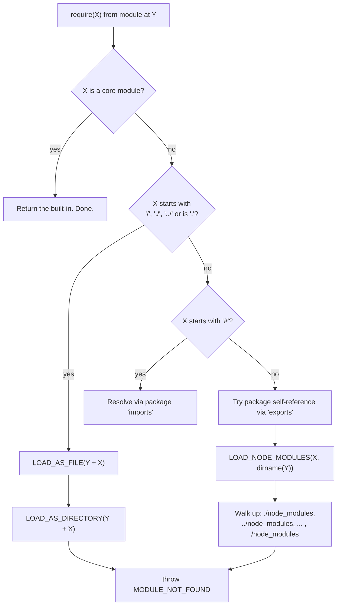

# Chapter 4 — Modules I: CommonJS

**What you will learn**

- How `require`, `module.exports`, and `exports` really work — including why reassigning `exports` silently does nothing.
- The module wrapper function and the five variables Node.js injects into every CommonJS file.
- The complete resolution algorithm: core modules, relative paths, the `node_modules` walk-up, extension guessing, `index` files, and `package.json` `"main"`.
- The module cache: what it is keyed on, why it makes modules singletons, and the two ways that assumption breaks.
- What actually happens in a circular dependency, and how to design around it.
- `module.createRequire()`, and how to `require()` an ES module graph — now a stable feature with specific rules.
- When CommonJS is still the correct choice in 2026.

**Why this matters**

CommonJS is not going away. It predates ES modules by a decade, most published npm packages still ship it, and it is the loader Node.js uses by default for a `.js` file with no `"type"` declared. You will read CommonJS code and debug CommonJS resolution failures for the rest of your career, whatever you write new code in.

The CommonJS model is also *observable* in ways ESM is not: its cache is a plain object you can inspect, its resolution algorithm is a documented sequence of file system probes, and its circular-dependency behavior falls directly out of execution order. Learn it and the ESM chapter that follows becomes much easier, because you will see exactly which problems ESM was designed to solve.

## The basics

Every file is a module. Code at the top level of a file is private to that file unless you explicitly export it.

```cjs
// lib/geometry.js
const { PI } = Math;                      // private to this module

exports.circleArea = (r) => PI * r ** 2;
exports.circleCircumference = (r) => 2 * PI * r;
```

```cjs
// app.js
const geometry = require('./lib/geometry.js');
console.log(geometry.circleArea(4));      // 50.26548245743669
```

`require()` returns whatever the loaded module put on `module.exports`. That value can be anything — an object, a function, a class, a string, `null`.

```cjs
// lib/Rectangle.js
module.exports = class Rectangle {
  constructor(width, height) {
    this.width = width;
    this.height = height;
  }
  area() {
    return this.width * this.height;
  }
};
```

```cjs
const Rectangle = require('./lib/Rectangle.js');
console.log(new Rectangle(3, 4).area());  // 12
```

### `exports` versus `module.exports`

This is the single most common CommonJS bug, and it has a precise explanation.

Before your module runs, Node.js sets up an object roughly like `const module = { exports: {} }` and then hands you a second variable, `exports`, that is *assigned the same reference*. So `exports` starts out as an alias for `module.exports`, and mutating it works:

```cjs
exports.parse = (s) => JSON.parse(s);     // same as module.exports.parse = ...
```

But `exports` is just a variable. Assigning to it rebinds the local variable and breaks the alias. `module.exports` still points at the original empty object, and that empty object is what `require()` returns.

```cjs
// ❌ Exports nothing.
exports = { parse: (s) => JSON.parse(s) };
```

The mental model that makes this obvious is the implementation sketch from the official documentation:

```js
function require(/* ... */) {
  const module = { exports: {} };
  ((module, exports) => {
    // Your module code runs here.
    exports = someFunc;      // rebinds a parameter — module.exports is untouched
    module.exports = someFunc; // this is what actually exports
  })(module, module.exports);
  return module.exports;     // <- always this
}
```

**Rule: use `exports.name = ...` to add named exports; use `module.exports = ...` to replace the whole export.** Never assign to bare `exports`. If you replace `module.exports` and want the alias to keep working, reassign both:

```cjs
module.exports = exports = function Client() { /* ... */ };
```

## The module wrapper

Your file is never executed as a bare script. Before evaluating it, Node.js wraps the source in a function:

```js
(function(exports, require, module, __filename, __dirname) {
  // Your module code lives here.
});
```

This does two jobs. First, it scopes top-level `var`, `let`, and `const` to the module rather than the global object — which is why one module's `const config` cannot collide with another's. Second, it supplies five variables that look global but are per-module:

| Variable | Type | What it is |
|---|---|---|
| `exports` | `Object` | Shorthand reference to `module.exports` |
| `require` | `Function` | The resolver, bound to this module's location |
| `module` | `Object` | The module record itself |
| `__filename` | `string` | Absolute path of this file, with symlinks resolved |
| `__dirname` | `string` | Directory of `__filename` |

`__filename` and `__dirname` are the reason relative file access is straightforward in CommonJS:

```cjs
const { readFileSync } = require('node:fs');
const path = require('node:path');

// Correct regardless of the process's working directory.
const template = readFileSync(path.join(__dirname, 'templates', 'email.html'), 'utf8');
```

Two subtleties. `__filename` has symlinks resolved, so it may not match the path typed on the command line. And within a dependency, `__filename` reports the dependency's own location: from `/app/node_modules/b/b.js` it is that path, not the path of the `/app/a.js` that required it.

Neither variable exists in ES modules — Chapter 5 covers the `import.meta` replacements.

## The resolution algorithm

When you write `require(X)` from a module at path `Y`, Node.js runs a defined sequence. Here is the shape of it, with the parts you will actually hit:



### Step 1: core modules win

If `X` names a built-in module, that built-in is returned immediately. `require('http')` returns the built-in HTTP module even if a file called `http.js` sits next to your script, and even if a package named `http` is installed.

The `node:` prefix makes this explicit and adds one guarantee: **`node:`-prefixed requires bypass the require cache.** `require('node:http')` always returns the real built-in, even if someone has planted an entry under the key `http` in `require.cache`. Always write the prefix.

Some built-ins *require* the prefix, so that adding them to Node.js could not break existing packages of the same name:

- `node:ffi`
- `node:sea`
- `node:sqlite`
- `node:test`
- `node:test/reporters`

`module.builtinModules` lists everything built in — without the prefix, except for the modules that mandate it.

### Step 2: relative and absolute paths

If `X` is `'.'` or begins with `'./'`, `'../'`, or `'/'`, Node.js resolves it against the requiring module's directory (or against the filesystem root for an absolute path) and tries, in order:

**As a file:**

1. `X` exactly, if it is a file.
2. `X.js`
3. `X.json` — parsed as JSON and returned as a JavaScript object.
4. `X.node` — loaded as a compiled binary addon via `process.dlopen()`.

Note what is *not* in that list: `.cjs` and `.mjs`. Extension guessing covers only `.js`, `.json`, and `.node`. To load a `.cjs` file you must write the extension: `require('./config.cjs')`.

**As a directory,** if the file attempts fail:

1. If `X/package.json` exists and has a truthy `"main"` field, resolve `X/<main>` as a file, then as an index.
2. Otherwise look for `X/index.js`, `X/index.json`, `X/index.node`.

Directory resolution — "folders as modules" — is **[Legacy]** (Stability 3). It still works and will keep working, but subpath `"exports"` and `"imports"` in `package.json` are the modern way to organize a package's entry points, and they work for both `require` and `import`. Chapter 6 covers them. Note also that `import('./some-library')` on a directory does *not* fall back this way; it fails with `ERR_UNSUPPORTED_DIR_IMPORT`.

If nothing matches, `require()` throws an error with `code: 'MODULE_NOT_FOUND'`.

### Step 3: the `node_modules` walk-up

A bare specifier like `require('lodash')` that is not a core module triggers the directory walk. From the requiring module's directory, Node.js checks `./node_modules`, then `../node_modules`, then `../../node_modules`, and so on up to the filesystem root. Directories already named `node_modules` are skipped as walk points.

You can see the exact list for any module:

```cjs
console.log(module.paths);
// [ '/app/src/node_modules',
//   '/app/node_modules',
//   '/node_modules' ]
```

This walk-up is why nested dependencies work: if `a` needs `left-pad@1` while the top level has version 2, a package manager places version 1 at `/app/node_modules/a/node_modules/left-pad` and `a` finds it first. Two versions coexist, at the cost of duplicate code and duplicate module identity.

After the walk, Node.js consults global folders — `$HOME/.node_modules`, `$HOME/.node_libraries`, `$PREFIX/lib/node` — plus anything in `NODE_PATH` (colon-separated on POSIX, semicolon-separated on Windows). These are historical. **Do not build on them:** `NODE_PATH` makes deployments depend on an environment variable nobody remembers setting, and can resolve a different version than your lockfile pins.

### Inspecting resolution

`require.resolve(request[, options])` runs the full algorithm and returns the resolved filename without loading anything. It throws `MODULE_NOT_FOUND` on failure.

```cjs
console.log(require.resolve('./lib/geometry.js'));
// /app/lib/geometry.js

console.log(require.resolve('express'));
// /app/node_modules/express/index.js
```

The `paths` option replaces the default search roots, which is how tooling resolves a package as if from somewhere else. Global folders are always included regardless.

```cjs
require.resolve('some-plugin', { paths: ['/opt/plugins'] });
```

And `require.resolve.paths(request)` returns the array of directories that would be searched, or `null` for a core module:

```cjs
console.log(require.resolve.paths('node:fs'));   // null
console.log(require.resolve.paths('express'));   // [ '/app/node_modules', '/node_modules' ]
```

These two turn "why is it loading the wrong copy?" into a one-line answer.

## The module cache

Modules are cached after first load. Every subsequent `require()` of the same resolved file returns **the same object**, without re-executing the module body.

```cjs
// counter.js
let count = 0;
module.exports = {
  increment: () => ++count,
  get value() { return count; },
};
```

```cjs
// app.js
const a = require('./counter.js');
const b = require('./counter.js');
a.increment();
console.log(b.value);   // 1 — same object
console.log(a === b);   // true
```

This is deliberate. It makes a module a natural singleton — a database pool, a logger, a config object — and it is what makes circular dependencies terminate instead of recursing forever.

The cache is exposed as `require.cache`, keyed by resolved absolute filename:

```cjs
console.log(Object.keys(require.cache));
// [ '/app/app.js', '/app/counter.js' ]

delete require.cache[require.resolve('./counter.js')];
const c = require('./counter.js');   // fresh instance, count back to 0
```

Deleting a cache entry forces a reload on the next `require()`. This does **not** work for native addons — reloading a `.node` file results in an error. Entries can also be added or replaced, which is how some test doubles work:

```cjs
const assert = require('node:assert');
const realFs = require('node:fs');

const fakeFs = {};
require.cache.fs = { exports: fakeFs };

assert.strictEqual(require('fs'), fakeFs);       // hijacked
assert.strictEqual(require('node:fs'), realFs);  // prefix bypasses the cache
```

Use that sparingly. It is global mutable state, and it is exactly why the `node:` prefix exists.

### Two ways the singleton assumption breaks

**Different resolved paths mean different instances.** The cache key is the resolved filename, and the same specifier can resolve to different files from different locations. If `/app/node_modules/a` and `/app/node_modules/b` each have their own nested copy of `config-lib`, then `require('config-lib')` inside `a` and inside `b` returns two distinct module instances with two distinct pieces of state. This is the root cause of the classic "there are two copies of React" bug and of duplicated database pools.

**Case-insensitive filesystems still produce distinct entries.** On macOS and Windows, `require('./foo')` and `require('./FOO')` resolve to two different cache keys even though they name the same file on disk. The module is loaded and executed twice, and you get two unrelated objects. Since Linux is case-sensitive, this class of bug commonly appears as "works locally, breaks in CI" — or the reverse.

The defence is consistent casing everywhere, plus explicit dependency injection for anything that must genuinely be process-wide.

## Circular dependencies

Two modules that require each other cannot both be fully loaded before the other starts. Node.js resolves this by returning a **partially populated** `module.exports`.

```cjs
// a.js
console.log('a starting');
exports.done = false;
const b = require('./b.js');
console.log('in a, b.done =', b.done);
exports.done = true;
console.log('a done');
```

```cjs
// b.js
console.log('b starting');
exports.done = false;
const a = require('./a.js');
console.log('in b, a.done =', a.done);
exports.done = true;
console.log('b done');
```

```cjs
// main.js
console.log('main starting');
const a = require('./a.js');
const b = require('./b.js');
console.log('in main, a.done =', a.done, 'b.done =', b.done);
```

Running `node main.js`:

```console
main starting
a starting
b starting
in b, a.done = false
b done
in a, b.done = true
a done
in main, a.done = true, b.done = true
```

Trace it: `a` starts and sets `exports.done = false`, then requires `b`. `b` starts and requires `a` — but `a` is already in the cache, mid-execution, so `b` receives the unfinished exports object where `done` is still `false`. `b` finishes; control returns to `a`, which now sees a complete `b`. By the time `main` continues, both are complete.

The failure mode is predictable once you see the mechanism:

```cjs
// ❌ Captures the value at load time, when the cycle is half-built.
const { createUser } = require('./users.js');
module.exports.handle = (req) => createUser(req.body);   // createUser may be undefined
```

Because the exports object is incomplete during a cycle, **destructuring at the top of a file is what actually breaks**. Reading the property later works, because by then the other module has finished.

```cjs
// ✅ Defer the property access until call time.
const users = require('./users.js');
module.exports.handle = (req) => users.createUser(req.body);
```

Three strategies, best first:

1. **Break the cycle.** Extract the shared piece into a third module both depend on. A cycle is nearly always a sign that two modules are really one concept, or that a dependency points the wrong way.
2. **Require lazily**, inside the function that needs it, so resolution happens after both modules are loaded.
3. **Access through the namespace object** rather than destructuring, as above.

Cycles between ES modules behave differently: live bindings and hoisted declarations make a function declaration available even before the module finishes. Chapter 5 covers that.

## `module.createRequire()`

Sometimes you need a `require` function bound to a location other than the current file — most often inside an ES module, which has no `require` at all.

```mjs
import { createRequire } from 'node:module';

const require = createRequire(import.meta.url);

// Load a CommonJS-only dependency, or a JSON file, from an ES module.
const legacyPlugin = require('some-cjs-only-package');
const pkg = require('./package.json');
```

The argument must be a file URL object, a file URL string, or an absolute path string. Resolution then behaves exactly as if `require()` had been called from that file — the `node_modules` walk starts at its directory.

This is the standard bridge for loading a CommonJS-only dependency from ESM, reading JSON synchronously from ESM, and writing tooling that resolves relative to a user's project rather than its own installation.

## `require()` of ES modules

Historically `require()` and `import` were separate worlds and a CommonJS file could not load an ES module at all. That is no longer true. **Loading a synchronous ES module graph with `require()` is a stable feature** — it stopped being experimental in v25.4.0 / v24.15.0, and it has been enabled by default since v23.0.0 / v22.12.0 / v20.19.0.

`require()` can load an ES module when **both** conditions hold:

1. The module — and the whole graph it imports — is **fully synchronous**: no top-level `await` anywhere.
2. One of these is true:
   - the file has an `.mjs` extension; or
   - the file has a `.js` extension and the nearest `package.json` has `"type": "module"`; or
   - the file has a `.js` extension, the nearest `package.json` does *not* say `"type": "commonjs"`, and the file contains ES module syntax.

When it works, `require()` returns the **module namespace object** — the same shape dynamic `import()` gives you, but obtained synchronously.

```mjs
// distance.mjs
export function distance(a, b) {
  return Math.hypot(b.x - a.x, b.y - a.y);
}
```

```cjs
// app.cjs
const mod = require('./distance.mjs');
console.log(mod);
// [Module: null prototype] { distance: [Function: distance] }

console.log(mod.distance({ x: 0, y: 0 }, { x: 3, y: 4 }));  // 5
```

Note the shape. It is a namespace object, not a plain export. A default export lands on `.default`, not at the top level:

```mjs
// point.mjs
export default class Point {
  constructor(x, y) { this.x = x; this.y = y; }
}
```

```cjs
const ns = require('./point.mjs');
// [Module: null prototype] { default: [class Point], __esModule: true }
const Point = ns.default;
```

The `__esModule: true` marker is added when the namespace has a default export, purely so transpiler output recognizes it. It is experimental tooling machinery — hand-written code should not depend on it.

An ES module can control what `require()` sees by exporting under the string name `"module.exports"`:

```mjs
// point.mjs
export function distance(a, b) { return Math.hypot(b.x - a.x, b.y - a.y); }

export default class Point {
  constructor(x, y) { this.x = x; this.y = y; }
  static distance = distance;
}

export { Point as 'module.exports' };
```

```cjs
const Point = require('./point.mjs');
console.log(Point);              // [class Point]
console.log(Point.distance);     // [Function: distance]
```

Be careful with this. Once `'module.exports'` is used, **named exports are lost to CommonJS consumers** unless you attach them to the default export, as `static distance` does above.

### When it fails

If the required module — or anything in the graph it imports — contains top-level `await`, `require()` throws `ERR_REQUIRE_ASYNC_MODULE`. The fix is to use dynamic `import()` instead, which returns a promise and can wait.

```cjs
// ❌ throws ERR_REQUIRE_ASYNC_MODULE
const config = require('./config-with-tla.mjs');
```

```cjs
// ✅
async function loadConfig() {
  const config = await import('./config-with-tla.mjs');
  return config.default;
}
```

If the error goes uncaught and `--experimental-print-required-tla` is enabled, Node.js will try to locate the offending top-level `await`s in the required graph and print their locations to stderr — worth reaching for when the culprit is buried in a dependency.

Two more controls:

- `--no-require-module` disables the feature entirely, for when it causes unexpected breakage. (The old name `--no-experimental-require-module` still works but is **[Legacy]**.)
- `--trace-require-module=mode` prints where the feature is being used. `all` prints everything; `no-node-modules` excludes usage inside `node_modules`, which is what you want when auditing your own code.

And you can detect support at runtime:

```js
console.log(process.features.require_module);   // true
```

## The `module` object

Every CommonJS module gets a `module` record with useful metadata:

| Property | Type | Meaning |
|---|---|---|
| `module.exports` | `any` | What `require()` will return |
| `module.filename` | `string` | Fully resolved filename |
| `module.id` | `string` | Module identifier; typically the resolved filename (`'.'` for the entry point) |
| `module.path` | `string` | The module's directory |
| `module.paths` | `string[]` | The `node_modules` directories that will be searched |
| `module.loaded` | `boolean` | Whether the module has finished loading |
| `module.children` | `module[]` | Modules this one required first |
| `module.isPreloading` | `boolean` | `true` while running during the preload phase (`--require`) |
| `module.require(id)` | `Function` | Load a module as if `require()` had been called from this module |
| `module.parent` | `module\|null\|undefined` | **[Deprecated]** `DEP0144` — inaccurate in the presence of ESM |

`module.loaded` is the direct window into circular dependencies: during a cycle, the half-built module you receive has `loaded === false`.

### Detecting the entry point

`require.main` is the module record for the entry script, or `undefined` when the entry point is not a CommonJS module. The idiom for "run only when executed directly" is:

```cjs
function main() {
  console.log('running as a script');
}

if (require.main === module) {
  main();
}

module.exports = { main };
```

This replaces the deprecated `module.parent === null` check. `module.parent` is `DEP0144`, documentation-only, and reported under `--pending-deprecation`.

One more deprecated corner: `require.extensions` **[Deprecated]** `DEP0039` was the old hook for teaching `require()` about new file types. It is slow, global, and unsafe. Use the module customization hooks in `node:module` instead — Chapter 53.

## When CommonJS is still the right choice

ES modules are the standard and the default recommendation for new code. But CommonJS is genuinely better in a few places:

| Situation | Why CommonJS wins |
|---|---|
| Conditional or lazy loading of heavy optional dependencies | `require()` is synchronous and can sit inside an `if`. The ESM equivalent, `await import()`, forces the calling function to become async. |
| Reading JSON synchronously | `require('./data.json')` just works. ESM needs import attributes or `createRequire`. |
| Small CLI tools with startup-time sensitivity | Avoids the ESM resolution and linking phases; startup is marginally faster. |
| Patching or intercepting modules in tests | `require.cache` is inspectable and mutable. ESM has no equivalent without loader hooks. |
| Publishing a library for the widest possible consumption | A CommonJS build can be `require`d by everything, and `require(esm)` support is only present on recent Node.js versions. |
| Maintaining an existing CommonJS codebase | Mixed graphs are more confusing than a consistent one. Migrate deliberately, not opportunistically. |

Some of these are eroding: `require(esm)` removes the biggest interop pain. For a *new* application on a current Node.js version, choose ESM. For a *library*, read Chapter 6 before deciding.

## Common mistakes

### ❌ Assigning to `exports`

The alias breaks and you export an empty object.

```cjs
// ❌ require() of this module returns {}
exports = {
  connect: () => {},
  disconnect: () => {},
};
```

```cjs
// ✅ Replace module.exports, or add properties to exports.
module.exports = {
  connect: () => {},
  disconnect: () => {},
};
```

### ❌ Destructuring a module involved in a cycle

During a cycle the exports object is incomplete, so destructuring at load time captures `undefined`.

```cjs
// ❌ createUser is undefined if users.js is mid-load.
const { createUser } = require('./users.js');
exports.signup = (req) => createUser(req.body);
```

```cjs
// ✅ Look the property up when it is actually needed.
const users = require('./users.js');
exports.signup = (req) => users.createUser(req.body);
```

### ❌ Building file paths from the working directory instead of `__dirname`

`process.cwd()` is wherever the user happened to be standing. `__dirname` is where your file lives.

```cjs
// ❌ Breaks the moment anyone runs `node src/app.js` from the repo root.
const template = readFileSync('./templates/email.html', 'utf8');
```

```cjs
// ✅ Anchored to the module.
const path = require('node:path');
const template = readFileSync(path.join(__dirname, 'templates', 'email.html'), 'utf8');
```

### ❌ Assuming a module is a process-wide singleton

The cache is keyed by resolved path. Duplicate installs, symlinked workspaces, and case differences all produce multiple instances.

```cjs
// ❌ Assumes every consumer shares this pool. With a hoisting mismatch, they won't.
let pool;
module.exports = () => (pool ??= createPool(process.env.DATABASE_URL));
```

```cjs
// ✅ Create it once at the composition root and pass it in.
// db.js exports a factory; app.js creates one and injects it.
module.exports = { createPool };
```

### ❌ Relying on `NODE_PATH` to find your dependencies

It resolves differently depending on an environment variable, which makes deployments non-reproducible and can pick up a different version than your lockfile pins.

```bash
# ❌
NODE_PATH=/opt/shared/node_modules node server.js
```

```cjs
// ✅ Declare the dependency and let the walk-up find it, or resolve explicitly.
const shared = require('@acme/shared');
// or, for genuinely external plugin directories:
const plugin = require(require.resolve(name, { paths: ['/opt/plugins'] }));
```

## Production notes

- **`require()` is synchronous file I/O.** Every call at startup is a series of `stat` calls plus a read. This is fine at boot and terrible inside a hot request handler. Require at the top of the file; if you must lazy-load, do it once and memoize.
- **The `node_modules` walk-up costs syscalls.** A deep directory tree with many bare specifiers can make cold start noticeably slower, and it is worse on network filesystems and in containers with layered overlay filesystems. If startup time matters, measure it — and consider the module compile cache (`module.enableCompileCache()`, Chapter 53) to skip recompilation.
- **Always use the `node:` prefix for built-ins.** It is faster to resolve, it cannot be shadowed by a package or a cache entry, and it makes the distinction between built-in and dependency obvious to every reader and every static analysis tool.
- **Never mutate `require.cache` in production code.** It is a legitimate testing tool and a footgun everywhere else: it can leave two live versions of the same module, with two sets of listeners on the same emitter and two connection pools against the same database.
- **Duplicate package instances are a real production failure.** They show up as "instanceof fails across boundaries," doubled event handlers, and configuration that appears to be ignored. Diagnose with `require.resolve()` and your package manager's dependency-tree command, and fix with dedupe or an explicit override.
- **`require(esm)` changes your dependency risk profile.** A dependency that adds top-level `await` in a minor release will break every CommonJS consumer with `ERR_REQUIRE_ASYNC_MODULE`. Run `--trace-require-module=no-node-modules` to see where you rely on the bridge, and pin dependencies that sit on that boundary.

## Exercises

1. **Break and fix `exports`.** Write a module that assigns an object to bare `exports`, confirm that `require()` returns `{}`, then fix it two different ways (via `module.exports`, and via property assignment). *Success:* you can explain, referring to the wrapper function, exactly why the first version failed.

2. **Trace resolution by hand.** Create `/app/index.js`, `/app/node_modules/tool/index.js`, and `/app/node_modules/tool/node_modules/helper/index.js`. From each file, print `module.paths` and `require.resolve('helper')`. *Success:* you can predict every resolved path before running the code.

3. **Instrument a cycle.** Build a three-module cycle (`a → b → c → a`) where each module logs its name on entry and exit and prints `module.loaded` for the module it just required. *Success:* you can predict the full output ordering in advance, and you can name which module receives an incomplete exports object.

4. **Bridge both directions.** Write an ES module exporting a function, `require()` it from a CommonJS file, and then use `createRequire(import.meta.url)` in another ES module to load a CommonJS dependency. Then add a top-level `await` to the ES module and observe the failure. *Success:* both bridges work, and you can identify the exact error code and explain why `import()` fixes it.

## Recap

- `require()` returns whatever is on `module.exports`. `exports` is only an alias — adding properties works, reassigning it does not.
- Every module is wrapped in `(function(exports, require, module, __filename, __dirname) { ... })`, which provides module scoping and those five variables.
- Resolution order: core modules first, then relative/absolute paths (trying the exact file, then `.js`, `.json`, `.node`, then directory `main` or `index`), then the `node_modules` walk-up, then global folders and `NODE_PATH`. Failure throws `MODULE_NOT_FOUND`.
- Extension guessing covers only `.js`, `.json`, and `.node`; `.cjs` and `.mjs` must be written out. "Folders as modules" is **[Legacy]** — prefer subpath `exports`.
- The cache is keyed by resolved filename, making modules singletons *per path*. Different resolved paths and case-insensitive filesystems both break that assumption.
- In a cycle, a module receives a partially populated exports object. Destructuring at load time is what breaks; deferred property access works.
- `module.createRequire(filename)` gives ES modules a `require` bound to a chosen location.
- `require()` of a synchronous ES module graph is stable. It returns the module namespace object, puts default exports on `.default`, throws `ERR_REQUIRE_ASYNC_MODULE` on top-level `await`, and can be disabled with `--no-require-module` or traced with `--trace-require-module`.
- Use `require.main === module` for entry-point detection; `module.parent` is **[Deprecated]** (`DEP0144`) and `require.extensions` is **[Deprecated]** (`DEP0039`).

## Where to go next

- [Chapter 5 — Modules II: ECMAScript Modules](05-modules-esm.md) — live bindings, `import.meta`, top-level `await`, and how ESM resolution differs.
- [Chapter 6 — Packages: `package.json`, exports, imports, dual publishing](06-packages-and-exports.md) — `"type"`, subpath exports, conditions, and shipping both formats.
- [Chapter 53 — Module Customization Hooks and Loaders](../part8-advanced/53-module-hooks.md) — the supported replacement for `require.extensions`.
- [Chapter 24 — Paths, File URLs, and Cross-Platform Layout](../part4-system/24-paths.md) — `__dirname`, `path`, and file URLs done right.
- [Appendix D — Deprecation Index](../appendix/d-deprecations.md) — `DEP0039`, `DEP0144`, and the rest.
- Official docs: <https://nodejs.org/docs/latest/api/modules.html>
