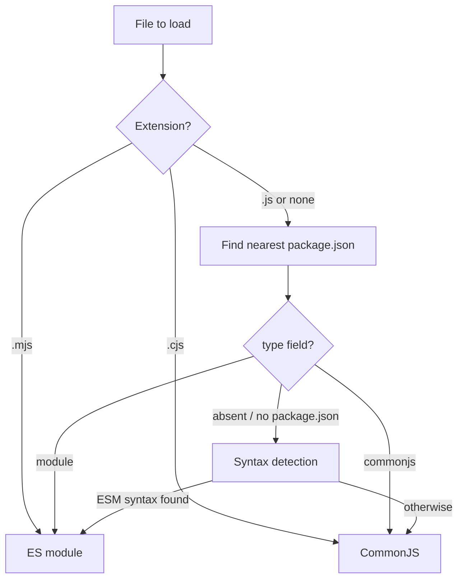

# Chapter 5 — Modules II: ECMAScript Modules

## What you will learn

- Predict, without running the code, whether Node will load a given file as an ES module or as CommonJS.
- Write `import`/`export` correctly under Node's strict specifier rules, including the mandatory file extension.
- Use `import.meta.url`, `import.meta.dirname`, `import.meta.filename`, `import.meta.main`, and `import.meta.resolve()` to replace the CommonJS module context.
- Load JSON, WebAssembly, and `data:` URLs with import attributes.
- Move values across the ESM/CommonJS boundary in both directions and know exactly where the boundary leaks.
- Reason about top-level `await` and what it does to everyone who depends on your module.

## Why this matters

You will spend more time on module-system questions than on any other Node configuration topic, and the failures are unusually confusing. A dependency you `require()` throws `ERR_REQUIRE_ASYNC_MODULE`. A named import from a package that clearly has that export comes back `undefined`. Neither is a bug in your logic; both are consequences of two module systems sharing one runtime, with a resolver that decides things at load time based on file extensions, a `package.json` three directories up, and — in ambiguous cases — a parse of your source text.

ES modules are the standard format and where the ecosystem is going. Node's implementation is complete and stable, but it is not a superset of CommonJS: it removes `__dirname`, extension guessing, and directory indexes, and it makes loading asynchronous. Each removal is deliberate, and each is something you will trip over once. Better here than in production.

## How Node decides a file is ESM

Node has two loaders. Before it can load anything it must pick one. The decision is made per file, using these rules, in this order of authority:

| Signal | Result | Overrides `"type"`? |
|---|---|---|
| `.mjs` extension | ES module | Yes, always |
| `.cjs` extension | CommonJS | Yes, always |
| `.js` + nearest `package.json` has `"type": "module"` | ES module | — |
| `.js` + nearest `package.json` has `"type": "commonjs"` | CommonJS | — |
| `.js` or extensionless + no `"type"` field anywhere | Ambiguous → syntax detection | — |
| `--input-type=module` with `--eval` or stdin | ES module | — |
| `--input-type=commonjs` with `--eval`/`--print` or stdin | CommonJS | — |

"Nearest `package.json`" means: look in the file's own directory, then the parent, then the parent's parent, and stop at the first `package.json` you find — or at a `node_modules` boundary, or at the volume root. If the search reaches the root without finding one, `.js` means CommonJS.

This lookup does not care whether the `package.json` is a real published package. A `package.json` containing nothing but `{"type": "module"}` dropped into a directory is a legitimate and common trick for flipping one subtree of a project to ESM.

### Syntax detection

When the file is genuinely ambiguous — a `.js` or extensionless file with no controlling `"type"` field — Node inspects the source. This is **syntax detection**, enabled by default since v22.7.0 (and v20.19.0), stability **1.2 – Release candidate**. It can be turned off with `--no-experimental-detect-module`.

Detection asks one question: would this source throw if evaluated as CommonJS? The markers are:

- `import` statements — but *not* `import()` expressions, which are legal CommonJS.
- `export` statements.
- A reference to `import.meta`.
- `await` at the top level of the module.
- A top-level lexical redeclaration (`const`, `let`, `class`) of a CommonJS wrapper variable: `require`, `module`, `exports`, `__filename`, `__dirname`.

If any appear, the file is an ES module; otherwise it is CommonJS.

Detection is a convenience, not a design goal, and it costs a parse. Put a `"type"` field in every `package.json` you write, including packages that are entirely CommonJS. Being explicit is faster and future-proofs the package against a change in the default.

```json
{
  "name": "invoice-service",
  "type": "module",
  "version": "1.0.0"
}
```



## Specifiers: the three kinds and the one rule

The *specifier* is the string after `from`, or the argument to `import()`. Node recognises three kinds.

**Relative specifiers** — `'./parse.js'`, `'../lib/config.mjs'`. Resolved against the importing module's URL using plain WHATWG URL semantics. The file extension is always required.

**Bare specifiers** — `'undici'`, `'lodash/merge.js'`. Resolved by the Node resolution algorithm through `node_modules`, honouring the target package's `"exports"` field. If the package has no `"exports"` field, you must include the file extension on subpaths; if it does, the extension is whatever `"exports"` says it is.

**Absolute specifiers** — `'file:///srv/app/config.js'`. A complete URL.

The single rule that catches everyone coming from CommonJS: **`import` does no extension guessing and no directory index resolution.** `import './util'` will not find `util.js`. `import './routes'` will not find `routes/index.js`. Both throw. This matches browser behaviour, and it is not going to change.

```mjs
// Wrong — throws ERR_MODULE_NOT_FOUND
import { parse } from './parse';
import router from './routes';

// Right
import { parse } from './parse.js';
import router from './routes/index.js';
```

### Modules are URLs

ESM resolves and caches modules as URLs, which has two consequences worth internalising.

First, characters that are special in URLs must be percent-encoded: `#` becomes `%23`, `?` becomes `%3F`. A file literally named `report#1.js` cannot be imported as `'./report#1.js'`.

Second, the query string and fragment are part of the cache key. These are two separate module instances:

```mjs
import './plugin.mjs?tenant=a';
import './plugin.mjs?tenant=b';
```

That is occasionally useful — it is the only supported way to force a module to be evaluated twice — but it also means a stray query string silently doubles your module's side effects.

Because path-to-URL conversion has real edge cases (drive letters on Windows, spaces, percent signs), convert with `url.pathToFileURL()` rather than string concatenation. Three URL schemes are supported: `file:`, `node:`, and `data:`. `https:` requires a custom loader (Chapter 53).

### `node:` and `data:` specifiers

Always use the `node:` prefix for builtins. It is unambiguous, it cannot be shadowed by a package in `node_modules`, and it resolves without touching the filesystem.

```mjs
import { readFile } from 'node:fs/promises';
import EventEmitter from 'node:events';
```

Builtins provide named exports for their public API plus a default export equal to the CommonJS `module.exports` value. Importing a builtin through ESM populates *all* named exports eagerly, even ones you never touch, making the first import marginally slower than `require()` or `process.getBuiltinModule()`. It matters only in startup-latency-sensitive code. If you monkey-patch a builtin's `module.exports` and want the ESM named exports to follow, call `module.syncBuiltinESMExports()`.

`data:` URLs (since v12.10.0) let you import source inline, with `text/javascript`, `application/json`, or `application/wasm`:

```mjs
import 'data:text/javascript,console.log("inline module");';
```

A `data:` module can resolve bare builtin and absolute specifiers, but *not* relative ones — `data:` is not a "special scheme", so there is no base to resolve against.

## `import.meta`

ESM has no `module`, no `exports`, no `__dirname`, no `__filename`, no `require`. The replacement is `import.meta`, an object the runtime hands each module.

| Property | Type | Since | Notes |
|---|---|---|---|
| `import.meta.url` | string | ESM launch | Absolute `file:` URL of this module |
| `import.meta.dirname` | string | v21.2.0 / v20.11.0 | Stable since v24.0.0 / v22.16.0; `file:` modules only |
| `import.meta.filename` | string | v21.2.0 / v20.11.0 | Stable since v24.0.0 / v22.16.0; symlinks resolved; `file:` modules only |
| `import.meta.main` | boolean | v24.2.0 / v22.18.0 | **[Experimental]** Stability 1.0 |
| `import.meta.resolve(specifier)` | string | v13.9.0 / v12.16.2 | Stability 1.2 – Release candidate; synchronous since v20.0.0 / v18.19.0 |

`import.meta.url` is the primitive; the rest derive from it. To read a file next to your module, build a URL, not a path — `fs` accepts `URL` objects directly:

```mjs
import { readFile } from 'node:fs/promises';

const schema = JSON.parse(
  await readFile(new URL('./schema.json', import.meta.url), 'utf8'),
);
```

`dirname` and `filename` exist for the cases where you genuinely need a path string — passing it to a library that only takes paths, for example. Note that `filename` has symlinks resolved, while `url` does not; if your deployment symlinks releases, those two disagree, and `filename` is usually the one you want.

`import.meta.main` replaces `require.main === module`. It lets one file be both a library and a CLI entry point without running the CLI part when imported:

```mjs
export function summarise(rows) {
  return { count: rows.length };
}

if (import.meta.main) {
  console.log(summarise(JSON.parse(process.argv[2])));
}
```

`import.meta.resolve()` returns the URL string a specifier *would* resolve to, without loading it. It respects the full algorithm, including a target package's `"exports"` restrictions, which is what makes it the correct way to locate a non-JS asset inside a dependency:

```mjs
const cssUrl = import.meta.resolve('component-lib/theme.css');
// 'file:///srv/app/node_modules/component-lib/theme.css'
```

Two caveats. It can perform synchronous filesystem work, so it has the same performance profile as `require.resolve` — do not call it in a hot path. And it is unavailable inside custom module hooks, where it would deadlock. The two-argument form `import.meta.resolve(specifier, parent)` is non-standard and requires `--experimental-import-meta-resolve`.

## Dynamic `import()` and top-level `await`

`import()` is an expression that returns a promise for a module namespace. It works in ES modules *and* in CommonJS, and it can load either format. It is the general-purpose escape hatch: lazy loading, conditional loading, and loading a computed specifier all go through it.

```mjs
const name = process.env.STORAGE_DRIVER ?? 's3';
const { createStore } = await import(`./drivers/${name}.js`);
```

Top-level `await` (v14.8.0) is what makes that read naturally. Any ES module may `await` in its top-level body. The cost is that the module becomes **asynchronous**, and asynchrony is contagious upward through the graph: every module that imports it, directly or transitively, must also wait for it. That has three practical consequences.

1. **`require()` can no longer load it.** `require()` of an ES module works only if the module *and its entire import graph* are free of top-level `await`. Otherwise you get `ERR_REQUIRE_ASYNC_MODULE`. Adding a top-level `await` to a widely-used module is a breaking change for every CommonJS consumer you have.
2. **A never-resolving top-level `await` hangs the module graph, and Node exits with status code 13.** There is no timeout and no stack trace pointing at the culprit; the process simply has nothing left to do and quits. If you see exit code 13, look for a promise you awaited at module scope that nobody ever settles.
3. **Startup cost moves into import.** Connecting to a database at module top level makes every import of that module block on the network.

Use top-level `await` for cheap, deterministic initialisation — reading a config file, decoding a WASM binary. For anything touching the network, export an async factory and let the caller decide when to pay.

## Import attributes and non-JS module types

Import attributes (v17.1.0 / v16.14.0; renamed from "import assertions" in v21.0.0 / v20.10.0 / v18.20.0) attach metadata to an import. Node supports exactly one attribute, `type`, with two values:

| `type` value | Loads | Status |
|---|---|---|
| `'json'` | JSON modules | Stable since v23.1.0 / v22.12.0 |
| `'text'` | Text modules | **[Experimental]** — requires `--experimental-import-text` (v26.5.0 / v24.19.0) |

```mjs
import config from './config.json' with { type: 'json' };

const { default: fixture } =
  await import('./fixture.json', { with: { type: 'json' } });
```

The attribute is **mandatory** for JSON; omitting it throws. JSON modules expose only a `default` export, so `import { port } from './config.json'` never works. The parsed object is cached in the CommonJS cache, so `require()` and `import` of the same file return the same object — *mutable and shared* across every importer.

WebAssembly modules no longer need a flag (since v24.5.0 / v22.19.0). `import` of a `.wasm` file gives you an instantiated module's exports; `import source` gives you the uninstantiated `WebAssembly.Module` for custom instantiation (stability 1.2 – Release candidate, v24.0.0).

Addons (`.node`) are not importable by default; they need `--experimental-addon-modules`, or you load them with `module.createRequire()`.

## ESM ↔ CommonJS interoperability

This is where most real confusion lives. Both directions work, but they are not symmetric.

### Importing CommonJS from ESM

When an ES module imports a CommonJS module, Node builds a namespace wrapper. That wrapper always has:

- `default` — the CommonJS `module.exports` value, whatever it is.
- `'module.exports'` — the same value under an explicit name, so tools can tell unambiguously that this namespace came from CJS (added v23.0.0).
- Any **detected named exports**.

Named export detection is a static analysis of the CommonJS source text, performed *before* the module is evaluated — it has to be, because the namespace shape must be fixed before evaluation begins. Node uses the `merve` analyser, which recognises common assignment patterns, re-export patterns, and the output of the major bundlers and transpilers.

```cjs
// metrics.cjs
exports.counter = 0;
exports.increment = () => { exports.counter += 1; };
```

```mjs
import { increment } from './metrics.cjs';   // works — detected
import metrics from './metrics.cjs';         // works — always
```

Detection is a heuristic. If exports are assigned in a loop, behind a conditional, or built by a helper, the analyser will not see them and the named import is a `SyntaxError` at link time. Detected named exports are also **snapshots, not live bindings**: `increment()` above updates `exports.counter`, but an imported `counter` binding keeps the old value. When in doubt, import the default and read properties off it.

### Requiring ESM from CommonJS

Since v22.0.0 / v20.17.0 (stable since v25.4.0 / v24.15.0), `require()` can load an ES module — provided the module and its whole graph are synchronous.

`require(esm)` returns the module namespace object, exactly like `import()` would. The default export is on `.default`; it is *not* the return value.

```mjs
// point.mjs
export default class Point {
  constructor(x, y) { this.x = x; this.y = y; }
}
export function distance(a, b) {
  return Math.hypot(b.x - a.x, b.y - a.y);
}
```

```cjs
const ns = require('./point.mjs');
// [Module: null prototype] { default: [class Point], distance: [Function], __esModule: true }
const Point = ns.default;
```

`__esModule: true` is added when the namespace has a default export, so transpiler-generated code recognises it. It is experimental tooling support; do not depend on it in application code.

To make `require()` of your ESM module return one value directly, export it under the string name `'module.exports'`:

```mjs
export default class Point { /* ... */ }
export function distance(a, b) { return Math.hypot(b.x - a.x, b.y - a.y); }
export { Point as 'module.exports' };
```

Now `require('./point.mjs')` returns the `Point` class itself. The trade-off: named exports become invisible to CommonJS consumers. The fix is to hang them off the default as static properties.

| From \ To | Import CJS | Require ESM |
|---|---|---|
| Default export | Always available (`module.exports`) | On `.default` |
| Named exports | Best-effort static detection | Full, real named exports |
| Live bindings | No — values are copied once | Yes |
| Top-level `await` allowed | N/A | No — `ERR_REQUIRE_ASYNC_MODULE` |
| Override the shape | N/A | `export { X as 'module.exports' }` |

### What ESM does not have

| CommonJS | ESM replacement |
|---|---|
| `__dirname`, `__filename` | `import.meta.dirname`, `import.meta.filename` |
| `require.main === module` | `import.meta.main` |
| `require.resolve()` | `import.meta.resolve()` or `module.createRequire()` |
| `require()` | `import`, `import()`, or `module.createRequire()` |
| `require.cache` | Not available — ESM has its own separate cache with no public API |
| `require.extensions` | Module customization hooks (Chapter 53) |
| `NODE_PATH` | Not honoured — use symlinks or workspaces |
| Addon loading | `module.createRequire()` or `process.dlopen()` |

`module.createRequire()` (v12.2.0) manufactures a real `require` scoped to a URL or path:

```mjs
import { createRequire } from 'node:module';
const require = createRequire(import.meta.url);
const addon = require('./build/Release/hash.node');
```

`require.cache` has no ESM equivalent: there is no supported way to evict and reload an ES module. Test suites that relied on cache busting must use query-string imports, worker threads, or a fresh child process.

## The resolution and loading algorithm

You do not need the specification text, but the shape of it explains most error messages.

Resolution is one function: given a specifier and the parent module's URL, produce a resolved URL plus a suggested format. It has these properties:

- URL-based, relative and absolute.
- **No default extensions. No folder mains.**
- Bare specifiers resolve through `node_modules`, honouring `"exports"`.
- It does not fail on unknown extensions or protocols — that is the loader's job.

Loading is a second, separate step. The loader accepts `file:`, `node:`, and `data:` and fails on any other protocol. For `file:` URLs it accepts only `.cjs`, `.js`, and `.mjs` for JavaScript, plus `.json` and `.wasm`. Anything else is `ERR_UNKNOWN_FILE_EXTENSION`. This two-phase split is why a specifier can resolve fine and still explode at load time.

Format determination walks a short list: `.mjs` → module, `.cjs` → commonjs, `.json` → json, `.wasm` → wasm, `.node` → addon (flagged). Only for `.js` or no extension does it consult `"type"`, then syntax detection. The default condition set for ESM resolution is `["node", "import"]`; Chapter 6 covers what that means for `"exports"`.

Resolution throws a small, fixed set of errors — *Invalid Module Specifier*, *Invalid Package Configuration*, *Invalid Package Target*, *Package Path Not Exported*, *Package Import Not Defined*, *Module Not Found*, *Unsupported Directory Import*. Seeing one tells you the failure came from the resolver, not your code.

## Common mistakes

### ❌ Omitting the file extension in a relative import

```mjs
import { formatMoney } from './format';
```

The most common ESM error. It works in CommonJS, in webpack, and in TypeScript's default settings, so the habit is ingrained. Node throws `ERR_MODULE_NOT_FOUND`, and because the missing file is reported by URL the message reads like a path bug rather than an extension bug.

```mjs
// ✅
import { formatMoney } from './format.js';
```

### ❌ Assuming `require()` of an ESM default export returns the default

```cjs
const Point = require('./point.mjs');
new Point(1, 2); // TypeError: Point is not a constructor
```

`require(esm)` returns the *namespace*, not the default export. The namespace is a `[Module: null prototype]` object, so the failure is a confusing `not a constructor` or `not a function`.

```cjs
// ✅
const { default: Point } = require('./point.mjs');
new Point(1, 2);
```

### ❌ Adding top-level `await` to a shared library module

```mjs
// db.mjs
import { connect } from './pool.js';
export const db = await connect(process.env.DATABASE_URL);
```

Every CommonJS consumer — including transitive ones through packages you do not control — now fails with `ERR_REQUIRE_ASYNC_MODULE`. Every ESM consumer blocks on a network call during import, and if it never settles the process exits with code 13 and no diagnostic.

```mjs
// ✅ export a factory; the caller chooses when to pay
import { connect } from './pool.js';

let pool;
export async function getDb() {
  pool ??= await connect(process.env.DATABASE_URL);
  return pool;
}
```

### ❌ Importing JSON without the `type` attribute

```mjs
import pkg from './package.json';
```

Throws. The attribute is not optional, and it must also be present in the dynamic form.

```mjs
// ✅
import pkg from './package.json' with { type: 'json' };
```

### ❌ Relying on detected named exports from a dynamic CommonJS module

```cjs
// registry.cjs
for (const name of ['users', 'orders']) {
  exports[name] = makeHandler(name);
}
```

```mjs
import { users } from './registry.cjs'; // SyntaxError at link time
```

The static analyser cannot see exports produced by a loop. The default import always works.

```mjs
// ✅
import registry from './registry.cjs';
const { users } = registry;
```

## Production notes

- **Be explicit about `"type"` everywhere.** Syntax detection costs a parse per ambiguous file, and in the `--eval`/stdin path Node may try CommonJS, then ESM, then type stripping. Across a few thousand modules that is measurable startup time.
- **Watch the `require(esm)` boundary in dependencies.** A minor-version bump of a transitive dependency that introduces top-level `await` can break a CommonJS consumer with `ERR_REQUIRE_ASYNC_MODULE` at runtime, not install time. `--trace-require-module` surfaces where `require(esm)` is happening. There is also a rarer `ERR_REQUIRE_ESM_RACE_CONDITION` (**[Experimental]**, v26.1.0 / v24.16.0) when a `require()` collides with an in-flight `import()` of the same module.
- **Exit code 13 means an unresolved top-level `await`.** Add it to your runbook. The process produces no error output; monitoring that only alerts on non-zero exit *with* a stack trace will miss it entirely.
- **JSON module objects are shared and mutable.** The same parsed object is handed to every importer and cached in the CommonJS cache. Freeze it at the boundary or clone before mutating.
- **Query-string imports leak memory.** Each distinct query string is a cache entry that is never collected. Do not build hot reload on `import('./mod.js?v=' + Date.now())` in a long-running process; use a worker or child process.
- **`import.meta.resolve()` does synchronous I/O.** Resolve at startup and cache the result. Calling it per request will show up in your latency percentiles.
- **`NODE_PATH` is silently ignored by ESM.** After an ESM migration, deployments that relied on it find half their imports work and half do not. Use workspaces or the `"imports"` field (Chapter 6).

## Exercises

1. **Predict the loader.** Create a directory whose `package.json` is `{"type": "module"}`, containing `a.js` (uses `export`), `b.cjs`, `c.mjs`, and a subdirectory `legacy/` with its own `{"type": "commonjs"}` and a `d.js` using `require`. Write down which loader handles each file before running them. Success: all four predictions correct and all four files run.

2. **Replace the CommonJS context.** Take a CommonJS script that uses `__dirname` to read a sibling data file and `require.main === module` to guard its CLI entry point. Convert it to ESM using `import.meta` only — no `createRequire`, no `path.join`. Success: identical output, and the file works both when run directly and when imported.

3. **Map the interop matrix by experiment.** Write `lib.mjs` with a default and two named exports, and `lib.cjs` assigning `module.exports = { ... }`. Write consumers that `import` the `.cjs`, `require` the `.mjs`, and `import * as ns` from each; log every namespace. Success: you can explain each key printed, including `'module.exports'` and `__esModule`.

4. **Break and diagnose an async module.** Add `export const x = await new Promise(() => {})` to a module, import it from a second file, and run it. Observe the exit code. Then `require()` it from a `.cjs` file and record the error code. Success: you observe exit code 13 in the first case and `ERR_REQUIRE_ASYNC_MODULE` in the second, and can state which one produces no output at all.

5. **Build a plugin loader.** Write a program that reads plugin names from `process.argv`, resolves each with `import.meta.resolve()` to verify it exists before loading, then loads them concurrently with `Promise.all` and dynamic `import()`. Handle a nonexistent plugin without crashing the process. Success: valid plugins load, invalid ones produce one clear error line each, and the process exits 0.

## Recap

- Extension wins over `"type"`: `.mjs` and `.cjs` are absolute; `.js` follows the nearest `package.json`; ambiguous files fall through to syntax detection.
- Always set `"type"` explicitly. Detection is a fallback, not a feature to depend on.
- `import` requires the full specifier: no extension guessing, no directory indexes.
- Modules are URLs. Percent-encode special characters, and remember that query strings create separate module instances.
- `import.meta` replaces the CommonJS context: `url`, `dirname`, `filename`, `main` (**[Experimental]**), and `resolve()`.
- Top-level `await` makes a module asynchronous and contagious — it breaks `require()` for the whole graph and can exit the process with code 13.
- JSON needs `with { type: 'json' }` and exposes only a default export.
- Importing CJS gives you a guaranteed `default` plus best-effort detected named exports; `require()`ing ESM gives you the full namespace object, with the default on `.default`.

## Where to go next

- [Chapter 4 — Modules I: CommonJS](04-modules-commonjs.md) — the other half of the interop story.
- [Chapter 6 — Packages: `package.json`, exports, imports, dual publishing](06-packages-and-exports.md) — how bare specifiers actually resolve.
- [Chapter 7 — TypeScript in Node.js](07-typescript.md) — `.ts` files under the same rules.
- [Chapter 53 — Module Customization Hooks and Loaders](../part8-advanced/53-module-hooks.md) — customising resolution and loading.
- Official documentation: <https://nodejs.org/docs/latest/api/esm.html>
