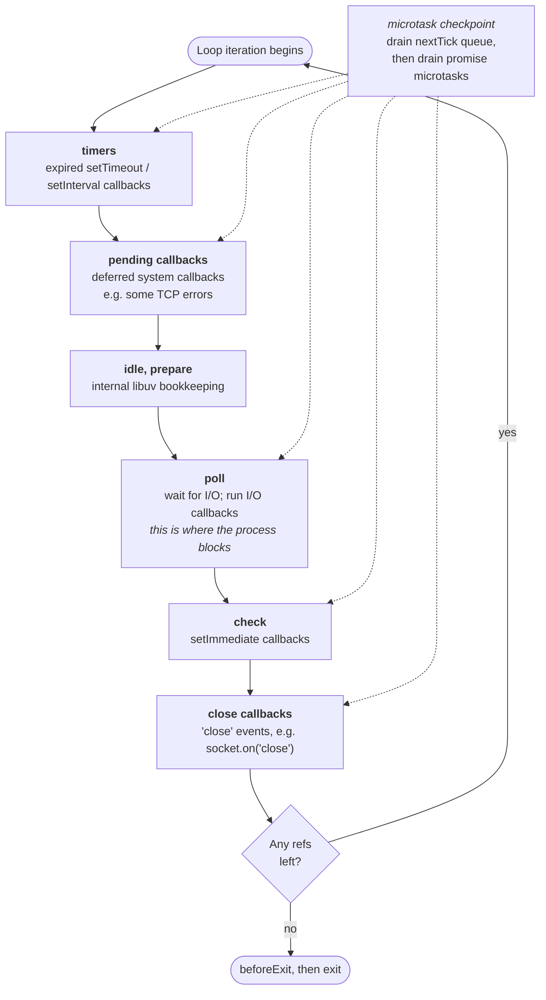

# Chapter 9 — The Event Loop: Phases, Microtasks, and Starvation

**What you will learn**

- Name every phase of the libuv event loop, in order, and say what kind of callback runs in each.
- Predict the output of programs that mix `setTimeout`, `setImmediate`, `process.nextTick`, and promises — including the cases where the answer is genuinely nondeterministic.
- Explain the two microtask-ish queues Node maintains and the exact order in which they drain.
- Recognise and fix loop starvation, both the microtask kind and the CPU-bound kind.
- Measure event loop health in production with `monitorEventLoopDelay()` and `eventLoopUtilization()`.
- Explain precisely why a Node process stays alive, and use `ref()`/`unref()` to control it.

**Why this matters**

Every performance problem you will ever have in Node is, at bottom, a question about this chapter. A HTTP endpoint that answers in 5 ms under load but 900 ms under slightly more load is not usually slow code — it is a saturated event loop. A background job that "sometimes runs and sometimes doesn't" is usually an unref'd handle. A test that passes locally and fails in CI is very often a `setTimeout(fn, 0)` versus `setImmediate(fn)` ordering assumption that was never guaranteed in the first place.

Node's concurrency model is one thread running JavaScript, cooperating with an operating system that does the waiting. That sentence is the whole design; its consequences are not obvious and mostly bite in production. This chapter builds the mental model properly, so that when your p99 latency triples you can reason about it instead of guessing.

## One thread, many things in flight

Node runs your JavaScript on one thread. It does not run two of your functions at the same time. Ever. What it does instead is *never block that thread waiting for the outside world*.

When you ask to read a file, Node hands the request to libuv, which either uses a non-blocking system call or dispatches the work to a small pool of background threads. Your JavaScript returns immediately. Later, when the data is ready, libuv puts your callback on a queue, and the event loop runs it — on that same single JavaScript thread, when the thread is free.

So "asynchronous" in Node means: *the waiting happens somewhere else; the JavaScript still happens one function at a time.* Two consequences govern everything else. While one of your functions is running, nothing else can run — no timer fires, no socket is read, no promise settles. And therefore the only thing that makes Node concurrent is that your functions return quickly. The event loop is the machine that runs those returned-to-quickly callbacks in a defined order.

## The phases

libuv's loop is not a single queue. It is a fixed cycle of *phases*, each with its own callback queue. One trip around the cycle is a **tick** of the loop (not to be confused with `process.nextTick`, which — unhelpfully — has nothing to do with a loop tick).



The dotted lines matter as much as the solid ones: **between every callback, Node drains its microtask queues.** More on that in a moment.

| Phase | What runs here | You interact with it via |
|---|---|---|
| **timers** | Callbacks for timers whose threshold has elapsed | `setTimeout`, `setInterval` |
| **pending callbacks** | System-level callbacks libuv deferred from the previous iteration (for example, some TCP error reports) | Nothing directly |
| **idle, prepare** | libuv internal use only | Nothing directly; `monitorEventLoopDelay({ samplePerIteration: true })` hooks here |
| **poll** | Retrieve new I/O events and run their callbacks. This is where the loop *waits* | `fs`, `net`, `http`, sockets, streams |
| **check** | Callbacks scheduled to run right after poll | `setImmediate` |
| **close callbacks** | Cleanup callbacks for abruptly closed handles | `socket.on('close', ...)`, `server.on('close', ...)` |

The **poll phase** is the interesting one. There the loop asks the operating system "has anything happened?" — `epoll_wait` on Linux, `kqueue` on macOS/BSD, an IOCP-based mechanism on Windows — and runs any ready callbacks. If nothing is pending it *blocks the process*, genuinely sleeping and burning no CPU, until an I/O event arrives or the nearest timer is about to expire. That sleep is why an idle Node server uses ~0% CPU.

Each phase drains its own queue before moving on, subject to a system-dependent limit so a flood of I/O cannot pin the loop in poll forever.

## The two queues that jump the line

Sitting outside the phase cycle are two queues that are drained far more aggressively than any phase:

- **The next tick queue** — populated by `process.nextTick(callback)`. **[Legacy]** as of v22.7.0 / v20.18.0; the docs now steer new code to `queueMicrotask()`.
- **The microtask queue** — the V8-managed queue that runs `.then`/`.catch`/`.finally` callbacks, the continuation of every `await`, and anything you pass to `queueMicrotask()`.

These are drained **after the currently executing JavaScript stack unwinds**, and *before the loop is allowed to continue*. Not once per phase — after *every single callback*. If the timers phase has three expired timers, the microtask checkpoint happens after the first, after the second, and after the third.

The draining rule is short and worth memorising:

> Drain the entire next tick queue. Then drain the entire microtask queue. If draining the microtask queue added new next-tick callbacks, repeat.

Because the next tick queue is fully drained first, `process.nextTick` callbacks run before promise callbacks that were scheduled at the same moment:

```cjs
const { nextTick } = require('node:process');

Promise.resolve().then(() => console.log('promise'));
queueMicrotask(() => console.log('microtask'));
nextTick(() => console.log('nextTick'));

// Output:
// nextTick
// promise
// microtask
```

Now a genuine trap, and one of the few observable behavioural differences between CommonJS and ESM. The top level of an ES module is evaluated *as part of the microtask queue*, because module evaluation is promise-driven. By the time your top-level code runs, Node is already inside a microtask drain, so those microtasks flush before control returns to the next-tick drain:

```mjs
import { nextTick } from 'node:process';

Promise.resolve().then(() => console.log('promise'));
queueMicrotask(() => console.log('microtask'));
nextTick(() => console.log('nextTick'));

// Output:
// promise
// microtask
// nextTick
```

Identical source, different order, purely because of the module system — exactly the kind of thing that breaks a test when you convert `.cjs` to `.mjs`. The lesson is not "memorise both orderings" but **never write code whose correctness depends on the relative order of `nextTick` and promise callbacks.** Use `queueMicrotask()`: portable, standard, identical in both module systems.

`process.nextTick` retains one niche: guaranteeing a synchronous-looking API is asynchronous, so callers can attach listeners after construction but before anything is emitted. Even there, `queueMicrotask()` is usually a drop-in replacement.

## `setTimeout(fn, 0)` versus `setImmediate(fn)`

This is the single most-asked Node interview question, and most answers are half right.

`setImmediate` schedules into the **check** phase. `setTimeout(fn, 0)` schedules into the **timers** phase — and note that a `delay` of `0` is not really `0`: the docs say any delay less than `1`, greater than `2147483647`, or `NaN` is clamped to `1` ms. So `setTimeout(fn, 0)` is `setTimeout(fn, 1)`.

Now consider this program run from the main module:

```js
setTimeout(() => console.log('timeout'), 0);
setImmediate(() => console.log('immediate'));
```

Run it ten times and you will see both orderings, because the outcome depends on how long startup took. Node enters the loop and reaches the timers phase. If at least 1 ms of wall clock has elapsed since the timer was armed, it has expired and fires first. If startup was faster than that, the timers phase finds nothing, the loop proceeds to poll (empty) and then to check — and `immediate` wins. Machine load and CPU frequency scaling both feed into this. **The order is nondeterministic. Do not depend on it.**

Now move the same two calls inside an I/O callback:

```mjs
import { readFile } from 'node:fs';

readFile(import.meta.filename, () => {
  setTimeout(() => console.log('timeout'), 0);
  setImmediate(() => console.log('immediate'));
});

// Always:
// immediate
// timeout
```

This is deterministic, and the phase diagram tells you why. The `readFile` callback runs in the **poll** phase. When it returns, the loop's very next stop is **check** — so `immediate` fires in the same loop iteration. The timer cannot fire until the loop wraps around to **timers** on the *next* iteration. Inside any I/O callback, `setImmediate` always beats `setTimeout`.

**When you want "run this after the current phase, as soon as possible", use `setImmediate`.** It has a defined position in the cycle. `setTimeout(fn, 0)` is a wish, not a schedule.

## Starvation

The microtask checkpoint has no budget: it drains until empty. A microtask that schedules another microtask, forever, means the loop never advances past the current callback.

```js
// Do not run this in anything you care about.
function starve() {
  queueMicrotask(starve);
}
setTimeout(() => console.log('I will never print'), 100);
starve();
```

The process is now pinned at 100% CPU, the timer never fires, connections are never accepted, and even `SIGINT` handling is delayed because the signal handler is itself a loop callback. Recursive `process.nextTick` does the same, and — more insidiously — so does an `async` function that never awaits anything which truly yields:

```js
// Also starves the loop: `await` on an already-resolved value
// is just a microtask, not a trip through the event loop.
async function drain(queue) {
  while (queue.length > 0) {
    await handle(queue.shift()); // if handle() is synchronous inside, this never yields
  }
}
```

`await` yields to the *microtask queue*, not to the *event loop*. If everything you await is already settled, your loop is a busy loop with extra steps.

The fix is to yield to a real phase. `setImmediate` is the primitive for this, and `timers/promises` gives you an awaitable version:

```mjs
import { setImmediate as yieldToLoop } from 'node:timers/promises';

async function processBatch(items, handle) {
  for (let i = 0; i < items.length; i++) {
    await handle(items[i]);
    // Every 100 items, let the loop breathe: I/O callbacks,
    // timers and new connections get a turn.
    if (i % 100 === 99) await yieldToLoop();
  }
}
```

`node:timers/promises` also exposes `scheduler.yield()` — **[Experimental]** — defined as equivalent to `setImmediate()` with no arguments and being standardised as a web platform API. It states intent more clearly, but does the same job.

## Blocking the loop with CPU work

Microtask starvation is the exotic failure. The everyday one is plain synchronous work: hashing a password with a synchronous KDF, `JSON.parse` on a 40 MB payload, a regex with catastrophic backtracking, `readFileSync` in a request handler, a nested loop over 10⁷ elements.

The symptom is distinctive. Throughput stays fine, median latency stays fine, but p99 explodes — every request arriving during someone else's 200 ms CPU burn waits behind it. A single-threaded server with occasional long jobs produces exactly this tail-latency signature.

Node gives you two purpose-built instruments.

### Event loop delay

`perf_hooks.monitorEventLoopDelay([options])` returns an `ELDHistogram` that samples how late the loop is running versus when it intended to run. Delay is reported in **nanoseconds**.

```mjs
import { monitorEventLoopDelay } from 'node:perf_hooks';

const h = monitorEventLoopDelay({ resolution: 20 });
h.enable();

// ... run your workload ...

setInterval(() => {
  console.log({
    p50: h.percentile(50) / 1e6,
    p99: h.percentile(99) / 1e6,
    max: h.max / 1e6,
    mean: h.mean / 1e6,
  });
  h.reset();
}, 10_000).unref();
```

Options and members you will actually use:

| Name | Meaning |
|---|---|
| `resolution` | Sampling interval in ms for interval-based sampling. Must be > 0. **Default:** `10` |
| `samplePerIteration` | When `true`, sample once per loop iteration using libuv prepare/check hooks instead of a timer. Does not keep the loop alive or force extra iterations when idle. **Default:** `false`. Added in v26.5.0 / v24.19.0 |
| `h.enable()` / `h.disable()` | Start/stop sampling; return `true` if the state actually changed |
| `h.min`, `h.max`, `h.mean`, `h.stddev` | Summary statistics, in nanoseconds |
| `h.percentile(p)`, `h.percentiles` | Percentile lookup and the full percentile map |
| `h.count`, `h.exceeds` | Sample count, and how many samples exceeded the 1-hour ceiling |
| `h.reset()` | Clear recorded data — call this after each export so you get per-window stats |
| `h[Symbol.dispose]()` | Disables sampling; works with `using` |

The two sampling modes produce genuinely different numbers and must not be compared against each other. Pick one and stay with it.

`ELDHistogram` instances can be sent over a `MessagePort`; on the receiving side you get a plain `Histogram` without `enable()`/`disable()`.

### Event loop utilization

`perf_hooks.eventLoopUtilization()` (also available as `performance.eventLoopUtilization()`) answers a different question: what fraction of wall clock time was the loop *active* rather than parked in the event provider?

```mjs
import { eventLoopUtilization } from 'node:perf_hooks';

let last = eventLoopUtilization();

setInterval(() => {
  const delta = eventLoopUtilization(last);
  last = eventLoopUtilization();
  console.log(`ELU over last 5s: ${(delta.utilization * 100).toFixed(1)}%`);
}, 5000).unref();
```

The returned object has `idle`, `active` (both in high-resolution milliseconds) and `utilization` (a ratio in `[0, 1]`). Pass one previous result to get the delta since then; pass two to get the delta between them. Only ever pass values that came out of `eventLoopUtilization()` — a hand-made object produces undefined behaviour.

ELU is *not* CPU utilization: it measures time spent outside the event provider (`epoll_wait` and friends). A process blocked for five seconds in `spawnSync('sleep', ['5'])` uses almost no CPU yet reports a utilization of `1`, because the loop could not proceed. That is the property you want: **ELU measures unavailability, whatever the cause.**

Two numbers, two jobs: ELU tells you *how busy* the loop is, loop delay tells you *how bad the worst blocks are*. Export both. A sustained ELU above roughly 0.7 means you are close to the cliff; a p99 loop delay in the tens of milliseconds means users already feel it.

The fixes, in order of preference: move the work off the loop entirely (`node:worker_threads`, see [Chapter 29 — Worker Threads](../part4-system/29-worker-threads.md)); use the async variant of the API instead of the sync one; or chunk the work and yield between chunks.

## The other threads

The loop is single-threaded, but Node's *process* is not. libuv keeps a fixed-size thread pool — **4 threads by default** — for work that has no non-blocking system call. According to the docs, the pool is used by:

- all `fs` APIs except the file watchers and the explicitly synchronous ones,
- asynchronous crypto APIs such as `crypto.pbkdf2()`, `crypto.scrypt()`, `crypto.randomBytes()`, `crypto.randomFill()`, `crypto.generateKeyPair()`,
- `dns.lookup()`,
- all `zlib` APIs except the explicitly synchronous ones.

Note what is *absent*: TCP, UDP and HTTP sockets are handled by the kernel's polling mechanism, so network I/O consumes no pool threads.

Because the pool is small and shared, four concurrent `crypto.pbkdf2()` calls make unrelated `fs.readFile()` calls queue behind them. Raise it with the `UV_THREADPOOL_SIZE` environment variable — set in the environment before startup. Assigning `process.env.UV_THREADPOOL_SIZE` from inside your code is not guaranteed to work, because the pool is created during runtime initialisation, long before your code runs.

```bash
UV_THREADPOOL_SIZE=16 node server.js
```

## What keeps the process alive

Node exits when the event loop has nothing left to do. "Nothing left to do" has a precise meaning: libuv tracks two kinds of things.

- **Handles** — long-lived objects: servers, sockets, timers, `Immediate`s, file watchers, child process wrappers.
- **Requests** — short-lived operations: a single `fs.read`, a DNS lookup, a write.

A handle is either *referenced* or *unreferenced*. The loop keeps running while there is at least one referenced handle or pending request. A referenced timer keeps your process alive; an unreferenced one does not.

`process.getActiveResourcesInfo()` shows you exactly what is holding the door open, as an array of type-name strings:

```mjs
import { getActiveResourcesInfo } from 'node:process';

console.log('Before:', getActiveResourcesInfo());
setTimeout(() => {}, 1000);
console.log('After:', getActiveResourcesInfo());
// Before: [ 'TTYWrap', 'TTYWrap', 'TTYWrap' ]
// After:  [ 'TTYWrap', 'TTYWrap', 'TTYWrap', 'Timeout' ]
```

When a CLI tool refuses to exit, this one line usually finds the culprit.

### `ref()` and `unref()`

Every `Timeout` (from `setTimeout`/`setInterval`) and every `Immediate` (from `setImmediate`) exposes three methods:

| Method | Effect |
|---|---|
| `unref()` | This handle no longer keeps the loop alive. Returns the handle |
| `ref()` | Undo `unref()`. Handles start ref'd, so this is only needed after an `unref()`. Returns the handle |
| `hasRef()` | `true` if the handle is currently keeping the loop alive. Added in v11.0.0 |

The canonical use is background housekeeping that should never delay shutdown:

```mjs
// A metrics flush every 30s — useful while the server runs,
// but it must not stop `node script.js` from exiting.
const flusher = setInterval(flushMetrics, 30_000);
flusher.unref();

console.log(flusher.hasRef()); // false
```

Sockets and servers have `ref()`/`unref()` too. The pattern generalises: **anything periodic and non-essential should be unref'd.**

The mirror-image bug is a handle you forgot to close — an open server, a keep-alive socket, a live `setInterval` — which keeps the process running forever after the work is done. Both failure modes are diagnosed with the same call to `getActiveResourcesInfo()`.

### `'beforeExit'`

When the loop empties and nothing is scheduled, Node emits `'beforeExit'` on `process` with the current `process.exitCode` as its argument. A listener may schedule more asynchronous work, in which case the loop resumes and `'beforeExit'` fires again later. It is *not* emitted for explicit termination — `process.exit()` and uncaught exceptions skip it. Use it to schedule additional work, not as a cleanup hook; see [Chapter 26 — Signals, Graceful Shutdown, and Process Lifecycle](../part4-system/26-signals-and-shutdown.md).

## Common mistakes

### ❌ Assuming `setTimeout(fn, 0)` runs before `setImmediate(fn)`

Test passes on your laptop, fails in CI. From the main module the order varies with startup timing, because a `0` delay is clamped to `1` ms and the timers phase may or may not consider it expired on the first pass.

```js
// ✅ If you need "after the current phase", say so:
setImmediate(() => console.log('runs in the check phase'));

// ✅ If you need ordering between two of your own steps,
// express it with a promise chain, not with timer racing:
await doFirst();
await doSecond();
```

### ❌ Yielding with `await` on already-settled promises

```js
// ❌ Never yields to the event loop. Timers stall, connections queue.
for (const row of tenMillionRows) {
  await transform(row);   // transform() is synchronous inside
}
```

`await` yields to the microtask queue. The microtask queue is drained before the loop advances, so if nothing you await is backed by real I/O, you have written a busy loop.

```mjs
// ✅ Yield to a real phase periodically.
import { setImmediate as yieldToLoop } from 'node:timers/promises';

let i = 0;
for (const row of tenMillionRows) {
  await transform(row);
  if (++i % 1000 === 0) await yieldToLoop();
}
```

### ❌ Writing code that depends on `nextTick` versus promise ordering

```js
// ❌ "The cache is definitely warm by the time the promise callback runs."
process.nextTick(() => { cache.warm(); });
Promise.resolve().then(() => cache.read()); // true in CJS, false in ESM
```

The relative order flips between CommonJS and ESM, because ESM top-level evaluation already happens inside a microtask drain.

```js
// ✅ Express the dependency, don't infer it from queue mechanics.
const warmed = warmCache();
warmed.then(() => cache.read());
```

### ❌ Doing CPU work in a request handler because "it's only 50 ms"

Fifty milliseconds of synchronous work is fifty milliseconds during which *no other request is served*. At 100 req/s with 10% of requests on that path you have added 500 ms of blocking per second — half your loop capacity — and p99 will be measured in seconds.

```mjs
// ✅ Move it off the loop.
import { Worker } from 'node:worker_threads';
// or use the async API: crypto.scrypt() instead of crypto.scryptSync()
```

### ❌ Leaving a `setInterval` ref'd in a short-lived script

Your CLI prints its result and then hangs forever. The interval is a referenced handle, so the loop is never empty.

```js
// ✅
const heartbeat = setInterval(ping, 5000);
heartbeat.unref();
```

## Production notes

- **Export loop delay and ELU as first-class metrics.** They are leading indicators; request latency lags. Rising ELU tells you to scale out *before* users notice. Reset the histogram after each scrape so you get per-window, not lifetime, percentiles.
- **Alert on p99 loop delay, not the mean.** The mean is dominated by the idle case and looks healthy right up until the pager goes off. `samplePerIteration` mode catches short spikes better; in the default timer mode, `resolution` sets your blind spot.
- **The thread pool is a shared, fixed resource of 4.** A burst of `crypto.pbkdf2()` or `zlib` work will slow down unrelated `fs` and `dns.lookup()` calls. Size it deliberately with `UV_THREADPOOL_SIZE` in the environment — never from inside the process — and remember that oversizing it costs memory and context switches.
- **`dns.lookup()` uses the thread pool; the `dns.resolve*()` family does not.** A slow resolver can therefore stall file I/O in a way that looks entirely unrelated — a classic mystery incident.
- **Uncontrolled concurrency starves the loop as effectively as CPU work.** Firing 10,000 simultaneous `fs.readFile()` calls floods the poll phase and the thread pool. Bound it — see [Chapter 11 — Callbacks, Promises, async/await, and `util.promisify`](11-promises-and-async.md) for a pool implementation.
- **Audit `unref()` before shipping.** Unref'd timers are exactly right for heartbeats and wrong for anything whose completion matters: the process may exit mid-flight, silently. If a piece of work must finish, keep it ref'd and shut down deliberately.
- **In a container, one Node process uses one core for JavaScript.** Unless you use worker threads, give it roughly one CPU and scale out with more processes ([Chapter 30 — Cluster and Multi-Process Scaling](../part4-system/30-cluster.md)).
- **Worker threads have their own event loops.** ELU is available immediately on workers because their bootstrap happens inside the loop; on the main thread it reads `0` until bootstrap finishes. Monitor each worker separately.

## Exercises

1. **Prove the nondeterminism.** Write a script that schedules a `setTimeout(fn, 0)` and a `setImmediate(fn)` at the top level and prints which ran first. Run it 200 times from a shell loop and count both outcomes. Then move both calls inside an `fs.readFile` callback and repeat. *Success:* the first version shows both orders across runs; the second shows `immediate` first in 200 out of 200.

2. **Map the queues.** Write one script that schedules, in this order: a `setTimeout(fn, 0)`, a `setImmediate`, a `queueMicrotask`, a `process.nextTick`, and a `Promise.resolve().then`. Predict the output before running it. Save it as both `.mjs` and `.cjs` and explain any difference. *Success:* your written prediction matches both actual outputs, and you can name the mechanism behind the difference.

3. **Build a starvation detector.** Enable `monitorEventLoopDelay` and log a warning whenever the p99 delay over a 5-second window exceeds a configurable threshold. Verify it by blocking the loop with a synchronous 300 ms busy-wait. *Success:* the warning fires for the blocking case and stays silent for an idle process.

4. **Make a hot loop cooperative.** Compute SHA-256 over one million small strings. With a ref'd 100 ms `setInterval` running alongside, measure how many interval ticks are dropped. Rewrite it to yield with `setImmediate` from `node:timers/promises` every N items and tune N so no tick is delayed by more than 20 ms. *Success:* you can state the runtime cost of the yielding and the N you chose.

5. **Diagnose a hanging process.** Write a script that opens a TCP server, sets a 60-second interval, and finishes its real work in 100 ms. Without reading your own source, use `process.getActiveResourcesInfo()` and `hasRef()` to work out why it does not exit, then make it exit within 200 ms while keeping the interval functional during the run. *Success:* the fix uses `unref()` and/or explicit close, and the script exits with code 0.

## Recap

- Node runs your JavaScript on one thread; concurrency comes from callbacks that return quickly, not from parallelism.
- The libuv loop cycles through six phases: **timers → pending callbacks → idle/prepare → poll → check → close callbacks**. The poll phase is where the process actually waits for the OS.
- `setTimeout`/`setInterval` land in **timers**; `setImmediate` lands in **check**. Their relative order from the main module is nondeterministic; inside an I/O callback `setImmediate` always wins.
- Between *every* callback, Node drains the next tick queue to empty and then the microtask queue to empty. `process.nextTick` is **[Legacy]**; prefer `queueMicrotask()`, which also avoids the CJS/ESM ordering difference.
- Microtasks have no budget, so recursive microtasks — including `await` on already-settled values in a loop — starve the loop completely. Yield with `setImmediate` from `node:timers/promises`.
- Synchronous CPU work blocks everything. Detect it with `monitorEventLoopDelay()` (nanosecond histogram of lateness) and `eventLoopUtilization()` (fraction of time the loop was unavailable).
- libuv's 4-thread pool serves `fs`, async crypto, `dns.lookup()` and `zlib` — not network sockets. Size it via the `UV_THREADPOOL_SIZE` environment variable, before startup.
- The process stays alive while a referenced handle or pending request exists. `unref()`/`ref()`/`hasRef()` control this, and `process.getActiveResourcesInfo()` tells you what is holding on.

## Where to go next

- [Chapter 10 — Timers and Scheduling](10-timers.md) — the full timer API surface, drift, and self-correcting intervals.
- [Chapter 11 — Callbacks, Promises, async/await, and `util.promisify`](11-promises-and-async.md) — the abstractions built on top of the loop.
- [Chapter 12 — EventEmitter and the Events Module](12-eventemitter.md) — Node's synchronous notification primitive.
- [Chapter 29 — Worker Threads](../part4-system/29-worker-threads.md) — where CPU-bound work belongs.
- [Chapter 49 — Measuring Performance with `perf_hooks`](../part7-diagnostics/49-perf-hooks.md) — the rest of the performance toolkit.
- [Chapter 61 — Performance Tuning](../part9-production/61-performance-tuning.md) — putting these measurements to work.
- Official docs: <https://nodejs.org/docs/latest/api/timers.html>, <https://nodejs.org/docs/latest/api/perf_hooks.html>
