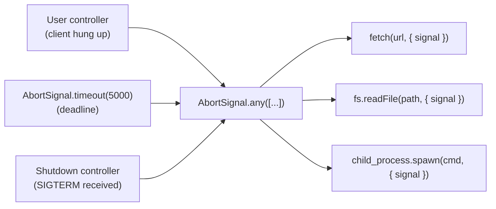

# Chapter 13 — AbortController, Signals, and Cancellation

**What you will learn**

- Why JavaScript cannot truly cancel work, and what cooperative cancellation gives you instead.
- The full `AbortController` / `AbortSignal` surface, including `AbortSignal.abort()`, `AbortSignal.timeout()`, `AbortSignal.any()`, `signal.reason`, and `signal.throwIfAborted()`.
- Which Node.js APIs actually accept a `signal`, and which (notably `node:dns`) do not.
- How to write your own abortable async function that cleans up on every exit path.
- How to combine a deadline with user cancellation, and how to carry cancellation across an HTTP request boundary.
- Why long-lived signals leak listeners, and how `events.addAbortListener()` fixes it.

**Why this matters**

Imagine an HTTP endpoint that fans out to three upstream services, reads a file, and streams a compressed result back to the client. The client hangs up after 200 ms. Without cancellation, your process keeps all three upstream sockets open, keeps reading the file, keeps compressing, and eventually writes bytes into a socket nobody is listening to. Multiply that by a few thousand requests a second during an incident and you have a server that is busy doing work whose results have already been thrown away — the classic shape of a cascading outage.

Cancellation is the mechanism that stops that. In Node.js it is spelled `AbortSignal`, and it is now the single, uniform convention across the standard library: file reads, timers, streams, HTTP requests, child processes, sockets, and event waits all accept the same object. Learning it once buys you cancellation everywhere. Getting it wrong — forgetting a cleanup path, leaking listeners on a shared signal, or swallowing an abort as if it were a real failure — produces bugs that only appear under load, which is exactly when you least want to debug them.

## There is no cancellation in JavaScript

Start with the uncomfortable truth: JavaScript has no way to stop a running function. There is no `thread.interrupt()`, no `promise.cancel()`, no way to reach into a pending `await` and make it stop. Once a synchronous function starts, it runs to completion. Once a promise is created, it will settle or it will not; nothing outside it can change that.

What Node.js offers is **cooperative cancellation**. A cancellation request is a *message*, not a command. Some party creates a signal, hands it to an operation, and later flips it to the aborted state. The operation is responsible for noticing, stopping whatever it can stop, releasing whatever it holds, and rejecting its promise. If the operation ignores the signal, nothing happens. Cancellation only works when every layer participates.

This has three practical consequences that shape everything else in this chapter:

1. **Aborting is a request, not a guarantee.** After `controller.abort()` returns, the underlying work may still be in flight. The operating system read you started is not un-started; Node just stops caring about the result.
2. **Cancellation must be plumbed.** A signal is a value. If your function does not accept one and pass it down, the code below you can never be cancelled.
3. **Abort is not an error condition of the system, but it is delivered as an error.** Aborted operations reject. Your code has to distinguish "this failed" from "we asked it to stop", or you will page an on-call engineer every time a browser tab closes.

## The API surface

`AbortController` is the *producer* side; `AbortSignal` is the *consumer* side. One controller owns exactly one signal, and can abort it exactly once.

```mjs
const controller = new AbortController();
const { signal } = controller;

signal.addEventListener('abort', () => {
  console.log('aborted because:', signal.reason);
}, { once: true });

controller.abort(new Error('user navigated away'));
console.log(signal.aborted); // true
```

```cjs
const controller = new AbortController();
const { signal } = controller;

signal.addEventListener('abort', () => {
  console.log('aborted because:', signal.reason);
}, { once: true });

controller.abort(new Error('user navigated away'));
console.log(signal.aborted); // true
```

Both classes are globals — no import needed. They have been available and non-experimental since v15.4.0.

| Member | Kind | Added | What it does |
|---|---|---|---|
| `new AbortController()` | constructor | v15.0.0 / v14.17.0 | Creates a controller and its one signal. |
| `abortController.abort([reason])` | method | v15.0.0; `reason` in v17.2.0 / v16.14.0 | Moves the signal to aborted and fires `'abort'` once. |
| `abortController.signal` | property | v15.0.0 / v14.17.0 | The `AbortSignal` to hand to operations. |
| `AbortSignal.abort([reason])` | static | v15.12.0 / v14.17.0 | Returns a signal that is *already* aborted. |
| `AbortSignal.timeout(delay)` | static | v17.3.0 / v16.14.0 | Returns a signal that aborts after `delay` milliseconds. |
| `AbortSignal.any(signals)` | static | v20.3.0 / v18.17.0 | Returns a signal that aborts when any input signal aborts. |
| `abortSignal.aborted` | property | v15.0.0 / v14.17.0 | `true` once aborted. |
| `abortSignal.reason` | property | v17.2.0 / v16.14.0 | Whatever was passed to `abort()`. |
| `abortSignal.onabort` | property | v15.0.0 / v14.17.0 | Single-callback alternative to `addEventListener`. |
| `abortSignal.throwIfAborted()` | method | v17.3.0 / v16.17.0 | Throws `reason` if already aborted; otherwise returns. |
| `events.addAbortListener(signal, listener)` | function | v20.5.0 / v18.18.0, Stable since v24.0.0 / v22.16.0 | Safe, disposable `'abort'` subscription. |

`AbortSignal` extends `EventTarget`, so it uses the DOM event API (`addEventListener`), not `EventEmitter` (`.on()`). That surprises people who have spent the last chapter with `EventEmitter`. The `'abort'` event fires at most once, and the event object passed to your listener has a `type` of `'abort'` — it carries no payload. The reason lives on `signal.reason`.

### Signals without a controller

Two static factories cover the common cases where you do not need to hold onto a controller.

`AbortSignal.abort(reason)` gives you a signal that is already in the aborted state. It exists mostly for tests and for functions that want to short-circuit: passing it to an abortable API should cause an immediate rejection without any work being started.

`AbortSignal.timeout(delay)` gives you a deadline in one expression:

```mjs
import { readFile } from 'node:fs/promises';

const data = await readFile('big.json', { signal: AbortSignal.timeout(5_000) });
```

This is the cleanest way to express "give up after five seconds", and it removes the bookkeeping the older `setTimeout` + `controller.abort()` pattern requires — no timer handle to clear, no controller to keep alive.

### Composing with `AbortSignal.any()`

Real operations usually have more than one reason to stop: the caller cancelled, *and* the deadline expired, *and* the server is shutting down. `AbortSignal.any(signals)` composes them into one signal that aborts as soon as any input aborts, and copies the triggering signal's reason onto the composite.

```mjs
function withDeadline(callerSignal, ms) {
  return callerSignal
    ? AbortSignal.any([callerSignal, AbortSignal.timeout(ms)])
    : AbortSignal.timeout(ms);
}
```



`AbortSignal.any()` is available since v20.3.0 / v18.17.0. Before it existed, people wired the composition by hand with `addEventListener`, which is exactly the code that leaked listeners. Use the built-in.

One caveat worth internalising: the composite signal holds references to its inputs for as long as it lives. If you build a composite per request from a long-lived application signal, discard the composite when the request ends — do not stash it in a cache or a module-level array.

## `reason`, `AbortError`, and the `ABORT_ERR` code

When you call `controller.abort()` with no argument, Node fills in a default reason: an error whose `name` is `'AbortError'` and whose `code` is `'ABORT_ERR'`. When you pass a reason, that value is used verbatim — it can be any value, not just an `Error`.

`ABORT_ERR` deliberately breaks Node's usual `ERR_*` naming convention. Node's error documentation is explicit about why: the code has to match the web platform's `AbortError`, so that code written for browsers and code written for Node can use the same check. Node's docs also note that APIs which do not use `AbortSignal` will not normally produce this code, which makes it a reliable marker.

That gives you the canonical abort test:

```js
function isAbort(err) {
  return err?.name === 'AbortError' || err?.code === 'ABORT_ERR';
}
```

Check both. Some Node APIs reject with a `DOMException` whose `name` is `'AbortError'` but which has no `code`; others reject with a Node `SystemError`-style object carrying `code: 'ABORT_ERR'`. Checking `name` and `code` covers both, and it also covers the case where a caller passed a custom reason built by your own code.

`signal.throwIfAborted()` is the ergonomic way to check at the top of a function and between steps:

```js
async function processAll(items, { signal } = {}) {
  const results = [];
  for (const item of items) {
    signal?.throwIfAborted();   // stop between items
    results.push(await processOne(item, { signal }));
  }
  return results;
}
```

A custom reason is the most under-used feature here. `abort(new Error('deadline exceeded'))` versus `abort(new Error('client disconnected'))` turns an undifferentiated pile of `AbortError`s in your logs into an actionable signal about *why* work is being dropped. Note that `AbortSignal.timeout()` supplies its own reason, so if you want to reliably distinguish a timeout from a user cancel, compose your own controller with your own reason instead of relying on the class of the built-in one.

## Which Node APIs accept a signal

This is the part most people guess at. Here is the verified list against the Node `main` documentation. Everything below is a real, documented option.

| Module | API | Option | Behaviour on abort |
|---|---|---|---|
| `node:fs/promises` | `readFile`, `writeFile`, `appendFile`, `watch` | `signal` | Promise rejects with an `AbortError`; `watch` ends the iterator. |
| `node:fs/promises` | `filehandle.readFile`, `filehandle.writeFile`, `filehandle.stat` | `signal` | Rejects the pending operation. |
| `node:fs` | `readFile`, `writeFile`, `watch` | `signal` | Callback receives an abort error; watcher closes. |
| `node:timers/promises` | `setTimeout`, `setImmediate`, `setInterval`, `scheduler.wait` | `signal` | Rejects instead of resolving; timer is cleared. |
| `node:stream` | `pipeline`, `finished` | `signal` | Destroys the streams and rejects/callbacks with an abort error. |
| `node:stream` | `addAbortSignal(signal, stream)` | positional | Equivalent to `stream.destroy(new AbortError())`. |
| `node:stream` | `readable.map/filter/forEach/reduce/some/find/every/flatMap/toArray/drop/take` | `signal` | Destroys the stream and aborts the operation. |
| `node:events` | `events.once`, `events.on` | `signal` | Rejects the wait / ends the async iterator. |
| `EventTarget` | `addEventListener` | `signal` | Removes the listener when the signal aborts. |
| `node:http` / `fetch` | `http.request(options)`, `fetch(url, init)` | `signal` | Same as `request.destroy()`; emits `'error'` with `ABORT_ERR`. |
| `node:http` | `message.signal` (v26.1.0 / v24.16.0) | read-only | Aborts when the message is destroyed before completion. |
| `node:http2` | `http2.connect`, client request options | `signal` | Aborts the connection/stream. |
| `node:net` | `server.listen(options)`, `new net.Socket(options)` | `signal` | Closes the listening server / destroys the socket. |
| `node:net/promises` | `connect(options)`, `listen(options)` | `signal` | Rejects an in-progress connect; closes the server. |
| `node:dgram` | `dgram.createSocket(options)`, `socket.bind(options)` | `signal` | Closes the socket. |
| `node:child_process` | `spawn`, `exec`, `execFile`, `fork` | `signal`, `killSignal` | Kills the child with `killSignal` (default `'SIGTERM'`). |
| `node:readline/promises` | `createInterface(options)`, `rl.question(query, options)` | `signal` | Closes the interface / rejects the question. |
| `node:readline` | `createInterface(options)`, `rl.question(query, options, cb)` | `signal` | Closes the interface / cancels the question. |
| `node:worker_threads` | `locks.request(name, options, cb)` | `signal` | Aborts a pending (not yet granted) lock request. |

And the notable absence: **`node:dns` has no `AbortSignal` support at all.** Not `dns.lookup`, not `dns.promises.resolve4`, nothing. A DNS resolution that hangs cannot be cancelled through this mechanism; you can only stop *waiting* for it (with `Promise.race`) while the resolution continues in the background. Since DNS is a very common source of tail latency, this is worth knowing before you promise your team end-to-end cancellation.

Two behavioural notes that catch people out. First, `fs.readFile` with a signal aborts Node's internal read loop — it does not cancel the individual operating system read that is already in flight; the docs say so explicitly. Second, child processes are killed with a signal (default `SIGTERM`), which the child may ignore; set `killSignal` if you need something blunter.

## Writing your own abortable function

Everything above is plumbing you consume. Now write a producer. The rules are short but every one of them is load-bearing.

1. Accept `signal` in an options object, and treat it as optional.
2. Reject immediately if the signal is already aborted — do not start work.
3. Subscribe with `{ once: true }`, or better, with `events.addAbortListener()`.
4. Remove the listener on **every** exit path: success, failure, and abort.
5. Release the underlying resource in the abort path, not just the promise.

Here is a correct abortable wrapper around a callback-style resource. Notice that the cleanup is centralised, so no path can skip it.

```mjs
import { addAbortListener } from 'node:events';

function queryWithCancel(pool, sql, { signal } = {}) {
  return new Promise((resolve, reject) => {
    signal?.throwIfAborted();

    const query = pool.startQuery(sql);
    let disposer;

    const settle = (fn, value) => {
      disposer?.[Symbol.dispose]();
      disposer = undefined;
      fn(value);
    };

    query.on('result', (rows) => settle(resolve, rows));
    query.on('error', (err) => settle(reject, err));

    if (signal) {
      disposer = addAbortListener(signal, () => {
        query.cancel();                 // tell the resource to stop
        settle(reject, signal.reason);  // then reject with the reason
      });
    }
  });
}
```

```cjs
const { addAbortListener } = require('node:events');

function queryWithCancel(pool, sql, { signal } = {}) {
  return new Promise((resolve, reject) => {
    signal?.throwIfAborted();

    const query = pool.startQuery(sql);
    let disposer;

    const settle = (fn, value) => {
      disposer?.[Symbol.dispose]();
      disposer = undefined;
      fn(value);
    };

    query.on('result', (rows) => settle(resolve, rows));
    query.on('error', (err) => settle(reject, err));

    if (signal) {
      disposer = addAbortListener(signal, () => {
        query.cancel();
        settle(reject, signal.reason);
      });
    }
  });
}
```

Two details deserve emphasis. `signal?.throwIfAborted()` runs *before* `pool.startQuery()`, so an already-aborted signal never acquires a connection. And the abort listener calls `query.cancel()` before rejecting — if you only reject, the promise settles but the query keeps running and the connection stays checked out. That is the single most common cancellation bug in production Node code: the caller is released, the resource is not.

If you are writing an async function rather than a promise constructor, `try/finally` gives you the same guarantee more cheaply:

```js
async function fetchJson(url, { signal } = {}) {
  const res = await fetch(url, { signal });
  if (!res.ok) {
    throw new Error(`HTTP ${res.status} from ${url}`);
  }
  return res.json();
}
```

Here `fetch` owns the cleanup, so you own nothing. Prefer this: if a builtin already accepts a signal, do not wrap it in your own listener bookkeeping.

## The listener leak on long-lived signals

Consider an application-wide shutdown signal that lives for the entire process, and a per-request handler that adds an `'abort'` listener to it. Each request adds a listener; nothing removes them. After a million requests you have a million closures pinned in memory, each retaining its request context. This is a textbook leak, and it is easy to write by accident.

Node's documentation is explicit that any listener attached to an `AbortSignal` should use `{ once: true }`, and that failing to do so may leak memory. But `{ once: true }` only helps when the signal *does* abort. On a signal that never aborts — the normal case for a shutdown signal — `once` never fires and the listener stays forever. You have to remove it yourself when the request ends.

There is a second, sneakier problem. `AbortSignal` is an `EventTarget`, so any listener can call `event.stopImmediatePropagation()` and silently prevent later listeners from running. If you hand your signal to a third-party library, that library can — accidentally or not — disable your own cleanup handler. Node cannot fix this without violating the web standard.

`events.addAbortListener(signal, listener)` solves both problems. It subscribes in a way that `stopImmediatePropagation()` cannot suppress, and it returns a `Disposable`, so unsubscription is mechanical rather than remembered:

```mjs
import { addAbortListener } from 'node:events';

async function handleJob(job, signal) {
  using _listener = addAbortListener(signal, () => job.pause());
  await job.run();
  // The listener is removed when this scope exits, on any path.
}
```

```cjs
const { addAbortListener } = require('node:events');

async function handleJob(job, signal) {
  using _listener = addAbortListener(signal, () => job.pause());
  await job.run();
  // The listener is removed when this scope exits, on any path.
}
```

If your toolchain does not support the `using` declaration yet, call `disposer[Symbol.dispose]()` in a `finally` block — the effect is identical.

One reassuring detail: Node's `EventEmitter` max-listeners warning does not apply to `AbortSignal` instances by default, so a signal will not print "possible EventEmitter memory leak detected" for you. That is convenient but it also removes your early-warning system. You can opt into a limit for a specific signal with `setMaxListeners(n, signal)` from `node:events` while you are hunting a leak.

## Deadlines plus user cancellation, end to end

Put the pieces together in the shape you will actually write: a service function that has its own maximum duration but also respects a caller-supplied signal.

```mjs
import { setTimeout as delay } from 'node:timers/promises';

const DEFAULT_TIMEOUT_MS = 3_000;

export async function getUserProfile(id, { signal, timeoutMs = DEFAULT_TIMEOUT_MS } = {}) {
  const deadline = new AbortController();
  const timer = setTimeout(
    () => deadline.abort(new Error(`profile lookup exceeded ${timeoutMs}ms`)),
    timeoutMs,
  );
  timer.unref();

  const combined = signal
    ? AbortSignal.any([signal, deadline.signal])
    : deadline.signal;

  try {
    const [profile, prefs] = await Promise.all([
      fetchJson(`https://users.internal/${id}`, { signal: combined }),
      fetchJson(`https://prefs.internal/${id}`, { signal: combined }),
    ]);
    return { ...profile, prefs };
  } finally {
    clearTimeout(timer);
  }
}
```

Why a hand-rolled controller instead of `AbortSignal.timeout(timeoutMs)`? Because the custom reason is worth the four extra lines: when this rejects, `err.message` tells you it was a deadline and how long the deadline was. If you do not care about that, `AbortSignal.any([signal, AbortSignal.timeout(timeoutMs)])` is the one-liner equivalent, and it does its own timer cleanup.

The `clearTimeout` in `finally` matters even with `unref()`. Without it, a fast success still leaves a pending timer that will fire later and abort a signal nobody is watching — harmless in effect, but it holds the closure and the controller alive until it fires.

## Propagating cancellation across an HTTP boundary

The reason cancellation exists in most servers is the client hanging up. Node exposes this directly. Since v26.1.0 / v24.16.0, `http.IncomingMessage` has a `message.signal` property: an `AbortSignal` that aborts when the message is destroyed before completion, or when the underlying socket closes before request handling or response reading finishes. The signal is created lazily on first access, so requests that never touch it cost nothing. As of v26.7.0 the signal is *not* aborted when the message completes normally — reading it is a clean way to ask "did this get cut off?".

```mjs
import { createServer } from 'node:http';

createServer(async (req, res) => {
  try {
    const profile = await getUserProfile(req.headers['x-user-id'], {
      signal: req.signal,
      timeoutMs: 2_000,
    });
    res.writeHead(200, { 'content-type': 'application/json' });
    res.end(JSON.stringify(profile));
  } catch (err) {
    if (err?.name === 'AbortError' || err?.code === 'ABORT_ERR') {
      // Client hung up or we hit the deadline. Nothing to send.
      return;
    }
    res.writeHead(500).end('internal error');
  }
}).listen(3000);
```

On older baselines, or when you need a signal you also control, derive one from the response lifecycle instead:

```js
function requestSignal(req, res) {
  const controller = new AbortController();
  res.on('close', () => {
    if (!res.writableFinished) {
      controller.abort(new Error('client disconnected'));
    }
  });
  return controller.signal;
}
```

The `writableFinished` check is what stops this from aborting on every successful response. `'close'` fires for both outcomes; only one of them is a disconnect.

The last mile is propagating the signal *outward* to the systems you call. Pass `signal` to every `fetch`, every `spawn`, every `pipeline`. If a call in the middle of your stack does not take an options object, that is where cancellation stops — and finding those gaps is most of the work of retrofitting cancellation into an existing codebase.

## Common mistakes

### ❌ Treating an abort as a failure

```js
try {
  await getUserProfile(id, { signal: req.signal });
} catch (err) {
  logger.error({ err }, 'profile lookup failed');
  metrics.increment('profile.errors');
  res.writeHead(500).end();
}
```

Every closed browser tab now becomes a 500 in your dashboards and an error in your logs. Worse, writing to a destroyed response throws a second, confusing error. Abort is an expected outcome, not an incident.

✅

```js
try {
  await getUserProfile(id, { signal: req.signal });
} catch (err) {
  if (err?.name === 'AbortError' || err?.code === 'ABORT_ERR') {
    metrics.increment('profile.cancelled');
    return;                    // nobody is listening; do not write
  }
  logger.error({ err }, 'profile lookup failed');
  res.writeHead(500).end();
}
```

### ❌ Rejecting on abort without releasing the resource

```js
function readWithTimeout(stream, ms) {
  return new Promise((resolve, reject) => {
    const signal = AbortSignal.timeout(ms);
    signal.addEventListener('abort', () => reject(signal.reason));
    stream.on('data', resolve);
  });
}
```

The promise rejects on time, so it *looks* correct. But the stream is never destroyed, the `'data'` listener is never removed, and the socket behind the stream stays open forever. Under load this is a file-descriptor leak that looks like a memory leak.

✅

```js
import { addAbortListener } from 'node:events';

function readWithTimeout(stream, ms) {
  return new Promise((resolve, reject) => {
    const signal = AbortSignal.timeout(ms);
    const disposer = addAbortListener(signal, () => {
      stream.destroy();                 // release the resource first
      reject(signal.reason);
    });
    const finish = (value) => { disposer[Symbol.dispose](); resolve(value); };
    stream.once('data', finish);
    stream.once('error', (err) => { disposer[Symbol.dispose](); reject(err); });
  });
}
```

### ❌ Accumulating listeners on a long-lived signal

```js
const shutdown = new AbortController();

export function trackRequest(req) {
  shutdown.signal.addEventListener('abort', () => req.destroy());
}
```

`shutdown.signal` lives as long as the process. Because it (almost) never aborts, `{ once: true }` would not help either — the listener is never removed, and each one retains a request object. This grows without bound.

✅

```js
import { addAbortListener } from 'node:events';

export async function trackRequest(req, handler) {
  using _listener = addAbortListener(shutdown.signal, () => req.destroy());
  await handler(req);
  // Subscription is torn down when the request finishes.
}
```

### ❌ Creating the signal but never passing it down

```js
async function importRows(rows, { signal } = {}) {
  for (const row of rows) {
    await insert(row);          // `signal` never reaches insert()
  }
}
```

The function advertises cancellation it does not provide. Calling `abort()` does nothing until the whole loop finishes.

✅

```js
async function importRows(rows, { signal } = {}) {
  for (const row of rows) {
    signal?.throwIfAborted();   // stop between rows
    await insert(row, { signal });
  }
}
```

## Production notes

- **Cancellation is a load-shedding tool.** In an overload, the fastest way to recover is to stop doing work whose result is already discarded. A server that propagates client disconnects to its upstream calls sheds load automatically; one that does not will keep amplifying the incident. Track a `cancelled` counter separately from `errors` so you can see this happening.
- **A deadline is not a timeout on the remote side.** Aborting a `fetch` closes your socket; whether the upstream server stops working depends entirely on that server. For expensive upstream operations, a deadline plus a server-side cancellation protocol (an explicit "cancel job" endpoint) is the only thing that actually saves capacity.
- **Composite signals retain their inputs.** `AbortSignal.any()` builds a graph. A per-request composite that references a process-lifetime signal is fine as long as the composite is unreachable when the request ends. Storing composites in a `Map` keyed by request id — a common tracing pattern — turns this into a slow leak. Use a `WeakRef`-free design: delete the entry in a `finally`.
- **A hand-rolled deadline timer keeps the loop alive.** A plain `setTimeout` holds the event loop open until it fires, so call `.unref()` and clear it on the success path. This is the usual reason a CLI tool that "finished" takes another five seconds to exit. The promise-based timers in `node:timers/promises` expose the same control through their documented `ref` option.
- **`node:dns` cannot be cancelled.** If your latency budget is dominated by name resolution, `AbortSignal` will not help. Mitigate with a resolver cache, `net.setDefaultAutoSelectFamilyAttemptTimeout()`-style connection racing, or by pinning addresses — but be honest in your design docs that the DNS leg is uncancellable.
- **Windows child processes ignore `SIGTERM` semantics.** `child_process` cancellation kills the child with `killSignal`, defaulting to `'SIGTERM'`. On Windows there is no real signal delivery; the process is terminated. Do not write cleanup logic in the child that depends on catching the signal if you must support Windows.
- **Abort during shutdown needs an order.** Aborting in-flight work at the same moment you close the HTTP server produces truncated responses. Stop accepting new work first, let in-flight work drain against a grace deadline, and only then abort. Chapter 26 covers the full sequence.

## Exercises

1. **Deadline wrapper.** Write `withTimeout(promiseFactory, ms)` that calls `promiseFactory({ signal })` with a signal that aborts after `ms`. Success criterion: a slow operation rejects with your custom reason after `ms` milliseconds, a fast one resolves normally, and `node --trace-exit` shows the process exiting immediately after the fast case (no lingering timer).

2. **Audit an API surface.** Take any three modules from the table above and, without looking at it again, write a small script that calls one abortable API from each with an already-aborted `AbortSignal.abort()`. Success criterion: all three reject, and your `isAbort()` predicate returns `true` for all three rejection values.

3. **Cancellable pipeline.** Build a script that streams a large file through `zlib.createGzip()` into a destination file using `stream.pipeline` with a signal, and aborts on `SIGINT`. Success criterion: pressing Ctrl+C leaves no partial output file (delete it in the abort path) and the process exits within 100 ms.

4. **Client-disconnect propagation.** Write an HTTP server whose handler calls two slow upstream endpoints and passes `req.signal` to both. Prove with a network trace or upstream logs that aborting the client request closes both upstream connections. Success criterion: upstream request counts show zero completed requests when the client disconnects after 50 ms.

5. **Leak reproduction and fix.** Create a long-lived `AbortController`, attach 100,000 listeners with `addEventListener` in a loop, and take a heap snapshot. Then rewrite the loop using `events.addAbortListener()` with disposal, and take another. Success criterion: the second snapshot shows the listener closures collected, and you can explain the difference in retained size.

## Recap

- JavaScript has no true cancellation; `AbortSignal` provides *cooperative* cancellation, which only works if every layer accepts and forwards the signal.
- `AbortController` produces, `AbortSignal` consumes. A controller aborts exactly once, and `signal.reason` carries whatever you passed.
- `AbortSignal.abort()`, `AbortSignal.timeout(delay)`, and `AbortSignal.any(signals)` cover the already-aborted, deadline, and composition cases without hand-written listener code.
- The abort marker is `name === 'AbortError'` and/or `code === 'ABORT_ERR'`; `ABORT_ERR` intentionally breaks the `ERR_*` convention for web compatibility.
- Nearly every I/O-shaped API in the standard library accepts `signal` — fs, timers/promises, streams, events, http/http2/fetch, net, dgram, child_process, readline, worker locks. `node:dns` does not.
- When writing your own abortable function: check `throwIfAborted()` first, release the resource in the abort path, and remove your listener on every exit path.
- Long-lived signals leak listeners. Use `events.addAbortListener()` and its `Disposable` return value with `using`.
- Cancellation crosses the HTTP boundary through `req.signal` (v26.1.0) or a `'close'`-derived controller, and continues outward only as far as you keep passing `signal`.

## Where to go next

- [Chapter 12 — EventEmitter and the Events Module](12-eventemitter.md) — `events.once`/`events.on` with signals, and how `EventTarget` differs from `EventEmitter`.
- [Chapter 14 — Errors: Classes, Codes, and Handling Strategies](14-errors.md) — where `ABORT_ERR` fits in Node's error taxonomy.
- [Chapter 19 — Streams II: Duplex, Transform, pipeline, Backpressure](../part3-data/19-streams-advanced.md) — `pipeline` with `signal`, and `stream.addAbortSignal()`.
- [Chapter 26 — Signals, Graceful Shutdown, and Process Lifecycle](../part4-system/26-signals-and-shutdown.md) — using a process-wide abort controller correctly.
- [Chapter 36 — HTTP/1.1 Clients, Agents, and Keep-Alive](../part5-networking/36-http-clients.md) — cancellation, sockets, and connection reuse.
- Official documentation: <https://nodejs.org/docs/latest/api/globals.html#class-abortcontroller> and <https://nodejs.org/docs/latest/api/events.html#eventsaddabortlistenersignal-listener>
