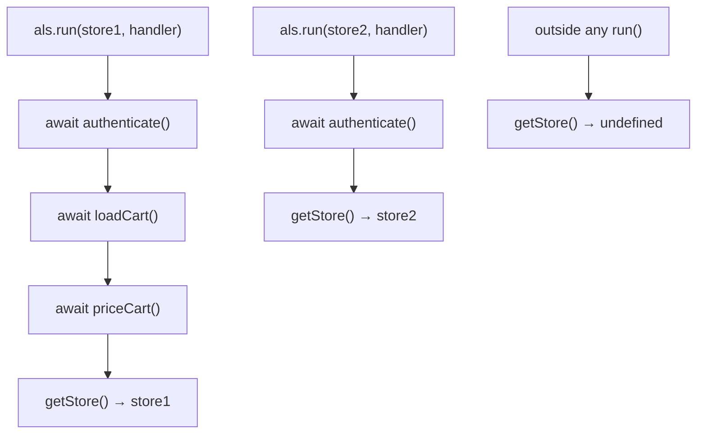

# Chapter 15 — AsyncLocalStorage and Context Propagation

**What you will learn**

- Why threading a request id through every function signature is the wrong solution, and what `AsyncLocalStorage` replaces it with.
- The full API: `run`, `getStore`, `enterWith`, `exit`, `disable`, `withScope`, and the static `AsyncLocalStorage.bind()` / `AsyncLocalStorage.snapshot()`.
- How to build request-scoped logging through an HTTP server end to end.
- When `AsyncResource` is still required — connection pools, callback APIs, custom event emitters — and how to use it.
- How to recognise and diagnose context loss, and what it actually costs at runtime.
- What `async_hooks` **[Experimental]** does underneath, and why you should not use it directly.

**Why this matters**

You are debugging a production incident. A checkout request failed somewhere in a chain that touched an authentication service, a pricing cache, a database, and a payment provider. Your logs contain 40,000 lines from the same second, and not one of them tells you which request it belonged to. You cannot reconstruct the failure, so you cannot fix it.

The obvious fix is to pass a request id everywhere. That means adding a `ctx` parameter to every function in the call graph, including the ones three libraries deep that you do not own. It pollutes every signature, it is impossible to enforce, and one function that forgets to forward it breaks the whole chain. `AsyncLocalStorage` solves this properly: it gives you something like thread-local storage for an asynchronous call graph, so any code running "inside" a request can ask for the current context without anyone having handed it over. Every serious tracing and logging library in the Node ecosystem is built on it, and understanding it is what separates "I copied the middleware from a blog post" from "I can debug why the trace id disappears after our database driver's callback".

## The problem, precisely

JavaScript has no threads to hang state on, and no dynamic scope. Consider this call graph:

```js
async function handleRequest(req, res) {
  const user = await authenticate(req);
  const cart = await loadCart(user.id);
  const total = await priceCart(cart);   // 4 layers down, calls the pricing service
  res.end(JSON.stringify({ total }));
}
```

If `priceCart` — or anything it calls — wants to log "request `abc123` is pricing 7 items", it needs `abc123`. Threading it through means changing `priceCart`, `priceItem`, `fetchPrice`, and the HTTP client wrapper, plus every test for all of them. And a global variable does not work: by the time `priceCart` resolves, the event loop has interleaved a hundred other requests, and any global you set has been overwritten.

`AsyncLocalStorage` gives you a store that follows the *asynchronous execution path* rather than the call stack. Anything that runs as a consequence of the code inside `run()` — a `setTimeout` callback, a promise continuation, an `fs` callback, an event listener registered inside the scope — sees the same store.



Two concurrent requests, two independent stores, no parameter threading, and no interference — even though both are interleaved on the same single thread.

## The API surface

`AsyncLocalStorage` lives in `node:async_hooks`. It became Stable in v16.4.0 and has been available since v13.10.0 / v12.17.0.

```mjs
import { AsyncLocalStorage } from 'node:async_hooks';
```

```cjs
const { AsyncLocalStorage } = require('node:async_hooks');
```

| Member | Stability | Added | Purpose |
|---|---|---|---|
| `new AsyncLocalStorage([options])` | Stable | v13.10.0 / v12.17.0; `defaultValue` and `name` in v24.0.0 | Creates an independent store. `options.defaultValue` is used when no store is active; `options.name` labels the instance |
| `als.run(store, callback[, ...args])` | Stable | v13.10.0 / v12.17.0 | Runs `callback` synchronously with `store` active; returns its value. The preferred entry point |
| `als.getStore()` | Stable | v13.10.0 / v12.17.0 | The current store, or `undefined` outside any scope |
| `als.name` | Stable | v24.0.0 | The name given in the constructor |
| `AsyncLocalStorage.bind(fn)` | Stable since v23.11.0 / v22.15.0 | v19.8.0 / v18.16.0 | Returns a function that always runs in the context captured *now* |
| `AsyncLocalStorage.snapshot()` | Stable since v23.11.0 / v22.15.0 | v19.8.0 / v18.16.0 | Captures the current context and returns `(fn, ...args) => R` that runs `fn` inside it |
| `als.enterWith(store)` | **[Experimental]** | v13.11.0 / v12.17.0 | Enters a store for the rest of the current synchronous execution and everything downstream of it |
| `als.exit(callback[, ...args])` | **[Experimental]** | v13.10.0 / v12.17.0 | Runs `callback` with no store active |
| `als.disable()` | **[Experimental]** | v13.10.0 / v12.17.0 | Exits all contexts for this instance; required before the instance can be garbage collected |
| `als.withScope(store)` | **[Experimental]** | v25.9.0 | Returns a `RunScope` for `using`-based scoping |
| `scope.dispose()` | **[Experimental]** | v25.9.0 | Restores the previous store. Idempotent; `[Symbol.dispose]()` defers to it |

Each instance is independent. You can have one `AsyncLocalStorage` for tracing, another for tenant identity, another for a database transaction handle, and they will not interfere.

### `run()` is the one you want

```js
const store = { requestId: 'abc123' };

als.run(store, () => {
  als.getStore();                        // the store object
  setTimeout(() => als.getStore(), 100);  // still the store object
});

als.getStore();                          // undefined
```

`run()` returns whatever the callback returns, and if the callback throws, `run()` throws the same error with the stack trace untouched and the context correctly exited. That last property is what makes it safe: there is no way to leak the context out of the block, even on the error path.

### `enterWith()` and why to avoid it

`enterWith(store)` sets the store for the *remainder of the current synchronous execution* and everything downstream. It has no closing bracket, which is exactly the problem. Node's documentation gives the canonical trap: call `enterWith()` inside one event handler, and every *subsequent* handler for the same event also runs with that store, because they are part of the same synchronous execution.

```js
emitter.on('my-event', () => als.enterWith({ id: 1 }));
emitter.on('my-event', () => als.getStore());   // sees { id: 1 } — probably unintended

als.getStore();       // undefined
emitter.emit('my-event');
als.getStore();       // { id: 1 } — the context escaped into the caller
```

Use `run()`. Reach for `enterWith()` only when you genuinely cannot wrap the downstream work in a callback — for example, when a framework hands you a hook that must return synchronously and there is no continuation to wrap.

### `withScope()` **[Experimental]**

Added in v25.9.0, `withScope(store)` is the explicit-resource-management form. It returns a `RunScope` that restores the previous store when disposed, so `using` gives you block scoping without a callback:

```mjs
import { AsyncLocalStorage } from 'node:async_hooks';

const als = new AsyncLocalStorage();

{
  using _scope = als.withScope({ tenant: 'acme' });
  als.getStore();       // { tenant: 'acme' }
}
als.getStore();         // undefined
```

The restore happens even if the block throws, which makes it a genuine improvement over `enterWith()` for synchronous code. Read the warning in the docs carefully, though: inside an `async` function, everything before the first `await` runs synchronously in the *caller's* context, so the scope change becomes visible to the caller when the function suspends. For anything that crosses an `await`, use `run()`.

### `bind()` and `snapshot()`

These two capture context so you can replay it later — the tool for deferred work.

`AsyncLocalStorage.bind(fn)` wraps a function so it always executes in the context that was active when `bind` was called. `AsyncLocalStorage.snapshot()` is the more general form: it returns a runner, `(fn, ...args) => R`, that executes any function inside the captured context.

```js
const als = new AsyncLocalStorage();

const runInRequestScope = als.run({ id: 'req-1' }, () => AsyncLocalStorage.snapshot());

// Later, on some other tick, in some other context:
als.run({ id: 'req-2' }, () => {
  runInRequestScope(() => als.getStore());   // { id: 'req-1' }
});
```

Note that these are *static* methods: they capture the context of **all** `AsyncLocalStorage` instances at once, not just one. That is exactly what you want for a job queue that must restore the full ambient context of whoever enqueued the task.

## A worked example: request-scoped logging

Here is the whole pattern, end to end. Three pieces: a store, a logger that reads it, and one middleware that establishes it.

```mjs
// context.mjs
import { AsyncLocalStorage } from 'node:async_hooks';

export const requestContext = new AsyncLocalStorage({ name: 'request' });

export function currentContext() {
  return requestContext.getStore();
}
```

```mjs
// logger.mjs
import { currentContext } from './context.mjs';

function emit(level, message, fields = {}) {
  const ctx = currentContext();
  process.stdout.write(JSON.stringify({
    ts: new Date().toISOString(),
    level,
    message,
    requestId: ctx?.requestId,
    userId: ctx?.userId,
    ...fields,
  }) + '\n');
}

export const log = {
  info: (msg, fields) => emit('info', msg, fields),
  warn: (msg, fields) => emit('warn', msg, fields),
  error: (msg, fields) => emit('error', msg, fields),
};
```

```mjs
// server.mjs
import { createServer } from 'node:http';
import { randomUUID } from 'node:crypto';
import { requestContext } from './context.mjs';
import { log } from './logger.mjs';

async function handle(req, res) {
  log.info('request started', { method: req.method, url: req.url });

  const ctx = requestContext.getStore();
  ctx.userId = await authenticate(req);      // enrich the store mid-request

  const total = await priceCart(ctx.userId); // four layers down; logs carry the id
  res.end(JSON.stringify({ total }));

  log.info('request finished', { status: res.statusCode });
}

createServer((req, res) => {
  const store = {
    requestId: req.headers['x-request-id'] ?? randomUUID(),
    startedAt: performance.now(),
  };

  requestContext.run(store, () => {
    handle(req, res).catch((err) => {
      log.error('request failed', { err: err.message, code: err.code });
      if (!res.headersSent) res.writeHead(500);
      res.end();
    });
  });
}).listen(3000);
```

Four details make this work in practice:

**`run()` wraps the entire handler**, including the `.catch()`. If you only wrap the happy path, your error logs lose the request id — precisely when you need it most.

**The store is a mutable object, not a primitive.** `ctx.userId = ...` after authentication enriches every subsequent log line. A `Map` works equally well; a plain object is faster and easier to spread into a log record.

**The logger reads the store; callers never pass it.** `priceCart` needs no `ctx` parameter, and neither does anything it calls. That is the whole payoff.

**Nothing outside the request has context.** A background cron job logging through the same logger simply gets `requestId: undefined`. Use the constructor's `defaultValue` option (v24.0.0) if you would rather have a sensible fallback than `undefined`.

### The `async`/`await` pattern

If you want a single `await` to run inside a context, do not call `run()` and then `await` outside it. Return the promise *from* the callback so `run()` hands it back:

```js
async function withRequest(store, fn) {
  return requestContext.run(store, fn);   // fn's promise is returned by run()
}

await withRequest({ requestId: 'abc' }, async () => {
  await doWork();          // inside the context
});
```

`run()` itself is synchronous — it returns as soon as the callback returns. When the callback returns a promise, the context stays attached to that promise's continuations, so `await`ing the result outside `run()` is fine. What is *not* fine is starting the async work outside and only entering the context later.

## `AsyncResource`: manual binding

`AsyncLocalStorage` propagates through anything built on Node's async infrastructure — timers, promises, `fs`, sockets, streams. It cannot propagate through things Node does not know are asynchronous. There are two important cases.

**Case 1: a resource pool.** A connection pool acquires a connection in request A's context, returns it, and hands the same object to request B. Any callback the pool fires may run in whichever context happened to trigger it. The pool needs to bind callbacks explicitly to the context of the caller who queued them.

**Case 2: a long-lived event emitter.** A listener registered during request A runs whenever the event fires — possibly during request B. Node's documentation is explicit that listeners triggered by an `EventEmitter` may run in a different execution context than the one active when `on()` was called.

```mjs
import { createServer } from 'node:http';
import { AsyncResource } from 'node:async_hooks';

createServer((req, res) => {
  req.on('close', AsyncResource.bind(() => {
    // Runs in the context active when bind() was called.
  }));
  req.on('close', () => {
    // Runs in the context that caused 'close' to be emitted.
  });
  res.end();
}).listen(3000);
```

`AsyncResource` (Stable since v16.4.0) is the low-level binding primitive:

| Member | Purpose |
|---|---|
| `new AsyncResource(type[, options])` | `type` is a label for diagnostics. Options: `triggerAsyncId` (default `executionAsyncId()`), `requireManualDestroy` (default `false`) |
| `AsyncResource.bind(fn[, type[, thisArg]])` | Static. Binds `fn` to the current context. Added v14.8.0 / v12.19.0 |
| `asyncResource.bind(fn[, thisArg])` | Binds `fn` to *this* resource's scope |
| `asyncResource.runInAsyncScope(fn[, thisArg, ...args])` | Runs `fn` in this resource's context, firing the `before`/`after` hooks around it. Added v9.6.0 |
| `asyncResource.emitDestroy()` | Fires `destroy` hooks. Must be called manually; throws if called twice |
| `asyncResource.asyncId()` / `.triggerAsyncId()` | The resource's id and the id of whatever created it |

A pool wrapper looks like this:

```js
class PooledQuery extends AsyncResource {
  constructor(pool) {
    super('PooledQuery');       // captures the context of whoever constructed it
    this.pool = pool;
  }

  run(sql, callback) {
    this.pool.query(sql, (err, rows) => {
      // Replay the creator's context around the user callback:
      this.runInAsyncScope(callback, null, err, rows);
    });
  }

  close() {
    this.emitDestroy();
  }
}
```

One deprecation to know: the `asyncResource` property that `AsyncResource.bind()` used to attach to the returned function was deprecated in v20.0.0 and will be removed. Do not read it.

For pure context propagation — which is most cases — `AsyncLocalStorage.snapshot()` is the better tool. The docs say so directly: it can replace `AsyncResource` for simple async context tracking. Reach for `AsyncResource` when you also want your resource to appear correctly in diagnostic tooling, or when you need the `destroy` lifecycle.

## Context loss: causes and diagnosis

Context loss looks like this: `getStore()` returns the right value at the top of a function and `undefined` three calls later. There are four realistic causes.

1. **A callback API that Node does not track.** Native addons and some C++-backed libraries schedule callbacks through mechanisms outside Node's async infrastructure.
2. **A custom thenable.** A hand-rolled object with a `then` method is not a native promise, and context does not automatically follow it.
3. **A queue or pool that stores callbacks and calls them later** from a different context — the case `AsyncResource` exists for.
4. **A worker or process boundary.** Each `Worker` thread has an entirely independent async context; nothing crosses `postMessage`. You must serialise the context yourself.

The documented diagnostic procedure is refreshingly simple: log `als.getStore()` after each call you suspect. The last call before `undefined` appears is your culprit. Do it with a helper rather than by hand:

```js
function checkpoint(label) {
  const store = requestContext.getStore();
  process.stderr.write(`[ctx] ${label}: ${store ? 'present' : 'LOST'}\n`);
}

checkpoint('before db.query');
const rows = await db.query(sql);
checkpoint('after db.query');
```

The fixes, in order of preference: promisify the callback API with `util.promisify()` so it uses native promises; if you cannot, bind the callback with `AsyncLocalStorage.snapshot()` or `AsyncResource.bind()`; if the loss is inside a third-party library, wrap the library's entry point rather than trying to patch its internals.

Naming your storage instances helps here. `new AsyncLocalStorage({ name: 'request' })` gives you `als.name`, which turns a generic "context lost" message into one that says which context.

## What it costs

`AsyncLocalStorage` is not free, but it is much cheaper than its reputation suggests, and the reputation comes from the wrong thing.

The important distinction is between `AsyncLocalStorage` and the `async_hooks` machinery below it. Historically, `AsyncLocalStorage` was implemented on top of `async_hooks`, and enabling async hooks disables several V8 promise optimisations. Modern Node has a dedicated, optimised implementation — the docs describe it as "a performant and memory safe implementation that involves significant optimizations that are non-obvious to implement", and tell you to prefer it over building your own on `async_hooks`. What remains expensive is installing `async_hooks` callbacks yourself, which forces V8's `PromiseHooks` on for the whole process.

How to reason about the cost you do pay:

- **Per-context-switch, not per-operation.** The work happens when the runtime enters and leaves an async scope. A request that awaits 500 times pays 500 small costs, not one big one.
- **Store size does not matter.** The store is a reference. Putting a 10 MB object in it costs nothing extra to propagate — but see the retention warning below.
- **Instance count does matter a little.** Every active `AsyncLocalStorage` participates in every context switch. One instance holding a context object beats six instances holding one field each.
- **Retention is the real risk.** Anything reachable from the store stays alive as long as any pending async operation in that context does. A store holding a request body, a database result set, and a response buffer keeps all three alive until the last timer in the request finishes. Under load this looks exactly like a memory leak, and it is the most common `AsyncLocalStorage` production problem.
- **`disable()` for teardown.** Calling `als.disable()` is required before the instance itself can be garbage collected. This matters for tests and for libraries that create instances dynamically, not for a module-level singleton that lives as long as the process.

Measure before optimising. `perf_hooks` (Chapter 49) and a flame graph will tell you in ten minutes whether context propagation is on your critical path. In most services it is far below JSON serialisation and the network.

## `async_hooks` **[Experimental]**: the machinery underneath

`node:async_hooks` is the low-level API for tracking every asynchronous resource in the process. Its stability notice is unusually blunt: it is Experimental, and Node explicitly asks you to migrate away from `createHook`, `AsyncHook`, and `executionAsyncResource` because they have usability issues, safety risks, and performance implications.

You should understand the model anyway, because it explains everything above.

Every async operation — a timer, a socket, an `fs` request, a promise — is an *async resource* with a numeric `asyncId` and a `triggerAsyncId` identifying the resource whose context created it. Together these form a tree of causality. `async_hooks.createHook(options)` registers callbacks on four lifecycle events:

| Callback | Signature | Fires when |
|---|---|---|
| `init` | `(asyncId, type, triggerAsyncId, resource)` | A resource that *might* emit an async event is constructed |
| `before` | `(asyncId)` | Just before that resource's callback runs. Called 0 to N times |
| `after` | `(asyncId)` | Immediately after the callback completes |
| `destroy` | `(asyncId)` | After the resource is destroyed |

There is a fifth, `promiseResolve(asyncId)`, fired when a promise's `resolve` function is invoked, plus a `trackPromises` option (default `true`, and it cannot be `false` if `promiseResolve` is set). `createHook()` returns an `AsyncHook`, disabled until you call `.enable()`; `.disable()` turns it off again.

Context propagation is now easy to explain: on `before`, restore the store associated with `asyncId`; on `after`, restore the previous one. `AsyncLocalStorage` is that idea, implemented far more carefully than you would.

Three reasons not to write hooks yourself:

**Throwing kills the process, hard.** If any hook callback throws, Node prints the stack trace and exits — and it removes all `'uncaughtException'` listeners first, so you cannot intercept it. The docs justify this: hooks run at volatile points such as object construction and destruction, so the runtime prefers a fast exit over an unpredictable abort later.

**`console.log()` inside a hook is infinite recursion.** Printing is asynchronous, so it creates a resource, which fires `init`, which prints... Use a synchronous write such as `fs.writeFileSync(path, msg, { flag: 'a' })` when debugging.

**Enabling any hook turns on promise tracking.** By default, promises are not assigned `asyncId`s because V8's promise introspection is expensive. Installing a hook forces it on process-wide, and the docs are clear that this can cost significantly. You can opt out with `trackPromises: false`, but then you lose exactly the tracking you probably wanted.

If your goal is diagnostics rather than context, `diagnostics_channel` (Chapter 48) and `process.getActiveResourcesInfo()` are the supported alternatives.

## Relationship to OpenTelemetry-style tracing

Distributed tracing needs one thing from the runtime: a way to know which span is "current" at any point in an async call graph. In Node, that is `AsyncLocalStorage`, and OpenTelemetry's Node context manager is built on it.

The tracing model layers cleanly on top:

- **The span context is the store.** A trace id, a span id, and trace flags — small, immutable, cheap to propagate.
- **Starting a child span is a nested `run()`.** Each span reads the current context as its parent, then runs its own work in a new context.
- **Propagation across process boundaries is separate.** `AsyncLocalStorage` stops at the process edge. Crossing to another service means serialising the context into headers (the W3C `traceparent` header) and re-establishing it with `run()` on the far side. The same is true for `Worker` threads and child processes.

That last point is the one people miss. In-process context propagation and cross-process propagation are different mechanisms that happen to carry the same data. If your traces break exactly at a service boundary, the bug is in your header handling, not in `AsyncLocalStorage`.

If you are building your own lightweight tracing, the shape is small:

```js
export function startSpan(name, fn) {
  const parent = requestContext.getStore();
  const span = {
    ...parent,
    spanId: randomUUID(),
    parentSpanId: parent?.spanId,
    name,
    start: performance.now(),
  };
  return requestContext.run(span, async () => {
    try {
      return await fn();
    } finally {
      log.info('span finished', { name, durationMs: performance.now() - span.start });
    }
  });
}
```

Before shipping that, look hard at whether OpenTelemetry does it better. It almost certainly does, and it interoperates with everything else in your stack.

## Common mistakes

### ❌ Calling `run()` too late

```js
createServer(async (req, res) => {
  const user = await authenticate(req);            // no context yet
  requestContext.run({ user }, () => handle(req, res));
});
```

Every log line emitted by `authenticate()` — including the failure case, the one you actually care about — has no request id. The context starts after the interesting part.

✅

```js
createServer((req, res) => {
  requestContext.run({ requestId: randomUUID() }, async () => {
    const store = requestContext.getStore();
    store.user = await authenticate(req);   // enrich, don't re-enter
    await handle(req, res);
  });
});
```

### ❌ Using `enterWith()` in an event handler

```js
emitter.on('job', (job) => {
  jobContext.enterWith({ jobId: job.id });   // leaks into every later listener
  process(job);
});
```

`enterWith()` has no scope. The store persists for the rest of the synchronous execution, so subsequent listeners for the same event — and code after `emit()` in the caller — see a context that does not belong to them.

✅

```js
emitter.on('job', (job) => {
  jobContext.run({ jobId: job.id }, () => process(job));
});
```

### ❌ Storing large objects in the context

```js
requestContext.run({ requestId, req, res, body, dbRows, renderedHtml }, handler);
```

Everything in the store is retained until every pending async operation in that context completes. A `setTimeout(..., 30_000)` started during the request pins the whole payload for thirty seconds. At a thousand requests per second this is a multi-gigabyte resident set.

✅

```js
requestContext.run({ requestId, userId, tenantId }, handler);
// Identifiers only. Pass bulky values as ordinary function arguments.
```

### ❌ Expecting context to cross a worker boundary

```js
worker.postMessage({ task });
// Inside the worker: requestContext.getStore() === undefined
```

Each `Worker` thread has its own independent async context. Nothing propagates through `postMessage`, `child_process`, or an HTTP call.

✅

```js
const ctx = requestContext.getStore();
worker.postMessage({ task, traceparent: toTraceparent(ctx) });

// In the worker:
parentPort.on('message', ({ task, traceparent }) => {
  requestContext.run(fromTraceparent(traceparent), () => runTask(task));
});
```

## Production notes

- **One instance, one object.** A single module-level `AsyncLocalStorage` holding a mutable context object beats several instances holding one field each. Every active instance participates in every context switch, and one shared object is cheaper to enrich mid-request.
- **Treat the store as a retention root.** Audit what you put in it. The clean rule — identifiers and small scalars only, never request bodies, response buffers, or query results — costs nothing and prevents the most common failure mode.
- **Enrich, do not nest.** Mutating the existing store to add a user id after authentication is cheaper and clearer than a second `run()` inside the first, and it means log lines emitted before the enrichment still share the same object identity.
- **Verify propagation through your dependencies.** Before adopting a database driver, message queue client, or ORM, write a five-line test that logs `getStore()` inside its callback. Libraries with native bindings or custom thenables are the ones that break, and it is much cheaper to find out before the migration than during an incident.
- **Do not install `async_hooks` callbacks in production.** Enabling any hook forces V8 promise tracking on for the entire process. If an APM agent does this, measure the overhead deliberately rather than assuming it is negligible.
- **Context does not cross process or thread boundaries.** Workers, child processes, and HTTP calls all need explicit serialisation. Standardise on W3C `traceparent` rather than a bespoke header so your traces join up with everyone else's.
- **`disable()` matters in tests, not in servers.** A module-level instance lives for the process lifetime and never needs disabling. A test suite that creates instances per case should disable them, or the instances themselves are retained.

## Exercises

1. **Context basics.** Write a script with one `AsyncLocalStorage` that runs three overlapping "requests", each with a distinct id, where each performs two `await`s of random duration and logs its id at every step. Success criterion: no log line reports the wrong id, and a line logged outside any `run()` reports `undefined`.

2. **Request-scoped logger.** Build the `context.mjs` / `logger.mjs` / `server.mjs` trio from this chapter and drive it with 50 concurrent requests. Success criterion: every JSON log line carries a `requestId`, including lines emitted from a handler that throws.

3. **Find the loss.** Take a callback-based API (write your own that calls back from a stored queue drained on a `setInterval`) and demonstrate that context is lost inside the callback. Then fix it with `AsyncLocalStorage.snapshot()`. Success criterion: `getStore()` returns the caller's store inside the callback both before and after the fix is toggled by a flag.

4. **Retention experiment.** Build a server that stores a 5 MB buffer in the context and starts a 10-second timer per request. Drive it at 100 requests per second and watch RSS with `process.memoryUsage()`. Then move the buffer out of the store. Success criterion: you can quantify the difference in peak RSS and explain it in terms of context lifetime.

5. **Minimal tracer.** Implement `startSpan(name, fn)` that builds a parent/child span tree using nested `run()` calls, and emit the tree as JSON at the end of a request that fans out to three concurrent operations. Success criterion: parent/child relationships are correct despite the concurrency, and total duration is not the sum of the children's.

## Recap

- `AsyncLocalStorage` is thread-local storage for an asynchronous call graph: context follows the async execution path instead of the call stack, so no function needs a `ctx` parameter.
- `run(store, callback)` is the primary API — scoped, exception-safe, and it returns the callback's value. `getStore()` reads the current store, or `undefined` outside any scope.
- `enterWith()`, `exit()`, `disable()`, and `withScope()` are **[Experimental]**. `enterWith()` in particular has no closing bracket and leaks context into sibling event handlers.
- `AsyncLocalStorage.bind()` and `AsyncLocalStorage.snapshot()` capture the current context of every instance for later replay; `AsyncResource` covers what they cannot — connection pools, long-lived emitters, and callback APIs Node cannot track, with `runInAsyncScope()` replaying the creator's context around a user callback.
- Context loss comes from untracked callbacks, custom thenables, stored callbacks, and thread boundaries. Diagnose it by logging `getStore()` around suspect calls.
- The real cost is retention, not CPU: everything reachable from the store lives as long as the context does. Store identifiers, not payloads.
- `async_hooks` is the Experimental machinery underneath — `init`, `before`, `after`, `destroy` — and Node asks you not to use it directly. Throwing in a hook kills the process, `console.log()` in a hook recurses infinitely, and enabling any hook turns on process-wide promise tracking.
- OpenTelemetry-style tracing is `AsyncLocalStorage` plus header propagation; the in-process and cross-process halves are separate mechanisms.

## Where to go next

- [Chapter 12 — EventEmitter and the Events Module](12-eventemitter.md) — why listeners run in surprising contexts.
- [Chapter 14 — Errors: Classes, Codes, and Handling Strategies](14-errors.md) — attaching request context to error reports, and why `node:domain` is not the answer.
- [Chapter 29 — Worker Threads](../part4-system/29-worker-threads.md) — context across thread boundaries, and the `AsyncResource` worker-pool pattern.
- [Chapter 48 — Diagnostics Channel and Trace Events](../part7-diagnostics/48-diagnostics-channel-tracing.md) — the supported alternative to `async_hooks` for instrumentation.
- [Chapter 51 — Console, `util.inspect`, and Logging Strategy](../part7-diagnostics/51-console-and-logging.md) — building the structured logger this chapter assumes.
- [Chapter 62 — Observability in Production](../part9-production/62-observability.md) — tracing, metrics, and correlation at scale.
- Official documentation: <https://nodejs.org/docs/latest/api/async_context.html> and <https://nodejs.org/docs/latest/api/async_hooks.html>
