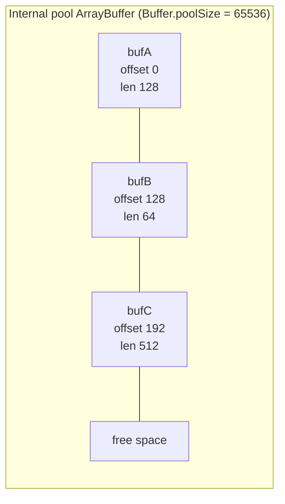

# Chapter 16 — Buffers and Typed Arrays

**What you will learn**

- Why `Buffer` exists, and exactly how it relates to `Uint8Array` and `ArrayBuffer`.
- How to choose between `Buffer.alloc`, `Buffer.allocUnsafe`, and `Buffer.allocUnsafeSlow`, and the security consequence of getting it wrong.
- How the shared internal pool works, why `buf.byteOffset` is usually not zero, and when that will bite you.
- Every encoding Node supports for `Buffer` conversions, including the legacy ones you should not use.
- How to read and write fixed-width integers and floats with the right endianness.
- When `Buffer` operations copy and when they alias the same memory — the single most common source of data-corruption bugs in binary code.

## Why this matters

JavaScript grew up in the browser, where the runtime handed you strings and objects and kept bytes out of sight. Node.js does not have that luxury. A TCP socket delivers bytes. A file on disk is bytes. A TLS record, a gzip member, a PNG header, a Postgres wire-protocol message, a WebSocket frame — all bytes. If you write a server, you will handle raw octets whether or not you intended to.

`Buffer` is Node's answer, and it predates the standard JavaScript answer. When Node was designed there was no `Uint8Array` in the language, so Node invented its own byte-array type. Typed arrays arrived later, and since Node 3.0.0 `Buffer` has been a subclass of `Uint8Array` — but it kept its own richer API, and in two places it kept behaviour that *contradicts* the typed-array behaviour. Those contradictions are where bugs live. Read this chapter carefully and the rest of Part III (streams, encodings, compression) becomes mechanical.

## What a `Buffer` actually is

Three types are involved and people routinely confuse them.

| Type | What it is | Can you index it? |
|---|---|---|
| `ArrayBuffer` | A raw, fixed-length region of memory. It has a byte length and nothing else. | No |
| `Uint8Array` (and the other `TypedArray`s) | A *view* onto part of an `ArrayBuffer`, with an element type, a byte offset, and a length. | Yes |
| `Buffer` | A `Uint8Array` subclass with extra methods for encodings, numeric field access, and searching. | Yes |

So `Buffer` **is a** `Uint8Array`, which **views** an `ArrayBuffer`. `instanceof` confirms it:

```js
const buf = Buffer.from('hi');
console.log(buf instanceof Uint8Array);   // true
console.log(buf.buffer instanceof ArrayBuffer); // true
```

Two properties expose the view geometry:

- `buf.buffer` — the underlying `ArrayBuffer`. It is **not** guaranteed to be the same size as the `Buffer`.
- `buf.byteOffset` — where this `Buffer` starts inside that `ArrayBuffer`.
- `buf.length` — the number of bytes in the `Buffer` (not in the `ArrayBuffer`).

Because of pooling (below), a small `Buffer` usually sits somewhere in the middle of a much larger `ArrayBuffer` shared with unrelated data. This is the rule to memorise: **never touch `buf.buffer` without also passing `buf.byteOffset` and `buf.length`.**

```js
const buf = Buffer.from([1, 2, 3, 4]);

// Wrong: views the whole pool, including other people's bytes.
const wrong = new Int8Array(buf.buffer);

// Right: views exactly this Buffer's bytes.
const right = new Int8Array(buf.buffer, buf.byteOffset, buf.length);
```

`Buffer` is available as a global, so you can use it without importing. Importing it explicitly is better style and makes the dependency visible to readers and to bundlers:

```mjs
import { Buffer } from 'node:buffer';
```

```cjs
const { Buffer } = require('node:buffer');
```

A handful of extras — `Blob`, `File`, `atob`, `btoa`, `isUtf8`, `isAscii`, `transcode`, `constants` — live only on the `node:buffer` module and are not reachable through the global.

## Allocating memory

There are three allocators, and the difference between them is not stylistic.

### `Buffer.alloc(size[, fill[, encoding]])`

Allocates `size` bytes and zero-fills them. This is the default choice. If `fill` is given it is applied by calling `buf.fill(fill)`, so `fill` may be an integer, a string, a `Buffer`, or a `Uint8Array`; `encoding` (default `'utf8'`) applies when `fill` is a string.

```js
Buffer.alloc(4);              // <Buffer 00 00 00 00>
Buffer.alloc(4, 0xff);        // <Buffer ff ff ff ff>
Buffer.alloc(6, 'ab');        // <Buffer 61 62 61 62 61 62>
Buffer.alloc(3, 'ff', 'hex'); // <Buffer ff ff ff>
```

A `size` above `buffer.constants.MAX_LENGTH` or below 0 throws `ERR_OUT_OF_RANGE`; a non-numeric `size` throws a `TypeError`.

### `Buffer.allocUnsafe(size[, alignment])`

Allocates `size` bytes and **does not initialise them**. The contents are whatever was previously in that memory: fragments of a previous HTTP request, a decrypted password, part of a private key. That is not hypothetical — it is the mechanism behind several real CVEs in Node libraries.

`allocUnsafe` is safe to use under exactly one condition: **you overwrite every byte before anything reads the buffer.** The classic correct pattern is "allocate then immediately fill from a known source":

```js
// Safe: every byte of `out` is written before `out` is used.
const out = Buffer.allocUnsafe(header.length + body.length);
header.copy(out, 0);
body.copy(out, header.length);
```

The `alignment` argument is new in the 27.x development line. It forces the returned buffer's memory to start at an address that is a multiple of `alignment`, which must be a power of two no larger than `2 ** 30`. You need it for OS interfaces that demand aligned memory — most notably unbuffered ("direct") file I/O on Linux, where the address, the file offset, and the transfer length must all be multiples of the device's logical block size. Alignment is also occasionally worth requesting for cache-line reasons, but treat that as a micro-optimisation and measure first.

### `Buffer.allocUnsafeSlow(size[, alignment])`

Also uninitialised, but it **never** uses the shared pool. "Slow" refers to the allocation, not to the resulting buffer — reads and writes are exactly as fast.

Use it when you need to *retain* a small buffer indefinitely. A pooled 20-byte buffer keeps its whole 64 KiB pool chunk alive as long as it is reachable; store ten thousand of those and you are holding hundreds of megabytes to store a few hundred kilobytes of data.

```js
// Retaining small slices of stream data: copy out of the pool first.
const retained = [];
for await (const chunk of source) {
  const id = Buffer.allocUnsafeSlow(16);   // un-pooled, exactly 16 bytes
  chunk.copy(id, 0, 0, 16);
  retained.push(id);
}
```

### The shared pool and `Buffer.poolSize`

Node pre-allocates one large internal buffer of `Buffer.poolSize` bytes and carves small allocations out of it. This avoids creating a separate `ArrayBuffer` — and therefore a separate GC-tracked object and a separate malloc — for every tiny buffer.

`Buffer.poolSize` defaults to **65536** bytes (it was raised from 8192 in v26.3.0 and v24.18.0). It is a writable property, so you can tune it at startup, before any allocation happens.

Pooling applies when the requested size is **less than `Buffer.poolSize >>> 1`** — 32 KiB with the default — and only for these four operations:

| Operation | May use the pool? |
|---|---|
| `Buffer.allocUnsafe(size)` | Yes, if `size < poolSize >>> 1` |
| `Buffer.from(string)` | Yes, if small enough |
| `Buffer.from(array)` | Yes, if small enough |
| `Buffer.concat(list)` | Yes, if small enough |
| `Buffer.alloc(size, fill)` | **Never** |
| `Buffer.allocUnsafeSlow(size)` | **Never** |

This is the real difference between `Buffer.alloc(n, v)` and `Buffer.allocUnsafe(n).fill(v)`. They produce identical bytes, but the second one is pooled and typically faster, because it skips a fresh allocation.



Each of `bufA`, `bufB`, `bufC` reports the *same* `buf.buffer` and a *different* `buf.byteOffset`. As long as any one of them is reachable, the entire 64 KiB pool stays alive.

### `--zero-fill-buffers`

Starting Node with `--zero-fill-buffers` makes every newly allocated `Buffer` zero-filled, including those from `allocUnsafe` and `allocUnsafeSlow`.

```bash
node --zero-fill-buffers server.js
```

It costs measurable performance. Use it as a belt-and-braces measure in a high-assurance deployment where you cannot audit every dependency's use of `allocUnsafe`, not as a substitute for writing correct code yourself.

## Creating buffers from existing data

`Buffer.from()` is overloaded four ways, and **which overload you hit determines whether you get a copy or a shared view.** Getting this wrong produces bugs that only appear when someone later mutates the source.

| Call | Result | Copy or view? |
|---|---|---|
| `Buffer.from(string[, encoding])` | Encodes the string, default `'utf8'` | Copy |
| `Buffer.from(array)` | Bytes from an array of integers 0–255 (values outside are truncated) | Copy |
| `Buffer.from(buffer)` | Copies an existing `Buffer` or `Uint8Array` | Copy |
| `Buffer.from(arrayBuffer[, byteOffset[, length]])` | Views an `ArrayBuffer` or `SharedArrayBuffer` | **View — shares memory** |
| `Buffer.from(object[, offsetOrEncoding[, length]])` | Uses `valueOf()` or `Symbol.toPrimitive` | Depends on what those return |

```js
const arr = new Uint16Array([5000, 4000]);

const copied = Buffer.from(arr);        // treats arr as array-like: truncates each element!
const shared = Buffer.from(arr.buffer); // views the same 4 bytes

arr[1] = 6000;
console.log(copied); // <Buffer 88 a0>       unchanged, and lossy
console.log(shared); // <Buffer 88 13 70 17> follows the change
```

That first line is a trap worth spelling out. `Buffer.from(array)` treats any array-*like* object as a list of numbers to truncate into bytes — and every `TypedArray` other than `Uint8Array`/`Buffer` is array-like. `Buffer.from(new Uint16Array([5000, 4000]))` gives you `<Buffer 88 a0>`: 5000 and 4000 truncated to 8 bits each, not the 4 underlying bytes.

When you want the underlying bytes of an arbitrary typed array, copied rather than shared, use `Buffer.copyBytesFrom(view[, offset[, length]])` (added in v19.8.0 / v18.16.0). `offset` and `length` are counted in **elements** of `view`, not bytes:

```js
const u16 = new Uint16Array([0, 0xffff]);
const bytes = Buffer.copyBytesFrom(u16, 1, 1);
u16[1] = 0;
console.log(bytes); // <Buffer ff ff> — snapshot, unaffected
```

### The deprecated constructor

`new Buffer(...)` and `Buffer(...)` are **[Deprecated]** (`DEP0005`, runtime deprecation since v10.0.0). They were dangerous because the argument type silently changed the meaning: `new Buffer("100")` allocated 3 bytes of content, while `new Buffer(100)` allocated 100 uninitialised bytes. An attacker who could get a JSON number where your code expected a string turned a parser into a memory-disclosure primitive. Use `Buffer.from`, `Buffer.alloc`, or `Buffer.allocUnsafe`. Never write the constructor.

## Character encodings

Every `Buffer` ↔ string conversion takes an optional encoding name. Encoding names are case-insensitive: `'utf8'`, `'UTF8'`, and `'uTf8'` are the same. `Buffer.isEncoding(name)` tests support at runtime.

| Encoding | Aliases | Bytes per unit | Notes |
|---|---|---|---|
| `'utf8'` | `'utf-8'` | 1–4 | **The default.** Invalid sequences decode to `U+FFFD`. |
| `'utf16le'` | `'utf-16le'`, `'ucs2'`, `'ucs-2'` | 2 or 4 | Little-endian only. Node supports code points above U+FFFF here. |
| `'latin1'` | `'binary'` | 1 | ISO-8859-1. Maps U+0000–U+00FF; higher characters are truncated into that range. |
| `'base64'` | — | — | Binary-to-text. Decoding also accepts the URL-safe alphabet and ignores embedded whitespace. |
| `'base64url'` | — | — | RFC 4648 §5. Decoding also accepts standard base64; encoding omits padding. |
| `'hex'` | — | — | Two hex characters per byte. |
| `'ascii'` | — | 1 | **[Legacy]** 7-bit only. Encoding equals `'latin1'`; decoding clears the high bit of each byte first. |

Note the vocabulary flip. For character encodings, string → bytes is *encoding* and bytes → string is *decoding*. For the binary-to-text encodings (`base64`, `base64url`, `hex`) the convention is reversed: bytes → string is called encoding. The docs use both, so read carefully.

The `'raw'` and `'raws'` encodings were removed back in v5.0.0 and do not exist. `'binary'` is merely a misleading alias for `'latin1'` — every encoding in the table converts binary data, so the name tells you nothing.

`'hex'` silently truncates malformed input rather than throwing:

```js
Buffer.from('1ag123', 'hex'); // <Buffer 1a> — stops at 'g'
Buffer.from('1a7', 'hex');    // <Buffer 1a> — odd length, last nibble dropped
```

If a caller can supply that string, validate it yourself. Truncation is not an error you will notice in a log.

One cross-platform warning: browsers follow the WHATWG Encoding Standard, which aliases `latin1` and `ISO-8859-1` to **windows-1252**. Node's `'latin1'` is true ISO-8859-1. If you fetch a page that declares `charset=ISO-8859-1` and decode it with Node's `'latin1'`, characters in the 0x80–0x9F range (curly quotes, em dashes, the euro sign) will come out wrong.

## Reading and writing numbers

Binary protocols are made of fixed-width fields. `Buffer` has an accessor for each width, signedness, and byte order.

**Endianness** is the order in which a multi-byte integer's bytes appear. Big-endian ("BE") puts the most significant byte first; little-endian ("LE") puts it last. The value `0x12345678` is `12 34 56 78` big-endian and `78 56 34 12` little-endian. Network protocols overwhelmingly use big-endian (it is literally called "network byte order"); file formats written by x86 and ARM software usually use little-endian. **There is no default. You must know which one your format specifies.**

| Width | Signed | Unsigned | Float |
|---|---|---|---|
| 8-bit | `readInt8` / `writeInt8` | `readUInt8` / `writeUInt8` | — |
| 16-bit | `readInt16BE` / `readInt16LE` | `readUInt16BE` / `readUInt16LE` | — |
| 32-bit | `readInt32BE` / `readInt32LE` | `readUInt32BE` / `readUInt32LE` | `readFloatBE` / `readFloatLE` |
| 64-bit | `readBigInt64BE` / `readBigInt64LE` | `readBigUInt64BE` / `readBigUInt64LE` | `readDoubleBE` / `readDoubleLE` |
| 1–6 bytes | `readIntBE(offset, byteLength)` / `readIntLE` | `readUIntBE` / `readUIntLE` | — |

Every reader takes an optional `offset` (default `0`); every writer takes `value` and an optional `offset`, and returns `offset + bytesWritten`. The `Uint`-spelled names have `Uint`-cased aliases too (`readUint32BE` works as well as `readUInt32BE`). The variable-width `readIntBE(offset, byteLength)` family requires `0 < byteLength <= 6`, because beyond 6 bytes the result no longer fits exactly in a JavaScript number — that is what the `BigInt64` accessors are for.

Writing a small binary header is then direct:

```js
// A 12-byte frame header: magic (u32 BE), version (u16 BE), flags (u16 BE),
// payload length (u32 BE).
function encodeHeader(version, flags, payloadLength) {
  const head = Buffer.allocUnsafe(12);   // safe: every byte written below
  let off = 0;
  off = head.writeUInt32BE(0x4e4f4445, off); // 'NODE'
  off = head.writeUInt16BE(version, off);
  off = head.writeUInt16BE(flags, off);
  head.writeUInt32BE(payloadLength, off);
  return head;
}

function decodeHeader(buf) {
  if (buf.length < 12) throw new RangeError('short header');
  return {
    magic: buf.readUInt32BE(0),
    version: buf.readUInt16BE(4),
    flags: buf.readUInt16BE(6),
    payloadLength: buf.readUInt32BE(8),
  };
}
```

Out-of-range offsets throw `ERR_OUT_OF_RANGE` rather than returning garbage — a deliberate design decision, and a good one. Do not try to defeat it with your own bounds check; let it throw and handle the error.

If you have a buffer in the wrong byte order, `buf.swap16()`, `buf.swap32()`, and `buf.swap64()` reverse byte order in place across the whole buffer and return the same buffer. They throw `ERR_INVALID_BUFFER_SIZE` when the length is not a multiple of 2, 4, or 8 respectively.

## Views, copies, and the `slice` trap

This is the single most important section in the chapter.

`Buffer.prototype.slice()` does **not** do what `Array.prototype.slice()` or `TypedArray.prototype.slice()` does. Array slice copies. `Buffer.prototype.slice()` returns a **view over the same memory**. It exists only for backward compatibility and is now **[Deprecated]** in favour of `buf.subarray()`.

```js
const buf = Buffer.from('abcdef');
const view = buf.subarray(0, 3);

view[0] = 0x58;
console.log(buf.toString()); // 'Xbcdef' — the original changed
```

Rules to internalise:

- `buf.subarray([start[, end]])` — a **view**. No copy. Cheap. Mutations propagate both ways.
- `buf.slice([start[, end]])` — also a view, deprecated, avoid.
- `Uint8Array.prototype.slice.call(buf, start, end)` — a real **copy**, but returns a `Uint8Array`.
- `Buffer.from(buf.subarray(start, end))` — a real copy, returns a `Buffer`. This is the idiom to use.

The failure mode is nasty because it is silent and delayed. You parse a network frame, `subarray` the payload out, stash it in a cache, and return to reading. The stream implementation reuses its read buffer, and your cached "payload" quietly turns into someone else's data. Nothing throws. The symptom is corrupted values under load, hours later.

> **Rule:** anything you keep beyond the current tick must be a copy, not a view.

`buf.copy(target[, targetStart[, sourceStart[, sourceEnd]]])` copies bytes into an existing buffer and returns the number of bytes copied. It handles overlapping regions correctly (like `memmove`, not `memcpy`). `TypedArray.prototype.set()` does the same job and works on any typed array.

## Comparing, searching, filling, joining

| Method | Returns | Use it for |
|---|---|---|
| `buf.equals(other)` | boolean | Exact byte equality. Equivalent to `buf.compare(other) === 0`. |
| `buf.compare(target[, targetStart[, targetEnd[, sourceStart[, sourceEnd]]]])` | `-1`, `0`, `1` | Ordering, and comparing sub-ranges without slicing. |
| `Buffer.compare(a, b)` | `-1`, `0`, `1` | Passing straight to `Array.prototype.sort`. |
| `buf.indexOf(value[, start[, end]][, encoding])` | index or `-1` | Finding a delimiter. The `end` parameter was added in v26.1.0. |
| `buf.lastIndexOf(...)` | index or `-1` | Searching backwards. |
| `buf.includes(...)` | boolean | Presence test. |
| `buf.fill(value[, offset[, end]][, encoding])` | the same buffer | Zeroing or padding. |
| `Buffer.concat(list[, totalLength])` | new `Buffer` | Joining chunks. |

`value` in the search and fill methods may be a string, a `Buffer`, a `Uint8Array`, or a single byte as an integer — which makes `buf.indexOf(10)` "find the next newline byte", a very common need in protocol parsing.

`Buffer.concat` deserves a note on `totalLength`. If you omit it, Node walks the list summing lengths first. If you pass it, that walk is skipped — worth it in a hot path where you already know the total. But the value is authoritative: if the chunks add up to more, the result is **truncated**; if they add up to less, the remainder is **zero-filled**. A stale length variable therefore corrupts data silently.

```js
const chunks = [];
let total = 0;
for await (const chunk of stream) {
  chunks.push(chunk);
  total += chunk.length;   // keep in lockstep with the array
}
const body = Buffer.concat(chunks, total);
```

**Security note:** `buf.equals` and `buf.compare` return as soon as they find a differing byte. Never use them to compare secrets — session tokens, HMACs, API keys. Use `crypto.timingSafeEqual` instead (see [Chapter 41 — Cryptography Essentials](../part6-security/41-crypto-essentials.md)).

## Sizes and limits

`str.length` counts **UTF-16 code units**. `Buffer.byteLength(str[, encoding])` counts the **bytes** the string will occupy once encoded. For anything outside ASCII these differ, and confusing them is how `Content-Length` headers end up wrong.

```js
const s = '½ + ¼ = ¾';
console.log(s.length);                        // 9  (code units)
console.log(Buffer.byteLength(s, 'utf8'));    // 12 (bytes)
console.log(Buffer.byteLength(s, 'utf16le')); // 18
console.log(Buffer.byteLength(s, 'latin1'));  // 9
```

`Buffer.byteLength` also accepts a `Buffer`, `TypedArray`, `DataView`, `ArrayBuffer`, or `SharedArrayBuffer`, in which case it returns their byte length. For `'base64'`, `'base64url'`, and `'hex'` it assumes well-formed input, so a base64 string containing whitespace will report more bytes than the resulting `Buffer` actually has.

Two hard ceilings live on `require('node:buffer').constants`:

| Constant | Value | Alias |
|---|---|---|
| `constants.MAX_LENGTH` | `2 ** 53 - 1` on 64-bit builds; `2 ** 31 - 1` on 32-bit | `buffer.kMaxLength` |
| `constants.MAX_STRING_LENGTH` | The longest string the JS engine allows, in UTF-16 code units. Engine-dependent. | `buffer.kStringMaxLength` |

`MAX_LENGTH` became `Number.MAX_SAFE_INTEGER` on 64-bit in v22.0.0, so a single buffer is no longer the practical limit it once was — your machine's memory is. `MAX_STRING_LENGTH` is much smaller, and it is the one that actually bites: `buf.toString()` on a large buffer throws when the result would exceed it. This is why you stream large files rather than reading them into a string.

Finally, `buffer.INSPECT_MAX_BYTES` (default `50`) controls how many bytes `console.log` shows for a buffer. Raising it is handy while debugging a protocol.

## Validation and transcoding helpers

```mjs
import { isUtf8, isAscii, transcode, Buffer } from 'node:buffer';

console.log(isUtf8(Buffer.from([0xc3, 0xa9])));  // true  (é)
console.log(isUtf8(Buffer.from([0xc3])));        // false (truncated sequence)
console.log(isAscii(Buffer.from('hello')));      // true

const latin1 = transcode(Buffer.from('€'), 'utf8', 'latin1');
```

`isUtf8` (v19.4.0 / v18.14.0) and `isAscii` (v19.6.0 / v18.15.0) accept a `Buffer`, `ArrayBuffer`, or `TypedArray`, and return `true` for empty input. They are the right way to reject malformed input at a trust boundary, because `buf.toString('utf8')` will happily give you replacement characters instead of an error. `transcode(source, fromEnc, toEnc)` re-encodes bytes without a round trip through a JavaScript string.

## `Blob` and `File`

A `Blob` is an immutable chunk of data with a MIME type. It came from the web platform and Node implements it because `fetch`, `FormData`, and the Web Streams API all speak it.

```mjs
import { Blob } from 'node:buffer';

const blob = new Blob(['{"ok":true}'], { type: 'application/json' });

console.log(blob.size);            // 11
console.log(blob.type);            // 'application/json'
console.log(await blob.text());    // '{"ok":true}'
const bytes = await blob.bytes();  // Uint8Array
```

The constructor is `new Blob([sources[, options]])`. `sources` is an array mixing strings, `ArrayBuffer`s, `TypedArray`s, `DataView`s, and other `Blob`s — all of which are **copied in**, so mutating the source afterwards is safe. `options.type` sets the MIME type; `options.endings` is `'transparent'` (default) or `'native'`, which rewrites line endings in string parts to `os.EOL`. String parts are encoded as UTF-8, and unmatched surrogates become `U+FFFD`.

Beyond `size`, `type`, `text()`, `bytes()`, and `arrayBuffer()`, a `Blob` gives you `slice([start[, end[, type]]])` (cheap, no copy of the data you skip), `stream()` returning a `ReadableStream` of bytes, and `textStream()` (v26.5.0 / v24.19.0) returning a `ReadableStream` of UTF-8-decoded strings — equivalent to piping `stream()` through a `TextDecoderStream`.

`File` **extends** `Blob` and adds a name and a timestamp: `new File(sources, fileName[, options])`, where `options` adds `lastModified` (default `Date.now()`). It is what you attach to a `FormData` for a multipart upload.

Blobs are transferable across worker threads through `MessageChannel`, and `URL.createObjectURL(blob)` / `buffer.resolveObjectURL(id)` let you register a blob under a `blob:nodedata:...` URL and retrieve it elsewhere in the process. Remember to revoke object URLs you create; the registration keeps the data alive.

## `atob` and `btoa`

`buffer.atob(data)` and `buffer.btoa(data)` are **[Legacy]** (stability 3). They exist purely for compatibility with browser code. They model binary data as Latin-1 strings, which predates typed arrays and mangles anything non-ASCII.

```js
// ❌ Legacy
const encoded = btoa('hello');
const decoded = atob(encoded);

// ✅ Node
const encoded2 = Buffer.from('hello', 'utf8').toString('base64');
const decoded2 = Buffer.from(encoded2, 'base64').toString('utf8');
```

Node ships an automated migration for this exact rewrite:

```bash
npx codemod@latest @nodejs/buffer-atob-btoa
```

## Interop: `TypedArray` and `DataView`

Because a `Buffer` is a `Uint8Array`, it flows into any API that accepts one — Web Crypto, Web Streams, `fetch` bodies, WASM memory. The reverse also works: **every method on `Buffer.prototype` is callable with a plain `Uint8Array` as the receiver.**

```js
const { toString, readUInt32BE } = Buffer.prototype;
const bytes = new Uint8Array([0, 0, 1, 0]);

console.log(readUInt32BE.call(bytes, 0)); // 256
```

That is genuinely useful when a library hands you a `Uint8Array` and you want Node's richer API without copying.

`DataView` is the third option. It views an `ArrayBuffer` and gives you per-call endianness: `new DataView(buf.buffer, buf.byteOffset, buf.length)` then `view.getUint32(0, /* littleEndian */ true)`. Compared with `Buffer`'s accessors, `DataView` is standard JavaScript and works in browsers, but its default is big-endian while typed arrays use the platform's native order — a mismatch that has caused plenty of confusion. Within Node, prefer `Buffer`'s explicitly named `BE`/`LE` methods: the byte order is in the method name, so it cannot be forgotten.

## `Buffer` or `Uint8Array` in new code?

The honest answer for 2026:

- **Use `Buffer`** when you are working with Node APIs (`fs`, `net`, `zlib`, `crypto`, streams), when you need encodings, or when you need numeric field accessors. Every one of those returns or accepts `Buffer` already, and refusing to use it just means writing the conversions yourself.
- **Use `Uint8Array`** at the boundaries of code that must also run in browsers, Deno, Bun, or a Cloudflare Worker, and in library public APIs where you do not want to force a Node dependency on your callers.

Accept `Uint8Array` in your function signatures, return whatever the underlying Node API gave you, and remember that a `Buffer` *is* a `Uint8Array`, so accepting the wider type costs nothing. The one habit to keep permanently: **never call `.slice()` on a `Buffer`**, because it means the opposite of what it means on every other array type.

## Common mistakes

### ❌ Handing `allocUnsafe` output to a caller before filling it

```js
function readFrame(source, size) {
  const buf = Buffer.allocUnsafe(size);
  const read = source.readInto(buf);   // may fill fewer than `size` bytes
  return buf;                          // tail contains old process memory
}
```

The bytes past `read` are whatever was in the pool. Since the pool is shared, they can be fragments of another request, another user's session token, or key material. Return only what was written, or allocate safely.

```js
// ✅
function readFrame(source, size) {
  const buf = Buffer.allocUnsafe(size);
  const read = source.readInto(buf);
  return buf.subarray(0, read);   // or Buffer.alloc(size) if the caller keeps it
}
```

### ❌ Treating `subarray` results as independent data

```js
const cache = new Map();
socket.on('data', (chunk) => {
  cache.set(chunk.readUInt32BE(0), chunk.subarray(4, 20)); // aliases the socket buffer
});
```

The socket's internal buffer is reused. Your cached values mutate under you.

```js
// ✅ Copy anything you retain.
socket.on('data', (chunk) => {
  cache.set(chunk.readUInt32BE(0), Buffer.from(chunk.subarray(4, 20)));
});
```

### ❌ Using `str.length` for `Content-Length`

```js
res.setHeader('Content-Length', body.length);   // body is a string
res.end(body);
```

For any body containing non-ASCII characters, `body.length` is smaller than the byte count. The client waits for bytes that never arrive, or the connection is killed as malformed.

```js
// ✅
res.setHeader('Content-Length', Buffer.byteLength(body, 'utf8'));
res.end(body);
```

### ❌ Splitting a UTF-8 stream at chunk boundaries with `toString()`

```js
let text = '';
for await (const chunk of readable) text += chunk.toString('utf8');
```

A multi-byte character split across two chunks decodes to replacement characters at the seam. This is such a common bug that Node ships a whole module to fix it — see [Chapter 17 — Character Encodings, StringDecoder, and Intl](./17-encodings.md).

### ❌ Comparing secrets with `equals`

```js
if (Buffer.from(token).equals(expected)) grantAccess();   // timing side channel
```

```js
// ✅
import { timingSafeEqual } from 'node:crypto';
const a = Buffer.from(token);
if (a.length === expected.length && timingSafeEqual(a, expected)) grantAccess();
```

## Production notes

- **Pool retention is a real memory leak shape.** A process holding many tiny pooled buffers can show heap-external memory far above the sum of the buffer lengths. If `process.memoryUsage().external` is high and unexplained, look for retained `subarray` views of stream chunks. The fix is `Buffer.allocUnsafeSlow` plus `copy`, or `Buffer.from(view)`.
- **`Buffer` memory is external to the V8 heap.** It does not count against `--max-old-space-size`, and GC pressure signals do not reflect it. A process can be killed by the OOM killer while V8 reports a comfortable heap. Track `memoryUsage().external` and `arrayBuffers` explicitly in your metrics ([Chapter 62 — Observability](../part9-production/62-observability.md)).
- **Bound every allocation that comes from input.** `Buffer.alloc(n)` where `n` is a client-supplied length is a denial-of-service primitive even though the memory is zeroed. Validate against a maximum before allocating, and prefer streaming to buffering whole bodies.
- **Prefer `allocUnsafe` only in measured hot paths.** The win is real (no zeroing, plus pooling) but modest, and the risk is memory disclosure. A reasonable house rule: `Buffer.alloc` everywhere by default; `allocUnsafe` only where the next statement provably overwrites every byte, with a comment saying so.
- **`--zero-fill-buffers` is your defence against third-party code.** You cannot audit every transitive dependency's allocation habits. In a regulated or multi-tenant deployment, benchmark with the flag on; if the cost is acceptable, keep it.
- **Watch `MAX_STRING_LENGTH`, not `MAX_LENGTH`.** Buffers can be enormous on 64-bit builds, but `buf.toString()` throws well before that. Any code path that converts an unbounded buffer to a string is a latent crash.
- **Set `Buffer.poolSize` before you allocate anything.** Changing it later only affects pools created afterwards, so the setting belongs at the very top of your entry point, if you set it at all. The default of 64 KiB is well chosen; change it only with benchmark evidence.

## Exercises

1. **Round-trip every encoding.** Write a script that takes the string `'héllo 🌍'` and, for each supported encoding, prints the byte length, the hex dump, and the result of decoding back to a string. *Success:* you can state exactly which encodings are lossy for this input and why.

2. **Prove the aliasing.** Allocate a 16-byte buffer, take a `subarray` of the middle 8 bytes, mutate the subarray, and show the original changed. Then produce a genuine copy two different ways and show it does not. *Success:* the script prints both outcomes with no ambiguity.

3. **Build a binary codec.** Implement `encodeRecord({ id, timestamp, name })` and `decodeRecord(buf)` for a format of: 4-byte big-endian id, 8-byte big-endian timestamp as a BigInt, 2-byte big-endian name length, then UTF-8 name bytes. *Success:* round-tripping 10,000 random records is byte-identical, and a truncated buffer throws rather than returning nonsense.

4. **Observe the pool.** Allocate 1,000 buffers of 100 bytes with `allocUnsafe` and print the distinct `buf.buffer` identities and `byteOffset` values. Repeat with `allocUnsafeSlow` and with a size above `Buffer.poolSize >>> 1`. *Success:* you can explain each result from the pooling rules in this chapter.

5. **Measure the retention leak.** Write two programs that each keep 100,000 16-byte fragments taken from 64 KiB source buffers: one using `subarray`, one using `allocUnsafeSlow` + `copy`. Compare `process.memoryUsage()` after a forced GC (`node --expose-gc`). *Success:* you can quantify the difference in megabytes and explain it.

## Recap

- `Buffer` is a `Uint8Array` subclass viewing an `ArrayBuffer`; `buf.buffer` is often bigger than `buf`, so always pair it with `buf.byteOffset` and `buf.length`.
- `Buffer.alloc` zeroes; `allocUnsafe` does not and may leak previously used memory; `allocUnsafeSlow` does not zero and never uses the pool.
- The shared pool (`Buffer.poolSize`, default 65536) serves `allocUnsafe`, `from(string)`, `from(array)`, and `concat` for sizes under half the pool size — and keeps the whole pool alive as long as one slice is reachable.
- `Buffer.from` copies for strings, arrays, and buffers, but **shares memory** for `ArrayBuffer`s; other typed arrays are treated as array-like and truncated, so use `Buffer.copyBytesFrom` for their bytes.
- Supported encodings are `utf8`, `utf16le`, `latin1`, `base64`, `base64url`, `hex`, plus legacy `ascii`, `binary`, and `ucs2`; `hex` truncates malformed input silently.
- Numeric accessors name their endianness explicitly; big-endian is network byte order, and `readIntBE`-style variable-width reads cap at 6 bytes.
- `subarray` (and the deprecated `slice`) return views, not copies — copy anything you retain past the current tick.
- `Buffer.byteLength` counts bytes, `String.prototype.length` counts UTF-16 code units; `constants.MAX_STRING_LENGTH` is the limit you will hit first.
- Use `Buffer` inside Node, expose `Uint8Array` at portable boundaries, and never call `.slice()` on a buffer.

## Where to go next

- [Chapter 17 — Character Encodings, StringDecoder, and Intl](./17-encodings.md) — decoding multi-byte text correctly across chunk boundaries.
- [Chapter 18 — Streams I: Concepts, Readable, and Writable](./18-streams-concepts.md) — where buffers come from in real programs.
- [Chapter 41 — Cryptography Essentials](../part6-security/41-crypto-essentials.md) — `timingSafeEqual` and random bytes.
- Official documentation: <https://nodejs.org/docs/latest/api/buffer.html>
