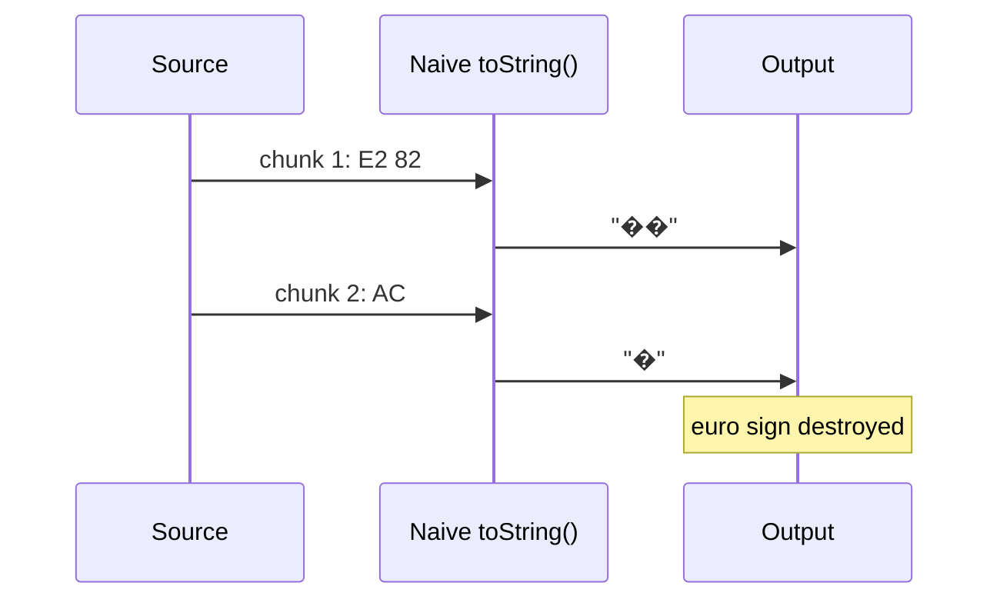

# Chapter 17 — Character Encodings, StringDecoder, and Intl

**What you will learn**

- The four different things people mean by "character": byte, code unit, code point, and grapheme cluster.
- Exactly how UTF-8 encodes text, and why decoding a stream chunk by chunk corrupts it.
- How to fix that with `StringDecoder`, `TextDecoder({ stream: true })`, or `readable.setEncoding()`.
- Which encodings `Buffer` supports versus which `TextDecoder` supports, and when you need the other one.
- How your Node binary was built with ICU, how to detect it at runtime, and what silently degrades when it was built small.
- Where `Intl` and `String.prototype.normalize()` belong in server code, and how Unicode normalization causes filename and database bugs.

## Why this matters

You write a log processor. It reads a UTF-8 file in 64 KiB chunks, converts each chunk with `chunk.toString()`, splits on newlines, and parses JSON. It works for months. Then a user in Osaka posts a message with a Japanese name, the name happens to straddle a 64 KiB boundary, and your parser throws `SyntaxError: Unexpected token` on one line out of forty million. The chunk boundary landed in the middle of a three-byte character, `toString()` turned the fragments into replacement characters, and the JSON became invalid.

This class of bug is invisible in development, rare in staging, and constant at scale. It is also entirely preventable — Node ships a module whose only job is to prevent it. The rest of this chapter is about that module, the standards-based alternative, and the layer above it: locale-aware formatting and comparison, which is what your users actually see. Text handling is the part of a backend that quietly decides whether people outside your own language can use your product.

## Bytes, code units, code points, grapheme clusters

Four levels, and confusing them is the root of most text bugs.

| Level | What it is | How you count it in JS |
|---|---|---|
| **Byte** | An octet on the wire or on disk. | `Buffer.byteLength(str, enc)` or `buf.length` |
| **Code unit** | The 16-bit pieces a JavaScript string is made of (UTF-16). | `str.length` |
| **Code point** | One Unicode character number, `U+0000`–`U+10FFFF`. | `[...str].length` |
| **Grapheme cluster** | What a human calls "a character" — possibly several code points. | `Intl.Segmenter` |

Watch them diverge:

```js
const s = 'e\u0301';  // 'e' + COMBINING ACUTE ACCENT — renders as é
console.log(Buffer.byteLength(s));  // 3  bytes in UTF-8
console.log(s.length);              // 2  UTF-16 code units
console.log([...s].length);         // 2  code points
// visually: one character

const flag = '🇯🇵';
console.log(Buffer.byteLength(flag)); // 8
console.log(flag.length);             // 4  (two surrogate pairs)
console.log([...flag].length);        // 2  (two regional indicators)
// visually: one flag
```

Practical consequences:

- **`str.length` is not a character count.** Using it to enforce "max 280 characters" gives emoji users half the budget.
- **`str.slice(0, n)` can split a surrogate pair**, producing a lone surrogate that encodes to `U+FFFD`.
- **`str[i]` returns a code unit**, not a character. Iterate with `for...of` or spread, which iterate code points.
- **Nothing built into the language counts grapheme clusters** except `Intl.Segmenter`.

## UTF-8, in detail

UTF-8 encodes each code point in one to four bytes. The pattern is fixed and self-describing:

| Code point range | Bytes | Bit pattern |
|---|---|---|
| `U+0000`–`U+007F` | 1 | `0xxxxxxx` |
| `U+0080`–`U+07FF` | 2 | `110xxxxx 10xxxxxx` |
| `U+0800`–`U+FFFF` | 3 | `1110xxxx 10xxxxxx 10xxxxxx` |
| `U+10000`–`U+10FFFF` | 4 | `11110xxx 10xxxxxx 10xxxxxx 10xxxxxx` |

Two properties make UTF-8 the default everywhere:

1. **ASCII is unchanged.** Any 7-bit ASCII text is already valid UTF-8, byte for byte.
2. **It is self-synchronising.** A byte with the high bits `10` is always a continuation byte, never a start byte. Given a random position in a UTF-8 stream you can walk backwards a maximum of three bytes to find a character boundary.

That second property is what makes the streaming fix possible — and its absence is what makes the naive approach fail.

### Why chunk-boundary decoding corrupts text

The euro sign `€` is `U+20AC`, encoded as `E2 82 AC`. Suppose a socket delivers `E2 82` in one chunk and `AC` in the next:

```js
const a = Buffer.from([0xe2, 0x82]);
const b = Buffer.from([0xac]);

console.log(a.toString('utf8') + b.toString('utf8'));
// '��'  — two replacement characters, the euro is gone
```

`buf.toString('utf8')` decodes what it is given, in isolation. It has no memory of a previous call and no expectation of a future one. Incomplete sequences at the end become `U+FFFD`, and the information is destroyed — you cannot recover it from the string afterwards.

The same hazard applies to `'utf16le'`, where a code unit is two bytes and a surrogate pair is four, so a chunk boundary can land in either.



## `StringDecoder`: the fix

`node:string_decoder` exports a single class whose entire purpose is holding onto trailing partial sequences.

```mjs
import { StringDecoder } from 'node:string_decoder';
```

```cjs
const { StringDecoder } = require('node:string_decoder');
```

`new StringDecoder([encoding])` — `encoding` defaults to `'utf8'`. It accepts the same encoding names as `Buffer`.

| Method | Signature | Behaviour |
|---|---|---|
| `write(buffer)` | `{string\|Buffer\|TypedArray\|DataView}` → `string` | Decodes what it can; keeps any trailing incomplete sequence in an internal buffer for the next call. |
| `end([buffer])` | `{string\|Buffer\|TypedArray\|DataView}` → `string` | Optionally writes a final chunk, then flushes. Anything still incomplete becomes a substitution character. |

The euro survives, even split three ways:

```mjs
import { StringDecoder } from 'node:string_decoder';

const decoder = new StringDecoder('utf8');

console.log(JSON.stringify(decoder.write(Buffer.from([0xe2])))); // ""
console.log(JSON.stringify(decoder.write(Buffer.from([0x82])))); // ""
console.log(decoder.end(Buffer.from([0xac])));                   // €
```

Note that the first two `write()` calls return the **empty string**. That is correct and expected: the decoder has bytes but not yet a complete character. Your code must handle empty returns gracefully — do not assume one chunk in means one chunk out.

After `end()` the decoder is reset and may be reused for new input.

### A worked stream example

Here is a line splitter that is correct for arbitrary UTF-8 and arbitrary chunk boundaries. It is a pattern you will reimplement often — log tailing, NDJSON ingest, CSV import.

```mjs
import { createReadStream } from 'node:fs';
import { StringDecoder } from 'node:string_decoder';

export async function* readLines(path) {
  const decoder = new StringDecoder('utf8');
  let pending = '';

  for await (const chunk of createReadStream(path, { highWaterMark: 64 * 1024 })) {
    pending += decoder.write(chunk);

    let index;
    while ((index = pending.indexOf('\n')) !== -1) {
      yield pending.slice(0, index);
      pending = pending.slice(index + 1);
    }
  }

  // Flush any bytes the decoder is still holding, then the last partial line.
  pending += decoder.end();
  if (pending.length > 0) yield pending;
}

let count = 0;
for await (const line of readLines('events.ndjson')) {
  if (line.trim()) { JSON.parse(line); count++; }
}
console.log(`${count} records`);
```

Two buffers are at work and it is worth separating them clearly:

- The **decoder's** internal buffer holds at most three bytes: a partial UTF-8 sequence.
- The **`pending`** string holds a partial *line*, which can be arbitrarily long.

Only the first is `StringDecoder`'s job. Line framing is always yours.

Forgetting `decoder.end()` is a real bug, not a formality: if the file ends mid-sequence — truncated download, corrupted upload — those bytes are silently dropped instead of surfacing as `U+FFFD`, and you lose the signal that the input was damaged.

### `readable.setEncoding()` — the same thing, built in

Every Node `Readable` has a `setEncoding(encoding)` method that installs a `StringDecoder` internally. After calling it, the stream emits strings instead of `Buffer`s, and multi-byte characters are handled correctly across chunk boundaries.

```mjs
import { createReadStream } from 'node:fs';

const stream = createReadStream('events.ndjson');
stream.setEncoding('utf8');

for await (const chunk of stream) {
  // chunk is a string, never split mid-character
}
```

This is the shortest correct answer when you want the whole stream as text. Use an explicit `StringDecoder` when you need to keep receiving `Buffer`s for part of the pipeline (a checksum, a length count) and decode only some of it, or when the bytes are not coming from a Node stream at all.

## `TextDecoder` and `TextEncoder`

The WHATWG Encoding Standard's classes are also available, as globals and from `node:util`. They are the portable choice: identical code runs in browsers, Deno, and workers.

```js
const decoder = new TextDecoder();                  // defaults to 'utf-8'
const encoder = new TextEncoder();                  // always UTF-8

const bytes = encoder.encode('héllo');              // Uint8Array
console.log(decoder.decode(bytes));                 // 'héllo'
```

`new TextDecoder([encoding[, options]])` takes:

| Option | Type | Default | Meaning |
|---|---|---|---|
| `encoding` | string | `'utf-8'` | Any supported label or alias. |
| `options.fatal` | boolean | `false` | Throw a `TypeError` on malformed input instead of substituting `U+FFFD`. Not supported when ICU is disabled. |
| `options.ignoreBOM` | boolean | `false` | Keep the byte order mark in the output instead of stripping it. Only meaningful for `'utf-8'`, `'utf-16be'`, `'utf-16le'`. |

`decode([input[, options]])` accepts an `ArrayBuffer`, `DataView`, or `TypedArray`. Crucially it takes `{ stream: true }`, which gives it `StringDecoder` semantics — incomplete trailing sequences are buffered until the next call:

```js
const dec = new TextDecoder();
console.log(dec.decode(Buffer.from([0xe2, 0x82]), { stream: true })); // ''
console.log(dec.decode(Buffer.from([0xac])));                        // '€'
```

`TextEncoder` only ever produces UTF-8; `textEncoder.encoding` is always `'utf-8'`. Besides `encode(input)` it offers `encodeInto(src, dest)` (v12.11.0), which writes directly into a `Uint8Array` you already own and returns `{ read, written }` — `read` in UTF-16 code units of the source, `written` in bytes of the destination. That avoids one allocation in a hot path.

For pipelines, `TextEncoderStream` and `TextDecoderStream` are transform streams in the Web Streams API ([Chapter 20 — Web Streams](./20-web-streams.md)).

### Buffer encodings vs `TextDecoder` encodings

These two sets overlap but neither contains the other.

| Encoding | `Buffer` / `StringDecoder` | `TextDecoder` (full ICU) |
|---|---|---|
| UTF-8 | `'utf8'`, `'utf-8'` | `'utf-8'`, `'utf8'`, `'unicode-1-1-utf-8'` |
| UTF-16 little-endian | `'utf16le'`, `'ucs2'` | `'utf-16le'`, `'utf-16'` |
| UTF-16 **big-endian** | ❌ not supported | ✅ `'utf-16be'` |
| Latin-1 / ISO-8859-1 | `'latin1'`, `'binary'` (true ISO-8859-1) | mapped to `'windows-1252'` per spec |
| ASCII | `'ascii'` (legacy) | mapped to `'windows-1252'` |
| Base64 | `'base64'`, `'base64url'` | ❌ not an encoding here |
| Hex | `'hex'` | ❌ |
| Legacy single-byte (`koi8-r`, `windows-125x`, `iso-8859-2..15`, `macintosh`, …) | ❌ | ✅ |
| Legacy multi-byte (`shift_jis`, `euc-jp`, `euc-kr`, `gbk`, `gb18030`, `big5`, `iso-2022-jp`) | ❌ | ✅ |

Read that table as a decision procedure:

- **Decoding legacy non-Unicode text** (a CSV export from a 2003 ERP system, a `Shift_JIS` catalogue) → `TextDecoder`. `Buffer` simply cannot do it.
- **UTF-16 big-endian** → `TextDecoder`. `Buffer` is little-endian only.
- **Base64 or hex** → `Buffer`. These are binary-to-text encodings, not character encodings, and the WHATWG standard does not cover them.
- **Strict validation** → `TextDecoder` with `{ fatal: true }`, or `buffer.isUtf8()` from Chapter 16.
- **Everything else inside Node** → either; `Buffer` is usually faster and already in your hands.

One trap: the WHATWG standard maps the labels `'latin1'`, `'iso-8859-1'`, **and `'ascii'`** all to `windows-1252`. So `new TextDecoder('latin1')` and `Buffer.prototype.toString('latin1')` give **different results** for bytes `0x80`–`0x9F`. Node's `'latin1'` is true ISO-8859-1 (those bytes become C1 control characters); `TextDecoder`'s is windows-1252 (those bytes become curly quotes, the euro sign, the em dash). Neither is wrong; they answer different questions. Know which one your data source meant. Also note `'iso-8859-16'` is in the WHATWG standard but Node does **not** support it.

## ICU: what your binary can actually do

Everything locale-aware in Node — `Intl`, `String.prototype.normalize()`, `localeCompare`, IDN support in the URL parser, `buffer.transcode()`, the legacy encodings in `TextDecoder`, and `RegExp` Unicode property escapes — is implemented on top of **ICU** (International Components for Unicode), a C/C++ library bundled with Node and V8.

How much of ICU is present is a **build-time** decision, chosen with one of four `configure` options:

| Build option | ICU library | ICU locale data | Result |
|---|---|---|---|
| `--with-intl=full-icu` | Static, bundled | All locales | **The default**, and what official binaries ship. |
| `--with-intl=small-icu` | Static, bundled | English only (typically) | Smaller binary; `Intl` exists but non-English output degrades. |
| `--with-intl=system-icu` | The OS's ICU | Whatever the OS has | Common in Linux distro packages. Coverage depends on the system. |
| `--with-intl=none` (`--without-intl`) | Absent | Absent | `Intl` does not exist; `normalize()` is a no-op; `buffer.transcode()` does not exist. |

What degrades, by feature:

| Feature | `none` | `system-icu` | `small-icu` | `full-icu` |
|---|---|---|---|---|
| `String.prototype.normalize()` | no-op | full | full | full |
| `String.prototype.toUpperCase()` / `toLowerCase()` | full | full | full | full |
| `Intl` object | does not exist | partial/full (OS-dependent) | partial (English only) | full |
| `String.prototype.localeCompare()` | not locale-aware | full | full | full |
| `Number.prototype.toLocaleString()` | not locale-aware | partial/full | English only | full |
| `Date.prototype.toLocaleString()` | not locale-aware | partial/full | English only | full |
| WHATWG URL parser IDN support | absent | full | full | full |
| `buffer.transcode()` | does not exist | full | full | full |
| `TextDecoder` encodings | basic only | partial/full | Unicode only | full |
| `RegExp` Unicode property escapes | throws on invalid `RegExp` | full | full | full |

Note the last row in particular: on a `none` build, `/\p{Script=Greek}/u` is a **syntax error**, not a silently wrong match.

### Detecting what you have at runtime

Three checks, from weakest to strongest:

```js
// 1. Is ICU present at all?
const hasICU = typeof process.versions.icu === 'string';

// 2. Which ICU version?
console.log(process.versions.icu);   // e.g. '77.1' — undefined on a `none` build

// 3. Is non-English locale data present (full-icu or a complete system-icu)?
const hasFullICU = (() => {
  try {
    const january = new Date(9e8);
    return new Intl.DateTimeFormat('es', { month: 'long' }).format(january) === 'enero';
  } catch {
    return false;
  }
})();
```

The third check is the one that matters. `small-icu` still has an `Intl` object, `Intl.DateTimeFormat` still constructs without throwing, and `format()` still returns a string — it just returns the wrong string. On `small-icu`, formatting January in Spanish yields `'M01'` or `'January'` depending on the default locale, not `'enero'`. **Nothing throws.** That is why this must be an explicit startup assertion in any application that formats for users:

```mjs
// startup.mjs — fail loudly rather than shipping wrong output
if (new Intl.DateTimeFormat('es', { month: 'long' }).format(new Date(9e8)) !== 'enero') {
  throw new Error('This build lacks full ICU locale data; formatting would be wrong.');
}
```

### Supplying data to a `small-icu` build

If you are stuck with a `small-icu` binary (some minimal container images, some distro packages), you can load full data at run time:

```bash
NODE_ICU_DATA=./node_modules/full-icu node app.js
node --icu-data-dir=./node_modules/full-icu app.js
```

Precedence, highest first: `--icu-data-dir`, then `NODE_ICU_DATA`, then the `--with-icu-default-data-dir` compiled into the binary. The data file must match the ICU version of the binary; the conventional name is `icudtX[bl].dat`, where `X` is the major ICU version and `b`/`l` is endianness. You can compute the expected name:

```mjs
import os from 'node:os';
const name = `icudt${process.versions.icu.split('.')[0]}${os.endianness()[0].toLowerCase()}.dat`;
```

The `full-icu` npm package automates the download-and-match step. Node will **fail to start** if you point it at a directory whose data file it cannot read.

## The `Intl` APIs that matter in server code

Node's own documentation covers *how ICU is built in*, and points at ECMA-402 for the API surface — the only constructor it names explicitly is `Intl.DateTimeFormat`, used as the litmus test above. The `Intl` constructors themselves are standard JavaScript provided by V8, not Node APIs, so treat MDN and ECMA-402 as their reference. These are the ones that earn their place on a server:

| Constructor | Use it for |
|---|---|
| `Intl.Collator` | Locale-correct sorting and comparison. |
| `Intl.DateTimeFormat` | Dates and times, including timezone conversion. |
| `Intl.NumberFormat` | Numbers, currency, percentages, units, compact notation. |
| `Intl.PluralRules` | Choosing the right plural form — there are more than two in most languages. |
| `Intl.ListFormat` | "A, B, and C" with correct conjunctions and separators. |
| `Intl.RelativeTimeFormat` | "3 days ago", "in 2 hours". |
| `Intl.Segmenter` | Splitting text into graphemes, words, or sentences. |

The two rules for using them well:

**1. Construct once, reuse.** Constructing a formatter is expensive — it builds ICU state. Reusing one is cheap. In a request handler this is often a 10x difference.

```mjs
// ✅ Module scope, built once.
const money = new Intl.NumberFormat('de-DE', { style: 'currency', currency: 'EUR' });
const collator = new Intl.Collator('de-DE', { sensitivity: 'base', numeric: true });

export function renderPrice(cents) { return money.format(cents / 100); }
export function sortNames(names) { return names.sort(collator.compare); }
```

**2. Sorting is not `<`.** `'ä' < 'b'` is `false` in raw JavaScript because it compares UTF-16 code units, and `U+00E4` is above `'b'`. `Intl.Collator('de').compare('ä', 'b')` returns `-1`, which is what a German speaker expects. `collator.compare` is a bound function you can pass straight to `Array.prototype.sort`. The `numeric: true` option also makes `'item10'` sort after `'item9'`, which is usually what people want in a file listing.

`Intl.Segmenter` is the only way to count what users call characters:

```js
const seg = new Intl.Segmenter('en', { granularity: 'grapheme' });
const text = 'a👨‍👩‍👧‍👦b';

console.log(text.length);                  // 13 code units
console.log([...text].length);             // 9 code points
console.log([...seg.segment(text)].length); // 3 graphemes — what a human sees
```

Use it for length limits shown to users, and for truncation that must not cut an emoji in half.

## Normalization: NFC, NFD, and where it bites

Unicode can represent the same visible text more than one way. `é` is either:

- **NFC** (composed): `U+00E9` — one code point, two UTF-8 bytes.
- **NFD** (decomposed): `U+0065 U+0301` — `e` plus a combining acute, three UTF-8 bytes.

They look identical. They are **not equal** under `===`, not equal under `buf.equals()`, and not equal in a database `WHERE` clause with a byte-comparison collation.

```js
const composed = 'caf\u00e9';      // NFC: 4 code points
const decomposed = 'cafe\u0301';   // NFD: 5 code points, looks identical

console.log(composed === decomposed);                   // false
console.log(composed.length, decomposed.length);        // 4 5
console.log(composed.normalize('NFC') === decomposed.normalize('NFC')); // true
```

`String.prototype.normalize(form)` takes `'NFC'` (default), `'NFD'`, `'NFKC'`, or `'NFKD'`. The K forms additionally apply *compatibility* mappings — `'fi'` becomes `'fi'`, `'①'` becomes `'1'`, full-width Latin becomes ASCII. Compatibility normalization is lossy; use it for search indexing, never for storage.

Three places this becomes a production incident:

**Filenames on macOS.** Apple's HFS+ stored filenames in a variant of NFD, and although APFS no longer normalizes on write, the ecosystem is full of NFD filenames. A file created on macOS as `caf\u00e9.pdf` can come back from `fs.readdir()` in the decomposed form `cafe\u0301.pdf`. On Linux and Windows, the same file uploaded through a browser arrives NFC. Your lookup by name then fails on one platform and succeeds on the other — the classic "works on my machine" text bug.

```mjs
// ✅ Normalize both sides before comparing names that crossed a filesystem.
import { readdir } from 'node:fs/promises';

const wanted = 'caf\u00e9.pdf'.normalize('NFC');
const entries = await readdir('./uploads');
const match = entries.find((name) => name.normalize('NFC') === wanted);
```

**Database comparisons.** Postgres with a byte-comparison collation treats the two forms as different rows. A `UNIQUE` constraint on usernames will accept the NFC and NFD spellings of `café` as two different users — a genuine impersonation vector. Normalize on write, at the application edge, and stick to one form.

**Deduplication and hashing.** `crypto.createHash('sha256').update(text)` hashes the bytes. Two visually identical strings in different forms produce different digests, so content-addressed storage stores duplicates and cache lookups miss.

> **Rule:** normalize to NFC at every input boundary — HTTP body, form field, filename, database write. Do it once, at the edge, and the rest of your system can use `===`.

## Timezones and `TZ`

Dates are the other half of localization, and the mistakes are equally common.

`Date` stores a UTC timestamp. Everything else — `toString()`, `getHours()`, `toLocaleString()` without options — renders in the **process's** timezone, which is set by the `TZ` environment variable.

```bash
TZ=Europe/Dublin node -pe "new Date().toString()"
TZ=UTC node app.js
```

Node supports IANA timezone IDs such as `'Etc/UTC'`, `'Europe/Paris'`, `'America/New_York'`. Other abbreviations and aliases may work but are explicitly discouraged and not guaranteed. Setting `process.env.TZ` at run time changes the timezone on POSIX systems (since v13.0.0) and on Windows too (since v16.2.0).

Two rules that eliminate most date bugs:

1. **Run servers in UTC.** Set `TZ=UTC` explicitly in your container or service definition. Do not rely on the host — a machine in `America/Chicago` and one in `Europe/Berlin` will disagree about which day a timestamp falls on, and the discrepancy shows up in daily aggregates.
2. **Format for the user's zone explicitly**, never by mutating the process zone.

```mjs
const fmt = new Intl.DateTimeFormat('en-GB', {
  timeZone: 'Asia/Tokyo',
  dateStyle: 'full',
  timeStyle: 'short',
});
console.log(fmt.format(new Date()));
```

`Intl.DateTimeFormat().resolvedOptions().timeZone` reports the zone actually in effect, which is useful for logging at startup.

## Common mistakes

### ❌ Concatenating `chunk.toString()` in a loop

```js
let text = '';
for await (const chunk of stream) text += chunk.toString('utf8');
```

Any multi-byte character split across a chunk boundary becomes replacement characters. It works in tests because small inputs arrive in one chunk.

```mjs
// ✅ Either let the stream decode:
stream.setEncoding('utf8');
let text = '';
for await (const chunk of stream) text += chunk;

// ✅ Or collect bytes and decode once:
const chunks = [];
for await (const chunk of stream) chunks.push(chunk);
const text2 = Buffer.concat(chunks).toString('utf8');
```

The second form is only acceptable when you know the total size is bounded — see Chapter 16 on `MAX_STRING_LENGTH`.

### ❌ Forgetting `decoder.end()`

```js
const decoder = new StringDecoder('utf8');
for await (const chunk of stream) process(decoder.write(chunk));
// stream ended; up to 3 bytes are still inside the decoder, silently dropped
```

```js
// ✅
const decoder = new StringDecoder('utf8');
for await (const chunk of stream) process(decoder.write(chunk));
const tail = decoder.end();
if (tail) process(tail);
```

### ❌ Constructing an `Intl` formatter per request

```js
app.get('/price', (req, res) => {
  const f = new Intl.NumberFormat(req.locale, { style: 'currency', currency: 'EUR' });
  res.send(f.format(req.query.amount));
});
```

Formatter construction dominates the handler's cost under load.

```mjs
// ✅ Cache by locale.
const formatters = new Map();
function currencyFor(locale) {
  let f = formatters.get(locale);
  if (!f) {
    f = new Intl.NumberFormat(locale, { style: 'currency', currency: 'EUR' });
    formatters.set(locale, f);
  }
  return f;
}
```

Bound the map, or derive the key from a fixed allow-list of supported locales — an unbounded cache keyed on a request header is a memory-exhaustion vector.

### ❌ Comparing user-supplied strings without normalizing

```js
if (submittedUsername === storedUsername) grantAccess();
```

Two visually identical names in different normalization forms compare unequal — and the reverse, registering a lookalike, lets an attacker create an account that renders identically to someone else's.

```js
// ✅
const norm = (s) => s.normalize('NFC');
if (norm(submittedUsername) === norm(storedUsername)) grantAccess();
```

### ❌ Assuming `Intl` output is correct because it did not throw

```js
const label = new Intl.DateTimeFormat(userLocale, { month: 'long' }).format(date);
```

On a `small-icu` build this returns `'M01'` or English rather than the user's language, with no error anywhere. Assert full ICU at startup instead of discovering it from a support ticket.

## Production notes

- **Pin the build mode, and verify it in CI.** Official Node binaries are `full-icu`, but distro packages and some slim container images are not. Add a startup assertion (the `'enero'` check) and a CI test asserting `process.versions.icu` is present. A silent downgrade to `small-icu` during a base-image bump is a realistic failure.
- **`full-icu` costs binary size, `small-icu` costs correctness.** Full ICU data adds tens of megabytes. If image size genuinely matters, ship `small-icu` *plus* a runtime data directory via `NODE_ICU_DATA` so the data is a separate, cacheable layer — but then the startup assertion becomes mandatory.
- **Formatters are heavy; reuse them.** Constructing `Intl.Collator` or `Intl.DateTimeFormat` inside a hot loop is one of the easiest large wins in profiling a rendering path. Cache at module scope, keyed by a bounded set of locales.
- **Normalize at the edge, exactly once.** Pick NFC, apply it in your input-validation layer, and document it. Normalizing repeatedly deep in the code is wasted work; normalizing inconsistently is worse than not normalizing at all.
- **`StringDecoder` bounds its own memory; your line buffer does not.** The decoder holds at most a few bytes. The `pending` string in a line splitter grows without limit if the input contains no delimiter — a 2 GB single-line file, hostile or accidental, is an OOM. Enforce a maximum line length and fail the request.
- **Use `{ fatal: true }` at trust boundaries.** For data you did not produce, decoding malformed UTF-8 into `U+FFFD` hides corruption and can defeat downstream validation. `new TextDecoder('utf-8', { fatal: true })` or `buffer.isUtf8()` turns it into an error you can log and reject.
- **Set `TZ=UTC` in every deployment.** Leaving it to the host makes date-bucketed reports depend on which machine ran them, and makes DST transitions produce duplicate or missing hours in aggregates.
- **Never trust `str.length` for user-facing limits.** Use `Intl.Segmenter` for grapheme counts and `Buffer.byteLength` for storage limits. They are different limits and both may apply.

## Exercises

1. **Break it, then fix it.** Write a script that feeds a UTF-8 string containing emoji through a fake stream that emits one byte at a time, decoding first with `chunk.toString()` and then with a `StringDecoder`. *Success:* the first output is visibly corrupted, the second is byte-identical to the input.

2. **Count four ways.** Write `describe(str)` that prints UTF-8 byte length, UTF-16 code-unit length, code-point count, and grapheme count. Run it on `'a'`, `'é'` in both normalization forms, `'👍'`, and a family emoji. *Success:* you can predict every number before running it.

3. **Decode a legacy file.** Produce a file of `windows-1251` (Cyrillic) bytes, then read it correctly. *Success:* you can explain, in one sentence, why `Buffer.prototype.toString()` cannot do this job and `TextDecoder` can.

4. **Bounded line reader.** Extend the `readLines` generator in this chapter to reject any line longer than a configurable maximum, throwing a typed error, and to report the byte offset where the offending line started. *Success:* a 100 MB single-line file fails fast with a clear error and flat memory usage.

5. **Normalization audit.** Write a tool that walks a directory tree and reports every filename that is not in NFC, along with its NFC form. Then extend it to detect two entries in the same directory that differ only by normalization. *Success:* the tool runs clean on a Linux checkout and finds real differences on a macOS-authored archive.

## Recap

- Bytes, UTF-16 code units, code points, and grapheme clusters are four different counts; `str.length` is the second, and almost never the one you want.
- UTF-8 uses one to four bytes per code point and is self-synchronising, which is why partial sequences can be buffered and resumed.
- `buf.toString()` has no memory, so decoding stream chunks independently destroys any character that spans a boundary.
- `StringDecoder.write()` holds trailing partial sequences and may return an empty string; always call `end()` to flush.
- `readable.setEncoding()` installs a `StringDecoder` for you and is the shortest correct answer for whole-stream text.
- `TextDecoder` covers the legacy WHATWG encodings and UTF-16BE that `Buffer` cannot, supports `{ fatal: true }` and `{ stream: true }`, but does not do base64 or hex.
- Node's `'latin1'` is true ISO-8859-1; `TextDecoder`'s `'latin1'` label is windows-1252. They differ for bytes `0x80`–`0x9F`.
- ICU build mode (`full-icu` default, `small-icu`, `system-icu`, `none`) determines what `Intl` and `normalize()` can do; `small-icu` degrades **silently**, so assert `full-icu` at startup.
- Construct `Intl` formatters once and reuse them; use `Intl.Collator` rather than `<` for sorting and `Intl.Segmenter` for user-visible character counts.
- Normalize to NFC at every input boundary, and set `TZ=UTC` on servers.

## Where to go next

- [Chapter 16 — Buffers and Typed Arrays](./16-buffers.md) — the byte-level layer underneath everything here.
- [Chapter 18 — Streams I: Concepts, Readable, and Writable](./18-streams-concepts.md) — where `setEncoding` and chunk boundaries come from.
- [Chapter 20 — Web Streams API and Interop](./20-web-streams.md) — `TextDecoderStream` and `TextEncoderStream`.
- [Chapter 32 — URLs, Query Strings, and Punycode](../part5-networking/32-url-and-querystring.md) — IDN handling, another ICU-dependent feature.
- Official documentation: <https://nodejs.org/docs/latest/api/string_decoder.html> and <https://nodejs.org/docs/latest/api/intl.html>
