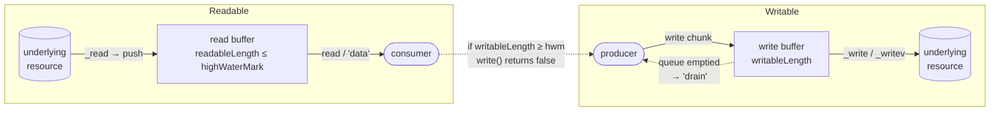

# Chapter 18 — Streams I: Concepts, Readable, and Writable

**What you will learn**

- Why streams exist, and how they turn an unbounded workload into a bounded one.
- The four stream types, what object mode changes, and what `highWaterMark` actually controls.
- The two `Readable` reading modes, the three `readableFlowing` states, and why mixing consumption styles breaks a program.
- How to build a `Readable` from scratch with `_read`/`push`, and from an iterable with `Readable.from()`.
- How to write to a `Writable` correctly: the `write()` return value, `'drain'`, `end()`, and `cork()`/`uncork()`.
- Exactly which lifecycle events fire, in what order, and why `'error'` must always be handled.

## Why this matters

Read a 4 GB log file with `fs.readFile()` and your process asks V8 for a 4 GB buffer. Best case, it throws. Realistic case, the container's memory limit is 512 MB and the process is killed with no stack trace, no log line, and an exit code that tells you nothing. Do the same on an HTTP handler that ten users hit at once and you need 40 GB.

Streams exist so that the memory your program uses depends on the *rate* of data, not the *total*. A stream pipeline processes a 4 GB file in 64 KiB pieces, holds a bounded amount at any instant, and — this is the part people miss — makes a slow consumer slow the producer down instead of quietly accumulating. That mechanism is called backpressure, and everything in this chapter builds toward it. Streams are also the shape of Node's I/O: `fs` read and write streams, TCP sockets, HTTP requests and responses, `zlib`, `crypto`, child-process stdio. If you understand `Readable` and `Writable`, you understand most of Node's surface area.

## The four stream types

| Type | Direction | Example |
|---|---|---|
| `Readable` | Source — you read from it | `fs.createReadStream()` |
| `Writable` | Destination — you write to it | `fs.createWriteStream()` |
| `Duplex` | Both, independently | `net.Socket` |
| `Transform` | A `Duplex` where the readable side is a function of the written side | `zlib.createDeflate()` |

`Duplex` is a `Readable` and a `Writable` glued into one object, but the two sides are *independent*: on a TCP socket, what you write is unrelated to what you read. A `Transform` is a `Duplex` where they are related — bytes you write come back out modified. Chapter 19 covers both; this chapter covers the two halves they are made of.

Everything lives in `node:stream`, with a promise-based utility set in `node:stream/promises` (available since v15.0.0).

```mjs
import { Readable, Writable } from 'node:stream';
import { pipeline } from 'node:stream/promises';
```

```cjs
const { Readable, Writable } = require('node:stream');
const { pipeline } = require('node:stream/promises');
```

## Object mode

By default, streams carry strings, `Buffer`s, `TypedArray`s, and `DataView`s — bytes. Setting `objectMode: true` at construction lets a stream carry any JavaScript value **except `null`**, which is reserved as the end-of-stream marker.

```mjs
import { Readable } from 'node:stream';

const rows = Readable.from([
  { id: 1, name: 'ada' },
  { id: 2, name: 'grace' },
], { objectMode: true });

for await (const row of rows) console.log(row.name);
```

Object mode changes the accounting unit. In byte mode the internal buffer is measured in bytes; in object mode it is measured in **objects**. A `highWaterMark` of 16 in object mode means sixteen items, however large each one is — so a stream of 10 MB parsed documents will happily buffer 160 MB. Choose the number to match the size of your objects.

Object mode cannot be turned on after construction. Pass it to the constructor or use a stream that sets it for you.

## `highWaterMark` and what "buffer" means here

Every `Readable` and every `Writable` owns an internal queue. `highWaterMark` is the threshold at which that queue is considered full.

- On a **`Readable`**, reaching the high water mark means "stop calling `_read()`" — stop pulling from the underlying resource.
- On a **`Writable`**, reaching it means "`write()` now returns `false`" — the signal to the caller to stop writing.

The defaults come from `stream.getDefaultHighWaterMark(objectMode)` (v19.9.0 / v18.17.0):

| Mode | Default `highWaterMark` |
|---|---|
| Byte streams, non-Windows | `65536` (64 KiB) |
| Byte streams, **Windows** | `16384` (16 KiB) |
| Object mode | `16` objects |

`stream.setDefaultHighWaterMark(objectMode, value)` changes the process-wide default. The Windows difference is real and occasionally surprising: the same program produces different chunk sizes and different `'data'` event counts across platforms, so never write a test that asserts a specific number of chunks.

Three things about `highWaterMark` that trip people up:

1. **It is a threshold, not a limit.** Node does not refuse writes above it. `writable.write()` returns `false` and *still buffers the chunk*. If you ignore the return value, the queue grows without bound until the process aborts. Enforcement is your job.
2. **For streams carrying undecoded strings, it counts UTF-16 code units**, not bytes.
3. **`Duplex` and `Transform` have two of them** — a separate readable and writable buffer, each with its own high water mark, because the two sides run at different speeds.

You can inspect the live state:

| Property | Meaning |
|---|---|
| `readable.readableLength` / `writable.writableLength` | Bytes (or objects) currently queued |
| `readable.readableHighWaterMark` / `writable.writableHighWaterMark` | The configured threshold |
| `writable.writableNeedDrain` | `true` when the stream is waiting to emit `'drain'` |
| `readable.readableFlowing` | `null`, `false`, or `true` (see below) |



## `Readable` in depth

### Two reading modes

A `Readable` is either **paused** or **flowing**.

- **Paused** — nothing happens until you call `readable.read()`. This is the starting state of every `Readable`.
- **Flowing** — the stream pulls from its source as fast as it can and hands chunks to you via `'data'` events.

A stream leaves paused mode when you do any of:

- attach a `'data'` listener,
- call `readable.resume()`,
- call `readable.pipe(destination)`.

It returns to paused mode when you:

- call `readable.pause()` (only reliable if there are no pipe destinations), or
- remove all pipe destinations with `readable.unpipe()`.

The rule underneath all of this: **a `Readable` does not generate data until something is ready to consume or discard it.** That is the whole point — no consumer, no memory spent.

The dangerous corollary: **in flowing mode with no `'data'` listener, data is discarded.** Call `resume()` without a listener and you have written a very efficient way to throw a file away. This is occasionally what you want (draining a request body you are rejecting), and it is worth knowing that `readable.resume()` is the idiomatic way to do it.

Two backward-compatibility quirks to know: removing all `'data'` listeners does **not** pause the stream, and calling `pause()` while pipe destinations exist does not guarantee it stays paused once those destinations drain.

### Three states

"Two modes" is a simplification of a three-valued property:

| `readable.readableFlowing` | Meaning |
|---|---|
| `null` | No consumption mechanism attached. The stream generates nothing. Initial state. |
| `true` | Flowing. `'data'` events are being emitted. |
| `false` | Explicitly paused (via `pause()`, `unpipe()`, or backpressure). **Data may still be accumulating in the internal buffer.** |

The transition that surprises everyone: once `readableFlowing` is `false`, attaching a `'data'` listener does **not** set it back to `true`. You must call `resume()`.

```mjs
import { PassThrough, Writable } from 'node:stream';

const pass = new PassThrough();
const sink = new Writable({ write(chunk, enc, cb) { cb(); } });

pass.pipe(sink);
pass.unpipe(sink);          // readableFlowing === false

pass.on('data', (chunk) => console.log('got', chunk.toString()));
pass.write('ok');           // nothing logged — still false
pass.resume();              // now readableFlowing === true, 'data' fires
```

### `'data'` versus `'readable'` + `read()`

Two paused/flowing consumption styles, plus the modern one.

**Flowing, with `'data'`:** simple, push-based, but you get chunks whether or not you are ready for them.

```js
readable.on('data', (chunk) => console.log(`received ${chunk.length} bytes`));
readable.on('end', () => console.log('done'));
readable.on('error', (err) => console.error(err));
```

**Paused, with `'readable'` + `read()`:** pull-based. `'readable'` fires when new data lands in the buffer (or when the end is reached); you then drain the buffer in a loop until `read()` returns `null`.

```js
readable.on('readable', () => {
  let chunk;
  while ((chunk = readable.read()) !== null) {
    console.log(`read ${chunk.length} bytes`);
  }
});
readable.on('end', () => console.log('done'));
```

The `while` loop is mandatory, not stylistic. `'readable'` may fire once for several buffered chunks; read a single chunk and you can stall forever waiting for an event that will not come.

`readable.read([size])` returns `null` when nothing is available. With a `size` argument it returns exactly `size` bytes, or `null` if that many are not buffered yet — *unless* the stream has ended, in which case it returns whatever remains. `size` must be at most 1 GiB. Only call `read()` in paused mode; in flowing mode Node calls it for you.

If `'readable'` and `'data'` are both attached, `'readable'` wins: `readableFlowing` becomes `false` and `'data'` fires only as a side effect of your `read()` calls. Remove the `'readable'` listener and the stream starts flowing again if `'data'` listeners remain. This is exactly the kind of behaviour you do not want to reason about at 3 a.m.

**Which to use?** `'readable'` + `read()` can be faster, because you control chunk sizes and can avoid extra copies. `'data'` is easier. Both are legacy compared with the third option.

### Async iteration — the modern default

Every `Readable` implements `Symbol.asyncIterator` (v10.0.0). This is what you should write in new code.

```mjs
import { createReadStream } from 'node:fs';

async function countBytes(path) {
  let total = 0;
  for await (const chunk of createReadStream(path)) {
    total += chunk.length;
  }
  return total;
}
```

Why it wins:

- **Backpressure is automatic.** The loop body runs to completion before the next chunk is requested. An `await` inside the loop genuinely pauses the source.
- **Errors are exceptions.** A stream `'error'` becomes a rejected promise, so `try`/`catch` and `async` propagation work normally. No `'error'` listener to forget.
- **Cleanup is automatic.** `break`, `return`, or `throw` destroys the stream, releasing the file descriptor or socket.

That last point is a behaviour change worth knowing: iterating a stream consumes it fully, and leaving the loop early destroys it. If you need to leave early *and* keep reading later, use `readable.iterator({ destroyOnReturn: false })` (v16.3.0, stable since v24.0.0 / v22.17.0):

```mjs
const it = readable.iterator({ destroyOnReturn: false });

for await (const chunk of it) {
  if (isHeader(chunk)) break;      // stream survives
}
console.log(readable.destroyed);   // false
for await (const chunk of readable) { /* continue with the body */ }
```

Chunks arrive sized by `highWaterMark`, so a file smaller than 64 KiB arrives as a single chunk. Never assume chunk boundaries mean anything — see [Chapter 17](./17-encodings.md) for what happens when you assume they align with characters.

### Choose one style and stay with it

`on('data')`, `on('readable')`, `pipe()`, and async iteration are four ways to consume the same queue. Node's own documentation is blunt about it: pick one per stream and never combine them. Mixing them produces lost chunks, streams that stall, or `'end'` events that never fire, and the failure depends on timing, so it will not reproduce locally.

The most common accidental mix is a debugging `on('data')` added next to an existing `pipe()`. Both are flowing-mode consumers; the pipe destination now sees a subset of the data. Remove the debug listener before shipping — or better, insert a `PassThrough` for observation.

### Building a `Readable`

Two ways. Prefer the second unless you are wrapping a genuine push source.

**With the constructor.** Supply `read(size)`, which Node calls when it wants more data. Push with `this.push(chunk)`; push `null` to signal EOF.

```mjs
import { Readable } from 'node:stream';

const counter = new Readable({
  objectMode: true,
  highWaterMark: 4,
  read() {
    this.n = (this.n ?? 0) + 1;
    if (this.n > 5) {
      this.push(null);            // EOF
    } else {
      this.push({ tick: this.n }); // returns false when the buffer is full
    }
  },
});

for await (const item of counter) console.log(item);
```

The `_read(size)` contract:

- Node calls it when the buffer has room. **You never call it.**
- `size` is advisory. Push whatever you have; you do not have to produce exactly `size` bytes.
- `push()` returns `false` when the buffer has reached the high water mark — stop pushing and wait for the next `_read()` call.
- Pushing empty strings or empty buffers does not trigger another `_read()`.
- Push `null` exactly once, to end the stream.

Constructor options for `new Readable([options])`:

| Option | Default | Meaning |
|---|---|---|
| `highWaterMark` | See `getDefaultHighWaterMark()` | Buffer threshold. |
| `encoding` | `null` | If set, chunks are decoded to strings with this encoding. |
| `objectMode` | `false` | Carry arbitrary values. |
| `emitClose` | `true` | Emit `'close'` after destruction. |
| `autoDestroy` | `true` | Destroy automatically after `'end'` or an error. |
| `signal` | — | An `AbortSignal`; aborting destroys the stream with an `AbortError`. |
| `read`, `destroy`, `construct` | — | Implementations of `_read`, `_destroy`, `_construct`. |

`_construct(callback)` exists for asynchronous setup — opening a file or connecting a socket — and delays all reads until you call back. Use it instead of doing async work in the constructor, where you have nowhere to report failure.

**With `Readable.from(iterable[, options])`** (v12.3.0 / v10.17.0). If your source is already an iterable or async generator, this is a one-liner and there is no `_read` contract to get wrong.

```mjs
import { Readable } from 'node:stream';

async function* fetchPages(url) {
  let next = url;
  while (next) {
    const res = await fetch(next);
    const body = await res.json();
    yield* body.items;
    next = body.next;
  }
}

const items = Readable.from(fetchPages('https://api.example.com/v1/items'));
```

Two details: `Readable.from()` sets `objectMode: true` unless you explicitly pass `false`, and `Readable.from(string)` or `Readable.from(buffer)` does **not** iterate the string or buffer character by character — those are treated as single values, deliberately, for performance. Also avoid passing an array of promises; a rejection among them can become an unhandled rejection.

## `Writable` in depth

### `write()` and its return value

```js
writable.write(chunk[, encoding][, callback]);
```

- `chunk` — string, `Buffer`, `TypedArray`, or `DataView`; any non-`null` value in object mode.
- `encoding` — used when `chunk` is a string. Default `'utf8'`. Ignored in object mode.
- `callback` — called when this specific chunk has been handled, with an error as first argument if it failed.
- **Returns `false`** when the internal buffer has reached `highWaterMark` after accepting the chunk; `true` otherwise.

**That boolean is the entire backpressure protocol on the writable side, and it is advisory.** Node accepts the write either way. Ignore `false` repeatedly and the buffer grows until memory is exhausted and the process aborts — and long before that, RSS climbs and the garbage collector degrades. On a TCP socket the risk is worse: if the remote peer never reads, the socket never drains, and an attacker who simply stops reading can drive your server out of memory. Ignoring the return value on a socket is a remotely exploitable vulnerability, not a style issue.

### `'drain'`

When `write()` returns `false`, stop and wait for `'drain'`, which fires when the queue has emptied enough to accept more.

```mjs
async function writeAll(writable, chunks) {
  for (const chunk of chunks) {
    if (!writable.write(chunk)) {
      await new Promise((resolve) => writable.once('drain', resolve));
    }
  }
  await new Promise((resolve, reject) => {
    writable.end((err) => (err ? reject(err) : resolve()));
  });
}
```

That is the correct manual pattern. In practice, prefer `pipeline()` (Chapter 19), which implements it for you and cleans up on failure. Write the loop by hand only when the data is genuinely produced on demand and cannot be modelled as a `Readable`.

Note the interaction with `Transform` streams: they are paused by default until piped or given a `'data'`/`'readable'` listener, so writing to a `Transform` without a consumer attached buffers everything indefinitely.

### `end()`

`writable.end([chunk[, encoding]][, callback])` declares that no more data is coming. The optional `chunk` is written first. The callback fires when the stream is finished.

```js
file.write('hello, ');
file.end('world!');
file.write('more');   // ERR_STREAM_WRITE_AFTER_END
```

Calling `write()` after `end()` raises an error. `end()` does not mean the bytes have reached the disk — that is what `'finish'` tells you.

### `cork()` and `uncork()`

`cork()` forces all subsequent writes into memory instead of passing them down. `uncork()` flushes them, handing the whole batch to `_writev()` in one call. `end()` also uncorks.

```js
socket.cork();
socket.write('HTTP/1.1 200 OK\r\n');
socket.write('Content-Type: application/json\r\n');
socket.write('\r\n');
socket.write(body);
process.nextTick(() => socket.uncork());
```

The purpose is to avoid one syscall (and, on a socket, one packet) per small write. Two rules:

1. **Defer `uncork()` with `process.nextTick()`.** That batches everything written during the current event-loop phase.
2. **Cork counts nest.** Two `cork()` calls need two `uncork()` calls before anything flushes.

`cork()` is only a win if the stream implements `_writev()`. Without it, corking buffers the chunks and then replays them one at a time — extra memory for no benefit.

### Building a `Writable`

```mjs
import { Writable } from 'node:stream';

class LineCounter extends Writable {
  #lines = 0;

  constructor(options) {
    super({ ...options, decodeStrings: true });
  }

  _write(chunk, encoding, callback) {
    for (const byte of chunk) if (byte === 0x0a) this.#lines++;
    callback();
  }

  _final(callback) {
    console.log(`total lines: ${this.#lines}`);
    callback();
  }
}
```

The three methods you may implement:

| Method | When it runs | Contract |
|---|---|---|
| `_write(chunk, encoding, callback)` | Once per chunk | Call `callback()` on success, `callback(err)` on failure. Exactly once. |
| `_writev(chunks, callback)` | Instead of `_write` when multiple chunks are queued | `chunks` is an array of `{ chunk, encoding }`. Optional; makes `cork()` worthwhile. Since v12.11.0, `_write` is optional if you provide `_writev`. |
| `_final(callback)` | After `end()`, before `'finish'` | Flush trailing state, close handles. Delays `'finish'` until you call back. |

Every `Writable` must provide `_write` and/or `_writev`. None of these are ever called by application code — the underscore means "the base class calls this".

**The callback is the backpressure mechanism.** Between `_write()` being invoked and your `callback()`, every further `write()` is queued. Forget the callback and the stream stalls silently — no error, no event, just a program that stops. Call it twice and you corrupt internal state.

Constructor options for `new Writable([options])`:

| Option | Default | Meaning |
|---|---|---|
| `highWaterMark` | See `getDefaultHighWaterMark()` | Level at which `write()` returns `false`. |
| `decodeStrings` | `true` | Convert strings to `Buffer` before `_write`. Set `false` to receive strings. |
| `defaultEncoding` | `'utf8'` | Encoding assumed for string writes. |
| `objectMode` | `false` | Accept arbitrary values. |
| `emitClose` | `true` | Emit `'close'` after destruction. |
| `autoDestroy` | `true` | Destroy after `'finish'` or error. |
| `signal` | — | `AbortSignal` for cancellation. |
| `write`, `writev`, `final`, `destroy`, `construct` | — | Implementations of the underscore methods. |

`writable.setDefaultEncoding(encoding)` changes the assumed encoding after construction.

## The lifecycle, event by event

This is the table to keep open while debugging.

| Event | Stream | Fires when | Fires how often |
|---|---|---|---|
| `'data'` | Readable | A chunk is handed to a consumer in flowing mode, or `read()` returns one | Many |
| `'readable'` | Readable | New data lands in the buffer, or the end is reached | Many |
| `'end'` | Readable | All data has been **consumed** | Once |
| `'pause'` / `'resume'` | Readable | `pause()` / `resume()` changes the flowing state | Many |
| `'drain'` | Writable | The queue has emptied after `write()` returned `false` | Many |
| `'finish'` | Writable | `end()` was called **and** all data was flushed to the underlying system | Once |
| `'pipe'` / `'unpipe'` | Writable | A `Readable` piped to or unpiped from it | Many |
| `'error'` | Both | Any failure | Should be once |
| `'close'` | Both | The stream and its resources are closed; no further events | Once, if `emitClose` |

The distinctions that matter:

- **`'end'` requires consumption, not availability.** A `Readable` that nobody reads never emits `'end'`. If you are waiting for `'end'` and it never comes, you almost certainly never started consuming.
- **`'finish'` means "handed off", `'close'` means "resource released".** For a file write stream, `'finish'` says the data reached the OS; `'close'` says the file descriptor is closed. Wait for `'close'` if you are about to reopen or rename the file.
- **`'error'` closes the stream** unless `autoDestroy: false`. After `'error'`, no further events other than `'close'` should be emitted.
- **`'close'` is guaranteed only when `emitClose` is `true`** — it is the default, but a hand-rolled stream may have disabled it.

A typical successful readable ends `... 'data' × N → 'end' → 'close'`; a typical writable ends `... 'drain' × N → 'finish' → 'close'`.

### Always handle `'error'`

Streams are `EventEmitter`s, and an unhandled `'error'` event on an `EventEmitter` is **thrown** — which, from an asynchronous callback, means an uncaught exception and a dead process. There is no default handler to save you.

```js
// ❌ One EACCES and the process is gone.
createReadStream('/etc/shadow').pipe(response);
```

Three correct approaches, in increasing order of preference:

```mjs
// 1. Explicit listeners on every stream.
source.on('error', onError);
dest.on('error', onError);

// 2. stream.finished — one callback for end, error, and close.
import { finished } from 'node:stream/promises';
await finished(source);

// 3. pipeline — wires errors and destroys every stream on failure.
import { pipeline } from 'node:stream/promises';
await pipeline(source, transform, dest);
```

`pipe()` does **not** forward errors and does **not** clean up the destination when the source fails, which leaks file descriptors and sockets. That is the whole reason `pipeline()` exists; Chapter 19 covers it properly.

## Common mistakes

### ❌ Ignoring the `write()` return value

```js
for (const row of millionRows) {
  res.write(JSON.stringify(row) + '\n');   // never checked
}
res.end();
```

Every unwritten chunk sits in the queue. With a slow client, memory grows until the process aborts — and a client that deliberately stops reading can trigger it on demand.

```mjs
// ✅ Let the stream machinery apply backpressure.
import { Readable } from 'node:stream';
import { pipeline } from 'node:stream/promises';

await pipeline(
  Readable.from(millionRows.map((row) => JSON.stringify(row) + '\n')),
  res,
);
```

### ❌ Mixing consumption styles

```js
stream.pipe(destination);
stream.on('data', (chunk) => metrics.add(chunk.length));  // steals chunks
```

Both are flowing consumers of the same queue; the destination now receives less than it should.

```mjs
// ✅ Observe with a PassThrough instead of a second consumer.
import { PassThrough } from 'node:stream';
const tap = new PassThrough();
tap.on('data', (chunk) => metrics.add(chunk.length));
stream.pipe(tap).pipe(destination);
```

### ❌ Reading only one chunk per `'readable'` event

```js
readable.on('readable', () => {
  const chunk = readable.read();   // one chunk, then nothing
  if (chunk) handle(chunk);
});
```

`'readable'` may cover several buffered chunks. Read one and the stream can stall with data still queued.

```js
// ✅ Drain in a loop.
readable.on('readable', () => {
  let chunk;
  while ((chunk = readable.read()) !== null) handle(chunk);
});
```

### ❌ Forgetting the `_write` callback

```js
class Slow extends Writable {
  _write(chunk, encoding, callback) {
    db.insert(chunk, (err) => {
      if (err) return callback(err);
      // forgot callback() on success
    });
  }
}
```

The stream accepts one chunk and then hangs forever. No error, no timeout, no event.

```js
// ✅ Exactly one call, on every path.
_write(chunk, encoding, callback) {
  db.insert(chunk, (err) => callback(err ?? null));
}
```

### ❌ Assuming `'end'` fires without a consumer

```js
const stream = createReadStream('big.log');
stream.on('end', () => console.log('done'));   // never runs
```

Nothing is consuming, so the stream never leaves the `readableFlowing === null` state.

```js
// ✅ Consume it — even if only to discard it.
stream.on('data', () => {});
stream.on('end', () => console.log('done'));
// or, to discard efficiently:
stream.resume();
```

## Production notes

- **Backpressure is a security control, not a performance tweak.** A client that opens a connection and never reads the response is the cheapest denial-of-service attack there is. Any code path that writes to a socket must respect `write()`'s return value, or go through `pipeline()`.
- **Tune `highWaterMark` with evidence.** Raising it increases throughput and memory per stream simultaneously. A server with 10,000 concurrent connections and a 1 MB high water mark has provisioned 10 GB of buffer. Multiply before you tune, and remember the Windows default is a quarter of the POSIX one.
- **Object-mode high water marks count objects, not bytes.** The default of 16 is safe for small records and catastrophic for 50 MB parsed documents. Set it explicitly whenever object size is non-trivial.
- **Always use `pipeline()` or `finished()` for cleanup.** `pipe()` leaves the destination open when the source errors. In a long-lived server that is a file-descriptor leak, and `EMFILE` under load is a miserable failure to diagnose because it manifests far from its cause.
- **Async iteration is the safest default.** It gives backpressure, error propagation, and destruction on early exit for free. Reserve `'readable'` + `read()` for cases where you have profiled and need control of chunk sizes.
- **Never assert on chunk counts or sizes in tests.** Chunking depends on the platform, the file system, the network, and the default high water mark. Assert on the concatenated result.
- **Wire `AbortSignal` into long-lived streams.** Both constructors accept `signal`, and `stream.addAbortSignal(signal, stream)` retrofits it. Without cancellation, a client disconnect leaves a file read running to completion for nobody ([Chapter 13 — AbortController](../part2-async/13-abort-and-cancellation.md)).
- **Watch `writableLength` and `readableLength` in metrics.** A queue that grows monotonically is backpressure being ignored somewhere. It is one of the few leading indicators of memory trouble you can graph before the process dies.

## Exercises

1. **Watch the modes.** Create a `Readable` that pushes ten numbered chunks. Log `readableFlowing` before and after attaching a `'data'` listener, after `pause()`, and after `resume()`. *Success:* you can predict `null`, `true`, and `false` at each point without running it.

2. **Build a throttled source.** Implement a `Readable` in object mode that emits a timestamp roughly every 100 ms and ends after 20 emissions, using `_read` and `push`. Consume it with `for await`. *Success:* the loop receives 20 items and terminates cleanly; adding an `await` delay in the loop body slows the source rather than growing the buffer.

3. **Prove backpressure exists.** Write a `Writable` whose `_write` calls back after 50 ms, with `highWaterMark: 4` in object mode. Push 100 items in a loop without respecting the return value and log `writableLength`; then do it again respecting `'drain'`. *Success:* the first run shows the queue growing to ~96, the second stays at or below 4.

4. **Batch with cork.** Implement a `Writable` with both `_write` and `_writev` that logs which one ran and with how many chunks. Write ten small chunks with and without `cork()`/`uncork()` deferred by `process.nextTick`. *Success:* the corked run makes one `_writev` call with ten chunks.

5. **Map the lifecycle.** Instrument a file read stream and a file write stream with listeners on every event in the lifecycle table, and record the exact order for three scenarios: normal completion, a source error (missing file), and a consumer that calls `destroy()` halfway. *Success:* you can state which events do not fire in each failure case and why.

## Recap

- Streams bound memory by the *rate* of data rather than its total size, and make slow consumers slow producers down.
- The four types are `Readable`, `Writable`, `Duplex`, and `Transform`; `Duplex` and `Transform` maintain two independent buffers.
- Object mode carries any value except `null`, and changes the `highWaterMark` unit from bytes to objects.
- `highWaterMark` defaults to 64 KiB on POSIX, 16 KiB on Windows, and 16 objects in object mode; it is a threshold, not an enforced limit.
- A `Readable` starts paused and flows when you attach `'data'`, call `resume()`, or `pipe()`; in flowing mode with no listener, data is discarded.
- `readableFlowing` is `null`, `true`, or `false`, and once it is `false` only `resume()` brings it back.
- Pick one consumption style per stream. Async iteration is the modern default: automatic backpressure, errors as exceptions, cleanup on early exit.
- `write()` returning `false` means stop until `'drain'`; ignoring it on a socket is a remotely exploitable memory-exhaustion bug.
- Implementers call `callback()` exactly once in `_write`; `_writev` makes `cork()`/`uncork()` worthwhile; `_final` delays `'finish'`.
- `'end'` requires consumption, `'finish'` means flushed, `'close'` means released — and an unhandled `'error'` kills the process.

## Where to go next

- [Chapter 19 — Streams II: Duplex, Transform, pipeline, Backpressure](./19-streams-advanced.md) — the composition tools and the correct error handling.
- [Chapter 20 — Web Streams API and Interop](./20-web-streams.md) — the standards-based alternative and how to convert between them.
- [Chapter 17 — Character Encodings, StringDecoder, and Intl](./17-encodings.md) — decoding stream chunks without corrupting text.
- [Chapter 23 — File System II](../part4-system/23-filesystem-advanced.md) — `fs` read and write streams in practice.
- Official documentation: <https://nodejs.org/docs/latest/api/stream.html>
