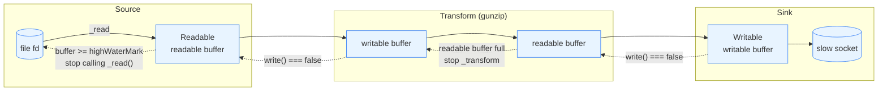

# Chapter 19 — Streams II: Duplex, Transform, pipeline, and Backpressure

## What you will learn

- How backpressure actually works at the byte level, and what breaks without it.
- Why `.pipe()` is the wrong tool in production code, and exactly which resources it leaks.
- How to use `stream.pipeline()`, its promise form, and `stream.finished()` to guarantee cleanup and cancellation.
- How to implement a correct `Transform` with `_transform()` and `_flush()`, in both byte mode and object mode.
- How to compose pipelines from async generators with `stream.compose()` and `Readable.from()`.
- What the experimental `node:stream/iter` module offers and whether you should adopt it yet.

## Why this matters

A pipeline that works on a 2 MB test fixture and dies on a 20 GB production file is the single most common streaming bug. The code looks identical. The difference is whether every stage of the pipeline tells the stage before it to slow down. When it does not, Node happily buffers the entire input in memory, the resident set climbs until V8 gives up, and you get a heap out-of-memory crash at 3 a.m. with a stack trace that points at nothing useful.

The second most common bug is the invisible one: a stream errors halfway, your process keeps running, and the file descriptor for the half-written output is never closed. Nothing crashes. Hours later the process hits `EMFILE: too many open files` and every new request fails. Both bugs come from the same root cause — treating streams as a pipe you connect and forget rather than as a resource you own. This chapter fixes both.

## Backpressure: the actual mechanism

Backpressure is not a feature you enable. It is a protocol built from two ordinary signals that you can either honour or ignore.

**Signal one: the return value of `write()`.** A `Writable` keeps an internal buffer. `writable.write(chunk)` always accepts the chunk — it never refuses. But it returns `false` once the amount of buffered data has reached or exceeded `highWaterMark`. `false` means "I took this one, but stop sending."

**Signal two: the `'drain'` event.** When the internal buffer has been flushed back down below `highWaterMark`, the writable emits `'drain'`. That is your permission to resume.

The readable side has the mirror image. Data enters a `Readable`'s buffer when the implementation calls `this.push(chunk)`. Once the buffer reaches `highWaterMark`, Node stops calling `_read()`, which means the underlying resource — a file descriptor, a socket — stops being read from. The OS-level TCP window closes, or the file simply is not read. That is how a slow disk on the consuming end eventually slows down a producer on another machine.

`highWaterMark` is a **threshold, not a hard cap**. Nothing prevents you from calling `write()` a million times in a row; the buffer will just keep growing. The threshold only tells you when to stop.

### The defaults, and the Windows difference

| Stream kind | Default `highWaterMark` | Unit |
|---|---|---|
| Byte streams, non-Windows | `65536` (64 KiB) | bytes |
| Byte streams, Windows | `16384` (16 KiB) | bytes |
| Object mode | `16` | objects |
| String streams (no decoding) | as configured | UTF-16 code units |

Yes, the byte default genuinely differs by platform. Read it at runtime rather than hard-coding it:

```mjs
import { getDefaultHighWaterMark, setDefaultHighWaterMark } from 'node:stream';

console.log(getDefaultHighWaterMark(false)); // 65536 on Linux/macOS, 16384 on Windows
console.log(getDefaultHighWaterMark(true));  // 16
```

`setDefaultHighWaterMark(objectMode, value)` changes the process-wide default. Both were added in v19.9.0 / v18.17.0. Changing a global default is a blunt instrument — prefer passing `highWaterMark` per stream.

### What happens with no backpressure

Here is the shape of the bug, written the way people actually write it:

```mjs
// BROKEN: ignores the return value of write()
import { createReadStream, createWriteStream } from 'node:fs';

const src = createReadStream('20gb.log');
const dst = createWriteStream('copy.log');

src.on('data', (chunk) => {
  dst.write(chunk); // return value discarded
});
src.on('end', () => dst.end());
```

Reading from a local file is fast. Writing to a network file system, or to a stream that gzips first, is slow. `src` emits `'data'` as fast as the disk delivers, `dst.write()` returns `false` almost immediately and keeps returning `false`, and every subsequent chunk is appended to `dst`'s internal buffer. The buffer is an array of `Buffer` objects with no ceiling. Memory grows linearly with the *difference* in throughput between the two ends. At a 100 MB/s read and a 10 MB/s write, you accumulate 90 MB of live buffer every second.

The manual fix demonstrates the protocol:

```mjs
src.on('data', (chunk) => {
  if (!dst.write(chunk)) {
    src.pause();
  }
});
dst.on('drain', () => src.resume());
src.on('end', () => dst.end());
```

Do not write this in real code. Write `pipeline()`. But understand it, because that pause/resume dance is precisely what `pipeline()` performs for you on every link of the chain.

### Propagation through a chain

Backpressure is transitive. A `Transform` has *two* independent buffers — a writable-side buffer and a readable-side buffer. When nobody drains the readable side, the readable buffer fills, the transform stops producing, its `_transform()` callback stops being invoked, its writable buffer fills, and `write()` on the transform starts returning `false` to whoever is upstream. The stall walks backwards, one stage at a time, until it reaches the file descriptor.



Solid arrows are data. Dashed arrows are backpressure travelling in the opposite direction. The chain is only as strong as its weakest link: one stage that ignores `write()`'s return value breaks the whole chain, and memory accumulates at exactly that stage.

## Why `.pipe()` is not enough

`readable.pipe(destination[, options])` does handle backpressure correctly. That is not the problem. The problem is errors.

The docs are blunt about it: if the `Readable` errors during processing, the `Writable` destination **is not closed automatically**. `pipe()` also does not forward errors — an `'error'` event with no listener on any stream in the chain becomes an uncaught exception and takes the process down.

Consider the classic three-stage chain:

```mjs
// BROKEN in three separate ways
src.pipe(gzip).pipe(dst);
```

1. If `src` errors (file deleted mid-read), `gzip` and `dst` stay open. `dst`'s file descriptor leaks. The partial output file stays on disk with no marker that it is incomplete.
2. If `gzip` errors, neither `src` nor `dst` is destroyed. `src` keeps its fd, and keeps reading into a buffer nobody drains.
3. There is no completion signal at all. `pipe()` returns the *destination*, not a promise. To know the copy finished, you need a `'finish'` listener on `dst` — and `'finish'` fires when `end()` has been processed, which is not the same as "the data reached the disk and the fd is closed" (that is `'close'`).

Writing this correctly by hand means attaching `'error'` to every stream, destroying the other streams from each handler, guarding against double-destroy, and distinguishing `'finish'` from `'close'`. That is thirty lines of fiddly code per pipeline. Use `pipeline()`.

The one place `.pipe()` remains reasonable is a throwaway script, or piping to `process.stdout` — which is never closed regardless of options and cannot leak.

## `stream.pipeline()`

`pipeline()` connects streams, propagates backpressure, forwards errors, and destroys every stream in the chain when anything fails. Prefer the promise form from `node:stream/promises` (available since v15.0.0).

```mjs
import { pipeline } from 'node:stream/promises';
import { createReadStream, createWriteStream } from 'node:fs';
import { createGzip } from 'node:zlib';

await pipeline(
  createReadStream('access.log'),
  createGzip(),
  createWriteStream('access.log.gz'),
);
```

```cjs
const { pipeline } = require('node:stream/promises');
const { createReadStream, createWriteStream } = require('node:fs');
const { createGzip } = require('node:zlib');

async function run() {
  await pipeline(
    createReadStream('access.log'),
    createGzip(),
    createWriteStream('access.log.gz'),
  );
}
run().catch(console.error);
```

If any stage fails, the promise rejects with that error and **all** streams have already been destroyed. That is the guarantee you are paying for.

### What exactly gets destroyed

`pipeline()` calls `stream.destroy(err)` on every stream in the chain, with two exceptions:

- `Readable` streams that already emitted `'end'` or `'close'`.
- `Writable` streams that already emitted `'finish'` or `'close'`.

Those are already finished, so destroying them would be pointless or harmful. Everything else gets torn down, which is what closes the file descriptors and sockets.

### Options

| Option | Type | Default | Meaning |
|---|---|---|---|
| `signal` | `AbortSignal` | — | Aborting destroys the whole pipeline with an `AbortError`. |
| `end` | `boolean` | `true` | End the destination when the source ends. Transform streams are always ended regardless. |

`end: false` matters when the destination outlives the pipeline — an HTTP response you want to write a trailer to, or a socket you will reuse.

Cancellation with a signal:

```mjs
import { pipeline } from 'node:stream/promises';
import { createReadStream, createWriteStream } from 'node:fs';

const ac = new AbortController();
setTimeout(() => ac.abort(), 5000).unref();

try {
  await pipeline(
    createReadStream('huge.bin'),
    createWriteStream('out.bin'),
    { signal: ac.signal },
  );
} catch (err) {
  if (err.name === 'AbortError') console.error('took too long, cleaned up');
  else throw err;
}
```

The five-second budget is enforced *and* the output fd is closed. That combination is what you cannot get from `.pipe()`.

### The dangling-listener caveat

`pipeline()` leaves event listeners attached to the streams after the callback fires or the promise settles. This is deliberate: an unexpected late `'error'` from a badly-written stream would otherwise become an uncaught exception. The consequence is that **reusing a stream after a failed pipeline leaks listeners and can swallow errors**. Treat a stream that has been through a pipeline as spent. (As a special case, if the last stream is readable, its dangling listeners *are* removed so it can be consumed afterwards.)

### The HTTP response trap

`pipeline()` destroys everything on error — including an `http.ServerResponse`, which destroys the underlying socket. So this does not work:

```mjs
// BROKEN: the error response never reaches the client
import { pipeline } from 'node:stream';
import { createReadStream } from 'node:fs';
import { createServer } from 'node:http';

createServer((req, res) => {
  pipeline(createReadStream('./missing.txt'), res, (err) => {
    if (err) return res.end('error!'); // socket is already gone
  });
}).listen(3000);
```

By the time the callback runs, the socket is destroyed and `res.end()` writes into the void. Open and stat the file *before* starting the pipeline, so you can still send a 404 with headers intact.

## `stream.finished()`

`finished()` answers a narrower question: "is this one stream done, for any reason?" It resolves when the stream is no longer readable or writable — normal end, error, or premature destruction.

```mjs
import { finished } from 'node:stream/promises';
import { createReadStream } from 'node:fs';

const rs = createReadStream('archive.tar');
rs.resume(); // must actually drain it

await finished(rs, { cleanup: true });
console.log('done reading');
```

| Option | Type | Default | Meaning |
|---|---|---|---|
| `error` | `boolean` | — | Whether to treat `'error'` as completion. |
| `readable` | `boolean` | — | Only wait on the readable side. |
| `writable` | `boolean` | — | Only wait on the writable side. |
| `signal` | `AbortSignal` | — | Abort the wait. |
| `cleanup` | `boolean` | `false` | Remove the listeners this call registered before settling. Added in v19.1.0 / v18.13.0. |

Like `pipeline()`, `finished()` leaves `'error'`, `'end'`, `'finish'` and `'close'` listeners attached by default. If you call `finished()` on the same long-lived stream repeatedly — a keep-alive socket, say — pass `cleanup: true` or you will accumulate listeners until Node prints a `MaxListenersExceededWarning` and, eventually, until you have a real leak.

Use `finished()` when the stream is driven by something other than a pipeline: an HTTP response you wrote to manually, a socket handed to you by a library, a stream you are consuming with `for await`.

## Duplex and Transform

A `Duplex` implements both `Readable` and `Writable`, with two **independent** buffers. The classic example is `net.Socket`: what you write goes out on the wire, what you read came in from the wire, and there is no relationship between the two. `zlib` and `crypto` streams are duplex too.

`new stream.Duplex(options)` takes every `Readable` and `Writable` option plus:

| Option | Type | Default | Meaning |
|---|---|---|---|
| `allowHalfOpen` | `boolean` | `true` | If `false`, ending the readable side automatically ends the writable side. |
| `readable` | `boolean` | `true` | Whether the duplex is readable at all. |
| `writable` | `boolean` | `true` | Whether the duplex is writable at all. |
| `readableObjectMode` | `boolean` | `false` | Object mode for the readable side only. No effect if `objectMode` is `true`. |
| `writableObjectMode` | `boolean` | `false` | Object mode for the writable side only. |
| `readableHighWaterMark` | `number` | — | Per-side threshold. No effect if `highWaterMark` is given. |
| `writableHighWaterMark` | `number` | — | Per-side threshold. |

The split object-mode options are the useful ones in practice: a parser that accepts bytes and emits objects is `writableObjectMode: false, readableObjectMode: true`.

`stream.duplexPair([options])` (v22.6.0 / v20.17.0) returns two duplexes wired to each other — whatever you write to one becomes readable on the other. It is the in-memory equivalent of a socket pair, and it is excellent for testing protocol code without opening a port.

```mjs
import { duplexPair } from 'node:stream';

const [client, server] = duplexPair();
server.on('data', (chunk) => server.write(`echo:${chunk}`));
client.write('ping');
client.once('data', (d) => console.log(d.toString())); // echo:ping
```

A `Transform` is a `Duplex` whose output is derived from its input. There is no requirement that the output be the same size, the same number of chunks, or produced at the same time — a hash stream produces one chunk at the very end; a gzip stream produces far fewer bytes than it consumes.

### Writing a real Transform

Two methods matter. `_transform(chunk, encoding, callback)` is called once per input chunk, never in parallel — the next chunk is not delivered until you call `callback`. `_flush(callback)` is called after the writable side ends but before `'end'` is emitted on the readable side, which is your only chance to emit trailing data.

Here is a line splitter that is correct at chunk boundaries, which is where naive implementations lose data:

```mjs
import { Transform } from 'node:stream';
import { StringDecoder } from 'node:string_decoder';

export class LineSplitter extends Transform {
  #decoder = new StringDecoder('utf8');
  #partial = '';

  constructor(options = {}) {
    super({ ...options, readableObjectMode: true });
  }

  _transform(chunk, encoding, callback) {
    const text = this.#partial + this.#decoder.write(chunk);
    const lines = text.split('\n');
    this.#partial = lines.pop(); // last element is incomplete
    for (const line of lines) {
      if (line.length > 0) this.push(line);
    }
    callback();
  }

  _flush(callback) {
    this.#partial += this.#decoder.end();
    if (this.#partial.length > 0) this.push(this.#partial);
    this.#partial = '';
    callback();
  }
}
```

Three things to notice. First, `StringDecoder` (Chapter 17) handles multi-byte UTF-8 characters split across chunk boundaries; plain `chunk.toString()` would corrupt them. Second, `lines.pop()` keeps the trailing fragment because a chunk almost never ends exactly on a newline. Third, `_flush()` emits that fragment — without it, a file whose last line has no trailing newline silently loses its last record.

`push()` may be called zero or more times per input chunk. Call `callback(err)` with an error to fail the stream; never `throw` from inside `_transform()` if the work is asynchronous, because the throw escapes into a context that cannot attribute it to the stream.

If the second argument to `callback` is provided and the first is falsy, it is forwarded to `push()`. These are equivalent:

```js
_transform(data, encoding, callback) { this.push(data); callback(); }
_transform(data, encoding, callback) { callback(null, data); }
```

The simplified constructor form avoids subclassing entirely and is fine for small transforms:

```mjs
import { Transform } from 'node:stream';

const redactTokens = new Transform({
  objectMode: true,
  transform(record, encoding, callback) {
    callback(null, { ...record, token: undefined });
  },
});
```

### Object mode for record processing

In object mode a "chunk" is any JavaScript value, and `highWaterMark` counts objects rather than bytes — 16 by default. This is where streams stop being about bytes and start being a bounded work queue:

```mjs
import { Transform } from 'node:stream';

class ParseJsonLines extends Transform {
  constructor() {
    super({ readableObjectMode: true, writableObjectMode: true });
  }
  _transform(line, encoding, callback) {
    try {
      callback(null, JSON.parse(line));
    } catch (err) {
      // Skip malformed records instead of killing the pipeline.
      this.emit('skipped', { line, err });
      callback();
    }
  }
}
```

The default `highWaterMark` of 16 means at most 16 parsed records sit in the buffer at once. If your records are large, that is a memory budget you should set explicitly.

## Composition: `compose`, `Readable.from`, and async generators

`stream.compose(...streams)` combines streams into a single `Duplex` that writes to the first and reads from the last, using `pipeline()` internally — so errors destroy the whole group. It was marked **stable** in v26.2.0 / v24.19.0 after five years as experimental.

Where `pipeline()` builds a closed circuit (readable in front, writable at the back), `compose()` builds a reusable *segment* you can pass around:

```mjs
import { compose } from 'node:stream';
import { pipeline } from 'node:stream/promises';
import { createGunzip } from 'node:zlib';
import { createReadStream, createWriteStream } from 'node:fs';
import { LineSplitter } from './line-splitter.mjs';

// A named, reusable segment.
export const ndjsonRecords = () => compose(createGunzip(), new LineSplitter());

await pipeline(
  createReadStream('events.ndjson.gz'),
  ndjsonRecords(),
  createWriteStream('lines.txt'),
);
```

`compose()` also converts plain functions:

- an `AsyncIterable` becomes a readable `Duplex` (it may not yield `null`),
- an `AsyncGeneratorFunction` taking a source becomes a transform `Duplex`,
- an `AsyncFunction` becomes a writable `Duplex` (it must return `null` or `undefined`).

`Readable.from(iterable[, options])` turns any sync or async iterable into a `Readable`. Note the default: **`objectMode` is `true`** unless you explicitly pass `objectMode: false`. And `Readable.from(string)` does not iterate the string character by character — strings and buffers are treated as single values, for performance.

```mjs
import { Readable } from 'node:stream';
import { pipeline } from 'node:stream/promises';

async function* fetchPages(baseUrl, signal) {
  for (let page = 1; ; page++) {
    const res = await fetch(`${baseUrl}?page=${page}`, { signal });
    const body = await res.json();
    if (body.items.length === 0) return;
    for (const item of body.items) yield item;
  }
}

const ac = new AbortController();
const source = Readable.from(fetchPages('https://api.example.com/orders', ac.signal));
source.on('close', () => ac.abort()); // stop fetching if the consumer goes away
```

That `'close'` handler is the important half. An async generator that awaits something long-running will keep the pipeline alive forever unless you propagate cancellation into it. `pipeline()` passes a `signal` as the second argument to generator stages for exactly this reason — use it.

`pipeline()` accepts async generators directly as stages, which is often clearer than a `Transform` subclass:

```mjs
import { pipeline } from 'node:stream/promises';
import { createReadStream, createWriteStream } from 'node:fs';

await pipeline(
  createReadStream('lower.txt'),
  async function* (source, { signal }) {
    source.setEncoding('utf8');
    for await (const chunk of source) {
      signal.throwIfAborted();
      yield chunk.toUpperCase();
    }
  },
  createWriteStream('upper.txt'),
);
```

Backpressure still works: `pipeline()` only pulls the next value from the generator when the destination is ready.

## The `node:stream/iter` module **[Experimental]**

Node 25.9.0 introduced **Iterable Streams**, a third streaming model that sits alongside classic streams and Web streams. It is documented at Stability 1 — Experimental, and it is **flag-gated**: you must run Node with `--experimental-stream-iter` to use it. That flag requirement is the single most important fact about it. It is not yet the default way to work with streaming data; it is a preview of where the API is heading.

The design is a deliberate simplification. There are no base classes to extend. A stream is just an `AsyncIterable` (or `Iterable`) — any object implementing the iteration protocol participates. All data is bytes: every chunk is a `Uint8Array`, and strings passed to `from()` are UTF-8 encoded automatically, which removes the encoding ambiguity that pervades classic streams. Data flows in **batches**: each iteration yields a `Uint8Array[]`, so the cost of one `await` and one promise is amortized across several chunks. Transforms are plain functions (`(chunks, options) => result`, receiving `null` as the flush signal) or objects with a generator-based `transform` method for stateful work.

```bash
node --experimental-stream-iter app.mjs
```

```mjs
import { from, pull, text } from 'node:stream/iter';

const asciiUpper = (chunks) => {
  if (chunks === null) return null; // flush signal
  return chunks.map((c) => {
    for (let i = 0; i < c.length; i++) {
      if (c[i] >= 97 && c[i] <= 122) c[i] -= 32;
    }
    return c;
  });
};

console.log(await text(pull(from('hello'), asciiUpper))); // 'HELLO'
```

The surface worth knowing:

| Function | What it does |
|---|---|
| `from(input)` / `fromSync(input)` | Build a byte stream from a string, `ArrayBuffer`, view, or iterable. |
| `pull(source[, ...transforms][, options])` | Lazy pipeline; nothing is read until you iterate. Accepts `signal`. |
| `pipeTo(source[, ...transforms], writer[, options])` | Drive a source into a writer; resolves with total bytes written. |
| `push([...transforms][, options])` | Producer-driven pair: `{ writer, readable }`. |
| `text` / `bytes` / `array` / `arrayBuffer` | Consumers; all accept a `limit` option that throws `ERR_OUT_OF_RANGE`. |
| `merge`, `tap`, `broadcast`, `share` | Fan-in, observation, and fan-out. |
| `fromReadable`, `fromWritable`, `toReadable`, `toWritable` | Interop with classic streams (added v26.1.0, also experimental). |

Two details are genuinely instructive even if you never use the module. First, the `limit` option on every consumer: a built-in cap on how many bytes you will accept before erroring. Classic streams give you nothing equivalent, and every real service needs it. Second, `push()`'s default `'strict'` backpressure policy actively *throws* when a producer calls `write()` without awaiting it — "Backpressure violation: too many pending writes". Rather than silently buffering the way a classic `Writable` does, it turns the most common streaming bug into an immediate, loud failure.

Verdict for production code today: use `pipeline()` and `Transform`. Read the `stream/iter` docs so you recognise it, and revisit when the flag goes away.

## A complete worked pipeline

The task: read a large gzipped NDJSON export, decompress it, parse each record, drop and count the malformed ones, redact a field, re-serialize, and write a new gzipped file — with a timeout, correct error handling, and no leaked descriptors on any path.

```mjs
import { pipeline } from 'node:stream/promises';
import { Transform } from 'node:stream';
import { createReadStream, createWriteStream } from 'node:fs';
import { createGunzip, createGzip } from 'node:zlib';
import { rm } from 'node:fs/promises';
import { LineSplitter } from './line-splitter.mjs';

export async function redactExport(inputPath, outputPath, { timeoutMs = 600_000 } = {}) {
  const ac = new AbortController();
  const timer = setTimeout(() => ac.abort(), timeoutMs);
  const stats = { read: 0, written: 0, skipped: 0 };

  const parse = new Transform({
    readableObjectMode: true,
    writableObjectMode: true,
    transform(line, encoding, callback) {
      stats.read++;
      try {
        callback(null, JSON.parse(line));
      } catch {
        stats.skipped++;
        callback(); // emit nothing, keep going
      }
    },
  });

  const redact = new Transform({
    writableObjectMode: true,   // objects in
    readableObjectMode: false,  // bytes out
    transform(record, encoding, callback) {
      const { email, ssn, ...safe } = record;
      stats.written++;
      callback(null, `${JSON.stringify(safe)}\n`);
    },
  });

  try {
    await pipeline(
      createReadStream(inputPath),
      createGunzip(),
      new LineSplitter(),
      parse,
      redact,
      createGzip({ level: 6 }),
      createWriteStream(outputPath),
      { signal: ac.signal },
    );
    return stats;
  } catch (err) {
    // pipeline() already destroyed every stream and closed both descriptors.
    // All that is left is the partial output file.
    await rm(outputPath, { force: true });
    throw err;
  } finally {
    clearTimeout(timer);
  }
}
```

What makes this correct:

- **Every failure path is covered by one `catch`.** A corrupt gzip trailer, a disk-full `ENOSPC` on the write, or an abort all reject the same promise, and in every case `pipeline()` has already destroyed all seven streams.
- **Descriptors cannot leak.** Neither `createReadStream` nor `createWriteStream` survives a failure.
- **Memory is bounded** by the sum of the seven `highWaterMark` values — roughly a few hundred KiB plus 16 objects per object-mode stage — regardless of whether the input is 10 MB or 10 TB.
- **Partial output is removed.** `pipeline()` closes the fd but does not delete the file; a truncated `.gz` that looks like a valid artifact is worse than no file, so clean it up yourself.
- **The timer is unconditionally cleared.** A pending timer keeps the event loop alive and would delay process exit.

## Common mistakes

### ❌ Chaining `.pipe()` and handling errors on the source only

```mjs
src.pipe(gzip).pipe(dst);
src.on('error', (err) => console.error(err)); // gzip and dst still open
```

The source's error handler stops the crash but nothing else. `gzip` and `dst` are never destroyed, so `dst`'s file descriptor stays open for the life of the process, and a partial `.gz` file remains on disk looking complete. Under load this is how you reach `EMFILE`.

✅ Let `pipeline()` own the teardown:

```mjs
import { pipeline } from 'node:stream/promises';

try {
  await pipeline(src, gzip, dst);
} catch (err) {
  console.error('transfer failed:', err);
}
```

### ❌ Forgetting `_flush()` in a buffering Transform

```mjs
class Splitter extends Transform {
  _transform(chunk, encoding, callback) {
    const lines = (this.partial + chunk).split('\n');
    this.partial = lines.pop();
    for (const l of lines) this.push(l);
    callback();
  }
  // no _flush — this.partial is silently discarded
}
```

Any transform that holds state across chunks must emit it at the end. Without `_flush()`, the final record of every file that lacks a trailing newline vanishes. It is invisible in tests with tidy fixtures and catastrophic on real data.

✅ Always emit the remainder:

```mjs
  _flush(callback) {
    if (this.partial) this.push(this.partial);
    this.partial = '';
    callback();
  }
```

### ❌ Writing from an async iterator without checking `write()`

```mjs
for await (const record of source) {
  dst.write(JSON.stringify(record) + '\n'); // never yields to the drain
}
dst.end();
```

`for await` paces the *source*, not the destination. If the destination is slower, every record piles up in its buffer. The loop never gives the writable a chance to drain because it never checks.

✅ Hand the iterator to `pipeline()`, which enforces backpressure between the stages:

```mjs
import { pipeline } from 'node:stream/promises';

await pipeline(
  source,
  async function* (records) {
    for await (const record of records) yield `${JSON.stringify(record)}\n`;
  },
  dst,
);
```

### ❌ Reusing a stream after a failed `pipeline()`

```mjs
try {
  await pipeline(src, dst);
} catch {
  await pipeline(src, backupDst); // src is destroyed, and still carries listeners
}
```

`pipeline()` destroyed `src` on the first failure and left its listeners attached. The retry either fails immediately or silently produces nothing, and each attempt adds listeners.

✅ Construct fresh streams for the retry:

```mjs
for (const dest of [primaryPath, backupPath]) {
  try {
    await pipeline(createReadStream(inputPath), createWriteStream(dest));
    break;
  } catch (err) {
    console.error(`write to ${dest} failed`, err);
  }
}
```

## Production notes

- **Size `highWaterMark` to your workload, not to the default.** 64 KiB per byte stream is a reasonable default for one pipeline and a disaster for 10,000 concurrent ones: seven-stage pipelines at 64 KiB each cost roughly 450 KiB apiece before you count the data itself. For high-concurrency services, lower it. For a single batch job moving terabytes, raising it to 1 MiB measurably cuts syscall overhead. Measure with `perf_hooks` (Chapter 49) rather than guessing.
- **Object mode counts objects, not bytes.** The default of 16 gives you no memory bound at all if your objects are 50 MB parsed JSON documents. Any object-mode stage carrying large values needs an explicit `highWaterMark` derived from your per-record size budget.
- **Always give long-running pipelines an `AbortSignal`.** Without one, a stalled socket or an NFS mount that stops responding holds file descriptors, memory, and a slot in your concurrency limit indefinitely, and no timeout elsewhere in your stack will free them. A signal plus `pipeline()` is the only combination that both bounds the wait and guarantees cleanup.
- **`pipeline()` closes descriptors; it does not undo side effects.** Partial files, partially-written rows, and half-sent HTTP responses are your responsibility. For file output, the safe pattern is write to a temporary path and `rename()` on success — `rename()` within a filesystem is atomic (Chapter 23), so consumers never observe a truncated file.
- **Watch for `MaxListenersExceededWarning` from `finished()`.** Calling `finished()` repeatedly on a long-lived socket without `cleanup: true` accumulates four listeners per call. The warning is the early symptom of a real leak; treat it as a bug, not noise.
- **`stream/iter` is flag-gated and experimental.** Do not ship it. Its `limit` option on consumers is worth imitating today: any place you buffer a stream into memory should have an explicit byte cap and fail loudly when the cap is exceeded, instead of trusting the producer.
- **Instrument the slow stage, not the pipeline.** When a pipeline is slow, `writableLength` on each stage tells you where the queue is. The stage whose writable buffer is permanently full is the bottleneck; the ones ahead of it are idle.

## Exercises

1. **Prove backpressure exists.** Build a pipeline from a `Readable.from()` generator that yields 1 MiB buffers as fast as it can, into a `Writable` whose `_write()` waits 50 ms before calling its callback. Log `process.memoryUsage().heapUsed` every second. Run it once with a manual `'data'`/`write()` loop and once with `pipeline()`. *Success:* the manual version's memory grows without bound; the `pipeline()` version stays flat.

2. **Write a CSV-to-object Transform.** Accept bytes, emit one plain object per row using the first row as the header. Handle quoted fields containing commas and rows split across chunk boundaries. *Success:* a 100 MB CSV processes with resident memory under 100 MB, and a file with no trailing newline still yields its last row.

3. **Build a bounded batching Transform.** In object mode, accumulate input records and emit arrays of at most `n` records, or after `t` milliseconds, whichever comes first. Emit any partial batch from `_flush()`. *Success:* no record is ever dropped or duplicated, and the timer never keeps the process alive after the stream ends.

4. **Make the worked pipeline resumable.** Extend `redactExport()` so that if it aborts, a second run skips the records already written. Write to a temporary file and `rename()` on success. *Success:* killing the process mid-run and re-running produces a file byte-identical to an uninterrupted run.

5. **Compare the three models.** Implement the same gzip-then-count pipeline three ways: classic `pipeline()`, `stream.compose()` with async generators, and `node:stream/iter` under `--experimental-stream-iter`. Measure wall time and peak RSS on a 1 GB input. *Success:* a short written comparison of throughput, memory, and how each one reports a mid-stream error.

## Recap

- Backpressure is two signals: `write()` returning `false`, and the `'drain'` event. `highWaterMark` is a threshold, not a limit — ignoring the signals means unbounded buffering.
- Byte-stream `highWaterMark` defaults to 64 KiB on POSIX and 16 KiB on Windows; object mode defaults to 16 objects.
- `.pipe()` handles backpressure but forwards no errors and closes nothing on failure. It leaks file descriptors and sockets. Use it only for throwaway scripts.
- `pipeline()` from `node:stream/promises` propagates errors, destroys every stream that has not already finished, and accepts a `signal` for cancellation. It is the default choice.
- `finished()` waits on a single stream; pass `cleanup: true` on long-lived streams to avoid listener accumulation.
- A `Transform` needs `_transform()` for per-chunk work and `_flush()` for anything held in state — omitting `_flush()` silently drops the tail of your data.
- `readableObjectMode` and `writableObjectMode` let one stream take bytes in and emit objects, or the reverse.
- `stream.compose()` (stable since v26.2.0 / v24.19.0) builds reusable pipeline segments; `Readable.from()` and async generator stages let you write transforms as plain generators.
- `node:stream/iter` is Experimental and requires `--experimental-stream-iter`. Learn it, do not deploy it.

## Where to go next

- [Chapter 18 — Streams I: Concepts, Readable, and Writable](../part3-data/18-streams-concepts.md) for the base classes and reading modes.
- [Chapter 20 — Web Streams API and Interop](../part3-data/20-web-streams.md) for the other stream system and how to convert between them.
- [Chapter 21 — Compression with zlib](../part3-data/21-zlib.md) for tuning the compression stages used above.
- [Chapter 13 — AbortController, Signals, and Cancellation](../part2-async/13-abort-and-cancellation.md) for the cancellation model behind `signal`.
- [Chapter 23 — File System II: Directories, Watching, Streams, and Atomicity](../part4-system/23-filesystem-advanced.md) for atomic write-and-rename.
- Official documentation: <https://nodejs.org/docs/latest/api/stream.html> and <https://nodejs.org/docs/latest/api/stream_iter.html>
