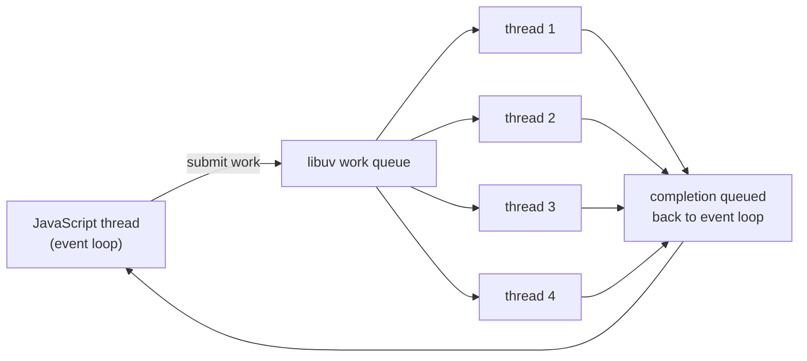

# Chapter 22 — File System I: Reading, Writing, and Metadata

**What you will learn**

- The three shapes of the `fs` API, and a rule for choosing between them that survives code review.
- Why every "async" file operation costs a libuv thread, and what `UV_THREADPOOL_SIZE` does about it.
- `readFile`, `writeFile`, `appendFile` with their real option sets — and the file sizes at which they become a liability.
- The full file system flag list, what `x` buys you, and which flags behave differently on Windows.
- `FileHandle`, the descriptor leak it prevents, and how `await using` closes files for you.
- What `stat` actually returns, when to reach for `bigint`, and why "check then open" is a bug.

## Why this matters

The file system is the first place a Node program touches the outside world. Configuration is read from it at boot. Uploads land on it. Logs leave through it. Templates, certificates, migration files, feature flags — all of it arrives as bytes on a disk that some other process may be editing at the same moment.

It is also where Node's single-threaded model leaks. A `require`-time `readFileSync` costs nothing anyone will notice. The same call inside an HTTP handler, on a file sitting on a slow network mount, stops the event loop for every connected client at once — timers do not fire, sockets do not drain, health checks time out, and the orchestrator kills a process that is not actually broken. The `fs` module gives you three ways to do everything precisely because the right choice depends on *when* you are calling it. This chapter is about making that choice deliberately, and about the metadata and permission machinery you need before you can do anything interesting with a file.

## Three APIs for one file system

Every `fs` operation exists in up to three forms:

| Flavour | Import | Returns | Blocks the loop? | Uses a threadpool slot? |
|---|---|---|---|---|
| Promise | `node:fs/promises` | a `Promise` | no | yes |
| Callback | `node:fs` | `undefined`, calls back | no | yes |
| Synchronous | `node:fs` (`*Sync`) | the value, or throws | **yes** | no |

```mjs
import { readFile } from 'node:fs/promises';       // promise
import { readFile as readFileCb, readFileSync } from 'node:fs';
```

```cjs
const { readFile } = require('node:fs/promises');  // promise
const { readFile: readFileCb, readFileSync } = require('node:fs');
```

The decision rule, in order:

1. **Default to `node:fs/promises`.** It composes with `async`/`await`, with `AbortSignal`, and with `try`/`finally`. Nearly every example in this book uses it.
2. **Use the callback API when you need the last few percent of throughput**, or when you are inside a callback-shaped library. The promise layer allocates a promise per call; on a hot loop over hundreds of thousands of files that is measurable. It is not measurable anywhere else.
3. **Use `*Sync` only where blocking is free**: module top level, CLI startup, build tools, test fixtures, and crash handlers. Never inside a request handler, a stream `_transform`, or a timer.

### Startup is free; a request handler is not

At startup nothing else is happening. There is no connection to starve and no timer to delay, so `readFileSync` is simpler and often faster than the async equivalent — you skip a threadpool hop and a promise.

```mjs
import { readFileSync } from 'node:fs';

// Startup: blocking here delays only ourselves.
const config = JSON.parse(readFileSync(new URL('./config.json', import.meta.url), 'utf8'));
```

Inside a handler the same call blocks *everything*. Node has one thread running JavaScript. A 20 ms `statSync` on a cold NFS mount is 20 ms during which no other request can progress, no `setTimeout` fires, and no socket is read. At 200 requests per second that is a four-fold amplification of a single slow disk into a service-wide stall.

```mjs
import { createServer } from 'node:http';
import { readFileSync } from 'node:fs';

// ❌ never: every other connection waits for this disk read
createServer((req, res) => {
  res.end(readFileSync(`/data/avatars${req.url}.png`));
}).listen(3000);
```

### The threadpool tax on async operations

"Asynchronous" does not mean "the kernel does it for free." Most file system syscalls have no portable non-blocking form, so libuv runs them on a fixed-size worker pool. Per the CLI documentation, all `fs` APIs except the file watchers and the explicitly synchronous ones use that pool, and so do `dns.lookup()`, `zlib`, and the async `crypto` functions such as `crypto.pbkdf2()` and `crypto.randomBytes()`.



The pool defaults to **4 threads**. Issue five concurrent `readFile` calls and the fifth waits. Issue one `crypto.pbkdf2()` with a high iteration count and you have lost a quarter of your file system capacity for its duration. Raise it with the `UV_THREADPOOL_SIZE` environment variable:

```bash
UV_THREADPOOL_SIZE=16 node server.js
```

It must be set *in the environment*, before the process starts. Setting `process.env.UV_THREADPOOL_SIZE` from inside your program is not guaranteed to work, because the pool is created during runtime initialisation, long before user code runs.

### Async means unordered

Because operations are dispatched to a pool, two calls made in the same tick can complete in either order. This is a real source of flaky tests:

```mjs
import { rename, stat } from 'node:fs';

// ❌ the stat may run before the rename finishes
rename('/tmp/hello', '/tmp/world', () => {});
stat('/tmp/world', (err, stats) => { /* may fail with ENOENT */ });
```

```mjs
import { rename, stat } from 'node:fs/promises';

// ✅ sequence explicitly
await rename('/tmp/hello', '/tmp/world');
const stats = await stat('/tmp/world');
```

## Whole-file reads and writes

`readFile` slurps an entire file into memory. `writeFile` replaces a file's contents. `appendFile` adds to the end. Together they cover most configuration and small-document work.

```mjs
import { readFile, writeFile, appendFile } from 'node:fs/promises';

const raw = await readFile('settings.json', 'utf8');
await writeFile('settings.json', JSON.stringify({ theme: 'dark' }, null, 2));
await appendFile('audit.log', `${new Date().toISOString()} settings updated\n`);
```

### `readFile` options

| Option | Type | Default | Notes |
|---|---|---|---|
| `encoding` | string \| null | `null` | `null` gives a `Buffer`; `'utf8'` gives a string |
| `flag` | string | `'r'` | see the flag table below |
| `signal` | `AbortSignal` | — | rejects with an `AbortError` |
| `buffer` | Buffer \| TypedArray \| DataView \| Function | — | read into a caller-supplied buffer (v26.4.0 / v24.19.0) |

Passing a bare string instead of an object sets the encoding: `readFile(p, 'utf8')` is `readFile(p, { encoding: 'utf8' })`.

The `buffer` option is the newest addition and is aimed at hot loops: supply a pre-allocated buffer (or a function that receives the file size and returns one) and the result is a *view over your buffer* rather than a fresh allocation. If the buffer is too small for the file, the promise rejects.

```mjs
import { Buffer } from 'node:buffer';
import { readFile } from 'node:fs/promises';

const scratch = Buffer.alloc(64 * 1024);
let total = 0;
for (const name of ['a.json', 'b.json', 'c.json']) {
  const view = await readFile(name, { buffer: scratch });   // no new allocation
  total += view.length;
}
console.log(total);
```

Aborting matters more than it looks. `readFile` performs many small reads internally; the signal cancels that internal loop, not the individual syscall already in flight.

```mjs
const ac = new AbortController();
setTimeout(() => ac.abort(), 2000);
const data = await readFile('/mnt/slow/report.csv', { signal: ac.signal });
```

### `writeFile` and `appendFile` options

| Option | `writeFile` default | `appendFile` default | Notes |
|---|---|---|---|
| `encoding` | `'utf8'` | `'utf8'` | ignored when `data` is a buffer |
| `mode` | `0o666` | `0o666` | only applies to a *newly created* file |
| `flag` | `'w'` | `'a'` | this is the only difference between the two |
| `flush` | `false` | `false` | calls `filehandle.sync()` before closing (v21.0.0 / v20.10.0) |
| `signal` | — | — | best-effort cancellation |

`appendFile` is `writeFile` with `flag: 'a'`. Both accept a string, a `Buffer`, a `TypedArray`, a `DataView`, or an `Iterable`/`AsyncIterable`.

Two traps. First, `mode` is honoured only when the file is created — writing to an existing file leaves its permissions alone. Second, the docs are explicit that calling `writeFile()` twice on the same path without awaiting the first is unsafe; the two internal write loops interleave and you get a corrupted file.

`flush: true` is the difference between "the kernel has my bytes" and "the disk has my bytes." Without it, a power loss immediately after a successful `writeFile` can leave you with nothing. See Chapter 23 for the full durability story.

### Why `readFile` is the wrong tool for large files

Three reasons, in increasing order of severity.

**Memory.** `readFile` holds the whole file at once. A 2 GB log file is a 2 GB allocation, on top of whatever else your process is doing. In a container with a 512 MB limit the process is OOM-killed with no JavaScript stack trace.

**Hard ceilings.** A single `Buffer` cannot exceed `buffer.constants.MAX_LENGTH` — `2**31 - 1` on 32-bit builds, `Number.MAX_SAFE_INTEGER` on 64-bit. Decoding to a string adds a second, much lower ceiling: `buffer.constants.MAX_STRING_LENGTH`, counted in UTF-16 code units and set by V8. Reading a multi-gigabyte file with `'utf8'` throws long before you run out of RAM.

**Latency.** Per the documentation, `readFile` deliberately reads in chunks and lets the event loop turn between them — 512 KiB per read for regular files, 64 KiB when Node cannot determine the size (a pipe, for example). That is friendly to the threadpool but means a large file takes longer to load than a tight `fs.read()` loop would.

The rule: `readFile` for anything you would be comfortable pasting into an editor. Streams (Chapter 23) for everything else.

## File system flags

The `flag`/`flags` option appears on `readFile`, `writeFile`, `appendFile`, `open`, `createReadStream`, and `createWriteStream`. Here is the complete documented list.

| Flag | Read | Write | Creates | Truncates | Fails if exists |
|---|---|---|---|---|---|
| `'r'` | yes | no | no — throws if missing | no | no |
| `'r+'` | yes | yes | no — throws if missing | no | no |
| `'rs'` | yes | no | no | no | no |
| `'rs+'` | yes | yes | no | no | no |
| `'w'` | no | yes | yes | **yes** | no |
| `'wx'` | no | yes | yes | — | **yes** |
| `'w+'` | yes | yes | yes | **yes** | no |
| `'wx+'` | yes | yes | yes | — | **yes** |
| `'a'` | no | append | yes | no | no |
| `'ax'` | no | append | yes | no | **yes** |
| `'a+'` | yes | append | yes | no | no |
| `'ax+'` | yes | append | yes | no | **yes** |
| `'as'` | no | append | yes | no | no |
| `'as+'` | yes | append | yes | no | no |

The `s` suffix means *synchronous mode* — it asks the operating system to bypass the local file system cache. It is primarily useful on NFS mounts where the local cache can be stale, it has a very real I/O cost, and it does **not** make `fs.open()` a blocking call. Use `fs.openSync()` if that is what you want.

The `x` suffix is `O_EXCL`: create-or-fail. It is the only race-free way to claim a name.

```mjs
import { open } from 'node:fs/promises';

// Exactly one process can win this.
try {
  const lock = await open('/var/run/importer.lock', 'wx');
  await lock.close();
} catch (err) {
  if (err.code === 'EEXIST') throw new Error('another importer is running');
  throw err;
}
```

Caveats the docs call out: on POSIX, `O_EXCL` on a symbolic link fails even if the link target does not exist; the exclusive flag may not work on network file systems; on Linux, positional writes are ignored when the file is opened in append mode; opening a directory with `'a+'` errors on macOS and Linux but succeeds on Windows and FreeBSD; and on Windows, opening an existing *hidden* file with `'w'` fails with `EPERM` — you need `'r+'`.

A `flag` can also be a number, built from `fs.constants` (`O_RDWR | O_CREAT | O_EXCL`, and so on).

## `FileHandle`: open, use, close

When you need more than one operation on the same file — read a header, seek, write a footer — open it once.

```mjs
import { open } from 'node:fs/promises';

const fh = await open('data.bin', 'r+');
try {
  const { bytesRead, buffer } = await fh.read(Buffer.alloc(16), 0, 16, 0);
  await fh.write('patched', 0);
  const st = await fh.stat();
  console.log(st.size, bytesRead, buffer);
} finally {
  await fh.close();
}
```

`fsPromises.open(path, flags = 'r', mode = 0o666)` resolves to a `FileHandle` — an `EventEmitter` wrapping a numeric descriptor, exposed as `fh.fd`. The callback and sync APIs give you the raw number instead, via `fs.open()` / `fs.openSync()`.

### The descriptor leak

Operating systems cap the number of descriptors a process may hold open. Forget to close and you will eventually see `EMFILE: too many open files` — typically in production, under load, after the code has been running fine for weeks.

`FileHandle` has a safety net: if it is garbage collected while open, Node *tries* to close the descriptor and emits a process warning. The documentation is blunt that you must not rely on this — it can be unreliable, the file may not be closed at all, and the behaviour may change. The `finally` block above is not optional.

### `await using` and `Symbol.asyncDispose`

Since v20.4.0 (backported to v18.18.0, and no longer experimental as of v24.2.0), `FileHandle` implements `Symbol.asyncDispose`, which simply calls `close()`. With explicit resource management you get the `finally` for free:

```mjs
import { open } from 'node:fs/promises';

async function readHeader(path) {
  await using fh = await open(path, 'r');
  const { buffer } = await fh.read(Buffer.alloc(512), 0, 512, 0);
  return buffer;                 // fh is closed as the scope exits, even on throw
}
```

`fs.Dir` has the same treatment (`Symbol.asyncDispose` and `Symbol.dispose`, both stable since v24.2.0), and `fsPromises.mkdtempDisposable()` (v24.4.0) returns an async-disposable object whose `path` is a temp directory that is removed on disposal.

## Metadata: `stat`, `lstat`, `fstat`

Three ways to ask "what is this?":

| Call | Argument | Follows symlinks? |
|---|---|---|
| `stat(path)` | path | yes — describes the target |
| `lstat(path)` | path | no — describes the link itself |
| `filehandle.stat()` / `fs.fstat(fd)` | open handle/descriptor | n/a — describes what you already opened |

```mjs
import { stat, lstat } from 'node:fs/promises';

const st = await stat('report.pdf');
console.log(st.isFile(), st.size, st.mtime);
```

### The `Stats` object

| Field | Meaning |
|---|---|
| `dev`, `ino` | device id and inode — together, a file's identity |
| `mode` | bit-field: file type **and** permission bits |
| `nlink` | number of hard links |
| `uid`, `gid` | owning user and group (POSIX) |
| `rdev` | device id, if this *is* a device |
| `size` | bytes (`0` if the file system cannot report it) |
| `blksize`, `blocks` | preferred I/O block size, blocks allocated |
| `atimeMs`, `mtimeMs`, `ctimeMs`, `birthtimeMs` | timestamps in milliseconds since the epoch |
| `atime`, `mtime`, `ctime`, `birthtime` | the same values as `Date` objects |
| `atimeInstant`, `mtimeInstant`, `ctimeInstant`, `birthtimeInstant` | the same values as `Temporal.Instant` (v26.2.0) |

Type predicates: `isFile()`, `isDirectory()`, `isSymbolicLink()`, `isBlockDevice()`, `isCharacterDevice()`, `isFIFO()`, `isSocket()`.

The four timestamps mean different things and people routinely pick the wrong one:

- **`atime`** — last time the data was *read*. Many systems mount with `relatime` or `noatime`, so this can be stale or frozen. Do not build cache invalidation on it.
- **`mtime`** — last time the *contents* changed. This is the one you almost always want.
- **`ctime`** — last time the *inode* changed: a `chmod`, a `chown`, a rename, a link count change, as well as a write. It is **not** creation time and never was on Unix.
- **`birthtime`** — creation time. Where the file system does not record it, you may get `ctime` or the Unix epoch instead, which means `birthtime` can be *later* than `mtime`.

Millisecond precision is platform-specific. The `Date` and numeric representations are snapshots taken from the same source but are not linked — mutating `st.mtime` does not change `st.mtimeMs`.

### `bigint: true`

Pass `{ bigint: true }` and every numeric field becomes a `BigInt`, and four extra nanosecond fields appear: `atimeNs`, `mtimeNs`, `ctimeNs`, `birthtimeNs`. Use it when you need inode numbers that exceed `Number.MAX_SAFE_INTEGER` (large XFS and ZFS volumes) or when millisecond resolution is not enough to order two events.

```mjs
const st = await stat('build.log', { bigint: true });
console.log(st.ino, st.mtimeNs);   // 48064969n 1318289051000000000n
```

`stat` also takes `throwIfNoEntry` (default `true`); set it to `false` and a missing entry yields `undefined` instead of an `ENOENT` rejection. That option has been on `statSync` since v15.3.0 and reached `fsPromises.stat()` in v25.7.0.

### `statfs`: the volume, not the file

`statfs(path)` describes the *mounted file system* containing `path`, returning an `fs.StatFs` with `type`, `bsize`, `frsize`, `blocks`, `bfree`, `bavail`, `files`, and `ffree`. It also accepts `{ bigint: true }`.

```mjs
import { statfs } from 'node:fs/promises';

const fsInfo = await statfs('/var/lib/uploads');
const freeBytes = fsInfo.bavail * fsInfo.bsize;   // bavail = blocks free to non-root
if (freeBytes < 1_000_000_000) throw new Error('less than 1 GB left');
```

Use `bavail`, not `bfree`: `bfree` includes blocks reserved for the superuser that your process cannot touch.

## "Does this file exist?"

Three answers, only one of which is usually right.

**`fs.exists()` is `**[Deprecated]**` (DEP0034).** Its callback takes a single boolean rather than an error-first pair, which breaks every promisification helper. Use `stat()` or `access()`.

**`fs.existsSync()` is *not* deprecated** and returns a plain boolean — it is genuinely useful in build scripts and startup checks. (Passing it an unsupported argument type is a runtime deprecation, DEP0187, and will throw in a future release.) There is no `fsPromises.exists()`.

**`access(path, mode)`** tests permission bits without opening anything. `mode` is `fs.constants.F_OK` (default, "is visible"), or a bitwise OR of `R_OK`, `W_OK`, `X_OK`. Note that `X_OK` has no effect on Windows — it behaves like `F_OK`. Since v25.0.0 the old top-level aliases `fs.F_OK`, `fs.R_OK`, `fs.W_OK`, `fs.X_OK` have been **removed**; they live on `fs.constants` only.

### Checking first is a bug

Every "check then act" sequence has a gap. Between your `access()` and your `open()`, another process can create, delete, or replace the file — a symlink pointing somewhere it should not, for instance. This is a TOCTOU (time-of-check to time-of-use) race, and the docs explicitly tell you not to write it.

```mjs
// ❌ racy
if (existsSync(target)) return;
await writeFile(target, payload);
```

```mjs
// ✅ let the kernel decide, atomically
try {
  await writeFile(target, payload, { flag: 'wx' });
} catch (err) {
  if (err.code !== 'EEXIST') throw err;
}
```

```mjs
// ✅ reading: try, then handle ENOENT
try {
  return JSON.parse(await readFile(configPath, 'utf8'));
} catch (err) {
  if (err.code === 'ENOENT') return defaults;
  throw err;
}
```

Check accessibility only when accessibility itself is the answer you need — a preflight diagnostic at startup, or a signal from another process — and not as a prelude to using the file. On Windows there is a further wrinkle: `access()` does not consult ACLs, so it can report a path as accessible that the ACL actually forbids.

## Permissions and ownership

`chmod(path, mode)` sets permission bits; `chown(path, uid, gid)` sets the owner. Both have `f*` variants for descriptors and `l*` variants for symlinks (`lchmod` is `**[Deprecated]**`, DEP0035, and is implemented only on macOS).

| Constant | Octal | Meaning |
|---|---|---|
| `S_IRUSR` | `0o400` | read by owner |
| `S_IWUSR` | `0o200` | write by owner |
| `S_IXUSR` | `0o100` | execute/search by owner |
| `S_IRGRP` | `0o40` | read by group |
| `S_IWGRP` | `0o20` | write by group |
| `S_IXGRP` | `0o10` | execute/search by group |
| `S_IROTH` | `0o4` | read by others |
| `S_IWOTH` | `0o2` | write by others |
| `S_IXOTH` | `0o1` | execute/search by others |

In practice you write three octal digits — owner, group, others — where `7` is rwx, `6` is rw, `5` is r-x, `4` is r--, and `0` is nothing.

```mjs
import { chmod } from 'node:fs/promises';

await chmod('deploy.sh', 0o755);   // owner rwx, everyone else r-x
await chmod('id_ed25519', 0o600);  // owner only
```

Always write modes in octal literal form. `chmod(f, 755)` is decimal 755 — octal `0o1363` — and does something you did not intend. Values above `0o777` are explicitly unsupported, which is why `S_ISUID`, `S_ISGID`, and `S_ISVTX` are not exposed in `fs.constants`.

### umask

The `mode` you pass on creation is a *request*. The process's umask is subtracted from it. With the common umask of `0o022`, a `writeFile` default of `0o666` produces a file with mode `0o644`. If you need exact bits, `chmod` after creating.

`process.umask(mask)` sets the mask and returns the previous one. Calling `process.umask()` with **no arguments** is `**[Deprecated]**` (DEP0139): it writes the process-wide mask twice, which is a race between threads and a potential security hole. There is no safe cross-platform alternative, so set the umask in your process supervisor rather than in JavaScript.

### Windows

This entire section is close to fiction on Windows. The documented behaviour: only the write permission can be changed, and the distinction between owner, group, and others is not implemented. `chown` is effectively meaningless. Real Windows access control lives in ACLs, which `node:fs` does not expose. Do not use file modes as a security boundary in cross-platform code.

## Copy, rename, delete, truncate

```mjs
import { copyFile, rename, unlink, truncate, cp, constants } from 'node:fs/promises';

await copyFile('a.txt', 'b.txt');                              // overwrites b.txt
await copyFile('a.txt', 'b.txt', constants.COPYFILE_EXCL);     // fails if b.txt exists
await rename('draft.md', 'published.md');
await truncate('session.log', 0);                              // empty it, keep the inode
await unlink('published.md');
await cp('./src', './dist', { recursive: true });
```

**`copyFile(src, dest[, mode])`.** `mode` is a bitmask of `COPYFILE_EXCL` (fail if `dest` exists), `COPYFILE_FICLONE` (try a copy-on-write reflink, fall back to a real copy), and `COPYFILE_FICLONE_FORCE` (reflink or fail). Symlinks are followed. The copy is **not** atomic — if it fails partway, Node attempts to remove the destination, but a reader can observe a half-written file.

**`rename(oldPath, newPath)`.** Overwrites `newPath` if it is a file; errors if it is a directory. Within a single file system this is the atomic building block for safe writes (Chapter 23).

**`unlink(path)`.** Removes a name, not necessarily the data: if other hard links remain, or a process still holds the file open, the bytes survive until the last reference goes. On a symlink, it removes the link and leaves the target.

**`truncate(path[, len = 0])`.** Shortens *or extends* to exactly `len` bytes. Extending fills with NUL bytes. Negative values are treated as `0`.

**`cp(src, dest[, options])`** is `cp -r`, stable since v22.3.0.

| Option | Default | Effect |
|---|---|---|
| `recursive` | `false` | copy directories |
| `force` | `true` | overwrite existing entries |
| `errorOnExist` | `false` | with `force: false`, throw instead of skipping |
| `dereference` | `false` | copy symlink targets rather than the links |
| `verbatimSymlinks` | `false` | skip path resolution for symlinks |
| `preserveTimestamps` | `false` | keep source `atime`/`mtime` |
| `filter` | — | `(src, dest) => boolean \| Promise<boolean>`; skipping a directory skips its whole subtree |
| `mode` | `0` | the `copyFile` mode bitmask |

```mjs
await cp('./project', './backup', {
  recursive: true,
  preserveTimestamps: true,
  filter: (src) => !src.includes('node_modules'),
});
```

## Common mistakes

### ❌ Checking for existence before writing

```mjs
if (!existsSync(dest)) {
  await writeFile(dest, data);        // another process may have created it by now
}
```

The gap between the check and the write is unbounded — a threadpool hop, a GC pause, a context switch. Two workers can both see "absent" and both write.

```mjs
// ✅ one atomic operation
try {
  await writeFile(dest, data, { flag: 'wx' });
} catch (err) {
  if (err.code !== 'EEXIST') throw err;
}
```

### ❌ Opening a file without a guaranteed close

```mjs
const fh = await open('report.csv', 'r');
const header = await fh.read(Buffer.alloc(512), 0, 512, 0);
await parse(header);                  // throws → fh is never closed
await fh.close();
```

Every throw between `open` and `close` leaks a descriptor. Enough of them and the process dies with `EMFILE`, usually hours later and far from the cause.

```mjs
// ✅ scope-bound
await using fh = await open('report.csv', 'r');
const header = await fh.read(Buffer.alloc(512), 0, 512, 0);
await parse(header);
```

### ❌ Reading a whole file to serve it

```mjs
res.end(await readFile(`/var/media/${id}.mp4`));
```

Ten concurrent viewers of a 500 MB video means 5 GB of buffers. Worse, a file over `MAX_STRING_LENGTH` throws outright if you decode it, and every byte must be read before the first byte is sent.

```mjs
// ✅ constant memory, first byte out immediately
import { createReadStream } from 'node:fs';
import { pipeline } from 'node:stream/promises';

await pipeline(createReadStream(`/var/media/${id}.mp4`), res);
```

### ❌ Decimal file modes

```mjs
await chmod('secret.key', 600);       // decimal 600 = 0o1130
```

`600` in decimal is not `0o600`. The resulting bits are nonsense, and the failure is silent — the file simply has the wrong permissions.

```mjs
// ✅ always octal literals
await chmod('secret.key', 0o600);
```

## Production notes

- **Set `UV_THREADPOOL_SIZE` deliberately, in the environment.** Four threads is the default and it is shared between `fs`, `dns.lookup()`, `zlib`, and async `crypto`. On an I/O-heavy service, 16 to 32 is a reasonable starting point. Measure: if file operation latency grows while CPU sits idle, you are queueing on the pool. It cannot be changed after startup.
- **Every `fs` error carries a `code`; branch on it, never on the message.** `ENOENT` (missing), `EEXIST` (already there), `EACCES`/`EPERM` (permission), `EISDIR`/`ENOTDIR` (wrong type), `EMFILE`/`ENFILE` (descriptor exhaustion), `ENOSPC` (disk full), `EXDEV` (cross-device link). Messages are localised and reworded between releases; codes are stable.
- **Cap concurrency when fanning out over many files.** `await Promise.all(files.map(readFile))` on 50,000 paths opens as many descriptors as the OS will allow and then fails with `EMFILE`. Batch, or use a small concurrency limiter — 32 to 64 in flight is plenty to saturate a disk.
- **Never interpolate user input into a path.** `/data/${req.params.id}.png` with an `id` of `../../etc/passwd` is a directory traversal. `resolve()` the path and verify it is still inside your root before touching it; Chapter 24 covers the correct check in detail.
- **Treat the file system as hostile shared state.** The docs warn that `fs` operations are neither synchronised nor thread-safe: concurrent modification of the same file from multiple promises can corrupt data. Anything with more than one writer needs `'wx'`, a lock file, or the write-temp-then-rename pattern from Chapter 23.
- **`stat()` is a syscall, so cache it.** A directory listing that stats every entry costs one syscall per entry plus one threadpool round trip. `readdir` with `withFileTypes: true` gets you the type without the extra `stat` in most cases.
- **`writeFile` without `flush: true` is not durable.** The promise resolves when the data reaches the kernel's page cache, which can be seconds ahead of the disk. For anything you cannot afford to lose after a power cut, pass `flush: true` and accept the latency.
- **Do not rely on POSIX permissions on Windows.** Only the write bit is honoured, groups and others do not exist, and `access()` ignores ACLs. If a permission check is a security control, enforce it in the application, not in the mode bits.

## Exercises

1. **Measure the threadpool.** Write a script that issues 32 concurrent `readFile` calls on a large file and prints each one's wall time. Run it with `UV_THREADPOOL_SIZE` at 4, 8, and 32. *Success:* a table showing the step pattern at the default size and where it disappears.

2. **Build a race-free lock.** Write `acquire(path)` and `release(path)` using the `'wx'` flag, storing the PID in the file. Run twenty copies of the program at once. *Success:* exactly one acquires; the other nineteen exit cleanly on `EEXIST` and none crash.

3. **Write a `describe(path)` CLI.** Print type, size, mode in octal, owner, and all four timestamps, using `lstat` so symlinks report as symlinks. Add a `--bigint` flag that switches to `BigInt` fields and prints the `Ns` timestamps. *Success:* correct output for a file, a directory, a symlink, and `/dev/null`; a clear message for a missing path.

4. **Find the string ceiling.** Generate files of 256 MB, 512 MB, and 1 GB. Read each with `readFile(p)` and with `readFile(p, 'utf8')`, recording peak RSS and the error if any. *Success:* an explanation of which limit each failure hit, and at what size.

5. **Audit a tree's permissions.** Walk a directory and report every file whose mode grants write access to group or others, and every file that is world-readable but should not be (take a list of sensitive extensions as input). Do it without ever calling a `*Sync` function and with at most 32 operations in flight. *Success:* correct results on a tree of 100,000 files, no `EMFILE`, and a documented peak memory figure.

## Recap

- `node:fs/promises` is the default; the callback API is for hot paths; `*Sync` is for startup and tooling only.
- Async `fs` work runs on libuv's threadpool — 4 threads by default, shared with `dns.lookup()`, `zlib`, and async `crypto`. Tune it with `UV_THREADPOOL_SIZE` in the environment, before the process starts.
- `readFile`/`writeFile`/`appendFile` are for small files. Above a few megabytes, use streams: `Buffer` and string length ceilings are real and the memory cost is linear in file size.
- The `x` flags (`wx`, `ax`, `wx+`, `ax+`) are the race-free way to claim a name; the `s` flags bypass the local cache and are for NFS.
- Close every `FileHandle`. `await using` plus `Symbol.asyncDispose` (stable since v24.2.0) makes that automatic.
- `stat` follows symlinks, `lstat` does not; `mtime` is contents, `ctime` is metadata, `birthtime` is unreliable, `atime` is often disabled.
- `fs.exists()` is deprecated (DEP0034) but `existsSync()` is not — and neither belongs in front of an operation you are about to perform anyway. Try the operation and handle `ENOENT`.
- File modes are octal literals, filtered by umask, and almost entirely ignored on Windows.

## Where to go next

- [Chapter 23 — File System II: Directories, Watching, Streams, and Atomicity](../part4-system/23-filesystem-advanced.md) for directories, `fs.watch`, file streams, and durable writes.
- [Chapter 24 — Paths, File URLs, and Cross-Platform Layout](../part4-system/24-paths.md) for building the path strings this chapter consumes, safely.
- [Chapter 18 — Streams I: Concepts, Readable, and Writable](../part3-data/18-streams-concepts.md) for the alternative to `readFile` on large inputs.
- [Chapter 16 — Buffers and Typed Arrays](../part3-data/16-buffers.md) for what `readFile` hands you when you omit an encoding.
- [Chapter 31 — The Permission Model](../part4-system/31-permission-model.md) for restricting file system access at the runtime level.
- Official documentation: <https://nodejs.org/docs/latest/api/fs.html>
