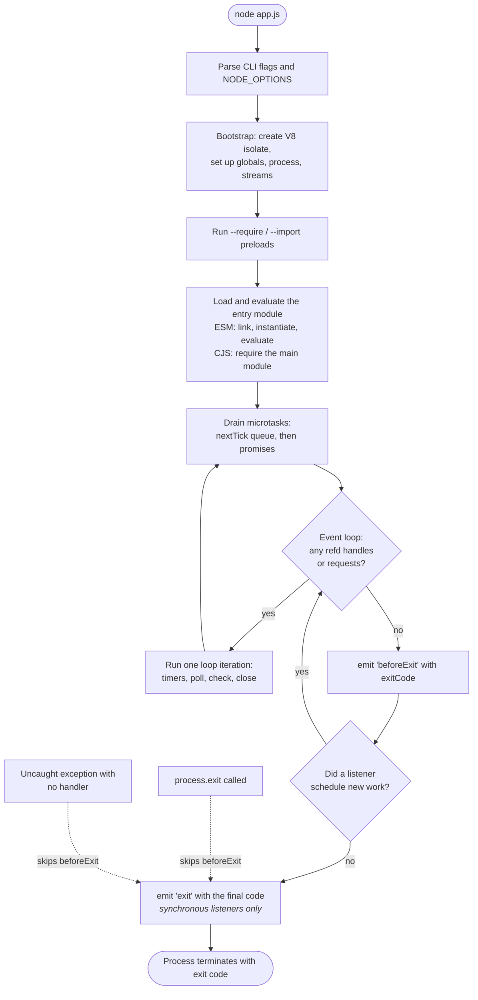

# Chapter 26 — Signals, Graceful Shutdown, and Process Lifecycle

**What you will learn**

- Trace a Node process from launch to exit code, and name what runs at each stage.
- Explain exactly what keeps the event loop alive, and use `unref()` to stop something keeping it alive.
- Handle POSIX signals correctly, and know which ones you cannot handle at all.
- Write shutdown code that works on Windows, where signals are emulated rather than real.
- Implement a complete, correct graceful shutdown for an HTTP service, with a hard-kill deadline.
- Diagnose the container-specific reasons your `SIGTERM` handler never fires: PID 1, shell-form `CMD`, and `npm start`.

**Why this matters**

Every deployment is a shutdown. Every autoscale-down, rolling update, node drain, and crash loop starts by asking your process to stop. If it stops badly, users see 502s during what should have been an invisible deploy, half-written rows appear in your database, and acknowledged-but-unprocessed messages vanish.

The default is bad: a Node process with no signal handler that receives `SIGTERM` dies instantly, mid-request, with in-flight work abandoned. Orchestrators send `SIGTERM` on every rollout, so "we deploy and a few requests fail" is not bad luck — it is documented behaviour for a program that never learned to shut down. Worse, the obvious fix often silently does nothing, because a layer between the orchestrator and Node ate the signal. This chapter covers both halves: writing the handler, and making sure it is reached.

## The lifecycle, start to finish



Two things in that diagram are worth stating plainly.

First, **`'beforeExit'` is the "the loop went idle" event, not the "we are stopping" event.** It fires only on a natural drain. It does *not* fire when someone calls `process.exit()`, and it does not fire on an uncaught exception. It is the one exit-time hook where you may schedule asynchronous work — a listener that starts a new async operation sends control back into the event loop, and `'beforeExit'` will fire again the next time the loop empties. That makes it easy to write an accidental infinite loop.

Second, **`'exit'` runs synchronously and nothing else will ever run.** The listener receives the exit code. Anything you schedule inside it is discarded:

```js
process.on('exit', (code) => {
  setTimeout(() => console.log('never printed'), 0);
  queueMicrotask(() => console.log('also never printed'));
  // This does run, because writeSync is synchronous:
  fs.writeSync(process.stderr.fd, `exiting with ${code}\n`);
});
```

The rule for `'exit'` is **synchronous only**: no `await`, no promises, no network calls. Use `fs.writeSync` or `fs.appendFileSync`. Closing a database pool in an `'exit'` handler does not work — the close is asynchronous and the process is already gone.

## What keeps the process alive

Node exits when the event loop has nothing left to do. "Nothing left to do" means: zero referenced handles (open sockets, servers, timers, watchers, `stdin` in flowing mode) and zero pending requests (in-flight file reads, DNS lookups).

Each of those is *referenced* by default, meaning it counts toward keeping the loop alive. Calling `.unref()` on it flips that: the handle keeps working, but it no longer votes to keep the process running.

```js
// A metrics heartbeat that must not prevent a CLI from exiting.
const timer = setInterval(reportMetrics, 10_000);
timer.unref();
```

This is the pattern for anything ambient: metrics timers, health pollers, cache sweeps, watchdogs. If your CLI hangs after doing its work, an un-unref'd handle is nearly always why.

To find it, `process.getActiveResourcesInfo()` returns strings naming the resource types currently keeping the loop alive:

```js
setInterval(() => {
  console.log(process.getActiveResourcesInfo());
  // e.g. [ 'TTYWrap', 'TTYWrap', 'TTYWrap', 'Timeout', 'TCPSERVERWRAP' ]
}, 1000).unref();
```

It gives types, not identities, but a stray `Timeout` or `TCPWRAP` is usually enough to find the culprit. `process.ref(maybeRefable)` / `process.unref(maybeRefable)` (**[Experimental]**, v23.6.0 / v22.14.0) work on any object implementing the "Refable protocol" — the `Symbol.for('nodejs.ref')` and `Symbol.for('nodejs.unref')` methods — so Web Platform types that cannot grow `ref()` methods can participate too.

## Signals

A signal is the operating system interrupting a process with a one-byte message. Node surfaces them as events on `process`, named by their uppercase common name; the handler receives that name as its first argument:

```js
function shutdown(signal) {
  console.log(`received ${signal}`);
}

process.on('SIGINT', shutdown);
process.on('SIGTERM', shutdown);
```

Installing a listener for `SIGINT` or `SIGTERM` on non-Windows platforms **removes Node's default behaviour**. Those signals default to handlers that reset the terminal mode and exit with `128 + signal number`; once you install a listener, Node no longer exits at all. Your handler owns termination — so if it has a bug, `Ctrl+C` stops working and the only way out is `SIGKILL`.

Signals are **not available in `Worker` threads**. Register handlers on the main thread and stop workers over the message channel.

### The signals that matter

| Signal | Sent when | Notes |
|---|---|---|
| `SIGTERM` | Polite "please stop" — orchestrators, `kill`, `docker stop` | **The** shutdown signal. Not supported on Windows, but can be listened for |
| `SIGINT` | `Ctrl+C` at a terminal | Supported on all platforms. **Not** generated when the terminal is in raw mode |
| `SIGHUP` | Terminal hangup; on Windows, when the console window is closed | On Windows, Node is **unconditionally terminated about 10 seconds later** regardless of your handler |
| `SIGQUIT` | `Ctrl+\` — terminate and dump core | |
| `SIGUSR1` | Application-defined — **but reserved by Node** | Receiving it **starts the debugger**. You may install a listener, but doing so might interfere with the debugger |
| `SIGUSR2` | Application-defined | Free for you. Also the default trigger for `process.report` |
| `SIGPIPE` | Write to a pipe with no reader | **Ignored by default** in Node; a listener can be installed |
| `SIGBREAK` | Windows `Ctrl+Break` | Can be listened for on other platforms, but there is no way to generate it there |
| `SIGWINCH` | Console resized | On Windows, only on a write to the console while the cursor moves, or with a readable TTY in raw mode |
| `SIGCHLD` | A child process changed state | Node handles this internally to reap children |

Three categories cannot be handled at all:

- **`SIGKILL` and `SIGSTOP` cannot have a listener installed.** `SIGKILL` unconditionally terminates the process on every platform; nothing Node does can change that. It is why a hard-kill deadline matters — `SIGKILL` is what arrives at the end of your orchestrator's grace period.
- **`SIGBUS`, `SIGFPE`, `SIGSEGV`, and `SIGILL`** can technically have listeners, but when raised for real (rather than sent artificially with `kill(2)`) the process is already in a state where running JavaScript is unsafe, and doing so may make it stop responding. Use `process.report.reportOnFatalError` instead.
- **Signal `0`** is not a signal. `process.kill(pid, 0)` tests existence: it throws if the process does not exist and does nothing if it does. It works everywhere, including Windows.

### `SIGUSR1` and the debugger

`SIGUSR1` is the traditional "application-defined signal number one", so it looks like a natural choice for "reload configuration". In Node it is not: sending `SIGUSR1` starts the inspector, which in production means an unexpected debugger port. Use `SIGUSR2` instead — but note it is the default trigger for diagnostic reports (`process.report.signal`), so if you want both, reconfigure one.

### Windows is different, and you need to plan for it

Windows has no POSIX signals. Node emulates a subset, and the emulation is lossy in ways that break naive shutdown code.

| Behaviour | POSIX | Windows |
|---|---|---|
| `SIGTERM` delivered by the OS | Yes | **No** — the signal does not exist. You can register a listener, but nothing will deliver it except Node itself |
| `SIGINT` from `Ctrl+C` | Yes | Yes |
| `SIGHUP` | Terminal hangup | On console window close — **but Windows kills the process ~10 s later regardless** |
| `SIGBREAK` | Not generatable | `Ctrl+Break` |
| `process.kill(pid, 'SIGTERM')` | Sends the signal; target decides | **Unconditionally terminates the target**, no handler runs |
| `subprocess.kill(signal)` | Sends `signal` | Signal ignored except `SIGKILL`, `SIGTERM`, `SIGINT`, `SIGQUIT`; the process is always killed forcefully and abruptly |
| Exit "by signal" | Exit code `128 + n` | No equivalent concept |

The practical consequences:

1. **Do not build your shutdown story on `SIGTERM` alone if Windows is a target.** There, `SIGINT` (`Ctrl+C`) and `SIGBREAK` are what a user or service manager can actually deliver.
2. **`process.kill()` on Windows is not "ask nicely".** Sending `SIGTERM` from a Node parent to a Node child kills it outright; the child's shutdown handler never runs. For cooperative shutdown between your own processes on Windows, use an IPC message (`subprocess.send()`) and treat signals as the fallback.
3. **Put the shutdown logic in one function** and wire it to `SIGTERM`, `SIGINT`, `SIGBREAK`, *and* an IPC message, so every environment has a route in.

```js
const signals = ['SIGTERM', 'SIGINT', 'SIGBREAK'];
for (const signal of signals) process.once(signal, () => shutdown(signal));

// Also accept a cooperative stop over IPC (works everywhere, including Windows).
process.on('message', (msg) => {
  if (msg === 'shutdown') shutdown('ipc');
});
```

Note `process.once` rather than `process.on`. A second `Ctrl+C` should not re-enter your shutdown routine — see the mistakes section for the version that also handles the impatient operator.

## Crash-time events

`'uncaughtException'` fires when an exception reaches the event loop unhandled. Its listener receives `(err, origin)`, where `origin` is `'uncaughtException'` for a synchronous throw or `'unhandledRejection'` for a rejection that got promoted.

Without a listener the default is: print the stack to stderr and exit 1, **overriding any `process.exitCode` you had set**. Installing a listener replaces that entirely — and here is the trap: with a listener installed and no other action, the process exits with **0**, so your crash reports as a success. If you install one, set `process.exitCode` inside it.

The event is for **synchronous cleanup before dying**, not recovery. An uncaught exception means part of your program is in an undefined state; continuing is how you get corrupted data instead of a clean restart. Exceptions thrown inside the handler are not caught again — the process exits non-zero with a stack trace, avoiding infinite recursion.

If you only want to *observe* crashes without changing behaviour, use `'uncaughtExceptionMonitor'`. It fires before `'uncaughtException'`, does not suppress the default crash, and is the right hook for a monitoring integration:

```js
process.on('uncaughtExceptionMonitor', (err, origin) => {
  // Must be synchronous — the process is about to die.
  fs.writeSync(process.stderr.fd, `FATAL ${origin}: ${err.stack}\n`);
});
```

`'unhandledRejection'` fires when a promise is rejected with no handler attached within a turn of the event loop; the listener receives `(reason, promise)`. If the event is emitted and **not** handled, it is raised as an uncaught exception — which, with the default `--unhandled-rejections=throw`, means the process crashes. That default is correct. Do not "fix" unhandled rejections by installing a listener that logs and continues; that reintroduces the silent-failure mode the default was designed to remove.

```js
// ✅ Log it, then let the process die and be restarted.
process.on('unhandledRejection', (reason) => {
  logger.fatal({ err: reason }, 'unhandled rejection');
  throw reason;
});
```

## A complete graceful shutdown

Here is the whole thing for an HTTP service. Read the ordering comments — the order is the design.

```mjs
import http from 'node:http';
import process from 'node:process';

const HARD_KILL_MS = 25_000;      // must be < the orchestrator's grace period
const DRAIN_DELAY_MS = 5_000;     // let load balancers notice we are unready

let ready = true;
const inFlight = new Set();

const server = http.createServer((req, res) => {
  if (req.url === '/healthz') {
    res.writeHead(ready ? 200 : 503).end(ready ? 'ok' : 'draining');
    return;
  }
  // Tell keep-alive clients to stop reusing this connection once draining.
  if (!ready) res.setHeader('Connection', 'close');

  const done = handleRequest(req, res);
  inFlight.add(done);
  done.finally(() => inFlight.delete(done));
});

server.keepAliveTimeout = 65_000;   // the default in Node 27
server.headersTimeout = 66_000;     // room to read headers on a reused socket
server.listen(8080);

let shuttingDown = false;

async function shutdown(signal) {
  if (shuttingDown) return;
  shuttingDown = true;
  logger.info({ signal }, 'shutdown started');

  // 0. Guarantee we die even if a step below hangs. unref() so this timer
  //    never keeps an otherwise-finished process alive.
  const hardKill = setTimeout(() => {
    logger.error('graceful shutdown timed out; forcing exit');
    process.exit(1);
  }, HARD_KILL_MS);
  hardKill.unref();

  // 1. Fail readiness first. Traffic routing is eventually consistent;
  //    the load balancer needs time to stop sending us new requests.
  ready = false;
  await sleep(DRAIN_DELAY_MS);

  // 2. Stop accepting new connections. Since Node 19 this also reaps idle
  //    keep-alive connections. The callback fires when the last one closes.
  await new Promise((resolve) => {
    server.close(resolve);
    // Belt and braces for pre-19 runtimes and for connections that went idle
    // between close() and now. Always call this AFTER close(), never before.
    server.closeIdleConnections();
  });

  // 3. Wait for handlers that were already running.
  await Promise.allSettled([...inFlight]);

  // 4. Now the application is quiet: release backing resources.
  await Promise.allSettled([
    pool.end(),          // database connections
    queue.close(),       // message consumer
    cache.quit(),        // redis
  ]);

  logger.info('shutdown complete');
  clearTimeout(hardKill);
  process.exitCode = 0;   // NOT process.exit(): let pending log writes flush
}

for (const signal of ['SIGTERM', 'SIGINT', 'SIGBREAK']) {
  process.once(signal, () => { shutdown(signal); });
}

function sleep(ms) {
  return new Promise((r) => setTimeout(r, ms).unref?.());
}
```

Six things are doing real work here.

**Failing readiness before closing the listener** is the step most implementations skip, and the one that removes the last few 502s. Kubernetes sends `SIGTERM` and removes the pod from Service endpoints *concurrently*, and endpoint propagation takes time; if you close the listener immediately, requests routed during that window hit a closed socket. Five seconds of failing `/healthz` while still serving traffic closes the gap. A `preStop` hook with a sleep does the same from outside the process.

**`server.close()`** stops accepting new connections and — since Node 19 — closes idle connections rather than waiting out their keep-alive timeout. Its callback fires when the last connection is gone. `server.closeIdleConnections()` remains useful for older runtimes and for connections that went idle in the meantime; the docs are explicit that it belongs **after** `server.close()`, to avoid a race where new connections arrive in between. `server[Symbol.asyncDispose]()` is the promise-returning equivalent if you prefer `await using`.

**`server.closeAllConnections()`** is the forceful option: it destroys *every* connection, including ones mid-request, though not sockets upgraded to another protocol such as WebSocket or HTTP/2. Use it only in the hard-kill path.

**Tracking in-flight work explicitly** matters because `server.close()` knows about connections, not the work behind them. A handler that already sent its response but is still writing an audit record is abandoned unless you wait for it.

**The hard-kill timer is `unref()`'d** so it cannot keep the process alive after a clean shutdown, and it is shorter than the orchestrator's grace period so that *you* choose the outcome instead of receiving an uninformative `SIGKILL`. **Ending with `process.exitCode = 0` rather than `process.exit(0)`** lets the final log lines flush — and the shutdown log is exactly the one you will want to read later.

### Timeout budget

| Layer | Setting | Rule |
|---|---|---|
| Orchestrator | `terminationGracePeriodSeconds` (Kubernetes default **30**) | Must be the largest |
| Application | hard-kill timer | Must be less than the grace period — leave a few seconds |
| Application | readiness drain delay | Must exceed endpoint propagation time; 5 s is a common starting point |
| HTTP server | `server.keepAliveTimeout` (default **65000** in Node 27; it was 5000 in earlier versions) | Should exceed the upstream load balancer's idle timeout, or the balancer will reuse a connection Node is closing and produce sporadic 502s |
| HTTP server | `server.headersTimeout` (default: the smaller of `requestTimeout` and 60000) | Note the default is capped at 60 s, *below* the 65 s `keepAliveTimeout` default — raise it if you rely on long-lived idle sockets |
| HTTP server | `server.keepAliveTimeoutBuffer` (default **1000**, v24.6.0 / v22.19.0) | Extra socket slack added to `keepAliveTimeout` to reduce `ECONNRESET` |

## Container reality

You have written a perfect handler. In a container, it very often never runs. There are three usual reasons.

### PID 1 has no default signal handlers

The Linux kernel treats PID 1 specially: **default signal actions do not apply to it**. For any other process, an unhandled `SIGTERM` terminates it because the kernel's default disposition says so. For PID 1, if no handler is installed, the signal is simply discarded.

So if your container's PID 1 is Node and you *have* installed a `SIGTERM` handler, everything works. If you have not, `docker stop` appears to do nothing for the full timeout, then `SIGKILL` arrives and the process dies with 137. "Our containers always take 10 seconds to stop and exit 137" is a missing handler, not a slow shutdown.

### Shell-form `CMD` puts a shell at PID 1

```dockerfile
# ❌ Shell form. Docker runs: /bin/sh -c "node server.js"
CMD node server.js
```

PID 1 is now `/bin/sh`, and Node is its child. `docker stop` sends `SIGTERM` to PID 1 — the shell. A plain POSIX shell does not forward signals to its children while waiting. Node never hears about it. After the timeout, `SIGKILL` is delivered to the whole container and everything dies abruptly.

```dockerfile
# ✅ Exec form. Docker runs the binary directly; Node is PID 1.
CMD ["node", "server.js"]
```

This is exactly the "child processes of child processes will not be terminated when attempting to kill their parent" problem that the `child_process` docs describe for the `shell` option, applied to your entrypoint. The same rule applies to any `ENTRYPOINT`, and to `sh -c` wrappers in Kubernetes `command:` fields.

### `npm start` is another parent

```dockerfile
# ❌ npm becomes PID 1 and node becomes its grandchild (npm → sh → node).
CMD ["npm", "start"]
```

`npm start` runs your script through a shell, adding one or two layers between PID 1 and Node, and forwarding through those layers is unreliable and version-dependent. The same goes for `yarn start` and for supervisors bolted into the image. In a container you do not need a package-manager wrapper: the container *is* the process manager.

**Invoke `node` directly in `CMD`.** If you genuinely need a supervisor — because you spawn children and want zombie reaping — use `docker run --init` or a purpose-built PID 1 such as `tini`, not a shell.

### Kubernetes specifics

The termination sequence is:

1. The pod is marked `Terminating` and removed from Service endpoints. This propagates asynchronously.
2. If a `preStop` hook exists, it runs to completion **first**. `SIGTERM` is not sent until it finishes.
3. `SIGTERM` goes to PID 1 of each container.
4. After `terminationGracePeriodSeconds` (default **30**), `SIGKILL` goes to everything remaining.

A `preStop` hook that sleeps is the standard way to cover endpoint-propagation lag without putting the delay in your code:

```yaml
lifecycle:
  preStop:
    exec:
      command: ["sleep", "5"]
terminationGracePeriodSeconds: 30
```

Remember that the `preStop` duration is *inside* the grace period. With a 5-second `preStop` and a 30-second grace, your process has at most 25 seconds after `SIGTERM` — which is why the example above uses a 25-second hard-kill timer.

### Zombies and orphans

When you spawn child processes, you inherit two Unix responsibilities.

A **zombie** is a child that has exited but whose status the parent never collected; it holds a process-table entry and nothing else. Node reaps its own children automatically, so direct children are fine. The problem is *inherited* children: when a process dies its children are re-parented to PID 1, and PID 1 is expected to reap them. If PID 1 is your Node app and something spawns a process tree, orphaned grandchildren accumulate until the process table fills.

An **orphan** is the opposite: a child outliving its parent. `spawn()` with `detached: true` makes the child leader of a new process group and session on POSIX, and on Windows lets it survive the parent. By default the parent still waits for a detached child; `subprocess.unref()` removes it from the parent's reference count so the parent can exit independently — unless an IPC channel is established between them. A detached child that inherits the parent's `stdio` also stays attached to the controlling terminal, so a true background process needs a `stdio` configuration not connected to the parent.

Two rules follow:

- **If your container spawns process trees, give it a real init.** `docker run --init` or `tini` as PID 1 reaps orphans correctly. Node is not an init system.
- **Kill process groups, not processes.** Signalling a shell-spawned child kills the shell, not its descendants. Spawn with `detached: true` and signal the negative PID (`process.kill(-child.pid, 'SIGTERM')`) to reach the whole group on POSIX.

## Common mistakes

### ❌ Doing asynchronous work in the `'exit'` handler

```js
process.on('exit', async () => {
  await pool.end();          // never completes
  await flushMetrics();      // never runs
});
```

`'exit'` listeners run synchronously and the process terminates the moment they return. The `await` suspends the function, control returns to Node, and Node exits: the pool is not closed and the metrics are lost. Worse, it *looks* fine locally, because a fast flush may complete inside the same tick.

```js
// ✅ Do the async work in the signal handler; use 'exit' only for sync logging.
process.once('SIGTERM', () => shutdown('SIGTERM'));

process.on('exit', (code) => {
  fs.writeSync(process.stderr.fd, `exit ${code}\n`);
});
```

### ❌ A shutdown handler with no deadline

```js
process.on('SIGTERM', async () => {
  await server.close();
  await pool.end();
  process.exit(0);
});
```

If one request hangs — a stuck upstream call, a lock never released — `server.close()` never calls back and the handler waits forever. Because installing the listener removed Node's default `SIGTERM` behaviour, the process now ignores `SIGTERM` entirely and hangs until `SIGKILL`, turning a 2-second shutdown into a 30-second one on every deploy.

```js
// ✅ Always bound the shutdown. Also handle repeated signals.
let attempts = 0;
function onSignal(signal) {
  if (++attempts > 1) {
    // The operator pressed Ctrl+C twice. They mean it.
    process.exit(130);
  }
  const hardKill = setTimeout(() => process.exit(1), HARD_KILL_MS);
  hardKill.unref();
  shutdown(signal);
}
for (const s of ['SIGTERM', 'SIGINT']) process.on(s, () => onSignal(s));
```

### ❌ Using `'beforeExit'` as a shutdown hook

```js
process.on('beforeExit', async () => {
  await flushTelemetry();     // schedules work → loop is alive again
});
```

Two failures at once. It never fires on `process.exit()` or an uncaught exception, so it misses exactly the cases you cared about. And because the listener schedules asynchronous work every time it runs, the loop never drains — `'beforeExit'` fires again, schedules again, forever, and the process never exits.

```js
// ✅ Flush from the shutdown path, and guard any beforeExit work so it runs once.
let flushed = false;
process.on('beforeExit', async () => {
  if (flushed) return;
  flushed = true;
  await flushTelemetry();
});
```

### ❌ Swallowing `uncaughtException` and continuing

```js
process.on('uncaughtException', (err) => {
  logger.error(err);   // and carry on serving requests
});
```

This is `On Error Resume Next` for Node. The exception aborted an operation partway through: a half-written file, an uncommitted transaction, a mutex never released. The process now serves traffic from an undefined state, and the resulting corruption gets blamed on something else. It also silently changes the eventual exit code to 0, so the crash never appears in restart metrics.

```js
// ✅ Log synchronously, set a code, stop accepting work, then exit.
process.on('uncaughtException', (err, origin) => {
  fs.writeSync(process.stderr.fd, `FATAL ${origin}: ${err.stack}\n`);
  process.exitCode = 1;
  server.closeAllConnections();
  process.exit(1);
});
```

## Production notes

- **Handle `SIGTERM` on day one, before you need it.** A service without a `SIGTERM` handler running as container PID 1 does not stop on `docker stop` at all — the kernel discards the signal — and every deploy costs you the full grace period plus a `SIGKILL`.
- **Order the grace budget from the outside in.** Orchestrator grace > application hard-kill > drain delay. If your hard-kill is longer than `terminationGracePeriodSeconds`, it never fires and you always exit 137, which is indistinguishable from an OOM in your dashboards.
- **Set `keepAliveTimeout` above your load balancer's idle timeout.** The classic sporadic-502 pattern is a balancer reusing a connection at the instant Node closes it. Node 27 defaults `keepAliveTimeout` to 65 s (it was 5 s in older versions) precisely because typical cloud balancers sit at 60 s; if you pin an older version or set it yourself, check that inequality.
- **Make readiness and liveness different endpoints.** Readiness must go false at the start of shutdown so traffic drains; liveness must stay true throughout, or the orchestrator will kill the pod mid-drain for being "unhealthy".
- **Test shutdown under load, in CI.** Start the service, apply steady traffic, send `SIGTERM`, and assert zero failed requests and a zero exit code. This is the only way to catch a handler that silently stopped being reached after someone edited the Dockerfile.
- **Use `--init` (or `tini`) whenever your container spawns processes.** Node reaps its own children but is not an init system, and re-parented grandchildren become zombies that eventually exhaust the process table.
- **Emit a structured log line at each shutdown phase** with the elapsed time. When a deploy takes 30 seconds instead of 3, the phase timings tell you immediately whether it was the drain delay, a stuck request, or a database pool that would not close.
- **Never route application signals through `SIGUSR1`.** It starts the inspector. `SIGUSR2` is free, though it is also the default `process.report` trigger — pick one and reconfigure the other.

## Exercises

1. **Find the handle.** Write a script that opens a TCP server, sets a `setInterval`, and starts a `fs.watch`, then prints `process.getActiveResourcesInfo()` every second. Add `unref()` calls one at a time until the process exits on its own. *Success:* you can predict, before each run, whether the process will exit.

2. **Event ordering.** Write one script that registers `'beforeExit'`, `'exit'`, `'SIGINT'`, and `'uncaughtException'` listeners, all logging with `fs.writeSync`. Run it four ways: let it drain naturally, press `Ctrl+C`, call `process.exit(3)`, and throw asynchronously. *Success:* you can state which listeners fire in each case, and why `'beforeExit'` is absent from two of them.

3. **Graceful shutdown with proof.** Build an HTTP server whose handler sleeps 3 seconds before responding. Send it 50 concurrent requests, then `SIGTERM` at the 1-second mark. *Success:* all 50 responses arrive with status 200, the process exits 0, and no request started after the signal was accepted.

4. **Break it in Docker.** Package exercise 3 three ways: `CMD node server.js`, `CMD ["npm", "start"]`, and `CMD ["node", "server.js"]`. Time `docker stop` for each and record the exit code. *Success:* you observe the ~10-second timeout and code 137 in the first two and a fast clean exit in the third, and can explain both.

5. **Zombie farm.** Write a parent that spawns children which themselves spawn `sleep 300` and exit immediately. Run it as PID 1 in a container with and without `--init`, checking `ps` for `Z`-state processes. *Success:* zombies accumulate without `--init` and do not with it, and you can explain what reaped them.

## Recap

- The lifecycle is: bootstrap → preloads → entry module → event loop until no referenced handles remain → `'beforeExit'` → `'exit'` → terminate.
- `'exit'` listeners must be strictly synchronous; anything scheduled inside one is discarded. `'beforeExit'` may schedule async work but never fires on `process.exit()` or an uncaught exception.
- Referenced handles and requests keep the process alive; `.unref()` removes a handle's vote without stopping it. `process.getActiveResourcesInfo()` tells you what is still holding on.
- Installing a `SIGINT`/`SIGTERM` listener removes Node's default exit behaviour — your handler now owns termination, so it must always terminate.
- `SIGKILL` and `SIGSTOP` cannot be caught. `SIGUSR1` starts Node's debugger. `SIGPIPE` is ignored by default.
- Windows has no real signals: `SIGTERM` is never delivered by the OS, `process.kill()` terminates targets unconditionally, and `SIGHUP` gets you about 10 seconds before Windows kills you regardless.
- A correct HTTP shutdown is ordered: fail readiness, wait for routing to catch up, `server.close()`, drain in-flight work, close pools, and exit via `process.exitCode` under an `unref()`'d hard-kill deadline.
- In containers, PID 1 discards signals it has no handler for; shell-form `CMD` and `npm start` insert a process that will not forward `SIGTERM`. Use exec-form `CMD ["node", "server.js"]`.
- Spawning process trees makes you responsible for reaping. Use `--init` or `tini`, and signal process groups rather than individual PIDs.

## Where to go next

- [Chapter 25 — The Process Object](25-process-object.md) — exit codes, `process.exitCode`, and why stdout writes get truncated.
- [Chapter 28 — Child Processes](28-child-processes.md) — `detached`, `unref()`, process groups, and IPC.
- [Chapter 30 — Cluster and Multi-Process Scaling](30-cluster.md) — coordinating shutdown across a primary and its workers.
- [Chapter 35 — HTTP/1.1 Servers](../part5-networking/35-http-servers.md) — `keepAliveTimeout`, `headersTimeout`, and connection management.
- [Chapter 60 — Deployment, Containers, and Configuration](../part9-production/60-deployment-and-config.md) — the Dockerfile and Kubernetes manifest side of this chapter.
- Official documentation: <https://nodejs.org/docs/latest/api/process.html#signal-events>
