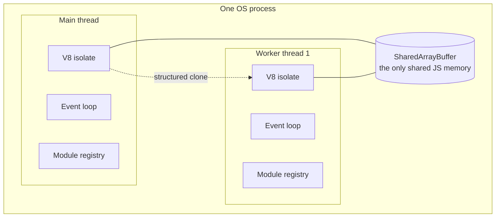

# Chapter 29 — Worker Threads

## What you will learn

- What a worker thread actually is, and why "shared memory" is far narrower than it sounds.
- Every `Worker` constructor option, including the two whose meaning is the opposite of what the name suggests.
- The structured clone algorithm: what survives `postMessage`, what throws, and what silently changes shape.
- The difference between copying and transferring, and when `SharedArrayBuffer` plus `Atomics` is the right answer.
- How to build a worker pool with a task queue that reuses threads instead of spawning one per job.
- How to measure whether a worker is earning its keep, rather than assuming it is.

## Why this matters

Node runs your JavaScript on one thread. That is fine while everything is I/O: a thousand concurrent requests are a thousand mostly-idle sockets, and the event loop handles them beautifully. It stops being fine the moment a request needs 200 ms of pure computation — resizing an image, parsing a 40 MB CSV, verifying a signature, rendering a PDF. During those 200 ms nothing else happens. Not another request, not a timer, not a health check. Your p99 latency becomes the sum of everyone's CPU work.

`node:worker_threads` is **Stable** and is the answer to exactly that problem. It gives you additional JavaScript threads inside the same process, each with its own event loop, so CPU work happens off the critical path. What it is not is a general-purpose concurrency toy. Messages are copied, not shared. Starting a worker costs real time and real memory. Sending a 50 MB object to a worker and back can easily cost more than doing the work inline. The whole craft here is knowing which side of that line you are on — and the module gives you the tools (transfer lists, `SharedArrayBuffer`, pools) to move the line in your favour.

## What a worker actually is

A `Worker` is a new operating-system thread running a **separate V8 isolate** with its own event loop, its own heap, and its own module registry. It lives inside your process, so it shares the process's address space, file descriptors, and PID — but at the JavaScript level it shares nothing.



The practical consequences:

- **No shared objects.** You cannot pass a function, a class instance with methods, a database connection, or a closure. Everything crossing the boundary is serialised.
- **Separate module registry.** Each worker loads and evaluates its own copy of every module it imports, including your dependency tree. Module-level state — a cache, a counter, a connection pool — exists once per thread.
- **Its own memory.** Each worker adds its own V8 heap on top of the shared process heap. Ten workers is ten heaps.
- **Signals do not arrive.** `process.on('SIGTERM')` inside a worker never fires; signals go to the main thread only.
- **`process.exit()` ends the thread, not the program.** `process.abort()` and `process.chdir()` are unavailable, and `process.title` cannot be changed.
- **`process.env` is a copy** unless you opt into `SHARE_ENV`. Changes in one thread are invisible to the others, and (on Windows) the worker's copy behaves case-sensitively, unlike the main thread's.

Workers help with CPU-bound JavaScript. They do **not** help with I/O — Node's asynchronous I/O is already off-thread and more efficient than anything a worker adds.

## Creating a worker

```mjs
// main.mjs
import { Worker } from 'node:worker_threads';

const worker = new Worker(new URL('./hash-worker.mjs', import.meta.url), {
  workerData: { rounds: 100_000 },
  name: 'hasher',
});

worker.on('online', () => console.log('thread', worker.threadId, 'started'));
worker.on('message', (m) => console.log('digest:', m));
worker.on('error', (err) => console.error('worker crashed:', err));
worker.on('exit', (code) => console.log('exited with', code));

worker.postMessage({ data: 'hello' });
```

```mjs
// hash-worker.mjs
import { parentPort, workerData, threadId } from 'node:worker_threads';
import { pbkdf2Sync } from 'node:crypto';

parentPort.on('message', ({ data }) => {
  const key = pbkdf2Sync(data, 'salt', workerData.rounds, 32, 'sha512');
  parentPort.postMessage({ threadId, digest: key.toString('hex') });
});
```

The first argument is an absolute path, a relative path starting with `./` or `../`, a `file:` URL, or a `data:` URL (interpreted by the ESM loader). With `eval: true` it is a string of source code instead.

### Constructor options

| Option | Type | Default | What it does |
|---|---|---|---|
| `workerData` | any | — | Cloned once at startup, readable as `workerData` in the worker. |
| `argv` | any[] | — | Stringified and appended to the worker's `process.argv`. |
| `env` | Object \| `SHARE_ENV` | `process.env` | Sets the worker's `process.env`. `SHARE_ENV` gives both threads read/write access to the same set. |
| `eval` | boolean | `false` | Treat the first argument as source code. |
| `execArgv` | string[] | inherited | Node CLI options for the worker. **V8 options such as `--max-old-space-size` and process-wide options such as `--title` are not supported here.** |
| `stdin` | boolean | `false` | `true` makes `worker.stdin` a writable stream feeding the worker's `process.stdin`. |
| `stdout` | boolean | `false` | `true` means the worker's stdout is **not** auto-piped to the parent's — you must read `worker.stdout`. |
| `stderr` | boolean | `false` | Same inversion for stderr. |
| `resourceLimits` | Object | — | Per-worker V8 limits; see below. |
| `transferList` | Object[] | — | Required if `workerData` contains `MessagePort`-like objects, else `ERR_MISSING_MESSAGE_PORT_IN_TRANSFER_LIST`. |
| `trackUnmanagedFds` | boolean | `true` | Close raw fds opened via `fs.open()` when the worker exits. Inherited by nested workers. |
| `name` | string | `'WorkerThread'` | Appears in the thread title as `[worker ${id}] ${name}`. Truncated to the OS limit — 16 characters on Linux, 64 on macOS. |

`stdout: true` and `stderr: true` are the two options people misread. They do not "enable" the streams; the streams always exist. They *disable the automatic forwarding* to the parent's stdio, handing you responsibility for draining them.

`resourceLimits` bounds the worker's JS engine, and only the JS engine — external data including `ArrayBuffer`s is not counted:

| Field | Meaning |
|---|---|
| `maxOldGenerationSizeMb` | Maximum main heap. Overridden by `--max-old-space-size` if that flag is set. |
| `maxYoungGenerationSizeMb` | Heap space for newly created objects. Overridden by `--max-semi-space-size`. |
| `codeRangeSizeMb` | Pre-allocated range for generated code. |
| `stackSizeMb` | Thread stack. **Default:** `4`. Small values produce unusable workers. |

Exceeding a limit terminates that worker with `ERR_WORKER_OUT_OF_MEMORY`, delivered to the parent's `'error'` handler. This is the one genuinely useful isolation property of workers: you can run a memory-hungry task in a 256 MB worker and survive its failure, where the same code inline would take down the process. The process can still be killed by a global out-of-memory condition regardless.

Read your effective limits from inside a worker with `worker_threads.resourceLimits` (an empty object on the main thread).

## Talking to a worker

`worker.postMessage(value)` in the parent lands on `parentPort.on('message')` in the worker; `parentPort.postMessage(value)` lands on `worker.on('message')` in the parent. `MessagePort` extends `EventEmitter`, so `once`, `off`, and `node:events` helpers all work.

Values are copied using the **HTML structured clone algorithm**, the same mechanism as browser workers and `node:v8`'s serialization API.

### What can and cannot cross

| Category | Result |
|---|---|
| Primitives, plain objects, arrays | Copied faithfully |
| Circular references | Preserved (unlike JSON) |
| `Map`, `Set`, `Date`, `RegExp`, `BigInt`, `Error` | Preserved |
| `ArrayBuffer`, `TypedArray`, `DataView` | Copied — or transferred if listed in `transferList` |
| `SharedArrayBuffer` | Shared. Must **not** appear in `transferList` |
| `WebAssembly.Module` | Preserved |
| Functions, symbols as values | **Throws `DataCloneError`** |
| `URL` | **Throws `DataCloneError`** |
| Class instances | Cloned as plain objects — prototype, methods, getters, and `#private` fields are gone |
| `Buffer` | Arrives as a plain `Uint8Array` |
| Non-enumerable props, accessors | Dropped |

Native (C++-backed) objects generally cannot be cloned. The documented exceptions are `CryptoKey`, `FileHandle`, `Histogram`, `KeyObject`, `MessagePort`, `net.BlockList`, `net.SocketAddress`, `X509Certificate`, plus `net.Server` and `net.Socket` when listed in `transferList`.

That last pair is worth knowing about: transferring a `net.Server` moves its listening socket and its pending accept queue into the receiving thread's event loop; transferring a `net.Socket` moves one connection, and only if it is a freshly accepted or created TCP connection with no buffered data that has not started reading — otherwise `postMessage()` throws `ERR_WORKER_HANDLE_NOT_TRANSFERABLE`. That is enough to accept on one thread and serve on a pool.

The class-instance rule catches everyone at least once:

```js
class Point {
  constructor(x, y) { this.x = x; this.y = y; }
  get length() { return Math.hypot(this.x, this.y); }
}

parentPort.postMessage(new Point(3, 4));
// Received as { x: 3, y: 4 } — a plain object. `length` and `instanceof` are gone.
```

Send data, not objects. Reconstruct behaviour on the receiving side.

### Copying versus transferring

```js
const big = new Uint8Array(64 * 1024 * 1024);

port.postMessage(big);                 // copies 64 MB
port.postMessage(big, [big.buffer]);   // moves ownership; near-zero cost
```

After a transfer, the sender's view is detached — `big.length` becomes `0`. Every other view over the same `ArrayBuffer` is detached too:

```js
const ab = new ArrayBuffer(10);
const u1 = new Uint8Array(ab);
const u2 = new Uint16Array(ab);   // u2.length === 5

port.postMessage(u1, [u1.buffer]);
console.log(u2.length);           // 0
```

`Buffer` needs special care. Buffers created with `Buffer.from()` or `Buffer.allocUnsafe()` come from Node's shared internal pool and do **not** own their `ArrayBuffer`; transferring them is not possible, so they are always cloned — and cloning copies **the entire pool**, which is both wasteful and a potential information leak. Buffers from `Buffer.alloc()` or `Buffer.allocUnsafeSlow()` own their memory and can be transferred safely. If you plan to transfer, allocate accordingly.

`transferList` accepts `ArrayBuffer`, `MessagePort`, `FileHandle`, `net.Server`, and `net.Socket`.

### Marking objects

- `markAsUntransferable(object)` — if the object appears in a transfer list, `postMessage()` throws; posted normally, it is cloned as usual. `ArrayBuffer.prototype.transfer()` is also disallowed on such buffers. Node marks its own `Buffer` pool this way. Irreversible. Check with `isMarkedAsUntransferable(object)` (v21.0.0).
- `markAsUncloneable(object)` (v23.0.0 / v22.10.0) — the object throws `DataCloneError` if posted at all. Useful for objects holding thread-local resources you never want copied. No effect on `ArrayBuffer` or `Buffer`-like objects. Irreversible.

Both are Node-specific; browsers have no equivalent.

### Channels between arbitrary threads

The parent–worker channel is one option, not the only one. `MessageChannel` creates a fresh pair of connected ports, and ports are themselves transferable — so you can hand one end to a worker and keep the other, or hand each end to two different workers so they talk directly without routing through the parent.

```mjs
import { Worker, MessageChannel } from 'node:worker_threads';

const a = new Worker(new URL('./stage-a.mjs', import.meta.url));
const b = new Worker(new URL('./stage-b.mjs', import.meta.url));

const { port1, port2 } = new MessageChannel();
a.postMessage({ peer: port1 }, [port1]);
b.postMessage({ peer: port2 }, [port2]);
// a and b now communicate directly; the main thread is not in the path.
```

Inside each worker, `msg.peer.on('message', ...)` and `msg.peer.postMessage(...)`. Call `port.close()` when finished; an open port keeps the event loop alive unless you `port.unref()` it. Dedicated channels are also better design than piling every protocol onto the global one.

Two related helpers:

- **`receiveMessageOnPort(port)`** synchronously pulls the oldest queued message, returning `{ message }` or `undefined`. No `'message'` event is emitted for it. This is how you drain a port from synchronous code — the building block for a synchronous request/response over `Atomics.wait`.
- **`postMessageToThread(threadId, value[, transferList][, timeout])`** **[Experimental]** (Stability 1.1, v22.5.0 / v20.19.0) sends to any thread by id, returning a promise. The target must listen for the `workerMessage` event, or you get `ERR_WORKER_MESSAGING_FAILED`. Use it only when the threads are not in a parent–child relationship; otherwise stick to ports.

### Environment data

`setEnvironmentData(key, value)` stores a cloneable value that every **subsequently created** worker receives automatically, readable with `getEnvironmentData(key)`. Both are stable (no longer experimental since v17.5.0 / v16.15.0). Passing `undefined` as the value deletes the key.

```mjs
import { setEnvironmentData, getEnvironmentData, Worker, isMainThread } from 'node:worker_threads';

if (isMainThread) {
  setEnvironmentData('config', { region: 'eu-west-1', logLevel: 'warn' });
  new Worker(new URL(import.meta.url));
} else {
  console.log(getEnvironmentData('config').region); // 'eu-west-1'
}
```

Use it for process-wide configuration that every worker needs. Use `workerData` for per-worker input. Existing workers do not see later changes.

## SharedArrayBuffer and Atomics

`SharedArrayBuffer` is the only genuinely shared JavaScript memory. Post one and both threads see the same bytes — no copy, no transfer, no detaching. It must never appear in `transferList`.

Plain reads and writes to a shared buffer are racy. `Atomics` provides the operations that make them safe: `Atomics.load`, `store`, `add`, `sub`, `and`, `or`, `xor`, `exchange`, `compareExchange`, plus the blocking primitives `Atomics.wait` and `Atomics.notify`.

```mjs
// Shared progress counter, updated by workers, polled by the main thread.
const counter = new Int32Array(new SharedArrayBuffer(4));

// In each worker, after finishing an item:
Atomics.add(counter, 0, 1);

// In the main thread:
setInterval(() => console.log('done:', Atomics.load(counter, 0)), 1000);
```

`Atomics.wait(typedArray, index, expectedValue, timeout)` blocks the calling thread until another thread calls `Atomics.notify` on the same slot, or the timeout expires. It returns `'ok'`, `'not-equal'`, or `'timed-out'`. This is real synchronisation — a condition variable — and it is the only way to make a worker *sleep* without burning CPU while waiting for a signal.

**Never call `Atomics.wait()` on the main thread.** Browsers forbid it outright there; Node permits it, which makes it a trap rather than a guardrail. Blocking the main thread freezes the event loop completely: no timers, no I/O, no incoming requests, and — because worker stdio is delivered by message passing — not even the worker's `console.log` output, which queues up behind your blocked loop. If you need the main thread to wait for a worker, `await` a promise resolved by a `'message'` event. `Atomics.wait` belongs inside workers, blocking on work the main thread will supply.

The legitimate main use is turning an asynchronous service into a synchronous call *inside a worker* — the worker posts a request, then `Atomics.wait`s on a shared flag while the main thread does the async work and `Atomics.notify`s. `receiveMessageOnPort` then collects the reply synchronously. That pattern powers synchronous module hooks and similar plumbing.

### BroadcastChannel

`BroadcastChannel` (Stable since v18.0.0) is one-to-many messaging across every thread in the process that has opened a channel with the same name. It is an `EventTarget`, so you use `onmessage`/`addEventListener` with a `MessageEvent` and read `event.data`.

```mjs
import { BroadcastChannel } from 'node:worker_threads';

const bus = new BroadcastChannel('cache-invalidation');
bus.onmessage = (event) => localCache.delete(event.data.key);
bus.postMessage({ key: 'user:42' });
```

Senders do not receive their own messages. Call `close()` when done; use `unref()` if an open channel should not keep the thread alive. It is the right tool for fan-out notifications — configuration reloads, cache invalidation — and the wrong tool for request/response, which needs a port.

## Lifecycle

| Event | When | Notes |
|---|---|---|
| `'online'` | The worker has begun executing JavaScript | Startup is not free — expect single-digit to low-tens of milliseconds |
| `'message'` | `parentPort.postMessage()` was called | All messages are emitted before `'exit'` |
| `'messageerror'` | A message failed to deserialise | Rare, but it means data loss — log it |
| `'error'` | An uncaught exception in the worker | The worker is terminated as a result |
| `'exit'` | The worker stopped | `exitCode` is the `process.exit()` code, or `1` if terminated. **The final event.** |

`worker.terminate()` stops all JavaScript in the thread as soon as possible and returns a promise for the exit code, resolved when `'exit'` fires. Termination is asynchronous and abrupt — no `finally` blocks, no flushing. Give a worker a chance to stop cleanly (a `{ type: 'shutdown' }` message) before terminating it.

`worker.unref()` lets the process exit even if the worker is still alive; `worker.ref()` undoes that. And `await using worker = new Worker(...)` works via `worker[Symbol.asyncDispose]()` (v24.2.0 / v22.18.0), which calls `terminate()` when the scope exits.

For observability, a `Worker` object exposes `worker.threadId`, `worker.threadName` (v24.6.0 / v22.20.0), `worker.resourceLimits`, `worker.cpuUsage()`, `worker.getHeapStatistics()`, `worker.getHeapSnapshot()`, and `worker.performance.eventLoopUtilization()` — the last one being the most useful single number for deciding whether a pool is saturated or idle.

## Building a worker pool

Spawning a worker per task is the mistake the official docs warn about directly: the overhead usually exceeds the benefit. Each spawn pays thread creation, a new V8 isolate, and a fresh module graph evaluation. Create workers once; feed them tasks.

```mjs
// pool.mjs
import { Worker } from 'node:worker_threads';
import { availableParallelism } from 'node:os';
import { EventEmitter } from 'node:events';

export class WorkerPool extends EventEmitter {
  #idle = [];
  #queue = [];
  #all = new Set();
  #inflight = new Map();   // Worker -> { resolve, reject }
  #nextId = 0;
  #closed = false;

  constructor(script, { size = availableParallelism(), workerData } = {}) {
    super();
    this.script = script;
    this.workerData = workerData;
    for (let i = 0; i < size; i++) this.#spawn();
  }

  #spawn() {
    const worker = new Worker(this.script, { workerData: this.workerData, name: 'pool' });

    worker.on('message', (msg) => {
      const pending = this.#inflight.get(worker);
      if (!pending) return;
      this.#inflight.delete(worker);
      if (msg.error) pending.reject(Object.assign(new Error(msg.error.message), msg.error));
      else pending.resolve(msg.result);
      this.#release(worker);
    });

    worker.on('error', (err) => {
      // A crashed worker cannot be reused. Fail its task and replace it.
      this.#inflight.get(worker)?.reject(err);
      this.#inflight.delete(worker);
      this.#all.delete(worker);
      this.#idle = this.#idle.filter((w) => w !== worker);
      if (!this.#closed) this.#spawn();
    });

    this.#all.add(worker);
    this.#release(worker);
  }

  #release(worker) {
    const next = this.#queue.shift();
    if (next) {
      this.#dispatch(worker, next);
    } else {
      worker.unref();          // idle workers must not hold the process open
      this.#idle.push(worker);
    }
  }

  #dispatch(worker, task) {
    this.#inflight.set(worker, task);
    worker.ref();
    worker.postMessage({ id: task.id, payload: task.payload }, task.transferList);
  }

  run(payload, transferList) {
    if (this.#closed) return Promise.reject(new Error('pool is closed'));
    return new Promise((resolve, reject) => {
      const task = { id: this.#nextId++, payload, transferList, resolve, reject };
      const worker = this.#idle.pop();
      if (worker) this.#dispatch(worker, task);
      else this.#queue.push(task);
    });
  }

  get pending() { return this.#queue.length; }

  async close() {
    this.#closed = true;
    for (const task of this.#queue.splice(0)) task.reject(new Error('pool closed'));
    await Promise.all([...this.#all].map((w) => w.terminate()));
  }
}
```

```mjs
// pool-worker.mjs — the task side
import { parentPort } from 'node:worker_threads';

parentPort.on('message', async ({ payload }) => {
  try {
    const result = await handle(payload);
    parentPort.postMessage({ result });
  } catch (err) {
    parentPort.postMessage({ error: { message: err.message, code: err.code } });
  }
});

async function handle({ text }) {
  // Replace with real CPU-bound work.
  let hash = 0;
  for (let i = 0; i < text.length; i++) hash = (hash * 31 + text.charCodeAt(i)) | 0;
  return hash;
}
```

Points worth noticing in that code:

- **Errors are data.** The worker catches its own exceptions and posts a plain object. A thrown error inside the worker fires `'error'` on the parent and kills the thread — recoverable, but expensive. Reserve that path for genuine crashes.
- **A crashed worker is replaced,** and its in-flight task is rejected rather than left hanging forever.
- **`unref()` by default, `ref()` while busy.** An idle pool does not keep the process alive; a working pool does.
- **The queue is unbounded here.** In production, cap it and reject when full — an unbounded queue converts a CPU shortage into a memory leak.

For diagnostics tooling to correlate a task with its result across the thread boundary, wrap task callbacks in an `AsyncResource`; the `async_hooks` documentation has a worked pool example. See [Chapter 15 — AsyncLocalStorage and Context Propagation](../part2-async/15-async-context.md).

Sizing: start at `os.availableParallelism()` for pure CPU work. More threads than cores adds context switching without throughput. In a container, `availableParallelism()` may report the host's core count rather than your CPU quota — pin the pool size from configuration when you run under limits.

## Is the worker actually worth it?

Offloading has a fixed cost: serialise the input, hand it across, deserialise, compute, serialise the output, hand it back. If the compute is smaller than the messaging, you have made things slower and more complicated.

A usable rule: a worker pays off when the task takes **more than ~1 ms of CPU** and the payload is **small relative to the work**. Measure both halves.

```mjs
import { performance } from 'node:perf_hooks';

const t0 = performance.now();
const result = await pool.run({ text: input });
const offloaded = performance.now() - t0;

const t1 = performance.now();
const inline = computeInline(input);
const direct = performance.now() - t1;

console.log({ offloaded, direct, ratio: offloaded / direct });
```

Run that across your real payload-size distribution, not one sample. Typical findings:

- **Parsing a 20 KB JSON document:** cloning dominates. Keep it inline.
- **Resizing a 4 MB image:** transfer the `ArrayBuffer` in both directions and the copy cost is nil while the compute is tens of milliseconds. Big win.
- **Hashing a password with a deliberately slow KDF:** tiny payload, ~100 ms compute. Enormous win.
- **Streaming a 2 GB file through a transform:** neither. Use a stream, or a child process.

Two other measurements matter operationally: `worker.performance.eventLoopUtilization()` tells you whether pool threads are saturated, and comparing main-thread ELU before and after tells you whether you actually relieved the event loop or just moved the bottleneck.

## Worker vs cluster vs child process

| | `worker_threads` | `cluster` | `child_process` |
|---|---|---|---|
| Unit | Thread in this process | Node process | Any process |
| Isolation | V8 isolate; a crash can still take the process down via native code | Full process isolation | Full process isolation |
| Startup cost | Milliseconds | Tens of ms + full Node boot | Tens of ms (Node) or program-dependent |
| Memory per unit | One extra V8 heap | Full Node runtime | Full runtime |
| Shared memory | Yes, via `SharedArrayBuffer` | No | No |
| Message cost | Structured clone; transfer/share possible | Serialised IPC | Serialised IPC |
| Shares listening socket | Via transferring `net.Server`/`net.Socket` | Yes, built in | Manually, via `send(msg, handle)` |
| Can run non-JS | No | No | Yes |
| Per-unit memory cap | Yes, `resourceLimits` | Via `--max-old-space-size` per process | Via flags/OS limits |
| Best for | CPU-bound JavaScript | Scaling an HTTP server across cores | External tools, isolation, privilege separation |

Rule of thumb: CPU-bound JavaScript inside one service → worker threads. Serving more HTTP throughput on a multi-core box → cluster or container replicas. Running something that is not your JavaScript → child process.

## Common mistakes

### ❌ Creating a worker per task

```mjs
async function hash(pw) {
  const w = new Worker('./hash-worker.mjs', { workerData: pw });
  return once(w, 'message');
}
```

Every call pays thread creation plus a full module-graph evaluation — often more than the work itself. Under load you also end up with unbounded threads.

✅ Reuse a fixed pool:

```mjs
const pool = new WorkerPool(new URL('./pool-worker.mjs', import.meta.url));
const digest = await pool.run({ text: pw });
```

### ❌ Expecting objects to survive the boundary

```mjs
parentPort.postMessage({ when: new Date(), url: new URL('https://a.example'), fn: () => 1 });
// Throws DataCloneError — URL and functions are not cloneable.
```

✅ Post plain data and rebuild on the far side:

```mjs
parentPort.postMessage({ when: new Date(), url: 'https://a.example' }); // Date is fine
```

### ❌ Using a `Buffer` after transferring its `ArrayBuffer`

```mjs
const buf = Buffer.alloc(1024);
port.postMessage(buf, [buf.buffer]);
buf[0] = 1; // buf is detached; length is 0
```

✅ Treat transfer as a move. Give up the reference, and remember pooled buffers (`Buffer.from`, `Buffer.allocUnsafe`) cannot be transferred at all — use `Buffer.alloc()` or `Buffer.allocUnsafeSlow()` when you intend to transfer.

### ❌ Blocking the main thread with `Atomics.wait()`

```mjs
Atomics.wait(sharedFlag, 0, 0);   // in the main thread
```

The event loop stops entirely: no timers, no sockets, and no worker stdout, since that is delivered by message passing.

✅ Wait asynchronously in the main thread and keep `Atomics.wait` inside workers:

```mjs
const result = await new Promise((res) => worker.once('message', res));
```

### ❌ Launching workers unconditionally from a preload script

```mjs
// preload.mjs, run with -r
new Worker('./job.mjs');
```

Workers inherit the parent's CLI flags unless `execArgv` is set, so each worker runs the same preload script, which spawns another worker, until the process dies.

✅ Guard on `isMainThread`, or set `execArgv: []`:

```mjs
import { isMainThread, Worker } from 'node:worker_threads';
if (isMainThread) new Worker('./job.mjs', { execArgv: [] });
```

## Production notes

- **Budget memory per thread, not per process.** Each worker carries its own V8 heap plus its own copy of every loaded module. A pool of eight on a service with a large dependency tree can add hundreds of megabytes of RSS. Set `resourceLimits` so a runaway worker fails with `ERR_WORKER_OUT_OF_MEMORY` instead of triggering an OOM kill of the whole container.
- **Bound the task queue.** An unbounded queue in front of a saturated pool turns a CPU shortage into unbounded memory growth and then into timeouts on requests whose clients gave up minutes ago. Reject with a 503 past a threshold, and prefer newest-first shedding for latency-sensitive work.
- **Handle `'error'` on every worker.** An uncaught exception inside a worker terminates that thread and surfaces as `'error'` in the parent. If you do not listen, you lose the task and the diagnosis. Always replace the dead worker.
- **Terminate is violent.** `terminate()` stops execution wherever it is, skipping `finally` blocks and buffered writes. Send a shutdown message, wait briefly, then terminate as the fallback.
- **Do not use workers for I/O.** Node's async I/O already runs off the JS thread. Wrapping `fs.readFile` in a worker adds latency and memory for no gain. The exception is work that is CPU-bound *around* I/O — decompressing and parsing, not the read itself.
- **Track event loop utilisation on both sides.** `worker.performance.eventLoopUtilization()` on pool members plus the main thread's own ELU tells you whether you are pool-starved, main-thread-starved, or fine. It is a better signal than CPU percentage.
- **`--permission` blocks worker creation.** Under the Permission Model, `new Worker()` throws `ERR_ACCESS_DENIED` without `--allow-worker`, and the model does not inherit into worker threads. See [Chapter 31 — The Permission Model](../part4-system/31-permission-model.md).
- **Native addons need to opt in.** An addon can only be loaded on multiple threads if it is built as context-aware. Loading an old single-context addon in a worker can corrupt state or crash the whole process.

## Exercises

1. **Map the clone boundary.** Post a `Date`, a `Map`, a `RegExp`, a `BigInt`, a class instance with a getter, a `Buffer`, a `URL`, and a function through a `MessageChannel`. *Success:* a table of what arrived, what changed shape, and what threw — with the error name for each failure.

2. **Measure the offload threshold.** Time a pure-CPU function inline and through a one-worker pool for payloads from 1 KB to 50 MB, with and without transferring the `ArrayBuffer`. *Success:* a chart, plus the payload size at which offloading starts to win in each mode.

3. **Complete the pool.** Extend `WorkerPool` with a maximum queue depth, per-task timeouts that terminate and replace the worker, and a `stats()` method returning busy/idle/queued counts. *Success:* under a load that exceeds capacity, excess tasks reject promptly and memory stays flat.

4. **Build a shared progress bar.** Have four workers process a shared job list, coordinating through a `SharedArrayBuffer` with `Atomics.add` for the counter and `Atomics.compareExchange` to claim items. *Success:* no item is processed twice, the total is exact, and the main thread never blocks.

5. **Synchronous call from a worker.** Using `Atomics.wait` in the worker, `Atomics.notify` in the main thread, and `receiveMessageOnPort` to collect the reply, implement a `syncFetchConfig()` that a worker can call as if it were synchronous. *Success:* it returns a value inline in worker code, and the main thread stays responsive throughout.

## Recap

- A worker is a separate V8 isolate and event loop in the same process: no shared JS objects, a private module registry, and its own heap.
- `workerData` seeds a worker once; `setEnvironmentData()` seeds every worker created afterwards.
- `stdout: true` and `stderr: true` *disable* automatic forwarding to the parent's stdio — they do not enable the streams.
- `postMessage` uses structured clone: circular references, `Map`, `Set`, `Date`, and `BigInt` survive; functions and `URL` throw; class instances arrive as plain objects and `Buffer` arrives as `Uint8Array`.
- Transferring an `ArrayBuffer` moves it at near-zero cost and detaches every view on the sender's side. Pooled buffers cannot be transferred and clone the whole pool.
- `SharedArrayBuffer` plus `Atomics` is the only real shared memory. `Atomics.wait` belongs in workers, never on the main thread.
- `MessageChannel` ports let workers talk directly; `BroadcastChannel` is fan-out only; `receiveMessageOnPort` drains a port synchronously.
- Lifecycle is `'online'` → `'message'`* → `'error'`? → `'exit'`. `terminate()` returns a promise and is abrupt.
- `resourceLimits` caps a worker's JS heap and surfaces breaches as `ERR_WORKER_OUT_OF_MEMORY` rather than an OOM kill.
- Reuse workers through a pool with a bounded queue. Spawning per task usually costs more than the work saved.
- Workers are for CPU-bound JavaScript. Use cluster for socket-sharing scale-out and child processes for anything that is not your JavaScript.

## Where to go next

- [Chapter 28 — Child Processes](../part4-system/28-child-processes.md) for the process-based alternative and IPC comparison.
- [Chapter 30 — Cluster and Multi-Process Scaling](../part4-system/30-cluster.md) for using every core to serve HTTP.
- [Chapter 16 — Buffers and Typed Arrays](../part3-data/16-buffers.md) for `ArrayBuffer` ownership and the `Buffer` pool.
- [Chapter 49 — Measuring Performance with `perf_hooks`](../part7-diagnostics/49-perf-hooks.md) for event loop utilisation and timing methodology.
- [Chapter 15 — AsyncLocalStorage and Context Propagation](../part2-async/15-async-context.md) for `AsyncResource` in pools.
- [Chapter 61 — Performance Tuning](../part9-production/61-performance-tuning.md) for deciding what to offload in the first place.
- Official documentation: <https://nodejs.org/docs/latest/api/worker_threads.html>
