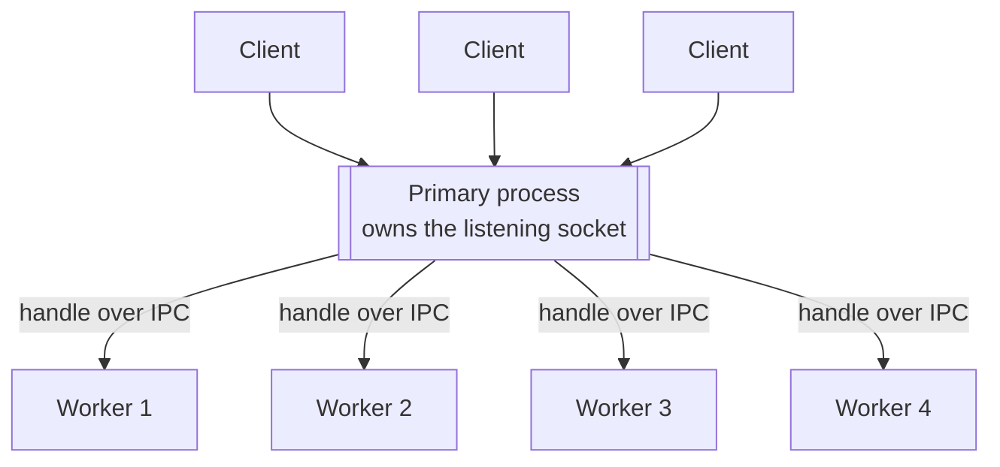

# Chapter 30 — Cluster and Multi-Process Scaling

## What you will learn

- How several processes end up listening on one port, and who actually owns the socket.
- The two scheduling policies, what each does to your latency distribution, and how to change them.
- Every event in the primary/worker lifecycle, and which one tells you what.
- How to write a supervisor that restarts crashed workers without crash-looping, and reloads code with zero downtime.
- Which parts of your application break the moment there is more than one process, and the standard fixes.
- When to use cluster, when to use an external process manager, and when to run one process per container.

## Why this matters

Your server has sixteen cores. Node uses one of them for JavaScript. Everything else — the fifteen idle cores you are paying for — sits there while a single event loop grinds through JSON serialisation and template rendering. Vertical scaling stopped working the moment CPUs went wide instead of fast.

`node:cluster` is **Stable** and solves exactly this: it forks copies of your process and lets them all serve the same port, so a sixteen-core box does roughly sixteen times the request throughput of a single process. The catch is that "roughly" hides a lot. Every in-memory thing your application relies on — a session store, an LRU cache, a rate limiter counter, a WebSocket registry — silently becomes N inconsistent copies. A worker that crashes at startup and gets restarted immediately becomes a crash loop that pegs the CPU. And in a Kubernetes deployment, cluster may be exactly the wrong tool because the orchestrator already gives you replicas. This chapter covers the mechanism, a supervisor you can actually ship, and an honest account of when not to use it.

## How port sharing actually works

Workers are created with `child_process.fork()`, so each one is a full Node process with an IPC channel back to the primary. When a worker calls `server.listen(8000)`, it does not bind the port itself. It sends a message to the primary, and the primary does the binding.



Because `server.listen()` delegates to the primary, three cases behave differently inside a worker than in a standalone process:

1. **`server.listen({ fd: 7 })`** listens on file descriptor 7 **in the primary**, not on whatever fd 7 means in the worker.
2. **`server.listen(handle)`** with an explicit handle bypasses the primary entirely — the worker uses the handle you gave it.
3. **`server.listen(0)`** does not give each worker a different random port. The port is random the first time and then identical for every worker. If you want distinct ports, derive them from `cluster.worker.id`.

Node provides no routing logic beyond connection distribution. Anything smarter — sticky sessions, per-tenant affinity — is your job.

## The two scheduling policies

| Policy | Constant | Who accepts | Behaviour |
|---|---|---|---|
| Round-robin | `cluster.SCHED_RR` | The primary accepts, then hands each connection to a worker | Even distribution with built-in smarts to avoid overloading a worker. **Default everywhere except Windows.** |
| OS-driven | `cluster.SCHED_NONE` | The primary creates the listening socket and shares it; workers accept directly | The kernel decides. Lower overhead in theory; badly unbalanced in practice. |

The docs are blunt about `SCHED_NONE`: distribution "tends to be very unbalanced due to operating system scheduler vagaries", with observed loads where **over 70% of all connections landed in two processes out of eight**. That is a latency disaster — two hot workers queueing while six idle — even though total CPU looks fine. `SCHED_RR` costs one extra hop through the primary and is worth it.

Windows defaults to `SCHED_NONE` and will move to `SCHED_RR` once libuv can distribute IOCP handles without a large performance hit. That means a cluster tuned on Linux behaves differently on a Windows developer machine, and unevenness there is expected rather than a bug in your code.

Set the policy before forking:

```mjs
import cluster from 'node:cluster';

cluster.schedulingPolicy = cluster.SCHED_RR;   // or cluster.SCHED_NONE
```

Or from the environment, which is easier to change per deployment:

```bash
NODE_CLUSTER_SCHED_POLICY=rr node server.js
NODE_CLUSTER_SCHED_POLICY=none node server.js
```

The setting is global and **effectively frozen once the first worker is spawned or `setupPrimary()` is called, whichever comes first**. Assign it at the very top of your entry point.

## Primary and worker

One script runs in both roles and branches on `cluster.isPrimary`. That flag is derived from `process.env.NODE_UNIQUE_ID`: if it is undefined you are the primary. `cluster.isWorker` is its negation. **[Deprecated]** `cluster.isMaster` and `cluster.setupMaster()` are deprecated aliases (since v16.0.0) for `isPrimary` and `setupPrimary()` — do not use them in new code.

```mjs
import cluster from 'node:cluster';
import http from 'node:http';
import process from 'node:process';
import { availableParallelism } from 'node:os';

if (cluster.isPrimary) {
  for (let i = 0; i < availableParallelism(); i++) cluster.fork();
  cluster.on('exit', (worker, code, signal) => {
    console.log(`worker ${worker.process.pid} died (${signal ?? code})`);
  });
} else {
  http.createServer((req, res) => {
    res.writeHead(200, { 'content-type': 'text/plain' });
    res.end(`served by ${process.pid}\n`);
  }).listen(8000);
}
```

`os.availableParallelism()` (v19.4.0 / v18.14.0) is the right sizing input — it estimates the parallelism the program should use, which is not always the same as `os.cpus().length`.

### The Worker object

`cluster.fork([env])` returns a `cluster.Worker`, and `cluster.workers` is a live map of id to worker in the primary.

| Member | Meaning |
|---|---|
| `worker.id` | Unique integer; the key in `cluster.workers` while alive |
| `worker.process` | The underlying `ChildProcess` from `fork()` |
| `worker.send(msg[, handle[, options]][, cb])` | Identical to `ChildProcess.send()` |
| `worker.isConnected()` | IPC channel still open |
| `worker.isDead()` | Process has terminated |
| `worker.exitedAfterDisconnect` | `true` if it exited via `.disconnect()`, `false` otherwise, `undefined` while running |
| `worker.disconnect()` | Close servers, wait for their `'close'`, then close IPC — the graceful path |
| `worker.kill([signal])` | **Default:** `'SIGTERM'`. Does not wait for a graceful disconnect. Aliased as `destroy()` |

`exitedAfterDisconnect` is the single most useful property in the whole module: it is how a supervisor distinguishes "I asked this worker to stop" from "this worker crashed", and therefore whether to replace it.

Inside a worker, `cluster.worker` is a reference to itself. Note that `process.disconnect()` and `process.kill()` in a worker are the *global process* functions, not `worker.disconnect()` and `worker.kill()`.

### Configuring how workers are forked

`cluster.setupPrimary([settings])` changes the defaults for future `fork()` calls; the result lands in `cluster.settings`.

| Setting | Default | Notes |
|---|---|---|
| `exec` | `process.argv[1]` | Worker script path |
| `args` | `process.argv.slice(2)` | Arguments to the worker |
| `execArgv` | `process.execArgv` | Node CLI options for the worker |
| `cwd` | inherits from parent | |
| `silent` | `false` | Pipe worker stdio instead of inheriting |
| `stdio` | — | **Must contain an `'ipc'` entry**; overrides `silent` |
| `serialization` | `'json'` behaviour | `'json'` or `'advanced'` |
| `uid` / `gid` | — | POSIX identity for workers |
| `inspectPort` | `process.debugPort` + offset | Number or a zero-argument function; each worker gets its own by default |
| `windowsHide` | `false` | |

Changes affect only future forks. The one thing you cannot set through `setupPrimary()` is the per-worker `env`, which is what `cluster.fork(env)` is for. Each call emits a `'setup'` event carrying an advisory snapshot of `cluster.settings` — read `cluster.settings` directly if you need accuracy.

> **Doc note:** the API reference lists `serialization` with **Default:** `false`, which is not one of its two valid values (`'json'` and `'advanced'`). The effective default is JSON serialization, matching `child_process.fork()`.

`inspectPort` deserves a mention: without it, attaching a debugger to a cluster means every worker fighting over port 9229. The default per-worker increment already fixes this; supply a function if you need a specific mapping.

## Events

Events fire on `cluster` in the primary with the worker as the first argument, and on individual `worker` objects without it. `'listening'` and `'online'` are not emitted inside the worker itself.

| Event | Fires when | Arguments |
|---|---|---|
| `'fork'` | The primary has forked a worker | `(worker)` |
| `'online'` | The worker process is running and has reported in | `(worker)` |
| `'listening'` | The worker's server emitted `'listening'` | `(worker, address)` |
| `'message'` | The primary received an IPC message | `(worker, message, handle)` |
| `'disconnect'` | The worker's IPC channel closed | `(worker)` |
| `'exit'` | The worker process ended | `(worker, code, signal)` |
| `'setup'` | `setupPrimary()` was called | `(settings)` |

`'fork'` → `'online'` → `'listening'` is the startup sequence, and the gaps between them are diagnostic. A worker that forks but never comes online is failing during module loading. One that comes online but never listens is failing during initialisation — a bad database URL, a missing environment variable. Arm a timer on `'fork'` and clear it on `'listening'` to catch both.

The `address` object passed to `'listening'` has `address`, `port`, and `addressType`, where `addressType` is `4` (TCPv4), `6` (TCPv6), `-1` (Unix domain socket), or `'udp4'` / `'udp6'`.

There can be a real delay between `'disconnect'` and `'exit'`. That gap is where a worker is finishing in-flight requests — or where it is stuck on a connection that will never close, which is precisely what you want to time out.

## A production-grade supervisor

The four-line "restart on exit" snippet in every blog post has a fatal flaw: if workers die instantly — a syntax error, a missing environment variable, a port already bound — you get an unbounded fork loop that saturates the CPU and floods the logs. A real supervisor needs backoff, a crash-loop circuit breaker, and bounded graceful shutdown.

```mjs
// primary.mjs
import cluster from 'node:cluster';
import process from 'node:process';
import { availableParallelism } from 'node:os';

const SIZE = Number(process.env.WEB_CONCURRENCY) || availableParallelism();
const SHUTDOWN_GRACE_MS = 15_000;
const HEALTHY_AFTER_MS = 30_000;   // uptime that resets a worker's backoff
const MAX_BACKOFF_MS = 30_000;

let consecutiveFailures = 0;
let shuttingDown = false;
const startedAt = new Map();       // worker.id -> timestamp

function spawn() {
  if (shuttingDown) return;
  const worker = cluster.fork();
  startedAt.set(worker.id, Date.now());
}

cluster.on('listening', (worker) => {
  console.log(`worker ${worker.process.pid} listening`);
});

cluster.on('exit', (worker, code, signal) => {
  const lived = Date.now() - (startedAt.get(worker.id) ?? Date.now());
  startedAt.delete(worker.id);

  if (shuttingDown) return;

  if (worker.exitedAfterDisconnect) {
    // We asked for this (reload). Replace immediately.
    spawn();
    return;
  }

  if (lived >= HEALTHY_AFTER_MS) consecutiveFailures = 0;
  else consecutiveFailures++;

  if (consecutiveFailures >= SIZE * 3) {
    console.error('crash loop detected; refusing to restart');
    process.exit(1);   // let the orchestrator decide what happens next
  }

  const backoff = Math.min(2 ** consecutiveFailures * 100, MAX_BACKOFF_MS);
  const jitter = Math.random() * backoff * 0.2;
  console.error(`worker died (${signal ?? code}) after ${lived}ms; restarting in ${Math.round(backoff)}ms`);
  setTimeout(spawn, backoff + jitter).unref();
});

// Graceful shutdown of the whole cluster.
for (const sig of ['SIGTERM', 'SIGINT']) {
  process.on(sig, () => {
    if (shuttingDown) return;
    shuttingDown = true;
    console.log('shutting down cluster');

    const deadline = setTimeout(() => {
      for (const w of Object.values(cluster.workers)) w.kill('SIGKILL');
    }, SHUTDOWN_GRACE_MS);
    deadline.unref();

    cluster.disconnect(() => {
      clearTimeout(deadline);
      process.exit(0);
    });
  });
}

for (let i = 0; i < SIZE; i++) spawn();
```

Three details that matter:

- **Exponential backoff with jitter.** Doubling from 100 ms up to 30 s, with jitter so restarts do not synchronise into thundering herds against your database.
- **A circuit breaker.** After `SIZE * 3` consecutive early failures, the primary exits non-zero instead of looping forever. Under systemd, Kubernetes, or Docker restart policies, exiting is the correct way to say "this deployment is broken" — a process stuck in an infinite fork loop just looks unhealthy without ever failing.
- **`cluster.disconnect(cb)`** disconnects every worker and closes internal handles; the callback fires when they are all done. The `SIGKILL` timer is the backstop for workers holding long-lived connections.

### Graceful shutdown inside the worker

The primary's `disconnect()` triggers the worker to disconnect itself, which closes its servers and waits for their `'close'`. But `disconnect()` only closes *server* connections — outbound client connections are not touched, and it does not wait for them. Long-lived server connections (keep-alive, WebSockets, SSE) will happily block the worker forever unless you intervene, which is why the docs recommend sending an application-level shutdown message.

```mjs
// worker.mjs
import cluster from 'node:cluster';
import http from 'node:http';
import process from 'node:process';

const server = http.createServer(handler);
server.listen(8000);

let draining = false;

process.on('message', (msg) => {
  if (msg !== 'shutdown' || draining) return;
  draining = true;
  server.close(() => process.exit(0));           // stop accepting; finish in-flight
  server.closeIdleConnections?.();               // release idle keep-alive sockets
  for (const ws of openWebSockets) ws.close(1001, 'server shutting down');
  setTimeout(() => process.exit(0), 10_000).unref();
});

// Health endpoints should report 'draining' once this flag is set,
// so the load balancer stops sending new connections.
```

One behaviour to be aware of: a worker calls `process.exit(0)` automatically if `'disconnect'` occurs on `process` and `exitedAfterDisconnect` is not `true`. That is a guard against accidental disconnection, and it means an unexpected IPC failure takes the worker down rather than leaving an orphan serving traffic.

### Zero-downtime reload

Rolling the workers one at a time keeps capacity above zero throughout. Wait for each replacement to reach `'listening'` before touching the next.

```mjs
import { once } from 'node:events';

async function reload() {
  for (const worker of Object.values(cluster.workers)) {
    const replacement = cluster.fork();
    await once(replacement, 'listening');       // new capacity is serving

    worker.send('shutdown');
    worker.disconnect();

    const forced = setTimeout(() => worker.kill('SIGKILL'), SHUTDOWN_GRACE_MS);
    await once(worker, 'exit');
    clearTimeout(forced);
  }
}

process.on('SIGHUP', () => { reload().catch((err) => console.error(err)); });
```

Because the primary keeps running, this reloads worker code only. Changing the primary's own code, or Node itself, needs a full process replacement — that is a job for your process manager or orchestrator.

## Shared state: what breaks and what to do

The moment you go from one process to N, every piece of in-memory state fragments. These are the four that bite in practice.

| State | The failure | The fix |
|---|---|---|
| Sessions in memory | User logs in on worker 2, next request hits worker 5, session missing, user logged out at random | Move sessions to Redis, or use signed stateless tokens (JWT, encrypted cookies) |
| In-memory caches | N copies, N cold starts, N× memory, and inconsistent reads after an invalidation | Shared cache (Redis/memcached) for correctness-critical data; keep local caches only for immutable data, with pub/sub invalidation |
| Rate limiters | A limit of 100/min becomes N×100/min, because each worker counts separately | Centralise counters in Redis (`INCR` + `EXPIRE`), or at the edge in your proxy |
| WebSocket / SSE registries | Worker 3 cannot deliver a message to a socket held by worker 6 | A pub/sub backplane, or a dedicated realtime service outside the cluster |

Two more that are easy to miss: **cron and scheduled jobs** now run N times unless you gate them (`if (cluster.worker.id === 1)` is fragile; a distributed lock is not), and **file writes** from multiple workers to the same path interleave unless the writes are atomic (write to a temp file, then `rename`).

The IPC channel is available for coordination — `worker.send()` from the primary, `process.send()` from workers, and `cluster.on('message')` to collect — and it is fine for control-plane traffic like shutdown signals, metrics aggregation, and configuration pushes. It is a poor data plane: everything routes through the single-threaded primary, and building a consistent store on top of it is reinventing Redis badly. Set `serialization: 'advanced'` if your control messages contain `Map`, `Set`, `BigInt`, or `Buffer`.

## Sticky sessions

Round-robin distributes each *connection*, and with HTTP keep-alive a connection carries many requests, so a single client's requests do land on one worker for the life of that connection. But connections are re-established constantly, and a browser opens several in parallel. Any design that assumes "this user always reaches the same worker" is broken by default.

This matters most for protocols with a handshake spread over multiple requests — Socket.IO's HTTP long-polling upgrade being the classic example, where the polling requests and the upgrade must reach the same process or the handshake fails.

Three real options, best first:

1. **Remove the requirement.** Put the shared state in Redis and let any worker serve any request. This is the answer that keeps working when you later scale to multiple machines, where no amount of in-process stickiness helps.
2. **Sticky at the load balancer.** nginx `ip_hash`, HAProxy `balance source`, or a cookie-based affinity policy. The balancer is already the routing layer; use it.
3. **Sticky in the primary.** Set `schedulingPolicy = SCHED_NONE`, accept connections yourself in the primary with `net.createServer()`, hash the remote address, and `worker.send('connection', socket)` to the chosen worker. It works, and it costs you: connections from behind a NAT or a corporate proxy all hash to the same worker, and rebalancing after a worker dies reassigns clients anyway.

Prefer option 1. Option 3 exists because sometimes you inherit a codebase and have a deadline.

## Cluster vs process manager vs container replicas

| | `node:cluster` | External manager (PM2, systemd) | Container replicas (Kubernetes, ECS) |
|---|---|---|---|
| Scaling unit | Process on one host | Process on one host | Container, any host |
| Port sharing | Built in | Via `SO_REUSEPORT` or its own cluster wrapper | Service/ingress load balancing |
| Restart policy | You write it | Built in, configurable | Built in, with health probes |
| Zero-downtime reload | You write it | Built in (`pm2 reload`) | Rolling deployments |
| Multi-host | No | No | Yes |
| Resource limits | Per process via Node flags | cgroups via systemd | Requests/limits per container |
| Observability | Your own | Manager's dashboard | Platform-native metrics and logs |
| Extra dependency | None | One | The platform you already have |

**Use `node:cluster`** when you deploy to a machine or VM you manage, you want to use all its cores, and you do not want another runtime dependency. It is also the right choice inside a single large container when your platform charges you per container rather than per core.

**Use a process manager** when you want restart policies, log rotation, and reload orchestration without writing the supervisor yourself, and you are not already on an orchestrator.

**Use container replicas — one Node process per container — when you are on Kubernetes.** This is the recommendation that surprises people, so here is the reasoning:

- The orchestrator already does restarts, health checks, rolling deploys, and autoscaling. Cluster duplicates all of it, worse, and the two layers interact badly: Kubernetes sees one healthy PID while your workers thrash inside.
- CPU limits are enforced per container by cgroups. A container limited to 1 CPU running eight cluster workers gets throttled hard, and `availableParallelism()` may report the host's core count rather than your quota — so the naive `for (let i = 0; i < availableParallelism(); i++)` forks eight workers into one core's worth of quota.
- Horizontal Pod Autoscaler scales replicas on a metric. It cannot scale workers inside a pod.
- One process per container gives clean per-instance metrics, logs, and crash attribution.

The pragmatic middle ground, when your CPU limit is genuinely several cores and per-pod overhead matters: run a cluster sized from an explicit environment variable that matches the CPU limit, never from `availableParallelism()`.

## Common mistakes

### ❌ Restarting on every exit with no backoff

```mjs
cluster.on('exit', () => cluster.fork());
```

A worker that fails at startup — bad config, port in use, syntax error — respawns instantly, forever, at 100% CPU.

✅ Distinguish deliberate exits, back off exponentially, and give up eventually:

```mjs
cluster.on('exit', (worker) => {
  if (worker.exitedAfterDisconnect) return void cluster.fork();
  setTimeout(cluster.fork, Math.min(2 ** ++failures * 100, 30_000)).unref();
});
```

### ❌ Keeping sessions or rate limits in worker memory

```mjs
const sessions = new Map();          // one Map per worker
app.use((req, res, next) => { req.session = sessions.get(req.cookies.sid); next(); });
```

With eight workers, a user's session exists in one of them and is missing from the other seven, so roughly seven in eight requests look logged out.

✅ Externalise it:

```mjs
const session = await redis.get(`sess:${req.cookies.sid}`);
```

### ❌ Sizing the cluster from `availableParallelism()` inside a CPU-limited container

```mjs
for (let i = 0; i < availableParallelism(); i++) cluster.fork();
```

On a 64-core node with a 1-CPU limit, this forks 64 workers into one core's worth of quota. Throughput drops and every worker gets throttled.

✅ Take the size from configuration that matches the limit:

```mjs
const size = Number(process.env.WEB_CONCURRENCY) || availableParallelism();
```

### ❌ Assuming `server.listen(0)` gives each worker its own port

```mjs
server.listen(0);
console.log(server.address().port);  // the same port in every worker
```

In a cluster the port is chosen once and reused for every worker.

✅ Derive it, or ask the primary to allocate:

```mjs
server.listen(BASE_PORT + cluster.worker.id);
```

### ❌ Calling `worker.kill()` when you meant to drain

```mjs
worker.kill();   // in-flight requests die mid-response
```

`kill()` sends a signal immediately and does not wait for a graceful disconnect. Clients see truncated responses and connection resets.

✅ Signal, disconnect, wait, then force:

```mjs
worker.send('shutdown');
worker.disconnect();
const forced = setTimeout(() => worker.kill('SIGKILL'), 15_000);
await once(worker, 'exit');
clearTimeout(forced);
```

## Production notes

- **Keep the primary boring.** It owns the listening socket for every worker, so any blocking work there — a synchronous file read, JSON parsing of aggregated metrics — stalls connection distribution for the entire cluster. The primary should fork, supervise, and nothing else.
- **Memory multiplies, and not by a small constant.** N workers means N full Node heaps plus N copies of every module and cache. Measure real RSS per worker under load and size the cluster to fit your memory limit, not just your core count. Set `--max-old-space-size` per worker via `execArgv` so one worker's leak does not OOM the box.
- **Log the worker identity on every line.** Include `cluster.worker.id` and `process.pid` in your structured logs. Without them, an intermittent bug that lives in one worker is invisible — the aggregate looks like a 1-in-8 flake.
- **Health checks must reflect the worker, not the primary.** A liveness probe that only proves the primary is alive will happily keep a deployment running with seven dead workers. Track `'listening'` and `'exit'` in the primary and fail the check when the healthy count drops below a threshold.
- **Cap the reload rate.** A `SIGHUP` handler that starts a rolling reload must refuse to start a second one concurrently. Two overlapping reloads double your process count and can exhaust connection pools downstream.
- **Watch out for the fork bomb of nested clusters.** If your worker script itself calls `cluster.fork()` without an `isPrimary` guard, every worker becomes a primary. Always branch on `cluster.isPrimary` at the top level.
- **Test with N > 1 in development.** Almost every cluster bug is a state-sharing bug, and none of them reproduce with a single worker. Run at least two workers locally.
- **Deployment identity is not worker identity.** Do not use `worker.id` as a stable key for anything external — it restarts from 1 on every deploy and is reassigned when workers are replaced.

## Exercises

1. **Prove the scheduling difference.** Run the same server under `NODE_CLUSTER_SCHED_POLICY=rr` and `=none` with eight workers, and drive it with a load generator that opens many short-lived connections. *Success:* a per-worker request-count histogram for both policies, plus p50/p99 latency for each.

2. **Break a session store, then fix it.** Build a login flow backed by an in-memory `Map`, run it with four workers, and demonstrate the intermittent logout. *Success:* a reproduction with a measured failure rate close to (N−1)/N, and a Redis-backed version with zero failures.

3. **Harden the supervisor.** Extend the primary above with a `/metrics` endpoint reporting worker count, restarts, and time since last crash; a maximum restart rate; and structured logging of every lifecycle event. *Success:* a worker with a deliberate startup crash produces bounded restarts and a clear exit, not a CPU-pegged loop.

4. **Zero-downtime reload under load.** Run a load generator at a steady rate against a four-worker cluster and trigger a rolling reload. *Success:* zero failed requests and zero connection resets across the reload, proven by the generator's output.

5. **Cluster versus replicas.** Deploy the same service two ways: one container running four cluster workers with a 4-CPU limit, and four containers of one process each with a 1-CPU limit. *Success:* a comparison of throughput, p99 latency, total memory, and recovery time after killing one process, with a recommendation and the reasoning.

## Recap

- `node:cluster` is **Stable**. Workers are `child_process.fork()` children; the primary owns the listening socket and hands connections or the socket itself to workers.
- `SCHED_RR` (default everywhere except Windows) distributes evenly through the primary; `SCHED_NONE` lets the OS decide and is badly unbalanced in practice. Set the policy — or `NODE_CLUSTER_SCHED_POLICY=rr|none` — before the first fork.
- `cluster.isPrimary` comes from `NODE_UNIQUE_ID`. `isMaster` and `setupMaster()` are **[Deprecated]** aliases.
- Lifecycle is `'fork'` → `'online'` → `'listening'` → `'disconnect'` → `'exit'`; the gaps between them tell you where a failing worker is failing.
- `worker.exitedAfterDisconnect` separates deliberate shutdown from a crash, which is what a supervisor branches on.
- `disconnect()` drains servers gracefully; `kill()` does not. Neither closes long-lived client connections for you — send an application-level shutdown message and enforce a deadline.
- A real supervisor needs exponential backoff with jitter and a crash-loop breaker that exits non-zero rather than forking forever.
- All in-memory state fragments across workers: sessions, caches, rate limiters, socket registries, and scheduled jobs. Externalise it.
- Round-robin is per connection, so sticky sessions are not guaranteed. Remove the requirement, or make the load balancer handle affinity.
- On Kubernetes, prefer one Node process per container; never size a cluster from `availableParallelism()` under a CPU limit.

## Where to go next

- [Chapter 28 — Child Processes](../part4-system/28-child-processes.md) for the `fork()` and handle-passing mechanics cluster is built on.
- [Chapter 29 — Worker Threads](../part4-system/29-worker-threads.md) for scaling CPU work without extra processes.
- [Chapter 26 — Signals, Graceful Shutdown, and Process Lifecycle](../part4-system/26-signals-and-shutdown.md) for draining connections correctly.
- [Chapter 35 — HTTP/1.1 Servers](../part5-networking/35-http-servers.md) for keep-alive, `closeIdleConnections()`, and server lifecycle.
- [Chapter 60 — Deployment, Containers, and Configuration](../part9-production/60-deployment-and-config.md) for the container-replica model in practice.
- [Chapter 62 — Observability in Production](../part9-production/62-observability.md) for per-worker metrics and log correlation.
- Official documentation: <https://nodejs.org/docs/latest/api/cluster.html>
