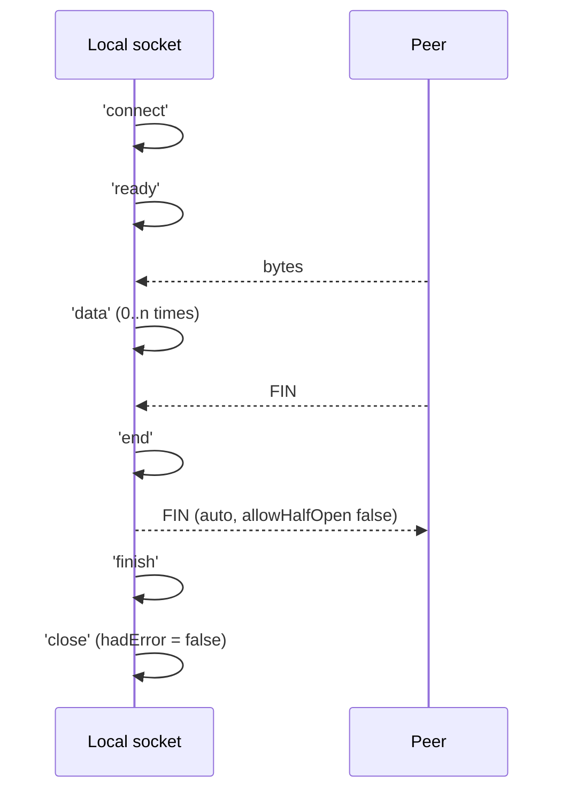

# Chapter 33 — TCP Sockets with `node:net`

**What you will learn**

- How a `net.Socket` is a `stream.Duplex`, and which stream knowledge from Part III transfers directly.
- How to build and shut down a `net.Server` cleanly, including `EADDRINUSE`, `maxConnections`, and graceful close.
- The exact order of `'data'`, `'end'`, `'finish'`, and `'close'` on a socket, and what `hadError` means.
- Why `setTimeout()` does not close anything, and what Nagle's algorithm and TCP keep-alive actually do.
- **Message framing** — the fact that TCP has no message boundaries — implemented as a reusable `Transform`.
- Unix domain sockets, Windows named pipes, `net.BlockList`, and Happy Eyeballs.

## Why this matters

Every network protocol you use in Node sits on top of `node:net`. `node:http` is a `net.Server` with a parser bolted on; `node:tls` wraps a `net.Socket`; Redis clients, Postgres drivers, and custom RPC layers all open a TCP socket and push bytes through it.

You will not write raw TCP every week. But when the HTTP layer misbehaves — connections hanging, `ECONNRESET` in the logs, a client that works locally and stalls in production — the explanation is almost always at this layer. And when you do speak a binary protocol, one mistake is nearly universal: assuming that one `socket.write()` on one side produces one `'data'` event on the other. It does not, it never has, and the resulting bug is intermittent and load-dependent. That is the section to read twice.

## Sockets are duplex streams

`net.Socket` **extends `stream.Duplex`**. That is not an analogy, it is the class hierarchy. Everything from [Chapter 18 — Streams I](../part3-data/18-streams-concepts.md) and [Chapter 19 — Streams II](../part3-data/19-streams-advanced.md) applies:

- `socket.write(chunk)` returns `false` when the internal buffer is over the high-water mark. Respect it, or wait for `'drain'`.
- `socket.pipe(dest)` and `pipeline(socket, transform, dest)` work exactly as they do for files.
- `for await (const chunk of socket)` iterates incoming data.
- `socket.pause()` / `socket.resume()` control the flow.
- `socket.setEncoding('utf8')` turns `'data'` chunks from `Buffer` into `string`, with the `StringDecoder` handling multi-byte characters split across chunks.

The duplex-ness is real: the readable and writable halves are independent, and TCP allows one to close while the other stays open — the source of the `allowHalfOpen` surprise later in this chapter. Two socket-level extras: `socket.write()` never rejects data (it buffers without bound if it has to), and `socket.bufferSize` is **[Deprecated]** in favour of `socket.writableLength`.

## Servers

### Creating and listening

```mjs
import net from 'node:net';

const server = net.createServer((socket) => {
  console.log('connection from', socket.remoteAddress, socket.remotePort);
  socket.write('hello\r\n');
  socket.pipe(socket);            // echo everything back
});

server.on('error', (err) => {
  console.error('server error:', err.code, err.message);
});

server.listen(8124, '127.0.0.1', () => {
  console.log('listening on', server.address());
});
```

The callback passed to `createServer` is registered for `'connection'`; the callback passed to `listen` is registered for `'listening'`.

`listen()` has four shapes:

| Signature | Use |
|---|---|
| `listen([port[, host[, backlog]]][, cb])` | TCP. Port `0` or omitted means "OS picks a free port". |
| `listen(path[, backlog][, cb])` | IPC — Unix domain socket or Windows named pipe. |
| `listen(options[, cb])` | Everything, plus the options-only settings below. |
| `listen(handle[, backlog][, cb])` | Adopt an already-bound server, socket, `BoundSocket`, or `{ fd }`. Not supported for file descriptors on Windows. |

The `options` form is the one to prefer, because several settings exist only there:

| Option | Meaning |
|---|---|
| `port`, `host`, `path`, `backlog` | As in the positional forms. |
| `exclusive` | **Default `false`.** When `false`, cluster workers share the underlying handle. `true` refuses to share and errors on a port conflict. |
| `ipv6Only` | **Default `false`.** `true` disables dual-stack, so binding `::` does *not* also bind `0.0.0.0`. |
| `reusePort` | **Default `false`.** `SO_REUSEPORT`: several processes bind the same port and the kernel load-balances. Linux 3.9+, FreeBSD 12+, DragonFlyBSD 3.6+, Solaris 11.4, AIX 7.2.5+. Errors on unsupported platforms. Since v23.1.0 / v22.12.0. |
| `readableAll`, `writableAll` | IPC only. Make the pipe readable/writable by all users — needed if the server runs as root. |
| `signal` | An `AbortSignal`; aborting it is equivalent to `server.close()`. |
| `handle` | A pre-bound `net.BoundSocket` to adopt. |

`backlog` defaults to **511** (not 512) and is only a hint — Linux clamps it via `somaxconn`.

If `host` is omitted the server binds the unspecified IPv6 address `::` when IPv6 is available, falling back to `0.0.0.0`, and on most systems binding `::` also accepts IPv4. **So `server.listen(8124)` is publicly reachable**, not localhost-only. If you meant localhost, say so: `server.listen(8124, '127.0.0.1')`.

`server.address()` returns `{ port, family, address }` for TCP, the path string for IPC, and `null` before `'listening'` or after `close()`. `family` is a string like `'IPv4'` — briefly a number in v18.0.0, changed back in v18.4.0.

Port `0` plus `server.address().port` is the standard pattern for tests:

```js
server.listen(0, '127.0.0.1', () => {
  const { port } = server.address();
  runClientAgainst(port);
});
```

### Server events

| Event | Fires when |
|---|---|
| `'listening'` | The bind succeeded. |
| `'connection'` | A client connected. Argument is the `net.Socket`. |
| `'error'` | Bind or accept failed. **`'close'` does not follow automatically** — unlike on a socket. |
| `'close'` | The server closed *and* every connection has ended. |
| `'drop'` | `maxConnections` was exceeded and a connection was dropped. Since v18.6.0 / v16.17.0. |

`'drop'` carries `{ localAddress, localPort, localFamily, remoteAddress, remotePort, remoteFamily }` for TCP servers, and `undefined` otherwise.

### `EADDRINUSE`

The most common startup failure. Another process — often your own previous run — still holds the port.

```js
server.on('error', (err) => {
  if (err.code === 'EADDRINUSE') {
    console.error(`port ${PORT} is already in use`);
    process.exit(1);
  }
  throw err;
});
```

Exiting is usually right in production: a supervisor restarts you, and silent retries hide a genuine conflict. If you do retry, call `server.close()` first — `listen()` may only be re-called after an error or after `close()`, and otherwise throws `ERR_SERVER_ALREADY_LISTEN`.

### Closing gracefully

`server.close()` stops accepting new connections but **leaves existing ones open**. The `'close'` event fires only when the last one ends. On a keep-alive server with idle clients, that is never — so a graceful shutdown needs two steps:

```js
async function shutdown(server, sockets, graceMs = 10_000) {
  server.close();                         // stop accepting
  const deadline = setTimeout(() => {
    for (const s of sockets) s.destroy(); // force the stragglers
  }, graceMs);
  await once(server, 'close');
  clearTimeout(deadline);
}
```

Track live sockets in a `Set`, adding on `'connection'` and removing on the socket's `'close'`. `server.getConnections(callback)` gives the count asynchronously (it works even for sockets handed to forked children) but not the socket objects.

`server[Symbol.asyncDispose]()` calls `close()` and resolves when closed — stable since v24.2.0 — so `await using` works.

`server.maxConnections` caps concurrency. On reaching it, a standalone process closes new connections and emits `'drop'`; in cluster mode Node routes the connection to another worker unless you set `server.dropMaxConnection = true` (v23.1.0 / v22.12.0). Since v21.0.0, `maxConnections = 0` drops *everything* — it used to mean "unlimited", so this is a real upgrade hazard.

## Sockets

### Connecting

`net.createConnection()` (alias `net.connect()`) creates a socket and connects it in one step. It has three signatures — `(options)`, `(path)`, and `(port[, host])`.

```mjs
import { connect } from 'node:net';

const socket = connect({ port: 8124, host: '127.0.0.1' });
socket.on('connect', () => socket.write('ping\n'));
socket.setEncoding('utf8');
socket.on('data', (chunk) => process.stdout.write(chunk));
socket.on('error', (err) => console.error(err.code));
```

Useful TCP connect options:

| Option | Default | Meaning |
|---|---|---|
| `port` | — | Required. |
| `host` | `'localhost'` | Name or IP. |
| `family` | `0` | `4`, `6`, or `0` for both. |
| `hints` | `0` | `dns.lookup()` hint flags. |
| `localAddress`, `localPort` | — | Bind the source side. |
| `lookup` | `dns.lookup` | Custom resolver. See [Chapter 34](34-dns.md). |
| `autoSelectFamily` | `net.getDefaultAutoSelectFamily()` | Happy Eyeballs; see below. |
| `autoSelectFamilyAttemptTimeout` | `net.getDefaultAutoSelectFamilyAttemptTimeout()` | Per-attempt timeout. |
| `noDelay`, `keepAlive`, `keepAliveInitialDelay` | `false`, `false`, `0` | Applied as soon as the socket is up. |
| `blockList` | — | A `net.BlockList` that blocks *outbound* destinations. |
| `signal` | — | `AbortSignal` that destroys the socket. |

For IPC, pass `path` instead; the TCP options are then ignored.

### Socket events and their order

This is the part worth memorising.



Run a socket with every listener attached and you see exactly this:

```text
client: connect
client: ready
server socket: data <Buffer 61 62 63>
server socket: end
server socket: finish
server socket: close false
```

| Event | Meaning |
|---|---|
| `'connect'` | The TCP handshake completed. |
| `'ready'` | Fires immediately after `'connect'`; the socket is usable. |
| `'lookup'` | After DNS resolution, before connecting. `(err, address, family, host)`. Not emitted for Unix sockets. |
| `'data'` | Bytes arrived. **If nobody is listening, the data is discarded.** |
| `'drain'` | The write buffer emptied after a `write()` returned `false`. |
| `'end'` | The peer sent FIN. The readable side is finished. |
| `'timeout'` | `setTimeout()` idle period elapsed. **Does not close anything.** |
| `'error'` | Something failed. `'close'` **always** follows. |
| `'close'` | Fully closed. Argument `hadError` is `true` if closure was caused by a transmission error. |

Three rules follow:

1. **`'error'` is always followed by `'close'`.** Do not clean up in both — you will run it twice. Put teardown in `'close'`, classification in `'error'`.
2. **`'close'` always fires, exactly once.** It is the only reliable place to release resources; `'end'` does not fire on an abrupt reset.
3. **An unhandled `'error'` crashes the process**, because `net.Socket` is an `EventEmitter`. Every socket needs an error listener, including ones you only write to.

The autoselection events `'connectionAttempt'`, `'connectionAttemptFailed'`, and `'connectionAttemptTimeout'` (v21.6.0 / v20.12.0) each carry `{ ip, port, family }` and fire once per candidate address when Happy Eyeballs is active.

### Writing, ending, destroying

| Call | Effect on the wire |
|---|---|
| `socket.write(data)` | Queue bytes. Returns `false` if buffered in user memory. |
| `socket.end([data])` | Optionally write, then send **FIN**. Half-closes: you can still receive. |
| `socket.destroySoon()` | `end()` if still writable, then destroy once flushed. |
| `socket.destroy([error])` | Stop all I/O immediately. Pending writes are dropped. |
| `socket.resetAndDestroy()` | Send **RST** and destroy. TCP only — throws `ERR_INVALID_HANDLE_TYPE` on a pipe. v18.3.0 / v16.17.0. |

The distinction that matters: `end()` is graceful and the peer sees a clean end-of-stream; `destroy()` tears down the local handle and the peer typically sees `ECONNRESET`; `resetAndDestroy()` deliberately sends RST, which is the right way to reject an abusive client without waiting through a four-way close.

`socket.readyState` reports `'opening'`, `'open'`, `'readOnly'`, `'writeOnly'`, or `'closed'` — handy when debugging half-open confusion.

### Addresses and counters

```js
socket.address();        // { port: 51234, family: 'IPv4', address: '127.0.0.1' } — the LOCAL side
socket.localAddress;     // '127.0.0.1'
socket.localPort;        // 51234
socket.localFamily;      // 'IPv4'
socket.remoteAddress;    // peer IP, or undefined once destroyed
socket.remotePort;
socket.remoteFamily;
socket.bytesRead;        // total bytes received on this socket
socket.bytesWritten;     // total bytes sent
socket.server;           // the net.Server that accepted it, or null
```

`remoteAddress` becomes `undefined` once the socket is destroyed, so capture it in `'connection'` if you want it in your `'close'` log line. On a dual-stack listener, IPv4 clients appear as IPv4-mapped IPv6 — `'::ffff:203.0.113.9'`. Normalize before comparing against an allowlist. `bytesRead`/`bytesWritten` are cumulative and cheap to read; logging them at close gives you a free traffic histogram.

### Timeouts: the biggest misconception

```js
socket.setTimeout(30_000);
socket.on('timeout', () => {
  console.log('idle for 30s');
});
```

That code **does nothing useful**. `setTimeout()` sets an *inactivity notification*, not a deadline. When it fires, the connection is still open and still consuming a file descriptor; the docs say plainly that the user must close it.

```js
// ✅
socket.setTimeout(30_000, () => {
  socket.destroy(new Error('idle timeout'));
});
```

`setTimeout(0)` disables the timer, and the optional callback is registered as a one-time `'timeout'` listener. The timer measures inactivity in *either* direction, so a socket receiving constant keep-alive noise never times out even if your application has stalled.

### Nagle's algorithm and `setNoDelay`

Nagle's algorithm is on by default on every TCP connection. Its rule: **if there is unacknowledged data in flight, buffer small writes instead of sending them.** It exists to stop a telnet session from sending a 41-byte packet per keystroke.

It optimises throughput at the cost of latency, and interacts badly with delayed ACKs: your small write waits for an ACK, the peer's ACK waits up to 40 ms for data to piggyback on, and you have invented a 40 ms penalty out of nothing. Writing a small header and then a small body is the classic trigger.

```js
socket.setNoDelay();        // true is the DEFAULT ARGUMENT — this DISABLES Nagle
socket.setNoDelay(true);    // same thing
socket.setNoDelay(false);   // re-enables Nagle
```

The naming is doubly confusing: the *option* is `noDelay`, and `setNoDelay()` with no argument passes `true`, which turns Nagle **off**. Disable it for interactive and request/response protocols; leave it on for bulk transfer. The better fix, where you control the protocol, is to avoid small writes entirely — build the whole message in one `Buffer` and write it once.

### TCP keep-alive

Keep-alive is *not* HTTP keep-alive. It is a TCP-level probe that detects a peer that silently vanished — a laptop that closed, a NAT box that forgot the mapping, a machine that lost power. Without it a socket to a dead peer stays "open" indefinitely, because TCP has no idea anything is wrong until someone tries to send.

Two signatures, both returning the socket:

```js
socket.setKeepAlive({ enable: true, initialDelay: 60_000, interval: 1000, count: 10 });
socket.setKeepAlive(true, 60_000, 1000, 10);
```

| Parameter | Default | Socket option |
|---|---|---|
| `enable` | `false` | `SO_KEEPALIVE` |
| `initialDelay` (ms) | `0` | `TCP_KEEPIDLE` — idle time before the first probe |
| `interval` (ms) | `1000` | `TCP_KEEPINTVL` — gap between probes |
| `count` | `10` | `TCP_KEEPCNT` — unacknowledged probes before giving up |

The object form and the `interval`/`count` arguments arrived in v26.4.0 / v24.19.0. Two practical notes: millisecond values are divided by 1000 and **rounded down**, because the kernel options are in whole seconds — so `initialDelay: 900` becomes 0, meaning "leave the system default alone". And on Windows builds older than 1709, keep-alive uses `SIO_KEEPALIVE_VALS`, which has no probe-count field, so `count` is ignored.

OS defaults are useless for servers — Linux waits 7200 seconds before the first probe. Set `initialDelay` explicitly.

## The framing problem

**TCP is a byte stream. It has no concept of a message.**

Everything else in this chapter is detail. This is the thing that breaks production systems.

When you call `socket.write(bufferOfLength100)`, TCP may deliver those bytes in any grouping: one `'data'` event of 100 bytes, two of 50, or 100 of one byte. Conversely, three `write()` calls of 10 bytes may arrive as a single 30-byte event. The segmentation depends on MTU, Nagle, kernel buffer state, and router behaviour — all of which vary with load. Which is why this bug passes every local test and fails at 3 a.m.

So this code is wrong:

```js
// BROKEN — assumes one write == one 'data' event
socket.on('data', (chunk) => {
  const message = JSON.parse(chunk.toString());  // throws on a split, silently
  handle(message);                               // drops messages on a merge
});
```

You need a **framing protocol**: a rule the receiver uses to find message boundaries. The two common ones are delimiters (newline-delimited JSON — simple, but you must escape or forbid the delimiter inside payloads) and **length prefixes** (a fixed-width header giving the payload size). Length prefixes are binary-safe and the right default.

### A length-prefixed decoder as a Transform

Four-byte big-endian length, then that many bytes of payload. Written as a `Transform` so it drops straight into a `pipeline`.

```js
import { Transform } from 'node:stream';

export class LengthPrefixDecoder extends Transform {
  #buffered = [];
  #bufferedBytes = 0;
  #needed = -1;              // -1 means "still reading the header"

  constructor({ maxFrameSize = 1 << 20 } = {}) {
    super({ readableObjectMode: true });
    this.maxFrameSize = maxFrameSize;
  }

  #take(n) {
    const all = Buffer.concat(this.#buffered, this.#bufferedBytes);
    this.#buffered = [all.subarray(n)];
    this.#bufferedBytes = all.length - n;
    return all.subarray(0, n);
  }

  _transform(chunk, _encoding, callback) {
    this.#buffered.push(chunk);
    this.#bufferedBytes += chunk.length;

    for (;;) {
      if (this.#needed === -1) {
        if (this.#bufferedBytes < 4) break;          // header not complete yet
        this.#needed = this.#take(4).readUInt32BE(0);
        if (this.#needed > this.maxFrameSize) {
          return callback(new Error(`frame of ${this.#needed} bytes exceeds limit`));
        }
      }
      if (this.#bufferedBytes < this.#needed) break; // payload not complete yet
      this.push(this.#take(this.#needed));
      this.#needed = -1;
    }
    callback();
  }

  _flush(callback) {
    callback(this.#bufferedBytes === 0 && this.#needed === -1
      ? null
      : new Error('stream ended mid-frame'));
  }
}

export function encodeFrame(payload) {
  const header = Buffer.allocUnsafe(4);
  header.writeUInt32BE(payload.length, 0);
  return Buffer.concat([header, payload]);
}
```

Four design points, each of which is a bug if you skip it:

- **The loop.** One `'data'` chunk may contain several complete frames. A single `if` decodes one and leaves the rest buffered until more data happens to arrive — a deadlock on a request/response protocol.
- **`maxFrameSize`.** The length field is attacker-controlled. Without a cap, a client sends `FF FF FF FF` and you try to buffer 4 GB.
- **`_flush` rejecting a partial frame.** A truncated message must be an error, not silence.
- **`readableObjectMode: true`.** Each pushed frame stays a discrete `Buffer` instead of being reconcatenated by the stream machinery — which would undo everything we just did.

Using it:

```mjs
import net from 'node:net';
import { pipeline } from 'node:stream/promises';
import { LengthPrefixDecoder, encodeFrame } from './framing.mjs';

const server = net.createServer(async (socket) => {
  socket.on('error', (err) => console.error('socket:', err.code));

  const frames = socket.pipe(new LengthPrefixDecoder({ maxFrameSize: 64 * 1024 }));
  frames.on('error', (err) => {
    console.error('protocol violation:', err.message);
    socket.destroy();
  });

  for await (const frame of frames) {
    const request = JSON.parse(frame.toString('utf8'));
    const response = Buffer.from(JSON.stringify({ echo: request }), 'utf8');
    socket.write(encodeFrame(response));
  }
});

server.listen(9001, '127.0.0.1');
```

Feed the decoder one byte at a time and it still produces exactly the original frames. That is the test to write.

## Unix domain sockets and Windows named pipes

The same classes handle local IPC. Pass a `path` instead of a `port`.

```js
// POSIX
server.listen('/tmp/echo.sock');
net.connect('/tmp/echo.sock');
```

```js
// Windows — the path must be under \\?\pipe\ or \\.\pipe\
import path from 'node:path';
server.listen(path.join('\\\\?\\pipe', process.cwd(), 'myctl'));
```

The platform differences are not cosmetic:

| | Unix domain socket | Windows named pipe |
|---|---|---|
| Namespace | The file system | Flat `\\?\pipe\` namespace |
| Path length limit | `sizeof(sockaddr_un.sun_path)` — about 107 bytes on Linux, 103 on macOS | Effectively unlimited |
| Permissions | File system permissions apply | `readableAll` / `writableAll` on `listen()` |
| Lifetime | **Persists until unlinked.** `server.close()` unlinks a socket Node created; a crash leaves it behind. | Removed when the last reference closes, and when the owning process exits. |
| Abstract sockets | Linux only: prefix the path with `\0` (e.g. `'\0abstract'`). Invisible in the file system, disappears automatically. Since v20.8.0. | n/a |

The stale-socket problem is the one that bites: after a crash `/tmp/app.sock` still exists and the next `listen()` fails with `EADDRINUSE`. Unlink before binding — but only after checking nobody is actually listening, or you have stolen a live server's socket. Linux abstract sockets sidestep the issue entirely.

Unix domain sockets are faster than TCP over loopback (no checksums, no TCP state machine) and let you use file permissions as authentication. For a sidecar or a local control channel, prefer them.

## `net.BlockList` and `net.SocketAddress`

`net.BlockList` matches IP addresses against a rule set and is accepted directly by `createServer({ blockList })` (inbound) and `new net.Socket({ blockList })` or the connect options (outbound).

```js
import net from 'node:net';

const denied = new net.BlockList();
denied.addAddress('203.0.113.7');
denied.addRange('198.51.100.1', '198.51.100.10');
denied.addSubnet('2001:db8::', 32, 'ipv6');
denied.addCIDR('10.0.0.0/8');

denied.check('10.1.2.3');                      // true
denied.check('::ffff:203.0.113.7', 'ipv6');    // true — mapped IPv4 works
```

The full rule API: `addAddress`, `addAddresses`, `addCIDR`, `addCIDRs`, `addRange`, `addSubnet`, the matching `removeAddress` / `removeCIDR` / `removeRange` / `removeSubnet`, plus `clear()`, `rules`, `size`, `toJSON()`, `fromJSON()` (release candidate), and the static `BlockList.isBlockList(value)`. The batch forms take a single internal lock and are the right choice for large lists.

For the SSRF use case there is a ready-made constant, `BlockList.PRIVATE_RANGES` — a frozen array of CIDR strings covering `10.0.0.0/8`, `172.16.0.0/12`, `192.168.0.0/16`, `127.0.0.0/8`, `::1/128`, `169.254.0.0/16`, `fe80::/10`, and `fc00::/7`:

```js
const noInternal = new net.BlockList();
noInternal.addCIDRs(net.BlockList.PRIVATE_RANGES);
noInternal.check('169.254.169.254');   // true — cloud metadata blocked
```

That is the checklist from [Chapter 32](32-url-and-querystring.md) in one line. One caveat for inbound use: behind a reverse proxy or NAT the address checked is the proxy's, so the block list sees the wrong client.

`net.SocketAddress` wraps `{ address, family, port, flowlabel }` — `family` is `'ipv4'` (default) or `'ipv6'`, `address` defaults to `'127.0.0.1'` or `'::'` accordingly. `SocketAddress.parse('203.0.113.9:443')` and `SocketAddress.parse('[2001:db8::1]:443')` return a `SocketAddress` or `undefined` (v23.4.0 / v22.13.0) — the cleanest way to parse `host:port` without a regex.

Related: `net.isIP(input)` returns `6`, `4`, or `0`; `net.isIPv4` and `net.isIPv6` return booleans. All three reject leading zeroes — `net.isIPv4('127.000.000.001')` is `false` — deliberately, since leading-zero forms are read as octal by some libraries and are a spoofing vector.

## Happy Eyeballs (`autoSelectFamily`)

A dual-stack host may have both AAAA and A records. If the IPv6 path is broken — a misconfigured tunnel, a firewall dropping ICMPv6 — connecting to the AAAA address hangs until the OS gives up, often 75 seconds or more, while the IPv4 address would have worked instantly.

RFC 8305 ("Happy Eyeballs v2") solves this by racing, and Node implements a loose version as `autoSelectFamily`, **on by default since v20.0.0 / v18.18.0**. `lookup` is called with `all: true` and Node tries the addresses in sequence — first AAAA, first A, second AAAA, second A — giving every attempt but the last `autoSelectFamilyAttemptTimeout` milliseconds before moving on.

- Turn it off globally with `--no-network-family-autoselection`, or at runtime with `net.setDefaultAutoSelectFamily(false)`. Read the current value with `net.getDefaultAutoSelectFamily()`.
- Tune the per-attempt timeout with `--network-family-autoselection-attempt-timeout` or `net.setDefaultAutoSelectFamilyAttemptTimeout(value)`. Values under `10` are clamped to `10`.
- It is ignored when `family` is not `0`, or when `localAddress` is set.

Two consequences for error handling:

1. **If any attempt succeeds, failures are not emitted.** Your `'error'` handler never sees the failed IPv6 attempt; listen for `'connectionAttemptFailed'` to observe it.
2. **If every attempt fails you get a single `AggregateError`.** Code that reads `err.code` gets `undefined` — the codes are on `err.errors[i].code`.

```js
socket.on('error', (err) => {
  if (err instanceof AggregateError) {
    for (const e of err.errors) console.error(e.code, e.message);
  } else {
    console.error(err.code, err.message);
  }
});
```

`socket.autoSelectFamilyAttemptedAddresses` lists every `'$IP:$PORT'` tried; when the connection succeeded, the last entry is the one in use.

## Half-open connections

TCP allows one direction to close while the other stays open. Node's default hides this: **`allowHalfOpen` defaults to `false`**, so when the peer sends FIN and `'end'` fires, Node automatically ends your writable side too.

That default is right for request/response protocols and wrong wherever the client says "I'm done sending, now give me the answer" — a compression service that streams input, closes, and waits for output, for instance.

```js
const server = net.createServer({ allowHalfOpen: true }, (socket) => {
  const chunks = [];
  socket.on('data', (c) => chunks.push(c));
  socket.on('end', () => {
    // Readable side is done. Writable side is STILL OPEN because of allowHalfOpen.
    socket.end(process(Buffer.concat(chunks)));   // you must end() it yourself
  });
});
```

With `allowHalfOpen: true` you take on the obligation to call `end()`. Forget it and the socket leaks for the lifetime of the process — the option that gives you flexibility also removes the safety net. Set it on the *server* (via `createServer`) or in the *socket constructor*, not by mutating the socket afterwards.

## `net/promises`

**[Experimental]** — new in the 27.x development line. Available as `require('node:net/promises')` or `require('node:net').promises`.

```mjs
import { connect, listen } from 'node:net/promises';

const server = await listen({ port: 8124 });
console.log('listening on', server.address().port);

const socket = await connect({ port: 8124 });
socket.write('hello world!');
socket.end();
```

`connect(options | path | port[, host])` resolves with the socket on `'connect'`, rejects if the connection fails or an `AbortSignal` fires, and destroys the socket when it rejects. `listen(options)` takes everything `createServer()` and `server.listen()` accept, plus `connectionListener` and `signal`, and closes the server if the bind fails.

The returned server is async-iterable via `server[Symbol.asyncIterator]()`, also **[Experimental]**:

```mjs
for await (const socket of server) {
  handleConnection(socket);        // do NOT await this
}
```

The loop only advances after the body finishes awaiting, so awaiting the handler inline serializes connections — one client at a time. Dispatch instead. And because the server keeps accepting while the body runs, a slow consumer buffers connections without bound; use `server.maxConnections`. Being experimental, this API may change; for production today the event API is the safe choice.

## Debugging with a raw client

When a protocol misbehaves, stop guessing and speak it by hand.

```bash
# TCP
nc 127.0.0.1 8124
telnet 127.0.0.1 8124

# Unix domain socket
nc -U /tmp/echo.sock
```

For binary protocols a ten-line Node client beats `nc`, because you control the bytes exactly:

```mjs
import net from 'node:net';
const s = net.connect(9001, '127.0.0.1');
s.on('connect', () => {
  const body = Buffer.from(JSON.stringify({ hello: 'world' }));
  const header = Buffer.allocUnsafe(4);
  header.writeUInt32BE(body.length, 0);
  s.write(header);
  setTimeout(() => s.write(body), 200);   // deliberately split the frame
});
s.on('data', (d) => console.log('<-', d.toString('hex')));
s.on('error', (e) => console.error(e.code));
```

Splitting a frame across two writes with a delay in between is the single most valuable test for any framing code. If your decoder survives that, it will survive the network.

Three other tools: `NODE_DEBUG=net node app.js` prints Node's internal socket tracing, `ss -tnp` shows what is listening and in what state, and `tcpdump -i lo -A port 9001` shows the real bytes when you suspect Node is not the problem.

## Common mistakes

### ❌ Assuming one `write()` produces one `'data'` event

```js
socket.on('data', (chunk) => handle(JSON.parse(chunk.toString())));
```

TCP is a byte stream. Under load, chunks split and merge, and this throws or silently drops messages.

```js
// ✅ Frame explicitly.
socket.pipe(new LengthPrefixDecoder()).on('data', (frame) => {
  handle(JSON.parse(frame.toString('utf8')));
});
```

### ❌ Calling `setTimeout()` and expecting a disconnect

```js
socket.setTimeout(30_000);   // fires 'timeout'; the socket stays open forever
```

Idle sockets accumulate until you run out of file descriptors and start seeing `EMFILE`.

```js
// ✅
socket.setTimeout(30_000, () => socket.destroy(new Error('idle timeout')));
```

### ❌ No `'error'` listener on a socket

```js
const socket = net.connect(9001, 'db.internal');
socket.write('PING\r\n');    // ECONNREFUSED -> uncaught 'error' -> process exits
```

`net.Socket` is an `EventEmitter`; an unhandled `'error'` is an uncaught exception.

```js
// ✅ Attach before anything can fail.
const socket = net.connect(9001, 'db.internal');
socket.on('error', (err) => reconnectLater(err));
```

### ❌ Cleaning up in both `'error'` and `'close'`

```js
socket.on('error', () => pool.release(conn));
socket.on('close', () => pool.release(conn));   // runs twice on an error
```

`'close'` always follows `'error'`.

```js
// ✅ Classify in 'error', release in 'close'.
socket.on('error', (err) => { conn.lastError = err; });
socket.on('close', () => pool.release(conn));
```

### ❌ Trusting `server.close()` to shut you down

```js
process.on('SIGTERM', () => server.close(() => process.exit(0)));
```

`close()` refuses new connections but waits for existing ones. With idle keep-alive clients the callback never runs and your container is SIGKILLed at the end of its grace period.

```js
// ✅ Track sockets and force the stragglers.
const sockets = new Set();
server.on('connection', (s) => {
  sockets.add(s);
  s.on('close', () => sockets.delete(s));
});
process.on('SIGTERM', () => {
  server.close(() => process.exit(0));
  setTimeout(() => { for (const s of sockets) s.destroy(); }, 10_000).unref();
});
```

## Production notes

- **File descriptors are the real connection limit.** Each socket is one fd, and a default `ulimit -n` of 1024 is low for a server. Raise it, and set `server.maxConnections` below the limit so you shed load with a `'drop'` event instead of failing accepts with `EMFILE`.
- **`write()` never applies backpressure by itself.** It queues in user memory without bound. A client that stops reading while you keep writing will grow your heap until the process dies. Honour the `false` return value, or use `pipeline()`, which does it for you.
- **Set keep-alive on long-lived connections.** Pools to databases and brokers sit idle for minutes. Without `SO_KEEPALIVE`, a NAT timeout or peer reboot leaves you holding a socket that looks fine and silently swallows requests until a write finally fails. `setKeepAlive({ enable: true, initialDelay: 60_000 })` turns a mystery hang into a prompt `ECONNRESET`.
- **Cap every attacker-influenced buffer.** Length prefixes, delimiter scans, and header accumulators all need a maximum. An unbounded frame length or an unbounded search for a newline is a remote memory-exhaustion bug.
- **`reusePort` beats `cluster` for some workloads.** With `listen({ port, reusePort: true })` on Linux 3.9+, each process gets its own accept queue and the kernel balances — no thundering herd, no primary-process bottleneck. See [Chapter 30 — Cluster and Multi-Process Scaling](../part4-system/30-cluster.md).
- **Watch for IPv4-mapped addresses in logs and allowlists.** A dual-stack listener reports `'::ffff:203.0.113.9'`; a rate limiter keyed on the raw string treats the mapped and unmapped forms as different clients.
- **Sockets and servers can move between threads.** A connected TCP socket, or a listening server, can go in the `transferList` of a `worker_threads` `postMessage()`. The socket must be freshly accepted — not connecting, destroyed, reading, or holding buffered data — or you get `ERR_WORKER_HANDLE_NOT_TRANSFERABLE`. See [Chapter 29 — Worker Threads](../part4-system/29-worker-threads.md).

## Exercises

1. **Echo server and hand-written client.** Run a TCP echo server on an OS-assigned port, print `server.address()`, connect with `nc`, and log every socket event when the client disconnects with Ctrl-D versus Ctrl-C. Success: you can state the ordering for a clean close and for a reset, and explain `hadError`.

2. **Framing under adversity.** Feed `LengthPrefixDecoder` a two-frame byte stream **one byte at a time**, then both frames in one chunk. Success: identical output. Then feed a header declaring 4 GB and assert the stream errors rather than allocating.

3. **Idle reaper.** Destroy any connection idle for more than 10 seconds, logging `remoteAddress`, `bytesRead`, and `bytesWritten` at close. Success: `ss -tn` shows no lingering ESTABLISHED sockets 15 seconds after a client stops sending, and the log has a real address (not `undefined`).

4. **Graceful shutdown.** Handle SIGTERM: stop accepting, wait up to 5 seconds for in-flight work, then destroy stragglers with a distinct exit code. Success: with one idle keep-alive client attached, the process exits within 5 seconds instead of hanging.

5. **Happy Eyeballs observation.** Connect to a dual-stack host with `autoSelectFamily` on, logging the three `connectionAttempt*` events and `socket.autoSelectFamilyAttemptedAddresses`. Then force total failure and inspect the `AggregateError`. Success: you can enumerate every address tried and every per-address error code.

## Recap

- `net.Socket` extends `stream.Duplex`; backpressure, `pipeline()`, and async iteration work as for any stream.
- `server.listen()` has four signatures; only the `options` form exposes `exclusive`, `ipv6Only`, `reusePort`, `signal`, and the IPC permission flags. `backlog` defaults to 511. Omitting `host` binds publicly.
- Socket events fire in a fixed order: `'connect'` → `'ready'` → `'data'`* → `'end'` → `'finish'` → `'close'`. `'error'` is always followed by `'close'`; `'close'` fires exactly once and is where cleanup belongs. `setTimeout()` notifies but never closes, `setNoDelay()` with no argument **disables** Nagle, and `setKeepAlive()` values are truncated to whole seconds.
- TCP has no message boundaries. Frame explicitly — a 4-byte length prefix decoded by a `Transform`, with a hard `maxFrameSize` cap — and test it by feeding one byte at a time.
- Unix domain sockets persist in the file system until unlinked; Windows named pipes vanish with the owning process. Linux abstract sockets (`'\0name'`) avoid the stale-socket problem entirely.
- `net.BlockList` plus `BlockList.PRIVATE_RANGES` gives you private/loopback/link-local filtering in two lines; `net.SocketAddress.parse()` parses `host:port` safely.
- `autoSelectFamily` (Happy Eyeballs) is on by default since v20.0.0; total failure surfaces as an `AggregateError`, so read `err.errors`, not `err.code`. `allowHalfOpen` defaults to `false`, and setting it to `true` means *you* must call `end()`.
- `net/promises` is **[Experimental]** in 27.x: `connect()`, `listen()`, and an async-iterable server.

## Where to go next

- [Chapter 19 — Streams II: Duplex, Transform, pipeline, Backpressure](../part3-data/19-streams-advanced.md) — the `Transform` machinery the framing decoder is built on.
- [Chapter 34 — DNS Resolution](34-dns.md) — the `lookup` option, `'lookup'` event, and what `autoSelectFamily` asks the resolver for.
- [Chapter 35 — HTTP/1.1 Servers](35-http-servers.md) — what `node:http` builds on top of `net.Server`.
- [Chapter 37 — TLS and HTTPS](37-tls-https.md) — wrapping a `net.Socket` in encryption.
- [Chapter 39 — UDP with `node:dgram`](39-udp-dgram.md) — the connectionless alternative, and when it is the right one.
- [Chapter 30 — Cluster and Multi-Process Scaling](../part4-system/30-cluster.md) — shared handles, `exclusive`, and `reusePort`.
- Official documentation: <https://nodejs.org/docs/latest/api/net.html>
