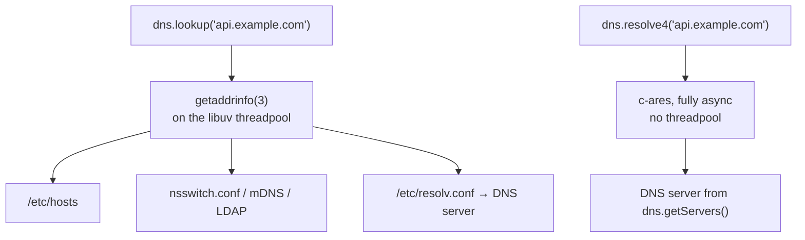

# Chapter 34 — DNS Resolution

**What you will learn**

- The difference between `dns.lookup()` and `dns.resolve*()` — two functions that look alike and behave nothing alike.
- Why `dns.lookup()` runs on the libuv threadpool, and how that turns a DNS outage into a file-system stall.
- Every `resolve*` variant, what shape each returns, and `reverse()`.
- How to use the `Resolver` class for per-instance servers, timeouts, retries, and cancellation.
- The `order` / `verbatim` history, the current default, and the flag that controls it.
- Why Node does not cache DNS, what that costs a long-lived process, and the standard mitigations.

## Why this matters

DNS is the least visible dependency in your stack and one of the most common causes of production incidents. A service that "randomly times out" for four seconds at a time, an application that keeps hammering a decommissioned IP address hours after failover, a container that can reach the internet but not its own sidecar — every one of these is a DNS problem wearing a different costume.

Node makes this harder than it needs to be, because `node:dns` contains two entirely different resolvers behind one module. `dns.lookup()` asks the operating system; `dns.resolve4()` speaks the DNS protocol on the wire. They consult different configuration, they fail differently, they have different performance characteristics, and — crucially — every networking API in Node uses the first one by default. Understanding that split is most of what you need.

## Two resolvers, one module



| | `dns.lookup()` | `dns.resolve*()` / `dns.reverse()` |
|---|---|---|
| Mechanism | OS `getaddrinfo(3)` | The DNS protocol, spoken directly |
| Consults `/etc/hosts` | **Yes** | **No** |
| Consults `nsswitch.conf`, mDNS, LDAP | Yes, on POSIX | No |
| Server selection | `/etc/resolv.conf`, unaffected by `dns.setServers()` | `dns.getServers()`, settable |
| Concurrency | **Blocks a libuv threadpool thread** | Fully asynchronous, no threadpool |
| Record types | A and AAAA only | Everything |
| OS-level caching | Whatever the OS does (nscd, systemd-resolved, Windows client) | None |
| Used by `net`, `http`, `tls`, `dgram` by default | **Yes** | No |
| Failure code for "not found" | `ENOTFOUND` | `ENOTFOUND` |

The rule of thumb: **use `dns.lookup()` when you want to resolve a name the way every other program on the machine does, and `dns.resolve*()` when you want to ask DNS a question.** They are not interchangeable.

The consequence people miss most often: `dns.resolve4('localhost')` fails on many systems, because `localhost` is defined in `/etc/hosts` and not in DNS. So is every entry your Docker Compose file injected, every `127.0.0.1 myapp.local` line a developer added, and every service name your container runtime writes into the hosts file. Swapping `lookup` for `resolve4` "to avoid the threadpool" silently breaks all of them.

### The threadpool problem

`dns.lookup()` is asynchronous from JavaScript's point of view, but underneath it is a *synchronous* `getaddrinfo(3)` call executed on a libuv threadpool thread. The threadpool has **four threads by default** (`UV_THREADPOOL_SIZE`), and it is shared with:

- every `node:fs` operation except the watchers and the explicitly synchronous ones,
- the async crypto APIs — `pbkdf2`, `scrypt`, `randomBytes`, `randomFill`, `generateKeyPair`,
- every non-synchronous `node:zlib` operation,
- `dns.lookup()`.

So four concurrent slow DNS lookups will stall *all file I/O and all zlib compression in the process*. This is not a theoretical concern: when a DNS server becomes unresponsive, `getaddrinfo` can block for the full `resolv.conf` timeout budget — typically 5 seconds per attempt, multiplied by `attempts`. Four such calls, and your event loop is fine but nothing that touches the disk completes. Health checks that read a file start failing, and you get paged for a "disk problem".

Three responses, in increasing order of effort:

1. **Raise `UV_THREADPOOL_SIZE`.** It must be set in the environment before the process starts; setting `process.env.UV_THREADPOOL_SIZE` from inside the process is not guaranteed to work, because the pool is created during runtime initialisation.
2. **Resolve once with `dns.resolve*()` and connect to the address**, keeping the hostname only for TLS SNI and the `Host` header.
3. **Install a custom `lookup` function** on the sockets that matter — both `socket.connect()` and `dgram.createSocket()` accept one — backed by `dns.resolve*()` plus your own cache.

## `dns/promises`

Use the promise API. It has been stable since v11.14.0 / v10.17.0 and is available as `node:dns/promises` or `require('node:dns').promises`.

```mjs
import { lookup, resolve4, resolveMx, reverse } from 'node:dns/promises';

const { address, family } = await lookup('example.org');
console.log(address, family);            // '93.184.216.34' 4

const ipv4 = await resolve4('example.org');
const mx = await resolveMx('example.org');
const names = await reverse('8.8.8.8');
```

```cjs
const { lookup, resolve4 } = require('node:dns/promises');
```

Note the shape change: promisified `lookup()` resolves to an **object** `{ address, family }`, not two separate callback arguments. With `{ all: true }` it resolves to an array of such objects instead.

The callback API is still there and still stable, and every function is available on both. This chapter uses the promise forms.

## `dns.lookup()` in detail

```js
await lookup(hostname, options);
```

| Option | Default | Meaning |
|---|---|---|
| `family` | `0` | `4`, `6`, or `0` for either. The strings `'IPv4'` and `'IPv6'` are accepted for compatibility with `node:net` (v18.4.0+). |
| `all` | `false` | `true` returns **every** address as an array of `{ address, family }`. |
| `hints` | — | Bitwise-OR of `dns.ADDRCONFIG`, `dns.V4MAPPED`, `dns.ALL`. |
| `order` | `'verbatim'` | `'verbatim'`, `'ipv4first'`, or `'ipv6first'`. |
| `verbatim` | `true` | **[Deprecated]** in favour of `order` since v22.1.0 / v20.13.0. `order` wins when both are given. |

If `options` is an integer rather than an object it is interpreted as `family` and must be `4` or `6`.

The hint flags:

- **`dns.ADDRCONFIG`** — only return address families the machine actually has configured on a non-loopback interface. On an IPv4-only host this suppresses AAAA results, saving a doomed connection attempt.
- **`dns.V4MAPPED`** — if `family: 6` was requested and no AAAA record exists, return IPv4-mapped IPv6 addresses instead. Not supported on every OS.
- **`dns.ALL`** — with `V4MAPPED`, return real IPv6 addresses *and* mapped IPv4 ones. Since v13.13.0 / v12.17.0.

One documented trap in the error handling: **`err.code` is `'ENOTFOUND'` not only when the name does not exist, but also when the lookup failed for other reasons — including running out of file descriptors.** Do not treat `ENOTFOUND` as proof that a hostname is wrong. Under `EMFILE` pressure, a perfectly valid name reports `ENOTFOUND` and you go hunting in the wrong place.

### Result order: `verbatim`, `ipv4first`, `ipv6first`

This default has changed, and the history matters if you support older runtimes.

- Before Node 17, `dns.lookup()` **sorted IPv4 addresses ahead of IPv6**. That was `verbatim: false` behaviour.
- **Node 17.0.0 changed the default to `verbatim`** — return addresses in the order the resolver gave them, which for most systems means AAAA first.
- v22.1.0 / v20.13.0 replaced the boolean `verbatim` with the three-valued `order`, adding `'ipv6first'`. `verbatim` is now deprecated; new code should use `order`.

**The current default is `'verbatim'`.** Confirm it at runtime with `dns.getDefaultResultOrder()` (v20.1.0 / v18.17.0).

Three ways to change it, in increasing precedence:

```bash
node --dns-result-order=ipv4first app.js
```

```js
import { setDefaultResultOrder, getDefaultResultOrder } from 'node:dns';
setDefaultResultOrder('ipv4first');       // beats the CLI flag
console.log(getDefaultResultOrder());     // 'ipv4first'
```

```js
await lookup('example.org', { order: 'ipv4first' });   // beats everything, per call
```

Two gotchas. `setDefaultResultOrder()` has **higher priority than `--dns-result-order`**, so a library calling it overrides your deployment flag. And it is **per-thread**: calling it on the main thread does not affect worker threads, which you must configure separately.

The Node 17 change broke a lot of applications running in environments where IPv6 is advertised but not routable — connections would go to the AAAA address and hang. Happy Eyeballs (`autoSelectFamily`, on by default since v20.0.0, see [Chapter 33](33-tcp-net.md)) largely fixed that by racing both families instead of relying on ordering. If you are still forcing `ipv4first` as a workaround, check whether you still need to.

## The `resolve*` family

Every one of these speaks DNS directly, ignores `/etc/hosts`, and uses the servers from `dns.getServers()`.

| Function | Record | Resolves to |
|---|---|---|
| `resolve4(hostname[, options])` | A | `string[]`, or `{ address, ttl }[]` with `{ ttl: true }` |
| `resolve6(hostname[, options])` | AAAA | Same, IPv6 |
| `resolveCname(hostname)` | CNAME | `string[]` |
| `resolveMx(hostname)` | MX | `{ priority, exchange }[]` |
| `resolveNs(hostname)` | NS | `string[]` |
| `resolvePtr(hostname)` | PTR | `string[]` |
| `resolveSoa(hostname)` | SOA | one object: `{ nsname, hostmaster, serial, refresh, retry, expire, minttl }` |
| `resolveSrv(hostname)` | SRV | `{ priority, weight, port, name }[]` |
| `resolveTxt(hostname)` | TXT | `string[][]` — **a two-dimensional array** |
| `resolveNaptr(hostname)` | NAPTR | `{ flags, service, regexp, replacement, order, preference }[]` |
| `resolveCaa(hostname)` | CAA | `{ critical, issue \| issuewild \| iodef }[]`. v15.0.0 / v14.17.0 |
| `resolveTlsa(hostname)` | TLSA | `{ certUsage, selector, match, data }[]`. v23.9.0 / v22.15.0 |
| `resolveAny(hostname)` | ANY | Mixed array; every object has a `type` field |
| `resolve(hostname[, rrtype])` | Any of the above | Dispatches by `rrtype` string, default `'A'` |
| `reverse(ip)` | PTR | `string[]` of host names |

Three of these have shapes that surprise people.

**`resolveTxt` returns `string[][]`.** A single TXT record can be split into multiple 255-byte chunks on the wire, so each element of the outer array is *one record* represented as an array of its chunks. To read an SPF record you must join:

```js
const records = await resolveTxt('example.org');
const spf = records.map((chunks) => chunks.join('')).find((t) => t.startsWith('v=spf1'));
```

Forgetting the join gives you a truncated string for any TXT record over 255 bytes — which is most DKIM keys.

**`resolveSoa` resolves to a single object**, not an array. Every other `resolve*` gives you an array.

**`resolveAny` is unreliable by design.** Many operators refuse ANY queries, per RFC 8482, returning either nothing or a synthetic HINFO record. Do not build anything on it; ask for the specific types you need.

`reverse(ip)` performs a PTR query. As of the current `main` line it **no longer consults hosts files** — a change from earlier behaviour, so a reverse lookup of `127.0.0.1` that used to return `localhost` from `/etc/hosts` may now fail. If you want the OS view, use `lookupService()` instead, which wraps `getnameinfo(3)`:

```js
import { lookupService } from 'node:dns/promises';
const { hostname, service } = await lookupService('127.0.0.1', 22);
// { hostname: 'localhost', service: 'ssh' }
```

Like `lookup()`, `lookupService()` runs on the threadpool.

Only `resolve4` and `resolve6` accept `{ ttl: true }`. That is the only place Node exposes a record's TTL, and it is the foundation of any cache you build yourself:

```js
const records = await resolve4('example.org', { ttl: true });
// [ { address: '93.184.216.34', ttl: 3521 } ]  — ttl in seconds
```

## The `Resolver` class

The module-level `resolve*` functions share one global resolver, and `dns.setServers()` mutates it process-wide. In a library, that is unacceptable. `dns.Resolver` gives you an isolated instance.

```mjs
import { Resolver } from 'node:dns/promises';

const resolver = new Resolver({ timeout: 2000, tries: 2 });
resolver.setServers(['1.1.1.1', '[2606:4700:4700::1111]']);

const addresses = await resolver.resolve4('example.org');
```

| Constructor option | Default | Meaning |
|---|---|---|
| `timeout` | `-1` (library default) | Per-query timeout in milliseconds. |
| `tries` | `4` | Attempts against **each** name server before giving up. Since v16.7.0 / v14.18.0. |
| `maxTimeout` | `0` (disabled) | Maximum retry timeout in milliseconds. |

`tries: 4` against multiple servers with a multi-second timeout is a long time to hang. For a request-path lookup, `{ timeout: 1500, tries: 1 }` and an explicit fallback is usually better than letting the resolver retry silently for fifteen seconds.

Every `resolve*` method plus `reverse()`, `getServers()`, and `setServers()` is available on the instance. Note what is **not**: there is no `resolver.lookup()`, because `lookup()` goes through the OS and has no per-instance server configuration.

Two instance-only methods:

**`resolver.cancel()`** aborts every outstanding query on that resolver. The pending callbacks receive an error with code `ECANCELLED` (and the promises reject with it). This is the clean way to abandon in-flight DNS work during shutdown or when a request is aborted:

```js
const resolver = new Resolver({ timeout: 1000 });
const timer = setTimeout(() => resolver.cancel(), 1000);
try {
  return await resolver.resolve4(hostname);
} finally {
  clearTimeout(timer);
}
```

**`resolver.setLocalAddress([ipv4][, ipv6])`** (v15.1.0 / v14.17.0) binds outgoing queries to a specific source address on a multi-homed machine. Defaults are `'0.0.0.0'` and `'::0'`, meaning "let the OS choose". The v4 address is used for IPv4 servers and the v6 address for IPv6 servers; the record type being queried is irrelevant.

### `setServers` and `getServers`

```js
import { setServers, getServers } from 'node:dns';

setServers(['8.8.8.8', '[2001:4860:4860::8888]', '8.8.8.8:1053']);
console.log(getServers());
```

Addresses are RFC 5952 formatted. Port 53 may be omitted; a non-default port is appended after a colon, with IPv6 addresses bracketed. An invalid address throws.

Three rules the docs are explicit about:

1. **`setServers()` does not affect `dns.lookup()`.** Only `resolve*` and `reverse`.
2. **It must not be called while a query is in progress.**
3. **Fallback works like `resolv.conf`, not like a round-robin.** If the first server answers `NOTFOUND`, that is the answer — Node does *not* try the next server. Later servers are only consulted when an earlier one times out or errors. A misconfigured primary that authoritatively denies your names will not be papered over by a working secondary.

## Node does not cache DNS

This is the single most operationally important fact in the chapter.

**Node.js performs no DNS caching of its own.** Not in `lookup()`, not in `resolve*()`. Every call goes out.

Why: caching correctly means honouring TTLs, handling negative caching, handling stale-while-revalidate, and deciding a memory policy — all of which are application decisions with no universally right answer. Node leaves it to you or to the OS.

What you actually get depends on the path:

- `dns.lookup()` inherits whatever the OS does. On a typical Linux container that is **nothing** — glibc's `getaddrinfo` has no cache unless `nscd` or `systemd-resolved` is running, and minimal container images ship neither. macOS and Windows do cache.
- `dns.resolve*()` never caches, on any platform.

Two consequences, in opposite directions.

**Consequence one: query storms.** A busy client without HTTP keep-alive resolves the same hostname on every request. At a thousand requests per second that is a thousand DNS queries per second per process, all of them going through four threadpool threads. Symptoms: latency spikes with no server-side explanation, and occasional `EAI_AGAIN` or `ENOTFOUND` when the resolver starts dropping packets.

**Consequence two — the more dangerous one: stale addresses.** A connection pool resolves a hostname once at startup and then reuses those sockets for days. When the backend fails over and the DNS record changes, your process keeps sending to the old IP address, because nothing ever asks again. TTLs mean nothing if nobody re-reads the record. This is why "we changed DNS an hour ago and the old instances are still getting traffic" is such a common incident.

### Mitigations

| Approach | Fixes | Cost |
|---|---|---|
| Enable HTTP keep-alive (`Agent({ keepAlive: true })`) | Storms | Amplifies staleness — pooled sockets never re-resolve |
| A userland cache honouring `resolve4(..., { ttl: true })` | Both | You own the correctness |
| A local caching resolver (`systemd-resolved`, `dnsmasq`, CoreDNS sidecar) | Storms | Infrastructure, not code; helps `lookup()` only |
| Aging pooled sockets out after a fixed maximum lifetime | Staleness | Some connection churn |
| A custom `lookup` on the agent or socket | Both | Most control, most code |

A minimal TTL-respecting cache, using the fact that `resolve4` is the only API that exposes TTL:

```js
import { Resolver } from 'node:dns/promises';

const resolver = new Resolver({ timeout: 2000, tries: 2 });
const cache = new Map();   // hostname -> { addresses, expiresAt }

export async function resolveCached(hostname, { minTtl = 5, maxTtl = 300 } = {}) {
  const hit = cache.get(hostname);
  if (hit && hit.expiresAt > Date.now()) return hit.addresses;

  const records = await resolver.resolve4(hostname, { ttl: true });
  if (records.length === 0) throw new Error(`no A records for ${hostname}`);

  const ttl = Math.min(Math.max(Math.min(...records.map((r) => r.ttl)), minTtl), maxTtl);
  const addresses = records.map((r) => r.address);
  cache.set(hostname, { addresses, expiresAt: Date.now() + ttl * 1000 });
  return addresses;
}
```

Clamping matters. A TTL of 1 second gives you no caching at all; a TTL of 86400 pins you to a dead address for a day. And note the limitation this inherits: it does not see `/etc/hosts`. If your service names come from a container runtime, cache `lookup()` results instead and use a fixed short TTL, because `lookup()` cannot tell you the real one.

### Plugging a cache into sockets

Both `socket.connect()` and `dgram.createSocket()` accept a `lookup` option with the same signature as `dns.lookup`. That is the hook:

```js
function cachedLookup(hostname, options, callback) {
  resolveCached(hostname).then(
    (addresses) => {
      if (options.all) {
        callback(null, addresses.map((address) => ({ address, family: 4 })));
      } else {
        callback(null, addresses[0], 4);
      }
    },
    (err) => callback(err),
  );
}

const socket = net.connect({ host: 'api.example.com', port: 443, lookup: cachedLookup });
```

Two details that are easy to get wrong. **You must honour `options.all`** — Happy Eyeballs sets it to `true` and expects an array of `{ address, family }`. And **you must call the callback asynchronously** relative to the caller if you resolve from cache synchronously; going through a promise, as above, guarantees that.

For HTTP, pass the same function on the `Agent` options so it applies to every connection the agent makes. See [Chapter 36 — HTTP/1.1 Clients, Agents, and Keep-Alive](36-http-clients.md).

## Error codes

`dns.resolve*` errors carry an `err.code` from a fixed set, exported as constants on the module. The constant name omits the leading `E`; the value includes it — `dns.NOTFOUND === 'ENOTFOUND'`.

| Constant | `err.code` | Meaning |
|---|---|---|
| `dns.NOTFOUND` | `ENOTFOUND` | Name does not exist. Also `lookup()`'s catch-all failure code. |
| `dns.NODATA` | `ENODATA` | The name exists but has no record of the requested type. |
| `dns.SERVFAIL` | `ESERVFAIL` | Server returned a general failure — often a broken DNSSEC chain. |
| `dns.TIMEOUT` | `ETIMEOUT` | Timed out contacting the servers. **Note: no `D`.** |
| `dns.REFUSED` | `EREFUSED` | Server refused the query. |
| `dns.CONNREFUSED` | `ECONNREFUSED` | Could not reach any DNS server at all. |
| `dns.CANCELLED` | `ECANCELLED` | `resolver.cancel()` was called. |
| `dns.BADNAME` | `EBADNAME` | Malformed host name. |
| `dns.BADFAMILY` | `EBADFAMILY` | Unsupported address family. |
| `dns.BADRESP` | `EBADRESP` | Malformed reply. |
| `dns.NOTIMP` | `ENOTIMP` | Server does not implement the operation. |

The full set also includes `FORMERR`, `BADQUERY`, `EOF`, `FILE`, `NOMEM`, `DESTRUCTION`, `BADSTR`, `BADFLAGS`, `NONAME`, `BADHINTS`, `NOTINITIALIZED`, `LOADIPHLPAPI`, and `ADDRGETNETWORKPARAMS`. All are exported from `dnsPromises` too.

Compare against the constants, not string literals — it documents intent and survives spelling mistakes:

```js
import dns from 'node:dns';

try {
  await resolveMx(domain);
} catch (err) {
  if (err.code === dns.NODATA) return [];               // no MX is legitimate
  if (err.code === dns.NOTFOUND) throw new BadDomain(domain);
  throw err;                                            // ESERVFAIL, ETIMEOUT: retry
}
```

The `NOTFOUND` / `NODATA` distinction is the useful one: `NOTFOUND` means the domain does not exist and retrying is pointless; `NODATA` means it exists but has no record of that type, which for MX or CAA is a normal answer, not an error condition.

One code you will see in logs that is *not* in this list: **`EAI_AGAIN`**. It comes from `getaddrinfo` via `dns.lookup()`, not from the DNS-protocol layer, and means "temporary failure in name resolution" — usually an unreachable or overloaded resolver. It is retryable.

## Debugging resolution problems

Start by determining which resolver is involved, because the fix differs.

```bash
# What does the OS think? (this is dns.lookup's world)
getent hosts api.example.com
ping -c1 api.example.com

# What does DNS actually say? (this is dns.resolve*'s world)
dig +short A api.example.com
dig +short @8.8.8.8 A api.example.com

# What is Node configured with?
node -p "require('node:dns').getServers()"
node -p "require('node:dns').getDefaultResultOrder()"
```

If `getent` succeeds and `dig` fails, the name is in `/etc/hosts` or another nsswitch source — `resolve*` will never find it. If `dig` succeeds and `getent` fails, `resolv.conf` or `nsswitch.conf` is misconfigured inside the container.

A five-line differ inside Node settles the argument:

```mjs
import { lookup, resolve4 } from 'node:dns/promises';
const host = process.argv[2];
const results = await Promise.allSettled([lookup(host, { all: true }), resolve4(host)]);
console.log('lookup :', results[0].status === 'fulfilled' ? results[0].value : results[0].reason.code);
console.log('resolve:', results[1].status === 'fulfilled' ? results[1].value : results[1].reason.code);
```

Other tools: `NODE_DEBUG=net` shows the `'lookup'` event path for sockets; attaching a `'lookup'` listener to a socket gives you `(err, address, family, host)` for every connection, which is the cheapest way to see what your HTTP client is actually resolving to; and `dig +trace` shows where in the delegation chain a `SERVFAIL` originates.

## Common mistakes

### ❌ Swapping `lookup()` for `resolve4()` to avoid the threadpool

```js
const [address] = await resolve4('db');   // ENOTFOUND — 'db' is in /etc/hosts
```

Container runtimes, Docker Compose, and Kubernetes write service names into the hosts file. `resolve*` never reads it.

```js
// ✅ Keep lookup() for names the OS owns; cache the result instead.
const { address } = await lookup('db');
```

### ❌ Treating `ENOTFOUND` from `lookup()` as "bad hostname"

```js
catch (err) {
  if (err.code === 'ENOTFOUND') return res.status(400).send('unknown host');
}
```

`lookup()` reports `ENOTFOUND` for other failures too, including exhaustion of file descriptors. Under load you will return 400 for a perfectly valid host.

```js
// ✅ Distinguish with a protocol-level query before blaming the input.
catch (err) {
  if (err.code === 'ENOTFOUND' && (await resolve4(host).then(() => false, () => true))) {
    return res.status(400).send('unknown host');
  }
  throw err;
}
```

### ❌ Reading a TXT record as a string

```js
const [record] = await resolveTxt('example.org');
if (record.startsWith('v=DKIM1')) { /* never true — record is an array */ }
```

```js
// ✅ Join the chunks of each record.
const records = (await resolveTxt('example.org')).map((chunks) => chunks.join(''));
```

### ❌ Calling `setServers()` in a library

```js
// In a package's module body:
require('node:dns').setServers(['1.1.1.1']);   // hijacks the whole process
```

It is global, it does not affect `lookup()` (so the effect is partial and confusing), and it throws if a query is in flight.

```js
// ✅ Own a Resolver instance.
const resolver = new Resolver({ timeout: 2000 });
resolver.setServers(['1.1.1.1']);
```

### ❌ Assuming a keep-alive pool re-resolves after a failover

```js
const agent = new http.Agent({ keepAlive: true });   // resolves once, then never again
```

Sockets outlive DNS changes. After a failover the pool keeps writing to the dead IP. Node's `http.Agent` has **no** maximum-socket-lifetime option, so nothing ages them out for you.

```js
// ✅ Age sockets out yourself so the pool is forced to re-resolve.
const agent = new http.Agent({ keepAlive: true });
agent.on('free', (socket) => {
  socket.createdAt ??= Date.now();
  if (Date.now() - socket.createdAt > 60_000) socket.destroy();
});
```

## Production notes

- **`UV_THREADPOOL_SIZE` is a DNS setting as much as a file-system one.** The default of 4 is shared between `fs`, `zlib`, async crypto, and `dns.lookup()`. On a service that resolves many distinct hostnames, raise it — and set it in the environment, before the process starts.
- **Put a bound on every DNS operation.** `Resolver` defaults to `tries: 4` against each configured server. With a two-server `resolv.conf` and a 5-second timeout, one lookup can occupy fifteen-plus seconds. In a request path, use `{ timeout, tries: 1 }` plus your own retry policy so the budget is explicit.
- **Cache, but clamp and jitter.** Honour TTLs from `resolve4(..., { ttl: true })`, clamp them into a sane range, and add jitter to expiry so a thousand cache entries do not expire simultaneously and produce the storm you were avoiding.
- **Watch out for negative caching you did not ask for.** A failed lookup during startup, cached by your own code, can outlive the outage. Cache failures for seconds, not minutes, and never for as long as successes.
- **Every resolver setting is per-thread.** `setDefaultResultOrder()` and `setServers()` on the main thread do not propagate to worker threads. If you use workers, configure them at startup inside each worker.
- **DNS is a security boundary.** A name you validated can resolve to a different address by the time you connect — DNS rebinding. Resolve once, validate the IP against `net.BlockList` (see [Chapter 33](33-tcp-net.md)), and connect to *that address* with the hostname preserved for TLS and the `Host` header.
- **Instrument it.** Wrap your lookup path and export the resolution duration and the error code. DNS latency is invisible in most application metrics — it happens before the HTTP client starts its own timer — and is therefore a common source of "unexplained" p99 latency.

## Exercises

1. **Prove the split.** Add a line to `/etc/hosts` mapping `demo.invalid` to `127.0.0.1`. Write a script that calls `lookup('demo.invalid')` and `resolve4('demo.invalid')` and prints both results. Success: the first succeeds, the second fails, and you can name the error code without looking it up.

2. **Threadpool starvation.** Write a program that fires 8 concurrent `lookup()` calls against a black-holed resolver (point `resolv.conf` at an unroutable address, or use a `Resolver` with a long timeout) while a loop reads a small file every 100 ms. Log the file-read latency. Then re-run with `UV_THREADPOOL_SIZE=16`. Success: you can show the stall and show it shrinking.

3. **TTL-aware cache.** Build `resolveCached()` from this chapter with TTL clamping, jitter, negative caching capped at 5 seconds, and a hit/miss counter. Write tests using a `Resolver` pointed at a local test DNS server. Success: a hostname with a 30-second TTL is resolved once, not twice, within a 20-second window, and once more after 35 seconds.

4. **Record explorer.** Write a CLI that takes a domain and prints its A, AAAA, MX, NS, TXT (chunks joined), SOA, and CAA records, handling `ENODATA` as "none" rather than an error. Success: it produces clean output for a domain that lacks CAA and MX records.

5. **Failover detection.** Run a client with a keep-alive agent against a hostname you control. Change the DNS record to a different address and observe how long the client keeps using the old one. Then add `maxLifetime` and a custom `lookup`, and measure again. Success: you can state the failover window for each configuration.

## Recap

- `dns.lookup()` uses the OS resolver: it reads `/etc/hosts` and `nsswitch.conf`, ignores `dns.setServers()`, and **blocks a libuv threadpool thread**. `dns.resolve*()` speaks DNS directly, is fully async, and ignores hosts files.
- The threadpool has 4 threads by default, shared with `fs`, `zlib`, and async crypto, so slow DNS stalls file I/O. Use `node:dns/promises`; promisified `lookup()` resolves to `{ address, family }`.
- The default result order is **`verbatim`** since Node 17. Control it with `--dns-result-order`, `dns.setDefaultResultOrder()` (which beats the flag, and is per-thread), or a per-call `order` option. `verbatim` as a boolean is deprecated in favour of `order`.
- The resolve family is `resolve4`, `resolve6`, `resolveCname`, `resolveMx`, `resolveNs`, `resolvePtr`, `resolveSoa`, `resolveSrv`, `resolveTxt`, `resolveNaptr`, `resolveCaa`, `resolveTlsa`, `resolveAny`, plus `reverse()`. `resolveTxt` returns `string[][]`; `resolveSoa` returns one object; `resolveAny` is unreliable by design. Only `resolve4`/`resolve6` expose TTL, via `{ ttl: true }`.
- `dns.Resolver` isolates servers, `timeout`, `tries` (default 4), and `maxTimeout`, and adds `cancel()` (→ `ECANCELLED`) and `setLocalAddress()`.
- **Node caches nothing.** That means query storms without keep-alive, and stale addresses with it. Cache with TTL clamping, bound socket lifetime, or run a local caching resolver.
- Error codes are exported as constants: `dns.NOTFOUND` is `'ENOTFOUND'`, `dns.TIMEOUT` is `'ETIMEOUT'` (no `D`), and `ENODATA` — "exists, but no such record" — is often not an error at all.

## Where to go next

- [Chapter 33 — TCP Sockets with `node:net`](33-tcp-net.md) — the `lookup` option, the `'lookup'` event, and `autoSelectFamily`.
- [Chapter 36 — HTTP/1.1 Clients, Agents, and Keep-Alive](36-http-clients.md) — where DNS caching and connection pooling collide.
- [Chapter 39 — UDP with `node:dgram`](39-udp-dgram.md) — `dgram.createSocket()` also accepts a custom `lookup`.
- [Chapter 9 — The Event Loop](../part2-async/09-event-loop.md) — what the libuv threadpool is and is not.
- [Chapter 32 — URLs, Query Strings, and Punycode](32-url-and-querystring.md) — validating a host before you resolve it.
- [Appendix B — Environment Variable Reference](../appendix/b-environment-variables.md) — `UV_THREADPOOL_SIZE` and friends.
- Official documentation: <https://nodejs.org/docs/latest/api/dns.html>
