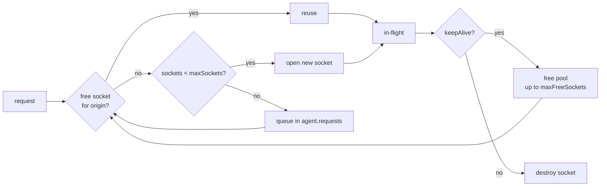

# Chapter 36 — HTTP/1.1 Clients, Agents, and Keep-Alive

**What you will learn**

- The three ways to make an HTTP request from Node today, and how to choose between them on purpose.
- `http.request()` end to end: options, request bodies, response streams, and the two mistakes that leak sockets.
- What an `Agent` actually pools, every sizing knob, and how a misconfigured pool becomes an incident.
- What `fetch` is built on in Node, what it gives you that `http.request()` does not, and where it still falls short.
- Retries that are safe: which requests may be retried, and exponential backoff with jitter.
- Which timeout covers which phase of a request, and how to build a total-deadline client.
- How Node handles proxies and custom CAs now that both are built in.

## Why this matters

A service that calls other services is the normal case. Your handler talks to an auth service, a database proxy, a payment gateway, and three internal APIs. Each of those calls is a place where the remote end can be slow, flaky, or gone — and the way your client is configured determines whether that turns into a graceful 503 or a cascading outage that takes down everything upstream of you.

The failure modes here are specific and repeatable. A pool sized `Infinity` turns a slow dependency into ten thousand open sockets and `EMFILE`. A pool sized `5` turns the same slow dependency into a request queue with no bound and infinite latency. A response body you never read pins a socket forever. A retry on a non-idempotent request charges a customer twice. None of these are exotic; all of them are one config line away. This chapter is about the config lines.

## Three clients, one decision

| | `http.request()` / `https.request()` | `fetch` (global) | `undici` (npm) |
|---|---|---|---|
| Availability | Always, since v0.1 | Global since v18, stable since v21 | `npm install undici` |
| Style | Events + Node streams | Promises + Web Streams | Promises, several APIs |
| Underlying stack | Node's own client | undici, bundled | undici |
| Redirects | Never followed | Followed automatically | Opt-in per dispatcher |
| Body decompression | Manual (`zlib`) | Automatic | Automatic |
| Connection pooling | `http.Agent` | undici `Pool`, not an `Agent` | undici `Pool`/`Agent` |
| Per-phase timeouts | Socket idle only | One `AbortSignal` for the whole call | Connect / headers / body, separately |
| Unix sockets | `socketPath` | No | Yes |
| Streaming upload | Yes, write to the request | Yes, but no built-in backpressure signal | Yes |
| Cancellation | `signal` option or `destroy()` | `AbortSignal` | `AbortSignal` |

The guidance is short:

- **Use `fetch`** for ordinary outbound JSON calls. It is built in, it handles redirects and gzip, and its cancellation story is the cleanest.
- **Use `http.request()`** when you need something `fetch` does not expose: a Unix domain socket, a custom `Agent`, `lookup`, raw header order, per-request TLS options, or the `'upgrade'` / `'connect'` events. Proxying and gateway code lives here.
- **Use `undici` directly** when you need per-phase timeouts, HTTP pipelining control, or its interceptor/retry machinery. Since `fetch` is undici anyway, adding the package costs you nothing at runtime you were not already paying.

Note that `process.versions.undici` tells you which undici version your Node build bundles — useful when you match behaviour against undici's changelog.

## `http.request()` and `http.get()`

```mjs
import { request } from 'node:https';

const req = request('https://api.example.com/v1/users', {
  method: 'POST',
  headers: { 'content-type': 'application/json' },
}, (res) => {
  console.log(res.statusCode, res.headers['content-type']);
  res.setEncoding('utf8');
  let body = '';
  res.on('data', (chunk) => { body += chunk; });
  res.on('end', () => console.log(JSON.parse(body)));
});

req.on('error', (err) => console.error('request failed', err));
req.end(JSON.stringify({ name: 'ada' }));
```

Three things to notice. The first argument may be a string, a `URL`, or an options object; if you pass both a URL and options, the options win. The callback is a one-time `'response'` listener. And `req.end()` is mandatory — even with no body, the request is not sent until you call it.

`http.get()` is `http.request()` with `method: 'GET'` and `req.end()` already called. Use it for reads; it is the same object underneath.

Options worth knowing:

| Option | Meaning |
|---|---|
| `agent` | `Agent` instance, or `false` for a fresh one-shot agent |
| `signal` | `AbortSignal`; aborting behaves like `req.destroy()` |
| `timeout` | Socket idle timeout, applied before connect |
| `socketPath` | Unix domain socket; mutually exclusive with `host`/`port` |
| `lookup` | Custom DNS resolver (Chapter 34) |
| `family`, `hints` | Address family selection for `dns.lookup()` |
| `headers` | Object, or a flat array in `rawHeaders` form |
| `setHost` / `setDefaultHeaders` | Suppress the automatic `Host` (and other) headers |
| `localAddress`, `localPort` | Bind the outgoing socket |
| `maxHeaderSize` | Cap on *response* header bytes; defaults to 16 KiB |
| `joinDuplicateHeaders` | Join duplicate response headers with `, ` |
| `insecureHTTPParser` | Do not. See Chapter 35 |

### Writing a body

`ClientRequest` is a `Writable`, so you can stream into it. Set `content-length` if you know it; otherwise Node uses chunked encoding.

```mjs
import { pipeline } from 'node:stream/promises';
import { createReadStream } from 'node:fs';
import { request } from 'node:http';

const req = request('http://upload.internal/files', { method: 'PUT' });
await pipeline(createReadStream('./big.bin'), req);
```

`pipeline()` calls `req.end()` for you and destroys the request if the source fails.

### The two classic mistakes

**Not consuming the response.** If you attach a `'response'` handler and then do nothing with the body, the socket is never released back to the agent and the response data accumulates in memory. The docs are explicit: until the body is consumed, `'end'` never fires and the buffered data can grow until the process runs out of memory. With a keep-alive agent, that socket stays checked out forever, and once `maxSockets` of them are stuck, every subsequent request to that host queues indefinitely — a hang with no error and no log line.

```js
// ❌ Only wanted the status code. Socket is now stuck.
http.get(url, (res) => console.log(res.statusCode));

// ✅ Drain it.
http.get(url, (res) => {
  console.log(res.statusCode);
  res.resume();
});
```

`res.resume()` puts the stream in flowing mode and discards the data. It costs one line and it is the difference between a client that works and one that dies after `maxSockets` requests.

**No `'error'` listener.** `ClientRequest` emits `'error'` for DNS failures, connection refusals, TLS errors, socket resets, and parse errors. An `'error'` event with no listener throws. In an async handler that means an uncaught exception that terminates the process. Always attach one.

Note the asymmetry: for backwards compatibility, the *response* object only emits `'error'` if you have registered a listener for it. The request object is not so forgiving.

### Event order, briefly

Success is `'socket'` → `'response'` (then `'data'`* and `'end'` on `res`) → `'close'`. A connection failure is `'socket'` → `'error'` → `'close'`. A connection that dies before the response gives you `'error'` with `ECONNRESET` and the message `socket hang up`; one that dies mid-body gives you `'aborted'` on `res`, then an `'error'` on `res` with message `aborted` and code `ECONNRESET`. Aborting via `AbortSignal` produces an error with name `AbortError`, code `ABORT_ERR`, and your `reason` in `cause`.

## `http.Agent` in depth

An `Agent` is a connection pool keyed by origin. When a request needs a socket, the agent hands it a free one for that origin if it has one, opens a new one if it is under `maxSockets`, and otherwise queues the request until a socket frees up.



### Constructor options

| Option | Default | Notes |
|---|---|---|
| `keepAlive` | `false` | On a *manually constructed* agent. The global agents override this |
| `keepAliveMsecs` | `1000` | TCP keep-alive probe delay, not the HTTP idle timeout |
| `agentKeepAliveTimeoutBuffer` | `1000` | Subtracted from the server's `keep-alive: timeout=` hint (v24.7.0/v22.20.0) |
| `maxSockets` | `Infinity` | Concurrent sockets **per origin** |
| `maxTotalSockets` | `Infinity` | Concurrent sockets across all origins |
| `maxFreeSockets` | `256` | Idle sockets kept per origin; only with `keepAlive` |
| `scheduling` | `'lifo'` | `'lifo'` or `'fifo'` free-socket selection |
| `timeout` | — | Socket timeout, set at socket creation |
| `proxyEnv` | `undefined` | Proxy configuration; see below |
| `defaultPort` | `80` | `443` for `https.Agent` |
| `protocol` | `'http:'` | `'https:'` for `https.Agent` |
| `maxCachedSessions` *(https only)* | `100` | TLS session cache size; `0` disables |
| `servername` *(https only)* | target hostname | SNI value; `''` disables the extension |

`new Agent()` defaults `keepAlive` to `false`, but **`http.globalAgent` and `https.globalAgent` do not** — since v19.0.0 they are constructed with `keepAlive` enabled and a `timeout` of 5 seconds. So if you never touch agents at all, you get connection reuse. The moment you write `new http.Agent({ maxSockets: 50 })` to tune the pool, you silently *turn keep-alive off* unless you also pass `keepAlive: true`. This is the single most common agent bug.

```js
// ❌ Tuned the pool, lost connection reuse. Every request now pays a TCP+TLS handshake.
const agent = new https.Agent({ maxSockets: 50 });

// ✅
const agent = new https.Agent({ keepAlive: true, maxSockets: 50 });
```

Also note `keepAliveMsecs` is not what its name suggests to most people: it is the TCP-level keep-alive probe interval, not "how long an idle HTTP connection is kept". Idle HTTP connections are dropped when the *server* closes them or when `agent.destroy()` runs.

### `scheduling`

`'lifo'` (the default since v15.6.0/v14.17.0) picks the most recently used free socket. At low request rates that matters, because the socket you used a second ago is much less likely to have been closed by the server's idle timeout than the one you used a minute ago. `'fifo'` spreads load across sockets, which keeps more of them warm at high rates. Change it only if you have measured `ECONNRESET` churn at low traffic ('lifo' helps) or uneven socket lifetimes at high traffic.

### Sizing the pool

This is where production incidents come from.

**`maxSockets: Infinity`** — the default on a hand-built agent — means a slow dependency produces unbounded concurrency. Two thousand in-flight requests to a service that has started taking 30 seconds means two thousand sockets, two thousand pending TLS contexts, and eventually `EMFILE: too many open files` on a limit you did not know you had. Because the sockets are all "working", nothing looks queued; your metrics show high latency and healthy throughput right up until the process falls over.

**`maxSockets` too low** is the mirror image. Requests beyond the limit sit in `agent.requests` — an unbounded queue with no timeout of its own. `request.setTimeout()` does not help, because that timeout only starts once a socket is assigned. Your p99 climbs to numbers that look impossible until you realise you are measuring queue time.

Practical shape for a service calling an internal dependency:

```mjs
import { Agent } from 'node:https';

export const apiAgent = new Agent({
  keepAlive: true,
  keepAliveMsecs: 30_000,
  maxSockets: 64,        // per origin: bound concurrency, not zero it
  maxFreeSockets: 16,    // keep a warm pool, don't hoard
  maxTotalSockets: 256,  // hard ceiling across all origins
  timeout: 30_000,       // socket idle timeout
  scheduling: 'lifo',
});
```

Pick `maxSockets` from Little's law, not superstition: at a target throughput of *R* requests per second and a p99 latency of *L* seconds, you need roughly *R × L* concurrent sockets. 200 rps against a 100 ms dependency is 20; give yourself headroom and set 64. Then **monitor the queue**:

```js
setInterval(() => {
  for (const origin of Object.keys(apiAgent.requests)) {
    const queued = apiAgent.requests[origin].length;
    const active = apiAgent.sockets[origin]?.length ?? 0;
    const free = apiAgent.freeSockets[origin]?.length ?? 0;
    metrics.gauge('http.pool', { origin, queued, active, free });
  }
}, 10_000).unref();
```

A non-zero `queued` that does not return to zero is your early warning. Read those three objects; never mutate them.

Finally, `agent.destroy()` closes all pooled sockets. Call it when you retire an agent — otherwise idle sockets keep file descriptors alive. Pooled sockets are `unref`'d, so they will not by themselves keep the process running.

### Response ordering on a reused connection

On a keep-alive connection, responses are matched to requests purely by order. HTTP/1.1 gives no request ID. That is fine in practice, but it means a buggy or hostile server can desynchronise a connection and hand your request B the answer to request A. If you need per-request isolation — for example when multiplexing different tenants' credentials over one client — use a separate `Agent` per tenant, or `agent: false`.

## `fetch` in Node

`fetch` has been a stable global since v21 (unflagged since v18). It is implemented by **undici**, a from-scratch HTTP/1.1 client, and does *not* use `http.Agent` at all. Setting `http.globalAgent` has no effect on `fetch`.

```mjs
const res = await fetch('https://api.example.com/v1/users/42', {
  headers: { accept: 'application/json' },
  signal: AbortSignal.timeout(5_000),
});

if (!res.ok) throw new Error(`HTTP ${res.status}`);
const user = await res.json();
```

Three habits to build:

**`res.ok` is not automatic.** `fetch` rejects only on network-level failures. A `500` resolves normally, and `await res.json()` on an HTML error page throws a confusing `SyntaxError`. Check `res.ok` or `res.status` before parsing, every time.

**Always consume or cancel the body.** Same rule as `http.request()`, different API. If you check the status and return without reading the body, you leak the connection. Use `await res.body?.cancel()` (or read it) on the paths where you do not want the content.

**Timeouts are `AbortSignal`s.** There is no `timeout` option. `AbortSignal.timeout(ms)` (v17.3.0/v16.14.0) is the idiom, and `AbortSignal.any([...])` (v20.3.0/v18.17.0) composes a deadline with a caller-supplied cancellation:

```js
const signal = AbortSignal.any([
  AbortSignal.timeout(5_000),
  req.signal,                    // the inbound request from Chapter 35
]);
const res = await fetch(url, { signal });
```

Crucially, the signal covers the whole exchange *including reading the body* only if you keep using it — aborting mid-`res.text()` works because the body stream is tied to the same signal.

### Streaming with `fetch`

`res.body` is a Web `ReadableStream` (Chapter 20). To move it into Node land:

```mjs
import { Readable } from 'node:stream';
import { pipeline } from 'node:stream/promises';
import { createWriteStream } from 'node:fs';

const res = await fetch(url);
if (!res.ok) throw new Error(`HTTP ${res.status}`);
await pipeline(Readable.fromWeb(res.body), createWriteStream('out.bin'));
```

Request bodies may be a string, `Buffer`, `URLSearchParams`, `FormData`, `Blob`, or a `ReadableStream`. Streaming *uploads* require `duplex: 'half'` in the options and are the least mature part of the API; for large uploads over HTTP/1.1, `http.request()` is still the more predictable choice.

### Known gaps versus `http.request()`

- No Unix domain sockets, no `lookup` hook, no `localAddress`.
- No `http.Agent`; connection pooling is configured through a `dispatcher` (undici's `Agent`/`Pool`), passed per call as `fetch(url, { dispatcher })` or globally via undici's `setGlobalDispatcher()`.
- No per-phase timeouts. One signal covers everything.
- Redirects are followed automatically (up to 20) with no per-hop hook; `redirect: 'manual'` or `'error'` are your only controls, and `res.redirected` tells you afterwards.
- No access to the socket, so no `'upgrade'`, no `CONNECT`, no raw header order.
- Header names are normalised and some request headers are forbidden, per the Fetch spec.

## Retries without regret

Retries convert transient failures into success and permanent failures into an outage you caused. Three rules.

**Rule 1: only retry idempotent operations.** `GET`, `HEAD`, `PUT`, `DELETE`, and `OPTIONS` are idempotent by definition. `POST` and `PATCH` are not. A `POST /charges` that times out may well have succeeded — the response was lost, not the effect. Retrying it charges the card twice. Make `POST` retryable by making it idempotent: have the caller generate a key and send it (`Idempotency-Key: <uuid>`), and have the server deduplicate on it.

**Rule 2: only retry the right failures.** Connection errors before the request was written (`ECONNREFUSED`, `EAI_AGAIN`, `ETIMEDOUT` on connect) are always safe — nothing happened. `ECONNRESET` on a reused keep-alive socket is the common benign case: the server closed the idle connection at the same moment you sent on it, and the request was never processed. `429` and `503` should be retried, honouring `Retry-After`. `500` is a maybe. `4xx` other than `408`/`429` must never be retried; the request was wrong and will be wrong again.

**Rule 3: back off exponentially, with jitter.** Without jitter, every client that failed at the same moment retries at the same moment, and you have built a distributed denial-of-service against your own dependency. Full jitter — a random delay anywhere in `[0, base × 2^attempt]` — is the standard fix.

```js
const delay = Math.random() * Math.min(maxDelay, baseDelay * 2 ** attempt);
```

Also bound total attempts *and* total elapsed time. Three attempts with a 30-second per-attempt timeout is a 90-second worst case, which is usually far longer than the caller waiting on you is willing to wait.

## Timeouts, layer by layer

There is no single "request timeout" in Node's core client. Each phase needs its own answer.

| Phase | What can hang | `http.request()` | `fetch` |
|---|---|---|---|
| DNS | Resolver unreachable | `lookup` with its own timeout | none |
| Agent queue | `maxSockets` exhausted | none — bound `maxSockets` instead | dispatcher `connections` |
| Connect | SYN blackholed | `timeout` option (set before connect) | `signal` |
| TLS handshake | Server never completes | same socket `timeout` | `signal` |
| Response headers | Server accepted, thinking | socket idle `timeout` | `signal` |
| Response body | Slow trickle, never ends | socket idle `timeout` | `signal` |
| **Total** | any of the above | `AbortSignal.timeout()` | `AbortSignal.timeout()` |

Two traps. `request.setTimeout()` and the `timeout` option are **idle** timeouts, not deadlines: a server that sends one byte every four seconds never triggers a five-second idle timeout, and the request runs forever. And the `'timeout'` event does *not* abort anything — the docs say so plainly. You must destroy the request yourself:

```js
req.setTimeout(10_000, () => req.destroy(new Error('ETIMEDOUT')));
```

The one timeout that always means what you want is a total deadline via `AbortSignal.timeout()`, passed as the `signal` option. Set it on every outbound call, and set it shorter than your own inbound `requestTimeout` so you can return a sensible error instead of being killed by your own server.

## Proxies and custom CAs

This changed recently, and most advice online is out of date. **Node now honours proxy environment variables — but only when you opt in.**

Built-in proxy support (Stability 1.1, added v24.5.0/v22.21.0) reads `HTTP_PROXY`/`http_proxy`, `HTTPS_PROXY`/`https_proxy`, and `NO_PROXY`/`no_proxy` (the lowercase form wins when both are set). Enable it three ways:

```bash
NODE_USE_ENV_PROXY=1 HTTP_PROXY=http://proxy.internal:8080 node app.js
node --use-env-proxy app.js          # takes precedence if both are set
```

```js
import http from 'node:http';
const restore = http.setGlobalProxyFromEnv();  // v25.4.0/v24.14.0
```

`http.setGlobalProxyFromEnv([proxyEnv])` reconfigures the global agents *and* undici's global dispatcher at runtime, so it covers both `http.request()` and `fetch`. It returns a function that restores the previous settings. Call it before you make any requests — it replaces `http.globalAgent`, `https.globalAgent`, and the undici dispatcher wholesale.

For a single client, pass `proxyEnv` to the agent instead of changing globals:

```js
const agent = new https.Agent({
  keepAlive: true,
  proxyEnv: { HTTPS_PROXY: 'http://proxy.internal:8080', NO_PROXY: '.internal,localhost' },
});
```

`NO_PROXY` accepts `*`, exact hostnames, `.example.com` suffixes, `*.example.com` wildcards, exact IPs, IP ranges (`10.0.0.1-10.0.0.255`), and `host:port` entries, comma-separated. Requests to Unix domain sockets ignore proxy settings entirely.

Be clear-eyed about what a proxy is: a trusted intermediary, not a privacy boundary. It sees connection metadata always, and full request and response contents whenever TLS is terminated at it.

**Custom CAs.** If your proxy or internal services use a private CA, add it with `NODE_EXTRA_CA_CERTS=/path/to/ca.pem`, which extends the bundled Mozilla root store. Two footguns: it is read only at process start (mutating `process.env` later does nothing), and it is ignored entirely when you pass an explicit `ca` option to a TLS or HTTPS client. It is also ignored when Node runs setuid root or with Linux file capabilities. Since v23.8.0, `--use-system-ca` makes Node trust the OS certificate store as well; `--use-openssl-ca` uses OpenSSL's store (configurable with `SSL_CERT_FILE`/`SSL_CERT_DIR`), and `--use-bundled-ca` forces Node's own snapshot. Chapter 37 covers the trust model in depth.

## Connection reuse and DNS staleness

Keep-alive is a caching layer, and like all caches it can serve stale results. An agent that holds a socket to `10.0.1.7` keeps using it long after DNS moved `api.internal` to `10.0.2.9`. During a blue/green deploy or a failover, your traffic keeps arriving at the old instance until the socket dies — which, with a 65-second server keep-alive timeout, can be a long minute of errors after everyone else has cut over.

Mitigations, in order of preference: bound socket lifetime with the agent's `timeout` so sockets are recycled regularly; keep `maxFreeSockets` modest so idle sockets are not hoarded; and use a `lookup` implementation that respects DNS TTLs if your infrastructure relies on DNS-based failover. Chapter 34 covers `dns.lookup()` versus `dns.resolve()` and why Node's default resolution path caches nothing itself but sits on top of an OS resolver that does.

## A small resilient client

Everything above, in one wrapper worth about forty lines:

```mjs
import { setTimeout as sleep } from 'node:timers/promises';

const IDEMPOTENT = new Set(['GET', 'HEAD', 'PUT', 'DELETE', 'OPTIONS']);
const RETRY_STATUS = new Set([408, 429, 500, 502, 503, 504]);
const RETRY_CODES = new Set(['ECONNRESET', 'ECONNREFUSED', 'ETIMEDOUT', 'EAI_AGAIN', 'EPIPE']);

export async function call(url, {
  method = 'GET',
  body,
  headers = {},
  attempts = 3,
  perAttemptMs = 5_000,
  totalMs = 20_000,
  signal: outer,
} = {}) {
  const deadline = AbortSignal.timeout(totalMs);
  const retryable = IDEMPOTENT.has(method) || headers['idempotency-key'] !== undefined;

  let lastError;
  for (let attempt = 0; attempt < attempts; attempt++) {
    const signals = [deadline, AbortSignal.timeout(perAttemptMs)];
    if (outer) signals.push(outer);

    try {
      const res = await fetch(url, { method, body, headers, signal: AbortSignal.any(signals) });
      if (res.ok || !RETRY_STATUS.has(res.status) || !retryable) return res;

      await res.body?.cancel();                       // free the connection
      lastError = new Error(`HTTP ${res.status}`);
      const after = Number(res.headers.get('retry-after'));
      if (Number.isFinite(after)) {
        await sleep(after * 1000, undefined, { signal: deadline });
        continue;
      }
    } catch (err) {
      if (deadline.aborted || outer?.aborted) throw err;
      if (!retryable || !RETRY_CODES.has(err.cause?.code ?? err.code)) throw err;
      lastError = err;
    }

    if (attempt < attempts - 1) {
      const backoff = Math.random() * Math.min(2_000, 100 * 2 ** attempt);
      await sleep(backoff, undefined, { signal: deadline });
    }
  }
  throw lastError;
}
```

The design choices that matter: a total deadline that survives across attempts, a per-attempt deadline composed with `AbortSignal.any()`, an explicit idempotency check before any retry, body cancellation on the discard path, `Retry-After` respected when the server sends it, and full jitter on the backoff. Note that `fetch` wraps network errors, so the underlying code is usually on `err.cause`, not `err`.

## Common mistakes

### ❌ Building an agent and forgetting `keepAlive`

```js
const agent = new https.Agent({ maxSockets: 100 });
```

`new Agent()` defaults `keepAlive` to `false`; only the *global* agents enable it. You have replaced a pooling agent with a non-pooling one, and every request now pays a full TCP and TLS handshake. On a TLS connection over a 30 ms link that is roughly 90 ms of pure latency added to every call.

✅

```js
const agent = new https.Agent({ keepAlive: true, maxSockets: 100, maxFreeSockets: 16 });
```

### ❌ Not consuming a response body

```js
const res = await fetch(url);
if (!res.ok) throw new Error(`HTTP ${res.status}`);
return 'ok';   // body never read
```

The connection stays checked out. After enough of these the pool is exhausted and every subsequent call hangs with no error.

✅

```js
const res = await fetch(url);
if (!res.ok) {
  await res.body?.cancel();
  throw new Error(`HTTP ${res.status}`);
}
return 'ok';
```

The `http.request()` equivalent is `res.resume()`.

### ❌ Treating a `timeout` as a deadline

```js
const req = http.request(url, { timeout: 5_000 }, handle);
req.end();
```

`timeout` is a socket *idle* timeout, and the `'timeout'` event does not abort anything. A trickling server keeps the request alive indefinitely, and even a truly dead socket only fires an event you are ignoring.

✅

```js
const req = http.request(url, { signal: AbortSignal.timeout(5_000) }, handle);
req.on('error', onError);
req.end();
```

### ❌ Retrying a `POST` on timeout

```js
for (let i = 0; i < 3; i++) {
  try { return await fetch(url, { method: 'POST', body }); } catch {}
}
```

A timeout does not tell you the request was not processed. This creates duplicate orders, duplicate charges, duplicate emails.

✅ Send an idempotency key and let the server deduplicate:

```js
const key = crypto.randomUUID();
// retry loop, same key every attempt
await fetch(url, { method: 'POST', body, headers: { 'idempotency-key': key } });
```

### ❌ Expecting `fetch` to reject on a `500`

```js
const data = await (await fetch(url)).json();   // SyntaxError on an HTML error page
```

`fetch` rejects only on network failures. HTTP error statuses resolve normally.

✅ Check `res.ok` first, and include the status in the error you throw.

## Production notes

- **One agent (or dispatcher) per dependency, created once at module load.** Creating an agent per request defeats pooling completely and is a classic accidental regression. Export the agents from a module and reuse them.
- **Bound every pool and export its depth as a metric.** `agent.requests`, `agent.sockets`, and `agent.freeSockets` are the three numbers that tell you whether latency is server-side or queue-side. Without them, a saturated pool is indistinguishable from a slow dependency.
- **Your outbound deadline must be shorter than your inbound one.** If your server's `requestTimeout` is 120 s and your downstream call has no deadline, the client sees a 408 from your own server and you never log a useful cause. Budget the time explicitly, and pass the remaining budget down.
- **Expect `ECONNRESET` on keep-alive connections and handle it as retryable.** The race between a server closing an idle socket and a client sending on it is unavoidable in HTTP/1.1; `agentKeepAliveTimeoutBuffer` narrows it but does not eliminate it. `request.reusedSocket` tells you whether the failed request went out on a reused socket, which is exactly the signal that makes an automatic single retry safe.
- **Set `maxHeaderSize` deliberately when calling third parties.** Response headers over 16 KiB abort the parse with `HPE_HEADER_OVERFLOW` and look like a mysterious connection error.
- **`fetch` and `http.request()` are configured separately.** Proxy settings applied via `http.setGlobalProxyFromEnv()` cover both; an `http.globalAgent` change covers only the latter. Know which stack each of your dependencies uses.
- **Do not put secrets in the URL.** Query strings end up in proxy logs, access logs, and `Referer` headers. Use headers.

## Exercises

1. **Prove keep-alive works.** Make ten sequential requests to the same origin with `agent: false` and again with a `keepAlive: true` agent, logging `req.reusedSocket` and the wall-clock time for each. Success: the second run reuses sockets from request two onward and is measurably faster, and you can state the per-request saving.

2. **Starve the pool.** Point an agent with `maxSockets: 2` at a server whose handler sleeps five seconds. Fire ten requests at once and log `agent.requests[origin].length` every 500 ms. Success: you can show queue depth rising and falling, and you can explain why a `timeout` option on the request does not fire for the queued ones.

3. **Leak a socket on purpose.** With a `keepAlive` agent limited to `maxSockets: 1`, make a request whose response body you never consume, then make a second request. Success: the second request hangs, you can identify the stuck socket via `agent.sockets`, and adding `res.resume()` fixes it.

4. **Total-deadline `fetch`.** Write `fetchWithDeadline(url, ms)` that aborts at `ms` regardless of how the time is spent — connect, headers, or a slow body. Test it against a server that sends one byte per second forever. Success: the call rejects at the deadline with an `AbortError` and the socket is closed.

5. **Retry policy under test.** Build a test server that fails the first two attempts with `503` and a `Retry-After: 1`, then succeeds. Run the `call()` wrapper against it. Success: exactly three attempts, honouring `Retry-After` on the first backoff and jittered exponential backoff thereafter, with the whole sequence aborting cleanly if the total deadline expires first.

## Recap

- `http.request()`, `fetch`, and `undici` solve overlapping problems; pick `fetch` by default and `http.request()` when you need sockets, agents, or Unix paths.
- Always consume or cancel a response body, and always attach an `'error'` listener to a `ClientRequest`.
- `new Agent()` has `keepAlive: false`; only `http.globalAgent` and `https.globalAgent` enable it, with a 5-second timeout.
- `maxSockets: Infinity` fails as file-descriptor exhaustion; too small a value fails as an unbounded, invisible queue. Size it with Little's law and monitor `agent.requests`.
- `fetch` is undici, ignores `http.Agent`, follows redirects, decompresses automatically, and resolves on HTTP errors — check `res.ok`.
- The `timeout` option and `'timeout'` event are idle notifications that abort nothing; use `AbortSignal.timeout()` for a real deadline and `AbortSignal.any()` to compose.
- Retry only idempotent requests and safe failures, with full jitter, a bounded attempt count, and a bounded total time.
- Node honours `HTTP_PROXY`/`HTTPS_PROXY`/`NO_PROXY` when enabled with `NODE_USE_ENV_PROXY=1`, `--use-env-proxy`, `http.setGlobalProxyFromEnv()`, or an agent's `proxyEnv`.
- `NODE_EXTRA_CA_CERTS` is read once at startup and ignored when an explicit `ca` option is present.

## Where to go next

- [Chapter 35 — HTTP/1.1 Servers](35-http-servers.md) — the other end, and the timeouts you must align with.
- [Chapter 37 — TLS and HTTPS](37-tls-https.md) — certificates, SNI, session resumption, and the trust store.
- [Chapter 38 — HTTP/2](38-http2.md) — one connection, many streams, no head-of-line blocking at the HTTP layer.
- [Chapter 34 — DNS Resolution](34-dns.md) — why a pooled connection can outlive the address it was opened to.
- [Chapter 13 — AbortController, Signals, and Cancellation](../part2-async/13-abort-and-cancellation.md) — the cancellation primitives this chapter leans on.
- [Chapter 20 — Web Streams API and Interop](../part3-data/20-web-streams.md) — for `res.body` and `Readable.fromWeb()`.
- Official documentation: <https://nodejs.org/docs/latest/api/http.html>
