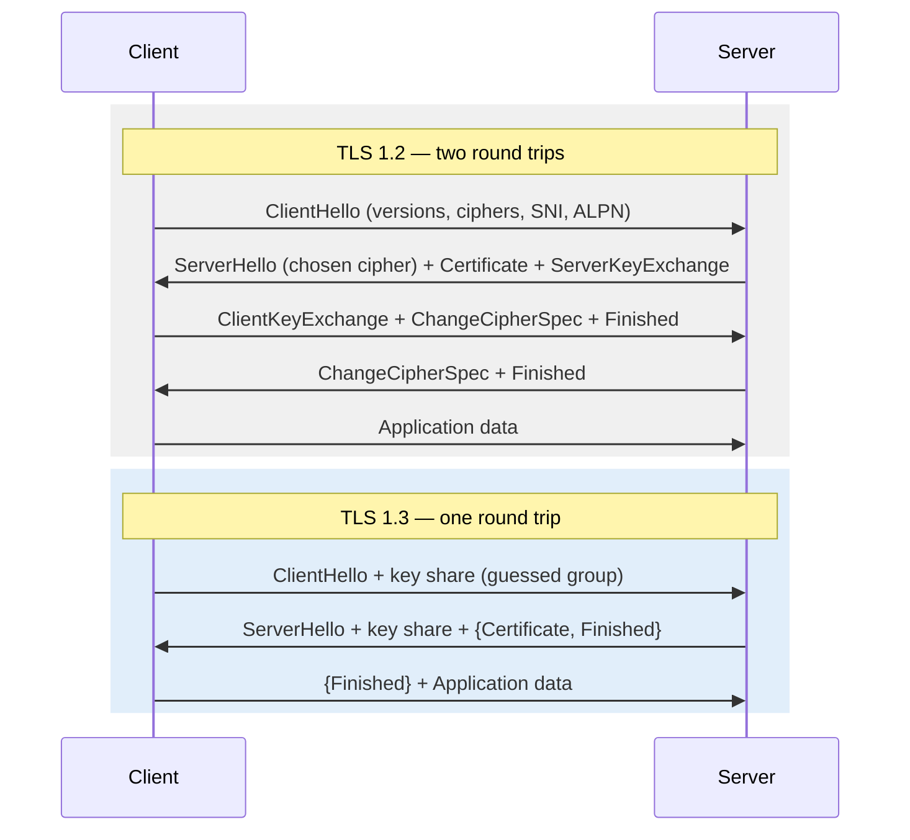

# Chapter 37 — TLS and HTTPS

**What you will learn**

- What actually happens in a TLS 1.2 and a TLS 1.3 handshake, and why 1.3 is a round trip cheaper.
- How certificate chains work, why `cert` must be ordered leaf-first, and why CN is dead and SAN is what matters.
- `https.createServer()`, `tls.createServer()`, `tls.connect()`, and the `TLSSocket` you get from all three.
- SNI, ALPN, and the one-line client omission that breaks against most CDNs.
- Session resumption, ticket keys, and how to share them across a cluster without breaking resumption.
- mTLS done correctly: `requestCert`, `rejectUnauthorized`, and where the real verification has to happen.
- Which secure-context knobs to set in production, which to leave alone, and what the defaults already are.
- How to read `UNABLE_TO_VERIFY_LEAF_SIGNATURE`, `DEPTH_ZERO_SELF_SIGNED_CERT`, and `ERR_TLS_CERT_ALTNAME_INVALID`.

## Why this matters

TLS is the layer people configure once, copy from a blog post, and never look at again — right up to the morning a certificate expires, an intermediate is missing, or a client somewhere starts failing with an error code nobody recognises. It is also the layer where a single character (`rejectUnauthorized: false`) converts an encrypted connection into an encrypted connection with an attacker in the middle, silently, with no error and no log line.

The good news is that the concepts are small: a handshake that agrees on keys, a chain of signatures that proves identity, and a name check that ties the identity to the host you meant to reach. Node exposes all three faithfully. Once you can name which of the three is failing, every TLS error becomes tractable.

## What TLS gives you

Three properties, and it is worth keeping them separate:

- **Confidentiality** — nobody on the path can read the bytes.
- **Integrity** — nobody on the path can change the bytes undetected.
- **Authentication** — the peer is who it claims to be.

Encryption alone gives you the first two against a passive eavesdropper. Only authentication protects you against an active attacker, and authentication is the part you can accidentally switch off. That is the whole reason certificate verification exists, and the whole reason `rejectUnauthorized: false` is so dangerous: it keeps the encryption and throws away the only property that makes encryption meaningful.

## The handshake



In **TLS 1.2** the client speaks, the server answers with its certificate and key-exchange parameters, the client replies with its own, and only then can data flow: two full round trips before the first byte of your HTTP request. On a 60 ms link that is 120 ms of latency, on top of the TCP handshake's 60 ms.

In **TLS 1.3** the client guesses which key-agreement group the server will pick and sends its key share in the very first message. If it guessed right — and it almost always does, because there are only a couple of sensible answers — the server can derive the shared secret immediately and send its certificate *encrypted* in the same flight. One round trip, and the certificate is no longer visible to observers.

Two other 1.3 changes matter to you operationally. Forward secrecy is mandatory: every session uses ephemeral (EC)DHE keys, so stealing the server's private key later does not decrypt captured traffic. And renegotiation is gone entirely, which removes a denial-of-service vector. (In TLS 1.2 Node limits client-initiated renegotiation to `tls.CLIENT_RENEG_LIMIT` — 3 — per `tls.CLIENT_RENEG_WINDOW` — 600 seconds. Do not raise these.)

Node's defaults: `tls.DEFAULT_MIN_VERSION` is `'TLSv1.2'` and `tls.DEFAULT_MAX_VERSION` is `'TLSv1.3'`. That is the right range. Do not lower the minimum without an interop reason you can write down.

## Certificates and chains

A certificate binds a public key to a name, signed by someone else's private key. The chain is the sequence of signatures from your server's certificate up to a root the client already trusts:

```
leaf (api.example.com)  ← signed by → intermediate CA  ← signed by → root CA
                                                            (in the client's trust store)
```

Roots are self-signed and pre-installed. Intermediates are not; CAs use them so the root's private key can stay offline. **The server must send the intermediates.** The client is not required to fetch them, and many clients will not.

This is what the `cert` option encodes, and the order is not negotiable: the leaf certificate first, then each intermediate in order, and **not** the root. Get it wrong and you will see `UNABLE_TO_VERIFY_LEAF_SIGNATURE` from Node clients and inconsistent behaviour from browsers, which sometimes cache intermediates from other sites and appear to work.

```bash
cat leaf.pem intermediate.pem > fullchain.pem
```

### CN versus SAN

The old way to name a certificate's subject was the Common Name (`subject.CN`). It is dead. Modern verification — including Node's `tls.checkServerIdentity()` — uses the **subjectAltName** extension, which is a list of DNS names and/or IP addresses. A certificate whose CN says `api.example.com` but whose SAN list does not include it will fail with `ERR_TLS_CERT_ALTNAME_INVALID`. When you generate a CSR, put every name you will serve into the SAN list.

You can inspect what a peer actually sent:

```js
const cert = socket.getPeerCertificate();
cert.subject.CN;      // legacy, informational
cert.subjectaltname;  // 'DNS:api.example.com, DNS:*.api.example.com'
cert.valid_from;
cert.valid_to;
cert.fingerprint256;
cert.issuer.CN;
```

`getPeerCertificate(true)` walks the chain via `issuerCertificate` (circular for self-signed certificates, so do not blindly `JSON.stringify` it). For a modern object model, `socket.getPeerX509Certificate()` returns an `X509Certificate` (Chapter 42).

## An HTTPS server

`https.createServer()` accepts every option from `http.createServer()`, `tls.createServer()`, and `tls.createSecureContext()`. Everything you learned in Chapter 35 applies unchanged; `req.socket` is simply a `tls.TLSSocket`.

```mjs
import { createServer } from 'node:https';
import { readFileSync } from 'node:fs';

const server = createServer({
  key: readFileSync('/etc/tls/privkey.pem'),
  cert: readFileSync('/etc/tls/fullchain.pem'),   // leaf + intermediates
  minVersion: 'TLSv1.2',
  honorCipherOrder: true,
  handshakeTimeout: 10_000,
}, (req, res) => {
  res.writeHead(200, { 'content-type': 'text/plain' });
  res.end(`negotiated ${req.socket.getProtocol()}\n`);
});

server.listen(443);
```

Loading credentials safely is mostly discipline. Read them from a path given by configuration, never from the repository. Keep the private key mode `0600` and owned by the service user. Prefer a key with no passphrase plus filesystem permissions over a passphrase in an environment variable — a passphrase you have to ship next to the key protects nothing. If you must use PKCS#12, `pfx` plus `passphrase` replaces `key`/`cert`.

`handshakeTimeout` defaults to 120000 (two minutes), which is far too generous: a client that opens a socket and never completes the handshake holds a connection slot for two minutes. Ten seconds is plenty for real clients. When it fires, the server emits `'tlsClientError'`.

For a raw TLS server with no HTTP, `tls.createServer()` gives you a `'secureConnection'` event with a `TLSSocket` — a `Duplex` that behaves exactly like a `net.Socket` plus TLS metadata.

## SNI: `servername`

One IP address, one port, many hostnames, different certificates. The client tells the server which hostname it wants in the ClientHello, in plaintext, via the Server Name Indication extension. The server picks a certificate accordingly.

On the **server**, use `SNICallback` (or the simpler `server.addContext(hostname, context)`):

```mjs
import { createServer, createSecureContext } from 'node:tls';

const contexts = new Map([
  ['a.example.com', createSecureContext({ key: keyA, cert: certA })],
  ['b.example.com', createSecureContext({ key: keyB, cert: certB })],
]);

const server = createServer({
  key: defaultKey,
  cert: defaultCert,
  SNICallback(servername, callback) {
    callback(null, contexts.get(servername));   // falsy ctx → server default
  },
});
```

On the **client**, this is the gotcha worth remembering: **`tls.connect()` does not send SNI by default.** You must pass `servername` explicitly. Against a CDN or any shared-IP host, omitting it gets you the wrong certificate or a rejected connection — and the error you see (`ERR_TLS_CERT_ALTNAME_INVALID`) points at the certificate rather than at the missing extension.

```js
// ❌ No SNI. The server has no idea which host you want.
tls.connect({ host: 'api.example.com', port: 443 });

// ✅
tls.connect({ host: 'api.example.com', port: 443, servername: 'api.example.com' });
```

`https` and `fetch` set `servername` for you from the hostname — except when you connect to an IP address, where sending SNI is invalid and `https.Agent` correctly defaults to no extension. After the handshake, `socket.servername` is the name that was used, or `false` if SNI was not used at all.

## ALPN

ALPN negotiates the application protocol inside the handshake, which is how a client and server agree on HTTP/2 without an extra round trip.

```js
// Server: offer h2, fall back to HTTP/1.1
tls.createServer({ key, cert, ALPNProtocols: ['h2', 'http/1.1'] });

// Client
tls.connect({ host, port, servername: host, ALPNProtocols: ['h2', 'http/1.1'] });
```

After the handshake, `socket.alpnProtocol` holds the selected string. `ALPNCallback` is the dynamic alternative — it receives `{ servername, protocols }` and returns the chosen protocol or `undefined` to reject the connection with a fatal alert. It cannot be combined with `ALPNProtocols`; setting both throws. Combined with `tlsSocket.setKeyCert()` (v22.5.0/v20.17.0), `ALPNCallback` lets you choose the certificate based on the negotiated protocol. Chapter 38 uses ALPN to run HTTP/1.1 and HTTP/2 on one port.

## Session resumption

A full handshake costs a round trip and an asymmetric signature verification. Resumption skips most of that. Two mechanisms:

**Session identifiers** (old). The server keeps session state in memory and hands the client an ID. Reconnecting clients present the ID. In Node you implement `'newSession'` and `'resumeSession'` on the server to store and look up that state — and to make it work across processes or machines you need a shared cache such as Redis.

**Session tickets** (preferred). The server encrypts the whole session state with a ticket key and gives it to the client. Nothing is stored server-side. Reconnecting clients send the ticket back; if the server can decrypt it, the session resumes.

Tickets need one thing to work at scale: **every server that might receive the reconnection must hold the same ticket keys.** The keys are three 16-byte values exposed as a single 48-byte `Buffer`.

```mjs
import { createServer } from 'node:https';
import { randomBytes } from 'node:crypto';

const ticketKeys = await loadFromSecretStore();   // 48 bytes, shared across the fleet
const server = createServer({ key, cert, ticketKeys, sessionTimeout: 300 });

// Rotate on a schedule; existing connections keep the old keys.
setInterval(async () => {
  server.setTicketKeys(await loadFromSecretStore());
}, 6 * 60 * 60 * 1000).unref();
```

Within a single process no configuration is needed. Across `node:cluster` workers, Node shares `ticketKeys` automatically. Across *machines* it is on you: generate 48 bytes of secure random data, put it in your secret store, and have every instance read it.

Treat those bytes as the cryptographic keys they are. With TLS 1.2 and below, compromise of a ticket key lets an attacker decrypt every session resumed with it. Never write them to disk, and rotate them regularly — `server.setTicketKeys()` applies to future connections only, so rotation is non-disruptive. To disable tickets entirely, put `constants.SSL_OP_NO_TICKET` in `secureOptions`.

On the **client** side, resumption is opt-in: listen for `'session'`, keep the buffer, and pass it as the `session` option next time.

```js
socket.once('session', (session) => cache.set(host, session));
tls.connect({ host, port, servername: host, session: cache.get(host) });
```

Use the `'session'` event rather than `getSession()`: with TLS 1.3, tickets arrive *after* the handshake completes and there may be several. `socket.isSessionReused()` tells you whether it worked. `https.Agent` does this for you with a cache of `maxCachedSessions` (default 100).

Resumption failing never breaks a connection — it just silently costs you a full handshake. That is exactly why it goes unnoticed. Verify it with `openssl s_client -connect host:443 -reconnect` and look for `Reused` on the later connections.

## Client certificates and mTLS

Mutual TLS means the client presents a certificate too. Two server options control it, and the interaction is easy to get wrong:

| `requestCert` | `rejectUnauthorized` | Result |
|---|---|---|
| `false` (default) | any | No client certificate is requested |
| `true` | `true` (default) | Certificate required and must chain to `ca`; otherwise the handshake fails |
| `true` | `false` | Certificate optional; connection proceeds either way — **you must check** |

```mjs
const server = createServer({
  key, cert,
  requestCert: true,
  rejectUnauthorized: true,
  ca: [readFileSync('/etc/tls/client-ca.pem')],   // replaces the default roots
}, (req, res) => {
  const peer = req.socket.getPeerCertificate();
  if (!req.socket.authorized) {
    res.writeHead(401).end();
    return;
  }
  const clientId = peer.subject?.CN;
  // ... authorize on clientId
});
```

Three things to hold on to.

**`ca` replaces the default trust store, it does not extend it.** For an mTLS endpoint that is what you want: only your own client CA should be able to mint client identities. If you passed the public roots here, any certificate from any public CA would authenticate.

**`rejectUnauthorized: true` proves the certificate is valid; it does not tell you *who* the peer is.** Authentication and authorization are separate. Read `subject.CN`, a SAN, or a fingerprint from `getPeerCertificate()` and map it to an identity in your own system. Never treat "handshake succeeded" as "allowed to do anything".

**Check `socket.authorized`, always.** With `rejectUnauthorized: false` the handshake completes regardless and `socket.authorizationError` holds the reason. That combination is legitimate when you want to accept anonymous clients on some routes and identified ones on others — but it means the check moves into your code, where it is easy to forget.

## Verifying as a client

For an HTTPS client, correct verification is the default. `rejectUnauthorized` defaults to `true`, the bundled Mozilla roots are used, and `tls.checkServerIdentity()` matches the hostname against the SAN list. You get this for free by doing nothing.

`rejectUnauthorized: false` is the most dangerous line in Node. It disables chain verification *and* hostname verification. The connection is still encrypted — to whoever answered. Any router, proxy, or DNS spoofer on the path can present a self-signed certificate and read and rewrite everything. It appears in production code because it makes a local development error go away, and then it ships.

The correct fixes, in order of preference:

1. **Trust the right CA.** Pass the private CA in the `ca` option (which replaces the defaults — concatenate if you also need the public roots), or set `NODE_EXTRA_CA_CERTS`, or run with `--use-system-ca` if the certificate is in the OS store.
2. **Pin, if you must.** Keep verification on and *add* a check with a custom `checkServerIdentity`:

```js
import { checkServerIdentity } from 'node:tls';

const PINNED = 'AB:CD:...';   // SHA-256 fingerprint of the expected leaf

const options = {
  checkServerIdentity(hostname, cert) {
    const err = checkServerIdentity(hostname, cert);   // run the standard check first
    if (err) return err;
    if (cert.fingerprint256 !== PINNED) {
      return new Error(`certificate pin mismatch for ${hostname}`);
    }
  },
};
```

Two notes. `checkServerIdentity` is only called *after* the certificate has passed chain verification — it augments trust, it cannot replace it. And an `https.Agent` will not reuse connections or TLS sessions for requests carrying a per-request `checkServerIdentity` unless the same function was given to the agent at construction, so set it on the agent.

## Tuning the secure context

Node's defaults are good. This is the short list of what to touch:

| Option | Default | Advice |
|---|---|---|
| `minVersion` | `'TLSv1.2'` | Leave it. Set `'TLSv1.3'` only for internal traffic you control |
| `maxVersion` | `'TLSv1.3'` | Leave it |
| `ciphers` | `tls.DEFAULT_CIPHERS` | Leave it unless a compliance regime dictates otherwise |
| `honorCipherOrder` | `true` for `tls.createServer()` | Leave it on for servers |
| `ecdhCurve` | `'auto'` | Leave it; it also selects TLS 1.3 groups |
| `dhparam` | unset | Set `'auto'` only if you need DHE alongside ECDHE |
| `secureOptions` | unset | Only for specific `SSL_OP_*` flags such as `SSL_OP_NO_TICKET` |
| `secureProtocol` | unset | **Legacy.** Use `minVersion`/`maxVersion` instead |
| `sessionTimeout` | `300` seconds | Raise for long-lived internal clients |
| `certificateCompression` | `[]` | `['brotli']` shrinks TLS 1.3 handshakes (RFC 8879) |
| `allowPartialTrustChain` | `false` | Trust an intermediate directly; a niche need |

Do not hand-write a cipher list. `tls.DEFAULT_CIPHERS` (the value of `crypto.constants.defaultCoreCipherList`) already prefers AEAD suites with forward secrecy and excludes the broken ones. A list copied from a 2015 blog post will be worse, and will silently exclude the TLS 1.3 suites, which are named differently (`TLS_AES_256_GCM_SHA384` and friends).

## The root store

Node ships a snapshot of the Mozilla CA list, fixed at release time and identical on every platform. Four ways to change what is trusted:

| Mechanism | Scope | Notes |
|---|---|---|
| `ca` option | Per connection/context | **Replaces** the defaults entirely |
| `NODE_EXTRA_CA_CERTS=file` | Process | **Extends** the roots; read only at startup; ignored when `ca` is set |
| `--use-system-ca` | Process | Adds the OS trust store (v23.8.0; all platforms since v23.9.0) |
| `--use-openssl-ca` | Process | Uses OpenSSL's store instead; honours `SSL_CERT_FILE`/`SSL_CERT_DIR` |

Two runtime APIs are newer and useful. `tls.getCACertificates([type])` (v23.10.0/v22.15.0) returns the PEM list for `'default'`, `'system'`, `'bundled'`, or `'extra'` — invaluable for answering "what does this process actually trust?" in a container. And `tls.setDefaultCACertificates(certs)` (v24.5.0/v22.19.0) replaces the default list at runtime for the current thread:

```js
import tls from 'node:tls';
tls.setDefaultCACertificates(tls.getCACertificates('system'));
```

Call it before you make any TLS connections; sessions already cached by an `https.Agent` are unaffected. `tls.rootCertificates` remains the bundled list.

`NODE_EXTRA_CA_CERTS` has three sharp edges: it is read once at process start (changing `process.env` later does nothing), it is ignored entirely when an explicit `ca` option is present, and it is ignored when Node runs setuid root or with Linux file capabilities.

## OCSP stapling

Certificate revocation checks are slow and leak browsing data to the CA. Stapling fixes this: the *server* fetches a signed, time-stamped "this certificate is still valid" response from the CA and includes it in the handshake.

On the server, handle `'OCSPRequest'`, fetch the response, and pass it back:

```js
server.on('OCSPRequest', (certificate, issuer, callback) => {
  const cached = ocspCache.get(fingerprintOf(certificate));
  callback(null, cached ?? null);   // null → no stapled response, handshake continues
});
```

Fetch and cache the response on a timer, not per handshake — an OCSP fetch inside the handshake path turns your CA's availability into your availability. `callback(err)` destroys the socket, so never propagate a fetch failure; pass `null` instead. Listening for this event only affects connections established after the listener is added.

Clients request stapling with `requestOCSP: true` and receive the `'OCSPResponse'` event. Most deployments terminate TLS at a proxy that handles stapling for them; if that is you, this section is background.

## Rotating certificates without downtime

`server.setSecureContext(options)` (v11.0.0) swaps a running server's credentials. Existing connections are untouched; new handshakes use the new certificate.

```mjs
import { watch } from 'node:fs/promises';
import { readFile } from 'node:fs/promises';

async function reloadOnChange(server, dir) {
  for await (const _ of watch(dir)) {
    try {
      const [key, cert] = await Promise.all([
        readFile(`${dir}/privkey.pem`),
        readFile(`${dir}/fullchain.pem`),
      ]);
      server.setSecureContext({ key, cert });
    } catch (err) {
      // A half-written file during renewal: log and wait for the next event.
      console.error('cert reload failed', err);
    }
  }
}
```

The failure mode to design around is reading a partially written file mid-renewal. Renewal tools usually write to a temporary path and rename, which is atomic — but watch events can still fire between the key and the certificate landing. Catch the error, keep the old context, and retry. Validate the pair before installing it if you want to be thorough. For per-socket certificate selection during `ALPNCallback`, `tlsSocket.setKeyCert()` does the same job at socket granularity.

## Debugging

```js
const socket = tls.connect({ host, port, servername: host }, () => {
  console.log('authorized:', socket.authorized, socket.authorizationError);
  console.log('protocol:  ', socket.getProtocol());       // 'TLSv1.3'
  console.log('cipher:    ', socket.getCipher());          // { name, standardName, version }
  console.log('alpn:      ', socket.alpnProtocol);
  console.log('reused:    ', socket.isSessionReused());
  const cert = socket.getPeerCertificate();
  console.log('subject:   ', cert.subject?.CN, cert.subjectaltname);
  console.log('expires:   ', cert.valid_to);
  socket.end();
});
socket.on('error', (err) => console.error(err.code, err.message));
```

`'secureConnect'` fires when the handshake completes **whether or not the certificate was authorized** — that is why the first line checks `socket.authorized`. For deeper problems, `--trace-tls` prints an OpenSSL packet trace for every connection to stderr, and `tlsSocket.enableTrace()` (or the `enableTrace` option) turns it on per socket. The format is OpenSSL's `SSL_trace()` output: undocumented, unstable, and exactly what you need when the handshake fails before any Node-level event. For decrypting a capture in Wireshark, the `'keylog'` event on a socket, server, or `https.Agent` gives you `SSLKEYLOGFILE`-format lines.

### The three errors you will actually see

| Code | What it means | Fix |
|---|---|---|
| `UNABLE_TO_VERIFY_LEAF_SIGNATURE` | The chain does not reach a trusted root — usually a missing intermediate on the server | Serve `leaf + intermediates` in `cert`; on the client, add the CA to `ca` or `NODE_EXTRA_CA_CERTS` |
| `DEPTH_ZERO_SELF_SIGNED_CERT` | The peer sent a single self-signed certificate | Trust it explicitly via `ca`, or use a real certificate. **Not** `rejectUnauthorized: false` |
| `ERR_TLS_CERT_ALTNAME_INVALID` | The chain is fine; the hostname is not in the SAN list | Reissue with the right SAN, fix the hostname you connect to, or set `servername` if you were missing SNI |

`SELF_SIGNED_CERT_IN_CHAIN` usually means a corporate TLS-inspecting proxy: its root is not in Node's bundled store even though your OS trusts it. That is what `--use-system-ca` and `NODE_EXTRA_CA_CERTS` are for. Node helpfully appends a hint suggesting `--use-system-ca` when it raises these errors, precisely to steer people away from disabling verification.

## Common mistakes

### ❌ `rejectUnauthorized: false`

```js
const res = await fetch(url, { /* or an agent with */ rejectUnauthorized: false });
```

Encryption without authentication. Anyone on the path can impersonate the server, and nothing in your logs will say so. It also usually hides a five-minute fix.

✅ Trust the correct CA instead:

```js
const agent = new https.Agent({ ca: readFileSync('/etc/tls/internal-ca.pem'), keepAlive: true });
```

### ❌ Serving only the leaf certificate

```js
createServer({ key, cert: readFileSync('cert.pem') });   // no intermediates
```

It works in your browser (which cached the intermediate from another site) and fails for every Node, curl, and mobile client with `UNABLE_TO_VERIFY_LEAF_SIGNATURE`. Classic "works on my machine".

✅ Concatenate leaf first, then intermediates, excluding the root:

```js
createServer({ key, cert: readFileSync('fullchain.pem') });
```

### ❌ Calling `tls.connect()` without `servername`

```js
tls.connect({ host: 'api.example.com', port: 443 });
```

Unlike `https`, `tls.connect()` does not enable SNI by default. Shared-IP hosts return a default certificate and you get a confusing altname error.

✅

```js
tls.connect({ host: 'api.example.com', port: 443, servername: 'api.example.com' });
```

### ❌ Treating a successful mTLS handshake as authorization

```js
if (req.socket.authorized) return handle(req, res);   // any client with a cert from our CA
```

`authorized` means "a certificate chained to a CA I trust". If your CA issues certificates to fifty services, all fifty just passed.

✅

```js
const cn = req.socket.getPeerCertificate().subject?.CN;
if (!req.socket.authorized || !ALLOWED_CLIENTS.has(cn)) { res.writeHead(403).end(); return; }
```

### ❌ Extending the trust store with `ca`

```js
const agent = new https.Agent({ ca: readFileSync('internal-ca.pem') });
```

`ca` **replaces** the defaults. This agent now fails against every public site.

✅ Concatenate, or use `NODE_EXTRA_CA_CERTS`:

```js
const ca = [...tls.getCACertificates('default'), readFileSync('internal-ca.pem', 'utf8')];
```

## Production notes

- **Alert on expiry, do not rely on renewal succeeding.** Export days-until-expiry as a metric from `getPeerCertificate().valid_to` on a synthetic probe. Renewal automation fails quietly; certificates do not.
- **Terminating TLS at a proxy is a legitimate choice, but know what you gave up.** You lose client certificate identity unless the proxy forwards it in a header (which you must then trust exactly as far as you trust the proxy), and the hop behind the proxy is plaintext. For internal service-to-service mTLS, terminate in Node.
- **Handshakes are CPU work.** A full RSA handshake costs meaningfully more than a resumed one, and it happens on the main thread. If TLS CPU is your bottleneck, fix resumption first (shared ticket keys, sane `sessionTimeout`), then keep-alive (Chapter 36), and only then consider more processes.
- **Set `handshakeTimeout` low.** The 120-second default lets a trivial client hold connection slots. Ten seconds is generous for real traffic.
- **Rotate ticket keys on a schedule and store them in a secret manager.** They are as sensitive as the private key for the sessions they protect, and `setTicketKeys()` makes rotation free.
- **Audit for `rejectUnauthorized: false` and `NODE_TLS_REJECT_UNAUTHORIZED=0` in CI.** Both disable verification; the environment variable does it globally, for every connection in the process. Fail the build if either appears outside test fixtures.
- **Pin the Node version's CA behaviour deliberately in containers.** A base image change that flips between the bundled store and the system store will change which certificates verify. `tls.getCACertificates('default').length` in a startup log line makes that visible.

## Exercises

1. **Read a real chain.** Write a script that connects to a public HTTPS host and prints, for every certificate in the chain, the subject CN, the issuer CN, the SAN list, and the expiry date. Success: your output matches `openssl s_client -showcerts`, and you can point at which certificate is the leaf, which is the intermediate, and which is the root.

2. **Break and fix a chain.** Generate a private CA, an intermediate, and a leaf. Serve only the leaf and connect with a Node client trusting the CA. Success: you get `UNABLE_TO_VERIFY_LEAF_SIGNATURE`, and adding the intermediate to `cert` fixes it without changing the client.

3. **SNI with two hostnames.** Run one server with `SNICallback` serving two different certificates. Connect twice with different `servername` values. Success: `getPeerCertificate().subject.CN` differs, and omitting `servername` gets you the default context.

4. **mTLS with authorization.** Build a server requiring a client certificate from your private CA, and an allowlist of CNs. Success: an unknown-CA client fails the handshake, a valid-but-unlisted client gets a `403`, and a listed client gets a `200` — and you can explain which of those three is TLS and which is your code.

5. **Zero-downtime rotation.** Start a server, hold a long-lived connection open, replace the certificate files, and trigger `setSecureContext()`. Success: the existing connection keeps working with the old certificate and a new connection gets the new one, proven by `getPeerCertificate().serialNumber` on both.

## Recap

- TLS gives confidentiality, integrity, and authentication; only the third can be switched off by accident, and `rejectUnauthorized: false` is the switch.
- TLS 1.3 needs one round trip instead of two, always uses ephemeral keys, encrypts the certificate, and has no renegotiation. Node defaults to a 1.2–1.3 range.
- `cert` must be leaf first, then intermediates, without the root; a missing intermediate is the cause of most `UNABLE_TO_VERIFY_LEAF_SIGNATURE` reports.
- Hostname verification uses subjectAltName, not CN. A mismatch is `ERR_TLS_CERT_ALTNAME_INVALID`.
- `tls.connect()` does not send SNI unless you pass `servername`; `https` and `fetch` do it for you.
- Session tickets need identical `ticketKeys` across the fleet; `node:cluster` shares them automatically, machines do not.
- mTLS: `requestCert` asks, `rejectUnauthorized` enforces, and mapping the certificate to an identity is still your job.
- `ca` replaces the trust store; `NODE_EXTRA_CA_CERTS`, `--use-system-ca`, and `tls.setDefaultCACertificates()` extend or redirect it.
- `setSecureContext()` rotates credentials without dropping connections; `setTicketKeys()` rotates ticket keys the same way.
- Debug with `authorized`/`authorizationError`, `getProtocol()`, `getCipher()`, `getPeerCertificate()`, and `--trace-tls` when nothing else fires.

## Where to go next

- [Chapter 35 — HTTP/1.1 Servers](35-http-servers.md) — everything in it applies to `https.createServer()`.
- [Chapter 36 — HTTP/1.1 Clients, Agents, and Keep-Alive](36-http-clients.md) — `https.Agent`, session caching, and proxies.
- [Chapter 38 — HTTP/2](38-http2.md) — where ALPN earns its keep.
- [Chapter 33 — TCP Sockets with `node:net`](33-tcp-net.md) — the socket a `TLSSocket` wraps.
- [Chapter 42 — Encryption, Signatures, Key Management, Certificates](../part6-security/42-crypto-encryption.md) — `X509Certificate` and key handling.
- [Chapter 30 — Cluster and Multi-Process Scaling](../part4-system/30-cluster.md) — ticket key sharing across workers.
- Official documentation: <https://nodejs.org/docs/latest/api/tls.html> and <https://nodejs.org/docs/latest/api/https.html>
