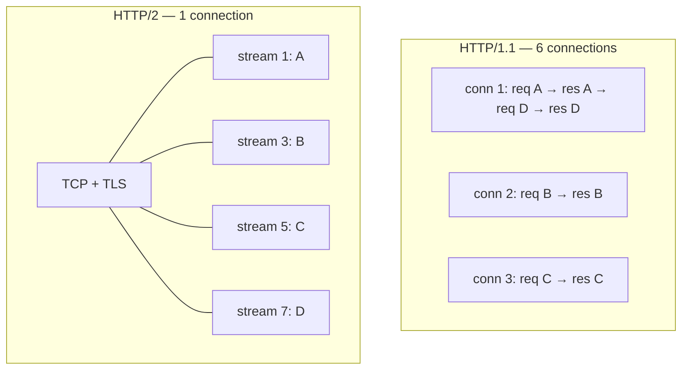

# Chapter 38 — HTTP/2

**What you will learn**

- What binary framing, multiplexing, and HPACK actually buy you — and where head-of-line blocking went.
- The relationship between an `Http2Session`, its `Http2Stream`s, and the socket underneath.
- When to use the core API (`'stream'`, `respond()`, `respondWithFile()`) and when the compatibility API is the better answer.
- Pseudo-headers, the lowercase rule, and which HTTP/1 headers are now protocol errors.
- Flow control and the four settings worth tuning, with real numbers.
- Running HTTP/1.1 and HTTP/2 on one port via ALPN and `allowHTTP1`.
- Session versus stream errors, `GOAWAY`, `RST_STREAM`, and the Rapid Reset attack class.
- Whether to terminate HTTP/2 in Node at all — with an actual recommendation.

## Why this matters

HTTP/2 is the protocol your users' browsers already speak, and it is what most service meshes and gRPC implementations run on. Understanding it is not optional if you operate anything behind a modern load balancer, because the failure modes are different: a bad HTTP/2 setting does not slow one request, it stalls every request sharing a connection.

It is also a protocol people adopt for the wrong reasons. "HTTP/2 is faster" is true for a browser fetching eighty subresources over a high-latency link, and close to meaningless for a JSON API behind a proxy that already terminates HTTP/2 for you. This chapter gives you enough of the mechanics to tell those cases apart, and ends with a straight recommendation.

## What HTTP/2 changes

HTTP/1.1 is text on a wire: a request line, headers, a blank line, a body, repeat. One request at a time per connection. HTTP/2 keeps the same semantics — methods, paths, headers, status codes — and replaces the wire format entirely.

**Binary framing.** Everything is a frame with a 9-byte header: length, type, flags, stream ID. `HEADERS`, `DATA`, `SETTINGS`, `PING`, `RST_STREAM`, `GOAWAY`, `WINDOW_UPDATE`. Frames are unambiguous to parse, which is why the request-smuggling class from Chapter 35 does not exist here.

**Multiplexing.** Because every frame carries a stream ID, many requests share one connection and their frames interleave. One TCP connection, one TLS handshake, dozens of concurrent requests.

**HPACK.** Headers are compressed with a shared dynamic table. The second request on a connection sends an index instead of `user-agent: Mozilla/5.0 (...)`. On header-heavy APIs this is a large saving — and it is why HTTP/2 has an explicit "mark this header as sensitive so it is never indexed" mechanism.



### Head-of-line blocking moved, it did not disappear

In HTTP/1.1, a slow response blocks every later request on that connection. HTTP/2 fixes this *at the HTTP layer*: stream 3 can complete while stream 1 is still trickling.

But all those streams ride one TCP connection, and TCP delivers bytes in order. Lose one packet and the kernel holds back every subsequent byte — for *all* streams — until it is retransmitted. On a clean network you never notice. On a lossy mobile link, a single HTTP/2 connection can be *worse* than six HTTP/1.1 connections, because one lost packet stalls everything instead of one sixth of everything. This is precisely the problem QUIC and HTTP/3 solve by moving stream multiplexing below TLS, into a protocol with per-stream ordering (Chapter 40).

## Sessions, streams, and settings

Three objects, and the hierarchy matters:

- **`Http2Session`** — one per connection, bound to exactly one `net.Socket` or `tls.TLSSocket`. Destroying either destroys both. Never read or write that socket yourself; doing so puts the session into an indeterminate state.
- **`Http2Stream`** — one per request/response exchange, a `Duplex`. Client streams come from `session.request()`; server streams arrive via the `'stream'` event.
- **Settings** — a `SETTINGS` frame each peer sends at connection start, and may resend later. `session.localSettings` and `session.remoteSettings` show both sides; `session.settings()` changes yours.

Stream IDs are assigned by the initiator: odd for client-initiated, even for server-initiated (pushes). A stream ID is used once and never reused, which is why a long-lived session eventually exhausts the 31-bit space and must be replaced.

## `createServer` vs `createSecureServer`

`http2.createServer()` speaks cleartext HTTP/2 (`h2c`). `http2.createSecureServer()` speaks HTTP/2 over TLS (`h2`). The practical reality is blunt: **no browser supports cleartext HTTP/2.** If a browser is your client, you need `createSecureServer()`. Cleartext HTTP/2 is for service-to-service traffic inside a trusted network, and for gRPC behind a mesh that handles TLS separately.

```mjs
import { createSecureServer } from 'node:http2';
import { readFileSync } from 'node:fs';

const server = createSecureServer({
  key: readFileSync('/etc/tls/privkey.pem'),
  cert: readFileSync('/etc/tls/fullchain.pem'),
  settings: { maxConcurrentStreams: 128 },
});

server.on('stream', (stream, headers) => {
  if (headers[':method'] !== 'GET') {
    stream.respond({ ':status': 405 });
    stream.end();
    return;
  }
  stream.respond({ ':status': 200, 'content-type': 'text/plain; charset=utf-8' });
  stream.end(`you asked for ${headers[':path']}\n`);
});

server.listen(8443);
```

All the TLS options from Chapter 37 apply — `createSecureServer()` takes everything `tls.createServer()` does. Note that Node sets the ALPN protocols for you.

## Two APIs, one module

Node gives you two ways to write a handler, and choosing wrongly costs you either features or portability.

| | Core API (`'stream'`) | Compatibility API (`'request'`) |
|---|---|---|
| Handler signature | `(stream, headers, flags)` | `(req, res)` mimicking HTTP/1 |
| Pseudo-headers | Visible and explicit | Mapped to `req.method`, `req.url`, `req.authority` |
| `respondWithFile` / `respondWithFD` | Yes | No |
| Server push | Yes (`stream.pushStream()`) | Via `res.stream.pushStream()` |
| Trailers | `sendTrailers()`, `'wantTrailers'` | Limited |
| Works with HTTP/1 middleware | No | Yes |
| `allowHTTP1` fallback | Not applicable | Yes — this is the point |

Use the **compatibility API** when you want existing Express/Koa-shaped code, or when you serve both protocols on one port. It provides `Http2ServerRequest` and `Http2ServerResponse` that mirror the HTTP/1 public API — and only the public API. Anything reaching into internals (which many older middlewares do) will break. The status *message* is ignored, because HTTP/2 has no reason phrase.

Use the **core API** when you want what HTTP/2 actually offers: zero-copy file responses, push, trailers, per-stream priority, and direct access to session state. A static file server is the canonical case:

```js
server.on('stream', (stream, headers) => {
  const path = resolveSafely(headers[':path']);
  stream.respondWithFile(path, { 'content-type': typeFor(path) }, {
    statCheck(stat, responseHeaders) {
      responseHeaders['last-modified'] = stat.mtime.toUTCString();
      responseHeaders['content-length'] = stat.size;
    },
    onError(err) {
      stream.respond({ ':status': err.code === 'ENOENT' ? 404 : 500 });
      stream.end();
    },
  });
});
```

`respondWithFile()` hands the descriptor to the kernel; the data never passes through JavaScript. `respondWithFD(fd, ...)` is the same for a descriptor you already hold, which is what you want when serving one file to many clients — open it once, reuse the fd, and note that Node will **not** close it for you. `respondWithFile()` requires a regular file; anything else emits `'error'` on the stream. Always provide `onError`, because the error can happen before any response has been sent.

## Pseudo-headers and header rules

HTTP/2 replaces the request line and status line with **pseudo-headers**: ordinary header fields whose names begin with `:`, which must appear before all regular headers.

| Pseudo-header | Direction | Replaces |
|---|---|---|
| `:method` | request | the method in the request line |
| `:path` | request | the request target (path + query) |
| `:scheme` | request | `http` or `https` |
| `:authority` | request | the `Host` header |
| `:status` | response | the status code in the status line |
| `:protocol` | request | extended `CONNECT` (RFC 8441), when enabled |

Three rules that differ from HTTP/1 and will bite you:

**Header names are lowercase, always.** Node accepts mixed case in your objects and lowercases them on the wire, but an incoming `headers` object always has lowercase keys. Code that reads `headers['Content-Type']` silently gets `undefined`.

**Connection-specific headers are forbidden.** `Connection`, `Upgrade`, `Keep-Alive`, `Proxy-Connection`, `Transfer-Encoding`, and `HTTP2-Settings` are protocol errors in HTTP/2, because the connection is now managed by frames. `TE` is allowed only with the value `trailers`. If you are proxying HTTP/1 to HTTP/2, you must strip these.

**`:authority`, not `Host`.** HTTP/2 requires one or the other; prefer `:authority`. The compatibility API falls back to `host` when `:authority` is absent, and `req.authority` gives you the resolved value.

Incoming header objects have a `null` prototype, so `headers.hasOwnProperty` does not exist. Duplicate handling mirrors HTTP/1: `set-cookie` is always an array, duplicate `cookie` headers join with `; `, a long list of single-value headers (including all the pseudo-headers) have duplicates discarded, and everything else joins with `, `.

Finally, HPACK indexes repeated header values in a shared table — which means a `Cookie` or `Authorization` value could be recovered by an attacker who can measure compression. Node marks `authorization` and short `cookie` headers sensitive automatically; mark your own with the `http2.sensitiveHeaders` symbol:

```js
stream.respond({
  ':status': 200,
  'x-session-token': token,
  [http2.sensitiveHeaders]: ['x-session-token'],
});
```

## Server push, honestly

Server push lets a server send a response the client never asked for, anticipating that it will. The API is there and it works:

```js
server.on('stream', (stream, headers) => {
  stream.respond({ ':status': 200, 'content-type': 'text/html' });
  if (stream.pushAllowed) {
    stream.pushStream({ ':path': '/app.css' }, (err, push) => {
      if (err) return;                       // peer declined or the stream is gone
      push.respondWithFile('./public/app.css', { 'content-type': 'text/css' });
    });
  }
  stream.end('<link rel="stylesheet" href="/app.css">');
});
```

Now the honest part. **Push is effectively dead.** Chrome removed support in 2022 and other browsers followed; in practice you are pushing to nobody. It never delivered its promise because the server cannot know what the client has cached, so most pushes were wasted bandwidth that competed with resources the client actually wanted. `103 Early Hints` (`res.writeEarlyHints()`, Chapter 35) solves the same problem better: the server tells the client what to fetch and the client decides, cache and all.

The Node docs do not mark `pushStream()` deprecated, and it remains useful between servers you control — a gRPC-shaped internal API, or a client you wrote. Check `stream.pushAllowed` first (the peer can disable it via the `enablePush` setting), never call `pushStream()` from inside a pushed stream, and do not build a browser-facing feature on it.

## Flow control and settings

Every stream and the session as a whole have a flow-control window. A sender may only transmit up to the window; the receiver issues `WINDOW_UPDATE` frames as it consumes data. This is backpressure at the protocol level, and it exists so that one stream cannot starve the others on a shared connection.

The window that matters for throughput is `initialWindowSize`. The default is 4 MiB (`4194304`). On a high-bandwidth, high-latency link, a small window caps throughput at `window / RTT` regardless of available bandwidth — the classic bandwidth-delay product problem. `session.setLocalWindowSize(n)` adjusts the session-level window on a live connection.

The settings worth knowing:

| Setting | Default | What it controls |
|---|---|---|
| `headerTableSize` | `4096` | HPACK dynamic table size, in bytes |
| `enablePush` | `true` | Whether the peer may push streams |
| `initialWindowSize` | `4194304` (4 MiB) | Per-stream flow-control window |
| `maxFrameSize` | `16384` | Largest frame payload; min 16 KiB, max 2²⁴−1 |
| `maxConcurrentStreams` | `4294967295` | Concurrent streams the peer may open |
| `maxHeaderListSize` | `65535` | Max uncompressed header list bytes (alias: `maxHeaderSize`) |
| `enableConnectProtocol` | `false` | Extended `CONNECT` (RFC 8441); cannot be disabled once on |

**Set `maxConcurrentStreams`.** The default is effectively unlimited, which means one client can open millions of streams on one connection and each one allocates memory. A value in the low hundreds is normal; browsers typically open around 100. This is a resource limit, not a performance tuning knob — treat it like `maxSockets` on the server side.

Node adds its own per-session guards on top of the protocol settings, and these are the ones that protect the process:

| Option | Default | Purpose |
|---|---|---|
| `maxSessionMemory` | `10` (MB) | Credit-based cap; new streams rejected above it |
| `maxHeaderListPairs` | `128` | Maximum number of header entries |
| `maxSettings` | `32` | Entries per `SETTINGS` frame |
| `maxSessionInvalidFrames` | `1000` | Invalid frames tolerated before the session closes |
| `maxSessionRejectedStreams` | `100` | Rejected stream creations tolerated |
| `maxOutstandingPings` | `10` | Unacknowledged `PING` frames |
| `streamResetBurst` / `streamResetRate` | `1000` / `33` | Incoming `RST_STREAM` rate limit |
| `peerMaxConcurrentStreams` | `100` | Assumed peer limit until it says otherwise |
| `unknownProtocolTimeout` | `10000` | Grace period after `'unknownProtocol'` |

`maxSessionMemory` at 10 MB per session is the single most effective guard against a client that opens many streams and never reads. Raise it deliberately, if at all.

## One port, two protocols

ALPN (Chapter 37) negotiates `h2` or `http/1.1` during the TLS handshake. `allowHTTP1: true` makes `createSecureServer()` accept both, falling back to Node's HTTP/1 server for clients that do not speak HTTP/2.

```mjs
import { createSecureServer } from 'node:http2';

const server = createSecureServer({
  key, cert,
  allowHTTP1: true,
  http1Options: { keepAliveTimeout: 65_000 },
}, (req, res) => {
  // req/res are Http2ServerRequest/Response OR http.IncomingMessage/ServerResponse
  res.writeHead(200, { 'content-type': 'application/json' });
  res.end(JSON.stringify({ httpVersion: req.httpVersion }));
});
```

The handler must restrict itself to the HTTP/1 public API, because it may receive either object. `req.httpVersion` is `'2.0'` or `'1.1'`; branch on that when you want to reach for HTTP/2-only features via `req.stream`. `http1Options` (v25.7.0/v24.15.0) configures the fallback server — it accepts `http.createServer()` options and supersedes the deprecated `Http1IncomingMessage` and `Http1ServerResponse` options (**[Deprecated]** DEP0202).

With `allowHTTP1: false` (the default), a client that offers neither `h2` nor a protocol Node recognises triggers `'unknownProtocol'`. If you do not destroy the socket in that handler, Node destroys it after `unknownProtocolTimeout`.

## Clients

```mjs
import { connect, constants } from 'node:http2';

const client = connect('https://api.example.com', {
  settings: { initialWindowSize: 1 << 20 },
});

client.on('error', (err) => console.error('session error', err));
client.on('goaway', (code, lastStreamID) =>
  console.warn('server going away', code, 'last stream', lastStreamID));

const req = client.request({
  [constants.HTTP2_HEADER_METHOD]: 'GET',
  [constants.HTTP2_HEADER_PATH]: '/v1/users/42',
  'accept': 'application/json',
});

req.setEncoding('utf8');
let body = '';
req.on('response', (headers) => console.log('status', headers[':status']));
req.on('data', (chunk) => { body += chunk; });
req.on('end', () => {
  console.log(JSON.parse(body));
  client.close();
});
req.on('error', (err) => console.error('stream error', err));
```

The point of HTTP/2 on the client is **session reuse**: `connect()` once per origin, keep the session, and issue many concurrent `request()` calls over it. One handshake, many requests, all in flight simultaneously. Creating a session per request throws away everything the protocol offers and is slower than HTTP/1.1 with keep-alive.

Manage sessions like a connection pool. Keep one per origin in a `Map`, listen for `'close'` and `'goaway'` to evict it, and recreate lazily. Use `session.ping()` to detect a dead session, and `session.unref()` if a background session should not keep the process alive. Note that `session.request()` before the connection is established buffers the operation; `stream.id` is `undefined` until the stream is ready.

Node's `fetch` does not speak HTTP/2. If you need HTTP/2 from a client, that is `node:http2` or a library built on it.

## Errors: session versus stream

The hierarchy is the whole model. **A stream error kills one request. A session error kills every request on the connection.**

```js
session.on('error', handleSessionError);   // fatal for all streams
stream.on('error', handleStreamError);     // fatal for this exchange only
```

- **`RST_STREAM`** terminates one stream. `stream.close(code)` sends one; after destruction `stream.rstCode` holds the code you sent or received. Common codes: `NGHTTP2_CANCEL` (`0x08`) for a client that no longer wants the response, `NGHTTP2_REFUSED_STREAM` (`0x07`) for a server declining to process, `NGHTTP2_ENHANCE_YOUR_CALM` (`0x0b`) for "you are doing too much".
- **`GOAWAY`** shuts down a session gracefully. It carries the ID of the last stream the sender actually processed, so the peer knows exactly which requests to retry elsewhere. `session.goaway(code, lastStreamID, opaqueData)` sends one *without* closing the session — the polite "stop sending me new streams" signal before a deploy. Receiving one emits `'goaway'` and shuts the session down automatically.
- **`session.close()`** stops new streams and lets existing ones finish. **`session.destroy()`** ends everything immediately. Use `close()` for graceful shutdown.

Node also emits `'frameError'` (a frame could not be sent) and, on the server, `'sessionError'` for errors on a session with no other handler. Validation errors — a bad setting value, a malformed header name — throw synchronously.

The `RST_STREAM`/`GOAWAY` codes are exposed as `http2.constants.NGHTTP2_*`, from `NO_ERROR` (`0x00`) through `HTTP_1_1_REQUIRED` (`0x0d`).

## Security: the Rapid Reset class

In 2023, CVE-2023-44487 ("HTTP/2 Rapid Reset") produced record-breaking denial-of-service attacks against essentially every HTTP/2 implementation. The mechanism is elegant and cheap: open a stream, immediately send `RST_STREAM`, repeat. Each canceled stream costs the client almost nothing, but the server has already done request-parsing work — and because the stream was reset, it no longer counts against `maxConcurrentStreams`. A single connection could generate tens of thousands of requests per second.

Node's mitigation is `streamResetBurst` and `streamResetRate` (v23.0.0/v22.10.0), which rate-limit *incoming* `RST_STREAM` frames. Both must be set together to take effect; they default to 1000 and 33. Combined with `maxSessionRejectedStreams` and `maxSessionInvalidFrames`, an abusive peer's session is closed rather than served.

The general principle: in HTTP/2, per-connection limits do most of the work that per-request limits do in HTTP/1.1, because one connection is now many requests. Set `maxConcurrentStreams`, keep `maxSessionMemory` tight, and do not raise the frame and reset limits without a reason.

## Should you run HTTP/2 in Node?

An honest recommendation, based on where the benefit actually lands:

**Terminate HTTP/2 at your proxy and speak HTTP/1.1 to Node** in the common case. Nginx, Envoy, ALB, and CloudFront have mature, battle-tested HTTP/2 implementations, get security fixes independently of your Node upgrade cycle, and already handle the connection-level tuning. Your Node process sees a small number of long-lived HTTP/1.1 keep-alive connections from a well-behaved local peer — the case HTTP/1.1 handles perfectly well. `node:http2` is more code, more state per connection, and measurably more CPU per request than `node:http`.

**Terminate HTTP/2 in Node when** you are serving browsers directly with no proxy, or you are doing gRPC or another protocol that requires HTTP/2 end to end, or you genuinely need server push or trailers, or you are serving many small static files where `respondWithFD` plus multiplexing is a real win.

**Do not adopt HTTP/2 to make a JSON API faster.** If each client makes a handful of requests, HTTP/1.1 with keep-alive is already reusing the connection and you are optimising a cost you are not paying.

And if latency over lossy networks is your actual problem, the answer is HTTP/3, not HTTP/2 — see Chapter 40.

## Common mistakes

### ❌ Reading headers with HTTP/1 capitalisation

```js
server.on('stream', (stream, headers) => {
  const type = headers['Content-Type'];   // always undefined
});
```

HTTP/2 header names are lowercase on the wire and in the object Node gives you.

✅

```js
const type = headers['content-type'];
const method = headers[':method'];   // not headers.method
```

### ❌ Forwarding HTTP/1 connection headers into HTTP/2

```js
stream.respond({ ':status': 200, ...upstreamHeaders });   // includes 'connection'
```

`Connection`, `Keep-Alive`, `Transfer-Encoding`, `Upgrade`, and `Proxy-Connection` are protocol errors in HTTP/2. The stream is reset and the request fails in a way that looks like a network problem.

✅ Strip them when proxying:

```js
const FORBIDDEN = new Set(['connection', 'keep-alive', 'transfer-encoding', 'upgrade', 'proxy-connection']);
const clean = Object.fromEntries(
  Object.entries(upstreamHeaders).filter(([k]) => !FORBIDDEN.has(k.toLowerCase())),
);
```

### ❌ A new session per request

```js
async function get(path) {
  const client = http2.connect('https://api.example.com');   // full handshake, every time
  // ...
  client.close();
}
```

This pays a TCP and TLS handshake per request and discards the multiplexing that is the entire point.

✅ Cache one session per origin, evict on `'close'` and `'goaway'`:

```js
const sessions = new Map();
function sessionFor(origin) {
  let s = sessions.get(origin);
  if (!s || s.closed || s.destroyed) {
    s = http2.connect(origin);
    s.on('close', () => sessions.delete(origin));
    s.on('error', () => sessions.delete(origin));
    sessions.set(origin, s);
  }
  return s;
}
```

### ❌ Leaving `maxConcurrentStreams` at its default

```js
createSecureServer({ key, cert });   // 2^32-1 concurrent streams allowed
```

One client can open effectively unlimited streams on one connection, each consuming memory. Your per-request limits do not help; there is only one connection.

✅

```js
createSecureServer({ key, cert, settings: { maxConcurrentStreams: 128 } });
```

### ❌ Handling only stream errors

```js
stream.on('error', log);   // session errors still crash the process
```

An `'error'` on the `Http2Session` with no listener throws. One TLS-level or protocol-level failure takes down the process, killing every other connection with it.

✅ Handle both, plus `'sessionError'` on the server:

```js
server.on('sessionError', (err, session) => { log(err); session.destroy(); });
server.on('session', (session) => session.on('error', log));
```

## Production notes

- **Set the connection-level limits explicitly.** `maxConcurrentStreams`, `maxSessionMemory`, `maxHeaderListSize`, and the reset rate limiters are your only defence against a single abusive connection. HTTP/1.1 habits — per-request body limits, per-IP connection caps — do not cover this.
- **Graceful shutdown means `GOAWAY`, then drain.** Send `session.goaway()` with the last processed stream ID, stop accepting new streams, let the in-flight ones finish, then `close()`. Clients that see a `GOAWAY` know exactly which requests were never processed and can retry them safely — a guarantee HTTP/1.1 cannot give you.
- **One connection means one failure domain.** In HTTP/1.1 a broken socket costs one request; in HTTP/2 it costs every stream on that session. Budget retries at the session level, and make sure a session error path exists that recreates the session rather than failing every subsequent call.
- **Measure before adopting.** `session.state` and `stream.state` expose window sizes, outbound queue size, and stream counts. If your streams are permanently window-limited, `initialWindowSize` is your problem; if `outboundQueueSize` grows, your handlers are producing faster than the peer consumes.
- **`respondWithFD` is the reason to use the core API for static content** — the kernel moves the bytes and JavaScript never touches them. Remember to close the descriptor yourself; Node will not.
- **HPACK has a security surface.** Mark tokens, cookies, and API keys with `http2.sensitiveHeaders` so they are never entered into the compression table.
- **Cleartext HTTP/2 is fine inside a mesh and useless to browsers.** Choose `createServer()` versus `createSecureServer()` based on who your client is, not on how much you dislike certificates.

## Exercises

1. **Watch multiplexing happen.** Build a server whose handler sleeps a random 100–2000 ms before responding. Request twenty paths concurrently over one `http2.connect()` session and log stream IDs with start and end timestamps. Success: responses complete out of order, total wall time is close to the slowest single request, and you can name the stream IDs the client used.

2. **Dual-protocol server.** Serve the same JSON from one port with `allowHTTP1: true`. Hit it with `curl --http2` and `curl --http1.1`. Success: both return 200, the payload reports the correct `httpVersion`, and you can print the negotiated ALPN protocol for each.

3. **Trip a protocol error.** Send a response including a `connection: keep-alive` header. Success: you observe the stream failing, you can name the error, and you can state which frame the peer sent to reject it.

4. **Flow control under a small window.** Serve a 100 MB body with `initialWindowSize` set to 64 KiB, then to 4 MiB, over a link with simulated latency. Success: you can show the throughput difference and explain it in terms of window size and round-trip time.

5. **Survive Rapid Reset.** Write a client that opens streams and immediately resets them in a tight loop. Run it against a server with default settings, then against one with `streamResetBurst`/`streamResetRate` and `maxSessionRejectedStreams` set. Success: the second server closes the abusive session while continuing to serve a well-behaved client on another connection.

## Recap

- HTTP/2 keeps HTTP semantics and replaces the wire format with binary frames, multiplexed streams, and HPACK header compression.
- Head-of-line blocking moved from the HTTP layer to TCP; on lossy links one lost packet stalls every stream. HTTP/3 is the fix.
- An `Http2Session` owns one socket and many `Http2Stream`s; never touch the socket directly.
- Browsers require TLS, so `createSecureServer()` is the practical choice; cleartext `createServer()` is for internal traffic.
- The core API gives you `respondWithFile`/`respondWithFD`, push, and trailers; the compatibility API gives you HTTP/1-shaped handlers and `allowHTTP1` fallback.
- Pseudo-headers (`:method`, `:path`, `:scheme`, `:authority`, `:status`) replace the request and status lines; names are lowercase and connection-specific headers are protocol errors.
- `maxConcurrentStreams` and `maxSessionMemory` are the limits that matter, because one connection is now many requests.
- Server push exists in Node but browsers removed support; do not build on it.
- `RST_STREAM` ends one stream, `GOAWAY` ends a session and tells the peer exactly what was processed — which makes HTTP/2 shutdowns safer to retry than HTTP/1.1 ones.
- Rapid Reset is mitigated with `streamResetBurst`/`streamResetRate`, which must be set together.
- Terminate HTTP/2 at your proxy unless you serve browsers directly, run gRPC, or need HTTP/2-only features.

## Where to go next

- [Chapter 35 — HTTP/1.1 Servers](35-http-servers.md) — the semantics HTTP/2 preserves, and the framing it replaces.
- [Chapter 37 — TLS and HTTPS](37-tls-https.md) — ALPN, certificates, and everything `createSecureServer()` inherits.
- [Chapter 36 — HTTP/1.1 Clients, Agents, and Keep-Alive](36-http-clients.md) — why `fetch` cannot help you here.
- [Chapter 40 — QUIC and DTLS (Experimental)](40-quic-dtls.md) — where TCP head-of-line blocking finally goes away.
- [Chapter 19 — Streams II: Duplex, Transform, pipeline, Backpressure](../part3-data/19-streams-advanced.md) — `Http2Stream` is a `Duplex`.
- Official documentation: <https://nodejs.org/docs/latest/api/http2.html>
