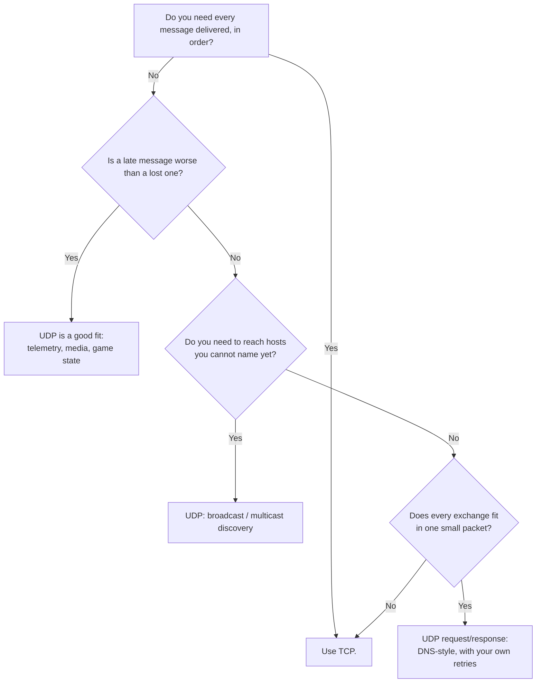

# Chapter 39 — UDP with `node:dgram`

**What you will learn**

- A decision framework for when UDP is the right transport and when reaching for it is a mistake.
- The full `dgram.Socket` lifecycle: `createSocket`, `bind`, `send`, `close`, and the socket events.
- Connected UDP sockets, and the three concrete things `connect()` buys you.
- Broadcast and multicast in depth, including source-specific membership and interface selection.
- How to choose a datagram size that will not be silently dropped — the 508 and 1200 byte reasoning.
- How to build reliability on top of UDP: a discovery beacon and a request/response protocol with timeouts and retries.

## Why this matters

TCP gives you an ordered, reliable, congestion-controlled byte stream. UDP gives you almost nothing: a way to hand the kernel a packet with a destination on it. No ordering, no delivery guarantee, no duplicate suppression, no congestion control, no connection.

That sounds strictly worse, and for most applications it is. But a handful of problems are shaped exactly wrong for TCP. A metrics agent emitting a hundred thousand counters a second does not want head-of-line blocking or a retransmit of a value that is already stale. A service on a LAN that needs to find its peers cannot open a TCP connection to a host it does not know about. A game tick that arrives late is worse than useless. DNS, DHCP, NTP, mDNS, StatsD, syslog, WireGuard, and QUIC are all UDP, for good reasons.

The danger is the middle ground: reaching for UDP because "it's faster", then reimplementing acknowledgements, retries, ordering, and flow control badly. Everything TCP does, it does because it turned out to be necessary. This chapter covers the API thoroughly, and is equally careful about when not to use it.

## When to use UDP



| Use UDP when | Do **not** use UDP when |
|---|---|
| Stale data is worthless — telemetry, positions, sensor readings | You are transferring a file or a stream of records |
| You need one-to-many delivery — discovery, service announcement | You need ordering or exactly-once semantics |
| The whole exchange fits in one small datagram each way | Messages can exceed roughly 1200 bytes |
| You can tolerate loss, or will implement idempotent retries | You would end up reimplementing acknowledgements and windows |
| You are implementing a protocol that is specified over UDP | You just want lower latency and have not measured anything |

Four properties you inherit and cannot opt out of:

1. **No delivery guarantee.** A datagram may vanish at any hop, silently. There is no error.
2. **No ordering.** Packet 2 may arrive before packet 1. On a LAN this is rare; across the internet it is routine.
3. **No duplicate suppression.** The same datagram can be delivered twice. Every handler must be idempotent or carry a sequence number.
4. **No congestion control.** TCP backs off when the network is loaded. UDP does not. A UDP sender in a tight loop will happily saturate a link and make everything else on it worse, including its own traffic.

Point 4 is the one that gets forgotten. If you send at a fixed rate regardless of loss, you have built a machine for making a congested network more congested.

## Creating and binding a socket

```mjs
import dgram from 'node:dgram';

const socket = dgram.createSocket('udp4');

socket.on('error', (err) => {
  console.error('socket error:', err.message);
  socket.close();
});

socket.on('message', (msg, rinfo) => {
  console.log(`${rinfo.size} bytes from ${rinfo.address}:${rinfo.port}`);
});

socket.on('listening', () => console.log('bound to', socket.address()));

socket.bind(41234);
```

`createSocket` takes either a type string or an options object. **Do not use `new dgram.Socket()`** — the docs are explicit that the constructor is not the public API.

| Option | Default | Meaning |
|---|---|---|
| `type` | — | Required: `'udp4'` or `'udp6'`. |
| `reuseAddr` | `false` | `SO_REUSEADDR`. Multiple sockets may bind the same address, but **only one receives the data**. Required for multicast on most systems. |
| `reusePort` | `false` | `SO_REUSEPORT`: incoming datagrams are *distributed* across the bound sockets. Linux 3.9+, DragonFlyBSD 3.6+, FreeBSD 12+, Solaris 11.4, AIX 7.2.5+; errors on bind elsewhere. Since v23.1.0 / v22.12.0. |
| `ipv6Only` | `false` | Disables dual-stack, so binding `::` does not also bind `0.0.0.0`. |
| `recvBufferSize` | OS default | `SO_RCVBUF` in bytes. |
| `sendBufferSize` | OS default | `SO_SNDBUF` in bytes. |
| `lookup` | `dns.lookup()` | Custom resolver. A literal IP of the socket's family resolves to itself without calling it. |
| `signal` | — | `AbortSignal`; aborting is equivalent to `socket.close()`. |
| `receiveBlockList` | — | `net.BlockList` — inbound datagrams from matching addresses are discarded. |
| `sendBlockList` | — | `net.BlockList` — outbound sends to matching addresses are blocked. |

Note the `reuseAddr` / `reusePort` distinction, because it is the difference between a working and a broken multi-process listener. `reuseAddr` lets several sockets bind the same port but delivers each datagram to exactly one of them — which one is unspecified and usually unhelpful. `reusePort` genuinely load-balances. If you want N workers sharing a UDP port, you want `reusePort`.

`bind()` has two forms:

```js
socket.bind([port][, address][, callback]);
socket.bind(options[, callback]);         // { port, address, exclusive, fd }
```

Omit `port` or pass `0` for an OS-assigned port; omit `address` to bind all interfaces (`0.0.0.0` for `udp4`, `::` for `udp6`). The `options` form adds `exclusive` (opt out of `cluster` handle sharing; forced to `true` when `reusePort` is set) and `fd` (wrap an existing descriptor, ignoring `port` and `address`).

Binding is asynchronous and reports failure through the `'error'` event, not by throwing. Since v26.4.0 / v24.19.0 there is also `socket.bindSync([options])`, which performs the bind inline and returns the address object immediately:

```js
const socket = dgram.createSocket('udp4');
const address = socket.bindSync({ port: 0 });
console.log(address);   // { address: '0.0.0.0', family: 'IPv4', port: 53124 }
```

`bindSync()` **throws** on failure (`EADDRINUSE` and friends) rather than emitting, makes `socket.address()` valid immediately, emits `'listening'` on the next tick, and never performs DNS resolution — `address` must be a numeric IP literal. It also does not participate in `cluster` handle sharing. For test setups that need the port synchronously, it removes a callback.

**A bound socket keeps the process alive.** Use `socket.unref()` if it should not, and `socket.ref()` to restore.

### Events

| Event | Fires when |
|---|---|
| `'listening'` | The socket is addressable. Happens on `bind()`, or **implicitly on the first `send()`**. |
| `'message'` | A datagram arrived. Arguments: `(msg, rinfo)`. |
| `'error'` | Any error. Argument: an `Error`. |
| `'connect'` | A `connect()` call succeeded. |
| `'close'` | `close()` finished. No further `'message'` events. |

Until `'listening'` has fired, the underlying system resources do not exist, so `socket.address()`, `socket.setTTL()`, and the buffer-size getters throw (`EBADF`, or `ERR_SOCKET_BUFFER_SIZE` for the buffer ones). This is the most common beginner error with `dgram`: calling `setMulticastTTL()` right after `createSocket()` instead of inside the `bind()` callback.

The `rinfo` object:

| Property | Type | Meaning |
|---|---|---|
| `address` | string | Sender's IP. |
| `family` | string | `'IPv4'` or `'IPv6'`. A string again since v18.4.0 — it was briefly a number in v18.0.0. |
| `port` | number | Sender's port. |
| `size` | number | Datagram size in bytes. |

For an IPv6 link-local sender, `address` carries a zone ID suffix: `'fe80::2618:1234:ab11:3b9c%en0'`. Strip it before comparing against a configured address, and do not use it as a map key without normalizing.

## Sending

```js
socket.send(msg[, offset, length][, port][, address][, callback]);
```

`msg` may be a `Buffer`, any `TypedArray`, a `DataView`, a string (converted with UTF-8), or an **array** of any of those — which the kernel sends as a single datagram, saving you a `Buffer.concat`. `offset` and `length` are optional but must be given together, are counted in **bytes** not characters, and are only supported when `msg` is a `Buffer`, `TypedArray`, or `DataView` — never with an array or a string.

For an unconnected socket, `port` and `address` are required. For a connected socket they must be **omitted** — passing them is an error.

```js
// Unconnected: destination per call.
socket.send('ping', 41234, '192.0.2.10');

// One datagram from several pieces.
socket.send([header, body], 41234, '192.0.2.10');

// Byte range of an existing buffer.
socket.send(pool, 128, 64, 41234, '192.0.2.10');
```

If `address` is a host name it goes through DNS, which delays the send by at least one event loop tick. If it is nullish, the default is `'127.0.0.1'` for `udp4` and `'::1'` for `udp6`. Sending on an unbound socket implicitly binds it to a random port on all interfaces.

**The callback is the only way to know the send completed.** With a callback, errors go to it; without one, they surface as `'error'` on the socket. Note carefully what "completed" means: the datagram left your machine. It says nothing about delivery. There is no acknowledgement in UDP and there never will be.

```js
socket.send(payload, port, host, (err) => {
  if (err) return metrics.increment('udp.send_error');
  // Sent. Not delivered. Not received. Not processed.
});
```

Two counters let you observe the outbound queue, both since v18.8.0 / v16.19.0:

- `socket.getSendQueueSize()` — bytes queued for sending.
- `socket.getSendQueueCount()` — number of queued send requests.

A queue that grows is a sender outrunning the network or the send buffer. Unlike TCP, nothing backpressures you; watching these numbers is how you notice.

## Connected sockets

`socket.connect(port[, address][, callback])` associates the socket with one remote endpoint. There is no handshake — UDP has no connections. It records a default peer in the kernel.

```js
const socket = dgram.createSocket('udp4');
socket.connect(41234, '192.0.2.10', () => {
  socket.send('ping');                       // no port/address
  console.log(socket.remoteAddress());       // { address, family, port }
});
```

Three concrete benefits:

1. **Sends get cheaper.** No per-call address resolution and no per-call destination setup.
2. **The socket only receives from that peer.** The kernel filters everything else, which removes a whole class of spoofing and cross-talk at zero cost.
3. **You get ICMP errors.** On a connected UDP socket the kernel can attribute an ICMP "port unreachable" back to you, so a send to a dead listener eventually surfaces as `ECONNREFUSED`. On an unconnected socket that information is discarded.

`socket.disconnect()` removes the association; it is synchronous and throws `ERR_SOCKET_DGRAM_NOT_CONNECTED` on an unbound or already-disconnected socket. Calling `connect()` twice throws `ERR_SOCKET_DGRAM_IS_CONNECTED`. `remoteAddress()` throws `ERR_SOCKET_DGRAM_NOT_CONNECTED` when there is no peer.

There is a synchronous `socket.connectSync(port[, address])` since v26.4.0 / v24.19.0. It records the peer inline, throws immediate errors such as `EAFNOSUPPORT` synchronously, requires a numeric IP literal, binds first if needed, and emits `'connect'` on the next tick. Reachability errors like `ECONNREFUSED` still arrive later on a send or receive — `connect(2)` does not probe.

Use a connected socket for any client that talks to exactly one server. Use an unconnected socket for a server, or for a client that fans out.

## Broadcast

Broadcast sends one datagram to every host on the local link. It requires an explicit opt-in, because it is easy to abuse:

```js
socket.bind(() => {
  socket.setBroadcast(true);
  socket.send('discover', 41234, '255.255.255.255');
});
```

`setBroadcast(flag)` sets `SO_BROADCAST` and throws `EBADF` on an unbound socket. Two limits: broadcast is IPv4-only — **IPv6 has no broadcast at all**, only multicast — and routers do not forward it, so it stops at the link.

For anything beyond a single flat LAN, use multicast instead. It is better targeted, it works on IPv6, and it does not wake up every device on the network.

## Multicast

Multicast delivers one datagram to every host that has *joined a group*. The group is an IP address in a reserved range: `224.0.0.0/4` for IPv4, `ff00::/8` for IPv6. Senders do not need to join; only receivers do.

### Joining and leaving

```js
const socket = dgram.createSocket({ type: 'udp4', reuseAddr: true });

socket.bind(41234, () => {
  socket.addMembership('239.255.42.99');       // join on an OS-chosen interface
  socket.setMulticastTTL(2);
  socket.setMulticastLoopback(true);
});
```

| Method | Socket option | Notes |
|---|---|---|
| `addMembership(multicastAddress[, multicastInterface])` | `IP_ADD_MEMBERSHIP` | Joins a group. Without an interface, the OS picks **one**. Call once per interface to join all. Implicitly binds a random port on all interfaces if unbound. |
| `dropMembership(multicastAddress[, multicastInterface])` | `IP_DROP_MEMBERSHIP` | Leaves. Done automatically on close or exit, so you rarely need it. Without an interface, drops on all valid interfaces. |
| `addSourceSpecificMembership(sourceAddress, groupAddress[, multicastInterface])` | `IP_ADD_SOURCE_MEMBERSHIP` | Joins a group but accepts traffic **only from `sourceAddress`**. v13.1.0 / v12.16.0. |
| `dropSourceSpecificMembership(sourceAddress, groupAddress[, multicastInterface])` | `IP_DROP_SOURCE_MEMBERSHIP` | The matching leave. |
| `setMulticastTTL(ttl)` | `IP_MULTICAST_TTL` | Hop limit for multicast, `0`–`255`. **Default on most systems is 1** — link-local only. |
| `setMulticastLoopback(flag)` | `IP_MULTICAST_LOOP` | Whether this host also receives its own multicast. |
| `setMulticastInterface(multicastInterface)` | `IP_MULTICAST_IF` | Which interface *outgoing* multicast leaves by. |
| `setTTL(ttl)` | `IP_TTL` | Unicast hop limit, `1`–`255`. Default 64 on most systems. |

Two of these are where multicast bugs live.

**`setMulticastTTL` defaults to 1.** Your packets never leave the local link. That is a sane default for discovery, and a confusing one when you expected them to cross a router. Note the asymmetry with `setTTL`, whose default is 64 and whose valid range starts at 1 rather than 0.

**`setMulticastInterface` matters on multi-homed hosts.** With several interfaces — very common on servers, laptops with VPNs, and container hosts — the OS picks one, often the wrong one. The argument format differs by family:

```js
// IPv4: the IP configured on the desired physical interface.
socket.setMulticastInterface('10.0.0.2');

// IPv6: an address with a scope (zone) suffix. Interface name on POSIX...
socket.setMulticastInterface('::%eth1');
// ...interface number on Windows.
socket.setMulticastInterface('::%2');
```

Passing the family's ANY address (`'0.0.0.0'` or `'::'`) hands interface selection back to the system. On IPv4, a valid address that matches no interface throws a system error such as `EADDRNOTAVAIL`; an unparseable value throws `EINVAL`; calling it on a socket that is not ready throws a *Not running* error. On IPv6, most scope mistakes silently fall back to the system default rather than erroring — so verify, do not assume.

Source-specific multicast (SSM) is worth using when you know the sender. It filters at the kernel, so a hostile host cannot inject traffic into your group:

```js
socket.addSourceSpecificMembership('10.0.0.5', '232.1.1.1');
```

The `232.0.0.0/8` range is reserved for SSM.

One `cluster` caveat straight from the docs: when a UDP socket is shared across cluster workers, `addMembership()` must be called **exactly once**, or the second worker gets `EADDRINUSE`.

## Datagram size: the number that matters

There is one hard limit and one practical limit, and only the practical one matters.

**The hard limit.** The IP payload length field is 16 bits, so the largest possible UDP payload is 65,507 bytes — 65,535 minus 8 bytes of UDP header minus 20 bytes of IPv4 header. You will only ever achieve this on loopback.

**The practical limit** is the smallest MTU along the path. A datagram larger than that gets fragmented, and fragmentation is bad in a specific way: **if any one fragment is lost, the entire datagram is lost**, and the sender is never told. A 4 KB datagram across a path with a 1500-byte MTU becomes three fragments, and its effective loss rate is roughly three times the link's.

You cannot discover the path MTU in advance. So pick a size that is safe everywhere:

| Budget | Reasoning | Use when |
|---|---|---|
| **508 bytes** | IPv4 guarantees a 576-byte reassembly buffer. Subtract the maximum 60-byte IP header and the 8-byte UDP header: 576 − 60 − 8 = 508. | Anything that must traverse arbitrary networks — public internet, unknown middleboxes. |
| **1200 bytes** | IPv6 mandates a minimum MTU of 1280. Subtract the 40-byte IPv6 header and 8-byte UDP header: 1232. Round down to 1200 for tunnel overhead. This is the figure QUIC uses. | Modern networks; the pragmatic default. |
| **~1472 bytes** | 1500-byte Ethernet MTU − 20 IPv4 − 8 UDP. | A LAN whose MTU you control. |

The docs note that IPv4 mandates a minimum MTU of only 68 octets, but no real link-layer technology is that small — Ethernet's minimum is 1500 — so 68 is not a useful design target.

The rule: **keep every datagram under 1200 bytes unless you control the entire path.** If your message does not fit, either fragment at the application layer with your own sequence numbers and reassembly (with a total-size cap, and a timeout that discards incomplete sets), or admit that you need TCP.

## Buffers and loss under load

The kernel holds received datagrams in a fixed-size buffer until your process reads them. When that buffer fills, **new datagrams are dropped silently** — not queued, not reported. There is no `'error'` event for this. Your receive rate simply stops matching the send rate and you have no idea why.

```js
socket.bind(41234, () => {
  socket.setRecvBufferSize(4 * 1024 * 1024);   // SO_RCVBUF
  socket.setSendBufferSize(1 * 1024 * 1024);   // SO_SNDBUF
  console.log(socket.getRecvBufferSize(), socket.getSendBufferSize());
});
```

All four accessors throw `ERR_SOCKET_BUFFER_SIZE` on an unbound socket. The same values can be set at creation time with `recvBufferSize` / `sendBufferSize`.

Two operational notes. The OS may clamp your request — on Linux, `net.core.rmem_max` caps it, so always read the value back with `getRecvBufferSize()` rather than assuming it took. And a bigger buffer buys you *time*, not throughput: if your handler is consistently slower than the arrival rate, a larger buffer only delays the drops.

The real defence is keeping the `'message'` handler cheap. Parse, enqueue, return. Do not `await` anything, do not write to disk, do not JSON-stringify a large object. Every millisecond spent in that handler is a millisecond the kernel buffer is filling. If processing is expensive, hand the buffer to a worker thread ([Chapter 29](../part4-system/29-worker-threads.md)) and get back to reading.

To find out whether you are dropping, look outside Node: `netstat -su` on Linux reports "packet receive errors" and "receive buffer errors" for UDP. Those counters are the ground truth.

## Worked example: a multicast discovery beacon

Every instance of a service announces itself on a multicast group every few seconds; every instance also listens, and maintains a peer table with expiry. No configuration, no central registry.

```mjs
// beacon.mjs
import dgram from 'node:dgram';
import { randomUUID } from 'node:crypto';

const GROUP = '239.255.42.99';     // administratively-scoped IPv4 multicast
const PORT = 41234;
const ANNOUNCE_MS = 2000;
const PEER_TTL_MS = 7000;          // > 3 missed announcements

export function startBeacon({ serviceName, servicePort }) {
  const id = randomUUID();
  const peers = new Map();         // id -> { address, port, serviceName, lastSeen }

  const socket = dgram.createSocket({ type: 'udp4', reuseAddr: true });

  socket.on('error', (err) => {
    console.error('beacon error:', err.message);
    socket.close();
  });

  socket.on('message', (msg, rinfo) => {
    if (msg.length > 512) return;                        // ignore oversized junk
    let announcement;
    try {
      announcement = JSON.parse(msg.toString('utf8'));
    } catch {
      return;                                            // never throw on input
    }
    if (announcement.v !== 1 || typeof announcement.id !== 'string') return;
    if (announcement.id === id) return;                  // that's us

    peers.set(announcement.id, {
      address: rinfo.address,
      port: announcement.port,
      serviceName: announcement.serviceName,
      lastSeen: Date.now(),
    });
  });

  socket.bind(PORT, () => {
    socket.addMembership(GROUP);
    socket.setMulticastTTL(1);        // link-local; raise deliberately if routed
    socket.setMulticastLoopback(true);
  });

  const announcement = Buffer.from(
    JSON.stringify({ v: 1, id, serviceName, port: servicePort }),
    'utf8',
  );

  const announce = setInterval(() => {
    socket.send(announcement, PORT, GROUP, (err) => {
      if (err) console.error('announce failed:', err.message);
    });
    const cutoff = Date.now() - PEER_TTL_MS;
    for (const [peerId, peer] of peers) {
      if (peer.lastSeen < cutoff) peers.delete(peerId);
    }
  }, ANNOUNCE_MS);
  announce.unref();

  return {
    peers,
    stop() { clearInterval(announce); socket.close(); },
  };
}
```

Six deliberate choices in there, each of which is a bug if you invert it:

- **`reuseAddr: true`**, so several instances on the same host can bind the port.
- **All multicast setup inside the `bind()` callback**, because those calls throw `EBADF` on an unbound socket.
- **`setMulticastTTL(1)`**, keeping announcements on the local link. Raising it means announcing to a wider network — make that a conscious decision.
- **A size check and a `try`/`catch` around `JSON.parse`.** Anyone on the link can send anything to this group. An uncaught throw in a `'message'` handler kills the process.
- **A version field (`v: 1`)**, so you can change the format later without every old instance choking.
- **Expiry based on missed announcements, not on a "goodbye" message**, because a goodbye is a datagram and datagrams get lost. Three missed announcements is the right kind of evidence.

## Worked example: request/response with timeouts and retries

The other common UDP shape is DNS-like: a small request, a small response, and the client is responsible for reliability.

```mjs
// rpc-client.mjs
import dgram from 'node:dgram';
import { randomUUID } from 'node:crypto';

export function createClient({ port, address, baseTimeoutMs = 200, maxRetries = 3 }) {
  const socket = dgram.createSocket('udp4');
  const pending = new Map();                   // requestId -> { resolve }

  socket.on('error', (err) => {
    for (const { reject } of pending.values()) reject(err);
    pending.clear();
    socket.close();
  });

  socket.on('message', (msg) => {
    let response;
    try {
      response = JSON.parse(msg.toString('utf8'));
    } catch {
      return;
    }
    const entry = pending.get(response.id);
    if (!entry) return;                        // late duplicate: drop it
    pending.delete(response.id);
    entry.resolve(response);
  });

  socket.connect(port, address);               // filters replies to this peer only

  async function request(payload) {
    const id = randomUUID();
    const frame = Buffer.from(JSON.stringify({ ...payload, id }), 'utf8');
    if (frame.length > 1200) throw new Error('request too large for one datagram');

    for (let attempt = 0; attempt <= maxRetries; attempt++) {
      const timeout = baseTimeoutMs * 2 ** attempt;          // exponential backoff
      const jittered = timeout * (0.5 + Math.random() * 0.5); // decorrelate retries

      const response = await new Promise((resolve, reject) => {
        pending.set(id, { resolve, reject });
        socket.send(frame, (err) => { if (err) reject(err); });
        setTimeout(() => { if (pending.delete(id)) resolve(null); }, jittered).unref();
      });

      if (response !== null) return response;
    }
    throw new Error(`no response after ${maxRetries + 1} attempts`);
  }

  return { request, close: () => socket.close() };
}
```

The important properties:

- **A request ID on every message**, echoed in the response. Without it you cannot match a reply to a request, and a delayed reply to attempt 1 will be misread as the reply to attempt 2.
- **Retries reuse the same ID.** The server must therefore be idempotent, or deduplicate by ID. This is not optional: a lost *response* is indistinguishable from a lost *request*, so every retry may be a duplicate execution.
- **Exponential backoff with jitter.** Fixed-interval retries from many clients synchronize into a thundering herd exactly when the server is already struggling. Backoff also gives you a crude substitute for congestion control.
- **A bounded attempt count**, so failure is eventually reported rather than retried forever.
- **A size check before sending.** Better to fail loudly at 1201 bytes than to be silently dropped by a router.
- **Late duplicates are dropped**, because `pending.delete()` already removed the entry.

This is roughly what a DNS stub resolver does, and it is about the minimum for a correct UDP request/response client. If you find yourself adding ordering, windowing, or flow control on top, stop: you are writing TCP, and the version in your kernel is better than yours.

## Security

UDP's lack of a handshake makes it structurally attractive to attackers, in two specific ways.

### Amplification and reflection

An attacker sends a small request with a **spoofed source address** — your victim's. Your server replies to that spoofed address. If the reply is larger than the request, you have amplified the attack, and you did it on the attacker's behalf. Open DNS resolvers, NTP `monlist`, memcached, and SSDP have all been used this way, some with amplification factors in the thousands.

Source addresses in UDP are trivially forged because there is no handshake to prove the sender can receive at that address. So:

- **Never send a response larger than the request that triggered it.** If your protocol has an inherently large response, require an initial exchange that proves return-path reachability — a cookie or token echoed by the client, exactly as QUIC's Retry mechanism does.
- **Never reflect.** Do not forward, echo, or relay a datagram to an address taken from packet contents.
- **Rate-limit per source address**, and count bytes as well as packets. A cheap fixed-window counter is enough:

```js
const budget = new Map();       // address -> { count, windowStart }
const LIMIT = 50;               // datagrams per second per source
const WINDOW = 1000;

function allow(address) {
  const now = Date.now();
  const entry = budget.get(address);
  if (!entry || now - entry.windowStart > WINDOW) {
    budget.set(address, { count: 1, windowStart: now });
    return true;
  }
  return ++entry.count <= LIMIT;
}
```

Give that map a bound and a periodic sweep, or it becomes its own memory-exhaustion vector — an attacker cycling through spoofed source addresses will create an entry per address.

### Spoofing

Because the source address is unverified, **`rinfo.address` is not authentication**. Anyone can claim to be `10.0.0.5`. Consequently:

- Never authorize an action based on `rinfo.address` alone.
- Sign or authenticate the payload if it matters — an HMAC with a shared key and a nonce or timestamp to prevent replay.
- Use `connect()` on client sockets so the kernel filters inbound datagrams to the expected peer.
- Use `receiveBlockList` on server sockets to drop known-bad ranges before your handler sees them, and `addSourceSpecificMembership()` for multicast where you know the legitimate sender.
- Remember the `receiveBlockList` caveat from the docs: behind a NAT or proxy, the address you check is the intermediary's.

### Handler hygiene

The `'message'` handler is a raw, unauthenticated, attacker-controlled entry point into your process. Treat it accordingly: check `msg.length` before parsing, wrap parsing in `try`/`catch`, validate every field before use, and never let it throw. An uncaught exception in a `'message'` handler takes down the process, which makes a single malformed datagram a denial of service.

## Common mistakes

### ❌ Configuring the socket before it is bound

```js
const socket = dgram.createSocket('udp4');
socket.setMulticastTTL(2);          // throws EBADF — no handle yet
socket.bind(41234);
```

Until `'listening'`, the underlying socket does not exist.

```js
// ✅
socket.bind(41234, () => {
  socket.addMembership(GROUP);
  socket.setMulticastTTL(2);
});
```

### ❌ Assuming one `send()` will arrive

```js
socket.send(criticalUpdate, port, host);   // maybe. maybe not. no way to tell.
```

There is no acknowledgement in UDP. The `send` callback tells you the packet left your machine, nothing more.

```js
// ✅ Build acknowledgement into your protocol, or use TCP.
const ack = await client.request({ type: 'update', payload: criticalUpdate });
```

### ❌ Sending datagrams larger than the path MTU

```js
socket.send(Buffer.alloc(8192), port, host);   // fragments; one lost fragment loses all
```

```js
// ✅ Cap the size, and fail loudly rather than silently.
if (payload.length > 1200) throw new Error('payload exceeds safe datagram size');
socket.send(payload, port, host);
```

### ❌ Throwing inside the `'message'` handler

```js
socket.on('message', (msg) => {
  const cmd = JSON.parse(msg.toString());   // one malformed packet kills the process
  handle(cmd);
});
```

```js
// ✅ Validate defensively; a datagram is unauthenticated input.
socket.on('message', (msg, rinfo) => {
  if (msg.length > MAX_MESSAGE) return;
  let cmd;
  try { cmd = JSON.parse(msg.toString('utf8')); } catch { return; }
  if (cmd?.v !== 1) return;
  if (!allow(rinfo.address)) return;
  handle(cmd, rinfo);
});
```

### ❌ Trusting `rinfo.address`

```js
if (rinfo.address === '10.0.0.5') applyAdminCommand(msg);   // trivially spoofed
```

```js
// ✅ Authenticate the payload, not the envelope.
if (!verifyHmac(msg, sharedKey)) return;
applyAdminCommand(msg);
```

## Production notes

- **Instrument what the kernel drops.** Node cannot tell you about datagrams lost to a full receive buffer. Export `getSendQueueSize()` / `getSendQueueCount()` from the process, and scrape the OS counters (`netstat -su` on Linux) for receive-buffer errors. Without both, silent loss looks like an application bug.
- **Size the receive buffer, then verify it.** `setRecvBufferSize()` is capped by `net.core.rmem_max`; always read back with `getRecvBufferSize()`. A large buffer absorbs bursts but cannot fix a handler that is slower than the arrival rate.
- **Keep the handler synchronous and short.** Parse and enqueue. Anything expensive belongs on a worker thread with the `Buffer` transferred, not copied.
- **Use `reusePort` to scale across processes.** `reuseAddr` lets several sockets bind but delivers to only one; `reusePort` distributes. It is the UDP analogue of the `net` option and available on the same platforms (Linux 3.9+ and friends).
- **Every retry must be idempotent.** A lost response is indistinguishable from a lost request, so the server will see duplicates. Deduplicate by request ID with a short-lived cache, or design operations that are safe to repeat.
- **Budget your bandwidth explicitly.** UDP has no congestion control, so a fixed send rate under a degraded network is actively harmful. Track loss (via your own sequence numbers) and reduce the rate when it rises. If you cannot do that, question whether UDP is the right choice.
- **Multicast is a network configuration problem as much as a code problem.** Many cloud networks, most WiFi access points, and nearly all container overlay networks block or degrade multicast. Test on the network you will actually deploy to before committing to a discovery design, and always have a static-configuration fallback.
- **UDP and IPv6 differ more than TCP and IPv6 do.** There is no IPv6 broadcast at all, multicast interface selection uses zone suffixes, and link-local `rinfo.address` values carry a `%iface` suffix. Test both families.

## Exercises

1. **Echo and observe.** Write a UDP echo server and a client that sends 10,000 small datagrams as fast as it can, numbering each. Report how many the server received and how many arrived out of order. Success: you can state the loss and reorder rate on loopback, then on a real network, and explain the difference.

2. **Find the fragmentation cliff.** Send datagrams of increasing size (500, 1000, 1200, 1500, 2000, 8000 bytes) between two hosts and record which sizes arrive reliably. Success: you can identify the path MTU from the results and explain why loss rises sharply above it rather than gradually.

3. **Discovery beacon.** Extend the beacon from this chapter so that peers carry a version and a capability set, stale peers are logged when evicted, and the peer table is exposed over a small HTTP endpoint. Run three instances and kill one. Success: it disappears from the other two within `PEER_TTL_MS`.

4. **Reliable RPC.** Extend the request/response client with per-request cancellation via `AbortSignal`, a server-side dedupe cache keyed by request ID, and metrics for attempts-per-success. Test it against a server that drops 30% of responses. Success: no duplicate side effects on the server, and the attempt histogram matches the expected distribution.

5. **Amplification audit.** Take any UDP service you have written and measure the ratio of response bytes to request bytes across its whole surface. Find the worst case. Success: you can name that ratio and either bound it below 1, or describe the return-path validation you would add.

## Recap

- UDP has no ordering, no delivery guarantee, no duplicate suppression, and no congestion control. All four are your problem, and the fourth is the one people forget.
- `dgram.createSocket(options)` — not `new dgram.Socket()`. `reuseAddr` lets several sockets bind but delivers to one; `reusePort` genuinely distributes.
- Nothing works before `'listening'`: `address()`, `setTTL()`, the buffer accessors, and all the multicast calls throw on an unbound socket. Do setup in the `bind()` callback, or use `bindSync()` (v26.4.0+). `send()`'s callback means "the packet left this machine", not "it arrived".
- `connect()` gives you cheaper sends, kernel-level filtering of other senders, and ICMP errors like `ECONNREFUSED`. Use it for single-peer clients.
- Broadcast is IPv4-only and link-local. Multicast works on both families: `addMembership`, `dropMembership`, `addSourceSpecificMembership`, `dropSourceSpecificMembership`, `setMulticastTTL` (default **1**), `setMulticastLoopback`, `setMulticastInterface`.
- Keep datagrams under **1200 bytes** in general, **508 bytes** for arbitrary internet paths. Fragmentation turns one lost fragment into one lost message, silently.
- A full kernel receive buffer drops datagrams with no error. Size `SO_RCVBUF`, verify the value, keep the handler fast, and scrape OS counters to detect loss. Reliability on top of UDP means request IDs, idempotent retries, exponential backoff with jitter, and a bounded attempt count.
- Security: never respond with more bytes than you received, never reflect, rate-limit per source, and treat `rinfo.address` as a hint rather than an identity.

## Where to go next

- [Chapter 33 — TCP Sockets with `node:net`](33-tcp-net.md) — the reliable alternative, `net.BlockList`, and framing.
- [Chapter 34 — DNS Resolution](34-dns.md) — the largest UDP protocol you use daily, and the `lookup` option `dgram` accepts.
- [Chapter 40 — QUIC and DTLS (Experimental)](40-quic-dtls.md) — reliability, encryption, and congestion control built properly on UDP.
- [Chapter 16 — Buffers and Typed Arrays](../part3-data/16-buffers.md) — encoding binary datagram formats efficiently.
- [Chapter 29 — Worker Threads](../part4-system/29-worker-threads.md) — moving expensive datagram processing off the receive path.
- [Chapter 44 — Securing Node.js Applications](../part6-security/44-securing-applications.md) — rate limiting and untrusted input handling in general.
- Official documentation: <https://nodejs.org/docs/latest/api/dgram.html>
