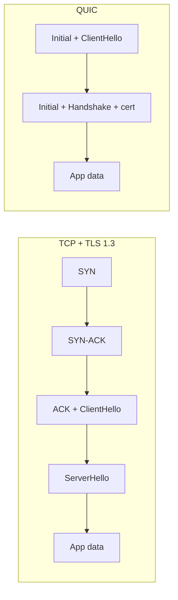

# Chapter 40 — QUIC and DTLS (Experimental)

## What you will learn

- How experimental `node:quic` and `node:dtls` are, and which build and runtime flags gate them.
- The four problems QUIC solves that TCP+TLS structurally cannot, and how HTTP/3 sits on top.
- Node's three QUIC abstractions — endpoint, session, stream — and the options that matter.
- How to write a minimal HTTP/3 client and server against the documented API.
- What DTLS is, why WebRTC and IoT need it, and the shape of `node:dtls`.
- How to decide, honestly, whether either belongs in your system yet.

## Why this matters

Nearly every request your application serves rides on a protocol stack designed in the 1980s with encryption bolted on in the 1990s. TCP guarantees an ordered byte stream, so one lost packet stalls every logical message multiplexed over that connection — the head-of-line blocking HTTP/2 never escaped. TCP also identifies a connection by a four-tuple of addresses and ports, so when a phone moves from Wi-Fi to cellular the connection dies and everything restarts, handshake included. QUIC fixes both by moving the transport into user space on top of UDP and welding TLS 1.3 into the handshake.

This chapter is forward-looking, not production guidance. Both modules here are experimental, both are behind flags, and one is not even compiled into a stock Node binary. Read this to understand what is coming and to prototype — not as permission to ship. The concepts are permanent; the method names may not survive.

## Stability: read this before anything else

| Module | Stability in the docs | Build flag | Runtime flag | First appeared |
|---|---|---|---|---|
| `node:quic` | **Stability 1.0 — Early development** | (built by default) | `--experimental-quic` | v23.8.0 |
| `node:dtls` | **Stability 1 — Experimental** | `--experimental-dtls` (configure) | `--experimental-dtls` | not yet released |

Both are **[Experimental]**. Take Node's own definition literally: experimental features are *not subject to semantic versioning*, non-backward-compatible changes or removal may occur in any release, and use is not recommended in production. Stage 1.0 — where `node:quic` sits — is the least-baked substage: "unfinished and subject to substantial change."

Two details will trip you up. First, **`node:dtls` is a build-time opt-in**: it must be compiled in with the `--experimental-dtls` configure flag *and* enabled at runtime with the CLI flag of the same name, so official binaries from nodejs.org are not guaranteed to contain it. Second, **both modules are `node:`-scheme only** — `require('quic')` will not work. Both flags are permitted inside `NODE_OPTIONS`:

```bash
NODE_OPTIONS=--experimental-quic node server.mjs
```

The docs contradict themselves on the QUIC substage: `quic.md` heads the module at 1.0, while `cli.md` says 1.1 (active development). Treat the module header as authoritative; either way it is stage 1.

One more trap: `node:quic` landed in v23.8.0, but much of its surface — `quic.constants`, `session.opened`, `stream.writer`, `session.keepAlive`, HTTP/3 support, the performance entries, the diagnostic channels — is marked added in v26.2.0 or later. On Node 24, expect large parts of this chapter to be missing.

## What QUIC actually solves

QUIC is a transport protocol built on UDP. Node's implementation follows the IETF specification family: RFC 9000 (transport), RFC 9001 (TLS integration), RFC 9002 (loss detection and congestion control), plus extensions such as RFC 9221 for unreliable datagrams.

### Encryption is not optional

In TCP+TLS, encryption is a layer stacked on a cleartext transport. In QUIC, TLS 1.3 is part of the protocol: the docs state plainly that you cannot use QUIC without TLS, nor substitute a different TLS version. Almost everything on the wire is authenticated and encrypted, headers included — which kills a family of middlebox interference and also means you cannot debug QUIC with a packet capture. You need `session.onkeylog` or `session.onqlog`.

### One round trip, sometimes zero

A conventional HTTPS connection costs a TCP handshake plus a TLS handshake. QUIC merges them — the transport handshake *is* the TLS handshake — so a fresh connection completes in one round trip. On reconnection the client can do better: if it kept a **session ticket** (delivered via `session.onsessionticket`) and passes it back as `sessionOptions.sessionTicket`, it can send application data in its very first flight. `sessionOptions.enableEarlyData` defaults to `true`.

0-RTT is not free. Early data is replayable by an attacker who captures and re-sends the client's first packet, so it must only carry idempotent operations. On the server, `stream.early` is `true` for streams carrying early data — check it. If the server rejects the attempt, every stream opened in the early phase is destroyed, `session.onearlyrejected` fires on the client, and the connection falls back to 1-RTT.

A second piece of resumption state, the **address validation token** (`session.onnewtoken`, replayed as `sessionOptions.token`), lets the client skip the server's address-validation Retry round trip.

### Streams do not block each other

A TCP connection is one ordered byte stream. HTTP/2 multiplexes many logical streams over it, but a single lost segment stalls delivery of *every* stream until it is retransmitted. QUIC moves the ordering guarantee down to the individual stream: loss on stream 4 delays stream 4 and nothing else. This is the biggest single reason HTTP/3 exists.

### Connections survive address changes

QUIC identifies a connection by connection IDs carried in the packets, not by the IP/port four-tuple. The docs spell out the consequence: a session may migrate to a different local or remote address, outlive the endpoint that created it, and even be associated with several endpoints at once. A laptop switching networks keeps its session and its congestion-control state.



### Where HTTP/3 fits

HTTP/3 is HTTP semantics mapped onto QUIC streams, with QPACK (RFC 9204) replacing HPACK. Node selects it by ALPN: when the negotiated identifier is `'h3'` or an `'h3-*'` draft variant, the session runs the HTTP/3 application backed by `nghttp3`. **`'h3'` is the default ALPN** for both `quic.connect()` and `quic.listen()`, so you get HTTP/3 unless you ask for something else. Choosing it unlocks headers and trailers (`:method`, `:path`, `:scheme`, `:authority`, `:status`), informational 1xx responses, RFC 9218 priority, HTTP/3 datagrams (RFC 9297), the ORIGIN frame (RFC 9412), and GOAWAY shutdown.

## The Node API

Three abstractions. Learn these and the rest is options.

| Abstraction | What it is | Created by |
|---|---|---|
| `QuicEndpoint` | The local UDP port binding. Client and server at once; carries many sessions. | `new QuicEndpoint([options])`, or implicitly by `connect()`/`listen()` |
| `QuicSession` | One connection to one peer. Owns TLS state and streams. | `quic.connect()`, or `listen()`'s `onsession` callback |
| `QuicStream` | One ordered byte stream, bidirectional or unidirectional. | `session.createBidirectionalStream()`, `createUnidirectionalStream()`, `session.onstream` |

The surface is large: three top-level functions (`connect`, `listen`, `listEndpoints`), a `constants` object, three classes plus three statistics classes, `QuicError`, five option types, seventeen callback types, performance entries, and around thirty diagnostic channels. This chapter covers the load-bearing parts.

### Connecting

```mjs
import { connect } from 'node:quic';

const session = await connect('example.com:443', {
  servername: 'example.com',
  // alpn defaults to 'h3'
});

const info = await session.opened;
console.log(info.protocol, info.cipher, info.cipherVersion);
console.log('0-RTT accepted:', info.earlyDataAccepted);

await session.close();
```

`quic.connect(address[, options])` takes a `string` or `net.SocketAddress` and returns a promise for a `QuicSession`. `session.opened` is a *second* promise, fulfilled when the TLS handshake completes, resolving to `local`, `remote`, `servername`, `protocol`, `cipher`, `cipherVersion`, `validationErrorReason`, `validationErrorCode`, `earlyDataAttempted`, and `earlyDataAccepted`. The first promise gives you a session object; the second tells you the handshake succeeded.

By default each `connect()` creates a new endpoint on a random local port. To pin the local address, or to multiplex several sessions over one UDP port, pass an `endpoint` option holding a `QuicEndpoint` or `EndpointOptions`. `quic.listEndpoints()` enumerates the live ones.

### Listening

`quic.listen(onsession[, options])` returns a promise for a `QuicEndpoint`. Servers **require** `sessionOptions.sni` — an object mapping host names to TLS identities, with at least one entry. The key `'*'` is the fallback; without it, an unrecognised server name is rejected with a TLS `unrecognized_name` alert.

```mjs
import { listen } from 'node:quic';

const encoder = new TextEncoder();

const endpoint = await listen((session) => {
  session.onerror = (err) => console.error('session failed', err);
}, {
  sni: {
    '*': { keys: [defaultKey], certs: [defaultCert] },
    'api.example.com': { keys: [apiKey], certs: [apiCert] },
  },
  onheaders(headers) {
    // `this` is the QuicStream.
    this.sendHeaders({ ':status': '200', 'content-type': 'text/plain' });
    const w = this.writer;
    w.writeSync(encoder.encode('ok\n'));
    w.endSync();
  },
});

console.log('listening on', endpoint.address);
```

Each SNI entry takes `keys` and `certs` (both required) plus optional `verifyPrivateKey` (`false`), `port` (`443`, advertised in ORIGIN frames), and `authoritative` (`true`). Shared TLS options — `ciphers`, `groups`, `keylog`, `verifyClient` — go at the top level. `endpoint.setSNIContexts()` swaps the map atomically for new sessions.

The `onheaders` placement above is deliberate: at the `listen()` level it is wired to every incoming stream *before* `onstream` fires. For HTTP/3 the request HEADERS frame arrives first, so registering it inside `onstream` is too late.

### Writing and reading

Two mutually exclusive ways to produce data on a stream:

- **Body source** — pass `body` at creation or call `stream.setBody()`. Accepted: `string`, `ArrayBuffer`, `SharedArrayBuffer`, `ArrayBufferView`, `Blob`, `FileHandle`, `AsyncIterable`, sync `Iterable`, a `Promise` for any of those, or `null` (closes the writable side immediately).
- **Writer** — `stream.writer` gives `writeSync()`, `writevSync()`, `endSync()`, async `write()`, `writev()`, `end()`, plus `fail(reason)` and `canWrite`. `writeSync()` returns `false` when the buffer is full and the data is *not* accepted; wait for drain and retry. Buffer size is the `budget` option, default `65536`.

Reading is async iteration, and each iteration yields a **batch** of `Uint8Array` chunks, not one chunk:

```mjs
const decoder = new TextDecoder();
for await (const chunks of stream) {
  for (const chunk of chunks) {
    process.stdout.write(decoder.decode(chunk, { stream: true }));
  }
}
```

Only one async iterator can be obtained per stream.

### Datagrams

`session.sendDatagram(datagram[, encoding])` returns a promise for a `bigint` datagram ID, and is best-effort in a very literal sense: if the payload is too large, zero-length, or the peer advertised `maxDatagramFrameSize` of `0`, you get `0n` and **no error is thrown**. Check the return value.

Enabling datagrams needs agreement at two layers: both peers must advertise a non-zero `maxDatagramFrameSize` transport parameter (local default `1200` bytes), and HTTP/3 sessions must additionally set `application.enableDatagrams` to `true`. Delivery status arrives via `session.ondatagramstatus` as `'acknowledged'`, `'lost'`, or `'abandoned'`.

### Options worth knowing

| Option | Where | Default | Notes |
|---|---|---|---|
| `alpn` | session | `'h3'` | String on clients; array in preference order on servers. |
| `sni` | session (server) | — | **Required**; `'*'` is the fallback identity. |
| `enableEarlyData` | session | `true` | Disable if replay risk is unacceptable. |
| `keepAlive` | session | `0` (off) | Milliseconds between PING frames; keep below the idle timeout. |
| `cc` | session | — | `'reno'`, `'cubic'`, `'bbr'`; also in `quic.constants.cc`. |
| `certificateCompression` | session | disabled | RFC 8879; helps stay inside the amplification limit. |
| `maxConnectionsTotal` | endpoint | `0` (unlimited) | Max `65535`; settable live. |
| `maxConnectionsPerHost` | endpoint | `0` (unlimited) | Max `65535`; refuses with `CONNECTION_REFUSED`. |
| `blockList` / `blockListPolicy` | endpoint | — / `'deny'` | `net.BlockList` checked before QUIC processing; `'allow'` inverts it. |
| `idleTimeout` | endpoint | `0` | Seconds an idle endpoint lingers. `0` means never. |

Two operational levers: `endpoint.busy = true` rejects new sessions while the endpoint catches up, and the endpoint applies token-bucket rate limiting to stateless responses (retry, stateless reset, version negotiation, immediate close — defaults 100/sec, burst 200) plus per-host session creation (default 50/sec, burst 100). Every limiter has a counter in `endpoint.stats`; a non-zero `retryRateLimited` or `sessionCreationRateLimited` means it is firing.

### Certificate size is a latency bug

RFC 9000's anti-amplification rule caps the server at three times the bytes received before the client's address is validated — roughly 3600 bytes, since the client Initial is about 1200. If your certificate chain exceeds that, the handshake needs an extra round trip and QUIC's headline advantage is gone. The docs are explicit: prefer ECDSA (P-256 or P-384) at roughly 1.5–2 KB per chain over RSA-2048 at 3–5 KB, send only leaf plus necessary intermediates, and pick a CA with a short chain. `certificateCompression` is the other lever.

Under the permission model (Chapter 31), `--allow-net` is required for both modules; without it, `connect()` and `listen()` throw `ERR_ACCESS_DENIED`. Constructing an endpoint alone is fine — no I/O happens until you connect or listen.

### What HTTP/3 in Node does not do

The docs list the gaps directly, and they matter for adoption planning: **server push** (`PUSH_PROMISE`) is not implemented and not on the roadmap; **WebTransport and extended-CONNECT helpers** are absent — `SETTINGS_ENABLE_CONNECT_PROTOCOL` can be negotiated via `application.enableConnectProtocol`, but nothing handles the `:protocol` pseudo-header, WebTransport datagram demultiplexing, or capsule framing; and **higher-level HTTP semantics** — routing, URL parsing, content negotiation, redirects, cookies — are left to libraries. `node:quic` gives you wire framing, not a web framework.

## DTLS: TLS over datagrams

DTLS solves a different problem. Sometimes you genuinely want datagram semantics — unordered, unreliable, message-oriented — but still need confidentiality, integrity, and authentication. TLS cannot do this because it assumes a reliable ordered byte stream. DTLS adapts TLS to UDP.

The docs name four differences from TLS: no stream guarantees (messages may arrive out of order or be lost, and datagram boundaries are preserved); one socket serving many peers, multiplexed by the `DTLSEndpoint`; a stateless cookie exchange (HelloVerifyRequest) to prevent DoS amplification; and internal handshake retransmission, since UDP will not do it for you.

The two dominant uses are **WebRTC**, where DTLS-SRTP negotiates the keys protecting media streams, and **constrained IoT**, where CoAP over DTLS is the standard secure profile for devices too small for a TCP stack.

### The surface

`dtls.listen(callback, options)` returns a `DTLSEndpoint` **synchronously** — unlike `quic.listen()`, which returns a promise. Required: `cert`, `key` (PEM), and `port`. Optional: `host` (`'0.0.0.0'`), `ca`, `ciphers`, `alpn`, `srtp`, `requestCert` (`false`), `mtu` (`1200`).

`dtls.connect(host, port[, options])` returns a `DTLSSession` synchronously; await `session.opened`, which resolves with `{ protocol }`. Client options: `ca`, `cert`, `key`, `rejectUnauthorized` (`true`), `servername` (defaults to `host`; `''` disables SNI, never sent for IP literals), `bindHost` (`'0.0.0.0'`), `bindPort` (`0`), `alpn`, `srtp`, `mtu`.

```mjs
import { connect } from 'node:dtls';
import { readFileSync } from 'node:fs';

const session = connect('sensor.example.com', 5684, {
  ca: [readFileSync('ca-cert.pem')],
});

session.onmessage = (data) => console.log('reply:', data.toString());
session.onerror = (err) => console.error(err);

await session.opened;
session.send('GET /temperature');
```

The session API is deliberately small: `send(data)` returning the byte count, `close()`, `destroy([error])`, the `opened` and `closed` promises, `remoteAddress`, `protocol` (e.g. `'DTLSv1.2'`), `cipher`, `peerCertificate`, `alpnProtocol`, `srtpProfile`, `stats`, and `exportKeyingMaterial(length, label[, context])`. Callbacks are plain properties — `onmessage`, `onerror`, `onhandshake`, `onkeylog`. There is no `EventEmitter` here; `session.on('message', ...)` will not work.

`exportKeyingMaterial()` is the RFC 5705 hook that makes DTLS-SRTP possible: after the handshake negotiates an SRTP profile, export keying material with the label `'EXTRACTOR-dtls_srtp'` and feed it to your media stack.

`DTLSEndpoint` exposes `address`, `state` (`bound`, `listening`, `closing`, `destroyed`, `sessionCount`, `busy`), `stats`, a writable `busy` flag, `close()`, `destroy([error])`, and `closed`. Both classes implement `Symbol.asyncDispose`, so `await using` works.

Finally, the MTU caveat: libuv does not support path MTU discovery, so `node:dtls` hard-codes a conservative 1200-byte default. `mtu` accepts 256 through 65535. Raising it on a path that cannot carry it means silently dropped handshake fragments.

## Should you adopt either?

Five questions, in order.

1. **Can you pass the flag?** A managed runtime you do not control ends the conversation. DTLS additionally needs a custom build.
2. **Can you absorb a breaking change on a minor release?** Stage 1.0 means yes, this will happen.
3. **Do you need the properties?** Head-of-line blocking hurts when you multiplex many small responses on a lossy path; migration matters for mobile clients. On a reliable datacentre link, HTTP/2 already performs fine.
4. **Does a gap block you?** No server push, no WebTransport helpers, no HTTP semantics.
5. **Can the network path carry UDP/443?** Some corporate networks throttle or block it. Real HTTP/3 deployments always keep an HTTP/2 fallback advertised via `Alt-Svc`.

A reasonable position for most teams today: terminate HTTP/3 at a mature edge proxy, keep the Node origin on HTTP/1.1 or HTTP/2, and revisit `node:quic` at stage 1.2 or stable.

## Common mistakes

### ❌ Assuming `await connect()` means the handshake finished

`quic.connect()` resolves with a session object as soon as the session exists — not when TLS completes. Using the session immediately can mean acting on an unauthenticated peer.

```mjs
// ❌ Certificate validation status is unknown here.
const session = await connect('example.com:443');
await session.createUnidirectionalStream({ body: secret });
```

```mjs
// ✅ Wait for the handshake and inspect the result.
const session = await connect('example.com:443', { servername: 'example.com' });
const info = await session.opened;
if (info.validationErrorCode !== 0) {
  throw new Error(`peer cert rejected: ${info.validationErrorReason}`);
}
await session.createUnidirectionalStream({ body: secret });
```

### ❌ Treating a stream iteration as a single chunk

Each iteration yields an *array* of `Uint8Array`. Decoding the batch directly produces garbage or throws.

```mjs
// ❌ `chunk` is a Uint8Array[], not a Uint8Array.
for await (const chunk of stream) {
  body += decoder.decode(chunk, { stream: true });
}
```

```mjs
// ✅ Iterate the batch.
for await (const chunks of stream) {
  for (const chunk of chunks) {
    body += decoder.decode(chunk, { stream: true });
  }
}
```

### ❌ Ignoring the return value of `sendDatagram()`

Datagrams fail silently by design. A too-large payload, a peer that never enabled datagrams, or an empty buffer all return `0n` without throwing, and your telemetry disappears.

```mjs
// ❌ Looks like it worked. It may not have.
await session.sendDatagram(payload);
```

```mjs
// ✅ Check the ID and fall back to a stream when it is zero.
const id = await session.sendDatagram(payload);
if (id === 0n) {
  await session.createUnidirectionalStream({ body: payload });
}
```

### ❌ Registering `onheaders` inside `onstream` on an HTTP/3 server

The HEADERS frame is the first thing to arrive on an HTTP/3 request stream. By the time `onstream` runs and you attach a handler, you have missed it.

```mjs
// ❌ Too late — the request headers have already been delivered.
await listen((session) => {
  session.onstream = (stream) => {
    stream.onheaders = (headers) => respond(stream, headers);
  };
}, { sni });
```

```mjs
// ✅ Wire it at the listen() level so every stream has it from birth.
await listen((session) => {
  session.onerror = (err) => log(err);
}, {
  sni,
  onheaders(headers) { respond(this, headers); },
});
```

### ❌ Shipping an RSA certificate chain on a QUIC server

A 3–5 KB RSA chain breaks the anti-amplification limit and adds a round trip to every fresh handshake — the exact latency QUIC removes. Issue an ECDSA P-256 leaf, trim to leaf plus intermediates, and consider `certificateCompression`.

## Production notes

- **There is no production story yet.** Stage 1.0 means the API can change or vanish in a minor release. Pin the exact Node patch version and read the changelog on every upgrade. Nothing else here matters more.
- **Observability is unusually good, and free when unused.** QUIC emits `PerformanceEntry` objects with `entryType: 'quic'` and `name` of `'QuicEndpoint'`, `'QuicSession'`, or `'QuicStream'`, created only when a `PerformanceObserver` is observing. There are also roughly thirty `diagnostics_channel` channels (`quic.session.handshake`, `quic.stream.reset`, `quic.endpoint.busy.change`, …). Use these rather than instrumenting by hand — Chapters 48 and 49.
- **Stats objects go stale.** Statistics are live views backed by C++ internals; once the underlying object is destroyed they freeze into a snapshot (DTLS exposes `isConnected` so you can tell). Copy what you need before teardown.
- **Rate limiting is on by default and will bite benchmarks.** Per-host session creation defaults to 50/sec, burst 100 — a load generator from one source IP hits that immediately, and you will conclude the server is slow when it is shedding you. Raise `sessionCreationRate`/`sessionCreationBurst` for single-source tests and watch `endpoint.stats.sessionCreationRateLimited`.
- **Encrypted transport means you lose `tcpdump`.** Plan for `session.onkeylog` (Wireshark) or `session.onqlog` before you need them, and treat keylog output as a secret — it decrypts the session. Capacity limits live in the UDP buffers (`udpReceiveBufferSize`, `udpSendBufferSize`); exhaustion looks like packet loss, not like an error.
- **Always keep a TCP fallback**, advertised via `Alt-Svc` from an HTTP/2 endpoint. UDP/443 is blocked often enough that an HTTP/3-only public endpoint is unreachable for a slice of real users.
- **DTLS needs a custom build.** Budget for compiling Node with `--experimental-dtls` and maintaining it through security releases — weigh that against a native DTLS library behind an addon.

## Exercises

1. **Confirm the gate.** Import `node:quic` and print `quic.constants.cc`, first without the flag and then with `--experimental-quic`. Success: you can state the exact error when the flag is missing and the three congestion-control identifiers when it is present.
2. **Enumerate the surface.** From `quic.md` alone, build a table of every `EndpointOptions` member with a documented default, including type and default. Success: at least fifteen rows, all matching the docs.
3. **Minimal HTTP/3 round trip.** With a self-signed ECDSA P-256 certificate, run a `quic.listen()` server answering `/health` with `200 ok` and a `quic.connect()` client that prints the status. Success: the client prints `200` and the session closes with no unhandled rejection.
4. **Measure the handshake.** Attach a `PerformanceObserver` for `entryTypes: ['quic']` to that server and log `detail.handshake`, then reconnect reusing the ticket from `onsessionticket`. Success: `earlyDataAttempted` and `earlyDataAccepted` differ between the cold and warm connection.
5. **Adoption memo.** Write a one-page recommendation on adopting `node:quic` for a mobile-first API. Success: it cites the stability stage, two documented HTTP/3 gaps, the flag requirement, and a fallback plan.

## Recap

- `node:quic` is **Stability 1.0 — Early development** behind `--experimental-quic`; `node:dtls` is **Stability 1 — Experimental** and needs the flag at build *and* run time.
- QUIC merges the transport and TLS 1.3 handshakes into one round trip, supports 0-RTT resumption, removes cross-stream head-of-line blocking, and survives address changes via connection IDs.
- Node models QUIC as endpoint → session → stream. `session.opened` is a separate handshake promise you must await before trusting the peer.
- HTTP/3 is the default application (ALPN `'h3'`) and servers require an `sni` map. Server push, WebTransport helpers, and HTTP semantics are not implemented.
- Stream data goes out through either a `body` source or `stream.writer`, never both, and comes in as batches of `Uint8Array`. `sendDatagram()` returns `0n` instead of throwing.
- Certificate chain size is a latency concern because of the anti-amplification limit: ECDSA, short chains, optional certificate compression.
- DTLS gives TLS guarantees over datagrams for WebRTC media and constrained IoT: a small callback-property API, synchronous `listen()`/`connect()`, and a 1200-byte default MTU.

## Where to go next

- [Chapter 37 — TLS and HTTPS](37-tls-https.md) for certificates, SNI, and the TLS 1.3 handshake QUIC embeds.
- [Chapter 38 — HTTP/2](38-http2.md) for the multiplexing model QUIC improves on.
- [Chapter 39 — UDP with `node:dgram`](39-udp-dgram.md) for the datagram layer both modules sit on.
- [Chapter 31 — The Permission Model](../part4-system/31-permission-model.md) for `--allow-net`.
- [Chapter 48 — Diagnostics Channel and Trace Events](../part7-diagnostics/48-diagnostics-channel-tracing.md) and [Chapter 49 — Measuring Performance with `perf_hooks`](../part7-diagnostics/49-perf-hooks.md) for the observability hooks.
- Official docs: <https://nodejs.org/docs/latest/api/quic.html> and <https://nodejs.org/docs/latest/api/dtls.html>
