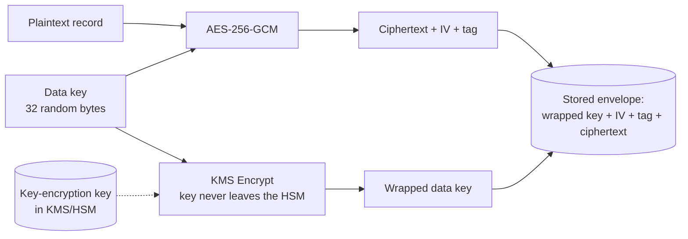

# Chapter 42 — Encryption, Signatures, Key Management, and Certificates

**What you will learn**

- How to encrypt data correctly with AES-GCM: key, nonce, authentication tag, additional authenticated data, and a serialized envelope format you can store and version.
- Exactly why nonce reuse destroys AES-GCM, and how to structure a system so it cannot happen.
- Which key derivation function to reach for — scrypt, PBKDF2, Argon2, or HKDF — and how to split one master key into many purpose-specific keys.
- The `KeyObject` model, the four key encoding types (`pkcs1`, `pkcs8`, `sec1`, `spki`) and four formats (`pem`, `der`, `jwk`, raw), and how to encrypt a private key at rest.
- How to sign and verify with Ed25519, ECDSA, RSA-PSS and PKCS#1 v1.5 — and which one to choose.
- How to do key agreement with X25519 and ECDH, and why you must never use the shared secret directly.
- How to parse, validate and monitor X.509 certificates with `crypto.X509Certificate`.

## Why this matters

Chapter 41 covered the primitives that only go one way: hashes, HMACs, random bytes. This chapter covers the ones that go both ways, and that is where the danger lives. A hash that you use slightly wrong usually still produces something; a cipher that you use slightly wrong produces ciphertext that looks perfectly random and is completely broken. There is no error message. Your tests pass. The failure only surfaces when someone competent looks at your data.

The single most common real-world task is this: you have a column in a database — an API token, a refresh token, a customer's bank account number — and you must store it encrypted, decrypt it on read, and survive a key rotation later. Nearly every implementation of that task written from scratch gets at least one of four things wrong: it uses an unauthenticated mode so an attacker can flip bits in the ciphertext, it reuses an initialization vector, it discards the authentication tag, or it hard-codes a key that can never be rotated. This chapter gives you a complete, correct template for that task and then explains every decision inside it, so that when your requirements differ you know what you are allowed to change.

## The symmetric encryption API

Node's symmetric encryption is exposed through two factory functions and two classes.

```mjs
import { createCipheriv, createDecipheriv } from 'node:crypto';
```

```cjs
const { createCipheriv, createDecipheriv } = require('node:crypto');
```

`crypto.createCipheriv(algorithm, key, iv[, options])` returns a `Cipheriv`; `crypto.createDecipheriv(algorithm, key, iv[, options])` returns a `Decipheriv`. Both classes extend `stream.Transform`, so you can either pipe through them or drive them manually with `update()` and `final()`. You never construct them with `new`.

The `algorithm` string is passed through to OpenSSL, so the exact set available depends on how your Node binary was built. `crypto.getCiphers()` returns the list, and `crypto.getCipherInfo(name)` tells you the expected `keyLength`, `ivLength`, `blockSize` and `mode` in bytes — useful when you are about to hard-code a length and want the runtime to confirm it.

```js
import { getCipherInfo } from 'node:crypto';
console.log(getCipherInfo('aes-256-gcm'));
// { mode: 'gcm', name: 'id-aes256-gcm', nid: 901, blockSize: 1, ivLength: 12, keyLength: 32 }
```

### The non-IV forms are gone, not merely discouraged

Older tutorials show `crypto.createCipher(algorithm, password)`. Do not go looking for it: `crypto.createCipher()` and `crypto.createDecipher()` are **[Deprecated]** under `DEP0106` and reached End-of-Life in **v22.0.0** — calling them in Node 27 is a `TypeError`, not a warning. They derived the key from a password using MD5 with no salt and used a static initialization vector, which means two messages encrypted with the same password produced ciphertexts an attacker could correlate. The replacement is exactly what this chapter teaches: derive a key with `crypto.scrypt()` or `crypto.pbkdf2()` and pass an explicit random IV to `createCipheriv()`.

### What each block mode actually guarantees

This is the decision that matters most, and the algorithm name encodes it. `aes-256-gcm` means AES with a 256-bit key in GCM mode.

| Mode | Confidentiality | Integrity / authenticity | IV or nonce | Verdict |
|---|---|---|---|---|
| ECB | **No** — identical plaintext blocks produce identical ciphertext blocks | No | none | Never use |
| CBC | Yes, if the IV is random and unpredictable | No | 16 random bytes | Only with a separate MAC; prefer GCM |
| CTR | Yes | No | counter block must never repeat | Only with a separate MAC |
| GCM | Yes | Yes, via a 16-byte tag | 12-byte nonce, must be unique | **Default choice** |
| CCM | Yes | Yes | 7–13 byte nonce | Constrained; see below |
| OCB | Yes | Yes | per-cipher | Fine, less widely deployed |
| `chacha20-poly1305` | Yes | Yes | 12-byte nonce | Best choice without AES hardware |

The four modes in the "integrity" rows are **AEAD** modes — Authenticated Encryption with Associated Data. An AEAD mode gives you one primitive that both hides the plaintext and proves it was not modified. Anything else forces you to bolt on an HMAC yourself, in the right order, with a second key, compared in constant time. People get that wrong constantly. Use AEAD.

CCM carries extra rules that the docs spell out and that will bite you: `authTagLength` is **required** at cipher creation and must be 4, 6, 8, 10, 12, 14 or 16 bytes; the nonce must be 7–13 bytes; the plaintext length is capped at `2 ** (8 * (15 - N))` bytes for a nonce of `N` bytes; the tag must be given via `setAuthTag()` *before* `update()` when decrypting; and CCM cannot handle more than one chunk per instance, so `write()`, `end()` and `pipe()` may fail. Unless a protocol forces CCM on you, use GCM.

## AES-GCM, end to end

### The three things GCM needs from you

1. **A key** of exactly 16, 24 or 32 bytes for `aes-128-gcm`, `aes-192-gcm` or `aes-256-gcm`. It must come from a CSPRNG or a KDF, never from a password directly and never from a string literal.
2. **A nonce** (Node calls it the `iv`) that is unique for every single message encrypted under that key. Twelve bytes is the right size. It does not need to be secret and travels alongside the ciphertext.
3. **A place to put the 16-byte authentication tag**, which `cipher.getAuthTag()` produces after `final()` and which you must hand back to `decipher.setAuthTag()` before decrypting.

### Nonce reuse is not a degradation, it is a break

If you encrypt two different messages with the same key and the same nonce under GCM, two things happen at once. First, the keystream is identical, so XORing the two ciphertexts yields the XOR of the two plaintexts — an attacker who knows or guesses one message reads the other. Second, and worse, the attacker can recover GCM's internal authentication subkey. From that point on they can forge valid authentication tags for messages you never wrote, and your decryption routine will accept them as genuine. A single accidental reuse compromises the *authenticity* of every message under that key, not just the two that collided.

There are exactly two safe nonce strategies:

- **Random.** Generate 12 fresh bytes from `crypto.randomBytes(12)` per message. Collisions are governed by the birthday bound, so keep the number of messages under a single key well below 2³², and rotate the key when you approach it. This is what the template below does, and it is right for almost everyone.
- **Counter.** Keep a strictly monotonic counter, encode it into the 12 bytes, and never let it reset. This is safe only if you can guarantee the counter never goes backwards across restarts, replicas, and restores from backup. If you cannot guarantee that — and in a container fleet you usually cannot — use random nonces.

### A complete encryption module

This is the template. It produces a single self-describing `Buffer` you can put in a `BYTEA` column, an S3 object, or a message body.

```mjs
// secretbox.mjs
import { createCipheriv, createDecipheriv, randomBytes } from 'node:crypto';
import { Buffer } from 'node:buffer';

const ALGORITHM = 'aes-256-gcm';
const VERSION = 1;      // bump when the format or algorithm changes
const IV_BYTES = 12;
const TAG_BYTES = 16;
const HEADER = 1 + IV_BYTES + TAG_BYTES;

/**
 * key: 32-byte Buffer or a secret KeyObject
 * plaintext: Buffer
 * aad: Buffer of data that is authenticated but not encrypted
 */
export function seal(key, plaintext, aad = Buffer.alloc(0)) {
  const iv = randomBytes(IV_BYTES);
  const cipher = createCipheriv(ALGORITHM, key, iv, { authTagLength: TAG_BYTES });
  cipher.setAAD(aad, { plaintextLength: plaintext.length });

  const body = Buffer.concat([cipher.update(plaintext), cipher.final()]);
  const tag = cipher.getAuthTag();

  return Buffer.concat([Buffer.from([VERSION]), iv, tag, body]);
}

export function open(key, envelope, aad = Buffer.alloc(0)) {
  if (envelope.length < HEADER) {
    throw new Error('ciphertext envelope is truncated');
  }
  if (envelope[0] !== VERSION) {
    throw new Error(`unsupported envelope version ${envelope[0]}`);
  }

  const iv = envelope.subarray(1, 1 + IV_BYTES);
  const tag = envelope.subarray(1 + IV_BYTES, HEADER);
  const body = envelope.subarray(HEADER);

  const decipher = createDecipheriv(ALGORITHM, key, iv, { authTagLength: TAG_BYTES });
  decipher.setAAD(aad, { plaintextLength: body.length });
  decipher.setAuthTag(tag);

  // final() throws if the tag does not verify. Let it.
  return Buffer.concat([decipher.update(body), decipher.final()]);
}
```

Using it:

```mjs
import { randomBytes } from 'node:crypto';
import { Buffer } from 'node:buffer';
import { seal, open } from './secretbox.mjs';

const key = randomBytes(32);
const aad = Buffer.from('user:4711');            // context this record belongs to

const envelope = seal(key, Buffer.from('4111 1111 1111 1111'), aad);
console.log(open(key, envelope, aad).toString());  // 4111 1111 1111 1111

// Any modification anywhere in the envelope is detected:
envelope[envelope.length - 1] ^= 1;
open(key, envelope, aad);  // throws: Unsupported state or unable to authenticate data
```

Five details in that module are load-bearing:

- **The version byte.** You will change algorithm or key length one day. A one-byte prefix means old rows stay readable while new rows use the new scheme. Without it you get an all-or-nothing migration.
- **`setAAD` before `update`.** The docs are explicit: `cipher.setAAD()` must be called before `cipher.update()`. Calling it afterwards throws.
- **`plaintextLength`.** For GCM and OCB this option is optional; for CCM it is **mandatory** and must exactly equal the plaintext length in bytes (the ciphertext length when decrypting). Passing it always means the module still works if you swap `aes-256-gcm` for `aes-256-ccm`.
- **`authTagLength`.** Optional for GCM (default 16 bytes) and for `chacha20-poly1305` (default 16), required for CCM and OCB. Since **v26.0.0**, using a GCM tag shorter than 128 bits without declaring `authTagLength` on the decipher is rejected outright — earlier releases only deprecated it. Do not shorten the tag; 16 bytes is the correct value.
- **Letting `final()` throw.** `decipher.update()` will happily hand you plaintext-shaped bytes before authentication has been checked. The docs warn about this directly: authenticity is only established when `final()` is called. Never return, log, parse, or act on the output of `update()` before `final()` has returned.

### What AAD is for

Additional authenticated data is not encrypted. It is mixed into the tag computation, so decryption fails if the AAD presented at decrypt time differs from the AAD used at encrypt time. Use it to bind a ciphertext to its context: the row's primary key, the tenant ID, the object's storage path. With `aad = Buffer.from('user:4711')`, an attacker with database write access cannot take user 4711's encrypted card number and paste it into user 9000's row — the tag will not verify. Without AAD, that swap succeeds silently.

### Encrypting a large file with streams

For anything that does not fit comfortably in memory, use the stream interface. `Cipheriv` is a `Transform`, so it slots into `pipeline()`.

```mjs
import { createReadStream, createWriteStream } from 'node:fs';
import { pipeline } from 'node:stream/promises';
import { createCipheriv, randomBytes } from 'node:crypto';
import { appendFile } from 'node:fs/promises';

export async function encryptFile(key, source, target) {
  const iv = randomBytes(12);
  const cipher = createCipheriv('aes-256-gcm', key, iv);

  await appendFile(target, iv);                    // header first
  await pipeline(createReadStream(source), cipher, createWriteStream(target, { flags: 'a' }));
  await appendFile(target, cipher.getAuthTag());   // trailer last
}
```

The tag can only be read after the stream has ended, which is why it goes at the end of the file — the same reason TLS records and most container formats put their MAC last. On decryption you must read the last 16 bytes first, call `setAuthTag()`, and only then stream the body.

### ChaCha20-Poly1305

`chacha20-poly1305` is the IETF variant, supported since v11.2.0. It takes a 32-byte key and a 12-byte nonce, and produces a 16-byte tag, so it is a drop-in swap in the module above:

```js
const cipher = createCipheriv('chacha20-poly1305', key, iv, { authTagLength: 16 });
```

Choose it over AES-GCM when your code runs on hardware without AES instructions (older ARM, some embedded targets), where it is substantially faster and, being software-only, less exposed to cache-timing issues. On any modern x86-64 or ARMv8 server, AES-GCM wins on throughput. The nonce-uniqueness requirement is identical and equally unforgiving.

## Key derivation

You almost never have a key. You have a password, or a master secret, or a shared secret from a key exchange. A key derivation function turns one of those into key material of the right size and shape.

| Function | Input | Use it for | Cost knobs | Node API |
|---|---|---|---|---|
| PBKDF2 | password | passwords, when FIPS or an existing format requires it | `iterations`, `digest` | `crypto.pbkdf2()` / `Sync` |
| scrypt | password | passwords — memory-hard, resists GPU cracking | `cost`/`N` (default `16384`), `blockSize`/`r` (`8`), `parallelization`/`p` (`1`), `maxmem` (`32 * 1024 * 1024`) | `crypto.scrypt()` / `Sync` |
| Argon2 | password | passwords — the modern winner; added in **v24.7.0** | `memory`, `passes`, `parallelism`, `tagLength`, optional `secret` and `associatedData` | `crypto.argon2()` / `Sync` |
| HKDF | an existing high-entropy secret | splitting one key into many | `digest`, `salt`, `info` | `crypto.hkdf()` / `Sync` |

The dividing line is entropy. PBKDF2, scrypt and Argon2 are *slow on purpose*, because their input is a low-entropy human password and the only defence is to make each guess expensive. HKDF is *fast on purpose*, because its input already has full entropy and slowing it down would buy nothing.

Never use HKDF on a password. Never use scrypt to split a 32-byte master key — you would be paying 100 ms and 32 MB of RAM for no security benefit.

```mjs
import { scrypt } from 'node:crypto';
import { promisify } from 'node:util';

const scryptAsync = promisify(scrypt);

// 32 bytes for AES-256, from a user password and a per-user random salt.
const key = await scryptAsync(password.normalize('NFC'), salt, 32, {
  cost: 2 ** 15, blockSize: 8, parallelization: 1, maxmem: 128 * 1024 * 1024,
});
```

Two notes on that call. Raising `cost` above the default forces you to raise `maxmem` too, because it is an error when approximately `128 * N * r > maxmem`. And the `.normalize('NFC')` matters: Node does not normalize Unicode, so a password typed with a composed `é` and one typed with `e` + combining accent are different byte sequences and derive different keys. The docs call this out explicitly; normalizing user input before it reaches a KDF avoids a support ticket you will otherwise receive from exactly one user.

Argon2 takes its parameters as a single object and all of them are required:

```mjs
import { argon2, randomBytes } from 'node:crypto';
import { promisify } from 'node:util';

const argon2Async = promisify(argon2);
const key = await argon2Async('argon2id', {
  message: password,
  nonce: randomBytes(16),   // this is the salt
  parallelism: 4,
  tagLength: 32,
  memory: 65536,            // in 1 KiB blocks, so 64 MiB
  passes: 3,
});
```

Argon2 depends on the linked OpenSSL build (the Web Crypto documentation marks it as requiring OpenSSL ≥ 3.2), so feature-detect before you depend on it in a library meant to run anywhere.

### One master key, many derived keys with HKDF

You should never use the same key for two different purposes. HKDF's `info` parameter exists precisely so you do not have to store five master keys — you store one and label the outputs.

```mjs
import { hkdfSync } from 'node:crypto';
import { Buffer } from 'node:buffer';

const master = Buffer.from(process.env.MASTER_KEY, 'base64');   // 32 random bytes
const salt = Buffer.from('app-v1-salt');

function subkey(label, bytes = 32) {
  // hkdfSync returns an ArrayBuffer, not a Buffer.
  return Buffer.from(hkdfSync('sha256', master, salt, label, bytes));
}

const piiKey     = subkey('pii-encryption');
const sessionKey = subkey('session-cookie-mac');
const searchKey  = subkey('blind-index');
```

Change one label and the derived key changes completely; leaking `sessionKey` tells an attacker nothing about `piiKey`. Constraints from the docs: `info` may be zero-length but not more than 1024 bytes, `keylen` must be greater than zero and at most 255 times the digest size (16 320 bytes for SHA-512), and `salt` and `ikm` must be provided but may be zero-length. And note the return type — **`crypto.hkdf()` and `crypto.hkdfSync()` return an `ArrayBuffer`**, unlike `pbkdf2` and `scrypt`, which return a `Buffer`. Forgetting the `Buffer.from()` wrapper produces an object with no `length` in bytes and no `toString('hex')`, and the resulting error appears far from its cause.

## Asymmetric keys and the `KeyObject` model

### Generating a key pair

```mjs
import { generateKeyPair } from 'node:crypto';
import { promisify } from 'node:util';

const generateKeyPairAsync = promisify(generateKeyPair);

// KeyObjects, because no encoding options were given:
const { publicKey, privateKey } = await generateKeyPairAsync('ed25519');
console.log(privateKey.type, privateKey.asymmetricKeyType);   // private ed25519
```

`crypto.generateKeyPair(type, options, callback)` and `crypto.generateKeyPairSync(type, options)` accept the type strings listed under "asymmetric key types" in the docs: `'rsa'`, `'rsa-pss'`, `'dsa'`, `'ec'`, `'ed25519'`, `'ed448'`, `'x25519'`, `'x448'`, `'dh'`, plus the post-quantum `'ml-dsa-*'`, `'ml-kem-*'` and `'slh-dsa-*'` families added in v24.6.0–v24.8.0. The relevant options:

| Option | Applies to | Notes |
|---|---|---|
| `modulusLength` | RSA, DSA | bits; use ≥ 2048, 3072 or 4096 for long-lived keys |
| `publicExponent` | RSA | default `0x10001` — leave it alone |
| `namedCurve` | EC | e.g. `'prime256v1'`, `'secp384r1'`; `crypto.getCurves()` lists them |
| `hashAlgorithm`, `mgf1HashAlgorithm`, `saltLength` | RSA-PSS | bakes PSS parameters into the key |
| `publicKeyEncoding`, `privateKeyEncoding` | all | see `keyObject.export()`; **omit them to get `KeyObject`s** |

`crypto.generateKey(type, options, callback)` is the symmetric equivalent: `type` is `'hmac'` or `'aes'`, `options.length` is in bits (128, 192 or 256 for AES), and the result is a secret `KeyObject`.

### Why `KeyObject` beats passing PEM strings around

The documentation states the rule plainly: import key material into a `KeyObject` once and reuse it. There are four reasons.

1. **Performance.** Every operation that receives a PEM string re-parses Base64 and ASN.1 first. A `KeyObject` parses once. The docs note that the *first* operation on a given `KeyObject` may still be slower because OpenSSL lazily initializes internal caches — so warm your keys at boot rather than on the first request.
2. **Type safety.** `keyObject.type` is `'secret'`, `'public'` or `'private'`; `keyObject.asymmetricKeyType` tells you the algorithm; `keyObject.asymmetricKeyDetails` gives you `modulusLength`, `namedCurve` and friends. A string tells you nothing until it fails.
3. **Containment.** A private key held as a string is a string: it lands in logs, in `JSON.stringify` output, in error messages, in heap snapshots that get shared. A `KeyObject` does not serialize its material. `crypto.createPublicKey(privateKeyObject)` returns a public `KeyObject` from which the private half provably cannot be extracted.
4. **Threads.** `KeyObject` instances can be sent to worker threads with `postMessage()` and do not need to be listed in `transferList`. The receiver gets a clone.

The three importers:

```mjs
import { createPrivateKey, createPublicKey, createSecretKey } from 'node:crypto';
import { readFile } from 'node:fs/promises';
import { Buffer } from 'node:buffer';

const privateKey = createPrivateKey({
  key: await readFile('server.key'),
  format: 'pem',
  passphrase: process.env.KEY_PASSPHRASE,
});

const publicKey = createPublicKey(privateKey);          // derived, not re-read
const hmacKey = createSecretKey(Buffer.from(process.env.HMAC_KEY, 'base64'));
```

`createPublicKey()` also accepts a PEM **X.509 certificate** and will pull the public key out of it — handy when a partner sends you a `.crt` instead of a `.pem`.

### Formats and types

Two orthogonal axes confuse everybody, so hold them apart:

| `format` | What you get back | Notes |
|---|---|---|
| `'pem'` | `string` | Base64 between `-----BEGIN ...-----` lines. Default. |
| `'der'` | `Buffer` | Binary ASN.1. Requires an explicit `type`. |
| `'jwk'` | `Object` | JSON Web Key; fastest import format for RSA. |
| `'raw-public'`, `'raw-private'`, `'raw-seed'` | `Buffer` | **Stability 1.1 — Active development**, added v24.15.0. Bare key material, no wrapper. |

| `type` | Meaning | Valid for |
|---|---|---|
| `'spki'` | SubjectPublicKeyInfo — algorithm-tagged public key | any public key |
| `'pkcs8'` | PrivateKeyInfo — algorithm-tagged private key | any private key |
| `'pkcs1'` | Bare RSA key structure | RSA only |
| `'sec1'` | Bare EC private key structure | EC private only |

The recommendation from the docs is unambiguous and you should follow it: **`spki` for public keys, `pkcs8` for private keys**, both in PEM for storage. `pkcs1` and `sec1` are legacy shapes that do not record which algorithm they belong to.

### Encrypting a private key at rest

```mjs
const pem = privateKey.export({
  type: 'pkcs8',
  format: 'pem',
  cipher: 'aes-256-cbc',
  passphrase: process.env.KEY_PASSPHRASE,
});
```

`cipher` and `passphrase` invoke PKCS#5 v2.0 password-based encryption. PKCS#8 supports encryption in both PEM and DER for any algorithm; PKCS#1 and SEC1 can only be encrypted in PEM. Use PKCS#8. Note the passphrase is limited to 1024 bytes, and that a passphrase in an environment variable protects the key file if someone steals the *file* — not if they get a shell.

## Signing and verification

### One-shots versus streams

For data you already hold in memory — which is nearly always — use the one-shot functions:

```mjs
import { sign, verify } from 'node:crypto';

const signature = sign(null, payload, privateKey);       // Buffer
const ok = verify(null, payload, publicKey, signature);  // boolean
```

`crypto.sign(algorithm, data, key[, callback])` and `crypto.verify(algorithm, data, key, signature[, callback])`: the `algorithm` argument is a digest name such as `'sha256'`, and it **must be `null` or `undefined` for Ed25519, Ed448 and ML-DSA**, which define their own internal hashing. Passing a callback moves the work to libuv's threadpool instead of blocking the event loop.

For data arriving in chunks, `crypto.createSign(algorithm)` and `crypto.createVerify(algorithm)` give you writable streams with `update()`, then `sign(privateKey)` / `verify(key, signature)`. Both objects are single-use: calling `sign()` twice throws.

### Choosing a signature algorithm

| Algorithm | Node call | Signature size | Verdict |
|---|---|---|---|
| Ed25519 | `sign(null, data, ed25519Key)` | 64 bytes | **Use this** for anything you control end to end |
| ECDSA P-256 | `sign('sha256', data, ecKey)` | ~71 bytes DER, 64 raw | Use when a standard demands it (JWT `ES256`, WebAuthn) |
| RSA-PSS | `sign('sha256', data, { key, padding: RSA_PKCS1_PSS_PADDING, saltLength })` | key size | Use when RSA is mandated |
| RSA PKCS#1 v1.5 | `sign('sha256', data, rsaKey)` (default padding) | key size | Compatibility only |

Ed25519 wins on nearly every axis: small keys, small signatures, fast verification, no per-signature randomness to get wrong, no parameter choices to get wrong, and constant-time by construction. ECDSA's Achilles heel is that a repeated or biased per-signature nonce leaks the private key outright — the failure that de-anonymized more than one cryptocurrency wallet. You are not choosing that nonce (OpenSSL is), but the fragility is real, and Ed25519 removes the class of bug entirely.

Between the two RSA paddings: PKCS#1 v1.5 is deterministic and has no security proof; PSS is randomized and provably secure. **Node's default padding is `crypto.constants.RSA_PKCS1_PADDING`**, so if you want PSS you must ask for it:

```mjs
import { sign, verify, constants } from 'node:crypto';

const sig = sign('sha256', payload, {
  key: privateKey,
  padding: constants.RSA_PKCS1_PSS_PADDING,
  saltLength: constants.RSA_PSS_SALTLEN_DIGEST,
});

const ok = verify('sha256', payload, {
  key: publicKey,
  padding: constants.RSA_PKCS1_PSS_PADDING,
  saltLength: constants.RSA_PSS_SALTLEN_DIGEST,
}, sig);
```

The salt-length constants differ by direction: when signing, the default is `RSA_PSS_SALTLEN_MAX_SIGN` (the maximum permissible); when verifying with `verify.verify()`, the default is `RSA_PSS_SALTLEN_AUTO` (determined from the signature). Pinning both sides to `RSA_PSS_SALTLEN_DIGEST` is the interoperable choice.

### The ECDSA encoding trap

`dsaEncoding` controls the wire format of DSA and ECDSA signatures. `'der'` (the default) is the ASN.1 SEQUENCE of `r` and `s`. `'ieee-p1363'` is the raw concatenation `r || s`. The Web Crypto API — and therefore browsers, JWTs, and every WebAuthn assertion — uses the raw form. So verifying a browser-produced ECDSA signature with `node:crypto` requires:

```mjs
const ok = verify('sha256', payload, {
  key: publicKey,
  dsaEncoding: 'ieee-p1363',
}, signature);
```

Omit it and verification silently returns `false` on perfectly valid signatures. This is the single most common cross-stack signature bug.

## Key agreement

Key agreement lets two parties who have only exchanged public keys arrive at the same secret. The modern API is one function:

```mjs
import { generateKeyPairSync, diffieHellman, hkdfSync } from 'node:crypto';
import { Buffer } from 'node:buffer';

const alice = generateKeyPairSync('x25519');
const bob = generateKeyPairSync('x25519');

const aliceSecret = diffieHellman({ privateKey: alice.privateKey, publicKey: bob.publicKey });
const bobSecret = diffieHellman({ privateKey: bob.privateKey, publicKey: alice.publicKey });
// aliceSecret.equals(bobSecret) === true

// NEVER use the raw shared secret as a key.
const sessionKey = Buffer.from(hkdfSync('sha256', aliceSecret, salt, 'session-v1', 32));
```

`crypto.diffieHellman(options[, callback])` works for any key type supporting DH or ECDH — X25519, X448, EC curves, classic DH — as long as both keys are the same type. Since v26.1.0 it accepts raw key data as well as `KeyObject`s, and since v23.11.0 it takes an optional callback that moves the computation to the threadpool.

The last line is not optional advice. A raw X25519 output is a curve point with structure and bias; it is *not* a uniformly random key. Always run it through HKDF (or another KDF) before using it, with an `info` label that identifies the protocol and direction.

The older `crypto.createECDH(curveName)` class is still useful when you need direct control of point encodings — `ecdh.generateKeys([encoding[, format]])` takes `'compressed'` or `'uncompressed'`. Its one sharp edge: `ecdh.computeSecret()` throws `ERR_CRYPTO_ECDH_INVALID_PUBLIC_KEY` when the supplied point is not on the curve. Since that point usually arrives from the network, catch it and treat it as a protocol error rather than a crash.

## X.509 certificates

`crypto.X509Certificate` (added v15.6.0) parses PEM or DER and gives you read-only access to everything inside.

```mjs
import { X509Certificate } from 'node:crypto';
import { readFile } from 'node:fs/promises';

const cert = new X509Certificate(await readFile('server.crt'));

console.log(cert.subject);              // multi-line "CN=example.com\n..."
console.log(cert.subjectAltName);       // "DNS:example.com, DNS:www.example.com"
console.log(cert.issuer);
console.log(cert.validFromDate, cert.validToDate);   // Date objects, v22.10.0+
console.log(cert.ca);                   // boolean
console.log(cert.keyUsage);             // string[]
console.log(cert.fingerprint256);
console.log(cert.signatureAlgorithm);   // v24.9.0+, may be undefined
```

Matching is done with three methods, all of which return the matched value or `undefined` — **not** a boolean:

- `cert.checkHost(name[, options])` returns the matching subject name, which may itself contain a wildcard. Options include `subject` (`'default'`, `'always'`, `'never'`), `wildcards` (default `true`), `partialWildcards` (`true`), `multiLabelWildcards` (`false`) and `singleLabelSubdomains` (`false`).
- `cert.checkEmail(email[, options])`
- `cert.checkIP(ip)` — considers only RFC 5280 `iPAddress` SANs, exact match, ignoring the subject entirely.

Because they return strings, `if (cert.checkHost(name))` is correct but `if (cert.checkHost(name) === true)` is always false.

Do not parse `subjectAltName` by splitting on `', '`. That was CVE-2021-44532: both malicious and legitimate certificates can contain SAN values that include that sequence. Node now emits JSON string literals for entries that would otherwise be ambiguous, so any parser must handle both quoted and unquoted forms. The same applies to `infoAccess`.

Chain checking uses two distinct methods. `cert.checkIssued(otherCert)` compares metadata only and tells you whether `otherCert` *could* have issued `cert` — it is a cheap filter for narrowing a candidate list. `cert.verify(publicKey)` does the cryptography, confirming the signature was produced by the private key matching that public key. It performs no other validation: it does not check dates, revocation, or name constraints. A full chain validation is:

```mjs
function verifyChain(leaf, issuer) {
  if (!leaf.checkIssued(issuer)) throw new Error('issuer metadata does not match');
  if (!leaf.verify(issuer.publicKey)) throw new Error('signature not made by issuer');
  if (!issuer.ca) throw new Error('issuer is not a CA certificate');
  const now = new Date();
  if (now < leaf.validFromDate || now > leaf.validToDate) throw new Error('leaf not valid now');
}
```

### A practical expiry monitor

Expired certificates cause more production outages than cryptographic attacks do. This utility belongs in your health check:

```mjs
import { X509Certificate } from 'node:crypto';
import { readFile } from 'node:fs/promises';

export async function certificateStatus(path, { warnDays = 30 } = {}) {
  const cert = new X509Certificate(await readFile(path));
  const msPerDay = 86_400_000;
  const daysLeft = Math.floor((cert.validToDate.getTime() - Date.now()) / msPerDay);

  return {
    subject: cert.subject,
    hosts: cert.subjectAltName ?? '(none)',
    issuer: cert.issuer,
    expiresAt: cert.validToDate.toISOString(),
    daysLeft,
    state: daysLeft < 0 ? 'expired' : daysLeft <= warnDays ? 'expiring' : 'ok',
  };
}
```

Export `daysLeft` as a gauge metric and alert on it. `validToDate` and `validFromDate` are `Date` objects available since **v22.10.0**; on older runtimes you must `new Date(cert.validTo)` and parse the OpenSSL string format yourself.

## Envelope encryption and KMS patterns

At scale you stop encrypting data with a key your process holds. You encrypt each piece of data with a fresh **data key**, and encrypt that data key with a **key-encryption key** that lives in a hardware module or a managed KMS and never leaves it.



Three properties follow from that shape, and they are why every cloud provider builds this way:

- **Rotation is cheap.** Rotating the KEK means re-wrapping the small data keys, not re-encrypting terabytes of ciphertext.
- **Blast radius is bounded.** A leaked data key exposes one record. The KEK, which would expose everything, never exists in your process memory.
- **Bulk crypto stays local.** Only a 32-byte key crosses the network to the KMS, so you get an audit trail on key use without paying network latency per megabyte of data.

In Node this is your `seal()` function plus two calls to your provider's SDK. If you want a pure-Node analogue for testing, `crypto.publicEncrypt(key, buffer)` wraps a data key under an RSA public key — it defaults to `RSA_PKCS1_OAEP_PADDING` with `oaepHash` defaulting to `'sha1'`, which you should override to `'sha256'`. Note also `crypto.encapsulate()` / `crypto.decapsulate()` (v24.7.0), the ML-KEM post-quantum equivalent of that wrap step.

Whatever you build, store the key identifier next to the ciphertext. A ciphertext you cannot attribute to a key is a ciphertext you cannot decrypt after the next rotation.

## Common mistakes

### ❌ Reusing an IV, or deriving it from the data

```js
// Catastrophic: the same nonce for every record.
const IV = Buffer.alloc(12, 0);
const cipher = createCipheriv('aes-256-gcm', key, IV);
```

Under GCM this leaks the XOR of your plaintexts *and* lets an attacker forge tags for messages you never wrote. Deriving the IV from a hash of the plaintext is the same bug wearing a disguise: identical records produce identical nonces.

```js
// ✅ Fresh randomness per message, carried in the envelope.
const iv = randomBytes(12);
const cipher = createCipheriv('aes-256-gcm', key, iv);
```

### ❌ Trusting the output of `decipher.update()`

```js
const plaintext = decipher.update(body, null, 'utf8');
const record = JSON.parse(plaintext);   // parsing unauthenticated attacker input
decipher.final();
```

`update()` returns bytes before authentication has happened. The docs are explicit that authenticity is only established at `final()`. Parsing first hands attacker-controlled data to your JSON parser and to whatever consumes it.

```js
// ✅ Authenticate first, use second.
const plaintext = Buffer.concat([decipher.update(body), decipher.final()]).toString('utf8');
const record = JSON.parse(plaintext);
```

### ❌ Using ECB, or CBC with no MAC

```js
const cipher = createCipheriv('aes-256-ecb', key, null);
```

ECB encrypts every 16-byte block independently, so equal blocks yield equal ciphertext and the structure of your data is visible in the ciphertext. Plain CBC hides structure but leaves the ciphertext malleable — an attacker can flip bits in block *n* to flip chosen bits in plaintext block *n+1*, and error-message differences turn into a padding oracle.

```js
// ✅ An AEAD mode, always.
const cipher = createCipheriv('aes-256-gcm', key, randomBytes(12));
```

### ❌ Treating the HKDF result as a `Buffer`

```js
const key = hkdfSync('sha256', master, salt, 'pii', 32);
console.log(key.toString('hex'));   // "[object ArrayBuffer]"
createCipheriv('aes-256-gcm', key, iv);  // wrong type
```

`hkdf` and `hkdfSync` return an `ArrayBuffer`, while `pbkdf2` and `scrypt` return a `Buffer`.

```js
// ✅
const key = Buffer.from(hkdfSync('sha256', master, salt, 'pii', 32));
```

### ❌ Comparing tags, signatures or MACs with `===`

String and buffer comparison short-circuits on the first differing byte, which leaks the number of correct leading bytes through timing. Use `crypto.timingSafeEqual(a, b)` for any comparison of a secret against attacker-supplied input — and note it throws if the two buffers have different lengths, so check lengths first.

## Production notes

- **Crypto blocks the event loop.** `scryptSync`, `pbkdf2Sync`, `generateKeyPairSync('rsa', { modulusLength: 4096 })` and friends run to completion on the main thread. A 4096-bit RSA generation can take seconds. Use the callback or promisified forms — `crypto.pbkdf2`, `crypto.scrypt`, `crypto.generateKeyPair`, and the callback variants of `crypto.sign`, `crypto.verify` and `crypto.diffieHellman` — which dispatch to libuv's threadpool. That pool defaults to four threads, shared with `fs` and DNS, so a burst of password verifications will starve file I/O. Size it with `UV_THREADPOOL_SIZE` and measure.
- **Memory-hard KDFs are a denial-of-service surface.** scrypt at `cost: 2 ** 15, blockSize: 8` needs roughly 32 MB per concurrent call; Argon2 with `memory: 65536` needs 64 MB. A hundred concurrent logins is gigabytes. Bound concurrency with a queue, and set `maxmem` deliberately rather than letting the default 32 MB silently cap your parameters.
- **Warm your keys.** Import every long-lived key into a `KeyObject` at startup, then perform one throwaway operation with it. The docs note the first operation on a `KeyObject` may be slower because OpenSSL initializes caches lazily; you want that cost in your boot time, not in your p99.
- **Version your ciphertext and record the key ID.** Every encrypted field should carry a format version and an identifier for the key that produced it. Without both, key rotation becomes a synchronized rewrite of the whole dataset, and algorithm migration becomes impossible.
- **Alert on certificate expiry, not on TLS handshake failure.** Ship the `daysLeft` gauge from the utility above for every certificate you serve or pin, including intermediate CAs. By the time handshakes fail, you are already in an incident.
- **Weak algorithms remain available.** Node still exposes compromised algorithms and undersized keys — the docs say selection is your responsibility. Following NIST SP 800-131A: MD5 and SHA-1 are unacceptable where collision resistance matters, RSA/DSA/DH keys should be at least 2048 bits, EC curves at least 224 bits, and the `modp1`, `modp2` and `modp5` DH groups should not be used. Some genuinely broken algorithms are only reachable through OpenSSL's legacy provider, which is not enabled by default — if enabling it seems necessary, that is a signal about the protocol you are integrating with.
- **FIPS is a deployment property, not a Node feature.** `crypto.getFips()`, `crypto.setFips()` and `crypto.fips` expose the linked OpenSSL's FIPS support. Node itself is not FIPS validated; validation belongs to a specific OpenSSL module deployed according to its security policy.

## Exercises

1. **Round-trip and tamper.** Write the `seal`/`open` module from this chapter into a file and add a test that encrypts a string, flips one bit at a random offset in the envelope, and asserts that `open()` throws. Success criterion: the test passes for every offset in the envelope, including the version byte, IV, tag and body.

2. **Bind the ciphertext to its owner.** Extend the module so the AAD is built from a record ID. Write a test that encrypts under `user:1`, then attempts to decrypt claiming `user:2`, and asserts failure. Success criterion: the swap is rejected even though the key is correct.

3. **Derive a key hierarchy.** Given a single 32-byte master key from an environment variable, use HKDF to derive three named subkeys and print their hex. Success criterion: changing one `info` label changes only that subkey, and re-running the program with the same master produces identical output.

4. **Sign across the stack.** Generate an ECDSA P-256 key pair, sign a payload with `crypto.sign('sha256', ...)`, and verify the same signature twice — once with the default `dsaEncoding` and once with `'ieee-p1363'`. Success criterion: you can state which combination verifies and explain why, then repeat the exercise with Ed25519 and observe that no such option exists.

5. **Build a certificate auditor.** Write a CLI that takes a directory of `.crt` files, parses each with `X509Certificate`, and prints a table of subject, SANs, issuer, days remaining and a status column, exiting non-zero if any certificate expires within 14 days. Success criterion: it correctly reports a certificate whose SAN contains a comma-space sequence without mangling the name, and it distinguishes CA certificates from leaves.

## Recap

- `createCipheriv`/`createDecipheriv` are the only symmetric entry points; the passwordless `createCipher` forms were removed in v22.0.0 under `DEP0106`.
- Use an AEAD mode — AES-GCM by default, ChaCha20-Poly1305 without AES hardware. Unauthenticated modes require a MAC you will get wrong.
- A GCM nonce must never repeat under one key. Random 12 bytes per message, carried in the envelope, is the safe default; reuse breaks confidentiality *and* authenticity.
- Serialize ciphertext as a versioned envelope: version byte, IV, tag, body — and record which key produced it.
- Match the KDF to the input: scrypt or Argon2 for passwords, PBKDF2 when a standard requires it, HKDF with `info` labels for splitting a high-entropy master key. `hkdf` returns an `ArrayBuffer`.
- Import keys into `KeyObject`s once and reuse them; export public keys as `spki` and private keys as `pkcs8`, encrypting the latter with `cipher` and `passphrase`.
- Prefer Ed25519 for signatures; use ECDSA where standards demand it and remember `dsaEncoding: 'ieee-p1363'` for Web Crypto interop; ask explicitly for `RSA_PKCS1_PSS_PADDING` because the default is PKCS#1 v1.5.
- Never use a raw Diffie-Hellman shared secret as a key — run it through HKDF.
- `X509Certificate` gives you `checkHost`/`checkEmail`/`checkIP` (which return matched strings, not booleans), `checkIssued` for metadata filtering, `verify(publicKey)` for the actual signature check, and `validToDate` for expiry monitoring.

## Where to go next

- [Chapter 41 — Cryptography Essentials: Hashing, HMAC, Randomness](../part6-security/41-crypto-essentials.md) — the one-way primitives, `timingSafeEqual`, and random generation.
- [Chapter 43 — The Web Crypto API](../part6-security/43-webcrypto.md) — the standards-based alternative, non-extractable `CryptoKey`s, and JWK interchange.
- [Chapter 37 — TLS and HTTPS](../part5-networking/37-tls-https.md) — where certificates and key agreement meet the network.
- [Chapter 44 — Securing Node.js Applications](../part6-security/44-securing-applications.md) — threat modelling, secrets handling, and the permission model.
- [Chapter 16 — Buffers and Typed Arrays](../part3-data/16-buffers.md) — for the `Buffer`/`ArrayBuffer` distinctions this chapter depends on.
- Official documentation: <https://nodejs.org/docs/latest/api/crypto.html>
