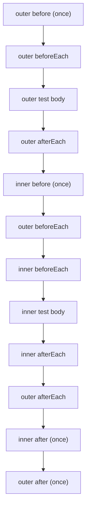

# Chapter 45 — The Built-in Test Runner

**What you will learn**

- How to write tests with `test()`, `it()`, and `describe()`, and the exact difference between a subtest and a suite.
- What the `TestContext` object gives you: `t.assert.*`, `t.plan()`, `t.diagnostic()`, `t.log()`, `t.signal`, `t.waitFor()`, and more.
- Hook ordering for `before`/`after`/`beforeEach`/`afterEach`, including under nesting and concurrency.
- How to drive the runner: file discovery, filtering, isolation, concurrency, sharding, watch mode, and `run()` from JavaScript.
- The built-in reporters, how to combine them, and how to write your own from the `TestsStream` event feed.
- Mocking in depth — functions, methods, accessors, properties, whole modules, timers, and `Date`.
- Snapshot testing and code coverage, including thresholds and lcov output.
- When `node:test` is the right choice and when Jest or Vitest still wins.

**Why this matters**

For a decade, adding tests to a Node project meant adding a test framework, a runner, a transform pipeline, and roughly a hundred transitive dependencies before you could assert that `2 + 2 === 4`. Every one of those packages is code you did not write, running in your CI with your credentials, and every one of them is a supply-chain risk and an upgrade tax. `node:test` removes that entire layer. It ships with the runtime, has no dependencies, understands ESM and CommonJS natively, and can run TypeScript test files by stripping types.

The trade-off is that `node:test` is a *runner*, not a *platform*. It gives you tests, hooks, mocks, snapshots, coverage, and reporters. It does not give you a browser DOM, a module transform pipeline, or an ecosystem of matchers. That is the correct boundary for most backend services, which is exactly the kind of code this book is about. This chapter teaches the whole runner properly, and then tells you honestly where its limits are.

## What is stable, and what is not

Verify stability before you build a workflow on a feature. The runner as a whole has been **Stable** since Node v20.0.0, but several of its subsystems are on their own tracks:

| Feature | Stability in 27.0.0-pre | Notes |
|---|---|---|
| `node:test` module, `test()`, `describe()`, `it()`, hooks | **2 — Stable** | Stable since v20.0.0 |
| `--test`, `--test-name-pattern`, `--test-only`, `--test-reporter` | **2 — Stable** | Stable since v20.0.0 |
| Snapshot testing (`t.assert.snapshot`) | **2 — Stable** | Left experimental in v23.4.0 |
| `MockTimers` | **2 — Stable** | Stable since v23.1.0 |
| `assert.partialDeepStrictEqual` | **2 — Stable** | Stable since v24.0.0 |
| Watch mode (`--watch`) | **[Experimental]** | Stability 1 |
| Code coverage (`--experimental-test-coverage`) | **[Experimental]** | Still carries the `--experimental-` prefix |
| Coverage thresholds (`--test-coverage-lines` etc.) | **[Experimental]** | Added v22.8.0 |
| `mock.module()` | **[Experimental]** (1.0 — Early development) | Requires `--experimental-test-module-mocks` |
| Global setup/teardown (`--test-global-setup`) | **[Experimental]** (1.0) | Added v24.0.0 |
| Test tags (`--experimental-test-tag-filter`) | **[Experimental]** (1.0) | Added v26.2.0 |
| Randomized order (`--test-randomize`) | **[Experimental]** (1.0) | Added v26.1.0 |

Note the naming asymmetry: `--test-isolation` lost its `--experimental-` prefix in v23.6.0, while coverage kept its prefix even though its threshold flags never had one. Do not infer stability from the flag name; check the docs.

## Writing tests

A test is a name and a function. The function can fail in three different ways, and the runner accepts all three shapes:

```mjs
import test from 'node:test';
import assert from 'node:assert/strict';
import { readFile } from 'node:fs/promises';

// 1. Synchronous: fails if it throws.
test('parses an integer', () => {
  assert.strictEqual(Number.parseInt('42', 10), 42);
});

// 2. Promise-returning: fails if the promise rejects.
test('reads the manifest', async () => {
  const text = await readFile(new URL('./package.json', import.meta.url), 'utf8');
  assert.ok(JSON.parse(text).name);
});

// 3. Callback style: fails if the callback gets a truthy first argument.
test('drains the queue', (t, done) => {
  setImmediate(done);
});
```

```cjs
const test = require('node:test');
const assert = require('node:assert/strict');

test('parses an integer', () => {
  assert.strictEqual(Number.parseInt('42', 10), 42);
});
```

The rule for the callback form is worth stating precisely: the callback is the **second** parameter, after the `TestContext`. A function that both accepts the callback and returns a promise fails — pick one. If any test in the process fails, the exit code becomes `1`.

### Subtests versus suites

There are two ways to nest, and they behave differently. `t.test()` creates a **subtest** inside a running test. `describe()`/`suite()` creates a **suite**, which is a container that is not itself a test.

```mjs
import test, { describe, it } from 'node:test';
import assert from 'node:assert/strict';

test('parent', async (t) => {
  // Subtests: you MUST await them.
  await t.test('child one', () => assert.ok(true));
  await t.test('child two', () => assert.ok(true));
});

describe('parser', () => {
  // Suites wait for their children automatically.
  it('handles empty input', () => assert.deepEqual([], []));
  it('handles whitespace', () => assert.deepEqual([], []));
});
```

The `await` on subtests is not stylistic. A test does not wait for its subtests. When the parent's function returns, any subtest still outstanding is **cancelled and treated as a failure**, and any subtest failure fails the parent. Suites do wait, which is why `describe`/`it` is the safer default for most files.

`describe()` is an alias for `suite()`; `it()` is an alias for `test()`. Since v19.8.0, calling `it()` is exactly equivalent to calling `test()` — there is no behavioural difference, only a naming convention. All four have `.skip`, `.todo`, and `.only` shorthands (`it.only('…')` is `it('…', { only: true })`).

### Skipping, TODO, and expected failures

```mjs
import { it } from 'node:test';

it('needs a live database', { skip: 'no DB in CI' }, () => {});

it('rounding is off by one', { todo: 'tracked in #412' }, () => {
  throw new Error('this does not fail the run');
});
```

`skip` means "do not execute". `todo` means "execute, but do not let a failure affect the exit code". If both are set, `skip` wins. You can also call `t.skip('reason')` or `t.todo('reason')` from inside the body — but neither *returns* from the function, so add your own `return`.

Available since **v25.5.0**, `expectFailure` inverts the verdict: a flagged test must throw in order to pass.

```mjs
import { it } from 'node:test';
import assert from 'node:assert/strict';

// Passes only because the assertion fails.
it.expectFailure('rounds half to even', () => {
  assert.strictEqual(roundHalfEven(2.5), 2);
});

// Passes only if the thrown error matches, following assert.throws() rules.
it('rejects bad input', { expectFailure: { code: 'ERR_INVALID' } }, () => {
  parse(' ');
});

// Both a human reason and a matcher:
it('is not implemented yet', {
  expectFailure: { label: 'awaiting spec sign-off', match: /not implemented/ },
}, () => {
  render();
});
```

The precedence order is `skip` > `todo` > `expectFailure`. Use `expectFailure` for known bugs you want CI to notice *when they get fixed* — an `expectFailure` test that starts passing is itself a failure, which is a genuinely useful signal that `todo` cannot give you.

## The TestContext object

Every test function receives a `TestContext` as its first argument. It is the runner's control surface.

### `t.assert.*`

Since **v22.2.0**, the top-level functions of `node:assert` are exposed on `t.assert`, bound to the context. This is not sugar — assertions called through `t.assert` are *counted*, which is what makes `t.plan()` work. Assertions called through a directly imported `assert` are invisible to the runner.

```mjs
import test from 'node:test';

test('counted assertions', (t) => {
  t.plan(2);
  t.assert.strictEqual(1 + 1, 2);
  t.assert.match('node:test', /^node:/);
});
```

Two snapshot methods live only here and have no `node:assert` equivalent: `t.assert.snapshot(value[, options])` and `t.assert.fileSnapshot(value, path[, options])`. You can also add your own with `test.assert.register(name, fn)` (**v23.7.0**), which is best done in a module preloaded with `--require` or `--import` so every file sees it:

```mjs
// test-setup.mjs, loaded with: node --import ./test-setup.mjs --test
import { assert as testAssert } from 'node:test';

testAssert.register('isIsoDate', function isIsoDate(value) {
  this.assert.match(String(value), /^\d{4}-\d{2}-\d{2}T/);
});
```

### `t.plan(count[, options])`

`plan()` declares how many assertions and subtests should run. It is the cure for the oldest bug in asynchronous testing: a test that passes because its assertions never ran.

```mjs
import test from 'node:test';
import { Readable } from 'node:stream';

test('emits every chunk', (t, done) => {
  const expected = ['a', 'b', 'c'];
  t.plan(expected.length);

  Readable.from(expected)
    .on('data', (chunk) => t.assert.strictEqual(chunk, expected.shift()))
    .on('end', done);
});
```

The `options.wait` parameter (**v23.9.0**) controls what happens when assertions are still pending as the test function returns. `false` (the default) checks immediately; `true` waits indefinitely; a number waits that many milliseconds, counting from the moment the test function finishes, and fails on timeout.

### Reporting from inside a test

| Method | Added | When the output appears |
|---|---|---|
| `t.diagnostic(message)` | v18.0.0 | Buffered; printed with the test's results |
| `t.log(message[, data])` | v26.6.0 | Immediately, in execution order |

`t.log()` is the newer and usually better one: it emits a `'test:log'` event straight away, so a reporter can interleave it with progress output. The optional `data` payload is passed through untouched, which makes it ideal for structured logging — but under process isolation it must be compatible with the structured clone algorithm.

```mjs
test('retries the flaky endpoint', async (t) => {
  t.log('attempting request', { attempt: t.attempt, worker: t.workerId });
  t.diagnostic('this line shows up at the end');
});
```

### Identity and outcome

| Property | Added | Meaning |
|---|---|---|
| `t.name` | v18.8.0 | The test's own name |
| `t.fullName` | v22.3.0 | Ancestor names joined with `>` |
| `t.filePath` | v22.6.0 | Absolute path of the root test file |
| `t.passed` | v21.7.0 | `boolean`; `false` before the test runs |
| `t.error` | v21.7.0 | `Error` or `null`; the original is on `.cause` |
| `t.attempt` | v25.0.0 | Zero-based rerun attempt number |
| `t.workerId` | v25.8.0 | 1..N worker index, from `NODE_TEST_WORKER_ID` |
| `t.tags` | v26.2.0 | Frozen, lowercased, inherited tag array **[Experimental]** |
| `t.signal` | v18.7.0 | `AbortSignal` fired when the test is aborted |

`t.passed` and `t.error` are designed for `afterEach` hooks: that is where you write "if the test failed, dump the container logs." `t.workerId` solves resource collisions under parallel file execution — give each worker its own database schema or port range instead of fighting over one.

```mjs
import { afterEach, test } from 'node:test';

afterEach((t) => {
  if (!t.passed) {
    t.diagnostic(`FAILED: ${t.fullName} — ${t.error?.cause?.message}`);
  }
});

test('uses a per-worker port', async (t) => {
  const port = 4000 + (t.workerId ?? 0);
  t.log('binding', { port });
});
```

`t.signal` is the piece people forget. Pass it into anything cancellable and a timed-out test stops doing work instead of leaking a socket:

```mjs
test('fetches within the timeout', { timeout: 2000 }, async (t) => {
  const res = await fetch('http://127.0.0.1:8080/health', { signal: t.signal });
  t.assert.strictEqual(res.status, 200);
});
```

### `t.waitFor(condition[, options])`

Added in **v23.7.0**, `waitFor` polls until `condition` stops throwing. Options are `interval` (default `50` ms) and `timeout` (default `1000` ms). It replaces the `await sleep(500)` that makes suites slow *and* flaky at the same time.

```mjs
test('the worker eventually drains', async (t) => {
  queue.push('job');
  await t.waitFor(() => t.assert.strictEqual(queue.length, 0), { timeout: 5000 });
});
```

### `getTestContext()`

Added in **v26.1.0**, `getTestContext()` returns the `TestContext` or `SuiteContext` of the currently executing test — or `undefined` outside one. It lets a helper module reach the context without threading `t` through every call:

```mjs
import { getTestContext } from 'node:test';

export function traceStep(label) {
  getTestContext()?.log(label);
}
```

Inside a hook, it returns the context of the test or suite the hook belongs to.

## Hooks and their ordering

Four hooks, importable from `node:test` (suite-scoped) and also available as `t.before`, `t.beforeEach`, `t.after`, `t.afterEach` (test-scoped, applying to that test's subtests).

| Hook | Runs |
|---|---|
| `before` | Once, before the suite's tests |
| `beforeEach` | Before every test in the suite, including nested ones |
| `afterEach` | After every test, **even when the test fails** |
| `after` | Once, after the suite, **even when tests fail** |

All four take `{ signal, timeout }`. All four can be async or callback-style.

Ordering under nesting is outside-in for the "before" family and inside-out for the "after" family:



The step that surprises people is that the **outer `beforeEach` runs again for each inner test**. `beforeEach` applies to every descendant test, not just direct children. If your outer `beforeEach` truncates a table, it truncates it once per nested test too.

```mjs
import { describe, it, before, beforeEach, after, afterEach } from 'node:test';

describe('orders', () => {
  before(async () => { await db.migrate(); });
  beforeEach(async () => { await db.truncate('orders'); });
  afterEach(async (t) => { if (!t.passed) await db.dump('orders'); });
  after(async () => { await db.close(); });

  it('creates an order', async () => { /* … */ });

  describe('refunds', () => {
    // The outer beforeEach still runs before this test.
    beforeEach(async () => { await db.seed('paid-order'); });
    it('refunds a paid order', async () => { /* … */ });
  });
});
```

A hook that throws fails the tests it guards. `after` and `afterEach` are guaranteed to run even after failures, which makes them the correct place for teardown — but *not* a substitute for `try`/`finally` inside a test that acquires a resource mid-body.

## Running tests from the command line

```bash
node --test
node --test "src/**/*.test.js" "integration/**/*.spec.js"
```

With no glob argument, the runner discovers files matching:

- `**/*.test.{cjs,mjs,js}`
- `**/*-test.{cjs,mjs,js}`
- `**/*_test.{cjs,mjs,js}`
- `**/test-*.{cjs,mjs,js}`
- `**/test.{cjs,mjs,js}`
- `**/test/**/*.{cjs,mjs,js}`

Unless `--no-strip-types` is supplied, the same six patterns are also matched for `.cts`, `.mts`, and `.ts`. Note the last pattern: **every file** under a `test/` directory is treated as a test file, including fixtures and helpers. That is the single most common surprise. Put helpers outside `test/`, or pass explicit globs so discovery never sees them. Quote your globs on the command line so the shell does not expand them first.

### The flag reference

| Flag | Added | Purpose |
|---|---|---|
| `--test` | v18.1.0 | Start the CLI runner |
| `--test-name-pattern` | v18.11.0 | Run only tests whose name matches a JS regex |
| `--test-skip-pattern` | v22.1.0 | Skip tests whose name matches |
| `--test-only` | v18.0.0 | Run only tests marked `only: true` |
| `--test-concurrency` | v21.0.0 | Max test files in flight |
| `--test-timeout` | v21.2.0 | Per-test timeout in ms (default `Infinity`) |
| `--test-shard=<i>/<n>` | v20.5.0 | Run shard `i` of `n` |
| `--test-isolation=process\|none` | v22.8.0 | Child process per file, or one process |
| `--test-force-exit` | v22.0.0 | Exit once tests finish, even with a live event loop |
| `--test-reporter` / `--test-reporter-destination` | v19.6.0 | Choose and route reporters |
| `--test-update-snapshots` | v22.3.0 | Regenerate snapshot files |
| `--test-rerun-failures=<file>` | v24.7.0 | Persist run state; rerun only what has not passed |
| `--test-global-setup=<module>` | v24.0.0 | **[Experimental]** global setup/teardown module |
| `--test-randomize`, `--test-random-seed` | v26.1.0 | **[Experimental]** randomize execution order |
| `--test-coverage-include-all` | v26.7.0 | **[Experimental]** report never-loaded files at 0% |
| `--experimental-test-coverage` | v19.7.0 | **[Experimental]** collect coverage |
| `--experimental-test-module-mocks` | v22.3.0 | **[Experimental]** enable `mock.module()` |
| `--experimental-test-tag-filter='<expr>'` | v26.2.0 | **[Experimental]** filter by tags |
| `--watch` | v19.2.0 | **[Experimental]** rerun on change |

`--test` cannot be combined with `--watch-path`, `--check`, `--eval`, `--interactive`, or the inspector.

`--test-name-pattern` and `--test-skip-pattern` accept plain strings compiled as regular expressions, or regex literals with flags: `--test-name-pattern="/user/i"`. Both may be repeated; repeating them is how you reach into nested tests, because a parent that does not match never runs its children. To disambiguate a name that appears in two suites, prefix it with its ancestors separated by spaces: `--test-name-pattern="orders creates an order"`. When both flags are supplied, a test must satisfy **both** to run. Neither flag changes which *files* are executed.

### Tags: filtering without name patterns

Test tags are **[Experimental]** (Stability 1.0), added in **v26.2.0**. They give you a filtering axis that is not tangled up with test names.

```mjs
import { describe, it } from 'node:test';

describe('database', { tags: ['db'] }, () => {
  it('reads a row');                                       // tags: ['db']
  it('writes a row', { tags: ['integration'] });           // tags: ['db', 'integration']
  it('reconnects after disconnect', { tags: ['flaky'] });  // tags: ['db', 'flaky']
});
```

Tags inherit from suite to child by union, are matched case-insensitively, and must not contain whitespace or the operator characters `& | ! ( ) *`, nor be the words `and`, `or`, or `not`. A bad tag throws `ERR_INVALID_ARG_VALUE` at registration time, before any test runs.

The filter is a boolean expression with `and`/`&&`, `or`/`||`, `not`/`!`, parentheses, and `*` wildcards inside identifiers, evaluated with precedence `not` > `and` > `or`:

```bash
node --test --experimental-test-tag-filter='(unit or smoke) and not slow'
node --test --experimental-test-tag-filter='db && !flaky'
```

The one rule to internalize: an untagged test has an empty tag set, so a positive filter such as `db` — or even the bare wildcard `*` — **excludes** it, while a purely negative filter such as `not flaky` **includes** it. `--experimental-test-tag-filter='not flaky'` is therefore the idiomatic way to say "everything except the known-flaky tests". Repeating the flag composes by AND, and the tag filter is itself AND'd with the name patterns and `only`.

### Isolation, concurrency, and sharding

With the default `--test-isolation=process`, each file runs in its own child process, up to `--test-concurrency` at a time — defaulting to `os.availableParallelism() - 1`. Files are isolated; tests *within* a file still run in a single application thread, and the `concurrency` option on `test()` only controls how many of them interleave on the event loop.

With `--test-isolation=none`, every file is imported into the runner process and top-level tests run with a concurrency of one. It is faster to start and lets you use `only: true` without `--test-only`, but global state leaks between files. Use it for fast unit suites; keep process isolation for anything that touches modules with module-level state.

Child processes inherit most parent flags, including those from configuration files, but the runner deliberately filters out `--test`, `--experimental-test-coverage`, `--watch`, `--test-reporter`, `--test-reporter-destination`, `--test-randomize`, `--test-random-seed`, `--experimental-test-tag-filter`, and the config-file flags, because it manages those itself.

Sharding splits the *file* list, not the test list:

```bash
node --test --test-shard=1/3   # on CI machine 1
node --test --test-shard=2/3   # on CI machine 2
node --test --test-shard=3/3   # on CI machine 3
```

`--test-shard` is incompatible with `--watch`. So are `--test-randomize` and `--test-random-seed`.

### Randomized order and rerunning failures

`--test-randomize` shuffles both file order and queued tests inside each file, which is how you find tests that secretly depend on each other. The seed is printed as a diagnostic (`Randomized test order seed: 12345`) so you can replay a failure with `--test-random-seed=12345`; supplying a seed enables randomization on its own. One caveat from the docs: subtests awaited one at a time are *not* randomized, because each only starts after the previous finishes. `describe`/`it` suites enqueue siblings together and are randomized.

`--test-rerun-failures=<file>` writes a JSON state file keyed by `file:line:column`, recording which attempt each test passed on. On the next run, only tests that have not yet passed are executed. Because the key includes the source position, it is only safe when tests run in a deterministic order — which is why it cannot be combined with randomization. `t.attempt` tells a test which pass it is on.

### Watch mode and global setup

```bash
node --test --watch
```

Watch mode **[Experimental]** tracks test files *and their dependencies*, rerunning only what a change affects, and keeps running until the process is terminated.

Global setup **[Experimental]** points at a module exporting `globalSetup` and/or `globalTeardown`, run once around the entire run:

```mjs
// test/global.mjs — node --test --test-global-setup=./test/global.mjs
import { startContainer, stopContainer } from './support/postgres.mjs';

export async function globalSetup() {
  process.env.DATABASE_URL = await startContainer();
}

export async function globalTeardown() {
  await stopContainer();
}
```

If `globalSetup` throws, no tests run, the process exits non-zero, and `globalTeardown` is **not** called. Anything it allocated before throwing is your problem to clean up.

## Running tests programmatically

`run([options])` returns a `TestsStream` — an object-mode readable of test events. It is the API behind `--test`, and what you build custom tooling on.

```mjs
import { run } from 'node:test';
import { spec } from 'node:test/reporters';
import process from 'node:process';

const stream = run({
  globPatterns: ['src/**/*.test.js'],
  concurrency: true,
  isolation: 'process',
  timeout: 30_000,
  coverage: true,
  lineCoverage: 80,
  coverageExcludeGlobs: ['src/**/*.test.js', 'src/generated/**'],
  env: { ...process.env, NODE_ENV: 'test', TZ: 'UTC' },
});

stream.on('test:fail', () => { process.exitCode = 1; });
stream.compose(spec).pipe(process.stdout);
```

Watch the defaults, because they differ from the CLI. `run()`'s `concurrency` defaults to `false` (one file at a time); the CLI defaults to `os.availableParallelism() - 1`. `run()` will not fail your build on its own either — nothing sets a non-zero exit code unless you wire up `'test:fail'` yourself.

Other options worth knowing: `files` and `globPatterns` are mutually exclusive; `cwd` (v23.0.0) rebases discovery; `execArgv` passes flags to the spawned `node` while `argv` passes flags to the test file (both ignored when `isolation` is `'none'`); `signal` aborts the run; `forceExit` mirrors `--test-force-exit`; `shard: { index, total }`; `setup(stream)` runs before any test so you can attach listeners; `rerunFailuresFilePath`, `randomize`, and `randomSeed` mirror their CLI counterparts; and `env` (v25.6.0) **replaces** rather than merges with `process.env`, which is why the example above spreads it explicitly.

Coverage has its own option cluster on `run()`: `coverage`, `coverageIncludeGlobs`, `coverageExcludeGlobs`, `coverageIncludeAll`, and the thresholds `lineCoverage`, `branchCoverage`, `functionCoverage` (all defaulting to `0`).

## Reporters

Five reporters ship in the box, all also importable from `node:test/reporters`:

| Reporter | Output |
|---|---|
| `spec` | Human-readable tree. **The default**, on TTY and non-TTY alike since v23.0.0 |
| `tap` | TAP format |
| `dot` | One character per test: `.` for pass, `X` for fail |
| `junit` | JUnit XML, for CI systems that parse it |
| `lcov` | lcov coverage data; emits no test results |

```bash
node --test --test-reporter=dot

node --test --test-reporter=spec --test-reporter-destination=stdout \
            --test-reporter=junit --test-reporter-destination=junit.xml
```

With multiple `--test-reporter` flags you **must** supply a matching `--test-reporter-destination` for each; they pair up positionally. A destination is `stdout`, `stderr`, or a file path. With a single reporter, the destination defaults to `stdout`.

The exact text of the built-in reporters is explicitly not a stable interface. If you need to parse results, consume the `TestsStream` events instead.

### Writing a custom reporter

A custom reporter is any module whose exported value is accepted by `stream.compose()` — most simply, a `Transform` in `writableObjectMode`. Pass its path to `--test-reporter`.

```mjs
// reporters/slow-tests.mjs
import { Transform } from 'node:stream';

const THRESHOLD_MS = 250;

export default new Transform({
  writableObjectMode: true,
  transform(event, encoding, callback) {
    if (event.type === 'test:pass' && event.data.details.duration_ms > THRESHOLD_MS) {
      const ms = event.data.details.duration_ms.toFixed(0);
      callback(null, `SLOW ${ms}ms  ${event.data.name}  (${event.data.file})\n`);
      return;
    }
    callback(null, '');
  },
});
```

```bash
node --test --test-reporter=./reporters/slow-tests.mjs
```

The event types you can switch on include `'test:enqueue'`, `'test:dequeue'`, `'test:start'`, `'test:pass'`, `'test:fail'`, `'test:complete'`, `'test:plan'`, `'test:diagnostic'`, `'test:log'`, `'test:stdout'`, `'test:stderr'`, `'test:coverage'`, `'test:summary'`, `'test:interrupted'`, `'test:watch:drained'`, and `'test:watch:restarted'`. Most carry `name`, `nesting`, `testId`, `file`, `line`, and `column`.

## Mocking

The `mock` export of `node:test` is a `MockTracker`. There is a process-global one, and each test gets its own at `t.mock`. **Prefer `t.mock`** — the runner calls `reset()` on it automatically when the test finishes. The global tracker is yours to clean up.

### Spying on functions and methods

```mjs
import test from 'node:test';

test('records every call', (t) => {
  const send = t.mock.fn((to, body) => ({ id: 'msg_1', to, body }));

  send('ops@example.com', 'disk full');

  t.assert.strictEqual(send.mock.callCount(), 1);
  const [call] = send.mock.calls;
  t.assert.deepStrictEqual(call.arguments, ['ops@example.com', 'disk full']);
  t.assert.deepStrictEqual(call.result, {
    id: 'msg_1', to: 'ops@example.com', body: 'disk full',
  });
  t.assert.strictEqual(call.error, undefined);
  t.assert.strictEqual(call.target, undefined);
});
```

Each entry in `mock.calls` has `arguments`, `result`, `error`, `this`, `target` (the class, when the mock was used as a constructor), and `stack` — an `Error` whose stack points at the call site, which is invaluable when a mock is called from somewhere you did not expect. Use `callCount()` rather than `calls.length`: `calls` is a getter that copies the internal array on every access.

| API | Added | Purpose |
|---|---|---|
| `mock.fn([original[, implementation]][, options])` | v19.1.0 | Standalone mock function |
| `mock.method(obj, name[, impl][, options])` | v19.1.0 | Replace a method, keep the original for restore |
| `mock.getter(obj, name[, impl][, options])` | v19.3.0 | Sugar for `method(..., { getter: true })` |
| `mock.setter(obj, name[, impl][, options])` | v19.3.0 | Sugar for `method(..., { setter: true })` |
| `mock.property(obj, name[, value])` | v24.3.0 | Mock a **data** property, tracking reads and writes |
| `mock.module(specifier[, options])` | v22.3.0 | **[Experimental]** replace a whole module's exports |
| `mock.reset()` | v19.1.0 | Restore all mocks *and* detach them from the tracker |
| `mock.restoreAll()` | v19.1.0 | Restore all mocks, keep them attached |

`mock.method` throws if `object[methodName]` is not a function; that is what `mock.property` is for. The `getter` and `setter` options are mutually exclusive.

The `times` option on `fn`, `method`, `getter`, and `setter` is the elegant part: the replacement behaviour applies for exactly `times` calls, then the original behaviour comes back automatically. That is how you simulate "fails twice, then succeeds" without any state machine of your own.

```mjs
test('retries a transient failure', (t) => {
  const api = {
    fetchRate() { return 1.09; },
  };
  t.mock.method(api, 'fetchRate', () => { throw new Error('ECONNRESET'); }, { times: 2 });

  t.assert.throws(() => api.fetchRate(), /ECONNRESET/);
  t.assert.throws(() => api.fetchRate(), /ECONNRESET/);
  t.assert.strictEqual(api.fetchRate(), 1.09); // original behaviour restored
});
```

`mock.property` is for values, not functions, and its context object exposes `accesses` (each `{ type: 'get' | 'set', value }`), `accessCount()`, `resetAccesses()`, and `restore()`:

```mjs
test('tracks configuration reads', (t) => {
  const config = { region: 'eu-west-1' };
  const prop = t.mock.property(config, 'region', 'us-east-1');

  t.assert.strictEqual(config.region, 'us-east-1');
  config.region = 'ap-south-1';

  t.assert.strictEqual(prop.mock.accessCount(), 2);
  t.assert.strictEqual(prop.mock.accesses[0].type, 'get');
  t.assert.strictEqual(prop.mock.accesses[1].type, 'set');

  prop.mock.restore();
  t.assert.strictEqual(config.region, 'eu-west-1');
});
```

Both `MockFunctionContext` and `MockPropertyContext` support `mockImplementation(x)` to change behaviour permanently and `mockImplementationOnce(x[, onCall])` to change it for a single call, optionally a specific one. `resetCalls()` clears the recorded calls without restoring the original.

### Mocking whole modules

`mock.module()` is **[Experimental]** (Stability 1.0 — Early development) and requires `--experimental-test-module-mocks`. Under the permission model it additionally requires `--allow-worker`. It works for ESM, CommonJS, JSON, and builtin modules. References captured *before* the mock was installed are unaffected.

```mjs
// src/notify.mjs
import { sendEmail } from './mailer.mjs';

export async function notifyOnFailure(job) {
  if (job.status !== 'failed') return false;
  await sendEmail('ops@example.com', `Job ${job.id} failed`);
  return true;
}
```

```mjs
// test/notify.test.mjs
// node --test --experimental-test-module-mocks
import test from 'node:test';

test('emails ops when a job fails', async (t) => {
  const sendEmail = t.mock.fn(async () => {});
  t.mock.module(new URL('../src/mailer.mjs', import.meta.url), {
    exports: { sendEmail },
  });

  const { notifyOnFailure } = await import('../src/notify.mjs');

  t.assert.strictEqual(await notifyOnFailure({ id: 7, status: 'failed' }), true);
  t.assert.strictEqual(sendEmail.mock.callCount(), 1);
  t.assert.deepStrictEqual(sendEmail.mock.calls[0].arguments, [
    'ops@example.com', 'Job 7 failed',
  ]);
});
```

Use `options.exports`, where `exports.default` becomes the default export (and `module.exports` for CJS and builtins) and the other own enumerable properties become named exports. The older `defaultExport` and `namedExports` options still work but are documented as deprecated and slated for removal — do not use them in new code. `cache: false` (the default) makes every `import()`/`require()` produce a fresh mock; `cache: true` returns the same mock and inserts it into the CommonJS cache.

Because the runner's loader is synchronous, only module customization hooks registered through the **synchronous** API affect specifier resolution for `mock.module`. Asynchronous hooks are currently ignored.

If module mocking sounds fragile, that is because it is. Dependency injection — passing the collaborator in as an argument and mocking it with `t.mock.fn` — is always more robust and needs no flags.

### Mocking timers and `Date`

`MockTimers` has been **Stable** since v23.1.0. `t.mock.timers.enable([options])` takes `apis` (any of `'setInterval'`, `'setTimeout'`, `'setImmediate'`, `'Date'`; default: all four) and `now` (a number of milliseconds or a `Date`; default `0`). Enabling a timer implicitly mocks its `clear` counterpart, and the mocks apply to `globalThis`, `node:timers`, and `node:timers/promises`.

```mjs
import test from 'node:test';

test('debounces to a single call', (t) => {
  t.mock.timers.enable({ apis: ['setTimeout'] });
  const flush = t.mock.fn();
  const debounced = debounce(flush, 100);

  debounced();
  debounced();
  debounced();
  t.assert.strictEqual(flush.mock.callCount(), 0);

  t.mock.timers.tick(99);
  t.assert.strictEqual(flush.mock.callCount(), 0);

  t.mock.timers.tick(1);
  t.assert.strictEqual(flush.mock.callCount(), 1);
});
```

| Method | Effect |
|---|---|
| `enable([{ apis, now }])` | Install the fake clock |
| `tick(ms)` | Advance by `ms` (default `1`), firing everything due |
| `runAll()` | Fire every pending timer now; advances `Date` to the furthest one |
| `setTime(ms)` | Set the Unix timestamp used by mocked `Date` |
| `reset()` | Restore real timers; also invoked by `mock.reset()` |
| `[Symbol.dispose]()` | Calls `reset()` — works with `using` |

Timers and `Date` share one internal clock: `tick()` advances `Date.now()`, and `setTime()` moves the clock that timers schedule against. Mock both together or you get an inconsistent world where code that compares `Date.now()` against a deadline never agrees with the timer that was supposed to fire at it.

Two limitations from the docs: `tick()` accepts only positive numbers, unlike real `setTimeout`; and destructured imports such as `import { setTimeout } from 'node:timers'` are **not** intercepted — call `timers.setTimeout(...)` or use the global.

## Snapshot testing

Snapshot testing is **Stable** since v23.4.0. `t.assert.snapshot(value)` serializes a value and compares it against a stored copy.

```mjs
import { describe, it } from 'node:test';

describe('invoice rendering', () => {
  it('renders a paid invoice', (t) => {
    t.assert.snapshot(renderInvoice({ id: 'INV-1', total: 4200, paid: true }));
  });
});
```

The first run fails because no snapshot exists. Generate it with `node --test --test-update-snapshots`, which writes `<testfile>.snapshot` next to the test. Each snapshot is keyed by the test's full name plus a counter, so a test with two `snapshot()` calls produces `… 1` and `… 2` entries. Commit the file.

Serialization defaults to `JSON.stringify(value, null, 2)`, which cannot handle circular structures, `Map`, `Set`, or `BigInt`. Override it per call with `{ serializers: [fn, …] }` (each serializer feeds the next, and the final result is coerced to a string), or globally with `snapshot.setDefaultSnapshotSerializers([...])`. `snapshot.setResolveSnapshotPath(fn)` relocates snapshot files — useful if you want them in a `__snapshots__/` directory.

`t.assert.fileSnapshot(value, path)` writes to a path you choose, one value per file, with no extra escaping. Use it when the snapshot is a real artifact — generated SQL, an OpenAPI document, rendered HTML — that you want syntax-highlighted in review.

## Code coverage

Coverage is still **[Experimental]** and still uses the `--experimental-test-coverage` flag:

```bash
node --test --experimental-test-coverage
```

Core modules and anything under `node_modules/` are excluded by default, as are the matched test files themselves. Refine with `--test-coverage-include=<glob>` and `--test-coverage-exclude=<glob>`, both repeatable. When both are given, a file must satisfy **both** to appear. Specifying `--test-coverage-exclude` overrides the default exclusion of test files, so re-add them yourself if you still want them out. `--test-coverage-include-all` (**v26.7.0**) adds source files that were never loaded, reported at zero coverage — the only way to notice a module your suite never touches.

Thresholds turn coverage into a gate. Each takes a percentage and exits with code `1` if unmet:

```bash
node --test --experimental-test-coverage \
  --test-coverage-lines=85 \
  --test-coverage-branches=75 \
  --test-coverage-functions=90 \
  --test-coverage-exclude="**/*.test.js" \
  --test-coverage-exclude="src/generated/**"
```

For an artifact your CI can upload, use the lcov reporter — noting that it emits *no* test results, so pair it with a second reporter:

```bash
node --test --experimental-test-coverage \
  --test-reporter=spec --test-reporter-destination=stdout \
  --test-reporter=lcov --test-reporter-destination=lcov.info
```

Unreachable code can be excluded inline:

```js
/* node:coverage disable */
if (process.platform === 'aix') {
  applyAixWorkaround();
}
/* node:coverage enable */

/* node:coverage ignore next 3 */
if (neverInTests) {
  bail();
}
```

`node:coverage ignore next` without a count skips a single line. If `NODE_V8_COVERAGE` is set, the raw V8 coverage files land in that directory as well. Reporters receive the whole report through the `'test:coverage'` event, whose `summary.files[]` entries carry `coveredLinePercent`, `coveredBranchPercent`, `coveredFunctionPercent`, and per-line/branch/function counts — everything you need to build your own gate.

## A worked example: an HTTP handler and a mocked dependency

Here is a small service split so that the interesting logic is testable without a network, and the wiring is testable with one.

```mjs
// src/rates.mjs
export async function fetchRate(pair, { signal } = {}) {
  const res = await fetch(`https://rates.example.com/${pair}`, { signal });
  if (!res.ok) throw new Error(`rate lookup failed: ${res.status}`);
  return (await res.json()).rate;
}
```

```mjs
// src/handler.mjs
export function createHandler({ fetchRate }) {
  return async function handler(req, res) {
    const url = new URL(req.url, 'http://localhost');
    const pair = url.searchParams.get('pair');

    if (!pair) {
      res.writeHead(400, { 'content-type': 'application/json' });
      res.end(JSON.stringify({ error: 'missing pair' }));
      return;
    }

    try {
      const rate = await fetchRate(pair);
      res.writeHead(200, { 'content-type': 'application/json' });
      res.end(JSON.stringify({ pair, rate }));
    } catch {
      res.writeHead(502, { 'content-type': 'application/json' });
      res.end(JSON.stringify({ error: 'upstream unavailable' }));
    }
  };
}
```

The dependency arrives as an argument, so the test supplies a stub with no flags and no module interception:

```mjs
// test/handler.test.mjs
import { after, before, describe, it } from 'node:test';
import { createServer } from 'node:http';
import { once } from 'node:events';
import { createHandler } from '../src/handler.mjs';

describe('rate handler', () => {
  let server;
  let baseUrl;

  before(async () => {
    const fetchRate = async (pair) => {
      if (pair === 'EURUSD') return 1.09;
      throw new Error('upstream down');
    };
    server = createServer(createHandler({ fetchRate }));
    server.listen(0, '127.0.0.1');
    await once(server, 'listening');
    baseUrl = `http://127.0.0.1:${server.address().port}`;
  });

  after(async () => {
    server.close();
    await once(server, 'close');
  });

  it('returns the rate for a known pair', async (t) => {
    t.plan(2);
    const res = await fetch(`${baseUrl}/?pair=EURUSD`, { signal: t.signal });
    t.assert.strictEqual(res.status, 200);
    t.assert.deepStrictEqual(await res.json(), { pair: 'EURUSD', rate: 1.09 });
  });

  it('rejects a request with no pair', async (t) => {
    const res = await fetch(`${baseUrl}/`, { signal: t.signal });
    t.assert.strictEqual(res.status, 400);
  });

  it('maps an upstream failure to 502', async (t) => {
    const res = await fetch(`${baseUrl}/?pair=GBPJPY`, { signal: t.signal });
    t.assert.strictEqual(res.status, 502);
  });
});
```

Three details make this work in CI. `listen(0)` asks the OS for a free port, so parallel workers never collide. `await once(server, 'listening')` avoids the race where the test fetches before the socket is bound. And `{ signal: t.signal }` means a timed-out test tears its request down instead of leaving a dangling socket that keeps the process alive.

To spy on the dependency rather than merely stub it, hold it on an object and mock the method:

```mjs
import test from 'node:test';
import { createHandler } from '../src/handler.mjs';

test('calls the rate service exactly once', async (t) => {
  const deps = { fetchRate: async () => 1.09 };
  t.mock.method(deps, 'fetchRate');

  const res = { writeHead() {}, end() {} };
  await createHandler(deps)({ url: '/?pair=EURUSD' }, res);

  t.assert.strictEqual(deps.fetchRate.mock.callCount(), 1);
  t.assert.deepStrictEqual(deps.fetchRate.mock.calls[0].arguments, ['EURUSD']);
});
```

Note that `createHandler` reads `deps.fetchRate` at call time through the closure, so mocking the method after construction still takes effect. Had the handler destructured the function into a local at module load, the mock would have been installed too late — the same hazard `mock.module()` warns about.

## `node:test` versus Jest and Vitest

| | `node:test` | Jest | Vitest |
|---|---|---|---|
| Install size | Zero — ships with Node | Large dependency tree | Moderate (Vite) |
| ESM support | Native | Historically painful | Native |
| TypeScript | Type stripping, no config | Needs a transform | Native via Vite |
| Watch mode | **[Experimental]** | Mature, interactive | Excellent, HMR-driven |
| Module mocking | **[Experimental]**, flag-gated | Mature, ergonomic | Mature, ergonomic |
| Matchers | `node:assert` only | Very large library | Very large `expect` API |
| Browser / DOM | None | jsdom | jsdom, happy-dom, real browsers |
| Coverage | **[Experimental]**, V8-based | Mature (V8 or Babel) | Mature |
| Parallelism | Process per file | Worker pool | Worker pool |
| Upgrade cadence | Tied to Node | Independent | Independent |

Choose `node:test` for backend services, libraries, and CLIs — anywhere the code under test is plain Node and you value a small dependency graph and a runner that cannot rot. It is especially compelling for published libraries, where a zero-dependency dev setup means contributors need nothing but Node.

Choose Vitest when you are already building with Vite, when you test browser or framework code, or when your team depends on a rich `expect` API and first-class module mocking. Choose Jest when you are maintaining an existing Jest suite; the migration cost rarely pays for itself on a large codebase, and Jest's snapshot and mocking ergonomics remain ahead.

The honest summary: `node:test` has closed most of the gap on structure, mocking, and reporting. It is still behind on watch-mode ergonomics, module mocking maturity, and matcher expressiveness. If those three do not matter to your project, the built-in runner is the lower-risk choice.

## Common mistakes

### ❌ Forgetting to `await` a subtest

```mjs
test('parent', (t) => {
  t.test('child', async () => {
    await new Promise((r) => setTimeout(r, 50));
  });
});
```

The parent finishes immediately. The child is still outstanding, so the runner cancels it and reports it as a failure — or, if it was created after the parent had already reported, marks it failed for being created too late.

```mjs
// ✅
test('parent', async (t) => {
  await t.test('child', async () => {
    await new Promise((r) => setTimeout(r, 50));
  });
});
```

Or sidestep the whole class of bug by using `describe`/`it`, which awaits children for you.

### ❌ Using `plan()` with a directly imported `assert`

```mjs
import assert from 'node:assert/strict';

test('counts nothing', (t) => {
  t.plan(1);
  assert.strictEqual(1, 1); // invisible to the runner
});
```

The test fails with a plan mismatch: zero assertions ran, as far as the runner can tell. Only `t.assert.*` is counted.

```mjs
// ✅
test('counts correctly', (t) => {
  t.plan(1);
  t.assert.strictEqual(1, 1);
});
```

### ❌ Assuming `only: true` alone restricts the run

```mjs
test('only this one', { only: true }, () => {});
test('should not run', () => { throw new Error('but it does'); });
```

Under the default process isolation, `only` does nothing unless the runner was started with `--test-only`. The second test runs and fails your build for the wrong reason.

```bash
# ✅
node --test --test-only
```

And when using `t.test()` subtests, every ancestor must also be marked `only`, or the subtree never gets a chance to run.

### ❌ Leaving mocks on the global tracker

```mjs
import { mock, test } from 'node:test';

test('mocks the clock', () => {
  mock.timers.enable({ apis: ['Date'] }); // never reset
});
```

Every later test in the file now sees `Date.now() === 0`. The global `MockTracker` is not reset between tests; only the test context's tracker is.

```mjs
// ✅ — the test context's tracker is reset automatically
test('mocks the clock', (t) => {
  t.mock.timers.enable({ apis: ['Date'] });
});
```

### ❌ Putting helpers and fixtures under `test/`

A file at `test/helpers/db.js` matches `**/test/**/*.js` and is executed as a test file. It defines no tests, so it "passes", but it also runs its top-level side effects — opening database connections, starting servers — once per run for no reason, and any throw at import time becomes a mysterious failing "test". Keep support code outside `test/`, or pass explicit globs so discovery never sees it.

## Production notes

- **Set an explicit timeout.** The default is `Infinity`. A hung test in CI will sit there until the job's own timeout kills it, with no useful output. Put `--test-timeout=30000` in your CI command and give slow integration tests a per-test override. Remember the docs' caveat: a test that blocks the thread cannot be cancelled, so timeouts are a safety net, not a guarantee.
- **Isolation costs process spawns.** With `--test-isolation=process`, a suite of 400 tiny files pays 400 process startups. If your unit tests are genuinely stateless, `--test-isolation=none` can cut wall time dramatically — measure both. Keep isolation for anything with module-level state, `mock.module`, or global patching.
- **Scale out with `--test-shard`, not more concurrency.** Concurrency is bounded by `os.availableParallelism()` on one machine. Sharding splits files across machines and composes with per-machine concurrency. Because shards are split by file, one pathologically slow file makes its shard the critical path; split that file before adding shards.
- **`--test-force-exit` hides bugs.** It exists because a test that leaves a handle open keeps the process alive. Using it as a default converts a diagnosable leak into an invisible one. Prefer finding the open handle; if you must ship the flag, open a ticket at the same time.
- **Give each worker its own resources.** Under parallel file execution, hardcoded ports and shared database names cause failures that only reproduce under load. Use `t.workerId` (or `NODE_TEST_WORKER_ID`, available at import time) to derive per-worker ports, schemas, and temp directories, and `listen(0)` where you can.
- **Coverage thresholds belong in CI, not in your editor loop.** Coverage collection slows the run and its flags are experimental. Run it as a separate CI step with `--test-coverage-include-all` so newly added, untested files show up as zero rather than silently absent.
- **Treat snapshot updates as code review.** `--test-update-snapshots` will happily bless a regression. Never run it as part of CI, and review snapshot diffs as carefully as source diffs.
- **Randomize on a schedule, not on every run.** `--test-randomize` finds order dependencies but makes failures harder to reproduce. Run it nightly, capture the seed from the diagnostic line, and reproduce with `--test-random-seed`.
- **Asynchronous work that outlives a test is not silently dropped.** An `uncaughtException` or `unhandledRejection` originating from a finished test is reported as a top-level diagnostic warning and marked as a failure. If your suite reports failures with no obvious owner, look for tests that start work they never await.

## Exercises

1. **Discovery and filtering.** Create a project with `src/parse.js` and tests in `src/parse.test.js`, `test/integration.js`, and `test/helpers/fixtures.js`. Run `node --test` and observe which files execute. Then supply explicit globs so only the two real test files run. *Success:* the helper file is never executed, and the run reports exactly the tests you wrote.

2. **Hook ordering.** Build a nested `describe` two levels deep with all four hooks at both levels, each logging via `t.log()`. Predict the output order before running it, then verify. *Success:* your prediction matches, including the outer `beforeEach` firing once per inner test.

3. **Deterministic time.** Write a `RateLimiter` class that allows N operations per rolling minute using `Date.now()` and `setTimeout`. Test it entirely with `t.mock.timers`, covering the boundary at exactly 60,000 ms. *Success:* the whole test file runs in under 50 ms of wall clock and contains no `await sleep(...)` anywhere.

4. **A custom reporter with a coverage gate.** Write a reporter that consumes `'test:coverage'` and prints any file whose `coveredLinePercent` is below 70, then sets a non-zero exit code. Wire it up alongside `spec` using paired `--test-reporter`/`--test-reporter-destination` flags. *Success:* the run prints normal spec output *and* your per-file report, and fails when a file is under-covered.

5. **Programmatic sharded runner.** Write a script using `run()` that takes a shard index and total from `process.argv`, sets `process.exitCode` on `'test:fail'`, enables coverage with an 80% line threshold, and pipes through the `junit` reporter to a shard-specific XML file. *Success:* three concurrent invocations cover the full suite exactly once and produce three parseable JUnit files.

## Recap

- `node:test` is **Stable**, but coverage, module mocking, watch mode, tags, randomization, and global setup are each still experimental — check before you depend on them.
- Subtests created with `t.test()` must be awaited or they are cancelled and fail; `describe`/`it` suites wait for their children automatically.
- `t.assert.*` is not just an import shortcut — it is the only form the runner counts, so `t.plan()` requires it.
- `beforeEach` applies to *every* descendant test, not just direct children; `after` and `afterEach` still run after failures.
- The default file discovery treats everything under `test/` as a test file. Explicit globs are usually clearer.
- Process isolation is the default and gives you real independence at the cost of a spawn per file; `--test-isolation=none` trades safety for speed.
- Prefer `t.mock` over the global `mock`: the test context's tracker is reset for you. Use `times` for "fails N times, then succeeds" scenarios.
- Dependency injection beats `mock.module()` — it needs no experimental flag and never fights the loader.
- `node:test` wins on dependency footprint and lifecycle; Vitest and Jest still win on watch ergonomics, module mocking, and matcher richness.

## Where to go next

- [Chapter 46 — Assertions](46-assertions.md) — the assertion library the runner is built on, and how deep equality really works.
- [Chapter 14 — Errors: Classes, Codes, and Handling Strategies](../part2-async/14-errors.md) — for the error shapes you will be asserting on.
- [Chapter 13 — AbortController, Signals, and Cancellation](../part2-async/13-abort-and-cancellation.md) — the mechanism behind `t.signal`.
- [Chapter 35 — HTTP/1.1 Servers](../part5-networking/35-http-servers.md) — for the handler under test in this chapter's example.
- [Chapter 47 — Debugging: Inspector Protocol, `node --inspect`, Editors](47-debugging.md) — when a test fails and reading the diff is not enough.
- Official documentation: <https://nodejs.org/docs/latest/api/test.html>
