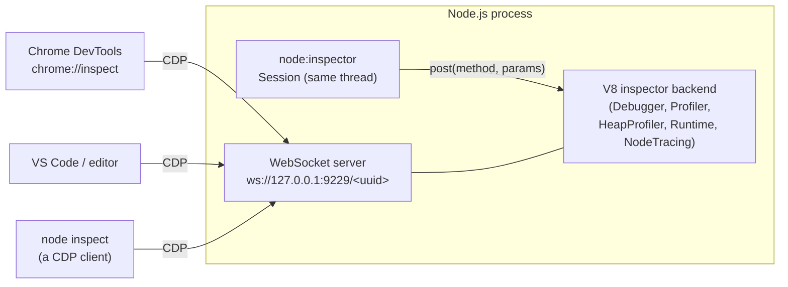

# Chapter 47 — Debugging: Inspector Protocol, `node --inspect`, and Editors

## What you will learn

- Drive the built-in CLI debugger (`node inspect`) — breakpoints, watchers, stepping, and its two profiling commands — plus the new non-interactive probe mode.
- Choose correctly between `--inspect`, `--inspect-brk`, and `--inspect-wait`, and bind the inspector port without handing an attacker a shell.
- Use `node:inspector` to capture a `.cpuprofile` or `.heapsnapshot` from inside your own process, with no debugger attached.
- Debug worker threads, cluster workers, and forked child processes without port collisions.
- Make TypeScript stack traces point at TypeScript, using `--enable-source-maps` and the `node:module` source map APIs.
- Diagnose a hung production service with cheap tools first: `NODE_DEBUG`, `util.debuglog()`, and an on-demand profile.

## Why this matters

A service starts returning 504s. CPU sits at 100% on one core. Restarting fixes it for twenty minutes. You cannot reproduce it locally, and you cannot attach a debugger to production — pausing a process that is serving traffic is not debugging, it is an outage.

Node gives you a graded set of tools for exactly this. At the cheap end, `util.debuglog()` costs nothing when its section is not enabled. In the middle, the inspector protocol lets a process profile *itself* and write the result to disk, which you then open locally in Chrome DevTools. Only at the expensive end do you attach an interactive debugger, and by then you should be doing it on a staging replica. This chapter walks the whole ladder, and it is deliberately blunt about the one thing people get wrong: an inspector port bound to a public address is remote code execution, full stop.

## One protocol, three front ends

Everything in this chapter sits on the same foundation. V8 embeds an *inspector backend*. Node exposes it in three ways: over a WebSocket using the Chrome DevTools Protocol (CDP), through the `node inspect` CLI client, and in-process through the `node:inspector` module.



The important consequence: `node inspect`, your editor, and your own code are all speaking the same protocol to the same backend. When the CLI debugger says `takeHeapSnapshot`, it is sending `HeapProfiler.takeHeapSnapshot`. Anything a front end can do, your code can do.

## The built-in CLI debugger: `node inspect`

The docs describe it honestly: it is not a full-featured debugger, but stepping and inspection work. Its virtue is that it is always there — no editor, no browser, no port forwarding.

```bash
node inspect app.js
```

The general form supports three targets:

```bash
node inspect [--port=<port>] [<node-option> ...] <script> [<script-args>]
node inspect <host>:<port>
node inspect -p <pid>
```

So you can launch a script under the debugger, attach to an already-listening inspector, or attach to a running process by PID.

On launch the debugger **breaks on the first executable line** automatically. If you would rather run until your first `debugger;` statement, set `NODE_INSPECT_RESUME_ON_START=1` in the environment:

```bash
NODE_INSPECT_RESUME_ON_START=1 node inspect app.js
```

Pressing <kbd>Enter</kbd> with no input repeats the previous command, which makes stepping bearable.

### The command set

| Command | Aliases | What it does |
|---|---|---|
| `cont` | `c` | Continue execution |
| `next` | `n` | Step over to the next line |
| `step` | `s` | Step into |
| `out` | `o` | Step out of the current frame |
| `pause` | — | Pause running code |
| `setBreakpoint()` | `sb()` | Breakpoint on the current line |
| `setBreakpoint(line)` | `sb(line)` | Breakpoint on a line of the current script |
| `setBreakpoint('fn()')` | `sb(...)` | Breakpoint on the first statement of a function body |
| `setBreakpoint('script.js', 1)` | `sb(...)` | Breakpoint in another script, even one not loaded yet |
| `setBreakpoint('script.js', 1, 'num < 4')` | `sb(...)` | Conditional breakpoint |
| `clearBreakpoint('script.js', 1)` | `cb(...)` | Remove a breakpoint |
| `backtrace` | `bt` | Print the current stack |
| `list(5)` | — | Show source with 5 lines of context either side |
| `watch(expr)` / `unwatch(expr)` / `unwatch(index)` | — | Manage the watch list |
| `watchers` | — | Print all watchers (also printed at each breakpoint) |
| `repl` | — | Evaluate in the debuggee's context; <kbd>Ctrl</kbd>+<kbd>C</kbd> leaves it |
| `exec expr` | `p expr` | Evaluate a single expression and print it |
| `profile` / `profileEnd` | — | Start / stop a CPU profiling session |
| `profiles` | — | List completed profiling sessions |
| `profiles[n].save(filepath)` | — | Write a profile to disk (default `node.cpuprofile`) |
| `takeHeapSnapshot(filepath)` | — | Write a heap snapshot (default `node.heapsnapshot`) |
| `run` / `restart` / `kill` | — | Execution control |
| `scripts` | — | List loaded scripts |
| `version` | — | Print V8's version |

Two of these are worth more attention than they usually get. `profile` / `profileEnd` / `profiles[0].save('slow.cpuprofile')` gives you a Chrome-loadable CPU profile from a terminal with no browser involved, and `takeHeapSnapshot('before.heapsnapshot')` does the same for memory. If you can SSH into a box and run `node inspect -p <pid>`, you can get both artefacts off it.

Setting a breakpoint in a module that has not been loaded yet works, and warns you that it has not been resolved:

```
debug> setBreakpoint('mod.js', 22)
Warning: script 'mod.js' was not loaded yet.
debug> c
break in mod.js:22
```

That warning is not an error. The breakpoint binds when the module loads.

### Probe mode: printf debugging without touching the code

**[Experimental]** — added in v26.1.0 (and v24.16.0). `node inspect --probe` runs the script non-interactively, evaluates expressions at source locations you name, and prints one report at the end. It is the answer to "I want a `console.log` in a dependency I cannot edit."

```bash
node inspect --probe src/handler.js:42 --expr 'req.headers' \
             --cond 'req.method === "POST"' --max-hit 5 \
             --timeout=10000 --json -- --no-warnings server.js
```

| Option | Scope | Meaning |
|---|---|---|
| `--probe <file>:<line>[:<col>]` | per probe | Where to evaluate. `<file>` matches a path-separator-anchored **suffix** of loaded script URLs; line and column are 1-based. Omitting the column binds to the first executable column. |
| `--expr <expr>` | per probe | Expression to evaluate. Must immediately follow its `--probe`. |
| `--cond <expr>` | per location | Record a hit only when truthy. A throwing condition counts as false. |
| `--max-hit <n>` | per pair | Stop after `n` hits; the probed process keeps running. |
| `--timeout=<ms>` | session | Wall-clock deadline. Default `30000`. |
| `--json` | session | Structured report (schema `v: 2`) instead of text. |
| `--preview` | session | Include CDP property previews for object values. |
| `--port=<port>` | session | Local inspector port for the probing session. Default `0` (random). |

Three rules bite in practice:

1. **Probe where the variable is alive.** Probing a `const` at its declaration line evaluates inside the temporal dead zone and reports a `ReferenceError`. Probe the line *after*.
2. **A bare basename can match several files.** `--probe utils.js:10` binds to both `src/utils.js` and `lib/utils.js` and produces a hit for each; every hit carries its own `location`, so use a fuller path to disambiguate at bind time.
3. **`--` separates probe options from the child's Node options.** It is optional only if the child needs no flags of its own.

Probe mode currently only launches a new process from the entry point on the command line; you cannot probe an already-running process.

## Activating the inspector

| Flag | Since | Behaviour |
|---|---|---|
| `--inspect[=[host:]port]` | v6.3.0 | Listen on `host:port` (default `127.0.0.1:9229`) and **run immediately** |
| `--inspect-brk[=[host:]port]` | v7.6.0 | Listen, then break on the first line of the user script |
| `--inspect-wait[=[host:]port]` | v22.2.0, v20.15.0 | Listen and block until a debugger attaches, then run normally |
| `--inspect-port=[host:]port` | v7.6.0 | Set the `host:port` used *when* the inspector is later activated (e.g. by `SIGUSR1`) |
| `--inspect-publish-uid=stderr,http` | — | Choose how the WebSocket URL is exposed |
| `--disable-sigusr1` | v23.7.0, v22.14.0 (stable v24.8.0, v22.20.0) | Refuse to start a debugging session on `SIGUSR1` |
| `--allow-inspector` | v25.0.0, v24.12.0 (**[Experimental]**, 1.0) | Permit the inspector under `--permission` |

Pick by intent. `--inspect` when the bug happens after warm-up, `--inspect-brk` when you need to step through startup, `--inspect-wait` when you need your `--require` preloads and top-level module code to run *after* the tooling is connected but do not want to hand-step the first line. Passing `0` as the port asks for a random free port, which is the single most useful trick for multi-process debugging.

### The security warning, stated plainly

Binding the inspector to a public IP — including `0.0.0.0` — with an open port is a **remote code execution** vulnerability. There is no authentication on the inspector protocol. Anyone who can open that WebSocket can evaluate arbitrary JavaScript in your process, read every secret in memory, and spawn processes as your service user. Node's threat model treats *any* inspector connection as trusted, regardless of where the remote end is.

The docs are explicit: `--inspect=0.0.0.0` is insecure if the port (9229 by default) is not firewall-protected. If you specify a host, make sure either the host is unreachable from public networks or a firewall blocks the port. In practice, keep the default `127.0.0.1` binding and tunnel — see below.

`--inspect-publish-uid` controls the two places the URL leaks. By default the WebSocket URL is printed to stderr *and* served from `http://host:port/json/list`. Passing `--inspect-publish-uid=stderr` keeps it out of the HTTP discovery endpoint; `--inspect-publish-uid=http` keeps it out of your logs. Neither is a substitute for not exposing the port.

### `SIGUSR1` and turning it off

`SIGUSR1` is reserved by Node: sending it to a process starts the debugger. You can install a listener for it, but doing so may interfere with that behaviour. The port used is whatever `--inspect-port` (or `process.debugPort`) says.

```bash
kill -USR1 $(pgrep -f 'node server.js')
```

This is enormously convenient and is also an escalation path. `process._debugProcess(pid)` sends the same signal (on Windows, it injects a remote thread instead) and is **not** gated by the permission model. A sandboxed process running under `--permission` with no grants can force any Node process owned by the same OS user to open its inspector. Node considers this consistent with its threat model — cross-process signalling is the operating system's business — but that means it is *your* job to isolate. Run untrusted code as a different OS user, or use seccomp/AppArmor.

If a process must never be debuggable, start it with `--disable-sigusr1`. Windows has no signals at all, so `SIGUSR1` activation is not available there; use `--inspect` at startup or the programmatic `inspector.open()`.

Under the permission model, opening your own inspector throws `ERR_ACCESS_DENIED` unless you pass `--allow-inspector`:

```
Error: connect ERR_ACCESS_DENIED Access to this API has been restricted. Use --allow-inspector to manage permissions.
```

### Connecting a front end

**Chrome DevTools.** Open `chrome://inspect`; targets on `localhost:9229` appear automatically, and you can add other `host:port` pairs to the discovery list. You get the full stack: source-mapped breakpoints, live expressions, the Memory tab for heap snapshots and allocation timelines, the Performance tab for CPU profiles, and a console evaluating in the process's context.

**VS Code and other editors.** Editors speak CDP over the same WebSocket. An *attach* configuration points at the port; a *launch* configuration starts Node with `--inspect-brk` for you. What you gain over DevTools is that breakpoints live in your real source tree, survive restarts, and understand your `outFiles`/source-map layout; what you lose is DevTools' memory and profiling UI, which is genuinely better.

| Front end | Best at | Weak at |
|---|---|---|
| `node inspect` | No-GUI environments, quick attach by PID, scripted profile capture | Ergonomics, watching complex objects |
| Chrome DevTools | Heap snapshots, allocation sampling, CPU profile flame charts, live expressions | Editing code; breakpoints do not persist across restarts |
| Editor (VS Code etc.) | Breakpoints in your source tree, conditional/logpoints, multi-target sessions | Memory analysis |

## The `node:inspector` module

Everything a front end does is a CDP message. `node:inspector` lets you send those messages yourself. Two entry points exist:

```mjs
import { Session } from 'node:inspector/promises';   // Promise API, [Experimental], since v19.0.0
import { Session } from 'node:inspector';            // Callback API, Stable
```

```cjs
const { Session } = require('node:inspector/promises');
const { Session } = require('node:inspector');
```

The classes are the same shape; only `session.post()` differs — `post(method[, params])` returning a promise versus `post(method[, params][, callback])`.

| Method | Notes |
|---|---|
| `session.connect()` | Connect to this thread's inspector backend |
| `session.connectToMainThread()` | Connect to the **main thread's** backend; throws if not called on a worker thread (since v12.11.0) |
| `session.post(method[, params])` | Send a CDP command |
| `session.disconnect()` | Close; pending callbacks receive an error, and all inspector state (enabled agents, breakpoints) is lost |

A `Session` is an `EventEmitter`. It emits `'inspectorNotification'` for every notification, and also an event named after each notification's method:

```js
session.on('inspectorNotification', (message) => console.log(message.method));
session.on('Debugger.paused', ({ params }) => console.log(params.hitBreakpoints));
```

The domains worth knowing:

| Domain | Use it for |
|---|---|
| `Profiler` | Sampling CPU profiles: `Profiler.enable`, `Profiler.start`, `Profiler.stop` |
| `HeapProfiler` | Heap snapshots and allocation sampling: `HeapProfiler.takeHeapSnapshot`, plus the `HeapProfiler.addHeapSnapshotChunk` notification |
| `Runtime` | Evaluating expressions (`Runtime.evaluate`), and `Runtime.DiscardConsoleEntries` |
| `Debugger` | Breakpoints and stepping — see the caveat below |
| `NodeTracing` | Collecting trace events programmatically (Chapter 48) |

Node supports every CDP domain V8 declares; the authoritative list is the Chrome DevTools Protocol Viewer.

### Worked example: capture a CPU profile on demand

The goal is a process that profiles itself for a bounded window and writes a `.cpuprofile` you can drag into Chrome's Performance tab. No debugger, no open port.

```mjs
import { Session } from 'node:inspector/promises';
import { writeFile } from 'node:fs/promises';

export async function captureCpuProfile(durationMs, outputPath) {
  const session = new Session();
  session.connect();
  try {
    await session.post('Profiler.enable');
    await session.post('Profiler.setSamplingInterval', { interval: 1000 });
    await session.post('Profiler.start');

    await new Promise((resolve) => setTimeout(resolve, durationMs).unref());

    const { profile } = await session.post('Profiler.stop');
    await writeFile(outputPath, JSON.stringify(profile));
    return outputPath;
  } finally {
    session.disconnect();
  }
}
```

Wire it to a signal so an operator can trigger it without a deploy:

```mjs
import { captureCpuProfile } from './profile.mjs';

let capturing = false;
process.on('SIGUSR2', async () => {
  if (capturing) return;
  capturing = true;
  try {
    const file = `/var/log/app/cpu-${process.pid}-${Date.now()}.cpuprofile`;
    await captureCpuProfile(15_000, file);
    console.error(`wrote ${file}`);
  } catch (err) {
    console.error('profile failed', err);
  } finally {
    capturing = false;
  }
});
```

`SIGUSR2` is the right choice here precisely because `SIGUSR1` belongs to Node. Note the `.unref()` on the timer: a profiling window should never keep the process alive.

If you only need "profile the whole run", skip the code entirely — `--cpu-prof` starts the sampling profiler at startup and writes the profile before exit (stable since v22.4.0/v20.16.0). `--cpu-prof-dir`, `--cpu-prof-name` (which supports a `${pid}` placeholder), and `--cpu-prof-interval` (default 1000 microseconds) control the output. The default filename is `CPU.${yyyymmdd}.${hhmmss}.${pid}.${tid}.${seq}.cpuprofile`.

### Worked example: heap snapshot

Heap snapshots are streamed back as chunks rather than returned, so the shape is different: subscribe to the notification, write each chunk, *then* await the command.

```mjs
import { Session } from 'node:inspector/promises';
import { createWriteStream } from 'node:fs';
import { once } from 'node:events';

export async function writeHeapSnapshot(outputPath) {
  const session = new Session();
  const out = createWriteStream(outputPath);
  session.connect();
  try {
    session.on('HeapProfiler.addHeapSnapshotChunk', (m) => {
      out.write(m.params.chunk);
    });
    await session.post('HeapProfiler.takeHeapSnapshot', null);
  } finally {
    session.disconnect();
    out.end();
    await once(out, 'close');
  }
}
```

Two constraints from the docs. You **cannot** set `reportProgress: true` on `HeapProfiler.takeHeapSnapshot` or `HeapProfiler.stopTrackingHeapObjects` from a Node session. And because `out.write()` is not awaited, the `out.end()` / `'close'` handshake is what guarantees the file is complete — dropping it produces truncated snapshots that Chrome refuses to open. (Chapter 50 covers `v8.writeHeapSnapshot()`, which is simpler when you do not need the CDP path.)

### The breakpoint caveat

Do not set breakpoints through a same-thread `Session`. The program being paused *is* the debugger, so the pause deadlocks the very code that would resume it. The documented alternatives are: connect from a worker thread to the main thread with `connectToMainThread()`, or drive `Debugger` over a WebSocket from an external client.

### Opening and closing the inspector programmatically

| API | Behaviour |
|---|---|
| `inspector.open([port[, host[, wait]]])` | Equivalent to `--inspect=[[host:]port]`, but at runtime. Defaults come from the CLI. `wait: true` blocks until a client connects and control passes to it. Returns a `Disposable` that calls `close()` (since v20.6.0). |
| `inspector.close()` | Deactivate the inspector; active connections are forcibly terminated. Blocks until the server has fully stopped. Available in worker threads since v18.10.0. |
| `inspector.url()` | The active inspector's WebSocket URL, or `undefined` |
| `inspector.waitForDebugger()` | Block until a client sends `Runtime.runIfWaitingForDebugger`. Throws if no inspector is active. |
| `inspector.console` | Sends messages to the *remote* inspector console. Not API-compatible with `node:console`. |

The same security warning applies to the `host` argument of `inspector.open()`. Opening on demand and closing immediately afterwards is strictly better than leaving a port listening:

```mjs
import inspector from 'node:inspector';
import { setTimeout as delay } from 'node:timers/promises';

export async function debugWindow(ms) {
  using handle = inspector.open(0, '127.0.0.1', false);
  console.error('inspector at', inspector.url());
  await delay(ms);
  // `handle` is disposed here, which calls inspector.close().
}
```

There are also **[Experimental]** integration surfaces for DevTools front ends, each behind its own flag: `inspector.Network.*` (`--experimental-network-inspection`) to broadcast HTTP and WebSocket lifecycle events, `inspector.NetworkResources.put` (`--experimental-inspector-network-resource`) to pre-register source maps and sources a front end may request, and `inspector.DOMStorage.*` (`--experimental-storage-inspection`).

## Debugging workers and child processes

Every Node process that activates the inspector wants a TCP port, and the default is `9229` for all of them. That is where the pain comes from.

- **Worker threads** live inside the same process and therefore share its inspector server rather than binding a port each. To inspect from a worker, use `session.connectToMainThread()`. Worker `execArgv` inherits from the parent by default, and V8 options and process-affecting options are rejected there anyway. DevTools support for worker targets is **[Experimental]** behind `--experimental-worker-inspection` (v24.1.0, v22.17.0).
- **`child_process.fork()`** defaults `execArgv` to `process.execArgv`. If the parent runs with `--inspect`, every child inherits it and the second child fails to bind port 9229. Override it explicitly.
- **Cluster** already solves this: `cluster.settings.inspectPort` accepts a number or a function returning a number, and by default each worker gets its own port incremented from the primary's `process.debugPort`.

The general fix is `--inspect=0`, which asks the OS for a free port. Each process then prints its own URL to stderr.

```mjs
import { fork } from 'node:child_process';

const child = fork('./worker.js', {
  // Strip any inherited inspector flags, then ask for a random port.
  execArgv: process.execArgv
    .filter((a) => !a.startsWith('--inspect'))
    .concat('--inspect=0'),
});
```

```mjs
import cluster from 'node:cluster';

let nextInspectPort = 9230;
cluster.setupPrimary({
  inspectPort: () => nextInspectPort++,
});
```

`process.debugPort` is readable and writable, and is what `SIGUSR1` activation and cluster's default port allocation build on.

## Source maps: making TypeScript stack traces true

Transpiled code produces stack traces that point at the *output*. A frame reading `dist/routes/user.js:1:2043` is worse than useless when your source is `src/routes/user.ts`. Source maps fix this, but only if Node is told to read them.

```bash
node --enable-source-maps dist/server.js
```

`--enable-source-maps` (stable since v15.11.0/v14.18.0) enables caching of source maps and makes a best-effort attempt to report stack frames against the original file. Source map data is discovered from the include directive in a module's footer.

Programmatic control lives in `node:module`, not `node:process`:

```mjs
import { setSourceMapsSupport, getSourceMapsSupport, findSourceMap } from 'node:module';

setSourceMapsSupport(true, { nodeModules: true, generatedCode: false });
console.log(getSourceMapsSupport());
// { enabled: true, nodeModules: true, generatedCode: false }
```

`module.setSourceMapsSupport(enabled[, options])` and `module.getSourceMapsSupport()` arrived in v23.7.0 / v22.14.0 and are **[Experimental]**. The options — `nodeModules` (default `false`) and `generatedCode`, meaning code from `eval` and `new Function` (default `false`) — are the only thing the CLI flag cannot express. The older `process.setSourceMapsEnabled(val)` and `process.sourceMapsEnabled` are **[Experimental]** and the docs now direct you to the `node:module` versions; `process.setSourceMapsEnabled(true)` implies `{ nodeModules: true, generatedCode: true }`.

The critical caveat: **only source maps in files loaded *after* support is enabled are parsed.** Calling `setSourceMapsSupport(true)` from your application entry point misses everything already imported. Use the flag (or `NODE_OPTIONS`) unless you have a specific reason not to. Source maps are also parsed when `NODE_V8_COVERAGE` is set.

To map a location yourself — say, to rewrite frames in a log shipper:

```mjs
import { findSourceMap } from 'node:module';

const map = findSourceMap('/app/dist/routes/user.js');
if (map) {
  const origin = map.findOrigin(1, 2043); // 1-indexed, as errors report them
  console.log(`${origin.fileName}:${origin.lineNumber}:${origin.columnNumber}`);
}
```

`sourceMap.findOrigin(lineNumber, columnNumber)` (v20.4.0, v18.18.0) takes **1-indexed** positions as they appear in stack traces and returns `{ name, fileName, lineNumber, columnNumber }`, or `{}` if nothing matched. Its sibling `sourceMap.findEntry(lineOffset, columnOffset)` takes **0-indexed** offsets and returns the raw source-map range. Mixing the two up is the classic off-by-one here. `sourceMap.payload` is frozen — do not mutate it.

One more trap: overriding `Error.prepareStackTrace` can disable source-map rewriting entirely, because Node implements the rewrite there. If a library of yours overrides it, chain to the original:

```js
const originalPrepareStackTrace = Error.prepareStackTrace;
Error.prepareStackTrace = (error, trace) => {
  return originalPrepareStackTrace(error, trace);
};
```

Enabling source maps adds latency whenever `Error.stack` is accessed. If your code reads `.stack` on every request — many logging setups do — measure before enabling it globally.

## Cheap tracing: `NODE_DEBUG` and `util.debuglog()`

Before you reach for a debugger, remember Node core is already instrumented. `NODE_DEBUG` takes a comma-separated list of core module sections:

```bash
NODE_DEBUG=net,tls,stream node server.js
NODE_DEBUG_NATIVE=inspector node server.js   # C++ internals
```

Your own code gets the same mechanism for free:

```mjs
import { debuglog } from 'node:util';

const log = debuglog('billing');

export function charge(invoice) {
  log('charging invoice %s for %d cents', invoice.id, invoice.amountCents);
}
```

Run with `NODE_DEBUG=billing` and lines appear on stderr prefixed with the uppercased section and the PID (`BILLING 3245: charging ...`). Run without it and the function is a no-op. Wildcards work: `NODE_DEBUG=billing*` enables `billing-refunds` too.

Two refinements matter on hot paths. `log.enabled` is a boolean getter, so you can guard expensive argument construction:

```js
if (log.enabled) log('state: %s', JSON.stringify(hugeObject));
```

And the optional callback argument to `debuglog()` hands you an optimized logging function with no enablement check, invoked the first time the section is actually used:

```mjs
import { debuglog } from 'node:util';

let log = debuglog('billing', (debug) => {
  log = debug; // drop the wrapper for subsequent calls
});
```

Chapter 48's `diagnostics_channel` is the structured successor to this for anything a machine will consume; `debuglog` remains the right tool for developer-facing breadcrumbs.

## Containers and SSH tunnels, done safely

In a container, `--inspect` binding to `127.0.0.1` means the container's loopback, which your host cannot reach. The wrong fix is `--inspect=0.0.0.0`. The right fix depends on where you are:

**Local development container.** Bind to `0.0.0.0` *only* if the port is published to the host's loopback and the container is not on a routable network:

```bash
docker run --rm -p 127.0.0.1:9229:9229 myapp \
  node --inspect=0.0.0.0:9229 server.js
```

The `127.0.0.1:` prefix on `-p` is the load-bearing part. `-p 9229:9229` publishes on all host interfaces, and on many cloud VMs that is the whole internet.

**Anything shared or remote.** Keep the default loopback binding and tunnel:

```bash
ssh -N -L 9229:127.0.0.1:9229 deploy@app-01
```

Now `chrome://inspect` on your laptop sees a target on `localhost:9229`, authentication is SSH's problem, and nothing is listening publicly. For a container on a remote host, chain the two: tunnel to the host, then `docker exec` or publish to the host's loopback.

Never bake `--inspect` into a production image's default command. If you need it occasionally, use `SIGUSR1` (and accept the escalation risk), or ship a `SIGUSR2` profile-capture handler like the one above and skip the port entirely.

## A production workflow: "requests are hanging"

You get paged. p99 latency is climbing, one pod is pinned at 100% CPU. Work down this ladder and stop as soon as you have an answer.

1. **Confirm it is CPU, not I/O.** If CPU is idle and requests still hang, it is a dependency, a lock, or a leaked handle — go to `diagnostics_channel` (Chapter 48) and event loop utilization (Chapter 49), not a profiler.
2. **Turn on breadcrumbs you already shipped.** If the service reads `NODE_DEBUG` or a `debuglog` section, redeploy one pod with it set. Cost when unset: zero.
3. **Capture, do not attach.** Send `SIGUSR2` to the hot pod and let the in-process handler write a 15-second `.cpuprofile` to a volume. The process never pauses, latency is unaffected beyond sampling overhead, and no port is opened.
4. **Pull the artefact and analyse locally.** Copy the file out, open Chrome DevTools → Performance → *Load profile*. A single deep frame consuming 90% of samples is your answer — usually a regex, a synchronous crypto or `zlib` call, or an accidental O(n²) over a growing array.
5. **If it is memory, take two snapshots.** One early, one after growth, using the `writeHeapSnapshot` helper. Chrome's Memory tab comparison view shows what accumulated between them.
6. **Only then, reproduce with a debugger.** On a staging replica, replay traffic and attach with `--inspect` over an SSH tunnel, or start it with `--inspect-wait` so you catch the startup path.

The discipline is simple: production produces *artefacts*, your laptop runs the *debugger*.

## Common mistakes

### ❌ Exposing the inspector to the network to "debug in prod"

```bash
node --inspect=0.0.0.0:9229 server.js   # unauthenticated RCE
```

Anyone who reaches that port owns the process. There is no password, no TLS, no allowlist — Node's threat model explicitly trusts any inspector connection.

✅ Keep the loopback default and tunnel:

```bash
node --inspect server.js                       # 127.0.0.1:9229
ssh -N -L 9229:127.0.0.1:9229 deploy@app-01    # from your laptop
```

### ❌ Setting breakpoints from a same-thread `inspector.Session`

```js
const session = new inspector.Session();
session.connect();
session.post('Debugger.enable');
session.post('Debugger.setBreakpointByUrl', { url, lineNumber });
// The pause suspends the code that would resume it.
```

✅ Connect from a worker to the main thread, or use an external client:

```mjs
// inside a worker thread
import { Session } from 'node:inspector/promises';
const session = new Session();
session.connectToMainThread();
await session.post('Debugger.enable');
```

### ❌ Enabling source maps from inside the application entry point

```js
// src/index.js — too late for everything already imported
require('node:module').setSourceMapsSupport(true);
```

Only files loaded *after* the call get their maps parsed, so the frames you care about — the ones in modules loaded during startup — stay unmapped.

✅ Enable it before user code runs:

```bash
node --enable-source-maps dist/server.js
# or
NODE_OPTIONS=--enable-source-maps node dist/server.js
```

### ❌ Forking children while the parent is being inspected

```js
fork('./worker.js'); // inherits --inspect from process.execArgv → EADDRINUSE on 9229
```

✅ Strip the flag or ask for a random port:

```js
fork('./worker.js', {
  execArgv: process.execArgv.filter((a) => !a.startsWith('--inspect')),
});
```

### ❌ Closing the heap snapshot file before the chunks are flushed

```js
session.post('HeapProfiler.takeHeapSnapshot', null, () => {
  out.end();          // chunks may still be buffered
  process.exit(0);    // truncated, unopenable snapshot
});
```

✅ End the stream and wait for `'close'` before exiting, as in the worked example above.

## Production notes

- **Sampling profilers are cheap; snapshots are not.** A CPU profile at the default 1000-microsecond interval costs a few percent. A heap snapshot walks the entire heap, stops the world for the duration, and produces a file roughly the size of your live heap — on a 2 GB heap that is a multi-second pause and a 2 GB write. Take snapshots on one pod, out of the load balancer.
- **`--cpu-prof` and `--heap-prof` are the zero-code option.** Both are stable since v22.4.0/v20.16.0 and write on exit. `--heap-prof-interval` defaults to 512 KiB of sampled allocations. `--diagnostic-dir` sets the default directory for both. They cover the whole process lifetime, which makes them ideal for short-lived jobs and useless for a service that has been up for nine days.
- **Budget for the source-map tax.** `--enable-source-maps` adds work every time `Error.stack` is read. Services that construct and serialize errors per request should measure it; the alternative is mapping frames offline in your log pipeline with `findSourceMap()`.
- **`SIGUSR1` is an attack surface you may not have inventoried.** Any process on the box running as the same user can call `process._debugProcess(pid)` and force your inspector open — the permission model does not stop it. Where that matters, run with `--disable-sigusr1` and rely on explicit `inspector.open()` behind your own authorization.
- **Prefer a `Disposable` inspector to a permanently open port.** `inspector.open()` returns a `Disposable` (v20.6.0), so `using` guarantees `close()` even on throw. A port that is open for 30 seconds during an incident is a very different risk from one open for the life of the deployment.
- **Windows differs.** No `SIGUSR1` activation; `process._debugProcess()` injects a remote thread instead. Plan on `--inspect` at startup or a programmatic trigger over your admin channel.
- **Do not leave `NODE_DEBUG` set in production.** Core sections such as `net` and `stream` log per-socket and per-chunk to stderr, synchronously. It will dominate your logs and your CPU.

## Exercises

1. **Drive the CLI debugger.** Write a script with a function called in a loop. Under `node inspect`, set a conditional breakpoint that fires only on the 50th iteration, add a watcher on the loop counter, and use `exec` to inspect a local. *Success:* the breakpoint fires exactly once and the watcher value is shown at the pause.

2. **Probe a dependency you cannot edit.** Pick a module in `node_modules` and use `node inspect --probe` with `--cond` and `--max-hit` to record the arguments of one of its functions on the first three matching calls, in `--json` form. *Success:* the JSON report contains three `hit` events and a terminal `completed` event, and the module source is unmodified.

3. **Build a signal-triggered profiler.** Add a `SIGUSR2` handler that captures a 10-second CPU profile to a timestamped file, refusing to start a second capture while one is running. Load the result in Chrome DevTools. *Success:* two rapid signals produce exactly one file, and the flame chart shows your busy function.

4. **Make TypeScript stacks true.** Transpile a small TypeScript project with source maps, throw from a nested function, and compare the stack with and without `--enable-source-maps`. Then, without the flag, reproduce the mapping manually using `findSourceMap()` and `findOrigin()`. *Success:* both approaches report the same `.ts` file, line, and column.

5. **Debug a worker thread.** Start a program with a `Worker` that runs a CPU-bound loop. From inside the worker, connect a `Session` with `connectToMainThread()` and use the `Profiler` domain to profile the *main* thread while the worker is busy. *Success:* a `.cpuprofile` written from the worker that contains main-thread frames only.

## Recap

- `node inspect` is a CDP client with a small, learnable command set — and it can save `.cpuprofile` and `.heapsnapshot` files without a browser. Probe mode (**[Experimental]**) adds printf-style debugging with no code changes.
- `--inspect` runs immediately, `--inspect-brk` breaks on line one, `--inspect-wait` blocks until a client attaches. Port `0` means "any free port".
- The inspector protocol is unauthenticated. Bind to `127.0.0.1` and tunnel; `--inspect=0.0.0.0` on an unfirewalled port is remote code execution.
- `SIGUSR1` opens the inspector, `--disable-sigusr1` refuses, and `process._debugProcess()` is not gated by the permission model.
- `node:inspector` lets a process profile itself: `Profiler.start`/`stop` for CPU, and `HeapProfiler.takeHeapSnapshot` plus `addHeapSnapshotChunk` for memory. Never set breakpoints on your own thread.
- Workers share the process's inspector and use `connectToMainThread()`; forked children inherit `execArgv` and collide on 9229 unless you strip the flag or pass `--inspect=0`; cluster has `inspectPort`.
- `--enable-source-maps` must be on before the code loads. `module.setSourceMapsSupport()`/`getSourceMapsSupport()` and `findSourceMap()` give programmatic control; `findOrigin()` is 1-indexed and `findEntry()` is 0-indexed.
- `util.debuglog()` and `NODE_DEBUG` cost nothing when disabled — reach for them before anything heavier.

## Where to go next

- [Chapter 29 — Worker Threads](../part4-system/29-worker-threads.md) for `execArgv` and worker lifecycle.
- [Chapter 30 — Cluster and Multi-Process Scaling](../part4-system/30-cluster.md) for `inspectPort` and per-worker ports.
- [Chapter 31 — The Permission Model](../part4-system/31-permission-model.md) for `--allow-inspector` and audit mode.
- [Chapter 48 — Diagnostics Channel and Trace Events](./48-diagnostics-channel-tracing.md) for zero-cost instrumentation and `NodeTracing`.
- [Chapter 49 — Measuring Performance with `perf_hooks`](./49-perf-hooks.md) for event loop utilization and user timing.
- [Chapter 50 — Diagnostic Reports, Heap Snapshots, and V8 Tooling](./50-reports-and-heap.md) for `v8.writeHeapSnapshot()` and `--report-on-signal`.
- Official docs: <https://nodejs.org/docs/latest/api/inspector.html> and <https://nodejs.org/docs/latest/api/debugger.html>
