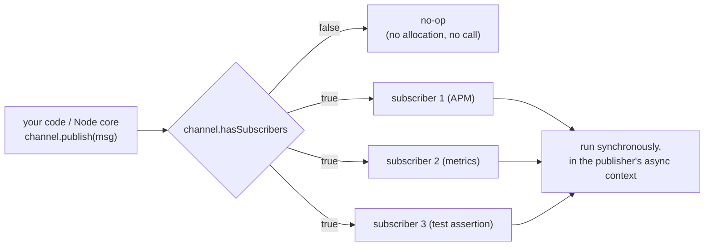

# Chapter 48 — Diagnostics Channel and Trace Events

## What you will learn

- Publish and subscribe to named diagnostics channels, and why the design costs nothing when nobody is listening.
- Use `TracingChannel` to emit a correct five-event trace around sync, promise, and callback APIs — and propagate context into `AsyncLocalStorage` with `bindStore`/`runStores`.
- Find the built-in channels Node already publishes, and what each payload carries, from a single reference table.
- Design an application-level instrumentation layer that an APM agent, a log shipper, or a test can attach to without patching your code.
- Capture Chrome-format traces with `--trace-event-categories` and `node:trace_events`, and read them in a trace viewer.
- Choose between `diagnostics_channel`, trace events, `perf_hooks`, and OpenTelemetry — and keep all four off your hot path.

## Why this matters

For a decade, Node APM agents worked by monkey-patching. Require `http`, reach into the module object, wrap `http.Server.prototype.emit`, wrap `ClientRequest`, wrap `Promise`. It worked until it didn't: two agents patching the same function, a patch that swallowed a stack frame, a Node release that changed an internal call path and silently broke every span. The wrapper also has to run *always*, because it cannot know in advance whether anyone will care.

`node:diagnostics_channel` inverts that. The instrumented code publishes to a named channel; the check "does anyone care?" is a boolean read on a channel object. When no subscriber exists, `publish()` does nothing and the message is never even constructed if you guard with `hasSubscribers`. When a subscriber exists, it runs synchronously in the same context, so it sees the same async context, the same request, the same stack. Node core uses it internally, third-party libraries increasingly ship channels, and every serious APM vendor now consumes them. It became **Stable** in v19.2.0/v18.13.0.

Trace events solve a different problem — a whole-process timeline of what V8 and Node internals were doing, in a format Chrome and Perfetto already render. This chapter covers both, and finishes with a decision table so you stop reaching for the wrong one.

## The publish/subscribe model



Three properties follow from that diagram and matter enormously:

1. **Delivery is synchronous.** A subscriber runs inside the publisher's stack and async context. That is what makes it useful for tracing — `AsyncLocalStorage.getStore()` inside a subscriber returns the caller's store.
2. **A throwing subscriber takes down the process.** Errors thrown in a message handler trigger `'uncaughtException'`. Your subscriber is running inside somebody else's `http` request handling; treat it as if it were.
3. **Publishing is cheap only if you keep it cheap.** The dispatch is cheap; building an elaborate message object before calling `publish()` is not. That is what `hasSubscribers` is for.

### The core API

```mjs
import diagnostics_channel from 'node:diagnostics_channel';

const channel = diagnostics_channel.channel('acme:cache:miss');

function onMessage(message, name) {
  // message is whatever the publisher passed; name is the channel name
}

diagnostics_channel.subscribe('acme:cache:miss', onMessage);

if (channel.hasSubscribers) {
  channel.publish({ key: 'user:42', region: 'eu-west-1' });
}

diagnostics_channel.unsubscribe('acme:cache:miss', onMessage);
```

```cjs
const diagnostics_channel = require('node:diagnostics_channel');

const channel = diagnostics_channel.channel('acme:cache:miss');

function onMessage(message, name) {}

diagnostics_channel.subscribe('acme:cache:miss', onMessage);

if (channel.hasSubscribers) {
  channel.publish({ key: 'user:42', region: 'eu-west-1' });
}

diagnostics_channel.unsubscribe('acme:cache:miss', onMessage);
```

| API | Signature | Notes |
|---|---|---|
| `diagnostics_channel.channel(name)` | `(string \| symbol) → Channel` | The publisher entry point. Returns a reusable object optimized to avoid a name lookup at publish time. `new Channel()` is not supported. |
| `diagnostics_channel.hasSubscribers(name)` | `(string \| symbol) → boolean` | Name-based check; prefer the property on a cached channel |
| `diagnostics_channel.subscribe(name, onMessage)` | — | Since v18.7.0/v16.17.0. Handler receives `(message, name)` |
| `diagnostics_channel.unsubscribe(name, onMessage)` | `→ boolean` | `true` if the handler was found |
| `channel.hasSubscribers` | getter | The cheap guard |
| `channel.publish(message)` | `(any)` | Runs all subscribers synchronously |
| `channel.subscribe(onMessage)` / `channel.unsubscribe(onMessage)` | — | Object-level equivalents. These were documentation-deprecated in v18.7.0 and **the deprecation was revoked** in v24.8.0/v22.20.0 — they are fine to use again. |

The channel *name* is a string (or symbol) and is the entire contract. Anyone who knows the name can subscribe, from anywhere, including a module you never imported. Node's guidance: create your channels at the top level of a file and reuse them, because acquiring channels at runtime costs more. Include your module name in the channel name to avoid collisions, and document the message shape you publish, because that shape is now public API.

## `TracingChannel`: the shape of an operation

A single `publish()` tells a subscriber that something happened. Tracing needs more: when the operation started, when the synchronous part returned, when the asynchronous continuation ran, when it finished, and whether it failed. `TracingChannel` (**Stable** as of the v27 line; added v19.9.0/v18.19.0) formalizes exactly that into five channels.

```mjs
import diagnostics_channel from 'node:diagnostics_channel';

const channels = diagnostics_channel.tracingChannel('acme.userRepo.findById');
```

That single call creates the five channels named `tracing:acme.userRepo.findById:start`, `:end`, `:asyncStart`, `:asyncEnd`, and `:error`. You can also pass an object with the five `Channel` instances if you need to control the names.

| Sub-channel | Fires when | What the event carries |
|---|---|---|
| `start` | The function is called | Whatever context you supplied — arguments, IDs |
| `end` | The synchronous portion returns. For an async function, this is when the *promise is returned*, not when it settles | For sync traces, `result` is the return value; `error` may be present if it threw |
| `asyncStart` | The callback or continuation is reached | Callbacks: `error` = first callback arg (if not `undefined`/`null`), `result` = second. Promises: `result` on resolve, `error` on reject |
| `asyncEnd` | The callback returns | Rarely different data from `asyncStart`; useful for measuring callback duration |
| `error` | Any error, sync or async | `error` field set. **A single traced call can emit this more than once** |

The docs are explicit about that last point, and it is the subtlety that catches people: if an internal async task fails and *then* the synchronous portion throws, you get two `error` events. Track errors on the `error` channel rather than inferring them from `end`.

All five events for one traced call share **the same event object**. That is the correlation mechanism — key a `WeakMap` on it and you have per-operation state with no ID plumbing.

### The three trace helpers

| Helper | Signature | Emits |
|---|---|---|
| `traceSync(fn[, context[, thisArg[, ...args]]])` | returns `fn`'s return value | `start`, `end`, plus `error` if it throws |
| `tracePromise(fn[, context[, thisArg[, ...args]]])` | returns `fn`'s return value | `start`, `end`, then `asyncStart`/`asyncEnd` when the promise settles, plus `error` |
| `traceCallback(fn[, position[, context[, thisArg[, ...args]]]])` | returns `fn`'s return value | `start`, `end` around the sync portion, `asyncStart`/`asyncEnd` around the callback, plus `error` |

`traceCallback`'s `position` is the **zero-indexed argument position of the callback**, defaulting to the last argument when `undefined` is passed; `context` defaults to `{}`. The callback is assumed to follow the error-first convention. Note that `...args` must include the callback itself.

`tracePromise` changed recently and the change matters. As of v26.0.0, if `fn` returns something that is not a promise or thenable, the value is returned as-is **with a warning** and no `asyncStart`/`asyncEnd` are emitted. As of v26.5.0, non-native thenables are returned as-is, preserving their original type and methods — so tracing a Bluebird-style promise no longer strips its methods.

All three run `fn` via `channel.runStores(context, ...)` on the `start` channel, so any store bound to `start` is entered for the whole operation.

One rule governs correctness: **events are only published if subscribers were present before the trace began.** Subscribing halfway through a trace does not get you a partial trace; you see the next one. This is deliberate — it guarantees every trace graph a subscriber sees is complete.

```mjs
import diagnostics_channel from 'node:diagnostics_channel';

const channels = diagnostics_channel.tracingChannel('acme.userRepo.findById');

export function findById(pool, id) {
  return channels.tracePromise(
    async () => {
      const rows = await pool.query('SELECT * FROM users WHERE id = $1', [id]);
      return rows[0] ?? null;
    },
    { id, table: 'users' },
  );
}
```

And a subscriber that turns those five events into a duration:

```mjs
import diagnostics_channel from 'node:diagnostics_channel';

const channels = diagnostics_channel.tracingChannel('acme.userRepo.findById');
const started = new WeakMap();

channels.subscribe({
  start(event) {
    started.set(event, process.hrtime.bigint());
  },
  asyncEnd(event) {
    const ns = process.hrtime.bigint() - started.get(event);
    console.log(`findById(${event.id}) took ${Number(ns) / 1e6}ms`);
  },
  error(event) {
    console.error(`findById(${event.id}) failed`, event.error);
  },
  end() {},
  asyncStart() {},
});
```

`tracingChannel.subscribe(subscribers)` and `unsubscribe(subscribers)` take an object with `start`, `end`, `asyncStart`, `asyncEnd`, and `error` functions, and are just a convenience over subscribing to each channel. `tracingChannel.hasSubscribers` (v22.0.0/v20.13.0) returns `true` if *any* of the five has a subscriber.

### `BoundedChannel`: the synchronous-only variant

**[Experimental]**, added v26.1.0. `diagnostics_channel.boundedChannel(nameOrChannels)` gives you a two-channel version — just `start` and `end`, no `asyncStart`, `asyncEnd`, or `error` — for operations with no async continuation. It has `run(context, fn[, thisArg[, ...args]])`, `subscribe`/`unsubscribe` taking `{ start, end }`, `hasSubscribers`, and a `withScope([context])` that returns a disposable for the `using` syntax:

```mjs
import { boundedChannel } from 'node:diagnostics_channel';

const templateRender = boundedChannel('acme.template.render');

export function render(name, data) {
  const context = { name };
  using scope = templateRender.withScope(context);
  context.result = compile(name)(data);
  return context.result;
}
```

The `end` event is published when the block exits, and the context object is shared between both events, so mutating it inside the block (as with `context.result`) is how you report outcomes.

## Context propagation with `AsyncLocalStorage`

**[Experimental]**. A channel can drive an `AsyncLocalStorage` directly, which is how a subscriber builds a span tree without the instrumented code knowing anything about spans.

| API | Purpose |
|---|---|
| `channel.bindStore(store[, transform])` | When `runStores` is called on this channel, set the store's context. `transform(data)` maps the published message to the store value; omit it to store the message itself. Re-binding replaces the previous transform. |
| `channel.unbindStore(store)` | Returns `true` if the store was bound |
| `channel.runStores(context, fn[, thisArg[, ...args]])` | Enter all bound stores with the (transformed) context, publish to the channel, and run `fn` inside that scope |
| `channel.withStoreScope(data)` | v26.1.0. Disposable version of `runStores` for `using` syntax; returns a `RunStoresScope` |

The transform is where the span gets created, and the *previous* store value is readable from inside it — that is how you link a child span to its parent:

```mjs
import diagnostics_channel from 'node:diagnostics_channel';
import { AsyncLocalStorage } from 'node:async_hooks';

const channels = diagnostics_channel.tracingChannel('acme.userRepo.findById');
const spans = new AsyncLocalStorage();

channels.start.bindStore(spans, (event) => {
  const parent = spans.getStore();
  const span = new Span('userRepo.findById', parent);
  event.span = span;            // stash it on the shared event object
  return span;
});

// The callback/continuation runs later; restore the same span there.
channels.asyncStart.bindStore(spans, (event) => event.span);
```

Because all five events share one object, stashing the span on `event` in `start` and reading it back in `asyncStart` restores context across the async boundary — this is the documented recovery pattern for cases where context would otherwise be lost.

## The built-in channels Node publishes

This is the reference you will come back to. Everything below is **[Experimental]** unless noted; names and payloads can change between minors, so pin your Node version if you build hard dependencies on them.

### HTTP

| Channel | Payload |
|---|---|
| `http.client.request.created` | `request` {http.ClientRequest} — fires when the request object is created, *before* it is sent |
| `http.client.request.start` | `request` |
| `http.client.request.error` | `request`, `error` |
| `http.client.response.finish` | `request`, `response` {http.IncomingMessage} |
| `http.server.request.start` | `request` {http.IncomingMessage}, `response` {http.ServerResponse}, `socket` {net.Socket}, `server` {http.Server} |
| `http.server.response.created` | `request`, `response` — before the response is sent |
| `http.server.response.finish` | `request`, `response`, `socket`, `server` |

### HTTP/2

| Channel | Payload |
|---|---|
| `http2.client.stream.created` / `http2.server.stream.created` | `stream`, `headers` |
| `http2.client.stream.start` / `http2.server.stream.start` | `stream`, `headers` |
| `http2.client.stream.error` / `http2.server.stream.error` | `stream`, `error` |
| `http2.client.stream.finish` / `http2.server.stream.finish` | `stream`, `headers`, `flags` |
| `http2.client.stream.bodyChunkSent` | `stream`, `writev` {boolean}, `data`, `encoding` |
| `http2.client.stream.bodySent` | `stream` |
| `http2.client.stream.close` / `http2.server.stream.close` | `stream` — read `stream.rstCode` for the HTTP/2 error code |

### Networking

| Channel | Payload |
|---|---|
| `net.client.socket` | `socket` {net.Socket \| tls.TLSSocket} — a new outbound TCP or pipe socket |
| `net.server.socket` | `socket` — a new inbound connection |
| `tracing:net.server.listen:asyncStart` | `server`, `options` — `listen()` invoked, before the port/pipe is set up |
| `tracing:net.server.listen:asyncEnd` | `server` — ready to accept connections |
| `tracing:net.server.listen:error` | `server`, `error` |
| `udp.socket` | `socket` {dgram.Socket} — a new UDP socket |

### Module loading

| Channel | Payload |
|---|---|
| `tracing:module.require:start` / `:end` | `id` (the argument to `require()`), `parentFilename` |
| `tracing:module.require:error` | `id`, `parentFilename`, `error` |
| `tracing:module.import:asyncStart` / `:asyncEnd` | `id` (the argument to `import()`), `parentURL` {URL} |
| `tracing:module.import:error` | `id`, `parentURL`, `error` |

These are the ones to reach for when you want to know why cold start takes eleven seconds.

### Processes and threads

| Channel | Payload |
|---|---|
| `child_process` | `process` {ChildProcess} — a new process was created |
| `tracing:child_process.spawn:start` | `process`, `options` — before the process is actually spawned |
| `tracing:child_process.spawn:end` | `process` — spawn succeeded |
| `tracing:child_process.spawn:error` | `process`, `error` |
| `process.execve` | `execPath`, `args` {string[]}, `env` {string[]} |
| `worker_threads` | `worker` {Worker} — a new thread was created |

### Web Locks, SQLite, console

| Channel | Payload |
|---|---|
| `locks.request.start` | `name`, `mode` (`'exclusive'` \| `'shared'`) — request initiated, before grant |
| `locks.request.grant` | `name`, `mode` — granted, callback about to run |
| `locks.request.miss` | `name`, `mode` — `ifAvailable: true` and the lock was not free |
| `locks.request.end` | `name`, `mode`, `steal`, `ifAvailable`, `error` |
| `sqlite.db.query` | `sql` (expanded with bound values where possible), `database` {DatabaseSync}, `duration` (nanoseconds, SQLite's internal estimate) |
| `console.log` / `console.info` / `console.debug` / `console.warn` / `console.error` | `args` — the array of arguments passed to the call |

Two warnings on `sqlite.db.query`. It is a *profiling* event, not a span: one event per completed statement, no start event, no async context linkage. And subscribers **must not** close the database or the statement, because both are still in use while the event is delivered. If you need real spans, wrap your SQLite calls in a `TracingChannel` yourself.

### Permission model audit

Documented in `permissions.md` rather than `diagnostics_channel.md`. Under `--permission-audit` (v25.8.0), permission checks run but do not deny; each violation is published instead. Message shape: `{ permission, resource }`.

| Channel | Scope |
|---|---|
| `node:permission-model:fs` | File system (read and write) |
| `node:permission-model:net` | Network |
| `node:permission-model:child` | Child processes |
| `node:permission-model:worker` | Worker threads |
| `node:permission-model:inspector` | Inspector |
| `node:permission-model:wasi` | WASI |
| `node:permission-model:addon` | Native addons |
| `node:permission-model:ffi` | FFI |

This is the cleanest way to discover what your app actually needs before you turn `--permission` on for real. Run the test suite under `--permission-audit`, collect the resources, write the allow-list.

## Building an instrumentation layer

The pattern that pays off is: **publish channels from your domain code, subscribe from a single wiring module.** The domain code takes no dependency on your metrics library, your logger, or your tracer. Tests subscribe to assert behaviour. Production subscribes to emit spans. A local script subscribes to print a table.

```mjs
// lib/instrumentation.mjs — the only file that knows the channel names
import diagnostics_channel from 'node:diagnostics_channel';

export const traced = (name) => diagnostics_channel.tracingChannel(`acme.${name}`);
export const events = (name) => diagnostics_channel.channel(`acme.${name}`);
```

```mjs
// lib/payments.mjs — domain code, no observability dependencies
import { traced, events } from './instrumentation.mjs';

const charge = traced('payments.charge');
const declined = events('payments.declined');

export function chargeCard(gateway, order) {
  return charge.tracePromise(
    async () => {
      const result = await gateway.charge(order.cardToken, order.totalCents);
      if (!result.approved && declined.hasSubscribers) {
        declined.publish({ orderId: order.id, code: result.declineCode });
      }
      return result;
    },
    { orderId: order.id, amountCents: order.totalCents },
  );
}
```

```mjs
// wiring/observability.mjs — loaded via --import in production only
import diagnostics_channel from 'node:diagnostics_channel';
import { metrics } from './metrics.mjs';

const charge = diagnostics_channel.tracingChannel('acme.payments.charge');
const startTimes = new WeakMap();

charge.subscribe({
  start(event) { startTimes.set(event, performance.now()); },
  end() {},
  asyncStart() {},
  asyncEnd(event) {
    metrics.histogram('payments.charge.ms', performance.now() - startTimes.get(event));
  },
  error(event) {
    metrics.increment('payments.charge.errors', { reason: event.error?.code ?? 'unknown' });
  },
});

diagnostics_channel.subscribe('acme.payments.declined', (msg) => {
  metrics.increment('payments.declined', { code: msg.code });
});
```

Run production with `node --import ./wiring/observability.mjs server.js` and run tests without it. The domain module is identical in both cases, and the `hasSubscribers` guard means the declined-message object is never allocated when nothing is listening.

This is precisely how APM vendors now integrate. Instead of shipping a `require` hook that rewrites `http` at load time, the agent's init module subscribes to `http.server.request.start`, binds an `AsyncLocalStorage` to it, and builds a span. It works with ESM, it works with bundlers, it does not fight other agents, and Node's own tests cover the channels.

## Trace events: the whole-process timeline

`node:trace_events` (**[Experimental]**) is a different tool with a different shape. Instead of "tell me when this specific thing happens", it answers "show me everything V8 and Node internals did, on a timeline, in a format Chrome can render".

```bash
node --trace-event-categories v8,node,node.async_hooks server.js
```

Tracing writes `node_trace.${rotation}.log` in the working directory by default, where `${rotation}` is an incrementing log-rotation id. Change it with `--trace-event-file-pattern`, which supports `${rotation}` and `${pid}`:

```bash
node --trace-event-categories node.perf,node.http \
     --trace-event-file-pattern '/var/log/app/trace-${pid}-${rotation}.log' \
     server.js
```

The output is Chrome's trace event JSON. Open `chrome://tracing` in Chrome and load the file, or use Perfetto's UI. Timestamps come from the same clock as `process.hrtime()` but are expressed in **microseconds**, not nanoseconds — a factor of 1000 that has ruined many hand-written analysis scripts.

### Categories

| Category | Captures |
|---|---|
| `node` | An empty placeholder |
| `node.async_hooks` | Detailed `async_hooks` data; events carry `asyncId` and `triggerAsyncId` |
| `node.bootstrap` | Node.js bootstrap milestones |
| `node.console` | `console.time()` and `console.count()` output |
| `node.environment` | Environment milestones |
| `node.threadpoolwork.sync` / `node.threadpoolwork.async` | Threadpool work — `blob`, `zlib`, `crypto`, `node_api` |
| `node.dns.native` | DNS queries |
| `node.net.native` | Network activity |
| `node.fs.sync` / `node.fs.async` | File system methods |
| `node.fs_dir.sync` / `node.fs_dir.async` | File system directory methods |
| `node.perf` | Performance API measurements |
| `node.perf.usertiming` | Only User Timing marks and measures |
| `node.perf.timerify` | Only `timerify` measurements |
| `node.promises.rejections` | Counts of unhandled rejections and handled-after-rejection |
| `node.vm.script` | `node:vm`'s `runInNewContext()`, `runInContext()`, `runInThisContext()` |
| `node.http` | HTTP request/response |
| `node.module_timer` | CJS module loading |
| `v8` | GC, compilation, and execution events |

When tracing is enabled without an explicit list, `node`, `node.async_hooks`, and `v8` are on. The legacy `--trace-events-enabled` flag still works and means exactly that default set.

### Enabling tracing from code

```mjs
import { createTracing, getEnabledCategories } from 'node:trace_events';

const tracing = createTracing({ categories: ['node.perf', 'node.http'] });
tracing.enable();
console.log(tracing.enabled, tracing.categories);
// true 'node.perf,node.http'

// ... run the workload ...

tracing.disable();
console.log(getEnabledCategories());
```

`Tracing` objects start disabled. `getEnabledCategories()` returns the **union** of every enabled `Tracing` object plus anything from `--trace-event-categories`, and `disable()` only actually turns off categories that no other enabled object and no CLI flag still covers. That reference-counting behaviour is why two independent libraries can each enable `node.perf` without clobbering each other.

Two hard limits. **The module is not available in `Worker` threads.** And because the log is flushed on exit, a process killed by a signal may leave an incomplete file — install handlers if you care:

```js
process.on('SIGINT', function onSigint() {
  console.info('Received SIGINT.');
  process.exit(130);
});
```

### Collecting trace data over the inspector

The `NodeTracing` CDP domain gives you the same data without files. This is how a remote tool collects a trace from a running process (see [Chapter 47](./47-debugging.md) for `Session` mechanics):

```mjs
import { Session } from 'node:inspector/promises';

const session = new Session();
session.connect();

const chunks = [];
session.on('NodeTracing.dataCollected', (chunk) => chunks.push(chunk));
session.on('NodeTracing.tracingComplete', () => {
  console.log(`collected ${chunks.length} chunks`);
});

await session.post('NodeTracing.start', {
  traceConfig: { includedCategories: ['v8', 'node.perf'] },
});

// ... run the workload ...

await session.post('NodeTracing.stop');
session.disconnect();
```

## Choosing the right tool

| | `diagnostics_channel` | Trace events | `perf_hooks` | OpenTelemetry |
|---|---|---|---|---|
| **Question it answers** | "Tell me when X happens, with X's data" | "What was the whole process doing between t1 and t2?" | "How long did this take, and is the event loop healthy?" | "What did this request do across five services?" |
| **Granularity** | Per operation, structured payload | Per internal event, whole process | Per measurement, per entry type | Per span, distributed |
| **Who instruments** | Library author publishes; you subscribe | Node and V8, already done | You, explicitly | You, or an auto-instrumentation package |
| **Cost when off** | Effectively zero | N/A — off means not enabled | Marks/measures still allocate entries | Depends on the SDK; usually not zero |
| **Cost when on** | One synchronous call per subscriber | Significant; high-volume categories are heavy | Low for marks; observers add work | Highest — span objects, batching, export |
| **Output** | Whatever your subscriber does with it | Chrome trace JSON file | `PerformanceEntry` objects in-process | OTLP to a collector |
| **Stability** | Stable module; most built-in channels Experimental | Experimental | Stable | External, versioned separately |
| **Use it when** | Building instrumentation, or hooking core without patching | Diagnosing startup, GC, threadpool, or module-load time | Timing your own code; event loop utilization | You need cross-service traces |

They compose rather than compete. The idiomatic production stack is: `diagnostics_channel` as the *source* of instrumentation events, `AsyncLocalStorage` for context, and an OpenTelemetry SDK as the *sink* that turns them into spans. `perf_hooks` covers the numbers you measure yourself ([Chapter 49](./49-perf-hooks.md)), and trace events is the thing you turn on for twenty seconds when you have a mystery.

## Keeping instrumentation off the hot path

- **Cache the channel object.** `diagnostics_channel.channel(name)` at module top level, not inside the function. The whole point of the `Channel` object is skipping a name lookup per publish.
- **Guard expensive payloads with `hasSubscribers`.** If building the message means `JSON.stringify`, a stack capture, or an object spread over a large record, check first. If the message is two properties you already have, the check costs more than it saves.
- **Never do I/O in a subscriber.** It runs synchronously inside the publisher's stack. Push to an array or a ring buffer and flush from a timer.
- **Never throw from a subscriber.** It becomes an `'uncaughtException'` in someone else's request handler. Wrap the body in `try`/`catch` if there is any doubt.
- **Subscribe once, at startup.** Subscribing per request leaks handlers and, for `TracingChannel`, will not retroactively produce events for traces already in flight.
- **Do not leave trace events on.** `node.async_hooks` and `node.fs.async` on a busy server produce enormous files quickly. Enable, capture your window, disable.

## Common mistakes

### ❌ Publishing an expensive message unconditionally

```js
channel.publish({
  query: sql,
  params: JSON.stringify(params),   // runs on every query, forever
  stack: new Error().stack,          // very expensive
});
```

Both of those run whether or not anyone is listening.

✅ Guard, and cache the channel at module scope:

```js
const channel = diagnostics_channel.channel('acme:db:query');

if (channel.hasSubscribers) {
  channel.publish({ query: sql, params: JSON.stringify(params), stack: new Error().stack });
}
```

### ❌ Doing async work in a subscriber

```js
diagnostics_channel.subscribe('http.server.request.start', async ({ request }) => {
  await writeToLogService(request.url);   // rejection becomes unhandled; latency is added inline
});
```

✅ Buffer synchronously, flush elsewhere:

```js
const pending = [];
diagnostics_channel.subscribe('http.server.request.start', ({ request }) => {
  pending.push(request.url);
});
setInterval(() => {
  if (pending.length) writeToLogService(pending.splice(0)).catch(reportError);
}, 1000).unref();
```

### ❌ Subscribing to a `TracingChannel` after work has started

```js
app.get('/debug/trace-on', (req, res) => {
  channels.subscribe(handlers);   // in-flight traces will never emit
  res.end('ok');
});
```

Events are only published if subscribers existed *before* the trace began, so the requests already running produce nothing — which looks exactly like a broken subscription.

✅ Subscribe at startup and gate inside the handler:

```js
let capturing = false;
channels.subscribe({
  start(e) { if (capturing) record(e); },
  end() {}, asyncStart() {}, asyncEnd() {}, error() {},
});
```

### ❌ Treating `end` as "the async operation finished"

```js
channels.subscribe({
  end(event) { recordDuration(event); },  // for tracePromise this fires when the promise is *returned*
  // ...
});
```

✅ For promises and callbacks, measure to `asyncEnd`; use `end` only for `traceSync`.

### ❌ Assuming trace event timestamps are nanoseconds

Trace event timestamps use the `process.hrtime()` clock but are expressed in **microseconds**. Dividing by 1e6 instead of 1e3 makes every duration look a thousand times shorter, which usually reads as "the profiler is broken".

## Production notes

- **Built-in channel names are Experimental.** Every channel listed above except the module itself carries Stability 1. Pin the Node minor you tested against, and treat a channel rename as a possible breaking change on upgrade. Guard with `hasSubscribers`-style feature detection where you can.
- **A subscriber is inside the critical path.** Measure it. A 50-microsecond subscriber on `http.server.request.start` at 10k rps is half a core. If your APM agent feels expensive, this is usually why.
- **`--permission-audit` plus channel subscription is the cheapest way to adopt the permission model.** Run your integration suite with it, collect every `resource` from the eight `node:permission-model:*` channels, and generate the allow-list from real evidence rather than guesswork. See [Chapter 31](../part4-system/31-permission-model.md).
- **Trace event files grow fast and rotate.** `${rotation}` exists for a reason. On a container with a small writable layer, write them to a mounted volume via `--trace-event-file-pattern`, or you will fill the disk during an incident.
- **Trace events do not exist in worker threads.** If your CPU work lives in workers, `node:trace_events` will not see it; use `diagnostics_channel` in the worker and post results back, or take a CPU profile per thread.
- **Publishing to a channel is not free of ordering hazards.** Subscribers run in subscription order, synchronously; one slow subscriber delays all the others *and* the publisher. Do not let third-party subscribers into a process without a latency budget.
- **`sqlite.db.query`'s `duration` is C-layer only.** It excludes JavaScript binding overhead — argument marshalling and result-row construction. Do not report it as end-to-end query latency.

## Exercises

1. **Observe core without touching your code.** Write a preload module that subscribes to `http.server.request.start` and `http.server.response.finish` and prints method, URL, and status for each request. Load it with `--import` against an existing server. *Success:* the server file is unmodified and every request produces one line.

2. **Trace an async repository method.** Wrap a promise-returning function with `tracePromise`, then write a subscriber that reports p50/p99 duration using `asyncEnd`, and error counts by `error.code` using the `error` channel. *Success:* a failing call increments the error counter and does not corrupt the duration histogram.

3. **Correlate with `AsyncLocalStorage`.** Bind an `AsyncLocalStorage` to your `TracingChannel`'s `start` channel with a transform that creates a span linked to the parent from `store.getStore()`, and restore it on `asyncStart`. Nest two traced calls. *Success:* the inner span's parent is the outer span.

4. **Discover your permission footprint.** Run your test suite under `--permission-audit` with a subscriber on all eight `node:permission-model:*` channels, writing every `{ permission, resource }` to a JSON file. Generate `--allow-fs-read` / `--allow-fs-write` arguments from it. *Success:* the suite then passes under `--permission` with the generated flags and no `ERR_ACCESS_DENIED`.

5. **Find your slowest module.** Capture a trace with `--trace-event-categories node.module_timer,node.bootstrap` for a cold start, load it in a trace viewer, and identify the three slowest module loads. Then reproduce the same ranking using only the `tracing:module.require:start`/`:end` channels. *Success:* both methods agree on the top three.

## Recap

- `diagnostics_channel` is publish/subscribe by name, delivered synchronously in the publisher's async context, and effectively free when nobody subscribes. It is **Stable** since v19.2.0/v18.13.0.
- Cache `channel()` at module scope and guard expensive payloads with `hasSubscribers`. A throwing subscriber becomes an `'uncaughtException'`.
- `TracingChannel` (Stable) formalizes an operation into `start`, `end`, `asyncStart`, `asyncEnd`, and `error`. All five share one event object — key a `WeakMap` on it. Subscribers must exist before the trace starts.
- `traceSync`, `tracePromise`, and `traceCallback` cover the three shapes; `traceCallback`'s `position` is zero-indexed and defaults to the last argument. `BoundedChannel` (**[Experimental]**, v26.1.0) is the sync-only two-channel form.
- `bindStore`/`runStores` wire a channel into an `AsyncLocalStorage`, which is how subscribers build span trees without the instrumented code knowing about spans.
- Node publishes built-in channels for HTTP, HTTP/2, net, UDP, module loading, child processes, worker threads, Web Locks, SQLite, console, and permission-model audit — all Experimental.
- `node:trace_events` produces Chrome-format traces over a fixed category list, is not available in worker threads, and uses microsecond timestamps.
- Pick by question: channels for "when X happens", trace events for "what was the process doing", `perf_hooks` for "how long did my code take", OpenTelemetry for "what happened across services".

## Where to go next

- [Chapter 15 — AsyncLocalStorage and Context Propagation](../part2-async/15-async-context.md) for stores, context loss, and propagation.
- [Chapter 31 — The Permission Model](../part4-system/31-permission-model.md) for `--permission-audit` and the allow-list flags.
- [Chapter 47 — Debugging: Inspector Protocol, `node --inspect`, and Editors](./47-debugging.md) for `Session` and the `NodeTracing` domain.
- [Chapter 49 — Measuring Performance with `perf_hooks`](./49-perf-hooks.md) for marks, measures, and event loop utilization.
- [Chapter 50 — Diagnostic Reports, Heap Snapshots, and V8 Tooling](./50-reports-and-heap.md) for the other half of the diagnostics toolbox.
- [Chapter 62 — Observability in Production](../part9-production/62-observability.md) for assembling all of this into a running system.
- Official docs: <https://nodejs.org/docs/latest/api/diagnostics_channel.html> and <https://nodejs.org/docs/latest/api/tracing.html>
