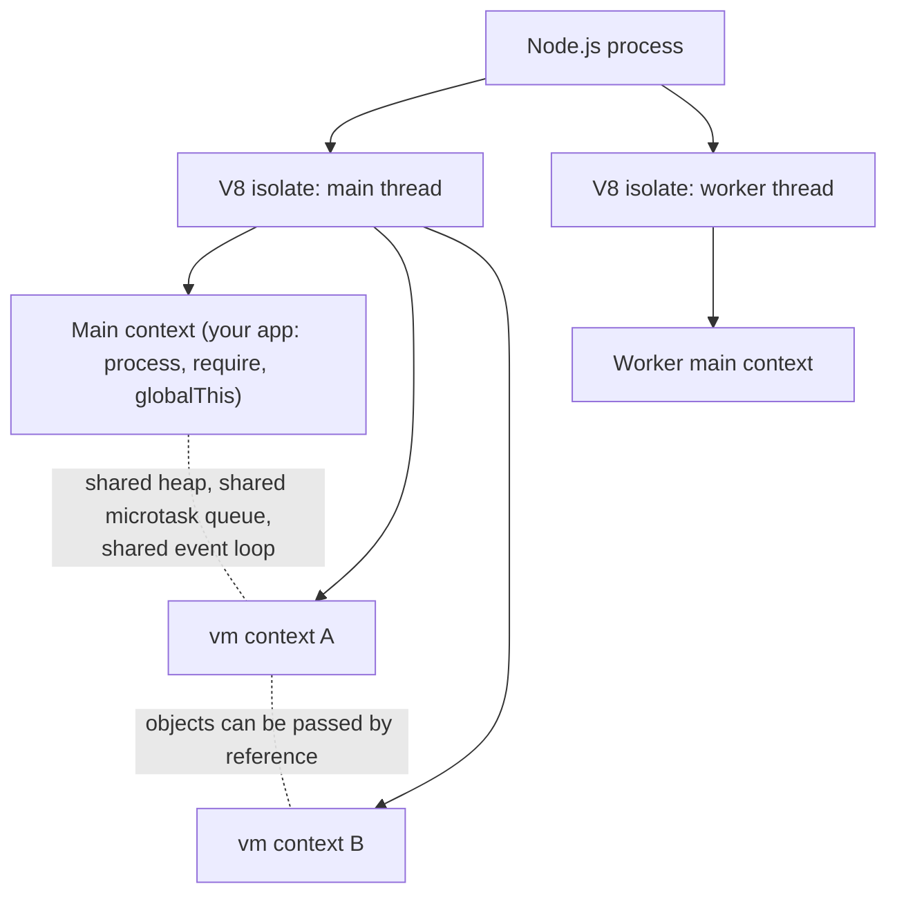

# Chapter 52 — The `vm` Module and Code Isolation

## What you will learn

- Why `node:vm` is not a security boundary, demonstrated with three escapes you can run yourself.
- How V8 isolates, contexts, and realms relate, and what "contextifying" an object actually does.
- `runInThisContext` vs `runInNewContext` vs `runInContext`, and when each is the right call.
- Compiling once and running many times with `vm.Script`, including `cachedData` code caching.
- Why `timeout` cannot interrupt asynchronous code, and what `microtaskMode: 'afterEvaluate'` buys you.
- The experimental `SourceTextModule` / `SyntheticModule` ESM API and its current shape.
- A decision table for actually running untrusted code: processes, workers, containers, microVMs.

## Why this matters

You are building a reporting product. Customers write small expressions — `revenue > 1000 && region === 'EU'` — that decide which rows appear in their dashboards. You need to evaluate those expressions server-side, thousands of times a second, without them stomping on your process. `node:vm` looks purpose-built for this: `vm.runInNewContext(expr, { revenue, region })` and you are done.

It is not purpose-built for this. The Node.js documentation opens the `vm` page with a red warning: the module "is not a security mechanism. Do not use it to run untrusted code." That sentence is not lawyerly hedging. There are escapes that fit in a tweet, and by the end of the first section of this chapter you will have run two of them. If the expressions come from your own team, `vm` is a fine tool and this chapter will teach you to use it well. If they come from the internet, you need a process boundary or better, and this chapter will show you which one.

The `node:vm` module itself is **Stability 2 - Stable**. Its ESM sub-API (`vm.Module` and friends) is **[Experimental]** and gated behind a flag. Keep those two facts separate in your head; people conflate them constantly.

## `vm` is not a security sandbox

The core problem is simple to state. A V8 *context* gives the guest code a fresh set of globals — its own `Object`, its own `Array`, its own `Function`. But the moment the guest can reach **any object that was created in your realm**, it can walk that object's prototype chain up to your `Function` constructor, and `Function` compiles arbitrary code *in the realm where it was defined*. That gives it `process`, and `process` gives it everything.

Every escape below is a variation on that one idea.

### Escape 1: the contextified global itself leaks

You do not need to pass anything in. An empty contextified sandbox is already porous, because the object you hand to `createContext()` was created in *your* realm and is used to wrap the new context's global.

```mjs
// escape-1.mjs — run with: node escape-1.mjs
import { createContext, runInContext } from 'node:vm';

const sandbox = createContext({});

const stolen = runInContext(
  'this.constructor.constructor("return process.version")()',
  sandbox,
);

console.log('guest read:', stolen); // e.g. 'v27.0.0-pre'
```

Read the payload right to left. `this` at the top level of the script is the context's global proxy. `this.constructor` walks to the `Object` constructor — and because the global was built by wrapping a host object, that constructor is the *host's* `Object`. `.constructor` again gets the host `Function`. Calling it compiles `return process.version` in the host realm. Ten seconds of work, full read access to your process.

From there `process.mainModule.require('node:fs')` or `process.binding` is one step away. Try replacing `process.version` with `process.env` and watch your secrets come out.

### Escape 2: any host object you pass in is a door

Suppose you use `vm.constants.DONT_CONTEXTIFY` (covered later) so that escape 1 is closed. You still need to give the guest *something* to work with — a logger, a helper, a data object. Anything you pass across the boundary is a host object.

```mjs
// escape-2.mjs
import { createContext, runInContext, constants } from 'node:vm';

const sandbox = createContext(constants.DONT_CONTEXTIFY);
sandbox.log = (...args) => console.log('[guest]', ...args);

console.log(runInContext(
  'log.constructor("return process.env.HOME")()',
  sandbox,
));
```

`log` is a function created in the host realm, so `log.constructor` is the host `Function`. Same escape, one property access deep. A plain data object works identically via `data.constructor.constructor`.

This is the escape that kills every "just don't pass anything dangerous in" strategy. The danger is not what you pass, it is *that* you pass.

### The mitigation that looks like it works and does not

`createContext()` accepts `codeGeneration: { strings: false }`, which makes `eval` and the `Function` constructor throw an `EvalError`. It reads like the fix for escapes 1 and 2. It is not:

```mjs
// codegen-off.mjs
import { createContext, runInContext, constants } from 'node:vm';

const sandbox = createContext(constants.DONT_CONTEXTIFY, {
  codeGeneration: { strings: false, wasm: false },
});
sandbox.log = console.log;

// Still prints the host version. codeGeneration governs the *guest* realm;
// `log.constructor` is the *host* Function, and the host allows codegen.
console.log(runInContext('log.constructor("return process.version")()', sandbox));
```

`codeGeneration` is a property of the context you created. The stolen `Function` constructor belongs to the main context, which has code generation enabled because your own application needs it. The flag never applies.

### Escape 3: timers and async slip past `timeout`

The `timeout` option terminates *synchronous* execution. Microtasks and macrotasks scheduled by the guest run later, on a stack that the timeout no longer governs:

```mjs
// escape-3.mjs
import { runInNewContext } from 'node:vm';

runInNewContext(
  'Promise.resolve().then(() => { while (true); });',
  {},
  { timeout: 20 },
);

console.log('runInNewContext returned normally');
// ...and then the process hangs forever in the guest's loop.
```

`runInNewContext` returns cleanly — the synchronous part finished in microseconds — and then the promise job runs an infinite loop that nothing can interrupt. Your event loop is dead. No error is thrown, no `SIGTERM` handler fires, health checks time out.

The same applies to anything that queues work on a shared queue. The docs are explicit: if `setTimeout`, `setImmediate`, `queueMicrotask`, or `process.nextTick` are made available inside a `vm.Context`, the callbacks passed to them go on *global* queues shared by all contexts, and are not controllable through `timeout`.

### Summary of what does and does not hold

| Defence | Blocks escape 1 | Blocks escape 2 | Blocks CPU exhaustion | Blocks memory exhaustion |
|---|---|---|---|---|
| Plain `createContext({})` | no | no | no | no |
| `vm.constants.DONT_CONTEXTIFY` | yes | no | no | no |
| `codeGeneration: { strings: false }` | no | no | no | no |
| `timeout` (sync code only) | no | no | partly | no |
| `microtaskMode: 'afterEvaluate'` + `timeout` | no | no | mostly | no |
| Passing zero host objects in | yes | yes | no | no |
| Separate process | yes | yes | yes | yes |

The bottom two rows are the honest answer, and the last one is the only complete one.

## What `vm` *is* good for

Drop the word "sandbox" and `vm` becomes a genuinely useful tool. Its real job is **controlled evaluation of code you already trust**, with a clean global and good stack traces. Legitimate uses:

- **Template engines.** Compile a template to a function body once, run it per request with the render context as parameters. `vm.compileFunction()` is built for exactly this.
- **Plugin and extension evaluation in a trusted context.** Your own first-party plugins, loaded from disk, where you want each one to see a curated set of globals rather than the real one.
- **REPLs and notebooks.** `node:repl` itself is built on `vm`. A persistent context is exactly the semantics a REPL needs: variables defined by one statement are visible to the next.
- **Test harnesses and mocking.** Run a module body with substituted globals to test behaviour that is otherwise hard to reach.
- **Configuration DSLs.** A `config.js` that is executed with a restricted global to produce a plain object, giving you conditionals and loops that JSON cannot express.
- **Snapshot/warm-up work.** Compile a large script once, cache the bytecode with `createCachedData()`, and skip parse cost on every subsequent boot.

Every one of these has the same property: the code's author is you or someone you would already let commit to your repository.

## Isolates, contexts, and realms

Three words that get used interchangeably and should not be.



An **isolate** is an independent instance of the V8 engine: its own heap, its own garbage collector, its own stack. Two isolates cannot share object references at all. In Node, each thread — the main thread and every `Worker` — gets its own isolate.

A **context** (in spec terms, a **realm**) is a set of intrinsics inside an isolate: one `globalThis`, one `Object.prototype`, one `Array`, one `Function`. Multiple contexts live inside one isolate and **share the heap**. That sharing is precisely why `vm` cannot isolate for security: object references cross context boundaries freely, and once a reference crosses, so does its prototype chain.

`vm.createContext()` creates a context. `new Worker()` creates an isolate. That difference is the whole chapter in one line.

## The three ways to run code

| API | Where the code runs | Sees your globals? | Sees your local scope? | Typical use |
|---|---|---|---|---|
| `vm.runInThisContext(code)` | Current context | Yes | No | Loading trusted code with a filename for stack traces |
| `vm.runInNewContext(code, obj)` | A brand-new context each call | No | No | One-shot evaluation with a fresh global |
| `vm.runInContext(code, ctx)` | An existing contextified object | No | No | REPLs, plugins with persistent state |

`vm.runInThisContext()` is closest to **indirect** `eval` — `(0, eval)('code')`. It shares your globals but not your lexical scope:

```mjs
// this-context.mjs
import { runInThisContext } from 'node:vm';

let local = 'untouched';
globalThis.shared = 'before';

runInThisContext('shared = "after"; typeof local;');

console.log(globalThis.shared);           // 'after'
console.log(local);                        // 'untouched'
console.log(runInThisContext('typeof local')); // 'undefined'
```

A direct `eval('local = "x"')` *would* reach `local`. `runInThisContext` cannot, which is what makes it usable for loading module bodies without leaking the loader's variables.

`vm.runInNewContext()` builds and throws away a context per call. Contexts are not free — creating one allocates a fresh set of intrinsics — so in a hot loop prefer `createContext()` once plus `runInContext()` many times. Both accept the same options as `runInThisContext()`, plus `contextName`, `contextOrigin`, `contextCodeGeneration`, and `microtaskMode`.

## `vm.createContext()` and contextification

```mjs
import { createContext, runInContext, isContext } from 'node:vm';

const context = createContext({ x: 2 });

runInContext('x += 40; var y = 17;', context);

console.log(context.x, context.y); // 42 17
console.log(isContext(context));   // true
```

What happened: `createContext()` took your ordinary object and used it to **wrap the global object** of a new V8 context. Inside, every property of that object reads as a global variable, and every global assignment writes back through to the object. That two-way mirror is the whole point — it is how you get results out.

The mirror has quirks. The docs call them out, and they matter:

- `globalThis` inside the context is **not reference-equal** to the object you passed. `runInContext('globalThis', ctx) === ctx` is `false`.
- The contextified global **cannot be frozen**. `Object.freeze(globalThis)` throws a `TypeError` inside such a context.
- As escape 1 showed, its prototype chain leads back to your realm.

### `vm.constants.DONT_CONTEXTIFY`

Available since **v22.8.0** (backported to v20.18.0). Pass it as the `contextObject` argument and Node creates a context whose global is an ordinary global object, no wrapping:

```mjs
import { createContext, runInContext, constants } from 'node:vm';

const ctx = createContext(constants.DONT_CONTEXTIFY);

console.log(runInContext('globalThis', ctx) === ctx); // true
console.log(ctx.Array);                                // [Function: Array] (the guest's)

runInContext('Object.freeze(globalThis);', ctx);
try {
  runInContext('bar = 1; bar;', ctx);
} catch (err) {
  console.log(err.constructor.name); // ReferenceError
}
```

The returned value is a proxy-like handle to the guest's real global. It is reference-equal to the guest's `globalThis`, you can read the guest's built-ins off it (`ctx.Array` is the *guest's* `Array`, not yours), you can write to it from outside, and freezing it from outside actually freezes the guest global.

Use `DONT_CONTEXTIFY` by default in new code. It has cleaner semantics, and it closes the "bare context leaks" escape. It does not close anything else.

## `vm.Script`: compile once, run many

Constructing a `vm.Script` compiles the source but does not run it. The compiled script is not bound to any global; binding happens per run.

```mjs
// script-reuse.mjs
import { createContext, Script } from 'node:vm';

const script = new Script('count += 1; name = `kitty-${count}`;', {
  filename: 'rules/counter.vm.js',
  lineOffset: 0,
  columnOffset: 0,
});

const ctx = createContext({ count: 0 });
for (let i = 0; i < 10; i++) script.runInContext(ctx);

console.log(ctx.count, ctx.name); // 10 'kitty-10'
```

### Compilation options

| Option | Type | Default | Notes |
|---|---|---|---|
| `filename` | string | `'evalmachine.<anonymous>'` | Shown in stack traces. Also the resolution base for dynamic `import()`. |
| `lineOffset` | number | `0` | Shifts reported line numbers — use when the source is embedded in a larger file. |
| `columnOffset` | number | `0` | Shifts the first line's column numbers. |
| `cachedData` | Buffer/TypedArray/DataView | — | V8 code cache from a previous compile. Sets `script.cachedDataRejected`. |
| `produceCachedData` | boolean | `false` | **[Deprecated]** since v10.6.0 in favour of `script.createCachedData()`. |
| `importModuleDynamically` | Function \| `vm.constants.USE_MAIN_CONTEXT_DEFAULT_LOADER` | — | **[Experimental]**. Controls `import()` inside the script. |

`displayErrors`, `timeout`, and `breakOnSigint` are *run*-time options, passed to `runInContext` / `runInNewContext` / `runInThisContext`, not to the constructor. The one-shot top-level functions (`vm.runInThisContext()` etc.) accept both sets at once, which is why the two get confused.

`script.sourceMapURL` (since v19.1.0 / v18.13.0) exposes the URL from a `//# sourceMappingURL=` comment in the compiled source, if present.

### Code caching with `createCachedData()`

V8 can serialise the result of compilation and reuse it later, skipping the parse and compile step. This is the same mechanism behind the module compile cache covered in [Chapter 53](53-module-hooks.md), exposed manually.

```mjs
// cache-build.mjs — build step
import { writeFileSync, readFileSync } from 'node:fs';
import { Script } from 'node:vm';

const source = readFileSync('rules/big-ruleset.js', 'utf8');
const script = new Script(source, { filename: 'rules/big-ruleset.js' });

// Running first means lazily-compiled inner functions are compiled too,
// so they land in the cache instead of being recompiled at runtime.
script.runInNewContext({ warmup: true });

writeFileSync('rules/big-ruleset.cache', script.createCachedData());
```

```mjs
// cache-use.mjs — startup path
import { readFileSync } from 'node:fs';
import { Script } from 'node:vm';

const source = readFileSync('rules/big-ruleset.js', 'utf8');
const cachedData = readFileSync('rules/big-ruleset.cache');

const script = new Script(source, {
  filename: 'rules/big-ruleset.js',
  cachedData,
});

if (script.cachedDataRejected) {
  console.warn('code cache rejected — recompiled from source');
}
```

Three rules that save you a day of debugging:

1. **The source must match exactly.** One changed byte and V8 rejects the cache. Check `script.cachedDataRejected` — rejection is silent otherwise, and you get a working script with none of the speedup.
2. **The cache is tied to the V8 version.** A Node upgrade invalidates every cache file you shipped. Key your cache filenames by `process.versions.v8` or regenerate on deploy.
3. **Warm before you cache.** Functions V8 marked lazy are not in the cache until they have been called once. The docs make this point explicitly, and it is the difference between a small win and a large one.

Code cache contains no observable JavaScript state, so it is safe to write next to the source and reuse across processes.

## Timeouts, SIGINT, and the microtask queue

```mjs
import { runInNewContext } from 'node:vm';

try {
  runInNewContext('while (true);', {}, { timeout: 50 });
} catch (err) {
  console.log(err.code); // ERR_SCRIPT_EXECUTION_TIMEOUT
}
```

That works, because the loop is synchronous. Escape 3 showed that a promise job defeats it. The partial fix is `microtaskMode: 'afterEvaluate'`, passed to `createContext()` or to `runInNewContext()`:

```mjs
import { runInNewContext } from 'node:vm';

try {
  runInNewContext(
    'Promise.resolve().then(() => { while (true); });',
    {},
    { timeout: 50, microtaskMode: 'afterEvaluate' },
  );
} catch (err) {
  console.log('interrupted:', err.code);
}
```

In this mode the context gets **its own microtask queue**, drained immediately after the script finishes, inside the `timeout` and `breakOnSigint` scope. The infinite loop now runs while the timer is still armed, and gets killed.

Note the option only exists for code running in a `vm.Context` — `vm.runInThisContext()` does not take it, since it uses your context's queue.

### The `afterEvaluate` trap: promises that never settle

The private microtask queue creates a subtle deadlock. Awaiting a promise **created inside** an `afterEvaluate` context enqueues a job on the *inner* queue, which only drains when you next call into that context. If you just `await`, nothing drains it:

```mjs
import { createContext, runInContext } from 'node:vm';

const ctx = createContext({}, { microtaskMode: 'afterEvaluate' });
const innerPromise = runInContext('Promise.resolve(1)', ctx);

// Pump the inner queue on the next turn, otherwise the await below hangs forever.
setImmediate(() => { runInContext('', ctx); });

console.log(await innerPromise); // 1
```

Without that `setImmediate`, the `await` never resumes and the process exits silently with the rest of your function unrun. The documentation notes that in this mode `node:vm` deliberately departs from the specification's job-enqueuing order. If you find yourself needing this pump, that is a strong signal the workload belongs in a worker thread instead.

`breakOnSigint: true` makes <kbd>Ctrl</kbd>+<kbd>C</kbd> terminate the running script and throw. Your own `process.on('SIGINT')` handlers are suspended for the duration and restored afterwards. It is genuinely useful in REPLs. Both `timeout` and `breakOnSigint` spin up an extra event loop and thread internally, so they carry measurable overhead — do not switch them on for a script that runs in a microsecond.

## `vm.compileFunction()`

Where `vm.Script` gives you a script, `vm.compileFunction()` gives you a **function with named parameters**. For template engines and rule evaluators this is the better primitive: parameters beat globals, because parameters do not persist and do not need a context.

```mjs
// compile-function.mjs
import { compileFunction } from 'node:vm';

const render = compileFunction(
  'return `Hello ${name}, you have ${count} messages`;',
  ['name', 'count'],
  { filename: 'templates/greeting.tmpl' },
);

console.log(render('Ada', 3)); // Hello Ada, you have 3 messages
```

Options: `filename` (default `''`, note the different default from `vm.Script`), `lineOffset`, `columnOffset`, `cachedData`, `produceCachedData`, `parsingContext` (a contextified object to compile into), `contextExtensions` (an array of objects wrapping the current scope, default `[]`), and `importModuleDynamically`. Since v19.6.0 / v18.15.0 the returned function carries `cachedDataRejected` semantics matching `vm.Script` when `cachedData` was supplied.

`contextExtensions` deserves a mention: each object in the array becomes a `with`-like scope around the compiled body. It is how you inject a bag of helpers without making them parameters. It is also another set of host objects handed to the guest — see escape 2.

## Dynamic `import()` inside vm code

By default, compiled code *can contain* `import()`, but calling it rejects with `ERR_VM_DYNAMIC_IMPORT_CALLBACK_MISSING`. The `importModuleDynamically` option changes that, and it is supported on `new vm.Script`, `vm.compileFunction()`, `new vm.SourceTextModule`, `vm.runInThisContext()`, `vm.runInContext()`, `vm.runInNewContext()`, and `vm.createContext()`. The whole option is **[Experimental]** and the docs recommend against production use.

Two forms:

**`vm.constants.USE_MAIN_CONTEXT_DEFAULT_LOADER`** — **[Experimental]** (Stability 1.1 - Active development), added in v21.7.0 / v20.12.0. Node uses the main context's default ESM loader:

```mjs
import { Script, constants } from 'node:vm';

const script = new Script(
  'import("node:fs").then(({ readFile }) => readFile instanceof Function)',
  { importModuleDynamically: constants.USE_MAIN_CONTEXT_DEFAULT_LOADER },
);

script.runInNewContext().then(console.log); // false
```

`false`, not `true` — and that is the lesson. The module was loaded in the *main* context, so `readFile` is an instance of the main context's `Function`, not the new context's. Cross-realm `instanceof` fails. Any code doing duck-typing across the boundary will misbehave in ways that look like ghosts.

Caveats the docs spell out: resolution is relative to the `filename` option (absolute path or URL string; otherwise the process CWD), and results are cached per resolved path with no way to bypass the cache for non-URL filenames. This constant is not supported for `vm.SourceTextModule`.

**A function** — you implement resolution yourself, returning a `vm.Module`. This requires launching Node with `--experimental-vm-modules`; without the flag the callback is ignored and `import()` rejects with `ERR_VM_DYNAMIC_IMPORT_CALLBACK_MISSING_FLAG`.

## `vm.measureMemory()`

**[Experimental]**, added v13.10.0. Measures memory known to V8 across the contexts in the current isolate.

```mjs
import { createContext, measureMemory } from 'node:vm';

const ctx = createContext({ payload: new Array(1e5).fill('x') });

const result = await measureMemory({ mode: 'detailed', execution: 'eager' });
console.log(ctx.payload.length); // keep ctx alive until measurement completes
console.log(result.total, result.current, result.other);
```

- `mode`: `'summary'` (default, main context only) or `'detailed'` (all contexts in the isolate).
- `execution`: `'default'` (waits for the next scheduled GC — possibly never, if the program exits first) or `'eager'` (starts a GC immediately).

Rejects with `ERR_CONTEXT_NOT_INITIALIZED` on failure. **The result shape is V8-specific and may change between V8 versions** — never parse it into a stable metric. It differs from `v8.getHeapSpaceStatistics()`: that reports per-heap-space occupancy, this reports per-context reachability. Hold a live reference to a context until its measurement resolves, or it may be collected first.

## The ESM API: `vm.Module`, `SourceTextModule`, `SyntheticModule`

**[Experimental]**, and only available with `--experimental-vm-modules`. The three-stage lifecycle is: construct/parse → link → evaluate.

This API has been reshaped recently, and if you find a tutorial from 2023 it will teach you the old shape. Verified against the current docs:

| API | Status |
|---|---|
| `sourceTextModule.moduleRequests` | Current. Added v24.4.0 / v22.20.0. Array of `ModuleRequest` (`{ specifier, attributes, phase }`). |
| `sourceTextModule.linkRequests(modules)` | Current. Added v24.8.0 / v22.21.0. |
| `sourceTextModule.instantiate()` | Current. Added v24.8.0 / v22.21.0. |
| `sourceTextModule.dependencySpecifiers` | **[Deprecated]** since v24.4.0 / v22.20.0 — use `moduleRequests`. |
| `module.link(linker)` | Still documented; the async recursive linker. The `linkRequests` + `instantiate` pair is the newer, batched path. |
| `sourceTextModule.hasTopLevelAwait()` / `hasAsyncGraph()` | Added v24.9.0. |

A minimal synthetic module, wrapping non-JavaScript data as an ESM namespace:

```mjs
// synthetic.mjs — run with: node --experimental-vm-modules synthetic.mjs
import { SyntheticModule } from 'node:vm';

const raw = '{ "region": "eu-west-1", "replicas": 3 }';

const mod = new SyntheticModule(['default', 'region'], function () {
  const parsed = JSON.parse(raw);
  this.setExport('default', parsed);
  this.setExport('region', parsed.region);
});

await mod.evaluate();
console.log(mod.namespace.region);        // 'eu-west-1'
console.log(mod.namespace.default.replicas); // 3
```

Since v24.8.0 / v22.21.0 you no longer need to call `link()` before `setExport()`. Note also that `SyntheticModule`'s `evaluateCallback` runs **synchronously** inside `evaluate()` and its return value is discarded — making it an `async function` silently loses any rejection.

`module.status` moves through `'unlinked'` → `'linking'` → `'linked'` → `'evaluating'` → `'evaluated'`, or lands on `'errored'`, in which case `module.error` holds the thrown value. Reading `module.error` in any other state throws.

The `initializeImportMeta` option on `SourceTextModule` carries a real hazard the docs highlight: objects you assign to `import.meta` are created in *your* realm, so `Object.getPrototypeOf(import.meta.prop)` reaches your `Object.prototype`. If you need an object over there, build it over there with `vm.runInContext('({})', ctx)`.

This API is genuinely low-level, has no connection to the real ESM loader, and is experimental. If your goal is customising how modules load, [Chapter 53](53-module-hooks.md) has the supported tool.

## Actually running untrusted code

Here are the real options, in increasing order of isolation.

| Approach | Isolation boundary | Stops CPU DoS | Stops memory DoS | Stops FS/net access | Cost per run | Ships with Node |
|---|---|---|---|---|---|---|
| `node:vm` | Realm (none, really) | no | no | no | ~µs | yes |
| `worker_threads` + `resourceLimits` | V8 isolate | via `worker.terminate()` | yes | no | ~10s of ms | yes |
| Child process + Permission Model | OS process | yes (`kill`) | yes (`--max-old-space-size`) | yes (`--allow-fs-read` etc.) | ~50–100 ms | yes |
| Container (Docker + seccomp, non-root) | Kernel namespaces | yes (cgroups) | yes (cgroups) | yes | ~100s of ms | no |
| gVisor / Firecracker microVM | Syscall interception / hardware virt | yes | yes | yes | ~100 ms–s | no |
| `isolated-vm` (npm) | V8 isolate, no shared heap | yes (per-isolate timeout) | yes (per-isolate memory limit) | no (by default) | ~ms | no |

Notes on each of the serious ones:

**Worker threads** get their own V8 isolate, so heap-level escapes are gone and `resourceLimits` — `maxOldGenerationSizeMb`, `maxYoungGenerationSizeMb`, `codeRangeSizeMb`, `stackSizeMb` — actually bound memory. A runaway worker can be killed with `worker.terminate()`, which the main thread can call while the worker spins. What you do *not* get: the worker shares your process, so it can still `require('node:fs')` and read your disk unless you also strip that away. See [Chapter 29 — Worker Threads](../part4-system/29-worker-threads.md).

**Separate process plus the Permission Model** is the first genuinely defensible line, and it is all in-box. Spawn the evaluator with `--permission` and grant nothing you do not need:

```bash
node --permission \
     --allow-fs-read=/srv/app/rules \
     --max-old-space-size=128 \
     evaluator.mjs
```

No `--allow-net`, no `--allow-child-process`, no `--allow-worker`, no `--allow-addons`, no `--allow-ffi`. Guest CPU burn costs you one process you can `SIGKILL`. Guest memory burn hits the V8 heap cap. Read [Chapter 31 — The Permission Model](../part4-system/31-permission-model.md) first, especially the part where it says it is not a defence against malicious code — which is why this row says *process*, not *permission model*, and why containers sit below it.

**Containers and microVMs** are the answer when the code is genuinely hostile. A non-root container with a seccomp profile, read-only root filesystem, dropped capabilities, and cgroup CPU/memory limits is the industry-standard floor. gVisor interposes on syscalls in userspace; Firecracker gives each workload a real VM with ~125 ms boot. Both are what the serverless platforms you use actually run.

**`isolated-vm`** is a third-party npm package (not part of Node) that exposes V8's isolate API directly: each script gets its own isolate with its own heap, a hard memory limit, and a real timeout. It is a substantially stronger boundary than `node:vm` because there is no shared heap to leak references through. It is still in-process, so a V8 zero-day is game over. Treat it as a good second layer *inside* a process boundary, never as the only layer.

**Decision rule.** Author is on your team → `vm` is fine. Author is a paying customer with a contract → worker or child process with the permission model. Author is an anonymous internet user → container or microVM, and put a `vm`/`isolated-vm` layer inside it if you like defence in depth.

## Common mistakes

### ❌ Treating `vm` as a security boundary because the API says "sandbox"

The word "sandbox" appears in a thousand blog posts about this module and in none of the current documentation. People write this:

```js
// Vulnerable. Any user expression can read process.env.
const result = vm.runInNewContext(userExpression, { row });
```

The `{ row }` object is enough. `row.constructor.constructor('return process.env')()` and your database password is in the response body.

✅ Put a process boundary underneath, and treat `vm` as ergonomics rather than security:

```mjs
// evaluator.mjs — spawned with:
//   node --permission --max-old-space-size=128 evaluator.mjs
import { runInNewContext, constants } from 'node:vm';

process.on('message', ({ id, expression, row }) => {
  try {
    const ctx = { row: structuredClone(row) };
    const value = runInNewContext(`(${expression})`, ctx, {
      timeout: 50,
      microtaskMode: 'afterEvaluate',
    });
    process.send({ id, value });
  } catch (err) {
    process.send({ id, error: err.message });
  }
});
```

### ❌ Relying on `timeout` to bound guest CPU

```js
// Returns immediately, then hangs the process forever.
vm.runInNewContext('setTimeout(() => { while(1); }, 0)', { setTimeout }, { timeout: 100 });
```

The callback goes on the *global* timer queue. `timeout` has already stopped applying.

✅ Do not hand shared schedulers into the context, use `microtaskMode: 'afterEvaluate'` for promise jobs, and make the enclosing supervisor able to kill the whole thing:

```js
const child = fork('evaluator.mjs');
const killer = setTimeout(() => child.kill('SIGKILL'), 1000);
child.once('message', () => clearTimeout(killer));
```

### ❌ Shipping `cachedData` without checking `cachedDataRejected`

```js
const script = new vm.Script(source, { cachedData });
// Works perfectly... and silently recompiled from scratch on every boot.
```

A version bump, a build-time minifier tweak, or a stray trailing newline invalidates the cache. Nothing throws. You keep the deploy complexity and lose the benefit.

✅ Assert it, and key the artifact by V8 version:

```js
const cacheFile = `build/ruleset.${process.versions.v8}.cache`;
const script = new vm.Script(source, { filename: 'ruleset.js', cachedData });

if (script.cachedDataRejected) {
  metrics.increment('vm.code_cache.rejected');
  if (process.env.NODE_ENV !== 'production') {
    throw new Error(`stale code cache: regenerate ${cacheFile}`);
  }
}
```

### ❌ Creating a fresh context for every evaluation in a hot path

```js
for (const row of tenMillionRows) {
  results.push(vm.runInNewContext(expr, { row })); // compiles + builds a context each time
}
```

Two costs stacked: recompiling the source and allocating a full set of intrinsics, ten million times.

✅ Compile once, and prefer a function with parameters over a context with globals:

```js
const evaluate = vm.compileFunction(`return (${expr});`, ['row'], {
  filename: 'filters/user-expression.js',
});

for (const row of tenMillionRows) results.push(evaluate(row));
```

## Production notes

- **Contexts are not free, and they are not cheap to collect.** Each one carries a full set of intrinsics. A service that creates a context per request will show steadily climbing RSS and long GC pauses well before it shows a leak in a heap snapshot. Pool contexts, or use `compileFunction` and skip them.
- **`timeout` and `breakOnSigint` start an extra event loop and thread.** The docs state this outright. For scripts that complete in microseconds the option costs more than the work. Measure before enabling them per-call; consider enabling them only for scripts above a size threshold.
- **Stack traces are only as good as your `filename`.** The default is `evalmachine.<anonymous>`, which tells an on-call engineer nothing at 3 a.m. Always set `filename` to something that maps to a real artifact — a template path, a plugin id, a rule name — and use `lineOffset`/`columnOffset` when the source was extracted from a larger file so the reported line numbers match the original.
- **Code caching pays off at scale, not at small sizes.** The win is proportional to parse+compile cost. For a few kilobytes of rules it is noise; for a multi-megabyte bundle loaded on every cold start it is worth real money. Warm the script before calling `createCachedData()`, or lazily-compiled functions stay out of the cache.
- **Cross-realm `instanceof` is always false.** Objects created in one context fail `instanceof` checks against another context's constructors — including built-ins loaded via `USE_MAIN_CONTEXT_DEFAULT_LOADER`. Validate with `Array.isArray`, `typeof`, and duck-typing on shape, not on constructor identity, at any boundary that crosses contexts.
- **Guest memory is your memory.** Contexts share the isolate's heap, so a guest allocating a 2 GB string OOMs your whole process. `--max-old-space-size` on a dedicated child process is the only in-box control; there is no per-context memory limit.
- **`vm.measureMemory()` output is not a stable contract.** Use it for local investigation. Do not build a dashboard on the shape of the returned object, and do not alert on `jsMemoryEstimate` across Node upgrades.
- **The permission model interacts with all of this.** If you use worker threads to isolate evaluation while running under `--permission`, you need `--allow-worker`. Plan the grant list alongside the isolation design, not after.

## Exercises

1. **Reproduce the escapes.** Write a script that creates a context with `createContext({})` and prints `process.version` from inside it. Then switch to `vm.constants.DONT_CONTEXTIFY` and confirm the escape fails. Then add a single host function to the context and make it succeed again. *Success criterion:* three runs, with output showing blocked/leaked/leaked, and a one-paragraph explanation of why `DONT_CONTEXTIFY` helps in the first case and not the third.

2. **Build a template compiler.** Use `vm.compileFunction()` to turn `Hello {{name}}, you have {{count}} messages` into a function of `(name, count)`. Handle a missing variable by rendering an empty string rather than throwing. *Success criterion:* the compiled function is created once and called 100,000 times in under 100 ms, and stack traces from a failing template show your template's filename.

3. **Measure code caching.** Generate a JavaScript file of at least 2 MB of function declarations. Time `new vm.Script(source)` with no cache, with a cache produced *before* running the script, and with a cache produced *after* running it. *Success criterion:* a table of three timings plus the `cachedDataRejected` value for each, and an explanation of why the post-run cache is larger.

4. **Defeat and then contain a runaway.** Write a guest script that escapes `timeout` using a promise. Confirm it hangs. Then contain it two ways: with `microtaskMode: 'afterEvaluate'`, and by moving evaluation into a `child_process.fork()` with a supervisor that `SIGKILL`s after 500 ms. *Success criterion:* both containments recover, and you can state one workload for which only the process approach is sufficient.

5. **A synthetic module bridge.** With `--experimental-vm-modules`, write a `SyntheticModule` that exposes a YAML-ish config file as ESM named exports, then import it from a `SourceTextModule` using `moduleRequests` + `linkRequests()` + `instantiate()` + `evaluate()`. *Success criterion:* the importing module reads a named export, and your linking code uses no deprecated API (`dependencySpecifiers` must not appear).

## Recap

- `node:vm` is **Stability 2 - Stable** and explicitly **not a security mechanism**. Contexts share a V8 heap, so any host object reference the guest can reach leads back through `constructor.constructor` to your realm.
- `codeGeneration: { strings: false }` does not stop that escape, because the stolen `Function` constructor belongs to your context, not the guest's.
- `vm.constants.DONT_CONTEXTIFY` gives an ordinary, freezable global that is reference-equal to the guest's `globalThis`. Prefer it in new code; it fixes ergonomics and one escape, not the class of escapes.
- `runInThisContext` shares your globals but not your scope; `runInNewContext` builds a throwaway context; `runInContext` reuses one. Building contexts is expensive — pool them or use `compileFunction`.
- `vm.Script` + `createCachedData()` skips parse/compile on later runs. Warm the script first, check `cachedDataRejected`, and key artifacts by V8 version.
- `timeout` bounds only synchronous execution. `microtaskMode: 'afterEvaluate'` extends it over promise jobs, at the cost of a private microtask queue that can strand cross-context promises.
- The `vm.Module` / `SourceTextModule` / `SyntheticModule` API is **[Experimental]**, needs `--experimental-vm-modules`, and now centres on `moduleRequests` + `linkRequests()` + `instantiate()`; `dependencySpecifiers` is **[Deprecated]**.
- For genuinely untrusted code: a separate process with the permission model is the in-box floor; containers or microVMs are the real answer; `isolated-vm` is a useful extra layer, never the only one.

## Where to go next

- [Chapter 53 — Module Customization Hooks and Loaders](53-module-hooks.md) — the supported way to change how modules load, including the compile cache that generalises `cachedData`.
- [Chapter 29 — Worker Threads](../part4-system/29-worker-threads.md) — real isolates and `resourceLimits`.
- [Chapter 28 — Child Processes](../part4-system/28-child-processes.md) — spawning and supervising the evaluator process.
- [Chapter 31 — The Permission Model](../part4-system/31-permission-model.md) — what `--permission` does and does not promise.
- [Chapter 44 — Securing Node.js Applications](../part6-security/44-securing-applications.md) — the wider threat model this chapter sits inside.
- Official documentation: <https://nodejs.org/docs/latest/api/vm.html>
