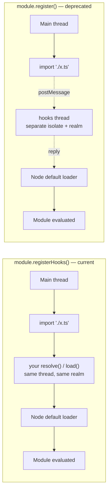

# Chapter 53 — Module Customization Hooks and Loaders

## What you will learn

- Which hooks API is current in Node 27 — and why the one every tutorial shows you is now deprecated.
- Writing `resolve` and `load` hooks with `module.registerHooks()`, including chaining and `shortCircuit`.
- The off-thread `module.register()` model, its `initialize` hook, and the caveats that killed it.
- Building real things: TypeScript transpilation, import maps, virtual modules, mocking, instrumentation.
- The module compile cache — a genuine startup win — with measured guidance on when it pays.
- The rest of `node:module`: `createRequire`, `isBuiltin`, `findPackageJSON`, `stripTypeScriptTypes`, `SourceMap`.
- How to debug hooks when a module silently loads the wrong thing.

## Why this matters

Every non-trivial Node codebase eventually needs to bend module loading. You want `.ts` files to run without a build step. You want `import 'config'` to resolve differently in tests. You want to count how long each module takes to load in production, or replace a package with a stub without touching a single import statement. You want a `db:schema` specifier that isn't a file at all.

For years the answer was monkey-patching `require.extensions` or `Module._resolveFilename` — undocumented internals that broke on every minor release and never worked for ESM at all. `node:module` replaced that with a real, supported extension point: two hook functions, `resolve` and `load`, that sit in a chain in front of Node's own loader and work for CommonJS, ESM, JSON, and WebAssembly alike.

The catch is that this API has moved a lot, and the version of it in most blog posts, most Stack Overflow answers, and most model training data is the wrong one. This chapter is written against Node 27 and states, for every API, exactly where it sits on the stability ladder today.

## Where the API stands right now

Read this table before you write a line of hook code.

| API / flag | Added | Stability in Node 27 | Verdict |
|---|---|---|---|
| `module.registerHooks(options)` | v23.5.0 / v22.15.0 | **1.2 - Release candidate** | **Use this.** Synchronous, in-thread, works for all module types. |
| `module.register(specifier, ...)` | v20.6.0 / v18.19.0 | **0 - Deprecated (DEP0205)** | Runtime deprecation as of v26.0.0. Migrate off it. |
| `--experimental-loader=module` | v8.8.0 | Discouraged | The docs say it "may be removed in a future version". |
| `--import=module` | v19.0.0 / v18.18.0 | **1 - Experimental** | The current way to preload the file that registers hooks. |
| `--require, -r` | ancient | Stable | Also fine for preloading, and it runs *before* `--import`. |

That second row is the headline. `module.register()` — the API introduced with great fanfare in Node 20, the one that "replaced `--experimental-loader`" — is now **[Deprecated]** under **DEP0205**, documentation-only from v25.9.0 / v24.15.0 and a **runtime deprecation** from v26.0.0. The stated reason is blunt: supporting async hooks "has proven to be complex, involving worker threads orchestration, and there are issues that have proven unresolvable." It will be removed in a future version.

So the arc is: `require.extensions` → `--experimental-loader` → `module.register()` → **`module.registerHooks()`**. If a tutorial tells you to write a `loader.mjs` that exports `async function resolve`, it is two generations behind.

The asynchronous hook system is still documented (Stability **1.1 - Active development** for the hook shapes themselves), and you will meet it in existing codebases, so this chapter covers it. But new code should use `registerHooks()`.

## Two execution models



Synchronous hooks run **on the thread and in the realm where the module is being loaded**. That means your hook can share state with the modules it customizes through ordinary variables. It also means a slow hook blocks module loading — which is exactly what module loading already does, so it costs nothing conceptually.

Asynchronous hooks run on a **dedicated loader thread**, a separate V8 isolate with its own realm. That was the original design goal: keep the loader off the hot path. In practice it means your hooks cannot touch application globals, every resolution round-trips between threads, and CommonJS interop develops a long list of exceptions. The docs list them under "Caveats of asynchronous customization hooks", and they are the reason for the deprecation.

One consequence worth internalising: because sync hooks share a realm with the loaded modules, a hook can hand a value directly to a module via a global or a shared object. With async hooks you need a `MessagePort` and `Atomics`.

## Registering synchronous hooks

```mjs
// register-hooks.mjs
import { registerHooks } from 'node:module';

registerHooks({
  resolve(specifier, context, nextResolve) {
    return nextResolve(specifier, context);
  },
  load(url, context, nextLoad) {
    return nextLoad(url, context);
  },
});
```

Both properties are optional (each defaults to `undefined`); register only what you need.

There are three ways to make this run before your application:

**With `--import` or `--require`** (recommended — it also covers the entry point and, via `process.execArgv` inheritance, worker threads):

```bash
node --import ./register-hooks.mjs ./my-app.js
node --require ./register-hooks.cjs ./my-app.js
```

The specifier can point at a package export, which is how tools ship hooks:

```bash
node --import my-instrumentation/register ./my-app.js
```

**Programmatically from the entry point** — with one trap that catches everyone:

```mjs
// entry.mjs
import { registerHooks } from 'node:module';

registerHooks({ /* ... */ });

// ❌ import './my-app.mjs';   <- evaluated BEFORE registerHooks() runs
await import('./my-app.mjs'); // ✅ dynamic import, after registration
```

Static `import` declarations are hoisted and their modules evaluated before any statement in the importing module. Put a static import of your app next to `registerHooks()` and the hooks are registered *after* the app has already loaded. Use dynamic `import()` (or `require()`) instead.

**With a `data:` URL**, for the case where you cannot add a file:

```bash
node --import 'data:text/javascript,import {registerHooks} from "node:module"; registerHooks({/* ... */});' ./my-app.js
```

### Deregistering

`registerHooks()` returns an object with `deregister()` and `[Symbol.dispose]` (the same function). This is unique to synchronous hooks — `module.register()` has no equivalent.

```mjs
import { registerHooks } from 'node:module';

const hooks = registerHooks({
  resolve(specifier, context, nextResolve) {
    console.log('[hook] resolve', specifier);
    return nextResolve(specifier, context);
  },
});

await import('./widget-a.mjs'); // logs
hooks.deregister();
await import('./widget-b.mjs'); // silent
```

Because `[Symbol.dispose]` is present, `using hooks = registerHooks({...})` scopes them to a block where explicit resource management is available. This makes per-test hook installation clean; without `deregister()`, hooks live for the process lifetime.

## The `resolve` hook

`resolve(specifier, context, nextResolve)` turns a specifier — whatever appeared in `import` or `require()` — into a URL.

**`context`:**

| Property | Type | Meaning |
|---|---|---|
| `conditions` | `string[]` | Export conditions in play for this resolution |
| `importAttributes` | `Object` | The `with { ... }` attributes, if any |
| `parentURL` | `string \| undefined` | The importing module; `undefined` for the entry point |

**Return value:**

| Property | Type | Meaning |
|---|---|---|
| `url` | `string` | Required. The absolute URL this resolves to. |
| `format` | `string \| null \| undefined` | A *hint* to `load` — `'commonjs'`, `'module'`, or anything else like `'yaml'` |
| `importAttributes` | `Object \| undefined` | Attributes to cache the module under; input is used if omitted |
| `shortCircuit` | `boolean` | Required if you do not call `nextResolve()`. Default `false`. |

Two rules the documentation is emphatic about:

1. **If `resolve` returns a `format`, a custom `load` hook is required** — even if it only forwards to the default. The `load` chain is ultimately responsible for the final format.
2. **When you pass `context` down to `nextResolve`, the `conditions` array must include every element it arrived with.** Add to it; never filter it. Dropping conditions silently changes package `exports` resolution.

A small import-map implementation:

```mjs
// import-map-hooks.mjs
import { readFileSync } from 'node:fs';
import { registerHooks } from 'node:module';

const { imports } = JSON.parse(readFileSync('import-map.json', 'utf8'));

registerHooks({
  resolve(specifier, context, nextResolve) {
    if (Object.hasOwn(imports, specifier)) {
      return nextResolve(imports[specifier], context);
    }
    return nextResolve(specifier, context);
  },
});
```

Note the shape: rather than computing a URL ourselves, we rewrite the specifier and let the default resolver do the real work. That keeps `exports` maps, `node_modules` walking, and extension resolution intact. Reach for a hand-built `url` + `shortCircuit: true` only when the target genuinely is not on disk.

## The `load` hook

`load(url, context, nextLoad)` turns a URL into source code and a format.

**`context`:** `conditions`, `format` (the hint from `resolve`, may be anything or nullish), `importAttributes`.

**Return value:** `source` (`string | ArrayBuffer | TypedArray`), `format` (required, one of the table below), `shortCircuit`.

### Accepted final formats

| `format` | Loads as | `source` types |
|---|---|---|
| `'module'` | ES module | string, ArrayBuffer, TypedArray |
| `'commonjs'` | CommonJS module | string, ArrayBuffer, TypedArray, null, undefined |
| `'module-typescript'` | ES module with TypeScript syntax | string, ArrayBuffer, TypedArray |
| `'commonjs-typescript'` | CommonJS with TypeScript syntax | string, ArrayBuffer, TypedArray, null, undefined |
| `'json'` | JSON file | string, ArrayBuffer, TypedArray |
| `'wasm'` | WebAssembly module | ArrayBuffer, TypedArray |
| `'addon'` | Node.js addon | null |
| `'builtin'` | Node.js builtin | null |

The `ArrayBuffer` accepted is specifically a `SharedArrayBuffer`; the `TypedArray` is a `Uint8Array`. Non-string sources for text formats are decoded with `TextDecoder`. `source` is ignored for `'builtin'` — you cannot replace a core module through this hook.

### Transpiling TypeScript

```mjs
// ts-hooks.mjs
import { readFileSync } from 'node:fs';
import { fileURLToPath } from 'node:url';
import { registerHooks, stripTypeScriptTypes } from 'node:module';

registerHooks({
  load(url, context, nextLoad) {
    if (!url.endsWith('.tsx')) return nextLoad(url, context);

    const source = readFileSync(fileURLToPath(url), 'utf8');
    return {
      format: 'module',
      source: stripTypeScriptTypes(source, { mode: 'strip', sourceUrl: url }),
      shortCircuit: true,
    };
  },
});
```

```bash
node --import ./ts-hooks.mjs ./app.mjs
```

That is a complete, working `.tsx` loader in fifteen lines. Swap `stripTypeScriptTypes` for `esbuild.transformSync` or `sucrase` when you need real transformation rather than type erasure.

### Virtual modules

A `resolve` + `load` pair can invent modules that have no file behind them at all:

```mjs
// virtual-config-hooks.mjs
import { registerHooks } from 'node:module';

const VIRTUAL = 'app:config';

registerHooks({
  resolve(specifier, context, nextResolve) {
    if (specifier === VIRTUAL) return { url: VIRTUAL, shortCircuit: true };
    return nextResolve(specifier, context);
  },
  load(url, context, nextLoad) {
    if (url !== VIRTUAL) return nextLoad(url, context);
    const config = { region: process.env.AWS_REGION ?? 'local', replicas: 3 };
    return {
      format: 'module',
      source: `export default ${JSON.stringify(config)};\n` +
              `export const region = ${JSON.stringify(config.region)};`,
      shortCircuit: true,
    };
  },
});
```

```mjs
// app.mjs
import { region } from 'app:config';
console.log(region);
```

Note that `url` here is not a `file:` URL, and that is fine — the loader treats it as an opaque cache key. Use a scheme you own (`app:`, `virtual:`) so you never collide with a real specifier.

### Instrumentation

Because the hook sees every load, it is the cheapest possible place to measure module graph cost:

```mjs
// timing-hooks.mjs
import { registerHooks } from 'node:module';

const timings = [];

registerHooks({
  load(url, context, nextLoad) {
    const start = process.hrtime.bigint();
    try {
      return nextLoad(url, context);
    } finally {
      timings.push({ url, ms: Number(process.hrtime.bigint() - start) / 1e6 });
    }
  },
});

process.on('exit', () => {
  timings.sort((a, b) => b.ms - a.ms);
  for (const { url, ms } of timings.slice(0, 10)) {
    console.error(`${ms.toFixed(1)}ms  ${url}`);
  }
});
```

The `finally` matters: a hook that throws must still leave the chain consistent, and you want the timing even for modules that fail to load.

## Chaining

Hooks form a chain, and the chain always terminates in Node's own hook. `registerHooks()` can be called any number of times, and the chain runs **last-in, first-out**:

```mjs
registerHooks(hook1);
registerHooks(hook2);
// Execution order: hook2.resolve → hook1.resolve → Node default resolve
```

Two error conditions exist deliberately, to catch broken chains:

- Returning an object that lacks a required property throws.
- Returning **without** calling `next<hookName>()` and **without** `shortCircuit: true` throws — you get `ERR_INVALID_RETURN_PROPERTY_VALUE` naming `shortCircuit`. This is the single most common first-time hook error, and the message tells you exactly what to add.

If synchronous and asynchronous hooks are both registered, **all synchronous hooks run first**; the last synchronous hook's `next` is what invokes the asynchronous chain.

## The deprecated asynchronous system

You will still meet `module.register()` in the wild. Here is what it does and why it is going away.

```mjs
// entry.mjs
import { register } from 'node:module';

register('./hooks.mjs', import.meta.url);
await import('./my-app.mjs');
```

```mjs
// hooks.mjs — runs on the hooks thread
export async function initialize(data) { /* receives register()'s `data` */ }
export async function resolve(specifier, context, nextResolve) { /* ... */ }
export async function load(url, context, nextLoad) { /* ... */ }
```

The signatures mirror the synchronous ones; the difference is that `nextResolve`/`nextLoad` return promises and the hooks may be `async`.

### `initialize()` and talking to the hooks thread

Because the hooks thread is a separate realm, the only channel is structured-cloneable data plus transferables:

```mjs
import { register } from 'node:module';
import { MessageChannel } from 'node:worker_threads';

const { port1, port2 } = new MessageChannel();
port1.on('message', (msg) => console.log('from hooks:', msg));
port1.unref();

register('./my-hooks.mjs', {
  parentURL: import.meta.url,
  data: { buildId: process.env.BUILD_ID, port: port2 },
  transferList: [port2],
});
```

The `data` object lands in `initialize(data)` on the hooks thread. `port1.unref()` keeps the channel from holding the process open.

### The caveats that ended it

Straight from the documentation, condensed:

- Hooks run in a different realm, so they cannot mutate the globals of the modules they customize.
- They do **not** affect all `require()` calls: `require` functions built with `module.createRequire()` are never affected, and if the async `load` hook does not override `source` for a CommonJS module, that module's own `require()` calls bypass the hooks too.
- The `resolve` hook invoked for `require()` inside a customized CommonJS module **does not receive the original specifier** — it gets an already-resolved URL.
- Inside customized CommonJS modules, `require.resolve()` and `require()` use the `"import"` export condition rather than `"require"`, which breaks dual packages in surprising ways.
- Async `load` and namespaced exports from CommonJS are **incompatible** — you get an empty object from the import.
- Node may load a CommonJS module's source **more than once** to preserve monkey-patching compatibility; if the source changed between loads, behaviour is undefined. A side effect: your *synchronous* hooks may be invoked multiple times for `require()` calls in a module that async hooks customized.
- The async default `load` returns `source: null` for `'commonjs'` for backward compatibility, so a passthrough hook that wants the source must read it itself.

None of these apply to `registerHooks()`. That list is the migration argument.

### Migrating

The transformation is nearly mechanical: move the hook bodies from a separate module into a `registerHooks({ ... })` call, delete the `async` keywords, delete `await` before `nextResolve`/`nextLoad`, and replace `initialize(data)` with ordinary module scope (you are in the same realm now, so you can just read `process.env` or import config directly). Keep launching with `--import`.

## What you can build

| Goal | Hooks used | Notes |
|---|---|---|
| TypeScript / JSX at runtime | `load` | `stripTypeScriptTypes` for erasure; a real transpiler for `enum`, decorators, JSX |
| Import maps / aliases | `resolve` | Rewrite the specifier, let the default resolver finish |
| Mocking in tests | `resolve` + `load` | Return stub source for a matched specifier; `deregister()` between tests |
| Instrumentation | `load` | Time or count loads; emit to `diagnostics_channel` |
| Virtual modules | `resolve` + `load` | Custom scheme, source generated at load time |
| Custom protocols (`https:`, `s3:`) | `load` | Real network I/O; slow, uncached — development only |
| Coverage / AST rewriting | `load` | Instrument source before Node sees it |
| Enforcing policy | `resolve` | Throw on specifiers that violate an allowlist |

For the network case the docs are candid about the downsides: "performance is much slower than loading files from disk, there is no caching, and there is no security." Same for transpilation: "This is less performant than transpiling source files before running Node.js; transpiler hooks should only be used for development and testing purposes." Build steps still win in production.

## The module compile cache

This is the part of `node:module` most likely to make your service measurably faster, and it has nothing to do with hooks.

Every time Node starts, V8 parses and compiles every module in your graph from scratch. The compile cache persists V8's compiled output to disk and reuses it on the next run.

### Turning it on

Two ways, and the environment variable is usually the right one:

```bash
NODE_COMPILE_CACHE=/var/cache/myapp-v8 node server.js
```

```mjs
// Must run before the modules you want cached are loaded.
import { enableCompileCache, getCompileCacheDir } from 'node:module';

const result = enableCompileCache();
console.log(result.status, result.directory ?? result.message);
console.log(getCompileCacheDir());
```

`enableCompileCache([options])` takes a string (treated as `directory`) or an object:

| Option | Type | Default |
|---|---|---|
| `directory` | string | `NODE_COMPILE_CACHE` if set, else `path.join(os.tmpdir(), 'node-compile-cache')` |
| `portable` | boolean | `NODE_COMPILE_CACHE_PORTABLE=1` if set, else `false` |

It returns `{ status, message?, directory? }` and **never throws** — the design assumption is that a compile cache failure must never break the application.

| `module.constants.compileCacheStatus` | Meaning |
|---|---|
| `ENABLED` | Enabled now; `directory` is set |
| `ALREADY_ENABLED` | A previous call or `NODE_COMPILE_CACHE` already enabled it; `directory` is set |
| `FAILED` | Could not enable (permissions, filesystem error); `message` explains |
| `DISABLED` | `NODE_DISABLE_COMPILE_CACHE=1` is set |

The docs recommend calling it **without** `directory` so that operators can point it wherever they want with `NODE_COMPILE_CACHE`. That advice is right: bake the call into your code, leave the location to deployment.

`getCompileCacheDir()` returns the actual directory in use (a version-keyed subdirectory of the one you gave) or `undefined` if the cache is off.

`flushCompileCache()` forces accumulated cache to disk immediately. By default the write happens as the process exits — so a process that is about to spawn children which should share the cache, or a long-lived server that might be `SIGKILL`ed, should flush explicitly. Like `enableCompileCache()`, it fails silently by design.

### What it actually buys you

The win is proportional to parse-and-compile cost, so it scales with the size of your module graph and nothing else. On a synthetic 4.8 MB / 300-module ESM graph, cold start dropped from roughly 320 ms to roughly 230 ms — call it 25–30% — and the cache directory came to about 6 MB, slightly larger than the source it was built from.

Guidance that generalises from that:

- **Under ~1 MB of application code: not worth the operational surface.** The saving is inside startup noise.
- **A large dependency graph, or a CLI users invoke constantly: clearly worth it.** This is the flagship case.
- **Serverless / autoscaling with frequent cold starts: worth it if and only if the cache directory survives.** A fresh container that rebuilds the cache on every invocation pays the write cost and gets none of the read benefit. Bake a populated cache into the image, or mount persistent storage.
- **Budget disk roughly equal to your source size**, and put it under `os.tmpdir()` unless you have a reason not to. Stale entries are never pruned; deleting the directory is the supported cleanup, and it is recreated on next use.

### Portability, versions, and coverage

By default the cache keys on **absolute module paths**, so moving your project directory invalidates everything. Portable mode relaxes that:

```mjs
import { enableCompileCache } from 'node:module';

enableCompileCache({ directory: '/var/cache/myapp', portable: true });
```

or `NODE_COMPILE_CACHE_PORTABLE=1`. Then the cache survives relocation as long as the module layout *relative to the cache directory* is unchanged. It is best-effort: modules whose position relative to the cache cannot be computed simply are not cached. This is what makes "build the cache in CI, ship it in the image" viable.

Three limitations to plan around:

1. **Cache from one Node version cannot be reused by another.** Different versions store separately under the same base directory and coexist, so an upgrade degrades to a cold start rather than breaking, but you should still regenerate.
2. **V8 code coverage becomes less precise** for functions deserialized from the cache. Set `NODE_DISABLE_COMPILE_CACHE=1` in your coverage job.
3. **The on-disk layout is an implementation detail.** Do not parse it, do not diff it, do not check it into git as a source of truth.

`NODE_DISABLE_COMPILE_CACHE=1` (**[Experimental]**, Stability 1.1) is the kill switch, and it wins over everything else.

## The rest of `node:module`

### `createRequire(filename)`

Builds a working `require` bound to a location. Indispensable in ESM when you need CommonJS-only resolution semantics:

```mjs
import { createRequire } from 'node:module';

const require = createRequire(import.meta.url);
const pkg = require('./package.json');
const legacy = require('some-cjs-only-package');
```

`filename` must be an absolute path, a `file:` URL string, or a `URL`. One important interaction: `require` functions created this way are **never** affected by asynchronous hooks. Synchronous hooks do affect them.

### `builtinModules` and `isBuiltin(name)`

```mjs
import { builtinModules, isBuiltin } from 'node:module';

console.log(builtinModules.length);   // every module Node provides
console.log(isBuiltin('node:fs'));    // true
console.log(isBuiltin('fs'));         // true
console.log(isBuiltin('wss'));        // false
```

Since **v23.5.0**, `builtinModules` also includes prefix-only modules (those with no unprefixed alias, like `node:test` and `node:sqlite`). If you have code that assumes the list is bare names, that change will bite. Prefer `isBuiltin()` for membership tests — it handles both spellings.

### `syncBuiltinESMExports()`

Pushes changes you made to a builtin's CommonJS `exports` object into the corresponding ESM live bindings.

```cjs
const fs = require('node:fs');
const { syncBuiltinESMExports } = require('node:module');

fs.readFile = myInstrumentedReadFile;
syncBuiltinESMExports();
// import('node:fs') now sees myInstrumentedReadFile
```

It updates existing bindings only: it will not add a name you invented, and it will not remove a name you deleted. This exists for APM agents that monkey-patch core. It is not a design pattern for application code.

### `findPackageJSON(specifier[, base])`

**[Experimental]** — Stability **1.1 - Active development**, added v23.2.0 / v22.14.0. Returns the path of the relevant `package.json`, or `undefined`.

```mjs
import { findPackageJSON } from 'node:module';

findPackageJSON('..', import.meta.url);              // nearest parent package.json
findPackageJSON('some-package', import.meta.url);    // that package's root package.json
```

For CommonJS, `base` should be `__filename` — **not** `__dirname`. Two caveats the docs state directly: do not use it to determine module format (`type` is the least definitive input; file extension supersedes it and a loader hook supersedes that), and it currently uses only the built-in resolver, so registered `resolve` hooks do not affect it.

There is **no `module.getPackageType()` API**. The name appears in the documentation only as a helper function *inside example code* that hook authors are expected to write themselves. If something told you to call it, it was hallucinating.

### `stripTypeScriptTypes(code[, options])`

**[Experimental]** — Stability **1.2 - Release candidate**, added v23.2.0 / v22.13.0.

```mjs
import { stripTypeScriptTypes } from 'node:module';

console.log(stripTypeScriptTypes('const a: number = 1;'));
// const a         = 1;
```

Types are replaced with whitespace, which is why column positions survive without a source map. Options are `mode` (only `'strip'` is accepted) and `sourceUrl` (appends a `//# sourceURL=` comment). **The `transform` and `sourceMap` options were removed in v26.0.0** — code written against them will break on upgrade.

It throws on TypeScript features that require real transformation, `enum` being the canonical example. The output is explicitly **not stable across Node versions**, so do not cache or diff it. See [Chapter 7 — TypeScript in Node.js](../part1-foundations/07-typescript.md) for the fuller picture.

### Source maps

**[Experimental]**. Node implements the TC39 ECMA-426 source map format. Parsing is enabled by `--enable-source-maps`, by `NODE_V8_COVERAGE=dir`, or programmatically:

```mjs
import { setSourceMapsSupport, getSourceMapsSupport, findSourceMap } from 'node:module';

setSourceMapsSupport(true, { nodeModules: false, generatedCode: false });
console.log(getSourceMapsSupport()); // { enabled, nodeModules, generatedCode }
```

`setSourceMapsSupport()` and `getSourceMapsSupport()` arrived in v23.7.0 / v22.14.0. Both extra options default to `false`: maps inside `node_modules` and maps for code from `eval`/`new Function` are opt-in, because both are expensive. Crucially, **only files loaded after support is enabled get their maps parsed** — which is why the flag is preferred over the API call.

`findSourceMap(path)` returns a `module.SourceMap` for a resolved path, or `undefined`. The class gives you:

- `sourceMap.payload` — the raw map. **Frozen** (as of a recent change) and returned by reference; do not mutate it.
- `sourceMap.findEntry(lineOffset, columnOffset)` — **zero-indexed** offsets in, raw range out (`generatedLine`, `generatedColumn`, `originalSource`, `originalLine`, `originalColumn`, `name`).
- `sourceMap.findOrigin(lineNumber, columnNumber)` — **1-indexed** in, 1-indexed out (`fileName`, `lineNumber`, `columnNumber`, `name`), matching what you read off an `Error` stack.

That index difference is the entire bug surface of this API. Error stacks and CallSite objects are 1-indexed; use `findOrigin`. Reach for `findEntry` only when you already hold zero-indexed offsets.

```mjs
import { findSourceMap } from 'node:module';

const map = findSourceMap('/srv/app/dist/server.js');
if (map) {
  // From a stack frame reading "server.js:412:19"
  console.log(map.findOrigin(412, 19));
  // { name: 'handleRequest', fileName: '.../src/server.ts', lineNumber: 288, columnNumber: 3 }
}
```

## Ordering, `require(esm)`, and interaction

Loading order in a Node 27 process:

1. `--require` preloads (CommonJS), in flag order.
2. `--import` preloads (ESM), in flag order — after all `--require`.
3. The entry point.

So `--require ./sync-hooks.cjs --import ./more-hooks.mjs app.js` registers the CJS hooks first, meaning they end up *deeper* in the LIFO chain and run *last*.

`require(esm)` — loading an ES module with `require()` — is **no longer experimental** as of v25.4.0 / v24.15.0 and has been unflagged since v23.0.0 / v22.12.0. It works when the target module has no top-level `await` and is unambiguously ESM. This matters here for one reason: a module loaded through `require(esm)` still traverses your synchronous hooks, because those hooks sit in front of every module type. The old mental model where "loader hooks only apply to `import`" is obsolete. Use `--trace-require-module=all` (or `no-node-modules`) to see where `require(esm)` is happening in your graph.

Synchronous hooks are **not** inherited into child worker threads by default. If you register them from a file preloaded with `--import` or `--require`, workers inherit the preload through `process.execArgv` and therefore end up with the hooks. Asynchronous hooks *are* inherited by default. Registering async hooks under the permission model requires `--allow-worker`, since the hooks thread is a worker.

## Debugging hook problems

Hooks fail quietly and confusingly, because a wrong answer still produces a working module — just the wrong one. A checklist that resolves most cases:

1. **`ERR_INVALID_RETURN_PROPERTY_VALUE` mentioning `shortCircuit`** — you returned an object without calling `next*()`. Add `shortCircuit: true`.
2. **The hook never fires.** Almost always the static-import trap, or the hook was registered after the module was already in the cache. Add a `console.error` at the top of the hook. If nothing prints, registration is too late.
3. **The hook fires but the module is unchanged.** You forgot `shortCircuit` and also called `nextLoad()`, so the default result overwrote yours. Return your object, do not fall through.
4. **`ERR_UNKNOWN_FILE_EXTENSION`.** Your `load` returned no `format`, or `resolve` returned a URL Node cannot classify. The default `nextLoad` requires `context.format` when the URL has no explicit type information.
5. **`exports` resolution changed unexpectedly.** You passed a `conditions` array to `nextResolve` that dropped entries. Always spread: `{ ...context, conditions: [...context.conditions, 'mine'] }`.
6. **`NODE_DEBUG=module`** prints Node's own module-loading debug output — useful for seeing what the default resolver did with the specifier you handed it.
7. **Stack traces point at generated code.** Set `sourceUrl` when transpiling and run with `--enable-source-maps`.
8. **It works for `import` but not `require`.** You are on the deprecated async hooks. This is the CommonJS caveat list, not a bug. Migrate to `registerHooks()`.

## Common mistakes

### ❌ Registering hooks next to a static import of the app

```mjs
import { registerHooks } from 'node:module';
import './app.mjs';        // evaluated BEFORE the line below runs

registerHooks({ load: myLoader });
```

ESM evaluates all static dependencies before any statement of the importing module. `app.mjs` and its whole graph are loaded before `registerHooks()` is reached. The hook is registered, does nothing, and you spend an afternoon on it.

✅ Preload the registration, or use dynamic import:

```bash
node --import ./register-hooks.mjs ./app.mjs
```

```mjs
import { registerHooks } from 'node:module';
registerHooks({ load: myLoader });
await import('./app.mjs');
```

### ❌ Writing new hooks against `module.register()`

```mjs
// hooks.mjs — deprecated architecture
export async function load(url, context, nextLoad) { /* ... */ }
```
```mjs
import { register } from 'node:module';
register('./hooks.mjs', import.meta.url);
```

This is **[Deprecated]** under **DEP0205** and emits a runtime deprecation warning from v26.0.0. You also inherit every CommonJS caveat: `createRequire` bypasses it, `require.resolve()` switches to the `"import"` condition, namespaced CJS exports come back empty.

✅ Same logic, current API, fewer caveats:

```mjs
// register-hooks.mjs
import { registerHooks } from 'node:module';

registerHooks({
  load(url, context, nextLoad) { /* same body, no async */ },
});
```

### ❌ Narrowing `context.conditions` on the way down

```mjs
resolve(specifier, context, nextResolve) {
  // Silently changes how every package's "exports" map resolves.
  return nextResolve(specifier, { ...context, conditions: ['node', 'import'] });
}
```

The docs require that the array you pass to the default resolver contain *all* the elements it originally received. Drop `development`, or a custom condition your framework set, and packages start resolving to different files with no error anywhere.

✅ Only ever add:

```mjs
resolve(specifier, context, nextResolve) {
  return nextResolve(specifier, {
    ...context,
    conditions: [...context.conditions, 'my-framework'],
  });
}
```

### ❌ Enabling the compile cache after the graph is loaded

```mjs
import express from 'express';        // 400 modules already compiled
import { enableCompileCache } from 'node:module';

enableCompileCache();                  // caches almost nothing
```

The cache only applies to modules compiled *after* it is enabled. Called from the middle of your entry point, it misses the dependency graph — which is the entire cost you were trying to avoid.

✅ Use the environment variable, or preload:

```bash
NODE_COMPILE_CACHE=/var/cache/myapp node server.js
```

```bash
node --import 'data:text/javascript,import {enableCompileCache} from "node:module"; enableCompileCache();' server.js
```

### ❌ Treating hooks as a security boundary

A `resolve` hook that rejects specifiers outside an allowlist looks like a sandbox. It is not: any module already loaded can call `createRequire()`, and `process.binding`-style access does not go through the loader at all. Hooks control *resolution*, not *capability*. For capability control use the permission model or a process boundary — see [Chapter 52](52-vm-sandboxing.md) and [Chapter 31](../part4-system/31-permission-model.md).

## Production notes

- **Hooks run on the critical path of every module load.** A synchronous `load` hook that does a network round trip or a synchronous 50 ms transpile multiplies by your module count. Cache aggressively inside the hook, keyed by URL plus file mtime, and prefer a build step in production.
- **Ship compile cache with your image, do not build it at runtime.** In a container that starts and dies, a cold cache costs you the write and gives you nothing. Populate the directory during the image build with `portable: true` (or `NODE_COMPILE_CACHE_PORTABLE=1`) so the paths still match, and mark it read-only if you can.
- **Regenerate the compile cache on every Node upgrade.** Caches from different versions coexist rather than colliding, so you will not break — you will silently lose the benefit while paying full disk cost for two generations of cache.
- **Disable the compile cache in coverage runs.** `NODE_DISABLE_COMPILE_CACHE=1` in the test job. Functions deserialized from cache report less precise coverage, which shows up as inexplicable line-count drift between local and CI.
- **Hooks and workers need explicit thought.** Synchronous hooks do not propagate to workers unless registration is in an `--import`/`--require` preload; asynchronous hooks do propagate and need `--allow-worker` under `--permission`. Decide which you want before someone debugs a worker that behaves differently from the main thread.
- **Instrument your own hooks.** Emit to `diagnostics_channel` (see [Chapter 48](../part7-diagnostics/48-diagnostics-channel-tracing.md)) rather than `console.log`. If you are on the deprecated async hooks, remember the docs' warning: the hooks thread may be terminated at any time, so asynchronous logging from it can be lost.
- **Pin your migration off `module.register()` to a date.** It is a runtime deprecation now and will be removed. Anything in your dependency tree that calls it — instrumentation agents are the usual suspects — will start warning loudly and later break. Audit with `NODE_OPTIONS=--throw-deprecation` in CI.
- **Never mutate `sourceMap.payload`.** It is frozen and returned by reference; the same object is handed to everyone who asks. Clone before you touch.

## Exercises

1. **A working `.ts` runner.** Write `ts-hooks.mjs` that uses `registerHooks()` plus `stripTypeScriptTypes()` to run `.ts` files directly, launched with `--import`. *Success criterion:* a `.ts` file with type annotations and an interface runs; a file containing an `enum` fails with a clear error you produced, not an unhandled throw.

2. **Import maps with a fallback.** Implement a `resolve` hook that reads `import-map.json` and rewrites matching specifiers, falling through to the default resolver otherwise. *Success criterion:* mapped specifiers load the mapped file, unmapped ones still resolve through `node_modules`, and `context.conditions` is passed down without losing an entry.

3. **Scoped test mocking.** Build a helper that installs hooks stubbing one module, runs a callback, then `deregister()`s. Use it in two `node:test` cases with different stubs. *Success criterion:* each test sees its own stub, and a third test importing the module normally gets the real one.

4. **Measure the compile cache.** Take a real project with at least 200 modules. Time startup with the cache off, cold, and warm, five runs each, reporting medians. Then measure the cache directory size. *Success criterion:* a table of three medians plus the disk cost, and a written recommendation on whether to enable it for that project.

5. **A source-map-aware error reporter.** Enable source map support, then write a handler that catches an error from transpiled code, parses the top stack frame, and uses `findSourceMap()` + `findOrigin()` to print the original file, line, and column. *Success criterion:* the reported location matches the real `.ts` source, and your code uses `findOrigin` (1-indexed) rather than `findEntry`.

## Recap

- `module.registerHooks()` (**1.2 - Release candidate**) is the current customization API: synchronous, in-thread, same realm, works for CommonJS and ESM alike, and deregisterable.
- `module.register()` is **[Deprecated]** under **DEP0205** — runtime deprecation since v26.0.0 — because off-thread hooks brought unresolvable CommonJS caveats. `--experimental-loader` is older still and discouraged.
- `resolve` maps a specifier to a URL; `load` maps a URL to `{ source, format }`. Every hook must either call `next*()` or return `shortCircuit: true`. Chains run LIFO, and synchronous hooks always run before asynchronous ones.
- Never narrow `context.conditions` when calling `nextResolve` — only add to it.
- Register hooks with `--import`/`--require`, or with dynamic `import()` after the call. A static `import` of your app defeats registration entirely.
- The module compile cache (`enableCompileCache`, `getCompileCacheDir`, `flushCompileCache`, `NODE_COMPILE_CACHE`) is a real 20–30% startup win on large graphs. Enable it early, use `portable: true` for relocatable caches, regenerate on Node upgrades, and disable it under coverage.
- `findPackageJSON` is **[Experimental]** (1.1) and must not be used to determine module format. There is no `getPackageType()` API. `stripTypeScriptTypes` lost its `transform` and `sourceMap` options in v26.0.0.
- `SourceMap.findOrigin()` is 1-indexed and matches stack traces; `findEntry()` is 0-indexed. `payload` is frozen — clone before modifying.

## Where to go next

- [Chapter 5 — Modules II: ECMAScript Modules](../part1-foundations/05-modules-esm.md) — resolution rules your hooks are intercepting.
- [Chapter 6 — Packages: `package.json`, exports, imports, dual publishing](../part1-foundations/06-packages-and-exports.md) — what `conditions` actually selects.
- [Chapter 7 — TypeScript in Node.js](../part1-foundations/07-typescript.md) — type stripping, and when to prefer a build step.
- [Chapter 52 — The `vm` Module and Code Isolation](52-vm-sandboxing.md) — `cachedData`, the manual version of the compile cache.
- [Chapter 61 — Performance Tuning](../part9-production/61-performance-tuning.md) — where compile-cache wins sit next to other startup costs.
- [Chapter 63 — Upgrading Node.js: Deprecations and Migration](../part9-production/63-upgrading-node.md) — handling DEP0205 and friends.
- Official documentation: <https://nodejs.org/docs/latest/api/module.html>
