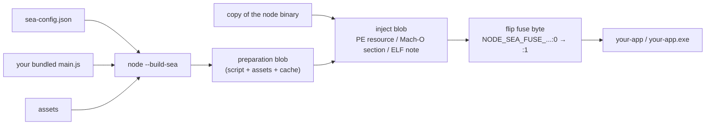

# Chapter 55 — Single Executable Applications and the Virtual File System

## What you will learn

- What a single executable application (SEA) actually is at the byte level, and which distribution problems it solves.
- The whole build pipeline: `sea-config.json`, `node --build-sea`, and the older `--experimental-sea-config` + postject route, including the per-platform signing steps.
- The `node:sea` runtime API, and how to embed and read assets.
- Why `require()` and `import` behave differently inside an SEA, and how to work with that instead of against it.
- What startup snapshots and V8 code cache buy you, and the constraints each imposes.
- The `node:vfs` module — what it is, what it is not, and how it relates to packaging.

## Why this matters

Ship a Node CLI and the first line of your install instructions is "install Node.js 22 or later." That sentence loses you users. It also means the code your user runs depends on a runtime you do not control: their Node might be v18 with a different `fetch`, or a v20 with a corporate patch, or missing entirely on a locked-down build agent.

A single executable application collapses runtime, entry point, and assets into one file the user can download and run. `curl`, `chmod +x`, done. For internal tooling that has to work on every laptop in a company, for CI helpers that must not depend on the agent image, and for anything you would otherwise distribute through Homebrew, apt, Chocolatey, and npm simultaneously, that is a substantial simplification.

It is also a feature with sharp edges: an unbundled dependency graph will not load, a native addon needs a workaround, and the resulting binary is around 100 MB. Knowing those before you commit is the difference between a two-hour job and a two-week one.

## Stability

> Single executable applications are at **Stability 1.1 — Active development**. The `--build-sea` flag carries the same marker; `--experimental-sea-config` is **Stability 1 — Experimental**.

"Active development" means the shape of the feature is settled enough to build on but the process is explicitly documented as subject to change. In practice the changes have been additive: `--build-sea` (v25.5.0) folded blob generation and injection into one step, and `mainFormat`, `execArgv`, and `execArgvExtension` extended the config. Pin your Node version in CI and re-read the release notes when you upgrade.

The `node:sea` runtime module needs no flag.

## What an SEA is

Node ships as a single self-contained binary. An SEA takes that binary, appends a **preparation blob** — your entry script, plus optional assets, snapshot, and code cache — into a platform-specific container inside the executable, and flips one byte of a sentinel string so the runtime knows to look for it.



At startup the binary checks the fuse. Set means "a blob is injected"; run the embedded script. Unset means "I am plain `node`"; behave normally. That is the whole mechanism, and understanding it explains every limitation that follows.

| An SEA does solve | An SEA does not solve |
|---|---|
| Shipping a CLI to users with no Node installed | Bundling — you must produce a single JS file yourself |
| Pinning the exact runtime version your code was tested on | Size: expect ~100 MB per binary, per platform |
| Reproducible deploys with no `npm install` at the target | Cross-compiling: build on the target platform, or accept losing snapshot and code cache |
| Removing readable source files from the install directory | Protecting your source. The script sits in the binary and is trivially extractable |
| Removing a dependency on network access at install time | Native addons, which need an explicit workaround |
| Startup latency, if you use a snapshot | Auto-update. You build that yourself |

The fourth row is worth dwelling on. SEAs are frequently described as obfuscation. They are not. `strings` on the binary will show you the script. If your business depends on the code being unreadable, an SEA does not deliver that, and neither does any other JavaScript packager.

## The build pipeline

### Step 1: produce one JavaScript file

Nothing in the SEA machinery bundles for you. The `main` field takes exactly one script, and inside the executable module resolution does not read the filesystem — so any `require()` or `import` of your own modules or your dependencies must have been inlined first.

Use esbuild, rollup, webpack, or `ncc`; the choice does not matter as long as the output is a single file with no unresolved external imports (built-in `node:` modules are fine and remain available). Decide up front whether you are emitting CommonJS or ESM, because that determines `mainFormat`.

### Step 2: write `sea-config.json`

```json
{
  "main": "dist/cli.js",
  "output": "build/mytool",
  "mainFormat": "commonjs",
  "disableExperimentalSEAWarning": true,
  "useCodeCache": true,
  "useSnapshot": false,
  "execArgv": ["--no-warnings"],
  "execArgvExtension": "env",
  "assets": {
    "schema.sql": "sql/schema.sql",
    "banner.txt": "assets/banner.txt"
  }
}
```

Every field the configuration currently reads:

| Field | Type | Default | Meaning |
|---|---|---|---|
| `main` | string | — | Path to the single bundled entry script |
| `output` | string | — | Where to write the executable (or, under `--experimental-sea-config`, the blob) |
| `mainFormat` | `"commonjs"` \| `"module"` | `"commonjs"` | How to interpret the injected main script |
| `executable` | string | current `node` binary | The Node binary to inject into |
| `disableExperimentalSEAWarning` | boolean | `false` | Suppress the experimental-feature warning at startup |
| `useSnapshot` | boolean | `false` | Run `main` at build time and embed a V8 heap snapshot |
| `useCodeCache` | boolean | `false` | Compile `main` at build time and embed the V8 code cache |
| `execArgv` | string[] | — | Node flags applied automatically at launch |
| `execArgvExtension` | `"none"` \| `"env"` \| `"cli"` | `"env"` | How users may add further Node flags |
| `assets` | object | — | Key → path map of files to embed |

Relative paths resolve against the current working directory, not the config file's directory. Run the build from a fixed directory — a `package.json` script is the natural place.

**On Windows the `output` must end in `.exe`.** This is not cosmetic; the extension is required.

### Step 3: build

```bash
node --build-sea sea-config.json
```

That is the modern path (v25.5.0 and later): it generates the preparation blob, copies the Node binary, injects, and flips the fuse in one command. The Node binary running the build must be the same version as the binary the blob is injected into — which `--build-sea` guarantees by default, since it uses the running binary unless you set `executable`.

### Step 4: sign

Signing is not optional on macOS, and the steps differ per platform. Get this wrong and users get an unhelpful "killed" or a SmartScreen block.

| Platform | Required? | Command |
|---|---|---|
| macOS | **Yes** — injecting invalidates the existing signature; unsigned binaries are killed by Gatekeeper | `codesign --sign - mytool` |
| Windows | Optional — an unsigned binary still runs, but triggers SmartScreen warnings | `signtool sign /fd SHA256 mytool.exe` |
| Linux | Not applicable | — |

`codesign --sign -` is an *ad-hoc* signature: it satisfies the kernel's requirement that the binary be signed, but it is not a Developer ID signature and will not pass notarization. For a binary you distribute publicly on macOS you need a real Developer ID certificate and a notarization round trip; the ad-hoc signature is for local and internal use.

On Windows, `signtool` comes from the Windows SDK and needs a certificate present.

```bash
node --build-sea sea-config.json
codesign --sign - build/mytool
./build/mytool --help
```

### The manual pipeline

Before `--build-sea` existed, the blob and the injection were separate steps. The older route is still documented and still useful — for verifying the blob, and for injecting into a binary you cannot execute (cross-platform builds).

**1. Generate the blob.** With `--experimental-sea-config`, `output` names the blob file rather than the executable:

```bash
node --experimental-sea-config sea-config.json
# writes sea-prep.blob (or whatever `output` says)
```

**2. Copy the `node` binary.**

```bash
cp $(command -v node) mytool
```

On Windows, `node -e "require('fs').copyFileSync(process.execPath, 'mytool.exe')"` — and the `.exe` extension is required.

**3. Remove the existing signature** (macOS and Windows only):

```bash
codesign --remove-signature mytool
```

```powershell
signtool remove /s mytool.exe
```

**4. Inject with postject.** The blob goes into a PE resource, a Mach-O section in the `NODE_SEA` segment, or an ELF note — in every case named `NODE_SEA_BLOB`. The injector must also find and flip the fuse string `NODE_SEA_FUSE_fce680ab2cc467b6e072b8b5df1996b2:0`, changing the trailing `0` to `1`.

```bash
npx postject mytool NODE_SEA_BLOB sea-prep.blob \
    --sentinel-fuse NODE_SEA_FUSE_fce680ab2cc467b6e072b8b5df1996b2
```

macOS needs one extra argument:

```bash
npx postject mytool NODE_SEA_BLOB sea-prep.blob \
    --sentinel-fuse NODE_SEA_FUSE_fce680ab2cc467b6e072b8b5df1996b2 \
    --macho-segment-name NODE_SEA
```

**5. Re-sign**, as in step 4 of the modern pipeline.

Note that `require('node:sea')` is a *runtime* API for the injected script. It has no role in building; there is no `node -e "require('node:sea')"` injection step.

## The `node:sea` runtime API

Four functions, all synchronous, available inside the injected main script.

| Function | Returns | Notes |
|---|---|---|
| `sea.isSea()` | `boolean` | Whether this script is running inside an SEA |
| `sea.getAsset(key[, encoding])` | `ArrayBuffer` or `string` | Returns a **copy**. With an encoding, decodes as a string using any encoding `TextDecoder` accepts. Throws if the key is unknown |
| `sea.getAssetAsBlob(key[, options])` | `Blob` | `options.type` sets the MIME type. Throws if the key is unknown |
| `sea.getRawAsset(key)` | `ArrayBuffer` | No copy — a view of the bytes inside the executable. Do not write to it |
| `sea.getAssetKeys()` | `string[]` | All embedded asset keys, or `[]` if none. Throws when not inside an SEA |

`isSea()` is what lets one codebase run both ways:

```cjs
const { isSea, getAsset } = require('node:sea');
const { readFileSync } = require('node:fs');
const path = require('node:path');

function loadSchema() {
  return isSea()
    ? getAsset('schema.sql', 'utf8')
    : readFileSync(path.join(__dirname, '../sql/schema.sql'), 'utf8');
}
```

That pattern — one accessor, two backends — is worth adopting on day one, because it keeps `node dist/cli.js` working for development while the packaged build reads from the blob.

Pick the right getter. `getAsset()` copies, which is what you want for small text you will hold anyway. `getRawAsset()` does not copy, which matters for a 40 MB embedded dataset: the bytes stay in the executable's mapped pages and you pay nothing. The documentation is explicit that you should avoid writing to the buffer `getRawAsset()` returns — if the injected section is not marked writable or is misaligned, a write is likely to crash the process. `getAssetAsBlob()` is the bridge to Web APIs: `Response`, `FormData`, `URL.createObjectURL` in an embedded server.

Assets are read-only content baked in at build time. There is no `setAsset`, no write path, and no way to add one after the build. Anything mutable — configuration, caches, user data — belongs on the real filesystem, keyed off `os.homedir()` or a platform config directory.

## Module loading inside an SEA

This is where most first attempts fail, so be precise about the rules.

**Module resolution does not read the filesystem.** By default, both `require()` and `import` in the injected main script resolve only built-in modules. Requesting anything that would have to be found on disk throws. This is why step 1 of the pipeline is "bundle."

**`require()` is not the usual `require()`.** The injected script's `require` currently has none of the properties of a normal CommonJS `require` except `require.main`. Code that reaches for `require.resolve`, `require.cache`, or `require.extensions` — which some libraries do — will break.

**The path globals point at the executable.** Inside the injected main script:

| Global | Value |
|---|---|
| `__filename`, `module.filename` | `process.execPath` |
| `__dirname` | The directory containing `process.execPath` |
| `import.meta.url` | A `file:` URL for `process.execPath` |
| `import.meta.filename` | `process.execPath` |
| `import.meta.dirname` | The directory containing `process.execPath` |
| `import.meta.main` | `true` |

`import.meta.resolve` is not supported.

The consequence is that `path.join(__dirname, 'templates')` — the standard way to find files shipped beside your code — now points next to the binary, wherever the user dropped it. Every such lookup must become an asset.

**Escaping the sandbox, deliberately.** If your tool genuinely needs to load plugins from the user's disk, build a real `require`:

```js
const { createRequire } = require('node:module');
const userRequire = createRequire(`${process.cwd()}/`);
const plugin = userRequire('./my-plugin.js');
```

The docs show `createRequire(__filename)`, which anchors resolution next to the executable. Anchor it wherever your plugin contract says plugins live — but be aware you are now loading arbitrary code from disk, with all the trust implications that carries.

**ESM.** Set `"mainFormat": "module"` to have the injected script parsed as an ES module. Then `import()` can dynamically load built-in modules; attempting to `import()` something from the filesystem throws. Two constraints go with it: `"module"` cannot currently be combined with `"useSnapshot"`, and `import.meta.resolve` is unavailable.

## Startup snapshots and code cache

Both trade build-time work for startup speed, and both are off by default.

**`useCodeCache: true`** compiles the main script at build time and embeds the V8 code cache. At launch, V8 skips parsing and compiling. This is the cheap, safe win — a straightforward reduction in startup latency with no changes to your code.

Its one hard constraint: **`import()` does not work when `useCodeCache` is `true`.** If your bundle contains any dynamic import — including ones your bundler emitted for lazy chunks — you must leave the code cache off or eliminate them.

**`useSnapshot: true`** goes much further. Your `main` script runs *at build time*, on the build machine, and the resulting V8 heap is serialized into the blob. At launch, Node deserializes that heap instead of executing your script. Anything your module top-level did — parsing config, building lookup tables, compiling regexes, constructing class hierarchies — is already done.

Because the script no longer runs at launch, it must hand Node a function to run instead:

```js
const { setDeserializeMainFunction } = require('node:v8').startupSnapshot;

const TABLE = buildExpensiveLookupTable();   // runs at build time

setDeserializeMainFunction(() => {
  const query = process.argv[2];             // runs at launch
  console.log(TABLE.get(query) ?? 'not found');
});
```

The general constraints of Node startup snapshots apply: no open handles, no sockets, no timers, nothing that captures state which cannot be serialized, and nothing that captures *build-machine* state you did not mean to ship — an environment variable read at the top level is frozen into the snapshot forever.

| | `useCodeCache` | `useSnapshot` |
|---|---|---|
| What is embedded | Compiled bytecode | Serialized V8 heap |
| Main script runs at | Launch | Build |
| Code changes needed | None | Must call `setDeserializeMainFunction()` |
| Blocks `import()` | Yes | — |
| Works with `"mainFormat": "module"` | Yes | No |
| Cross-platform builds | Must be `false` | Must be `false` |

That last row is the one that catches CI pipelines. Code caches and snapshots are only loadable on the platform that produced them, so building a `linux-x64` SEA on a `darwin-arm64` machine with either enabled produces a binary that crashes at startup. Cross-building means turning both off — one more reason to run a build matrix with a real runner per target.

## Limitations you must design around

**One entry point.** The blob holds exactly one script. Multi-command tools dispatch inside that script on `process.argv`.

**Size.** Every SEA is a full Node binary plus your payload — roughly 100 MB. Three platforms is 300 MB per release. Compress for distribution and expect users to notice.

**Native addons need a workaround.** A `.node` file cannot be `require()`d from inside the blob. The supported approach is to embed the addon as an asset, write it to a temporary file at runtime, and load it with `process.dlopen()`:

```js
const fs = require('node:fs');
const os = require('node:os');
const path = require('node:path');
const { getRawAsset } = require('node:sea');

const addonPath = path.join(os.tmpdir(), 'myaddon.node');
fs.writeFileSync(addonPath, new Uint8Array(getRawAsset('myaddon.node')));
const myaddon = { exports: {} };
process.dlopen(myaddon, addonPath);
fs.rmSync(addonPath);
```

This works, and it is also a security consideration: you are writing an executable object into a world-writable directory and then loading it. Use `fs.mkdtempSync()` with restrictive permissions rather than a predictable path in `os.tmpdir()`, and be aware that a hostile local user who wins the race replaces your addon with theirs.

There is a documented caveat: an SEA produced by postject running inside a **Linux arm64 Docker container** gets an ELF hash table that cannot load addons, and `process.dlopen()` crashes. Build on another platform, or on non-containerized Linux arm64.

**Platform support is narrower than Node's.** SEA is regularly tested in CI on Windows, macOS **arm64 only** (x64 is skipped), and Linux on all supported distributions **except Alpine** and all supported architectures **except s390x**. Outside that matrix, SEAs may work but are not verified.

## The Virtual File System (`node:vfs`)

> `node:vfs` is at **Stability 1 — Experimental** and is available only when Node is started with `--experimental-vfs`. Introduced in **v26.4.0**.

`node:vfs` provides a file system with a `node:fs`-shaped API that is not the real file system. The documented purpose is tests, fixtures, embedded assets, and any scenario needing a self-contained file tree without touching disk.

```mjs
import vfs from 'node:vfs';

const fsx = vfs.create();                       // MemoryProvider by default
fsx.mkdirSync('/project/src', { recursive: true });
fsx.writeFileSync('/project/src/index.js', 'export const x = 1;\n');
console.log(fsx.readFileSync('/project/src/index.js', 'utf8'));
console.log(fsx.readdirSync('/project/src'));   // [ 'index.js' ]
```

All paths are POSIX-style and absolute, on every platform. A `VirtualFileSystem` exposes synchronous methods (`readFileSync`, `writeFileSync`, `statSync`, `opendirSync`, `createReadStream`, `watch`, file-descriptor operations, and more), Node-style callback methods, and a promise namespace at `vfs.promises` mirroring `fs.promises`. `Stats` objects are real `fs.Stats` instances with synthetic values — `dev` is always `4085`, `ino` increments per process, `blksize` is `4096`.

### Providers

A `VirtualFileSystem` is a thin API surface over a `VirtualProvider` that does the actual storage.

| Provider | Backing | Capabilities |
|---|---|---|
| `MemoryProvider` (default) | A `Map`-backed tree in the heap | `supportsSymlinks` and `supportsWatch` are both `true`; `setReadOnly()` locks it permanently |
| `RealFSProvider` | A directory on the real filesystem | Paths resolve under `rootPath`; symlinks escaping the root are rejected |

```mjs
import vfs from 'node:vfs';

const provider = new vfs.MemoryProvider();
const fixture = vfs.create(provider);
fixture.writeFileSync('/config.json', '{"env":"test"}');
provider.setReadOnly();
fixture.writeFileSync('/other.json', '{}');   // throws EROFS
```

`setReadOnly()` is one-way — there is no path back to writable. `vfs.create()` and the `VirtualFileSystem` constructor both take an `emitExperimentalWarning` option (default `true`) so a library can suppress the warning it would otherwise print on every instantiation.

You can subclass `VirtualProvider` to back a virtual tree with anything — a tar file, an HTTP range-request server, a database. Implement the primitives (`openSync`, `statSync`, `readdirSync`, `mkdir`, `rename`, and so on) and inherit derived methods like `readFile` and `copyFile`. Unimplemented primitives throw `ERR_METHOD_NOT_IMPLEMENTED`, and writes through a `readonly` provider are rejected with `EROFS`.

### VFS is not a sandbox

The documentation states this in unusually direct terms, so take it at face value. VFS is **not** a sandbox, a permission system, or an access-control mechanism. Any code that can reach a `VirtualFileSystem` instance is trusted application code. `RealFSProvider`'s containment check — resolving paths under its root and rejecting escapes — is described explicitly as *not* a security boundary. Mounting a VFS only redirects supported `node:fs` calls whose resolved paths fall under the mount point; nothing stops code from using other paths or other APIs. If you need a security boundary, use OS-level isolation: separate users, containers, platform sandboxes. See [Chapter 52 — The `vm` Module and Code Isolation](52-vm-sandboxing.md) for the same lesson in a different module.

### VFS and SEA

Here is the honest relationship, because it is easy to assume more than exists: **`vfs.md` documents no integration with SEA.** There is no documented API that mounts embedded SEA assets as a virtual filesystem, and `node:sea` has no VFS-aware getter. The two modules are separate, at different stability levels, and one of them still needs a flag.

Conceptually they address adjacent halves of the same problem — SEA embeds bytes into a binary, VFS presents bytes through an `fs`-shaped API — and the security section's language about mounting hints at where this is heading. Today, if you want an SEA asset to look like a file to a library that insists on `fs`, you write it to a temporary directory, exactly as with native addons. Watch this space; do not build on an integration that is not documented yet.

## Comparison with other packaging approaches

| | Node SEA | `pkg` | `nexe` | Bun / Deno `compile` | Docker image |
|---|---|---|---|---|---|
| Maintained by | Node core | Community (Vercel's `pkg` is deprecated) | Community | Bun / Deno teams | You |
| Bundling included | **No** — bring your own | Yes | Yes | Yes | N/A |
| Cross-compile | Only without snapshot/code cache | Yes | Yes | Yes | Yes (buildx) |
| Native addons | Asset + `process.dlopen()` | Partial, historically fragile | Partial | Varies | Just works |
| Runtime is Node | Yes | Yes | Yes | **No** — different runtime and APIs | Yes |
| Artifact size | ~100 MB | ~50–90 MB | ~50–90 MB | ~60–100 MB | 50–200 MB layered |
| End user needs | Nothing | Nothing | Nothing | Nothing | A container runtime |
| Long-term support | Follows Node releases | Uncertain | Uncertain | Follows those runtimes | Stable |

Choosing between them:

- **A CLI for people who are not developers.** SEA. One file, no runtime to install, and it is the option that will still exist in five years because it is in core.
- **A CLI for developers.** Publish to npm. `npx yourtool` is a better experience than a 100 MB download, and updates are free.
- **A server deployed to your own infrastructure.** Docker. You want layer caching, orchestration, and a base image you can patch for CVEs without rebuilding your app.
- **You need cross-compilation from one CI runner.** `pkg`-style tools or Bun/Deno do this better today. With SEA, run a build matrix.
- **You are willing to change runtime.** `bun build --compile` and `deno compile` are more mature at this specific job. That is a much larger decision than packaging, since the runtime APIs differ.

## Common mistakes

### ❌ Pointing `main` at an unbundled entry file

```json
{ "main": "src/index.js", "output": "mytool" }
```

If `src/index.js` contains `require('./lib/parse')` or `import chalk from 'chalk'`, the SEA throws at startup: module resolution inside the blob does not read the filesystem.

```bash
# ✅ Bundle to one file first, then point `main` at the bundle.
esbuild src/index.js --bundle --platform=node --format=cjs --outfile=dist/cli.js
node --build-sea sea-config.json
```

### ❌ Using `__dirname` to find shipped files

```js
// Inside an SEA, __dirname is the directory of the executable.
const template = fs.readFileSync(path.join(__dirname, 'templates/report.html'), 'utf8');
```

The file is not there. It is wherever the user put the binary.

```js
// ✅ Embed it as an asset and branch on isSea().
const { isSea, getAsset } = require('node:sea');
const template = isSea()
  ? getAsset('report.html', 'utf8')
  : fs.readFileSync(path.join(__dirname, 'templates/report.html'), 'utf8');
```

### ❌ Skipping the macOS signature

```bash
node --build-sea sea-config.json
./build/mytool         # zsh: killed
```

Injecting a blob invalidates the binary's existing signature. macOS then refuses to run it, with a message that tells you nothing.

```bash
# ✅ Ad-hoc sign after every build. Put it in the build script.
node --build-sea sea-config.json
codesign --sign - build/mytool
```

Remember that ad-hoc signing is enough to run locally but not to distribute — public macOS distribution needs a Developer ID certificate and notarization.

### ❌ Turning on `useCodeCache` with dynamic imports in the bundle

```json
{ "main": "dist/cli.js", "output": "mytool", "useCodeCache": true }
```

`import()` does not work when `useCodeCache` is `true`. Bundlers emit dynamic imports for code splitting, so the bundle can contain one you never wrote.

```bash
# ✅ Force everything into one chunk, or leave the code cache off.
esbuild src/index.js --bundle --platform=node --format=cjs \
  --splitting=false --outfile=dist/cli.js
```

### ❌ Building for another platform with snapshot or code cache on

Snapshots and code caches only load on the platform that produced them. A `linux-x64` binary built on `darwin-arm64` with `useSnapshot: true` crashes at startup on the target. Set both to `false` for cross-platform builds, or run a real build matrix.

## Production notes

- **Make the build reproducible and matrixed.** One CI job per `(os, arch)` target, each running `node --build-sea` with the same pinned Node version, then signing, then a smoke test that actually executes the artifact with `--version`. Cross-building to save runners costs you snapshot and code cache.
- **Version the runtime deliberately.** An SEA freezes the Node version at build time. Your users no longer get security fixes when they update Node — they get them when you rebuild. Track Node security releases and treat "rebuild all SEAs" as part of your patch process. See [Chapter 63 — Upgrading Node.js](../part9-production/63-upgrading-node.md).
- **Budget for size in your distribution.** ~100 MB per platform is a real cost in bandwidth, in release-artifact storage, and in user patience. Compress for transfer, publish checksums, and consider whether an npm package alongside the binaries serves your developer users better.
- **Signing is release infrastructure, not a build step.** macOS notarization needs a Developer ID certificate and an Apple ID; Windows code signing needs a certificate that is increasingly likely to live on a hardware token or in a cloud HSM. Both mean secrets in CI. Design that before you promise users a signed binary.
- **Assets are immutable; user data is not.** Everything in `assets` is read-only and baked in. Configuration, caches, logs, and databases go on the real filesystem under a platform-appropriate directory — and if that database is SQLite, [Chapter 54](54-sqlite.md) applies unchanged, since `node:sqlite` is compiled into the same binary.
- **Test the SEA, not just the source.** The failure modes here — a missed dynamic import, a stray `__dirname`, a dependency that calls `require.resolve` — are invisible when you run `node dist/cli.js`. Add a CI step that builds the executable and runs your CLI's integration tests against it.
- **Treat `--experimental-vfs` as a lab tool.** It is experimental, flag-gated, and explicitly not a security boundary. It is excellent for test fixtures. It is not a supported way to ship an application's file layout, and it will not sandbox a plugin.

## Exercises

1. **Hello, binary.** Bundle a two-file CLI into one script with esbuild, write a `sea-config.json`, build it with `--build-sea`, sign it if you are on macOS, and run it with arguments. *Success:* the executable runs from a directory containing no `node_modules` and no source files, and prints its own `process.argv`.

2. **Assets both ways.** Embed a JSON config and a small PNG as assets. Write one `loadAsset(key)` helper that uses `sea.getAsset()` when `sea.isSea()` is true and `fs.readFileSync` otherwise. *Success:* the same source runs correctly under both `node dist/cli.js` and the built executable, and `sea.getAssetKeys()` lists exactly the keys you configured.

3. **Measure the code cache.** Build the same tool twice, with `useCodeCache` false and true, and measure startup with `hyperfine` or 50 timed runs. Then add a dynamic `import()` and rebuild with the cache on. *Success:* a table of startup times, plus the exact error the dynamic import produces.

4. **Snapshot a real workload.** Build a tool whose top level parses a large embedded dataset. Convert it to `useSnapshot: true` with `setDeserializeMainFunction()`, and compare startup. Then deliberately read `process.env.HOME` at the top level and explain what the snapshot captured. *Success:* measured before/after startup, and a written explanation of the build-machine state now frozen into your binary.

5. **A VFS-backed fixture.** Using `node:vfs` under `--experimental-vfs`, build a test helper that creates a virtual project tree, runs your module's directory-scanning logic against it, and then locks the provider read-only to prove nothing writes. *Success:* tests pass against the virtual tree, and a write attempt after `setReadOnly()` fails with `EROFS`.

## Recap

- SEAs are **Stability 1.1 — Active development**: a blob containing your script and assets is injected into a copy of the `node` binary, and a fuse byte is flipped so the runtime finds it.
- The modern build is `node --build-sea sea-config.json`; the older two-step route is `node --experimental-sea-config` plus postject with `--sentinel-fuse` (and `--macho-segment-name NODE_SEA` on macOS).
- Config fields are `main`, `output`, `mainFormat`, `executable`, `disableExperimentalSEAWarning`, `useSnapshot`, `useCodeCache`, `execArgv`, `execArgvExtension`, and `assets`.
- macOS requires signing after injection (`codesign --sign -` at minimum); Windows signing is optional but avoids SmartScreen; Windows output must end in `.exe`.
- `node:sea` exposes `isSea()`, `getAsset()`, `getAssetAsBlob()`, `getRawAsset()`, and `getAssetKeys()`. Assets are read-only, and `getRawAsset()` must not be written to.
- Module resolution inside the blob never reads the filesystem, so you must bundle. `__dirname` and `import.meta.dirname` point at the executable, and `createRequire()` is the deliberate escape hatch.
- `useCodeCache` speeds startup but blocks `import()`; `useSnapshot` runs `main` at build time and requires `setDeserializeMainFunction()`. Both must be off for cross-platform builds, and `useSnapshot` cannot be combined with `"mainFormat": "module"`.
- `node:vfs` is **Stability 1 — Experimental**, needs `--experimental-vfs`, and is for fixtures and embedded trees — explicitly not a sandbox. It has no documented integration with SEA today.

## Where to go next

- [Chapter 6 — Packages: `package.json`, exports, imports, dual publishing](../part1-foundations/06-packages-and-exports.md) — the distribution alternative.
- [Chapter 52 — The `vm` Module and Code Isolation](52-vm-sandboxing.md) — the other module people mistake for a sandbox.
- [Chapter 54 — Built-in SQLite (`node:sqlite`)](54-sqlite.md) — persistent state for a packaged CLI.
- [Chapter 56 — Node-API: Native Addons in C/C++](56-node-api-addons.md) — what you are embedding when you ship a `.node` asset.
- [Chapter 60 — Deployment, Containers, and Configuration](../part9-production/60-deployment-and-config.md) — when a container beats a binary.
- Official documentation: <https://nodejs.org/docs/latest/api/single-executable-applications.html> and <https://nodejs.org/docs/latest/api/vfs.html>
