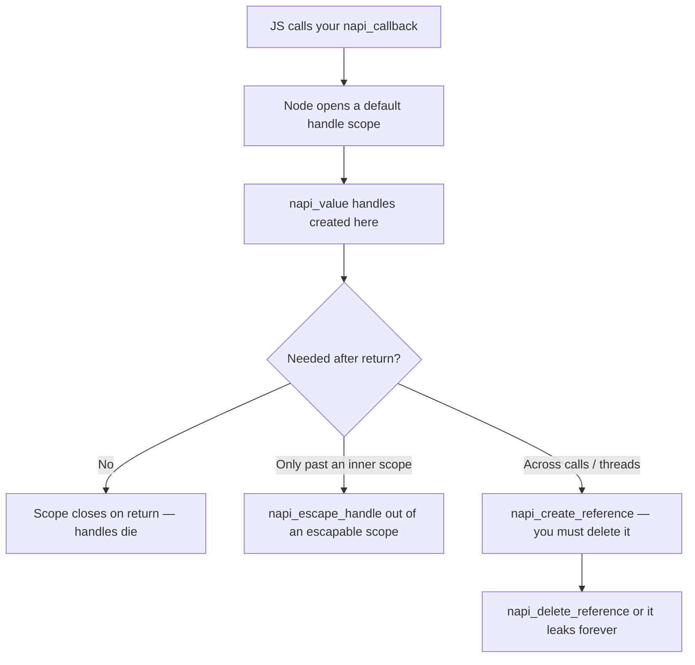

# Chapter 56 — Node-API: Native Addons in C/C++

**What you will learn**

- When a native addon is the right answer, and the four cheaper things to try first.
- Why Node-API — not V8, not `nan` — is the only sane choice for new addons, and what "ABI stability" actually buys you.
- The toolchain end to end: `binding.gyp`, `node-gyp`, the `.node` file, and how `require()` loads it.
- The lifetime model — `napi_env`, `napi_value`, handle scopes, escapable scopes, references — and exactly which mistakes crash the process.
- Error handling with `napi_status`, pending exceptions, and the fatal-error path.
- Wrapping a C++ class with `napi_wrap`, and running work off-thread with `napi_create_async_work` and `napi_threadsafe_function`.

## Why this matters

You have a JPEG decoder written in C. It is 40,000 lines, it has been fuzzed for a decade, and it is thirty times faster than anything you will write this quarter. Rewriting it is not an engineering decision. You need to call it from Node.

That is the honest case for a native addon: **a library that already exists, an OS API Node does not expose, or a numeric loop where V8's JIT genuinely runs out of road.** Everything else — "C is faster" as a general belief, wanting threads, wanting to avoid GC — is usually wrong, and expensive to be wrong about. An addon turns `npm install` into a compile step on every machine, a `TypeError` into a segfault, and a Node upgrade into a rebuild.

### The four things to try first

| Alternative | Good for | Chapter |
|---|---|---|
| **Worker threads** | CPU-bound *JavaScript*. You want parallelism, not native code. | [Chapter 29](../part4-system/29-worker-threads.md) |
| **WebAssembly** | Portable compute from C/C++/Rust with no per-platform build and a real sandbox. | [Chapter 57](57-wasm-wasi.md) |
| **`node:ffi`** | Calling a handful of functions in an existing `.so`/`.dylib`/`.dll` with no build step at all. **[Experimental]** | [Chapter 58](58-ffi-and-embedding.md) |
| **A child process** | Wrapping an existing CLI tool. Crashes stay in the child. | [Chapter 28](../part4-system/28-child-processes.md) |

Reach for an addon when you need all three of native speed, the host process's own memory (no copying across a WASM boundary), and the real operating system. Drop any one requirement and a row above is cheaper for the life of the project.

## Three ways to write an addon, and only one right answer

Node has accumulated three generations of addon API.

**1. Direct V8, libuv, and Node C++ APIs. [Legacy]** `#include <node.h>`, `v8::Isolate`, `v8::Local<v8::Value>`, `FunctionTemplate`. This is what `doc/api/addons.md` documents at length, and the older half of the native ecosystem is built on it. It is also why native modules used to break on every Node major: the V8 API, as the docs put it, "can, and has, changed dramatically from one V8 release to the next."

**2. `nan` (Native Abstractions for Node.js). [Legacy]** Compatibility macros that paper over V8's churn. They solve the *source* problem — your code still compiles — not the *binary* one. You still recompile per Node major.

**3. Node-API. Stability: 2 — Stable.** A pure C API, versioned independently of V8 and maintained inside Node. Everything is opaque: `napi_env`, `napi_value`, `napi_ref`. You never see a V8 type. That indirection is the whole point.

### What ABI stability means

ABI — Application Binary Interface — is the layout-level contract: struct offsets, calling conventions, symbol names. Source compatibility means your code recompiles; **ABI compatibility means the binary you already built keeps working.** Node-API guarantees the second: a `.node` compiled against Node-API version N loads on every later Node major that supports N, with no rebuild.

The guarantee covers `node_api.h` and nothing else. The docs list what is explicitly *not* ABI-stable: the Node.js C++ APIs (`node.h`, `node_buffer.h`, `node_version.h`, `node_object_wrap.h`), libuv via `uv.h`, and V8 via `v8.h`. Include any of them and the guarantee is gone even if the rest of the file is pure Node-API. The common temptation is `napi_get_uv_event_loop()`, which hands back a `uv_loop_t*`; the docs warn it "may result in an addon that does not work across Node.js major versions." The ABI-stable substitute is the thread-safe function, below.

### `NAPI_VERSION` and the compatibility matrix

Including the header opts you into that release's default version. To pin a floor, define it first:

```c
#define NAPI_VERSION 9
#include <node_api.h>
```

That restricts the visible surface to version 9 and earlier, so the compiler catches accidental use of anything newer. Since version 9 the value is also **baked into the addon at build time** and used at runtime. Unset, it defaults to 8.

| Node-API version | Supported in |
|---|---|
| 10 | v22.14.0+, v23.6.0+ and all later versions |
| 9 | v18.17.0+, v20.3.0+, v21.0.0 and all later versions |
| 8 | v12.22.0+, v14.17.0+, v15.12.0+, v16.0.0 and all later versions |
| 7 | v10.23.0+, v12.19.0+, v14.12.0+, v15.0.0 and all later versions |
| 6 | v10.20.0+, v12.17.0+, v14.0.0 and all later versions |

Read it as a floor: that number is the oldest Node your prebuilt binary will run on, so **pick the lowest version whose features you need**. Up to version 8 the versions were strictly additive supersets; from 9 onwards they are not, and an addon written against 9 may need code changes for 10. ABI stability survives because a Node supporting version 10 also supports 8 through 10 and defaults to 8.

Two more macros: `#define NAPI_EXPERIMENTAL` before the include exposes the entire surface including experimental APIs, which you need for anything whose docs show no `Node-API version:` header. And if a function seems missing on a Node newer than its documented `added in:`, you have not opted into a high enough version.

### C or C++?

Node-API is C. `node-addon-api` is the official C++ wrapper — header-only, inlinable, compiling down to the same C calls, so binaries built with it depend only on Node-API symbols and keep the ABI guarantee. The ergonomic gap is large:

```cpp
// node-addon-api
Object obj = Object::New(env);
obj["foo"] = String::New(env, "bar");
```

That is three Node-API calls, three status checks and four locals in C. **Use `node-addon-api` for anything non-trivial in C++.** Use raw C when binding a C library, when you want no C++ runtime dependency, or when the source should also compile against a non-Node implementation of Node-API. This chapter teaches the C layer, because everything else is built on it.

## The toolchain

### node-gyp and `binding.gyp`

`node-gyp` is the build system, based on the `gyp-next` fork of Google's GYP. It requires **Python**. A copy ships bundled inside npm to support `npm install` of addons; install it globally (`npm install -g node-gyp`) to drive it yourself. `CMake.js` is the documented alternative when GYP's limitations bite.

The build description is `binding.gyp` at the project root, in a JSON-like format:

```json
{
  "targets": [
    {
      "target_name": "popcount",
      "sources": [ "src/popcount.c" ],
      "defines": [ "NAPI_VERSION=9" ]
    }
  ]
}
```

`target_name` sets the output filename (`popcount.node`), `sources` lists every translation unit, `defines` become `-D` flags. Two commands:

```bash
node-gyp configure
node-gyp build
```

`configure` generates a `Makefile` on Unix or a `.vcxproj` on Windows under `build/`; `build` compiles and links, producing `build/Release/popcount.node`. `node-gyp rebuild` does clean, configure and build in one step. `npm install` runs exactly this with npm's bundled node-gyp on the user's machine — which is why **your users need a C/C++ toolchain unless you ship prebuilds**. Linux already has GCC or Clang; macOS needs `xcode-select --install`, not the full IDE; Windows needs the Visual Studio build tools.

### What a `.node` file is, and how it loads

A `.node` file is an ordinary platform shared library — a `.so`, `.dylib` or `.dll` under a different extension. `require()` recognises the extension and hands the file to `process.dlopen()`, which loads it and calls its registered init function. That function's return value becomes `module.exports`.

```js
const addon = require('./build/Release/popcount.node');
```

Three things bite here:

- **The extension may be omitted, but do not omit it.** `require('./build/Release/popcount')` prefers a `popcount.js` in the same directory if one exists.
- **The path varies.** Debug builds land in `build/Debug/`. The `bindings` package tries both — the docs describe it as essentially a `try`/`catch` around `require('./build/Release/addon.node')` falling back to `./build/Debug/addon.node`.
- **`import` works too.** Static and dynamic `import()` of `.node` files arrived behind `--experimental-addon-modules` in v23.6.0/v22.20.0 and are **enabled by default as of v26.5.0/v24.19.0** (Stability: 1.2 — Release candidate). Only the default import works: `import myAddon from './hello.node'`, not named imports.

When you need custom `dlopen` flags, `process.dlopen(module, filename[, flags])` is public. You must pass a module-shaped object; exports appear on `module.exports`:

```mjs
import { dlopen } from 'node:process';
import { constants } from 'node:os';
import { fileURLToPath } from 'node:url';

const mod = { exports: {} };
dlopen(mod, fileURLToPath(new URL('./build/Release/popcount.node', import.meta.url)),
       constants.dlopen.RTLD_NOW);
```

`RTLD_NOW` resolves every symbol at load time, turning a missing-symbol crash at call time into a clean throw at load time. Otherwise prefer `require()`.

Two flags govern addons process-wide: `--no-addons` disables loading them entirely (and disables the `node-addons` export condition), and under the Permission Model addons require `--allow-addons` (Stability: 1.1 — Active development). See [Chapter 31](../part4-system/31-permission-model.md).

## Core concepts: env, values, scopes, references

This is the part where people write crashes. Read it twice.

### `napi_env`

`napi_env` is the context holding VM state. It arrives as the first parameter of every callback and must be passed back into every call you make from it. The rules are absolute:

- Pass **the same `napi_env`** you were given into every nested call.
- **Do not cache it** for general reuse.
- **Do not share it between threads**, including between instances of the same addon on different Worker threads.
- It becomes **invalid when the addon instance is unloaded** — you find out via `napi_add_env_cleanup_hook` or the finalizer given to `napi_set_instance_data`.

A restricted variant, `node_api_basic_env` **[Experimental]**, is passed to synchronous finalizers; APIs taking it do not touch the JS engine. Passing one to an API that *does* touch the engine is not allowed, usually produces a compiler warning, and terminates the process if you force it through.

### `napi_value` and handle scopes

A `napi_value` is an opaque handle to a JavaScript value, valid only while the *handle scope* that created it is open. When JavaScript calls your native function, Node opens a default scope, and every `napi_value` you create lives until you return. That is right for almost everything.

It is wrong in a loop. Iterating a million-element array, each `napi_get_element` produces a handle, all sharing the default scope, and every object they point at stays alive until you return — a million-handle spike in a function that uses one element at a time. Open a scope per iteration:

```c
for (uint32_t i = 0; i < length; i++) {
  napi_handle_scope scope;
  if (napi_open_handle_scope(env, &scope) != napi_ok) break;

  napi_value element;
  if (napi_get_element(env, array, i, &element) == napi_ok) {
    // use element here, and only here
  }

  napi_close_handle_scope(env, scope);
}
```

Scopes form a single nested hierarchy: one active at a time, closed in reverse order, and **all scopes opened in a native method must be closed before it returns**. Otherwise you get `napi_handle_scope_mismatch`. The rule that catches people writing libuv callbacks: outside the execution of a native method **there is no default scope**, so open one before creating any value.

Which leaves the obvious problem — how do you return a value out of a scope you opened? An **escapable handle scope** promotes exactly one handle to the enclosing scope:

```c
napi_escapable_handle_scope scope;
napi_open_escapable_handle_scope(env, &scope);

napi_value inner;
napi_create_object(env, &inner);
// ... build up `inner`, creating many temporaries that die with the scope ...

napi_value escaped;
napi_escape_handle(env, scope, inner, &escaped);
napi_close_escapable_handle_scope(env, scope);
// `escaped` is valid in the outer scope; `inner` is not.
```

`napi_escape_handle` may be called **once** per scope. A second call returns `napi_escape_called_twice`.

### References: outliving the call

Handles die with their scope. To hold a JavaScript value across calls — a constructor you will `instanceof` against later, a callback you will invoke from a worker thread — you need a `napi_ref`:

```c
napi_ref ref;
napi_create_reference(env, some_value, 1, &ref);   // refcount 1: strong
// later, on the loop thread:
napi_value value;
napi_get_reference_value(env, ref, &value);        // may yield NULL if collected
// when done:
napi_delete_reference(env, ref);
```

A count above zero keeps the value alive; `napi_reference_ref` and `napi_reference_unref` adjust it, and at zero the value may be collected, after which `napi_get_reference_value` yields `NULL`. **Failing to call `napi_delete_reference` is a permanent leak** of both the native reference structure and the JS object it pins — the docs say exactly that. Worse, creating a *new* reference to an object whose old reference was merely unref'd suppresses that object's finalizers, so its native memory never frees. Delete references; do not just unref them.

### The lifetime rules in one picture



## Converting values, both directions

Every conversion is a call and every call returns a status. Creating values from C:

| C value | Node-API |
|---|---|
| `int32_t` / `uint32_t` / `int64_t` / `double` | `napi_create_int32` / `napi_create_uint32` / `napi_create_int64` / `napi_create_double` |
| UTF-8 / UTF-16 / Latin-1 string | `napi_create_string_utf8` / `napi_create_string_utf16` / `napi_create_string_latin1` |
| `bool` | `napi_get_boolean` |
| nothing | `napi_get_undefined`, `napi_get_null` |
| object / array | `napi_create_object`, `napi_create_array`, `napi_create_array_with_length` |
| bytes you own | `napi_create_buffer`, `napi_create_buffer_copy`, `napi_create_external_arraybuffer` |
| opaque native pointer | `napi_create_external` |

Reading values into C uses `napi_get_value_int32`, `napi_get_value_double`, `napi_get_value_bool`, `napi_get_value_string_utf8`, `napi_get_value_bigint_int64`. These are **strict**: handing `napi_get_value_int32` a string returns `napi_number_expected`, not `NaN`. For JavaScript's coercion semantics you must ask explicitly, with `napi_coerce_to_number`, `napi_coerce_to_string` and friends. Check types first with `napi_typeof`, `napi_is_buffer`, `napi_is_typedarray`, `napi_is_array`, `napi_is_date`.

Strings take two passes, because you allocate the buffer:

```c
size_t length = 0;
napi_get_value_string_utf8(env, value, NULL, 0, &length);   // pass 1: how big?
char* buf = malloc(length + 1);                             // +1 for the NUL
napi_get_value_string_utf8(env, value, buf, length + 1, &length);  // pass 2: fill
```

Passing `NULL` as the buffer returns the byte length excluding the terminator. **A buffer that is too small silently truncates**, with no error — a classic source of corrupted output.

Arguments arrive through `napi_get_cb_info`, where `argc` is in-out: you declare how many slots `argv` has and it reports how many arguments arrived. Missing arguments become `undefined`; extra ones are dropped.

```c
size_t argc = 2;
napi_value argv[2];
napi_value js_this;
napi_get_cb_info(env, info, &argc, argv, &js_this, NULL);
if (argc < 2) { /* JavaScript called us with too few arguments */ }
```

## Error handling

Node-API uses two channels at once, and confusing them is the most common source of native crashes.

**Channel one is `napi_status`.** `napi_ok` means the call succeeded *and* no uncaught JS exception was thrown. After any other status except `napi_pending_exception` you must call `napi_is_exception_pending` to learn whether an exception is now pending. For detail, `napi_get_last_error_info` fills a `napi_extended_error_info` with a VM-neutral `error_message` — it describes the *last* Node-API call, so read it immediately.

**Channel two is the pending JavaScript exception.** `napi_throw`, `napi_throw_error`, `napi_throw_type_error`, `napi_throw_range_error` and `node_api_throw_syntax_error` unwind nothing — C has no exceptions. They mark an exception pending and return, and **your function must then return to JavaScript immediately.** Calling further Node-API functions with an exception pending is the bug: most return `napi_pending_exception` and do nothing, so code that ignores statuses marches on over garbage. A handful are documented as safe while an exception is pending — `napi_is_exception_pending`, `napi_get_and_clear_last_exception`, `napi_delete_async_work`, `napi_cancel_async_work` — precisely because unwinding needs them.

Writing that out per call is unbearable, so every real addon defines a macro that checks the status, converts it to a thrown JS error unless one is pending, and bails:

```c
#define NAPI_CALL(env, call)                                       \
  do {                                                             \
    napi_status _status = (call);                                  \
    if (_status != napi_ok) {                                      \
      bool _pending = false;                                       \
      napi_is_exception_pending((env), &_pending);                 \
      if (!_pending) {                                             \
        const napi_extended_error_info* _info = NULL;              \
        napi_get_last_error_info((env), &_info);                   \
        napi_throw_error((env), NULL,                              \
            (_info && _info->error_message) ? _info->error_message \
                                            : "Node-API failure"); \
      }                                                            \
      return NULL;                                                 \
    }                                                              \
  } while (0)
```

Two escape hatches exist when returning is not possible. **`napi_fatal_exception(env, err)`** raises the error as an `'uncaughtException'`, for async callbacks with no caller to throw to. **`napi_fatal_error(location, location_len, message, message_len)`** terminates the process and does not return; reserve it for unrecoverable corruption of your own state, never for bad user input.

When switching on `napi_status`, always include a `default` branch — Node-API enums are extensible and new codes appear in newer Node versions.

## Wrapping a C++ class

`napi_define_class` creates a JS constructor backed by a native callback. Inside it, `napi_wrap` attaches a native pointer to the new JS object and registers a finalizer to free it; instance methods recover the pointer with `napi_unwrap`.

```cpp
class Counter {
 public:
  explicit Counter(double start) : value_(start) {}
  void Add(double n) { value_ += n; }
  double value() const { return value_; }
 private:
  double value_;
};

static void DestroyCounter(napi_env env, void* data, void* hint) {
  delete static_cast<Counter*>(data);
}

static napi_value CounterNew(napi_env env, napi_callback_info info) {
  size_t argc = 1;
  napi_value argv[1];
  napi_value js_this;
  napi_get_cb_info(env, info, &argc, argv, &js_this, nullptr);

  double start = 0;
  if (argc >= 1) napi_get_value_double(env, argv[0], &start);

  Counter* counter = new Counter(start);
  if (napi_wrap(env, js_this, counter, DestroyCounter, nullptr, nullptr) != napi_ok) {
    delete counter;                       // wrap failed: we still own it
    napi_throw_error(env, nullptr, "failed to wrap Counter");
    return nullptr;
  }
  return js_this;
}

static napi_value CounterAdd(napi_env env, napi_callback_info info) {
  size_t argc = 1;
  napi_value argv[1];
  napi_value js_this;
  napi_get_cb_info(env, info, &argc, argv, &js_this, nullptr);

  Counter* counter = nullptr;
  if (napi_unwrap(env, js_this, reinterpret_cast<void**>(&counter)) != napi_ok) {
    napi_throw_type_error(env, nullptr, "not a Counter");
    return nullptr;
  }

  double n = 0;
  napi_get_value_double(env, argv[0], &n);
  counter->Add(n);

  napi_value result;
  napi_create_double(env, counter->value(), &result);
  return result;
}
```

Register it in `Init`:

```cpp
napi_property_descriptor props[] = {
  { "add", nullptr, CounterAdd, nullptr, nullptr, nullptr, napi_default, nullptr },
};
napi_value ctor;
napi_define_class(env, "Counter", NAPI_AUTO_LENGTH, CounterNew, nullptr, 1, props, &ctor);
napi_set_named_property(env, exports, "Counter", ctor);
```

The finalizer runs when the GC collects the wrapper — **at an unspecified time, possibly never** if the process exits first. Nothing time-sensitive belongs there: no flushing, no socket close, no lock release. If shutdown order matters, register a cleanup hook with `napi_add_env_cleanup_hook`; the docs note finalizers are scheduled *after* manually registered cleanup hooks during teardown, which is the ordering you want.

`napi_unwrap` on the wrong object is the classic native crash. `napi_instanceof` against a saved constructor reference helps but can be fooled by prototype manipulation. The stronger tool is **type tagging**: `napi_type_tag_object` stamps a 128-bit UUID onto the object and `napi_check_object_type_tag` verifies it, which the docs recommend precisely so the pointer from `napi_unwrap` can be safely cast. Use it on any object arriving through a static method rather than as `this`. `napi_add_finalizer` attaches a finalizer without wrapping; `napi_remove_wrap` detaches the pointer and cancels the finalizer when ownership returns to C.

## Async: doing work off the loop thread

A native function that runs for 200 ms blocks the entire event loop. Node-API gives you two mechanisms, for two different shapes of problem.

### `napi_create_async_work`: one job, one result

This is the libuv thread pool, wrapped in an ABI-stable interface. You supply two callbacks:

```c
typedef void (*napi_async_execute_callback)(napi_env env, void* data);
typedef void (*napi_async_complete_callback)(napi_env env, napi_status status, void* data);
```

`execute` runs on a pool thread, in parallel with the loop. `complete` runs on the loop thread when it finishes. **The rule that matters: `execute` must not make Node-API calls that touch JavaScript.** The docs put it plainly — avoid using the `napi_env` parameter in the execute callback at all. Everything that touches JS goes in `complete`.

Here is a complete, promise-returning async function. It counts set bits in a `Buffer`.

```c
typedef struct {
  napi_async_work work;
  napi_deferred deferred;
  napi_ref input_ref;
  const uint8_t* data;
  size_t length;
  uint64_t result;
} popcount_task;

static void ExecutePopcount(napi_env env, void* raw) {
  popcount_task* task = (popcount_task*)raw;
  uint64_t total = 0;
  for (size_t i = 0; i < task->length; i++) {
    uint8_t b = task->data[i];
    while (b) { total += (b & 1u); b >>= 1; }
  }
  task->result = total;                    // no Node-API calls in here
}

static void CompletePopcount(napi_env env, napi_status status, void* raw) {
  popcount_task* task = (popcount_task*)raw;

  if (status == napi_ok) {
    napi_value result;
    if (napi_create_int64(env, (int64_t)task->result, &result) == napi_ok) {
      napi_resolve_deferred(env, task->deferred, result);
    }
  } else {
    napi_value message, error;
    napi_create_string_utf8(env, "popcount cancelled", NAPI_AUTO_LENGTH, &message);
    napi_create_error(env, NULL, message, &error);
    napi_reject_deferred(env, task->deferred, error);
  }

  napi_delete_reference(env, task->input_ref);
  napi_delete_async_work(env, task->work);
  free(task);
}

static napi_value Popcount(napi_env env, napi_callback_info info) {
  size_t argc = 1;
  napi_value argv[1];
  NAPI_CALL(env, napi_get_cb_info(env, info, &argc, argv, NULL, NULL));

  bool is_buffer = false;
  NAPI_CALL(env, napi_is_buffer(env, argv[0], &is_buffer));
  if (!is_buffer) {
    napi_throw_type_error(env, "ERR_INVALID_ARG_TYPE", "argument must be a Buffer");
    return NULL;
  }

  popcount_task* task = calloc(1, sizeof(popcount_task));
  if (task == NULL) {
    napi_throw_error(env, NULL, "out of memory");
    return NULL;
  }

  void* data = NULL;
  napi_get_buffer_info(env, argv[0], &data, &task->length);
  task->data = (const uint8_t*)data;

  // Keep the Buffer alive for as long as the pool thread reads its bytes.
  napi_create_reference(env, argv[0], 1, &task->input_ref);

  napi_value promise;
  napi_create_promise(env, &task->deferred, &promise);

  napi_value name;
  napi_create_string_utf8(env, "popcount:async", NAPI_AUTO_LENGTH, &name);
  napi_create_async_work(env, NULL, name, ExecutePopcount, CompletePopcount,
                         task, &task->work);
  napi_queue_async_work(env, task->work);

  return promise;
}

NAPI_MODULE_INIT(/* napi_env env, napi_value exports */) {
  napi_value fn;
  NAPI_CALL(env, napi_create_function(env, "popcount", NAPI_AUTO_LENGTH,
                                      Popcount, NULL, &fn));
  NAPI_CALL(env, napi_set_named_property(env, exports, "popcount", fn));
  return exports;
}
```

Note the `napi_create_reference` on the input `Buffer`. Without it, JavaScript could drop its last reference the instant `Popcount` returns, the GC could free the backing store, and the pool thread would read freed memory. **Holding a raw pointer across a thread boundary means holding a reference to whatever owns it.**

Three more rules: `napi_queue_async_work` may be called at most once per work item; `napi_cancel_async_work` only succeeds before the work starts, and on success `complete` still runs with status `napi_cancelled`; and the work object must not be deleted until `complete` has run, even after a successful cancel. The `async_resource_name` string is not decoration — it is what `async_hooks` and diagnostic tooling report, so namespace it with your module name.

### `napi_threadsafe_function`: many calls, from your own threads

`napi_async_work` covers "do one thing, report once." It does not cover a native library with its own thread emitting events — an audio callback, a filesystem watcher, a hardware poller. For that you must call JavaScript from a thread Node knows nothing about.

**The absolute rule: `napi_env`, `napi_value` and `napi_ref` must never be touched from a thread other than the one that owns the environment.** The thread-safe function is the sanctioned bridge: `napi_create_threadsafe_function` wraps a JS function in an opaque handle safe to call from any thread, each `napi_call_threadsafe_function` enqueues a `void*`, and the loop thread later invokes your `call_js_cb` once per item, where handling `napi_value` is legal again.

The parameters that matter:

| Parameter | What it controls |
|---|---|
| `max_queue_size` | Queue capacity; `0` means unbounded. |
| `initial_thread_count` | Number of initial acquisitions, including the main thread. |
| `call_js_cb` | Runs on the loop thread; converts your `void*` into arguments and calls the function. Omit it and the function is called with no arguments. |
| `thread_finalize_cb` | Runs on the main thread when the TSFN is destroyed — the place to `uv_thread_join()`. |
| `context` | Retrievable from any thread with `napi_get_threadsafe_function_context`. |

Call mode is `napi_tsfn_blocking` (wait for queue space) or `napi_tsfn_nonblocking` (return `napi_queue_full` immediately). **Never use `napi_tsfn_blocking` from the JavaScript thread** — with a full queue the loop thread blocks waiting for itself to drain it, which is a deadlock.

Lifetime is refcounted by threads, not calls. Each thread that will use the function calls `napi_acquire_threadsafe_function` and `napi_release_threadsafe_function` when done; at zero the object is destroyed once the queue drains. After you receive `napi_closing` from a call, or after you release, **the handle may already be freed — never touch it again.** `napi_tsfn_abort` forces that state early, which is a clean way to tell your threads to stop. Separately, `napi_ref_threadsafe_function` and `napi_unref_threadsafe_function` control whether the function keeps the event loop alive, like libuv handles; neither affects destruction.

## Distribution

Native code makes your package compile-on-install. The docs describe three tools that ship binaries instead:

| Tool | Where binaries live | Notes |
|---|---|---|
| **node-pre-gyp** | Any server you choose; strong S3 support | Based on node-gyp. |
| **prebuild** | GitHub releases only | Works with node-gyp *or* CMake.js. |
| **prebuildify** | Bundled inside the npm tarball | No download at install time; binaries are simply there. |

`prebuildify` has the lowest friction: no network fetch during `npm install`, nothing to break behind a corporate proxy, at the cost of a larger tarball.

Node-API is what makes prebuilds practical at all. Before it, "prebuilt" meant one binary per Node major per platform per architecture and the matrix exploded. Now you build **one binary per platform/arch pair per Node-API version** and it keeps working across Node majors. Set `NAPI_VERSION` to the lowest you need, build for each `platform-arch` you support, and declare the `node-addons` export condition in `package.json` so bundlers and `--no-addons` behave. Cross-compiling is where the pain remains — you need a cross toolchain plus matching Node headers — and a CI matrix with native runners per platform is usually cheaper.

## Common mistakes

### ❌ Calling Node-API after throwing, or ignoring `napi_status`

```c
// Wrong: keeps going with an exception pending
napi_throw_type_error(env, NULL, "expected a Buffer");
napi_value result;
napi_create_int32(env, 0, &result);   // returns napi_pending_exception, does nothing
return result;                        // returns an uninitialised handle
```

`result` was never written. You just returned a garbage pointer to JavaScript. Throw and return immediately, and check every status.

```c
// ✅
if (!is_buffer) {
  napi_throw_type_error(env, "ERR_INVALID_ARG_TYPE", "expected a Buffer");
  return NULL;   // NULL means "I threw" — Node propagates the pending exception
}
```

### ❌ Touching `napi_env` from another thread

```c
// Wrong: this runs on your own pthread
static void* worker(void* arg) {
  ctx* c = arg;
  napi_value msg;
  napi_create_string_utf8(c->env, "done", NAPI_AUTO_LENGTH, &msg);  // undefined behaviour
  napi_call_function(c->env, c->global, c->cb, 1, &msg, NULL);
  return NULL;
}
```

This may appear to work under light load and corrupt the heap under real load — the worst possible failure mode. The same applies inside `napi_async_execute_callback`.

```c
// ✅ Marshal to the loop thread; do all JS work in call_js_cb.
static void* worker(void* arg) {
  ctx* c = arg;
  char* payload = strdup("done");
  napi_call_threadsafe_function(c->tsfn, payload, napi_tsfn_nonblocking);
  return NULL;
}
```

### ❌ Reading a `Buffer`'s bytes on a pool thread without a reference

```c
// Wrong: pointer captured, ownership not
napi_get_buffer_info(env, argv[0], &data, &len);
task->data = data;
napi_queue_async_work(env, task->work);   // GC may free `data` before this runs
```

`napi_get_buffer_info` gives you a raw pointer into a JavaScript-owned allocation. Nothing keeps that allocation alive once JS drops its last reference.

```c
// ✅ Pin it for the duration of the work, release it in `complete`.
napi_create_reference(env, argv[0], 1, &task->input_ref);
// ... in CompletePopcount:
napi_delete_reference(env, task->input_ref);
```

### ❌ Creating handles in a loop without a scope

```c
// Wrong: a million live handles and a million live objects
for (uint32_t i = 0; i < 1000000; i++) {
  napi_value element;
  napi_get_element(env, array, i, &element);
  process(env, element);
}
```

```c
// ✅ One live handle at a time.
for (uint32_t i = 0; i < 1000000; i++) {
  napi_handle_scope scope;
  if (napi_open_handle_scope(env, &scope) != napi_ok) break;
  napi_value element;
  if (napi_get_element(env, array, i, &element) == napi_ok) process(env, element);
  napi_close_handle_scope(env, scope);
}
```

### ❌ Assuming a finalizer will run

```c
// Wrong: relying on GC for correctness
static void Finalize(napi_env env, void* data, void* hint) {
  flush_and_close_log_file((log_t*)data);   // may never happen
}
```

Finalizers run when the GC decides to, and on process exit they may not run at all. Anything with observable side effects belongs in an explicit `close()` method plus a cleanup hook.

```c
// ✅
napi_add_env_cleanup_hook(env, FlushAllLogs, state);
// and expose an explicit close() to JavaScript
```

## Production notes

- **An addon is a new crash surface.** A JS bug throws; a C bug segfaults the process and kills every in-flight request. Fuzz the boundary, run tests under ASan/UBSan in CI, and treat every value from JavaScript as hostile — validate type and length before touching a pointer.
- **Addons must be context-aware.** The docs state that all Node-API addons may be loaded multiple times: once per Worker thread, repeatedly when embedded. Any `static` mutable state is shared across environments and is a data race. Use `napi_set_instance_data` / `napi_get_instance_data` for per-environment state.
- **The libuv thread pool is small and shared.** `napi_create_async_work` uses the same pool as `fs` and `dns`, so long native jobs starve file I/O process-wide. Short bursts are fine; for sustained work run your own threads and bridge back with a thread-safe function.
- **Tell V8 about memory you allocate.** A 500 MB native buffer hanging off a 100-byte JS object looks like 100 bytes of GC pressure and may never be collected. `napi_adjust_external_memory` reports the delta.
- **Pin `NAPI_VERSION` and test it.** Build against the lowest version you need and run the resulting binary on both the oldest and newest Node you support. The ABI guarantee only covers Node-API — an accidental `#include <v8.h>` compiles fine and silently voids it.
- **Keep debug symbols.** A stripped native frame in a production core dump is unreadable. `node --report-on-fatalerror` (see [Chapter 50](../part7-diagnostics/50-reports-and-heap.md)) captures the native stack of a crashing addon.
- **Under the Permission Model addons are off by default** — `--allow-addons` is required, `--no-addons` disables them outright. Document this if your users run with `--permission`.

## Exercises

1. **Build the hello addon.** Write a `binding.gyp` and a C source exporting one function that returns `'world'`. Build with `node-gyp rebuild`, load from both CommonJS and ESM. *Success:* both print `world` and `build/Release/*.node` exists.
2. **Validate arguments strictly.** Add `add(a, b)` requiring exactly two numbers, rejecting anything else with a `TypeError` carrying code `ERR_INVALID_ARG_TYPE`. *Success:* `add('1', 2)` throws with the right `err.code`, and no input you can devise crashes the process.
3. **Use an escapable scope.** Build an array of 100,000 strings inside an explicit handle scope and return it with `napi_escape_handle`. *Success:* the array is correct, and a second `napi_escape_handle` on the same scope returns `napi_escape_called_twice`.
4. **Make it async and measure it.** Convert a CPU-heavy synchronous function to `napi_create_async_work` returning a promise, as in the `popcount` example. *Success:* a 10 ms `setInterval` keeps firing on schedule while the work runs — prove it with timestamps.
5. **Bridge a real thread.** Spawn a thread that ticks every 100 ms into a JavaScript callback through a `napi_threadsafe_function`, then shut it down with `napi_release_threadsafe_function` / `napi_tsfn_abort` and join in `thread_finalize_cb`. *Success:* after the JS side calls `stop()` the process exits cleanly, with no hang and no crash.

## Recap

- Write an addon only for an existing C library, a real OS API, or genuinely JIT-proof compute. Try worker threads, WASM, `node:ffi` and child processes first.
- Node-API is the only choice for new addons; raw V8 and `nan` are **[Legacy]** and break your binary across Node majors.
- ABI stability covers `node_api.h` and nothing else — `v8.h`, `uv.h` and `node.h` all void it.
- `NAPI_VERSION` is a floor, baked into the binary since version 9 and defaulting to 8. Pick the lowest you need.
- Handles live and die with their handle scope; escapable scopes promote exactly one; a `napi_ref` outlives the call and must be deleted or it leaks forever.
- Check every `napi_status`, and after throwing return immediately — most APIs do nothing while an exception is pending.
- `napi_wrap` plus a finalizer binds a C++ object to a JS object, but finalizers are GC-timed and may never run; use cleanup hooks when ordering matters.
- `napi_create_async_work` for one-shot jobs, `napi_threadsafe_function` for your own threads. Never touch `napi_env`, `napi_value` or `napi_ref` off the loop thread.
- Ship prebuilds so your users do not need a compiler.

## Where to go next

- [Chapter 29 — Worker Threads](../part4-system/29-worker-threads.md) — solves most "I need parallelism" problems without C.
- [Chapter 57 — WebAssembly and WASI](57-wasm-wasi.md) — native-ish speed, no per-platform build, a real memory boundary.
- [Chapter 58 — FFI and Embedding Node.js](58-ffi-and-embedding.md) — a shared library with no addon at all, and Node inside a C++ host.
- [Chapter 31 — The Permission Model](../part4-system/31-permission-model.md) — what `--allow-addons` gates.
- [Chapter 50 — Diagnostic Reports, Heap Snapshots, and V8 Tooling](../part7-diagnostics/50-reports-and-heap.md) — reading a native crash.
- Official docs: <https://nodejs.org/docs/latest/api/n-api.html> and <https://nodejs.org/docs/latest/api/addons.html>. The C++ addons page carries worked V8-based examples — function arguments, callbacks, object and function factories, wrapping and passing wrapped objects — still a useful map of what addons do, even though the API is **[Legacy]**. For C++, the `node-addon-api` docs and the Node-API Resource site are the next step.
