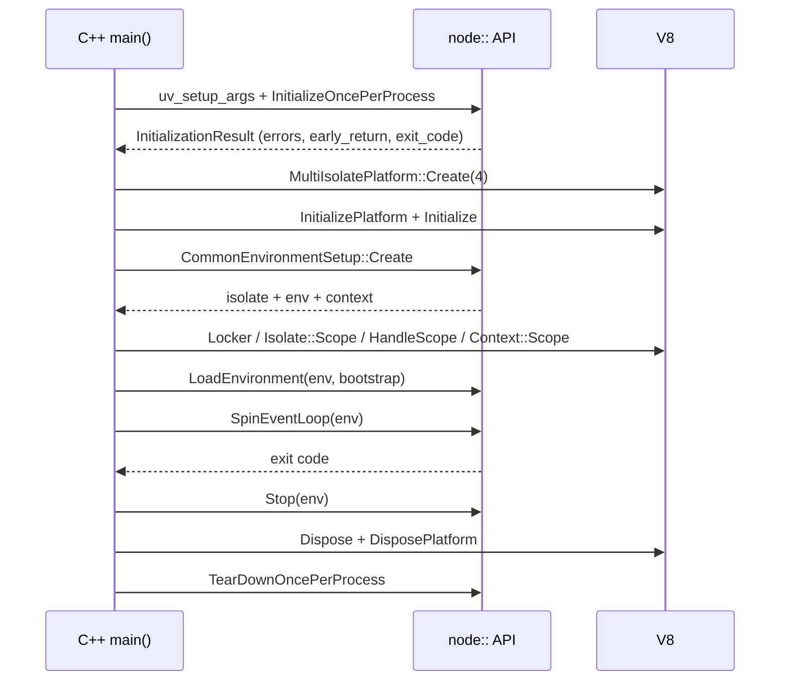

# Chapter 58 — FFI and Embedding Node.js

## What you will learn

- What `node:ffi` is, exactly how experimental it is, and the two flags plus build configuration it needs.
- The FFI type system, signature objects, and how every JavaScript value maps onto a C type.
- Pointers as `bigint`, the raw memory helpers, zero-copy views, and where each one will bite you.
- Registering a JavaScript function as a C callback, and the five rules that make it safe.
- FFI vs Node-API addon vs WebAssembly, compared on performance, safety, build cost, portability and ABI risk.
- The C++ embedder API: per-process initialization, the platform, `CommonEnvironmentSetup`, running the loop, and teardown — and what it costs to own.

## Why this matters

You need one function. Just one. A vendor ships `libhsm.so` with a `hsm_sign(const uint8_t*, size_t, uint8_t*)` and a C header, and your Node service needs to call it. [Chapter 56](56-node-api-addons.md) says write a Node-API addon: a `binding.gyp`, a Python-dependent build, a compiler on every laptop, a prebuild pipeline, and 150 lines of C to marshal two buffers. For one function.

`node:ffi` is the answer to that specific frustration. You describe the function's signature as a JavaScript object, Node uses `libffi` to construct the call at runtime, and you call it. No build step, no `.node` file, no compiler on the target machine. That is a genuinely large reduction in project cost.

It is also a genuinely large increase in risk, and the docs say so in the second paragraph: "This API is unsafe. Passing invalid pointers, using an incorrect symbol signature, or accessing memory after it has been freed can crash the process or corrupt memory." A Node-API addon at least had a C compiler checking your types against the vendor's header. With FFI, the type check is a string you typed, and nothing on earth verifies it against the real symbol. Get it wrong and you do not get a `TypeError` — you get a segfault, or worse, a wrong answer.

The second half of this chapter inverts the relationship entirely: instead of Node calling into C, a C++ program creates a Node.js runtime inside itself.

---

## Part one — `node:ffi`

### Stability, flags, and availability

`node:ffi` is **Stability: 1 — Experimental**, added in **v26.1.0**. Getting to it requires more than an import:

| Requirement | Detail |
|---|---|
| Flag | `--experimental-ffi` (**Stability: 1 — Experimental**, v26.1.0). Without it the module is not available. |
| Build | Only present in builds with FFI support — bundled `libffi` where a compatible static backend exists, or a shared `libffi` via the `--shared-ffi` configure flag. The unofficial GN build does not support it. |
| Permission Model | `--allow-ffi` (**Stability: 1.1 — Active development**, v26.1.0). Otherwise FFI calls throw `ERR_ACCESS_DENIED` with `permission: 'FFI'`. |

The bundled `libffi` does not cover every target. The unsupported ones are `s390x`; `mips`, `mipsel` and `mips64el` outside FreeBSD, Linux and OpenBSD; and `ppc64` on Android, CloudABI, iOS, OpenHarmony, OS/400, Solaris and Windows. **Check this before building a product on it** — "works on my laptop, missing on the production architecture" is an expensive discovery.

```mjs
import ffi from 'node:ffi';
```

```cjs
const ffi = require('node:ffi');
```

```bash
node --experimental-ffi app.mjs
node --permission --experimental-ffi --allow-ffi app.mjs
```

### Loading a library

`ffi.suffix` is a string — `'dylib'` on macOS, `'so'` on Unix-like platforms, `'dll'` on Windows — so you can build a portable path without branching on `process.platform`.

`ffi.dlopen(path[, definitions])` is the one-shot form. It loads the library, resolves the symbols you name, and returns `{ lib, functions }`: a `DynamicLibrary` handle and an object of callable wrappers.

```mjs
import { dlopen, suffix } from 'node:ffi';

const { lib, functions } = dlopen(`./libmath.${suffix}`, {
  add_i32: { arguments: ['i32', 'i32'], return: 'i32' },
  string_length: { arguments: ['pointer'], return: 'u64' },
});

console.log(functions.add_i32(20, 22));   // 42
```

Pass `null` as the path to resolve symbols from the current process image instead of a separate library — **not supported on Windows**. Omit `definitions` and `functions` comes back empty, ready for later resolution. The returned object implements the explicit resource management protocol, so `using` closes the library when the block exits:

```mjs
import { dlopen, suffix } from 'node:ffi';

{
  using handle = dlopen(`./libmath.${suffix}`, {
    add_i32: { arguments: ['i32', 'i32'], return: 'i32' },
  });
  console.log(handle.functions.add_i32(20, 22));
}   // handle.lib.close() runs here
```

`new DynamicLibrary(path)` is the lazy form: it loads the library and resolves nothing. From there:

| Member | Returns | Notes |
|---|---|---|
| `library.path` | string | The path it was loaded from. |
| `library.getFunction(name, signature)` | Function | Resolves and wraps. The wrapper has a `.pointer` `bigint`. |
| `library.getFunctions([definitions])` | Object | Bulk resolve, or all already-resolved wrappers. |
| `library.getSymbol(name)` | `bigint` | Raw address. |
| `library.getSymbols()` | Object | All previously resolved addresses. |
| `library.functions` | Object | Previously resolved wrappers. |
| `library.symbols` | Object | Previously resolved addresses as `bigint`. |
| `library.close()` / `library[Symbol.dispose]()` | — | Idempotent. |

`ffi.dlclose(handle)` and `ffi.dlsym(handle, symbol)` are free-function equivalents of `close()` and `getSymbol()`.

Resolution is memoized and signature-checked: the same symbol requested twice with the **same** signature returns the identical function object, and with a **different** signature throws — a small but real safety net against two modules disagreeing about a function's shape.

#### What closing actually invalidates

After `library.close()`, resolved wrappers become invalid, further resolution throws, and registered callbacks are invalidated. What closing does **not** do is make already-exported callback pointers safe: Node does not track or revoke pointers that native code already holds, and invoking one after close is undefined behaviour. Native code must stop using your callback addresses *before* you close — and calling `close()` from inside one of that library's active callbacks is itself unsupported.

### Signatures and the type system

A signature object has two optional properties:

* `return` — a type name string. **Default:** `'void'`.
* `arguments` — an array of type name strings. **Default:** `[]`.

```js
const signature = { return: 'i32', arguments: ['i32', 'i32'] };
```

The type names, grouped:

| Group | Names |
|---|---|
| Void | `void` |
| Signed integers | `char`, `i8`/`int8`, `i16`/`int16`, `i32`/`int32`, `i64`/`int64` |
| Unsigned integers | `u8`/`uint8`, `bool`, `u16`/`uint16`, `u32`/`uint32`, `u64`/`uint64` |
| Floating point | `f32`/`float`, `f64`/`double`, `float32`, `float64` |
| Pointer-like | `pointer`/`ptr`, `string`/`str`, `buffer`, `arraybuffer`, `function` |

Every name is also a constant on `ffi.types` — `ffi.types.INT_32 === 'int32'`, `ffi.types.POINTER === 'pointer'`, `ffi.types.DOUBLE === 'double'`, and so on. They are plain strings; the constants exist for readability and typo-catching, not for type safety.

Three details that will catch you:

- **`char` follows the platform C ABI** — like `i8` where plain `char` is signed, like `u8` otherwise. If you care, say `i8` or `u8` explicitly.
- **`bool` is marshalled as an 8-bit unsigned integer, and `true`/`false` are not accepted.** Pass `0` and `1`.
- **All pointer-like types are one thing at the ABI level:** a pointer. `string`, `buffer`, `arraybuffer` and `function` differ only in how the JavaScript value is converted beforehand.

#### How JavaScript values convert

| Declared type | Pass this | Comes back as |
|---|---|---|
| `i8`…`i32`, `u8`…`u32`, `f32`, `f64` | `number` matching the declared type | `number` |
| `i64`, `u64` | `bigint` | `bigint` |
| `bool` | `0` or `1` | `number` |
| `pointer`, `string`, `buffer`, `arraybuffer`, `function` | `null`/`undefined` → null pointer; `string` → a temporary NUL-terminated UTF-8 copy valid for the call; `Buffer`/typed array/`DataView` → pointer to its backing memory; `ArrayBuffer` → pointer to its backing memory; `bigint` → that raw address | `bigint` address |

Note what the last row means for return values: **a function declared to return `string` gives you a `bigint`, not a JavaScript string.** You call `ffi.toString(pointer)` yourself. That is the correct design — only you know whether the returned pointer is owned by the callee, must be freed, or points at a static buffer.

#### Borrowed memory

When you pass a `Buffer`, `ArrayBuffer` or typed array as a pointer-like argument, Node borrows a raw pointer into its backing store for the duration of the call. The docs state the requirement bluntly: the caller must keep that backing store valid and stable for the entire call, and resizing, transferring, detaching or otherwise invalidating it while the call is active — **including from reentrant JavaScript such as an FFI callback** — may crash the process or corrupt memory.

The reentrancy clause is the one people miss: if your C function calls back into JavaScript and that callback resizes a `Buffer` the C function is still reading, you have corrupted memory with entirely ordinary-looking JavaScript.

#### The fast path

Node optimizes calls that fit a platform-specific fast trampoline; anything that does not fit falls back to the generic `libffi` path, transparently and correctly, just more slowly. Fast calls support **at most 8 total arguments**, with per-architecture register limits:

| Architecture | Max integer/pointer args | Max FP args | Buffer-shaped args |
|---|---|---|---|
| AArch64 | 7 (6 with a buffer-shaped arg) | 8 | Supported |
| x86-64 SysV (Linux/macOS) | 6 (4 with a buffer-shaped arg) | 8 | Supported |
| x86-64 Win64 | 3 (total args also capped at 3) | 3 | Not supported |
| s390x, PPC64LE, LoongArch64, RISC-V 64 | 4–7 | 4–8 | Not supported |

PPC64BE has no fast trampoline at all. "Buffer-shaped" means a `Buffer`, typed array, `DataView` or `ArrayBuffer` passed as a pointer-like argument, and buffer-shaped plus floating-point arguments together are not supported on the fast path anywhere. Windows x64 is strikingly restrictive at three arguments — **a hot function that is fast on your Linux CI can be markedly slower on a Windows deployment.** On the fast path, `pointer`, `ptr` and `function` parameters also accept raw `bigint` addresses.

### Pointers and memory

Pointers are `bigint` values throughout. `0n` is the null pointer.

**Reading and writing primitives** at an address:

```js
import { getInt32, setInt32, getUint64 } from 'node:ffi';

setInt32(ptr, 0, 42);          // setters require an explicit offset
console.log(getInt32(ptr, 0)); // 42 (a number)
console.log(getUint64(ptr, 8)); // a bigint
```

There is a `get`/`set` pair for each of `Int8`, `Uint8`, `Int16`, `Uint16`, `Int32`, `Uint32`, `Int64`, `Uint64`, `Float32` and `Float64`. Getters return `number` for 8-, 16- and 32-bit integers and for floats, and `bigint` for the 64-bit integer types. The offset is optional on getters and **required on setters**. Setters validate the JavaScript value against the target native type before writing; `setInt64`/`setUint64` accept a `bigint` directly, or a `number` that is an integer within the safe-integer range.

**Reading strings:** `ffi.toString(pointer)` reads a NUL-terminated UTF-8 string, returning `null` for `0n`. It validates neither that the pointer is readable nor that a terminator exists — a missing NUL means it reads on until it finds a zero byte or hits an unmapped page.

**Getting bytes out:** `ffi.toBuffer(pointer, length[, copy])` and `ffi.toArrayBuffer(pointer, length[, copy])`. `copy` defaults to `true`, which allocates and copies — the safe choice. `copy: false` is the zero-copy escape hatch: a writable view directly onto foreign memory, so JavaScript writes modify native memory in place. You must then guarantee that the pointer stays valid for the view's whole lifetime, that `length` stays inside the allocation, that no native code frees or repurposes the memory, and that page protections are respected.

**Putting bytes in:** `ffi.exportString(string, pointer, length[, encoding])`, `ffi.exportBuffer`, `ffi.exportArrayBuffer` and `ffi.exportArrayBufferView`. All copy *into* memory you already own; **none of them allocate.** `length` must fit the payload plus, for `exportString`, a trailing NUL — two zero bytes for UTF-16 and UCS-2.

**Going the other way:** `ffi.getRawPointer(source)` returns the address of JavaScript-managed storage (`Buffer`, `ArrayBuffer`, `SharedArrayBuffer` or `ArrayBufferView`), invalid the moment that memory is detached, resized or transferred. And `ffi.getCurrentEventLoop()` (**v26.6.0**) returns the current environment's `uv_loop_t` address — in a worker thread, that worker's loop — valid only for that environment's lifetime.

#### Structs are not supported

The FFI documentation defines no struct type, no struct-by-value passing, and no layout description mechanism. **Do not look for one — it is not there.** You can still work with structs the same way you work with them in WebAssembly ([Chapter 57](57-wasm-wasi.md)): agree on a byte layout, get a pointer, and read and write fields at fixed offsets.

```js
// struct point { int32_t x; int32_t y; double weight; }
// Layout: x @0, y @4, weight @8 (8-byte aligned). Size 16.
const point = Buffer.alloc(16);
point.writeInt32LE(3, 0);
point.writeInt32LE(4, 4);
point.writeDoubleLE(1.5, 8);

functions.consume_point(point);   // declared as { arguments: ['pointer'] }
```

You are hand-computing alignment and padding a C compiler would have done for you, against a header you must read correctly, with nothing verifying the result. This is the sharpest edge in the module: if your target API is struct-heavy, **write a Node-API addon instead** and let the compiler check the layout. There is likewise no documented access to `errno` or `GetLastError()`, so C APIs that report failure through `errno` need a thin C shim — at which point you have a build step again and should reconsider.

### Callbacks: C calling back into JavaScript

`library.registerCallback([signature,] callback)` wraps a JavaScript function in a native trampoline and returns its address as a `bigint`, ready to hand to a C function expecting a function pointer. Omit the signature and it defaults to `void ()`.

```mjs
import { DynamicLibrary, getInt32, suffix } from 'node:ffi';

const lib = new DynamicLibrary(`./libsort.${suffix}`);

const comparePtr = lib.registerCallback(
  { arguments: ['pointer', 'pointer'], return: 'i32' },
  (a, b) => getInt32(a, 0) - getInt32(b, 0),
);

const qsortWrapper = lib.getFunction('sort_with', {
  arguments: ['pointer', 'u64', 'function'],
  return: 'void',
});
qsortWrapper(data, BigInt(count), comparePtr);

lib.unregisterCallback(comparePtr);   // only after native code is done with it
```

The rules the docs impose on callbacks are absolute:

1. **They must be invoked on the same system thread where they were created.** A C library that calls your callback from its own worker thread is undefined behaviour. This is the single biggest limitation versus a Node-API addon, which has `napi_threadsafe_function` for exactly this ([Chapter 56](56-node-api-addons.md)).
2. **They must not throw.** There is no C frame that can catch a JavaScript exception.
3. **They must not return promises.** The native caller wants a value now.
4. **They must return a value compatible with the declared return type.**
5. **They must not close their owning library or unregister themselves while running.**

Lifetime has two more controls. `library.refCallback(pointer)` keeps the JavaScript function strongly referenced; `library.unrefCallback(pointer)` makes it weak. If a weakly-referenced callback is collected, subsequent native invocations become a no-op and non-void returns are zero-initialized before returning to native code — which is at least a defined behaviour, but a zero is rarely the right answer to a comparator. Both throw `ERR_INVALID_ARG_VALUE` if the function has already been collected. And `unregisterCallback` on a *currently executing* callback is unsupported and dangerous.

### Errors

Node defines three FFI-specific error codes:

| Code | Meaning |
|---|---|
| `ERR_FFI_CALL_FAILED` | A low-level FFI call failed. |
| `ERR_FFI_INVALID_POINTER` | An invalid pointer was passed to an FFI operation. |
| `ERR_FFI_LIBRARY_CLOSED` | An operation was attempted on a library after it was closed. |

Plus `ERR_ACCESS_DENIED` under the Permission Model and `ERR_INVALID_ARG_VALUE` from the callback ref/unref helpers.

These catch bookkeeping errors Node can see: a closed handle, a recognizably bogus pointer, a call it could not set up. They do **not** catch the failure mode that matters. Declaring `{ arguments: ['i32'] }` for a function that actually takes a `double` is not a detectable error — `libffi` builds the frame you described, the callee reads registers you never filled, and you get a garbage result, a corrupted stack, or `SIGSEGV`. No exception, no stack trace pointing at your signature, and `process.on('uncaughtException')` will not run.

That is the whole safety story in one paragraph: **`node:ffi` moves type checking from compile time to never.**

### FFI vs addon vs WebAssembly

| | `node:ffi` | Node-API addon | WebAssembly |
|---|---|---|---|
| **Call overhead** | Low on the fast path; generic `libffi` path is slower | Lowest | ~3.6 ns per call, plus data marshalling |
| **Data transfer** | Zero-copy possible; no copy in the common case | Zero-copy; direct access to the JS heap | Must copy into linear memory |
| **Memory safety** | **None.** Wrong signature = segfault or corruption | **None**, but the C compiler checks your types | **Strong.** Faults are trapped inside the sandbox |
| **Build step** | **None** | node-gyp, Python, a C/C++ toolchain | Build once, ship the `.wasm` |
| **Install-time cost for users** | None | Compile or download a prebuild | None |
| **Portability** | One JS file, but per-platform library paths and ABI | One binary per platform/arch | One artifact, everywhere |
| **ABI risk** | **Highest.** Nothing verifies your signature against the real symbol | Moderate; Node-API is ABI-stable across Node majors | None — the module is self-contained |
| **Threads** | Callbacks are same-thread only | `napi_threadsafe_function` | Via workers and shared memory |
| **Stability** | **Experimental**, flag-gated, not in every build | **Stable** | Stable (the ESM integration is not) |

The decision, compressed:

- **A handful of simple C functions in an existing `.so` you control?** `node:ffi`, once you accept the experimental status.
- **A struct-heavy or errno-driven API, or you need callbacks from foreign threads?** Node-API addon. The compiler earns its keep.
- **Portable compute you can compile yourself, and you care about crash isolation?** WebAssembly ([Chapter 57](57-wasm-wasi.md)). This should be your default reflex.
- **You just need to run a program?** A child process ([Chapter 28](../part4-system/28-child-processes.md)). Its crashes are not yours.

---

## Part two — embedding Node.js in a C++ host

### What this API is

Node ships a C++ embedder API that lets other C++ software run JavaScript inside a full Node environment — with `require`, `process`, the event loop, streams and everything else. The `embedding.md` page is short by design: it says the reference documentation lives in **`src/node.h`** in the Node source tree, that some required concepts come from the V8 embedder API, and that the complete worked example is `test/embedding/embedtest.cc`. What the page itself provides is the shape of a minimal host that behaves like `node -e <code>`.

Read this warning before anything else, because it changes the cost calculation:

> Because using Node.js as an embedded library is different from writing code that is executed by Node.js, **breaking changes do not follow typical Node.js deprecation policy and may occur on each semver-major release without prior warning.**

Every other Node API in this book comes with a deprecation cycle. This one does not. Budget for a port on every Node major, forever.

### Per-process state

Some setup happens once per process: parsing Node's CLI options, and satisfying V8's per-process requirements such as a `v8::Platform`.

```cpp
int main(int argc, char** argv) {
  argv = uv_setup_args(argc, argv);
  std::vector<std::string> args(argv, argv + argc);

  std::unique_ptr<node::InitializationResult> result =
      node::InitializeOncePerProcess(args, {
        node::ProcessInitializationFlags::kNoInitializeV8,
        node::ProcessInitializationFlags::kNoInitializeNodeV8Platform
      });

  for (const std::string& error : result->errors())
    fprintf(stderr, "%s: %s\n", args[0].c_str(), error.c_str());
  if (result->early_return() != 0) return result->exit_code();
  // ...
}
```

Three things to note. `uv_setup_args` is libuv's argv fix-up, needed on some platforms before argv can be safely retained. The two `ProcessInitializationFlags` tell Node **not** to initialize V8 or Node's V8 platform, because the host is about to do that itself with its own `MultiIsolatePlatform`. And `early_return()` is how "the user passed `--version`" reaches you: Node parsed the arguments, decided the process should stop, and `exit_code()` says with what. Honour it. The same enum carries `kDisableNodeOptionsEnv`, which `cli.md` mentions as the way embedders stop `NODE_OPTIONS` from influencing their runtime.

### The platform

```cpp
std::unique_ptr<MultiIsolatePlatform> platform = MultiIsolatePlatform::Create(4);
V8::InitializePlatform(platform.get());
V8::Initialize();
```

`MultiIsolatePlatform::Create(4)` builds a `v8::Platform` with a four-thread task pool that Node can also use for Worker threads. This is not optional detail: **when no `MultiIsolatePlatform` instance is present, Worker threads are disabled.** If your embedded JavaScript needs `node:worker_threads`, you must create one.

### Per-instance state: what a "Node.js instance" is

Node calls one instance a `node::Environment`. Each is associated with:

- exactly one `v8::Isolate` — one JS engine instance;
- exactly one `uv_loop_t` — one event loop;
- a number of `v8::Context`s, but exactly one *main* context;
- one `node::IsolateData`, holding state that can be shared between environments.

`IsolateData` may be shared **only** among environments on the same `v8::Isolate`, and — this is the trap — **Node does not check that.** Share it wrongly and you get corruption, not an error.

Setting an isolate up by hand means providing a `v8::ArrayBuffer::Allocator`; `node::ArrayBufferAllocator::Create()` gives you Node's own, which enables minor optimizations for addons using the C++ `Buffer` API and is **required for `ArrayBuffer` memory to appear in `process.memoryUsage()`**. Each isolate must also be registered and unregistered with the `MultiIsolatePlatform`, so it knows which event loop to schedule that isolate's tasks on. `node::NewIsolate()` creates an isolate, installs Node's hooks and registers it with the platform for you.

Since **v15.0.0** there is a much shorter path: `CommonEnvironmentSetup` does all of the above.

```cpp
std::vector<std::string> errors;
std::unique_ptr<CommonEnvironmentSetup> setup =
    CommonEnvironmentSetup::Create(platform, &errors, args, exec_args);
if (!setup) {
  for (const std::string& err : errors)
    fprintf(stderr, "%s: %s\n", args[0].c_str(), err.c_str());
  return 1;
}
Isolate* isolate = setup->isolate();
Environment* env = setup->env();
```

### Running JavaScript, and the loop

The V8 scopes must be entered before `node::LoadEnvironment` runs, and the main context must be current:

```cpp
{
  Locker locker(isolate);
  Isolate::Scope isolate_scope(isolate);
  HandleScope handle_scope(isolate);
  Context::Scope context_scope(setup->context());

  MaybeLocal<Value> loadenv_ret = node::LoadEnvironment(
      env,
      "const publicRequire ="
      "  require('node:module').createRequire(process.cwd() + '/');"
      "globalThis.require = publicRequire;"
      "require('node:vm').runInThisContext(process.argv[1]);");

  if (loadenv_ret.IsEmpty()) return 1;   // a JS exception was thrown

  exit_code = node::SpinEventLoop(env).FromMaybe(1);
  node::Stop(env);
}
```

The bootstrap string is doing something specific. The `require` available inside `LoadEnvironment`'s script **cannot read the file system** — it loads built-in modules only. `module.createRequire()` builds a real CommonJS `require` rooted at a directory, published as a global so user code can load files. Get this wrong and you have an embedded runtime where `require('./config.js')` mysteriously fails. `LoadEnvironment` also has a callback-taking variant that hands you the `require` and `process` objects, so a host can control module loading itself rather than hand control to a string of JavaScript.

`node::SpinEventLoop(env)` runs the loop until it drains and returns the exit code. `node::Stop(env)` stops the loop and prevents further JavaScript from running; it may be called **from any thread**, and from another thread it behaves like `worker.terminate()`. That is how a host cancels a runaway script.

### Teardown

```cpp
V8::Dispose();
V8::DisposePlatform();
node::TearDownOncePerProcess();
```

The order mirrors setup, inside out. Skipping `TearDownOncePerProcess()` leaks per-process state and matters most when the host embeds, destroys and re-embeds.



**On snapshots:** the embedding documentation does not cover startup snapshots. Node has userland snapshot support at the CLI level, but the embedder page describes no snapshot API, so treat embedder snapshot support as undocumented and check `src/node.h` and the Node source directly if you need it.

### When embedding is worth it

Realistic cases, and what each is really buying:

- **A game engine exposing gameplay scripting.** JavaScript for designers, C++ for the renderer, with npm and async I/O thrown in. But a game loop is not an event loop, and reconciling `SpinEventLoop` with a 16 ms frame budget is the entire hard part.
- **A desktop application with a native shell.** This is what Electron is, at industrial scale — and its existence is the strongest argument for not building your own.
- **A plugin host** — a database, a proxy, a build tool wanting user-supplied JavaScript with real module resolution. Embedding is genuinely competitive here, because you avoid IPC serialization on every call.
- **A CLI tool that is mostly C++ with a JavaScript config layer.** Almost always better served by a child process.

The maintenance cost, stated plainly: **no deprecation policy, a documentation page that points at a header file, and a hard dependency on both Node's and V8's C++ APIs.** Price the alternative first — spawn `node` as a child process ([Chapter 28](../part4-system/28-child-processes.md)) and talk over a pipe. You lose a few microseconds per call and gain crash isolation, independent upgrades, and a boundary you can debug. Embed only once you have measured that the IPC cost is what actually hurts.

## Common mistakes

### ❌ Declaring a signature that does not match the symbol

```js
// Wrong: the real symbol is `double scale(double, double)`
const scale = lib.getFunction('scale', { arguments: ['i32', 'i32'], return: 'i32' });
console.log(scale(2, 3));   // garbage, or SIGSEGV — no exception either way
```

Integer and floating-point arguments travel in different registers. `libffi` faithfully builds the frame you described, and the callee reads the ones you never filled.

```js
// ✅ Transcribe the header, one type at a time.
const scale = lib.getFunction('scale', {
  arguments: ['double', 'double'],
  return: 'double',
});
```

### ❌ Expecting a `string` return type to give you a string

```js
// Wrong
const version = lib.getFunction('lib_version', { return: 'string' });
console.log(version().toUpperCase());   // TypeError: not a string — it's a bigint
```

Pointer return values, including `string`, come back as `bigint` addresses.

```js
// ✅ Read it explicitly, and know who owns the memory.
import { toString } from 'node:ffi';
const ptr = version();
console.log(ptr === 0n ? null : toString(ptr));
```

### ❌ Keeping a zero-copy view after the native memory is gone

```js
// Wrong: `view` outlives the allocation
const view = toBuffer(functions.get_buffer_ptr(), 4096, false);
functions.release_buffer();     // native code frees it
console.log(view[0]);           // use-after-free
```

`copy: false` gives you a window onto foreign memory with no ownership and no lifetime tracking.

```js
// ✅ Copy unless you can prove the lifetime, and drop the view before releasing.
const data = toBuffer(functions.get_buffer_ptr(), 4096);   // copy: true is the default
functions.release_buffer();
console.log(data[0]);                          // safe: our own memory
```

### ❌ Letting a C library call your callback from its own thread

```js
// Wrong: libfoo dispatches events on an internal worker thread
const cb = lib.registerCallback({ arguments: ['i32'] }, (n) => console.log(n));
functions.foo_subscribe(cb);   // undefined behaviour on every event
```

Callbacks must be invoked on the thread that created them. There is no thread-safe bridge in `node:ffi`.

```js
// ✅ If the library is multi-threaded, this is an addon job, not an FFI job.
// napi_threadsafe_function exists precisely for this — see Chapter 56.
```

### ❌ Ignoring `early_return()` when embedding

```cpp
// Wrong: keeps initializing after Node decided the process should stop
auto result = node::InitializeOncePerProcess(args, { /* ... */ });
MultiIsolatePlatform::Create(4);   // for `--version`, this should never run
```

```cpp
// ✅
if (result->early_return() != 0) return result->exit_code();
```

## Production notes

- **Gate FFI behind a runtime capability check.** `node:ffi` needs `--experimental-ffi`, is absent from builds without FFI support, and is missing on several architectures. Feature-detect at startup with a `try`/`catch` around the import and fail with a clear message rather than a stack trace from deep inside a request.
- **Wrap every FFI call site in one module you own** — signatures in, idiomatic JavaScript out. When the experimental surface changes, and it will, that is a one-file port, and it gives you a single place to fuzz.
- **An FFI crash is a whole-process crash.** No `try`/`catch`, no `uncaughtException`, no graceful shutdown; every in-flight request dies with it. Run dodgy libraries in a worker thread, untrusted ones in a separate process. This is the argument from [Chapter 56](56-node-api-addons.md), only sharper — here no compiler is checking anything.
- **Under `--permission`, both FFI and addons are denied by default.** `--allow-ffi` and `--allow-addons` respectively; audit mode reports denials on the `node:permission-model:ffi` channel. Document the flags your package needs.
- **Prefer copies to zero-copy views.** The docs' own closing advice is to prefer copied values unless zero-copy access is genuinely required, and to keep callback and pointer lifetimes explicit on the native side. A `memcpy` of a few kilobytes costs nanoseconds; a use-after-free costs an incident.
- **Never assume a returned pointer transfers ownership.** Whether you must free it depends entirely on the native API — read the header, record the contract beside the signature, and test under a leak checker.
- **Benchmark on Windows if you ship on Windows.** The Win64 fast path caps out at three arguments and rejects buffer-shaped arguments entirely, so a hot function can silently drop to the generic path there and nowhere else.
- **Embedding is a permanent maintenance commitment.** Breaking changes land on semver-majors with no deprecation warning. Pin an exact Node version, keep an upgrade spike in every quarter's plan, and track `src/node.h` — not the docs page — as your real reference.

## Exercises

1. **Detect the capability.** Write a module that attempts `import('node:ffi')` and reports precisely which of the three preconditions failed: flag missing, build without FFI support, or Permission Model denial. *Success:* running with and without `--experimental-ffi`, and with `--permission` minus `--allow-ffi`, each produces a distinct, accurate message.
2. **Call libc.** Build a tiny shared library exporting `int add_i32(int, int)` and `size_t string_length(const char*)`, then call both through `ffi.dlopen`. *Success:* `add_i32(20, 22)` returns `42`, and `string_length` returns a `bigint` matching `Buffer.byteLength` for a multi-byte UTF-8 string.
3. **Round-trip a struct.** Extend the library with a `struct point { int32_t x; int32_t y; double weight; }` and a function that reads one and writes another. Marshal it by hand with a `Buffer`. *Success:* values survive the round trip, and you can explain every byte of padding in the layout.
4. **Prove the zero-copy hazard.** Take a `toBuffer(..., copy: false)` view onto memory the library owns, have the library reallocate it, and observe what you read. Then rewrite with `copy: true`. *Success:* you can describe the difference in one sentence and have chosen a default for your codebase.
5. **Embed Node in 100 lines of C++.** Following `embedding.md`, build a host that runs a JavaScript file passed on the command line, with a working file-system `require`. *Success:* your binary runs a script that does `require('node:fs')` *and* `require('./local.js')`, and exits with the script's own exit code.

## Recap

- `node:ffi` is **[Experimental]** (v26.1.0), needs `--experimental-ffi`, needs a build with FFI support, and is unavailable on several architectures. Feature-detect.
- `ffi.dlopen` for one-shot loading, `new DynamicLibrary` for lazy resolution; both are disposable with `using`. Re-resolving a symbol with a different signature throws.
- Signatures are `{ return, arguments }` with string type names. `bool` takes `0`/`1`, `char` follows the platform ABI, `i64`/`u64` take and return `bigint`, and all pointer-like types are just pointers.
- Pointers are `bigint`. Pointer returns — including `string` — come back as addresses; convert with `ffi.toString`, `ffi.toBuffer` or `ffi.toArrayBuffer`.
- `copy: false` views are zero-copy windows onto foreign memory with no lifetime tracking. Default to copying.
- Structs and `errno` are not part of the documented surface. Struct-heavy APIs belong in a Node-API addon.
- Callbacks must run on their creating thread, must not throw, must not return promises, and must not close or unregister themselves while running.
- `ERR_FFI_*` errors cover bookkeeping mistakes. A wrong signature is not an error — it is a segfault or silent corruption.
- Embedding Node means `InitializeOncePerProcess` → `MultiIsolatePlatform` → `CommonEnvironmentSetup` → V8 scopes → `LoadEnvironment` → `SpinEventLoop` → `Stop` → dispose → `TearDownOncePerProcess`.
- One `node::Environment` = one isolate + one event loop + one main context + one `IsolateData`. Without a `MultiIsolatePlatform`, Worker threads are disabled.
- The embedder API has **no deprecation policy**. It can break on any semver-major. Price a child process first.

## Where to go next

- [Chapter 56 — Node-API: Native Addons in C/C++](56-node-api-addons.md) — the compiler-checked alternative, plus `napi_threadsafe_function` for foreign threads.
- [Chapter 57 — WebAssembly and WASI](57-wasm-wasi.md) — the safe default when you can compile the code yourself.
- [Chapter 28 — Child Processes](../part4-system/28-child-processes.md) — the boring answer that keeps crashes out of your process.
- [Chapter 31 — The Permission Model](../part4-system/31-permission-model.md) — `--allow-ffi`, `--allow-addons`, and audit mode.
- [Chapter 16 — Buffers and Typed Arrays](../part3-data/16-buffers.md) — the byte-level tools you need for manual struct marshalling.
- [Chapter 29 — Worker Threads](../part4-system/29-worker-threads.md) — where risky native work belongs.
- Official docs: <https://nodejs.org/docs/latest/api/ffi.html> and <https://nodejs.org/docs/latest/api/embedding.html>. For embedding, the real reference is `src/node.h` in the Node.js source tree, and the complete worked host is `test/embedding/embedtest.cc`.
