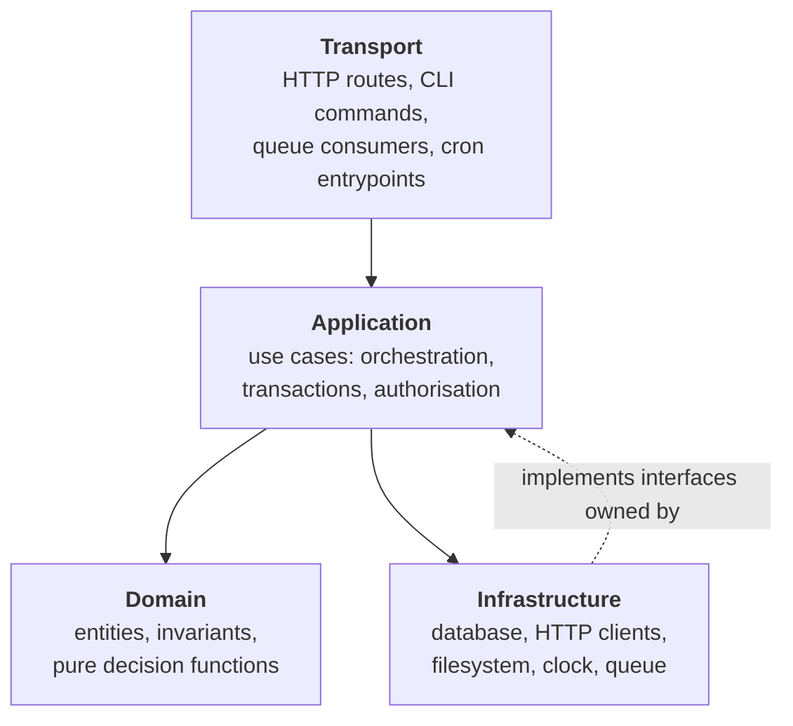

# Chapter 59 — Application Architecture and Project Layout

## What you will learn

- How to split a Node service into transport, application, domain, and infrastructure layers, and why the HTTP framework must be the thinnest of the four.
- How to do dependency injection with nothing but functions and closures, and why a DI container is usually the wrong trade in Node.
- Why import-time side effects destroy testability and startup ordering.
- How to load configuration once, validate it, and fail fast — with `--env-file` and `process.env` as inputs, not as an API.
- How `"imports"` and `"exports"` enforce module boundaries *inside* your own codebase, and when a workspace monorepo beats a single package.
- A feature-oriented directory layout that survives growth, plus a complete wiring example.

## Why this matters

Every Node service starts the same way: one file, a route handler, a database call inline. That works, until a second developer joins or a requirement arrives that says "also do this when an order ships." The handler grows a second responsibility, then a third, and eventually the only way to test the rule "you cannot ship an order twice" is to boot an HTTP server, open a database, and send a request.

That is the failure. Not the messy file — the fact that the *rule* and the *transport* became inseparable. Architecture in a Node service is almost entirely about keeping things separable: separable enough to test, to replace, and for a new person to find where a decision lives. Node gives you unusually good tools for this — closures, first-class functions, ESM's static graph, and `package.json` subpath imports — and almost none of them require a framework.

This chapter is opinionated. Where I state a preference I say so and give the reasoning, because the reasoning is what transfers.

## Four layers, and which one should be thin

The useful decomposition of a backend service has four layers. They differ in what they are allowed to know about.



**Domain** is pure. It knows your problem: what a shipment is, when it is valid, what a price becomes after a discount. It imports nothing from `node:` and nothing from npm except maybe a decimal library. It has no `async` unless the *problem* is asynchronous, which it almost never is.

**Application** is the use-case layer: one exported function per thing the system can do — `createShipment`, `cancelSubscription`, `reconcileInvoices`. It orchestrates (load through a port, call domain logic, persist, emit) and owns transaction boundaries and authorisation. It is `async`. It does not know what HTTP is.

**Infrastructure** is everything that talks to the outside: the database driver, the payment provider's client, `node:fs`, the system clock, the message queue. Each piece implements an interface the application layer defines.

**Transport** adapts a protocol to a use case: parse and validate the request, call one application function, map the result or error to a status code. Nothing else.

### Why transport must be the thinnest layer

Two reasons, both mechanical.

Transport code is the *least* testable code you own. To exercise it you need a server, a port, a client, and a serialisation round-trip. Business logic in a handler is business logic that is expensive to test, which means it will be under-tested, which means it will be wrong.

Transport code is also the most likely thing to be replaced. Over a service's life, HTTP frameworks get swapped, the same use case gets exposed as a CLI command for operations, a queue consumer gets bolted on for retries. If the use case lives in the handler, each of those is a rewrite. If the handler is six lines, each is six new lines.

Concretely, the shape to aim for:

```mjs
// src/shipments/transport/http.js
export function shipmentRoutes({ shipments }) {
  return {
    async create(req, res) {
      const body = await readJson(req);
      const result = await shipments.create({
        orderId: body.orderId,
        carrier: body.carrier,
        actor: req.auth.subject,
      });
      sendJson(res, 201, result);
    },
  };
}
```

There is no `if` about business state in there. If you catch yourself writing `if (order.status === 'shipped')` in a route handler, that condition belongs a layer or two down.

A caveat on dogma: for a service with three endpoints and no domain rules — a webhook receiver, a health-check proxy — four layers is overhead, and two files is fine. Layers earn their keep when there are invariants to protect. Introduce them at the first non-trivial rule, not before.

## Dependency injection without a framework

Every layer above needs to receive its collaborators from outside. That is all dependency injection means. In Node you get it for free with closures.

### Constructor injection with factory functions

```mjs
// src/shipments/app/service.js
export function createShipmentService({ repository, carrierApi, clock, logger }) {
  async function create({ orderId, carrier, actor }) {
    const existing = await repository.findByOrderId(orderId);
    if (existing) {
      throw new ShipmentAlreadyExists(orderId);
    }
    const label = await carrierApi.buyLabel({ orderId, carrier });
    const shipment = newShipment({ orderId, carrier, label, at: clock.now() });
    await repository.insert(shipment);
    logger.info({ orderId, shipmentId: shipment.id }, 'shipment created');
    return shipment;
  }

  return { create };
}
```

Note what this is not. It is not registered anywhere and it has no decorators. (A class with a constructor is exactly equivalent; use whichever your team reads more easily.) Its dependencies are visible in one destructuring pattern at the top, which means the cost of adding a dependency is visible too: if that object grows to eleven properties, the service is doing too much, and you can see it. Take dependencies as a single object rather than positional parameters — positional arguments make call sites unreadable at four or more, and inserting one in the middle silently breaks every caller.

### Why not a DI container

Container libraries — where you register providers by token and resolve them by type — are standard in Java and C#, and several exist for Node. My position: in Node they cost more than they pay, for three reasons.

First, the problem they solve is smaller here. A container's main value is resolving a deep object graph automatically. In a typical Node service the whole graph is thirty to sixty lines of explicit construction, written once, in one file. Thirty lines of boring code is cheaper than a dependency with its own lifecycle model.

Second, containers move errors from build time to run time. Hand-wired construction fails when you forget an argument — immediately, at boot, with a stack trace pointing at the line. Token-based resolution fails with "no provider for X," and if that resolution is lazy it may happen under load in production.

Third, containers in JavaScript usually need reflection metadata to infer types, which means decorators, which means a compile step and a specific TypeScript configuration. Node runs TypeScript by stripping types (stable since v25.2.0/v24.12.0, on by default; see [Chapter 7 — TypeScript in Node.js](../part1-foundations/07-typescript.md)), and type stripping intentionally cannot emit the runtime metadata decorator-based containers need. Choosing a container therefore also chooses you a build toolchain — a large consequence for a small benefit.

I would reconsider for a codebase with hundreds of services and genuine per-request scoping needs. If you get there, you will know. Until then, write the wiring.

### The composition root

Exactly one place is allowed to know how everything is built: the **composition root**. Every other module receives its dependencies. Keep two files apart:

- `src/app.js` — builds the object graph from a config object and returns handles. Starts nothing, reads no environment.
- `src/main.js` — the process entrypoint. Loads config, calls `buildApp`, starts listeners, installs signal handlers.

Tests want `buildApp` and do not want `main`. If building the graph is entangled with `listen()` and `process.on('SIGTERM')`, integration tests must fight the process lifecycle.

## The rule: no side effects at import time

**Importing a module must not do anything observable.** No connections opened, no files read, no `process.env` inspected, no timers started, no servers listening. A module body should define things. Doing things happens when someone calls a function.

This rule is worth more than any layering diagram, and here is why it bites so hard when you break it.

**It wrecks startup ordering.** Module bodies run in the order the graph is traversed, and the shape of your `import` statements decides that order, not you. In ESM the whole graph is evaluated before your first line of top-level code runs, and a module using top-level `await` blocks everything that depends on it. So a module that connects to Postgres at import time connects *before* config has been validated, before the logger exists, and before signal handlers are installed — and if it fails, you get a rejected promise from a module body with a stack trace that names nothing useful.

**It wrecks testability and reuse.** To import the module under test you must satisfy the side effect, so a unit test for a pure pricing function ends up needing `DATABASE_URL` because of a three-hop import chain. That is how test suites acquire a `docker compose up` prerequisite. And a module that reads `process.env.PORT` at import time can only ever be one server — you cannot start two on different ports in one process, which is exactly what a fast integration suite wants.

**It hides the bug behind caching.** Module instances are cached per resolved specifier, so the side effect runs once, at an unpredictable moment, and never again.

Rewrite:

```mjs
// ❌ side effect at import time
import { DatabaseSync } from 'node:sqlite';
export const db = new DatabaseSync(process.env.DATABASE_PATH);
```

```mjs
// ✅ a factory, called by the composition root
import { DatabaseSync } from 'node:sqlite';

export function openDatabase({ path }) {
  const db = new DatabaseSync(path);
  db.exec('PRAGMA journal_mode = WAL');
  return db;
}
```

The exception that proves the rule is the entrypoint itself. `src/main.js` is *supposed* to have effects — that is its whole job. Keep it small, keep it at the top of the graph, and never import it from anywhere.

`node:sqlite` is stability 1.2 (release candidate) as of Node 27, so pin your Node version if you depend on it; see [Chapter 54 — Built-in SQLite](../part8-advanced/54-sqlite.md).

## Configuration: one validated object, loaded once

The model: **`process.env` is an input to a parser, not an API.** Exactly one module reads it, at boot, and produces a frozen typed object. Nothing else in the codebase mentions `process.env`.

```mjs
// src/config.js
export function loadConfig(env = process.env) {
  const errors = [];

  function required(name) {
    const value = env[name];
    if (value === undefined || value === '') errors.push(`${name} is required`);
    return value;
  }

  function port(name, fallback) {
    const raw = env[name];
    if (raw === undefined) return fallback;
    const n = Number(raw);
    if (!Number.isInteger(n) || n < 1 || n > 65535) {
      errors.push(`${name} must be a port number, got ${JSON.stringify(raw)}`);
    }
    return n;
  }

  const config = Object.freeze({
    http: Object.freeze({
      port: port('PORT', 8080),
      shutdownGraceMs: port('SHUTDOWN_GRACE_MS', 15_000),
    }),
    database: Object.freeze({ path: required('DATABASE_PATH') }),
    carrier: Object.freeze({
      baseUrl: required('CARRIER_BASE_URL'),
      apiKey: required('CARRIER_API_KEY'),
    }),
  });

  if (errors.length > 0) {
    throw new Error(`Invalid configuration:\n  - ${errors.join('\n  - ')}`);
  }
  return config;
}
```

Four properties make this work:

1. **It is a function taking `env`.** Tests call `loadConfig({ PORT: '0', ... })` with no global state.
2. **It collects all errors.** Reporting one missing variable per restart is a miserable deployment loop.
3. **It coerces and validates types.** `process.env` values are always strings — and assigning a non-string to a property of `process.env` implicitly converts it, which has been deprecated since v10.0.0. Every number, boolean, and enum needs an explicit parse.
4. **It fails at boot, not at first use.** A missing `CARRIER_API_KEY` should stop the process before it accepts a connection, not produce a 500 at 3am on the first shipment.

That last point is fail-fast. A misconfigured process that starts and then fails per-request is worse than one that refuses to start, because orchestrators know how to handle the latter: the rollout stalls, the old version keeps serving, and someone gets a clean error.

### Feeding it: `--env-file`

Node loads `.env` files natively. `--env-file=file` (added v20.6.0; no longer experimental as of v24.10.0/v22.21.0) reads a file relative to the current directory and populates `process.env`. The precedence rules are specific and worth memorising:

| Situation | Winner |
|---|---|
| Variable set in the real environment *and* in the file | **The real environment** |
| Same variable in two `--env-file` arguments | **The later file** |
| File does not exist with `--env-file` | **Error** — process exits |
| File does not exist with `--env-file-if-exists` | Ignored, startup continues |

```bash
node --env-file=.env --env-file=.env.local src/main.js
```

Two details that catch people. First, `--env-file` **does** parse Node's own configuration variables from the file, including `NODE_OPTIONS`; `process.loadEnvFile(path)` (default `'./.env'`) does **not**, because by then the runtime has already booted. Second, variables loaded with `--env-file` are **not** applied to a command executed by `node --run`. If you want to layer files yourself, `util.parseEnv(content)` parses `.env` content to an object without touching `process.env`.

In containers, prefer real environment variables: a `.env` file inside an image is a secret baked into a layer. Use `--env-file` for local development and CI, the orchestrator's environment for production. Chapter 60 covers this in depth.

## Module boundaries with `imports` and `exports`

Layering is only real if it is enforced, and nothing stops a route handler from writing `import { db } from '../../../infra/db.js'` — nothing except `package.json`. Two fields from [Chapter 6 — Packages](../part1-foundations/06-packages-and-exports.md) do architectural work inside a single codebase.

**`"imports"`** defines private subpath mappings, resolvable only from within the package. Every entry must start with `#`:

```json
{
  "name": "@acme/shipping",
  "type": "module",
  "imports": {
    "#domain/*": "./src/shipments/domain/*.js",
    "#app/*": "./src/shipments/app/*.js",
    "#infra/*": "./src/shipments/infra/*.js",
    "#config": "./src/config.js"
  }
}
```

Now `import { newShipment } from '#domain/shipment.js'` works from any depth. That kills `../../../` chains, which matter more than they look: relative-depth imports make files impossible to move, and "impossible to move" is how a bad structure becomes permanent. `"imports"` may also map to external packages, so `#clock` can point at a real library and stay one edit away from a fake.

**`"exports"`** does the reverse: it defines the package's public surface and *blocks everything else*. Any path not listed cannot be imported from outside, even if the file exists on disk. That matters the moment you split into workspaces — a package exporting only `"."` cannot have its internals reached into by a sibling, and the enforcement is the resolver, not a lint rule someone can disable. Inside one package, `"exports"` also enables **self-referencing**: modules can `import '@acme/shipping/...'` by name, but only for paths `"exports"` allows.

Node does not enforce *layer direction* — nothing stops `#domain/*` from importing `#infra/*`. For that, add a lint rule restricting import patterns per directory. Node gives you stable names; the linter gives you the arrows.

## Monorepo or single package

"Workspaces" is a package-manager feature (npm, pnpm, Yarn), not a Node feature — Node has no concept of a workspace. What a package manager does is install shared dependencies once at the root and symlink each local package into `node_modules`, after which normal Node resolution takes over. Everything below follows from that.

| | Single package | Workspaces monorepo |
|---|---|---|
| Enforcing boundaries | Lint rules + `"imports"` | Resolver-enforced via `"exports"` |
| Adding a directory | Free | New `package.json`, new build/test entry |
| Refactoring across boundaries | One commit, one test run | One commit, but versioning and ordering to think about |
| Independent deployables | No | Yes |
| Independent dependency versions | No | Yes (and that is sometimes the point) |
| Tooling cost | Near zero | Real and ongoing |

My recommendation: **start with a single package**, using directories plus `"imports"` for structure. Move to workspaces on a concrete forcing function — two or more independently deployed artefacts that genuinely share code, a package you actually publish, or a hard dependency conflict where two parts need incompatible major versions of the same library. "It feels cleaner" is not a forcing function; a monorepo you did not need is a permanent tax on every refactor.

If you do split, split along deployment and ownership lines. `packages/api`, `packages/worker`, `packages/domain` is a good split. `packages/models`, `packages/utils`, `packages/services` is the same tangle with more `package.json` files, because every change touches all three.

## Organise by feature, not by technical role

The most common Node layout is by technical role:

```
src/
  controllers/
  services/
  models/
  routes/
  utils/
```

This is wrong for anything past a few endpoints, for a mechanical reason rather than an aesthetic one. Consider the change "shipments now need a tracking number": you edit `models/shipment.js`, `services/shipmentService.js`, `controllers/shipmentController.js`, `routes/shipments.js`. Four directories, and to review it you read four places. Meanwhile `services/` holds twenty unrelated files, so a directory listing tells you nothing about what the system does. Organise by feature and both problems invert:

```text
.
├── package.json              # "imports" map defines the internal boundaries
├── node.config.json          # optional: repo-wide Node flags (RC, see Ch. 60)
├── src
│   ├── main.js               # entrypoint: config → buildApp → listen → signals
│   ├── app.js                # composition root: builds the graph, starts nothing
│   ├── config.js             # the ONLY module that reads process.env
│   ├── platform              # cross-cutting, feature-agnostic
│   │   ├── http-server.js    # createServer + router, no business knowledge
│   │   ├── logger.js         # createLogger({ level, stream })
│   │   ├── errors.js         # AppError base + taxonomy (see Ch. 14)
│   │   └── clock.js          # { now(): Date } — injected, never imported directly
│   └── shipments             # ← a feature owns its whole vertical slice
│       ├── domain
│       │   ├── shipment.js         # pure: entity + invariants, no I/O
│       │   └── shipment.test.js    # fast: no server, no database
│       ├── app
│       │   └── service.js          # use cases; owns the port interfaces
│       ├── infra
│       │   ├── repository.sqlite.js
│       │   └── carrier-api.js
│       └── transport
│           ├── http.js             # route handlers, ~6 lines each
│           └── http.test.js        # integration: real server, fake infra
└── test
    └── helpers
        └── build-test-app.js       # buildApp with fakes swapped in
```

Now the tracking-number change touches `src/shipments/` and nothing else. Deleting a feature is `rm -rf` on one directory plus one line in the composition root. A new engineer asking "where does shipping live" gets an answer from `ls src`.

Two refinements keep this honest. **Tests live next to the code they test** — Node's built-in runner discovers `*.test.js` anywhere ([Chapter 45 — The Built-in Test Runner](../part7-diagnostics/45-test-runner.md)), so a parallel test tree buys nothing and guarantees drift. And **`platform/` is not `utils/`**: `platform/` holds things with a defined role — a logger, a clock, an HTTP server wrapper — while `utils/` is where functions go when nobody decided where they belong.

### Where types go

Same principle: **types live with the code that owns them.** `interface Shipment` belongs in `src/shipments/domain/shipment.ts`, not a global `types/` directory. A central `types/` folder is a coupling magnet — everything imports it, so unrelated concepts end up sitting together and everything depends on everything. Reserve top-level type files for genuine ambient declarations (`*.d.ts` for untyped dependencies) and contracts shared between workspace packages.

If you rely on Node's built-in type stripping, only *erasable* syntax runs: no `enum`, no parameter properties, no legacy namespaces. Set `"erasableSyntaxOnly": true` in `tsconfig.json` so TypeScript tells you at check time instead of Node telling you at run time. Node ignores `tsconfig.json` entirely, so `paths` aliases do not work — another argument for `"imports"`, which Node *does* resolve.

## Error taxonomy at the architecture level

[Chapter 14 — Errors](../part2-async/14-errors.md) covers error classes and codes. The architectural question is different: **which layer decides what an error means?** The rule that works: the layer that knows the *meaning* creates the error, and transport maps meaning to protocol. Define a small closed set in `platform/errors.js`:

| Category | Raised by | HTTP mapping | Retryable |
|---|---|---|---|
| `ValidationError` | transport / application | 400 | No |
| `NotFoundError` | application | 404 | No |
| `ConflictError` (invariant violated) | domain / application | 409 | No |
| `ForbiddenError` | application | 403 | No |
| `DependencyError` (upstream failed) | infrastructure | 502 / 503 | Yes |
| anything else | bug | 500 | No |

The mapping table lives in exactly one place — the transport layer's error handler — and every route funnels through it. The domain never imports an HTTP status code. Infrastructure wraps driver-specific errors (`SQLITE_CONSTRAINT`, `ECONNREFUSED`) into the taxonomy at the boundary, using `cause` to keep the original, so the application layer never switches on a database error code.

One line of policy: **an unrecognised error is a bug, and bugs return 500 and get logged with a stack.** Never add a catch-all that turns unknown errors into 400s — that converts your bugs into the client's problem and hides them from your error rate.

## Ports and adapters, pragmatically

The repository pattern gets a bad reputation from implementations that add five files to save zero work. Used pragmatically it is the previous rules applied to I/O: a **port** is an interface owned by the application layer, expressed in domain terms, and an **adapter** is an infrastructure implementation of it.

```mjs
// The port, as consumed by src/shipments/app/service.js:
//   findByOrderId(orderId) -> Promise<Shipment | null>
//   insert(shipment)       -> Promise<void>

// src/shipments/infra/repository.sqlite.js
export function createShipmentRepository({ db }) {
  const selectByOrder = db.prepare(
    'SELECT id, order_id, carrier, label, created_at FROM shipments WHERE order_id = ?',
  );
  const insertRow = db.prepare(
    'INSERT INTO shipments (id, order_id, carrier, label, created_at) VALUES (?, ?, ?, ?, ?)',
  );

  return {
    async findByOrderId(orderId) {
      const row = selectByOrder.get(orderId);
      return row ? toShipment(row) : null;
    },
    async insert(shipment) {
      insertRow.run(
        shipment.id,
        shipment.orderId,
        shipment.carrier,
        shipment.label,
        shipment.createdAt.toISOString(),
      );
    },
  };
}
```

Three constraints keep this from becoming ceremony:

1. **The port speaks the domain, not the database.** `findByOrderId`, not `query(sql)`. A repository exposing a generic query method is not a port and buys you nothing.
2. **One repository per aggregate, not per table.** A repository that loads a shipment with its items is a boundary; a repository per table is a second ORM.
3. **Do not abstract what you will never swap.** Ports are for things with a plausible second implementation — and "an in-memory fake for tests" counts, which is why databases and third-party HTTP APIs qualify and `node:path` does not.

The methods are `async` even though `node:sqlite` is synchronous. That is deliberate: the port's contract must be one a network-backed adapter can satisfy, or switching to Postgres later changes every caller.

## Testability as a design constraint

Treat "can I test this without a network" as a design requirement, not a testing concern — it is "can I replace this," restated.

A **seam** is a place where you can substitute behaviour without editing the code under test. In this architecture the seams are exactly the parameters of the factory functions — that is the payoff for constructor injection.

**Fakes versus mocks.** A fake is a working implementation with a shortcut: an in-memory repository backed by a `Map`. A mock is a recording object that asserts on calls. Use fakes for anything with state, and mocks only for pure notification boundaries where the call *is* the effect (an email sent, a metric incremented). Mock-heavy tests assert on the interaction rather than the outcome, so they pass when the code is wrong in a way you happened to encode, and fail when the code is right but refactored. A fake repository lets the test assert what you actually care about: *after calling `create` twice, there is one shipment and the second call threw `ConflictError`*.

Where to spend integration tests:

| Test kind | Boots | Covers | Should be |
|---|---|---|---|
| Domain unit | nothing | invariants, calculations | hundreds, milliseconds total |
| Application | fakes only | orchestration, error mapping | dozens, fast |
| Transport integration | real HTTP server + fake infra | routing, serialisation, status codes | one or two per route |
| Contract / infra | real database, real driver | that adapters honour their port | one suite per adapter |
| End-to-end | everything | the two or three paths that must never break | a handful |

Transport integration tests are the ones people skip, and they are cheap here: `buildApp` with fake infrastructure, `server.listen(0)` for an ephemeral port, a real `fetch` against it. Because nothing reads `process.env` or listens at import time, you can run several concurrently in one process.

## Background jobs: in-process or separate?

Sooner or later something must happen on a schedule. The decision is whether it runs inside the web process.

**Run it in the web process when** the work is short, idempotent, low-volume, and you run exactly one instance. A cache refresh every five minutes qualifies.

**Run it as a separate process when** any of these hold, and my strong default is that at least one will:

- **You run more than one replica.** A `setInterval` in a service scaled to four pods runs four times. Every scheduled job in a replicated web process needs a distributed lock — and if you are building a distributed lock, you have already accepted the complexity of a separate worker.
- **The work is CPU-heavy.** The event loop is shared; a five-second synchronous job stalls every in-flight request. Worker threads are the in-process answer ([Chapter 29](../part4-system/29-worker-threads.md)), but a separate process also gives you separate scaling and separate memory limits.
- **Failure semantics or scaling drivers differ.** Requests fail fast and the client retries; jobs need durable retry with backoff and a dead-letter destination. Web scales with request rate, workers with queue depth — one process means scaling on the wrong signal.

Structurally this is nearly free here: a worker is a *different transport* over the *same* application layer. `src/main.js` and `src/worker.js` both call `buildApp` and attach different adapters. The use cases do not change.

## Startup ordering and honest health checks

The composition root gives you explicit control over startup order. Use it:

1. Load and validate configuration. Exit non-zero on failure, before anything else exists.
2. Create the logger. Everything after this can report failures properly.
3. Install signal handlers and last-resort error handlers.
4. Open infrastructure: database pool, queue connection. These may fail; fail fast.
5. Build the application and transport layers. No I/O here.
6. Start listening.

Step 6 last, always. A server that accepts connections before its database is open answers requests it cannot serve.

Health checks must distinguish two questions, and conflating them causes outages:

**Liveness — "is this process broken beyond repair?"** Return 200 and nothing else. It must not check the database: if the database is briefly unavailable, a database-checking liveness probe makes the orchestrator kill every replica at once, turning a recoverable blip into a restart storm at the worst possible moment. A dependency being down is not fixed by restarting you.

**Readiness — "should traffic come to me right now?"** This one *may* check dependencies, and it must reflect draining state:

```mjs
// src/platform/health.js
export function createHealthEndpoints({ readiness }) {
  return {
    live(req, res) {
      res.writeHead(200, { 'content-type': 'text/plain' }).end('ok');
    },
    async ready(req, res) {
      const ok = !readiness.draining && (await readiness.check());
      res.writeHead(ok ? 200 : 503, { 'content-type': 'text/plain' })
        .end(ok ? 'ready' : 'not ready');
    },
  };
}
```

The `draining` flag is the important half. On `SIGTERM`, set `draining = true` *first*, keep serving for a few seconds so load balancers observe the failing probe and stop sending new requests, and only then stop accepting connections. Flipping readiness and closing the listener in the same tick guarantees a burst of connection errors. See [Chapter 26 — Signals, Graceful Shutdown, and Process Lifecycle](../part4-system/26-signals-and-shutdown.md).

Keep the readiness check cheap and cached. A probe that runs `SELECT 1` on every call, once per second per replica, is a load source of its own — one that spikes exactly when the database is already struggling.

## Putting it together: a complete wiring example

The composition root builds everything and starts nothing:

```mjs
// src/app.js
import { createLogger } from '#platform/logger.js';
import { openDatabase } from '#infra/database.js';
import { createShipmentRepository } from '#infra/repository.sqlite.js';
import { createCarrierApi } from '#infra/carrier-api.js';
import { createShipmentService } from '#app/service.js';
import { shipmentRoutes } from '#transport/http.js';
import { createHttpServer } from '#platform/http-server.js';
import { createHealthEndpoints } from '#platform/health.js';

export function buildApp(config, overrides = {}) {
  const logger = overrides.logger ?? createLogger({ level: config.logLevel });
  const clock = overrides.clock ?? { now: () => new Date() };
  const db = overrides.db ?? openDatabase({ path: config.database.path });

  const repository = overrides.repository ?? createShipmentRepository({ db });
  const carrierApi = overrides.carrierApi ?? createCarrierApi({
    baseUrl: config.carrier.baseUrl,
    apiKey: config.carrier.apiKey,
    logger,
  });

  const shipments = createShipmentService({ repository, carrierApi, clock, logger });

  const readiness = {
    draining: false,
    async check() {
      return db.isOpen;
    },
  };

  const server = createHttpServer({
    routes: { ...shipmentRoutes({ shipments }), ...createHealthEndpoints({ readiness }) },
    logger,
  });

  return {
    server,
    readiness,
    logger,
    async close() {
      db.close();
    },
  };
}
```

Entrypoint — the only file with effects:

```mjs
// src/main.js
import { setTimeout as delay } from 'node:timers/promises';
import process from 'node:process';
import { loadConfig } from '#config';
import { buildApp } from './app.js';

let config;
try {
  config = loadConfig(process.env);
} catch (err) {
  console.error(err.message);
  process.exit(78); // EX_CONFIG
}

const app = buildApp(config);

process.on('unhandledRejection', (reason) => {
  app.logger.error({ err: reason }, 'unhandled rejection');
  process.exitCode = 1;
  shutdown('unhandledRejection');
});

let shuttingDown = false;
async function shutdown(signal) {
  if (shuttingDown) return;
  shuttingDown = true;
  app.logger.info({ signal }, 'shutting down');

  app.readiness.draining = true;          // 1. fail readiness first
  await delay(config.http.drainDelayMs);  // 2. let the load balancer notice
  app.server.close();                     // 3. stop accepting new connections
  app.server.closeIdleConnections();      // 4. release idle keep-alive sockets
  await delay(config.http.shutdownGraceMs);
  app.server.closeAllConnections();       // 5. force the stragglers
  await app.close();
}

process.on('SIGTERM', () => shutdown('SIGTERM'));
process.on('SIGINT', () => shutdown('SIGINT'));

app.server.listen(config.http.port, () => {
  app.logger.info({ port: config.http.port }, 'listening');
});
```

Test helper — same graph, fake edges:

```mjs
// test/helpers/build-test-app.js
import { buildApp } from '#root/src/app.js';
import { createFakeRepository } from './fake-repository.js';

export function buildTestApp(overrides = {}) {
  const config = {
    logLevel: 'silent',
    http: { port: 0, drainDelayMs: 0, shutdownGraceMs: 0 },
    database: { path: ':memory:' },
    carrier: { baseUrl: 'http://carrier.test', apiKey: 'test-key' },
  };
  return buildApp(config, {
    repository: createFakeRepository(),
    carrierApi: { async buyLabel() { return 'LBL-TEST-1'; } },
    clock: { now: () => new Date('2026-01-01T00:00:00Z') },
    ...overrides,
  });
}
```

Note `closeIdleConnections()` and `closeAllConnections()`: with `server.keepAliveTimeout` defaulting to 65 seconds in current Node, `server.close()` alone waits for idle keep-alive sockets to time out and your shutdown takes over a minute. See [Chapter 36 — HTTP Clients, Agents, and Keep-Alive](../part5-networking/36-http-clients.md).

## Common mistakes

### ❌ Reading `process.env` deep inside a module

```mjs
// src/shipments/infra/carrier-api.js
const API_KEY = process.env.CARRIER_API_KEY; // read at import time
export async function buyLabel(order) { /* uses API_KEY */ }
```

Three things break at once: the module cannot be tested without setting a global; the variable is read before validation, so a typo produces `undefined` and a 401 in production instead of a boot failure; and you cannot have two differently-configured carrier clients in one process.

```mjs
// ✅ configuration arrives as an argument
export function createCarrierApi({ baseUrl, apiKey, logger }) {
  if (!apiKey) throw new TypeError('createCarrierApi: apiKey is required');
  return {
    async buyLabel({ orderId, carrier }) {
      const res = await fetch(new URL('/labels', baseUrl), {
        method: 'POST',
        headers: { authorization: `Bearer ${apiKey}`, 'content-type': 'application/json' },
        body: JSON.stringify({ orderId, carrier }),
      });
      if (!res.ok) throw new DependencyError(`carrier responded ${res.status}`);
      return (await res.json()).labelId;
    },
  };
}
```

### ❌ Exporting a live singleton instead of a factory

```mjs
// src/platform/db.js
export const db = await connect(process.env.DATABASE_URL); // top-level await
```

Top-level `await` in a module body blocks evaluation of every module that imports it, directly or transitively. Import order now determines connection order, a failed connect rejects with no useful frame, and a unit test of a pure function drags a database into the graph. Worst of all it is invisible — nothing at the call site suggests `import { db }` opened a socket.

```mjs
// ✅ export the recipe, not the result
export async function connectDatabase({ url, logger }) {
  const client = await connect(url);
  logger.info({ url: redact(url) }, 'database connected');
  return client;
}
```

### ❌ Liveness probes that check dependencies

```mjs
// ❌ /healthz
app.get('/healthz', async (req, res) => {
  await db.query('SELECT 1');       // liveness now depends on Postgres
  await redis.ping();
  res.send('ok');
});
```

If Postgres has a 30-second failover, every replica fails liveness at once and the orchestrator restarts all of them, adding a cold-start stampede to an already-recovering database. Restarting the process does not fix someone else's outage.

```mjs
// ✅ liveness is about this process only; readiness is about traffic
health.live = (req, res) => res.writeHead(200).end('ok');
health.ready = async (req, res) => {
  const ok = !state.draining && (await cachedDependencyCheck());
  res.writeHead(ok ? 200 : 503).end();
};
```

### ❌ Layers that import upward

```mjs
// src/shipments/domain/shipment.js
import { repository } from '#infra/repository.sqlite.js'; // domain reaching for I/O
```

Once the domain imports infrastructure the dependency arrow reverses and the pure layer stops being pure: you cannot test an invariant without a database, and the "swap the adapter" property is gone. Make the illegal direction a build failure with a lint rule on import patterns — code review will not catch it forever.

```mjs
// ✅ domain takes what it needs as arguments; the application layer does the loading
export function ensureNotAlreadyShipped(existingShipment, orderId) {
  if (existingShipment) throw new ConflictError(`order ${orderId} already shipped`);
}
```

## Production notes

- **Boot failures must be loud and non-zero.** Exit with a distinct non-zero code on configuration failure (`78` is the conventional `EX_CONFIG`) and print every problem. Orchestrators treat a fast non-zero exit as a failed rollout and hold the previous version; a process that starts and 500s does not get that protection.
- **The composition root is where memory leaks are born.** Anything with a lifecycle — pools, intervals, watchers, subscriptions — must be created in `buildApp` and closed in `close()`. A test suite that calls `buildApp` a hundred times without closing will show you every leak you have.
- **Feature folders change your incident response.** When an alert names a use case, `ls src` maps it to a directory and `git log -- src/shipments` gives the history for exactly that surface. A role-based layout makes the same question a four-directory reconstruction.
- **Boundaries cost nothing at runtime and something at startup.** `"imports"` and `"exports"` resolve once per specifier at load time. Module *count* is what costs: a graph of 4,000 tiny files is measurably slower to start than 400. If startup matters, consider `NODE_COMPILE_CACHE` (Chapter 60).
- **Injected clocks pay off in production, not just tests.** A `clock` port lets you freeze time in tests *and* swap in a monotonic clock for latency measurement without touching call sites.
- **Do not fail-fast on optional dependencies.** Fail fast on anything required to serve *correctly*; degrade on anything required only to serve *completely*. Encode which is which in config and log loudly on degradation.

## Exercises

1. **Extract the config module.** Take a service that reads `process.env` in five places and write a `loadConfig(env)` that validates all of them, collects every error, and freezes the result. *Success criterion:* `grep -rn "process.env" src/` returns exactly one hit, and starting with a missing variable prints all missing variables and exits non-zero.

2. **Add internal subpath imports.** Add an `"imports"` map with at least three `#`-prefixed entries and rewrite every relative import that climbs two or more directories. *Success criterion:* `grep -rn "\.\./\.\./" src/` is empty and the tests still pass.

3. **Split a route handler into layers.** Move the logic of your fattest handler into an application function taking its dependencies as an object, leaving the handler at parse-call-respond. *Success criterion:* a test of the new function runs with fakes only, boots no server, and takes under 10 ms.

4. **Build the test harness.** Write `buildTestApp` that constructs the real graph with a fake repository and a frozen clock, then a transport integration test that listens on port `0` and drives a real HTTP request through it. *Success criterion:* two such tests run concurrently in one process without port conflicts.

5. **Honest health checks with draining.** Implement `/livez` and `/readyz` per this chapter and wire `SIGTERM` to flip readiness before closing the listener. *Success criterion:* after `SIGTERM`, `/readyz` returns 503 while an in-flight request that started before the signal still completes with a 200.

## Recap

- Four layers: transport, application, domain, infrastructure. Dependencies point inward; transport is thinnest because it is hardest to test and likeliest to be replaced.
- Do dependency injection with factory functions and closures, wired in one composition root. A DI container in Node usually costs a build toolchain and saves thirty lines.
- Never do observable work in a module body. Import defines; calling does.
- Load configuration once into a validated frozen object and fail fast with every error at once. Real environment variables beat `--env-file` values; later files beat earlier ones.
- `"imports"` gives stable internal names and kills `../../../`; `"exports"` makes a package boundary resolver-enforced. Node does not enforce layer *direction* — add a lint rule. Start as one package; move to workspaces only for independently deployed artefacts, a published package, or a real dependency conflict.
- Organise by feature: a change should touch one directory, and `ls src` should describe the system.
- Define ports where a second implementation is plausible — a test fake counts. Prefer fakes over mocks. Move scheduled and heavy work out of the web process once you run more than one replica.
- Liveness means "restart me"; readiness means "send me traffic." Never check dependencies in liveness, and flip readiness to failing before you stop accepting connections.

## Where to go next

- [Chapter 6 — Packages: `package.json`, exports, imports, dual publishing](../part1-foundations/06-packages-and-exports.md) — the resolution rules behind `"imports"` and `"exports"`.
- [Chapter 14 — Errors: Classes, Codes, and Handling Strategies](../part2-async/14-errors.md) — building the error taxonomy this chapter maps to status codes.
- [Chapter 26 — Signals, Graceful Shutdown, and Process Lifecycle](../part4-system/26-signals-and-shutdown.md) — the mechanics of the shutdown sequence.
- [Chapter 45 — The Built-in Test Runner](../part7-diagnostics/45-test-runner.md) — running the test pyramid described here without extra dependencies.
- [Chapter 60 — Deployment, Containers, and Configuration](60-deployment-and-config.md) — how this structure meets an orchestrator.
- Official docs: <https://nodejs.org/docs/latest/api/packages.html> and <https://nodejs.org/docs/latest/api/cli.html>
