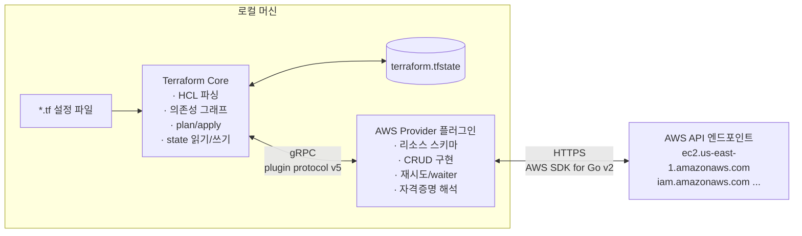

# 1장 — Terraform과 AWS Provider: 무엇을 대신해 주는가

**이 장에서 배우는 것**

- 콘솔 클릭으로 만든 인프라가 왜 반년 뒤에 재현되지 않는지 설명할 수 있다.
- Terraform Core와 AWS provider가 서로 다른 프로세스이며, 각각 무엇을 책임지는지 구분할 수 있다.
- `required_providers` 블록의 `source` 주소와 `version` 제약이 정확히 무엇을 결정하는지 읽어낼 수 있다.
- AWS provider가 제공하는 다섯 가지 구성요소(resource, data source, ephemeral resource, list resource, provider function)를 목적에 따라 골라 쓸 수 있다.
- AWS provider와 AWSCC provider를 언제 함께 쓰는지 판단할 수 있고, Terraform으로 하면 안 되는 일을 미리 걸러낼 수 있다.

**왜 중요한가**

금요일 밤에 결제 서비스가 죽었다고 하자. 원인은 프로덕션 VPC의 어떤 security group에서 인바운드 규칙 하나가 사라진 것이다. CloudTrail을 뒤지면 누가 지웠는지는 나온다. 문제는 그다음이다 — 그 규칙이 원래 무엇이었는지 아는 사람이 없다. 포트가 8080이었는지 8443이었는지, source가 CIDR였는지 다른 security group 참조였는지. 콘솔로 만든 인프라에는 "원래 상태"라는 개념이 없다. 현재 상태만 있을 뿐이고, 그 현재 상태는 방금 누군가가 망가뜨렸다.

두 번째 상황. 스테이징을 프로덕션과 똑같이 만들어 달라는 요청이 온다. 콘솔을 열고 프로덕션 설정을 하나씩 베껴 적는다. 서브넷 6개, 라우팅 테이블 4개, NAT gateway 2개, security group 11개, IAM role 9개. 반나절이 걸리고, 그렇게 만든 스테이징은 프로덕션과 "거의" 같다. 그 "거의"가 문제다. 스테이징에서는 되는데 프로덕션에서는 안 되는 버그가 이후 1년 동안 팀의 시간을 갉아먹는다. 무엇이 다른지 아무도 목록으로 뽑을 수 없기 때문이다.

세 번째 상황. 누군가 프로덕션 RDS 인스턴스의 백업 보존 기간을 7일에서 1일로 바꿨다. 콘솔에서는 클릭 세 번이었고 리뷰도 승인도 없었다. 이 변경은 사고가 나기 전까지 아무도 모른다. 코드였다면 pull request가 열리고 diff에 `backup_retention_period = 7` -> `1` 이 찍혔을 것이다.

세 사고의 공통 원인은 하나다. `CreateVpc` 든 `ModifyDBInstance` 든, 콘솔 클릭은 AWS에 **결과만** 남기고 **의도**(왜 이 값인가), **관계**(이 subnet은 저 VPC에 속한다), **동일성 판정 기준**(지금 상태가 우리가 원한 상태인가)을 남기지 않는다. Terraform은 이 셋을 각각 설정 파일, 의존성 그래프, state로 붙잡는다. 그래프는 [6장](06-references-and-dependencies.md), state는 [9장](09-state-basics.md)에서 다룬다. 그리고 그 선언을 실제 AWS API 호출로 번역하는 부품이 이 교재의 주인공, AWS provider다.

## Terraform Core와 provider는 다른 프로그램이다

많은 입문자가 "Terraform이 AWS에 리소스를 만든다"고 이해하는데 이건 절반만 맞다.

**Terraform Core**(`terraform` 이라는 실행 파일)는 AWS API를 단 한 번도 호출하지 않는다. Core가 아는 것은 HCL 문법, 의존성 그래프, state 파일 형식, plan/apply 라이프사이클뿐이다. Core에게 `aws_vpc` 는 그냥 "이름이 `aws_vpc` 인 어떤 타입"이고, `cidr_block` 이 무슨 뜻인지도 모른다.

**AWS provider**(`terraform-provider-aws` 라는 별도의 실행 파일)는 반대다. 그래프도 모르고 state 파일도 직접 건드리지 않는다. provider가 아는 것은 AWS SDK for Go v2를 통한 API 호출, 각 리소스 타입의 스키마, 그리고 "이 값이 바뀌면 수정으로 되는가 아니면 지우고 새로 만들어야 하는가" 같은 리소스별 지식이다.

이 둘은 **서로 다른 OS 프로세스**로 뜬다. `terraform init` 은 Registry에서 provider 바이너리를 내려받아 `.terraform/providers/` 아래에 놓고, `terraform plan` 은 그 바이너리를 자식 프로세스로 띄운 뒤 로컬 gRPC 채널로 대화한다. 그 대화의 규격이 Terraform 플러그인 프로토콜이고, 저장소의 `terraform-registry-manifest.json` 에 버전이 명시되어 있다.

```json
{
  "version": 1,
  "metadata": {
    "protocol_versions": ["5.0"]
  }
}
```

`protocol_versions` 가 `5.0` 이라는 것은 이 provider가 플러그인 프로토콜 v5로 Core와 대화한다는 뜻이다. Core와 provider가 각자 릴리스되면서도 서로 호환될 수 있는 이유가 여기 있다.



이 분리를 이해하면 실무에서 마주치는 여러 현상이 한 번에 설명된다.

- 에러 메시지가 두 종류로 나뉜다. `Error: Unsupported argument` 는 문법·스키마 단계의 문제이고, `Error: creating EC2 VPC: InvalidVpcRange` 처럼 AWS 서비스 이름이 등장하면 이미 AWS에 요청이 나갔다는 뜻이다.
- `TF_LOG=DEBUG` 를 켜면 Core 로그와 provider 로그가 접두어로 구분되어 나온다. 어느 쪽이 문제인지 가르는 첫 단서다. [41장 — 디버깅](../level3-advanced/41-debugging.md)에서 다룬다.
- provider가 크래시하면 Core는 살아 있고 `Plugin did not respond` 류의 메시지를 낸다. 프로세스가 둘이기 때문에 가능한 증상이다.

### provider 내부는 하나가 아니다

AWS provider 자체도 단일한 구현이 아니다. 기여자 문서는 신규 기여에 **Terraform Plugin Framework 사용을 필수**로 못박고 있고, 기존에 Terraform Plugin SDK v2로 구현된 리소스는 그대로 남아 있다. 두 세계가 공존하는 이유는 provider가 **mux**(멀티플렉서) 구조로 두 서버를 하나의 provider인 것처럼 함께 서빙하기 때문이다. 사용자에게 이 사실이 드러나는 순간은 에러 메시지 형태가 리소스마다 다를 때다([42장](../level3-advanced/42-provider-architecture.md)).

## Registry, source 주소, 그리고 버전 제약

Core는 어떤 provider를 어디서 받아야 하는지 어떻게 알까. `terraform` 블록의 `required_providers` 가 그 답이다. 공식 문서가 첫 예제로 제시하는 형태는 이렇다.

```terraform
terraform {
  required_providers {
    aws = {
      source  = "hashicorp/aws"
      version = "~> 6.0"
    }
  }
}

provider "aws" {
  region = "us-east-1"
}
```

여기에 서로 다른 층위의 이름이 네 개 등장한다. 분해해 보자.

**`aws =` 의 `aws`** — 이 설정 안에서 쓸 **로컬 이름**이자 `resource "aws_vpc"` 의 타입 접두어와 매칭되는 이름이다.

**`source = "hashicorp/aws"`** — Registry에서의 **주소**다. 생략된 형태이고 완전한 형태는 `registry.terraform.io/hashicorp/aws` 다. `<호스트>/<네임스페이스>/<타입>` 구조이므로 사내 private registry를 쓰면 호스트 부분이 바뀐다. `hashicorp` 는 네임스페이스이지 "공식 인증 마크"가 아니라는 점을 기억해 두자 — 누구나 자기 네임스페이스에 `aws` 라는 이름의 provider를 올릴 수 있다. source 주소를 정확히 적는 것이 공급망 관점의 첫 방어선이다.

**`version = "~> 6.0"`** — 버전 제약이다. 이 표기(pessimistic constraint operator)는 "마지막 자리만 올라가는 것을 허용한다"는 뜻이다. `~> 6.0` 은 `>= 6.0, < 7.0` 이므로 6.1, 6.12, 6.99까지 허용하고 7.0은 막는다. 반면 `~> 6.1.0` 은 `>= 6.1.0, < 6.2.0` 이라서 패치 릴리스만 허용한다.

**`provider "aws" { ... }`** — 이건 "어느 provider를 받을지"가 아니라 "받아 온 provider를 **어떻게 설정할지**"를 적는 블록이다. region, 자격증명, 재시도 횟수, 태그 기본값이 여기 들어간다. 전체 인수는 [4장 — provider 블록과 자격증명](04-provider-block-and-auth.md)에서 다룬다.

### 버전 제약을 느슨하게 두면 생기는 일

`version` 을 아예 적지 않으면 Core는 "아무 버전이나 최신"을 받는다. 6개월 뒤 새 팀원이 `terraform init` 을 돌리는 순간 v7이 내려오고, 그날 plan에 100줄짜리 교체 계획이 뜬다. 실제로 v6로 넘어올 때 OpsWorks Stacks·SimpleDB·Worklink 리소스가 제거됐고, `aws_ami` 데이터 소스는 `owners` 또는 `image-id`/`owner-id` 필터를 요구하도록 바뀌었다.

반대로 `version = "6.4.0"` 처럼 완전히 고정하는 것도 답이 아니다. 보안 수정 패치를 못 받고 팀 전체가 수동으로 버전을 올려야 한다. 정답은 두 층으로 나누는 것이다 — 설정 파일에는 `~> 6.0` 같은 **범위**를 적고, 실제로 쓰이는 정확한 버전은 `.terraform.lock.hcl` 이 고정한다([2장](02-install-and-first-run.md)).

`required_providers` 는 provider 버전을 다루지만, Terraform CLI 자체의 버전은 `required_version` 으로 따로 건다.

```terraform
terraform {
  required_version = ">= 1.12"
  # ... required_providers ...
}
```

CLI 버전이 중요한 이유는 언어 기능이 CLI 쪽에 있기 때문이다. `identity` 를 쓰는 `import` 블록은 Terraform v1.12.0 이상에서만 동작하고, `list` 블록을 이용한 리소스 쿼리는 Terraform 1.14에서 도입됐다. provider가 아무리 최신이어도 CLI가 낮으면 그 기능은 쓸 수 없다.

## 1,691개라는 숫자가 뜻하는 것

공식 provider 문서는 규모를 이렇게 적는다 — **리소스 1,691개, ephemeral 리소스 10개, list 리소스 183개, 데이터 소스 673개.** 합치면 2,557개의 문서 페이지다.

이 숫자를 처음 보면 겁이 나지만 오히려 마음이 편해질 일이다. **전부 외우는 것은 애초에 불가능하고, 아무도 그렇게 하지 않는다.** 익혀야 할 것은 세 가지다.

**첫째, 문서 페이지의 구조.** AWS provider의 모든 리소스 문서는 같은 골격을 갖는다. Example Usage -> Argument Reference -> Attribute Reference -> (Timeouts) -> Import. 이 골격을 알면 처음 보는 리소스도 필요한 정보를 곧바로 뽑을 수 있다. 예를 들어 `aws_subnet` 문서의 Timeouts 절에는 `create` 기본값 `10m`, `delete` 기본값 `20m` 가 적혀 있다. 외우는 게 아니라 찾는 것이다. 문서 읽는 법에는 [14장](14-reading-resource-docs.md)을 통째로 할애했다.

**둘째, 표기의 의미.** `(Required)`, `(Optional)`, `(Optional, Forces new resource)`, `(Optional, default "/")` — 이 괄호 안이 실무에서 가장 비싼 정보다. 특히 `Forces new resource` 는 "이 값을 바꾸면 리소스가 삭제 후 재생성된다"는 뜻이고, 프로덕션 데이터베이스에서 이걸 모르고 값을 바꾸면 그날이 장애일이다. `aws_security_group` 의 `description` 이 그런 인수다 — AWS에 업데이트 API가 없어서 provider도 교체 외에 방법이 없다.

**셋째, 리소스가 어떻게 쪼개지는지에 대한 감각.** AWS provider는 대체로 "AWS API 한 개 = 리소스 한 개"에 가깝게 설계된다. 그래서 콘솔의 S3 버킷 설정 탭 하나가 `aws_s3_bucket`, `aws_s3_bucket_versioning`, `aws_s3_bucket_policy` 등으로 갈라진다. 이 분리의 이유는 [12장 — S3 버킷](12-s3-bucket.md)에서 다룬다.

## 다섯 가지 구성요소

`aws` provider가 Terraform 설정 안으로 들여보내는 것은 리소스만이 아니다. 다섯 종류가 있고, 각각 쓰임이 다르다.

### 1. resource — 내가 만들고, 내가 책임진다

```terraform
resource "aws_vpc" "main" {
  cidr_block = "10.0.0.0/16"

  tags = {
    Name = "main"
  }
}
```

Terraform이 생성하고, 변경하고, 최종적으로 삭제까지 책임지는 대상이다. state에 기록되고, 설정에서 이 블록을 지우면 다음 apply에서 AWS의 실물도 사라진다.

`aws_vpc` 문서가 알려 주는 사실 몇 가지 — `cidr_block` 은 Optional이다(IPAM에서 유도할 수 있으므로). `enable_dns_support` 의 기본값은 true인데 `enable_dns_hostnames` 의 기본값은 false다. 이 비대칭을 모르면 EC2 인스턴스에 DNS 이름이 안 붙는 이유를 한참 찾게 된다. `region` 인수도 Optional로 존재하는데 v6.0.0에서 추가된 것이며, 값을 바꾸면 리소스가 교체된다([24장](../level2-intermediate/24-enhanced-region-support.md)).

### 2. data source — 남이 만든 것을 읽는다

```terraform
data "aws_availability_zones" "available" {
  state = "available"
}
```

읽기 전용이다. 생성도 삭제도 하지 않고 매 plan마다 AWS를 조회해 최신 값을 가져온다. 673개가 있다([8장](08-data-sources.md)).

주의할 점은 이름이 겹친다는 것이다. `aws_vpc` 는 리소스로도 있고 데이터 소스로도 있으며, 앞에 `resource` 가 붙었는지 `data` 가 붙었는지가 전부를 가른다. 참조할 때도 `aws_vpc.main.id` 와 `data.aws_vpc.main.id` 로 다르다.

### 3. ephemeral resource — state에 남기지 않고 값을 가져온다

```terraform
ephemeral "aws_ssm_parameter" "db_password" {
  arn = aws_ssm_parameter.db_password.arn
}
```

데이터 소스로 시크릿을 읽으면 그 값이 state에 평문으로 저장된다. ephemeral 리소스는 값을 가져오되 **state에도 plan 파일에도 저장하지 않고** 그 실행 중에만 존재한다. 현재 10개가 있다. 위 예제에서 `arn` 은 Required, `with_decryption` 은 Optional이고 기본값이 `true` 라서 SecureString 파라미터도 별도 설정 없이 복호화된 값이 온다. 공식 문서는 ephemeral 리소스를 아직 발전 중인 기능으로 안내한다([26장 — 시크릿](../level2-intermediate/26-secrets-and-ephemeral.md)).

### 4. list resource — 이미 존재하는 것을 발견한다

```terraform
list "aws_vpc" "example" {
  provider = aws

  config {
    filter {
      name   = "tag:Project"
      values = ["example"]
    }
  }
}
```

"Terraform은 자기가 만들지 않은 리소스를 알 수 없다"는 말은 이제 절반만 맞다. list 리소스와 `terraform query` 는 계정 안의 기존 리소스를 열거하는 통로다. 183개가 제공되며 Terraform 1.14에서 도입된 `list` 블록으로 쓴다. `aws_vpc` list 리소스 문서에는 세부 제약도 적혀 있다 — 기본 VPC는 결과에 포함되지 않고, `filter` 의 `name` 으로 `is-default` 는 지원되지 않으며, 여러 `filter` 블록은 AND로 결합된다. 기존 인프라를 코드로 끌어오는 과정은 [20장](../level2-intermediate/20-import-and-resource-identity.md)과 [37장](../level3-advanced/37-list-resources-and-query.md)에서 다룬다.

### 5. provider function — 값을 계산한다

```terraform
# result:
# {
#   "partition": "aws",
#   "service": "iam",
#   "region": "",
#   "account_id": "444455556666",
#   "resource": "role/example",
# }
output "example" {
  value = provider::aws::arn_parse("arn:aws:iam::444455556666:role/example")
}
```

AWS API를 호출하지 않고 순수하게 값만 변환한다. `provider::aws::` 네임스페이스로 호출한다는 점이 Terraform 내장 함수(`jsonencode`, `length`)와 다르다. ARN을 정규식으로 분해하는 코드는 언젠가 반드시 틀리므로, 이런 함수가 있다는 사실을 알아 두는 것이 이득이다([33장](../level2-intermediate/33-provider-functions-and-policies.md)).

## AWS provider와 AWSCC provider

Registry에 가면 HashiCorp가 관리하는 AWS용 provider가 둘이라는 사실을 발견하게 된다. `hashicorp/aws` 와 `hashicorp/awscc` 다.

**AWSCC**(AWS Cloud Control)는 AWS의 Cloud Control API 위에서 **자동 생성**되는 provider다. 자동 생성이기 때문에 AWS에 새 기능·새 서비스가 나오면 곧바로 지원할 수 있다는 것이 존재 이유다. 대신 AWS 서비스 팀이 Cloud Control API 표준을 채택한 리소스만 지원된다. 반면 **AWS provider**는 사람이 설계하고 다듬은 provider다. 인수 이름이 Terraform 관례에 맞게 정리돼 있고, 재시도와 waiter가 리소스별로 조율돼 있고, `aws_iam_policy_document` 같은 편의 데이터 소스가 있다. 대신 새 AWS 기능 지원이 자동으로 되지 않는다.

공식 가이드가 제시하는 그림은 "둘 중 하나를 고르라"가 아니라 **함께 쓰라**는 쪽이다. `required_providers` 에 `awscc = { source = "hashicorp/awscc" }` 를 나란히 선언하면 한 설정에서 두 provider를 동시에 쓸 수 있다.

어느 provider의 것인지는 접두어로 구분된다 — `aws_` 로 시작하면 AWS provider, `awscc_` 로 시작하면 AWSCC provider다. 가이드의 Cloud WAN 예제가 이 조합의 전형이다. 리소스는 AWSCC의 `awscc_networkmanager_core_network` 로 만들고, 정책 JSON은 AWS provider의 `aws_networkmanager_core_network_policy_document` 데이터 소스로 HCL을 써서 생성한다.

실무적 차이 하나를 짚어 두면 태그 표현이 다르다. AWS provider의 `tags` 는 맵이지만, AWSCC 리소스는 `key`/`value` 두 키를 가진 맵의 리스트로 쓴다.

이 교재는 `hashicorp/aws` 를 다룬다. AWSCC는 "필요한 리소스가 AWS provider에 아직 없을 때 찾아볼 곳"으로 기억해 두면 된다.

## Terraform이 잘하는 일과 못하는 일

도구의 경계를 모르면 도구를 잘못 쓴다. Terraform은 **선언적 인프라 관리** 도구이고, 그 바깥으로 밀어 넣으면 아프다.

**잘하는 일** — 존재해야 할 리소스와 그 속성을 선언하고 유지하는 것. 의존 관계를 그래프로 풀어 순서를 자동으로 정하는 것. 원하는 상태와 실제 상태의 차이(drift)를 사람이 읽을 수 있는 계획으로 보여 주는 것. 같은 설정으로 dev/staging/prod를 재현하는 것. 변경을 텍스트 diff로 만들어 코드 리뷰 대상으로 삼는 것.

**못하거나, 하면 아픈 일**

- **명령형 배포 절차.** "헬스체크를 끄고, 인스턴스를 하나씩 교체하고, 단계마다 5분 기다린 뒤 메트릭을 확인한다" — 이런 절차는 순서와 조건이 본질이다. Terraform은 최종 상태를 말하는 언어이지 절차를 기술하는 언어가 아니다.
- **애플리케이션 릴리스.** 컨테이너 이미지 태그를 Terraform으로 바꾸면 인프라 변경과 앱 릴리스가 같은 state와 같은 lock을 공유하게 된다.
- **서버 내부 설정.** `user_data` 로 부트스트랩 한 줄 넣는 정도가 경계이고, 그 이상은 이미지 빌드 도구나 구성 관리 도구의 영역이다.
- **초 단위로 바뀌는 값.** 오토스케일링으로 변하는 인스턴스 개수를 관리하려 들면 매 plan마다 diff가 뜬다. `lifecycle` 의 `ignore_changes` 로 빼는 것이 정석이다([21장](../level2-intermediate/21-lifecycle-meta-arguments.md)).
- **데이터 마이그레이션.** DB 스키마 변경이나 데이터 이관은 Terraform의 대상이 아니다.

경계를 한 문장으로 줄이면 이렇다 — **"이것이 존재해야 한다"는 Terraform, "이 순서로 해야 한다"는 다른 도구.**

## 흔한 실수

### ❌ `required_providers` 없이 리소스부터 쓰기

Terraform은 `aws_` 접두어를 보고 `hashicorp/aws` 를 추론해 받아 주기도 한다. 그래서 아래 코드가 "동작"한다. 문제는 버전이 고정되지 않는다는 것이다. 오늘 init한 사람과 6개월 뒤 init한 사람이 서로 다른 메이저 버전을 받는다.

```terraform
provider "aws" {
  region = "us-east-1"
}

resource "aws_vpc" "main" {
  cidr_block = "10.0.0.0/16"
}
```

```terraform
# ✅ source와 version을 명시한다. version은 범위로, 정확한 버전은 lock 파일이 고정한다
terraform {
  required_version = ">= 1.12"

  required_providers {
    aws = {
      source  = "hashicorp/aws"
      version = "~> 6.0"
    }
  }
}

# ... provider 블록과 리소스는 동일 ...
```

### ❌ 상한 없는 버전 제약으로 메이저 업그레이드를 허용하기

아래 제약은 v7이 나오는 순간 파괴적 변경을 그대로 받아들인다.

```terraform
aws = {
  source  = "hashicorp/aws"
  version = ">= 6.0"
}
```

```terraform
# ✅ 상한을 명시한다. 메이저 업그레이드는 의도적으로, 업그레이드 가이드를 읽고 수행한다
aws = {
  source  = "hashicorp/aws"
  version = "~> 6.0"
}
```

메이저 업그레이드 절차는 [39장 — 메이저 버전 업그레이드](../level3-advanced/39-version-upgrades.md)에서 다룬다.

### ❌ 리소스와 데이터 소스를 헷갈려 남의 인프라를 지우기

다른 팀이 관리하는 VPC를 참조하려고 `resource` 블록으로 선언하는 경우가 있다. 이러면 Terraform은 그 VPC를 **자기 것으로 만들려 한다.** 설정 값이 실제와 다르면 수정하려 들고, 이 블록을 지우면 destroy 대상이 된다.

```terraform
resource "aws_vpc" "shared" { # 참조하려던 것이 소유 선언이 되어 버렸다
  cidr_block = "10.0.0.0/16"
}
```

```terraform
# ✅ 읽기만 할 것은 데이터 소스로. 참조도 data. 접두어가 붙는다
data "aws_vpc" "shared" {
  filter {
    name   = "tag:Name"
    values = ["shared-network"]
  }
}

resource "aws_subnet" "app" {
  vpc_id     = data.aws_vpc.shared.id
  cidr_block = "10.0.10.0/24"
}
```

### ❌ 시크릿을 데이터 소스로 읽어 state에 평문으로 남기기

`sensitive = true` 는 **출력 화면에서만** 값을 가린다. state 파일 안에는 평문 그대로 들어간다. 암호화 없는 S3 버킷에 state를 올리면 그 순간 시크릿이 유출 가능한 상태가 된다.

```terraform
data "aws_ssm_parameter" "db_password" {
  name = "/prod/db/password"
}

resource "aws_db_instance" "main" {
  # ... 나머지 설정 ...
  password = data.aws_ssm_parameter.db_password.value # state에 평문으로 남는다
}
```

```terraform
# ✅ ephemeral 리소스로 읽으면 state에도 plan 파일에도 값이 남지 않는다
# 값은 write-only 인수 등 ephemeral을 받는 인수에만 전달할 수 있다 (26장)
ephemeral "aws_ssm_parameter" "db_password" {
  arn = aws_ssm_parameter.db_password.arn
}
```

## 프로덕션 노트

- **provider 버전은 팀 단위로 하나여야 한다.** 각자 로컬에서 다른 버전을 받으면 같은 코드로 다른 plan이 나온다. `.terraform.lock.hcl` 을 커밋하고, CI가 `terraform init` 후 lock 파일이 변경되지 않았는지 검사하게 하면 원천 차단된다. lock 파일에는 체크섬(`h1:` 해시)도 기록되므로 무결성 검증 장치를 겸한다.

- **Registry 접근이 CI의 단일 장애점이 된다.** `terraform init` 은 매번 네트워크로 provider를 받으려 한다. AWS provider 바이너리는 수백 MB 규모이므로 CI 러너마다 매번 받으면 시간도 비용도 든다. provider 캐시 디렉터리(`TF_PLUGIN_CACHE_DIR`)나 사내 미러가 표준 대응이다.

- **provider 프로세스는 메모리를 먹는다.** provider 설정 블록 하나당 별도의 클라이언트 세트가 뜬다. Enhanced Region Support 가이드가 지적하듯 리전마다 provider 블록을 만드는 방식은 메모리와 연산 자원 부담이 있다. v6부터는 리소스 단위 `region` 인수로 대체할 수 있다.

- **AWS API 호출은 provider가 하고, 스로틀링도 provider가 맞는다.** 리소스 수백 개를 한 번에 apply하면 EC2나 IAM API의 요청 제한에 걸린다. provider의 `max_retries` 기본값은 **25**이고 그 안에서 백오프 재시도가 일어난다. plan/apply가 이유 없이 느려 보인다면 재시도 중일 가능성이 크다([40장](../level3-advanced/40-performance-and-throttling.md)).

- **provider 버전 업그레이드는 그 자체가 인프라 변경이다.** 코드 한 줄 안 바꾸고 provider만 올려도 plan에 diff가 뜰 수 있다. 기본값이 바뀌거나, 이전에 읽지 않던 속성을 읽기 시작하거나, 정규화 방식이 달라지기 때문이다. v6 업그레이드 가이드도 "먼저 최신 5.x에서 plan이 경고 없이 통과하는지 확인한 뒤 6.x로 넘어가라"고 권한다.

## 연습문제

**1. provider 선언 최소 골격 만들기**
빈 디렉터리에 `versions.tf` 하나를 만들고 CLI 버전 제약과 AWS provider 제약(`~> 6.0`)만 선언한다.
*성공 기준:* `terraform init` 이 성공하고, `terraform version` 출력에 `provider registry.terraform.io/hashicorp/aws v6.` 로 시작하는 줄이 나타난다. `.terraform.lock.hcl` 이 생성되고 그 안에 `version` 과 `hashes` 항목이 들어 있다.

**2. 두 프로세스 관찰하기**
`aws_vpc` 하나를 선언한 뒤 `TF_LOG=DEBUG terraform plan 2>plan.log` 로 로그를 남긴다.
*성공 기준:* provider 실행 파일 경로가 나오는 줄과 AWS 엔드포인트 호스트명이 나오는 줄을 각각 인용할 수 있고, 어느 쪽이 Core의 로그이고 어느 쪽이 provider의 로그인지 설명할 수 있다.

**3. 구성요소 분류표 채우기**
다음 다섯에 대해 resource / data / ephemeral / list / function 중 무엇을 쓸지 정하고 실제 이름을 Registry 문서에서 찾는다. (a) 새 S3 버킷 생성 (b) 현재 계정 ID 확인 (c) Secrets Manager의 DB 비밀번호를 state에 남기지 않고 읽기 (d) 계정 안의 모든 VPC 열거 (e) ARN에서 account_id 추출.
*성공 기준:* 다섯 개 모두 종류와 이름이 맞고, 각 이름의 Registry 문서 페이지가 실제로 존재한다.

**4. 버전 제약 해석하기**
`~> 6.0`, `~> 6.1.0`, `>= 6.0, < 6.5`, `6.4.0` 네 제약에 대해 6.0.0 / 6.1.3 / 6.4.0 / 6.9.1 / 7.0.0 중 무엇이 허용되는지 표로 만든다.
*성공 기준:* 각 제약을 `required_providers` 에 넣고 `terraform init` 을 돌렸을 때 설치되는 버전이 표의 예측과 일치한다.

## 요약

- Terraform Core와 AWS provider는 서로 다른 실행 파일이고 별도 프로세스로 뜬다. Core는 HCL 파싱·의존성 그래프·state를, provider는 AWS API 호출과 리소스 스키마를 책임진다. 둘은 플러그인 프로토콜(AWS provider는 v5를 선언한다)로 gRPC 통신한다.
- provider 안에는 Terraform Plugin Framework와 Terraform Plugin SDK v2로 구현된 리소스가 섞여 있고 mux 구조로 함께 서빙된다. 신규 기여는 Framework가 필수다.
- `required_providers` 의 `source` 는 Registry 주소(완전한 형태는 `registry.terraform.io/hashicorp/aws`)이고 `version` 은 허용 범위다. `~> 6.0` 은 6.x는 받되 7.0은 막는다. 정확한 버전 고정은 `.terraform.lock.hcl` 의 몫이다.
- Terraform CLI 자체의 버전은 `required_version` 으로 따로 건다. `identity` 를 쓰는 `import` 블록은 Terraform v1.12.0 이상, `list` 블록은 Terraform 1.14 이상이 필요하다.
- AWS provider는 리소스 1,691개, ephemeral 리소스 10개, list 리소스 183개, 데이터 소스 673개를 제공한다. 전부 외우는 것이 아니라 문서의 고정된 구조와 `(Required)`·`(Forces new resource)` 표기를 읽는 법을 익히는 것이 목표다.
- 다섯 가지 구성요소의 용도는 각각 다르다 — `resource`(생성·관리·삭제), `data`(읽기), `ephemeral`(state에 남기지 않고 읽기), `list`(기존 리소스 열거), `provider::aws::` 함수(값 변환).
- AWSCC provider(`hashicorp/awscc`, `awscc_` 접두어)는 Cloud Control API 기반으로 자동 생성되어 신규 서비스 지원이 빠르고, 한 설정 안에서 AWS provider와 함께 쓸 수 있다.
- Terraform은 "무엇이 존재해야 하는가"를 다루는 도구다. 명령형 배포 절차, 애플리케이션 릴리스, 서버 내부 구성, 초 단위로 변하는 값은 다른 도구의 영역이다.

## 다음으로

- [2장 — 설치와 첫 실행: init · plan · apply · destroy](02-install-and-first-run.md) — init/plan/apply를 실제로 돌려 보고 `.terraform.lock.hcl` 의 정체를 확인한다.
- [4장 — provider 블록과 자격증명: 6단계 우선순위](04-provider-block-and-auth.md) — `provider "aws"` 블록이 어디서 자격증명과 region을 찾는지.
- [14장 — 리소스 문서 읽는 법](14-reading-resource-docs.md) — 2,557개 문서 페이지를 감당하는 방법.
- [42장 — Provider 아키텍처](../level3-advanced/42-provider-architecture.md) — provider 내부가 왜 두 겹인지.
- AWS Provider 공식 문서: <https://registry.terraform.io/providers/hashicorp/aws/latest/docs>
