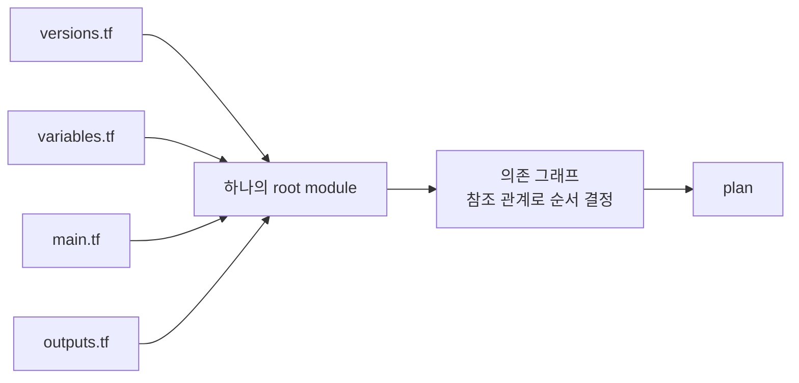

# 3장 — HCL 문법: 블록·인수·표현식·타입

**이 장에서 배우는 것**

- 처음 보는 `.tf` 파일에서 블록 타입 · 레이블 · 바디를 구분해 읽고 그 블록이 무엇을 선언하는지 판정할 수 있다.
- 최상위 블록 열네 종을 구별하고, 어떤 것이 인프라를 만들고 어떤 것이 상태만 손대는지 말할 수 있다.
- list와 set의 차이를 타입 수준에서 설명하고, AWS provider 문서에서 어느 쪽인지 확인해 plan diff를 예측할 수 있다.
- IAM 정책을 heredoc으로 쓸 때 터지는 사고를 재현하고, `jsonencode` 로 옮기는 이유를 근거를 들어 설명할 수 있다.
- 파일을 넷으로 쪼개면서도, 선언 순서가 실행 순서와 무관하다는 사실 위에서 팀 규칙을 세울 수 있다.

**왜 중요한가**

HCL은 문법이 작다. 블록과 인수, 그리고 표현식이 전부다. 그런데 그 작은 문법 위에서 사고가 난다. 패턴은 대개 둘 — **타입을 착각한 것**과 **문자열을 문자열로만 본 것**이다.

타입 착각의 전형은 이렇다. ALB에 붙일 시큐리티 그룹을 `security_groups = [sg_a, sg_b]` 로 적어 뒀는데, 누군가 가독성을 이유로 순서를 `[sg_b, sg_a]` 로 바꾼다. `aws_lb` 의 `security_groups` 는 문서상 List이고 list는 순서가 값의 일부이므로 plan에 변경이 뜬다. 반대로 `aws_eks_node_group` 의 `source_security_group_ids` 는 Set이라서 같은 짓을 해도 plan이 조용하다. 같은 "시큐리티 그룹 ID들의 모음"인데 결과가 다르다. 이 차이를 모르면 순서가 중요한 곳에서 순서를 무심코 흔들게 된다.

문자열 착각의 전형은 IAM 정책이다. 콘솔에서 복사한 정책 JSON을 heredoc으로 붙여 넣는데, 그 안에 `${aws:username}` 같은 IAM 정책 변수가 들어 있다. Terraform은 그것을 **자기 보간 문법으로 해석**하려 들고 `aws` 라는 이름을 못 찾아 에러를 낸다. 운 나쁘게 문법이 통과하는 형태였다면 에러 없이 **뜻이 바뀐 정책**이 배포되고, 권한이 넓어지는 방향이면 그날은 보안 사고다. AWS provider 문서가 `assume_role_policy` 와 `policy` 에 `jsonencode()` 또는 `aws_iam_policy_document` 사용을 권고하는 이유가 여기 있다.

여기에 하나를 더한다. "`variables.tf` 에 먼저 선언해야 `main.tf` 에서 쓸 수 있다"고 믿고 순서를 맞추느라 시간을 쓰는 경우다. Terraform은 디렉터리의 모든 `.tf` 를 읽어 하나로 합친 뒤 의존 관계를 계산한다. 파일 분할은 사람을 위한 관습이며, 관습임을 알아야 팀 규칙으로 다룰 수 있다.

## 블록의 해부: 블록 타입, 레이블, 바디

HCL 설정은 **블록(block)** 과 **인수(argument)** 두 가지로 이루어진다.

```terraform
resource "aws_vpc" "main" {
  cidr_block           = "10.0.0.0/16"
  enable_dns_hostnames = true

  tags = {
    Name = "main"
  }
}
```

왼쪽부터 읽는다. `resource` 가 **블록 타입(block type)** 으로 뒤에 오는 레이블의 개수와 의미를 정한다. `"aws_vpc"` 는 **첫 레이블**로 여기서는 리소스 타입, `"main"` 은 **둘째 레이블**로 로컬 이름이다(같은 리소스 타입 안에서만 유일하면 된다). `{ ... }` 가 **바디(body)** 다.

레이블 개수는 블록 타입마다 고정이다. `resource` 와 `data` 는 둘, `variable` · `output` · `module` · `provider` · `check` 는 하나, `terraform` · `locals` · `moved` · `removed` · `import` 은 없다. `Missing name for resource` 나 `Extraneous label` 은 이 개수가 틀렸다는 뜻이다.

바디 안의 `cidr_block = "10.0.0.0/16"` 이 **인수**다. 이름은 provider 스키마에 있는 것만 쓸 수 있고, 없는 이름은 `An argument named "cidr_blocks" is not expected here.` 로 AWS API를 부르기 **전에** 거절된다.

바디 안에 또 블록이 올 수도 있다. **중첩 블록**은 등호 없이 `block_device_mappings { ... }` 처럼 쓴다. `tags = { ... }` 와 생김새가 비슷하지만 앞은 **맵 값을 갖는 인수**, 뒤는 **중첩 블록**이다. 등호의 유무가 유일한 표지이고 어느 쪽인지는 provider 문서가 정한다 — "A map of tags"면 인수, "Configuration block"이면 중첩 블록이다.

## 최상위 블록 총람

다른 블록 안이 아닌 자리에 올 수 있는 블록 타입은 정해져 있다. 무엇을 하는지만 명확히 하고 상세는 해당 챕터로 넘긴다.

**인프라를 만들거나 읽는 것**

- `resource` — 관리 대상 리소스. 생성 · 수정 · 삭제되고 state에 기록된다.
- `data` — 이미 존재하는 것을 읽는다. 만들지 않는다([8장](08-data-sources.md)).
- `ephemeral` — 값을 읽되 **state에도 plan 파일에도 남기지 않는다.** AWS provider에 10개 있고, `ephemeral "aws_secretsmanager_secret_version" "example" { ... }` 로 쓴다([26장](../level2-intermediate/26-secrets-and-ephemeral.md)).
- `list` — 계정에 이미 있는 리소스를 **발견**한다. `terraform query` 와 함께 쓰며 183개다. `list "aws_vpc" "example" { ... }` 형태이고 필터는 `config` 블록에 넣는다([37장](../level3-advanced/37-list-resources-and-query.md)).
- `module` — 다른 디렉터리의 설정을 불러다 쓴다([19장](../level2-intermediate/19-modules.md)).

**설정과 값**

- `terraform` — Terraform 자신의 설정. `required_version`, `required_providers`, `backend`, `provider_meta` 가 들어간다. 이 안에서는 변수도 함수도 쓸 수 없다 — 공식 문서는 `user_agent` 같은 provider 정의 함수를 포함해 함수를 `terraform` 블록에서 쓸 수 없다고 명시한다.
- `provider` — provider 인스턴스 설정. region, 자격증명, 재시도 정책이 여기 있다([4장](04-provider-block-and-auth.md)).
- `variable` / `output` / `locals` — 값을 받는 입구, 내보내는 출구, 설정 안에서만 쓰는 이름 붙인 값. 블록 타입은 복수형 `locals` 인데 참조는 단수형 `local.name` 이다([7장](07-variables-outputs-locals.md)).

**상태를 손대는 것**

- `import` — AWS에 이미 있는 것을 state로 데려온다. `to` 와 `id`(1.12 이상에서는 `identity`)를 쓴다([20장](../level2-intermediate/20-import-and-resource-identity.md)).
- `moved` — 리소스 주소가 바뀌었음을 알린다(`from`, `to`). 이름만 바꿨는데 "지우고 다시 만들겠다"고 하는 상황을 막는다.
- `removed` — 설정에서 빼되 AWS에서는 지우지 말라고 지시한다(`from` + `lifecycle { destroy = false }`). [22장](../level2-intermediate/22-moved-removed-refactoring.md).

**검증**

- `check` — apply 이후에도 성립해야 할 조건을 단언한다. 블록 안에 `data` 블록과 `assert` 블록을 넣는다. `assert` 는 `condition` 과 `error_message` 를 갖는다.

`check` 는 실패해도 `Warning: Check block assertion failed` 를 낼 뿐 apply를 막지 않는다. 반드시 막아야 할 조건은 변수 `validation` 이나 `lifecycle` 의 `precondition` 으로 처리한다([36장](../level3-advanced/36-drift-refresh-and-checks.md)). 이 열네 종 바깥은 없다.

## 타입 시스템

값에는 타입이 있다. 명시적으로 쓰는 자리는 `variable` 의 `type` 정도지만 타입은 항상 존재하고 plan diff의 모양을 결정한다.

**원시 타입 셋.** `string` 은 큰따옴표만 쓴다(작은따옴표는 HCL 문자열이 아니다). `number` 는 정수와 실수를 구분하지 않는다. `bool` 은 소문자 `true` / `false` 이며 `"true"` 는 문자열이지 bool이 아니다. Terraform은 명백한 경우 자동 변환을 하므로 `enable_dns_support = "true"` 도 통과하지만, 변수를 거쳐 오는 값에서는 이 변환이 오타를 숨긴다.

**복합 타입 다섯.**

`list(T)` 는 순서가 있고 중복을 허용하며(`var.subnets[0]`). `set(T)` 는 **순서가 없고 중복이 없으며** 인덱스로 접근할 수 없다. `map(T)` 는 문자열 키에 같은 타입 값을 붙인다(`tags = { Name = "main" }`). `object({ name = string, port = number })` 는 속성마다 타입이 정해진 구조체이고, `tuple([string, number])` 는 위치마다 타입이 정해진 고정 길이 나열이다.

`list`/`set`/`map` 은 원소가 모두 같은 타입이어야 하고 `tuple`/`object` 는 자리마다 다를 수 있다. 설정에 `["a", "b"]` 라고 쓰면 Terraform은 우선 tuple로 읽고, `list(string)` 을 요구하는 인수에 들어가는 순간 변환한다.

**그리고 `null`.** `null` 은 "값이 없음"이다. 빈 문자열도 빈 리스트도 아니다. 인수에 `null` 을 주는 것은 **그 인수를 아예 쓰지 않은 것과 같다.** 그래서 `instance_tenancy = var.dedicated ? "dedicated" : null` 은 조건이 거짓일 때 인수를 생략한 것과 동일하게 동작한다.

반면 `""` 는 "빈 문자열이라는 값"이므로 provider가 그대로 API에 실어 보내거나 검증에서 거절한다. 다만 맵 **안**의 `null`(`tags = { Name = null }`)은 "키가 없는 맵"이 되지 않으니, 태그를 조건부로 넣으려면 맵 자체를 `merge()` 로 조립한다([18장](../level2-intermediate/18-expressions-and-functions.md)).

## set과 list의 차이가 AWS provider에서 왜 문제가 되는가

교과서적 정의만 보면 "순서가 있느냐 없느냐"가 전부다. 실무에서 이 차이가 드러나는 지점은 **plan diff** 다. Terraform은 설정과 state의 값을 비교해 diff를 만드는데, list는 **위치별로**, set은 **원소의 집합**으로 비교한다. `["sg-1", "sg-2"]` 와 `["sg-2", "sg-1"]` 은 list라면 변경이고 set이라면 변경이 아니다.

AWS provider 문서는 인수마다 어느 쪽인지 밝혀 둔다. `aws_lb` 의 `security_groups` 는 "List of security group IDs to assign to the LB.", `subnets` 는 "List of subnet IDs to attach to the LB." 다. 반면 `aws_eks_node_group` 의 `source_security_group_ids` 는 "Set of EC2 Security Group IDs...", `aws_autoscaling_group` 의 `target_group_arns` 는 "Set of `aws_lb_target_group` ARNs...", provider 블록 `assume_role` 의 `policy_arns` 는 "Set of ARNs..." 다. 이 표기는 스키마의 사실이다.

두 번째 결과는 **set은 인덱싱할 수 없다**는 점이다. 꺼내야 한다면 `tolist()` 로 변환한 뒤 인덱싱하되 그 순서에 의미를 부여하면 안 된다.

세 번째 결과는 `for_each` 다. `for_each` 는 **set 또는 map만** 받는다.

```terraform
resource "aws_subnet" "private" {
  # for_each = var.azs        # 에러: list는 받지 않는다
  for_each = toset(var.azs)   # set으로 변환해야 한다

  vpc_id            = aws_vpc.main.id
  availability_zone = each.value
}
```

이 제약에는 이유가 있다. `for_each` 로 만든 리소스의 주소는 `aws_subnet.private["ap-northeast-2a"]` 처럼 **키**로 식별된다. list를 허용하면 키가 인덱스가 되고, 목록 가운데에서 하나를 빼는 순간 뒤의 모든 리소스가 밀려 전부 교체된다. `count` 가 정확히 그 문제를 갖는다([17장](../level2-intermediate/17-count-foreach-dynamic.md)).

## 문자열: 보간, 이스케이프, heredoc

문자열 안의 `${ }` 는 표현식의 결과로 치환된다. `bucket = "${var.project}-logs-${data.aws_caller_identity.current.account_id}"` 처럼 쓴다.

문자열 전체가 하나의 참조뿐이라면 보간을 쓰지 않는다. `vpc_id = "${aws_vpc.main.id}"` 가 아니라 `vpc_id = aws_vpc.main.id` 다. `"${...}"` 로 감싸면 결과가 문자열로 강제 변환되므로 숫자나 bool은 타입이 바뀐다.

**이스케이프.** `${` 나 `%{` 를 문자 그대로 넣어야 하면 `$${`, `%%{` 로 쓴다. 이 규칙이 다음 절에서 결정적이다.

**heredoc.** 여러 줄 문자열은 heredoc으로 쓴다.

```terraform
locals {
  plain = <<EOT
#!/bin/bash
dnf install -y nginx
EOT

  indented = <<-EOT
    #!/bin/bash
  EOT
}
```

`<<EOT` 는 줄의 내용을 들여쓰기까지 그대로 담고, `<<-EOT` 는 **가장 적게 들여쓴 줄을 기준으로** 공통 들여쓰기를 벗겨 낸다. 종료 표지(`EOT`)는 그 자체로 한 줄을 차지해야 한다. heredoc 안에서도 `${ }` 보간은 **그대로 동작한다** — 보간을 끄는 문법은 없다.

## IAM 정책을 heredoc으로 쓰면 벌어지는 일

콘솔에서 복사한 정책을 그대로 붙인 코드를 자주 본다.

```terraform
resource "aws_iam_policy" "self_manage" {
  name = "self-manage-mfa"

  policy = <<EOT
{
  "Version": "2012-10-17",
  "Statement": [{
    "Effect": "Allow",
    "Action": "iam:ChangePassword",
    "Resource": "arn:aws:iam::123456789012:user/${aws:username}"
  }]
}
EOT
}
```

이 설정은 plan 단계에서 실패한다. `${aws:username}` 은 IAM 정책 변수지만 Terraform 눈에는 자기 보간 문법이다. `$${aws:username}` 으로 이스케이프해야 고쳐지는데, 문제는 그것을 **기억해야 한다**는 사실 자체다. heredoc JSON의 문제는 그것만이 아니다.

- **문법 오류를 plan이 잡아 주지 않는다.** 콤마 하나가 빠져도 Terraform에게는 그냥 문자열이고, AWS API가 `MalformedPolicyDocument` 를 던질 때야 알게 된다.
- **공백 차이가 영구 diff를 만든다.** AWS는 정책을 저장할 때 자체 형식으로 정규화하므로, 내가 쓴 들여쓰기와 돌아오는 문자열이 다르면 매 plan마다 변경이 뜬다.
- **값을 끼워 넣기 어렵고 조건부 구성이 사실상 불가능하다.** 계정 ID를 넣으려고 보간을 섞으면 따옴표와 중괄호가 얽히고, "prod에서만 이 Statement를 넣는다"는 문자열 조작으로는 읽히지 않는 코드가 된다.

AWS provider 문서는 `aws_iam_role` 과 `aws_iam_policy` 양쪽에서 같은 권고를 반복한다 — `policy` 나 `assume_role_policy` 에는 `jsonencode()` 또는 `aws_iam_policy_document` 를 쓰라는 것이다. 근거는 두 방법 모두 Terraform 언어를 JSON으로 그대로 옮겨 주므로 문맥 전환 없이 일관성을 유지할 수 있고, 형식 차이와 공백 불일치 같은 JSON 특유의 문제를 피할 수 있다는 것이다.

```terraform
# 구조가 HCL이므로 오타가 plan에서 잡힌다
resource "aws_iam_policy" "self_manage" {
  name = "self-manage-mfa"

  policy = jsonencode({
    Version = "2012-10-17"
    Statement = [{
      Effect   = "Allow"
      Action   = "iam:ChangePassword"
      Resource = "arn:aws:iam::${data.aws_caller_identity.current.account_id}:user/$${aws:username}"
    }]
  })
}
```

`jsonencode` 를 써도 값이 여전히 HCL 문자열이므로 `$${aws:username}` 이스케이프는 필요하다. 하지만 나머지 문제 — 콤마, 괄호, 공백 정규화, 조건부 구성 — 는 전부 사라진다. 한 단계 더 나아가면 정책 전용 문법과 합성을 제공하는 `aws_iam_policy_document` 데이터 소스가 있다([13장](13-iam-basics.md), [33장](../level2-intermediate/33-provider-functions-and-policies.md)).

heredoc은 **JSON이 아닌 진짜 여러 줄 텍스트**에 쓴다. EC2 user data 셸 스크립트가 대표적이고, 그마저도 길어지면 `file()` 이나 `templatefile()` 로 뺀다.

## 표현식 기초

**참조.** 접두사가 대상의 종류를 말해 준다.

리소스는 `aws_vpc.main.id`, 데이터 소스는 `data.aws_ami.al2023.id`, ephemeral 리소스는 `ephemeral.aws_ssm_parameter.db.value`, 변수는 `var.environment`, 로컬 값은 `local.common_tags`, 모듈 출력은 `module.vpc.private_subnet_ids`, 반복은 `each.key` / `each.value` / `count.index` 다. `resource` 만 접두사가 없으므로 `var`, `local`, `data`, `module`, `each`, `count`, `self`, `path`, `terraform` 은 이름으로 쓰지 않는다.

**연산자.** 산술(`+ - * / %`), 비교(`== != < <= > >=`), 논리(`&& || !`)가 있다. 문자열 결합에 `+` 는 쓸 수 없다 — 보간이나 `join()`, `format()` 을 쓴다. **삼항 조건**은 `조건 ? 참 : 거짓` 형태다.

```terraform
locals {
  instance_type = var.environment == "prod" ? "m6i.large" : "t3.micro"
}
```

두 갈래의 타입이 다르면 Terraform이 공통 타입으로 변환하려 시도한다. `var.x ? "on" : 0` 같은 코드는 통과할 수도 있지만 의도가 불명확하니 피한다.

**`for` 표현식.** 모음을 다른 모음으로 바꾼다. 본편은 [18장](../level2-intermediate/18-expressions-and-functions.md)이고 여기서는 형태만 익힌다.

```terraform
locals {
  upper_names = [for n in var.names : upper(n)]                    # -> tuple
  prod_names  = [for n in var.names : n if startswith(n, "prod-")] # 필터
  by_name     = { for n in var.names : n => length(n) }            # -> object
}
```

대괄호로 감싸면 tuple, 중괄호로 감싸면 object가 나온다. AWS provider의 `aws_lb` 예제에도 `subnets = [for subnet in aws_subnet.public : subnet.id]` 형태가 등장한다.

## 주석과 저장소 관습

HCL은 세 가지 주석 문법을 지원한다. `#` 과 `//` 는 한 줄 주석이고 `/* */` 는 여러 줄 주석이다. 셋 다 동작하지만 저장소마다 하나로 통일하는 것이 관습이고 사실상 표준은 `#` 이다 — AWS provider 저장소의 예제 코드도 `#` 을 쓴다. `/* */` 는 **중첩되지 않으므로** 주석이 이미 들어 있는 코드를 통째로 감싸려 하면 깨진다 — 코드를 임시로 비활성화할 때는 삭제하고 git에 맡긴다.

무엇을 남길지도 관습이다. `cidr_block = "10.0.0.0/16" # CIDR 블록` 같은 주석에는 정보가 없다. 남길 가치가 있는 것은 **왜**다.

## 파일 분할과 선언 순서

Terraform은 명령을 실행한 디렉터리의 `.tf`(그리고 `.tf.json`) 파일을 **전부** 읽어 하나의 설정으로 합친다. 하위 디렉터리는 포함하지 않는다.



여기서 나오는 결론이 **선언 순서는 무의미하다**는 것이다. `outputs.tf` 가 알파벳 순으로 앞이든 뒤든 상관없고 같은 파일 안에서 `output` 이 `resource` 보다 위에 있어도 된다. 실행 순서는 파일 순서가 아니라 **참조 관계**로 정해진다([6장](06-references-and-dependencies.md)).

그래서 파일 분할은 오로지 사람을 위한 것이다. 널리 쓰이는 관습은 넷이다 — `versions.tf` 에 `terraform` 블록, `main.tf` 에 `resource` 와 `data`, `variables.tf` 에 `variable` 전부, `outputs.tf` 에 `output` 전부. `main.tf` 가 길어지면 `network.tf` 처럼 도메인별로 쪼갠다. `provider` 블록과 `locals` 를 어디 둘지는 팀에서 하나로 정하기만 하면 된다.

주의할 것 둘. **같은 이름을 두 번 선언하면 에러다** — 파일을 나눴다고 이름 공간이 나뉘지 않는다. 그리고 파일 이름이 `override.tf` 나 `_override.tf` 로 끝나면 **덮어쓰기 파일**로 특별 취급되므로 의도하지 않았다면 그런 이름을 붙이지 않는다.

## terraform fmt와 이름 규칙

`terraform fmt` 는 설정 파일을 표준 형식으로 다시 쓴다.

- 들여쓰기를 **공백 2칸**으로 맞추고, 리스트와 맵의 괄호 · 콤마 위치를 정리한다.
- **연속된 한 줄 인수들의 `=` 를 세로로 정렬한다.** 빈 줄이 끼면 정렬 그룹이 끊기므로, 인수 사이 빈 줄을 넣고 빼는 것만으로 정렬이 바뀌고 diff가 커진다.

반대로 하지 **않는** 것도 분명하다. 인수 순서도 맵 키 순서도 블록 순서도 정렬하지 않고, 문법이나 스키마 검사도 하지 않는다 — 그건 `terraform validate` 의 일이다.

```console
$ terraform fmt -check -recursive   # 고치지 않고, 고칠 게 있으면 종료 코드 3
$ terraform fmt -diff -recursive    # 무엇이 바뀌는지 보여 준다
```

**이름 규칙.** 블록 레이블(리소스 · 변수 · 모듈 이름)은 문자나 밑줄로 시작해야 하고 숫자로 시작할 수 없다. 관습은 **소문자 스네이크 케이스**여서 `aws_vpc.main-vpc` 나 `aws_vpc.MainVPC` 가 아니라 `aws_vpc.main` 으로 쓴다.

이유는 둘이다. 첫째, 리소스 **타입** 이름 자체가 스네이크 케이스다. AWS provider의 네이밍 규칙은 리소스 타입 이름을 `aws` 접두사 + 서비스 식별자 + 스네이크 케이스 리소스 이름을 밑줄로 이어 만든다고 정한다(`aws_imagebuilder_image_pipeline`). 둘째, 하이픈은 표현식 문맥에서 뺄셈 연산자와 시각적으로 구별되지 않는다.

이름에 리소스 타입을 반복하지도 않는다. 참조할 때 타입이 앞에 붙으므로 `aws_vpc.main_vpc` 는 `aws_vpc.main` 으로 충분하고, 하나뿐인 리소스에 `main` 이나 `this` 를 쓰는 관습이 퍼져 있다. `variable` 블록의 이름으로는 `source`, `version`, `providers`, `count`, `for_each`, `lifecycle`, `depends_on`, `locals` 를 쓸 수 없다 — 모듈 호출의 메타 인수와 충돌하기 때문이다.

## 흔한 실수

### ❌ 중첩 블록에 등호를 붙인다

문서가 "Configuration block"이라고 한 것을 인수처럼 쓰는 실수다.

```terraform
resource "aws_launch_template" "example" {
  name = "example"

  block_device_mappings = {
    device_name = "/dev/sda1"
  }
}
```

```terraform
# ✅ 중첩 블록은 등호 없이 쓴다
resource "aws_launch_template" "example" {
  name = "example"

  block_device_mappings {
    device_name = "/dev/sda1"
  }
}
```

`tags` 는 반대다 — 맵 값을 갖는 인수이므로 `tags { ... }` 가 아니라 `tags = { ... }` 로 쓴다.

### ❌ set을 인덱스로 꺼낸다

문서에 "Set of"라고 적힌 속성에는 0번 원소라는 개념이 없다.

```terraform
output "first_sg" {
  value = aws_eks_node_group.example.source_security_group_ids[0]
}
```

```terraform
# ✅ 집합 전체를 넘기거나, 꼭 하나가 필요하면 정렬해 결정적으로 만든다
output "sorted_sgs" {
  value = sort(tolist(aws_eks_node_group.example.source_security_group_ids))
}
```

### ❌ 조건부 인수에 빈 문자열을 쓴다

"값이 없으면 안 넣은 것으로 해 달라"는 의도로 `""` 를 넣는다. 빈 문자열은 "값이 없음"이 아니라 "빈 문자열이라는 값"이다.

```terraform
resource "aws_vpc" "main" {
  cidr_block       = "10.0.0.0/16"
  instance_tenancy = var.dedicated ? "dedicated" : ""
}
```

```terraform
# ✅ null을 주면 그 인수를 쓰지 않은 것과 같아진다
resource "aws_vpc" "main" {
  cidr_block       = "10.0.0.0/16"
  instance_tenancy = var.dedicated ? "dedicated" : null
}
```

### ❌ list를 for_each에 그대로 넘긴다

```terraform
variable "bucket_names" {
  type = list(string)
}

resource "aws_s3_bucket" "logs" {
  for_each = var.bucket_names   # 에러: set 또는 map만 받는다
  bucket   = each.value
}
```

```terraform
# ✅ toset으로 변환한다. each.key와 each.value가 같은 값이 된다
resource "aws_s3_bucket" "logs" {
  for_each = toset(var.bucket_names)
  bucket   = each.value
}
```

`toset()` 은 중복을 제거하므로, list에 같은 값이 두 번 있었다면 리소스는 하나만 만들어진다.

## 프로덕션 노트

- **`terraform fmt -check -recursive` 를 CI의 첫 잡으로 둔다.** 자격증명 없이 몇 초면 끝나며 포맷 diff가 리뷰를 오염시키는 것을 막는다. 이미 형식이 제각각이라면 "전체 fmt" 커밋을 따로 만들고 그 해시를 `.git-blame-ignore-revs` 에 등록한다.

- **정책 문서 형식은 저장소 규칙으로 못박는다.** heredoc JSON과 `jsonencode` 와 `aws_iam_policy_document` 가 섞여 있으면 리뷰어가 매번 다른 종류의 실수를 찾아야 한다.

- **문서의 "List of" / "Set of"를 확인하지 않고 순서를 바꾸지 않는다.** "정렬해서 읽기 좋게"라는 리팩터링 PR이 List 타입 인수에서는 실제 API 호출을 만든다. ALB의 `subnets` 처럼 변경이 재생성으로 이어질 수 있는 인수도 있다.

- **`check` 블록은 배포를 막지 않는다.** 실패해도 경고일 뿐이므로 "체크하고 있으니 괜찮다"는 잘못된 안심을 주기 쉽다. 반드시 막아야 하는 조건은 변수 `validation` 이나 `precondition` 으로 옮긴다.

- **`terraform` 블록에는 변수를 쓸 수 없다.** `required_version` 이나 `backend` 를 변수로 바꾸려는 시도는 반드시 실패한다. 환경별로 백엔드를 바꾸려면 `-backend-config` 를 쓴다([16장](../level2-intermediate/16-remote-state-and-backends.md)).

- **파일 이름 관습은 온보딩 비용이다.** 저장소마다 구조가 다르면 옮겨 다닐 때마다 탐색 비용이 든다. 네 파일 구조를 조직 표준으로 정하고 템플릿 저장소로 강제한다.

## 연습문제

**1. 블록 타입 분류하기**
실전 Terraform 저장소를 열어 최상위 블록을 모두 찾고, "인프라를 만든다 / 읽기만 한다 / 값만 정의한다 / 상태만 손댄다 / 검증한다" 다섯 범주로 분류한다.
*성공 기준:* 각 블록의 레이블 개수를 답할 수 있고, `data` 와 `ephemeral` 이 state에서 어떻게 다른지 설명할 수 있다.

**2. heredoc 정책을 깨뜨렸다가 고치기**
`${aws:username}` 이 든 IAM 정책을 heredoc으로 작성해 plan 에러를 재현하고, `$${aws:username}` 으로 고친 뒤 같은 정책을 `jsonencode` 로 다시 쓴다.
*성공 기준:* 첫 에러의 원인을 한 문장으로 설명할 수 있고, `jsonencode` 버전에서 콤마를 빠뜨렸을 때 AWS API가 아니라 Terraform이 먼저 잡아낸다는 것을 확인한다.

**3. 선언 순서가 무의미함을 증명하기**
`output` 블록만 든 `aaa.tf` 와 `resource` 블록이 든 `zzz.tf` 로 설정을 나누고, output이 그 리소스의 속성을 참조하게 한다.
*성공 기준:* 파일 이름 순서가 참조 방향과 반대인데도 `validate` 와 `plan` 이 정상 동작한다. 이어서 두 파일에 같은 이름의 리소스를 넣어 `Duplicate resource` 에러를 재현한다.

## 요약

- 블록은 `블록타입 "레이블1" "레이블2" { 바디 }` 구조이고 레이블 개수는 고정이다 — `resource`/`data` 는 둘, `variable`/`output`/`module`/`provider`/`check` 는 하나, `terraform`/`locals`/`moved`/`removed`/`import` 는 없다.
- 최상위 블록은 `terraform`, `provider`, `resource`, `data`, `ephemeral`, `list`, `variable`, `output`, `locals`, `module`, `check`, `import`, `moved`, `removed` 다. `ephemeral` 은 값을 state에 남기지 않고, `list` 는 기존 리소스를 발견하며, `moved`/`removed`/`import` 는 state를 조작한다. `check` 는 실패해도 경고일 뿐 apply를 막지 않는다.
- 인수는 `이름 = 표현식`, 중첩 블록은 `이름 { ... }` 이며 어느 쪽인지는 provider 문서가 정한다. 타입은 `string`, `number`, `bool`, `list`, `set`, `map`, `object`, `tuple` 이고, 인수에 `null` 을 주는 것은 그 인수를 생략한 것과 같지만 빈 문자열은 그렇지 않다.
- set은 순서도 중복도 없어 순서를 바꿔도 plan diff가 나지 않고 인덱스로 접근할 수 없다. `for_each` 는 set과 map만 받으므로 list는 `toset()` 으로 변환한다. 문서의 "List of" / "Set of" 표기는 스키마의 사실이며 `aws_lb.security_groups` 는 List, `aws_autoscaling_group.target_group_arns` 는 Set이다.
- heredoc은 `<<EOT`(그대로)와 `<<-EOT`(공통 들여쓰기 제거) 두 형태이고 안에서도 `${}` 보간이 동작한다. 문자 그대로의 `${` 는 `$${` 로 이스케이프한다. IAM 정책에는 heredoc 대신 `jsonencode()` 또는 `aws_iam_policy_document` 를 쓴다 — provider 문서가 `aws_iam_role` 과 `aws_iam_policy` 양쪽에서 이 권고를 명시한다.
- Terraform은 디렉터리의 모든 `.tf` 를 하나로 합치므로 파일 분할과 선언 순서는 실행에 영향을 주지 않는다. 실행 순서는 참조 관계로 정해지고, 같은 이름을 두 파일에 선언하면 에러다.
- `terraform fmt` 는 들여쓰기 2칸과 연속 인수의 `=` 정렬을 강제하지만 인수 순서나 키 순서는 바꾸지 않고 문법 검사도 하지 않는다. 레이블은 소문자 스네이크 케이스로 쓰고 리소스 타입을 이름에 반복하지 않는다.

## 다음으로

- [4장 — provider 블록과 자격증명](04-provider-block-and-auth.md) — 여기서 본 `provider` 블록이 무엇을 어디서 찾는지.
- [6장 — 참조와 의존성](06-references-and-dependencies.md) — 선언 순서가 아니라 참조가 순서를 만드는 구조.
- [18장 — 표현식과 내장 함수](../level2-intermediate/18-expressions-and-functions.md) — `for`, splat, `try`, `templatefile`.
- Terraform 설정 언어 공식 문서: <https://developer.hashicorp.com/terraform/language>
