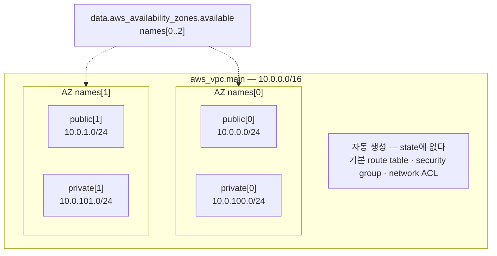

# 5장 — 첫 리소스: aws_vpc와 aws_subnet 해부

**이 장에서 배우는 것**

- `resource` 블록의 두 레이블을 구분하고, 로컬 이름이 왜 "state 주소"이자 리팩터링 비용의 원천인지 설명할 수 있다.
- AWS provider가 "리소스 하나 = API 객체 하나"를 지향한다는 설계 원칙과 그 예외를 알고, 리소스가 잘게 쪼개진 이유를 이해한다.
- `aws_vpc` 의 실제 인수를 원문 기준으로 골라 쓰고, 어떤 인수가 서로 충돌하며 어떤 것이 교체를 유발하는지 plan으로 확인할 수 있다.
- `main_route_table_id`, `default_security_group_id` 처럼 "만들지 않았는데 딸려 오는 것들"의 정체를 알고 활용할 수 있다.
- `availability_zone` 과 `availability_zone_id` 를 구분하고, AZ 이름을 하드코딩하면 안 되는 이유를 말할 수 있다.
- `id` 와 `arn` 의 차이, import ID 형식, default VPC를 채택(adopt)하는 리소스가 따로 있는 이유를 안다.

**왜 중요한가**

VPC는 거의 모든 AWS 인프라의 뿌리다. 뿌리를 잘못 심으면 위에서 자란 것을 전부 뽑아야 고칠 수 있다. 가장 흔한 사고는 `cidr_block` 이다. `10.0.0.0/24` 로 VPC를 만들고 6개월 뒤 EKS를 얹으려는 순간, 파드 하나에 IP 하나를 쓰는 VPC CNI 앞에서 254개짜리 주소 공간이 바닥난다. 주 CIDR은 처음 잡은 범위를 마음대로 넓히지 못하므로, 결국 새 VPC를 만들고 RDS·ALB·EKS를 통째로 이사하는 프로젝트가 된다 — 코드 한 줄의 대가치고는 비싸다.

두 번째는 AZ 하드코딩이다. `availability_zone = "ap-northeast-2a"` 라고 적힌 모듈을 다른 계정에 재사용했더니 서브넷 두 개가 물리적으로 같은 데이터센터에 생겼다. AWS는 AZ **이름**을 계정마다 다른 물리 AZ에 매핑하므로 A 계정의 `2a` 와 B 계정의 `2a` 는 같은 곳이 아닐 수 있다. 그렇게 만든 "멀티 AZ"는 다이어그램에서만 멀티 AZ이고 실제 장애 때 함께 죽는다.

세 번째는 로컬 이름이다. `resource "aws_vpc" "vpc"` 를 나중에 `main` 으로 고치면 Terraform 입장에서는 **`aws_vpc.vpc` 가 사라지고 `aws_vpc.main` 이 새로 생긴 것**이다. plan에 destroy 1 / create 1 이 뜨고 그 아래 매달린 서브넷·라우트 테이블·NAT까지 전부 다시 만들어진다.

## `resource` 블록의 해부: 레이블 두 개

```terraform
resource "aws_vpc" "main" {
  cidr_block = "10.0.0.0/16"
}
```

레이블은 **두 개**이고 순서가 고정돼 있다. 첫 번째 `"aws_vpc"` 는 **리소스 타입**이다. provider가 정한 이름이고 바꿀 수 없다. 접두사 `aws_` 가 provider의 로컬 이름과 연결되므로 Terraform은 이것만 보고 어느 provider가 처리할지 안다. 두 번째 `"main"` 은 **로컬 이름**이고 우리가 정한다. AWS 어디에도 전달되지 않는다 — 콘솔에서 VPC 이름으로 보이는 것은 이것이 아니라 `tags` 의 `Name` 키다.

둘을 점으로 이은 `aws_vpc.main` 이 이 리소스의 **주소**이며, 참조할 때(`vpc_id = aws_vpc.main.id`), state를 다룰 때(`terraform state show aws_vpc.main`), 대상을 지정할 때(`-target=aws_vpc.main`) 모두 같은 모양으로 쓰인다.

이름 규칙은 소문자 스네이크, 숫자로 시작하지 않기, **타입 이름을 되풀이하지 않기**다(`aws_vpc.vpc.id` 는 읽히지 않는다). 모듈 안에서 그 타입이 하나뿐이면 관례적으로 `this` 를 쓰는 코드베이스가 많다. 이름은 나중에 고칠 수 있지만 공짜가 아니다 — 그냥 고치면 destroy + create이고, 상태를 유지한 채 주소만 옮기려면 `moved` 블록이 필요하다([22장](../level2-intermediate/22-moved-removed-refactoring.md)).

## 리소스 하나 = API 객체 하나

리소스 타입 목록을 처음 보면 왜 이렇게 잘게 쪼개져 있는지 의아하다. 서브넷은 VPC의 인수여도 될 것 같은데 별도 리소스고 라우트 테이블과 그 연결도 따로다.

우연이 아니라 명시적 설계 원칙이다. provider 기여자 문서는 리소스 설계가 두 원칙 사이에서 균형을 잡는다고 적는다 — **리소스는 단일 API 객체를 표현해야 한다**, 그리고 **스키마는 기저 API에 가깝게 맞춰야 한다**. AWS API가 "부모 하나에 자식 목록"을 한 번에 받으면(plural API) 둘이 충돌한다.

provider 저장소의 설계 결정 문서는 기존 관계 리소스 44개를 세어 봤다. plural API를 가진 17개 중 **13개(76%)** 가 "단수" 구현을 택했다. 유지보수자들이 역사적으로 **단일 API 객체 표현 쪽에 강한 선호**를 보여 왔다는 뜻이고, 신규 관계 리소스는 단수 구현이 모범 사례로 못 박혔다. 예외는 둘 — 자식 관계를 **배타적으로** 관리해야 할 때(`aws_security_group` 의 인라인 `ingress`/`egress`, `aws_iam_policy_attachment`), 그리고 기저 API를 단수로 다루는 것이 불가능할 때다.

이 원칙 덕분에 "이 설정이 어느 리소스에 있을까"를 AWS API 문서에서 역추적할 수 있다 — 별도 `Create*` API가 있으면 대개 별도 리소스다.

## `aws_vpc` 의 인수: 무엇을 쓰고 무엇을 두는가

Argument Reference를 전부 옮기는 것은 의미가 없다. 실제로 손이 가는 것만 본다. 아래는 전부 원문에서 확인한 사실이다.

### `cidr_block` — Optional인데 사실상 필수

`cidr_block` 은 **Optional**이다. 원문은 "CIDR을 명시적으로 설정하거나 `ipv4_netmask_length` 를 통해 IPAM에서 유도할 수 있다"고 적는다. 둘 다 안 주면 VPC를 만들 수 없다.

`/16` 은 65,536개 주소다. AZ 3개 × 계층 3개로 9개를 쪼개고 나중에 EKS를 얹을 것을 생각하면 `/16` 이 표준적인 출발점이다. RFC 1918 범위 안에서 고르되 조직 전체의 CIDR 대장과 겹치지 않게 관리한다 — 겹치면 VPC 피어링과 Transit Gateway 라우팅이 불가능해지고, 이것이 나중에 가장 아픈 제약이 된다.

CIDR 대장을 AWS에 맡기는 길이 IPAM이다. `ipv4_netmask_length` 는 **`ipv4_ipam_pool_id` 를 함께 지정해야 한다**고 원문이 못 박고, 원문 예제는 `cidr_block` 대신 이 둘만 쓰면서 `depends_on = [aws_vpc_ipam_pool_cidr.test]` 를 붙인다 — 풀에 CIDR이 들어가기 전에 VPC를 할당받으려 하면 실패하는데, `ipam_pool_id` 만 참조해서는 "풀에 CIDR이 채워졌음"이 값으로 드러나지 않기 때문이다([6장](06-references-and-dependencies.md)).

### `instance_tenancy` — 값이 돈이다

원문은 기본값이 `default` 이고 다른 선택지는 `dedicated` 하나뿐이라고 적으면서 구체적인 경고를 붙인다 — `dedicated` 는 **리전당 시간당 $2의 전용 요금**에 더해 인스턴스별 시간당 사용 요금이 붙는다. 실수로 켜 두면 인스턴스가 한 대도 없어도 매달 $1,400 이상이 나간다. 참고로 이 인수는 Argument Reference와 Attribute Reference **양쪽에** 나온다 — 인수이면서 동시에 읽어 오는 속성이라는 뜻이고, `enable_dns_support`/`enable_dns_hostnames` 등도 마찬가지다.

### DNS 두 개: 기본값이 서로 다르다

`enable_dns_support` 는 기본 **true**, `enable_dns_hostnames` 는 기본 **false** 다. 기본값이 다르다는 것이 초보자를 가장 자주 무는 지점이다. 전자는 VPC 안에서 Amazon 제공 DNS 리졸버가 동작하게 하고, 후자는 인스턴스에 퍼블릭 DNS 호스트네임을 부여한다.

증상이 고약하다. RDS 엔드포인트 이름이 해석되지 않고 VPC 엔드포인트(PrivateLink)의 프라이빗 DNS가 동작하지 않는데, 에러는 애플리케이션의 `UnknownHostException` 으로 온다. **기본값에 의존하면 사고가 나는 인수**이므로 값이 기본과 같더라도 명시하기를 권한다.

### IPv6와 충돌 관계

원문이 명시하는 `Conflicts` 관계가 두 쌍 있다. `assign_generated_ipv6_cidr_block` 은 `ipv6_ipam_pool_id` 와, `ipv6_netmask_length` 는 `ipv6_cidr_block` 과 충돌한다. 둘 다 쓰면 apply가 아니라 **plan 단계에서** 검증 에러가 나므로 AWS에 요청이 나가기 전에 막힌다.

`assign_generated_ipv6_cidr_block = true`(기본 `false`)는 Amazon이 제공하는 `/56` 접두사 IPv6 CIDR을 요청하며, 원문은 "IP 주소 범위나 CIDR 블록 크기를 지정할 수 없다"고 적는다 — 받는 대로 받는다. `ipv6_netmask_length` 의 유효 범위는 **44에서 60까지, 4씩 증가**다.

### `region` — v6가 추가한 최상위 인수

`aws_vpc` 의 Argument Reference 첫 줄은 `region` 이다. Optional이며 provider 설정의 Region을 기본값으로 쓴다. **값을 바꾸면 리소스가 교체되고**, 반대로 **지우면 교체되지 않고 state의 이전 값을 쓴다**([24장](../level2-intermediate/24-enhanced-region-support.md)).

## 무엇이 교체를 부르는가 — ForceNew를 확인하는 법

`terraform plan` 이 문제의 줄 옆에 `# forces replacement` 를 붙일 때가 있다. 인수를 바꾸는 것을 AWS API가 지원하지 않아 provider가 지우고 다시 만드는 수밖에 없는 경우다.

여기서 정직하게 말할 것이 있다. **레지스트리 문서의 Argument Reference는 ForceNew 여부를 일관되게 표시하지 않으며** `aws_vpc` 문서에도 그런 표기는 없다. 확인 방법은 셋이다.

1. **plan을 실행한다.** 가장 확실하다. 값을 바꾼 `.tf` 로 `terraform plan` 을 돌려 `# forces replacement` 가 붙는지 본다. apply하지 않으므로 비용이 없다.
2. **문서 본문의 산문을 읽는다.** `aws_subnet` 의 `ipv6_cidr_block` 설명은 기존 IPv6 서브넷이 `assign_ipv6_address_on_creation = true` 로 만들어졌다면 이 값 변경이 **리소스 재생성을 강제한다**고 명시한다.
3. **provider 소스 스키마의 `ForceNew: true` 를 본다**([44장](../level3-advanced/44-implementing-a-resource.md)).

`# aws_vpc.main must be replaced` 가 뜬 plan을 승인하면 VPC가 사라지고 그것을 참조하던 서브넷·라우트 테이블·시큐리티 그룹이 줄줄이 교체된다. 승인 버튼 앞에서 읽어야 할 것은 마지막 줄의 `Plan: N to add ...` 숫자가 아니라 그 위의 `must be replaced` 다.

## 만들지 않았는데 딸려 오는 것들

`aws_vpc` 의 Attribute Reference에는 우리가 적지 않은 값들이 있다 — 원문 기준으로 `id`, `arn`, `main_route_table_id`, `default_route_table_id`, `default_security_group_id`, `default_network_acl_id`, `dhcp_options_id`, `ipv6_association_id`, `owner_id`, `tags_all` 이다.

이 목록이 알려 주는 사실이 있다. **`CreateVpc` 호출 하나가 AWS 쪽에서 객체를 여럿 더 만든다.** 라우트 테이블·시큐리티 그룹·네트워크 ACL이 딸려 오고 메인 라우트 테이블 연결도 함께 생긴다. Terraform은 이것들을 "만들지" 않았으므로 state에 갖고 있지 않다 — 우리는 ID만 손에 쥔다.

그래서 **기본 시큐리티 그룹은 Terraform이 관리하지 않는 채로 열려 있다.** AWS의 기본 SG는 자기 자신을 소스로 하는 all-traffic ingress와 egress를 갖는다. 보안 감사에서 매번 지적되는데 코드 어디에도 없어서 "누가 만들었지"가 된다. provider는 이를 위해 `aws_default_security_group`, `aws_default_network_acl`, `aws_default_route_table` 이라는 **별도 리소스 타입**을 제공한다.

`aws_default_*` 계열의 핵심은 **destroy 시 실제 객체가 삭제되지 않는다**는 점이다 — AWS가 삭제를 허용하지 않으므로 `terraform destroy` 는 state에서 제거하고 끝난다.

## `aws_subnet`: VPC 안에서 자리를 나눈다

`aws_subnet` 에서 **Required는 `vpc_id` 하나뿐**이다. `cidr_block` 조차 Optional인데 IPAM이나 IPv6 전용 서브넷 경로가 있기 때문이다. 실무의 대부분은 `vpc_id` + `cidr_block` + AZ 세 줄이다.

### `availability_zone` vs `availability_zone_id`

원문은 둘 다 Optional로 두고 `availability_zone_id` 에 단서를 붙인다 — **"모든 리전이나 파티션에서 지원되지 않는다. 필요하다면 `availability_zone` 을 대신 쓴다."**

`availability_zone` 은 `ap-northeast-2a` 같은 **이름**으로 계정마다 물리 AZ에 다르게 매핑되고, `availability_zone_id` 는 `apne2-az1` 같은 **ID**로 모든 계정에서 같은 물리 AZ를 가리킨다. "두 계정의 서브넷을 같은 물리 AZ에 두어 크로스-AZ 전송 비용을 피한다" 같은 요구가 있으면 ID를 쓰되, 어디서나 쓸 수 있는 것은 아니므로 재사용 모듈에서는 `availability_zone` 을 기본으로 둔다.

### `map_public_ip_on_launch` — "퍼블릭 서브넷"의 절반

원문의 기본값은 `false` 이며, `true` 면 이 서브넷에 들어오는 인스턴스가 퍼블릭 IP를 자동으로 받는다. 그런데 AWS에는 "퍼블릭 서브넷"이라는 속성이 없다. 서브넷이 퍼블릭인지는 **연결된 라우트 테이블에 IGW로 가는 `0.0.0.0/0` 라우트가 있는가**로만 결정되고 `map_public_ip_on_launch` 는 독립적인 편의 기능이다. 혼동하면 "퍼블릭 IP는 받았는데 인터넷이 안 되는" 인스턴스가 생긴다.

### IPv6와 Timeouts

`assign_ipv6_address_on_creation`, `enable_dns64`, `ipv6_native` 는 모두 기본 `false` 다. `ipv6_cidr_block` 은 원문이 **`/64` 접두사 길이를 써야 한다**고 명시하고, `ipv6_netmask_length` 는 `ipv6_ipam_pool_id` 를 요구하며 유효 값은 **44에서 64까지 4씩 증가**로 VPC 쪽 상한이 60인 것과 다르다.

`aws_subnet` 에는 **Timeouts**도 있다. 기본값은 `create` 10분, `delete` 20분이고, 삭제 쪽이 두 배 긴 이유를 원문의 첫 NOTE가 설명한다 — 2019년 9월부터 배포된 Lambda VPC 네트워킹 개선 때문에 **Lambda 함수와 연결된 서브넷은 삭제에 최대 45분이 걸릴 수 있다.** provider 2.31.0 이상은 이를 자동 처리한다.

## 서브넷 CIDR을 손으로 계산하지 않는다

AZ 3개에 퍼블릭/프라이빗을 두면 6개의 `/24` 를 잘라야 하는데, 손으로 적으면 오타 하나가 겹치는 CIDR을 만들고 apply는 `InvalidSubnet.Conflict` 로 실패한다. `cidrsubnet(prefix, newbits, netnum)` 함수가 있다 — `newbits` 는 접두사 길이에 **더할** 비트 수, `netnum` 은 그 조각 중 몇 번째인가(0부터)다. `cidrsubnet("10.0.0.0/16", 8, 0)` 은 `/24` 조각의 0번, 즉 `10.0.0.0/24` 다. 원문 예제도 이 패턴을 쓰며(`cidrsubnet(aws_vpc.example.cidr_block, 8, count.index)`), VPC의 CIDR을 **참조**하는 것이 핵심이다 — 변수 하나만 고치면 전체가 일관되게 재계산된다.

```terraform
resource "aws_subnet" "public" {
  count = 3

  vpc_id                  = aws_vpc.main.id
  cidr_block              = cidrsubnet(var.vpc_cidr, 8, count.index) # 10.0.0.0/24 ...
  availability_zone       = data.aws_availability_zones.available.names[count.index]
  map_public_ip_on_launch = true

  tags = { Name = "public-${count.index}" }
}

# private은 같은 모양이고 netnum만 다르다: cidrsubnet(var.vpc_cidr, 8, count.index + 100)
```

`count.index + 100` 은 의도적인 여백이다 — 퍼블릭 0번대, 프라이빗 100번대로 나누면 나중에 퍼블릭을 늘려도 충돌하지 않는다. `count` 대신 `for_each` 가 나은 경우는 [17장](../level2-intermediate/17-count-foreach-dynamic.md)에서 다룬다.



## AZ 이름을 하드코딩하면 안 되는 이유

원문은 `aws_availability_zones` 가 "provider에 설정된 리전 안에서 **해당 AWS 계정이 접근할 수 있는** AZ 목록"을 제공한다고 적는다 — 계정마다 목록이 다를 수 있다는 뜻이다. `state` 의 유효 값은 `available`, `information`, `impaired`, `unavailable` 이고 노출 속성은 `names`, `zone_ids`, `group_names`, `id` 다.

함정이 하나 더 있다. 원문의 NOTE는 **리전에 Local Zone이 활성화돼 있으면 API와 이 데이터 소스가 기본적으로 Local Zone과 AZ를 모두 포함해 반환한다**고 명시한다. 즉 `names[0]` 이 Local Zone일 수 있고, RDS나 EKS는 Local Zone에서 동작하지 않으므로 apply가 알기 어려운 에러로 실패한다. 원문이 제시하는 해법은 필터다.

```terraform
data "aws_availability_zones" "available" {
  state = "available"

  filter {
    name   = "opt-in-status"
    values = ["opt-in-not-required"] # 일반 AZ만. Local/Wavelength Zone 제외
  }
}
```

원하는 인스턴스 타입이 나오지 않는 AZ는 `exclude_names` 나 `exclude_zone_ids` 로 뺀다([8장](08-data-sources.md)).

## `id`, `arn`, 그리고 import ID

- **`id`** — provider가 state의 키로 쓰는 값. `aws_vpc` 에서는 `vpc-a01106c2` 같은 VPC ID이며 리전 안에서 유일하다.
- **`arn`** — `arn:aws:ec2:ap-northeast-2:123456789012:vpc/vpc-a01106c2` 형태로 파티션·서비스·리전·계정·리소스를 전부 담고 **전역적으로 유일하다.** IAM 정책의 `Resource` 에 들어가는 것은 거의 항상 이쪽이다.
- **import ID** — `aws_vpc` 와 `aws_subnet` 은 각각 VPC ID와 서브넷 ID를 그대로 쓴다(`terraform import aws_vpc.test_vpc vpc-a01106c2`). Terraform 1.12.0 이상에서는 `identity` 속성 형태도 쓸 수 있고, `aws_vpc` 의 Identity Schema는 Required가 `id`(VPC ID) 하나, Optional이 `account_id` 와 `region` 이며 `aws_subnet` 도 같은 모양이다.

`id` 의 위상도 바뀌고 있다. 모든 리소스가 읽기 전용 `id` 를 가졌던 것은 **Plugin SDK V2와 그 테스트 라이브러리가 요구했기 때문**인데, Plugin Framework가 GA되면서 **더 이상 요구되지 않는다.** 신규 표준은 "`id` 가 기존 인수와 중복되거나 여러 인수의 조합이면 생략한다"이며, 조합 식별자는 쉼표(`,`)로 구분한다.

## default VPC를 쓰면 안 되는 이유

AWS 계정에는 리전마다 default VPC가 있다. 튜토리얼은 대개 그것을 쓰고 프로덕션 코드는 쓰지 않는다.

1. **아무도 만들지 않았으므로 아무도 책임지지 않는다.** CIDR이 고정돼 있어 조직 대장과 겹치기 쉽고, 겹치면 피어링이 불가능하다.
2. **모든 서브넷이 퍼블릭이다.** IGW 라우트를 갖고 퍼블릭 IP 자동 할당이 켜져 있다 — "실수로 인터넷에 노출"의 가장 흔한 경로다.
3. **코드에 나타나지 않는다.** 데이터 소스로 참조만 하면 변경 이력이 없고 콘솔에서 라우트를 바꿔도 plan에 아무것도 뜨지 않는다. 게다가 default VPC가 삭제됐거나 SCP로 삭제가 강제된 계정에서는 그냥 실패한다.

provider가 `aws_default_vpc` 와 `aws_default_subnet` 을 **별도 리소스 타입**으로 둔 것 자체가 이 사정을 말해 준다. `aws_vpc` 는 새 VPC를 **생성**하지만 `aws_default_vpc` 는 이미 존재하는 default VPC를 **채택(adopt)해서 관리하기 시작**한다. 만드는 것과 데려오는 것은 다른 동작이므로 다른 타입이 됐다. 우선순위는 — **가장 좋음**: 자기 VPC를 만든다. **차선**: `aws_default_vpc` 로 채택한다. **피할 것**: 데이터 소스로 참조만 하고 그 위에 프로덕션을 올린다.

## 흔한 실수

### ❌ VPC CIDR을 좁게 잡는다

"지금은 인스턴스 두 대뿐이니까"로 시작한 `/24` 는 EKS를 올리는 순간 끝난다. 주 CIDR 변경은 VPC 교체다.

```terraform
resource "aws_vpc" "main" {
  cidr_block = "10.0.0.0/24" # 254개. 6개월 뒤에 후회한다
}
```

```terraform
# ✅ /16으로 시작하고, 서브넷은 함수로 자른다
resource "aws_vpc" "main" {
  cidr_block = "10.0.0.0/16"
}

resource "aws_subnet" "app" {
  cidr_block = cidrsubnet(aws_vpc.main.cidr_block, 8, 0)
  vpc_id     = aws_vpc.main.id
}
```

### ❌ `enable_dns_hostnames` 를 잊는다

`enable_dns_support` 가 기본 `true` 라서 "DNS는 켜져 있겠지"로 넘어가지만 `enable_dns_hostnames` 는 기본 `false` 다. 증상은 RDS 엔드포인트 해석 실패나 VPC 엔드포인트 프라이빗 DNS 미동작처럼 VPC 설정과 연결짓기 어려운 자리에서 나타난다.

```terraform
resource "aws_vpc" "main" {
  cidr_block = "10.0.0.0/16"
  # enable_dns_hostnames가 없다 -> 기본 false
}
```

```terraform
# ✅ 기본값이 사고를 부르는 인수는 명시한다
resource "aws_vpc" "main" {
  cidr_block           = "10.0.0.0/16"
  enable_dns_support   = true # 기본 true지만 의도를 남긴다
  enable_dns_hostnames = true
}
```

### ❌ 로컬 이름을 그냥 바꾼다

로컬 이름은 state의 키다. 이름만 고치면 Terraform은 "옛 리소스 삭제 + 새 리소스 생성"으로 읽고 VPC라면 그 아래 전부가 재생성된다 — plan에 `# aws_vpc.vpc will be destroyed` 와 `# aws_subnet.app[0] must be replaced` 가 함께 뜬다.

```terraform
# ✅ moved 블록으로 state 주소만 옮긴다 (실제 AWS 객체는 그대로)
moved {
  from = aws_vpc.vpc
  to   = aws_vpc.main
}
```

### ❌ 프라이빗 서브넷에 `map_public_ip_on_launch` 를 켜 둔다

프라이빗 서브넷에서 이것이 켜져 있으면 라우팅이 바뀌는 순간 조용히 노출된다.

```terraform
resource "aws_subnet" "private" {
  vpc_id                  = aws_vpc.main.id
  cidr_block              = "10.0.100.0/24"
  map_public_ip_on_launch = true # 왜 켰는지 아무도 모른다
}
```

```terraform
# ✅ 의도를 명시한다. 퍼블릭 여부는 라우트 테이블이 결정한다
resource "aws_subnet" "private" {
  map_public_ip_on_launch = false
  # ... 나머지 설정 ...
}
```

## 프로덕션 노트

- **VPC 삭제는 자주 막히고 이유가 코드 밖에 있다.** `aws_vpc` 문서의 첫 NOTE는 GuardDuty를 지목한다. GuardDuty가 활성화된 계정에서는 트래픽 모니터링용 VPC 엔드포인트와 시큐리티 그룹이 자동 생성되고 이것들이 삭제를 막는다. provider는 destroy 중 `GuardDutyManaged=true` 태그가 붙은 것만 골라 자동 정리하며, 이를 위해 `ec2:DescribeVpcEndpoints`, `ec2:DescribeSecurityGroups` 와 `ec2:DeleteVpcEndpoints`, `ec2:ModifyVpcEndpoint`, `ec2:DeleteSecurityGroup` 권한이 권장된다. 없으면 삭제를 시도하고 최종 실패 시에만 경고를 낸다.

- **서브넷 삭제 타임아웃을 짧게 조이지 않는다.** Lambda가 붙어 있던 서브넷은 ENI 정리 때문에 삭제에 최대 45분이 걸린다. CI 전체 타임아웃을 15분으로 잡으면 `terraform destroy` 가 중간에 죽고 state와 실제가 어긋난 채 남는다.

- **CIDR 대장은 코드보다 먼저 만든다.** 겹친 CIDR을 되돌리는 비용은 계정 수에 따라 급격히 커지므로 계정이 열 개를 넘으면 IPAM으로 넘긴다. `instance_tenancy = "dedicated"` 는 인스턴스가 0대여도 리전당 시간당 $2가 나가므로 변수로도 노출하지 않는다.

- **`default_security_group_id` 를 그냥 두지 않는다.** 자동 생성되는 기본 SG는 all-traffic 규칙을 갖고 있고 state에는 없다. `aws_default_security_group` 으로 채택해 규칙을 비우는 것(`ingress`/`egress` 를 선언하지 않으면 비워진다)을 표준 모듈에 넣는다.

- **`region` 을 변수로 노출할 때 교체 위험을 문서화한다.** v6의 top-level `region` 은 값을 바꾸면 리소스를 교체하므로 `region = var.region` 의 값을 바꾸면 VPC부터 그 아래 전부가 재생성 대상이 된다. 읽기 전용인 `tags_all` 이 `tags` 와 다르다는 것도 함께 공유해 둔다([10장](10-tags-basics.md)).

## 연습문제

**1. ForceNew를 직접 찾아내기**
`aws_vpc` 와 `aws_subnet` 을 하나씩 apply한 뒤 VPC의 `cidr_block`·`enable_dns_hostnames`, 서브넷의 `availability_zone`·`map_public_ip_on_launch`·`tags` 를 하나씩 바꾸고 `terraform plan` 만 실행한다.
*성공 기준:* 각 인수가 `~ update in-place` 인지 `-/+ must be replaced` 인지 표로 정리하고, 교체가 필요한 것마다 "AWS API에 그 값을 바꾸는 호출이 있는가"로 이유를 설명한다. 최소 하나는 교체, 최소 하나는 in-place여야 한다.

**2. 딸려 온 것들을 손에 쥐기**
VPC 하나를 만들고 `main_route_table_id`, `default_security_group_id`, `default_network_acl_id`, `owner_id`, `arn` 을 `output` 으로 내보낸 뒤 `terraform state list` 를 실행한다.
*성공 기준:* output에는 다섯 개의 값이 나오지만 `state list` 에는 `aws_vpc.main` 한 줄만 있음을 확인하고 "왜 ID는 아는데 state에는 없는가"를 세 줄로 설명한다. 이어서 `aws_default_security_group` 으로 그 SG를 채택했을 때 `state list` 가 어떻게 변하는지 관찰한다.

**3. 계정에 맞는 AZ로 3-AZ를 만들기**
`aws_availability_zones` 와 `cidrsubnet` 만 써서, VPC CIDR 변수 하나를 바꾸면 서브넷 6개(퍼블릭 3 / 프라이빗 3)의 CIDR이 따라 바뀌는 설정을 만든다. Local Zone은 필터로 제외한다.
*성공 기준:* `var.vpc_cidr` 을 `10.20.0.0/16` 으로 바꿨을 때 plan에 서브넷 6개의 CIDR 변경이 모두 나타나고, 하드코딩된 AZ 이름이나 CIDR 문자열이 코드에 하나도 없다.

**4. import와 default VPC의 destroy 동작**
AWS CLI로 VPC를 만든 뒤 `import` 블록으로 가져오고, 별도 디렉터리에서 `aws_default_vpc` 로 default VPC를 채택해 destroy한다.
*성공 기준:* import 쪽 plan이 `1 to import, 0 to add, 0 to change, 0 to destroy` 를 출력한다. default VPC 쪽은 destroy 후에도 콘솔에 VPC가 남아 있음을 확인하고 두 타입의 차이를 설명한다.

## 요약

- `resource` 블록의 레이블은 타입과 로컬 이름 두 개이며, 둘을 이은 `aws_vpc.main` 이 참조·state·`-target` 에서 공통으로 쓰이는 주소다. 그냥 바꾸면 destroy + create가 되고, 상태를 지키려면 `moved` 블록이 필요하다.
- AWS provider는 "리소스는 단일 API 객체를 표현한다"를 지향한다. plural API를 가진 관계 리소스 17개 중 13개(76%)가 단수 구현이며, 예외는 배타적 관리가 필요할 때와 API가 단수를 허용하지 않을 때다.
- `aws_vpc` 에서 `cidr_block` 은 IPAM 경로 때문에 Optional이다. `ipv4_netmask_length` 는 `ipv4_ipam_pool_id` 를 요구하고, `assign_generated_ipv6_cidr_block` 은 `ipv6_ipam_pool_id` 와, `ipv6_netmask_length`(유효 값 44~60, 4씩 증가)는 `ipv6_cidr_block` 과 충돌한다.
- `enable_dns_support` 는 기본 `true`, `enable_dns_hostnames` 는 기본 `false` 다. `instance_tenancy` 기본은 `default` 이고 `dedicated` 는 리전당 시간당 $2 + 인스턴스별 요금이 붙는다.
- `aws_vpc` 는 만들지 않은 것들의 ID를 돌려준다 — `main_route_table_id`, `default_route_table_id`, `default_security_group_id`, `default_network_acl_id`, `dhcp_options_id`, `owner_id`, `arn`, `tags_all`. state에는 없으며, 관리하려면 destroy해도 실제 객체가 지워지지 않는 `aws_default_*` 계열로 채택한다.
- `aws_subnet` 의 Required는 `vpc_id` 하나다. `availability_zone_id` 는 모든 리전·파티션에서 지원되지 않으므로 필요하면 `availability_zone` 을 쓴다. `map_public_ip_on_launch` 기본은 `false` 이고 이 인수만으로 서브넷이 퍼블릭이 되지 않는다 — IGW 라우트가 있어야 한다. Timeouts 기본은 `create` 10분 / `delete` 20분이며, Lambda가 연결됐던 서브넷은 삭제에 최대 45분이 걸린다.
- AZ 이름은 계정마다 다른 물리 AZ에 매핑되므로 `aws_availability_zones` 로 조회하고, Local Zone이 섞이지 않도록 `opt-in-status = opt-in-not-required` 필터를 건다.
- `id` 는 리전 내 유일한 state 키, `arn` 은 전역 유일한 이름이며 IAM 정책에 쓰인다. import ID는 VPC ID와 서브넷 ID 그대로이고, Terraform 1.12.0 이상에서는 `identity`(Required `id`, Optional `account_id`/`region`)로도 import한다. 신규 리소스는 `id` 가 중복이면 갖지 않는 방향으로 표준이 바뀌었다.

## 다음으로

- [6장 — 참조와 의존성: 그래프가 순서를 정한다](06-references-and-dependencies.md) — `vpc_id = aws_vpc.main.id` 한 줄이 만든 순서의 정체.
- [8장 — 데이터 소스](08-data-sources.md) — `aws_availability_zones` 를 비롯해 "내가 만들지 않은 것을 읽기".
- [14장 — 리소스 문서 읽는 법](14-reading-resource-docs.md) — Optional·ForceNew·Import·Timeouts 판독 훈련.
- `aws_vpc` 공식 문서: <https://registry.terraform.io/providers/hashicorp/aws/latest/docs/resources/vpc>
