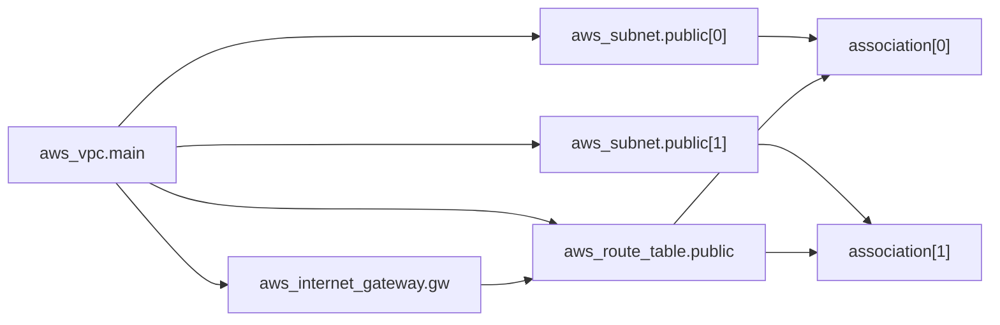

# 6장 — 참조와 의존성: 그래프가 순서를 정한다

**이 장에서 배우는 것**

- `vpc_id = aws_vpc.main.id` 한 줄이 어떻게 apply 순서를 만드는지, 그리고 Terraform이 그래프를 세워 순서를 계산하는 과정을 설명할 수 있다.
- `terraform graph` 로 의존 관계를 확인하고, 병렬 실행과 `-parallelism` 이 무엇을 바꾸는지 안다.
- `(known after apply)` 가 무엇을 뜻하는지 알고, 계산된 값을 `count` 에 넣었을 때 왜 plan이 실패하는지 설명할 수 있다.
- `depends_on` 이 정말 필요한 경우(IAM 전파, 권한, 삭제 경합)와 남용의 비용을 구분할 수 있다.
- `Cycle:` 에러를 읽고 시큐리티 그룹 규칙을 분리해 푸는 방법, destroy가 역순이라는 사실이 만드는 사고를 안다.

**왜 중요한가**

Terraform을 처음 쓰는 사람은 "파일 위에서 아래로 실행되겠지"라고 생각한다. 그렇지 않다. `.tf` 파일 안의 블록 순서는 실행 순서와 아무 관계가 없고, 파일이 여러 개면 어느 파일이 먼저인지도 정의돼 있지 않다. 순서를 정하는 것은 오직 **참조**다. 이 사실을 모르면 실제로는 일어나지 않는 걱정을 하거나, 반대로 "당연히 순서대로 되겠지" 하고 방심하다 물린다.

방심의 대표적 결과가 IAM이다. role을 만들고, policy를 붙이고, 그 role을 쓰는 Lambda 함수를 만드는 세 리소스를 apply하면 종종 실패한다. Terraform은 참조를 따라 순서를 정확히 지켰는데도, IAM 서비스 자체가 최종 일관성(eventual consistency)을 가져서 "방금 만든 role이 아직 없다"거나 "그 서비스가 이 role을 assume할 권한이 없다"는 에러가 돌아온다. provider 기여자 문서는 이 상황을 정확히 이 세 단계 예시로 설명하며 `internal/service/iam` 패키지에 **2분짜리 표준 타임아웃 상수**를 두어 재시도한다고 적는다.

가장 비싼 사고는 destroy에서 나온다. destroy는 생성의 정확한 역순이다. 인터넷 게이트웨이를 참조하지 않는 NAT gateway를 만들어 두면 destroy 때 IGW가 먼저 지워지고 NAT gateway 삭제가 그 뒤에서 막힌다. `terraform destroy` 는 절반쯤 진행된 상태로 멈추고, state에는 이미 지워진 것과 아직 남은 것이 섞인다. 이 상태를 손으로 푸는 시간이 `depends_on` 한 줄을 적는 시간보다 압도적으로 길다.

## 한 줄이 순서를 만든다

```terraform
resource "aws_vpc" "main" {
  cidr_block = "10.0.0.0/16"
}

resource "aws_subnet" "app" {
  vpc_id     = aws_vpc.main.id
  cidr_block = "10.0.1.0/24"
}
```

`vpc_id = aws_vpc.main.id` 는 값을 가져오는 표현식이면서 동시에 **선언**이다. "이 서브넷을 만들려면 저 VPC의 `id` 가 필요하다"는 사실을 Terraform이 읽고 VPC를 먼저 만든다. 이것이 **암묵적 의존성(implicit dependency)** 이다.

핵심은 Terraform이 AWS를 전혀 모른다는 점이다. VPC가 서브넷의 부모라는 것도, `vpc_id` 라는 인수 이름의 의미도 모른다. 아는 것은 "`aws_subnet.app` 의 설정 안에 `aws_vpc.main` 을 가리키는 표현식이 있다"뿐이다. 그래서 **참조가 있으면 의존이 생기고 없으면 안 생긴다.**

반대로 `vpc_id = "vpc-0a1b2c3d4e5f67890"` 처럼 하드코딩하면 의존성이 사라진다. 이 서브넷은 `aws_vpc.main` 과 아무 관계가 없다. 동시에 만들어지려 시도하다 실패하고, 운 좋게 성공해도 VPC를 지울 때 서브넷이 먼저 지워진다는 보장이 없다. ID를 문자열로 복사해 붙이는 습관이 위험한 진짜 이유가 이것이다 — 값이 맞느냐 틀리느냐 이전에 **그래프에서 사라진다.**

참조는 인수 값뿐 아니라 어디에 있어도 의존성을 만든다. 태그 값 안의 보간, `locals` 를 거친 간접 참조, `output` 을 통한 모듈 간 참조가 모두 같다 — `tags = { Parent = "vpc-${aws_vpc.main.id}" }` 한 줄만 있어도 의존성이 생긴다.


## Terraform은 그래프를 만든다

`terraform plan` 이나 `apply` 를 실행하면 Terraform은 설정과 state를 읽어 **방향 비순환 그래프(DAG, Directed Acyclic Graph)** 를 만든다. 노드는 리소스·데이터 소스·provider·변수·출력이고, 간선은 참조다. 그다음 이 그래프를 **위상 정렬(topological sort)** 해서 "누구보다 누가 먼저인가"를 결정한다.

"비순환"이 조건에 들어 있다는 점이 중요하다. 그래프에 사이클이 있으면 위상 정렬이 불가능하고, Terraform은 아무것도 실행하지 않고 `Cycle:` 에러로 멈춘다. 뒤에서 다시 다룬다.



이 그래프에서 읽어야 할 것은 순서만이 아니다. **화살표로 연결되지 않은 것들은 서로 순서가 없다.** `aws_internet_gateway.gw` 와 `aws_subnet.public[0]` 사이에는 간선이 없으므로 둘은 **동시에** 만들어진다 — VPC 생성이 끝나는 순간 IGW와 서브넷 두 개가 한꺼번에 요청된다. 이것이 Terraform이 셸 스크립트보다 빠른 이유다.

## 병렬 실행과 `-parallelism`

Terraform은 서로 의존하지 않는 작업을 동시에 처리하며, 동시 실행 개수의 기본값은 **10**이다. `-parallelism=<n>` 으로 조정한다.

```console
$ terraform apply -parallelism=5
$ terraform apply -parallelism=1   # 완전 직렬. 디버깅용
```

**줄이는 경우**는 AWS API 스로틀링을 만났을 때다. `RequestLimitExceeded` 가 반복되면 병렬도를 낮추는 것이 첫 대응이다 — provider에 재시도 장치가 있고(`max_retries` 기본값은 **25**다) 지수 백오프도 걸리지만 애초에 요청을 덜 쏘는 쪽이 확실하다. `-parallelism=1` 은 에러가 어느 리소스에서 났는지 보고 싶을 때도 유용하다.

**늘리는 경우**는 리소스가 많고 각각 오래 걸리며 API 여유가 있을 때다. 다만 병렬도를 올리면 스로틀링 확률이 올라가고 스로틀링은 재시도 대기로 이어져 오히려 느려질 수 있다([40장](../level3-advanced/40-performance-and-throttling.md)).

`-parallelism` 은 **그래프를 바꾸지 않는다.** 동시에 처리할 개수만 달라지므로, 순서 문제가 있는 설정은 `-parallelism=1` 로도 여전히 틀린 순서로 실행된다.

### `terraform graph` 로 눈으로 보기

의존 관계가 머릿속에서 꼬이면 그리게 한다. `terraform graph` 는 DOT 언어를 출력하고, Graphviz가 있으면 `terraform graph | dot -Tsvg > graph.svg` 로 그림이 된다. 리소스가 스무 개만 넘어도 그림이 읽기 어려워지므로 실무에서는 텍스트 출력에서 `grep` 으로 특정 주소를 찾아 "이것이 무엇에 의존하는가"를 확인하는 데 쓴다. 가장 유용한 순간은 둘이다 — `Cycle:` 에러의 원인 간선을 찾을 때, 그리고 "이 리소스를 지우면 무엇이 함께 지워지나"를 apply 전에 확인할 때다.

## `(known after apply)` 가 뜻하는 것

plan에서 가장 자주 보는 문구이면서 가장 자주 오해되는 것이다.

```console
  + resource "aws_subnet" "app" {
      + arn        = (known after apply)
      + cidr_block = "10.0.1.0/24"
      + id         = (known after apply)
      + vpc_id     = (known after apply)
    }
```

`vpc_id` 가 `(known after apply)` 인 이유는 단순하다. VPC가 아직 없으므로 그 `id` 도 아직 없다. AWS가 만들어 준 뒤에야 알 수 있는 값이다. 에러가 아니라 정상이다.

중요한 것은 이 "아직 모름"이 **전염된다**는 점이다. `arn` 안에 `id` 가 들어가므로 `arn` 도 `(known after apply)` 이고, 태그 값을 `"parent-${aws_vpc.main.id}"` 로 만들면 그 태그도 마찬가지다. 대부분은 아무 문제가 아니고, 문제가 되는 곳은 하나 — **Terraform이 plan 시점에 반드시 알아야 하는 자리**에 이 값이 들어갈 때다.

### 계산된 값을 `count` 나 `for_each` 에 넣으면

```terraform
# 이 설정은 plan에서 실패한다
data "aws_availability_zones" "available" {}

resource "aws_subnet" "app" {
  count = length(data.aws_availability_zones.available.names) # 아직 모를 수 있다

  vpc_id            = aws_vpc.main.id
  cidr_block        = cidrsubnet(aws_vpc.main.cidr_block, 8, count.index)
  availability_zone = data.aws_availability_zones.available.names[count.index]
}
```

`count` 는 **몇 개의 인스턴스를 만들 것인가**를 정한다. Terraform은 plan에서 인스턴스마다 주소(`aws_subnet.app[0]`, `[1]`, ...)를 붙여야 하므로 개수를 미리 알아야 하고, 개수 자체가 apply 후에나 알 수 있는 값이면 plan을 완성할 수 없다.

```console
Error: Invalid count argument

The "count" value depends on resource attributes that cannot be determined
until apply, so Terraform cannot predict how many instances will be created.
```

해법은 셋이다. (1) 개수를 변수로 고정한다(`count = var.az_count`). (2) 값을 리소스가 아니라 **데이터 소스**에서 가져오되 그 데이터 소스가 리소스에 의존하지 않게 한다. (3) 정말 두 단계가 필요하면 apply를 나눈다. `for_each` 는 **키**만 미리 알려져 있으면 되므로 `count` 보다 조금 관대하다([17장](../level2-intermediate/17-count-foreach-dynamic.md)).

## `depends_on` 이 정말 필요한 경우

`depends_on` 은 참조 없이 순서만 강제하는 메타 인수이며, 값으로 드러나지 않는 순서가 실제로 존재할 때만 쓴다.

```terraform
resource "aws_nat_gateway" "example" {
  allocation_id = aws_eip.example.id
  subnet_id     = aws_subnet.example.id

  depends_on = [aws_internet_gateway.example] # 원문이 권장하는 형태
}
```

원문 문서들이 직접 `depends_on` 을 쓰거나 권장하는 자리를 보면 패턴이 보인다.

**1) 상위 리소스가 준비돼야 하는데 참조할 값이 없을 때.** `aws_nat_gateway` 문서는 "적절한 순서를 보장하기 위해 VPC의 인터넷 게이트웨이에 대한 명시적 의존성을 추가할 것을 권장한다"고 적는다. NAT gateway는 IGW의 어떤 속성도 쓰지 않고 `subnet_id` 와 `allocation_id` 만 받는데, IGW가 없으면 퍼블릭 NAT는 동작하지 않는다. `aws_internet_gateway` 문서도 "인스턴스나 Elastic IP가 인터넷 게이트웨이에 의존한다고 표시할 것을 권장한다"고 쓴다.

**2) IAM 권한 전파.** provider 기여자 문서는 "IAM role 생성 → policy 연결 → 다른 서비스에서 그 role 참조"가 빠르게 연달아 일어나면 마지막 작업이 세 종류의 에러를 받을 수 있다고 적는다 — role이 없다, 그 서비스가 role을 assume할 권한이 없다, 권한이 충분하지 않다. Lambda 함수는 `role = aws_iam_role.x.arn` 으로 role을 참조하지만 그 role에 **붙은 정책**은 참조하지 않으므로 순서가 그래프에 없다 — `depends_on = [aws_iam_role_policy_attachment.lambda_basic]` 이 그 자리를 메운다.

**3) 권한이나 설정이 먼저 있어야 할 때.** `aws_lambda_permission` 문서의 CloudWatch Logs 예제는 `aws_cloudwatch_log_subscription_filter` 에 `depends_on = [aws_lambda_permission.logging]` 을 건다 — 구독 필터는 permission의 속성을 하나도 참조하지 않지만 만들어지는 시점에 Lambda 호출 권한이 이미 있어야 한다. `aws_s3_bucket_versioning` 도 마찬가지로, `version_id` 가 필요한 객체는 암묵적으로든 명시적으로든 버저닝 리소스에 의존해야 한다. 5장의 IPAM 예제도 같은 부류다.

**4) 삭제 경합.** `aws_ecs_service` 문서는 서비스 삭제 중의 race condition을 막기 위해 관련 `aws_iam_role_policy` 에 `depends_on` 을 설정하라고 적고, 그러지 않으면 **정책이 너무 일찍 파괴되어 ECS 서비스가 `DRAINING` 상태에서 멈춘다**고 경고한다.

## `depends_on` 의 대가

`depends_on` 은 값싸 보이지만 그래프에 간선을 추가하는 일이고, 간선은 병렬성을 깎는다.

가장 흔한 남용은 `depends_on = [module.network]` 처럼 모듈 전체에 거는 것이다. 이렇게 쓰면 `module.network` 안의 **모든** 리소스가 끝나야 `module.app` 안의 **어떤** 리소스도 시작할 수 있다. 실제로는 app의 절반이 network의 VPC 하나에만 의존할 수도 있는데 전체가 직렬화된다.

두 번째 비용은 **삭제 순서까지 함께 묶인다**는 점이다. `depends_on` 은 destroy에서 역방향으로 작용하므로, 순서가 필요 없는 곳에 걸어 두면 destroy에서도 불필요한 직렬화가 생긴다.

원칙은 셋이다. 참조로 표현할 수 있으면 참조로 표현하고 `depends_on` 은 마지막 수단으로 남긴다. 걸어야 한다면 모듈 전체가 아니라 그 안의 특정 리소스를 지목한다. 그리고 왜 걸었는지 주석으로 남긴다 — "IAM 전파 대기" 같은 한 줄이 6개월 뒤 판단의 근거가 된다.

## 순환 의존성: `Cycle:` 에러

두 리소스가 서로를 참조하면 사이클이 생겨 위상 정렬이 불가능해지고, Terraform은 아무것도 실행하지 않고 멈춘다.

```console
Error: Cycle: aws_security_group.app, aws_security_group.db
```

가장 자주 만나는 형태는 시큐리티 그룹 두 개가 서로를 소스로 삼는 경우다. "app의 인라인 `egress` 가 `aws_security_group.db.id` 를 참조하고, db의 인라인 `ingress` 가 `aws_security_group.app.id` 를 참조한다" — 이 순간 그래프는 닫힌 고리가 된다.


푸는 방법은 **규칙을 그룹에서 떼어내는 것**이다. 시큐리티 그룹은 규칙 없이 만들 수 있으므로 빈 그룹 두 개를 먼저 만들고 규칙을 별도 리소스로 붙이면 사이클이 사라진다 — 그룹은 서로를 모르고 규칙만 양쪽 ID를 안다.

```terraform
# ✅ 그룹과 규칙을 분리한다
resource "aws_security_group" "app" {
  name   = "app"
  vpc_id = aws_vpc.main.id
}

resource "aws_security_group" "db" {
  name   = "db"
  vpc_id = aws_vpc.main.id
}

resource "aws_vpc_security_group_ingress_rule" "db_from_app" {
  security_group_id            = aws_security_group.db.id
  referenced_security_group_id = aws_security_group.app.id
  from_port                    = 3306
  to_port                      = 3306
  ip_protocol                  = "tcp"
}

# egress 쪽도 같은 모양이다: aws_vpc_security_group_egress_rule "app_to_db"
```

`aws_vpc_security_group_ingress_rule` 과 `aws_vpc_security_group_egress_rule` 은 원문이 **현재의 모범 사례**라고 명시한 리소스다. 원문은 인라인 `ingress`/`egress` 인수와 예전 `aws_security_group_rule` 을 피하라고 하는데, 여러 CIDR 블록을 다루기 어렵고 고유 ID가 역사적으로 없어 태그와 설명을 붙이기 어렵기 때문이다. **같은 그룹에 인라인 규칙과 별도 규칙 리소스를 섞어 쓰면 안 된다**는 경고도 붙는다 — 규칙 충돌, 영구적인 diff, 덮어쓰기가 일어난다.

사이클을 푸는 일반 전략은 셋이다. (1) 양방향 관계를 갖는 부분을 별도 리소스로 분리한다. (2) 한쪽 참조를 값으로 대체할 수 있는지 본다 — 이름이나 CIDR처럼 미리 정할 수 있는 값이면 참조 대신 변수를 쓴다. (3) `depends_on` 이 사이클을 만들지 않았는지 확인한다. 참조가 아니라 `depends_on` 때문에 생기는 경우가 실제로 많다.

## destroy는 역순이다

Terraform은 destroy 시 그래프를 뒤집는다. 생성에서 A가 B보다 먼저였다면 삭제에서는 B가 먼저다. 대개 이것이 원하는 동작이다 — 서브넷을 지우고 나서 VPC를 지운다.

문제는 그래프에 없는 순서다. NAT gateway가 IGW를 참조하지 않으면 둘 사이에 간선이 없고 destroy에서 IGW가 먼저 지워질 수 있다. 그러면 NAT gateway 삭제가 실패하거나 오래 매달린다. `depends_on = [aws_internet_gateway.example]` 을 걸어 두면 생성에서 IGW가 먼저, 삭제에서 NAT gateway가 먼저가 된다 — 한 줄이 양쪽을 다 해결한다. `aws_ecs_service` 의 `DRAINING` 교착도 같은 구조로, 서비스가 IAM 정책을 참조하지 않으면 destroy에서 정책이 먼저 지워지고 정책을 잃은 서비스가 태스크를 정리하지 못한 채 멈춘다.

### 시큐리티 그룹 삭제 문제

`aws_security_group` 문서는 이 주제에 긴 절을 할애한다. 시큐리티 그룹의 `name` 을 바꾸면 교체가 일어난다(`description`, `name_prefix`, `vpc_id` 도 변경할 수 없다). 그런데 시큐리티 그룹은 **100개가 넘는 AWS Provider 리소스**가 참조하는 대상이다. EC2 인스턴스가 `vpc_security_group_ids` 로 그룹을 참조하면 단방향 의존성이 생기고, Terraform은 그룹을 먼저 만들어 인스턴스에 붙인다.

문제는 실제 의존 관계가 **양방향**이라는 점이다. AWS는 다른 리소스에 연결된 시큐리티 그룹의 삭제를 허용하지 않는다. 원문의 표현대로 **Terraform은 이런 양방향 의존성을 모델링하지 않으며**, 설령 모델링하더라도 해결되지 않는다 — 그룹이 재생성을 시도할 때 받는 dependent object 에러는 그 의존 객체가 규칙인지 EC2 인스턴스인지 알려 주지 않고, 정작 연결을 끊어야 할 인스턴스 쪽에서는 에러가 나지도 않는다.

원문이 제시하는 완화책은 `lifecycle` 메타 인수다. `create_before_destroy = true` 는 기본 동작(지우고 만들기)을 뒤집어 새 그룹을 먼저 만들고, `replace_triggered_by` 는 시큐리티 그룹이 바뀔 때 그것을 쓰는 인스턴스를 함께 교체하게 만든다([21장](../level2-intermediate/21-lifecycle-meta-arguments.md)).

또 하나, `revoke_rules_on_delete`(기본 `false`)는 그룹을 지우기 전에 붙어 있는 규칙을 모두 취소한다. 원문은 보통은 필요 없지만 **Elastic Map Reduce 같은 일부 AWS 서비스가 규칙을 자동으로 추가하고 그 규칙이 순환 의존성을 만들어 그룹 삭제를 막는 경우**가 있다고 설명한다.

## 리소스 주소 표기법

에러 메시지, `terraform state list`, `-target`, `moved` 블록이 모두 같은 표기를 쓴다. 정확히 읽고 쓸 수 있어야 한다.

| 표기 | 의미 |
|---|---|
| `aws_vpc.main` | 리소스. 타입 + 로컬 이름 |
| `aws_subnet.private[0]` | `count` 로 만들어진 인스턴스. 인덱스는 정수 |
| `aws_subnet.private["a"]` | `for_each` 로 만들어진 인스턴스. 키는 문자열 |
| `data.aws_availability_zones.available` | 데이터 소스. 앞에 `data.` 가 붙는다 |
| `module.vpc.aws_vpc.this` | 모듈 안의 리소스. `for_each` 가 걸린 모듈이면 `module.vpc["prod"].aws_vpc.this` |
| `var.region` / `local.name` / `output.vpc_id` | 변수·로컬·출력 |

주의할 점 둘. 리소스 주소에는 provider alias가 들어가지 않는다 — `provider = aws.tokyo` 로 만든 리소스도 주소는 그냥 `aws_vpc.main` 이다. 그리고 `count` 를 쓰면 `count = 1` 이라도 주소에 `[0]` 이 붙는다. `count` 를 나중에 붙이거나 떼는 것이 state 주소를 바꾸는 리팩터링이 되는 이유다.

셸에서는 대괄호와 따옴표를 감싼다 — `terraform state show 'aws_subnet.private["a"]'`. `-target` 은 지정한 리소스와 **그것이 의존하는 것들**을 함께 처리한다.

## 흔한 실수

### ❌ ID를 문자열로 복사해 붙인다

값은 맞을지 몰라도 그래프에서 사라진다. 생성 순서도 삭제 순서도 보장되지 않는다.

```terraform
resource "aws_subnet" "app" {
  vpc_id = "vpc-0a1b2c3d4e5f67890" # 의존성이 없다
}
```

```terraform
# ✅ 참조로 쓴다. 이미 있는 VPC라면 데이터 소스를 거친다
data "aws_vpc" "existing" {
  id = var.vpc_id
}

resource "aws_subnet" "app" {
  vpc_id = data.aws_vpc.existing.id
  # ... 나머지 설정 ...
}
```

### ❌ `depends_on` 을 모듈 전체에 건다

`module.network` 의 모든 리소스가 끝나야 `module.app` 이 시작한다. 그래프가 두 덩어리로 직렬화된다.

```terraform
module "app" {
  source     = "./modules/app"
  depends_on = [module.network] # 과도하다
}
```

```terraform
# ✅ 필요한 값을 넘겨 암묵적 의존성으로 만든다
module "app" {
  source     = "./modules/app"
  vpc_id     = module.network.vpc_id
  subnet_ids = module.network.private_subnet_ids
}
```

### ❌ 인라인 규칙과 별도 규칙 리소스를 섞는다

원문이 명시적으로 경고하는 조합이다. 규칙 충돌, 영구적인 diff, 규칙이 덮어써지는 현상이 생긴다.

```terraform
resource "aws_security_group" "app" {
  vpc_id = aws_vpc.main.id

  ingress { # 인라인 규칙
    from_port   = 443
    to_port     = 443
    protocol    = "tcp"
    cidr_blocks = ["10.0.0.0/16"]
  }
}

resource "aws_vpc_security_group_ingress_rule" "extra" { # 그리고 별도 리소스
  security_group_id = aws_security_group.app.id
  cidr_ipv4         = "10.1.0.0/16"
  # ... 나머지 설정 ...
}
```

```terraform
# ✅ 한 방식으로 통일한다. 현재 모범 사례는 별도 규칙 리소스다
resource "aws_security_group" "app" {
  name   = "app"
  vpc_id = aws_vpc.main.id
}

resource "aws_vpc_security_group_ingress_rule" "vpc" {
  security_group_id = aws_security_group.app.id
  cidr_ipv4         = "10.0.0.0/16"
  from_port         = 443
  to_port           = 443
  ip_protocol       = "tcp"
}
```

### ❌ 계산된 값을 `count` 에 넣는다

plan 시점에 개수를 알 수 없으면 Terraform은 인스턴스 주소를 만들 수 없다. `Invalid count argument` 로 실패한다.

```terraform
resource "aws_subnet" "app" {
  count = length(aws_vpc.main.cidr_block) > 0 ? 3 : 0 # 아직 모르는 값에 의존
  # ...
}
```

```terraform
# ✅ 개수는 설정에서 결정되는 값으로 고정한다
variable "az_count" {
  type    = number
  default = 3
}

resource "aws_subnet" "app" {
  count = var.az_count
  # ...
}
```


## 프로덕션 노트

- **IAM 전파는 코드가 아니라 시간의 문제다.** provider는 `internal/service/iam` 패키지에 2분짜리 표준 타임아웃 상수를 두고 IAM 에러를 재시도하며, 문서는 이 값이 "모든 AWS API를 다룬 수년간의 운영 경험에서 나온 것"이라고 밝힌다. 그래도 실패하면 정책 연결 리소스에 `depends_on` 을 건다. 서비스마다 전파 대기가 다르다 — `aws_lambda_function` 의 `use_resource_timeout_for_propagation` 은 기본 5분 전파 타임아웃 대신 리소스의 `timeouts` 를 쓰게 한다.

- **destroy 실패는 절반의 상태를 남긴다.** destroy는 실패해도 이미 지운 것을 되돌리지 않으므로, 순서가 꼬여 멈추면 state에 "지워졌다고 기록된 것"과 "아직 남은 것"이 섞인다. 임시 환경을 자주 지우는 팀이라면 CI에서 `terraform destroy` 를 정기적으로 돌려 순서 문제를 미리 노출시킨다.

- **`-parallelism` 을 낮추는 것은 스로틀링의 첫 번째 대응이다.** `max_retries` 기본값 25에 지수 백오프가 걸리지만 재시도는 시간을 쓴다. `RequestLimitExceeded` 가 반복되면 `-parallelism=5` 로 낮춰 보고, 그래도 안 되면 설정을 여러 state로 쪼개는 것을 검토한다.

- **`-target` 은 응급 도구이고 `depends_on` 에는 이유를 남긴다.** `-target` 은 반복해 쓰면 "전체 plan을 한 번도 통과시키지 않은 설정"을 만들므로 사용 후 전체 plan으로 `No changes` 를 확인한다. `depends_on` 옆에는 "IAM 전파", "IGW 선행 필요"처럼 한 단어라도 주석으로 적어 둔다 — 6개월 뒤 그 줄을 지워도 되는지 판단할 유일한 근거다.

- **시큐리티 그룹 재생성은 사전에 설계한다.** AWS는 연결된 그룹의 삭제를 허용하지 않으므로, `name` 대신 `name_prefix` 를 쓰고 `create_before_destroy = true` 를 미리 걸어 두는 것이 사고를 예방한다. destroy가 반복적으로 막히면 `revoke_rules_on_delete` 를 확인한다.

## 연습문제

**1. 그래프를 눈으로 확인하기**
VPC, IGW, 서브넷 둘, 라우트 테이블, 연결 둘로 이루어진 설정을 만들고 `terraform graph` 를 실행한다. 그다음 서브넷 하나의 `vpc_id` 를 하드코딩된 문자열로 바꾸고 다시 실행한다.
*성공 기준:* 두 그래프의 차이를 지목하고 하드코딩한 서브넷이 어떤 간선을 잃었는지 설명한다. 그 상태로 apply와 destroy를 했을 때 무엇이 위험한지 두 문장으로 적는다.

**2. 사이클을 만들고 풀기**
시큐리티 그룹 두 개가 인라인 규칙으로 서로를 참조하는 설정을 일부러 만들어 plan을 실행한 뒤, `aws_vpc_security_group_ingress_rule` 과 `_egress_rule` 로 규칙을 분리한다.
*성공 기준:* 처음에는 `Cycle:` 에러로 plan이 실패하고 메시지에 두 그룹의 주소가 나온다. 분리 후에는 plan이 통과하며, 두 그룹 사이에 직접 간선이 없음을 `terraform graph` 로 확인한다.

**3. 삭제 순서를 실험하기**
VPC, IGW, EIP, 퍼블릭 서브넷, NAT gateway를 만들되 NAT gateway에 `depends_on` 을 **넣지 않고** apply한 뒤 destroy한다. 그다음 `depends_on = [aws_internet_gateway.gw]` 를 넣고 반복한다.
*성공 기준:* 두 경우의 destroy 로그에서 IGW와 NAT gateway의 삭제 순서를 표로 비교하고, 첫 번째에서 실패나 긴 대기가 있었다면 에러 메시지를 기록한다. `depends_on` 이 생성과 삭제 양쪽에 어떻게 작용했는지 설명한다.


## 요약

- `.tf` 블록의 순서는 실행 순서와 무관하다. 순서를 만드는 것은 오직 참조이며 `vpc_id = aws_vpc.main.id` 한 줄이 암묵적 의존성을 만든다. ID를 하드코딩하면 그래프에서 그 간선이 사라진다.
- Terraform은 설정과 state로 DAG를 만들고 위상 정렬해 순서를 정한다. 간선으로 연결되지 않은 리소스들은 병렬로 처리되며, 동시 실행 개수의 기본값은 10, `-parallelism` 으로 조정한다. 이 옵션은 그래프를 바꾸지 않는다. `terraform graph` 의 DOT 출력은 `Cycle:` 원인을 찾거나 "이것을 지우면 무엇이 함께 지워지나"를 확인할 때 쓴다.
- `(known after apply)` 는 "AWS가 만들어야 알 수 있는 값"이며 다른 값으로 전염된다. 문제가 되는 것은 plan 시점에 반드시 알아야 하는 자리 — `count` 에 계산된 값을 넣으면 `Invalid count argument` 로 실패한다.
- `depends_on` 은 값으로 드러나지 않는 순서를 위한 것이다. 원문이 권장하거나 직접 쓰는 자리는 NAT gateway와 IGW, IAM 권한 전파, `aws_lambda_permission` 과 구독 필터, `aws_s3_bucket_versioning` 과 객체, ECS 서비스 삭제 시의 IAM 정책, IPAM 풀 CIDR 등이다. 모듈 전체에 걸면 그래프가 직렬화되어 느려지고 삭제 순서까지 묶이므로, 걸어야 한다면 대상을 좁히고 이유를 주석으로 남긴다.
- 사이클은 `Cycle:` 에러로 plan 단계에서 멈춘다. 대표 사례는 시큐리티 그룹 두 개의 상호 참조이며 `aws_vpc_security_group_ingress_rule`/`_egress_rule` 로 규칙을 분리해 푼다. 인라인 규칙과 별도 규칙 리소스를 섞으면 규칙 충돌·영구 diff·덮어쓰기가 생긴다.
- destroy는 생성의 역순이다. 그래프에 없는 순서는 destroy에도 없으므로 IGW가 NAT gateway보다 먼저 지워질 수 있고, ECS 서비스는 IAM 정책을 잃고 `DRAINING` 에서 멈출 수 있다. 100개가 넘는 리소스가 시큐리티 그룹을 참조하지만 Terraform은 양방향 의존성을 모델링하지 않으며, 완화책은 `create_before_destroy`, `replace_triggered_by`, `revoke_rules_on_delete` 다.
- 리소스 주소는 `aws_vpc.main`, `aws_subnet.private[0]`, `aws_subnet.private["a"]`, `data.aws_availability_zones.available`, `module.vpc.aws_vpc.this` 형태다. provider alias는 주소에 들어가지 않고, `count = 1` 이라도 인덱스가 붙는다.

## 다음으로

- [7장 — 변수·출력·로컬](07-variables-outputs-locals.md) — 값을 밖으로 빼면서 의존성을 유지하는 법.
- [17장 — count · for_each · dynamic](../level2-intermediate/17-count-foreach-dynamic.md) — `(known after apply)` 와 반복이 만나는 지점.
- [21장 — lifecycle](../level2-intermediate/21-lifecycle-meta-arguments.md) — `create_before_destroy`, `replace_triggered_by` 의 전모.
- [40장 — 성능과 API 스로틀링](../level3-advanced/40-performance-and-throttling.md) — 병렬성과 대형 state.
- Terraform 그래프 문서: <https://developer.hashicorp.com/terraform/internals/graph>
