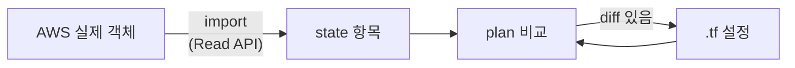

# 20장 — Import와 Resource Identity: 이미 있는 것을 데려오기

**이 장에서 배우는 것**

- import가 무엇을 하고 무엇을 하지 않는지 구분하고, `terraform import` CLI·`import` 블록·`identity` 기반 import를 상황에 맞게 고를 수 있다.
- 리소스마다 다른 import ID 형식을 문서 Import 절에서 찾아내고, v6의 `@<region>` 접미사를 쓸 수 있다.
- Resource Identity가 왜 생겼는지, ARN·Singleton·Parameterized Identity가 어떻게 다른지 설명하고 Identity Schema를 읽을 수 있다.
- `id` 속성이 더 이상 필수가 아니게 된 흐름과, 그것이 import ID 형식에 남긴 결과를 안다.
- `-generate-config-out` 으로 뼈대를 만든 뒤 손봐야 할 부분을 알고, plan이 비지 않을 때 원인을 좁히고, 잘못 넣었을 때 되돌릴 수 있다.

**왜 중요한가**

Terraform을 도입하는 팀은 거의 빈 계정에서 시작하지 않는다. 콘솔로 만든 VPC 하나, 6년 된 S3 버킷 40개, 누가 만들었는지 모르는 IAM 롤 200개가 이미 돌아가고 있다. 잘못 고르는 길은 둘이다. "코드로 다시 만들고 옛것은 지운다"는 다운타임을 만들고, "기존 것은 두고 새 것만 Terraform으로"는 2년 뒤 "관리되는 절반"과 "아무도 모르는 절반"이 서로 참조하는 상태를 만든다.

import를 모르면 더 나쁜 일도 생긴다. 어떤 팀이 기존 VPC와 같은 CIDR로 코드를 짜서 apply 했다. `10.0.0.0/16` VPC가 하나 더 생겼고 새 서브넷·NAT Gateway·라우팅 테이블이 붙었다. 트래픽이 전혀 흐르지 않는 두 번째 네트워크에서 NAT Gateway 3대가 한 달간 켜져 있었고, 리전당 VPC 기본 할당량이 5개라서 세 번째 팀이 같은 짓을 했을 때는 `VpcLimitExceeded` 로 배포가 막혔다. 반대로 import를 절차 없이 쓰다 사고가 나기도 한다. `terraform import aws_s3_bucket.logs prod-app-logs` 를 성공시킨 뒤 plan을 읽지 않고 apply 했더니 코드에 없던 versioning과 lifecycle 설정이 "설정에 없으니 제거"로 계산되어 사라졌다. **import는 state만 채우고 코드는 채우지 않는다**는 사실을 몰랐기 때문이다.

## import가 하는 일과 하지 않는 일

**import는 AWS에 아무것도 만들지 않고 바꾸지도 않는다.** 하는 일은 "AWS에 있는 이 객체가 내 설정의 이 주소에 해당한다"는 매핑을 state에 기록하는 것뿐이고([9장](../level1-beginner/09-state-basics.md)의 `resources[]` 항목이 하나 생긴다), 그 과정에서 Read API로 현재 속성값을 채운다.

하지 않는 일은 셋이다.

- **`.tf` 파일을 대신 써 주지 않는다.** CLI는 코드를 전혀 만들지 않고, `-generate-config-out` 을 붙였을 때만 초안이 나온다.
- **AWS 쪽 설정을 코드에 맞추지 않는다.** import 직후 state는 AWS의 현실이고 코드는 사람이 쓴 근사치다. 차이는 다음 plan에 diff로 나타난다.
- **되돌리기가 자동이 아니다.** `terraform state rm` 으로 state에서만 뺀다. `destroy` 는 진짜 지운다.



**import는 첫 화살표 하나뿐**이고, 아래의 루프는 사람이 돌린다.

## 세 가지 방법

리소스 문서의 Import 절은 세 방법을 최신 것부터 보여 준다. 셋은 대체 관계가 아니라 지층에 가깝다.

| 방법 | 요구 버전 | 코드에 흔적 | plan에서 미리 확인 |
|---|---|---|---|
| `terraform import` CLI | 아주 오래됨 | 없음 | 불가 |
| `import` 블록 + `id` | Terraform 1.5.0+ | 남음 | 가능 |
| `import` 블록 + `identity` | Terraform 1.12.0+ | 남음 | 가능 |

세 번째 층은 앞의 두 층이 문자열 하나에 모든 것을 밀어 넣던 방식을 정리한 결과다.

### `terraform import` CLI

```console
$ terraform import aws_vpc.test_vpc vpc-a01106c2
```

**`aws_vpc.test_vpc` 블록이 이미 설정 파일에 존재해야 한다.** 없으면 `resource address ... does not exist in the configuration` 으로 거부된다. 실제 순서는 "빈 껍데기 블록을 쓴다 → import 한다 → plan을 보며 인수를 채운다"가 된다.

문제는 셋이다. **미리 볼 수 없고**(실행하는 순간 state가 바뀌어 plan 승인 흐름에 넣을 수 없다), **기록이 남지 않고**, **한 번에 하나씩이다.** 그래도 필요한 자리가 있다 — apply가 도중에 실패해 AWS에는 만들어졌는데 state에는 없는 리소스를 수습할 때다.

### `import` 블록

Terraform 1.5.0부터 설정 파일에 쓴다.

```terraform
import {
  to = aws_vpc.test_vpc
  id = "vpc-a01106c2"
}

resource "aws_vpc" "test_vpc" {
  cidr_block           = "10.0.0.0/16"
  enable_dns_hostnames = true
  tags                 = { Name = "legacy-main" }
}
```

```console
$ terraform plan

aws_vpc.test_vpc: Preparing import... [id=vpc-a01106c2]
  # aws_vpc.test_vpc will be imported
Plan: 1 to import, 0 to add, 0 to change, 0 to destroy.
```

여기서 CLI와의 결정적 차이가 나온다. **apply 전에 결과를 본다** — `1 to import, 0 to change` 면 코드가 현실과 일치하고, `1 to import, 3 to change` 면 코드가 틀렸거나 의도적으로 바꾸려는 것이다. 그리고 **PR로 리뷰되고 CI에서 돌아간다.**

apply 후 import 블록은 할 일이 끝난다. 남겨 둬도 무해하지만 관례는 삭제다. 남기면 1년 뒤 `state rm` 했을 때 다시 딸려 들어온다.

## import ID 형식은 리소스마다 다르다

import ID는 "콘솔에 보이는 그 ID"가 아니라 **provider가 그 리소스를 다시 찾는 데 필요한 최소 정보**다. 정답은 항상 문서의 Import 절에 있다. 패턴은 넷이다.

**1. AWS가 만든 단일 ID.**

```console
$ terraform import aws_vpc.test_vpc vpc-a01106c2
$ terraform import aws_instance.web i-12345678
```

**2. 사용자가 정한 이름.** AWS가 ID를 만들지 않고 이름이 곧 식별자인 리소스다.

```console
$ terraform import aws_iam_role.example developer_name
$ terraform import aws_s3_bucket.example bucket-name
$ terraform import aws_db_instance.default mydb-rds-instance
```

**3. ARN 또는 URL 전체.** `aws_acm_certificate` 는 인증서 ARN을, `aws_sqs_queue` 는 큐 URL(`https://queue.amazonaws.com/80398EXAMPLE/MyQueue`)을 그대로 쓴다.

**4. 구분자로 이어 붙인 복합 ID.** 구분자가 리소스마다 다르다는 것이 함정이다.

```console
# 슬래시
$ terraform import aws_iam_role_policy_attachment.example test-role/arn:aws:iam::123456789012:policy/test-policy
$ terraform import aws_ecs_service.imported cluster-name/service-name

# 쉼표 / 언더스코어
$ terraform import aws_ec2_tag.example tgw-attach-1234567890abcdef,Name
$ terraform import aws_route53_record.example Z4KAPRWWNC7JR_dev_NS
```

이 불일치는 우연이 아니라 역사다. `docs/design-decisions/standardize-use-of-the-id-attribute.md` 는 관계 리소스의 다중 키가 "일관된 구분자를 쓰지 않아 왔다"는 이슈를 인용한다. 그래서 **새로 만들어지는 리소스는 쉼표(`,`)로 통일**하기로 결정됐다. 기존 리소스의 구분자는 바꾸면 파괴적 변경이라 그대로 남아 있다.

부수적인 규칙도 붙는다. `aws_s3_bucket_versioning` 은 버킷 소유 계정이 provider 계정과 같으면 `bucket-name` 만, 다르면 `bucket-name,123456789012` 처럼 `expected_bucket_owner` 를 이어 붙인다. **추측하지 말고 문서를 연다.**

## v6의 `@<region>` 접미사

v6.0.0부터 대부분의 리소스에 top-level `region` 인수가 생겼다([24장](24-enhanced-region-support.md)). import에도 대응물이 있다 — `guides/enhanced-region-support.html.markdown` 은 특정 리전의 리소스를 import 하려면 **import ID 뒤에 `@<region>` 을 덧붙이라**고 적는다.

```console
$ terraform import aws_vpc.test_vpc vpc-a01106c2@eu-west-1
```

붙이지 않으면 provider 설정의 리전에서 찾는다. 잘못된 리전이면 대개 "찾을 수 없음" 에러로 끝나지만, 이름으로 식별되는 리소스(`aws_cloudwatch_log_group` 등)가 여러 리전에 같은 이름으로 있으면 **엉뚱한 리전의 객체를 조용히 데려온다.** `identity` 방식에는 접미사가 없고 `region` 이 키 하나로 들어간다.

```terraform
import {
  to = aws_vpc.test_vpc
  identity = {
    id     = "vpc-a01106c2"
    region = "eu-west-1"
  }
}
```

문자열에 구분자를 하나 더 얹는 대신 구조화된 필드로 표현하는 것 — Resource Identity가 푸는 문제의 축소판이다. 같은 문서는 `region` 값을 **바꾸면 리소스가 교체**되고 **지우면 교체되지 않고 state의 이전 값을 쓴다**고 못 박는다. import 직후 코드에 `region` 을 적을지 정할 때 이 비대칭을 기억한다.

## Resource Identity: `id` 문자열을 구조로 바꾸다

`docs/id-attributes.md` 는 배경을 이렇게 설명한다. 과거의 모든 AWS Provider 리소스는 읽기 전용 `id` 속성을 가졌는데, Terraform Plugin SDK V2와 그 acceptance test 라이브러리가 `id` 를 **요구했기 때문**이다. 대부분 `id` 는 AWS가 생성 시 만든 유일 식별자였지만, 식별자가 사용자가 준 값인 리소스에서는 `id` 가 다른 필수 인수의 값을 복제하는 꼴이 됐다.

이 설계가 앞 절의 혼란을 만들었다. 값이 둘 이상 필요하면 문자열로 이어 붙여야 했고 구분자가 제각각이 됐다. 어느 값이 어느 자리인지는 파싱 코드만 알았고, 리전과 계정이 들어갈 자리가 없어서 v6는 `@<region>` 접미사를 또 붙여야 했다.

Resource Identity는 이 문자열을 **키-값 구조**로 바꾼다. `aws_route53_record` 의 identity는 Required가 `zone_id`·`name`·`type`, Optional이 `account_id` 와 `set_identifier` 다. 구분자도, 빈 칸을 표현하는 요령도 없다.

```terraform
import {
  to = aws_route53_record.example
  identity = {
    zone_id = "Z4KAPRWWNC7JR"
    name    = "dev.example.com"
    type    = "NS"
  }
}
```

`docs/resource-identity.md` 는 AWS API의 식별 방식에 따라 identity를 셋으로 나눈다.

**ARN Identity.** ARN으로 유일하게 식별되는 리소스에 쓴다. 조건이 붙는다 — **그 리소스의 AWS API가 실제로 ARN을 파라미터로 받아야 한다.** 아니면 Parameterized Identity를 쓴다. `aws_acm_certificate` 와 `aws_lb_listener` 가 그렇고, 이들의 Identity Schema는 Required가 `arn` 하나뿐이며 **`account_id`·`region` 이 없다** — ARN 안에 이미 들어 있기 때문이다. 구현 쪽에서는 `@ArnIdentity` 애너테이션 하나면 되고, 속성 이름이 `arn` 이 아니면 `@ArnIdentity("resource_arn")` 처럼 넘긴다.

**Singleton Identity.** 리전당 하나, 글로벌이면 계정당 하나만 존재할 수 있는 리소스에 쓴다(`@SingletonIdentity`). 식별할 값 자체가 없으므로 identity 속성을 재정의할 수 없다.

**Parameterized Identity.** 가장 흔하다. 속성 조합으로 리전(글로벌이면 계정) 안에서 유일하게 식별되는 리소스다. 규칙이 하나 있다.

> **`account_id` 와 `region` 은 Parameterized Identity에 항상 존재한다.** 그래서 `@IdentityAttribute` 애너테이션에 이 둘을 적어서는 안 된다.

이 규칙은 문서에서 Identity Schema의 Optional 목록으로 나타난다. `aws_vpc`·`aws_subnet`·`aws_s3_bucket`·`aws_dynamodb_table` 은 Optional에 `account_id` 와 `region` 이 함께 있고, **`aws_iam_role` 과 `aws_iam_role_policy_attachment` 는 `account_id` 만 있다** — IAM이 글로벌 서비스이기 때문이다. Optional 목록만 봐도 그 리소스가 리전 리소스인지 글로벌인지 알 수 있다.

속성이 둘 이상인 예가 `aws_iam_role_policy_attachment` 로, identity는 `role` 과 `policy_arn` 두 키를 갖는다. 같은 리소스를 `id` 로 import 하면 `test-role/arn:aws:iam::123456789012:policy/test-policy` 가 된다. 문서는 속성이 여럿인 identity에 **import ID를 파싱하는 핸들러 구조체**가 필요하다고 적는다(Plugin Framework는 `inttypes.ImportIDParser`, Plugin SDK는 `inttypes.SDKv2ImportID`). **`identity` 를 쓰면 그 파싱 단계가 사라진다.** 반대로 **identity에는 식별에 쓰이는 값만 들어간다** — `aws_s3_bucket_acl` 의 `acl` 은 기존 `id` 문자열의 일부지만 Bucket ACL을 식별하지 않으므로 제외된다.

## `id` 속성 표준화

같은 설계 결정 문서는 2024년의 결론을 기록한다. Plugin Framework가 GA 되고, 테스트 기능이 `terraform-plugin-testing` 으로 분리되고, 그 라이브러리가 `id` 없는 리소스의 import를 테스트할 수 있게 확장되면서 **`id` 속성이 더 이상 필수가 아니게 됐다.**

> **앞으로 만들어지는 모든 신규 리소스는, `id` 가 기존 인수와 중복되거나 여러 인수를 합친 것이라면 `id` 속성을 생략한다.** 그 외에는 지금까지처럼 `id` 를 쓴다. 식별자가 여러 인수의 조합일 때는 **항상 쉼표(`,`)로 구분**한다.

Terraform 0.12 이후 릴리스는 `id` 를 특별 취급하지 않으므로 지워도 안전하다는 근거도 함께 적혀 있다.

실무에서 이것이 보이는 순간은 셋이다. 새 리소스 문서의 Attribute Reference에 `id` 가 없다(`aws_vpc_endpoint_private_dns` 와 `aws_lambda_runtime_management_config` 가 원형이다). `outputs.tf` 에서 `.id` 를 참조했다가 `Unsupported attribute` 를 만난다 — 대신 `.name`·`.vpc_endpoint_id` 같은 실제 식별 인수를 쓴다. 그리고 import ID가 `function_name,qualifier` 처럼 쉼표 규격을 따른다.

반대로 Plugin SDK로 구현된 리소스는 `id` 가 identity와 **항상** 같은 값이다. 문서에서 `identity = { id = ... }` 형태를 본다면 대개 SDK 기반의 오래된 리소스다.

## import 후 plan은 비어 있어야 한다

완료 조건은 하나다 — **`terraform plan` 이 `No changes.` 를 출력한다.** diff가 남았다면 "나중에 정리할 것"이 아니라 **다음 apply 때 프로덕션을 바꿀 예약된 변경**이다.

**1. 어느 인수인지 본다.** plan 출력에서 `~` 로 표시된 줄만 읽고, `-target` 으로 노이즈를 줄인다.

**2. state의 실제 값을 본다.** `terraform state show` 에 보이는 값이 AWS의 현실이다.

**3. 원인을 분류한다.**

- **코드가 현실과 다르다.** 가장 흔하다. 코드를 고친다.
- **코드에 없는 설정이 AWS에 있다.** `aws_s3_bucket` 을 import 했는데 버킷에 versioning·암호화·lifecycle이 걸려 있는 경우다. v4부터 이들은 별도 리소스이므로([12장](../level1-beginner/12-s3-bucket.md)) 각각 따로 import 해야 한다.
- **provider가 값을 읽어 오지 못한다.** `aws_organizations_account` 의 `role_name` 이 그 예다. 문서는 "Organizations API에 계정 생성 후 이 정보를 읽는 방법이 없어 drift 감지를 할 수 없고, 설정에 값이 있으면 import 후 **항상** 차이를 보인다"고 적는다. 그 인수를 빼거나 `lifecycle { ignore_changes = [role_name] }` 로 덮는다([21장](21-lifecycle-meta-arguments.md)).

**4. 그래도 남으면 빈 껍데기로 되돌린다.** provider가 무엇을 "설정되지 않음"으로 보는지 드러난다. 거기서부터 하나씩 되붙인다. 함정이 하나 있다. **`0 to change` 인데 `1 to destroy, 1 to add` 가 뜨는 경우다.** 코드의 어떤 값이 ForceNew 인수와 어긋났다는 뜻이고, 이대로 apply 하면 방금 데려온 리소스가 교체된다.

```console
$ terraform plan | grep -E "forces replacement|must be replaced|to destroy"
```

## `-generate-config-out`: 뼈대를 받아 손보기

리소스 40개의 인수를 손으로 다 적을 수는 없다. `import` 블록만 쓰고 `resource` 블록은 **쓰지 않은 채로** 실행한다.

```console
$ terraform plan -generate-config-out=generated.tf
```

`generated.tf` 에 `resource` 블록이 만들어진다. 그대로 쓰면 안 되고 최소한 다음을 손본다.

- **참조가 없다.** 서브넷의 `vpc_id` 가 `"vpc-a01106c2"` 리터럴로 박혀 있다. `aws_vpc.legacy.id` 로 바꿔야 그래프가 생긴다([6장](../level1-beginner/06-references-and-dependencies.md)).
- **모든 값이 리터럴이라 변수·`for_each` 가 없다.** 서브넷 40개가 40개 블록으로 나오고, 반복 구조로 접는 것은 사람 몫이다([17장](17-count-foreach-dynamic.md)).
- **기본값까지 전부 적히고 읽기 전용 속성이 섞여 나올 수 있다.** `arn`·`owner_id` 처럼 설정할 수 없는 값이 남으면 `Value for unconfigurable attribute` 로 실패한다. **하나씩 지우고 plan을 확인**한다.
- **민감값이 그대로 파일에 박힌다.** 커밋 전에 훑는다.

흐름은 생성 → 정리 → `terraform fmt` → plan이 `N to import, 0 to change` 인지 확인 → apply → import 블록 삭제다.

## 대량 import 전략

리소스가 200개면 접근을 바꿔야 한다. **목록부터 만든다.** AWS CLI의 `describe-*` 로 키-ID 표를 뽑는다. v6에는 **List Resource**(183개)와 `terraform query` 라는 더 나은 수단도 있다([37장](../level3-advanced/37-list-resources-and-query.md)).

**`for_each` 로 접는다.** Terraform 1.7부터 `import` 블록에 `for_each` 를 쓸 수 있다.

```terraform
locals {
  legacy_subnets = {
    "app-a" = "subnet-9d4a7b6c"
    "app-c" = "subnet-1a2b3c4d"
  }
}

import {
  for_each = local.legacy_subnets
  to       = aws_subnet.app[each.key]
  id       = each.value
}

resource "aws_subnet" "app" {
  for_each = local.legacy_subnets
  # ... 나머지 설정 ...
}
```

`to` 의 인덱스 키와 `resource` 의 `for_each` 키가 정확히 같아야 한다. 어긋나면 그 항목은 "import 대상 없음 + 새로 생성"이 되어 **AWS에 중복 리소스를 만든다.**

**계층 순서로 나눠 진행한다.** VPC → 서브넷 → 라우팅 → 보안 그룹 → 인스턴스 순으로 각 단계마다 plan이 비는 것을 확인하고 다음으로 간다. 앞 단계가 비지 않은 채로 다음을 얹으면 원인 분리가 불가능하다. 배치는 50개 안팎으로 쪼개고, 새로 배치하는 김에 state도 여러 루트로 나눈다([16장](16-remote-state-and-backends.md)).

## import할 수 없는 리소스

모든 리소스가 import를 지원하지는 않는다. 가장 명확한 사례가 **배타적 관계 관리 리소스**로, `docs/design-decisions/no-import-support-for-exclusive-resource-types.md` 는 정면으로 적는다.

> **Terraform AWS Provider는 exclusive 리소스 유형에 import를 구현하지 않는다.** `_exclusive` 접미사가 붙은 최신 리소스와, 같은 동작을 하는 옛 리소스 모두에 적용된다.

근거는 이렇다. exclusive 리소스는 **원격 객체 하나가 아니라 관계 집합 전체**를 관리하고 **설정에 없는 관계는 지운다.** 그런데 import는 보통 "기존 객체를 Terraform 관리 아래로 가져오는 일"로 이해된다. 사용자는 기존 인프라를 그대로 채택했다고 생각하지만 다음 apply가 설정에 없는 관계를 제거할 수 있다. 문서는 이것을 "실제 위험"이라 부르고, **resource identity 작업을 exclusive 리소스의 import를 여는 수단으로 써서는 안 된다**는 점도 못 박는다.

이 결정이 최근(2026-05)이라는 점은 주의해야 한다. `aws_iam_role_policies_exclusive` 처럼 그 이전에 만들어진 리소스 문서에는 아직 Import 절이 남아 있다. **결정 문서의 방향과 개별 리소스 문서의 상태가 다를 수 있으므로 쓰기 전에 문서를 연다.** Import 절이 있더라도 위험은 그대로여서, AWS 쪽 관계 집합을 전부 나열해 설정에 옮겼는지부터 확인해야 한다([35장](../level3-advanced/35-relationship-resources.md)).

반대 방향은 `docs/add-import-support.md` 가 요약한다 — **"기본적으로 리소스 유형에 Resource Identity 지원을 추가하면 import가 활성화된다."** 요즘 흐름은 "import 지원을 따로 추가"가 아니라 "identity를 추가하니 import가 따라온다"다. `aws_db_instance` 처럼 아직 Identity Schema가 없는 리소스는 `id` 방식만 쓴다.

## 잘못 import 했을 때

되돌리는 명령은 하나다.

```console
$ terraform state rm aws_vpc.wrong_one
```

**state에서만 지운다. AWS의 실제 리소스는 그대로 남는다.** import의 정확한 역연산이다.

- **`terraform destroy` 를 쓰면 안 된다.** import 실수를 수습하려다 프로덕션을 날리는 경로가 여기다.
- **`terraform state pull > backup.tfstate` 로 백업하고 `terraform state list` 로 주소를 확인한 뒤 지운다.**
- **`import` 블록을 함께 지운다.** 남으면 다음 plan에서 다시 딸려 들어온다.

대상은 맞는데 **주소 이름을 잘못 지은 경우**에는 재import 대신 `moved` 블록이 낫다. 코드에 흔적이 남고 리뷰된다([22장](22-moved-removed-refactoring.md)).

## 흔한 실수

### ❌ import 한 뒤 plan을 읽지 않고 apply 한다

코드가 현실보다 빈약하면 차이가 "제거"로 계산된다.

```console
$ terraform import aws_s3_bucket.logs prod-app-logs
$ terraform apply -auto-approve    # 코드에 없는 설정이 지워진다
```

```console
# ✅ plan이 빌 때까지 코드를 맞춘 다음에 apply 한다
$ terraform import aws_s3_bucket.logs prod-app-logs
$ terraform plan          # No changes. 가 나올 때까지 반복
$ terraform apply
```

`aws_s3_bucket` 은 특히 위험하다. versioning·암호화·정책·lifecycle이 전부 별도 리소스다.

### ❌ import ID 형식을 추측한다

콘솔에 보이는 값을 그대로 넣으면 복합 ID 리소스에서 통하지 않는다.

```console
$ terraform import aws_route53_record.www Z4KAPRWWNC7JR
$ terraform import aws_ecs_service.api my-service
```

```console
# ✅ 문서 Import 절의 형식을 그대로 따른다
$ terraform import aws_route53_record.www Z4KAPRWWNC7JR_www.example.com_A
$ terraform import aws_ecs_service.api cluster-name/my-service
```

구분자는 슬래시·쉼표·언더스코어가 뒤섞여 있고 신규 리소스는 쉼표가 표준이다.

### ❌ `for_each` import에서 키를 어긋나게 쓴다

`to` 의 키와 리소스의 `for_each` 키가 다르면 import는 실패하지 않고 **새로 만든다.**

```terraform
import {
  for_each = local.legacy_subnets
  to       = aws_subnet.app[each.value]   # 값(subnet-id)을 키로 썼다
  id       = each.value
}
```

```terraform
# ✅ 양쪽 키를 동일하게 맞춘다
import {
  for_each = local.legacy_subnets
  to       = aws_subnet.app[each.key]
  id       = each.value
}
```

`Plan: 3 to import, 0 to add` 처럼 **`to add` 가 0인지** 확인한다. `3 to import, 3 to add` 라면 키가 어긋난 것이다.

### ❌ import 실수를 `destroy` 로 되돌린다

```console
$ terraform destroy -target=aws_db_instance.wrong   # 실제 DB가 사라진다
```

```console
# ✅ state에서만 뺀다
$ terraform state pull > backup.tfstate
$ terraform state rm aws_db_instance.wrong
```

import의 역연산은 `destroy` 가 아니라 `state rm` 이다.

## 프로덕션 노트

- **import 전용 apply를 만든다.** import 블록과 다른 인프라 변경을 같은 PR에 섞지 않는다. `Plan: N to import, 0 to add, 0 to change, 0 to destroy` 만 승인하면 사고 범위가 0이다.
- **읽기 권한부터 확인한다.** import는 Read API를 호출하므로 `Describe*`/`Get*`/`List*` 권한이 필요하고 태그를 읽는 리소스면 태그 조회 권한도 필요하다. 없으면 "리소스를 찾을 수 없음"과 구별되지 않는 에러가 난다.
- **identity의 `account_id` 는 계정 경계를 넘게 해 주지 않는다.** "어느 계정에서 관리되는지"를 기록할 뿐이고, provider 자격증명이 그 계정을 볼 수 없으면 실패한다. 멀티 계정 import는 alias나 `assume_role` 을 먼저 정리한다([25장](25-multi-account.md)).
- **배치는 잠금 시간과 스로틀링을 함께 고려한다.** 수백 개를 한 apply에 넣으면 Read 호출이 몰려 lock이 오래 유지되고 다른 팀의 apply가 막힌다. provider의 `max_retries` 기본값 **25**가 스로틀링을 상당 부분 흡수하지만, 배치를 쪼개고 `-parallelism` 을 낮추는 편이 결과적으로 빠를 때가 많다([40장](../level3-advanced/40-performance-and-throttling.md)).
- **import 결정 자체를 기록으로 남긴다.** "이 리소스는 왜 Terraform 밖에 두기로 했나"는 6개월 뒤 반드시 다시 묻게 된다. import 블록을 지울 때 커밋 메시지에 대상 목록과 근거를 적는다.

## 연습문제

**1. 세 가지 방법을 같은 리소스로 비교한다.** 콘솔에서 VPC 하나를 만든 뒤 (a) CLI, (b) `import` 블록 + `id`, (c) `import` 블록 + `identity` 로 각각 데려온다. 매번 `terraform state rm` 으로 초기화한다.
*성공 기준:* 세 방법 모두 `terraform state show` 결과가 같고, (b)·(c)에서는 apply 전 plan에 `1 to import, 0 to change` 가 보이며, (a)에서는 plan 없이 state가 바뀌었음을 설명할 수 있다.

**2. 생성된 코드를 사람이 쓴 코드로 만든다.** 서브넷 3개가 있는 기존 VPC에 `terraform plan -generate-config-out=generated.tf` 를 실행한 뒤 리터럴 ID를 참조로 바꾸고 서브넷을 `for_each` 로 접는다.
*성공 기준:* 최종 코드에 하드코딩된 `vpc-`·`subnet-` 문자열이 `import` 블록 밖에는 없고 `terraform plan` 이 `No changes.` 를 출력한다.

**3. 빈 plan을 만드는 절차를 밟는다.** versioning과 서버 측 암호화가 켜진 S3 버킷을 콘솔에서 만든 뒤 `aws_s3_bucket` 만 import 한다. plan에 남는 것을 확인하고 부속 리소스를 추가로 import 해 plan을 비운다.
*성공 기준:* `terraform plan` 이 `No changes.` 이고 state에 `aws_s3_bucket`·`aws_s3_bucket_versioning`·`aws_s3_bucket_server_side_encryption_configuration` 이 모두 있다.

**4. 잘못된 import를 되돌린다.** 인스턴스 두 대를 서로 반대 주소로 import 한 뒤, 실제 인스턴스를 지우지 않고 바로잡는다.
*성공 기준:* 작업 전후로 인스턴스 ID 두 개가 같고, `terraform plan` 이 `No changes.` 이며, 사용한 명령에 `destroy` 가 없다.

## 요약

- import는 AWS를 바꾸지 않는다. state에 매핑을 기록하고 속성값을 채울 뿐이며 `.tf` 코드는 사람이 채운다.
- 방법은 셋이다. `terraform import` CLI(리소스 블록이 미리 있어야 하고 plan이 없다), `import` 블록 + `id`(Terraform 1.5.0+), `import` 블록 + `identity`(Terraform 1.12.0+). 뒤의 둘은 plan에서 미리 확인되고 PR로 리뷰된다.
- import ID 형식은 리소스마다 다르며 문서 Import 절이 유일한 정답이다. 단일 ID·이름·ARN/URL·구분자 복합 ID가 있고 구분자는 슬래시·쉼표·언더스코어가 뒤섞여 있다. **신규 리소스는 쉼표로 통일**된다. 다른 리전이면 import ID 뒤에 `@<region>` 을 붙이고, `identity` 방식에서는 `region` 이 키로 들어간다.
- Resource Identity는 Terraform 1.12가 도입한 구조화된 식별 데이터다. ARN Identity(API가 ARN을 파라미터로 받을 때만), Singleton Identity(리전·계정당 하나), Parameterized Identity(속성 조합, `account_id`·`region` 항상 포함) 셋이다. Identity Schema의 Optional에 `region` 이 없으면 글로벌 리소스다(`aws_iam_role`).
- `id` 속성은 더 이상 필수가 아니다. 신규 리소스는 `id` 가 다른 인수와 중복되면 생략하고 조합 식별자는 쉼표로 구분한다.
- import의 완료 조건은 `terraform plan` 이 `No changes.` 인 것이다. diff가 남으면 코드 오류·미import 부속 리소스·읽을 수 없는 인수 셋 중 하나다.
- exclusive 계열 리소스에는 import를 구현하지 않는다는 설계 결정이 있다. 잘못 import 했으면 `destroy` 가 아니라 `terraform state rm` 으로 state에서만 뺀다.

## 다음으로

- [21장 — lifecycle: 교체·보호·무시·트리거](21-lifecycle-meta-arguments.md) — import 후 남는 diff를 `ignore_changes` 로 덮을지 판단하고 데려온 리소스를 `prevent_destroy` 로 보호한다.
- [22장 — moved · removed](22-moved-removed-refactoring.md) — 주소를 잘못 지었을 때 재import 대신 쓰는 방법.
- [37장 — List Resource와 `terraform query`](../level3-advanced/37-list-resources-and-query.md) — 무엇을 import 할지 provider가 직접 나열하게 한다.
- 공식 문서: [Import](https://developer.hashicorp.com/terraform/language/import) · [aws_vpc Import](https://registry.terraform.io/providers/hashicorp/aws/latest/docs/resources/vpc#import)
