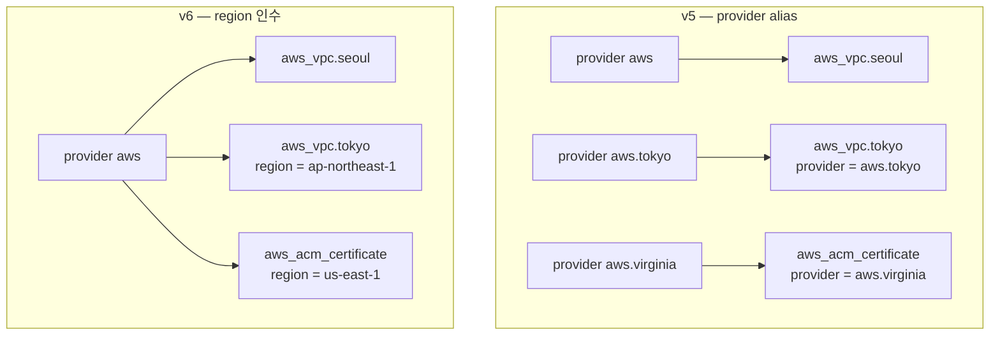

# 24장 — Enhanced Region Support: region 인수가 바꾼 것

**이 장에서 배우는 것**

- v6.0.0의 top-level `region` 인수로 provider alias 없이 다른 리전에 리소스를 만들 수 있다.
- `region` 이 Optional + Computed라는 것을 알고, **값을 바꾸면 교체**되지만 **인수를 지우면 교체되지 않는** 비대칭을 설명할 수 있다.
- 어떤 리소스가 Region-aware가 아닌지 분류하고, 언제 여전히 alias가 필요한지 구분하며, alias 방식에서 `region` 방식으로 옮기는 3단계 절차를 수행할 수 있다.
- 크로스 리전 피어링, S3 복제, 글로벌 DynamoDB, CloudFront용 ACM을 provider 블록 하나로 구성하고, 모듈이 리전을 인터페이스로 받게 설계할 수 있다.

**왜 중요한가**

재해 복구 요건이 내려와 서울에서 돌던 서비스를 도쿄에 하나 더 세우게 됐다고 하자. v5까지의 세계에서 이 요구는 코드 구조 전체를 건드린다. `provider "aws" { alias = "tokyo" }` 를 추가하고, 리소스마다 `provider = aws.tokyo` 를 적고, 모듈 호출에는 `providers = { aws = aws.tokyo }` 를 넘기며, 모듈이 또 모듈을 부르면 그 아래로도 계속 전달한다. 리전이 다섯 개가 되면 매핑만 수십 줄이고, 어느 리소스가 어느 리전에 사는지는 코드를 거슬러 올라가야만 알 수 있다. 게다가 provider 설정 하나하나가 별도의 클라이언트라 메모리와 컴퓨트를 각각 차지한다 — AWS는 현재 36개 리전을 운영하고 계속 늘고 있다.

더 위험한 것은 사고의 형태다. `provider` 메타 인수를 **빠뜨리면** Terraform은 에러를 내지 않고 기본 provider 인스턴스를 조용히 쓴다. 도쿄에 있어야 할 subnet이 서울에 만들어지고, 다른 리소스와 연결되지 않아 apply가 실패할 때에야 드러난다. 운이 나쁘면 apply는 성공하고 몇 주 뒤 트래픽이 넘어갈 때 발견된다. v6.0.0의 `region` 인수는 리전을 **리소스 자신의 인수**로 만들어, 그 리소스가 어디에 사는지를 그 블록만 읽고 알 수 있게 한다.

## top-level `region` 인수

v6.0.0 이전에 리전은 오직 provider 설정에만 존재했다. provider의 리전은 [4장](../level1-beginner/04-provider-block-and-auth.md)에서 본 여러 경로 — `region` 인수, `AWS_REGION` 환경변수, shared config 파일, EC2 메타데이터 — 중 하나로 정해졌고, 리소스가 리전을 고르는 유일한 방법은 **다른 provider 인스턴스에 붙는 것**이었다. 모듈은 자기 안에서 provider를 선언하지 않는 것이 원칙이라([19장](19-modules.md)) 호출하는 쪽이 `providers` 로 매핑을 넘겨야 했고, 리전 수 × 모듈 수만큼 매핑이 늘어났다.

v6.0.0부터 대부분의 **리소스, 데이터 소스, ephemeral 리소스**가 Region-aware가 됐다. top-level `region` 인수가 생겼고, 그 값이 그 리소스에 대한 API 호출이 향할 리전을 정한다.

```terraform
provider "aws" { region = "ap-northeast-2" }

resource "aws_vpc" "seoul" {
  cidr_block = "10.0.0.0/16"
}

resource "aws_vpc" "tokyo" {
  region     = "ap-northeast-1"
  cidr_block = "10.1.0.0/16"
}
```

provider 블록은 하나다. 두 번째 VPC가 도쿄에 산다는 사실은 그 리소스 블록 안에 적혀 있다.

provider 내부에서 이 기능은 "OverrideRegion"으로 불리며, **리소스 구현은 이를 의식하지 않는다.** `region` 은 스키마에 투명하게 주입되고 리소스 코드는 provider meta 객체에서 "유효 리전(effective Region)" — top-level `region` 이 있으면 그 값, 없으면 provider 설정의 리전 — 을 받아 쓸 뿐이라, 새 리소스는 별도 작업 없이 Region-aware가 된다.

## `region` 의 정확한 동작

이 인수는 그냥 문자열이 아니다. 네 가지를 알아야 사고를 피한다.

### Optional + Computed

`region` 은 Optional이면서 Computed다. 적지 않으면 provider 설정의 리전이 채워져 state에 기록된다. 그래서 한 번도 적은 적 없는 리소스도 state에는 리전 값이 들어 있다 — 뒤에서 볼 마이그레이션의 핵심이다.

### partition 검증

설정한 값은 **현재 partition에 속하는 리전인지 검증**된다. AWS IAM 자격증명은 하나의 partition 안에서만 유효하기 때문이다. 상업 리전의 자격증명으로 `cn-north-1` 이나 GovCloud 리전을 적으면 거부되며, 오타 방어이기도 하다. 현재 partition은 인수를 받지 않는 `aws_partition` 데이터 소스로 읽는다 — `partition`(`aws`, `aws-cn`), `dns_suffix`(`amazonaws.com`), `reverse_dns_prefix`(`com.amazonaws`)를 내보내므로 ARN을 조립할 때 `arn:aws:` 대신 `arn:${data.aws_partition.current.partition}:` 을 쓴다.

### 값을 바꾸면 교체된다

**`region` 값을 바꾸면 리소스가 교체(force replacement)된다.** 리전을 옮긴다는 것은 지우고 새로 만든다는 뜻이며, AWS에 "VPC를 이사시키는" API는 없다.

plan에는 `~ region = ... # forces replacement` 와 함께 `must be replaced` 가 찍힌다. 무는 지점은 리전을 변수로 받는 모듈이다. `region = var.region` 으로 써 놓고 기본값을 무심코 바꾸면 그 변수를 쓰는 **모든 리소스가 한꺼번에 교체 대상**이 된다. RDS나 S3가 있다면 데이터가 사라진다. `prevent_destroy`([21장](21-lifecycle-meta-arguments.md))가 마지막 방어선이다.

### 인수를 제거하면 교체되지 않는다

반대 방향은 대칭이 아니다. **`region` 인수를 설정에서 제거해도 리소스는 교체되지 않는다. state에 저장된 이전 `region` 값이 그대로 쓰인다.** Optional + Computed의 귀결이다 — 값이 사라지면 Computed 속성은 "provider가 채우는 값"으로 돌아가는데, 이미 state에 값이 있으므로 그것이 유지된다. provider 설정 리전으로 되돌아가지 **않는다**.

좋은 쪽은 마이그레이션 중 `region` 을 붙였다 뗐다 하는 실험이 리소스를 파괴하지 않는다는 것이고, 나쁜 쪽은 코드만 읽어서는 리소스가 어느 리전에 있는지 알 수 없는 상태가 만들어진다는 것이다. **provider 리전으로 되돌리려면 지우는 것이 아니라 그 값을 명시해야 하며, 그것은 값 변경이므로 교체를 유발한다.**

## import와 `@<region>`

특정 리전의 기존 리소스를 import할 때는 import ID 뒤에 `@<region>` 을 붙인다.

```console
% terraform import aws_vpc.test_vpc vpc-a01106c2@eu-west-1
```

접미사가 없으면 provider 설정 리전에서 그 ID를 찾는다. 없으면 not found 에러가 나고, 운이 나쁘면 **다른 리전에 같은 이름의 다른 리소스가 있어** 엉뚱한 것을 데려온다. Terraform 1.12 이상의 `import` 블록 `identity` 방식에서는 접미사 대신 구조화된 필드를 쓴다 — 대부분의 Region-aware 리소스의 Identity Schema는 Required로 리소스 ID를, Optional로 `account_id` 와 `region` 을 갖는다([20장](20-import-and-resource-identity.md)).

```terraform
import {
  to       = aws_vpc.test_vpc
  identity = { id = "vpc-a01106c2", region = "eu-west-1" }
}
```

## 모든 리소스가 `region` 을 갖는 것은 아니다

"대부분"이지 전부가 아니다. 없는 쪽을 네 부류로 나눠 기억한다.

### 1) 원래 `region` 을 갖고 있던 리소스

v6.0.0 이전에 이미 top-level `region` 을 다른 의미로 쓰던 것들이다. 기존 `region` 은 deprecated 됐고 향후 버전에서 Region-aware 동작으로 교체된다. v6에서 새 이름으로 옮겨 둔다.

| 리소스(r) / 데이터 소스(d) | 기존 `region` 대신 |
|---|---|
| `aws_cloudformation_stack_set_instance` (r) | `stack_set_instance_region` |
| `aws_config_aggregate_authorization` (r) | `authorized_aws_region` |
| `aws_dx_hosted_connection` (r) | `connection_region` |
| `aws_servicequotas_template` (r) / `_templates` (d) | `aws_region` |
| `aws_ssmincidents_replication_set` (r, d) | `regions` |
| `aws_vpc_endpoint_service` (d) | `service_region` |
| `aws_vpc_peering_connection` (d) | `requester_region` |
| `aws_s3_bucket` (r, d) | `bucket_region` |
| `aws_region` (d) | `name` deprecated -> `region` |

`aws_s3_bucket` 이 특히 자주 문다. v5까지 `.region` 은 "버킷이 있는 리전"이었지만 v6에서 `region` 은 Enhanced Region Support 용도로 재배정됐고 버킷 리전은 `bucket_region` 으로 읽는다. `aws_region` 데이터 소스는 반대다 — `name` 이 deprecated 되고 `region` 이 정식 이름이라 `data.aws_region.current.name` 은 `.region` 으로 바꾼다.

### 2) 본질적으로 글로벌한 서비스

partition 안의 모든 리전에 하나로 존재해, 리전을 지정한다는 개념 자체가 없다.

- **IAM 계열** — `aws_iam_*`, `aws_rolesanywhere_*`, `aws_caller_identity`.
- **조직·계정·비용** — `aws_organizations_*`, `aws_account_*`, `aws_billing_*`, `aws_budgets_*`, `aws_ce_*`, `aws_cur_*`, `aws_pricing_*` 등.
- **엣지·DNS·복원력** — `aws_cloudfront_*`, `aws_globalaccelerator_*`, `aws_networkmanager_*`, `aws_shield_*`, `aws_waf_*`(Classic), `aws_route53_*`, `aws_route53recovery*`, `aws_arcregionswitch_*`.

실무 결론 하나. `aws_cloudfront_distribution` 에는 `region` 인수가 **없다**. 그런데 붙이는 ACM 인증서는 반드시 `us-east-1` 에 있어야 한다.

### 3) 리전 서비스 안의 글로벌 리소스

서비스 전체는 리전 단위인데 특정 리소스만 계정 전체 설정을 다루는 경우다 — `aws_backup_global_settings`, `aws_cloudtrail_organization_delegated_admin_account`, `aws_dx_gateway`, `aws_fms_admin_account`, `aws_vpc_ipam_organization_admin_account`, `aws_ram_sharing_with_organization`, `aws_servicecatalog_organizations_access`, `aws_s3_account_public_access_block`. 이름에 `global`, `account`, `organization` 이 들어가면 대개 글로벌이다.

### 4) 메타 데이터 소스와 정책 문서 데이터 소스

`aws_default_tags`, `aws_partition`, `aws_regions` 는 사실상 글로벌이고, HCL을 JSON 정책 문서로 바꾸기만 하는 데이터 소스도 API를 호출하지 않으므로 리전 개념이 없다. `aws_arn` 데이터 소스의 `region` 은 ARN을 파싱한 결과라 의미가 유지된다.

확실하지 않으면 **그 리소스 문서의 Argument Reference 첫 줄을 본다.** Region-aware 리소스는 예외 없이 표준 문구로 `region` 이 문서화돼 있다. 없으면 없는 것이고, 적으면 에러가 난다.

## alias 방식은 죽지 않았다

**v6.0.0 이전의 리전별 provider 블록 설정은 v6.0.0에서도 그대로 유효하며 deprecated가 아니다.** `region` 인수가 대체하는 것은 **"리전만 다른"** provider 인스턴스다. 리전 외에 다른 것이 달라지면 여전히 인스턴스를 나눠야 한다.

- **자격증명이 리전마다 다를 때.** `region` 은 엔드포인트만 바꾼다. 어떤 자격증명을 쓸지는 provider 인스턴스가 정한다.
- **계정이 다를 때.** 다른 계정에 만들려면 그 계정의 role을 assume하는 인스턴스가 필요하다. `region` 은 계정 경계를 넘지 못한다([25장](25-multi-account.md)).
- **partition이 다르거나 provider 설정 자체를 달리해야 할 때.** `region` 값은 현재 partition 안에서만 검증을 통과하고, `default_tags` · `ignore_tags` · `endpoints` 는 provider 인스턴스가 단위다.



## 마이그레이션: 3단계와 그 순서의 이유

리전별 provider 설정에서 리소스별 `region` 값으로 옮기려면 **설정을 편집하기 전에 state가 refresh되어 있어야 한다.** 절차는 셋이다.

1. **v6.0.0으로 업그레이드한다.** 설정은 아직 건드리지 않는다.
2. **`terraform apply -refresh-only` 를 실행한다.**
3. **`provider` 메타 인수를 지우고 `region` 인수를 넣는다.**

v5까지 state에 저장된 리소스 속성에는 `region` 필드가 없었다. 리전은 provider 설정에만 있었기 때문이다. v6로 올라가면 provider가 각 리소스의 유효 리전을 state에 기록할 수 있게 되고, `-refresh-only` apply는 인프라를 바꾸지 않고 **state만 갱신하는** 실행이라 이 과정에서 실제 관리 리전 값이 채워진다.

이 단계를 건너뛰고 곧장 설정을 고치면 state에 리전 값이 없는 상태에서 새로 적은 `region` 과 비교가 일어난다. **값이 바뀌는 것으로 판정되면 그 리소스는 교체 대상**이다. plan에 `must be replaced` 가 줄줄이 뜨는 것이 전형적 증상이며, VPC·subnet·RDS·S3가 한꺼번에 교체로 잡힌 plan을 보고 있다면 2단계를 건너뛰었는지부터 의심한다.

마이그레이션 커밋에는 `region` 이동 **외의 변경을 섞지 않는다** — 다른 diff가 섞이면 교체 신호를 놓친다. 데이터를 가진 리소스에는 미리 `prevent_destroy` 를 걸고 state를 백업해 둔다([16장](16-remote-state-and-backends.md)).

## 실전 1: 크로스 리전 VPC 피어링

서울 VPC와 도쿄 VPC를 피어링한다. 리전이나 계정이 다르면 `aws_vpc_peering_connection` 으로 요청자 쪽을, `aws_vpc_peering_connection_accepter` 로 수락자 쪽을 관리한다. v5에서는 도쿄 VPC, 수락자, 상대 계정 ID를 읽는 `data "aws_caller_identity"` 에까지 `provider = aws.peer` 가 필요했다. v6에서는 provider가 하나로 줄고 `aws_caller_identity` 도 사라진다 — 같은 계정이면 `peer_owner_id` 생략 시 provider가 연결된 계정 ID가 기본값이기 때문이다.

```terraform
provider "aws" { region = "ap-northeast-2" }

resource "aws_vpc" "main" { cidr_block = "10.0.0.0/16" }

resource "aws_vpc" "peer" {
  region     = "ap-northeast-1"
  cidr_block = "10.1.0.0/16"
}

# 요청자 쪽 — 서울에서 실행되므로 region 생략
resource "aws_vpc_peering_connection" "peer" {
  vpc_id      = aws_vpc.main.id
  peer_vpc_id = aws_vpc.peer.id
  peer_region = "ap-northeast-1"
  auto_accept = false
}

# 수락자 쪽 — 도쿄에서 실행돼야 한다
resource "aws_vpc_peering_connection_accepter" "peer" {
  region                    = "ap-northeast-1"
  vpc_peering_connection_id = aws_vpc_peering_connection.peer.id
  auto_accept               = true
}
```

`region` 과 `peer_region` 은 다른 것이다. `region` 은 **이 리소스에 대한 API 호출이 어디로 갈 것인가**를 정하고, `peer_region` 은 **피어링 상대 VPC가 어느 리전에 있는가**를 알려 주는 이 리소스 고유의 인수다. `peer_region` 을 쓸 때는 `auto_accept` 가 `false` 여야 한다 — `auto_accept = true` 는 두 VPC가 같은 계정, 같은 리전일 때만 쓸 수 있다.

## 실전 2: 멀티 리전 S3 복제

소스 버킷을 도쿄에, 대상 버킷을 서울에 두고 복제를 건다. 양쪽 versioning, S3가 assume할 IAM role, 복제 규칙이 필요하다. 아래는 도쿄 쪽만 발췌한 것이다.

```terraform
provider "aws" { region = "ap-northeast-2" }

locals { source_region = "ap-northeast-1" }

# 소스 버킷 — 도쿄. 딸린 설정 리소스 전부에 region이 필요하다
resource "aws_s3_bucket" "source" {
  region = local.source_region
  bucket = "example-replica-src-20250820"
}

resource "aws_s3_bucket_versioning" "source" {
  region = local.source_region
  bucket = aws_s3_bucket.source.id
  versioning_configuration { status = "Enabled" }
}

# 대상 버킷(서울)은 region 생략, IAM은 글로벌이라 region 인수가 없다
# ... aws_s3_bucket.destination, aws_iam_role.replication ...

resource "aws_s3_bucket_replication_configuration" "replication" {
  region     = local.source_region
  depends_on = [aws_s3_bucket_versioning.source]  # versioning이 먼저다

  role   = aws_iam_role.replication.arn
  bucket = aws_s3_bucket.source.id

  rule {
    id     = "replicate-all"
    status = "Enabled"
    filter { prefix = "data/" }

    destination { bucket = aws_s3_bucket.destination.arn }
  }
}
```

확인할 것 셋. 첫째, **소스 버킷에 딸린 설정 리소스마다 `region` 을 반복해서 적어야 한다.** `aws_s3_bucket` 에 적었다고 해서 그것을 참조하는 `aws_s3_bucket_versioning` 이 같은 리전이 되지 않는다. 각각 독립된 리소스이고 각각 provider 리전이 기본값이다. v5에서 `provider = aws.tokyo` 를 반복하던 것과 같으며 **v6에서 가장 흔한 실수의 원천**이다.

둘째, `aws_iam_role` · `aws_iam_policy` · `aws_iam_policy_document` 는 전부 글로벌이라 `region` 이 없다. 셋째, `aws_s3_bucket_replication_configuration` 은 `aws_s3_bucket_versioning` 을 참조하지 않아 암묵적 의존성이 없으므로 `depends_on` 이 필요하다.

## 실전 3: 글로벌 DynamoDB와 CloudFront용 ACM

### 글로벌 테이블

DynamoDB Global Tables V2는 `aws_dynamodb_table` 의 `replica` 블록으로 구성한다. 여기서 `region` 인수는 등장하지 않는다 — 복제본의 리전은 `replica` 블록의 `region_name`(Required)이 정한다.

```terraform
resource "aws_dynamodb_table" "sessions" {
  name         = "sessions"
  billing_mode = "PAY_PER_REQUEST"
  hash_key     = "SessionId"
  # ... attribute 블록 ...

  replica {
    region_name    = "ap-northeast-1"
    propagate_tags = true
  }

  replica {
    region_name            = "us-west-2"
    point_in_time_recovery = true
  }
}
```

테이블 자체는 provider 리전(또는 `region` 으로 지정한 리전)에 만들어지고 `replica` 블록마다 복제본이 생긴다. `propagate_tags` 는 단방향이라 복제본 쪽 태그 drift는 업데이트를 유발하지 않는다. **`region` 인수를 쓰는 자리와 리소스 고유의 리전 인수를 쓰는 자리를 헷갈리지 않는 것**이 요령이다.

### CloudFront에 붙일 ACM 인증서

CloudFront는 글로벌 서비스라 `aws_cloudfront_distribution` 에 `region` 인수가 없다. 그런데 붙일 ACM 인증서는 **반드시 us-east-1에 있어야 한다** — v5에서 alias를 만드는 대표적인 이유였다. provider 리전은 `ap-northeast-2` 그대로 둔다.

```terraform
resource "aws_acm_certificate" "cdn" {
  region = "us-east-1"

  domain_name       = "cdn.example.com"
  validation_method = "DNS"
}

# 검증 레코드는 Route 53 — 글로벌이라 region 인수가 없다
# ... aws_route53_record.cdn_validation ...

resource "aws_acm_certificate_validation" "cdn" {
  region = "us-east-1"

  certificate_arn         = aws_acm_certificate.cdn.arn
  validation_record_fqdns = [for r in aws_route53_record.cdn_validation : r.fqdn]
}

resource "aws_cloudfront_distribution" "cdn" {
  # region 인수 없음 — CloudFront는 글로벌
  # ... enabled / aliases / origin / default_cache_behavior ...

  viewer_certificate {
    acm_certificate_arn = aws_acm_certificate_validation.cdn.certificate_arn
    ssl_support_method  = "sni-only"
  }
}
```

`aws_acm_certificate` 와 `aws_acm_certificate_validation` **양쪽에** `region` 이 필요하다. 검증 리소스는 인증서를 참조할 뿐 리전을 상속받지 않는다.

## 모듈에서 `region` 다루기

v5에서는 `providers` 매핑이 유일한 통로였다. v6에서는 리전을 평범한 변수로 받아 각 리소스에 전달한다.

```terraform
# modules/network/variables.tf — 기본값 null이 핵심
variable "region" {
  type    = string
  default = null
}

# modules/network/main.tf
data "aws_availability_zones" "available" {
  region = var.region   # 빠뜨리면 서울 AZ로 도쿄에 subnet을 만들려 한다
  state  = "available"
}

resource "aws_vpc" "this" {
  region     = var.region
  cidr_block = var.cidr_block
}

resource "aws_subnet" "private" {
  for_each   = var.private_subnets
  region     = var.region
  vpc_id     = aws_vpc.this.id
  cidr_block = each.value.cidr
}
```

기본값 `null` 이 핵심이다. Terraform에서 인수에 `null` 을 대입하는 것은 **인수를 적지 않은 것과 같다.** 호출자가 넘기지 않으면 `region` 은 미설정 상태가 되고 provider 리전이 쓰인다. 빈 문자열 `""` 은 partition 검증에서 걸린다.

이제 같은 모듈을 `region` 만 바꿔 여러 번 부를 수 있다. `providers` 매핑도 `configuration_aliases` 도 없고, 중첩돼도 `var.region` 을 아래로 넘기기만 하면 된다. 다만 모듈이 만드는 글로벌 리소스(IAM role 등)에는 `region` 을 넘기면 안 되므로, 둘을 섞은 모듈은 그 사실을 인터페이스 문서에 적는다.

리전 목록이 코드로 필요하면 `aws_regions` 데이터 소스를 쓴다 — 기본은 활성 리전, `all_regions = true` 면 전부를 `names` 로 반환한다.

## 흔한 실수

### ❌ 버킷에만 `region` 을 적고 딸린 설정 리소스에는 빠뜨린다

부모 리소스의 `region` 은 자식 설정 리소스로 전파되지 않는다. 아래는 도쿄 버킷에 서울 리전으로 versioning을 켜려다 실패한다.

```terraform
resource "aws_s3_bucket" "source" {
  region = "ap-northeast-1"
  bucket = "example-source-20250820"
}

resource "aws_s3_bucket_versioning" "source" {
  bucket = aws_s3_bucket.source.id   # region 누락 -> 서울
}
```

```terraform
# ✅ 같은 리전에 사는 묶음은 local로 묶어 전부에 적용한다
locals { source_region = "ap-northeast-1" }

resource "aws_s3_bucket" "source" {
  region = local.source_region
  bucket = "example-source-20250820"
}

resource "aws_s3_bucket_versioning" "source" {
  region = local.source_region      # 반드시 다시 적는다
  bucket = aws_s3_bucket.source.id
}
```

### ❌ `region` 을 지우면 provider 리전으로 돌아갈 것이라 생각한다

`region` 제거는 "provider 리전으로 되돌리기"가 아니라 "state의 값을 계속 쓰기"다. 아래 변경은 plan에 아무것도 띄우지 않고 리소스는 도쿄에 남는다.

```terraform
resource "aws_vpc" "app" {
  # region = "ap-northeast-1"  <- 지움. 서울로 옮겨질 것이라 기대
  cidr_block = "10.1.0.0/16"
}
```

```terraform
# ✅ 정말 옮기려면 값을 명시한다. 교체를 유발하므로
#    plan에 "must be replaced"가 뜨는 것이 정상이다.
resource "aws_vpc" "app" {
  region     = "ap-northeast-2"
  cidr_block = "10.1.0.0/16"
}
```

### ❌ refresh 없이 provider 메타 인수를 region 인수로 바꾼다

state에 리전이 기록되기 전에 설정을 고치면 plan이 대량 교체를 계산한다.

```console
% terraform init -upgrade
# 곧바로 provider = aws.tokyo 를 region = "ap-northeast-1" 로 교체
% terraform apply         # 다수의 리소스가 replace 대상으로 잡힌다
```

```console
# ✅ refresh-only를 먼저 거친 뒤 설정을 고치고 plan을 읽는다
% terraform apply -refresh-only
% terraform plan          # "No changes."여야 정상
```

### ❌ 계정이 다른데 `region` 으로 해결하려 한다

`region` 은 엔드포인트만 바꾼다. 아래는 "감사 계정에 버킷을 만들려는" 시도인데 실제로는 현재 계정에 만들어진다.

```terraform
resource "aws_s3_bucket" "audit_logs" {
  region = "ap-northeast-2"   # 계정은 바뀌지 않는다
  bucket = "audit-logs-987654321098"
}
```

```terraform
# ✅ 계정 경계는 provider 인스턴스로 넘는다
provider "aws" {
  alias  = "audit"
  region = "ap-northeast-2"

  assume_role {
    role_arn = "arn:aws:iam::987654321098:role/TerraformAudit"
  }
}

resource "aws_s3_bucket" "audit_logs" {
  provider = aws.audit
  bucket   = "audit-logs-987654321098"
}
```

## 프로덕션 노트

- **`region` 값은 리터럴보다 `local` 이나 변수로 묶는다.** 같은 리전에 사는 리소스가 열 개면 문자열이 열 번 반복되고, 하나를 고치지 않는 순간 리소스 하나가 다른 리전에 남는다.
- **`region` 을 변수로 노출한 모듈은 destructive change의 통로다.** 기본값을 바꾸는 한 줄 커밋이 데이터 리소스 전체 교체로 이어질 수 있다. `prevent_destroy` 를 걸고 모듈 README에 "`region` 변경은 전면 재생성"이라고 적는다.
- **리전을 넘나드는 설정은 부분 성공한다.** 도쿄 리소스 20개 중 3개가 실패해도 나머지는 만들어진 채 남는다. DR 리전을 별도 state로 분리하면 주 리전 state가 잠겨도 DR을 만질 수 있다.
- **권한도 리전을 따른다.** `region` 을 붙이는 것만으로 그 리전 API 권한이 생기지 않는다. IAM 정책에 `aws:RequestedRegion` 조건이 걸려 있다면 정책부터 넓힌다. 옵트인이 필요한 리전은 계정에서 활성화하지 않으면 plan은 통과하고 apply에서 실패한다.
- **import는 `@<region>` 접미사를 잊기 쉽다.** 접미사 없이 import한 리소스는 provider 리전으로 기록되고 다음 plan에서 교체로 나타난다.

## 연습문제

1. 서울 provider 하나만 두고 서울에 VPC 하나, 도쿄에 VPC 하나를 만든 뒤 둘을 피어링하라. 요청자와 수락자를 각각 `aws_vpc_peering_connection` 과 `aws_vpc_peering_connection_accepter` 로 관리한다.
   *성공 기준:* `provider` 블록이 정확히 하나이고 `provider` 메타 인수가 없다. apply 후 피어링의 `accept_status` 가 활성이며 두 번째 plan이 "No changes."다.

2. `region` 변수를 `null` 기본값으로 받는 network 모듈을 만들고 같은 모듈을 두 번 호출해 서로 다른 리전에 VPC + subnet 2개씩을 만들어라. 가용 영역은 데이터 소스로 조회한다.
   *성공 기준:* `providers` 메타 인수 없이 동작하고, `region` 을 넘기지 않은 호출은 provider 리전에 만들어지며, 각 subnet의 `availability_zone` 이 자기 리전에 속한다.

3. 이미 만들어 둔 `region = "ap-northeast-1"` VPC의 `region` 인수를 설정에서 **제거**하고 plan을 돌린 뒤, `region = "ap-northeast-2"` 로 **변경**하고 다시 plan을 돌려라.
   *성공 기준:* 첫 plan은 "No changes."이고 두 번째는 `# forces replacement` 를 포함한 교체 계획이다. 차이를 Optional + Computed로 설명할 수 있다.

4. provider 리전이 `ap-northeast-2` 인 상태에서 `us-east-1` 에 ACM 인증서를 만들고 DNS 검증을 마친 뒤, CloudFront 배포의 `viewer_certificate` 에 연결하라.
   *성공 기준:* 인증서와 검증 리소스 양쪽에 `region = "us-east-1"` 이 있고 `aws_cloudfront_distribution` 과 `aws_route53_record` 에는 `region` 이 없으며, `terraform validate` 가 통과한다.

## 요약

- v6.0.0부터 대부분의 리소스·데이터 소스·ephemeral 리소스에 top-level `region` 인수가 있어 provider 블록 하나로 여러 리전을 다룰 수 있다.
- `region` 은 **Optional + Computed**다. 미지정 시 provider 설정 리전이 기본값이 되어 state에 기록되고, 값은 **현재 partition에 속하는지 검증**된다.
- **값을 바꾸면 리소스가 교체되고, 인수를 제거하면 교체되지 않고 state의 이전 값이 계속 쓰인다.**
- import할 때는 ID 뒤에 `@<region>` 을 붙이거나 `identity` 에 `region` 필드를 넣는다.
- Region-aware가 **아닌** 것은 넷이다 — 원래 `region` 을 갖고 있어 이름이 바뀐 리소스(`aws_s3_bucket` 의 `bucket_region` 등), 글로벌 서비스(IAM, Organizations, CloudFront, Route 53), 리전 서비스 안의 글로벌 리소스, 메타·정책 문서 데이터 소스.
- **provider alias 방식은 deprecated가 아니다** — 자격증명·계정·partition이 다르거나 provider 설정을 달리해야 할 때는 여전히 필요하다.
- 마이그레이션은 v6.0.0 업그레이드 → `terraform apply -refresh-only` → `provider` 메타 인수를 `region` 으로 교체 순서다. refresh를 건너뛰면 plan이 대량 교체를 계산한다.
- 부모 리소스의 `region` 은 자식 설정 리소스로 전파되지 않는다. 모듈은 기본값 `null` 인 `region` 변수로 받아 전달하면 `providers` 매핑 없이 리전별 재사용이 된다.

## 다음으로

- [25장 — 멀티 계정: assume_role · 롤 체이닝 · OIDC](25-multi-account.md) — `region` 으로 넘을 수 없는 계정 경계를 다룬다.
- [20장 — Import와 Resource Identity](20-import-and-resource-identity.md) — `@<region>` 접미사와 identity 기반 import의 전체 그림.
- [39장 — 메이저 버전 업그레이드](../level3-advanced/39-version-upgrades.md) — v6 업그레이드 전체 절차 안의 자리.
- 공식 가이드: https://registry.terraform.io/providers/hashicorp/aws/latest/docs/guides/enhanced-region-support

