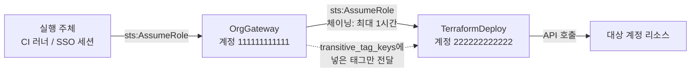

# 25장 — 멀티 계정: assume_role · 롤 체이닝 · OIDC

**이 장에서 배우는 것**

- 계정을 나누는 이유를 폭발 반경·권한 경계·비용·쿼터로 설명하고 `aws_organizations_account` 로 멤버 계정을 관리할 수 있다.
- `assume_role` 블록의 인수를 목적별로 골라 쓰고 여러 블록을 나열해 **롤 체이닝**을 구성하며, 이 블록이 환경변수를 지원하지 않는다는 제약과 named profile 대안을 매핑할 수 있다.
- `assume_role_with_web_identity` 로 장기 액세스 키 없이 GitHub Actions에서 배포하고, EKS IRSA가 같은 메커니즘 위에 있다는 것을 안다.
- `allowed_account_ids` / `forbidden_account_ids` 로 잘못된 계정에 apply하는 사고를 막고, 크로스 계정 공유와 부트스트랩 문제를 설계할 수 있다.

**왜 중요한가**

한 계정 안에 dev·staging·prod를 태그로만 구분해 두고 6개월을 버텼다고 하자. 어느 금요일, 개발자가 스테이징 정리용 설정에서 `terraform destroy` 를 돌렸는데 셸에 `AWS_PROFILE=prod` 가 남아 있었다. plan에 삭제 대상 47개가 떴고 이름이 익숙해 보였기 때문에 통과됐다. 프로덕션 RDS와 ALB가 사라지는 데 4분이 걸렸다. IAM 권한만으로는 막을 수 없다 — 같은 계정에서 같은 서비스를 쓰는 이상, 리소스 이름이나 태그를 조건으로 건 정책은 언제나 빈틈이 생긴다.

계정을 나누면 사고의 형태 자체가 달라진다. 스테이징 자격증명으로는 프로덕션 API를 호출할 수 없다 — 권한 문제가 아니라 **계정이 다르기 때문에** 그렇다. 여기에 `allowed_account_ids` 를 걸어 두면 잘못된 프로파일로 plan을 돌리는 순간 provider 설정 단계에서 멈춘다. 다른 이유도 있다. 서비스 쿼터는 대부분 **계정+리전 단위**라 한 계정에 전부 몰면 Lambda 동시 실행 같은 한도를 한 팀이 다 써 버릴 수 있고, 비용 태그를 아무리 잘 붙여도 계정 단위 청구만큼 정확하지 않다. 그리고 [24장](24-enhanced-region-support.md)에서 본 것처럼 v6의 `region` 인수는 리전 경계를 없앴지만 **계정 경계는 provider 인스턴스로만 넘는다.**

## 계정 경계는 무엇을 막는가

AWS에서 계정은 가장 강한 격리 단위다. 리소스 이름 공간, 쿼터, 청구, 기본 권한이 계정 단위로 끊긴다. 계정을 나누면 "다른 계정의 리소스를 쓰려면 **양쪽이 명시적으로 허용**해야 한다"는 규칙이 생기고, 이것이 실수를 막는 힘의 원천이다.

전형적인 구획은 넷이다 — 계정 생성과 SCP만 다루는 **관리 계정**, CloudTrail 아카이브와 위임 관리자를 맡는 **보안/감사 계정**, state 백엔드와 아티팩트 저장소를 두는 **공유 서비스 계정**, 팀 × 환경으로 쪼개는 **워크로드 계정**.

Terraform 관점에서 중요한 것은 **어느 계정에서 어떤 role로 실행되는가**다. 실행 주체(SSO 세션, CI 러너, EC2 인스턴스 프로파일)가 대상 계정의 role을 assume해 작업하며, 이 assume을 provider에 알려 주는 것이 `assume_role` 블록이다.

## `aws_organizations_account` 로 계정 만들기

멤버 계정 자체도 코드로 만들 수 있다. **이 리소스는 조직의 루트 계정에서만 다룬다.**

```terraform
resource "aws_organizations_account" "payments_prod" {
  name      = "payments-prod"
  email     = "aws+payments-prod@example.com"
  parent_id = aws_organizations_organizational_unit.workloads.id
  role_name = "OrganizationAccountAccessRole"

  # role_name을 읽는 Organizations API가 없어 항상 diff가 뜬다
  lifecycle {
    ignore_changes = [role_name]
  }
}
```

`name` 과 `email` 이 Required다. `email` 은 다른 AWS 계정에 이미 연결된 주소면 안 되므로 계정 수만큼 실제로 받을 수 있는 주소가 필요하다 — 플러스 주소나 배포 그룹을 쓴다.

주의할 인수 셋. `role_name` 은 루트 계정의 주체가 새 계정에 들어갈 때 assume하는 관리자 role인데 **읽는 API가 없어 drift를 감지하지 못하고 설정에 값이 있으면 항상 차이가 뜬다.** `iam_user_access_to_billing` 은 `ALLOW` 또는 `DENY` 이며 미설정 시 AWS가 `ALLOW` 로 처리하는데, **생성 이후에 바꾸면 계정을 재생성하려 든다.** `parent_id` 는 OU 또는 루트 ID이며 설정에 명시해야 drift 감지가 된다.

삭제는 더 조심해야 한다. destroy하면 기본적으로 **계정을 조직에서 분리만 하고 닫지 않는다.** 닫으려면 `close_on_deletion = true` 가 필요한데, 쿼터가 걸려 있어 `CLOSE_ACCOUNT_QUOTA_EXCEEDED` 가 나면 수동으로 닫아야 한다. import ID는 계정 ID이며, `iam_user_access_to_billing` 을 설정한 계정은 `111111111111_ALLOW` 형태를 쓴다.

## `assume_role` 블록 해부

provider가 role을 assume하게 하는 블록이다. 자격증명 자체는 [4장](../level1-beginner/04-provider-block-and-auth.md)의 6단계 우선순위로 먼저 해결되고 그 자격증명으로 `sts:AssumeRole` 을 호출한다.

```terraform
provider "aws" {
  region = "ap-northeast-2"

  assume_role {
    role_arn     = "arn:aws:iam::123456789012:role/TerraformDeploy"
    session_name = "terraform-ci-run-4821"
    external_id  = "b3c1f0e2-9a7d-4d51"
    duration     = "1h"
  }
}
```

**대상과 신원.** `role_arn` 만 Required다. `session_name` 은 CloudTrail에 남는 세션 이름이라 감사에서 결정적이다 — CI 실행 번호나 사용자 이름처럼 실행 주체를 식별할 값을 넣는다. `source_identity` 는 신뢰 정책에서 설정 여부를 강제할 수 있는 소스 아이덴티티다. `external_id` 는 서드파티가 우리 계정의 role을 대신 assume하는 구성에서 혼동 대리인(confused deputy)을 막는다 — 신뢰 정책이 `sts:ExternalId` 조건으로 특정 값을 요구하면 ARN을 알아낸 것만으로는 assume할 수 없다.

**세션 수명.** `duration` 은 15분부터 그 role의 최대 세션 시간까지 줄 수 있고 `1h` · `2h45m` · `30m15s` 같은 **문자열 형식**으로 쓴다. 숫자 초가 아니다. 오래 걸리는 apply에서 세션이 만료되면 `ExpiredToken` 이 터진다.

**세션 권한 축소.** `policy`(인라인 IAM 정책 JSON)와 `policy_arns`(관리형 정책 ARN 집합)는 **권한을 넓히지 못하고 좁히기만 한다** — role의 권한과 세션 정책의 교집합이 실제 권한이 된다. plan 전용 파이프라인에서 읽기 권한만 남길 때 쓴다.

**세션 태그.** `tags` 는 세션 태그의 맵이고 `transitive_tag_keys` 는 그중 **이후 세션으로 전달할 키의 집합**이다. ABAC를 쓰는 조직에서 `Team` 을 세션 태그로 실어 보내고 대상 계정 정책이 `aws:PrincipalTag/Team` 으로 판단하게 한다. 롤 체이닝에서 태그를 살리려면 반드시 `transitive_tag_keys` 에 넣는다.

## 롤 체이닝

`assume_role` 블록을 **여러 개 나열하면 나열한 순서대로 assume한다.** 이것이 provider가 지원하는 IAM Role Chaining이다.

```terraform
provider "aws" {
  region = "ap-northeast-2"

  # 1) 조직 공용 진입 role
  assume_role {
    role_arn     = "arn:aws:iam::111111111111:role/OrgGateway"
    session_name = "terraform-gateway"
  }

  # 2) 그 세션으로 대상 계정 배포 role
  assume_role {
    role_arn     = "arn:aws:iam::222222222222:role/TerraformDeploy"
    session_name = "terraform-deploy-payments-prod"
  }
}
```



체이닝을 쓰는 이유는 신뢰 관계를 단순하게 유지하기 위해서다. 워크로드 계정 40개가 각각 CI 러너 ARN을 직접 신뢰하면 러너 교체 시 40개 신뢰 정책을 고쳐야 하지만, 중간에 게이트웨이 role을 두면 워크로드 계정은 그 하나만 신뢰하면 된다.

대가가 있다. **AWS의 role chaining은 세션 시간을 최대 1시간으로 제한한다.** 체이닝된 세션에 `duration = "4h"` 를 주면 assume 자체가 실패한다. apply가 한 시간을 넘길 것 같으면 체이닝을 한 단계로 줄이거나 state를 나눈다. 단계마다 다른 `session_name` 을 주면 CloudTrail에서 어디서 실패했는지 구분된다.

## `assume_role` 은 환경변수를 지원하지 않는다

여기서 가장 많이 걸린다. **role을 assume하는 설정에는 환경변수가 지원되지 않는다.** `AWS_ROLE_ARN` 을 export해도 `assume_role` 은 반응하지 않는다(그 변수는 뒤에서 볼 web identity 쪽 것이다). 방법은 provider 블록의 `assume_role`, 또는 shared config의 named profile 둘뿐이다.

named profile은 코드에 role ARN을 넣지 않아도 되므로 로컬에서 여러 계정을 오갈 때 편하다.

```ini
# ~/.aws/config
[profile payments-prod]
role_arn          = arn:aws:iam::222222222222:role/TerraformDeploy
source_profile    = sso-base
role_session_name = terraform-local
```

provider 인수와 shared config 키의 대응은 이렇다. N/A인 항목은 provider 블록에만 쓸 수 있다.

| 설정 | provider `assume_role` | shared config |
|---|---|---|
| Role ARN | `role_arn` | `role_arn` |
| Duration | `duration` | `duration_seconds` |
| External ID | `external_id` | `external_id` |
| Session Name | `session_name` | `role_session_name` |
| Policy / Policy ARNs | `policy` / `policy_arns` | N/A |
| Source Identity | `source_identity` | N/A |
| Tags / Transitive Tag Keys | `tags` / `transitive_tag_keys` | N/A |

형식 차이에 주의한다 — provider의 `duration` 은 `1h` 같은 문자열이지만 shared config의 `duration_seconds` 는 초 단위 숫자다. named profile에서는 외부 프로세스로 자격증명을 조달하는 `credential_process` 도 쓸 수 있다.

## `assume_role_with_web_identity` 와 OIDC

장기 액세스 키를 CI에 넣어 두는 것은 멀티 계정 설계에서 가장 흔한 구멍이다. 키는 만료되지 않고, 로그에 새고, 회수를 잊는다. 대안이 **웹 아이덴티티 페더레이션** — 외부 OIDC 제공자가 발급한 단기 토큰을 role 세션으로 교환하는 것이다. provider 쪽 블록은 하나만 둘 수 있다.

```terraform
provider "aws" {
  region = "ap-northeast-2"

  assume_role_with_web_identity {
    role_arn                = "arn:aws:iam::222222222222:role/GitHubActionsDeploy"
    session_name            = "gha-${var.run_id}"
    web_identity_token_file = "/var/run/secrets/tokens/aws-token"
  }
}
```

`role_arn` 이 Required이고 `web_identity_token`(토큰 값)과 `web_identity_token_file`(파일 경로) 중 **하나는 반드시 있어야 한다.** `duration`, `policy`, `policy_arns` 는 `assume_role` 과 같은 의미다. 이쪽은 **환경변수를 지원한다** — CI 플랫폼이 변수를 채워 주면 provider 블록에 아무것도 안 써도 된다.

| provider | 환경변수 | shared config |
|---|---|---|
| `role_arn` | `AWS_ROLE_ARN` | `role_arn` |
| `web_identity_token` | `TF_AWS_WEB_IDENTITY_TOKEN` | N/A |
| `web_identity_token_file` | `AWS_WEB_IDENTITY_TOKEN_FILE` | `web_identity_token_file` |
| `session_name` | `AWS_ROLE_SESSION_NAME` | `role_session_name` |
| `duration` | N/A | `duration_seconds` |
| `policy` / `policy_arns` | N/A | `policy` / `policy_arns` |

`TF_AWS_WEB_IDENTITY_TOKEN` 만 `TF_` 접두어인 것에 주의한다 — AWS SDK 표준 변수가 아니라 이 provider가 추가로 읽는 변수다.

### GitHub Actions에서 장기 키 없이 배포하기

GitHub Actions는 실행마다 OIDC 토큰을 발급한다. AWS 계정에 GitHub를 OIDC 제공자로 등록하고 특정 저장소·브랜치의 토큰만 role을 assume하도록 신뢰 정책을 좁힌다.

```terraform
resource "aws_iam_openid_connect_provider" "github" {
  url            = "https://token.actions.githubusercontent.com"
  client_id_list = ["sts.amazonaws.com"]
}
```

`url` 은 토큰의 `iss` 클레임과 일치해야 하고 `client_id_list` 는 토큰의 audience(`aud`)다. `thumbprint_list` 는 Optional인데 **GitHub·GitLab·Google·Auth0 같은 제공자와 S3 호스팅 JWKS 엔드포인트를 쓰면 AWS가 자체 신뢰 루트 CA로 검증하므로 설정해도 검증에 쓰이지 않는다.** 그 외 제공자에서 지문을 주지 않으면 IAM이 서버 인증서의 최상위 중간 CA 지문을 자동으로 가져오는데, **처음에 설정했다가 제거하면 자동 조회로 전환되지 않고 최초 목록을 계속 쓴다.**

신뢰 정책의 핵심은 `sub` 조건이다.

```terraform
data "aws_iam_policy_document" "github_trust" {
  statement {
    effect  = "Allow"
    actions = ["sts:AssumeRoleWithWebIdentity"]

    principals {
      type        = "Federated"
      identifiers = [aws_iam_openid_connect_provider.github.arn]
    }

    condition {
      test     = "StringEquals"
      variable = "token.actions.githubusercontent.com:aud"
      values   = ["sts.amazonaws.com"]
    }

    # 저장소와 ref 고정. 없으면 GitHub의 아무 저장소나 assume할 수 있다
    condition {
      test     = "StringEquals"
      variable = "token.actions.githubusercontent.com:sub"
      values   = ["repo:example-org/infra:ref:refs/heads/main"]
    }
  }
}
```

`sub` 를 빼거나 `StringLike` 로 느슨하게 걸면 그 조직의 어떤 저장소·브랜치에서든 프로덕션에 배포할 수 있다. **환경별로 role을 나누고 각각 `sub` 를 정확히 고정**한다.

EKS의 IRSA도 같은 메커니즘이다 — 클러스터의 OIDC 제공자가 서비스 어카운트 토큰을 발급하고 Kubernetes가 파드에 `AWS_ROLE_ARN` 과 `AWS_WEB_IDENTITY_TOKEN_FILE` 을 주입하므로, Terraform을 파드 안에서 돌리면 provider 블록이 비어 있어도 그 role로 동작한다. ECS·CodeBuild에서는 태스크 role이 `AWS_CONTAINER_CREDENTIALS_RELATIVE_URI` / `AWS_CONTAINER_CREDENTIALS_FULL_URI` 로 같은 방식으로 쓰인다.

## 잘못된 계정에 apply하는 사고 막기

두 인수는 실수로 다른 계정을 쓰는 것을 막는 안전장치다. **서로 충돌**하므로 하나만 쓴다.

```terraform
provider "aws" {
  region              = "ap-northeast-2"
  allowed_account_ids = ["222222222222"]

  assume_role {
    role_arn = "arn:aws:iam::222222222222:role/TerraformDeploy"
  }
}
```

다른 계정 자격증명으로 plan을 돌리면 provider 설정 단계에서 거부된다. 스테이징 디렉터리에 프로덕션 프로파일이 새어 들어오는 사고가 원천 차단된다. 계정 ID를 저장소에 두는 것을 두려워할 이유는 없다 — 비밀이 아니다.

두 인수 중 하나라도 쓰면 provider는 실제 계정 ID를 알아내야 하고, 방법은 인증 방식에 따라 다르다.

- **IAM Instance Profile이 붙은 EC2 인스턴스** — 언제나 메타데이터 API를 쓴다.
- **그 밖의 모든 방식** — 셋을 이 순서로 시도한다. (1) `iam:GetUser` — 주로 IAM User용이며 각 사용자가 자기 자신에 대해 호출할 권한이 있어야 한다. (2) `sts:GetCallerIdentity` — IAM User와 federated IAM Role 양쪽에서 동작한다. (3) `iam:ListRoles` — IdP 연동 프로파일용이며 그 사용자가 `iam:ListRoles` 를 허용하는 role을 assume하고 있어야 한다.

여기서 실무 결론이 나온다. **`allowed_account_ids` 를 켜면 추가 권한이 필요할 수 있다.** 최소 권한 role에서 이 인수를 켰다가 `AccessDenied` 를 만나는 일이 흔하고 대개 `sts:GetCallerIdentity` 하나만 열면 해결된다. 계정 ID를 코드에서 값으로 쓰려면 인수를 받지 않는 `data "aws_caller_identity" "current" {}` 의 `account_id` 를 참조한다. 같은 데이터 소스가 `arn` 과 `user_id` 도 내보내므로 "지금 이 실행이 어떤 신원으로 도는지"를 output으로 찍어 두면 CI 로그에서 사고를 조기에 잡을 수 있다.

## 계정마다 provider alias

[24장](24-enhanced-region-support.md)에서 v6의 `region` 인수가 리전별 alias를 대부분 없앴다는 것을 봤다. **계정은 다르다.** `region` 은 엔드포인트만 바꾸고 어떤 자격증명으로 호출할지는 provider 인스턴스가 정한다. 계정이 둘 이상 등장하는 설정에는 반드시 alias가 필요하다.

```terraform
provider "aws" {
  region = "ap-northeast-2"

  assume_role {
    role_arn = "arn:aws:iam::222222222222:role/TerraformDeploy"
  }
}

provider "aws" {
  alias  = "logs"
  region = "ap-northeast-2"

  assume_role {
    role_arn = "arn:aws:iam::333333333333:role/TerraformLogWriter"
  }
}

# 로그 계정의 버킷을 도쿄에 둔다 — 계정은 provider가, 리전은 region이 정한다
resource "aws_s3_bucket" "flow_logs" {
  provider = aws.logs
  region   = "ap-northeast-1"
  bucket   = "flow-logs-333333333333"
}
```

**`provider` 메타 인수와 `region` 인수는 공존한다.** 이 조합 덕분에 v5 시절 "계정 × 리전"만큼 필요하던 provider 인스턴스가 "계정 수"로 줄어든다 — 계정 3개 × 리전 4개면 12개였던 것이 3개다. 모듈에 계정을 넘길 때는 여전히 `providers` 메타 인수를 쓴다([19장](19-modules.md)).

## 크로스 계정 리소스 공유

계정을 나눴으면 그 사이를 잇는 일이 생긴다. Terraform에서는 대개 "**양쪽 계정에 각각 리소스를 만들어 짝을 맞추는**" 형태다.

- **RAM(Resource Access Manager)** — 서브넷, Transit Gateway 같은 것을 공유한다. 공유 쪽에서 `aws_ram_resource_share` 를 만들고 `aws_ram_resource_association` 으로 리소스를, `aws_ram_principal_association` 으로 대상 계정을 붙인 뒤, 받는 쪽 provider로 `aws_ram_resource_share_accepter` 를 만들어 수락한다. 조직 전체 공유는 관리 계정에서 `aws_ram_sharing_with_organization` 을 켠다.
- **S3 버킷 정책** — 버킷이 있는 계정에서 `aws_s3_bucket_policy` 로 상대 계정 principal을 허용한다. 크로스 계정 쓰기에서는 객체 소유권 때문에 버킷 소유자가 객체를 읽지 못하는 함정이 있다.
- **KMS 키 정책** — 키 정책은 IAM 정책과 달리 **키 자체에 붙어야** 크로스 계정 접근이 열린다. `aws_kms_key` 의 `policy` 나 `aws_kms_key_policy` 로 상대 계정을 허용하고, 상대 계정의 IAM 정책에서도 그 키 ARN에 대한 `kms:Decrypt` 등을 허용해야 한다. **양쪽 다 필요하다.**
- **VPC 피어링** — 요청자 계정에서 `aws_vpc_peering_connection` 의 `peer_owner_id` 에 상대 계정 ID를 지정하고, 수락자 계정의 provider로 `aws_vpc_peering_connection_accepter` 를 만든다. 계정이 다르면 `auto_accept` 를 쓸 수 없다.

패턴이 보인다. 크로스 계정은 거의 항상 **"제공자 쪽 리소스 + 수락자 쪽 리소스"** 한 쌍이고 두 리소스는 서로 다른 provider alias에 붙는다. 한쪽만 apply하면 리소스는 생기지만 pending으로 남는다.

## 부트스트랩: 롤이 없는 계정에서 시작하기

닭과 달걀 문제가 있다. Terraform이 대상 계정에서 일하려면 role이 필요한데 그 role은 누가 만드는가. 세 갈래다.

1. **Organizations가 만들어 주는 role을 쓴다.** `role_name` 에 지정한 관리자 role(관례상 `OrganizationAccountAccessRole`)이 새 계정에 생기고 루트 계정의 주체가 이를 assume할 수 있다. 이 role로 첫 실행을 돌려 제대로 된 배포 role을 만든다.
2. **부트스트랩 설정을 분리한다.** `bootstrap/` 에 관리자 role로 실행되는 최소 설정(배포 role, state 버킷/락, OIDC 제공자)만 두고 이후 모든 설정은 그 배포 role로 돌린다. 자주 실행되지 않으므로 수동 apply해도 된다.
3. **부트스트랩 state 위치를 정한다.** 공유 서비스 계정에 중앙 백엔드를 두는 것이 흔하다([16장](16-remote-state-and-backends.md)). 백엔드 자체를 만드는 첫 실행만 로컬 state로 하고 이후 `terraform init -migrate-state` 로 옮긴다.

```terraform
# bootstrap/main.tf — 루트 계정의 관리자 role로 새 계정에 들어간다
provider "aws" {
  region = "ap-northeast-2"

  assume_role {
    role_arn     = "arn:${data.aws_partition.current.partition}:iam::${var.new_account_id}:role/OrganizationAccountAccessRole"
    session_name = "bootstrap"
  }
}
```

`aws_partition` 으로 ARN을 조립해 두면 다른 partition에서 같은 코드를 쓸 수 있다.

## STS 관련 provider 인수

`sts_region` 은 STS 호출에 쓸 리전을 따로 지정한다. 설정하지 않으면 다른 비-STS 작업과 같은 리전을 쓴다. 특정 리전 STS 엔드포인트를 강제해야 할 때 쓴다.

`skip_credentials_validation` 은 STS API를 통한 자격증명 검증을 건너뛴다. `skip_requesting_account_id` 는 계정 ID 조회를 건너뛰는데, **이 값이 `true` 이고 계정 ID가 앞서 확인되지 않았다면 ARN을 문자열로 조립하는 일부 리소스에서 계정 ID가 빈 값으로 들어간다.** 영향받는 리소스 목록이 provider 문서에 있고 `aws_instance`, `aws_launch_template`, `aws_ssm_parameter`, `aws_ecs_cluster` 등이 포함된다. 이 인수는 **LocalStack 같은 AWS 호환 구현이나 IAM/STS가 없는 환경을 위한 것**이지 권한이 부족할 때 우회하는 용도가 아니다.

## 흔한 실수

### ❌ `assume_role` 을 환경변수로 주려 한다

`AWS_ROLE_ARN` 은 web identity 쪽 변수다. `assume_role` 에는 환경변수가 없다.

```console
% export AWS_ROLE_ARN="arn:aws:iam::222222222222:role/TerraformDeploy"
% terraform plan     # assume하지 않고 기본 자격증명 그대로 실행된다
```

```terraform
# ✅ provider 블록에 명시하거나 named profile을 쓴다
provider "aws" {
  region = "ap-northeast-2"

  assume_role {
    role_arn = "arn:aws:iam::222222222222:role/TerraformDeploy"
  }
}
```

### ❌ 롤 체이닝에 1시간을 넘는 duration을 준다

체이닝된 세션은 AWS가 최대 1시간으로 제한한다. role의 최대 세션 시간을 늘려도 소용없다.

```terraform
assume_role {
  role_arn = "arn:aws:iam::222222222222:role/TerraformDeploy"
  duration = "4h"   # 체이닝된 두 번째 블록. 거부된다
}
```

```terraform
# ✅ 체이닝을 유지하려면 1시간 이내로. 더 긴 실행이 필요하면 체이닝을 없애고
#    실행 주체가 대상 role을 직접 assume하게 만든다
assume_role {
  role_arn = "arn:aws:iam::222222222222:role/TerraformDeploy"
  duration = "1h"
}
```

### ❌ OIDC 신뢰 정책에서 `sub` 를 느슨하게 건다

저장소만 고정하고 브랜치를 열어 두면 누구든 브랜치를 만들어 프로덕션에 배포할 수 있다.

```terraform
condition {
  test     = "StringLike"
  variable = "token.actions.githubusercontent.com:sub"
  values   = ["repo:example-org/*"]   # 조직의 모든 저장소가 통과
}
```

```terraform
# ✅ 저장소와 ref를 정확히 고정한다. 환경마다 role을 나눈다
condition {
  test     = "StringEquals"
  variable = "token.actions.githubusercontent.com:sub"
  values   = ["repo:example-org/infra:ref:refs/heads/main"]
}
```

### ❌ 계정이 다른데 `region` 인수로 넘으려 한다

`region` 은 리전만 바꾸고 계정은 provider 인스턴스가 정한다.

```terraform
resource "aws_s3_bucket" "audit" {
  region = "ap-northeast-2"   # 현재 계정에 만들어진다
  bucket = "audit-logs-333333333333"
}
```

```terraform
# ✅ 계정 경계는 alias + assume_role로 넘고, region은 그 위에 얹는다
resource "aws_s3_bucket" "audit" {
  provider = aws.logs
  region   = "ap-northeast-2"
  bucket   = "audit-logs-333333333333"
}
```

## 프로덕션 노트

- **`session_name` 을 규칙으로 강제한다.** CloudTrail에서 "누가 이 리소스를 지웠는가"를 답할 유일한 단서인 경우가 많다. CI에서는 실행 ID, 로컬에서는 사용자 식별자를 넣는 규칙을 만들고 리뷰에서 확인한다.
- **plan 전용 role과 apply role을 나눈다.** PR 파이프라인은 읽기 전용 role로 plan만 돌리고 apply는 승인 후 별도 role로 한다. `policy` / `policy_arns` 로 세션 권한만 좁힐 수도 있지만 role 자체를 나누는 편이 감사에 유리하다.
- **세션 만료로 apply가 중간에 끊기면 state가 어중간해진다.** state를 계정·환경 단위로 쪼개 실행 시간을 줄이는 것이 근본 해법이고, 체이닝 중이라면 1시간을 넘길 수 없다.
- **`allowed_account_ids` 는 추가 권한을 요구할 수 있다.** 계정 ID 조회 경로 중 하나가 열려 있어야 하며, 최소 권한 role에서는 대개 `sts:GetCallerIdentity` 를 명시적으로 허용한다.
- **크로스 계정 리소스는 삭제 순서가 문제다.** 수락자 쪽을 먼저 지우면 제공자 쪽이 orphan으로 남는다. 두 계정의 리소스를 같은 state에 두면 Terraform이 순서를 계산해 준다.

## 연습문제

1. 조직 관리 계정에서 `aws_organizations_account` 로 멤버 계정을 만들고, 그 계정의 `OrganizationAccountAccessRole` 을 assume하는 provider로 `TerraformDeploy` role을 생성하라.
   *성공 기준:* 계정 생성과 부트스트랩이 서로 다른 provider 설정으로 이뤄지고 `role_name` 때문에 영구 diff가 생기지 않는다. plan을 두 번 연속 돌려 "No changes."가 나온다.

2. 게이트웨이 role을 거쳐 대상 계정의 배포 role을 assume하는 롤 체이닝 provider를 구성하고 각 단계에 다른 `session_name` 을 부여하라.
   *성공 기준:* `assume_role` 블록이 두 개이고 순서대로 assume된다. CloudTrail에서 두 `AssumeRole` 이벤트가 다른 세션 이름으로 확인되며, `duration` 을 `2h` 로 바꾸면 실패한다.

3. GitHub Actions OIDC 제공자와 `example-org/infra` 저장소의 `main` 브랜치에서만 assume 가능한 role을 만들어, 워크플로에서 provider 블록 없이 환경변수만으로 인증되게 하라.
   *성공 기준:* `url` 과 `client_id_list` 가 올바르고 신뢰 정책에 `aud` 와 `sub` 가 모두 `StringEquals` 로 걸려 있다. 다른 브랜치에서 실행하면 assume이 거부된다.

4. 워크로드 계정과 로그 계정 두 개를 다루는 설정을 만들어 워크로드 계정의 VPC Flow Log를 로그 계정의 S3 버킷으로 보내고, `allowed_account_ids` 로 각 provider를 계정에 고정하라.
   *성공 기준:* provider 인스턴스가 계정당 하나이고 버킷 정책이 워크로드 계정 principal을 허용하며, 잘못된 프로파일로 plan을 실행하면 provider 설정 단계에서 거부된다.

## 요약

- 계정은 AWS에서 가장 강한 격리 단위다 — 폭발 반경, 권한 경계, 비용, 쿼터가 계정 단위로 끊긴다. `aws_organizations_account` 는 루트 계정에서만 다룰 수 있고 `role_name` 은 읽는 API가 없어 영구 diff를 만든다.
- `assume_role` 블록에서 `role_arn` 만 Required다. `session_name` · `external_id` · `duration`(`1h`, `2h45m` 형식) · `policy` / `policy_arns`(세션 권한 축소) · `source_identity` · `tags` / `transitive_tag_keys` 가 Optional이다. 블록을 **여러 개 나열하면 순서대로 assume**하며, 체이닝된 세션은 AWS가 최대 1시간으로 제한한다.
- **`assume_role` 은 환경변수를 지원하지 않는다.** provider 블록에 쓰거나 shared config의 named profile을 쓰며, `duration` ↔ `duration_seconds` 처럼 키 이름과 형식이 다르다.
- `assume_role_with_web_identity` 는 블록 하나만 둘 수 있고 `web_identity_token` 또는 `web_identity_token_file` 중 하나가 필요하며 `AWS_ROLE_ARN` · `AWS_WEB_IDENTITY_TOKEN_FILE` · `AWS_ROLE_SESSION_NAME` · `TF_AWS_WEB_IDENTITY_TOKEN` 을 지원한다. GitHub Actions 배포는 `aws_iam_openid_connect_provider`(`url`, `client_id_list`)와 신뢰 정책의 `aud`/`sub` 조건으로 구성하며, EKS IRSA도 같은 메커니즘이다.
- `allowed_account_ids` / `forbidden_account_ids` 는 서로 충돌하며 하나만 쓴다. 계정 ID는 EC2 인스턴스 프로파일이면 메타데이터 API로, 그 외에는 `iam:GetUser` → `sts:GetCallerIdentity` → `iam:ListRoles` 순으로 확인하므로 추가 권한이 필요할 수 있다.
- **계정 경계는 `region` 인수로 넘을 수 없다.** 계정마다 provider alias를 두고 `assume_role` 을 붙이며 리전은 그 위에 `region` 으로 얹는다. 크로스 계정 공유는 제공자 쪽과 수락자 쪽 리소스 한 쌍으로 표현된다.

## 다음으로

- [26장 — 시크릿: ephemeral 리소스와 write-only 인수](26-secrets-and-ephemeral.md) — 자격증명을 state에 남기지 않기.
- [13장 — IAM 기초](../level1-beginner/13-iam-basics.md) — 신뢰 정책과 권한 정책, `aws_iam_policy_document`.
- 공식 문서: https://registry.terraform.io/providers/hashicorp/aws/latest/docs
