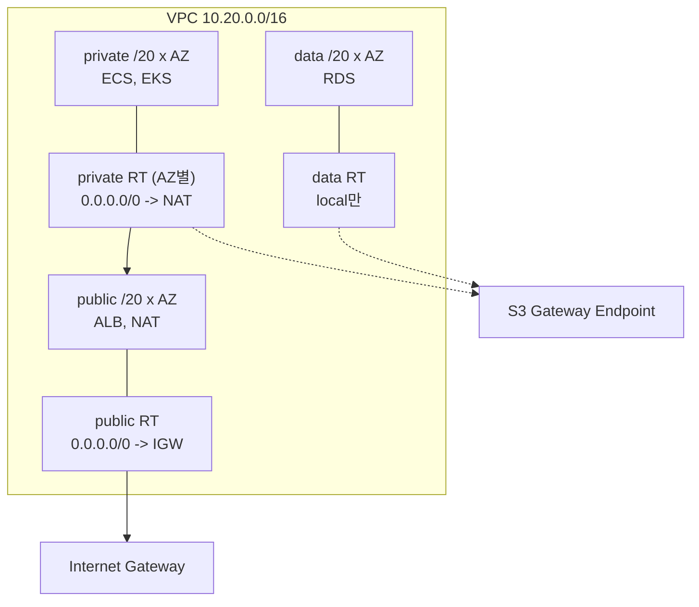

# 27장 — VPC 네트워킹 실전: 라우팅 · NAT · 엔드포인트 · 피어링

**이 장에서 배우는 것**

- `cidrsubnet` 과 `for_each` 로 3-tier(public/private/data) 서브넷을 AZ 수에 맞춰 자동으로 나눌 수 있다.
- `aws_route_table` 의 인라인 `route` 와 `aws_route` 리소스를 **섞으면 안 되는 이유**를 알고 어느 쪽을 언제 고를지 판단할 수 있다.
- NAT gateway의 비용 구조와 AZ 배치 트레이드오프를 계산하고 `aws_eip` 의 `domain` · 삭제 timeout · regional 모드를 설정할 수 있다.
- Gateway 엔드포인트와 Interface 엔드포인트를 라우팅·과금·DNS 관점에서 구분하고 NAT 비용 절감을 추정할 수 있다.
- VPC 피어링을 같은 계정·크로스 리전으로 나누어 구성하고 Security group과 Network ACL의 역할을 나눌 수 있다.

**왜 중요한가**

VPC는 한 번 만들면 오래 산다. 서브넷 CIDR을 잘못 잡으면 늘릴 수가 없다 — `cidr_block` 은 서브넷을 교체해야 바뀌고, 교체하려면 그 안의 ENI를 전부 비워야 하며, 그건 RDS·ALB·EKS 노드를 전부 옮긴다는 뜻이다. AZ 2개에 `/24` 씩 잡아 두고 2년을 쓰다가 EKS 노드가 파드마다 IP를 소비하면서 251개 주소가 동나 파드가 `Pending` 에서 멈추는 것이 흔한 사고다.

라우팅에서는 다른 종류의 사고가 난다. 팀 A가 `aws_route_table` 안에 인라인 `route` 로 NAT 경로를 넣어 뒀는데 팀 B가 별도 스택에서 `aws_route` 로 피어링 경로를 같은 테이블에 추가한다. 원문은 이 조합을 명시적으로 금지한다 — "you cannot use a `aws_route_table` inline `route` blocks in conjunction with any `aws_route` resources." 결과는 apply할 때마다 서로의 경로를 지우는 왕복이고, 증상은 "가끔 인터넷이 안 된다"로 나타나 원인을 찾는 데 며칠이 걸린다.

비용도 조용히 샌다. NAT gateway는 시간당 요금과 **처리한 데이터 GB당 요금**을 같이 받아, private 서브넷의 애플리케이션이 S3에서 하루 2TB를 읽으면 그 트래픽이 전부 NAT를 통과한다. S3용 Gateway 엔드포인트는 **라우팅 테이블에 항목 하나를 추가하는 것으로 끝나고 추가 요금이 없다.**

## CIDR 계획: 나중에 못 바꾸는 결정

원칙은 셋이다. **충분히 크게 잡는다** — `/16`(65,536개)을 잡아도 사설 대역이라 공짜이고, 아끼는 것은 다른 VPC와 붙일 때 겹치지 않을 여지뿐이다. **겹치지 않게 배분한다** — 피어링과 Transit Gateway는 **CIDR이 겹치면 붙일 수 없다.** `10.0.0.0/8` 을 조직 공간으로 두고 환경·리전마다 `/16` 을 배정하는 표를 먼저 만든다. **서브넷은 코드로 계산한다** — 손으로 적으면 오타가 나고 AZ를 늘릴 때 다시 계산해야 한다.

```terraform
data "aws_availability_zones" "available" {
  state = "available"
}

locals {
  vpc_cidr = "10.20.0.0/16"
  azs      = slice(data.aws_availability_zones.available.names, 0, 3)

  # tier별 오프셋을 나눠 /20 조각으로 자른다
  subnets = merge([
    for ti, tier in ["public", "private", "data"] : {
      for ai, az in local.azs : "${tier}-${az}" => {
        tier = tier
        az   = az
        cidr = cidrsubnet(local.vpc_cidr, 4, ti * 4 + ai)
      }
    }
  ]...)
}
```

`cidrsubnet(prefix, newbits, netnum)` 은 `/16` 에 `newbits = 4` 를 더해 `/20` 을 만들고 `netnum` 번째 조각을 돌려준다. tier마다 4칸씩 띄워 두면 AZ를 4개로 늘려도 다른 tier를 침범하지 않는다 — 이 **여유 칸 설계**가 핵심이다.

```terraform
resource "aws_vpc" "main" {
  cidr_block           = local.vpc_cidr
  enable_dns_hostnames = true   # 기본값 false — 피어링 DNS와 엔드포인트에 필요
  tags                 = { Name = "app-prod" }
}

resource "aws_subnet" "this" {
  for_each = local.subnets

  vpc_id                  = aws_vpc.main.id
  cidr_block              = each.value.cidr
  availability_zone       = each.value.az
  map_public_ip_on_launch = each.value.tier == "public"   # 기본값 false

  tags = {
    Name = "app-prod-${each.key}"
    Tier = each.value.tier
  }
}
```

`for_each` 의 키를 `"private-ap-northeast-2a"` 처럼 **의미 있는 문자열**로 잡은 것이 중요하다 — [17장](17-count-foreach-dynamic.md)에서 본 대로 `count` 인덱스를 쓰면 AZ 목록이 바뀔 때 주소가 밀리면서 멀쩡한 서브넷이 교체된다. `enable_dns_hostnames` 는 기본이 `false` 인데 피어링의 DNS 해석과 Interface 엔드포인트의 private DNS가 모두 이것을 요구하므로 사실상 항상 켠다.



## 라우팅 테이블: 두 가지 스타일, 섞지 말 것

`aws_route_table` 은 `vpc_id` 만 Required다. 경로를 넣는 방법이 둘이다.

**인라인 `route` 블록** — 테이블이 가질 경로 전체를 한 리소스가 소유한다.

```terraform
resource "aws_route_table" "public" {
  vpc_id = aws_vpc.main.id

  route {
    cidr_block = "0.0.0.0/0"
    gateway_id = aws_internet_gateway.main.id
  }

  tags = { Name = "app-prod-public" }
}
```

**별도 `aws_route` 리소스** — 경로 하나가 리소스 하나이고 `route_table_id` 와 목적지·타깃을 각각 지정한다.

```terraform
resource "aws_route" "private_nat" {
  for_each = aws_route_table.private

  route_table_id         = each.value.id
  destination_cidr_block = "0.0.0.0/0"
  nat_gateway_id         = aws_nat_gateway.this[each.key].id
}
```

원문이 두 문서 양쪽에 같은 경고를 붙였다 — **한 테이블에 두 방식을 함께 쓸 수 없다.** 인라인 `route` 는 "이 목록이 경로의 전부"라는 선언이라, 밖에서 `aws_route` 가 추가한 경로를 다음 apply에서 지운다.

판단 기준은 **소유권**이다. 라우팅 테이블과 경로를 한 스택이 전부 소유하면 인라인이 읽기 좋고, 나중에 다른 스택이나 모듈이 경로를 추가해야 하면(피어링, Transit Gateway, VPN) 처음부터 `aws_route` 로 통일한다.

`route` 인수는 attribute-as-blocks 모드로 처리되며, **생략하면 기존 경로를 무시**하고 **`route = []` 는 관리 중인 경로를 전부 지운다.** 생략과 빈 목록이 다르다.

### 흔한 원인 불명의 permanent diff

AWS API는 `gateway_id` 와 `nat_gateway_id` 에 너그러워서 **NAT gateway ID를 `gateway_id` 에 넣어도 생성은 성공한다.** 그런데 읽을 때는 올바른 필드로 되돌려 주므로 설정과 state가 영원히 어긋난다. "계속 diff가 뜬다"면 먼저 확인할 것이 이것이고, `gateway_id` 는 Internet Gateway나 Virtual Private Gateway 전용이다.

VPC CIDR을 `local` 로 향하게 하는 기본 경로는 **암묵적으로 생성되며 설정에 쓸 수 없다.** 다만 정확히 같은 경로를 적어 "입양(adopt)"한 뒤 타깃을 ENI로 바꾸는 것은 가능하다.

## 서브넷을 라우팅 테이블에 붙이기

`aws_route_table_association` 은 `route_table_id` 가 Required이고 `subnet_id` 또는 `gateway_id` 중 **정확히 하나**를 준다(둘은 conflicts). 후자는 IGW로 들어오는 트래픽을 검사 어플라이언스로 보내는 edge association이다.


```terraform
resource "aws_route_table_association" "private" {
  for_each = { for k, v in local.subnets : k => v if v.tier == "private" }

  subnet_id      = aws_subnet.this[each.key].id
  route_table_id = aws_route_table.private[each.value.az].id
}
```
함정 하나. **연결하지 않은 서브넷은 VPC의 메인 라우팅 테이블을 쓴다.** 메인 테이블은 VPC 생성 시 AWS가 만들고 Terraform은 기본적으로 관리하지 않는다. association을 빠뜨린 서브넷은 조용히 그것을 따르고, 인터넷 경로가 없으면 "왜 이 서브넷만 밖으로 못 나가지"가 된다. 반대로 누군가 메인 테이블에 `0.0.0.0/0 -> IGW` 를 넣으면 **private이어야 할 서브넷이 사실상 public이 된다.**

메인 테이블을 다루는 리소스는 둘이다 — `aws_default_route_table` 은 VPC와 함께 만들어진 테이블을 Terraform 관리로 입양하고, `aws_main_route_table_association` 은 메인 테이블을 다른 테이블로 바꾼다(destroy 시 원래대로 되돌아간다). 안전한 기본값은 **모든 서브넷에 명시적 association을 만들고 메인 테이블은 비워 두는 것**이다.

## IGW와 NAT gateway

`aws_internet_gateway` 는 `vpc_id` 만 있으면 되고(`aws_internet_gateway_attachment` 로 나중에 붙일 수도 있다) 요금이 없다. NAT gateway는 다르다. **시간당 요금과 처리 데이터 GB당 요금을 함께 받아** 개수와 배치가 곧 비용이다. **AZ당 1개**로 두면 트래픽이 같은 AZ의 NAT로 나가 AZ 하나가 죽어도 나머지가 살고 AZ 간 전송 요금도 없다(대신 시간당 요금 × AZ 수). **전체 1개**면 시간당 요금은 1/3이지만 그 AZ가 죽을 때 **모든 private 서브넷의 아웃바운드가 끊기고**, 다른 AZ 트래픽에 AZ 간 전송 요금이 붙어 트래픽이 많으면 절감분을 까먹는다. 프로덕션은 AZ당 1개, dev/staging은 1개가 기준이다.

```terraform
resource "aws_eip" "nat" {
  for_each = toset(local.azs)
  domain   = "vpc"           # v6에서 vpc = true 는 제거됐다
}

resource "aws_nat_gateway" "this" {
  for_each = toset(local.azs)

  allocation_id = aws_eip.nat[each.key].id
  subnet_id     = aws_subnet.this["public-${each.key}"].id
  depends_on    = [aws_internet_gateway.main]   # 원문 권고
}
```

셋을 짚는다. **`domain = "vpc"`** — EC2-Classic 은퇴와 함께 `aws_eip` 의 `vpc` 인수는 v5에서 deprecated, **v6에서 제거됐다.** **`depends_on`** — NAT gateway는 public 서브넷에 있고 그 서브넷이 IGW로 나가야 동작하는데 참조 관계만으로는 순서가 보장되지 않아 원문이 명시적 의존을 권한다. **삭제가 느리다** — 기본 timeout이 create 10분, update 10분, **delete 30분**이고 그동안 EIP도 해제되지 않아 destroy가 "멈춘 것처럼" 보이는 흔한 원인이 된다.

`connectivity_type` 은 `public`(기본) 또는 `private` 이며, private NAT는 EIP 없이 온프레미스나 다른 VPC로 나가는 경로에 쓴다. v6에는 `availability_mode` 도 있다 — 기본 `zonal` 대신 `regional` 로 두면 리전 단위 NAT gateway가 되고 `subnet_id` 대신 `vpc_id` 가 Required이며 `connectivity_type` 은 `public` 이어야 한다. `availability_zone_address` 블록을 생략하면 auto 모드, 지정하면 수동 모드이고 **두 모드 사이를 오가면 리소스가 재생성된다.**

## VPC 엔드포인트: Gateway와 Interface

`aws_vpc_endpoint` 하나가 여러 종류를 다 만든다. `vpc_endpoint_type` 의 기본값은 **`Gateway`** 이고 유효값은 `Gateway`, `GatewayLoadBalancer`, `Interface`, `Resource`, `ServiceNetwork` 다.

### Gateway 엔드포인트 — S3와 DynamoDB

**라우팅 테이블에 항목으로 붙는다.** ENI를 만들지 않아 security group이 필요 없고 시간당 요금도 데이터 처리 요금도 없다.

```terraform
resource "aws_vpc_endpoint" "s3" {
  vpc_id       = aws_vpc.main.id
  service_name = "com.amazonaws.ap-northeast-2.s3"

  route_table_ids = concat(
    [for rt in aws_route_table.private : rt.id],
    [aws_route_table.data.id],
  )
}
```

`route_table_ids` 는 **Gateway 타입에만** 적용된다. 여기 나열한 테이블에 S3 prefix list를 목적지로 하는 경로가 생기고, 그 테이블을 쓰는 서브넷의 S3 요청은 NAT를 거치지 않는다. 하루 2TB를 읽으면 NAT 데이터 처리 요금이 월 60TB어치인데 Gateway 엔드포인트로 옮기면 그 부분이 **0**이 된다. `policy` 로 붙이는 엔드포인트 정책은 **기본이 전체 허용**이므로, 우리 계정의 버킷만 허용하도록 좁히면 사설망에서 외부 버킷으로 나가는 데이터 유출 경로가 막힌다.

### Interface 엔드포인트 — 나머지 대부분

**서브넷마다 ENI를 만든다.** `subnet_ids` 와 `security_group_ids` 가 필요하고 ENI 시간당 요금과 데이터 처리 요금이 발생한다.

```terraform
resource "aws_vpc_endpoint" "secretsmanager" {
  vpc_id              = aws_vpc.main.id
  service_name        = "com.amazonaws.ap-northeast-2.secretsmanager"
  vpc_endpoint_type   = "Interface"
  subnet_ids          = [for k, v in local.subnets : aws_subnet.this[k].id if v.tier == "private"]
  security_group_ids  = [aws_security_group.endpoints.id]
  private_dns_enabled = true
}
```

`private_dns_enabled` 의 **기본값은 `false`** 인데 원문은 "Most users will want this enabled" 라고 적는다. 켜면 `secretsmanager.ap-northeast-2.amazonaws.com` 이 VPC 안에서 엔드포인트 ENI의 사설 IP로 해석되어 **애플리케이션 코드를 고치지 않고** 트래픽이 엔드포인트를 탄다. 타입이 `Interface` 가 아닐 때 이 값을 바꾸면 **리소스가 교체된다.**

security group도 잊기 쉽다. **지정하지 않으면 VPC 기본 security group이 붙는다.** 기본 SG는 자기 자신을 소스로 하는 규칙만 있어 애플리케이션에서 오는 443이 막히고, 증상이 거부가 아니라 타임아웃이라 원인을 찾기 어렵다. `service_name` 은 보통 `com.amazonaws.<region>.<service>` 형태이고 크로스 리전이면 `service_region` 을 함께 준다.

원문 경고 하나 더 — 이 리소스의 `route_table_ids` / `subnet_ids` / `security_group_ids` 와 별도 리소스 `aws_vpc_endpoint_route_table_association` 계열을 **같은 ID에 동시에 쓰면 서로 덮어쓴다.**

## VPC 피어링

`aws_vpc_peering_connection` 은 요청자 쪽 리소스다. `vpc_id`(요청자)와 `peer_vpc_id`(수락자)가 Required이고, `peer_owner_id` 는 **생략하면 현재 provider가 연결된 계정**으로 간주되므로 크로스 계정이면 반드시 준다.

`auto_accept` 가 통하는 조건은 명확하다 — **두 VPC가 같은 계정이고 같은 리전일 때만** 자동 수락된다. 그 밖에는 수락자 쪽에서 `aws_vpc_peering_connection_accepter` 로 받아야 하고, `peer_region` 을 지정하는 크로스 리전에서는 원문이 **`auto_accept` 를 `false` 로 두라고** 명시한다.

```terraform
# 요청자 (ap-northeast-2)
resource "aws_vpc_peering_connection" "to_tokyo" {
  vpc_id      = aws_vpc.main.id
  peer_vpc_id = "vpc-0abc123456789def0"
  peer_region = "ap-northeast-1"
  auto_accept = false

  tags = { Name = "seoul-to-tokyo" }
}
```

수락자 쪽은 v6의 top-level `region` 인수 덕분에 provider alias 없이 쓴다([24장](24-enhanced-region-support.md)).

DNS 해석 옵션은 `accepter` / `requester` 블록의 `allow_remote_vpc_dns_resolution` 이다. 켜면 상대 VPC의 인스턴스가 이쪽의 public DNS 이름을 사설 IP로 해석하는데, **양쪽 VPC에 `enable_dns_hostnames` 가 켜져 있어야 하고** 옵션 변경은 피어링이 active 상태여야 가능하다. 이 블록과 별도 리소스 `aws_vpc_peering_connection_options` 를 **같은 연결에 함께 쓰면 옵션이 서로 덮어쓴다** — 크로스 계정에서는 각 계정이 자기 쪽 옵션만 설정할 수 있으므로 별도 리소스 쪽이 맞다.

마지막 둘. 같은 `vpc_id` / `peer_vpc_id` 조합으로 리소스를 여러 개 만들어도 **에러가 나지 않는다** — AWS가 기존 연결의 `id` 를 돌려주므로 서로 다른 리소스가 같은 `id` 를 갖는 상태가 된다. 그리고 피어링은 **전이되지 않아** A-B와 B-C가 있어도 A와 C는 통신하지 못한다.

## Security group과 Network ACL

**Security group은 상태 저장(stateful)** 이다 — 인바운드를 허용하면 그 연결의 응답은 아웃바운드 규칙과 무관하게 나간다. ENI에 붙고 **허용 규칙만** 있다. **Network ACL은 무상태(stateless)** 라 요청과 응답을 각각 허용해야 한다 — 인바운드 443을 열었으면 아웃바운드로 임시 포트 범위(1024-65535)도 열어야 한다. 서브넷에 붙고 번호 순서대로 평가되며 **거부 규칙을 쓸 수 있다.**

실무 배분은 이렇다. 세밀한 접근 제어는 전부 security group으로 하고, NACL은 "이 서브넷은 절대 인터넷과 직접 통신하지 않는다" 같은 **넓고 단순한 가드레일**에만 쓴다 — 무상태라 세밀한 규칙을 넣으면 디버깅이 급격히 어려워진다. 리소스는 `aws_network_acl`, `aws_network_acl_rule`, `aws_network_acl_association` 이다. security group 쪽 기본형은 **규칙을 별도 리소스로 빼는 것**이다.

```terraform
resource "aws_security_group" "endpoints" {
  name        = "app-prod-vpce"
  description = "VPC interface endpoints"
  vpc_id      = aws_vpc.main.id
}

resource "aws_vpc_security_group_ingress_rule" "endpoints_https" {
  security_group_id            = aws_security_group.endpoints.id
  referenced_security_group_id = aws_security_group.app.id
  ip_protocol                  = "tcp"
  from_port                    = 443
  to_port                      = 443
}
```

원문은 인라인 `ingress` / `egress` 를 피하라고 권한다 — 여러 CIDR을 다루기 어렵고 규칙마다 고유 ID·태그·설명을 붙일 수 없기 때문이다. 그리고 인라인 규칙과 `aws_vpc_security_group_ingress_rule` / `_egress_rule` / `aws_security_group_rule` 을 **함께 쓰면 규칙이 서로 덮어쓴다.** 라우팅 테이블과 같은 구조의 함정이다.

`aws_vpc_security_group_ingress_rule` 에서 `ip_protocol` 과 `security_group_id` 가 Required이고, `cidr_ipv4` / `cidr_ipv6` / `prefix_list_id` / `referenced_security_group_id` 중 **하나는 반드시** 줘야 하며, `from_port` / `to_port` 는 `ip_protocol` 이 `-1` 이나 `icmpv6` 가 아닌 한 필수다. `aws_security_group` 쪽에서는 `name`, `name_prefix`, `description`, `vpc_id` 가 전부 ForceNew다 — `description` 은 AWS에 업데이트 API가 없어서 그렇고, 분류가 필요하면 태그를 쓴다. Lambda가 붙은 SG는 ENI 정리 때문에 **삭제에 최대 45분**이 걸릴 수 있다.

## VPC Flow Log와 Transit Gateway

`aws_flow_log` 는 ENI·서브넷·VPC 단위로 트래픽 메타데이터를 남긴다. 목적지는 CloudWatch Logs, S3, Kinesis Data Firehose 셋이고 허용된 것·거부된 것·전부 중 무엇을 기록할지 고른다. v6에서 바뀐 것 하나 — **`log_group_name` 이 제거됐고 `log_destination` 을 쓴다.** Flow Log의 값어치는 "왜 막혔는가"에 답할 때 나온다. security group과 NACL은 거부를 조용히 수행하므로 거부 레코드가 없으면 타임아웃만 보고 원인을 추측하게 된다. 목적지별 설정과 커스텀 포맷은 [32장](32-observability.md)에서 다룬다.

VPC가 늘어나면 피어링의 전이 불가가 곧 벽이 된다. N개를 전부 연결하려면 피어링이 N(N-1)/2개 필요하고 라우팅 항목도 그만큼 늘어나는데, Transit Gateway는 허브가 되어 이 수를 N개로 줄인다 — `aws_ec2_transit_gateway`, `aws_ec2_transit_gateway_vpc_attachment`, `aws_ec2_transit_gateway_route_table` 과 그 `_association` / `_propagation`, `aws_ec2_transit_gateway_route` 가 한 벌이다. 대신 attachment마다 시간당 + 데이터 처리 요금이 붙어 VPC가 두세 개면 피어링이 여전히 싸다.

## 순환 의존성이 생기는 지점

Terraform이 "Cycle: ..." 에러를 내는 자리는 대체로 정해져 있다.

**security group이 서로를 참조할 때.** A의 인바운드가 B를, B의 인바운드가 A를 참조하면 인라인 규칙으로 쓰는 순간 두 리소스가 서로를 필요로 한다. 규칙을 `aws_vpc_security_group_ingress_rule` 로 빼면 SG 두 개가 먼저 만들어지고 규칙이 나중에 붙어 고리가 끊긴다 — **관계를 별도 리소스로 빼는 것이 순환을 푸는 일반 해법이다.**

**라우팅과 엔드포인트 사이.** Gateway 엔드포인트가 `route_table_ids` 로 테이블을 참조하는데 그 테이블의 인라인 `route` 가 `vpc_endpoint_id` 로 엔드포인트를 참조하면 고리가 된다. 엔드포인트 쪽 `route_table_ids` 만 쓴다.

**모듈 경계를 잘못 그었을 때.** 모듈 사이의 의존은 **한 방향**이어야 한다([19장](19-modules.md)).

## 흔한 실수

### ❌ 인라인 `route` 와 `aws_route` 를 한 테이블에 섞기

```terraform
resource "aws_route_table" "private" {
  vpc_id = aws_vpc.main.id

  route {
    cidr_block     = "0.0.0.0/0"
    nat_gateway_id = aws_nat_gateway.this.id
  }
}

resource "aws_route" "peering" {          # 다음 apply에서 서로 지운다
  route_table_id            = aws_route_table.private.id
  destination_cidr_block    = "10.30.0.0/16"
  vpc_peering_connection_id = aws_vpc_peering_connection.to_tokyo.id
}
```

```terraform
# ✅ 한 테이블의 경로는 한 방식으로 통일한다 — 여기서는 aws_route
resource "aws_route_table" "private" {
  vpc_id = aws_vpc.main.id
}

resource "aws_route" "private_default" {
  route_table_id         = aws_route_table.private.id
  destination_cidr_block = "0.0.0.0/0"
  nat_gateway_id         = aws_nat_gateway.this.id
}

# aws_route "private_peering" 도 같은 방식으로 추가한다
```

### ❌ Interface 엔드포인트에 security group과 private DNS를 빼기

SG를 지정하지 않으면 **VPC 기본 security group**이 붙어 애플리케이션에서 오는 443이 막히고, 증상이 거부가 아니라 타임아웃이라 원인을 찾기 어렵다.

```terraform
resource "aws_vpc_endpoint" "sm" {
  vpc_id            = aws_vpc.main.id
  service_name      = "com.amazonaws.ap-northeast-2.secretsmanager"
  vpc_endpoint_type = "Interface"
  subnet_ids        = local.private_subnet_ids
  # security_group_ids 없음, private_dns_enabled 도 기본 false
}
```

```terraform
# ✅ 전용 SG와 private DNS를 함께 준다
resource "aws_vpc_endpoint" "sm" {
  # ... 위와 동일 ...
  security_group_ids  = [aws_security_group.endpoints.id]
  private_dns_enabled = true
}
```

### ❌ `aws_eip` 에 `vpc = true` 쓰기

v5에서 deprecated, **v6에서 제거**된 인수다. 오래된 블로그 예제의 단골이다.

```terraform
resource "aws_eip" "nat" {
  vpc = true      # v6에서 더 이상 지원되지 않는다
}

# ✅ domain 인수를 쓴다
resource "aws_eip" "nat" {
  domain = "vpc"
}
```

### ❌ 크로스 리전 피어링에 `auto_accept = true`

`auto_accept` 는 **같은 계정 + 같은 리전**에서만 동작한다. `peer_region` 을 지정했다면 accepter 리소스가 필요하다.

```terraform
resource "aws_vpc_peering_connection" "cross" {
  # ... vpc_id, peer_vpc_id ...
  peer_region = "ap-northeast-1"
  auto_accept = true          # 통하지 않는다
}
```

```terraform
# ✅ 요청자는 auto_accept = false, 수락자는 별도 리소스로
resource "aws_vpc_peering_connection" "cross" {
  vpc_id      = aws_vpc.main.id
  peer_vpc_id = var.peer_vpc_id
  peer_region = "ap-northeast-1"
  auto_accept = false
}

resource "aws_vpc_peering_connection_accepter" "cross" {
  region                    = "ap-northeast-1"   # v6 top-level region
  vpc_peering_connection_id = aws_vpc_peering_connection.cross.id
  auto_accept               = true
}
```

## 프로덕션 노트

- **NAT 비용은 엔드포인트로 먼저 줄인다.** S3·DynamoDB Gateway 엔드포인트는 무료다. ECR·CloudWatch Logs처럼 트래픽이 많은 Interface 엔드포인트는 ENI 요금과 NAT 데이터 처리 요금을 비교해 결정한다.
- **destroy가 오래 걸리는 자리를 안다.** NAT gateway는 delete 기본 timeout이 30분, Lambda가 붙은 SG는 ENI 정리에 최대 45분이 걸릴 수 있다. CI job timeout을 여기에 맞춘다.
- **CIDR 배분표를 코드 밖에도 남긴다.** 어느 계정·리전·환경이 어느 `/16` 을 쓰는지는 state에 흩어져 보이지 않는다. 조직 문서나 IPAM으로 관리하지 않으면 몇 년 뒤 피어링이 CIDR 충돌로 막힌다.
- **라우팅 테이블 소유권을 문서로 정한다.** "이 테이블은 network 스택이 소유하고 경로는 전부 `aws_route` 로 추가한다" 같은 규칙이 없으면 혼용 사고가 반복된다.
- **Flow Log는 켜 두되 보존 기간을 정한다.** 트래픽이 많은 VPC의 Flow Log는 CloudWatch Logs 요금에서 가장 큰 항목이 되기 쉽고, S3 목적지 + 라이프사이클 정책이 장기 보관에 저렴하다.
- **서브넷 태그가 다른 서비스의 입력이 된다.** EKS는 `kubernetes.io/role/elb` 같은 태그로 ALB를 놓을 서브넷을 찾는다. 컨트롤러가 붙이는 태그는 `ignore_tags` 로 경계를 정한다.

## 연습문제

1. AZ 3개에 public/private/data 세 tier 서브넷을 `cidrsubnet` 과 `for_each` 로 만들고 AZ 목록이 4개로 늘어났을 때의 plan을 확인하라. *성공 기준:* 새 AZ의 서브넷 3개만 생성 대상이고 기존 9개에는 변경이 없으며 tier 사이 CIDR이 겹치지 않는다.

2. private 라우팅 테이블에 인라인 `route` 로 NAT 경로를 넣은 뒤 별도 `aws_route` 로 두 번째 경로를 추가하고 apply를 두 번 반복하라. *성공 기준:* 두 번째 apply에서 앞선 경로가 사라지는 것을 재현했고, 한 방식으로 통일한 뒤 연속 apply가 무변경이다.

3. S3용 Gateway 엔드포인트를 private 라우팅 테이블에 붙이고 전후 트래픽 경로를 확인하라. *성공 기준:* 라우팅 테이블에 prefix list 목적지 경로가 생긴 것을 확인했고, `policy` 로 특정 버킷 외 접근을 거부하도록 좁혔다.

4. 같은 계정의 두 VPC를 `auto_accept = true` 로 피어링한 뒤 한쪽을 다른 리전으로 옮겨 같은 설정으로 apply하라. *성공 기준:* 크로스 리전에서 `auto_accept` 가 통하지 않는 것을 재현했고 `aws_vpc_peering_connection_accepter` 에 v6의 `region` 인수를 써서 해결했다.

## 요약

- 서브넷 `cidr_block` 은 사실상 되돌릴 수 없다. `/16` 을 넉넉히 잡고 `cidrsubnet` 으로 tier×AZ를 계산하되 tier 사이에 여유 칸을 둔다. `enable_dns_hostnames` 는 기본 `false` 이며 피어링 DNS와 엔드포인트 private DNS가 요구한다.
- 한 라우팅 테이블에 `aws_route_table` 인라인 `route` 와 `aws_route` 를 **함께 쓸 수 없다.** 인라인은 생략 시 기존 경로 무시, `route = []` 는 관리 경로 전체 삭제를 뜻한다. NAT gateway ID를 `gateway_id` 에 넣으면 생성은 되지만 영구 diff가 된다.
- association이 없는 서브넷은 VPC 메인 라우팅 테이블을 따른다. 모든 서브넷에 명시적 association을 만들고 메인 테이블은 비워 두는 것이 안전하다.
- NAT gateway는 시간당 + 데이터 처리 요금이며 기본 delete timeout이 30분이다. `aws_eip` 는 v6에서 `vpc` 가 제거돼 `domain = "vpc"` 를 쓰고 NAT에는 IGW `depends_on` 을 건다.
- `aws_vpc_endpoint` 의 `vpc_endpoint_type` 기본값은 `Gateway` 다. Gateway는 `route_table_ids` 로 붙고 무료, Interface는 `subnet_ids` + `security_group_ids` 로 ENI를 만들며 `private_dns_enabled` 기본이 `false` 다.
- 피어링의 `auto_accept` 는 같은 계정 + 같은 리전에서만 동작한다. 크로스 리전은 `peer_region` + `aws_vpc_peering_connection_accepter` 조합이고, 피어링은 전이되지 않는다.
- Security group은 상태 저장·허용 전용·ENI 단위, NACL은 무상태·거부 가능·서브넷 단위다. 인라인 `ingress`/`egress` 와 별도 rule 리소스를 섞으면 규칙이 덮어써진다. `description` 을 포함한 SG의 여러 인수는 ForceNew다.

## 다음으로

- [28장 — 컴퓨트: Launch Template + ASG + ALB](28-compute-asg-alb.md) — 이 서브넷 위에 트래픽을 받는 계층을 올린다.
- [32장 — 관측: CloudWatch 로그·알람·VPC Flow Log](32-observability.md) — Flow Log의 목적지·포맷·비용.
- [26장 — 시크릿](26-secrets-and-ephemeral.md) — Interface 엔드포인트로 Secrets Manager를 사설망에서 호출한다.
- 공식 문서: [aws_route_table](https://registry.terraform.io/providers/hashicorp/aws/latest/docs/resources/route_table), [aws_vpc_endpoint](https://registry.terraform.io/providers/hashicorp/aws/latest/docs/resources/vpc_endpoint)
