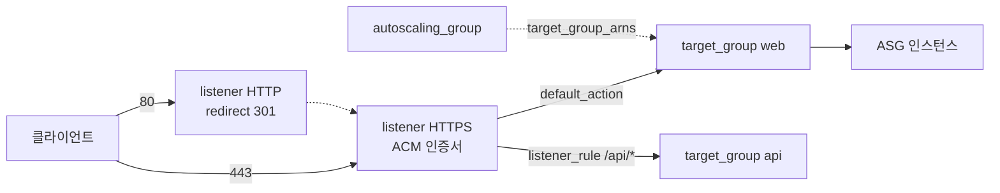

# 28장 — 컴퓨트: Launch Template + ASG + ALB로 죽지 않는 계층 만들기

**이 장에서 배우는 것**

- `aws_instance` 를 직접 세는 코드에서 벗어나 launch template + ASG로 "무엇을 얼마나"를 선언할 수 있다.
- `user_data` 가 왜 base64여야 하는지, 버전이 `$Latest` 와 `$Default` 로 갈리는 이유를 설명할 수 있다.
- `instance_refresh` 로 AMI 교체를 무중단 롤링으로 돌리고 `triggers` 로 교체 조건을 직접 정할 수 있다.
- ASG에 `default_tags` 가 적용되지 않는 전제 위에서 태깅을 설계하고 `lifecycle` 로 오토스케일링과 Terraform의 충돌을 끊을 수 있다.
- ALB의 target group · listener · rule을 나누어 설계하고 ACM DNS 검증 3단계 패턴으로 HTTPS를 자동화할 수 있다.

**왜 중요한가**

`aws_instance` 세 개를 `count = 3` 으로 만들어 두면 처음 한 달은 잘 돈다. 문제는 새벽 3시에 한 대의 하드웨어가 죽었을 때다. Terraform은 그 사실을 모르고, 다음 `plan` 까지 인스턴스는 죽은 채로 있으며 복구가 사람의 apply를 기다린다. ASG는 같은 상황에서 health check 실패를 감지해 몇 분 안에 새 인스턴스를 띄운다. "가축 vs 애완동물"이라는 비유의 실체가 이것이다.

두 번째 사고는 배포에서 난다. AMI를 새로 구워 `aws_instance` 의 `ami` 를 바꾸면 그건 교체다. Terraform은 세 대를 동시에 부수고 동시에 만들며 그 사이 서비스는 0대다. "새 것이 정상인지 확인한 뒤 옛것을 내린다"는 판단이 코드에 없다. ASG의 `instance_refresh` 는 `min_healthy_percentage` 를 지켜 교체하고 실패하면 되돌린다.

세 번째는 태그다. `default_tags` 로 `CostCenter` 를 붙여 비용 대시보드를 만들었는데 EC2 비용의 40%가 미분류로 잡힌다. 원인은 `aws_autoscaling_group` 이 **provider `default_tags` 가 적용되지 않는 예외 리소스**라는 것, 그리고 ASG가 띄운 인스턴스와 볼륨에는 `propagate_at_launch = true` 인 태그만 내려간다는 것이다.

ASG로 넘어가면 state가 아는 것은 그룹뿐이고 인스턴스 ID는 state에 없다. 자가 치유가 Terraform 밖에서 일어나고(그래서 교체는 drift로 잡히지 않는다), 교체 단위가 launch template 버전이 되며, 용량이 코드와 런타임 양쪽에서 움직인다.

## `aws_launch_template`: 인스턴스의 설계도

```terraform
data "aws_ami" "al2023" {
  most_recent = true
  owners      = ["amazon"] # v6는 owners 또는 image-id/owner-id 필터를 요구한다

  filter {
    name   = "name"
    values = ["al2023-ami-2023.*-x86_64"]
  }
}

resource "aws_launch_template" "web" {
  name_prefix   = "web-"
  image_id      = data.aws_ami.al2023.id
  instance_type = "t3.small"

  vpc_security_group_ids = [aws_security_group.web.id]

  iam_instance_profile {
    arn = aws_iam_instance_profile.web.arn
  }

  user_data = base64encode(templatefile("${path.module}/userdata.sh.tftpl", {
    app_version = var.app_version
  }))

  metadata_options {
    http_tokens = "required" # IMDSv2 강제
  }

  tag_specifications {
    resource_type = "instance"
    tags          = local.common_tags
  }

  update_default_version = true
}
```

문서를 읽어야만 알 수 있는 것들이 있다.

**`user_data` 는 base64 인코딩된 문자열이다.** `aws_instance` 는 평문 `user_data` 와 `user_data_base64` 를 둘 다 받지만 launch template의 인수는 `user_data` 하나이고 값이 base64여야 한다. 평문을 넣으면 apply는 통과하고 인스턴스도 뜨지만 부트 스크립트가 실행되지 않는다 — 가장 조용한 실패다.

**`vpc_security_group_ids` 는 `network_interfaces.security_groups` 와 충돌한다.** 퍼블릭 IP를 붙이거나 ENI를 제어해야 하면 `network_interfaces` 블록으로 옮기고 SG도 그 안으로 넣는다. 반만 옮기면 SG 없이 인스턴스가 뜬다.

**`iam_instance_profile` 은 인수가 아니라 블록이다.** `arn` 과 `name` 중 하나를 받고 IAM role이 아니라 **instance profile의 ARN**이어야 한다. role ARN을 넣는 실수는 plan에서 잡히지 않고 인스턴스 시작 실패로만 나타난다.

**`metadata_options.http_tokens` 기본값은 `"optional"`** 이라 IMDSv1이 열려 있다 — SSRF로 크리덴셜이 새는 고전적 경로다. `"required"` 로 두고, 컨테이너 안에서 IMDS를 호출한다면 `http_put_response_hop_limit`(기본 1, 범위 1~64)를 올린다. `instance_type` 과 `instance_requirements` 는 배타적이며 후자를 쓰면 `memory_mib.min` 과 `vcpu_count.min` 이 필수다.

v6에서 `elastic_gpu_specifications` 와 `elastic_inference_accelerator` 가 **제거**됐고(Elastic Graphics·Elastic Inference의 EOL), nullable boolean 검증이 강화되어 `ebs_optimized`, `block_device_mappings.ebs.delete_on_termination`·`.encrypted`, `network_interfaces` 의 `associate_public_ip_address`·`associate_carrier_ip_address`·`delete_on_termination`·`primary_ipv6` 에는 `""`·`true`·`false` 만 허용된다. `0`/`1` 로 불리언을 쓰던 코드는 검증 에러가 난다.

## 태그가 인스턴스와 볼륨까지 내려가는 경로

태그는 세 지점에서 갈라지고 셋 다 채워야 빠지는 곳이 없다. **launch template 자체의 태그**(`aws_launch_template.tags`)는 template 리소스에만 붙고 인스턴스로 내려가지 않으며 provider `default_tags` 가 적용된다. **template이 띄우는 리소스의 태그**는 `tag_specifications` 블록을 `resource_type` 별로 하나씩 쓴다(`instance`, `volume`, `network-interface` 등) — 원문은 default tag가 ASG가 만드는 리소스로 전파되지 않으니 **child resource type마다 직접 주입하라**고 안내한다. **ASG의 `tag` 블록**은 세 필드가 **모두 Required**다.

그리고 교재 전체에서 반복되는 사실 하나. **`aws_autoscaling_group` 은 provider `default_tags` 가 적용되지 않는 예외다.** `tags`/`tags_all` 인수가 아예 없고 `tag` 블록만 있어서 공통 태그 맵을 `dynamic "tag"` 로 펼쳐 넣어야 한다(아래 "흔한 실수" 참고). ECS Capacity Provider의 `AmazonECSManaged` 처럼 다른 서비스가 붙이는 관리용 태그도 설정에 포함시켜야 Terraform이 지우려 들지 않는다.

## 버전: `$Latest` 와 `$Default` 가 갈리는 지점

launch template은 수정되지 않는다. 인수를 바꾸면 **새 버전**이 만들어지고, ASG는 `launch_template.version` 으로 숫자·`$Latest`·`$Default` 중 하나를 고른다. **기본값은 `$Default`** 다.

`"$Default"` 는 default를 승격하기 전까지 옛 설정으로, `"$Latest"` 는 항상 최신 설정으로 뜬다. `latest_version` 속성을 넣으면 최신 설정으로 뜨면서 ASG에 버전 번호 diff도 남는다.

원문의 경고가 명확하다 — **`version = "$Latest"` 면 instance refresh가 시작되지 않는다.** `$Latest` 는 문자열 상수라 template을 바꿔도 ASG 리소스의 값은 그대로이고 Terraform 입장에서 변경이 없다. `latest_version` 속성을 참조해야 `7`→`8` 같은 diff가 생기고 그것이 트리거가 된다.

`update_default_version = true` 는 apply마다 새 버전을 default로 승격한다. `default_version` 인수와 충돌하므로 하나만 쓰고, `$Default` 를 참조하는 다른 소비자에게도 즉시 영향이 간다. `description` 인수는 template 수준 설명이 아니라 **버전 설명**이다.

## `aws_autoscaling_group`: 경계와 대기

```terraform
resource "aws_autoscaling_group" "web" {
  name_prefix         = "web-"
  min_size            = 2
  max_size            = 10
  vpc_zone_identifier = local.private_subnet_ids

  launch_template {
    id      = aws_launch_template.web.id
    version = aws_launch_template.web.latest_version
  }

  target_group_arns         = [aws_lb_target_group.web.arn]
  health_check_type         = "ELB"
  health_check_grace_period = 300

  # ... instance_refresh, dynamic tag 블록 ...

  lifecycle {
    create_before_destroy = true
    ignore_changes        = [desired_capacity]
  }
}
```

**`min_size` 와 `max_size` 는 Required, `desired_capacity` 는 Optional이다.** 생략하면 `min_size` 로 출발하고 스케일링 정책을 붙일 계획이라면 원문 자체가 생략을 권한다. `vpc_zone_identifier` 는 `availability_zones` 와 충돌한다.

**`health_check_type = "ELB"` 면 `health_check_grace_period` 가 필수다.** 기본값 300초이고 이 시간 동안은 health check 실패가 교체를 부르지 않는다. 부팅이 4분인데 grace period가 180초면 ASG는 정상 인스턴스를 계속 죽이고 새로 만든다 — 무한 교체 루프다. `"EC2"` 는 EC2 상태 검사만 보므로 애플리케이션이 죽어도 healthy로 남는다.

**target group은 `target_group_arns` 또는 `aws_autoscaling_attachment` 중 하나로만 붙인다.** 같은 traffic source를 여러 리소스에 쓰면 attachment 충돌이 난다고 원문이 경고한다. 모듈 경계를 넘어 붙일 때만 별도 attachment를 쓰고 ASG에는 `ignore_changes = [target_group_arns]` 를 건다.

ASG를 만들면 Terraform은 **healthy 인스턴스가 `min_size`(또는 `desired_capacity`)만큼 나타날 때까지 기다린다.** healthy는 ASG가 `HealthStatus: "Healthy"`, `LifecycleState: "InService"` 로 보고하는 상태다. 최대 대기는 `wait_for_capacity_timeout`(**기본 `"10m"`**, `"0"` 이면 끈다)이고, ELB까지 확인하려면 `min_elb_capacity`(생성 시에만)나 `wait_for_elb_capacity` 를 쓴다. 통과하지 못하면 apply가 실패하고 **ASG가 tainted가 되어 다음 실행에서 파괴 대상이 된다.**

`lifecycle` 두 줄은 각각 다른 사고를 막는다. `create_before_destroy = true` 는 ASG 이름이 바뀌는 변경에서 인스턴스가 0이 되는 구간을 없애고 사용 중인 launch template 삭제 실패도 막는다 — **참조 체인 전체에 걸어야 하며** 이름 충돌을 피하려면 `name_prefix` 를 쓴다. `ignore_changes = [desired_capacity]` 는 정책이 3→8로 올린 것을 다음 apply가 되돌리는 사고를 막는다.

## `instance_refresh` 와 스팟 혼합

`instance_refresh` 블록이 있으면 ASG 갱신 시 교체가 시작된다.

- `strategy` 는 **Required이고 허용값은 `"Rolling"` 하나뿐**이다. 트리거는 기본적으로 `launch_configuration`·`launch_template`·`mixed_instances_policy` 의 변경이고 `triggers` 로 속성 이름을 더할 수 있다(위 예제의 `"tag"`).
- `min_healthy_percentage` 기본 **90**, `max_healthy_percentage` 는 100~200 사이 기본 **100**이다.
- `instance_warmup` 을 생략하면 **ASG의 health check grace period를 쓴다.** `skip_matching`(기본 `false`)은 이미 원하는 설정인 인스턴스를 건너뛴다.
- `auto_rollback` 은 기본 `false` 이고 **`launch_template` 또는 `mixed_instances_policy` 를 쓸 때만 `true` 로 설정할 수 있다.** `alarm_specification.alarms` 의 알람이 하나라도 ALARM이 되면 refresh가 실패하므로, 5xx 알람을 물리면 나쁜 배포가 스스로 멈춘다.

세 제약을 기억한다. **`$Latest` 면 refresh가 시작되지 않는다. ASG당 활성 refresh는 하나이며 리소스가 갱신되면 기존 refresh는 취소된다. 그리고 이 리소스는 완료를 기다리지 않는다** — apply가 끝나도 교체는 백그라운드에서 진행된다.

단일 타입으로 스팟을 쓰면 그 타입의 용량이 마르는 순간 그룹 전체가 마른다. `mixed_instances_policy` 는 여러 타입과 온디맨드/스팟 비율을 함께 선언한다.

```terraform
resource "aws_autoscaling_group" "worker" {
  # ... name_prefix, min_size, max_size, vpc_zone_identifier ...
  capacity_rebalance = true

  mixed_instances_policy {
    instances_distribution {
      on_demand_base_capacity                  = 2
      on_demand_percentage_above_base_capacity = 20
      spot_allocation_strategy                 = "price-capacity-optimized"
    }

    launch_template {
      launch_template_specification {
        launch_template_id = aws_launch_template.worker.id
        version            = aws_launch_template.worker.latest_version
      }
      override { instance_type = "m6i.large" }
      override { instance_type = "m6a.large" }
    }
  }
}
```

기본값을 알아야 의도대로 동작한다. `on_demand_base_capacity` 기본 **0**, `on_demand_percentage_above_base_capacity` 기본 **100**(아무것도 안 쓰면 전부 온디맨드), `spot_allocation_strategy` 기본 `"lowest-price"`, `spot_instance_pools` 기본 **2**(`lowest-price` 에서만 유효하며 다른 전략에서는 `0` 이어야 한다). `spot_max_price` 를 비우면 온디맨드 가격이 상한이 된다. `capacity_rebalance = true` 는 EC2가 중단을 예고할 때 미리 대체 인스턴스를 띄우고, `override` 의 `weighted_capacity` 를 쓰면 `desired_capacity_type` 을 `"vcpu"` 로 바꿔 용량을 셀 수 있다. 상태를 가진 서비스와 긴 배치 작업은 스팟에 올리지 않는다.

## 스케일링 정책: target tracking과 step scaling

`policy_type` 은 `SimpleScaling`·`StepScaling`·`TargetTrackingScaling`·`PredictiveScaling` 중 하나이고 **생략하면 AWS가 `SimpleScaling` 으로 취급한다.** Target tracking은 목표값만 주면 AWS가 알람과 조정을 관리한다. `target_value` 만 Required이고 `disable_scale_in` 은 기본 `false` 다.

```terraform
resource "aws_autoscaling_policy" "cpu" {
  name                   = "web-cpu-target"
  autoscaling_group_name = aws_autoscaling_group.web.name
  policy_type            = "TargetTrackingScaling"

  target_tracking_configuration {
    predefined_metric_specification {
      predefined_metric_type = "ASGAverageCPUUtilization"
    }
    target_value = 50.0
  }
}
```

Step scaling은 `step_adjustment` 블록을 여러 개 두고 발동은 `aws_cloudwatch_metric_alarm` 의 `alarm_actions` 에 정책 ARN을 넣어 맡긴다. 자주 틀리는 것은 `metric_interval_lower_bound`/`metric_interval_upper_bound` 가 **알람 임계값 기준의 상대값**이라는 점이다. 임계값이 60%이고 lower 0 · upper 10이면 60~70% 구간이며 upper를 생략하면 양의 무한대다. 알람 쪽 `treat_missing_data` 기본값은 `"missing"` 이라 데이터가 비면 INSUFFICIENT_DATA에 머물러 아무 일도 일어나지 않으므로 스케일 아웃 알람에는 보통 `"notBreaching"` 이 맞다. `adjustment_type` 은 `ChangeInCapacity`·`ExactCapacity`·`PercentChangeInCapacity` 다.

## ALB: 네 리소스의 역할 분담

`aws_lb` 는 진입점, `aws_lb_target_group` 은 대상 집합과 health check, `aws_lb_listener` 는 포트·프로토콜·기본 동작, `aws_lb_listener_rule` 은 조건부 라우팅이다.



```terraform
resource "aws_lb_target_group" "web" {
  name_prefix          = "webtg" # 6자 이하
  port                 = 8080
  protocol             = "HTTP"
  vpc_id               = aws_vpc.main.id
  target_type          = "instance"
  deregistration_delay = 30

  health_check {
    path                = "/healthz"
    interval            = 15
    healthy_threshold   = 2
    unhealthy_threshold = 3
  }

  lifecycle {
    create_before_destroy = true
  }
}
```

`aws_lb` 의 기본값. `load_balancer_type` = `"application"`, `internal` = `false`(인터넷 노출이 기본), `idle_timeout` = **60초**이며 **application 타입에서만 유효**, `enable_deletion_protection` = `false`, `enable_http2` = `true`. `name` 은 32자 제한이다. **cross-zone load balancing은 ALB에서 항상 켜져 있고 끌 수 없다** — NLB·GWLB만 기본 `false` 다.

target group에서는 **`name_prefix` 가 6자를 넘길 수 없고**(`name` 은 32자), `name`·`port`·`protocol`·`protocol_version`·`target_type`·`vpc_id` 가 전부 **ForceNew**다. 포트 하나 바꾸면 교체인데 listener가 참조 중이라 `create_before_destroy` 없이는 "사용 중이라 지울 수 없다"로 막힌다. `target_type` 기본값은 `"instance"`, `"ip"` 는 공인 IP를 받지 않고, `"lambda"` 는 **NLB가**, `"alb"` 는 **ALB가** 지원하지 않는다.

`deregistration_delay` 기본값은 **300초**(0~3600)다. 배포마다 인스턴스 하나가 5분씩 draining에 머물러 롤링 교체 시간을 지배한다. health check 기본값은 `interval` **30초**(5~300), `healthy_threshold`·`unhealthy_threshold` **3**(2~10), `timeout` 은 HTTP **6초** / TCP·TLS·HTTPS **10초** / lambda **30초**이고, 기본값이면 unhealthy 판정까지 최대 90초다.

```terraform
resource "aws_lb_listener" "https" {
  load_balancer_arn = aws_lb.web.arn
  port              = 443
  protocol          = "HTTPS"
  ssl_policy        = "ELBSecurityPolicy-TLS13-1-2-2021-06"
  certificate_arn   = aws_acm_certificate_validation.web.certificate_arn

  default_action {
    type             = "forward"
    target_group_arn = aws_lb_target_group.web.arn
  }
}
```

`default_action` 은 Required, `load_balancer_arn` 은 ForceNew다. `type` 의 유효값은 `forward`·`redirect`·`fixed-response`·`authenticate-cognito`·`authenticate-oidc`·`jwt-validation` 이다. HTTPS면 `certificate_arn` 이 정확히 하나 필요하고 추가 인증서는 `aws_lb_listener_certificate` 로 붙인다. `ssl_policy` 는 HTTPS·TLS에서 필수이며 **기본값 `ELBSecurityPolicy-2016-08` 은 오래된 정책**이라 명시적으로 최신을 고른다. v6부터 `mutual_authentication` 의 `trust_store_arn` 등은 **`mode` 가 `verify` 일 때만** 설정 가능하고, `verify` 면 `trust_store_arn` 이 필수다.

80 포트 listener는 `default_action` 의 `type` 을 `"redirect"` 로 두고 `redirect { port = "443", protocol = "HTTPS", status_code = "HTTP_301" }` 만 주면 된다. Required는 `status_code`(`HTTP_301`/`HTTP_302`) 하나뿐이고 `host`·`path`·`port`·`protocol`·`query` 는 각각 `#{host}`·`/#{path}`·`#{port}`·`#{protocol}`·`#{query}` 를 기본값으로 가져, 두 값만 바꾸면 경로와 쿼리가 유지된 채 HTTPS로 넘어간다. 조건 기반 라우팅은 `aws_lb_listener_rule` 이 맡는다. `listener_arn` 과 `priority`(작을수록 먼저 평가)에 `action`·`condition` 블록을 조합하며, 조건으로 `path_pattern`·`host_header`·`http_header`·`http_request_method`·`query_string`·`source_ip` 를 쓸 수 있다. `condition { path_pattern { values = ["/api/*"] } }` 이면 `/api/` 이하만 다른 target group으로 간다. 여러 스택이 같은 listener에 규칙을 넣으면 priority가 충돌하므로 숫자 구간을 서비스별로 배분한다.

## ACM DNS 검증 3단계 패턴

`aws_acm_certificate` 는 인증서를 **요청만** 하고 발급 완료를 기다리지 않는다. 세 리소스가 한 조로 움직인다.

```terraform
resource "aws_acm_certificate" "web" {
  domain_name               = "app.example.com"
  subject_alternative_names = ["www.app.example.com"]
  validation_method         = "DNS"

  lifecycle {
    create_before_destroy = true
  }
}

resource "aws_route53_record" "web_validation" {
  for_each = {
    for dvo in aws_acm_certificate.web.domain_validation_options : dvo.domain_name => {
      name   = dvo.resource_record_name
      record = dvo.resource_record_value
      type   = dvo.resource_record_type
    }
  }

  allow_overwrite = true
  name            = each.value.name
  records         = [each.value.record]
  ttl             = 60
  type            = each.value.type
  zone_id         = data.aws_route53_zone.main.zone_id
}

resource "aws_acm_certificate_validation" "web" {
  certificate_arn         = aws_acm_certificate.web.arn
  validation_record_fqdns = [for r in aws_route53_record.web_validation : r.fqdn]
}
```

**`domain_validation_options` 는 `DNS` 검증일 때만 채워진다** — `EMAIL` 이면 비어 있어 `for_each` 가 빈 맵이 되고 검증이 끝나지 않는다. SAN이 여러 개면 항목도 여러 개라 키를 `dvo.domain_name` 으로 잡고, apex와 와일드카드가 검증 레코드를 공유할 수 있어 `allow_overwrite = true` 가 필요하다. **`create_before_destroy` 를 붙여야 사용 중인 인증서를 교체할 수 있고**, listener는 `aws_acm_certificate_validation.web.certificate_arn` 을 참조해야 한다 — 같은 ARN이지만 후자는 **검증 완료 이후에만 알려지므로** 그래프가 "발급 → listener" 순으로 정렬된다.

## 흔한 실수

### ❌ `user_data` 에 평문 스크립트를 넣기

apply는 성공하고 인스턴스도 뜨지만 스크립트가 실행되지 않는다.

```terraform
resource "aws_launch_template" "web" {
  # ... 나머지 설정 ...
  user_data = <<-EOT
    #!/bin/bash
    systemctl start myapp
  EOT
}
```

```terraform
# ✅ 파일이면 filebase64, 템플릿이면 base64encode(templatefile(...))
resource "aws_launch_template" "web" {
  # ... 나머지 설정 ...
  user_data = base64encode(templatefile("${path.module}/userdata.sh.tftpl", {
    app_version = var.app_version
  }))
}
```

### ❌ `version = "$Latest"` 로 두고 롤링 교체를 기대하기

상수여서 template이 바뀌어도 ASG에 diff가 생기지 않는다.

```terraform
resource "aws_autoscaling_group" "web" {
  # ... 나머지 설정 ...
  launch_template {
    id      = aws_launch_template.web.id
    version = "$Latest"
  }

  instance_refresh {
    strategy = "Rolling"
  }
}
```

```terraform
# ✅ latest_version 속성을 참조해야 diff가 생기고 refresh가 시작된다
resource "aws_autoscaling_group" "web" {
  # ... 나머지 설정 ...
  launch_template {
    id      = aws_launch_template.web.id
    version = aws_launch_template.web.latest_version
  }

  instance_refresh {
    strategy = "Rolling"
    preferences {
      auto_rollback = true
    }
  }
}
```

### ❌ ASG에 `tags` 를 쓰고 `default_tags` 를 믿기

`tags` 인수 자체가 없고 provider `default_tags` 도 적용되지 않는다.

```terraform
resource "aws_autoscaling_group" "web" {
  # ... 나머지 설정 ...
  tags = {                     # 이런 인수는 존재하지 않는다
    Environment = "prod"
  }
}
```

```terraform
# ✅ tag 블록을 dynamic으로 펼치고, 볼륨은 launch template의 tag_specifications로 덮는다
resource "aws_autoscaling_group" "web" {
  # ... 나머지 설정 ...
  dynamic "tag" {
    for_each = local.common_tags
    content {
      key                 = tag.key
      value               = tag.value
      propagate_at_launch = true
    }
  }
}
```


### ❌ target group을 `name` 으로 만들고 포트를 바꾸기

listener가 참조 중인 target group은 새것을 먼저 만들어야 교체된다.

```terraform
resource "aws_lb_target_group" "web" {
  name     = "web-tg"
  port     = 8080          # 9090으로 바꾸면 교체, 그러나 listener가 물고 있어 삭제 실패
  protocol = "HTTP"
  vpc_id   = aws_vpc.main.id
}
```

```terraform
# ✅ name_prefix(6자 이하) + create_before_destroy
resource "aws_lb_target_group" "web" {
  name_prefix = "webtg"
  port        = 9090
  # ... protocol, vpc_id ...

  lifecycle {
    create_before_destroy = true
  }
}
```

## 프로덕션 노트

- **`terraform apply` 의 성공은 배포 완료가 아니다.** `instance_refresh` 는 완료를 기다리지 않고 리소스가 다시 갱신되면 진행 중이던 refresh가 취소된다. 파이프라인은 refresh 상태를 따로 폴링하거나 `alarm_specification` 에 SLO 알람을 물려 자동 실패를 걸어야 한다.
- **`wait_for_capacity_timeout` 을 실제 부팅 시간에 맞춘다.** 기본 `"10m"` 안에 healthy 인스턴스가 차지 않으면 apply가 실패하고 ASG가 tainted가 된다. AMI를 미리 구워 부팅을 짧게 하거나 대기를 `"0"` 으로 끄고 따로 확인한다. ASG의 `update`·`delete` timeout 기본값은 각각 10분이다.
- **`deregistration_delay` 가 배포 시간을 지배한다.** 기본 300초에 인스턴스 10대면 롤링 교체가 50분 가까이 늘어난다. graceful shutdown이 있다면 30~60초로 줄이고 `max_healthy_percentage` 를 올려 병렬성을 확보한다.
- **`enable_deletion_protection = true` 는 Terraform도 막는다.** 프로덕션 ALB에는 켜 두되 환경 정리는 "보호 해제 apply → destroy" 두 단계임을 문서화한다. ASG의 `force_delete` 는 반대로 드레이닝을 건너뛰므로 프로덕션에서 쓰지 않는다.
- **ALB 액세스 로그의 `access_logs.enabled` 는 `bucket` 을 줘도 기본 `false`** 라 명시적으로 켜야 한다. 트래픽이 많으면 S3 비용의 주요 항목이 되므로 버킷 정책과 수명주기를 먼저 준비한다. 스팟을 섞을 때는 `on_demand_base_capacity` 로 최소 가용 대수를 온디맨드로 깔고 그 위를 스팟으로 채운다.

## 연습문제

1. launch template과 ASG를 만들고 AMI를 바꿔 롤링 교체를 관찰하라. `version` 을 `"$Latest"` 로 둔 경우와 `latest_version` 을 참조한 경우를 각각 apply한다. *성공 기준:* `"$Latest"` 에서는 plan에 ASG 변경이 없고 refresh가 시작되지 않음을 확인했으며, `latest_version` 으로 바꾼 뒤 refresh가 `min_healthy_percentage` 를 지키며 진행됨을 확인했다.

2. `tag_specifications` 없이 ASG의 `tag` 블록만으로 태그를 붙인 뒤 인스턴스와 EBS 볼륨의 태그를 각각 조회하라. *성공 기준:* 볼륨에 `CostCenter` 가 없음을 재현했고, `resource_type = "volume"` 인 `tag_specifications` 를 추가해 해결한 뒤 새 볼륨에서 태그를 확인했다.

3. 애플리케이션 포트를 막아 health check를 실패시키고 `health_check_type` 을 `"EC2"` 와 `"ELB"` 로 각각 두어 반응을 비교하라. *성공 기준:* `"EC2"` 에서는 인스턴스가 healthy로 남아 교체되지 않고 ALB만 트래픽을 끊는 것을, `"ELB"` 에서는 grace period 이후 교체가 일어나는 것을 확인했다.

## 요약

- launch template은 불변 버전 객체다. ASG의 `launch_template.version` 은 숫자·`$Latest`·`$Default`(기본값) 중 하나인데 **`"$Latest"` 면 instance refresh가 시작되지 않으므로** `latest_version` 속성을 참조해야 한다.
- `user_data` 는 **base64 인코딩된 값**이어야 한다. `iam_instance_profile` 은 블록이며 instance profile의 ARN/이름을 받는다. `vpc_security_group_ids` 는 `network_interfaces.security_groups` 와, `instance_type` 은 `instance_requirements` 와 충돌한다. `metadata_options.http_tokens` 기본값은 `"optional"` 이다. v6에서 `elastic_gpu_specifications`·`elastic_inference_accelerator` 가 제거됐고 nullable boolean 인수는 `""`·`true`·`false` 만 받는다.
- ASG는 `min_size`·`max_size` 가 Required다. `health_check_type = "ELB"` 면 `health_check_grace_period`(기본 300초)가 필수이고, Terraform은 `wait_for_capacity_timeout`(기본 `"10m"`)까지 기다린 뒤 실패하면 그룹을 tainted로 만든다.
- **`aws_autoscaling_group` 은 provider `default_tags` 가 적용되지 않는다.** `tag` 블록의 세 필드가 모두 Required이고, 인스턴스·볼륨 태그는 launch template의 `tag_specifications` 로 따로 채운다.
- `instance_refresh.strategy` 는 `"Rolling"` 만 가능하다. `min_healthy_percentage` 기본 90, `max_healthy_percentage` 기본 100, `auto_rollback` 기본 `false` 이며 launch template이나 mixed instances policy에서만 켤 수 있다. ASG당 활성 refresh는 하나이고 리소스는 완료를 기다리지 않는다.
- ALB 기본값: `internal` = `false`, `idle_timeout` = 60, `deregistration_delay` = 300초, health check `interval` = 30초·임계값 3·HTTP timeout 6초. target group의 `name_prefix` 는 **6자 제한**이고 주요 인수가 ForceNew라 `create_before_destroy` 가 필요하다.
- HTTPS는 `aws_acm_certificate`(요청) → `aws_route53_record`(`domain_validation_options` 를 `for_each`) → `aws_acm_certificate_validation`(대기) 세 단계다. listener는 validation 리소스의 `certificate_arn` 을 참조해 순서를 강제한다.

## 다음으로

- [29장 — 컨테이너: ECR · ECS/Fargate · EKS](29-containers-ecs-eks.md) — 같은 ALB 뒤에 태스크와 파드를 붙인다.
- [21장 — lifecycle: 교체·보호·무시·트리거](21-lifecycle-meta-arguments.md) — `create_before_destroy` 와 `ignore_changes` 의 정확한 의미.
- 공식 문서: [aws_autoscaling_group](https://registry.terraform.io/providers/hashicorp/aws/latest/docs/resources/autoscaling_group), [aws_lb_target_group](https://registry.terraform.io/providers/hashicorp/aws/latest/docs/resources/lb_target_group)
