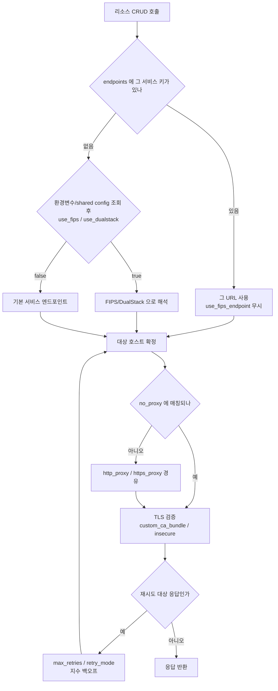

# 34장 — Provider 설정 심화: 요청이 실제로 어디로 나가는가

**이 장에서 배우는 것**

- `endpoints` 블록의 서비스 키가 어디에서 오는지 알고 별칭이 여러 개일 때 어떤 값이 이기는지 안다.
- 엔드포인트 설정의 **7단계 평가 순서**를 따라가고 `AWS_IGNORE_CONFIGURED_ENDPOINT_URLS`로 환경에서 새어 든 설정을 걷어낼 수 있다.
- LocalStack 같은 AWS 호환 구현에 필요한 `skip_*` 네 개와 `s3_use_path_style`이 각각 무엇을 끄는지 구분할 수 있다.
- `use_fips_endpoint` / `use_dualstack_endpoint`의 적용 범위와 FIPS 엔드포인트가 없는 서비스를 `endpoints`로 우회하는 규칙을 적용할 수 있다.
- 프록시 뒤의 CI를 `http_proxy`·`https_proxy`·`no_proxy`로 설정하고 TLS 경계를 `custom_ca_bundle`로 정리할 수 있다.
- `max_retries`(기본 **25**) · `retry_mode` · `token_bucket_rate_limiter_capacity`가 각각 어느 계층을 건드리는지 구분할 수 있다.

**왜 중요한가**

`terraform apply`가 `RequestError: send request failed ... dial tcp 52.94.x.x:443: i/o timeout`으로 멈췄다고 하자. 코드는 어제와 같고 자격증명도 유효하며, 바뀐 것은 네트워크 팀이 egress 정책을 조인 것뿐이다. 이 에러는 IAM 문제도 Terraform 문제도 아니다 — **HTTP 요청이 나가는 경로**의 문제고, 그 경로는 전적으로 provider 블록의 인수들이 결정한다. 어떤 호스트로, 어떤 프록시를 거쳐, 어떤 CA를 믿고, 실패하면 몇 번 다시 시도하는지.

두 번째 사고는 더 조용하다. "모든 AWS API 호출은 FIPS 140-2 엔드포인트로"라는 통제가 걸렸고, 팀은 `use_fips_endpoint = true`를 넣고 apply가 통과하는 것을 확인한 뒤 감사에 "적용 완료"로 보고했다. 그런데 원문은 **FIPS 엔드포인트가 없는 서비스와 리전이 있다**고 못박고 **커스텀 엔드포인트가 지정된 서비스에서는 이 설정이 무시된다**고도 적는다. 두 문장을 모으면 apply 성공은 "전부 FIPS로 나갔다"의 증거가 되지 못한다.

세 번째는 재시도다. `max_retries`의 기본값은 3이 아니라 **25**이고 지연은 지수적으로 증가한다. 스로틀링이 심한 계정에서 이 숫자는 "apply가 실패한다"가 아니라 "apply가 40분 동안 끝나지 않는다"로 나타난다. 여기에 `token_bucket_rate_limiter_capacity`를 잘못 켜면 원문이 경고하는 `retry quota exceeded` 에러가 새로 생긴다.

## `endpoints` 블록: 서비스 키는 어디에서 오는가

provider 블록은 "자격증명과 리전을 넣는 곳"([4장](../level1-beginner/04-provider-block-and-auth.md))이 아니라 **AWS SDK 클라이언트를 조립하는 설정 묶음**이다. 리소스를 하나 만들 때 일어나는 일은 다음 사슬이다.

```
스키마 -> 서비스별 SDK 클라이언트 -> 엔드포인트 결정 -> HTTP 전송(프록시·TLS) -> 재시도/백오프 -> 응답 파싱
```

`endpoints`·`use_fips_endpoint`는 세 번째 마디, `http_proxy`·`custom_ca_bundle`·`insecure`는 네 번째, `max_retries`·`retry_mode`는 다섯 번째를 건드린다. 그리고 이 인수 대부분은 입구가 셋이다 — 원문의 AWS Configuration Reference 표가 **Provider 인수 / 환경변수 / Shared Config 파라미터** 3열이고, **N/A로 비어 있는 칸**이 특히 중요하다(프록시 세 인수는 shared config 칸이 N/A라 `~/.aws/config`에 적을 수 없다).

첫 마디부터 본다. `endpoints`에는 **서비스 키 = 엔드포인트 URL** 형태의 인수가 들어가는데, 문제는 "어떤 이름을 키로 쓰는가"다. `aws_cloudwatch_log_group`을 쓰니까 키가 `cloudwatch_log_group`일 것 같지만 원문 표에서 CloudWatch Logs의 키는 **`logs`**(또는 `cloudwatchlog`, `cloudwatchlogs`)다. ELB v2는 `elbv2`, Secrets Manager는 `secretsmanager`인데 환경변수는 `AWS_ENDPOINT_URL_SECRETS_MANAGER`로 밑줄이 하나 더 들어간다. **리소스 접두어와 엔드포인트 키가 일치한다는 보장은 없다.**

이름들의 출처는 provider 저장소의 `names` 패키지다. 원문 `names/README.md`는 `data/names_data.hcl`이 **빌드 시점에 provider에 임베드되며 생성기가 참조한다**고 설명하고, `names` 블록의 `aliases`를 "이름 변형의 목록(예: AMP는 `prometheus,prometheusservice`)"으로 정의하면서 여기에 기본 패키지 이름을 넣지 말라고 한다 — 이유가 **"Custom Endpoints 가이드에 중복이 생기기 때문"** 이다. 그 거대한 표는 `names_data.hcl`에서 생성된 것이고 가이드 상단에는 `DO NOT EDIT` 주석이 붙어 있다.

여기에서 두 규칙이 나온다. 첫째, **키는 반드시 표에서 확인한다** — 추측한 키는 스키마 오류로 걸리니 조용히 실패하지는 않는다. 둘째, **별칭을 두 개 쓰면 먼저 나온 값이 이긴다.** 원문은 하위 호환을 위해 일부 엔드포인트를 여러 키로 지정할 수 있다고 밝히면서, 동시에 쓰면 **provider가 첫 번째로 설정된 값을 사용하고 이후 값은 무시한다**고 적는다. "먼저"의 기준은 규정하지 않으므로 **한 서비스에는 키 하나만 쓴다**가 유일하게 안전하다. 별칭 둘을 나란히 적어 두면 나중에 한쪽만 수정했을 때 조용히 옛 값이 살아남는다.

원문은 **provider가 지원하지 않는 서비스의 엔드포인트도 커스터마이즈할 수 있게 열어 둔 경우가 있다**고 덧붙인다. 표에 키가 있다는 것이 그 서비스의 리소스가 존재한다는 뜻은 아니다.

## 세 입구와 7단계 평가 순서

엔드포인트의 세 입구를 하나씩 본다. 환경변수는 전체를 한 값으로 바꾸는 `AWS_ENDPOINT_URL`과 서비스별 `AWS_ENDPOINT_URL_<SERVICE>`다. `<SERVICE>`는 AWS SDK for Go v2의 `serviceID`에서 **공백을 밑줄로 바꾸고 전부 대문자**로 만든 것이다(`AWS_ENDPOINT_URL_CLOUDWATCH_LOGS`). shared config는 named profile의 `endpoint_url`이 전체, `services` 섹션이 서비스별이며 식별자는 같은 `serviceID`를 **소문자·밑줄**로 만든 것이다(`cloudwatch_logs`). 원문 표의 세 열이 정확히 이 세 표기를 나란히 보여 준다. 열을 헷갈리면 설정이 조용히 무시된다.

원문이 규정한 평가 순서는 다음 7단계이며 위에서부터 먼저 이긴다.

1. provider에 정의된 엔드포인트
2. `AWS_IGNORE_CONFIGURED_ENDPOINT_URLS` 환경변수 또는 shared config의 `ignore_configure_endpoint_urls` — 설정되어 있으면 **커스텀 엔드포인트를 무시**한다
3. `AWS_ENDPOINT_URL_<SERVICE>` 서비스별 환경변수
4. `AWS_ENDPOINT_URL` 기본 엔드포인트 환경변수
5. shared config의 서비스별 엔드포인트
6. shared config의 기본 엔드포인트
7. 기본 서비스 엔드포인트

2번의 위치를 눈여겨봐야 한다. **provider 블록보다 아래, 환경변수보다 위**다 — 코드에 적은 엔드포인트는 살리고 환경에서 흘러 든 것만 걷어낸다. 노트북에 LocalStack용 `AWS_ENDPOINT_URL`이 export된 채로 운영 디렉터리에서 plan을 돌리는 사고를, CI에 `AWS_IGNORE_CONFIGURED_ENDPOINT_URLS=true`를 박아 두는 것만으로 막을 수 있다.

원문은 Terraform S3 백엔드 호환을 위해 DynamoDB·IAM·S3·STS 네 서비스에 한해 `TF_AWS_<서비스>_ENDPOINT`와 `AWS_<서비스>_ENDPOINT` 형태의 옛 환경변수도 받되 **deprecated**로 표시한다. 오래된 CI 스크립트를 물려받았다면 이 변수들부터 확인한다.

## 용도 1: AWS 호환 구현에 붙이기

첫 용도는 AWS가 아닌 구현을 AWS인 척 쓰는 것이다. 엔드포인트만 바꿔서는 동작하지 않는다 — provider가 시작할 때 **AWS에만 있는 것들**을 확인하려 하기 때문이다. 원문의 LocalStack 예제가 필요한 스위치를 보여 준다.

```terraform
provider "aws" {
  access_key                  = "mock_access_key"
  region                      = "us-east-1"
  s3_use_path_style           = true
  secret_key                  = "mock_secret_key"
  skip_credentials_validation = true
  skip_metadata_api_check     = true
  skip_requesting_account_id  = true

  endpoints {
    dynamodb = "http://localhost:4566"
    iam      = "http://localhost:4566"
    lambda   = "http://localhost:4566"
    s3       = "http://localhost:4566"
    sqs      = "http://localhost:4566"
    sts      = "http://localhost:4566"
  }
}
```

각 `skip_*`이 무엇을 끄는지 원문 정의로 정리하면 이렇다.

- **`skip_credentials_validation`** — STS API 자격증명 검증을 건너뛴다. **STS가 없는 구현**에 필요하다.
- **`skip_metadata_api_check`** — IMDS 확인을 건너뛴다. `true`면 Terraform이 **메타데이터 API로 인증하지 못하므로** 정적 자격증명 같은 다른 수단이 필요하다. 환경변수 `AWS_EC2_METADATA_DISABLED`와 짝을 이룬다.
- **`skip_requesting_account_id`** — 계정 ID 조회를 건너뛴다. 원문은 이 값이 `true`이고 계정 ID가 이전에 확인되지 않았다면 **ARN 속성을 수동으로 조립하는 리소스·데이터 소스들에서 빈 계정 ID를 반환한다**고 적고 대상을 100개 넘게 나열한다(`aws_instance`, `aws_ssm_parameter` 등). 조회 한 번 아끼는 스위치가 아니라 **일부 리소스의 `arn` 값을 바꾸는** 스위치다.
- **`skip_region_validation`** — 리전 검증을 건너뛴다. 자체 리전 이름을 쓰는 AWS-like 구현이나 **아직 공개되지 않은 리전**에 쓴다. 원문 `docs/faq.md`는 새 리전이 provider에 반영되기 전 `InvalidClientTokenId` 에러가 날 때의 대응으로 이 인수를 든다.

`s3_use_path_style`은 요청을 **path-style 주소 지정**(`https://s3.amazonaws.com/BUCKET/KEY`)으로 보내게 한다. 기본값에서 S3 클라이언트는 가능하면 **virtual hosted 방식**(`https://BUCKET.s3.amazonaws.com/KEY`)을 쓰는데, 로컬 구현에서는 이 방식이 `my-bucket.localhost:4566` 같은 해석되지 않는 호스트명을 만든다. 원문은 이 인수가 **S3 서비스에만 적용된다**고 명시한다. MinIO에도 같은 조합이 필요하고, 반대로 엔드포인트가 하나뿐인 DynamoDB Local이라면 `skip_*` 셋이면 충분하다.

원문이 가이드 맨 앞에 붙인 경고도 옮길 값어치가 있다. **커스텀 엔드포인트와 AWS 호환 솔루션 지원은 "best effort"** 이며 HashiCorp의 통합 테스트는 **기본 AWS 엔드포인트에 대해서만** 수행된다.

## 용도 2·3: 사설 엔드포인트 고정과 FIPS

두 번째 용도는 트래픽 경로 강제다. Interface VPC Endpoint(PrivateLink)에 사설 DNS를 켜면 기본 엔드포인트 이름이 사설 IP로 해석되지만, 사설 DNS를 켤 수 없거나 **설정으로 못박고 싶을 때** `endpoints`에 `vpce-...ssm.ap-northeast-2.vpce.amazonaws.com` 형태의 이름을 직접 넣는다. 대가는 **리전과 VPC에 묶인 설정**이 된다는 것이다([27장](../level2-intermediate/27-vpc-networking.md)).

세 번째 용도는 FIPS다. 원문에는 **전역 스위치**와 **개별 우회** 두 층이 있고 둘의 관계가 핵심이다.

- **`use_fips_endpoint`** — provider가 **모든 서비스**에 대해 FIPS 지원 엔드포인트로 해석하게 강제한다. 환경변수 `AWS_USE_FIPS_ENDPOINT`, shared config `use_fips_endpoint`. 원문이 덧붙이는 세 가지: (1) **커스텀 엔드포인트가 지정된 서비스에서는 이 설정이 무시된다.** (2) **모든 서비스나 리전에 유효한 FIPS 엔드포인트가 있는 것은 아니다.** (3) FIPS 엔드포인트가 없는 서비스는 **`endpoints` 파라미터로 그 서비스의 엔드포인트를 덮어쓸 수 있다.**
- **`use_dualstack_endpoint`** — DualStack(IPv4/IPv6) 지원 엔드포인트로 해석하게 강제한다. 환경변수 `AWS_USE_DUALSTACK_ENDPOINT`, shared config `use_dualstack_endpoint`.

`endpoints` 인수 자체의 설명도 같은 관계를 확인해 준다 — "특정 서비스의 FIPS 엔드포인트를 지정하거나 **FIPS 엔드포인트가 없는 서비스의 엔드포인트를 덮어쓰는 데**" 쓸 수 있다고 적는다.

두 층이 이렇게 상호작용하므로 **감사 증적은 provider 설정만으로 만들 수 없다**. `use_fips_endpoint = true`가 있어도 `endpoints`에 키가 하나라도 있으면 그 서비스는 예외다. 실제 경로는 [41장](41-debugging.md)의 `TF_LOG=DEBUG` 로그에서 요청 호스트를 봐야 안다.

## 네트워크 경계: 프록시와 TLS

프록시 인수는 셋이다. **`http_proxy`**(`HTTP_PROXY`/`http_proxy`), **`https_proxy`**(`HTTPS_PROXY`/`https_proxy`), 그리고 프록시를 쓰지 않을 호스트 목록인 **`no_proxy`**(`NO_PROXY`/`no_proxy`). 원문은 **HTTPS 프록시 없이 HTTP 프록시만 쓰려면 `https_proxy`를 빈 문자열(`""`)로 설정하라**고 적는다.

`no_proxy`의 각 값이 될 수 있는 것을 원문이 열거한다 — **도메인 이름 / IP 주소 / CIDR 주소 / 별표(`*`, 프록시를 전혀 수행하지 않음)** 이고 **도메인 이름과 IP 주소 값에는 포트 번호를 포함할 수 있다.** CIDR을 받는다는 점이 실무에서 자주 쓰인다. VPC 엔드포인트로 가는 사설 대역과 IMDS(`169.254.169.254`)를 제외해야 하는데 사설 대역은 CIDR 한 줄로 끝난다 — `no_proxy = "169.254.169.254,10.0.0.0/8,.internal.example.com"`.

`https_proxy = ""` 트릭이 필요한 이유는 환경변수의 존재다. CI 러너 이미지에 `HTTPS_PROXY`가 전역 export되어 있는데 이 워크스페이스만 직접 나가야 한다면 코드에서 빈 문자열로 덮어써야 한다. **생략과 빈 문자열은 다르다** — 생략하면 환경변수가 살아난다.

프록시가 TLS를 가로채면 응답 인증서가 사설 CA로 서명되어 들어오고 provider는 `x509: certificate signed by unknown authority` 계열 에러를 낸다. 해결책은 **그 CA를 신뢰 목록에 넣는 것** 하나다. `custom_ca_bundle`은 루트·중간 인증서 파일 경로이며 환경변수 `AWS_CA_BUNDLE`로도 설정하는데, 원문은 **shared config 파일의 `ca_bundle`은 지원되지 않는다**고 명시한다. AWS CLI는 그 값을 읽으므로, 같은 프로파일로 `aws s3 ls`는 되는데 Terraform만 TLS 오류가 나는 상황이 이 차이에서 나온다.

반대편의 **`insecure`** 는 "provider가 '안전하지 않은' SSL 요청을 수행하도록 명시적으로 허용할지 여부. 생략하면 기본값은 `false`"다. 정당화되는 경우는 자체 서명 인증서를 쓰는 **로컬 목 서버**뿐이다.



## 재시도: `max_retries` · `retry_mode` · 토큰 버킷

**`max_retries`의 기본값은 25다.** 원문 정의는 "AWS가 요청을 스로틀링하거나 일시적 실패를 겪을 때 API 호출을 재시도하는 최대 횟수. 지연은 **지수적으로 증가**한다. 생략하면 기본값은 `25`"다. 환경변수 `AWS_MAX_ATTEMPTS`, shared config `max_attempts`.

25와 지수 백오프를 곱하면 결과가 보인다. 하나의 API 호출이 25번까지 재시도되면 그 리소스 하나가 수 분을 잡아먹을 수 있고, 이건 **에러로 보이지 않는다** — apply가 그냥 느려진다. 진단은 [41장](41-debugging.md)의 `TF_LOG=DEBUG`로 재시도 로그를 세는 것이고 대응은 [40장](40-performance-and-throttling.md)의 `-parallelism` 조정과 함께 간다. 반대로 `max_retries = 3`으로 줄이면 EC2나 CloudWatch처럼 스로틀링이 잦은 API에서 CI가 산발적으로 깨진다. 기본값이 25인 데에는 이유가 있다 — 대규모 apply에서 스로틀링은 예외가 아니라 정상이다.

**`retry_mode`** 는 재시도의 *방식*을 고른다. 원문이 규정하는 것은 유효값 두 개 — **`standard`** 와 **`adaptive`** — 그리고 환경변수 `AWS_RETRY_MODE`, shared config `retry_mode`뿐이다. 두 이름은 AWS SDK 공통 규약에서 온 것으로, `standard`가 재시도 횟수와 백오프만 다루는 기본 모드인 반면 `adaptive`는 클라이언트 측 속도 제한을 얹어 스로틀링 신호에 따라 송출 속도를 조절한다. provider 문서가 세부를 규정하지 않으므로 값을 바꿀 때는 같은 워크스페이스에서 실측해 비교한다.

**`token_bucket_rate_limiter_capacity`** 는 한 층 더 아래를 건드린다. 원문 정의는 "AWS SDK의 **토큰 버킷 재시도 속도 제한기**의 용량. 값을 지정하지 않으면 **클라이언트 측 속도 제한은 비활성화**된다. 값을 지정하면 **`retry quota exceeded` 에러가 발생할 가능성이 커진다**". 기본적으로 꺼져 있고, 켜는 순간 provider가 자기 자신에게 상한을 걸며, 그 상한에 걸리면 AWS가 아니라 **SDK가 내는** 새 에러가 등장한다. 에러 문자열에 AWS 서비스 이름이 없어 원인 추적이 어렵다.

대응 순서는 **동시성 축소(`-parallelism=5`) → `retry_mode = "adaptive"` → 마지막에 토큰 버킷**이다.

## 남은 손잡이들: `sts_region` · S3 · User-Agent · 태그 정책

**`sts_region`** — STS에 사용할 AWS 리전. 원문은 "설정하지 않으면 AWS는 STS에 대해 다른 비-STS 작업과 **같은 리전**을 사용한다"고 적는다. [25장](../level2-intermediate/25-multi-account.md)의 롤 체이닝에서 STS만 별도 리전으로 보내야 한다면 여기다.

**`s3_us_east_1_regional_endpoint`** — `us-east-1`의 S3 호출이 레거시 글로벌 엔드포인트를 쓸지 리전 엔드포인트를 쓸지 지정한다. 유효값은 `legacy` 또는 `regional`이고, 생략하면 기본 동작은 **범용 버킷에는 글로벌, 디렉터리 버킷에는 리전 엔드포인트**다. 그리고 원문의 마지막 문장 — **이 인수와 글로벌 S3 엔드포인트를 쓸 수 있는 기능은 deprecated이며 `v7.0.0`에서 제거된다.** v7 업그레이드 체크리스트([39장](39-version-upgrades.md))에 이 인수 검색을 넣어 둔다.

**User-Agent 세 경로.** 원문은 추가 User-Agent 정보를 제공하는 방법이 셋이라고 명시한다 — `user_agent` provider 인수, `TF_APPEND_USER_AGENT` 환경변수, `provider_meta`의 `user_agent` 인수. 그리고 결정적인 구분선을 긋는다: **앞의 둘은 그 provider 인스턴스가 관리하는 모든 리소스에 적용되고, `provider_meta` 설정은 그것이 설정된 모듈 안의 리소스에만 적용된다.** "이 호출이 어느 모듈에서 나왔는가"를 CloudTrail에서 구분하려면 `provider_meta`가 유일한 수단이다([33장](../level2-intermediate/33-provider-functions-and-policies.md)).

**`tag_policy_compliance`** — "이 provider 인스턴스가 관리하는 리소스에 대해 조직 태깅 정책을 강제할 심각도"이며 원문은 **현재로서는 리소스 타입별 필수 태그 키 준수만 포함**한다고 범위를 좁힌다. 유효값은 `error`, `warning`, `disabled`이고 **설정하지 않거나 `disabled`면 강제하지 않는다.** 환경변수 `TF_AWS_TAG_POLICY_COMPLIANCE`. 이 인수가 **provider 인스턴스 단위**라는 점이 중요하다 — 운영 계정은 `error`, 샌드박스는 `warning`처럼 alias별로 다르게 걸 수 있다([23장](../level2-intermediate/23-tagging-strategy.md)).

## 여러 provider 인스턴스를 설계한다

지금까지의 인수는 전부 **인스턴스 단위**다. 프록시·엔드포인트·재시도 정책이 다르면 인스턴스를 나눠야 한다. [24장](../level2-intermediate/24-enhanced-region-support.md)에서 본 것처럼 v6에서는 리전만 다를 때 대부분 top-level `region` 인수로 해결되므로, **인스턴스를 새로 만드는 이유는 리전이 아니라 계정·자격증명·전송 설정**이 되었다.

alias 명명 규칙 셋이 잘 버틴다 — **무엇이 다른지를 이름에 넣는다**(`aws.secondary`보다 `aws.audit`, `aws.localstack`), **리전만 다르면 alias를 만들지 않는다**, **인스턴스마다 한 줄 주석으로 존재 이유를 적는다.**

모듈에 넘길 때는 `providers = { aws = aws, aws.audit = aws.audit }`처럼 매핑하고, 모듈 쪽 `required_providers`에서 `configuration_aliases = [aws.audit]`로 받을 인스턴스를 선언해야 한다. 선언하지 않으면 `providers` 맵의 alias 항목은 오류가 된다.

**인스턴스가 늘어날 때의 비용**도 있다. 인스턴스는 각각 자기 자격증명 체인을 해석하고 서비스별 SDK 클라이언트를 따로 만들며 자기 HTTP 전송과 재시도 상태를 갖는다. 수가 두 자릿수로 올라가면 init과 그래프 구성에서 지연이 체감되고, 각 인스턴스가 시작할 때 자격증명 검증과 계정 ID 조회를 하므로 **STS 호출 수도 인스턴스 수만큼 늘어난다**. 계정 수십 개를 한 워크스페이스에서 다루는 설계는 이 지점에서 무너진다 — 인스턴스가 아니라 워크스페이스를 나눌 때다([38장](38-large-scale-structure-cicd.md)).

## 흔한 실수

### ❌ 리소스 접두어를 엔드포인트 키로 쓴다

원문 표의 CloudWatch Logs 키는 `logs`다.

```terraform
provider "aws" {
  endpoints {
    cloudwatch_log_group = "http://localhost:4566" # 그런 인수 없음 — 스키마 오류
  }
}
```

```terraform
# ✅ 키는 Custom Service Endpoint 가이드 표에서 확인한다
provider "aws" {
  endpoints {
    logs = "http://localhost:4566"
  }
}
```

### ❌ 하위 호환 별칭을 두 개 다 적어 둔다

원문은 여러 별칭을 동시에 쓰면 **첫 번째 값만 사용된다**고 적고 "먼저"의 기준은 규정하지 않는다. 어느 쪽이 이길지 예측할 수 없다.

```terraform
provider "aws" {
  endpoints {
    dms               = "https://dms.internal.example.com"
    databasemigration = "https://dms-new.internal.example.com" # 조용히 무시될 수 있다
  }
}
```

```terraform
# ✅ 한 서비스에는 키 하나만
provider "aws" {
  endpoints {
    dms = "https://dms-new.internal.example.com"
  }
}
```

### ❌ `use_fips_endpoint = true` 하나로 FIPS 준수를 보고한다

원문은 이 설정이 **커스텀 엔드포인트가 지정된 서비스에서는 무시된다**고 명시한다.

```terraform
provider "aws" {
  use_fips_endpoint = true

  endpoints {
    s3 = "https://s3.ap-northeast-2.amazonaws.com" # 이 서비스는 FIPS 로 가지 않는다
  }
}
```

```terraform
# ✅ 커스텀 엔드포인트는 FIPS 가 없는 서비스에만 두고 그 예외를 감사 문서에 남긴다
provider "aws" {
  use_fips_endpoint = true
}
```

### ❌ TLS 오류를 `insecure = true`로 덮는다

사내 CA 때문에 나는 `x509: certificate signed by unknown authority`를 검증 해제로 넘긴다. 검증 없이 나가는 것은 AWS 자격증명이다.

```terraform
provider "aws" {
  insecure = true # 운영 코드에 있어서는 안 된다
}
```

```terraform
# ✅ CA 를 신뢰 목록에 넣는다. shared config 의 ca_bundle 은 지원되지 않으므로
#    provider 인수 또는 AWS_CA_BUNDLE 환경변수를 쓴다.
provider "aws" {
  custom_ca_bundle = "/etc/pki/corp/ca-bundle.pem"
}
```

## 프로덕션 노트

- **엔드포인트 환경변수는 워크스페이스 밖에서 새어 들어온다.** 개발자 셸의 `AWS_ENDPOINT_URL`, 러너 이미지의 `HTTPS_PROXY`, 물려받은 `TF_AWS_S3_ENDPOINT`는 코드 리뷰에 걸리지 않는다. CI 잡 시작 시 `env | grep -E 'AWS_|_PROXY'`를 로그에 남기고 운영 파이프라인에는 `AWS_IGNORE_CONFIGURED_ENDPOINT_URLS=true`를 박아 둔다.
- **LocalStack 설정은 별도 파일로 격리한다.** `skip_credentials_validation`·`insecure` 같은 스위치가 운영 코드에 섞이면 되돌리기 어렵다. 원문이 호환 솔루션 지원을 "best effort"라고 못박은 이상 LocalStack 통과는 배포 게이트가 될 수 없다.
- **`max_retries` 기본 25는 실패를 지연으로 바꾼다.** 스로틀링은 에러가 아니라 "apply가 느려짐"으로 나타난다. 파이프라인에 apply 소요 시간을 지표로 남기고 추세가 꺾이는 시점을 스로틀링 신호로 읽는다.
- **FIPS·DualStack 준수는 설정이 아니라 로그로 증명한다.** `use_fips_endpoint`가 커스텀 엔드포인트에서 무시되므로, 감사 대응은 `TF_LOG=DEBUG` apply 로그에서 실제 요청 호스트를 뽑아 서비스별 표로 만드는 것이 확실하다.
- **provider 인스턴스 수는 곧 STS 호출 수다.** 인스턴스마다 자격증명 검증과 계정 ID 조회가 일어난다. 계정이 수십 개로 늘면 인스턴스를 늘리지 말고 워크스페이스를 나눈다.

## 연습문제

1. LocalStack 컨테이너를 띄우고 S3 버킷과 SQS 큐를 만드는 설정을 작성하라. provider 설정은 `provider-localdev.tf` 한 파일에만 두고 같은 리소스 코드가 운영 provider로도 apply 가능해야 한다. *성공 기준:* LocalStack에서 apply가 성공하고, 그 파일을 제거한 뒤 실제 자격증명으로 돌린 plan이 리소스 코드 수정 없이 생성된다. `s3_use_path_style`을 `false`로 바꿨을 때 나는 에러도 기록한다.

2. 엔드포인트 우선순위를 실험으로 확인하라. 같은 서비스에 대해 provider `endpoints` 키, `AWS_ENDPOINT_URL_<SERVICE>`, shared config `services` 섹션을 서로 다른 값으로 동시에 설정한 뒤 어느 것이 이기는지 확인하고, `AWS_IGNORE_CONFIGURED_ENDPOINT_URLS`를 켜서 결과 변화를 관찰하라. *성공 기준:* `TF_LOG=DEBUG` 로그의 요청 호스트가 원문 7단계 순서와 일치함을 네 조합에 대해 표로 제시할 수 있다.

3. 재시도 설정의 영향을 측정하라. 리소스 60개 이상을 만드는 설정에 대해 (a) 기본값, (b) `retry_mode = "adaptive"`, (c) `-parallelism=5` 세 조건으로 apply 시간과 재시도 횟수를 기록하라. *성공 기준:* 세 조건을 표로 제시하고 이 워크로드에 어떤 설정을 택할지 근거와 함께 정당화할 수 있다.

## 요약

- `endpoints`의 서비스 키는 `names` 패키지의 `names_data.hcl`에서 생성되며 가이드 표는 자동 생성 문서다. 리소스 접두어와 키가 일치한다는 보장은 없고, **하위 호환 별칭을 여러 개 쓰면 첫 번째 값만 사용된다.**
- 엔드포인트 설정 순서는 7단계다: provider → `AWS_IGNORE_CONFIGURED_ENDPOINT_URLS` → 서비스별 환경변수 → `AWS_ENDPOINT_URL` → shared config 서비스별 → shared config 기본 → 기본 엔드포인트.
- AWS 호환 구현에는 `skip_credentials_validation`·`skip_metadata_api_check`·`skip_requesting_account_id`가 필요하고 S3 계열에는 `s3_use_path_style = true`가 추가된다. `skip_requesting_account_id`는 성능 스위치가 아니라 **일부 리소스의 `arn` 값을 바꾸는** 스위치다.
- `use_fips_endpoint`는 모든 서비스에 FIPS를 강제하지만 **커스텀 엔드포인트가 있는 서비스에서는 무시되고**, FIPS 엔드포인트가 없는 서비스는 `endpoints`로 개별 우회하도록 원문이 안내한다.
- `max_retries` 기본값은 **25**이고 지연은 지수적으로 증가한다. `retry_mode`는 `standard`/`adaptive`, `token_bucket_rate_limiter_capacity`는 기본 비활성이며 켜면 `retry quota exceeded` 위험이 커진다.
- `custom_ca_bundle`(`AWS_CA_BUNDLE`)은 지원되지만 **shared config의 `ca_bundle`은 지원되지 않는다.** `no_proxy`는 도메인·IP·CIDR·`*`를 받고 포트도 포함할 수 있으며, HTTP 프록시만 쓰려면 `https_proxy = ""`로 명시해야 한다.
- `s3_us_east_1_regional_endpoint`는 deprecated이며 **v7.0.0에서 제거**된다. User-Agent 세 경로 중 `provider_meta`만 모듈 범위이며 `tag_policy_compliance`는 provider 인스턴스 단위 설정이다.

## 다음으로

- [35장 — 관계 리소스와 `*_exclusive`](35-relationship-resources.md) — 이번 장이 "요청이 어디로 나가는가"였다면 다음 장은 "무엇을 소유하는가"다.
- [40장 — 성능과 API 스로틀링](40-performance-and-throttling.md) — `max_retries`·`retry_mode`와 `-parallelism`을 조율한다.
- [41장 — 디버깅](41-debugging.md) — `TF_LOG=DEBUG`로 실제 요청 호스트와 재시도를 확인한다.
- 공식 문서: [Custom Service Endpoints](https://registry.terraform.io/providers/hashicorp/aws/latest/docs/guides/custom-service-endpoints)
