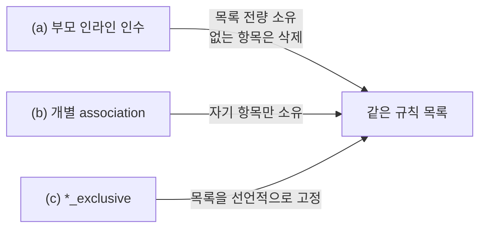

# 35장 — 관계 리소스와 `*_exclusive`: 누가 그 목록을 소유하는가

**이 장에서 배우는 것**

- AWS API가 부모-자식 "관계"를 표현하는 방식이 왜 제각각인지 알고 one-to-one / one-to-many를 구분할 수 있다.
- 같은 관계를 표현하는 세 형태(부모 인라인 인수 · 개별 association 리소스 · `*_exclusive`)의 **소유권 의미**를 말할 수 있다.
- 설계 표준의 "단수형 우선" 규칙과 예외 두 조건을 설명하고 새 리소스의 형태를 예측할 수 있다.
- `aws_iam_policy_attachment`의 계정 전역 배타성이 왜 사고를 부르는지 알고 대체 리소스를 고를 수 있다.
- 인라인 인수와 별도 리소스를 섞었을 때의 증상을 진단하고 안전하게 탈출할 수 있다.
- 플랫폼 팀과 앱 팀이 같은 리소스를 나눠 소유할 때 어떤 형태를 골라야 하는지 판단할 수 있다.

**왜 중요한가**

금요일 오후 앱 팀이 시큐리티 그룹에 규칙 하나를 `aws_vpc_security_group_ingress_rule`로 추가하고 apply했다. 30분 뒤 플랫폼 팀 파이프라인이 정기 apply를 돌렸고, 그 코드에는 같은 시큐리티 그룹이 `ingress` 인라인 블록으로 정의되어 있었다. 앱 팀의 규칙은 사라졌다. 앱 팀이 다시 apply하면 되돌아오고 플랫폼 파이프라인이 돌면 또 사라진다. 원문이 이 상태에 이름을 붙여 두었다 — **rule conflicts, perpetual differences, rules being overwritten.**

이건 버그가 아니라 **소유권 설계의 실패**다. `aws_security_group`의 `ingress` 인수는 "이 시큐리티 그룹의 인바운드 규칙 전체"를 뜻한다. 거기 없는 규칙은 정의상 드리프트이고 삭제 대상이며, 두 코드가 같은 목록을 각자 전량 소유한다고 믿으면 apply는 영원히 수렴하지 않는다. 더 조용한 버전도 있다. `aws_iam_policy_attachment`는 다른 attachment 리소스들과 비슷해 보이지만, 원문의 경고는 **AWS 계정 전체에 걸쳐** 그 정책이 붙은 모든 user/role/group을 하나의 리소스가 선언해야 한다고 말한다. 다른 팀이 콘솔에서, 혹은 다른 코드로 그 정책을 붙였다면 다음 apply에서 **취소된다**. 리뷰어가 diff에서 보는 것은 "attachment 하나 추가"뿐이고 사라지는 것들은 plan에 이름이 나오지 않는다.

## AWS API는 관계를 한 가지 방식으로 표현하지 않는다

원문 `relationship-resource-design-standards.md`가 "관계 리소스"를 정의한다 — **두 독립 리소스 사이의 직접 관계를 관리하거나("one-to-one"), 부모 하나에 붙는 가변 개수의 자식 관계를 관리하는("one-to-many")** 리소스다. 이런 리소스와 API는 **`attachment`, `assignment`, `registration`, `rule` 같은 접미어**를 자주 갖는다.

문제는 AWS API 쪽이다. 같은 종류의 관계인데 어떤 서비스는 자식 하나를 붙이는 **단수 API**(`AttachRolePolicy`)를 주고, 어떤 서비스는 목록을 통째로 받는 **복수 API**(`RegisterTargets`, `AuthorizeSecurityGroupIngress`)를 준다.

여기에서 provider 설계 원칙 두 개가 충돌한다고 원문은 밝힌다. **"리소스는 단일 API 객체를 표현해야 한다"** 와 **"리소스·속성 스키마는 기반 API와 최대한 일치해야 한다"** 다. AWS API가 관계 목록을 받는 경우 첫 원칙은 관계 하나짜리 리소스를, 둘째 원칙은 여러 관계를 관리하는 리소스를 지지한다.

## 같은 관계, 세 가지 리소스 형태

같은 관계가 Terraform에서 나타날 수 있는 형태는 셋이고, 차이는 문법이 아니라 **소유권 범위**다.



**(a) 부모 리소스의 인라인 인수 — 전량 소유.** 원문 `exclusive-relationship-management-resources.md`는 provider 초기에 one-to-many 관계를 부모의 인수로 표현하곤 했다고 적으며 `aws_iam_role`의 `inline_policy`를 예로 든다. 문법은 간단해지지만 **하나의 리소스가 여러 원격 리소스의 생명주기를 관리하게 되어 구현이 복잡해지고, 자식 하나의 생성이 실패하면 부분 프로비저닝 상태로 남을 수 있다.** 대신 **부모가 관계에 대한 "배타적" 통제권을 유지한다** — 설정되지 않은 자식 관계를 provider가 제거할 수 있다.

**(b) 개별 association 리소스 — 항목 단위 소유.** 이 복잡성 때문에 provider는 one-to-many 관계를 독립 리소스로 표현하는 쪽으로 옮겨 갔다(`aws_iam_role_policy`). 원문은 이 리소스들이 **하위 호환을 위해 기존 인수와 나란히 추가되는 것이 보통**이라고 적는다. 자기 항목만 만들고 지우며 다른 항목은 모른다.

**(c) `*_exclusive` — 목록을 선언적으로 고정.** (b)만으로는 **부모에 대한 모든 관계를 배타적으로 관리할 수단이 없다.** 원문은 이 결여가 커뮤니티가 인수 기반 정의를 버리지 않으려는 이유로 자주 인용되며 **이 비대칭 때문에 메인테이너가 부모 리소스의 인수를 정식으로 deprecate하지 못했다**고 적는다.

## 설계 표준이 정한 규칙: 단수형 우선

원문의 분석은 숫자로 남아 있다. 문서화된 **44개 관계 리소스 중 29개가 one-to-many**이고 **17개가 복수 AWS API**를 갖는데, 그 17개 중 **13개(76%)가 "단수" 구현**을 쓴다 — 하나짜리 리스트를 Create/Read/Update API에 보내는 방식이다. 나머지 4개 중 **2개는 자식 관계를 배타적으로 관리하려고**(`aws_security_group`의 ingress/egress) 복수 구현이고 **1개는 API 구조상 단수 구현이 불가능**하다.

원문의 결론은 **"기반 AWS API에 스키마를 맞추는 것보다 단일 API 객체를 표현하는 쪽에 메인테이너가 강한 역사적 선호를 보여 왔다"** 이다. 그래서 Proposal은 **신규 one-to-many 관계 리소스는 단수 버전으로 구현하는 것이 모범 사례**이며 기존 리소스의 단수성을 바꿔 달라는 요청은 **기반 API가 제대로 동작하는 데 필요한 경우가 아니면 피해야 한다**고 못박는다. 벗어나도 되는 경우는 둘뿐이다.

1. 하나의 리소스가 **모든 부모/자식 관계를 배타적으로 관리해야 하는 정당한 사용 사례**가 있을 때
2. 기반 AWS API를 단수 관계에 맞춰 다루는 것이 **불가능하거나 불필요한 복잡성을 들여올 때**

이 규칙을 알면 **새 리소스가 어떤 형태로 나올지 예측할 수 있다.** `AttachXToY` 같은 API가 생겼다면 provider에는 `aws_x_y_attachment` 형태의 **단수 리소스**가 먼저 나온다고 보면 대체로 맞고, 목록을 통째로 받는 API라도 마찬가지다 — 원문의 가상 예제에서 복수 API `AttachChildren`에 대응하는 리소스는 관계 **하나만** 표현하는 `aws_child_attachment`다. "목록 전체를 고정하고 싶다"는 요구는 리소스를 복수형으로 바꾸는 대신 **별도의 `*_exclusive`** 로 온다.

## `aws_iam_policy_attachment`는 왜 위험한가

`*_exclusive` 이전에도 배타 관리만 하는 리소스가 있었다. 원문은 `aws_iam_policy_attachment`를 그 선례로 들면서 **이 리소스의 책임 범위(role·user·group에 대한 attachment를 동시에 관리)가 RFC가 제안하는 것보다 넓고**, 여러 부모 타입에 연결될 수 있는 customer managed IAM policy의 특수성 때문에 **널리 복제할 수 없다**고 적는다.

리소스 문서의 경고는 더 직설적이다. 원문 그대로의 심각도로 옮기면 이렇다.

> **WARNING:** 이 리소스는 IAM 정책의 **배타적** attachment를 만든다. **AWS 계정 전체에 걸쳐**, 하나의 정책이 붙어 있는 모든 user/role/group을 **단 하나의 `aws_iam_policy_attachment`가 선언해야 한다.** 즉 **다른 어떤 메커니즘(다른 Terraform 리소스 포함)으로 그 정책이 붙은 대상도 이 리소스에 의해 취소된다.**

문서는 이어서 `aws_iam_role_policy_attachment`·`aws_iam_user_policy_attachment`·`aws_iam_group_policy_attachment`를 대신 고려하라고 하며 **이들은 배타적 attachment를 강제하지 않는다**고 적는다. NOTE도 붙는다 — 위 세 리소스와 **함께 쓰면 영구적인 차이가 나타나고**, `aws_iam_role`의 `managed_policy_arns`와도 **호환되지 않아** 둘 다 attachment를 관리하려 들면서 영구 diff가 생긴다.

성격이 다른 NOTE도 실무에서 자주 문다. `policy_arn`을 **직접 문자열로 조립하지 말고 IAM 리소스 참조로 지정하라**는 것인데, 그러지 않으면 의존성 순서가 잡히지 않아 `DeleteConflict: Cannot delete a policy attached to entities`나 `NoSuchEntity` 에러가 난다. 실무 규칙은 하나다 — **`aws_iam_policy_attachment`는 새 코드에서 쓰지 않는다.**

## `*_exclusive`: 약속, 한계, 그리고 import가 없는 이유

RFC는 배타 관리 리소스에 **`_exclusive` 접미어**를 붙이기로 하고(후보였던 `_management`·`_lock` 등을 제치고 **가장 간결하다는 이유로** 선택됐다) 그 목적을 "AWS에 존재하는 관계를 Terraform 설정과 대조해 필요한 만큼 추가·제거하는 것"으로 정의한다. 특성은 넷이다 — (1) 부모 식별자를 담는 **필수 인수**, (2) 모든 자식 식별자를 담는 **필수 인수**(보통 `TypeSet`)이며 **빈 집합은 모든 관계를 제거**, (3) 현재 관계 상태를 읽고 필요한 만큼 **추가·제거**하는 능력, (4) 기존 관계의 배타적 소유권을 **파괴적 동작 없이 "인수"** 하는 능력 — **설정에 추가하는 것이 destroy/re-create를 유발해서는 안 된다.**

`aws_iam_role_policies_exclusive`의 경고가 실제 약속을 보여 준다 — **이 리소스는 role의 인라인 정책에 배타적 소유권을 가지며 여기에는 명시적으로 설정되지 않은 인라인 정책의 제거가 포함된다. 영구 드리프트를 막으려면 함께 관리되는 `aws_iam_role_policy`를 `policy_names`에 포함해야 한다.**

`policy_names = []`로 두면 인라인 정책을 전부 없앤다. 원문이 붙인 단서가 중요하다 — **이것은 인라인 정책이 role에 할당되는 것을 "막지" 못한다. 이 리소스는 할당 상태를 설정된 상태로 가져오는 것이며, 조정은 `apply`를 능동적으로 실행할 때만 일어난다.** `*_exclusive`는 가드레일이 아니라 **주기적 수렴 장치**이고 실제 예방은 SCP나 permission boundary의 일이다. destroy 쪽도 직관과 다르다 — **파괴하면 조정을 더 이상 관리하지 않는다는 뜻일 뿐, 설정된 정책들을 role에서 삭제하지는 않는다.**

v6 시점의 `_exclusive` 리소스는 12개이며 IAM(role·user·group의 policies/policy_attachments), `aws_vpc_security_group_rules_exclusive`, `aws_route53_records_exclusive`, RAM, SSO Admin, CloudFront KeyValueStore를 덮는다.

**import는 없다.** 원문 `no-import-support-for-exclusive-resource-types.md`의 결정은 **배타 리소스 타입에 import 지원을 구현하지 않는다**이며 **`_exclusive` 접미어를 가진 신규 리소스와 같은 동작을 하는 구형 리소스 타입 모두에 적용**된다. 논리는 이렇다. import는 대개 **기존 원격 객체를 Terraform 관리 아래로 데려오는 방법**으로 이해되는데 배타 리소스는 단일 객체가 아니라 **관계 집합 전체**를 관리한다. 그것을 import하면 상태에 기록하는 데서 그치지 않고 **예상하지 못한 방식으로 관계를 추가·제거할 수 있는 모델에 사용자를 가입시키게 된다** — 기존 인프라를 채택했을 뿐이라고 생각하는데 다음 apply가 설정에 없는 관계를 제거할 수 있다. 원문은 **기여자는 import 지원을 추가해서는 안 되며 resource identity 작업도 import를 켜는 데 쓰여서는 안 된다**고 덧붙인다.

이 결정은 **2026-05-04자**이고 반영되는 중이라, v6 시점의 `aws_iam_role_policies_exclusive` 페이지에는 `role_name`으로 import하는 절이 아직 남아 있다. 새 코드에서는 **import를 기대하지 않는 편**이 안전하고, 기존 상태를 인수해야 한다면 특성 4번에 기대는 것이 설계 의도에 맞는다.

## 섞으면 안 되는 조합과 탈출 절차

인라인 인수와 별도 리소스가 나란히 존재하는 것은 하위 호환 때문이지 함께 쓰라는 뜻이 아니다. 원문들이 반복해서 경고하는 대표 조합은 넷이다.

**시큐리티 그룹.** `aws_security_group`의 `ingress`/`egress` 인라인 인수와 `aws_vpc_security_group_ingress_rule`·`aws_vpc_security_group_egress_rule`·`aws_security_group_rule`을 **함께 쓰면 안 된다** — 원문은 **규칙 충돌, 영구적 차이, 규칙 덮어쓰기**가 일어날 수 있다고 적는다. 현재 모범 사례는 **규칙당 CIDR 하나**로 `aws_vpc_security_group_*_rule`을 쓰는 것이며, 인라인 인수는 여러 CIDR 관리와 (역사적으로 고유 ID가 없어서) 태그·설명 처리에 약하다.

**라우트 테이블.** `aws_route_table`의 인라인 `route` 블록과 `aws_route`는 **동시에 쓸 수 없다** — 원문은 **규칙 설정의 충돌이 발생하고 규칙을 덮어쓴다**고 적는다.

**S3 버킷.** `aws_s3_bucket`의 `versioning`·`lifecycle_rule`·`cors_rule`·`grant`·`logging`·`website` 같은 인라인 블록은 대응하는 분리 리소스와 **섞을 수 없다.** 원문의 설명이 소유권 언어 그 자체다 — 인라인 블록을 쓰면 **Terraform이 해당 설정의 전체 집합에 대한 관리를 가정하고 추가된 항목을 드리프트로 취급**하며 **기존 리소스의 이 설정 변경은 자동으로 감지하지 못한다.** v4에서 리소스가 쪼개진 배경이 여기 있다([12장](../level1-beginner/12-s3-bucket.md)).

**IAM role.** `aws_iam_role`의 `inline_policy`와 `managed_policy_arns`는 **둘 다 deprecated**다. 원문은 이 인수들을 쓰면 **리소스가 해당 정책 타입에 대한 배타적 관리를 가져가며** 다른 방법과 **호환되지 않고**, 여러 수단으로 관리하려 하면 **리소스 사이클링이나 에러가 발생한다**고 적는다. 특히 무서운 것은 빈 블록의 의미다 — **`inline_policy {}` 하나만 두면 out-of-band로 추가된 인라인 정책이 apply 때 전부 제거되고**, `managed_policy_arns = []`도 **모든 managed policy attachment를 제거**한다. 반대로 **인수를 아예 쓰지 않으면 그 정책들을 관리하지 않는다.** 안내는 `aws_iam_role_policy` / `aws_iam_role_policy_attachment`로 옮기고 배타 관리가 필요하면 `*_exclusive`를 **함께** 쓰라는 것이다. RFC는 대상 리소스들의 인기 때문에 **여러 메이저 릴리스 동안 제거하지 않는 "소프트" deprecation**이 될 가능성이 높다고 인정한다.

섞였을 때의 증상은 셋 중 하나다 — **영구 diff**(아무것도 안 바꿨는데 같은 변경이 매번 뜬다), **서로 지우기**(두 워크스페이스가 번갈아 apply할 때마다 상대 항목이 사라진다), **무한 apply 루프**(IAM role 문서가 말하는 "resource cycling"). 진단은 세 단계다. **어느 리소스가 그 목록을 소유한다고 주장하는지 센다** — 부모의 인라인 인수(`ingress`, `route`, `inline_policy`, `versioning`)와 대응 분리 리소스를 같은 부모 ID에 대해 함께 `grep`한다. **저장소 하나만 보지 않는다** — 원인이 다른 팀 워크스페이스나 콘솔 조작인 경우가 흔하고 CloudTrail에서 해당 API의 호출 주체를 보면 상대가 드러난다. **plan의 방향을 읽는다** — 항목을 **지우려는** 쪽이 전량 소유를 주장하는 코드다.

탈출은 순서가 중요하다. **최종 소유자를 정하고**(대부분 분리 리소스), **전량 소유를 주장하는 쪽을 무력화**하되 그것이 "빈 목록"이 되지 않도록 주의한다 — `inline_policy {}`나 `managed_policy_arns = []`는 전량 삭제 지시다. 이어서 기존 항목들을 분리 리소스로 **import**한다([20장](../level2-intermediate/20-import-and-resource-identity.md)) — `aws_iam_role_policy_attachment`는 `role/policy_arn` 형식이고 v1.12 이상에서는 `identity` 블록도 쓸 수 있다. 목록 전체를 고정해야 한다면 마지막에 `*_exclusive`를 **추가**한다. 작업 중에는 **양쪽 apply를 멈춰 두는 것**이 안전하다.

## 양방향 관계: 피어링의 requester와 accepter

관계가 두 계정·두 리전에 걸치면 형태가 또 달라진다. `aws_vpc_peering_connection`은 requester 쪽을 만들고 연결은 accepter가 수락해야 활성화된다.

`auto_accept`가 그 수락을 대신해 주지만 원문의 조건이 좁다 — **양쪽 VPC가 같은 AWS 계정과 같은 리전에 있어야 한다.** `peer_region`을 쓰는 경우 **`auto_accept`는 반드시 `false`여야 하며 accepter 쪽은 `aws_vpc_peering_connection_accepter`로 관리**해야 한다. 크로스 계정이든 리전 간이든 지침은 같다 — **requester는 `aws_vpc_peering_connection`, accepter는 `aws_vpc_peering_connection_accepter`.**

여기에도 소유권 함정이 있다. 피어링 옵션은 `aws_vpc_peering_connection`의 `accepter`/`requester` 블록으로도, 별도의 `aws_vpc_peering_connection_options`로도 설정할 수 있는데 원문은 **같은 연결의 옵션을 두 곳에서 관리하지 말라**고 적는다 — 그러면 **옵션 충돌이 발생하고 옵션을 덮어쓴다.** 옵션 리소스를 쓰면 연결 관리와 옵션 관리가 분리되어 **크로스 계정 시나리오에서 옵션을 올바르게 설정할 수 있다.**

조용한 경고 하나 더 — **같은 `peer_vpc_id`와 `vpc_id`로 `aws_vpc_peering_connection`을 여러 개 만들어도 에러가 나지 않는다. AWS가 이미 존재하는 연결의 `id`를 반환하므로 같은 `id`를 가진 리소스가 여러 개 생긴다.** 이런 상태에서는 어느 쪽을 destroy해도 다른 쪽이 깨진다.

## 소유권 경계를 팀 조직에 맞게 설계한다

지금까지의 내용은 규칙 하나로 압축된다 — **하나의 목록은 하나의 워크스페이스가 소유한다.** 목록을 나눠 쓰고 싶다면 리소스 형태를 그에 맞게 골라야 한다.

- **플랫폼 팀이 시큐리티 그룹 껍데기를 만들고 앱 팀이 규칙을 추가한다** → 플랫폼 팀은 `aws_security_group`을 **인라인 `ingress`/`egress` 없이** 만들고 앱 팀은 `aws_vpc_security_group_ingress_rule`을 자기 워크스페이스에서 만든다. 플랫폼 팀이 목록 전체를 통제해야 할 때만 `aws_vpc_security_group_rules_exclusive`를 쓰되, 그 순간 앱 팀의 규칙은 정의상 드리프트가 된다는 것에 양쪽이 합의해야 한다.
- **플랫폼 팀이 라우트 테이블을, 앱 팀이 특정 경로를 관리한다** → 라우트 테이블에서 인라인 `route`를 빼고 양쪽 다 `aws_route`를 쓴다.
- **앱 팀이 남의 리소스에 태그만 붙인다** → `aws_ec2_tag`가 그 용도다. 원문은 **부모를 관리하는 Terraform 리소스와 결합하면 영구적 차이가 생긴다**고 경고하며, 이 리소스는 **provider의 `ignore_tags`를 사용하지 않는다**. 해법은 부모 쪽에서 `ignore_tags`로 그 키를 무시하는 것이다([23장](../level2-intermediate/23-tagging-strategy.md)).
- **연결이 이미 존재한다** → `aws_route_table_association`은 이미 연결된 서브넷·게이트웨이를 다시 연결하려 하면 `Resource.AlreadyAssociated` 에러를 낸다. 원문은 **원래 association을 먼저 import**하라고 한다.

경계를 정했다면 코드에 남긴다. `lifecycle { ignore_changes = [...] }`는 임시방편일 뿐이지만([21장](../level2-intermediate/21-lifecycle-meta-arguments.md)), **"이 목록은 X 워크스페이스가 소유한다"는 주석 한 줄**은 다음 사람이 인라인 인수를 다시 추가하는 것을 막는다. 새 관계를 코드에 넣기 전에 던질 질문은 하나다 — **"이 목록을 지금 누가 소유하고 있는가?"**

## 흔한 실수

### ❌ `aws_iam_policy_attachment`로 role에 정책을 붙인다

**AWS 계정 전체에 걸쳐 배타적**이다. 다른 팀이 같은 정책을 붙였다면 취소된다.

```terraform
resource "aws_iam_policy_attachment" "readonly" {
  name       = "readonly-attach"
  roles      = [aws_iam_role.app.name]
  policy_arn = aws_iam_policy.readonly.arn
}
```

```terraform
# ✅ 항목 단위로만 소유하는 리소스를 쓴다
resource "aws_iam_role_policy_attachment" "readonly" {
  role       = aws_iam_role.app.name
  policy_arn = aws_iam_policy.readonly.arn
}
```

### ❌ 인라인 규칙과 규칙 리소스를 함께 쓴다

두 코드가 같은 목록을 각자 전량 소유한다고 믿기 때문에 **규칙 충돌·영구적 차이·규칙 덮어쓰기**가 일어난다.

```terraform
resource "aws_security_group" "app" {
  vpc_id = aws_vpc.main.id

  ingress {
    from_port   = 443
    to_port     = 443
    protocol    = "tcp"
    cidr_blocks = ["10.0.0.0/8"]
  }
}

# 같은 SG 에 규칙 리소스를 따로 붙인다 — 위 인라인 블록이 이 규칙을 지운다
resource "aws_vpc_security_group_ingress_rule" "extra" {
  security_group_id = aws_security_group.app.id
  cidr_ipv4         = "10.1.0.0/16"
  from_port         = 443
  to_port           = 443
  ip_protocol       = "tcp"
}
```

```terraform
# ✅ 인라인 블록을 없애고 규칙은 전부 규칙 리소스로 — 규칙당 CIDR 하나
resource "aws_security_group" "app" {
  name   = "app"
  vpc_id = aws_vpc.main.id
}

# aws_vpc_security_group_ingress_rule 을 CIDR 마다 하나씩 선언한다
```

### ❌ "관리하지 않겠다"는 뜻으로 빈 블록을 남긴다

`inline_policy {}`와 `managed_policy_arns = []`는 **관리 해제가 아니라 전량 삭제 지시**다.

```terraform
resource "aws_iam_role" "app" {
  name                = "app"
  assume_role_policy  = data.aws_iam_policy_document.assume.json
  managed_policy_arns = [] # 붙어 있는 정책이 전부 떨어진다
}
```

```terraform
# ✅ 관리하지 않으려면 인수를 아예 쓰지 않는다.
#    배타 관리가 필요하면 aws_iam_role_policy_attachments_exclusive 로 명시한다.
resource "aws_iam_role" "app" {
  name               = "app"
  assume_role_policy = data.aws_iam_policy_document.assume.json
}
```

### ❌ `*_exclusive`를 추가하면서 기존 항목을 목록에 넣지 않는다

`*_exclusive`는 설정에 없는 관계를 제거한다. 함께 관리되는 리소스를 반드시 인수에 포함해야 한다.

```terraform
resource "aws_iam_role_policy" "logging" {
  name   = "logging"
  role   = aws_iam_role.app.id
  policy = data.aws_iam_policy_document.logging.json
}

resource "aws_iam_role_policies_exclusive" "app" {
  role_name    = aws_iam_role.app.name
  policy_names = ["app-base"] # logging 이 매 apply 마다 삭제된다
}
```

```terraform
# ✅ 같은 role 을 향하는 모든 인라인 정책을 목록에 모은다
resource "aws_iam_role_policies_exclusive" "app" {
  role_name    = aws_iam_role.app.name
  policy_names = ["app-base", aws_iam_role_policy.logging.name]
}
```

## 프로덕션 노트

- **`*_exclusive`는 가드레일이 아니다.** 원문은 이 리소스가 할당을 **막지 못하며** 조정은 `apply` 때만 일어난다고 명시한다. 실제 예방은 SCP나 permission boundary가 한다. 두 장치를 같은 것으로 감사에 보고하면 문제가 된다.
- **`*_exclusive`의 destroy는 정책을 지우지 않는다.** 파괴는 "조정을 더 이상 관리하지 않는다"는 뜻일 뿐이므로 롤백 계획에서 이 비대칭을 기억한다.
- **plan diff가 소유권 사고를 다 보여 주지 않는다.** 배타 리소스가 제거하는 항목은 상태에 없어 리뷰어가 이름으로 확인하기 어렵다. 배타 리소스를 도입하는 PR은 apply 전 **현재 AWS 쪽 목록을 CLI로 덤프해 첨부**하는 것을 규칙으로 삼는다.
- **v4의 S3 분리와 같은 전환이 IAM에서 진행 중이다.** RFC는 인기 있는 인수의 deprecation이 여러 메이저 릴리스에 걸친 **소프트 deprecation**이 될 것이라고 밝힌다. `inline_policy`·`managed_policy_arns`가 당장 사라지지는 않지만 새 코드에서 쓰는 것은 표준에서 벗어난 선택이다.
- **모듈은 목록 소유 여부를 인터페이스로 드러낸다.** 시큐리티 그룹 모듈이 `ingress` 변수를 받는다면 그 모듈이 규칙 목록 전체를 소유한다는 뜻이다. 호출자가 규칙을 따로 붙일 여지를 남기려면 모듈은 ID만 출력하고 규칙 인수를 받지 않아야 한다.

## 연습문제

1. 소유권 충돌을 재현하고 진단하라. 시큐리티 그룹 하나를 인라인 `ingress`로 정의한 워크스페이스와 같은 그룹에 `aws_vpc_security_group_ingress_rule`을 추가하는 워크스페이스를 만들고 번갈아 apply하라. *성공 기준:* 두 plan 출력에서 서로의 규칙을 지우려는 항목을 지목할 수 있고, CloudTrail에서 규칙을 삭제한 주체를 식별할 수 있다.

2. 인라인에서 분리 리소스로 탈출하라. `inline_policy` 블록 두 개를 가진 IAM role을 만든 뒤 role을 재생성하지 않고 두 정책을 `aws_iam_role_policy`로 옮겨라. *성공 기준:* 이후 `terraform plan`이 비어 있고 role의 `id`가 변하지 않았으며 AWS 쪽 인라인 정책 목록이 작업 전후로 동일하다.

3. `*_exclusive`의 소유권 인수를 확인하라. 인라인 정책 세 개가 붙은 role에 `aws_iam_role_policies_exclusive`를 추가하되 `policy_names`에 셋을 모두 넣고, 그다음 하나를 목록에서 빼고 apply하라. *성공 기준:* 첫 apply가 어떤 정책도 제거하지 않고, 두 번째 apply가 빠진 정책 하나만 제거하며, destroy해도 남은 정책이 삭제되지 않음을 확인한다.

## 요약

- 관계 리소스는 **one-to-one**과 **one-to-many**로 나뉘고 `attachment`·`assignment`·`rule` 같은 접미어를 자주 갖는다. 같은 관계라도 AWS API는 단수형과 복수형이 섞여 있다.
- 세 형태는 소유권이 다르다 — **부모 인라인 인수는 목록 전량 소유**, **개별 association 리소스는 항목 단위 소유**, **`*_exclusive`는 목록 전체를 선언적으로 고정**한다.
- 설계 표준은 복수 API를 가진 17개 리소스 중 **13개(76%)가 단수 구현**임을 확인하고 **신규 one-to-many 리소스는 단수형**을 모범 사례로 정했다. 예외는 배타 관리가 필요한 경우와 API상 단수 구현이 불가능한 경우 둘뿐이다.
- `aws_iam_policy_attachment`는 **AWS 계정 전체에 걸쳐 배타적**이라 다른 메커니즘으로 붙은 attachment까지 취소한다. `aws_iam_role_policy_attachment` 계열을 쓴다.
- `*_exclusive`는 부모·자식 식별자를 필수 인수로 받고 **빈 집합은 전부 제거**를 뜻하며 **설정에 추가하는 것만으로 파괴 없이 소유권을 인수**한다. 할당을 **막지는 못하고** destroy는 조정 관리를 놓을 뿐 정책을 삭제하지 않는다.
- 배타 리소스에는 **import를 구현하지 않기로** 결정되었다. import가 "기존 것을 데려온다"로 읽히지만 실제로는 관계를 제거할 수 있는 모델에 사용자를 가입시키기 때문이다.
- 섞으면 안 되는 조합은 SG의 인라인 규칙 vs 규칙 리소스, 라우트 테이블의 `route` vs `aws_route`, `aws_s3_bucket` 인라인 설정 vs 분리 리소스, IAM role의 `inline_policy`/`managed_policy_arns`(둘 다 deprecated) vs 정책 리소스다. 증상은 영구 diff·상호 삭제·리소스 사이클링이다.
- `inline_policy {}`와 `managed_policy_arns = []`는 관리 해제가 아니라 **전량 삭제 지시**다.

## 다음으로

- [36장 — Drift · refresh · check 블록](36-drift-refresh-and-checks.md) — 소유권 밖에서 생긴 변경을 감지하고 검증하는 법.
- [49장 — 설계 결정에서 배우기](49-design-decisions.md) — 이 장에서 읽은 design decision 문서들을 더 넓게 다룬다.
- [23장 — 태깅 전략 심화](../level2-intermediate/23-tagging-strategy.md) — 태그 소유권을 나누는 법.
- 공식 문서: [aws_iam_role_policies_exclusive](https://registry.terraform.io/providers/hashicorp/aws/latest/docs/resources/iam_role_policies_exclusive)
