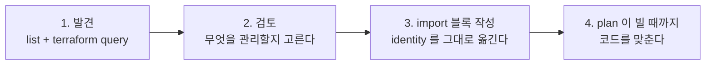

# 37장 — List Resource와 `terraform query`: 계정 안을 들여다보고 코드로 끌어오기

**이 장에서 배우는 것**

- List Resource가 무엇이고 왜 Resource Identity 없이는 존재할 수 없는지 설명할 수 있다.
- `list` 블록과 `config` 블록, `include_resource`, `region`의 역할을 구분해 쿼리를 작성할 수 있다.
- 쿼리 결과를 `import` 블록으로 옮겨 "발견 → 검토 → import → plan이 빈다"까지 완주할 수 있다.
- `aws_vpc` / `aws_instance` / `aws_iam_policy` / `aws_launch_template`의 실제 필터 인수를 골라 쓸 수 있다.
- 어떤 리소스 타입에 list가 없는지, 그리고 list의 한계와 대안이 무엇인지 판단할 수 있다.

**왜 중요한가**

인수인계는 대개 이렇게 시작한다. 계정 하나와 "여기 다 들어 있어요"라는 말. 콘솔을 열면 VPC 넷, EC2 예순, IAM 정책 백사십 개가 있고 Terraform 코드는 없다. [20장](../level2-intermediate/20-import-and-resource-identity.md)의 `import` 블록을 쓰려면 **가져올 것의 ID를 알아야 하는데**, 그 목록을 만드는 작업 자체가 며칠짜리다. `aws ec2 describe-instances`를 돌리고, `jq`로 다듬고, ASG가 만든 인스턴스를 걸러 내고, 기본 VPC를 제외하고… 그 스크립트는 매번 새로 쓰이고 매번 조금씩 틀린다.

더 나쁜 것은 **모른다는 사실 자체를 모르는 경우**다. 어느 리전에 누가 만든 NAT 게이트웨이가 두 달째 돌고 있고, 태그가 없어서 비용 리포트에서는 "미분류"로 뭉뚱그려지고, 코드에도 없으니 `terraform plan`은 영원히 그것을 언급하지 않는다. 36장의 drift 탐지는 **state에 있는 것**만 본다. state에 없는 것은 drift조차 아니다.

Terraform의 세계관은 오랫동안 "내가 만든 것만 안다"였다. **List Resource**는 그 벽을 허문다. provider가 계정 안의 리소스를 열거해 주고, 그 결과가 곧바로 `import`로 이어진다. v6 AWS provider에는 **183개**의 list resource가 있고, Terraform 1.14가 `list` 블록과 resource query를 도입하면서 쓸 수 있게 됐다.

## Terraform이 "발견"을 못 하던 이유

`data` 블록이 있는데 왜 새 구성요소가 필요했을까. 데이터 소스도 조회는 한다 — `aws_subnets`는 서브넷 ID 목록을 돌려준다. 하지만 데이터 소스가 돌려주는 것은 **문자열과 숫자**이고, `import` 블록이 필요로 하는 것은 **그 리소스를 유일하게 가리키는 구조화된 식별자**다. ID 목록을 받아도 사람이 옮겨 적어야 한다.

두 번째 이유는 **타입 정보**다. 열거된 것이 어느 Terraform 리소스 타입으로 관리되어야 하는지를 provider가 선언하지 않으므로, 열거와 관리를 잇는 다리가 없었다.

List Resource는 두 구멍을 동시에 메운다. **리소스 타입마다 하나씩** 정의되고 결과로 **Resource Identity**를 돌려주므로, `aws_vpc`의 list resource가 돌려준 항목은 정의상 `aws_vpc`로 관리될 수 있는 대상이고 그 identity를 `import` 블록에 그대로 넣을 수 있다.

## Resource Identity가 먼저다

원문 `add-a-new-list-resource.md`는 이 의존을 **하드 블로커**라고 못박는다 — **List Resource는 대상 리소스에 Resource Identity가 구현되어 있어야 하며, identity 없이는 list resource를 만들 수 없다.** 기여자 관점의 규칙이지만 사용자에게도 그대로 의미가 있다. 어떤 리소스 타입에 list가 없다면 첫 번째로 의심할 것은 identity의 부재다.

[20장](../level2-intermediate/20-import-and-resource-identity.md)에서 본 대로 Resource Identity는 Terraform 1.12가 도입한 **리소스를 유일하게 식별하는 구조화된 데이터**다. AWS provider는 이것을 ARN Identity(AWS API가 ARN을 식별자로 받는 경우에만), Singleton Identity(리전 또는 계정당 하나뿐인 타입), Parameterized Identity(속성 하나 이상의 조합) 셋으로 나눈다.

마지막 갈래가 list와 직접 연결된다. Parameterized Identity에는 **`account_id`와 `region`이 항상 포함**되므로 다른 리전을 쿼리해 얻은 결과를 import해도 **어느 리전의 것인지가 결과 자체에 실려 온다.** `aws_vpc`의 Identity Schema는 Required가 `id`(VPC ID), Optional이 `account_id`와 `region`이다.

## `list` 블록과 `terraform query`

문법은 짧다.

```terraform
list "aws_vpc" "example" {
  provider = aws
}
```

`list "<리소스 타입>" "<이름>"` 형태이고 **`provider`를 명시한다** — 문서의 예제가 전부 `provider = aws`를 적는다. 여러 계정을 다룬다면 여기에 alias를 넣어 대상을 고른다.

필터와 리전 같은 인수는 **`config` 블록** 안에 쓴다. 이 파일은 `.tf`가 아니라 **`.tfquery.hcl`** 확장자를 쓴다. 원문 `add-a-new-list-resource.md`가 `skaff`가 만들어 내는 파일을 나열하며 각 테스트 디렉터리에 `main.tf`(리소스 설정)와 **`query.tfquery.hcl`(list resource를 쓰는 쿼리)** 가 들어간다고 적는다. 확장자가 다른 이유는 명확하다 — 쿼리는 인프라를 정의하지 않는다. `terraform plan`이 이 파일을 읽고 뭔가를 만들려 들면 곤란하다.

```console
$ terraform query
```

### `config` 안인가 밖인가

`list` 블록에서 헷갈리기 쉬운 지점이 하나 있다. **`include_resource`는 `list` 블록의 속성이고, `region`과 필터 인수는 `config` 블록 안에 있다.** 원문의 acceptance test 규칙이 이 구분을 그대로 보여 준다 — **쿼리 설정 파일에서 `include_resource` 속성을 `true`로 설정한다**고 쓰고, 리전 재정의 테스트에 대해서는 **`config` 블록의 `region` 속성을 `var.region`으로 설정한다**고 쓴다.

```terraform
list "aws_instance" "stopped" {
  provider         = aws
  include_resource = true # 식별자뿐 아니라 리소스 설정값까지 채워 온다

  config {
    region = "ap-northeast-2"
    filter {
      name   = "instance-state-name"
      values = ["stopped"]
    }
  }
}
```

**`include_resource`가 하는 일**은 원문 구현 문서에 적혀 있다. 기본적으로 List Resource는 각 원격 리소스에 대해 **Resource Identity와 Display Name만** 돌려주고, **`IncludeResource` 파라미터가 `true`면 리소스 데이터까지 채운다.** `false`(기본)면 "무엇이 있는가"만, `true`면 "어떻게 설정되어 있는가"까지다.

대가는 API 호출량이다. 많은 리소스 타입이 **Summary List** 패턴 — AWS API가 정보의 일부만 돌려주고 전체를 얻으려면 추가 호출이 필요한 패턴 — 을 따르며, 원문이 드는 가장 흔한 예가 **태그가 list 호출에 포함되지 않아 별도 API로 가져와야 하는 경우**다. 리소스 500개에 `include_resource = true`를 걸면 호출이 500번 더 나갈 수 있다.

함께 돌아오는 **Display Name**은 원문이 **가능한 한 사람이 알아보기 쉽게 리소스를 유일하게 식별하는 값**으로 정하라고 한 값이다. `Name` 필드나 RDS의 `DBIdentifier` 같은 이름 상당 필드를 쓰고, **EC2와 ELB처럼 콘솔이 `Name` 태그를 이름으로 취급하는 서비스에서는 `Name` 태그 값**을 쓴다. 쿼리 결과를 훑을 때 보게 되는 것이 이 값이다.

## 발견에서 관리까지: 네 단계



**1단계 발견.** 넓게 시작한다. `include_resource = false`(기본)로 identity와 display name만 받으면 호출이 가볍다.

**2단계 검토.** 사람의 판단이 들어가는 유일한 자리다. 계정 안의 모든 것을 가져올 이유는 없다 — 다른 팀 소유인 것, 곧 폐기될 것, 콘솔 실습 잔여물은 남겨 둔다.

**3단계 import 블록.** list가 돌려준 identity를 `import` 블록의 `identity` 인수에 그대로 넣는다. 리소스 문서의 Import 절이 이 형태를 명시한다.

```terraform
import {
  to = aws_vpc.legacy_prod
  identity = {
    id = "vpc-a01106c2"
  }
}

resource "aws_vpc" "legacy_prod" {
  ### Configuration omitted for brevity ###
}
```

`identity` 방식은 **Terraform v1.12.0 이상**에서 쓸 수 있고 그 이전 형태인 `id = "vpc-a01106c2"`도 여전히 유효하다. identity 방식은 문자열 파싱에 의존하지 않으므로 복합 ID에서 구분자를 잘못 쓰는 사고가 없다.

**4단계 plan이 빌 때까지.** import는 state에 넣을 뿐 코드를 써 주지 않는다. `include_resource = true`로 받아 둔 설정값이 참고 자료가 되고 `-generate-config-out`으로 뼈대를 받을 수도 있다(20장). **plan이 `No changes.`가 되기 전에는 apply하지 않는다.**

## 리소스별 필터 인수: 실제로 무엇을 쓸 수 있나

list resource의 인수는 리소스마다 다르고, 대응하는 AWS API가 무엇을 받느냐를 그대로 따른다. 대표적인 여섯 개를 정리한다.

### `aws_vpc`

`filter`, `region`, `vpc_ids` 세 인수를 받는다. `filter`는 `name`과 `values`를 갖는 블록이고 **여러 개를 주면 전부 참이어야 한다.** 필터 이름은 AWS CLI `describe-vpcs` 레퍼런스를 따르되 **`is-default`는 지원하지 않는다** — **기본 VPC가 결과에 포함되지 않기** 때문이다.

### `aws_instance`

**베타**다. 문서에 **인터페이스와 동작이 바뀔 수 있고 파괴적 변경이 가능하며, Terraform 1.14가 정식 출시될 때까지 호환성 보장 없는 기술 프리뷰로 제공된다**는 주의가 붙어 있다(`aws_iam_policy`도 같다). 인수는 `filter`, `include_auto_scaled`, `region`이고 기본 동작이 중요하다 — **ASG가 관리하는 인스턴스와 `terminated`/`shutting-down` 상태의 인스턴스는 기본 제외**이며 `include_auto_scaled`의 기본값은 `false`다.

ASG 인스턴스가 기본 제외인 것은 설계상 옳다. 그것들은 `aws_launch_template`과 `aws_autoscaling_group`이 만들고 지우는 대상이지 개별 `aws_instance`로 관리할 것이 아니다. 그걸 import하면 ASG가 인스턴스를 교체하는 순간 state가 깨진다.

### `aws_iam_policy`

`path_prefix` 하나만 받는다. **경로가 이 값과 같거나 이 값으로 시작하는 정책만** 돌려주며, 지정하지 않거나 `"/"`이면 전부다. 값은 슬래시로 시작하고 끝나야 한다.

그리고 **AWS Managed Policy는 제외된다.** `AmazonS3ReadOnlyAccess` 같은 정책은 AWS가 소유하며 Terraform으로 관리할 수 없다 — 원문 용어로 **non-manageable resource**이고, **관리 아래로 가져올 수 없으므로 결과에서 제외한다**는 규칙의 적용 사례다.

### `aws_s3_bucket`

인수가 **`region` 하나뿐**이다. S3의 `ListBuckets`가 필터를 받지 않기 때문이며, list resource의 인수 목록이 provider의 취향이 아니라 **AWS API가 무엇을 받느냐**를 반영한다는 것을 가장 잘 보여 준다.

### `aws_launch_template`

`filter`, `launch_template_ids`, `launch_template_names`, `region`을 받는다. ID나 이름 목록을 직접 주는 방식은 원문이 말하는 **All-Or-Some** 패턴 — 식별자 집합을 주면 그 집합을, 주지 않으면 전부 돌려주는 AWS 요청 패턴 — 에 대응한다.

### `aws_ec2_secondary_subnet`

`filter`와 `region`을 받고, 필터 이름은 `describe-secondary-subnets` 레퍼런스를 따르되 **`default-for-az`는 지원하지 않는다.** `aws_vpc`의 `is-default`와 같은 이유다.

## `region`: 리전 하나에 쿼리 하나

v6의 리소스별 `region` 인수([24장](../level2-intermediate/24-enhanced-region-support.md))는 list에도 그대로 이어진다. 다만 **`list` 블록이 아니라 `config` 블록 안**이라는 점을 다시 짚어 둔다. 의미는 리소스 쪽과 같다 — **쿼리할 리전이며, 지정하지 않으면 provider 설정의 리전을 쓴다.**

이 인수가 필요한 이유는 list가 **한 번에 한 리전만** 본다는 데 있다. 여러 리전을 훑으려면 쿼리를 여러 개 쓴다.

```terraform
list "aws_vpc" "seoul" {
  provider = aws
  config { region = "ap-northeast-2" }
}

list "aws_vpc" "virginia" {
  provider = aws
  config { region = "us-east-1" }
}
```

두 번째 이유는 **결과에 리전이 실려 온다**는 점이다. Parameterized Identity가 `account_id`와 `region`을 항상 포함하므로 서울에서 발견한 VPC를 import할 때 리전이 자동으로 따라온다. CLI import라면 v6 규칙대로 ID 뒤에 `@<region>`을 붙여야 하지만(`terraform import aws_vpc.x vpc-a01106c2@eu-west-1`), identity 기반 import 블록에는 그 손질이 없다.

글로벌 리소스에는 `region`이 없다. `aws_iam_policy`의 인수가 `path_prefix` 하나뿐인 것이 그 예다.

## list가 없는 리소스 타입, 그리고 그 이유

원문 `resource-types-without-list.md`의 출발점은 **일반적으로 리소스 타입에는 대응하는 List Resource가 있어야 한다**는 원칙이다. **싱글턴도 포함**되는데, 그래야 그 원격 리소스를 식별하고 import할 수 있기 때문이다. 그런데도 없는 경우가 셋 있다.

**1. Composite Grant Resource.** 하나의 권한 부여 요청을 모델링하지만 AWS API는 결과를 정규화된 형태로 저장하고 돌려주는 리소스다. 원문이 세 가지 문제를 든다 — AWS가 **부여 건마다 안정적인 식별자를 매기지 않고**, 선택자를 **정규화**해(`Table` 부여를 `TableWithColumns`로, 혹은 그 반대로) 입력 없이는 재구성이 모호하며, **암묵적(관리자 유래)과 명시적(사용자 생성) 부여가 구분되지 않게 섞여** 나온다. 예시는 **`aws_lakeformation_permissions`** 하나이며, 이런 타입은 import도 안 되고 Resource Identity 스키마도 없다.

**2. Exclusive Resource.** `*_exclusive` 계열([35장](35-relationship-resources.md))은 표준 리소스보다 강한 제약을 강제하므로 **import를 지원하지 않고**, 따라서 **list도 지원하지 않는다.** 원문이 대안을 함께 적는다 — **표준(비배타적) 리소스 타입의 List로 열거하고 import하면 된다.** 예시는 **`aws_iam_policy_attachment`**.

**3. Waiter Resource.** 다단계 프로세스의 대기 단계만 담당하는 리소스다. `aws_acm_certificate_validation`은 인증서 생성 → 검증 레코드 생성 → DNS 전파 대기 세 단계 중 마지막을 맡을 뿐이라 **대응하는 원격 리소스가 없고, 따라서 List하거나 Import할 것이 없다.**

여기에 두 가지가 더 붙는다.

**Weak Entity는 부모 없이 열거할 수 없다.** 원문은 리소스 타입을 세 갈래로 나눈다. **Strong Entity**는 자기 식별 정보만으로 읽고 열거된다 — EC2 인스턴스는 `InstanceID`만으로 읽히므로 서브넷 안에 있어야 함에도 strong entity다. **Weak Entity**는 연관 리소스의 식별자가 있어야 한다 — ELB Listener(`aws_lb_listener`)는 상위 로드 밸런서의 ARN을 함께 줘야 list에 나온다. **Property Entity**는 연관 리소스의 속성을 1:1 또는 1:[0,1]로 모델링한 특수한 weak entity로, S3 버킷의 ACL(`aws_s3_bucket_acl`)이나 정책(`aws_s3_bucket_policy`)이 그렇다.

결론은 이것이다. **weak entity지만 property entity는 아닌 타입의 list resource는 부모 식별자를 필수 속성으로 요구한다.** 원문이 드는 예가 `aws_s3_object`이고 `bucket` 속성이 필요하다 — 계정 안의 모든 오브젝트를 한 번에 훑을 수는 없다.

**"특수 케이스" 리소스 타입은 결과에서 빠진다.** EC2 서비스는 `aws_vpc`, `aws_security_group`, `aws_network_acl`, `aws_route_table`, `aws_subnet`, `aws_vpc_dhcp_options`의 **기본(default) 변종**을 별도 타입으로 정의하며, 이들은 Adopt-on-Create 패턴이라 delete가 no-op이거나 삭제 실패를 무시한다. 원문은 **반환된 리소스의 타입을 재정의할 방법이 없으므로 특수 케이스 타입은 결과에서 제외하고, 그 사실을 문서에 적고, 전용 List Resource를 따로 만들어야 한다**고 정한다. `aws_vpc` 문서의 "기본 VPC는 포함되지 않는다"가 그 규칙의 표면이다.

## 실전 시나리오 셋

### 인수인계받은 계정 코드화하기

순서가 중요하다. **의존성이 적은 것부터, 상태가 없는 것부터** — 네트워크(VPC → 서브넷 → 라우팅) → 보안(IAM, 시큐리티 그룹) → 컴퓨트 → 데이터 순이다. RDS나 S3에서 import 실수를 하면 되돌리는 비용이 다르기 때문이다. 각 계층마다 쿼리를 쓰고, 검토하고, import 블록을 만들고, plan이 빌 때까지 코드를 맞춘 다음 **커밋한다.** 계층 하나가 끝나기 전에 넘어가면 어디까지 검증됐는지 알 수 없게 된다.

### 태그 없는 리소스 찾아내기

`filter`는 `tag:` 접두어를 지원하므로 "특정 태그가 있는 것"은 바로 뽑히지만, "태그가 **없는** 것"을 뽑는 필터는 AWS 필터 문법의 문제라 리소스마다 다르다. 실용적인 방법은 **전체를 열거한 뒤 `include_resource = true`로 받은 `tags`를 코드 밖에서 대조**하는 것이다. 호출량이 급증하므로 리전과 타입을 좁혀 나눠 돌린다.

### 규정 준수 감사

`aws_iam_policy`의 `path_prefix`가 이 용도에 잘 맞는다. 조직이 "앱 팀 정책은 `/app/`, 플랫폼 정책은 `/platform/` 아래"라는 규칙을 두었다면 두 경로를 각각 쿼리하고 전체(`/`)와 비교해 **어느 쪽에도 속하지 않는 정책**을 찾아낸다. 규칙을 벗어난 정책은 대개 콘솔에서 급하게 만들어진 것이고 과도한 권한을 가질 확률이 높다.

36장의 `check` 블록과의 차이를 분명히 해 두자. check는 **state에 있는 것**에 단언하고, list는 **state에 없는 것**을 찾는다. 겹치지 않으므로 성숙한 파이프라인은 양쪽을 다 돌린다.

## 한계, 그리고 언제 다른 도구를 쓰나

**API 호출량과 스로틀링.** list는 결국 `Describe*`/`List*` 호출이라, 리전 여러 개 × 타입 여러 개를 한 번에 돌리면 배포 파이프라인과 같은 API 한도를 나눠 쓴다. 실무 규칙은 **처음에는 `include_resource`를 켜지 말고 대상을 좁힌 뒤에만 켠다.**

**제외 규칙을 모르면 결과를 오해한다.** 기본 VPC도, ASG 인스턴스도, AWS Managed Policy도 안 나온다. 감사 용도에서 특히 위험하다. 그리고 계정 안의 "모든 것"을 한 번에 뽑는 쿼리는 없다 — 타입 183개 중 필요한 것을 골라 쿼리를 하나씩 쓴다.

대안들과의 자리는 이렇게 갈린다.

- **AWS Config** — 리소스 인벤토리와 설정 이력, 규칙 기반 준수 평가가 목적이다. "언제 무엇이 바뀌었는가"에 강하지만 상시 켜 두는 서비스라 비용이 따르고, Terraform 코드로 옮기는 흐름과는 연결되지 않는다.
- **AWS Resource Explorer** — 계정·리전을 가로질러 검색한다. 인덱싱 기반이라 빠르지만 돌려주는 것은 ARN과 메타데이터이지 Terraform identity가 아니다. **어디에 무엇이 있는지 먼저 파악한 뒤 list resource로 좁혀 들어가는** 조합이 잘 맞는다.
- **`aws` CLI + 스크립트** — list resource가 없는 타입에는 여전히 이 방법뿐이고, 결과를 손으로 `import` 블록으로 옮겨야 한다.
- **Terraformer 같은 외부 도구** — 리소스를 뽑아 `.tf`와 state를 통째로 생성해 준다. 빠르지만 코드 품질이 고르지 않고 provider 버전을 따라가는 속도가 느리다. list resource는 **provider 저장소 안에서 리소스와 함께 유지보수된다**는 점이 다르다 — 원문이 요구하는 acceptance test 세트(`basic`, `includeResource`, `list` 블록의 `region`이 provider 기본 리전을 덮어쓰는 `regionOverride`)가 그 유지보수의 형태다.

## 흔한 실수

### ❌ 쿼리를 `.tf` 파일에 쓴다

`list` 블록은 쿼리 파일에 속한다. 확장자가 다른 것은 실수가 아니라 설계다.

```console
# ❌ main.tf 안에 list 블록을 넣고 plan 을 돌린다
$ terraform plan
```

```console
# ✅ 쿼리는 .tfquery.hcl 에 쓰고 terraform query 로 실행한다
$ cat discover.tfquery.hcl
list "aws_vpc" "all" { provider = aws }
$ terraform query
```

### ❌ `include_resource = true`를 처음부터 켠다

기본값이 `false`인 데는 이유가 있다. Summary List 패턴에서는 리소스마다 추가 호출이 나가고, 태그를 별도 API로 읽는 서비스에서는 그 호출이 리소스 수만큼 늘어난다.

```terraform
# ❌ 계정 전체를 설정까지 통째로 끌어온다. 스로틀링과 대기 시간의 원인
list "aws_instance" "everything" {
  provider         = aws
  include_resource = true
}
```

```terraform
# ✅ 먼저 좁힌다. identity 와 display name 만으로 무엇을 가져올지 정한 뒤에 켠다
list "aws_instance" "candidates" {
  provider = aws
  config {
    filter {
      name   = "tag:Team"
      values = ["payments"]
    }
  }
}
```

### ❌ list 결과가 비었다고 계정에 없다고 결론 낸다

기본 VPC, ASG가 관리하는 인스턴스, AWS Managed Policy는 **설계상 결과에서 빠진다.**

```console
# ❌ "list 에 인스턴스가 안 나오니 이 리전은 비어 있다"
$ terraform query   # aws_instance 결과 0건
```

```terraform
# ✅ 제외 규칙을 알고 필요하면 끈다. ASG 인스턴스까지 보려면 명시적으로 켠다
list "aws_instance" "including_asg" {
  provider = aws
  config {
    include_auto_scaled = true
  }
}
```

### ❌ 발견한 것을 전부 import한다

list는 "관리할 수 있는 것"을 알려 줄 뿐 "관리해야 하는 것"을 알려 주지 않는다. 다른 팀 소유 리소스를 import하면 그 팀의 변경이 매번 drift로 잡히고, 우리 apply가 그것을 되돌린다.

```terraform
# ❌ 쿼리 결과를 그대로 import 블록으로 변환해 넣는다 (수백 개)
```

```terraform
# ✅ 소유권 경계로 먼저 거른다. 태그가 그 경계를 표현하도록 만든다
import {
  to = aws_vpc.legacy_prod
  identity = {
    id = "vpc-a01106c2"
  }
}
# 남은 것은 목록으로 남겨 두고, 소유 팀과 합의된 것만 단계적으로 옮긴다
```

## 프로덕션 노트

- **쿼리는 read-only 자격증명으로 돌린다.** list resource는 조회만 하므로 `Describe*`/`List*`/`Get*` 권한이면 충분하다. 인수인계 초기에는 계정 권한 관계가 불투명하므로 읽기 전용 역할로 시작한다.

- **대규모 발견은 리전·타입으로 쪼개 순차 실행한다.** 리전 열 개 × 타입 스무 개를 병렬로 돌리면 계정 단위 API 한도에 부딪히고 같은 시간에 도는 배포와 36장의 drift 잡까지 느려진다. provider의 `max_retries`(v6 기본값 **25**)가 흡수해 주지만 그만큼 시간이 늘어난다([40장](40-performance-and-throttling.md)).

- **베타 표시를 확인하고, 쿼리 파일은 저장소에 커밋한다.** `aws_instance`와 `aws_iam_policy`의 list resource에는 **인터페이스와 동작이 바뀔 수 있고 파괴적 변경이 가능하다**는 주의가 붙어 있으므로 CI에 상시 배치하기 전에 릴리스 노트를 확인한다. 한편 `.tfquery.hcl`은 "이 계정에서 무엇을 찾았는가"의 재현 가능한 기록이라 6개월 뒤 같은 쿼리를 돌려 무엇이 늘었는지 비교할 수 있다.

- **import는 배치로 하되 커밋은 잘게 쪼갠다.** `import` 블록 200개를 한 PR에 넣으면 리뷰가 불가능하고 plan 출력이 수천 줄이 되어 위험 신호가 묻힌다. 계층 단위로 나누고 각 단계마다 plan이 비는 것을 확인한 뒤 커밋한다.

- **list가 없는 타입은 목록으로 관리한다.** 설계상 제외된 타입은 앞으로도 생기지 않을 가능성이 높다. 발견 자동화의 사각지대를 문서로 남기지 않으면 "다 훑었다"는 잘못된 확신이 생긴다.

## 연습문제

1. **한 리전을 통째로 훑어 본다.** 리소스가 있는 리전 하나를 골라 `aws_vpc`, `aws_instance`, `aws_s3_bucket`에 대한 `list` 블록을 `discover.tfquery.hcl`에 작성하고 `terraform query`를 실행한다. 콘솔에서 센 개수와 비교한다.
   *성공 기준:* VPC 개수 차이가 정확히 기본 VPC 개수만큼이고, 인스턴스 개수 차이가 ASG 관리 인스턴스와 종료 상태 인스턴스의 합과 일치한다. 그 차이를 문서의 제외 규칙으로 설명할 수 있다.

2. **`include_resource`의 대가를 측정한다.** 같은 쿼리를 `include_resource` 없이 한 번, `true`로 한 번 실행하고 소요 시간을 비교한다. `TF_LOG=DEBUG`로 AWS API 호출 수를 세어 본다([41장](41-debugging.md)).
   *성공 기준:* `true`일 때 호출 수가 리소스 개수에 비례해 늘어나는 것을 확인하고, 어느 서비스에서 태그 조회가 별도 호출로 나가는지 로그에서 지목한다.

3. **발견에서 관리까지 완주한다.** 콘솔에서 VPC와 시큐리티 그룹을 하나씩 만들어 두고(코드 없이), list로 찾아내 `import` 블록을 `identity` 형태로 작성한 뒤 plan이 빌 때까지 리소스 블록을 채운다.
   *성공 기준:* `terraform plan`이 `No changes.`를 출력한다. 그 뒤 `terraform state list`에 두 리소스가 보이고, 콘솔에서 태그를 하나 추가하면 다음 plan에 drift로 잡힌다.

4. **list가 없는 타입을 확인한다.** `aws_acm_certificate_validation`과 `aws_iam_policy_attachment`에 대한 `list` 블록을 작성해 실행해 본다.
   *성공 기준:* 해당 list resource가 없다는 응답을 받는다. 각각이 왜 제외됐는지(waiter / exclusive) 두 문장씩 적고 대신 무엇을 열거해야 하는지 답한다.

## 요약

- List Resource는 provider가 계정 안의 원격 리소스를 열거해 주는 구성요소이며, v6 AWS provider에 **183개** 있다. Terraform 1.14가 `list` 블록과 resource query를 도입했다.
- **Resource Identity가 하드 블로커**다. identity가 없는 리소스 타입에는 list resource를 만들 수 없다. identity에는 `account_id`와 `region`이 항상 포함되므로 결과에 리전이 실려 온다.
- 쿼리는 `.tfquery.hcl` 파일에 쓰고 `terraform query`로 실행한다. `provider`와 `include_resource`는 `list` 블록의 속성이고, `region`과 필터 인수는 **`config` 블록 안**이다.
- 기본적으로 list는 **Resource Identity와 Display Name만** 돌려주고, `include_resource = true`면 리소스 데이터까지 채우되 Summary List 패턴 때문에 호출량이 크게 는다.
- 흐름은 발견 → 검토 → `import` 블록(`identity` 형태, Terraform v1.12.0+) → plan이 빌 때까지 코드 맞추기다. 검토를 생략하면 남의 리소스를 가져와 drift를 자초한다. 인수는 API를 따른다 — `aws_vpc`는 `filter`/`vpc_ids`/`region`, `aws_instance`는 `filter`/`include_auto_scaled`/`region`, `aws_iam_policy`는 `path_prefix`, `aws_s3_bucket`은 `region` 하나, `aws_launch_template`은 `launch_template_ids`/`launch_template_names`/`filter`/`region`.
- 결과에서 빠지는 것들이 있다 — 기본 VPC, ASG 관리 인스턴스와 종료 상태 인스턴스, AWS Managed Policy. "list에 없으니 계정에 없다"는 추론은 틀린다. list가 아예 없는 세 부류는 composite grant resource(`aws_lakeformation_permissions`), exclusive resource(`aws_iam_policy_attachment` — 표준 리소스의 list로 대신한다), waiter resource(`aws_acm_certificate_validation` — 대응하는 원격 리소스가 없다)다.
- weak entity지만 property entity가 아닌 타입은 부모 식별자를 필수로 요구한다(`aws_s3_object`의 `bucket`). 계정 전체를 한 번에 훑는 쿼리는 없다.

## 다음으로

- [38장 — 대규모 코드 구조와 CI/CD 파이프라인](38-large-scale-structure-cicd.md) — 발견해서 가져온 수백 개를 어떤 state 경계로 나눌 것인가.
- [20장 — Import와 Resource Identity](../level2-intermediate/20-import-and-resource-identity.md) — `import` 블록, identity 스키마, `-generate-config-out`의 전체 문법.
- [35장 — 관계 리소스와 `*_exclusive`](35-relationship-resources.md) — exclusive 리소스가 import도 list도 지원하지 않는 이유.
- 공식 문서: [List Resource: aws_vpc](https://registry.terraform.io/providers/hashicorp/aws/latest/docs/list-resources/vpc)
