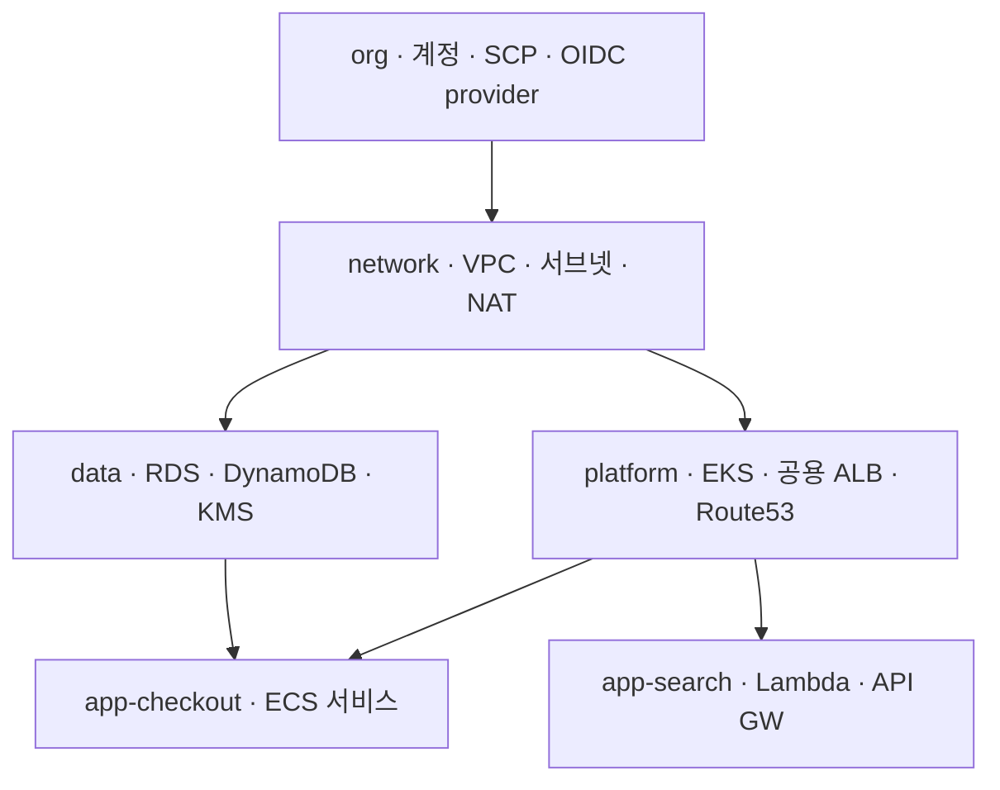
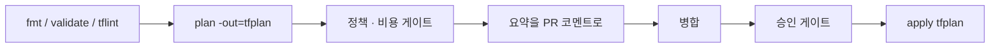

# 38장 — 대규모 코드 구조와 CI/CD 파이프라인: 스택을 나누고 기계에게 배포를 맡긴다

**이 장에서 배우는 것**

- 단일 state가 한계에 도달했다는 신호를 증상으로 판별하고 분할 시점을 근거를 갖고 결정할 수 있다.
- 수명 주기·폭발 반경·소유 팀·변경 빈도 네 축으로 스택 경계를 긋고, 축이 충돌할 때 무엇을 우선할지 판단할 수 있다.
- `terraform_remote_state`·태그 조회·SSM Parameter Store 세 계약의 결합도와 실패 양상을 비교해 고를 수 있다.
- `plan -out` → 리뷰 → `apply tfplan`을 축으로 PR/병합 파이프라인을 설계하고 `-detailed-exitcode`로 분기시킬 수 있다.
- OIDC 인증, 동시 실행 제어, 정책·비용 게이트, 부분 적용 복구, state 복원 리허설까지 운영 절차를 갖출 수 있다.

**왜 중요한가**

인프라 코드는 조용히 자란다. 처음에는 `main.tf` 하나였고 apply가 40초 걸렸다. 1년 뒤 리소스는 1,400개가 되고 `terraform plan`은 11분이 걸린다. 팀은 여섯 개고, 네트워크 담당자가 서브넷 태그 하나를 고치려고 plan을 돌리는 동안 앱 팀 배포는 락에 걸려 대기한다. 배포가 하루 스무 번인 팀과 분기에 한 번인 팀이 **같은 잠금 하나**를 공유하면, 빠른 팀의 속도는 느린 팀의 plan 시간에 종속된다.

더 큰 문제는 위험의 균질화다. Lambda 환경변수 한 줄을 바꾸는 plan과 VPC 라우팅을 바꾸는 plan이 같은 state, 같은 승인 절차, 같은 리뷰어를 지난다. 리뷰어는 매일 200줄짜리 plan 출력을 스크롤하다 결국 읽지 않게 되고, 어느 날 `route_table` 교체가 그 안에 섞여 들어간다. 실제로 터지는 사고는 대개 "누가 봐도 위험한 변경"이 아니라 **위험한 변경이 안전한 변경 속에 숨어 있던 경우**다.

파이프라인 쪽 사고는 더 단순하다. 로컬에서 plan을 돌려 스크린샷을 붙이고, 승인을 받고, 20분 뒤 apply를 친다. 그 사이 다른 사람이 apply했다면 방금 승인받은 계획은 존재하지 않는 계획이다. plan과 apply 사이에는 **항상 시간이 있고** 그동안 세상은 변한다. `-out`으로 계획을 파일에 못 박지 않은 승인은 승인의 형식만 갖춘 것이다. 이 장은 [16장](../level2-intermediate/16-remote-state-and-backends.md)의 원격 state와 [19장](../level2-intermediate/19-modules.md)의 모듈 위에서, 그 조각들을 **어떤 단위로 나누고 어떤 순서로 배포할 것인가**를 다룬다.

## 단일 state가 커지면 무엇이 먼저 무너지는가

증상은 순서를 가지고 나타나며, 그 순서가 곧 "아직 버틸 만한가"의 답이다.

**1. plan 시간.** plan은 state의 모든 리소스를 refresh한다. 리소스 N개면 read 호출이 최소 N번 나가고 `-parallelism`(기본 10)만큼만 동시에 처리된다. plan이 10분을 넘기면 사람들은 plan을 건너뛰거나 `-refresh=false`를 붙이기 시작하고, 그 순간 [36장](36-drift-refresh-and-checks.md)의 drift 가시성이 사라진다. **plan을 회피하게 만드는 크기가 첫 임계점이다.**

**2. 스로틀링.** refresh가 몰리면 `RequestLimitExceeded`가 나온다. provider는 재시도하며 v6 기본 `max_retries`는 **25**다. 재시도는 실패를 감춰 주고 시간으로 대가를 치른다. plan 시간이 선형이 아니라 계단식으로 튀기 시작하면 이미 API 한도에 부딪히고 있다([40장](40-performance-and-throttling.md)).

**3. 잠금 경합.** state 하나에 잠금 하나다. 대기가 길어지면 사람들은 `-lock=false`를 배운다. **팀 안에서 `-lock=false`가 구전되기 시작하면 조직적 임계점 신호다.**

**4. 폭발 반경과 복구 단위.** 잘못된 `destroy` 한 번, `for_each` 키 변경 한 번이 state 안 전부를 건드릴 수 있다. 되돌릴 때도 단위는 state여서, 이전 버전으로 복원하면 그 사이 다른 팀이 만든 것까지 함께 되돌아간다.

**5. 팀 간 충돌.** 같은 디렉터리를 여섯 팀이 고치면 머지 충돌이 상시화되고 CODEOWNERS를 그을 자연스러운 경계가 없다.

1~2번은 도구 설정으로 완화할 수 있다. **3번 이후는 구조로만 해결된다.**

## 분할 축 네 가지

**축 1 — 수명 주기.** VPC·서브넷·라우팅·NAT 게이트웨이는 만들고 나면 몇 달을 그대로 산다. ECS 태스크 정의와 Lambda 코드는 하루에도 여러 번 바뀐다. 수명 주기가 다른 것을 한 state에 두면 안 변하는 쪽이 매번 refresh 비용을 내고, 자주 바뀌는 쪽의 plan 출력에 노이즈가 섞인다. 이 축이 강력한 이유는 **비대칭성**이다 — 네트워크를 앱에서 떼어 내면 앱 배포는 빨라지고 네트워크 변경은 신중해지며, 반대 방향의 손해는 거의 없다. 분할을 처음 한다면 이 선을 먼저 긋는다.

**축 2 — 폭발 반경.** "이것이 지워지면 무엇이 죽는가"로 묶는다. 데이터 계층(RDS, DynamoDB, 데이터 버킷, KMS 키)은 재생성이 불가능하거나 극도로 비싸고 stateless 컴퓨트는 다시 만들면 그만이다. 나누면 위험한 쪽에만 `prevent_destroy`([21장](../level2-intermediate/21-lifecycle-meta-arguments.md))와 강한 승인 게이트를 걸고 나머지는 자동 apply로 흘려보낼 수 있다. **게이트 강도를 다르게 주려면 state를 나눠야 한다** — 게이트는 잡 단위로 걸리고 잡은 state 단위로 돌기 때문이다.

**축 3 — 소유 팀.** 경계는 결국 사람 사이에 그어진다. [16장](../level2-intermediate/16-remote-state-and-backends.md)에서 본 대로 **state에 대한 읽기 권한은 그 스택의 모든 시크릿에 대한 읽기 권한**이다. 권한을 나누고 싶다면 state를 나눈다.

**축 4 — 변경 빈도.** 축 1이 "리소스의 성질"이라면 이것은 "이 조직에서 실제로 얼마나 자주 만지는가"다. IAM 정책은 성질상 안정적이지만 새 서비스를 매주 붙이는 조직에서는 매주 바뀐다. 직관보다 이력이 정확하다 — `git log --format= --name-only -- '*.tf' | sort | uniq -c | sort -rn`으로 자주 바뀌는 파일을 세면 그것들이 대개 같은 스택으로 묶여야 할 것들이다.

축이 충돌할 때의 우선순위는 **폭발 반경 > 소유 팀 > 수명 주기 > 변경 빈도**다. RDS는 폭발 반경으로는 데이터 스택, 소유 팀으로는 제품 팀, 변경 빈도로는 "거의 안 바뀜"이어서 셋이 다른 답을 준다. 잘못된 소유권은 리뷰어 지정으로 보완할 수 있지만 잘못된 폭발 반경은 사고가 나야 드러나기 때문에 이 순서를 쓴다.

경계를 그은 뒤 검증은 한 문장이다. **"이 스택만 지웠다가 다시 만들 수 있는가?"** 답이 "다른 스택도 같이 부숴야 한다"면 경계가 틀렸다.



## 나눈 뒤의 진짜 문제: 스택 사이 계약

app 스택은 network 스택이 만든 서브넷 ID가 필요하다. 값을 넘기는 방법은 셋이고 차이는 **결합도와 실패 양상**이다.

**`terraform_remote_state`** 는 가장 직접적이다. 대신 output만 참조해도 **state 파일 전체가 다운로드**되므로, 소비자 CI에 `s3:GetObject`를 준 순간 생산자 스택의 모든 민감 속성을 준 것이다. output 이름이 계약이 되고, 계약이 깨졌다는 사실은 소비자가 다음 plan을 돌릴 때에야 드러난다. 백엔드 좌표(버킷/키)도 하드코딩된다. **같은 팀이 함께 바꾸는 두 스택** 사이에서 가장 잘 맞는다.

**데이터 소스 + 태그 조회**는 결합도가 가장 낮다. 생산자가 Terraform으로 만들었는지 손으로 만들었는지 소비자는 모른다.

```terraform
data "aws_vpc" "main" {
  tags = {
    Environment = "prod"
    Tier        = "main"
  }
}

data "aws_subnets" "private" {
  filter {
    name   = "vpc-id"
    values = [data.aws_vpc.main.id]
  }
  tags = { Tier = "private" }
}
```

`tags` 인수는 **지정한 모든 쌍이 정확히 일치**해야 매칭되며, 단수 데이터 소스는 0건이면 에러, 다건이어도 에러다. `aws_subnets`가 돌려주는 것은 집합이라 순서를 신뢰할 수 없다. **가장 위험한 실패는 조용한 성공이다** — 다른 환경에 같은 태그가 붙어 있으면 조회는 성공하고 잘못된 것을 가리킨다. 태그에 반드시 환경 구분자를 넣는다([23장](../level2-intermediate/23-tagging-strategy.md)).

**SSM Parameter Store**는 생산자가 계약을 명시적으로 게시하는 방식이다.

```terraform
# network 스택 (생산자)
resource "aws_ssm_parameter" "private_subnet_ids" {
  name  = "/prod/network/private_subnet_ids"
  type  = "StringList"
  value = join(",", aws_subnet.private[*].id)
}

# app 스택 (소비자)
data "aws_ssm_parameter" "private_subnet_ids" {
  name = "/prod/network/private_subnet_ids"
}
```

`type`은 Required이고 `String`·`StringList`·`SecureString` 셋이다. 데이터 소스의 `name`은 `name:version` 형태로 **버전을 못 박아 조회**할 수 있어 계약을 고정하고 싶을 때 쓸모가 있다(`with_decryption`은 기본 `true`). 핵심 이점은 **권한을 값 단위로 좁힐 수 있다**는 것 — IAM 정책의 `Resource`를 `arn:aws:ssm:ap-northeast-2:123456789012:parameter/prod/network/*`로 자르면 소비자는 그 경로만 읽는다. 그리고 무엇이 공개 인터페이스인지가 코드에 보인다. output은 "밖에서 읽힐지도 모르는 것"이고 파라미터는 "밖에서 읽으라고 내놓은 것"이다. 대가는 왕복 한 번과 갱신 지연이다.

| | 결합도 | 권한 단위 | 실패 양상 |
|---|---|---|---|
| `terraform_remote_state` | 높음 | state 파일 전체 | 즉시·명확 (output 없음) |
| 데이터 소스 + 태그 | 낮음 | AWS API 권한 | 0건/다건 에러, **또는 조용한 오매칭** |
| SSM Parameter Store | 중간 | 파라미터 경로 | 즉시·명확 (파라미터 없음) |

원칙은 하나다. **팀 경계를 넘으면 SSM, 팀 안에서는 `terraform_remote_state`, 소유자가 Terraform 밖에 있으면 태그 조회.**

## 디렉터리 구조 세 가지 안

### 안 1 — 환경별 디렉터리 (권장 기본값)

```
infra/
  modules/            vpc/  ecs-service/
  envs/
    dev/    network/  data/  app-checkout/
    stage/  network/  data/  app-checkout/
    prod/   network/  data/  app-checkout/
```

디렉터리 하나 = 스택 하나 = state 하나 = 파이프라인 잡 하나. 이 1:1:1:1이 장점의 전부다. 경로만 보고 폭발 반경을 알 수 있어 `envs/prod/data/` PR에만 강한 게이트를 거는 규칙을 쓰기 쉽고, CODEOWNERS를 경로로 그을 수 있으며(`/envs/prod/network/ @platform-team`), 환경별로 다른 백엔드·계정·role이 자연스럽게 붙는다([25장](../level2-intermediate/25-multi-account.md)). 대가는 **중복**이고, 그 중복을 견딜 수 있게 만드는 것이 `modules/`다 — 환경 디렉터리에는 모듈 호출과 값만 남긴다. `main.tf`가 30줄을 넘기 시작하면 모듈로 밀어 넣을 때다.

### 안 2 — 워크스페이스 (환경 분리에는 권장하지 않는다)

`terraform workspace`는 **같은 백엔드 안에서 state 키만 다르게** 만든다. 매력적으로 보이지만 환경 분리에는 맞지 않는다.

- **같은 백엔드, 같은 자격증명.** dev와 prod state가 같은 버킷·같은 접근 권한 아래 놓인다. 계정을 나눈 의미가 반감된다.
- **현재 워크스페이스가 셸 상태다.** `select`를 빼먹으면 dev를 고치려던 apply가 prod로 간다. 디렉터리라면 `cd`가 틀릴 때 파일 목록이 달라 보이지만 워크스페이스는 아무 표시도 나지 않는다.
- **환경 차이를 `terraform.workspace` 조건문으로 표현하게 된다.** `count = terraform.workspace == "prod" ? 3 : 1`이 늘면 prod 경로는 prod에 apply할 때까지 검증되지 않는다.

워크스페이스가 맞는 자리는 **같은 코드·같은 계정·같은 권한으로 잠깐 만들었다 지우는 것** — PR마다 만드는 임시 검증 환경이나 개인 샌드박스다. **환경 분리에는 디렉터리를, 일시적 복제에는 워크스페이스를** 쓴다.

### 안 3 — Terragrunt류 래퍼

백엔드 설정과 공통 변수를 상위 계층에서 생성해 주고 의존 스택과 일괄 실행을 정의한다. 얻는 것이 명확한 만큼 잃는 것도 명확하다 — 신규 입사자의 학습 대상이 하나 늘고, 문제가 나면 "Terraform 문제인가 래퍼 문제인가"를 먼저 가려야 하며([41장](41-debugging.md)), 버전 축이 Terraform·provider·래퍼 셋이 된다. 판단 기준은 **스택 개수**다. 열댓 개 이하라면 안 1의 중복은 견딜 만하고, 수십 개고 백엔드 설정을 손으로 관리하는 것이 이미 사고의 원인이라면 도입할 만하다. 도입하더라도 **모듈은 순수 Terraform으로 유지**해 래퍼를 걷어낼 수 있는 상태를 지킨다.

## 환경 차이는 tfvars에만 둔다 — 원칙과 한계

목표는 이것이다. **`envs/dev/network/main.tf`와 `envs/prod/network/main.tf`가 바이트 단위로 같고, 차이는 `terraform.tfvars`에만 있다.**

```terraform
# envs/*/network/main.tf — 모든 환경 동일
module "vpc" {
  source = "../../../modules/vpc"

  name               = var.name
  cidr_block         = var.cidr_block
  az_count           = var.az_count
  single_nat_gateway = var.single_nat_gateway
}
```

```hcl
# envs/prod/network/terraform.tfvars
name               = "prod"
cidr_block         = "10.30.0.0/16"
az_count           = 3
single_nat_gateway = false
```

이 원칙이 사 주는 것은 **검증의 전이성**이다. dev에서 통과한 코드 경로는 prod에서도 같은 코드 경로다. 조건문으로 환경을 분기하면 prod 경로는 prod에서만 실행되고, 그것은 정의상 리허설 없는 배포다. 한계는 정직하게 인정한다.

- **환경에만 존재하는 리소스가 있다.** prod에만 붙는 WAF나 DR 복제는 `count = var.enable_waf ? 1 : 0` 토글로 표현할 수 있지만, **토글이 셋을 넘어가면 스택을 나누는 편이 낫다**(예: `envs/prod/edge/`).
- **provider·backend 설정 자체가 다르다.** 백엔드 블록에는 변수를 쓸 수 없으므로 `-backend-config`로 주입한다([16장](../level2-intermediate/16-remote-state-and-backends.md)).
- **v6의 `region` 인수가 새 축을 만든다.** 리소스마다 top-level `region`을 줄 수 있게 되면서([24장](../level2-intermediate/24-enhanced-region-support.md)) "리전이 다르면 스택도 다르다"는 전제가 약해졌다. 대신 **`region` 값을 바꾸면 리소스가 교체된다.** 환경 간 리전 차이는 반드시 tfvars에서 오게 하고, CI가 그 값의 변경을 별도로 표시하게 한다.
- **tfvars에 시크릿을 넣지 않는다.** 커밋되는 파일이다. 민감 값은 [26장](../level2-intermediate/26-secrets-and-ephemeral.md)의 ephemeral 리소스와 write-only 인수로 처리한다.

## 모노레포에서 변경된 스택만 고르기

스택이 40개인데 PR마다 40번 plan을 돌리면 CI 요금과 API 호출이 함께 폭발한다. 바뀐 스택 목록을 계산해 매트릭스 잡의 입력으로 넘긴다.

```bash
BASE="${1:-origin/main}"
changed=$(git diff --name-only "$BASE"...HEAD)

# 1) envs/ 아래에서 직접 바뀐 스택
direct=$(echo "$changed" | grep '^envs/' | cut -d/ -f1-3 | sort -u)

# 2) modules/ 가 바뀌면 그 모듈을 참조하는 스택 전부
indirect=$(for m in $(echo "$changed" | grep '^modules/' | cut -d/ -f1-2 | sort -u); do
  grep -rl "$m" envs --include='*.tf' | xargs -r -n1 dirname
done)

printf '%s\n%s\n' "$direct" "$indirect" | grep . | sort -u | jq -R . | jq -s -c .
```

핵심은 **2번**이다. 모듈 변경은 그 모듈을 쓰는 모든 스택에 파급되므로, 모듈만 보고 스택을 건너뛰면 "PR에서는 통과했는데 다음 배포에서 터지는" 전형적인 사고가 난다. 로컬 경로 참조(`source = "../../../modules/vpc"`)라야 이 계산이 가능하고, Git 태그로 버저닝한 모듈은 파급 계산이 불가능한 대신 **변경이 즉시 전파되지 않는 안전성**을 준다. 여러 팀이 공유하는 플랫폼 모듈은 버전 핀, 같은 저장소에서 함께 진화하는 것은 로컬 경로가 흔한 절충이다.

한 가지 더. **아무 것도 안 바뀐 스택도 정기적으로 plan을 돌려야 한다.** 코드가 안 바뀌어도 인프라는 바뀌고 그것이 drift다. PR 파이프라인은 변경된 스택만, 야간 스케줄 파이프라인은 전체를 대상으로 한다([36장](36-drift-refresh-and-checks.md)).

## 파이프라인 뼈대: PR 단계와 병합 단계

**PR 단계는 아무것도 바꾸지 않고 판단 재료를 만든다. 병합 단계만 세상을 바꾼다.** PR 단계의 순서에는 이유가 있다 — 싸고 빠른 검사를 먼저 놓아 비싼 검사가 돌기 전에 실패시킨다.

1. `terraform fmt -check -recursive` — 초 단위로 끝나고 리뷰에서 공백 논쟁을 없앤다.
2. `terraform init -backend=false` 후 `terraform validate` — 문법과 타입. AWS 자격증명이 필요 없다.
3. `tflint` — provider 인지 린트. 존재하지 않는 인스턴스 타입처럼 validate가 못 잡는 것을 잡는다.
4. `terraform init -backend-config=...` + `terraform plan -out=tfplan` — 여기서 처음 자격증명과 잠금이 필요하다.
5. `terraform show -json tfplan`으로 요약을 만들어 **PR 코멘트로 게시**한다.

```bash
terraform plan -out=tfplan -input=false -no-color -lock-timeout=5m
terraform show -json tfplan > plan.json

jq -r '[.resource_changes[]?.change.actions] as $a
  | "create=\($a|map(select(.==["create"]))|length) " +
    "update=\($a|map(select(.==["update"]))|length) " +
    "delete=\($a|map(select(.==["delete"]))|length) " +
    "replace=\($a|map(select(length==2))|length)"' plan.json

# 사람이 반드시 봐야 하는 것: 지워지거나 교체되는 주소
jq -r '.resource_changes[]?
  | select(.change.actions | (index("delete") or length == 2))
  | .address' plan.json
```

PR 코멘트는 **전문이 아니라 요약이 먼저**여야 한다. 전문을 그대로 붙이면 200줄짜리 코멘트가 되고 아무도 읽지 않는다. 위쪽에 네 숫자, 그 다음에 삭제·교체 주소 목록, 전문은 접힌 블록이나 아티팩트 링크로 내린다.

병합 단계는 짧다. **PR에서 만든 `tfplan` 아티팩트를 그대로 받아 `terraform apply tfplan`**을 실행하고, 필요하면 그 앞에 승인 게이트를 둔다. 게이트는 환경마다 다르게 건다 — dev는 게이트 없음, stage는 팀 내 승인 하나, prod는 삭제·교체가 0건이면 자동이고 하나라도 있으면 사람 승인. 이 분기는 위의 `jq` 출력만으로 만들 수 있다.



CI에서는 항상 `-input=false`를 붙인다. 값이 빠졌을 때 프롬프트를 띄우고 영원히 멈추는 대신 즉시 실패하게 만든다. `TF_IN_AUTOMATION=1`을 두면 사람 대상 안내 문구가 줄어 로그가 깔끔해지고, `-no-color`는 색상 이스케이프가 코멘트를 망치는 것을 막는다.

## `plan -out` 없이는 승인이 성립하지 않는다

`terraform apply`를 인수 없이 부르면 Terraform은 **그 자리에서 새 plan을 만들어** 실행한다. 방금 리뷰한 계획과 실행되는 계획이 다른 객체라는 뜻이다. 그 사이 누가 apply했거나, ASG가 스케일했거나, 콘솔에서 태그가 지워졌다면 실행되는 계획에는 리뷰되지 않은 항목이 들어간다.

`terraform plan -out=tfplan` → `terraform apply tfplan`으로 하면 **계획이 파일에 통째로 직렬화된다.** 무엇을 만들고 지울지, 어떤 변수 값을 썼는지가 파일 안에 있다. `apply tfplan`은 새 계획을 만들지 않고 그 내용을 실행하며, 그래서 `-var`나 `-var-file`을 함께 줄 수 없다 — 값은 이미 plan에 박혀 있다.

안전장치가 하나 더 있다. **plan 이후 state가 갱신되었다면 Terraform은 저장된 plan을 거부한다.** 다른 파이프라인이 먼저 apply해 state가 앞서 나갔다면 apply는 실행되지 않는다. 잠금이 "동시에 두 개가 도는 것"을 막는다면, 이 검사는 **"순차적이지만 낡은 계획이 적용되는 것"**을 막는다. 서로 다른 사고를 막는 서로 다른 장치다.

plan 파일을 다룰 때 반드시 지킬 두 가지가 있다. 첫째, **plan 파일은 민감하다.** 변수 값과 리소스 속성이 들어 있고 그중에는 시크릿이 있을 수 있다. 아티팩트 저장소가 조직 밖에서 읽히지 않는지 확인하고 보관 기간을 짧게 잡는다. 둘째, **plan 파일은 Terraform 버전과 provider 버전에 묶인다.** PR 단계와 병합 단계가 같은 버전을 쓰지 않으면 apply가 거부되므로 두 잡이 같은 이미지 또는 같은 `.terraform-version`을 쓰게 고정한다.

### `-detailed-exitcode`로 분기하기

| 코드 | 의미 | 파이프라인 동작 |
|---|---|---|
| `0` | 변경 없음 | apply 잡을 건너뛴다 |
| `1` | 에러 | 실패로 처리하고 알린다 |
| `2` | 변경 있음 | 게이트를 거쳐 apply |

이 셋을 구분하지 않는 스크립트가 흔한 사고 원인이다. `set -e` 아래에서 `-detailed-exitcode`를 쓰면 **변경이 있다는 사실만으로 잡이 실패**한다. 반대로 종료 코드를 통째로 무시하면 **에러가 "변경 없음"으로 둔갑**해 조용히 넘어간다.

```bash
set +e
terraform plan -out=tfplan -input=false -no-color -detailed-exitcode
code=$?
set -e
case "$code" in
  0) echo "no-changes" ;;
  2) echo "has-changes" ;;
  *) echo "plan failed" >&2; exit 1 ;;
esac
```

## 인증과 동시 실행 제어

CI에 장기 액세스 키를 넣지 않는다. [25장](../level2-intermediate/25-multi-account.md)에서 본 대로 GitHub Actions는 실행마다 OIDC 토큰을 발급하고, AWS 계정에 GitHub를 OIDC 제공자로 등록해 두면 그 토큰을 role 세션으로 교환할 수 있다.

```terraform
resource "aws_iam_openid_connect_provider" "github" {
  url            = "https://token.actions.githubusercontent.com"
  client_id_list = ["sts.amazonaws.com"]
}
```

`url`과 `client_id_list`가 Required이고 `thumbprint_list`는 Optional이다 — 원문은 GitHub를 포함한 몇몇 IdP에 대해 **AWS가 자체 신뢰 루트 CA 라이브러리로 검증하므로 지정한 `thumbprint_list`는 설정에 보관되되 검증에 쓰이지 않는다**고 명시한다.

신뢰 정책은 반드시 `sub`까지 좁힌다. `repo:acme/infra:*`처럼 열어 두면 그 저장소의 **모든 브랜치와 모든 PR**이 배포 role을 얻는다. `repo:acme/infra:ref:refs/heads/main`이나 `repo:acme/infra:environment:prod`로 못 박는다.

**권한은 단계별로 나눈다.** PR 단계의 plan 잡에는 read-only role을, 병합 단계의 apply 잡에만 쓰기 role을 준다. PR은 포크에서도 열릴 수 있으므로 plan 잡이 쓰기 권한을 갖는 순간 저장소 밖 사람이 인프라를 바꿀 수 있다. plan에 필요한 것은 `Describe*`/`Get*`/`List*`와 state 객체 읽기·쓰기·잠금뿐이다.

동시 실행은 두 겹으로 막는다. **파이프라인 레벨**에서는 `concurrency` 그룹 키를 **state 키와 1:1**로 잡는다. 브랜치 이름으로 그룹을 만들면 서로 다른 브랜치가 같은 스택에 동시에 들어간다. **state 레벨**에서는 백엔드 잠금이 최종 방어선이고, CI에 `-lock-timeout=5m` 정도를 주어 락 대기 중 즉시 실패하지 않게 한다. **CI에서 `-lock=false`는 금지하고 `terraform force-unlock`은 사람이 원인을 확인한 뒤에만 쓴다.** 잡이 죽어 락이 남았다면 잡이 죽은 이유부터 확인한다 — apply 도중이었다면 이미 부분 적용 상태다.

## apply가 중간에 실패했을 때

apply는 트랜잭션이 아니다. 리소스 50개 중 30개를 만들고 31번째에서 실패하면 **30개는 이미 존재하고 state에 기록되어 있다.** 여기서 최악의 대응은 "일단 되돌리자"며 이전 커밋으로 revert하고 apply하는 것이다. 방금 만든 30개를 지우는 계획이 나오고, 그중에 데이터가 있으면 사고가 된다.

절차를 정해 두고 그대로 따른다.

1. **아무것도 하지 않고 state 잠금부터 확인한다.** 락이 남아 있다면 그 잡이 정말 끝났는지 확인한 뒤에만 푼다.
2. **`terraform plan`을 다시 돌려 현재 위치를 읽는다.** state와 현실이 어긋난 부분이 여기서 드러나고, 이 plan이 곧 복구 계획이다.
3. **AWS에는 만들어졌지만 state에 없는 리소스**를 찾는다. 생성 직후 프로세스가 죽으면 이런 고아가 생기고, 다시 apply하면 `AlreadyExists` 계열 에러가 난다. [20장](../level2-intermediate/20-import-and-resource-identity.md)의 `import` 블록으로 데려오거나 지운다.
4. **원칙은 앞으로 가는 것이다.** 실패 원인(권한 부족, 할당량 초과, 잘못된 값)을 고치고 다시 apply해 완성시킨다. 되돌리기는 "생성 중 실패"이고 아직 아무 데이터도 없을 때만 안전하다.
5. **되돌려야 한다면 `-target`으로 좁힌다.** `-target`은 일상 도구가 아니라 사고 대응 도구다.

apply 잡은 **재실행이 안전하도록** 설계한다. 같은 `tfplan`을 두 번 apply하는 것은 두 번째에 거부되지만 새로 plan을 떠서 apply하는 것은 안전하므로, 파이프라인의 재시도 버튼이 옛 plan 파일을 다시 밀어 넣지 않는지 확인한다.

## 게이트 늘리기: 정책 코드와 비용 추정

plan JSON은 기계가 읽을 수 있는 계획이다. 여기에 규칙을 걸면 리뷰어의 눈에만 의존하던 판단을 자동화할 수 있다.

**정책 코드.** OPA/Conftest는 `terraform show -json tfplan` 결과에 Rego 규칙을 적용하고, Sentinel은 HCP Terraform에 내장된 대응물이다. 유용한 규칙은 어느 쪽이든 비슷하다 — 태그 필수 키 누락, 퍼블릭 접근 허용(`0.0.0.0/0` 인그레스, 퍼블릭 버킷), 승인 없는 인스턴스 타입, 암호화 미설정, **prod에서 `delete`/`replace` 액션의 존재 여부**.

```rego
package terraform.aws

deny contains msg if {
  rc := input.resource_changes[_]
  rc.type == "aws_vpc_security_group_ingress_rule"
  rc.change.after.cidr_ipv4 == "0.0.0.0/0"
  rc.change.after.to_port == 22
  msg := sprintf("%s: SSH open to the world", [rc.address])
}
```

정책은 **차단과 경고를 나눠서** 도입한다. 처음부터 전부 차단으로 켜면 파이프라인이 막히고 사람들은 우회로를 만든다. 새 규칙은 경고로 시작해 위반 건수가 0에 수렴한 뒤 차단으로 승격시킨다([36장](36-drift-refresh-and-checks.md)의 검증 3층과 같은 원리다).

**비용 추정.** Infracost는 같은 plan JSON을 읽어 월 비용 변화를 계산하고 PR 코멘트로 붙인다. 값어치는 절대 금액보다 **델타**에 있다 — "`+$40/월`"은 넘어가지만 "`+$3,100/월`"은 사람을 멈추게 한다. NAT 게이트웨이를 AZ마다 하나씩 만드는 변경이나 인스턴스 클래스를 몇 단계 올리는 변경이 코멘트 한 줄로 드러난다. 임계값을 넘으면 추가 승인을 요구하는 게이트로 쓸 수 있다. 다만 추정은 **정가 기준 근사**이므로 Savings Plans·RI·데이터 전송량이 반영되지 않는다는 점을 팀에 명시해 둔다.

## 순서 있는 배포와 재해 복구 리허설

스택을 나누면 순서가 생긴다. network가 서브넷을 만들어야 app이 ECS 서비스를 붙일 수 있다. 표현하는 방법은 셋이다.

- **파이프라인 잡 의존.** `needs: [network, data]`처럼 잡 그래프로 순서를 박는다. 스택이 적고 관계가 정적일 때 충분하다.
- **계약의 존재로 자연 동기화.** app이 읽을 SSM 파라미터가 아직 없으면 plan이 실패한다. 실패가 곧 "아직 준비 안 됨"이라 잘못된 순서가 성공하지는 않는다. 대신 실패 메시지가 순서 문제임을 알려주지 않으므로 파라미터 이름 규약을 명확히 해 둔다.
- **오케스트레이터 도구.** 래퍼 도구나 HCP Terraform의 run trigger가 스택 그래프를 알고 순서대로 돌린다. 스택이 수십 개일 때만 값어치가 있다.

**핵심은 순서를 코드 밖에 두지 않는 것이다.** "네트워크 먼저 돌리세요"가 위키에만 있으면 그 지식은 반드시 잃어버린다. 잡 의존이든 계약이든, 순서가 틀렸을 때 **실패하도록** 만든다.

재해 복구는 세 겹으로 준비한다.

**1. state 백업.** 백엔드 버킷에 **버저닝을 켜고** 삭제 권한을 분리한다. state가 손상되면 이전 버전 복원이 첫 수단이다. apply 직전에 `terraform state pull > backup.tfstate`를 아티팩트로 남기면 버전 목록을 뒤지지 않고도 되돌릴 지점을 안다. 복원은 `terraform state push`지만 **push는 위험한 명령이다** — 잠금을 잡고, 다른 잡을 멈추고, 복원 후 반드시 plan이 비어 있는지 확인한다.

**2. 버전 복원 리허설.** 백업이 있다는 것과 복원할 수 있다는 것은 다르다. 분기에 한 번, 스테이징 스택 하나를 골라 실제로 이전 state 버전을 복원하고 plan을 본다. 대개 여기서 "복원했더니 교체가 30건 뜬다" 같은 사실을 발견한다.

**3. 계정 통째로 재구축 리허설.** 가장 값비싸고 가장 많이 배우는 훈련이다. 빈 계정에 `bootstrap` → `network` → `platform` → `data` → `app` 순으로 apply해 본다. 여기서 드러나는 것들은 문서에 절대 안 적혀 있다 — 손으로 만든 리소스에 대한 숨은 의존, 하드코딩된 계정 ID, 리전 서비스 할당량, ACM 인증서 검증에 필요한 DNS 위임, 그리고 **부트스트랩의 닭과 달걀**(state 버킷을 만들 state는 어디에 두는가). 전부 못 하겠다면 **가장 아래 두 스택(bootstrap, network)만이라도** 반기마다 돌려 본다.

## 흔한 실수

### ❌ `terraform apply`를 인수 없이 부르고 "리뷰한 계획"이라고 말한다

PR에 붙은 plan과 병합 후 실행되는 plan은 다른 객체다. 그 사이에 다른 apply·콘솔 조작·오토스케일이 끼면 리뷰되지 않은 변경이 실행된다.

```bash
# PR 잡
terraform plan -no-color | tee plan.txt   # 코멘트용으로만 쓰고 버린다
# 병합 잡
terraform apply -auto-approve             # 여기서 계획을 새로 만든다
```

```bash
# ✅ 계획을 파일로 못 박고 그 파일만 apply한다
terraform plan -out=tfplan -input=false -no-color -lock-timeout=5m
terraform show -json tfplan > plan.json    # 코멘트·정책·비용 게이트는 이 JSON으로
# 병합 잡: 같은 아티팩트를 받아서
terraform apply -input=false tfplan
```

### ❌ `set -e` 아래에서 `-detailed-exitcode`를 그냥 쓴다

변경이 있으면 종료 코드가 `2`이고, `set -e`는 그것을 실패로 본다. 반대로 코드를 무시하면 진짜 에러(`1`)가 "변경 없음"으로 둔갑한다.

```bash
set -euo pipefail
terraform plan -detailed-exitcode -out=tfplan   # 변경만 있어도 잡이 죽는다
echo "plan ok"
```

```bash
# ✅ 0 / 1 / 2 를 각각 다른 경로로 보낸다
set +e
terraform plan -detailed-exitcode -out=tfplan -input=false -no-color
code=$?
set -e
[ "$code" -eq 1 ] && { echo "plan failed" >&2; exit 1; }
[ "$code" -eq 0 ] && echo "no-changes"
[ "$code" -eq 2 ] && echo "has-changes"
```

### ❌ 워크스페이스로 환경을 나누고 코드에 조건문을 심는다

dev와 prod가 같은 백엔드·같은 권한을 공유하고, prod 코드 경로는 prod에 apply할 때까지 한 번도 실행되지 않는다. `select`를 빼먹으면 아무 경고 없이 다른 환경에 apply된다.

```terraform
resource "aws_db_instance" "main" {
  instance_class          = terraform.workspace == "prod" ? "db.r6g.2xlarge" : "db.t4g.micro"
  multi_az                = terraform.workspace == "prod"
  backup_retention_period = terraform.workspace == "prod" ? 30 : 1
  # ... 나머지 설정 ...
}
```

```terraform
# ✅ 코드는 하나, 값은 tfvars에서. 환경은 디렉터리와 백엔드로 나눈다
resource "aws_db_instance" "main" {
  instance_class          = var.instance_class
  multi_az                = var.multi_az
  backup_retention_period = var.backup_retention_period
  # ... 나머지 설정 ...
}
```

### ❌ PR의 plan 잡에 apply와 같은 role을 준다

PR은 포크에서도 열린다. plan 잡이 쓰기 role을 assume하면 저장소 밖 사람이 워크플로 파일을 고쳐 인프라를 바꿀 수 있고, 신뢰 정책의 `sub`가 `*`면 모든 브랜치가 배포 권한을 얻는다.

```terraform
condition {
  test     = "StringLike"
  variable = "token.actions.githubusercontent.com:sub"
  values   = ["repo:acme/infra:*"]   # 모든 브랜치·모든 PR
}
```

```terraform
# ✅ plan용 read-only role과 apply용 쓰기 role을 나누고, sub를 정확히 못 박는다
condition {
  test     = "StringEquals"
  variable = "token.actions.githubusercontent.com:sub"
  values   = ["repo:acme/infra:environment:prod"]
}
```

### ❌ 태그 조회로 스택을 잇고 환경 구분자를 빼먹는다

`aws_vpc`의 `tags`는 지정한 쌍이 전부 일치해야 매칭된다. 그런데 dev와 prod에 같은 태그가 붙어 있으면 조회는 **성공**하고 잘못된 VPC를 가리킨다. 실패보다 나쁜 것은 조용한 성공이다.

```terraform
data "aws_vpc" "main" {
  tags = { Tier = "main" }   # dev에도 prod에도 붙어 있다
}
```

```terraform
# ✅ 환경 구분자를 반드시 포함하고, 매칭이 유일한지 값으로 검증한다
data "aws_vpc" "main" {
  tags = {
    Environment = var.environment
    Tier        = "main"
  }
}

check "vpc_cidr_matches" {
  assert {
    condition     = data.aws_vpc.main.cidr_block == var.expected_vpc_cidr
    error_message = "조회된 VPC(${data.aws_vpc.main.id})의 CIDR가 예상과 다르다."
  }
}
```

## 프로덕션 노트

- **plan 파일과 plan JSON은 시크릿 취급한다.** 변수 값과 리소스 속성이 그대로 들어 있다. 아티팩트 보관 기간을 짧게 잡고 접근 범위를 조직 내부로 제한하며, PR 코멘트에는 요약과 삭제·교체 주소만 올린다. 전문은 링크로 내린다.

- **`concurrency` 그룹 키는 state 키와 1:1이어야 한다.** 브랜치·PR 번호로 그룹을 만들면 서로 다른 브랜치가 같은 스택에 동시에 들어가고, 백엔드 잠금만 남아 잡 하나가 5분간 대기하다 죽는다. 그룹 키를 스택 경로로 잡으면 대기 자체가 파이프라인 레벨에서 처리된다.

- **CI 러너와 로컬의 provider 버전을 `.terraform.lock.hcl`로 고정하고 커밋한다.** 락 파일이 없으면 CI가 매번 최신 마이너를 받고, 그날 릴리스된 provider가 plan에 없던 변경을 만들어 낸다. 러너 OS가 여럿이면 `terraform providers lock -platform=...`으로 해시를 함께 넣어 둔다([39장](39-version-upgrades.md)).

- **state 버킷은 자기 자신을 관리하지 않게 한다.** 부트스트랩 스택은 로컬 state로 만들고 그 결과를 원격으로 옮기거나, 아예 별도 절차로 분리한다. 백엔드가 자기 state를 담고 있으면 백엔드를 망가뜨린 순간 복구 수단도 함께 사라진다.

- **야간 drift 잡의 자격증명은 read-only로 분리한다.** 필요한 것은 `Describe*`/`Get*`/`List*`와 state 읽기뿐이다. 스케줄러가 실수로 apply를 부르는 사고 자체를 불가능하게 만든다. 잡이 여러 스택을 돌린다면 시간을 흩뿌려 스로틀링을 피한다([40장](40-performance-and-throttling.md)).

- **`-target`과 `force-unlock`은 사고 대응 전용으로 표시해 둔다.** 파이프라인 스크립트에 이 둘이 들어가 있으면 일상적으로 쓰이게 되고, 그러면 사고가 사고로 인식되지 않는다. 사용 이력이 남는 수동 절차로 옮긴다.

- **비용 게이트의 숫자는 근사다.** Infracost류 추정은 정가 기준이라 Savings Plans·RI·데이터 전송량이 반영되지 않는다. 절대 금액으로 승인 여부를 자동 결정하기보다 **델타가 임계값을 넘으면 사람에게 보여 주는** 용도로 쓴다.

## 연습문제

1. **한 state를 세 스택으로 쪼갠다.** VPC·서브넷·보안 그룹·RDS·ECS 서비스가 한 디렉터리에 있는 설정을 `network` / `data` / `app` 셋으로 나누고, app이 서브넷 ID를 얻는 방법을 SSM Parameter Store로 구현한다. 리소스는 파괴하지 않고 옮긴다.
   *성공 기준:* 세 스택 모두에서 `terraform plan`이 `No changes.`로 끝난다. `data` 스택의 state를 읽을 권한 없이도 `app` 스택의 plan이 성공하며, `/prod/network/*` 이외의 SSM 경로에 대한 읽기 권한이 app role에 없다.

2. **plan 파일 기반 승인 파이프라인을 만든다.** PR 잡에서 `plan -out=tfplan`을 만들어 아티팩트로 올리고, 병합 잡이 그것을 받아 `apply tfplan`을 실행하게 한다. 그런 다음 PR 승인 후 병합 전에 다른 경로로 apply를 한 번 실행해 state를 앞서 나가게 만든다.
   *성공 기준:* 병합 잡의 apply가 실행되지 않고 저장된 plan이 거부되며 실패한다. 로그에서 거부 사유를 확인하고, 이 검사가 백엔드 잠금과 어떻게 다른 사고를 막는지 세 문장으로 적는다.

3. **`-detailed-exitcode`로 3분기하는 스크립트를 작성한다.** 변경 없음, 변경 있음, 그리고 자격증명을 일부러 망가뜨린 에러 상황 셋을 모두 재현한다.
   *성공 기준:* 세 경우가 각각 `0`/`2`/`1`을 내고 서로 다른 알림 경로로 간다. `set -e`만 켠 버전에서는 "변경 있음"이 실패로 처리된다는 것을 로그로 보인다.

4. **정책 게이트를 경고에서 차단으로 승격시킨다.** `terraform show -json`에 Conftest 규칙을 걸어 (a) 필수 태그 누락, (b) `0.0.0.0/0` 22번 인그레스, (c) prod 스택에서의 `delete`/`replace` 액션 존재를 검사한다.
   *성공 기준:* 세 규칙이 경고 모드에서는 종료 코드 0으로 메시지만 남기고, 차단 모드로 바꾸면 위반 시 파이프라인이 실패한다. 위반이 없는 PR에서는 두 모드 모두 통과한다.

5. **재구축 리허설을 한 스택에 대해 수행한다.** 스테이징의 `network` 스택을 `terraform destroy`한 뒤 같은 코드와 tfvars로 다시 apply한다.
   *성공 기준:* 재생성 후 `plan`이 비어 있고, 그 위에 올라가는 `app` 스택의 plan도 비어 있거나 예상된 변경만 나온다. 재구축 중 손으로 개입해야 했던 지점(할당량, DNS 위임, 하드코딩된 ID 등)을 목록으로 남긴다.

## 요약

- 단일 state의 임계점은 순서대로 온다 — plan 시간, 스로틀링, 잠금 경합, 폭발 반경, 팀 충돌. 앞의 둘은 설정으로 완화되지만 **`-lock=false`가 팀에 퍼지기 시작하면 구조로만 해결된다.**
- 분할 축은 수명 주기·폭발 반경·소유 팀·변경 빈도 넷이고, 충돌하면 **폭발 반경 > 소유 팀 > 수명 주기 > 변경 빈도** 순으로 판단한다. 경계 검증은 "이 스택만 지웠다 다시 만들 수 있는가"다.
- 스택 간 계약은 셋이다. `terraform_remote_state`는 **state 전체를 읽으므로** 팀 안에서만, SSM Parameter Store는 권한을 경로 단위로 좁혀 주므로 팀 경계에서, 태그 조회는 소유자가 Terraform 밖일 때 쓴다. 태그 조회의 최악은 실패가 아니라 **조용한 오매칭**이다.
- 환경 분리는 디렉터리로, 일시적 복제는 워크스페이스로 한다. 코드는 모든 환경이 동일하고 차이는 tfvars에만 두되, 토글이 셋을 넘으면 스택을 나눈다. v6에서는 `region` 값 변경이 **교체**를 유발하므로 그 값도 tfvars에서 온다.
- 모노레포에서는 바뀐 스택만 돌리되 **모듈 변경의 파급**을 반드시 계산한다. 변경이 없는 스택은 야간 스케줄로 drift를 본다.
- PR 단계는 아무것도 바꾸지 않는다(fmt → validate → tflint → plan → 코멘트). 병합 단계만 apply하며, **PR에서 만든 `tfplan` 아티팩트를 그대로** 적용한다.
- `plan -out` → `apply tfplan`이 필수인 이유는 두 가지다 — 리뷰한 계획과 실행되는 계획이 같아지고, **plan 이후 state가 갱신되었으면 apply가 거부된다.** 잠금은 동시 실행을, 이 검사는 낡은 계획의 적용을 막는다.
- `-detailed-exitcode`는 `0`=변경 없음, `1`=에러, `2`=변경 있음이다. `1`과 `2`를 같은 경로로 보내는 순간 에러가 조용히 넘어가거나 정상 변경이 실패로 처리된다.
- 인증은 OIDC로 하고 `sub`를 정확히 못 박으며, plan 잡과 apply 잡의 role을 나눈다. `concurrency` 그룹 키는 state 키와 1:1이어야 한다.
- apply는 트랜잭션이 아니다. 부분 적용 후에는 revert가 아니라 **plan을 다시 떠서 앞으로 진행**하고, state에 없는 고아 리소스는 import하거나 지운다. 백업·복원·재구축은 리허설한 것만 실제로 작동한다.

## 다음으로

- [39장 — 메이저 버전 업그레이드: v4 → v5 → v6 실전](39-version-upgrades.md) — 파이프라인 위에서 provider 버전을 올리는 절차와 롤아웃 계획.
- [40장 — 성능과 API 스로틀링](40-performance-and-throttling.md) — 스택을 나눠도 남는 plan 시간과 호출량 문제.
- [16장 — 원격 State와 백엔드](../level2-intermediate/16-remote-state-and-backends.md) — 이 장이 전제한 백엔드·잠금·계약의 기초.
- [50장 — 프로덕션 운영 종합](50-production-operations.md) — 가드레일과 표준을 조직 차원으로 확장하기.
- 공식 문서: [AWS Provider — Argument Reference](https://registry.terraform.io/providers/hashicorp/aws/latest/docs)
