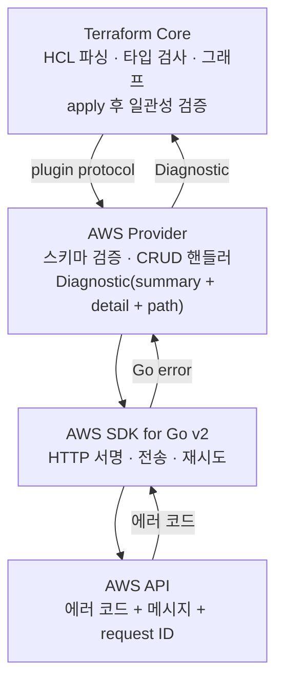

# 41장 — 디버깅: 에러 한 줄에서 원인까지 거슬러 올라가기

**이 장에서 배우는 것**

- 에러 출력에서 Terraform Core · provider 진단 · AWS API 세 계층을 분리해 읽고, 고칠 곳이 코드인지 권한인지 provider인지 가릴 수 있다.
- `TF_LOG` · `TF_LOG_CORE` · `TF_LOG_PROVIDER` · `TF_LOG_PATH`를 조합해 필요한 만큼만 로그를 남길 수 있다.
- 로그에서 실제 AWS API 요청·응답과 **request ID**를 찾아내고, 그것으로 AWS 지원에 문의할 수 있다.
- 권한 부족 · 최종 일관성 · 스로틀링 · 검증 실패 · 리소스 충돌 · 타임아웃 여섯 유형을 증상으로 구분해 진단할 수 있다.
- 영구 diff(perpetual diff)의 원인 네 가지를 `plan -json`·`show -json`으로 좁히고, 문제를 최소 재현으로 줄여 제보 가능한 이슈로 만들 수 있다.

**왜 중요한가**

디버깅이 오래 걸리는 이유는 대개 "어렵기 때문"이 아니라 **엉뚱한 계층을 파고 있기 때문**이다. `Error: creating ... : AccessDenied`를 보고 팀이 이틀 동안 HCL을 고친다. 실제 원인은 CI 롤에 `ec2:CreateFlowLogs`가 없었던 것이고 그 사실은 TRACE 로그의 HTTP 요청 한 줄에 이미 적혀 있었다. 에러는 세 계층에서 오고 **계층마다 고칠 사람이 다르다.**

두 번째 사고는 조용하다. plan이 매번 같은 diff를 보여 주고 apply를 해도 사라지지 않는다. 팀은 그것을 "원래 그런 것"으로 취급하다가 어느 날 진짜 변경 하나가 거기 섞여 든 것을 알아채지 못한다. **영구 diff는 진짜 변경을 감추는 위장막이라는 점에서 위험하다.**

세 번째는 제보 쪽이다. 원문 FAQ는 이슈와 PR의 양 때문에 모든 항목에 충분한 주의를 기울이지 못하며 **가장 많은 사람에게 가치가 큰 기여에 집중한다**고 밝힌다. 같은 버그라도 1,000줄 설정으로 제보하면 몇 달을 기다리지만 10줄 최소 재현은 다르게 취급된다 — 원문은 그 차이를 **"대략 100배"**라고 표현한다.

## 에러 출력은 세 계층에서 온다

apply가 실패했을 때 화면에 뜨는 것은 한 덩어리로 보이지만, 서로 다른 세 곳이 만든 문자열이 이어 붙은 결과다.



**계층 1 — Terraform Core 에러.** provider 호출 전이거나 provider의 응답을 Core가 검증하다 나온다. 특징은 **AWS 서비스 이름이 전혀 등장하지 않는다**는 것이다. HCL 문법 에러, 타입 불일치, 순환 의존(`Cycle: ...`), apply 후 일관성 검증 실패가 여기 들어간다. 마지막 것이 중요하다.

```
Error: Provider produced inconsistent result after apply
...produced an unexpected new value: Root resource was present, but now absent.

This is a bug in the provider, which should be reported in the provider's own
issue tracker.
```


원문 에러 처리 가이드는 조건을 명확히 적는다 — 생성이 에러 없이 끝났는데 **리소스 식별자가 설정되지 않은 채** 반환된 경우다. 원인은 대개 최종 일관성으로, Create 뒤 Read를 불렀는데 AWS가 아직 "없다"고 답했고 Read 핸들러가 그것을 "삭제된 것"으로 해석해 state에서 지운 것이다. 마지막 문장이 알려 주듯 **이 문구가 붙은 에러는 사용자가 고칠 수 없다.**

**계층 2 — provider 진단(Diagnostic).** **summary**(제목 한 줄), **detail**(본문), 가능하면 **attribute path**(어느 인수인지)로 구성된다. 화면에서는 `Error:` 뒤 첫 줄이 summary, 들여쓴 본문이 detail, `with ... on ... line N` 블록이 위치 정보다.

**계층 3 — AWS API 에러.** detail 안에 통째로 들어 있으며 형태는 `<에러코드>: <메시지>` 다. 이것이 보이면 **요청이 실제로 AWS까지 갔다가 거절당했다**는 뜻이고, 없으면 나가기도 전에 걸린 것이다. 이 구분 하나로 조사 범위가 절반이 된다.

## provider 진단의 표준 문구를 역이용하기

원문 에러 처리 가이드는 CRUD 각 단계마다 표준 헬퍼를 쓰도록 규정한다 — Plugin Framework는 `create.ProblemStandardMessage(...)`, SDKv2는 `create.AppendDiagError(...)`. 동작 종류도 상수로 고정되어 있다: `create.ErrActionCreating`, `ErrActionReading`, `ErrActionUpdating`, `ErrActionDeleting`, waiter용 `ErrActionWaitingForCreation`·`ErrActionWaitingForUpdate`·`ErrActionWaitingForDeletion`. 그래서 실제 출력은 다음 모양으로 수렴한다.

```
Error: creating Flow Log (vpc-0c2635533cef2be79): 1 error occurred:
	* vpc-0c2635533cef2be79: 400: Access Denied for LogDestination: does-not-exist.

  with aws_flow_log.test,
  on main.tf line 34, in resource "aws_flow_log" "test":
```

읽는 순서를 고정하면 진단이 빨라진다. **동사**에서 CRUD 단계가 끝난다 — `waiting for`가 붙었다면 API 호출은 성공했고 **상태 전이를 기다리다 실패**한 것이므로 조사 대상은 요청 파라미터가 아니라 리소스의 상태 값이다. **괄호 안 식별자**가 비어 있으면 아직 ID가 없는 생성 초기다. **콜론 뒤**부터는 AWS가 돌려준 원문이다.

규약을 알면 **에러를 코드 위치로 되돌리는 것**도 가능하다. 원문 finders 가이드의 Read 핸들러 문구는 `reading RDS Shard Group (%s)`, `reading EFS Access Point (%s): %s` 형태이므로, `reading EFS Access Point (fsap-...)`를 보면 `internal/service/efs`의 Read 핸들러가 발신지임을 알 수 있다. 로그에서 자주 만나는 짝은 `[WARN] EFS Access Point (fsap-0a1b2c3d) not found, removing from state` 다. 원문이 규정한 Read 핸들러의 표준 동작이 **AWS가 "없다"고 하면 에러가 아니라 경고를 남기고 state에서 제거**하는 것이므로, 이 줄 뒤에 plan에서 `1 to add`가 뜬다면 drift가 아니라 **누군가 그 리소스를 지웠다**는 뜻이다.

**smarterr가 바꾸는 것.** provider는 에러 처리를 `smarterr` / `smerr` 패키지로 옮기는 중이다. 원문 마이그레이션 가이드의 핵심은 셋 — 진단을 만드는 모든 호출은 **`smerr`를 거치고**(Framework는 "Add" 계열, SDKv2는 "Append" 계열), 맨 에러 반환은 `smarterr.NewError(err)`로 감싸며, **항상 `smerr.ID, <리소스 식별자>`를 함께 넘긴다.** 사용자 입장의 의미는 **식별자와 문맥이 에러에 자동으로 따라붙는다**는 것이다.

## TF_LOG: 필요한 만큼만 켜기

`TF_LOG`는 Terraform과 provider의 내부 로그를 표준 에러로 내보낸다. 레벨은 `TRACE`, `DEBUG`, `INFO`, `WARN`, `ERROR` 다섯이고 왼쪽일수록 자세하다. 원문도 `TF_LOG=debug`를 쓸 수 있다고 하면서 **"수천 줄이 추가되어 정작 유용한 정보를 찾기 어려워질 수 있다"**고 경고한다. 문제는 로그가 없는 것이 아니라 너무 많은 것이다.

```console
# Core는 조용히, provider만 자세히 — AWS API 조사에 쓰는 기본 조합
$ TF_LOG_CORE=warn TF_LOG_PROVIDER=trace TF_LOG_PATH=./tf.log terraform plan

# 반대: 그래프·의존성·state 처리를 볼 때
$ TF_LOG_CORE=trace TF_LOG_PROVIDER=error terraform plan
```

`TF_LOG_CORE`와 `TF_LOG_PROVIDER`는 `TF_LOG`를 각각 덮어쓴다. **AWS 쪽 문제에서 Core 로그는 거의 항상 잡음**이므로 첫 조합이 기본값이 되어야 한다. `TF_LOG_PATH`를 쓰면 로그가 파일로 가고 터미널 출력은 유지된다.

provider 전용 스위치가 하나 더 있다. `TF_LOG_AWS_AUTOFLEX`는 Plugin Framework 리소스에서 AutoFlex가 값을 flatten/expand 하는 과정을 로그로 낸다. 원문은 유효값을 `ERROR`, `WARN`, `INFO`, `DEBUG`, `TRACE`로 적고 **기본값은 `ERROR`**라고 밝힌다. "설정한 값이 state에 이상하게 들어간다"는 문제에서 그 변환 지점을 보여 준다.

TRACE 로그는 대형 state에서 수백 MB가 된다. 세 습관이 차이를 만든다 — **`-target`으로 범위를 좁힌다**, **별도 디렉터리로 격리한다**, **처음부터 읽지 않고 grep 대상으로 취급한다.**

```console
$ grep -n "aws.Request\|aws.Response" tf.log | head -50
$ grep -ni "x-amzn-requestid\|x-amz-request-id\|x-amz-id-2" tf.log
$ grep -oi "RequestLimitExceeded\|ThrottlingException" tf.log | sort | uniq -c
```

## 로그에서 AWS API 요청·응답과 request ID 찾기

원문 retries-and-waiters 가이드는 SDK가 `net/http` 요청을 만들면서 인증·서명 헤더를 붙이고 입력을 URI 파라미터나 본문으로 변환하며 **디버그 로깅이 켜져 있으면 이 HTTP 요청을 로그로 남긴다**고 적는다. 응답에 대해서는 AWS 서비스가 **일반적으로 AWS 지원 케이스에 쓸 수 있는 요청 식별자 HTTP 헤더를 붙인다**고 밝힌다.

그러니까 TRACE 로그에는 네 가지가 순서대로 들어 있다 — **요청 라인과 헤더**(URI나 `X-Amz-Target`에 오퍼레이션 이름이 있다), **요청 바디**(provider가 실제로 보낸 파라미터. "설정한 값이 안 먹는다"는 문제의 대부분은 여기에 그 필드가 없다는 사실로 판명된다), **응답 상태와 헤더**(request ID), **응답 바디**(에러 코드와 메시지 원문).

오퍼레이션 이름으로 구간을 자르면(`awk '/aws.Request/,/^$/' tf.log | grep -A 40 CreateFlowLogs`) 필요한 40줄만 남는다. **request ID 헤더 이름은 서비스마다 다르다.** 대부분은 `x-amzn-RequestId`, S3는 `x-amz-request-id`와 `x-amz-id-2`를 함께 준다. 두 이름을 모두 찾아야 놓치지 않는다.

요청 바디는 옳은데 거절당하거나 콘솔에서는 되는데 API로는 안 되면 **AWS 지원 케이스**가 맞는 경로다. 준비물은 다섯 — **request ID**(재시도가 있었다면 실제로 실패한 시도의 것), **UTC 기준 타임스탬프**(AWS 쪽에서는 둘이 짝으로 쓰인다), **리전과 계정 ID**, **오퍼레이션 이름과 요청 파라미터**(`CreateFlowLogs`처럼 **AWS API 이름**으로 적는다), **기대 동작과 실제 동작**. 같은 요청을 AWS CLI로 재현해 첨부하면 케이스가 빨리 진행되고, CLI로도 같은 에러가 나면 **provider가 아니라는 증거가 확보된다.**

**보안 경고.** `TF_LOG=trace` 로그에는 **HTTP 요청 헤더 전체**가 포함된다. SigV4 서명(`Authorization: AWS4-HMAC-SHA256 Credential=AKIA.../...`)과 세션 토큰이 여기 있고, **요청·응답 바디에는 리소스의 실제 값**이 담긴다 — RDS 마스터 패스워드, SSM SecureString 평문, Lambda 환경변수. 그러므로 **이슈에 올리기 전에 `Authorization`·`X-Amz-Security-Token`·계정 ID·ARN·시크릿을 지우고**(request ID는 남겨도 된다), **CI 아티팩트의 보존 기간과 접근 권한을 확인하며**, **장기 액세스 키로 로그를 남겼다면 회전한다.**

## 에러 유형별 진단 절차

**권한 부족**(`AccessDenied`, `UnauthorizedOperation`)은 역추적이다. ① 로그의 요청 URI·헤더에서 **거절된 오퍼레이션 이름을 확정한다.** 추측하면 틀린다 — `aws_flow_log` 하나가 `CreateFlowLogs` 외에 `DescribeFlowLogs`, `CreateTags`를 부른다. ② 대응하는 IAM 액션을 AWS 서비스 인증 참조에서 찾는다. ③ 거절 주체를 가른다 — 호출자 정책 / 리소스 정책 / SCP / 권한 경계. ④ CloudTrail 이벤트의 `errorCode`·`requestParameters`를 provider가 보낸 것과 대조한다.

**함정이 있다.** IAM 직후의 `AccessDenied`는 권한 문제가 아닐 수 있다. 원문은 IAM 자체가 최종 일관적이며 롤 생성 → 정책 연결 → 다른 서비스에서 사용을 빠르게 이어 하면 **"롤이 없다", "assume 권한이 없다", "권한이 부족하다"가 모두 나타날 수 있다**고 적고, provider는 `internal/service/iam`에 **2분** 전파 타임아웃 상수를 두고 재시도한다. **다시 apply하니 되더라**면 전파 문제다.

**최종 일관성**(생성 직후의 `NotFound` 계열)에 대해 원문은, Terraform이 적용 후 일치를 기대하는데 드리프트 탐지를 위해 Create/Update 뒤 `Get`/`Describe`를 부르는 구현이 흔하고 **이 두 개념이 충돌한다**고 정리하며, 이런 문제는 **안정적으로 재현되지 않아 인수 테스트로 검증하기 까다롭다**고 덧붙인다. 확인 순서는 재실행 → 다른 계정·리전 → `depends_on`으로 순서 명시이며 마지막이 참이면 provider 버그가 아니다.

**스로틀링**(`RequestLimitExceeded`, `ThrottlingException`, `TooManyRequestsException`)의 요점은 하나 — **에러로 보이지 않는 것이 정상**이다. 재시도가 실패를 감추고 시간으로 대가를 치르므로 증상은 "느리다"이고, apply가 **에러 없이 멈춘 것처럼** 보이면 `max_retries` 기본값 25가 만드는 대략 한 시간짜리 백오프를 의심한다([40장](40-performance-and-throttling.md)).

**검증 실패**(`InvalidParameterValue`, `ValidationException`)는 provider 검증과 AWS 검증을 먼저 가른다. provider 스키마 검증에 걸리면 API 호출이 나가지 않으므로 로그에 해당 `aws.Request`가 없다. AWS 검증이면 요청 바디를 열어 **실제로 보낸 값**을 본다. 원문의 예 `InvalidParameterValueException: IAM Role arn:aws:iam::123456789012:role/XXX cannot be assumed by AWS Backup` 에서 **환경마다 달라지는 부분(ARN)과 고정 문구(`cannot be assumed`)를 가르는 것**이 결정적이다 — 이슈 검색에는 고정 문구만 넣는다.

**리소스 충돌**(`DependencyViolation`, `ResourceInUse`, `OperationAborted`)은 셋으로 갈린다. **진짜 의존성** — 서브넷 삭제가 실패하고 Lambda나 EKS가 만든 ENI가 남아 있다. Terraform 그래프에 없으므로 순서를 고칠 방법도 없다. **동시 수정** — 원문은 API Gateway의 `ConflictException` 중 `try again later`, S3의 `OperationAborted` 중 `A conflicting conditional operation is currently in progress...` 를 서비스 전체의 재시도 대상으로 등록한다고 밝힌다. 즉 **화면에 뜬 충돌은 provider의 재시도로도 안 된 것**이고 원인은 대개 Terraform 밖의 동시 실행이다. **소유권 경계** — 다음 절 원인 3이다.

**타임아웃**은 AWS 쪽 상태, `timeouts` 값, **CI 잡 타임아웃** 셋을 순서대로 본다. 마지막이면 AWS 쪽 생성은 계속되므로 state에 없는 리소스가 남고 다음 apply에서 이름 충돌로 다시 실패한다.

## 영구 diff 진단: 원인은 네 가지다

**원인 1 — AWS가 값을 정규화한다.** IAM 정책 JSON의 키 순서와 공백, Principal이 ARN으로 펼쳐지는 것, 도메인 이름 끝의 점, 대소문자, 빈 리스트가 `null`이 되는 것. *확인:* TRACE 로그에서 **요청 바디의 값과 직후 응답 바디의 값을 비교**한다. 의미가 같고 표현만 다르면 이 원인이고, 대응은 코드를 정규형에 맞추는 것이다.

**원인 2 — provider가 그 인수를 읽지 못한다.** Read 핸들러가 필드를 state에 반영하지 않아 state 값이 항상 비어 있다. *확인:* `terraform show -json`의 그 속성과 AWS CLI의 `describe` 출력을 대조한다. **AWS에는 값이 있는데 state에는 없으면** 확정이며 이것은 **provider 버그**, 제보 대상이다.

**원인 3 — 인라인 인수와 별도 리소스를 섞어 썼다.** 같은 대상을 두 리소스가 관리하면 서로의 변경을 되돌린다 — `aws_security_group`의 인라인 `ingress`와 `aws_vpc_security_group_ingress_rule` 같은 조합이다. *확인:* 같은 대상을 참조하는 리소스가 둘 이상인지 세고, diff 방향이 **매번 뒤집히는지** 본다. 대응은 소유권을 한쪽으로 몰아 주는 것이며 [35장](35-relationship-resources.md)의 `*_exclusive` 리소스가 존재하는 이유가 이것이다.

**원인 4 — 외부 시스템이 값을 바꾼다.** 오토스케일러가 `desired_capacity`를, 배포 도구가 태스크 정의 리비전을 바꾼다. *확인:* apply 직후에 plan을 한 번, 몇 분 뒤에 한 번 더 돌린다. **첫 plan은 깨끗한데 두 번째에 diff가 생기면** 외부 시스템이고, CloudTrail의 최근 변경 이벤트 `userIdentity`가 범인을 알려 준다. 대응은 `ignore_changes`이며 **이 경우에는 그것이 회피책이 아니라 설계다.**

사람이 읽는 plan 출력은 값을 잘라 내므로 정확한 비교에는 기계 판독 형식을 쓴다.

```console
$ terraform plan -out=tfplan && terraform show -json tfplan > plan.json
$ jq '.resource_changes[] | select(.address=="aws_iam_role.app") | .change
    | {before: .before.assume_role_policy, after: .after.assume_role_policy}' plan.json
$ jq -r '.resource_changes[] | select(.change.actions == ["delete","create"])
    | {address, replace_paths: .change.replace_paths}' plan.json
```

`replace_paths`는 **어떤 속성 때문에 교체가 결정되었는지**를 직접 알려 준다. `# forces replacement` 주석과 같은 정보지만 중첩 블록 깊은 곳에서는 이쪽이 훨씬 빨리 찾힌다.

## 최소 재현과 이분 탐색

원문 디버깅 가이드의 주장은 이것이다. **"버그를 재현하는 완전한 10줄 설정은 같은 버그를 재현하는 1000줄 설정보다 훨씬 — 어쩌면 100배 — 유용하다."** 근본 원인에 집중할 수 있고, 재현과 수정 검증 시간이 줄고, 다른 사람이 재현하기 쉬워지기 때문이다.

절차도 규정되어 있다. ① 단순한 구성에서 시작한다. ② 리소스·의존성·인수를 가능한 한 많이 제거하되 **테스트 독립성**은 유지한다 — 그 구성만으로 처음부터 끝까지 실행 가능해야 하고 미리 존재하는 외부 리소스에 의존해서는 안 된다. ③ 여전히 재현되는지 확인하고, 사라졌다면 다시 붙이면서 재현 지점을 찾는다. 실행 요령은 셋 — **별도 디렉터리에서 격리한다**(`main.tf` 하나와 로컬 백엔드만. 시도 횟수가 곧 진단 속도가 된다), **변수를 없앤다**, **한 번에 하나만 바꾼다.**

"지난주까지 됐는데 지금 안 된다"는 회귀에는 이분 탐색이 가장 빠르다. 원문 FAQ가 밝히듯 provider는 **매주 목요일에 릴리스**되므로 두 달 사이의 회귀라면 후보가 여덟 개 남짓이고 세 번의 시도로 특정된다. 지킬 것은 셋 — **매번 `.terraform.lock.hcl`을 지우고 `-upgrade`로 받고**, **최소 재현 구성으로만 하고**, **state를 매번 새로 만든다**(중간 버전의 스키마 업그레이드가 남으면 결과가 오염된다).

**이슈에 담아야 하는 것**은 여섯이다 — **버전 정보**(`terraform version` 출력 전체), **최소 재현 구성**, **잘라내지 않은 전체 에러 출력**, **마스킹한 로그**, **기대/실제 동작**, **재현 빈도**(원문은 항상인지 간헐적인지를 구분하는 것 자체를 재현의 목적으로 꼽는다). 여기에 **AWS CLI 호출 결과**와 **버전 경계**를 더하면 품질이 크게 올라간다. 원인을 못 찾겠다면 원문은 **실패하는 테스트만 기여**하라고 권하되, 약 7,000개의 인수 테스트 중 일정 비율은 설명할 수 없는 이유로 실패하므로 새 테스트는 **`ExpectError` 등으로 "PASS"하게 만들고 주석과 이슈로 설명**하라고 덧붙인다.

## 디버거를 붙여 provider를 실행하기

여기부터는 provider 소스를 손에 넣은 뒤의 이야기이며 43장의 주제다. `main.go`를 보면 provider 바이너리가 **`-debug` 플래그**를 받는다. 이 플래그가 켜지면 서버 옵션에 관리형 디버그 모드가 추가되어, provider가 Terraform CLI에 의해 자동 실행되는 대신 **먼저 떠서 붙을 주소를 출력하고 기다린다.** 그 정보를 환경변수로 알려 주면 CLI는 새 프로세스를 띄우는 대신 이미 떠 있는(디버거가 붙은) 프로세스로 요청을 보낸다. 원문은 VS Code 기준 `.vscode/launch.json`과 `.vscode/private.env` 설정을 제시하며 여기서도 `TF_LOG`는 `info`를 권한다. IDE 없이 하려면 **Delve**를 직접 쓴다.

그 전에 원문이 권하는 더 싼 방법이 있다 — **`fmt.Printf()`를 넣는 것**이다. 원문은 이 방법이 코드가 특정 지점에 도달하는지나 변수 한두 개의 값을 볼 때 적합하고 **복잡한 로직이나 많은 변수에는 맞지 않다**고 선을 긋는다. 실제 예에서는 API 입력 구조체 전체를 출력해 보낸 파라미터를 확인한다.

원문이 규정한 순서는 **재현 → 최소 재현 → 실패하는 인수 테스트 작성 → 원인 조사 → 테스트로 수정 검증**이다. 세 번째가 앞에 오는 이유는 명확하다 — 테스트가 있어야 버그를 **마음대로 일으킬 수 있고**, 그래야 디버거를 붙이는 것이 의미가 있다. 그 테스트는 수정 이후 **회귀 방지 장치로 남는다.**

## 흔한 실수

### ❌ 에러의 첫 줄만 읽고 HCL을 고치기 시작한다

콜론 뒤의 AWS 에러 코드를 읽지 않았으니 방향이 맞는지 알 수 없다.

```console
# ❌ 첫 줄만 보고 인수를 바꾸기 시작한다
Error: creating EC2 Flow Log (vpc-0c26...): UnauthorizedOperation: You are not
authorized to perform this operation.
```
```console
# ✅ 순서대로 읽는다: 동사(creating) → 리소스 → ID → AWS 에러 코드
#    UnauthorizedOperation 이면 HCL이 아니라 IAM이다. 로그에서 오퍼레이션을 확정한다.
$ TF_LOG_CORE=warn TF_LOG_PROVIDER=trace TF_LOG_PATH=./t.log \
  terraform apply -target=aws_flow_log.this
$ grep -o "X-Amz-Target: [^ ]*" t.log | sort -u
```

### ❌ `TF_LOG=trace`를 전체 스택에 켜고 로그를 처음부터 읽는다

리소스 900개짜리 apply에 TRACE를 켜면 로그가 수백 MB가 되지만 찾는 것은 20줄 안에 있다.

```console
# ❌ 400MB 로그를 만들고 스크롤을 시작한다
$ TF_LOG=trace terraform apply
```
```console
# ✅ 대상을 좁히고, Core를 끄고, 파일로 받고, grep으로 접근한다
$ TF_LOG_CORE=warn TF_LOG_PROVIDER=trace TF_LOG_PATH=./one.log \
  terraform apply -target=aws_db_instance.main
$ grep -n "aws.Request\|x-amzn-RequestId\|ErrorCode" one.log
```

### ❌ 영구 diff를 원인 확인 없이 `ignore_changes`로 덮는다

`lifecycle`을 붙이면 그 인수의 **모든** 변경이 보이지 않게 된다. 원인 4라면 정답이지만 원인 1~3에서는 사고를 예약하는 것이다.

```terraform
# ❌ 원인을 모른 채 덮는다 — 진짜 정책 변경도 함께 눈이 먼다
resource "aws_iam_role" "app" {
  name               = "app"
  assume_role_policy = file("trust.json")

  lifecycle {
    ignore_changes = [assume_role_policy]
  }
}
```

```terraform
# ✅ 원인 1(AWS 정규화)이면 provider가 만드는 정규형을 쓴다
data "aws_iam_policy_document" "assume" {
  statement {
    actions = ["sts:AssumeRole"]
    principals {
      type        = "Service"
      identifiers = ["ec2.amazonaws.com"]
    }
  }
}

resource "aws_iam_role" "app" {
  name = "app"
  # 원인 2·3이면 각각 제보와 소유권 정리가 답이지 ignore_changes가 아니다
  assume_role_policy = data.aws_iam_policy_document.assume.json
}
```

### ❌ 로그를 그대로 이슈에 붙여 넣는다

요청 헤더에는 SigV4 서명과 세션 토큰이, 바디에는 시크릿이 들어 있다. "재현에 필요하니까"는 유출을 정당화하지 않는다.

```console
# ❌ 통째로 붙여 넣는다 — Authorization, X-Amz-Security-Token, 시크릿 포함
$ cat tf-trace.log | pbcopy
```
```console
# ✅ 필요한 구간만 잘라내고 민감 헤더와 식별자를 지운다 (request ID는 남긴다)
$ sed -n '/CreateFlowLogs/,/^$/p' tf-trace.log \
  | sed -E 's/(Authorization|X-Amz-Security-Token):.*/\1: REDACTED/I' \
  | sed -E 's/[0-9]{12}/123456789012/g' > issue-snippet.log
```

## 프로덕션 노트

- **로그는 아티팩트가 아니라 시크릿으로 취급한다.** TRACE 로그에는 서명 헤더와 리소스 값이 들어가므로 보존 기간을 짧게 잡고 접근을 제한하며 실패한 잡에서만 남긴다.
- **CI에 `TF_LOG` 기본값을 두지 않는다.** 상시 DEBUG는 비용과 유출 위험만 늘린다. "재실행 시 로그 켜기" 입력 파라미터를 만들어 두면 필요한 순간에 켤 수 있다.
- **`plan -out` + `show -json`을 파이프라인 표준으로 만든다.** 사람이 읽는 출력은 값을 잘라 내므로 사후 분석에 못 쓴다. JSON을 남기면 `replace_paths`로 "왜 교체되는가"를 나중에도 답할 수 있다([36장](36-drift-refresh-and-checks.md)).
- **`[WARN] ... not found, removing from state` 를 알림 대상으로 삼는다.** "누군가 Terraform 밖에서 리소스를 지웠다"는 신호이며 `TF_LOG=warn` 수준의 저비용 로깅으로도 잡힌다.
- **request ID와 UTC 시각을 짝으로 보관한다.** provider가 25번까지 재시도하므로 같은 오퍼레이션의 request ID가 여러 개일 수 있고, 케이스에는 실제로 실패한 시도의 것이 필요하다.

## 연습문제

1. 권한이 하나 빠진 IAM 롤로 리소스를 만들어 실패시키고, TRACE 로그에서 거절된 오퍼레이션 이름·request ID·에러 코드를 찾아낸다. *성공 기준:* 세 값이 로그 줄 번호와 함께 제시되고, 그 오퍼레이션에 대응하는 IAM 액션이 근거와 함께 특정되며, 발췌본에서 `Authorization`과 계정 ID가 마스킹되어 있다.

2. 영구 diff가 있는 리소스를 하나 골라 `plan -out` → `show -json`으로 `before`/`after`를 추출하고, 이 장의 원인 네 가지 중 어느 것인지 판정한다. *성공 기준:* 판정 근거가 네 원인의 확인 방법 중 해당하는 것의 실제 출력으로 제시되고, `ignore_changes`가 정답인 경우와 아닌 경우가 구분되어 있다.

3. 실패하는 설정 하나를 최소 재현으로 줄이고 제출 가능한 이슈 본문을 작성한다. *성공 기준:* 최종 구성이 별도 디렉터리에서 변수 없이 단독 실행 가능하고, 지웠다가 되돌린 항목이 최소 하나 기록되어 그것이 버그의 필요 조건임이 설명되며, 이슈 본문에 버전 정보·전체 에러 출력·마스킹된 로그·기대/실제 동작·재현 빈도와 "AWS CLI로 같은 API를 호출한 결과"가 포함되어 있다.

## 요약

- 에러 출력은 **Terraform Core · provider 진단 · AWS API** 세 계층에서 오며 계층마다 고칠 사람이 다르다. detail에 `<에러코드>: <메시지>` 형태가 있으면 요청이 AWS까지 갔다는 뜻이고, 없으면 그 전에 걸린 것이다.
- provider 진단의 summary는 표준화되어 있다 — `creating`/`reading`/`updating`/`deleting`/`waiting for ...` + 리소스 이름 + `(식별자)`. `waiting for`는 API 호출이 아니라 상태 전이가 문제라는 뜻이다.
- `TF_LOG`(TRACE/DEBUG/INFO/WARN/ERROR)는 `TF_LOG_CORE`·`TF_LOG_PROVIDER`로 분리해 켜고 `TF_LOG_PATH`로 파일에 받는다. AutoFlex 전용 스위치 `TF_LOG_AWS_AUTOFLEX`의 기본값은 `ERROR`다. AWS는 응답에 **지원 케이스에 쓸 수 있는 요청 식별자 헤더**를 붙이며, request ID + UTC 시각 + 리전/계정 + AWS API 오퍼레이션 이름 + 기대/실제가 문의의 준비물이다. **로그에는 SigV4 서명·세션 토큰·시크릿이 남으므로 반드시 마스킹한다.**
- IAM 직후의 실패는 권한이 아니라 전파(provider 표준 **2분** 상수)일 수 있고, 스로틀링은 에러가 아니라 지연으로 나타나며, 타임아웃은 AWS 상태·`timeouts`·CI 잡 타임아웃 중 무엇이 잘랐는지를 먼저 가른다.
- 영구 diff의 원인은 넷 — AWS 정규화, provider가 못 읽음(**제보 대상**), 인라인/별도 리소스 혼용, 외부 시스템. `ignore_changes`가 정답인 것은 마지막 하나뿐이다.
- 원문이 규정하는 순서는 **재현 → 최소 재현 → 실패 테스트 → 원인 조사 → 테스트로 검증**이며, 10줄 재현은 1000줄 재현보다 대략 **100배** 유용하다.

## 다음으로

- [42장 — Provider 아키텍처: SDKv2 + Plugin Framework mux](42-provider-architecture.md) — 에러가 어느 코드에서 나왔는지 소스로 확인하기
- [43장 — 개발 환경과 skaff](43-dev-environment-and-skaff.md) — provider를 직접 빌드하고 디버거 붙이기
- [40장 — 성능과 API 스로틀링](40-performance-and-throttling.md) — 재시도가 시간으로 대가를 치르는 구조
- 공식 문서: [Debugging Terraform](https://developer.hashicorp.com/terraform/internals/debugging)
