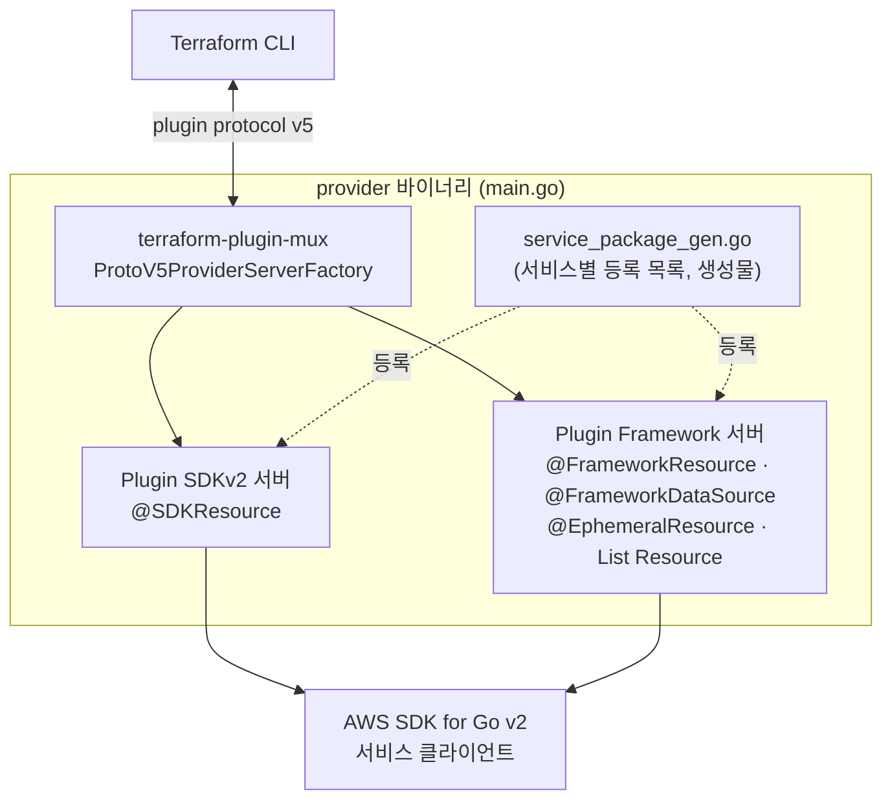

# 42장 — Provider 아키텍처: 두 개의 SDK가 하나로 서빙되는 이유

**이 장에서 배우는 것**

- provider 저장소의 디렉터리 구조를 읽고, 어떤 리소스의 구현 파일과 문서 파일이 어디 있는지 이름만으로 찾아갈 수 있다.
- `terraform-plugin-sdk` v2와 `terraform-plugin-framework`가 왜 공존하며 `terraform-plugin-mux`가 무엇을 하는지 설명할 수 있다.
- 두 SDK의 결정적 차이(null과 zero value, 타입 시스템, 스키마 정의, 진단)가 사용자에게 어떤 증상으로 나타나는지 안다.
- `names` 패키지가 AWS 서비스 이름의 다섯 가지 표기를 한곳에서 관리하는 이유와, 리소스 이름의 불규칙이 어디에서 오는지 설명할 수 있다.
- 어노테이션(`@SDKResource`, `@FrameworkResource`, `@Tags`, `@Region` 등)과 코드 생성의 관계를 알고 소스에서 기능 지원 여부를 판별할 수 있다.

**왜 중요한가**

문서에 없는 동작을 만나는 날이 온다. 어떤 인수가 왜 교체를 유발하는지 안 적혀 있고, 어떤 리소스가 `tags`를 지원하는지 애매하고, `region` 인수를 갖는지 확실하지 않다. 답이 있는 곳은 하나 — **소스**다. 그리고 소스를 읽으려면 지도가 필요하다. 리소스 하나의 구현이 어느 파일에 있고 어노테이션 한 줄이 무엇을 켜는지 알면 **10분짜리 확인**이 된다. 모르면 이슈를 열고 2주를 기다린다.

두 번째 이유는 예측 가능성이다. **두 SDK가 섞여 있다는 사실은 사용자에게도 새어 나온다.** 어떤 리소스는 빈 문자열과 미설정을 구분하고 어떤 리소스는 구분하지 못한다. 같은 provider인데 동작이 다른 이유가 "만들어진 시기와 SDK가 다르기 때문"임을 알면, 이상한 동작을 만났을 때 **버그인지 SDK의 성질인지**를 먼저 가를 수 있다. 그리고 서비스 패키지 이름을 알면 이슈에 정확한 라벨이 붙어 담당자에게 곧장 닿는다 — 에러 문구에서 패키지를 역산하는 방법은 [41장](41-debugging.md)에서 봤고, 이 장은 그 패키지 안에 무엇이 있는지를 다룬다.

## 저장소의 지도

저장소 최상위에서 실제로 봐야 할 것은 다섯 개다.

```
terraform-provider-aws/
├── main.go            # 진입점. provider 서버를 띄운다
├── names/             # AWS 서비스 이름 체계의 단일 출처
├── internal/
│   ├── provider/      # provider 초기화·설정, mux
│   ├── conns/         # provider 전역 상태(설정 포함)
│   ├── service/<서비스>/   # 서비스별 리소스 구현
│   ├── framework/     # Framework 유틸리티(AutoFlex, 커스텀 타입)
│   ├── generate/      # 코드 생성기
│   └── tags/ retry/ errs/ smerr/
├── website/docs/      # 사용자 문서(Registry에 실리는 것)
├── docs/              # 기여자 문서(이 교재의 근거 원문)
└── skaff/             # 신규 리소스 스캐폴딩 도구
```

`main.go`는 짧고, 그래서 읽을 가치가 있다. 하는 일은 셋이다 — `-debug` 플래그를 받고, `provider.ProtoV5ProviderServerFactory(...)`로 서버 팩토리를 만들고, `tf5server.Serve("registry.terraform.io/hashicorp/aws", serverFactory, ...)`로 서빙한다. 이름에서 두 가지가 읽힌다. **`tf5`** — plugin protocol **버전 5**로 말한다는 뜻이고, **`ServerFactory`** — provider가 팩토리에서 만들어진다는 뜻이다. 뒤에서 볼 mux가 여기 들어간다.

서비스 패키지 안의 파일 이름도 규약이 강하다. 원문 naming 가이드의 관용 이름은 `consts.go`, `find.go`(finder), `flex.go`(FLatten/EXpand), `generate.go`, `id.go`, `status.go`, `sweep.go`, `tags_gen.go`, `validate.go`, `wait.go`(waiter)다. 여기에 AGENTS.md의 규약이 더해진다 — 리소스 구현은 `internal/service/{서비스}/{대상}.go`, 인수 테스트는 `{대상}_test.go`, 데이터 소스는 `{대상}_data_source.go`, 문서는 `website/docs/r/{서비스}_{대상}.html.markdown`.

즉 `aws_efs_access_point`를 찾으려면 `internal/service/efs/access_point.go`를 열면 된다. **파일 이름에 서비스 이름을 다시 넣지 않는다**는 것이 규칙이다 — 디렉터리가 이미 그 정보를 담고 있기 때문이다. 함수 이름도 같아서 EC2의 finder는 `FindVPCEndpointByID()`이고, 다른 패키지에서는 임포트 별칭이 출처를 알려 준다(`tfec2.FindVPCEndpointByID()`).

## 왜 SDK가 둘인가

원문 terraform-plugin-development-packages 문서는 상황을 한 문장으로 요약한다 — **모든 신규 리소스는 Terraform Plugin Framework를 쓰지만, Plugin SDK V2로 구현된 기존 리소스가 아주 많다.** 그리고 그 둘이 어떻게 한 provider가 되는지도 명시한다. AWS Provider는 **muxed** 되어 있어서 기존 SDKv2 리소스가 새 Framework 리소스와 **나란히 존재**할 수 있다.



핵심은 **Terraform CLI가 이 분열을 전혀 보지 못한다**는 것이다. CLI 입장에서는 protocol v5로 말하는 provider 하나가 있을 뿐이고, mux가 요청을 받아 해당 리소스를 구현한 쪽으로 넘긴다. 그래서 사용자는 `aws_vpc`(오래된 SDKv2 리소스)와 최신 Framework 리소스를 같은 파일에 아무 표시 없이 섞어 쓴다.

**왜 그냥 다 옮기지 않는가.** 원문 terraform-plugin-migrations 문서가 직접 답한다. 기존 리소스를 SDKv2에서 Framework로 옮길 계획은 **없다.** 둘은 기능적으로 같아 보이지만 **동작에 충분히 많은 차이가 있어서, 복잡도가 조금이라도 있는 리소스를 파괴적 변경 없이 옮기는 것이 어렵다는 것이 확인되었다**는 것이다. 단순한 리소스는 잘 옮겨질 수 있지만 **복잡한 리소스, 특히 많이 쓰이는 리소스를 옮기려는 시도는 권장하지 않는다**고 못박는다. 그리고 기여자 규칙이 정해진다 — **신규 기여는 Framework 필수**이고, `skaff`도 기본값으로 Framework 코드를 만든다.

## 두 SDK의 결정적 차이

원문이 "동작 차이가 충분히 많다"고 말한 것 중 사용자에게까지 보이는 것은 넷이다.

**차이 1 — `null`과 zero value.** 이것이 가장 크다. 원문은 Plugin Framework가 **`null` 값을 도입했고 이는 zero 값과 다르다**고 적고, Plugin SDKv2는 **`null`과 zero를 같은 것으로 표시했다**고 밝힌다. 사용자 언어로 옮기면 — SDKv2 리소스에서는 `some_arg = ""`와 `some_arg`를 **아예 쓰지 않은 것**이 구분되지 않고, 숫자 `0`과 불리언 `false`도 마찬가지다. 그래서 "이 인수를 0으로 설정하고 싶은데 provider가 미설정으로 취급한다"거나 "인수를 지웠는데 이전 값이 남는다"는 문제가 구조적으로 발생한다.

**차이 2 — 커스텀 타입.** Framework는 기본 타입에 검증을 붙인 **커스텀 타입**을 도입했다. 원문은 커스텀 타입을 쓰려면 state upgrade가 필요한 속성 유형을 나열한다 — **ARN, CIDR 블록, Duration, 타임스탬프**.

```go
// SDKv2: 문자열 + ValidateFunc
"arn_attribute": {Type: schema.TypeString, Optional: true, ValidateFunc: verify.ValidARN},

// Framework: 전용 타입 + 플랜 수정자
"arn_attribute": schema.StringAttribute{
    CustomType:    fwtypes.ARNType,
    Optional:      true,
    PlanModifiers: []planmodifier.String{stringplanmodifier.UseStateForUnknown()},
},
```

사용자에게 보이는 결과는 **에러 시점**이다. 커스텀 타입은 값이 ARN 형태인지 plan 단계에서 판별하므로 apply까지 가지 않고, `UseStateForUnknown()`은 "값이 안 바뀌니 `(known after apply)`로 표시하지 말라"는 지시여서 **plan 출력의 노이즈를 줄인다.**

**차이 3 — 스키마 정의 방식.** SDKv2는 `*schema.Resource`를 반환하는 함수 안에 `map[string]*schema.Schema`를 채운다. Framework는 `resource.Resource`를 구현하는 **구조체**를 만들고 `Schema` 메서드로 스키마를 돌려주며, 값은 `d.Get()`/`d.Set()` 대신 **모델 구조체**로 오간다. AGENTS.md는 이 대비를 그대로 적는다 — SDKv2는 `schema.Resource`·`d.Set()`·`d.Get()`, Framework는 `resource.Resource`·플랜 수정자·**AutoFlex**.

**차이 4 — 진단 API.** Framework는 `resp.Diagnostics`에 **Add** 계열로, SDKv2는 `diags`에 **Append** 계열로 붙인다([41장](41-debugging.md)).

## 마이그레이션: 언제 옮기고 언제 두는가

기준은 원문에 명시되어 있다. **옮긴다** — 새로 만드는 리소스와 데이터 소스는 예외 없이 Framework. **둔다** — 이미 SDKv2로 구현된 리소스는 그대로이며 개선·버그 수정에 마이그레이션이 요구되지 않는다. **옮기지 말라** — 복잡도가 있는 리소스, 특히 널리 쓰이는 리소스.

옮기기로 했다면 넘어야 할 벽이 **state 스키마 호환**이다. 처방은 둘 — **State Upgrader**를 쓰고(`null`과 zero의 구분이 생기므로 SDKv2 시절 state를 Framework 스키마로 승격하는 코드가 필요하다), **커스텀 타입을 쓰는 속성**(ARN·CIDR·Duration·타임스탬프)도 state upgrade 대상으로 다룬다.

검증 방법도 규정되어 있다. **마이그레이션이 파괴적 변경을 만들지 않았음을 테스트로 증명한다.** 두 스텝짜리 인수 테스트로, 1단계에서 `ExternalProviders`로 **가장 최근에 릴리스된 provider 버전**을 지정해 리소스를 만들고 2단계에서 로컬 provider로 **같은 설정**을 `PlanOnly: true`로 실행한다. plan에 아무것도 안 뜨면 통과다.

```go
Steps: []resource.TestStep{
    {
        ExternalProviders: map[string]resource.ExternalProvider{
            "aws": {Source: "hashicorp/aws", VersionConstraint: "5.23.0"},
        },
        Config: testAccExampleResourceConfig_basic(rName),
    },
    {
        ProtoV5ProviderFactories: acctest.ProtoV5ProviderFactories,
        Config: testAccExampleResourceConfig_basic(rName), PlanOnly: true,
    },
},
```

**사용자가 이 사실에서 얻는 것**이 있다. 어떤 리소스가 마이그레이션되는 릴리스에서는 이 테스트가 통과했다는 뜻이므로 **plan에 변화가 없어야 정상**이다. 특정 버전으로 올린 뒤 손대지 않은 리소스에 diff가 뜬다면 회귀일 가능성이 있고 **좋은 이슈 재료**다 — [41장](41-debugging.md)의 버전 이분 탐색이 여기서 쓰인다.

한편 태깅은 SDK 경계를 넘어 동일하게 동작한다. 원문은 **transparent tagging이 Framework에도 그대로 적용되며 `@Tags` 데코레이터를 붙여 쓴다**고 적는다. 즉 `tags`/`tags_all`과 `default_tags`의 동작은 어느 SDK로 구현되었든 같다.

## `names` 패키지: 이름이 다섯 벌인 이유

AWS 서비스 하나는 맥락마다 다른 이름으로 불린다. provider는 그 이름들을 **`names/data/names_data.hcl`** 한 파일에 모아 두고 빌드 시점에 임베드하며, 생성기들이 이 파일을 참조해 코드를 만든다. 원문 `names/README.md`는 이 파일이 **provider, 생성기, 문서, 사이트 내비게이션이 올바르게 동작하는 데 영향을 준다**고 경고한다.

| 쓰임 | 속성 | 어디에 나타나는가 |
|---|---|---|
| 사람이 읽는 이름 | `human_friendly` | 문서 `subcategory`, 사이트 내비게이션, **에러 메시지** |
| 패키지 이름 | `provider_package_correct` | `internal/service/<이것>` |
| SDK 식별자 | `sdk.id`, `client_version` | AWS SDK for Go 클라이언트 생성 |
| 엔드포인트 키 | `endpoint_info`, `aliases` | `endpoints` 블록의 키, `TF_AWS_<서비스>_ENDPOINT` |
| 리소스 접두어 | `resource_prefix` | `aws_<이것>_...` 리소스 이름 |

사용자에게 직접 걸리는 항목이 셋이다. **`human_friendly`는 문서의 `subcategory`와 정확히 일치해야 한다** — Registry의 분류명이 이 값이고, 41장에서 본 `creating Flow Log (...)` 의 앞부분도 여기서 온다. **`aliases`는 커스텀 엔드포인트 가이드에 그대로 나타난다** — 한 서비스가 여러 이름으로 불릴 때(AMP는 `prometheus`, `prometheusservice`) 그 변형이 `endpoints` 블록의 유효한 키가 된다([34장](34-provider-configuration-deep.md)). **`is_global`은 어떤 리소스에 `region` 인수가 있는지의 뿌리**다.

**서비스 식별자 규칙**은 다섯 줄이다. ① AWS SDK for Go v2의 서비스 패키지 이름과 ② AWS CLI v2의 **command**(`aws sts get-caller-identity`에서 `sts`)를 확인한다. ③ 같으면 그것을, 한쪽에만 있으면 그것을 쓴다. ④ 다르면 **더 짧은 쪽**을 쓴다. ⑤ 소문자, 밑줄 없음.

그리고 원문은 준수 현황을 솔직하게 적는다. 156개 이상의 서비스 중 **패키지 이름을 어기는 것은 다섯 개**뿐이지만 **리소스·데이터 소스 이름에서는 32개가 전부 또는 부분적으로 규칙을 어긴다.** EC2·ELB·ELBv2·RDS는 레거시 리소스들이 식별자를 안 쓰거나 일관성 없이 쓰고, 나머지 28개는 일관되게 어긴다 — `api_gateway`는 `apigateway`, `cloudwatch_event`는 `events`, `msk`는 `kafka`여야 한다. **리소스 이름에서 패키지 이름을 기계적으로 유도할 수 없다**는 뜻이고, `aws_cloudwatch_event_rule`의 코드가 `internal/service/events/`에 있는 이유가 이것이다.

**대소문자 규칙**은 `names/caps.md`가 정하고 **semgrep으로 강제한다.** 원칙은 둘 — Go 관용의 **MixedCaps**와 이니셜리즘 처리(`VPCEndpoint`이지 `VpcEndpoint`가 아니다), 그리고 **AWS가 선호하는 서비스명 표기**(`SageMaker`, `GameLift`, `DynamoDB`, `ElastiCache`, `FSx`, `IoT`). 예외가 하나 적혀 있다 — **"Id"를 목록에 추가하지 말 것.** `Id`는 절대 쓰지 않지만 "Identifier"에서 오탐이 많아 린터로 강제하기 위험하다는 것이다.

## 어노테이션과 코드 생성

provider는 리소스를 **자기 등록(self-registration)** 방식으로 붙인다. 리소스 함수 위 주석 한 줄이 어노테이션이고, `make gen`이 그것을 읽어 **`service_package_gen.go`** 에 항목을 추가한다.

```go
// @FrameworkResource("aws_something_example", name="Example")
// @Tags(identifierAttribute="arn")
func newExampleResource(_ context.Context) (resource.ResourceWithConfigure, error) {
    return &exampleResource{}, nil
}
```

읽는 법은 단순하다 — **첫 어노테이션이 SDK를 알려 주고, 나머지가 기능을 알려 준다.**

| 어노테이션 | 의미 |
|---|---|
| `@SDKResource` / `@FrameworkResource` | 관리 리소스 등록. **어느 SDK인지가 여기서 드러난다** |
| `@FrameworkDataSource` | 데이터 소스 등록 |
| `@EphemeralResource` | ephemeral 리소스([26장](../level2-intermediate/26-secrets-and-ephemeral.md)) |
| `@SDKListResource` / `@FrameworkListResource` | List Resource([37장](37-list-resources-and-query.md)) |
| `@Tags(identifierAttribute="arn")` | transparent tagging. 값은 태그 API가 쓰는 속성 이름 |
| `@Region(global=true)` | 리전 서비스 안의 글로벌 리소스 — `region` 인수 없음 |
| `@ArnIdentity` / `@IdentityAttribute(...)` | Resource Identity([20장](../level2-intermediate/20-import-and-resource-identity.md)) |
| `@Testing(...)` | 생성되는 테스트의 동작 조정 |

`@Tags`의 `identifierAttribute`는 태그 조회·갱신 API 호출에 쓸 **스키마 속성 이름**이며 흔한 값은 `"arn"`과 `"id"`다. 원문은 별도의 `listTags`/`updateTags`가 필요 없는 리소스라면 **아예 지정하지 말라**고 적는다.

파일 이름의 `_gen` 접미사가 **생성물과 손으로 쓰는 코드의 경계선**이다. `service_package_gen.go`(등록 목록), `tags_gen.go`(태그 변환·조회·갱신 함수) 같은 것들은 전부 생성물이며, AGENTS.md는 단호하게 적는다 — **생성된 파일을 손으로 고치지 말고 생성기나 어노테이션을 고친 뒤 `make gen`을 돌린다.** 생성 지시는 서비스마다 `generate.go` 한 파일에 모여 있고, 원문의 신규 서비스용 최소 형태는 `servicepackage`·`tagstests`·`identitytests` 생성기를 부르는 세 줄이다.

태깅 생성기는 플래그가 특히 많다. 태그를 맵으로 다루면 `-ServiceTagsMap`, 구조체 슬라이스면 `-ServiceTagsSlice`, 구조체 이름이 `Tag`가 아니면 `-TagType=<이름>`(AppMesh는 `TagRef`), 별도 조회 API를 쓰면 `-ListTags`와 `-ListTagsOp=<API명>`(Auto Scaling은 `DescribeTags`). **이 목록은 사용자에게도 정보다** — 어떤 서비스는 리소스 조회에 태그가 함께 오고 어떤 서비스는 별도 호출이 필요한데, 후자는 [40장](40-performance-and-throttling.md)에서 본 "refresh 때 리소스당 API 호출이 두 번 나가는" 서비스다.

## Enhanced Region Support와 서비스 클라이언트

[24장](../level2-intermediate/24-enhanced-region-support.md)에서 top-level `region` 인수를 사용자 관점으로 봤다. 구현 관점의 원문은 그 성질을 한 문장으로 요약한다 — **모든 리전 리소스·데이터 소스·ephemeral 리소스가 이 기능을 투명하게 지원하며, `region`을 스키마에 명시할 필요가 없고 리소스 구현은 리전 오버라이드가 걸려 있는지 알 필요가 없다.** 코드베이스 안에서는 "OverrideRegion"이라고 불린다. 뼈대는 셋이다.

- **유효 리전** — top-level `region`이 설정되었으면 그 값, 아니면 provider 설정의 리전이며 meta 객체의 `Region` 메서드로 얻는다(`r.Meta().Region(ctx)`).
- **스키마 주입** — `region` 속성은 자동으로 들어간다. 다만 Framework 리소스는 모델 구조체가 스키마의 모든 속성과 대응해야 하므로 **모델에 `framework.WithRegionModel`을 임베드**해야 한다.
- **검증** — 설정된 `region` 값은 **현재 파티션 안의 리전인지 검증된다.** IAM 자격증명이 하나의 파티션에서만 유효하기 때문이며, 곤란한 경우에만 `@Region(validateOverrideInPartition=false)`로 끈다.

`@Region(global=true)`은 반대 방향이다. 리전 서비스에 속하지만 **계정 전역 설정 같은 리소스**여서 `region` 인수가 혼란스러운 경우 기능을 끈다. 사용자 입장에서는 **"이 리소스에 `region`을 못 쓰는 이유"**가 대개 이것이고, 문서의 Argument Reference에 `region` 항목이 없다는 것으로 확인된다.

서비스 클라이언트는 또 다른 축이다. provider는 AWS SDK for Go v2를 쓰고 서비스별 클라이언트는 `names_data.hcl`의 정보로 **생성**된다. 특별한 구성이 필요한 서비스만 `internal/service/{서비스}/service_package.go`에 커스터마이즈 함수를 둔다. 원문의 API Gateway 예제가 전형이다 — `ConflictException` 중 `try again later`가 들어간 에러를 **서비스 전체에서 재시도 대상으로** 등록한다. [41장](41-debugging.md)에서 본 "provider가 조용히 재시도하는 충돌"의 정체가 이 파일이다.

마지막으로 원문 `core-services.md`는 대다수 사용자에게 결정적이라고 판단한 서비스를 나열하고 **주간 릴리스마다 이들을 우선한다**고 밝힌다 — EC2, Lambda, EKS, ECS, VPC, S3, RDS, DynamoDB, IAM, ASG, ElastiCache. 분기 로드맵에 없더라도 우선한다는 뜻이다.

## 이 구조를 아는 것이 사용자에게 주는 것

세 가지가 실제로 바뀐다.

**문서에 없는 동작을 소스에서 확인할 수 있다.** ① 리소스 타입에서 서비스 패키지를 찾는다(불규칙하면 `website/docs/r/`의 파일 이름이나 `names_data.hcl`로 되짚는다). ② `internal/service/<패키지>/<대상>.go`를 연다. ③ 맨 위 어노테이션으로 SDK와 기능을 확인한다. ④ 스키마에서 그 인수의 `ForceNew`(SDKv2) 또는 `RequiresReplace` 플랜 수정자(Framework)를 읽는다. ⑤ Create/Update 핸들러에서 그 인수가 어느 API 필드로 가는지 본다. **"문서에 안 적힌 ForceNew"** 를 확인하는 시간이 여기서 결정된다.

**이슈를 정확한 곳에 낼 수 있다.** 서비스 패키지 이름을 알면 라벨이 정해지고, 어노테이션을 보면 "아직 Resource Identity가 없다"거나 "`@Tags`가 없어 태깅을 지원하지 않는다" 같은 관찰을 근거와 함께 쓸 수 있다. 기능 요청이 **"태깅을 지원해 주세요"**에서 **"이 리소스에 `@Tags`가 없습니다"**로 바뀌면 대화가 달라진다.

**동작의 이상함을 분류할 수 있다.** 빈 문자열과 미설정이 구분되지 않는다 → SDKv2 리소스의 성질일 수 있다. `region`을 못 쓴다 → `@Region(global=true)`이거나 `is_global` 서비스다. plan에 `(known after apply)`가 과하게 뜬다 → 플랜 수정자가 없는 것이다. **버그와 설계를 가르는 것이 디버깅의 절반**이고([41장](41-debugging.md)), 그 재료가 이 장의 내용이다.

## 흔한 실수

### ❌ 리소스 이름에서 서비스 패키지를 기계적으로 유도한다

`aws_cloudwatch_event_rule`을 `internal/service/cloudwatch/`에서 찾다가 못 찾는다. 리소스 이름 접두어는 32개 서비스에서 규칙을 어긴다.

```console
# ❌ 접두어를 그대로 디렉터리로 가정한다
$ ls internal/service/cloudwatch_event/   # 없다

# ✅ 문서 파일 이름과 names 데이터로 되짚는다 (cloudwatch_event -> events)
$ ls website/docs/r/ | grep cloudwatch_event
$ grep -n "cloudwatch_event\|resource_prefix" names/data/names_data.hcl | head
```

### ❌ 두 SDK의 차이를 provider 버그로 신고한다

"인수를 `0`으로 설정했는데 무시된다"는 SDKv2 리소스에서 **구조적으로** 생기는 일이다. 이슈를 내되 성격을 정확히 적어야 한다.

```text
# ❌ "0이 무시됩니다. 버그입니다."

# ✅ "이 리소스는 @SDKResource로 등록된 SDKv2 리소스이고, 0과 미설정이
#    구분되지 않는 것으로 보입니다. 값을 명시적으로 0으로 보내려면
#    어떤 경로가 있을까요?"
```

### ❌ 생성된 `*_gen.go` 파일을 직접 고쳐 PR을 낸다

`tags_gen.go`나 `service_package_gen.go`를 손으로 수정하면 다음 `make gen`에서 통째로 덮인다. AGENTS.md가 명시적으로 금지한다.

```go
// ❌ tags_gen.go 를 직접 편집한다
func listTags(ctx context.Context /* ... */) { /* 손으로 고침 */ }

// ✅ generate.go 의 지시를 고치고 make gen 을 돌린다
//go:generate go run ../../generate/tags/main.go -ListTags -ListTagsOp=DescribeTags
```

### ❌ Framework 리소스 모델에 `WithRegionModel`을 빠뜨린다

`region` 속성은 스키마에 자동 주입되지만 **모델에는 자동으로 들어가지 않는다.** 원문이 명시적으로 임베드하라고 적는 이유가 이것이다.

```go
// ❌ 스키마에는 region 이 있는데 모델에는 대응 필드가 없다
type exampleResourceModel struct {
    Name types.String `tfsdk:"name"`
}

// ✅ 리전 리소스라면 임베드한다 (@Region(global=true) 이면 넣지 않는다)
type exampleResourceModel struct {
    framework.WithRegionModel
    Name types.String `tfsdk:"name"`
}
```

## 프로덕션 노트

- **리소스별 SDK를 기록해 두면 이상 동작의 절반이 설명된다.** 자주 쓰는 리소스 20개가 `@SDKResource`인지 `@FrameworkResource`인지 한 번 조사해 표로 남기면 "빈 값이 안 먹는다" 류의 문의를 반복 조사하지 않아도 된다.
- **`endpoints` 블록의 키를 추측하지 않는다.** 유효한 키는 `names_data.hcl`의 서비스 이름과 `aliases`에서 나오며, 커스텀 엔드포인트 가이드에 없는 키는 설정 오류가 된다([34장](34-provider-configuration-deep.md)).
- **`region`을 못 쓰는 리소스를 만나면 문서의 Argument Reference를 먼저 본다.** `region` 항목이 없으면 `@Region(global=true)`이거나 글로벌 서비스이며, alias로 리전을 바꾸는 것도 의미가 없다.
- **core services 목록을 우선순위 판단에 쓴다.** EC2·Lambda·EKS·ECS·VPC·S3·RDS·DynamoDB·IAM·ASG·ElastiCache는 주간 릴리스마다 우선된다. 그 밖의 서비스에서 기능이 급하면 직접 기여하거나 대안(AWSCC provider)을 검토하는 편이 현실적이다.
- **provider를 포크해 쓰는 것은 마지막 수단이다.** 자기 등록·코드 생성 구조 때문에 포크는 `make gen` 산출물까지 관리해야 하고 매주 나오는 업스트림과의 병합 비용이 빠르게 커진다. 급하면 최소 재현과 PR을 만드는 편이 총비용이 낮다.

## 연습문제

1. 팀에서 쓰는 리소스 열 개의 서비스 패키지 이름을 찾고, 리소스 접두어와 패키지 이름이 다른 것을 표시한다. *성공 기준:* 열 개 모두 `internal/service/<패키지>` 경로가 특정되고, 불일치 항목이 원문 naming 가이드의 32개 목록과 대조되어 있으며, 유도 방법(문서 파일 이름 / `names_data.hcl`)이 기록되어 있다.

2. 같은 열 개 리소스의 어노테이션을 조사해 SDK 종류·태깅·`region`·Resource Identity 지원을 표로 만든다. *성공 기준:* 각 항목의 근거가 어노테이션 이름으로 제시되고, 문서(Argument Reference)의 `tags`·`region` 유무와 표가 일치하며, 불일치가 있다면 이슈 후보로 기록되어 있다.

3. 태깅이 안 되는 리소스를 하나 찾아 원인이 "태깅 미지원(`@Tags` 없음)"인지 "알려진 예외"인지 판별한다. *성공 기준:* 판별 근거가 소스의 어노테이션 또는 문서의 명시적 서술로 제시되고, 후자라면 [23장](../level2-intermediate/23-tagging-strategy.md)의 예외 규칙과 연결되어 있다.

## 요약

- provider 바이너리는 `main.go`에서 **plugin protocol v5**로 서빙되며 `ProtoV5ProviderServerFactory` 뒤에서 **`terraform-plugin-mux`가 SDKv2 서버와 Framework 서버를 하나로 합친다.** Terraform CLI는 이 분열을 보지 못한다.
- **신규 리소스는 Plugin Framework 필수**이고 기존 SDKv2 리소스의 개선·버그 수정에는 마이그레이션이 요구되지 않는다. 원문은 **복잡하거나 널리 쓰이는 리소스의 마이그레이션을 권장하지 않는다**고 명시한다.
- 두 SDK의 결정적 차이는 **`null`과 zero value의 구분**(Framework에만 있다), 커스텀 타입(ARN·CIDR·Duration·타임스탬프), 스키마 정의 방식(`d.Get()`/`d.Set()` 대 모델 + AutoFlex), 진단 API(Add 대 Append)다.
- 마이그레이션 검증은 **최근 릴리스 provider로 만든 뒤 로컬 provider로 `PlanOnly` 실행**해 diff가 없음을 확인하는 두 스텝 테스트다. transparent tagging은 `@Tags`로 두 SDK 모두에서 같다.
- **`names/data/names_data.hcl`** 이 서비스 이름의 단일 출처다 — 사람이 읽는 이름(문서 subcategory·에러 메시지), 패키지 이름, SDK ID, 엔드포인트 키와 별칭, 리소스 접두어, `is_global`. 식별자 규칙은 "SDK v2 패키지명과 CLI v2 command 중 짧은 쪽"이며 **리소스 이름에서는 32개 서비스가 이를 어긴다.**
- 리소스는 **어노테이션으로 자기 등록**되고 `make gen`이 `service_package_gen.go`를 만든다. 첫 어노테이션이 SDK를, 나머지가 기능을(`@Tags`, `@Region`, `@ArnIdentity`) 알려 준다. **`*_gen.go`는 손으로 고치지 않는다.**
- Enhanced Region Support는 **투명하다** — 스키마에 `region`이 자동 주입되고 구현은 오버라이드 여부를 몰라도 된다. 예외는 Framework 모델의 `framework.WithRegionModel` 임베드와 `@Region(global=true)`·`@Region(validateOverrideInPartition=false)`다. **core services**(EC2, Lambda, EKS, ECS, VPC, S3, RDS, DynamoDB, IAM, ASG, ElastiCache)는 주간 릴리스에서 우선된다.

## 다음으로

- [43장 — 개발 환경과 skaff](43-dev-environment-and-skaff.md) — 이 구조를 직접 빌드하고 실행해 보기
- [44장 — 리소스 구현하기](44-implementing-a-resource.md) — 스키마·CRUD·flatten/expand를 직접 쓰기
- [24장 — Enhanced Region Support](../level2-intermediate/24-enhanced-region-support.md) — `region` 인수의 사용자 관점
- 공식 문서: [Terraform Plugin Framework](https://developer.hashicorp.com/terraform/plugin/framework)
