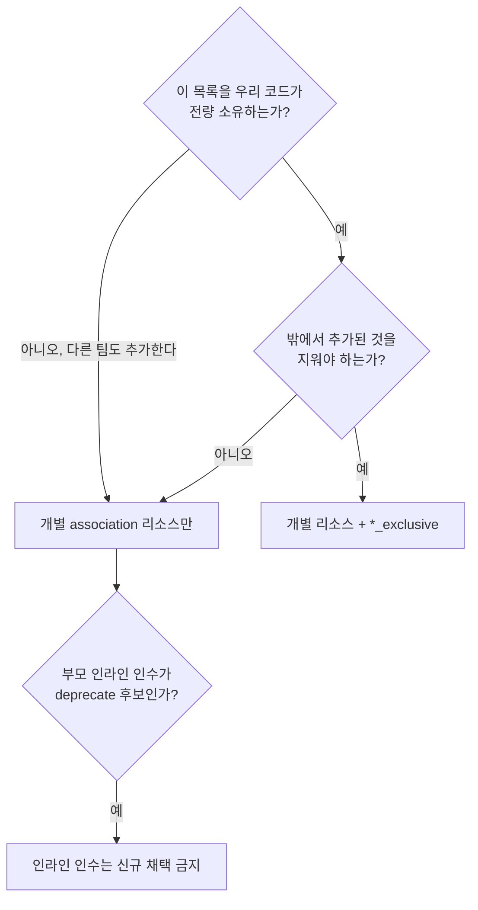

# 49장 — 설계 결정에서 배우기: 리소스 API는 어떻게 정해지나

**이 장에서 배우는 것**

- 설계 결정 로그가 무엇이고 왜 공개 문서로 유지되는지, 어떤 형식으로 쓰이는지 안다.
- 아홉 건의 실제 결정을 "무슨 문제였나 / 어떤 대안이 있었나 / 무엇으로 정해졌나 / 내 코드가 어떻게 달라지나"로 읽을 수 있다.
- provider를 관통하는 네 원칙과 그것들이 충돌할 때 어느 쪽이 이기는지 설명할 수 있다.
- 아직 없는 기능이 앞으로 어떤 모양의 리소스로 나올지 근거를 들어 예측할 수 있다.
- 기능 요청을 거절당하지 않는 모양으로 다듬고, 이미 결론이 난 요청을 알아볼 수 있다.
- 지금 쓰는 리소스가 왜 불편하게 생겼는지 이해하고 두 리소스 중 어느 쪽을 쓸지 결정할 수 있다.

**왜 중요한가**

팀에서 이런 대화가 반복된다. "왜 `aws_lb_target_group_attachment`는 타깃을 하나씩만 붙이지? `RegisterTargets` API는 목록을 받는데." 누군가 이슈를 열고, 몇 달 뒤 닫힌다. 다음 해에 다른 사람이 같은 이슈를 다시 연다. 논쟁이 반복되는 이유는 결론이 없어서가 아니라 **결론이 기록되지 않아서**다.

비용은 시간만이 아니다. 어떤 팀은 `aws_iam_role`의 `inline_policy`를 표준으로 정해 사내 모듈 수십 개에 박아 넣는다. 그 인수가 deprecate될 방향이라는 사실은 리소스 문서에 눈에 띄게 적혀 있지 않지만, 설계 결정 문서에는 그 인수를 공식적으로 deprecate하기 위해 대체재를 만든다고 2024년에 이미 적혀 있었다. 다른 팀은 새 리소스에 `id` 속성이 없는 걸 보고 버그로 판단해 이슈를 연다. 또 다른 팀은 `_exclusive` 리소스를 import해 기존 인프라를 흡수하려다 실패하고 이를 미구현 기능으로 오해한다. 셋 다 문서 한 페이지를 읽었으면 없었을 일이다.

진짜 이득은 과거 이해가 아니라 **예측력**이다. 원칙을 알면 "이 기능이 provider에 들어온다면 어떤 모양일까"를 상당히 정확히 맞힐 수 있다. 앞으로 나올 리소스 모양에 어긋나지 않는 사내 모듈 인터페이스를 지금 만들 수 있고, deprecate가 예고된 인수 위에 표준을 세우지 않을 수 있다.

## 설계 결정 로그란 무엇인가

`docs/design-decision-log.md`는 한 페이지짜리 색인이다. 문서가 스스로 목적을 밝힌다 — **유지보수자 팀이 무엇을 모범 사례로 보고 무엇을 설계 표준으로 권장·요구할지에 대한 결정들의 색인.** 단서가 둘 붙는다. **이 결정들은 반드시 고정된 것이 아니며 새 결정으로 대체될 수 있다.** 그리고 **내부 프로세스의 진화형으로, 커뮤니티와 코어 기여자의 피드백을 받기 위해 가능한 한 공개로 진행한다.** 즉 설계 결정은 레퍼런스가 아니라 **시점의 기록**이며, 독자에는 유지보수자만이 아니라 **기능 요청을 하려는 사람**이 포함된다.

| 결정 | 무엇에 관한 것인가 | 이슈 |
|---|---|---|
| Relationship Resource Design Standards | 관계 관리 리소스의 설계 표준 | #9901 |
| SecretsManager Secret Target Attachment | CloudFormation의 같은 기능을 재현할 수 있는가 | #9183 |
| RDS Blue Green Deployments | `aws_db_instance`의 기능을 클러스터로 확장할 수 있는가 | #28956 |
| Exclusive Relationship Management Resources | "배타적 관계 관리" 리소스의 용례와 역할 | #39203 |
| Standardize Use of the `id` Attribute | `id` 요구가 사라진 뒤의 사용 표준 | #37628 |
| `ExpectResourceAction` with disappears tests | 외부 삭제 테스트에서 plan 액션을 명시 검증 | N/A |
| Module-scoped User-Agents with `provider_meta` | `provider_meta` 지원과 AWSCC provider와의 정렬 | #45464 |
| Migration from `go-changelog` to Changie | CHANGELOG 생성 도구 이관 | N/A |
| Do Not Implement Import Support for Exclusive Resource Types | 배타 리소스가 import를 지원하지 않는 이유 | N/A |

색인에는 없지만 같은 디렉터리에 `resource-types-without-list.md`가 더 있다. 이슈 번호에서도 읽을 것이 있다. `#9183`과 `#9901`은 네 자리다 — 문서가 2022~2023년에 쓰였는데 요청은 훨씬 전에 올라왔다는 뜻이다. **오래 열려 있는 이슈는 잊힌 이슈가 아니라 결론 내리기 어려운 이슈일 때가 많고, 결론은 코드가 아니라 문서로 나오기도 한다.**

## 결정 문서의 형식과 읽는 순서

뼈대는 반복된다. **머리말**(`Summary`, `Created` 날짜, 있으면 `Author`·`Updated`) → **Background**(문제 서술, 대개 실측 조사) → **Proposal / Decision**(굵은 글씨 한 문장으로 압축된 결론) → **Abandoned Ideas**(버린 안) → **Consequences / Next Steps**(결정 이후의 할 일, **deprecate 예고**가 여기 적힌다).

읽는 순서는 뒤집는 편이 낫다. Decision으로 결론을 잡고, 내 코드에 영향이 있으면 Consequences를 읽고, 반박하고 싶어지면 그때 Abandoned Ideas를 읽는다. Background의 실측 표는 한 번 훑고 넘기되 **"개인 취향이 아니라 44개를 세어 본 결과"**라는 무게만 기억한다.

## (a) 관계 리소스 설계 표준 — 단수인가 복수인가

**문제.** AWS API는 부모-자식 관계를 붙이는 방식이 제각각이다. `AttachRolePolicy`처럼 하나씩 붙이는 단수 API가 있고 `RegisterTargets`, `AuthorizeSecurityGroupIngress`처럼 목록을 통째로 받는 복수 API가 있다. 문서는 이 선택이 **provider 설계 원칙 두 개의 정면 충돌**이라고 명시한다 — **리소스는 단일 API 객체를 표현해야 한다**와 **리소스·속성 스키마는 기반 API와 최대한 일치해야 한다.** 가장 작은 인프라 조각은 관계 하나인데 API는 목록을 받으니, 첫 원칙은 단수형을 둘째 원칙은 복수형을 지지한다.

**대안.** 문서는 논쟁 대신 **집계**를 택했다. 관계 리소스 44개를 표로 만들고 각각 AWS API와 Terraform 구현이 단수인지 복수인지를 기록했다(이름에 `rule`이 들어가는 리소스는 약 70개라 대표적인 시큐리티 그룹 규칙만 포함했고 전수는 아니다). 44개 중 **29개가 one-to-many**이고 그중 **17개는 AWS API가 복수**인데, 그 17개 중 **13개(76%)가 Terraform에서는 단수 구현**이다. 복수로 남은 4개 중 **2개는 배타 관리 의도**(`aws_security_group`의 ingress/egress), **1개는 API 구조상 단수 구현이 불가능**한 경우다. 해석은 명확하다 — **역사적으로 "단일 API 객체 표현"이 "API 스키마 일치"보다 우선해 왔다.**

**결정.** 신규 one-to-many 관계 리소스는 **단수형으로 구현**하고, 기존 리소스를 복수형으로 바꿔 달라는 요청은 기반 API가 제대로 동작하는 데 필요한 경우가 아니면 지양한다. 벗어나도 되는 것은 두 조건 중 하나일 때다 — (1) 단일 리소스가 모든 부모/자식 관계를 **배타적으로 관리**해야 할 정당한 용례가 있을 때, (2) 기반 API를 단수 관계로 다루는 것이 **불가능하거나 불필요한 복잡성**을 낳을 때.

**내 코드.** 반복은 리소스가 아니라 `for_each`가 담당한다.

```terraform
resource "aws_lb_target_group_attachment" "app" {
  for_each = toset(var.instance_ids)

  target_group_arn = aws_lb_target_group.app.arn
  target_id        = each.value
}
```

덤으로 **plan 해상도**(타깃 하나가 바뀌면 diff에 그 하나만 나온다)와 **작은 폭발 반경**(30개 중 3개가 실패해도 27개는 apply된다)을 얻는다. 대가는 자식이 수백 개일 때의 state 크기와 plan 시간이다([40장](40-performance-and-throttling.md)).

## (b) `*_exclusive` — 무엇을 대체하는가

**문제.** (a)의 표준대로 개별 리소스로 옮기면 **목록 전체의 소유권**을 잃는다. `aws_iam_role`의 `inline_policy`는 거기 없는 인라인 정책을 provider가 지울 수 있다는 성질을 갖는데 `aws_iam_role_policy`로 옮기면 그 성질이 사라진다. 문서는 이 결핍이 실제로 이관을 막았다고 적는다 — **커뮤니티는 배타 관리의 부재를 독립 리소스로 옮기지 않을 이유로 자주 들고**, 그 결과 **유지보수자들이 부모 리소스의 관계 설정 인수를 공식적으로 deprecate·제거하지 못했다.** 동시에 인수 기반 정의는 유지 비용이 크다 — **리소스 하나가 여러 원격 리소스의 생명주기를 관리하게 되고, 자식 하나의 생성이 실패하면 부분 프로비저닝 상태로 남을 수 있다.**

**대안.** 선례인 `aws_iam_policy_attachment`는 모델로 채택되지 않았다 — **책임 범위(role·user·group 부착을 동시 관리)가 이 제안보다 넓고, 여러 부모 타입에 붙을 수 있는 고객 관리형 IAM 정책의 특수성 때문에 널리 복제할 수 없다.** 이름 후보도 표로 남아 있다 — `_exclusive`(선택), `_management`, `_lock`, `_exclusive_lock`, `_exclusive_management`. 선정 이유는 **가장 간결해서**다. 사소해 보여도 이 표 덕에 "왜 `_lock`이 아니냐"에 다시 답할 필요가 없다.

**결정.** `_exclusive` 접미어 계열을 만든다. 역할은 **AWS의 관계를 Terraform 설정과 대조해 필요한 만큼 추가·제거하는 것**이고 갖춰야 할 성질은 넷이다 — (1) 부모 식별자를 담는 필수 인수, (2) 모든 자식 식별자를 담는 필수 인수(보통 `TypeSet`)이며 **빈 집합은 모든 관계를 제거**, (3) 현재 관계 상태를 읽고 추가·제거하는 능력, (4) 기존 관계의 배타 소유권을 **파괴적 동작 없이 상속**하는 능력. 설정에 추가하는 것이 destroy/re-create를 유발해서는 **안 된다**. 네 번째가 핵심이다 — 배타 리소스를 나중에 도입해도 트래픽이 끊기지 않는다는 보장이 여기서 나온다.

**내 코드.** 개별 리소스로 "무엇이 있어야 하는가"를, 배타 리소스로 "그 외에는 없어야 한다"를 쓴다.

```terraform
# 이 롤에 exampleInlinePolicy만 남긴다. 다른 인라인 정책은 apply에서 제거된다.
resource "aws_iam_role_policies_exclusive" "example" {
  role_name    = aws_iam_role.example.name
  policy_names = [aws_iam_role_policy.example.name]
}
```

그리고 **인라인 인수의 미래가 정해졌다.** 배타 리소스가 동등한 기능을 제공하므로 유지보수자가 그 인수를 deprecate하고 이관을 권고할 수 있다. 다만 **인기 있는 리소스이므로 "소프트" deprecate가 될 가능성이 크고, 제거는 여러 메이저 릴리스 뒤이거나 수작업을 줄여 줄 도구가 나온 뒤**가 된다. 그럼에도 소프트 deprecate는 **모범 사례를 권고할 근거**로 쓸모가 있다고 명시한다. deprecate 후보로 지목된 것은 `aws_iam_role`의 `inline_policy`·`managed_policy_arns`, `aws_instance`의 `security_groups`·`vpc_security_group_ids`, `aws_network_interface.security_groups`, `aws_security_group`의 `ingress`·`egress`이고 `aws_security_group_rule` 자체의 deprecate도 검토 대상이다. 사내 모듈 표준을 정한다면 이 목록이 곧 **"지금 새로 채택하면 안 되는 인수 목록"**이다([35장](35-relationship-resources.md)).

## (c) `id` 속성 표준화 — 필수가 아니게 된 뒤의 규칙

**문제.** provider의 모든 리소스는 읽기 전용 `id`를 가져 왔다. 이유는 설계가 아니라 **구현 세부**다 — Plugin SDK v2는 Terraform 1.0 이전을 대상으로 개발됐고 그때의 코어 구현 세부가 `id`의 존재를 요구했다. 흔적이 API에 남아 있다(`d.SetId("value")`가 `d.Set()`과 따로 있는 것, 외부 삭제를 read 중에 반영하는 `d.SetId("")`, 채워진 `id`에 의존하는 import 테스트 헬퍼). 부작용은 둘이다. 식별자가 사용자가 준 값일 때 `id`는 **다른 필수 인수를 그대로 복제**하고, 식별자가 양쪽 리소스를 이어 붙인 **다중 키**면 더 나쁘다 — 문서는 **다중 키가 일관된 구분자를 쓰지 않아 왔다**고 지적한다. 사용자 입장에서는 **어느 속성을 참조해야 하는지 모호**해진다.

**대안.** 먼저 전제를 확인했다. Plugin Framework의 `State.RemoveResource`는 ID를 언급하지 않고, `terraform-plugin-testing` v1.5.0에서 `TestStep`에 필드가 추가되어 `id` 없는 리소스의 import 테스트가 가능해졌다. 코어 쪽으로는 **0.12 이후 릴리스가 `id`를 특수 속성으로 취급하지 않으며** 0.11 이하만 암묵적으로 요구했고, 지원되는 SDK는 프로토콜 5·6만 말하므로 `hashicorp/aws`는 본질적으로 0.12 이상만 지원한다. 따라서 **제거는 안전하다.** 버려진 안은 "일관성을 위해 계속 요구한다"였다 — **역사적 일관성은 주지만 값 중복과 자주 불일치하는 다중 식별자 문제가 그대로 남으며**, **팀 합의는 명료성의 이득이 선례 이탈보다 크다**는 쪽이었다.

**결정.** **앞으로 `id`가 기존 인수와 중복되는 모든 신규 리소스는 이 속성을 생략한다.** 그 외에는 역사적 방식대로 쓴다. **식별자가 여러 인수의 조합일 때는 항상 쉼표(`,`)로 구분하고** import 메서드에서는 내부 함수 `ExpandResourceID`로 나눈다. 트레이드오프도 적혀 있다 — **`id`의 존재에 의존해 온 사람들에게는 변화**이고 **`plan`/`apply` 로그 줄에서 그 정보가 빠지는 사소한 UI 차이**가 생긴다. 이 표준이 성립하는 전제는 **모든 신규 리소스는 Plugin Framework로 구현해야 한다는 기존 정책**이다([42장](42-provider-architecture.md), [44장](44-implementing-a-resource.md)).

**내 코드.** 프로토타입 두 개가 문서에 명시되어 있다 — `aws_vpc_endpoint_private_dns`(식별자는 단일 값 `vpc_endpoint_id`), `aws_lambda_runtime_management_config`(필수 `function_name`과 선택 `qualifier`의 다중 키). 이런 리소스에서는 `id` 대신 인수 이름을 그대로 참조하고, import ID는 **신규 다중 키 리소스는 쉼표**, **기존 리소스는 각자의 역사적 구분자**(`/`, `:`, `_` 등)를 쓴다. "신규는 쉼표, 기존은 문서 확인"이 실무 규칙이다([20장](../level2-intermediate/20-import-and-resource-identity.md)).

```console
$ terraform import aws_lambda_runtime_management_config.example my-function,PROD
```

사내 모듈이 `output "id" { value = <리소스>.id }` 관습을 갖고 있으면 `id` 없는 리소스를 감쌀 때 깨지므로 출력 이름을 의미 있게 짓는 편이 안전하다. **`id`가 없는 것도, plan 출력에 `id` 줄이 없는 것도 버그가 아니다.**

## (d) 배타 리소스에는 import도 list도 없다

두 결정이 하나의 사슬로 이어진다.

**import 미지원.** 2026년 문서의 결정은 한 문장이다 — **AWS Provider는 배타 리소스 타입에 import 지원을 구현하지 않는다.** 이는 `_exclusive` 접미어를 가진 최신 리소스와 **같은 동작을 하는 옛 리소스 타입 모두**에 적용된다. 근거는 사용자 심리다. import는 보통 **기존 원격 객체를 Terraform 관리로 데려오는 방법**으로 이해되는데 배타 리소스는 단일 객체가 아니라 **관계 집합 전체**를 관리하므로, import는 기록만 하지 않고 **설정에 없는 관계를 추가·제거할 수 있는 모델에 사용자를 편입시킨다.** 위험은 이렇게 서술된다 — **사용자는 기존 인프라를 그저 채택했다고 생각하지만 다음 apply가 설정에 없는 관계를 제거할 수 있다.** 후속 지침도 붙는다. 기여자는 import를 추가하지 말아야 하고 **resource identity 작업을 import를 켜는 데 이용해서도 안 되며**, **`_exclusive` 접미어가 없는 옛 배타 리소스는 일반 attachment로 오해되지 않도록 문서에 명확히 적어야 한다.**

**list 미지원.** `resource-types-without-list.md`는 반대편에서 시작한다. **List Resource의 주된 용례 하나가 원격 리소스를 열거해 import하는 것**이므로 **일반적으로 리소스 타입에는 대응하는 List Resource가 있어야 한다.** 리전·계정에 하나뿐인 싱글턴도 포함이다([37장](37-list-resources-and-query.md)). 예외는 세 패턴이다.

- **복합 권한 부여(composite grant) 리소스** — 단일 권한 부여 요청을 모델링하지만 AWS API는 결과를 정규화해 저장·반환한다. 개별 grant마다 안정적 식별자가 없어 원래 입력과 대조해야만 식별할 수 있고, AWS가 셀렉터를 정규화할 수 있어(`Table` grant를 `TableWithColumns`로 반환하거나 그 반대) 입력 없이 Terraform 모양의 state를 재구성하는 것이 모호하며, 반환된 grant가 관리자 유래의 암묵적 레코드와 사용자가 만든 명시적 레코드를 **구분 불가능하게 섞어** 놓는다. 그래서 import 불가, resource identity 스키마 없음, List 불가다. 해당 타입은 `aws_lakeformation_permissions`.
- **배타 리소스** — import가 안 되니 List도 없다. 대안도 함께 적혀 있다 — **표준(비배타) 리소스 타입의 List로 열거하고 import하면 된다.** 예시 타입은 `aws_iam_policy_attachment`.
- **Waiter 리소스** — 연관 리소스와 1:1 또는 1:[0,1] 관계라 속성 엔터티처럼 보이지만 **provider가 다단계 과정을 수행하고 완료를 기다리거나 의존성을 준비하기 위해서만 존재한다.** 대응하는 원격 리소스가 없으니 List할 것도 import할 것도 없다. 해당 타입은 `aws_acm_certificate_validation`.

다만 **제외는 현재 리소스 타입과 그것이 감싸는 API를 반영한 것이며, 재설계된 후속 리소스는 미래에 List 후보가 될 수 있다.**

**내 코드.** 배타 리소스를 기존 인프라에 도입할 때는 **import가 아니라 (b)의 네 번째 성질, 무해한 상속에 의존한다** — 설정에 추가하고 plan에서 제거 예정 목록을 확인한 뒤 apply한다. `terraform query`로 인프라를 훑을 때 배타·waiter·복합 grant 타입이 **결과에 안 나오는 것은 정상**이다.

## (e) RDS Blue/Green — 왜 클러스터로 확장되지 않는가

**문제와 충돌.** provider는 `aws_db_instance`에서 RDS Blue/Green 배포를 지원하고, 이를 `aws_rds_cluster`로 확장해 달라는 요청이 흔했다. 문서는 이유를 리소스 모델에서 찾는다 — **Terraform은 각 리소스를 다른 객체와 상호작용하지 않고 생성·수정·삭제할 수 있는 지속적이고 자기완결적인 객체로 취급한다.** 그런데 RDS Blue/Green은 **임시 orchestration 객체**로 구현되며 그 객체가 구·신 인스턴스 양쪽과 데이터 동기화, 전환, 구 인스턴스 삭제까지 관리한다.

- **`aws_db_instance`** — 단일 자기완결 객체이므로 모델 안에서 쓸 수 있다. `blue_green_update.enabled`를 설정하면 provider가 **내부적으로** Blue/Green을 써서 업데이트한다. 값어치는 다운타임이다 — 백킹 EC2 인스턴스 타입이나 엔진 버전을 제자리에서 바꾸면 **15분 이상**의 다운타임이 생길 수 있는데 AWS 문서 기준 **전환은 대개 1분 미만**이다. 업데이트는 `apply` 한 번에 일어나고 **Blue/Green 객체는 구현 세부이므로 노출되지 않는다.**
- **리플리카** — 소스와 리플리카가 각각 리소스다. **여러 리소스가 관여하므로 하나의 단위로 취급할 수 없어** 쓸 수 없다.
- **`aws_rds_cluster`** — 이 타입은 Aurora 클러스터와 전통 엔진의 multi-AZ 클러스터를 모두 모델링한다. multi-AZ는 현재 Blue/Green이 지원되지 않으며 지원되더라도 **이미 개별 인스턴스의 롤링 업데이트를 하므로 이득이 없을 수 있다.** Aurora는 Blue/Green을 지원하지만 **AWS API도 provider도 Aurora 클러스터를 자기완결 객체로 다루지 않는다** — 클러스터는 `aws_rds_cluster` 하나와 하나 이상의 `aws_rds_cluster_instance`로 구성된다.

**버려진 대안.** `aws_rds_blue_green_deployment` 같은 독립 리소스를 썼을 때의 단계를 문서가 끝까지 적어 보여 준다 — 리소스 추가 → apply(그린 생성 대기) → 그린용 `aws_db_instance` 추가 → import → apply(그린 수정) → `switch_over = true`로 편집 → apply(전환) → **전환으로 `example-db-green`이 `example-db`가 되고 원본이 `example-db-old`가 되므로** 설정 재편집 → old 인스턴스 import → 리소스 제거 → apply. 결론은 **"설정 편집·apply·import를 여러 번 반복해야 하며 Terraform에 잘 맞지 않는다"**이다.

**내 코드.** Aurora에서 무중단에 가까운 엔진 업그레이드를 원한다면 provider를 기다리지 말고 **절차를 설계해야 한다.** 전환은 Terraform 밖(콘솔·CLI·런북)에서 수행하고 결과를 state에 반영하는 형태가 되며, 그 반영은 결국 import와 state 조작이다([22장](../level2-intermediate/22-moved-removed-refactoring.md)). 단일 `aws_db_instance`라면 `blue_green_update`가 실제 답이다([31장](../level2-intermediate/31-databases-rds-dynamodb.md)). 더 일반적인 교훈은 이것이다 — **여러 리소스에 걸친 오케스트레이션은 Terraform 리소스로 표현되지 않는다.**

## (f) Secrets Manager secret target attachment — 만들지 않기로 한 결정

**문제.** CloudFormation에는 기존 시크릿에 RDS·Redshift 접속 정보를 보충해 주는 `AWS::SecretsManager::SecretTargetAttachment`가 있고, Terraform에도 같은 것을 달라는 우선순위 이슈가 있었다. 조사 결과가 결정적이었다 — **이 기능에는 API 등가물이 없으며 AWS 서비스들을 가로지르는 오케스트레이션 작업으로 동작하는 것으로 보인다.** 공개 API가 없으므로 **provider가 이 워크플로 위에 제대로 된 Terraform 생명주기 처리를 구현하기 어렵다.**

**대안.** 문서는 "안 된다"로 끝내지 않고 기존 리소스로 재현하는 두 경로를 제시한다. **경로 1(수동 시크릿)** — DB를 랜덤 패스워드로 만들고 빈 시크릿을 같이 만든 뒤, DB 생성이 끝나면 `aws_secretsmanager_secret_version`에 `jsonencode`로 engine·host·username·password·dbname·port를 써 넣는다. 제약이 딸린다 — **수동 생성 시크릿은 로테이션을 실행하는 Lambda 함수를 직접 유지해야 한다.** `RotateSecret` API가 수동 시크릿에 대해 `LambdaFunctionArn`을 요구하기 때문이다(관리형 시크릿에서만 생략 가능하다). **경로 2(관리형 시크릿)** — `aws_db_instance`에 `manage_master_user_password = true`를 주면 RDS가 관리형 시크릿을 만든다. 한계는 분명하다 — **이 시크릿은 RDS가 관리하므로 값에 보충 접속 정보를 넣도록 수정할 수 없고**, 문서는 **공개 문서화된 API로는 구현할 방법이 현재 없다**고 적으며 정말 필요하면 **`tags`로 붙이는 대안**을 제시한다.

**결정.** **현재 API로는 그 워크플로를 구현할 경로가 없고**, 기존 리소스가 핵심 용례를 덮으므로 **이슈를 닫는다.** 다만 Consequences는 "아무 작업도 하지 않는다"로 시작하면서도 **조사 과정에서 다른 개선점이 드러났다**고 적고, 실제로 두 건이 구현됐다 — `aws_secretsmanager_secret_rotation`이 관리형 시크릿의 로테이션 수정을 못 하던 문제, `aws_redshift_cluster`가 마스터 패스워드 관리를 지원하지 않던 문제. **거절된 기능 요청이 인접한 두 개의 실제 개선을 낳았다.** 기능 요청에 "무엇을 달라"보다 **"어떤 워크플로가 막혀 있다"**를 쓰는 편이 나은 이유가 여기 있다.

**내 코드.** 판단이 하나로 정리된다 — **시크릿 값을 내가 조립할 것인가, AWS에 맡길 것인가.** 둘을 섞으려는 시도는 API 수준에서 막혀 있다([26장](../level2-intermediate/26-secrets-and-ephemeral.md)).

## (g) 프로세스에 대한 결정 둘: disappears 테스트와 changie

앞의 결정들이 사용자에게 보이는 API에 관한 것이었다면 이 둘은 **품질과 릴리스 프로세스**에 관한 결정이고, 사용자에게 간접적으로 닿는다.

**disappears 테스트와 `ExpectResourceAction`.** provider의 리소스는 대개 "disappears" 인수 테스트를 갖는다. 목적은 **Read가 리소스를 찾을 수 없음을 올바르게 감지하고 state에서 제거하는지 보장하는 것**이다. 검사 단계에서 `acctest.CheckResourceDisappears` 헬퍼로 삭제를 의도적으로 유발하므로 **비어 있지 않은 plan을 기대한다**는 점이 특이하고, 그래서 `ExpectNonEmptyPlan: true`를 쓴다. 문제는 그 단언이 느슨하다는 것이다 — **`ExpectNonEmptyPlan`은 외부 삭제를 감지하지 못하는 사태는 막아 주지만 무엇이 계획됐는지는 명시적으로 검증하지 않는다.** `terraform-plugin-testing` v1.2.0에 `plancheck` 패키지와 `ExpectResourceAction` 내장 체크가 들어오면서 결정이 내려졌다 — **기여자 가이드와 `skaff`를 갱신해, 사라진 리소스가 생성으로 계획되는지 검증하는 post-apply·post-refresh 플랜 체크를 포함시킨다.**

```go
ExpectNonEmptyPlan: true,
ConfigPlanChecks: resource.ConfigPlanChecks{
	PostApplyPostRefresh: []plancheck.PlanCheck{
		plancheck.ExpectResourceAction(resourceName, plancheck.ResourceActionCreate),
	},
},
```

체크가 변수 참조 하나(`resourceName`)만 쓰고 그것이 표준 관례이므로 **기존 disappears 테스트에도 자동 추가하는 방법을 모색해야 한다**는 후속 작업이 적혀 있다. 기여자가 아니어도 얻는 것이 있다 — **"AWS에서 밖으로 지워진 리소스는 다음 plan에서 create로 나타나야 한다"가 provider가 테스트로 보증하는 계약**이라는 사실이다. update나 no-op으로 나온다면 정상이 아니라 신고 대상이다([36장](36-drift-refresh-and-checks.md), [47장](47-testing.md)).

**`go-changelog`에서 changie로.** 기여자가 `.changelog/`에 텍스트 조각을 만들고 릴리스 때 수동으로 합치는 방식이었다. 한계는 다섯으로 정리되어 있다 — **수동 프로세스**, **자유 형식 텍스트로 인한 형식 불일치**, **분류·구조화 정보 추출의 어려움**, **머지 전 검증의 한계**, **GitHub Actions에서 Bash 스크립트에 의존**(GitHub가 일반적으로 권장하지 않는 방식). 결정은 changie로의 이관이다. 항목은 `kind`·`time`·`Impact`·`Body`·`PullRequest`를 갖는 YAML이 되고 유형은 다섯으로 설정된다 — **Breaking Change**(하위 호환을 깨는 변경), **Note**(deprecation·제거 같은 중요 공지), **Feature**(새 리소스·데이터 소스·ephemeral 리소스·함수·list 리소스·action), **Enhancement**(새 속성·인수), **Bug**(잘못된 동작). 디렉터리는 메이저 버전별로 나뉘고(`.changes/6.x/unreleased/`, `beta/`, `ga/`, 버전별 CHANGELOG), GitHub Actions가 넷을 검증한다 — **항목이 필요한 PR인지**(`no-changelog-needed` 라벨이 없는 한), **생성기가 덮어쓸 메인 CHANGELOG를 직접 수정하지 않았는지**, **레거시 조각이 섞였는지**, **`PullRequest` 키가 있는지**. 이관은 4단계로 점진 진행되고 마지막에 **기존 조각 약 440개를 제거**한다.

사용자에게 달라지는 것은 **릴리스 노트를 읽는 방식**이다 — 다섯 유형 분류 덕에 업그레이드 검토 때 **Breaking Change와 Note만 먼저 훑는 읽기**가 가능해진다. 메이저 릴리스가 beta → GA 흐름을 갖고 릴리스 브랜치에서 beta·GA CHANGELOG가 따로 유지되다 `main` 병합 시 하나로 통합된다는 사실은 **베타를 미리 시험할 계획의 근거**가 된다([39장](39-version-upgrades.md), [48장](48-contributing.md)).

## 관통하는 원칙 네 가지, 그리고 충돌할 때

아홉 건에서 같은 문장이 반복된다.

- **원칙 1 — 리소스 하나는 API 객체 하나를 표현한다.** 관계 리소스 표준의 근거이자 RDS Blue/Green을 클러스터로 확장할 수 없다는 판정의 근거다.
- **원칙 2 — 스키마는 기반 API를 따른다.** 인수 이름과 구조를 AWS API에 맞추면 사용자가 AWS 문서를 그대로 쓸 수 있다.
- **원칙 3 — 예측 가능성이 편의보다 우선한다.** `id` 결정이 대표다. 값 하나를 두 곳에서 읽는 편의보다 "식별자는 한 군데에만 있다"는 명료성을 택했다. 배타 리소스의 import 미지원도 같은 계열이다.
- **원칙 4 — 파괴적 변경은 메이저 릴리스에만.** `docs/breaking-changes.md`가 정의를 못 박는다. **파괴적 변경은 기존 배포를 유지하기 위해 사용자가 유효했던 설정을 고쳐야 하는 모든 변경**이고 **메이저 버전 안에서는 허용되지 않는다.** 속성 제거, 이전 이름을 지원하지 않는 이름 변경, Optional을 Required로 바꾸기, Computed 제거, 검증을 더 엄격하게 만들기, 기본값 변경, 마이너 업그레이드에서 예기치 않은 diff를 만드는 모든 변경이 여기 속하며 **제거 전에 deprecate**한다.

부딪히면 어떻게 되는가. 세 사례가 답을 준다.

**1과 2가 충돌할 때 — 1이 이긴다.** 복수 API를 단수 리소스로 감싸는 것은 원칙 2의 위반이지만 44개 중 76%가 그러고 있었고 표준은 그 관행을 승인했다. 다만 **1이 이기지 못하는 예외 두 개**가 명시되어 있다 — 배타 관리라는 정당한 용례, 그리고 단수 취급의 불가능성·과도한 복잡성.

**3과 4가 충돌할 때 — 4가 시간을 사서 3을 지킨다.** `inline_policy`를 지금 없애는 것은 명료성(3)에 맞지만 파괴적 변경(4)이다. 해법은 **대체재를 먼저 만들고**, **소프트 deprecate로 방향만 선언하고**, 제거를 여러 메이저 뒤로 미루는 것이었다. 4는 3을 포기시키는 게 아니라 **이행 경로를 강제**한다.

**1과 3이 충돌할 때 — 3이 이기되 4와 부딪히지 않게 우회한다.** `id` 표준은 형식적 일관성보다 중복이 만드는 혼란 쪽을 무겁게 봤고, **신규 리소스에만 적용**해 기존 리소스는 건드리지 않았다. 이 "신규에만 적용" 패턴은 결정 문서에서 반복적으로 나타나는 해법이다.

마지막으로 원칙보다 위에 있는 것이 하나 있다. **공개 API가 없으면 아무것도 못 한다.** Secrets Manager 결정이 그것이고 이 제약은 어떤 원칙보다도 강하다.

## 이 지식을 어디에 쓰는가

**새 리소스의 모양을 예측한다.** 어떤 서비스가 새 관계 API를 냈을 때 provider가 어떻게 감쌀지 상당한 확률로 맞힐 수 있다 — 복수 API여도 단수 리소스일 가능성이 높고, 이름은 `attachment`/`assignment`/`registration` 계열이며, 식별자가 두 리소스의 조합이면 `id` 없이 인수 두 개를 갖고 import ID는 쉼표 구분일 것이다. 사내 모듈 인터페이스를 이 예측에 맞춰 두면 리소스가 실제로 나왔을 때의 변경이 작다.

**기능 요청을 원칙에 맞게 제안한다.** 거절되는 요청과 받아들여지는 요청의 차이는 대개 형태다.

| 잘 통하지 않는 요청 | 대개 더 나은 요청 |
|---|---|
| "이 attachment가 목록을 받게 해 달라" | "이 관계를 배타 관리할 `*_exclusive`가 필요하다. 용례는 …" |
| "CloudFormation의 X와 같은 것을 만들어 달라" | "이 워크플로가 막혀 있다. 대응 공개 API는 A와 B다" |
| "여러 리소스를 한 번에 오케스트레이션해 달라" | "이 단일 객체의 업데이트를 무중단으로 하고 싶다" |
| "이 배타 리소스에 import를 붙여 달라" | "무해한 상속 동작을 문서에 명확히 해 달라" |

요청서에 **AWS API 오퍼레이션 이름과 그것이 단수인지 복수인지**를 쓰면 논의가 몇 왕복 짧아진다. 그리고 `aws_lb_target_group_attachment`가 하나씩만 받는 것은 결함이 아니라 표준이므로 **우회는 `for_each`이지 이슈 제기가 아니다.**

**두 리소스 중 어느 쪽을 쓸지 고른다.** 판단 기준은 문법이 아니라 **소유권**이다.



## 흔한 실수

### ❌ 신규 리소스에 `id`가 있다고 가정하고 모듈 출력을 만든다

`id` 표준 이후 신규 리소스는 `id`가 없을 수 있다. 사내 모듈이 `id` 관습에 묶여 있으면 그런 리소스를 감쌀 때 깨진다.

```terraform
output "id" {
  value = aws_vpc_endpoint_private_dns.this.id
}
```

```terraform
# ✅ 식별자 역할을 하는 인수를 그대로 노출한다
output "vpc_endpoint_id" {
  value = aws_vpc_endpoint_private_dns.this.vpc_endpoint_id
}
```

### ❌ 배타 리소스를 import해서 기존 인프라를 흡수하려 한다

배타 리소스의 import 미지원은 미구현이 아니라 의도적 배제다. 기다리거나 우회 스크립트를 만들 이유가 없다.

```console
$ terraform import aws_iam_role_policies_exclusive.example exampleRole
```

```terraform
# ✅ 설정에 추가하기만 하면 배타 소유권을 무해하게 상속한다.
#    apply 전에 plan에서 "제거될 관계"를 반드시 확인한다.
resource "aws_iam_role_policies_exclusive" "example" {
  role_name    = aws_iam_role.example.name
  policy_names = [aws_iam_role_policy.example.name]
}
```

### ❌ 복수 API를 봤으니 provider도 목록을 받을 거라 믿는다

`RegisterTargets`가 목록을 받으니 리소스도 그러리라 기대하고 모듈을 설계하면 인터페이스를 다시 만들어야 한다.

```terraform
# 존재하지 않는 인수를 가정한 설계
# resource "aws_lb_target_group_attachment" "app" {
#   target_ids = var.instance_ids
# }
```

```terraform
# ✅ 반복은 for_each가 담당한다
resource "aws_lb_target_group_attachment" "app" {
  for_each = toset(var.instance_ids)

  target_group_arn = aws_lb_target_group.app.arn
  target_id        = each.value
}
```

### ❌ deprecate 예고된 인수 위에 사내 표준을 세운다

`inline_policy`, `managed_policy_arns`, `aws_security_group`의 `ingress`/`egress` 같은 인수는 대체재가 준비되면서 deprecate 방향이 문서에 적혀 있다. 모듈 수십 개에 박아 넣은 뒤 알게 되면 이관 비용이 그만큼 커진다.

```terraform
resource "aws_iam_role" "example" {
  name = "exampleRole"

  inline_policy {
    name   = "app"
    policy = data.aws_iam_policy_document.app.json
  }
}
```

```terraform
# ✅ 독립 리소스로 쓰고, 배타 소유가 필요하면 *_exclusive를 얹는다
resource "aws_iam_role_policy" "app" {
  name   = "app"
  role   = aws_iam_role.example.id
  policy = data.aws_iam_policy_document.app.json
}
```

## 프로덕션 노트

- **결정 문서에는 날짜가 있고 그게 유효기간의 힌트다.** 관계 리소스 표준은 2022년, 배타 리소스는 2024년, disappears는 2025년, import 미지원은 2026년 문서다. 로그 자체가 결정이 대체될 수 있다고 밝히므로 사내 표준에 인용할 때는 **결정 이름과 날짜를 함께** 적는다.
- **"deprecate 후보" 목록을 사내 린트 규칙으로 옮긴다.** 신규 코드에서 `inline_policy`·`managed_policy_arns`·`vpc_security_group_ids`·`ingress`/`egress`를 쓰면 경고하는 규칙 하나가 몇 년 뒤의 대규모 이관을 예방한다([38장](38-large-scale-structure-cicd.md)).
- **배타 리소스 도입은 사람이 plan을 읽고 진행한다.** 무해한 상속은 "관계가 재생성되지 않는다"는 보장이지 "아무것도 지워지지 않는다"는 보장이 아니다. 첫 도입 apply는 자동 승인이 아니라 수동 승인으로 돌린다.
- **`id` 없는 리소스는 상태 조회 스크립트를 깨뜨릴 수 있다.** `terraform show -json`을 파싱해 `values.id`를 읽는 자체 도구가 있다면 신규 리소스에서 null이 나온다. 파싱은 **리소스 주소**를 키로 삼도록 고친다.
- **CloudFormation에 있는 기능이 Terraform에 없다면 API 유무부터 확인한다.** AWS API 레퍼런스에 대응 오퍼레이션이 없으면 provider 구현을 기다리는 계획은 세우지 않는다.
- **Blue/Green이 필요한 Aurora 업그레이드는 Terraform 밖 절차로 문서화한다.** 전환 후 리소스 이름이 바뀌므로 state 재정렬이 따라온다. 프로덕션에서 처음 해 보는 일이 되지 않게 스테이징에서 한 번 돌려 둔다.
- **릴리스 노트는 유형별로 읽는다.** changie 이관 이후 항목은 Breaking Change · Note · Feature · Enhancement · Bug로 분류된다. 업그레이드 검토는 앞의 둘만 먼저 훑는다.

## 연습문제

1. 사내에서 쓰는 관계 리소스 세 개(예: `aws_lb_target_group_attachment`, `aws_iam_role_policy_attachment`, `aws_autoscaling_attachment`)에 대해 "AWS API가 단수인가 복수인가 / Terraform 구현이 단수인가 복수인가 / 배타적인가"를 표로 만들고, 각각을 우리 코드가 어떤 소유권 모델로 쓰는지 한 줄씩 적는다.
   *성공 기준:* 세 리소스 각각에 AWS API 오퍼레이션 이름을 명시했고, 배타 여부와 우리 코드의 소유권 모델이 어긋나는 항목을 하나 이상 찾아냈거나 전부 일치함을 근거와 함께 보였다.

2. 사내 코드 전체에서 deprecate 후보 인수 사용 건수를 세고, 각각을 독립 리소스로 옮길 때의 난이도를 상/중/하로 분류한 한 페이지짜리 이관 계획서를 만든다.
   *성공 기준:* 인수별 사용 건수와 영향받는 모듈 목록이 있고, "상" 등급 항목에 왜 어려운지 구체적 사유가 적혀 있다.

3. 스테이징 계정에서 IAM 롤 하나에 인라인 정책 두 개를 붙인 뒤, 그중 하나만 코드에 정의하고 `aws_iam_role_policies_exclusive`를 추가해 `terraform plan`을 실행한다.
   *성공 기준:* 코드에 없는 정책이 apply에서 제거됨을 확인했고, 배타 리소스 추가가 기존 정책의 destroy/re-create를 유발하지 않았음을 plan 출력으로 증명했다.

4. 팀이 필요로 하지만 provider에 없는 기능 하나를 골라 결정 문서 형식(Summary / Background / Proposal / Abandoned Ideas / Consequences)으로 한 페이지 제안서를 쓴다. Background에는 대응 AWS API 오퍼레이션 이름과 단수·복수 여부를 반드시 포함한다.
   *성공 기준:* 제안한 리소스 모양이 관계 리소스 표준과 `id` 표준에 어긋나지 않으며, "여러 리소스를 오케스트레이션해야 하는가"에 대한 자체 판정이 들어 있다.

## 요약

- 설계 결정 로그는 유지보수자 팀의 모범 사례·설계 표준 결정을 모은 공개 색인이다. 결정은 고정된 것이 아니며 새 결정으로 대체될 수 있고, 외부 피드백을 받기 위해 공개로 진행된다. 뼈대는 Summary·날짜 → Background → Decision → Abandoned Ideas → Consequences다.
- 관계 리소스 표준: 44개 조사에서 복수 AWS API를 가진 17개 중 13개(76%)가 단수 구현이었다. **신규 one-to-many 관계 리소스는 단수형**이 원칙이고, 예외는 배타 관리의 정당한 용례이거나 단수 취급이 불가능·과도하게 복잡할 때다.
- `*_exclusive`는 관계 집합의 배타 소유를 선언적으로 표현한다. 빈 집합은 모든 관계를 제거하고, 도입 시 destroy/re-create 없이 소유권을 상속해야 한다. 이름은 `_management`·`_lock` 등을 제치고 간결성 때문에 선정됐다.
- `id` 표준: SDK v2의 구현 세부가 만든 요구였고 Plugin Framework와 `terraform-plugin-testing`으로 해소됐다. **신규 리소스에서 `id`가 기존 인수와 중복되면 생략**하고 다중 키는 **쉼표로 구분**하며 `ExpandResourceID`로 나눈다. 기존 리소스는 그대로다.
- 배타 리소스는 **import를 지원하지 않는다** — import가 "그냥 채택했다"는 오해를 낳고 다음 apply에서 관계가 제거될 수 있기 때문이다. 따라서 **List Resource도 없다**. List가 없는 다른 두 패턴은 복합 권한 부여 리소스(`aws_lakeformation_permissions`)와 waiter 리소스(`aws_acm_certificate_validation`)다.
- RDS Blue/Green은 `aws_db_instance`의 `blue_green_update.enabled`로만 지원된다. 리플리카와 Aurora 클러스터는 **여러 리소스로 구성되어 단일 객체가 아니므로** 확장되지 않고, 독립 Blue/Green 리소스는 편집·apply·import를 여러 번 반복해야 해 Terraform에 맞지 않는다.
- Secrets Manager `SecretTargetAttachment`는 **공개 API 등가물이 없어** 구현하지 않기로 했다. 대안은 수동 시크릿에 접속 정보를 직접 쓰는 경로(로테이션 Lambda 직접 유지)와 `manage_master_user_password = true`로 위임하는 경로(값 수정 불가)다.
- 프로세스 결정 둘: disappears 테스트는 `plancheck.ExpectResourceAction`으로 "외부 삭제 후 create로 계획됨"을 명시 검증하고, changelog는 changie로 이관되어 항목이 Breaking Change·Note·Feature·Enhancement·Bug로 분류된다.
- 관통 원칙은 넷이다 — 리소스 하나 = API 객체 하나, 스키마는 API를 따른다, 예측 가능성이 편의보다 우선, 파괴적 변경은 메이저에만. 충돌 시 1이 2를 이기고, 3이 형식적 일관성을 이기며, 4는 **대체재 → 소프트 deprecate → 장기 제거**라는 이행 경로를 강제한다. 그 위에 "공개 API가 없으면 못 한다"는 제약이 있다.

## 다음으로

- [50장 — 프로덕션 운영 종합: 가드레일 · 표준 · 비용 · 보안](50-production-operations.md) — 이 원칙들을 조직의 운영 규칙으로 옮기기.
- [35장 — 관계 리소스와 `*_exclusive`](35-relationship-resources.md) — (a)(b)(d) 결정이 실제 코드에서 어떻게 드러나는지.
- [48장 — 기여 프로세스](48-contributing.md) — 결정에 영향을 주는 경로: 이슈·PR·changelog.
- [37장 — List Resource와 `terraform query`](37-list-resources-and-query.md) — List가 지원되지 않는 타입들의 배경.
- 공식 문서: [Design Decision Log](https://hashicorp.github.io/terraform-provider-aws/design-decision-log/)
